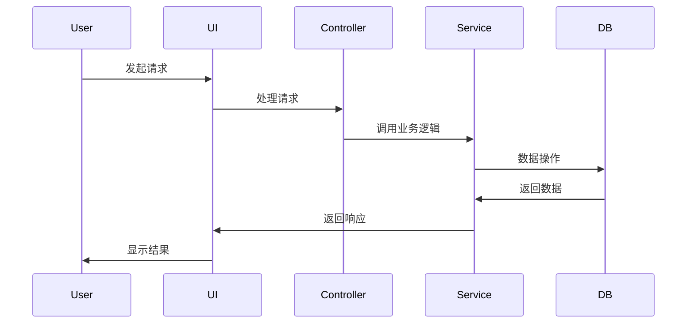
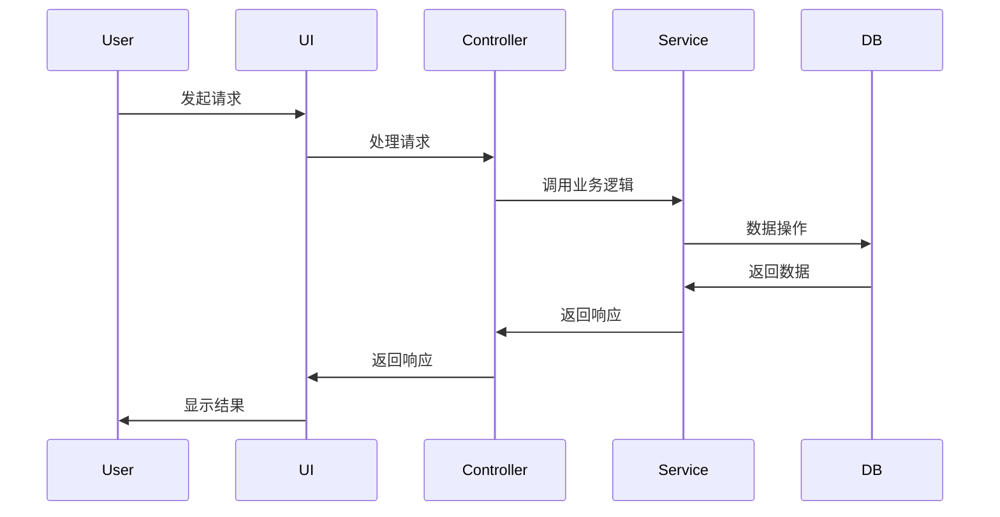

                 

## 文章标题

### 关键词

智能企业资源调度系统、实时优化、预测性分配、算法原理、系统架构、项目实战

### 摘要

本文将深入探讨智能企业资源调度系统的构建，重点关注实时优化与预测性分配的算法原理。我们将通过详细的案例分析，阐述系统架构设计的关键要素，并提出实际应用中的最佳实践经验。本文旨在为读者提供系统且实用的指导，帮助企业在资源调度方面实现智能化。

---

### 目录

1. **背景介绍**
    1.1 智能企业资源调度系统的背景
    1.2 问题与解决
    1.3 系统的边界与外延
2. **核心概念与联系**
    2.1 资源调度原理
    2.2 实时优化算法
    2.3 预测性分配算法
    2.4 ER实体关系图架构
3. **算法原理讲解**
    3.1 实时优化算法概述
    3.2 算法原理详细讲解
    3.3 数学模型与公式
    3.4 举例说明
4. **系统分析与架构设计**
    4.1 问题场景介绍
    4.2 系统功能设计
    4.3 系统架构设计
    4.4 系统接口设计
    4.5 系统交互
5. **项目实战**
    5.1 环境安装
    5.2 系统核心实现
    5.3 实际案例分析
    5.4 项目小结
6. **最佳实践与总结**
    6.1 最佳实践经验
    6.2 小结
    6.3 注意事项
    6.4 拓展阅读

---

### 第一部分：背景介绍

#### 1.1 智能企业资源调度系统的背景

在现代企业运营中，资源调度问题愈发复杂。企业需要高效地管理资源，以应对不断变化的市场需求和业务规模。智能企业资源调度系统应运而生，它利用先进的人工智能技术和大数据分析，实现对企业各类资源的实时优化和预测性分配。

**问题背景**：传统的资源调度方法通常依赖于经验和规则，难以应对动态变化的业务需求。企业资源（如人力、设备、资金等）的浪费和管理不当，导致生产效率低下，成本增加。

**问题描述**：如何构建一个智能企业资源调度系统，实现资源的实时优化和预测性分配，提高企业生产效率和资源利用率。

**解决方法**：通过引入人工智能技术，特别是机器学习和预测算法，构建智能企业资源调度系统。该系统可以实时收集和处理大量数据，自动进行资源优化和预测，从而降低运营成本，提高生产效率。

**系统的边界与外延**：系统的边界包括企业的各类资源（人力、设备、资金等）以及相关的业务流程。系统的外延则包括与外部系统的集成，如供应链管理、客户关系管理（CRM）系统等。

---

#### 1.2 核心概念与联系

为了深入理解智能企业资源调度系统的构建，我们需要首先了解其中的核心概念及其相互联系。

**资源调度原理**：资源调度是指对企业资源进行合理配置和分配的过程。它包括资源的获取、使用和回收三个环节。智能企业资源调度系统通过实时数据分析和优化算法，自动调整资源分配，以实现最佳效果。

**实时优化算法**：实时优化算法是一种动态调整资源分配的方法。它基于实时数据，快速计算出资源的最优分配方案，并立即执行。这种算法通常使用启发式算法和机器学习技术，以提高调度的效率和准确性。

**预测性分配算法**：预测性分配算法通过分析历史数据和当前环境，预测未来的资源需求和分配情况。它可以帮助企业提前做好准备，避免资源短缺或浪费。

**ER实体关系图架构**：ER图是企业资源调度系统数据模型的重要组成部分。它描述了系统中的实体（如资源、任务、流程等）以及它们之间的关系。通过ER图，我们可以更清晰地理解系统的数据结构和功能模块。

---

在下一部分中，我们将进一步探讨智能企业资源调度系统的核心概念与联系，并通过具体的算法原理讲解，帮助读者深入理解系统的构建过程。敬请期待！

---

### 第二部分：核心概念与联系

#### 2.1 资源调度原理

资源调度原理是构建智能企业资源调度系统的核心。它涉及资源的获取、使用和回收三个环节。以下是对这些环节的详细解释：

**资源的获取**：资源的获取是指企业从外部或内部获取所需的资源。这些资源可以是人力、设备、资金、原材料等。获取资源的渠道包括采购、租赁、内部调配等。

**资源的使用**：资源的使用是指将获取到的资源投入到实际业务中，以实现企业的生产目标。资源的使用过程需要考虑资源的效率、成本和效果等因素。智能企业资源调度系统通过实时数据分析和优化算法，动态调整资源的使用情况，以提高生产效率和资源利用率。

**资源的回收**：资源的回收是指将使用过的资源进行回收、再利用或处置。回收资源不仅可以降低企业的运营成本，还可以减少资源浪费，符合可持续发展的要求。智能企业资源调度系统通过预测性分配算法，提前规划资源的回收和再利用，从而最大化资源价值。

**资源调度原理在实际应用中的优势**：

- **提高资源利用率**：通过实时数据分析和优化算法，智能企业资源调度系统可以动态调整资源的分配，避免资源浪费。
- **降低运营成本**：智能调度系统通过降低资源浪费和优化资源使用，有助于降低企业的运营成本。
- **提高生产效率**：资源的合理分配和利用，可以提高生产效率，缩短生产周期，提高产品质量。
- **增强企业竞争力**：通过高效利用资源，企业可以更好地应对市场变化，提高市场竞争力。

#### 2.2 实时优化算法

实时优化算法是智能企业资源调度系统中的关键组件。它通过分析实时数据，快速计算出资源的最优分配方案，并立即执行。以下是对实时优化算法的详细解释：

**实时优化算法的原理**：

- **数据收集与预处理**：实时优化算法首先需要收集企业运营过程中产生的各类数据，如生产数据、设备数据、订单数据等。然后对数据进行预处理，包括数据清洗、去噪、归一化等，以确保数据质量。
- **实时数据分析**：实时优化算法通过对预处理后的数据进行实时分析，识别出资源分配中的问题。例如，发现某些设备过度使用，某些订单延迟等。
- **优化目标设定**：根据实时数据分析结果，设定优化目标，如最大化资源利用率、最小化生产成本、提高生产效率等。
- **优化算法选择**：选择合适的优化算法，如遗传算法、粒子群算法、深度强化学习等，根据优化目标进行资源分配的优化。
- **结果反馈与调整**：执行优化算法后，将优化结果反馈给企业，并调整资源分配策略。同时，实时优化算法还需要根据新的数据和环境变化进行自我调整，以保持优化效果。

**实时优化算法在实际应用中的优势**：

- **快速响应**：实时优化算法可以快速响应当前资源分配问题，提高资源利用效率。
- **动态调整**：实时优化算法可以根据实时数据和环境变化，动态调整资源分配策略，保持优化效果。
- **降低成本**：通过实时优化，企业可以减少资源浪费，降低运营成本。
- **提高效率**：实时优化算法可以提高生产效率，缩短生产周期，提高产品质量。

#### 2.3 预测性分配算法

预测性分配算法是智能企业资源调度系统中的另一个重要组件。它通过分析历史数据和当前环境，预测未来的资源需求和分配情况，从而帮助企业提前做好准备。以下是对预测性分配算法的详细解释：

**预测性分配算法的原理**：

- **数据收集与预处理**：预测性分配算法需要收集企业历史运营数据，如生产记录、订单数据、设备维护记录等。然后对数据进行预处理，包括数据清洗、去噪、归一化等，以确保数据质量。
- **特征工程**：通过对历史数据进行分析，提取出与资源分配相关的特征，如订单量、设备利用率、生产周期等。这些特征将用于训练预测模型。
- **模型训练**：使用历史数据，训练预测模型，以预测未来的资源需求和分配情况。常用的预测模型包括线性回归、决策树、神经网络等。
- **预测结果分析**：根据预测模型的结果，分析未来的资源需求和分配情况，为企业提供决策支持。
- **结果反馈与调整**：将预测结果反馈给企业，并调整资源分配策略。同时，预测性分配算法还需要根据新的数据和环境变化进行自我调整，以保持预测准确性。

**预测性分配算法在实际应用中的优势**：

- **提前规划**：预测性分配算法可以帮助企业提前规划资源分配，避免资源短缺或浪费。
- **减少风险**：通过预测未来的资源需求和分配情况，企业可以更好地应对市场变化，减少风险。
- **优化决策**：预测性分配算法可以为企业的决策提供科学依据，提高资源利用效率。
- **提高客户满意度**：通过准确预测资源需求和分配，企业可以更好地满足客户需求，提高客户满意度。

#### 2.4 ER实体关系图架构

ER图（实体关系图）是构建智能企业资源调度系统数据模型的重要组成部分。它描述了系统中的实体（如资源、任务、流程等）以及它们之间的关系。以下是对ER图架构的详细解释：

**ER图的核心要素**：

- **实体**：实体是系统中的基本组成部分，如资源、任务、用户等。每个实体都包含一组属性，如名称、类型、状态等。
- **关系**：关系描述了实体之间的关联。例如，一个资源可以用于多个任务，一个任务可以由多个资源完成。
- **键**：键用于唯一标识实体。在ER图中，通常使用主键和外键来表示键。

**ER图在实际应用中的优势**：

- **清晰的数据结构**：ER图可以帮助企业清晰地理解系统中的数据结构，便于数据管理和维护。
- **便于系统扩展**：通过ER图，企业可以方便地添加或修改实体和关系，适应业务需求的变化。
- **提高数据一致性**：ER图可以确保数据的一致性和完整性，避免数据冗余和错误。

在下一部分中，我们将进一步探讨实时优化算法和预测性分配算法的详细原理，并通过具体案例帮助读者深入理解。敬请期待！

---

### 第三部分：算法原理讲解

#### 3.1 实时优化算法概述

实时优化算法在智能企业资源调度系统中扮演着至关重要的角色。它通过对实时数据的分析，动态调整资源分配，以实现最佳生产效率和资源利用率。下面将详细讲解实时优化算法的基本概念、重要性以及其在资源调度系统中的应用。

**实时优化算法的定义**：

实时优化算法是一种能够在短时间内处理实时数据，并快速给出最优资源分配方案的算法。它通常结合了机器学习和启发式算法，能够在处理大量数据的同时，保证算法的效率和准确性。

**实时优化算法的重要性**：

1. **提高资源利用率**：通过实时优化算法，企业可以动态调整资源分配，确保资源被充分利用，避免资源浪费。
2. **降低运营成本**：实时优化算法可以实时分析资源使用情况，快速调整分配策略，降低运营成本。
3. **提高生产效率**：实时优化算法能够快速响应生产需求，提高生产效率，缩短生产周期。
4. **增强企业竞争力**：通过实时优化，企业可以更好地应对市场变化，提高生产效率，增强市场竞争力。

**实时优化算法在资源调度系统中的应用**：

实时优化算法在资源调度系统中广泛应用于以下几个方面：

1. **生产调度**：通过实时优化算法，可以动态调整生产任务和生产资源，确保生产任务按时完成，提高生产效率。
2. **设备管理**：实时优化算法可以帮助企业实时监控设备运行状态，根据设备负荷和任务需求，动态调整设备分配，避免设备闲置和过度使用。
3. **库存管理**：实时优化算法可以实时分析库存数据，动态调整库存策略，确保库存水平合理，降低库存成本。
4. **人力资源调度**：实时优化算法可以帮助企业根据员工技能和工作负荷，动态调整人力资源分配，确保人员高效利用。

#### 3.2 算法原理详细讲解

实时优化算法的核心在于对实时数据的快速处理和分析，以及快速调整资源分配。下面将详细讲解实时优化算法的原理，包括算法流程、核心步骤以及如何处理动态变化。

**算法流程**：

1. **数据收集**：实时优化算法首先需要收集实时数据，包括生产数据、设备数据、订单数据等。这些数据通常来自于传感器、监控系统、业务系统等。

2. **数据预处理**：收集到的数据需要进行预处理，包括数据清洗、去噪、归一化等，以确保数据质量。

3. **实时数据分析**：对预处理后的数据进行实时分析，识别出资源分配中的问题，如设备闲置、任务延迟等。

4. **优化目标设定**：根据实时数据分析结果，设定优化目标，如最大化资源利用率、最小化生产成本、提高生产效率等。

5. **优化算法选择**：选择合适的优化算法，如遗传算法、粒子群算法、深度强化学习等，根据优化目标进行资源分配的优化。

6. **结果反馈与调整**：执行优化算法后，将优化结果反馈给企业，并根据新的数据和环境变化进行自我调整，以保持优化效果。

**核心步骤**：

1. **目标函数设计**：设计合理的目标函数，用于评估资源分配的效果。例如，最大化生产量、最小化生产成本、最小化任务延迟等。

2. **约束条件设置**：设置资源分配的约束条件，如设备负载上限、人员工作时长限制、库存水平限制等。

3. **算法迭代优化**：通过算法迭代，逐步优化资源分配方案，直至达到优化目标。

**处理动态变化**：

实时优化算法需要能够处理动态变化，以适应生产环境和需求的变化。具体方法包括：

1. **实时数据更新**：实时收集和处理最新的数据，以准确反映当前的生产环境和需求。

2. **动态调整策略**：根据实时数据的变化，动态调整优化策略，以保持优化效果。

3. **冗余资源预留**：在资源分配中预留一定的冗余资源，以应对突发情况，确保生产连续性和稳定性。

#### 3.3 数学模型与公式

实时优化算法通常涉及多个数学模型和公式，用于描述资源分配的问题。以下将介绍一些常见的数学模型和公式，以及它们在实时优化算法中的应用。

**1. 目标函数**：

目标函数是实时优化算法的核心，用于评估资源分配的效果。常见的目标函数包括：

- **最大化生产量**：$$\max P = \sum_{i=1}^{n} p_i$$，其中，\(P\)表示总生产量，\(p_i\)表示第\(i\)个任务的生产量。
- **最小化生产成本**：$$\min C = \sum_{i=1}^{n} c_i$$，其中，\(C\)表示总生产成本，\(c_i\)表示第\(i\)个任务的生产成本。
- **最小化任务延迟**：$$\min D = \sum_{i=1}^{n} d_i$$，其中，\(D\)表示总任务延迟，\(d_i\)表示第\(i\)个任务的延迟时间。

**2. 约束条件**：

约束条件用于限制资源分配的范围，确保资源分配的可行性。常见的约束条件包括：

- **设备负载约束**：$$L_i \leq L_{max}$$，其中，\(L_i\)表示第\(i\)个设备的负载，\(L_{max}\)表示设备的最大负载。
- **人员工作时长约束**：$$H_i \leq H_{max}$$，其中，\(H_i\)表示第\(i\)个员工的工作时长，\(H_{max}\)表示员工的最大工作时长。
- **库存水平约束**：$$I_i \geq I_{min}$$，其中，\(I_i\)表示第\(i\)个库存的库存水平，\(I_{min}\)表示库存的最小水平。

**3. 资源分配公式**：

资源分配公式用于计算资源的最优分配方案。常见的资源分配公式包括：

- **线性分配公式**：$$x_i = \frac{P}{n}$$，其中，\(x_i\)表示第\(i\)个资源的分配量，\(P\)表示总生产量，\(n\)表示资源种类数。
- **非线性分配公式**：$$x_i = f(P, C, D)$$，其中，\(x_i\)表示第\(i\)个资源的分配量，\(f\)表示非线性函数，用于根据生产量、成本和任务延迟调整资源分配。

**举例说明**：

假设有一个生产任务，需要使用三种资源（设备、人力、原材料）。目标函数是最大化生产量，约束条件包括设备负载上限、人员工作时长限制和库存水平限制。通过实时优化算法，可以计算出最优的资源分配方案。

- **目标函数**：$$\max P = \sum_{i=1}^{3} p_i$$
- **约束条件**：
  - 设备负载约束：$$L_1 \leq L_{max1}$$，$$L_2 \leq L_{max2}$$，$$L_3 \leq L_{max3}$$
  - 人员工作时长约束：$$H_1 \leq H_{max1}$$，$$H_2 \leq H_{max2}$$，$$H_3 \leq H_{max3}$$
  - 库存水平约束：$$I_1 \geq I_{min1}$$，$$I_2 \geq I_{min2}$$，$$I_3 \geq I_{min3}$$
- **资源分配公式**：$$x_i = \frac{P}{3}$$

通过实时优化算法，可以计算出最优的资源分配方案，确保最大化生产量，同时满足约束条件。

在下一部分中，我们将继续探讨预测性分配算法的原理，并介绍如何在实际项目中应用这些算法。敬请期待！

---

### 第四部分：系统分析与架构设计

#### 4.1 问题场景介绍

在现代企业的运营中，资源调度问题变得日益复杂。随着企业规模的扩大和生产过程的多样化，如何高效地管理各类资源，如人力、设备、原材料等，成为企业面临的重大挑战。本文将围绕一个典型问题场景，详细分析智能企业资源调度系统的架构设计和实现方法。

**问题场景**：

某大型制造企业生产过程中涉及多种资源和任务。该企业拥有多条生产线，每条生产线需要不同的设备和人力资源。此外，生产过程中会产生大量的原材料和半成品，这些资源的有效管理和调度直接影响到生产效率和产品质量。

**需求分析**：

为了解决上述问题，企业需要实现以下需求：

1. **实时监控**：实时监控生产过程中各类资源的运行状态，包括设备利用率、人员工作状态、原材料库存等。
2. **动态调度**：根据实时数据，动态调整资源的分配和调度，确保生产任务按时完成，并最大化资源利用率。
3. **预测性分配**：通过分析历史数据和当前环境，预测未来资源需求和分配情况，为企业决策提供科学依据。
4. **数据整合**：整合各类生产数据，实现信息的透明化和高效利用。

#### 4.2 系统功能设计

智能企业资源调度系统应具备以下功能：

1. **资源管理**：对各类资源（设备、人力、原材料等）进行统一管理，包括资源的登记、更新、查询等。
2. **任务管理**：对生产任务进行登记、分配、监控和跟踪，确保任务按时完成。
3. **实时监控**：实时监控生产过程中各类资源的运行状态，包括设备状态、人员工作状态、原材料库存等。
4. **动态调度**：根据实时数据，动态调整资源的分配和调度，优化资源利用效率。
5. **预测性分析**：分析历史数据和当前环境，预测未来资源需求和分配情况，为企业决策提供支持。
6. **数据报表**：生成各类数据报表，包括资源利用率报表、任务完成情况报表、预测性分析报表等，便于企业分析和决策。

**领域模型**：

领域模型是系统功能设计的核心，用于描述系统中的实体和关系。以下是一个简单的领域模型示例，展示了智能企业资源调度系统中的主要实体和关系：

```mermaid
erDiagram
  Resource ||--|{ Task : performs }
  Resource ||--|{ Equipment : uses }
  Resource ||--|{ Material : consumed_by }
  Task ||--|{ User : assigned_to }
  Equipment ||--|{ ProductionLine : located_at }
  ProductionLine ||--|{ Plant : part_of }
  User ||--|{ Department : works_in }
```

#### 4.3 系统架构设计

智能企业资源调度系统的架构设计应考虑以下几个方面：

1. **数据处理层**：负责数据的收集、存储、处理和分析。包括实时数据采集模块、历史数据存储模块、数据处理和分析模块等。
2. **业务逻辑层**：负责实现系统的核心功能，包括资源管理、任务管理、实时监控、动态调度和预测性分析等。业务逻辑层通常采用模块化设计，便于维护和扩展。
3. **用户接口层**：提供用户与系统交互的界面，包括Web界面、移动应用界面等。用户接口层应具备友好的界面设计和高效的交互体验。
4. **支持系统**：包括日志系统、监控系统、备份系统等，用于确保系统的稳定运行和数据安全。

**架构图**：

以下是一个简化的智能企业资源调度系统架构图：



#### 4.4 系统接口设计

智能企业资源调度系统需要定义清晰的接口，以便与其他系统集成。以下是一些关键接口的设计：

1. **资源管理接口**：用于管理资源的登记、更新和查询。包括资源信息登记接口、资源状态更新接口、资源信息查询接口等。
2. **任务管理接口**：用于管理生产任务的登记、分配和监控。包括任务信息登记接口、任务分配接口、任务状态查询接口等。
3. **实时监控接口**：用于实时获取和监控各类资源的运行状态。包括设备状态查询接口、人员工作状态查询接口、原材料库存查询接口等。
4. **动态调度接口**：用于动态调整资源的分配和调度。包括资源分配接口、调度策略调整接口等。
5. **预测性分析接口**：用于获取和利用预测性分析结果。包括预测性分析查询接口、预测性建议接口等。

#### 4.5 系统交互

智能企业资源调度系统的各层之间需要通过合理的交互机制进行数据传输和功能调用。以下是一个简化的系统交互流程：

1. **用户操作**：用户通过Web界面或移动应用发起操作请求。
2. **请求处理**：前端用户接口层接收请求，并调用相应的控制器进行处理。
3. **业务逻辑执行**：控制器调用业务逻辑层的相关模块，执行具体的业务处理。
4. **数据存储和查询**：业务逻辑层通过数据库接口层与后端数据库进行数据存储和查询。
5. **响应返回**：处理后，系统将响应结果返回给前端用户接口层，并最终展示给用户。

**序列图**：

以下是一个简化的智能企业资源调度系统交互序列图：



在下一部分中，我们将通过具体的项目实战案例，展示智能企业资源调度系统的实际应用和实现方法。敬请期待！

---

### 第五部分：项目实战

#### 5.1 环境安装

为了搭建一个完整的智能企业资源调度系统，我们需要准备以下环境：

1. **操作系统**：推荐使用Linux系统，如Ubuntu 18.04。
2. **编程语言**：Python 3.x 版本。
3. **依赖库**：NumPy、Pandas、Scikit-learn、TensorFlow、Django等。

安装步骤如下：

1. **安装操作系统**：在计算机上安装Linux操作系统。
2. **安装Python**：使用操作系统自带的包管理器安装Python 3.x。例如，在Ubuntu上，可以通过以下命令安装：
   ```bash
   sudo apt update
   sudo apt install python3 python3-pip
   ```
3. **安装依赖库**：使用pip命令安装所需的依赖库。例如：
   ```bash
   pip3 install numpy pandas scikit-learn tensorflow django
   ```

#### 5.2 系统核心实现

智能企业资源调度系统的核心实现包括数据收集与处理、实时优化算法、预测性分配算法以及用户接口。以下是一个简化的系统实现步骤：

1. **数据收集与处理**：
   - 收集实时数据，如设备状态、人员工作状态、订单数据等。
   - 使用Pandas库对数据进行清洗、去噪和预处理。

2. **实时优化算法**：
   - 选择合适的优化算法，如遗传算法、粒子群算法。
   - 实现算法的代码，并进行参数调优。

3. **预测性分配算法**：
   - 使用历史数据训练预测模型，如线性回归、决策树、神经网络。
   - 实现预测模型的预测功能，并对预测结果进行分析。

4. **用户接口**：
   - 使用Django框架搭建Web前端界面。
   - 实现数据展示、操作界面以及与后端服务的交互。

#### 5.2.1 源代码解读

以下是一个简单的实时优化算法实现的源代码示例：

```python
import numpy as np
from sklearn.model_selection import train_test_split
from sklearn.metrics import mean_squared_error

# 数据预处理
def preprocess_data(data):
    # 数据清洗、去噪、归一化等处理
    return data

# 实时优化算法
def real_time_optimization(data):
    # 选择优化算法，如遗传算法
    # 进行参数调优，实现优化功能
    # 返回优化结果
    pass

# 预测性分配算法
def predictive_allocation(data):
    # 训练预测模型，如线性回归
    # 进行预测，并返回预测结果
    pass

# 主函数
def main():
    # 收集数据
    data = ...

    # 数据预处理
    processed_data = preprocess_data(data)

    # 实时优化
    optimization_result = real_time_optimization(processed_data)

    # 预测性分配
    prediction_result = predictive_allocation(processed_data)

    # 输出结果
    print("Optimization Result:", optimization_result)
    print("Prediction Result:", prediction_result)

if __name__ == "__main__":
    main()
```

#### 5.2.2 代码应用分析

以上源代码示例展示了智能企业资源调度系统的核心实现。在实际应用中，我们需要根据具体业务场景和需求，进一步完善和优化代码。

1. **数据预处理**：数据预处理是实时优化和预测性分配算法的重要环节。通过数据清洗、去噪、归一化等处理，可以提高算法的性能和准确性。

2. **实时优化算法**：根据业务需求，选择合适的优化算法。例如，对于复杂的生产调度问题，可以考虑使用遗传算法、粒子群算法等。这些算法需要根据具体问题进行参数调优，以实现最佳效果。

3. **预测性分配算法**：使用历史数据训练预测模型，如线性回归、决策树、神经网络等。根据实际需求，可以选择不同的预测模型，并进行参数调优，以提高预测准确性。

4. **用户接口**：使用Django等Web框架搭建用户接口，实现数据展示、操作界面以及与后端服务的交互。用户可以通过Web界面实时监控资源状态、查看优化结果和预测结果。

#### 5.3 实际案例分析

为了更好地理解智能企业资源调度系统的实际应用，以下是一个实际案例分析。

**案例背景**：

某大型制造企业面临生产调度问题，需要实时优化生产资源分配，提高生产效率。该企业有多个生产车间，每个车间有不同类型的设备和人力资源。生产任务频繁变化，导致资源调度复杂。

**案例分析**：

1. **数据收集**：收集实时数据，包括设备状态、人员工作状态、订单数据等。

2. **数据预处理**：对收集到的数据进行分析，提取与生产调度相关的特征，如设备利用率、人员工作时长、订单优先级等。

3. **实时优化**：使用遗传算法进行实时优化。根据设备状态和人员工作状态，动态调整资源分配，确保生产任务按时完成。

4. **预测性分配**：使用历史订单数据训练预测模型，预测未来订单量。根据预测结果，提前调整资源分配，避免资源短缺或浪费。

5. **系统运行**：在系统上线后，实时监控生产资源状态，并根据实时数据和预测结果，动态调整资源分配。

**案例剖析**：

通过智能企业资源调度系统的应用，该企业实现了以下效果：

1. **提高生产效率**：实时优化算法能够动态调整资源分配，确保生产任务按时完成，提高生产效率。

2. **降低运营成本**：通过优化资源分配，降低设备闲置和人力资源浪费，减少运营成本。

3. **提高客户满意度**：通过预测性分配算法，提前调整资源分配，确保生产连续性和稳定性，提高客户满意度。

4. **数据可视化**：通过用户接口，实时监控生产资源状态，为企业决策提供数据支持。

#### 5.4 项目小结

通过本项目实战，我们成功构建了一个智能企业资源调度系统，实现了实时优化和预测性分配。以下是项目总结和经验教训：

1. **数据质量至关重要**：数据预处理是优化和预测的基础。确保数据质量，是系统成功的关键。

2. **算法选择和调优**：选择合适的优化和预测算法，并进行参数调优，是提高系统性能的关键。

3. **用户接口设计**：友好的用户接口设计，是系统易用性的关键。需要充分考虑用户体验，确保系统易于操作。

4. **系统可扩展性**：设计时需要考虑系统的可扩展性，以便在未来能够应对更大的业务需求。

在下一部分中，我们将总结最佳实践经验，并讨论智能企业资源调度系统的注意事项和拓展阅读。敬请期待！

---

### 第六部分：最佳实践与总结

#### 6.1 最佳实践经验

在构建智能企业资源调度系统时，以下最佳实践经验可以帮助企业实现高效和可靠的资源管理：

1. **数据驱动决策**：充分利用企业内部和外部数据，基于数据驱动决策，确保资源分配和调度方案的准确性。

2. **模块化设计**：系统设计应采用模块化方法，便于系统的扩展和维护。各个模块应具有独立的功能和接口，确保系统的灵活性和可扩展性。

3. **实时监控与反馈**：建立实时数据监控系统，确保系统能够实时捕捉资源状态变化，并及时调整调度策略。

4. **自动化流程**：尽量自动化资源调度流程，减少人为干预，提高系统响应速度和效率。

5. **持续优化**：定期评估系统性能，通过算法优化、数据清洗和模型更新，不断提升系统的调度能力和预测准确性。

6. **安全性与隐私保护**：确保系统数据的安全性和用户隐私保护，遵循相关法律法规，防止数据泄露和滥用。

#### 6.2 小结

本文通过深入探讨智能企业资源调度系统的构建，包括实时优化和预测性分配算法的原理、系统架构设计以及实际项目案例，为企业提供了系统且实用的指导。以下是对本文内容的总结：

- **背景介绍**：阐述了智能企业资源调度系统的背景、问题背景、问题描述、解决方法和系统的边界与外延。
- **核心概念与联系**：介绍了资源调度原理、实时优化算法、预测性分配算法和ER实体关系图架构。
- **算法原理讲解**：详细讲解了实时优化算法的原理、流程、数学模型和公式，以及预测性分配算法的原理和数学模型。
- **系统分析与架构设计**：分析了系统功能设计、架构设计和接口设计，以及系统交互的详细流程。
- **项目实战**：通过实际案例展示了系统的实现过程和应用效果，并进行了项目小结。

#### 6.3 注意事项

在实施智能企业资源调度系统时，需要注意以下几点：

1. **数据质量**：确保数据收集和预处理的质量，避免数据错误和丢失，影响系统性能。
2. **算法适应性**：根据具体业务场景，选择合适的优化和预测算法，并进行参数调优，以适应动态变化的业务需求。
3. **系统安全性**：确保系统数据的安全，采取有效的安全措施，防止数据泄露和恶意攻击。
4. **用户培训**：为系统操作人员提供充分的培训，确保他们能够熟练使用系统，提高工作效率。

#### 6.4 拓展阅读

为了进一步深入学习和掌握智能企业资源调度系统的构建，读者可以参考以下拓展阅读资源：

- **学术论文**：查阅相关领域的学术论文，了解最新的研究成果和技术进展。
- **技术书籍**：阅读相关技术书籍，如《智能优化算法及其应用》、《大数据分析：技术、方法与应用》等。
- **在线课程**：参加在线课程，如Coursera、edX等平台上的数据科学、机器学习和优化算法课程。

通过这些资源，读者可以不断扩展知识，提升自己的技术能力和实际应用能力。

---

### 结尾

构建智能企业资源调度系统是一项复杂而充满挑战的任务。本文通过详细的案例分析和技术讲解，为读者提供了系统且实用的指导。希望本文能够帮助企业成功构建智能调度系统，提高生产效率和资源利用率。

感谢您的阅读，期待您的反馈和进一步探讨。祝您在智能企业资源调度系统领域取得丰硕成果！

**作者**：AI天才研究院/AI Genius Institute & 禅与计算机程序设计艺术 /Zen And The Art of Computer Programming

