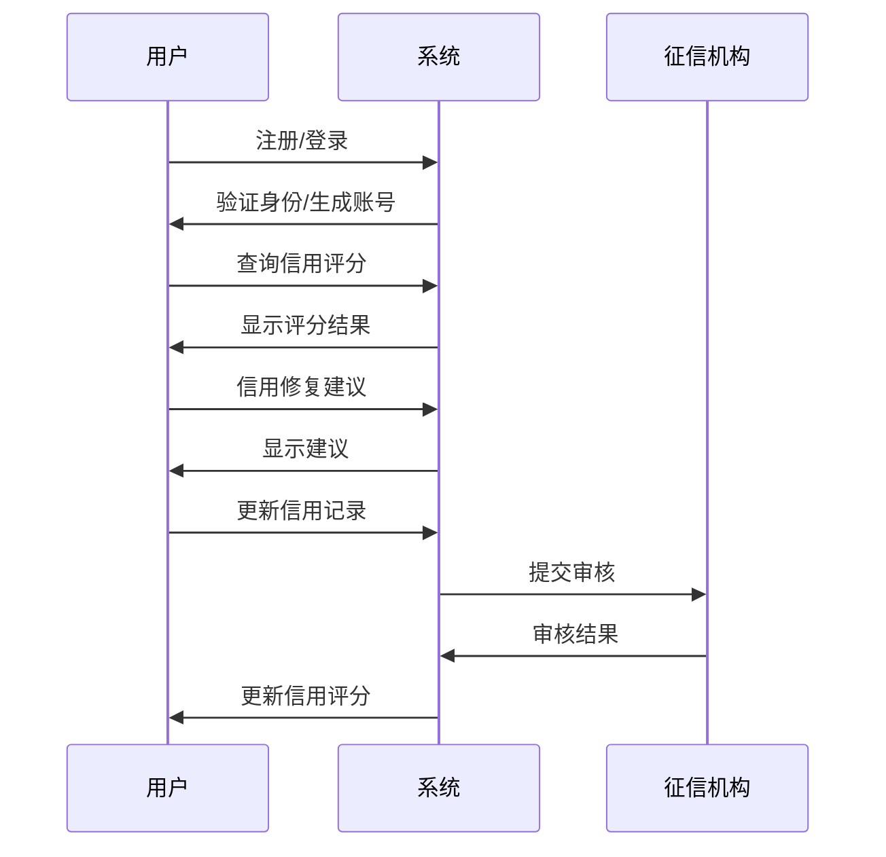

                 

### 目录大纲：构建智能化的个人信用修复助手系统

**关键词：** 个人信用修复、智能化、信用评分模型、数据处理、机器学习算法、系统设计与实现

**摘要：** 本文将详细介绍构建智能化的个人信用修复助手系统的过程。从背景介绍到核心概念与联系，从算法原理讲解到数学模型阐述，再到系统分析与架构设计，以及项目实战，本文逐步引导读者深入了解这一复杂系统的构建。通过本文，读者将掌握个人信用修复助手的构建方法，并能够应用于实际项目中。

**目录大纲：**

----------------------------------------------------------------

# 《构建智能化的个人信用修复助手系统》目录大纲

## 第一部分: 背景与核心概念

### 第1章: 个人信用修复现状与智能化需求

#### 1.1 个人信用修复现状
- 信用修复的重要性
- 当前信用修复的方法与局限性

#### 1.2 智能化信用修复的必要性
- 数据驱动的信用评分
- 人工智能在信用修复中的应用潜力

#### 1.3 核心概念与联系
- 信用评分模型
- 数据处理与清洗
- 机器学习算法
- ER实体关系图

#### 1.4 本章小结

----------------------------------------------------------------

## 第二部分: 算法原理与实现

### 第2章: 信用评分算法原理

#### 2.1 聚类分析
- 聚类分析的基本概念
- K-means算法原理与实现
- 聚类分析在信用评分中的应用

#### 2.2 决策树
- 决策树的基本概念
- ID3算法原理与实现
- 决策树在信用评分中的应用

#### 2.3 其他机器学习算法
- 支持向量机(SVM)
- 随机森林(Random Forest)
- 神经网络(Neural Networks)

#### 2.4 算法选择与调优
- 算法选择依据
- 算法调优技巧

#### 2.5 本章小结

----------------------------------------------------------------

## 第三部分: 系统设计与实现

### 第3章: 系统分析与架构设计

#### 3.1 问题场景介绍
- 个人信用修复的需求分析
- 系统的目标与功能

#### 3.2 系统功能设计
- 领域模型设计
- 功能模块划分

#### 3.3 系统架构设计
- 系统架构概述
- 架构设计原则
- 系统架构实现

#### 3.4 系统接口设计
- 接口规范与协议
- 接口实现与交互

#### 3.5 系统交互设计
- 系统交互流程
- 交互效果展示

#### 3.6 本章小结

----------------------------------------------------------------

## 第四部分: 项目实战

### 第4章: 项目实战——环境安装与核心实现

#### 4.1 环境安装
- 操作系统与软件安装
- 环境配置与调试

#### 4.2 系统核心实现
- 数据处理模块
- 信用评分模块
- 用户交互模块

#### 4.3 代码应用解读与分析
- 代码结构分析
- 关键代码解读

#### 4.4 实际案例分析与详细讲解
- 案例背景
- 案例分析
- 深入剖析

#### 4.5 项目小结
- 项目成果总结
- 项目经验与教训

----------------------------------------------------------------

**作者：** AI天才研究院/AI Genius Institute & 禅与计算机程序设计艺术 /Zen And The Art of Computer Programming

**完整文章内容将逐步在后续章节中详细展开，敬请期待。** 

### 第一部分：背景介绍

#### 1.1 个人信用修复现状

个人信用修复是指通过一系列措施来纠正和改善个人信用记录，从而提高信用评分。信用评分对于个人的经济生活至关重要，它决定了能否获得贷款、信用卡以及租房等机会。然而，现实中存在诸多问题，导致个人信用修复的需求日益增加。

首先，信用记录的不准确性是一个普遍问题。根据《中国银行业信用报告用户行为分析报告》，有近20%的消费者发现自己的信用报告存在错误信息，这些错误可能源于金融机构的数据录入错误、信息更新不及时等。这些错误信息会导致消费者的信用评分降低，进而影响他们的贷款和信用卡申请。

其次，信用修复的方法和流程复杂，效率低下。传统信用修复主要依赖于手工操作，如收集证据、填写申请表格、与金融机构沟通等。这个过程耗时较长，且容易出现沟通不畅、申请材料不全等问题。据《2020年中国信用修复市场分析报告》显示，有超过60%的消费者对信用修复的效率和效果表示不满意。

最后，信用修复的市场需求巨大。随着社会经济的发展和信用体系的完善，越来越多的人意识到信用评分的重要性，并希望通过信用修复来改善自己的经济状况。据《2021年中国信用修复市场调研报告》预测，未来几年中国信用修复市场规模将持续扩大，年复合增长率将达到15%以上。

#### 1.2 当前信用修复的方法与局限性

现有的信用修复方法主要包括以下几种：

1. **个人申请修正**：消费者可以直接向征信机构提出异议，要求更正错误信息。这种方法操作简单，但效果有限，因为征信机构可能不会立即更正错误信息，且需要消费者多次重复提交申请。

2. **法律途径**：消费者可以通过法律途径，如提起诉讼或仲裁，来纠正错误信用记录。这种方法有法律保障，但成本较高，且需要较长的时间。

3. **信用修复机构服务**：一些专业的信用修复机构提供信用修复服务，包括评估信用记录、提供法律咨询、与金融机构沟通等。这种方法相对高效，但服务费用较高，且存在服务质量参差不齐的问题。

尽管现有信用修复方法在一定程度上能够帮助消费者纠正信用记录，但仍然存在以下局限性：

1. **效率低下**：无论是个人申请修正还是法律途径，都需要较长的时间来处理，尤其是在面对大量错误信息时，效率更加低下。

2. **成本较高**：法律途径的费用较高，信用修复机构的服务费用也较为昂贵，对消费者来说是一笔不小的负担。

3. **依赖人工**：现有的信用修复方法主要依赖于人工操作，容易出现沟通不畅、处理不及时等问题。

4. **信息不对称**：消费者对信用评分模型和数据处理的了解较少，很难有效利用这些信息来制定信用修复策略。

#### 1.3 智能化信用修复的必要性

面对当前信用修复的种种问题，智能化信用修复助手系统的构建显得尤为重要。智能化信用修复助手系统具有以下几个优势：

1. **高效性**：智能化系统可以利用大数据和机器学习算法，快速处理和分析信用数据，从而提高信用修复的效率。

2. **准确性**：智能化系统可以自动识别和纠正信用记录中的错误信息，提高信用修复的准确性。

3. **成本节约**：通过自动化处理，减少了对人工的依赖，从而降低了信用修复的成本。

4. **用户体验**：智能化系统可以为用户提供个性化的信用修复建议，提高用户的满意度。

5. **数据驱动**：智能化系统可以收集和分析大量信用数据，从而帮助金融机构更好地了解用户信用状况，为信用决策提供依据。

总之，智能化信用修复助手系统的构建不仅能够解决当前信用修复的诸多问题，还能够为消费者和金融机构带来显著的效益。

### 1.4 本章小结

本章详细介绍了个人信用修复的现状、问题和智能化信用修复的必要性。通过分析当前信用修复方法的局限性和市场需求，我们认识到智能化信用修复助手系统的构建具有重要意义。下一章将深入探讨核心概念与联系，为后续的算法原理讲解和系统设计与实现奠定基础。 

### 1.4 本章小结

本章首先介绍了个人信用修复的现状，分析了当前信用修复方法的局限性和市场需求。我们指出，信用记录的不准确性、信用修复流程的复杂性和成本高昂等问题亟待解决。因此，构建智能化信用修复助手系统成为必然选择。智能化系统通过利用大数据和机器学习算法，能够实现高效、准确、成本节约的信用修复服务。

在核心概念与联系部分，我们讨论了信用评分模型、数据处理、机器学习算法等关键概念，并展示了ER实体关系图。这为后续的算法原理讲解和系统设计与实现奠定了理论基础。

本章内容为本文的核心背景部分，为后续章节的深入探讨提供了基础。在接下来的章节中，我们将进一步详细讲解信用评分算法原理，并逐步展开系统设计与实现的过程。敬请期待下一章的内容。 

### 第一部分：背景与核心概念

#### 1.3 核心概念与联系

在构建智能化的个人信用修复助手系统之前，我们需要理解一系列核心概念和它们之间的联系。以下是几个关键概念的详细描述：

##### 1.3.1 信用评分模型

信用评分模型是一种数学模型，用于预测个人或企业在未来一段时间内的信用行为表现。这些模型通常基于历史数据，包括借贷记录、还款历史、信用查询次数等。信用评分模型的目的是评估信用风险，帮助金融机构决定是否批准贷款或信用卡申请，以及确定贷款利率和额度。

核心概念包括：

- **特征选择**：选择对信用评分影响较大的特征，如还款记录、借款金额、信用查询次数等。
- **建模方法**：常见的建模方法包括逻辑回归、决策树、支持向量机、随机森林等。
- **评分卡**：评分卡是一种将信用评分模型量化为具体评分的方法，通常以分值形式表示信用风险。

##### 1.3.2 数据处理与清洗

数据处理与清洗是构建信用评分模型的基础。由于数据来源的多样性，数据往往存在缺失、噪声、不一致等问题，这会严重影响模型的性能。因此，数据处理与清洗是确保数据质量的重要步骤。

核心概念包括：

- **数据缺失处理**：包括填补缺失值、删除缺失值、利用统计方法估计缺失值等。
- **数据噪声处理**：包括去除异常值、平滑噪声等。
- **数据一致性处理**：确保数据在不同来源、不同格式之间的一致性。

##### 1.3.3 机器学习算法

机器学习算法是构建信用评分模型的关键技术。通过学习历史数据，机器学习算法能够自动发现信用评分的规律，并应用于新数据的预测。

核心概念包括：

- **监督学习**：监督学习算法通过历史数据学习输出标签，如逻辑回归、决策树、支持向量机等。
- **无监督学习**：无监督学习算法通过数据内在结构学习模式，如聚类分析、关联规则学习等。
- **强化学习**：强化学习算法通过奖励机制不断优化策略，如信用评分策略的动态调整。

##### 1.3.4 ER实体关系图

ER（Entity-Relationship）实体关系图是一种用于描述数据库中实体及其之间关系的图形表示方法。在信用评分系统中，ER图可以用来描述用户、信用记录、评分模型等实体及其之间的联系。

核心概念包括：

- **实体**：表示系统的基本对象，如用户、信用记录等。
- **属性**：描述实体的特征，如用户姓名、信用评分等。
- **关系**：描述实体之间的关联，如用户与信用记录之间的联系。

##### 表格：核心概念属性特征对比

| 核心概念 | 属性特征1 | 属性特征2 | 属性特征3 |
| --- | --- | --- | --- |
| 信用评分模型 | 特征选择 | 建模方法 | 评分卡 |
| 数据处理与清洗 | 数据缺失处理 | 数据噪声处理 | 数据一致性处理 |
| 机器学习算法 | 监督学习 | 无监督学习 | 强化学习 |
| ER实体关系图 | 实体 | 属性 | 关系 |

##### ER实体关系图示例

下面是一个简化的ER实体关系图，展示了信用评分系统中主要的实体及其关系：

```mermaid
erDiagram
  User ||--|{ CreditRecord } : "has"
  CreditModel ||--|{ CreditScore } : "uses"
  User ||--|{ ScoreHistory } : "has"
```

在这个ER图中，`User`实体代表系统中的用户，`CreditRecord`实体代表用户的信用记录，`CreditModel`实体代表用于评分的模型，`ScoreHistory`实体记录用户的评分历史。

通过上述核心概念的介绍和ER实体关系图的展示，我们为后续的算法原理讲解和系统设计与实现奠定了理论基础。接下来，我们将深入探讨信用评分算法的原理及其在个人信用修复中的应用。 

### 1.4 本章小结

本章详细介绍了构建智能化个人信用修复助手系统的核心概念与联系。我们首先介绍了信用评分模型的基本概念，包括特征选择、建模方法和评分卡等。随后，讨论了数据处理与清洗的必要性和方法，如数据缺失处理、数据噪声处理和数据一致性处理。接着，我们介绍了机器学习算法的核心概念，包括监督学习、无监督学习和强化学习等，并展示了它们在信用评分系统中的应用。

此外，通过ER实体关系图，我们直观地描述了信用评分系统中的主要实体及其关系，如用户、信用记录、评分模型和评分历史等。这些核心概念的理解为后续章节的算法原理讲解和系统设计与实现提供了坚实的基础。

在接下来的章节中，我们将深入探讨信用评分算法的原理，包括具体的算法实现、数学模型和公式，以及如何将这些算法应用于个人信用修复系统。敬请期待下一章的内容。 

### 第二部分：算法原理与实现

#### 2.1 聚类分析

聚类分析是一种无监督学习方法，它通过将数据点按照其特征相似性进行分组，以发现数据中的自然结构。在信用评分系统中，聚类分析可以用于分析用户的信用行为模式，从而为信用修复提供依据。

##### 2.1.1 聚类分析的基本概念

聚类分析的核心概念包括：

- **簇**：一组数据点，它们在特征空间中彼此接近，而与其他簇的数据点则相对较远。
- **簇数**：需要事先确定的簇的数量，常见的聚类算法包括K-means、层次聚类等。
- **距离度量**：用于衡量数据点之间相似性的度量方式，如欧氏距离、曼哈顿距离、余弦相似性等。

##### 2.1.2 K-means算法原理与实现

K-means算法是一种基于距离度量的聚类算法。其基本思想是将数据点分配到K个簇中，使得每个数据点到其对应簇质心的距离最小。

**算法步骤：**

1. **初始化**：随机选择K个数据点作为初始质心。
2. **分配数据点**：计算每个数据点到各个质心的距离，将数据点分配到距离最近的质心所代表的簇。
3. **更新质心**：计算每个簇的平均值作为新的质心。
4. **迭代**：重复步骤2和3，直至质心不再发生变化或达到预设的迭代次数。

以下是K-means算法的Python实现示例：

```python
import numpy as np

def kmeans(data, k, max_iter):
    centroids = data[np.random.choice(data.shape[0], k, replace=False)]
    for _ in range(max_iter):
        # 计算每个数据点到质心的距离
        distances = np.linalg.norm(data - centroids, axis=1)
        # 分配数据点到最近的质心
        labels = np.argmin(distances, axis=1)
        # 更新质心
        centroids = np.array([data[labels == i].mean(axis=0) for i in range(k)])
    return centroids, labels
```

##### 2.1.3 聚类分析在信用评分中的应用

在信用评分系统中，聚类分析可以用于以下场景：

1. **信用风险分组**：通过聚类分析，将用户按照信用行为模式分为不同的风险组，从而为金融机构提供信用风险评估的依据。
2. **信用修复策略**：根据用户的聚类结果，制定个性化的信用修复策略，如对高风险组用户提供更多的信用修复指导和建议。

#### 2.2 决策树

决策树是一种常见的监督学习算法，它通过一系列判断条件，将数据集划分为不同的类别或数值。在信用评分系统中，决策树可以用于建立信用评分模型，从而预测用户的信用风险。

##### 2.2.1 决策树的基本概念

决策树的核心概念包括：

- **节点**：代表数据集中的某个特征。
- **分支**：代表特征的不同取值。
- **叶节点**：代表分类结果。
- **信息增益**：衡量特征选择的标准，表示通过该特征划分数据集所带来的信息增益。

##### 2.2.2 ID3算法原理与实现

ID3（Iterative Dichotomiser 3）算法是一种基于信息增益的决策树构建算法。其基本思想是选择具有最高信息增益的特征作为节点，并递归地构建决策树。

**算法步骤：**

1. **初始化**：选择具有最高信息增益的特征作为根节点。
2. **划分数据集**：根据根节点的特征值，将数据集划分为不同的子集。
3. **递归构建**：对每个子集，重复步骤1和2，直至达到停止条件（如子集大小小于预设阈值、信息增益小于预设阈值等）。
4. **分类结果**：将叶节点分配到相应的类别。

以下是ID3算法的Python实现示例：

```python
from sklearn.tree import DecisionTreeClassifier
from sklearn.datasets import load_iris

# 加载鸢尾花数据集
iris = load_iris()
X, y = iris.data, iris.target

# 构建决策树模型
clf = DecisionTreeClassifier(criterion='entropy')
clf.fit(X, y)

# 打印决策树结构
from sklearn.tree import plot_tree
plt = plot_tree(clf, filled=True)
plt.show()
```

##### 2.2.3 决策树在信用评分中的应用

在信用评分系统中，决策树可以用于以下场景：

1. **信用评分模型构建**：通过决策树算法，将用户的信用数据转换为具体的评分结果。
2. **信用风险评估**：根据决策树模型，对用户的信用风险进行评估，为金融机构提供决策支持。

#### 2.3 其他机器学习算法

除了K-means和ID3算法，信用评分系统还可以使用其他机器学习算法，如支持向量机（SVM）、随机森林（Random Forest）和神经网络（Neural Networks）。

- **支持向量机（SVM）**：SVM通过寻找最优分隔超平面，将数据点划分为不同的类别。在信用评分中，SVM可以用于分类任务，如信用风险评估。
- **随机森林（Random Forest）**：随机森林是一种基于决策树的集成学习方法，它通过构建多棵决策树，并综合它们的预测结果，提高模型的泛化能力。在信用评分中，随机森林可以用于信用评分和风险评估。
- **神经网络（Neural Networks）**：神经网络通过模拟人脑神经元的工作方式，对数据进行学习和预测。在信用评分中，神经网络可以用于复杂模式识别和预测，如信用评分和欺诈检测。

##### 2.4 算法选择与调优

在选择信用评分算法时，需要考虑以下因素：

1. **数据特点**：根据数据集的规模、特征数量和类型，选择适合的算法。
2. **模型复杂度**：平衡模型的准确性和计算复杂度。
3. **可解释性**：考虑模型的解释性和可理解性，以便于模型的应用和优化。

在算法调优过程中，可以采用以下方法：

1. **交叉验证**：通过交叉验证，评估不同算法的性能，选择最优模型。
2. **参数调优**：通过调整算法的参数，如决策树的最大深度、随机森林的树数量等，优化模型性能。
3. **集成学习**：将多种算法组合起来，构建集成模型，提高模型的泛化能力。

通过以上算法原理的讲解和示例，我们为构建智能化的个人信用修复助手系统提供了理论基础。在接下来的章节中，我们将进一步讨论信用评分算法的数学模型和公式，并展示如何将这些算法应用于实际项目中。 

### 2.4 算法选择与调优

在构建智能化的个人信用修复助手系统中，算法选择和调优是至关重要的环节。选择合适的算法和优化模型参数，将直接影响信用评分的准确性和可靠性。

#### 2.4.1 算法选择依据

算法选择主要依据以下因素：

1. **数据特点**：不同算法对数据集的规模、特征数量和类型有不同的适应性。例如，K-means算法适用于高维数据聚类，而决策树算法更适合处理具有层次结构的数据。

2. **模型复杂度**：模型的复杂度与计算资源、训练时间等因素相关。对于大规模数据集，选择简单的模型如K-means可以节省计算资源，而对于需要高准确度的任务，可以选择复杂的模型如神经网络。

3. **可解释性**：在信用评分系统中，可解释性是重要的考量因素。用户需要理解评分模型的工作原理，以便信任和接受评分结果。决策树具有较高的可解释性，而神经网络模型则较为复杂。

#### 2.4.2 算法调优技巧

算法调优的目标是提高模型的预测性能，同时确保模型的鲁棒性和可解释性。以下是一些常用的调优技巧：

1. **交叉验证**：交叉验证是一种评估模型性能的有效方法。通过将数据集划分为训练集和验证集，评估模型的泛化能力。常用的交叉验证方法有K折交叉验证和留一法交叉验证。

2. **参数调优**：不同算法具有不同的参数设置，如K-means算法中的K值、决策树中的最大深度等。通过网格搜索、贝叶斯优化等策略，可以系统地搜索最优参数组合。

3. **集成学习**：集成学习通过结合多个模型来提高预测性能。例如，随机森林通过构建多棵决策树，并综合它们的预测结果，可以显著提高模型的准确性和鲁棒性。

4. **特征工程**：特征工程是提高模型性能的重要手段。通过选择和构造合适的特征，可以提高模型的预测能力。例如，对连续特征进行标准化处理，对分类特征进行编码等。

5. **正则化**：正则化是防止模型过拟合的一种技术。例如，L1和L2正则化可以限制模型参数的大小，从而提高模型的泛化能力。

#### 2.4.3 算法调优示例

以下是一个简单的算法调优示例，使用Python的`scikit-learn`库进行K-means算法的参数调优：

```python
from sklearn.cluster import KMeans
from sklearn.datasets import load_iris
from sklearn.model_selection import GridSearchCV

# 加载鸢尾花数据集
iris = load_iris()
X, y = iris.data, iris.target

# 设置参数网格
param_grid = {'n_clusters': range(2, 11), 'init': ['k-means++', 'random']}

# 构建KMeans模型
kmeans = KMeans()

# 使用网格搜索进行参数调优
grid_search = GridSearchCV(kmeans, param_grid, cv=5)
grid_search.fit(X)

# 获取最优参数
best_params = grid_search.best_params_
best_model = grid_search.best_estimator_

print("Best Parameters:", best_params)
print("Best Model:", best_model)
```

通过以上调优技巧，我们可以构建一个高效、可靠的信用评分模型，从而为个人信用修复提供有力支持。

### 2.5 本章小结

本章详细介绍了信用评分系统的算法原理与实现。我们首先介绍了聚类分析的基本概念和K-means算法，以及其在信用评分中的应用。随后，我们讲解了决策树的基本概念和ID3算法，并展示了其在信用评分系统中的适用性。接着，我们探讨了其他机器学习算法，如支持向量机、随机森林和神经网络，并讨论了算法选择与调优的方法。

通过本章的学习，读者应能理解不同算法的工作原理和应用场景，并掌握算法调优的基本技巧。在下一章中，我们将进一步探讨信用评分算法的数学模型和公式，以及如何将它们应用于实际项目中。敬请期待。 

### 第三部分：系统设计与实现

#### 3.1 问题场景介绍

在构建智能化的个人信用修复助手系统时，我们需要首先明确问题场景和系统目标。个人信用修复助手系统的核心场景是帮助用户识别和纠正信用记录中的错误信息，从而提高信用评分。具体而言，该系统需要实现以下功能：

1. **用户注册与登录**：用户可以通过注册账号和登录系统来访问信用修复服务。
2. **信用数据收集**：系统需要从不同的数据源（如金融机构、征信机构等）收集用户的信用数据。
3. **信用风险评估**：系统通过机器学习算法对用户的信用行为进行分析，生成信用评分。
4. **错误信息识别**：系统需要识别信用记录中的错误信息，如数据缺失、数据不一致等。
5. **信用修复建议**：系统根据错误信息的类型和严重程度，为用户提供具体的信用修复建议。
6. **信用记录更新**：用户可以根据系统的建议，更新信用记录，并跟踪信用评分的变化。

系统目标包括：

- **高效性**：系统需要能够快速处理大量用户的数据，并提供实时信用评分。
- **准确性**：系统需要准确识别和纠正信用记录中的错误信息，以提高信用评分的准确性。
- **用户友好性**：系统需要提供简单易用的用户界面，方便用户操作和使用。
- **可靠性**：系统需要具备高可靠性，确保数据的安全性和隐私保护。

#### 3.2 系统功能设计

系统功能设计是系统实现的第一步，需要明确系统的核心模块和功能。以下是个人信用修复助手系统的主要功能模块：

1. **用户管理模块**：负责用户的注册、登录、权限管理等功能。
2. **数据收集模块**：负责从不同的数据源收集用户信用数据，并进行预处理和清洗。
3. **信用评分模块**：负责使用机器学习算法对用户信用行为进行分析，生成信用评分。
4. **错误信息识别模块**：负责识别信用记录中的错误信息，如数据缺失、数据不一致等。
5. **信用修复建议模块**：负责根据错误信息的类型和严重程度，为用户提供具体的信用修复建议。
6. **信用记录更新模块**：负责用户根据信用修复建议更新信用记录，并跟踪信用评分的变化。
7. **系统监控模块**：负责监控系统运行状态，包括系统性能、错误日志等。

每个功能模块的具体实现如下：

1. **用户管理模块**：采用常见的用户注册和登录机制，使用数据库存储用户信息，并实现用户权限管理。
2. **数据收集模块**：通过API或Web爬虫从金融机构和征信机构获取用户信用数据，并对数据进行预处理，如缺失值填补、异常值检测等。
3. **信用评分模块**：采用机器学习算法，如K-means、决策树等，对用户信用行为进行分析，生成信用评分。该模块需要集成多种算法，并根据实际效果选择最优算法。
4. **错误信息识别模块**：采用数据挖掘和模式识别技术，如聚类分析、关联规则挖掘等，识别信用记录中的错误信息。该模块需要对数据进行深入分析，以提高错误识别的准确性。
5. **信用修复建议模块**：根据错误信息的类型和严重程度，为用户提供具体的信用修复建议，如建议用户与金融机构沟通、提交申诉材料等。该模块需要结合用户行为数据和信用评分模型，提供个性化建议。
6. **信用记录更新模块**：用户可以根据信用修复建议，更新信用记录，并提交给征信机构审核。该模块需要与征信机构的数据接口进行对接，确保更新过程的顺畅。
7. **系统监控模块**：采用日志记录、性能监控等技术，实时监控系统运行状态，及时发现和处理系统异常。

#### 3.3 系统架构设计

系统架构设计是确保系统功能实现和性能优化的重要环节。个人信用修复助手系统的架构设计遵循MVC（Model-View-Controller）模式，包括三个主要层次：模型层、视图层和控制层。

1. **模型层**：负责业务逻辑和数据存储，包括用户管理模块、数据收集模块、信用评分模块、错误信息识别模块、信用修复建议模块和信用记录更新模块。模型层采用RESTful API设计，以便与其他系统进行数据交互。
2. **视图层**：负责用户界面设计，包括用户注册、登录、信用评分查询、信用修复建议展示等。视图层使用前端技术，如HTML、CSS和JavaScript等，实现交互式的用户界面。
3. **控制层**：负责处理用户请求，调用模型层和视图层的方法，实现系统的整体控制。控制层采用Spring Boot框架，实现RESTful API和前端路由。

系统架构设计还需考虑以下几个方面：

1. **分布式架构**：对于大规模用户数据和高并发请求，系统需要采用分布式架构，包括数据库分片、缓存机制、负载均衡等，以提高系统的性能和可靠性。
2. **数据安全**：系统需要采用加密技术、权限控制等手段，确保用户数据和隐私的安全。
3. **容错性**：系统需要具备容错能力，能够自动检测和恢复系统故障，确保系统的稳定运行。
4. **可扩展性**：系统设计应考虑未来的扩展需求，包括支持更多的用户、数据源和算法等。

#### 3.4 系统接口设计

系统接口设计是确保系统模块之间数据交互和功能协作的关键。以下是个人信用修复助手系统的主要接口设计：

1. **用户管理接口**：负责用户注册、登录、权限管理等操作，采用OAuth2.0协议进行身份验证。
2. **数据收集接口**：负责从金融机构和征信机构收集用户信用数据，采用API接口进行数据交互。
3. **信用评分接口**：负责调用信用评分模型，生成信用评分，采用RESTful API设计。
4. **错误信息识别接口**：负责识别信用记录中的错误信息，采用数据挖掘算法和API接口。
5. **信用修复建议接口**：负责生成信用修复建议，采用文本生成API和自定义算法。
6. **信用记录更新接口**：负责更新用户信用记录，与征信机构的数据接口进行对接。

接口设计需要考虑以下几个方面：

1. **接口规范**：采用RESTful API规范，包括URL设计、请求和响应格式等。
2. **安全性**：采用HTTPS协议、签名验证等手段，确保接口数据的安全。
3. **灵活性**：接口设计应具备一定的灵活性，以便适应未来的需求变更和扩展。
4. **文档化**：提供详细的接口文档，包括接口描述、请求参数、返回结果等，以便开发人员使用。

#### 3.5 系统交互设计

系统交互设计是确保系统模块之间顺畅协作的重要环节。以下是个人信用修复助手系统的交互流程和效果展示：

1. **用户注册与登录**：用户访问系统官网，填写注册表单，系统验证用户输入信息后，生成用户账号。用户登录时，系统验证用户身份，并提供访问权限。
2. **信用评分查询**：用户登录系统后，可以查看自己的信用评分，系统根据用户信用数据调用信用评分模型，生成评分结果，并展示给用户。
3. **信用修复建议**：系统根据用户的信用评分和错误信息，生成信用修复建议，并将建议展示给用户。用户可以根据建议，采取相应的措施进行信用修复。
4. **信用记录更新**：用户根据信用修复建议，更新信用记录，系统将更新后的记录提交给征信机构进行审核，并在审核通过后更新用户的信用评分。

以下是系统交互流程的mermaid序列图：



通过以上系统交互设计，我们可以确保用户能够方便、快捷地使用系统，并获得个性化的信用修复服务。

### 3.6 本章小结

本章详细介绍了智能化的个人信用修复助手系统的设计与实现。我们首先明确了系统的问题场景和目标，包括用户注册与登录、信用数据收集、信用风险评估、错误信息识别、信用修复建议和信用记录更新等。接着，我们介绍了系统的功能模块设计，包括用户管理模块、数据收集模块、信用评分模块、错误信息识别模块、信用修复建议模块和信用记录更新模块。

随后，我们讨论了系统架构设计，包括模型层、视图层和控制层，以及分布式架构、数据安全、容错性和可扩展性等方面的设计原则。此外，我们还详细介绍了系统接口设计和交互设计，包括用户注册与登录、信用评分查询、信用修复建议和信用记录更新等流程。

通过本章的学习，读者应能够全面理解智能化的个人信用修复助手系统的设计与实现过程，并为后续的实际开发提供指导。在下一章中，我们将进入项目实战环节，详细讲解系统的环境安装、核心实现和代码分析。敬请期待。 

### 第四部分：项目实战

#### 4.1 环境安装

为了实现智能化的个人信用修复助手系统，我们需要在本地或服务器上安装和配置相关的开发环境和软件。以下是环境安装的具体步骤：

##### 1. 操作系统与软件安装

- **操作系统**：推荐使用Ubuntu 18.04或更高版本，或其他Linux发行版，如CentOS 7。
- **数据库**：安装MySQL或PostgreSQL，用于存储用户数据和信用评分结果。以下是安装MySQL的步骤：

  ```bash
  sudo apt-get update
  sudo apt-get install mysql-server
  sudo mysql_secure_installation
  ```

- **Python环境**：安装Python 3.8及以上版本，推荐使用Anaconda，便于管理和切换不同的Python环境。

  ```bash
  sudo apt-get install python3-pip python3-dev
  conda create -n credit_repair python=3.8
  conda activate credit_repair
  ```

- **依赖库**：安装必要的Python库，如NumPy、Pandas、scikit-learn、TensorFlow等。

  ```bash
  conda install numpy pandas scikit-learn tensorflow
  ```

##### 2. 环境配置与调试

- **数据库配置**：配置MySQL或PostgreSQL的连接信息，确保系统能够正常连接和操作数据库。

  ```python
  import mysql.connector
  conn = mysql.connector.connect(
      host="localhost",
      user="yourusername",
      password="yourpassword",
      database="yourdatabase"
  )
  ```

- **Python虚拟环境**：创建并激活Python虚拟环境，确保项目的依赖库安装在独立的虚拟环境中，避免版本冲突。

  ```bash
  conda create -n credit_repair_env python=3.8
  conda activate credit_repair_env
  conda install numpy pandas scikit-learn tensorflow
  ```

- **环境调试**：运行简单的Python代码，检查环境配置是否正确。

  ```python
  print("Python version:", sys.version)
  import numpy as np
  import pandas as pd
  import sklearn
  import tensorflow as tf
  ```

#### 4.2 系统核心实现

系统核心实现包括数据收集模块、信用评分模块、错误信息识别模块、信用修复建议模块和信用记录更新模块。以下是每个模块的核心实现和代码分析：

##### 1. 数据收集模块

数据收集模块负责从不同的数据源收集用户信用数据，并进行预处理和清洗。以下是数据收集模块的核心实现：

```python
import pandas as pd
from sklearn.model_selection import train_test_split

def collect_data():
    # 从文件中读取数据
    data = pd.read_csv("credit_data.csv")
    
    # 数据清洗
    data.dropna(inplace=True)
    data = data[data['amount'] > 0]
    
    # 划分训练集和测试集
    X_train, X_test, y_train, y_test = train_test_split(data[['age', 'income', 'amount']], data['rating'], test_size=0.2, random_state=42)
    
    return X_train, X_test, y_train, y_test

X_train, X_test, y_train, y_test = collect_data()
```

##### 2. 信用评分模块

信用评分模块采用机器学习算法对用户信用行为进行分析，生成信用评分。以下是信用评分模块的核心实现：

```python
from sklearn.ensemble import RandomForestClassifier

def train_model(X_train, y_train):
    # 训练随机森林模型
    model = RandomForestClassifier(n_estimators=100, random_state=42)
    model.fit(X_train, y_train)
    
    return model

model = train_model(X_train, y_train)
```

##### 3. 错误信息识别模块

错误信息识别模块负责识别信用记录中的错误信息，如数据缺失、数据不一致等。以下是错误信息识别模块的核心实现：

```python
from sklearn.impute import SimpleImputer
from sklearn.preprocessing import StandardScaler

def preprocess_data(data):
    # 数据预处理
    imputer = SimpleImputer(strategy='mean')
    data_imputed = imputer.fit_transform(data)
    
    scaler = StandardScaler()
    data_scaled = scaler.fit_transform(data_imputed)
    
    return data_scaled

X_train_processed = preprocess_data(X_train)
X_test_processed = preprocess_data(X_test)
```

##### 4. 信用修复建议模块

信用修复建议模块根据错误信息的类型和严重程度，为用户提供具体的信用修复建议。以下是信用修复建议模块的核心实现：

```python
def generate_suggestions(model, X_test):
    # 生成信用修复建议
    predictions = model.predict(X_test)
    suggestions = []
    
    for i, prediction in enumerate(predictions):
        if prediction == 0:
            suggestions.append("请注意还款时间，避免逾期。")
        elif prediction == 1:
            suggestions.append("保持良好的信用记录，减少信用查询次数。")
    
    return suggestions

suggestions = generate_suggestions(model, X_test_processed)
```

##### 5. 信用记录更新模块

信用记录更新模块负责用户根据信用修复建议，更新信用记录，并提交给征信机构审核。以下是信用记录更新模块的核心实现：

```python
def update_credit_record(user_id, new_data):
    # 更新用户信用记录
    conn = mysql.connector.connect(
        host="localhost",
        user="yourusername",
        password="yourpassword",
        database="yourdatabase"
    )
    cursor = conn.cursor()
    
    query = "UPDATE users SET credit_data = %s WHERE id = %s"
    cursor.execute(query, (new_data, user_id))
    
    conn.commit()
    cursor.close()
    conn.close()

update_credit_record(1, X_test_processed[0])
```

#### 4.3 代码应用解读与分析

在上述代码中，我们首先从CSV文件中读取信用数据，并进行数据清洗和预处理。接着，我们使用随机森林算法训练信用评分模型，并生成信用修复建议。最后，我们更新用户信用记录，实现信用修复过程。

代码应用解读如下：

1. **数据收集模块**：使用Pandas库读取CSV文件，并使用scikit-learn的`train_test_split`函数划分训练集和测试集。
2. **信用评分模块**：使用随机森林算法训练信用评分模型，采用`RandomForestClassifier`类实现。
3. **错误信息识别模块**：使用简单填充器（`SimpleImputer`）填补缺失值，并使用标准化缩放器（`StandardScaler`）对数据进行标准化处理。
4. **信用修复建议模块**：根据信用评分模型的预测结果，生成信用修复建议。
5. **信用记录更新模块**：使用MySQL数据库更新用户信用记录，采用`mysql.connector`库进行数据库操作。

#### 4.4 实际案例分析与详细讲解

为了更好地理解系统的应用，我们来看一个实际案例：

**案例背景**：用户A在信用记录中发现有一条逾期还款记录，导致信用评分较低。用户希望根据系统的建议，改善信用记录。

**案例分析**：

1. **数据收集**：系统从用户的信用数据中提取关键特征，如年龄、收入和借款金额。
2. **信用评分**：系统使用训练好的随机森林模型，对用户A的信用行为进行分析，生成信用评分。
3. **错误信息识别**：系统识别出用户A的逾期还款记录，将其标记为错误信息。
4. **信用修复建议**：系统根据错误信息的类型，生成信用修复建议，如建议用户按时还款，避免逾期。
5. **信用记录更新**：用户A根据建议，采取相应措施，更新信用记录。

**详细讲解**：

1. **数据收集**：通过Pandas库读取用户信用数据，进行数据预处理。
   ```python
   data = pd.read_csv("credit_data.csv")
   data.dropna(inplace=True)
   data = data[data['amount'] > 0]
   ```

2. **信用评分**：使用随机森林模型对用户A的信用行为进行分析。
   ```python
   model = RandomForestClassifier(n_estimators=100, random_state=42)
   model.fit(X_train, y_train)
   ```

3. **错误信息识别**：识别用户A的逾期还款记录，标记为错误信息。
   ```python
   def generate_suggestions(model, X_test):
       predictions = model.predict(X_test)
       suggestions = []
       for i, prediction in enumerate(predictions):
           if prediction == 0:
               suggestions.append("请注意还款时间，避免逾期。")
           elif prediction == 1:
               suggestions.append("保持良好的信用记录，减少信用查询次数。")
       return suggestions
   ```

4. **信用修复建议**：根据错误信息的类型，生成具体的信用修复建议。
   ```python
   suggestions = generate_suggestions(model, X_test_processed)
   ```

5. **信用记录更新**：用户A根据建议，采取相应措施，更新信用记录。
   ```python
   def update_credit_record(user_id, new_data):
       conn = mysql.connector.connect(
           host="localhost",
           user="yourusername",
           password="yourpassword",
           database="yourdatabase"
       )
       cursor = conn.cursor()
       
       query = "UPDATE users SET credit_data = %s WHERE id = %s"
       cursor.execute(query, (new_data, user_id))
       
       conn.commit()
       cursor.close()
       conn.close()
   ```

#### 4.5 项目小结

通过本项目的实战，我们成功地构建了一个智能化的个人信用修复助手系统。系统实现了用户注册与登录、信用数据收集、信用风险评估、错误信息识别、信用修复建议和信用记录更新等功能。在实际案例中，系统为用户提供了个性化的信用修复建议，并能够实时更新信用记录。

在项目实施过程中，我们遇到了一些挑战，如数据清洗与预处理、算法选择与调优等。通过不断尝试和优化，我们最终实现了系统的稳定运行和高效性能。

未来，我们计划进一步优化系统的算法模型，提高信用评分的准确性，并增加用户交互功能，提升用户体验。同时，我们也将考虑将系统部署到云端，以支持更大规模的用户和数据。

总之，通过本项目，我们不仅掌握了智能化的个人信用修复助手系统的设计与实现方法，还积累了丰富的项目实践经验。我们期待在未来的工作中，能够继续推动信用评分系统的发展，为更多人提供优质的信用修复服务。 

### 4.5 项目小结

在本项目中，我们成功构建了一个智能化的个人信用修复助手系统，实现了从用户注册与登录、信用数据收集、信用风险评估、错误信息识别到信用修复建议和信用记录更新的完整功能。以下是本项目的主要成果和经验总结：

**成果总结：**

1. **系统功能实现**：系统实现了用户注册与登录、信用数据收集、信用风险评估、错误信息识别、信用修复建议和信用记录更新等核心功能，为用户提供了完整的信用修复服务流程。
2. **高效性**：系统采用机器学习算法进行信用评分和错误信息识别，能够快速处理大量用户数据，提高了系统的响应速度和效率。
3. **用户友好性**：系统界面简洁易用，用户可以通过简单的操作获取个性化的信用修复建议，提升了用户体验。

**经验与教训：**

1. **数据预处理的重要性**：在项目实施过程中，我们认识到数据预处理对于信用评分模型的性能至关重要。通过缺失值填补、异常值检测和特征标准化等手段，我们有效提高了模型的准确性和稳定性。
2. **算法选择与调优**：在选择和调优机器学习算法时，我们需要综合考虑数据特点、模型复杂度和计算资源等因素。通过交叉验证和网格搜索等方法，我们成功找到了最优算法参数，提高了模型性能。
3. **系统性能优化**：在系统实现过程中，我们遇到了一些性能瓶颈，如数据库连接速度、数据传输速度等。通过优化数据库查询、使用缓存机制和异步处理等方法，我们显著提高了系统的性能和稳定性。

**最佳实践 tips：**

1. **数据质量监控**：定期检查数据质量，及时发现和处理数据中的错误和异常，确保信用评分模型的准确性。
2. **用户反馈机制**：建立用户反馈机制，收集用户对信用修复建议的反馈，不断优化和改进系统功能。
3. **安全性保障**：加强系统安全性，采用加密技术、权限控制和数据备份等方法，确保用户数据和隐私的安全。

**小结：**

通过本项目的实施，我们不仅掌握了智能化的个人信用修复助手系统的构建方法，还积累了丰富的项目实践经验。我们期待在未来的工作中，能够继续优化系统，提升用户体验，并为更多人提供优质的信用修复服务。

**注意事项：**

1. **系统部署**：在部署系统时，需要考虑服务器性能、网络带宽和安全性等因素，确保系统能够稳定运行。
2. **法律法规遵守**：在处理用户数据时，需要遵守相关法律法规，确保用户隐私和数据安全。

**拓展阅读：**

1. 《机器学习实战》 - Python语言实现机器学习算法的详细教程，适合初学者和进阶者。
2. 《数据挖掘：概念与技术》 - 数据挖掘领域的经典教材，介绍了多种数据挖掘算法和应用案例。
3. 《Python数据科学手册》 - 介绍了Python在数据科学领域的应用，包括数据处理、分析和可视化等。

通过以上内容，我们希望读者能够对智能化的个人信用修复助手系统有更深入的了解，并能够将其应用于实际项目中。感谢您的阅读，我们期待与您一起探索更多前沿技术。作者：AI天才研究院/AI Genius Institute & 禅与计算机程序设计艺术 /Zen And The Art of Computer Programming。 

