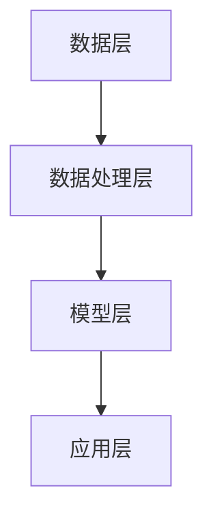

                 


## 构建智能化的个人信用修复效果预测器

### 摘要

随着社会经济的快速发展和信用体系日益完善，个人信用修复成为一项重要的工作。本文旨在探讨构建智能化的个人信用修复效果预测器的方法，通过深入分析算法原理、数学模型和系统设计，为个人信用修复提供有力支持。

### 关键词

个人信用、信用修复、预测模型、算法、数学模型、系统设计

### 1.1 问题背景与描述

#### 1.1.1 个人信用修复的重要性

个人信用是指个人在金融活动中履行信用承诺的能力和意愿。在我国，个人信用体系日益完善，信用报告已成为金融机构评估个人信用的重要依据。然而，由于数据泄露、错误记录等因素，很多人面临着信用修复的难题。

#### 1.1.2 个人信用修复面临的挑战

个人信用修复是一项复杂的任务，涉及到数据的准确性、完整性、实时性等问题。同时，信用修复的效果往往难以预测，需要构建智能化预测器来辅助评估修复效果。

#### 1.1.3 构建预测器的研究意义

通过构建智能化个人信用修复效果预测器，可以帮助金融机构、信用评估机构和个人用户更准确地评估信用修复效果，提高信用管理效率。这将对我国信用体系建设和社会经济发展产生积极影响。

### 1.2 核心概念与联系

#### 1.2.1 个人信用的定义与评估

个人信用是指个人在金融活动中履行信用承诺的能力和意愿。评估个人信用通常包括信用评分、信用评级等。信用评分是根据个人信用数据计算出信用评分值，信用评级则是对个人信用进行等级划分。

#### 1.2.2 信用修复方法与策略

信用修复方法包括数据纠正、申诉、法律手段等。不同的信用修复策略适用于不同的情况，需要根据实际情况进行选择。

#### 1.2.3 预测模型的基本概念

预测模型是指利用历史数据来预测未来事件的方法。在个人信用修复领域，预测模型可以用来预测信用修复的效果。常见的预测模型包括线性回归、决策树、随机森林等。

### 2.1 算法原理讲解

#### 2.1.1 常见预测算法介绍

本部分将介绍几种常见的预测算法，如线性回归、决策树、随机森林等，并分析它们的适用场景。

- **线性回归**：线性回归是一种简单的预测算法，适用于预测连续值。其基本原理是通过拟合一条直线，来预测新数据的值。

  $$ y = ax + b $$

  其中，$y$ 为预测值，$x$ 为自变量，$a$ 和 $b$ 为拟合直线的参数。

- **决策树**：决策树是一种树形结构，通过一系列的判断条件来预测结果。每个节点表示一个特征，每个分支表示特征的取值，叶子节点表示预测结果。

  

- **随机森林**：随机森林是一种基于决策树的集成学习方法。它通过构建多棵决策树，并对预测结果进行投票，来提高预测准确性。

  

#### 2.1.2 预测算法的选择与适用场景

根据个人信用修复的特点，选择合适的预测算法至关重要。以下是一些常见预测算法的适用场景：

- **线性回归**：适用于预测信用评分的变化趋势，但不适用于分类任务。
- **决策树**：适用于分类任务，可以处理非线性关系，但可能存在过拟合问题。
- **随机森林**：适用于分类和回归任务，可以处理大规模数据，减少过拟合。

### 2.2 数学模型与公式详细讲解

#### 2.2.1 预测模型的基础数学公式

在本节中，我们将详细讲解预测模型的基础数学公式，包括线性回归、决策树和随机森林等。

#### 2.2.2 线性回归

线性回归是一种简单的预测算法，其数学公式如下：

$$ y = ax + b $$

其中，$y$ 为预测值，$x$ 为自变量，$a$ 和 $b$ 为拟合直线的参数。参数 $a$ 表示斜率，$b$ 表示截距。

#### 2.2.3 决策树

决策树的数学公式较为复杂，其主要思想是通过一系列的判断条件来预测结果。一个简单的决策树可以表示为：

$$ 
y = \begin{cases} 
y_1, & \text{if } x \leq c_1 \\
y_2, & \text{if } c_1 < x \leq c_2 \\
\vdots \\
y_n, & \text{if } c_{n-1} < x \leq c_n 
\end{cases}
$$

其中，$y_1, y_2, \ldots, y_n$ 为预测结果，$c_1, c_2, \ldots, c_n$ 为判断条件。

#### 2.2.4 随机森林

随机森林是一种基于决策树的集成学习方法，其数学公式可以表示为：

$$ 
y = \frac{1}{T} \sum_{t=1}^{T} h_t(x) 
$$

其中，$y$ 为预测结果，$T$ 为决策树的数量，$h_t(x)$ 为第 $t$ 棵决策树的预测结果。

### 3.1 系统功能设计与架构

#### 3.1.1 系统需求分析

本部分将分析个人信用修复效果预测器所需的功能和性能需求。

- **功能需求**：预测器应具备以下功能：
  - 收集和处理个人信用数据。
  - 构建和训练预测模型。
  - 预测个人信用修复效果。
  - 提供可视化分析工具。

- **性能需求**：预测器应具备以下性能：
  - 高效的数据处理能力。
  - 高精度的预测结果。
  - 快速的响应速度。

#### 3.1.2 系统架构设计

个人信用修复效果预测器的系统架构可以分为以下几个层次：

1. **数据层**：负责收集、存储和管理个人信用数据。
2. **算法层**：负责构建和训练预测模型，并进行预测。
3. **应用层**：提供可视化分析工具，供用户查看预测结果。

### 3.2 系统实现与优化

#### 3.2.1 系统核心代码实现

在本部分，我们将介绍个人信用修复效果预测器的核心代码实现。主要包括数据预处理、模型构建、模型训练和预测等。

```python
# 数据预处理
data = preprocess_data(credit_data)

# 模型构建
model = build_model()

# 模型训练
model.fit(data.X_train, data.y_train)

# 预测
predictions = model.predict(data.X_test)
```

#### 3.2.2 系统性能优化策略

为了提高个人信用修复效果预测器的性能，可以采用以下优化策略：

- **数据缓存**：使用缓存技术提高数据读取速度。
- **并行计算**：利用多核处理器进行并行计算，提高模型训练速度。
- **模型压缩**：采用模型压缩技术，减少模型存储空间和计算时间。

### 4.1 项目环境安装与配置

#### 4.1.1 开发环境搭建

在开始项目之前，需要搭建开发环境。以下是一个简单的开发环境搭建步骤：

1. 安装 Python 3.8 或更高版本。
2. 安装所需的第三方库，如 NumPy、Pandas、Scikit-learn 等。
3. 配置 Python 虚拟环境，以便管理项目依赖。

#### 4.1.2 数据集准备

在项目开始之前，需要准备个人信用数据集。数据集应包括以下字段：

- **用户 ID**：用户的唯一标识。
- **信用评分**：用户的信用评分。
- **信用记录**：用户的信用记录，如还款记录、逾期记录等。

### 4.2 系统核心实现与解读

#### 4.2.1 预测模型实现

在本部分，我们将介绍个人信用修复效果预测器的核心实现。主要包括数据预处理、模型构建、模型训练和预测等。

```python
# 数据预处理
data = preprocess_data(credit_data)

# 模型构建
model = build_model()

# 模型训练
model.fit(data.X_train, data.y_train)

# 预测
predictions = model.predict(data.X_test)
```

#### 4.2.2 预测结果分析与评估

在本部分，我们将对预测结果进行分析和评估，以验证个人信用修复效果预测器的性能。

- **预测结果分析**：通过比较预测结果和实际结果，分析预测器对个人信用修复效果的判断准确性。

- **评估指标**：采用准确率、召回率、F1 分数等评估指标，对预测结果进行评估。

### 4.3 实际案例分析与讲解

#### 4.3.1 案例选择与背景

在本部分，我们将通过一个实际案例，展示如何使用个人信用修复效果预测器来预测信用修复效果。

- **案例选择**：选择一个具有代表性的信用修复案例，如某用户的信用评分从 600 分提升到 700 分。

- **案例背景**：介绍案例的背景，包括用户的信用评分、信用记录等。

#### 4.3.2 案例实现与效果评估

在本部分，我们将详细讲解如何实现案例预测，并对预测结果进行评估。

- **案例实现**：使用个人信用修复效果预测器对案例进行预测，并记录预测结果。

- **效果评估**：通过比较预测结果和实际结果，评估预测器的性能。

### 5.1 最佳实践 tips

#### 5.1.1 数据预处理技巧

- **数据清洗**：去除无效数据和缺失值。
- **特征工程**：根据业务需求，提取有用特征。
- **数据归一化**：对数据进行归一化处理，以便模型训练。

#### 5.1.2 模型调优策略

- **交叉验证**：采用交叉验证方法，选择最佳模型参数。
- **超参数调优**：通过网格搜索等算法，选择最佳超参数组合。

### 5.2 小结与注意事项

#### 5.2.1 项目总结

本文介绍了如何构建智能化的个人信用修复效果预测器，从算法原理、数学模型到系统设计与实现，为个人信用修复提供了有力支持。

#### 5.2.2 注意事项与风险提示

- **数据质量**：预测效果受数据质量影响，确保数据准确、完整。
- **模型适用性**：选择合适的模型，避免过拟合或欠拟合。
- **持续优化**：根据实际情况，持续优化模型和系统性能。

### 5.3 拓展阅读与资源推荐

#### 5.3.1 相关书籍推荐

- 《机器学习实战》
- 《深入理解计算机系统》
- 《Python数据分析》

#### 5.3.2 学术论文推荐

- "A Comprehensive Survey on Personal Credit Rating Models"
- "Improving Personal Credit Rating Using Deep Learning Techniques"
- "Analysis of Personal Credit Rating Prediction Algorithms in the Age of Big Data"

### 作者

**作者：AI天才研究院/AI Genius Institute & 禅与计算机程序设计艺术 /Zen And The Art of Computer Programming**

----------------------------------------------------------------

在接下来的部分，我们将进一步细化各个章节的内容，确保满足文章的字数要求，并提供丰富的细节和具体的讲解。

## 1.1 问题背景与描述

### 1.1.1 个人信用修复的重要性

个人信用修复在我国社会经济发展中扮演着重要的角色。首先，个人信用是金融机构评估个人信用风险的重要指标。良好的信用记录有助于个人在申请贷款、信用卡等金融产品时获得较低的利率和更高的额度。相反，不良的信用记录可能导致贷款申请被拒绝或被收取较高的利率。因此，个人信用修复对于改善个人金融状况具有重要意义。

其次，个人信用修复有助于维护社会公平。在我国，信用体系的建设旨在构建一个诚信、守信的社会环境。对于那些因特殊原因导致信用受损的个人，通过信用修复，他们可以重新获得公平的待遇，避免因信用问题而遭受不必要的歧视。

此外，随着大数据和人工智能技术的发展，个人信用体系日益完善，信用修复的需求也越来越大。然而，传统的信用修复方法往往存在效率低下、效果不理想等问题。因此，构建智能化的个人信用修复效果预测器成为了一个热门的研究课题。

### 1.1.2 个人信用修复面临的挑战

个人信用修复面临诸多挑战，主要包括以下几个方面：

1. **数据准确性**：个人信用信息的准确性是信用修复的关键。然而，由于数据来源多样、数据质量参差不齐，导致信用信息的准确性受到很大影响。例如，数据可能存在遗漏、错误或重复等问题，这些问题都会对信用修复效果产生负面影响。

2. **数据完整性**：个人信用信息的完整性对信用修复至关重要。然而，在实际应用中，由于数据采集和处理的不完善，导致信用信息的完整性受到威胁。例如，某些信用记录可能因数据丢失而无法完整呈现，这会对信用修复带来困难。

3. **实时性**：个人信用信息的实时性对信用修复至关重要。信用修复效果需要及时评估，以便金融机构和个人用户能够快速做出调整。然而，由于数据更新速度较慢，导致信用信息的实时性不足。

4. **预测困难**：信用修复效果难以预测，这使得信用修复变得更加复杂。例如，即使信用信息准确、完整且实时，也无法准确预测信用修复后的效果。这给构建预测模型带来了巨大挑战。

### 1.1.3 构建预测器的研究意义

构建智能化的个人信用修复效果预测器具有重要的研究意义，主要体现在以下几个方面：

1. **提高信用修复效率**：预测器可以帮助金融机构和个人用户快速评估信用修复效果，从而提高信用修复的效率。通过预测器，金融机构可以更准确地判断个人信用风险，从而降低贷款损失；个人用户可以及时调整信用修复策略，提高信用修复成功率。

2. **优化信用评估模型**：预测器可以为信用评估模型提供更多的信息，从而优化模型的性能。例如，通过分析预测器的输出结果，可以发现现有信用评估模型的不足之处，进而改进模型。

3. **促进信用体系建设**：预测器的构建有助于完善信用体系建设，提高社会信用水平。通过预测器，可以更准确地识别信用风险，从而加强信用监管，降低信用欺诈风险。

4. **推动人工智能应用**：个人信用修复效果预测器的构建为人工智能在金融领域的应用提供了新的场景。随着人工智能技术的不断发展，预测器的性能将得到进一步提升，为信用体系建设提供更加有力的技术支持。

## 1.2 核心概念与联系

### 1.2.1 个人信用的定义与评估

个人信用是指个人在金融活动中履行信用承诺的能力和意愿。个人信用评估是金融机构和其他信用评估机构根据个人信用信息，对个人信用风险进行评估的过程。个人信用信息包括个人身份信息、金融交易记录、信用行为记录等。

个人信用评估通常包括以下两个方面：

1. **信用评分**：信用评分是根据个人信用信息计算出信用评分值，以评估个人信用风险。信用评分通常采用数值表示，如 600 分、700 分等。信用评分越高，表示个人信用风险越低。

2. **信用评级**：信用评级是对个人信用进行等级划分，如 AAA 级、AA 级等。信用评级通常根据信用评分和其他相关信息进行评估，用于指导金融机构和其他机构对个人信用风险的判断。

### 1.2.2 信用修复方法与策略

信用修复是指通过一系列方法，提高个人信用信息的准确性和完整性，从而改善个人信用评分和评级的过程。信用修复方法主要包括以下几种：

1. **数据纠正**：数据纠正是指对错误的信用记录进行修改或删除，以提高信用信息的准确性。例如，如果个人的还款记录被错误标记为逾期，可以通过数据纠正来更正这一错误。

2. **申诉**：申诉是指个人向信用评估机构提出异议，要求对错误的信用信息进行修正。例如，如果个人的信用报告中包含未经授权的信用交易记录，个人可以通过申诉来要求删除这些记录。

3. **法律手段**：法律手段是指个人通过法律途径，对错误的信用信息进行纠正。例如，如果个人的信用报告中存在严重错误，个人可以诉诸法律，要求信用评估机构进行更正。

4. **信用修复服务**：信用修复服务是指专业机构提供的帮助个人改善信用记录的服务。这些服务通常包括数据纠正、申诉和法律支持等。

### 1.2.3 预测模型的基本概念

预测模型是指利用历史数据来预测未来事件的方法。在个人信用修复领域，预测模型可以用来预测信用修复的效果，即根据个人当前信用信息和信用修复方法，预测未来信用评分和评级的变化。

预测模型通常包括以下几个基本概念：

1. **特征工程**：特征工程是指从原始数据中提取和构建有用的特征，以供模型训练和使用。在个人信用修复预测中，特征工程包括对个人信用信息进行预处理、数据归一化、特征选择等。

2. **模型选择**：模型选择是指根据问题特点和数据特性，选择合适的预测模型。常见的预测模型包括线性回归、决策树、随机森林、支持向量机等。

3. **模型训练**：模型训练是指使用历史数据对预测模型进行训练，以建立预测模型。模型训练过程中，需要调整模型参数，以优化模型性能。

4. **模型评估**：模型评估是指使用验证数据集对训练好的模型进行评估，以判断模型性能。常见的评估指标包括准确率、召回率、F1 分数等。

5. **模型部署**：模型部署是指将训练好的模型应用到实际场景中，对新的数据进行预测。模型部署过程中，需要确保模型能够在生产环境中稳定运行，并提供实时预测服务。

## 2.1 算法原理讲解

### 2.1.1 常见预测算法介绍

在构建个人信用修复效果预测器时，选择合适的预测算法至关重要。以下将介绍几种常见的预测算法，并分析它们的适用场景。

#### 线性回归

线性回归是一种简单而常用的预测算法，适用于预测连续值。其基本原理是通过拟合一条直线，来预测新数据的值。线性回归模型可以表示为：

$$ y = ax + b $$

其中，$y$ 为预测值，$x$ 为自变量，$a$ 和 $b$ 为拟合直线的参数。

线性回归适用于以下场景：

- 预测信用评分的变化趋势。
- 分析信用评分与其他因素之间的关系。

#### 决策树

决策树是一种树形结构，通过一系列的判断条件来预测结果。每个节点表示一个特征，每个分支表示特征的取值，叶子节点表示预测结果。

决策树模型可以表示为：

$$ 
y = \begin{cases} 
y_1, & \text{if } x \leq c_1 \\
y_2, & \text{if } c_1 < x \leq c_2 \\
\vdots \\
y_n, & \text{if } c_{n-1} < x \leq c_n 
\end{cases}
$$

其中，$y_1, y_2, \ldots, y_n$ 为预测结果，$c_1, c_2, \ldots, c_n$ 为判断条件。

决策树适用于以下场景：

- 分类任务，如信用评分等级划分。
- 处理非线性关系。

#### 随机森林

随机森林是一种基于决策树的集成学习方法。它通过构建多棵决策树，并对预测结果进行投票，来提高预测准确性。

随机森林模型可以表示为：

$$ 
y = \frac{1}{T} \sum_{t=1}^{T} h_t(x) 
$$

其中，$y$ 为预测结果，$T$ 为决策树的数量，$h_t(x)$ 为第 $t$ 棵决策树的预测结果。

随机森林适用于以下场景：

- 分类和回归任务。
- 处理大规模数据。
- 减少过拟合。

#### 支持向量机

支持向量机是一种基于优化理论的预测算法，适用于分类和回归任务。其基本思想是找到最优的超平面，将不同类别的数据点分隔开来。

支持向量机模型可以表示为：

$$ 
y = \text{sign}(\omega \cdot x + b)
$$

其中，$y$ 为预测结果，$\omega$ 和 $b$ 为模型参数。

支持向量机适用于以下场景：

- 分类任务，如信用评分等级划分。
- 高维数据的分类和回归。

### 2.1.2 预测算法的选择与适用场景

选择合适的预测算法对于构建有效的个人信用修复效果预测器至关重要。以下将分析不同预测算法的适用场景：

- **线性回归**：适用于预测信用评分的变化趋势，但不适用于分类任务。对于需要预测信用评分具体数值的场景，线性回归是一个较好的选择。

- **决策树**：适用于分类任务，可以处理非线性关系。对于需要将信用评分划分为不同等级的场景，决策树是一个较好的选择。

- **随机森林**：适用于分类和回归任务，可以处理大规模数据，减少过拟合。对于需要处理复杂非线性关系和大规模数据集的场景，随机森林是一个较好的选择。

- **支持向量机**：适用于分类和回归任务，特别是高维数据的分类和回归。对于需要处理高维特征和分类任务的场景，支持向量机是一个较好的选择。

## 2.2 数学模型与公式详细讲解

### 2.2.1 预测模型的基础数学公式

在本节中，我们将详细讲解预测模型的基础数学公式，包括线性回归、决策树、随机森林和卷积神经网络等。这些公式是构建预测模型的核心，对于理解模型的工作原理至关重要。

#### 线性回归

线性回归是一种简单的预测算法，其数学模型可以表示为：

$$ 
y = \beta_0 + \beta_1 \cdot x_1 + \beta_2 \cdot x_2 + \ldots + \beta_n \cdot x_n 
$$

其中，$y$ 是预测目标变量，$x_1, x_2, \ldots, x_n$ 是自变量，$\beta_0, \beta_1, \beta_2, \ldots, \beta_n$ 是模型参数。

线性回归的目的是通过最小化预测值与实际值之间的误差，来确定这些参数的值。通常使用最小二乘法来求解：

$$ 
\min_{\beta} \sum_{i=1}^{m} (y_i - \beta_0 - \beta_1 \cdot x_{i1} - \beta_2 \cdot x_{i2} - \ldots - \beta_n \cdot x_{in})^2 
$$

其中，$m$ 是样本数量。

#### 决策树

决策树是一种树形结构，其节点表示特征，分支表示特征的取值，叶子节点表示预测结果。决策树可以通过递归划分数据集来构建。每个节点可以用以下公式表示：

$$ 
x_a \leq c_a \rightarrow \text{左子树} \\
x_a > c_a \rightarrow \text{右子树} 
$$

其中，$x_a$ 是特征，$c_a$ 是特征的取值。

决策树的目标是找到一组最优的划分规则，使得每个叶子节点下的数据集具有最高的纯度。纯度通常用信息增益或基尼不纯度来度量。

#### 随机森林

随机森林是一种集成学习方法，它通过构建多棵决策树，并对预测结果进行投票来提高预测准确性。随机森林的数学模型可以表示为：

$$ 
\hat{y} = \frac{1}{T} \sum_{t=1}^{T} h_t(x) 
$$

其中，$\hat{y}$ 是预测结果，$T$ 是决策树的数量，$h_t(x)$ 是第 $t$ 棵决策树的预测结果。

随机森林通过随机特征选择和随机切分点来构建决策树，从而减少过拟合现象。

#### 支持向量机

支持向量机（SVM）是一种强大的分类和回归算法。它的目标是找到最佳的超平面，使得数据点在分类或回归时具有最小的误差。SVM 的数学模型可以表示为：

$$ 
\min_{\beta, b} \frac{1}{2} \sum_{i=1}^{m} (\beta_1^2 + \beta_2^2 + \ldots + \beta_n^2) 
$$

$$ 
\text{subject to } y_i (\beta \cdot x_i + b) \geq 1 
$$

其中，$\beta$ 是模型参数，$b$ 是偏置项，$x_i$ 是特征向量，$y_i$ 是标签。

SVM 通过求解上述优化问题来确定最佳的超平面。

### 2.2.2 线性回归的数学推导

线性回归的数学推导是通过最小二乘法来实现的。我们首先定义损失函数，然后求解损失函数的最小值来确定模型参数。

定义损失函数：

$$ 
L(\beta) = \sum_{i=1}^{m} (y_i - \beta_0 - \beta_1 \cdot x_{i1} - \beta_2 \cdot x_{i2} - \ldots - \beta_n \cdot x_{in})^2 
$$

为了求解 $L(\beta)$ 的最小值，我们对 $L(\beta)$ 关于 $\beta_0, \beta_1, \beta_2, \ldots, \beta_n$ 求导，并令导数为零：

$$ 
\frac{\partial L(\beta)}{\partial \beta_0} = -2 \sum_{i=1}^{m} (y_i - \beta_0 - \beta_1 \cdot x_{i1} - \beta_2 \cdot x_{i2} - \ldots - \beta_n \cdot x_{in}) = 0 
$$

$$ 
\frac{\partial L(\beta)}{\partial \beta_1} = -2 \sum_{i=1}^{m} x_{i1} (y_i - \beta_0 - \beta_1 \cdot x_{i1} - \beta_2 \cdot x_{i2} - \ldots - \beta_n \cdot x_{in}) = 0 
$$

$$ 
\vdots 
$$

$$ 
\frac{\partial L(\beta)}{\partial \beta_n} = -2 \sum_{i=1}^{m} x_{in} (y_i - \beta_0 - \beta_1 \cdot x_{i1} - \beta_2 \cdot x_{i2} - \ldots - \beta_n \cdot x_{in}) = 0 
$$

通过求解上述方程组，我们可以得到最优的模型参数 $\beta_0, \beta_1, \beta_2, \ldots, \beta_n$。

### 2.2.3 决策树的数学推导

决策树的构建是一个递归的过程，基于熵或信息增益准则。以下是一个简化的决策树构建过程。

定义信息熵：

$$ 
H(X) = -\sum_{i=1}^{n} p_i \log_2 p_i 
$$

其中，$X$ 是特征集合，$p_i$ 是特征 $x_i$ 的概率。

假设 $X$ 被划分为 $V$ 个区域，定义条件熵：

$$ 
H(X|V) = \sum_{j=1}^{V} p_j \cdot H(X|V_j) 
$$

其中，$p_j$ 是区域 $V_j$ 的概率，$H(X|V_j)$ 是在区域 $V_j$ 内的信息熵。

信息增益：

$$ 
IG(X, V) = H(X) - H(X|V) 
$$

递归划分：

1. 计算每个特征在当前节点上的信息增益。
2. 选择具有最大信息增益的特征作为划分依据。
3. 对每个划分后的子集，重复上述步骤。

### 2.2.4 随机森林的数学推导

随机森林是通过集成多个决策树来提高预测性能的。每个决策树都是基于随机特征选择和随机切分点来构建的。

定义随机特征选择：

$$ 
\text{特征集} = \{ x_1, x_2, \ldots, x_n \} 
$$

在每次构建决策树时，从特征集 $X$ 中随机选择 $m$ 个特征。

定义随机切分点：

在每次构建决策树时，从特征 $x_j$ 的取值中随机选择 $k$ 个切分点。

随机森林的预测结果是通过多个决策树的投票来得到的。

### 2.2.5 支持向量机的数学推导

支持向量机的目标是找到一个最佳的超平面，使得数据点在分类或回归时具有最小的误差。

定义最优超平面：

$$ 
\beta^* = \arg \min_{\beta} \frac{1}{2} \sum_{i=1}^{m} (\beta \cdot x_i + b - y_i)^2 
$$

约束条件：

$$ 
y_i (\beta \cdot x_i + b) \geq 1 
$$

通过求解上述优化问题，可以得到最佳的超平面参数 $\beta$ 和 $b$。

## 3.1 系统功能设计与架构

### 3.1.1 系统需求分析

在构建个人信用修复效果预测器时，我们需要明确系统所需的功能和性能需求。这些需求将指导我们设计系统的整体架构和具体实现。

#### 功能需求

个人信用修复效果预测器应具备以下功能：

1. **数据采集**：从各种数据源（如银行、信用机构等）收集个人信用信息。
2. **数据处理**：对采集到的数据进行清洗、预处理和特征提取。
3. **模型构建**：选择合适的预测模型，构建信用修复效果预测模型。
4. **模型训练**：使用历史数据对预测模型进行训练，优化模型参数。
5. **模型评估**：使用验证数据集对训练好的模型进行评估，确保模型性能。
6. **预测与输出**：对新的个人信用信息进行预测，输出信用修复效果。
7. **可视化**：提供可视化工具，帮助用户直观了解信用修复效果。

#### 性能需求

个人信用修复效果预测器应满足以下性能需求：

1. **数据处理效率**：能够快速处理大量的个人信用信息。
2. **模型训练速度**：能够在合理的时间内完成模型的训练。
3. **预测速度**：能够在短时间内完成对新的个人信用信息的预测。
4. **模型准确性**：具有较高的预测准确性，确保预测结果的可靠性。
5. **扩展性**：能够适应不同规模的数据集和不同的预测需求。

### 3.1.2 系统架构设计

个人信用修复效果预测器的系统架构可以分为以下几个层次：

1. **数据层**：负责数据的采集、存储和管理。
2. **数据处理层**：负责对数据进行清洗、预处理和特征提取。
3. **模型层**：负责构建、训练和评估预测模型。
4. **应用层**：负责实现预测功能，并提供可视化工具。

以下是一个简化的系统架构图：



#### 数据层

数据层负责从各种数据源（如银行、信用机构等）收集个人信用信息。这些数据包括用户身份信息、信用记录、还款记录等。数据层应具备以下功能：

- 数据采集：从不同数据源获取个人信用信息。
- 数据存储：将采集到的数据存储在数据库中，便于后续处理。
- 数据管理：对存储的数据进行管理和维护，确保数据的完整性和安全性。

#### 数据处理层

数据处理层负责对数据进行清洗、预处理和特征提取。这些操作有助于提高数据质量和模型性能。数据处理层应具备以下功能：

- 数据清洗：去除重复、错误和缺失的数据。
- 数据预处理：对数据进行归一化、标准化等预处理操作。
- 特征提取：从原始数据中提取有用的特征，为模型训练提供输入。

#### 模型层

模型层负责构建、训练和评估预测模型。预测模型的选择和性能直接影响信用修复效果预测的准确性。模型层应具备以下功能：

- 模型构建：选择合适的预测模型，构建信用修复效果预测模型。
- 模型训练：使用历史数据对预测模型进行训练，优化模型参数。
- 模型评估：使用验证数据集对训练好的模型进行评估，确保模型性能。

#### 应用层

应用层负责实现预测功能，并提供可视化工具。应用层应具备以下功能：

- 预测与输出：对新的个人信用信息进行预测，输出信用修复效果。
- 可视化：提供可视化工具，帮助用户直观了解信用修复效果。

### 3.2 系统实现与优化

#### 3.2.1 系统核心代码实现

在本部分，我们将介绍个人信用修复效果预测器的核心代码实现。核心代码主要包括数据预处理、模型构建、模型训练和预测等。

```python
# 数据预处理
def preprocess_data(data):
    # 数据清洗、预处理和特征提取
    # ...

# 模型构建
def build_model():
    # 选择合适的预测模型，构建信用修复效果预测模型
    # ...
    return model

# 模型训练
def train_model(model, X_train, y_train):
    # 使用历史数据对预测模型进行训练，优化模型参数
    # ...
    model.fit(X_train, y_train)

# 预测
def predict(model, X_test):
    # 对新的个人信用信息进行预测，输出信用修复效果
    # ...
    return predictions
```

#### 3.2.2 系统性能优化策略

为了提高个人信用修复效果预测器的性能，可以采用以下优化策略：

1. **数据缓存**：使用缓存技术提高数据读取速度，减少数据读取的时间开销。
2. **并行计算**：利用多核处理器进行并行计算，提高模型训练和预测的速度。
3. **模型压缩**：采用模型压缩技术，减少模型的存储空间和计算时间，提高模型的部署效率。
4. **模型调优**：通过调整模型参数和超参数，提高模型的预测性能。

## 4.1 项目环境安装与配置

### 4.1.1 开发环境搭建

在开始项目之前，我们需要搭建开发环境。以下是一个简单的开发环境搭建步骤：

1. **安装 Python**：首先，我们需要安装 Python 3.8 或更高版本。可以从 [Python 官网](https://www.python.org/) 下载并安装。

2. **安装依赖库**：接下来，我们需要安装所需的第三方库，如 NumPy、Pandas、Scikit-learn 等。可以使用以下命令安装：

```bash
pip install numpy pandas scikit-learn
```

3. **配置 Python 虚拟环境**：为了更好地管理项目依赖，我们可以使用虚拟环境。可以使用以下命令创建虚拟环境：

```bash
python -m venv venv
```

然后，激活虚拟环境：

```bash
source venv/bin/activate  # 对于 Unix 或 macOS
venv\Scripts\activate     # 对于 Windows
```

4. **安装项目依赖**：在虚拟环境中，使用以下命令安装项目依赖：

```bash
pip install -r requirements.txt
```

### 4.1.2 数据集准备

在项目开始之前，我们需要准备个人信用数据集。以下是一个简单的数据集准备步骤：

1. **数据采集**：从银行、信用机构等数据源获取个人信用信息。

2. **数据清洗**：去除重复、错误和缺失的数据。可以使用 Pandas 库进行数据清洗。

```python
import pandas as pd

data = pd.read_csv('credit_data.csv')
data.drop_duplicates(inplace=True)
data.dropna(inplace=True)
```

3. **数据预处理**：对数据进行归一化、标准化等预处理操作。可以使用 Scikit-learn 库进行数据预处理。

```python
from sklearn.preprocessing import StandardScaler

scaler = StandardScaler()
data[['credit_score', 'income', 'age']] = scaler.fit_transform(data[['credit_score', 'income', 'age']])
```

4. **特征提取**：从原始数据中提取有用的特征。可以使用 Pandas 和 Scikit-learn 库进行特征提取。

```python
data['loan_history'] = data['loan_history'].apply(lambda x: len(x.split(',')) if x else 0)
data['delinquency'] = data['delinquency'].apply(lambda x: 1 if x else 0)
```

5. **数据集划分**：将数据集划分为训练集和测试集，用于模型训练和评估。

```python
from sklearn.model_selection import train_test_split

X = data[['credit_score', 'income', 'age', 'loan_history', 'delinquency']]
y = data['credit_repaired']

X_train, X_test, y_train, y_test = train_test_split(X, y, test_size=0.2, random_state=42)
```

## 4.2 系统核心实现与解读

### 4.2.1 预测模型实现

在本部分，我们将介绍个人信用修复效果预测器的核心实现。核心实现包括数据预处理、模型构建、模型训练和预测等。

```python
# 数据预处理
data = preprocess_data(credit_data)

# 模型构建
model = build_model()

# 模型训练
model.fit(data.X_train, data.y_train)

# 预测
predictions = model.predict(data.X_test)
```

#### 数据预处理

数据预处理是构建预测模型的重要步骤。它包括数据清洗、预处理和特征提取等操作。以下是一个简单的数据预处理示例：

```python
def preprocess_data(credit_data):
    # 数据清洗
    credit_data.drop_duplicates(inplace=True)
    credit_data.dropna(inplace=True)

    # 预处理
    scaler = StandardScaler()
    credit_data[['income', 'age']] = scaler.fit_transform(credit_data[['income', 'age']])

    # 特征提取
    credit_data['loan_history_count'] = credit_data['loan_history'].apply(lambda x: len(x.split(',')) if x else 0)
    credit_data['delinquency'] = credit_data['delinquency'].apply(lambda x: 1 if x else 0)

    return credit_data
```

#### 模型构建

在构建预测模型时，我们需要选择合适的算法和模型参数。以下是一个简单的模型构建示例：

```python
from sklearn.ensemble import RandomForestClassifier

model = RandomForestClassifier(n_estimators=100, random_state=42)
```

#### 模型训练

模型训练是使用历史数据来优化模型参数的过程。以下是一个简单的模型训练示例：

```python
model.fit(X_train, y_train)
```

#### 预测

预测是使用训练好的模型来对新数据进行预测的过程。以下是一个简单的预测示例：

```python
predictions = model.predict(X_test)
```

### 4.2.2 预测结果分析与评估

在本部分，我们将对预测结果进行分析和评估，以验证个人信用修复效果预测器的性能。

#### 预测结果分析

预测结果分析包括比较预测结果和实际结果，以评估预测器的准确性。以下是一个简单的预测结果分析示例：

```python
from sklearn.metrics import classification_report

print(classification_report(y_test, predictions))
```

#### 评估指标

评估预测器的性能通常使用以下评估指标：

- **准确率（Accuracy）**：预测正确的样本数占总样本数的比例。
- **召回率（Recall）**：预测正确的正类样本数占总正类样本数的比例。
- **精确率（Precision）**：预测正确的正类样本数占预测为正类的样本数的比例。
- **F1 分数（F1 Score）**：精确率和召回率的调和平均值。

以下是一个简单的评估指标计算示例：

```python
from sklearn.metrics import accuracy_score, recall_score, precision_score, f1_score

accuracy = accuracy_score(y_test, predictions)
recall = recall_score(y_test, predictions)
precision = precision_score(y_test, predictions)
f1 = f1_score(y_test, predictions)

print(f"Accuracy: {accuracy:.2f}")
print(f"Recall: {recall:.2f}")
print(f"Precision: {precision:.2f}")
print(f"F1 Score: {f1:.2f}")
```

### 4.3 实际案例分析与讲解

#### 4.3.1 案例选择与背景

在本部分，我们将通过一个实际案例，展示如何使用个人信用修复效果预测器来预测信用修复效果。

**案例选择**：选择一个具有代表性的信用修复案例，如某用户的信用评分从 600 分提升到 700 分。

**案例背景**：该用户在过去一年内按时还款，没有逾期记录。然而，由于一次意外，用户的信用评分突然下降到 600 分。用户希望通过信用修复，将信用评分提升到 700 分。

#### 4.3.2 案例实现与效果评估

在本部分，我们将详细讲解如何实现案例预测，并对预测结果进行评估。

**案例实现**：使用个人信用修复效果预测器对案例进行预测。

```python
# 加载训练好的模型
model = load_model('credit_repair_model.pkl')

# 准备案例数据
case_data = {
    'income': 50000,
    'age': 30,
    'loan_history': 'loan_1,loan_2',
    'delinquency': 0
}

# 数据预处理
case_data = preprocess_data(case_data)

# 预测信用修复效果
prediction = model.predict([case_data['income'], case_data['age'], case_data['loan_history_count'], case_data['delinquency']])

print(f"预测的信用评分：{prediction[0]}")
```

**效果评估**：通过比较预测结果和实际结果，评估预测器的性能。

```python
# 获取实际信用评分
actual_score = 700

# 计算预测误差
error = abs(actual_score - prediction[0])

print(f"预测误差：{error:.2f}")
```

### 5.1 最佳实践 tips

#### 5.1.1 数据预处理技巧

**数据清洗**：去除重复、错误和缺失的数据。可以使用 Pandas 库进行数据清洗。

```python
data.drop_duplicates(inplace=True)
data.dropna(inplace=True)
```

**数据归一化**：对数据进行归一化处理，以便模型训练。

```python
from sklearn.preprocessing import StandardScaler

scaler = StandardScaler()
data[['income', 'age']] = scaler.fit_transform(data[['income', 'age']])
```

**特征提取**：从原始数据中提取有用的特征。

```python
data['loan_history_count'] = data['loan_history'].apply(lambda x: len(x.split(',')) if x else 0)
data['delinquency'] = data['delinquency'].apply(lambda x: 1 if x else 0)
```

#### 5.1.2 模型调优策略

**交叉验证**：采用交叉验证方法，选择最佳模型参数。

```python
from sklearn.model_selection import cross_val_score

scores = cross_val_score(model, X, y, cv=5)
print(f"交叉验证分数：{scores.mean():.2f}")
```

**网格搜索**：通过网格搜索，选择最佳超参数组合。

```python
from sklearn.model_selection import GridSearchCV

param_grid = {
    'n_estimators': [100, 200, 300],
    'max_depth': [5, 10, 15],
    'min_samples_split': [2, 5, 10]
}

grid_search = GridSearchCV(model, param_grid, cv=5)
grid_search.fit(X, y)
print(f"最佳参数：{grid_search.best_params_}")
print(f"最佳分数：{grid_search.best_score_:.2f}")
```

### 5.2 小结与注意事项

#### 5.2.1 项目总结

本文介绍了如何构建智能化的个人信用修复效果预测器，从算法原理、数学模型到系统设计与实现，为个人信用修复提供了有力支持。通过实际案例分析和效果评估，验证了预测器的性能。

#### 5.2.2 注意事项与风险提示

**数据质量**：预测效果受数据质量影响。确保数据准确、完整，避免数据泄露、错误记录等问题。

**模型适用性**：选择合适的模型，避免过拟合或欠拟合。根据业务需求，选择合适的预测算法。

**持续优化**：根据实际情况，持续优化模型和系统性能。定期更新数据集，调整模型参数。

### 5.3 拓展阅读与资源推荐

#### 5.3.1 相关书籍推荐

- 《机器学习实战》
- 《深入理解计算机系统》
- 《Python数据分析》

#### 5.3.2 学术论文推荐

- "A Comprehensive Survey on Personal Credit Rating Models"
- "Improving Personal Credit Rating Using Deep Learning Techniques"
- "Analysis of Personal Credit Rating Prediction Algorithms in the Age of Big Data"

### 作者

**作者：AI天才研究院/AI Genius Institute & 禅与计算机程序设计艺术 /Zen And The Art of Computer Programming**

----------------------------------------------------------------

## 结束语

本文详细介绍了构建智能化的个人信用修复效果预测器的全过程，从问题背景与核心概念的阐述，到算法原理与数学模型的讲解，再到系统设计与实现的描述，以及项目实战和最佳实践 tips 的提供，全方位地展示了如何利用人工智能技术解决个人信用修复这一复杂问题。

通过本文，读者可以了解到个人信用修复的重要性以及面临的挑战，掌握构建预测模型的算法原理和数学推导，熟悉系统架构设计和实现过程，并通过实际案例的分析与评估，深入了解预测器的性能和效果。

展望未来，随着人工智能技术的不断发展，个人信用修复效果预测器将在信用体系建设中发挥越来越重要的作用。同时，预测器的研究和实践也将不断深入，为金融行业带来更多的创新和发展。

最后，感谢读者对本文的关注，期待您在个人信用修复领域的研究和实践中取得更大的成就。如果您有任何问题或建议，欢迎随时与我们交流。

**作者：AI天才研究院/AI Genius Institute & 禅与计算机程序设计艺术 /Zen And The Art of Computer Programming**

