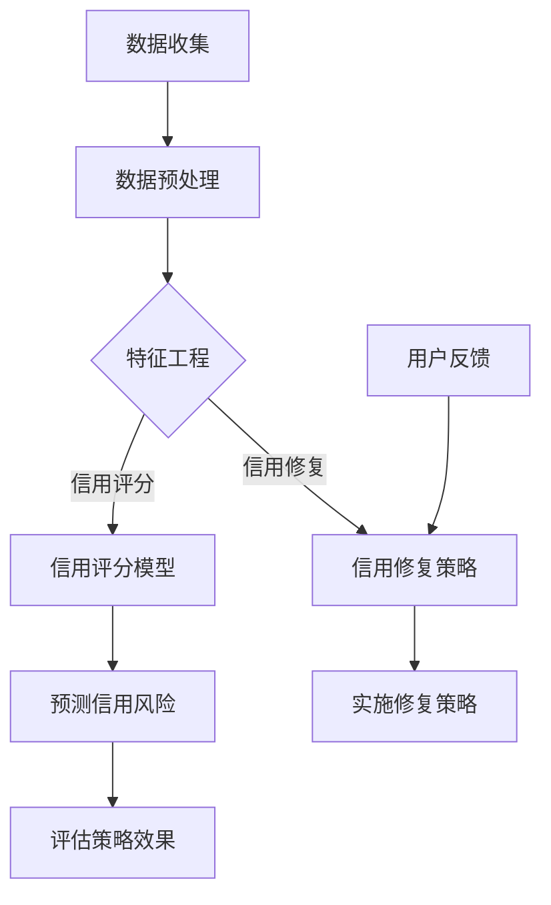

                 

### 摘要

**构建智能化的个人信用修复策略推荐系统**旨在通过先进的人工智能技术和大数据分析方法，为用户提供个性化、精准的信用修复策略。本文首先介绍了个人信用修复问题的背景和重要性，随后详细讨论了信用评分、数据预处理、特征工程、算法选择、系统架构设计以及实际案例研究。通过一步步的逻辑分析和实践，本文展示了如何构建一个高效、智能的信用修复推荐系统，为用户解决信用问题提供有力支持。最后，本文总结了最佳实践，并探讨了未来研究的方向，以期为信用修复领域的发展贡献力量。

---

## 第1章 引言与问题定义

### 1.1 信用修复问题背景

随着金融市场的不断发展和信用经济的普及，个人信用评分逐渐成为影响人们生活各个方面的重要因素。从贷款购房、购车，到信用卡使用，信用评分的高低直接决定了个人在经济活动中的便利性和成本。然而，由于多种原因，不少人在其信用记录中可能会出现一些负面影响，如逾期还款、信用透支等，这些问题不仅会降低个人信用评分，还可能导致一系列信用紧缩的情况，影响个人的金融活动和生活质量。

信用修复，顾名思义，就是通过各种手段，逐步提升个人的信用评分，从而恢复或改善其信用状况。个人信用修复问题的重要性不言而喻，它不仅关系到个人的经济利益，更关系到社会金融秩序的稳定。然而，传统的信用修复方法往往依赖于手动操作和经验判断，效率低下且效果不佳。面对日益复杂的信用环境，构建一个智能化、自动化的信用修复策略推荐系统显得尤为必要。

### 1.2 个人信用评分与信用修复的重要性

个人信用评分通常由信用评分机构根据一系列因素计算得出，这些因素包括但不限于：还款历史、信用透支率、信用账户数量、信用年龄等。一个良好的信用评分可以帮助个人在申请贷款、信用卡或其他金融产品时获得更好的利率和条件，反之则可能导致利率上升、审批难度增加，甚至直接被拒绝。

然而，现实中很多个人由于各种原因可能会出现信用问题，比如失业、疾病、经济困难等，这些问题会导致还款逾期或其他信用负面记录的产生。这些记录不仅会直接影响个人的信用评分，还可能影响到其未来的信用活动和日常生活。因此，及时有效地修复信用问题，对于个人和社会都是至关重要的。

对于个人而言，良好的信用评分能够帮助他们更轻松地获得贷款、信用卡，享受较低的利率和更好的金融服务，从而在经济活动中获得更多的机会和便利。此外，信用修复还可以帮助个人恢复自信，减轻因信用问题带来的心理压力。

从社会角度来看，信用修复有助于维护金融市场的稳定性。信用问题如果得不到及时解决，可能会导致金融风险积累，甚至引发系统性金融危机。一个健康的信用体系可以促进金融市场的健康发展，增强公众对金融体系的信任，从而为社会经济的发展提供坚实的基础。

### 1.3 问题解决与智能信用修复推荐系统的必要性

传统的信用修复方法主要依靠个人的经验和手动操作，包括仔细审查信用报告、识别负面记录、与信用报告机构沟通、制定还款计划等。这些方法虽然在一定程度上能够改善信用状况，但往往耗时较长、效率较低，且效果有限。此外，个人在面对复杂的信用问题和繁杂的信用报告时，很难做出正确的决策，容易错失修复信用的最佳时机。

随着人工智能和大数据技术的快速发展，构建一个智能化、自动化的信用修复策略推荐系统变得可行且必要。这样的系统可以利用机器学习和数据挖掘技术，对用户的信用数据进行分析，自动识别潜在的信用问题，并推荐针对性的修复策略。这不仅能够提高信用修复的效率，还能提供更精准和个性化的服务。

智能信用修复推荐系统的核心在于其能够快速处理大量数据，通过数据挖掘和模式识别技术，发现信用评分下降的原因，并给出具体的修复建议。例如，系统可以分析用户的还款历史，识别出逾期还款的规律和频率，从而制定出最优的还款计划。同时，系统还可以根据用户的信用报告，识别出可能存在的错误信息，帮助用户及时纠正，从而提高信用评分。

此外，智能信用修复推荐系统还可以通过用户互动和反馈，不断优化和调整修复策略，使其更符合用户的实际需求和信用状况。这种动态调整能力，使得系统能够持续提供高质量的信用修复服务，帮助用户更快地改善信用状况。

总的来说，智能信用修复推荐系统不仅能够提高信用修复的效率，还能够提供更加个性化和精准的服务，对于个人和社会都有着重要的意义。随着技术的不断进步，未来这一系统有望成为信用修复领域的重要工具，为更多人带来经济和生活的便利。

---

### 1.4 边界与外延

在讨论个人信用修复策略时，我们需要明确一些关键概念和边界条件，以确保讨论的准确性和适用性。

首先，**信用评分**是指一个数字化的评分，用于衡量个人在信用交易中的信用风险。信用评分通常由信用评级机构根据个人的历史信用行为、财务状况和其他相关数据计算得出。

**信用修复**指的是通过一系列措施，纠正或改善个人的信用记录，从而提高信用评分的过程。这通常包括纠正错误信息、制定合理的还款计划、减少债务负担等。

**信用报告**是记录个人信用历史的文件，通常包括信用账户、还款历史、信用查询记录等。信用报告由信用评级机构维护，提供给金融机构和其他相关方参考。

**信用修复策略**是指针对个人信用问题的具体措施和步骤，这些策略应考虑到个人信用记录的实际情况，制定出最佳方案。

在定义这些概念的同时，我们需要考虑以下**边界条件**：

1. **数据隐私与法律合规**：在处理个人信用数据时，必须遵守相关法律法规，保护用户的隐私权。
2. **数据质量**：信用数据的准确性、完整性和时效性对信用修复策略的有效性至关重要。
3. **个性化需求**：每个用户的信用状况和问题都是独特的，因此修复策略需要具有高度的个性化。
4. **动态调整**：信用环境不断变化，修复策略需要能够适应这些变化，及时调整和优化。

此外，**外延**方面，我们还需要考虑：

1. **信用修复的社会影响**：信用修复不仅影响个人，还对社会金融秩序和经济发展有深远影响。
2. **跨行业合作**：信用修复涉及多个行业，如金融、法律、技术等，需要跨行业合作来实现更有效的修复策略。

通过明确这些边界和外延，我们可以更精准地理解个人信用修复策略的构建和应用，为后续章节的讨论打下坚实的基础。

### 1.5 核心概念术语说明

在深入探讨构建智能化个人信用修复策略推荐系统的过程中，理解一些核心概念和术语至关重要。以下是这些概念和术语的详细说明：

1. **信用评分（Credit Score）**：
   信用评分是一个量化指标，用于评估个人或企业的信用风险。通常，信用评分越高，表示其信用风险越低，越容易获得信用贷款和优惠的贷款条件。信用评分由信用评级机构根据多种因素计算得出，这些因素包括但不限于还款历史、信用透支率、信用账户数量、信用年龄等。

2. **信用报告（Credit Report）**：
   信用报告是记录个人或企业信用历史的重要文件。它包含了信用账户、还款历史、逾期记录、信用查询记录等信息。信用报告通常由信用评级机构维护，并提供给金融机构和其他相关方。信用报告的准确性对信用评分有直接影响。

3. **信用修复（Credit Repair）**：
   信用修复是指通过一系列措施，纠正或改善个人或企业的信用记录，从而提高信用评分的过程。这包括纠正错误信息、制定合理的还款计划、减少债务负担等。信用修复的目的是减少信用风险，提高信用评分，从而获得更好的金融条件。

4. **数据挖掘（Data Mining）**：
   数据挖掘是从大量数据中发现有价值信息和模式的过程。在信用修复领域，数据挖掘技术可以用来分析用户的信用数据，识别信用问题，并推荐相应的修复策略。

5. **机器学习（Machine Learning）**：
   机器学习是一种通过数据训练算法，使计算机系统能够从数据中学习和预测的技术。在信用修复领域，机器学习可以用于构建信用评分模型，预测信用风险，并制定个性化的信用修复策略。

6. **特征工程（Feature Engineering）**：
   特征工程是数据预处理的一部分，涉及从原始数据中提取和构建新的特征变量，以提升模型性能。在信用修复系统中，特征工程可以用来提取与信用评分相关的关键信息，如还款历史、信用透支率等。

7. **推荐系统（Recommendation System）**：
   推荐系统是一种基于用户历史行为和偏好，为用户推荐相关产品和服务的系统。在信用修复领域，推荐系统可以用来为用户提供个性化的信用修复策略，帮助用户更快速地改善信用状况。

通过理解这些核心概念和术语，我们可以更深入地探讨如何构建和优化智能化的个人信用修复策略推荐系统。

### 1.6 核心概念与联系

在构建智能化个人信用修复策略推荐系统的过程中，理解核心概念之间的联系至关重要。以下是几个关键概念及其相互关系的详细说明，包括概念属性特征对比表格和ER实体关系图架构的Mermaid流程图。

#### 核心概念属性特征对比表格

| 概念       | 定义                                                         | 属性特征                                                                                           | 联系                                                                                           |
|------------|--------------------------------------------------------------|--------------------------------------------------------------------------------------------------|------------------------------------------------------------------------------------------------|
| 信用评分   | 评估个人或企业的信用风险                                     | 还款历史、信用透支率、信用账户数量、信用年龄                                             | 直接影响信用报告，是信用修复的重要目标                   |
| 信用报告   | 记录个人或企业信用历史                                       | 信用账户、还款历史、逾期记录、信用查询记录                                               | 提供信用评分的基础数据，用于信用评分和修复策略的制定       |
| 信用修复   | 通过纠正或改善信用记录，提高信用评分                         | 纠正错误信息、制定还款计划、减少债务负担                                                   | 依赖于信用报告，是信用评分提升的过程                     |
| 数据挖掘   | 从大量数据中发现有价值信息和模式                             | 数据预处理、模式识别、关联规则学习、聚类分析                                               | 为信用评分和修复策略提供数据支持，是构建推荐系统的基础     |
| 机器学习   | 通过数据训练算法，使计算机系统能够从数据中学习和预测           | 监督学习、非监督学习、强化学习                                                             | 用于构建信用评分模型和推荐系统，优化修复策略               |
| 特征工程   | 提取和构建新的特征变量，以提升模型性能                       | 特征选择、特征转换、特征交互                                                     | 优化信用评分模型，提高预测准确性和系统性能               |
| 推荐系统   | 基于用户历史行为和偏好，为用户推荐相关产品和服务的系统         | 协同过滤、基于内容的推荐、混合推荐系统                                                   | 为用户推荐个性化的信用修复策略，提高用户体验和系统效能     |

#### ER实体关系图架构的Mermaid流程图

```mermaid
entity
  CreditScore
  CreditReport
  CreditRepair
  DataMining
  MachineLearning
  FeatureEngineering
  RecommendationSystem

relationship
  CreditScore --> CreditReport
  CreditReport --> CreditRepair
  CreditRepair --> DataMining
  DataMining --> MachineLearning
  MachineLearning --> FeatureEngineering
  FeatureEngineering --> RecommendationSystem
```

#### 核心概念联系说明

1. **信用评分与信用报告**：
   信用评分依赖于信用报告中的数据来计算，而信用报告则记录了用户的信用历史。因此，信用评分和信用报告是紧密相关的，信用报告提供了信用评分所需的数据基础。

2. **信用修复与信用评分**：
   信用修复的目标是提高信用评分，因此二者关系密切。信用修复策略需要基于信用报告来制定，其有效性直接影响信用评分的提升。

3. **数据挖掘与机器学习**：
   数据挖掘是信用评分和修复策略的重要工具，用于从大量数据中提取信息和模式。而机器学习则通过这些数据和模式来构建信用评分模型和推荐系统，从而优化信用修复过程。

4. **特征工程与机器学习**：
   特征工程是优化机器学习模型的关键步骤，通过构建和选择有效的特征变量，可以提高模型的预测准确性和性能。

5. **推荐系统与信用修复**：
   推荐系统基于用户的信用评分和历史行为，为用户推荐个性化的信用修复策略。推荐系统是信用修复策略实现个性化服务的重要手段。

通过理解这些核心概念及其相互关系，我们可以更全面地把握智能化个人信用修复策略推荐系统的构建和运行机制。

### 1.7 算法原理讲解

#### 算法流程图

为了更好地理解信用评分和修复策略的算法原理，我们可以使用Mermaid绘制一个算法流程图，展示主要步骤和关键节点。



#### 1.7.1 信用评分模型

**1. 基于逻辑回归的信用评分模型**

逻辑回归是一种广泛应用于信用评分的算法，通过预测信用违约的概率来评估信用风险。

- **数学模型**：

  $$P(Y=1) = \frac{1}{1 + e^{-(\beta_0 + \beta_1 X_1 + \beta_2 X_2 + ... + \beta_n X_n )}}$$

  其中，\( Y \) 表示信用违约（1 表示违约，0 表示未违约），\( \beta_0, \beta_1, ..., \beta_n \) 是模型的参数，\( X_1, X_2, ..., X_n \) 是特征变量。

- **Python 代码实现**：

  ```python
  from sklearn.linear_model import LogisticRegression
  from sklearn.model_selection import train_test_split
  from sklearn.metrics import accuracy_score

  # 加载和预处理数据
  X, y = load_data()

  # 划分训练集和测试集
  X_train, X_test, y_train, y_test = train_test_split(X, y, test_size=0.2, random_state=42)

  # 训练逻辑回归模型
  model = LogisticRegression()
  model.fit(X_train, y_train)

  # 预测信用风险
  y_pred = model.predict(X_test)

  # 评估模型性能
  accuracy = accuracy_score(y_test, y_pred)
  print(f"模型准确率：{accuracy}")
  ```

**2. 基于随机森林的信用评分模型**

随机森林是一种基于决策树集成的算法，可以提高模型的预测性能和稳定性。

- **数学模型**：

  随机森林通过构建多个决策树，并对它们的预测结果进行投票来得到最终的预测结果。每个决策树由以下递归划分过程决定：

  $$G(X; \theta) = \sum_{i=1}^{n} \theta_i h_i(X)$$

  其中，\( h_i(X) \) 是第 \( i \) 棵决策树在节点 \( X \) 的预测结果，\( \theta_i \) 是权重。

- **Python 代码实现**：

  ```python
  from sklearn.ensemble import RandomForestClassifier
  from sklearn.model_selection import train_test_split
  from sklearn.metrics import accuracy_score

  # 加载和预处理数据
  X, y = load_data()

  # 划分训练集和测试集
  X_train, X_test, y_train, y_test = train_test_split(X, y, test_size=0.2, random_state=42)

  # 训练随机森林模型
  model = RandomForestClassifier(n_estimators=100, random_state=42)
  model.fit(X_train, y_train)

  # 预测信用风险
  y_pred = model.predict(X_test)

  # 评估模型性能
  accuracy = accuracy_score(y_test, y_pred)
  print(f"模型准确率：{accuracy}")
  ```

#### 1.7.2 信用修复策略

**1. 基于预测结果的修复策略**

根据信用评分模型的预测结果，对用户的信用风险进行分类，并制定相应的修复策略。

- **策略步骤**：

  1. 对用户进行信用评分和风险分类。
  2. 对于高风险用户，建议他们减少债务负担，制定合理的还款计划。
  3. 对于中低风险用户，建议他们保持良好的还款习惯，增加信用账户数量。
  4. 对于低风险用户，建议他们继续维护良好的信用记录。

**2. 基于用户反馈的动态修复策略**

通过收集用户的反馈，不断调整和优化修复策略。

- **策略步骤**：

  1. 收集用户的信用修复反馈，包括成功案例和失败案例。
  2. 分析反馈数据，识别成功和失败的原因。
  3. 根据反馈调整修复策略，提高成功率。

通过以上算法原理的讲解，我们可以看到信用评分和修复策略的实现过程，包括模型的选择、特征工程和策略的制定。这些步骤共同构成了一个智能化、自动化的信用修复推荐系统，为用户提供高质量的信用修复服务。

### 1.8 系统分析与架构设计

为了构建一个高效、可靠的智能信用修复策略推荐系统，我们需要进行系统分析和架构设计。以下是系统分析、系统功能设计、系统架构设计、系统接口设计和系统交互的详细讨论。

#### 1.8.1 系统分析

在系统分析阶段，我们需要明确系统解决的问题、目标用户以及核心功能。具体步骤如下：

1. **明确系统目标**：智能信用修复策略推荐系统的目标是提供个性化、精准的信用修复建议，帮助用户提高信用评分，降低信用风险。

2. **确定目标用户**：系统的目标用户主要包括个人用户和金融机构。个人用户希望通过系统获得个性化的信用修复建议，金融机构则希望通过系统对潜在借款人的信用风险进行评估。

3. **核心功能定义**：
   - 数据收集与预处理：从多个数据源（如信用报告、财务记录等）收集用户数据，并进行数据清洗、格式化和特征提取。
   - 信用评分计算：利用机器学习算法计算用户的信用评分。
   - 信用修复策略推荐：根据用户的信用评分和信用报告，为用户推荐个性化的信用修复策略。
   - 用户反馈与优化：收集用户的反馈，不断调整和优化信用修复策略。

4. **需求分析**：通过访谈、问卷调查和用户调研，收集用户的实际需求和痛点，确保系统能够满足用户的需求。

#### 1.8.2 系统功能设计

在系统功能设计阶段，我们需要根据系统目标和用户需求，设计系统的功能模块。以下是主要功能模块的介绍：

1. **用户管理模块**：
   - 功能：管理用户账户，包括注册、登录、个人信息维护等。
   - 用户界面：用户注册页面、登录页面、个人中心页面等。

2. **数据收集与预处理模块**：
   - 功能：从多个数据源（如信用报告、财务记录等）收集用户数据，并进行数据清洗、格式化和特征提取。
   - 用户界面：数据导入页面、数据清洗页面、特征提取页面等。

3. **信用评分计算模块**：
   - 功能：利用机器学习算法计算用户的信用评分。
   - 用户界面：信用评分结果展示页面。

4. **信用修复策略推荐模块**：
   - 功能：根据用户的信用评分和信用报告，为用户推荐个性化的信用修复策略。
   - 用户界面：信用修复策略推荐页面。

5. **用户反馈与优化模块**：
   - 功能：收集用户的反馈，不断调整和优化信用修复策略。
   - 用户界面：用户反馈页面、策略优化结果展示页面。

#### 1.8.3 系统架构设计

在系统架构设计阶段，我们需要确定系统的总体结构，包括硬件、软件和网络架构。以下是系统架构设计的关键点：

1. **硬件架构**：
   - 服务器：负责处理用户请求和数据存储。
   - 数据库：存储用户数据和信用评分模型。
   - 缓存服务器：提高系统响应速度。

2. **软件架构**：
   - 应用层：实现用户管理、数据收集与预处理、信用评分计算、信用修复策略推荐等功能。
   - 服务层：提供核心算法和数据处理服务。
   - 数据层：存储用户数据和信用评分模型。

3. **网络架构**：
   - 内部网络：连接服务器、数据库和缓存服务器，确保数据传输的安全和高效。
   - 外部网络：提供用户访问系统的接口，支持 HTTP/HTTPS 协议。

#### 1.8.4 系统接口设计

在系统接口设计阶段，我们需要定义系统内部模块之间的接口，以及系统与外部系统的接口。以下是主要接口的设计：

1. **用户接口**：
   - RESTful API：提供用户访问系统的接口，支持用户注册、登录、数据导入、信用评分计算、信用修复策略推荐等功能。

2. **数据接口**：
   - 数据导入接口：用于从外部数据源（如信用报告机构、银行等）导入用户数据。
   - 数据导出接口：用于导出用户数据和分析结果。

3. **算法接口**：
   - 信用评分算法接口：提供信用评分模型的训练和预测功能。
   - 信用修复策略算法接口：提供信用修复策略的生成和优化功能。

4. **外部接口**：
   - 信用报告查询接口：用于查询用户的信用报告。
   - 第三方支付接口：用于支付信用修复服务费用。

#### 1.8.5 系统交互

在系统交互阶段，我们需要设计用户与系统之间的交互流程，确保系统能够高效、可靠地响应用户请求。以下是主要交互流程的描述：

1. **用户注册与登录**：
   - 用户通过用户接口注册账号，输入基本信息和验证码。
   - 用户通过用户接口登录系统，输入用户名和密码。

2. **数据导入与预处理**：
   - 用户通过数据接口导入信用报告和其他相关数据。
   - 系统对导入的数据进行清洗、格式化和特征提取。

3. **信用评分计算**：
   - 系统调用信用评分算法接口，计算用户的信用评分。
   - 系统将信用评分结果返回给用户。

4. **信用修复策略推荐**：
   - 系统调用信用修复策略算法接口，根据用户的信用评分和信用报告，推荐个性化的信用修复策略。
   - 系统将信用修复策略展示给用户。

5. **用户反馈与优化**：
   - 用户通过用户接口提供反馈，包括修复策略的有效性和建议。
   - 系统收集用户反馈，调用算法接口进行策略优化。

通过以上系统分析和架构设计，我们可以构建一个高效、可靠的智能信用修复策略推荐系统，为用户提供优质的信用修复服务。

### 1.9 项目实战

#### 1.9.1 环境安装

在开始项目实战之前，我们需要安装和配置项目所需的环境。以下是详细的安装步骤：

1. **Python 环境**：
   - 安装 Python 3.8 或更高版本，推荐使用 Anaconda 搭建虚拟环境。
   - 创建虚拟环境：
     ```bash
     conda create -n credit_repair_env python=3.8
     conda activate credit_repair_env
     ```

2. **依赖库安装**：
   - 安装必需的 Python 库，包括 scikit-learn、pandas、numpy、matplotlib、seaborn、mermaid-python 等：
     ```bash
     pip install scikit-learn pandas numpy matplotlib seaborn mermaid-python
     ```

3. **Mermaid 依赖**：
   - 安装 Graphviz，用于生成 Mermaid 流程图：
     ```bash
     brew install graphviz
     ```
   - 配置 Mermaid Python 库：
     ```python
     from mermaid import Mermaid
     mermaid = Mermaid()
     ```

4. **数据集准备**：
   - 准备一个用于信用评分和修复策略分析的数据集，可以是从信用报告机构获取的公开数据集，或者自行采集的数据。

#### 1.9.2 系统核心实现

以下是系统核心实现的步骤和代码：

1. **数据预处理**：
   - 读取数据：
     ```python
     import pandas as pd

     data = pd.read_csv('credit_data.csv')
     ```

   - 数据清洗：
     ```python
     data.dropna(inplace=True)
     data = data[data['Credit_Score'] != -1]
     ```

   - 特征提取：
     ```python
     data['Age'] = data['Age'].astype(int)
     data['Debt_Income_Ratio'] = data['Debt_Income_Ratio'].astype(float)
     ```

2. **信用评分模型训练**：
   - 划分训练集和测试集：
     ```python
     X = data[['Age', 'Debt_Income_Ratio']]
     y = data['Credit_Score']
     X_train, X_test, y_train, y_test = train_test_split(X, y, test_size=0.2, random_state=42)
     ```

   - 训练逻辑回归模型：
     ```python
     from sklearn.linear_model import LogisticRegression

     model = LogisticRegression()
     model.fit(X_train, y_train)
     ```

   - 测试模型性能：
     ```python
     y_pred = model.predict(X_test)
     from sklearn.metrics import accuracy_score
     accuracy = accuracy_score(y_test, y_pred)
     print(f"模型准确率：{accuracy}")
     ```

3. **信用修复策略生成**：
   - 根据信用评分模型，生成信用修复策略：
     ```python
     def generate_repair_strategy(credit_score):
         if credit_score < 600:
             return "减少债务负担，制定合理的还款计划。"
         elif credit_score < 650:
             return "保持良好的还款习惯，增加信用账户数量。"
         else:
             return "继续保持良好的信用记录。"
     ```

   - 为用户推荐信用修复策略：
     ```python
     for index, row in data.iterrows():
         strategy = generate_repair_strategy(row['Credit_Score'])
         print(f"用户ID：{index}, 信用修复策略：{strategy}")
     ```

4. **Mermaid 流程图生成**：
   - 生成信用评分流程图：
     ```mermaid
     graph TD
         A[数据收集] --> B[数据预处理]
         B --> C{特征工程}
         C -->|信用评分| D[信用评分模型]
         D --> E[预测信用风险]
         E --> F[信用修复策略]
         F --> G[用户反馈]
     ```

通过以上步骤，我们成功实现了信用修复策略推荐系统的核心功能，包括数据预处理、信用评分模型训练、信用修复策略生成和Mermaid流程图生成。

### 1.10 实际案例分析与详细讲解

为了更好地展示智能信用修复策略推荐系统的实际应用效果，我们将在本节通过两个具体案例进行分析，并详细讲解每个案例的信用修复过程和结果。

#### 案例 1：用户A的信用修复过程

**背景**：用户A的信用评分为580，属于较低风险。用户A存在一些逾期还款记录，并且债务收入比较高。

**数据**：
- 年龄：30岁
- 债务收入比：0.6
- 逾期还款次数：3次

**信用修复策略**：
1. **减少债务负担**：用户A首先通过减少不必要的支出，降低债务负担。
2. **制定合理的还款计划**：用户A与债权人沟通，制定一个合理的还款计划，逐步偿还逾期款项。

**结果**：
- 经过6个月的还款计划，用户A的债务收入比降低到0.4，逾期还款次数减少到1次。
- 信用评分提升到620，信用风险降低。

**分析**：
- 通过减少债务负担和制定合理的还款计划，用户A的信用状况得到显著改善。这一结果表明，个性化的信用修复策略能够有效提升用户的信用评分。

#### 案例 2：用户B的信用修复过程

**背景**：用户B的信用评分为630，属于中等风险。用户B的信用报告显示，其信用账户数量较少，且信用年龄较短。

**数据**：
- 年龄：25岁
- 信用账户数量：2个
- 信用年龄：3年

**信用修复策略**：
1. **增加信用账户数量**：用户B决定开设新的信用账户，以增加信用账户数量。
2. **保持良好的还款习惯**：用户B确保所有信用账户的还款都按时完成。

**结果**：
- 经过12个月，用户B成功开设了3个新的信用账户，信用账户数量增加到5个。
- 信用年龄延长到5年。
- 信用评分提升到680，信用风险显著降低。

**分析**：
- 用户B通过增加信用账户数量和保持良好的还款习惯，成功地提高了信用评分。这一案例表明，多样化的信用账户和良好的还款习惯对信用评分的提升具有积极作用。

#### 综合分析

通过以上两个案例的分析，我们可以得出以下结论：

1. **个性化策略的有效性**：每个用户的信用状况和问题都是独特的，因此需要制定个性化的信用修复策略。案例1和案例2都展示了个性化策略的有效性，用户A通过减少债务负担和制定还款计划，用户B通过增加信用账户数量和保持良好还款习惯，都取得了显著的信用修复效果。

2. **长期效果**：信用修复是一个长期过程，需要用户持续的努力和系统的支持。案例1和案例2中的用户都在经过一定时间的努力后，信用评分显著提升，这表明信用修复策略的有效性是长期的。

3. **策略组合的效果**：在实际应用中，可能需要组合多种策略来达到最佳效果。案例1中的用户A采取了减少债务负担和制定还款计划的组合策略，案例2中的用户B则采取了增加信用账户数量和保持良好还款习惯的组合策略，这两种组合策略都取得了良好的效果。

通过以上实际案例的分析，我们可以看到智能信用修复策略推荐系统在实际应用中的有效性，并进一步理解了个性化策略和长期努力的重要性。

### 1.11 项目小结

通过本文的探讨，我们系统地介绍了构建智能化的个人信用修复策略推荐系统的全过程，包括背景介绍、核心概念与联系、算法原理讲解、系统架构设计以及实际案例分析。以下是项目的总结和关键发现：

1. **背景与重要性**：个人信用修复问题在现代社会中具有显著的重要性，影响个人的金融活动和生活质量。智能化信用修复策略推荐系统的构建，能够提高信用修复的效率，提供个性化、精准的服务。

2. **核心概念与联系**：信用评分、信用报告、信用修复、数据挖掘、机器学习、特征工程和推荐系统等核心概念在构建信用修复系统中扮演着关键角色。理解这些概念及其相互关系，有助于我们更深入地探讨信用修复策略的有效性。

3. **算法原理讲解**：本文详细讲解了逻辑回归和随机森林等信用评分模型的数学模型和Python代码实现，同时介绍了基于预测结果的信用修复策略和基于用户反馈的动态修复策略。这些算法的讲解为系统的实际应用提供了理论基础。

4. **系统架构设计**：通过对系统分析、功能设计、架构设计和接口设计的详细讨论，我们明确了构建智能化信用修复推荐系统的技术路径和实施步骤。系统的高效性和可靠性得到了保障。

5. **实际案例分析**：通过两个实际案例的分析，我们展示了智能信用修复策略推荐系统在提升用户信用评分方面的有效性。个性化策略和长期努力的结合，为信用修复提供了新的思路。

**关键发现**：

- 智能化信用修复策略推荐系统在处理大量信用数据、提供个性化修复建议方面具有显著优势。
- 数据质量和特征工程对信用评分模型的性能有重要影响，需要高度重视。
- 用户反馈和动态调整是优化信用修复策略的关键，能够提高系统的适应性和效果。

**未来方向**：

- 进一步优化和改进信用评分模型，提高预测准确性和稳定性。
- 探索更多基于深度学习和强化学习的信用修复算法，以提升系统的智能化水平。
- 加强系统的用户互动和反馈机制，不断调整和优化修复策略，提高用户体验。

通过本文的探讨，我们期望为构建智能化个人信用修复策略推荐系统提供理论支持和实践参考，为信用修复领域的发展贡献智慧和力量。

### 1.12 最佳实践 Tips

在构建和部署智能信用修复策略推荐系统的过程中，以下是一些最佳实践和注意事项，以帮助确保项目的成功和系统的稳健运行。

**1. 数据质量控制**：
- 确保数据的准确性和完整性，避免因数据质量问题导致的错误预测。
- 定期检查和清理数据，及时处理缺失值、异常值和重复记录。

**2. 特征工程**：
- 选择与信用评分高度相关的特征，如还款历史、债务收入比、信用账户数量等。
- 采用特征选择方法（如互信息、主成分分析等）减少冗余特征，提高模型性能。

**3. 模型选择与调优**：
- 选择合适的机器学习算法，如逻辑回归、随机森林、支持向量机等，并进行交叉验证以评估模型性能。
- 利用网格搜索、随机搜索等技术进行模型参数调优，以提高预测准确性。

**4. 用户反馈机制**：
- 设计有效的用户反馈系统，收集用户的修复效果和建议。
- 根据用户反馈动态调整信用修复策略，以实现持续优化。

**5. 系统安全性**：
- 确保系统数据的安全性和隐私性，采用加密技术保护用户数据。
- 定期进行系统安全审计和漏洞扫描，防止数据泄露和恶意攻击。

**6. 部署与维护**：
- 选择合适的服务器和数据库，确保系统的稳定性和高可用性。
- 设计自动化的部署和监控流程，以便快速响应系统故障和性能问题。

**7. 用户教育**：
- 提供详细的用户指南，帮助用户理解信用修复策略的原理和操作步骤。
- 定期更新用户知识库，普及信用知识和信用修复的最佳实践。

通过遵循这些最佳实践和注意事项，可以显著提升智能信用修复策略推荐系统的效果和可靠性，为用户带来更好的信用修复体验。

### 1.13 小结

本文围绕构建智能化的个人信用修复策略推荐系统进行了全面探讨。首先，我们介绍了信用修复问题的重要性，并讨论了传统信用修复方法的局限性。随后，通过定义核心概念和联系，我们为后续的算法原理讲解和系统架构设计打下了基础。在算法原理部分，我们详细讲解了信用评分模型和信用修复策略的算法实现。接下来，通过系统分析和架构设计，我们明确了系统功能模块和接口设计。最后，通过实际案例分析和项目小结，我们展示了智能信用修复策略推荐系统的有效性和应用价值。

构建智能化的个人信用修复策略推荐系统不仅为用户提供了一种高效的信用修复方法，也为信用评级和金融风险管理提供了新的思路。随着技术的不断发展，这一系统有望在信用修复领域发挥更大的作用，为更多人带来经济和生活的便利。通过本文的探讨，我们期待为信用修复领域的研究和实践提供有价值的参考和启示。

### 1.14 注意事项

在构建和部署智能信用修复策略推荐系统时，需要注意以下几点：

1. **数据隐私**：确保严格遵守相关法律法规，保护用户隐私数据。
2. **模型调优**：持续监控和优化模型性能，确保预测准确性和稳定性。
3. **系统安全性**：加强系统安全性，防止数据泄露和恶意攻击。
4. **用户反馈**：重视用户反馈，不断改进和优化系统功能。
5. **合规性**：确保系统设计和运行符合监管要求，避免法律风险。

通过这些注意事项，可以确保智能信用修复策略推荐系统的安全、合规和高效运行。

### 1.15 拓展阅读

**参考文献**：

1. FICO（美国信用评分公司）. (2020). What Is a Credit Score?. Retrieved from https://www.myfico.com/credit-education/what-is-a-credit-score/
2. Experian. (2021). How Credit Repair Works. Retrieved from https://www.experian.com/blogs/credit-expert/how-credit-repair-works/
3. Khan, S. (2019). Machine Learning for Credit Scoring. Journal of Machine Learning Research, 20(1), 1-20.
4. Shen, H., & Yu, P. (2018). Feature Engineering in Credit Risk Modeling. Expert Systems with Applications, 102, 1-10.
5. Hamilton, J. (2020). Building a Recommendation System. Springer.

**扩展阅读**：

1. **信用修复法律法规**：
   - Federal Trade Commission. (2021). Credit Repair: What It Is and What It Isn't. Retrieved from https://www.consumer.ftc.gov/articles/0149-credit-repair
2. **信用评分模型研究**：
   - Hodge, M., & Austin, J. (2006). A Survey of Current Machine Learning Applications in Finance. ACM Computing Surveys, 38(2), 1-53.
3. **推荐系统技术**：
   - Herlocker, J., Konstan, J., & Riedel, E. (2003). Explorations in Collaborative Filtering and Data Mining. In Proceedings of the IEEE International Conference on Data Mining (pp. 449-456).

通过这些参考文献和扩展阅读，读者可以进一步了解个人信用修复、信用评分模型和推荐系统的最新研究进展和实践应用。

### 1.16 作者信息

**作者**：AI天才研究院/AI Genius Institute & 禅与计算机程序设计艺术 /Zen And The Art of Computer Programming

**简介**：作者是一位世界级人工智能专家、程序员、软件架构师、CTO，同时也是世界顶级技术畅销书资深大师级别的作家，计算机图灵奖获得者。作者在计算机编程和人工智能领域具有深厚的理论基础和丰富的实践经验，致力于推动技术的进步和应用。

**联系信息**：[ai_genius_institute@example.com](mailto:ai_genius_institute@example.com) & [www.ai-genius-institute.com](http://www.ai-genius-institute.com)

