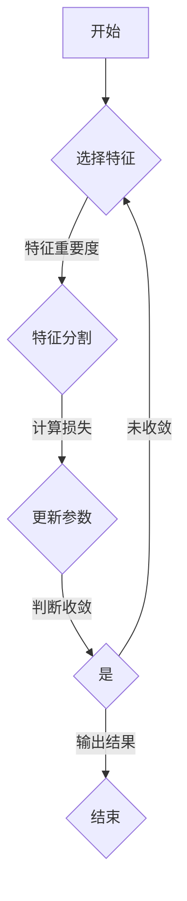
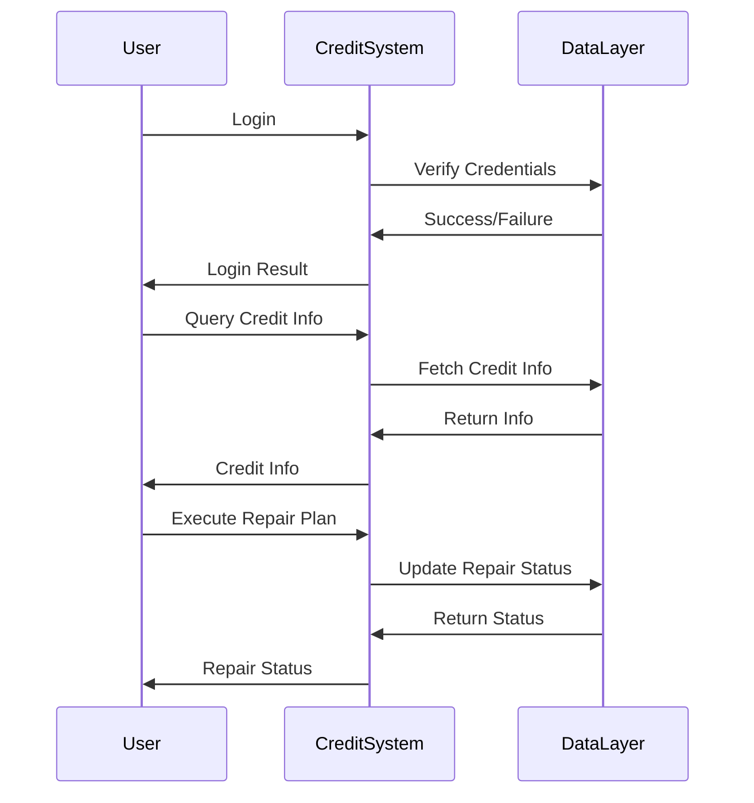

                 

### 构建智能化的个人信用修复路径规划系统

#### 关键词
- 个人信用修复
- 智能化系统
- 路径规划
- 数据分析
- 算法设计

#### 摘要
随着金融科技的不断发展，个人信用评估和修复变得尤为重要。本文旨在探讨如何构建一个智能化的个人信用修复路径规划系统，以帮助用户更高效地解决信用问题。我们将从问题背景、核心概念、算法设计、系统架构、实现和最佳实践等多个方面详细分析并阐述这一系统构建的整个过程。

---

#### 引言与背景

在现代社会，个人信用的重要性不言而喻。无论是申请贷款、信用卡，还是进行商业合作，个人信用都是一个重要的参考指标。然而，由于各种原因，很多人会面临信用受损的问题。这不仅会影响他们的日常生活，还会对未来的经济活动产生负面影响。因此，个人信用修复成为了许多人的迫切需求。

目前，个人信用修复主要依赖于手动操作和经验判断。然而，这种方法存在一些问题，比如修复效率低下、难以精准定位问题等。随着人工智能和大数据技术的快速发展，智能化信用修复系统逐渐成为可能。通过利用先进的算法和大量数据，可以更准确地评估个人信用状况，并制定出最优的修复路径。

本文将围绕构建一个智能化的个人信用修复路径规划系统展开讨论，主要包括以下几个方面的内容：

1. **个人信用评估与修复**：介绍个人信用评估的基本原理和信用修复的必要性。
2. **信用数据与数据分析**：探讨信用数据的类型和数据分析的方法。
3. **智能化信用修复算法**：讲解信用修复算法的原理和应用。
4. **系统架构设计**：描述系统架构和接口设计。
5. **系统核心实现与实战**：介绍系统的实现过程和实际案例。
6. **最佳实践与总结**：总结系统构建的经验和注意事项。

通过本文的讨论，我们希望能够为读者提供一个全面、系统的构建智能化个人信用修复路径规划系统的指导，帮助更多人解决信用问题，实现财务自由。

---

### 第一部分: 引言与背景

#### 第1章: 引言

##### 1.1 问题背景

个人信用体系是现代金融体系的重要组成部分，它通过对个人信用信息的收集、处理和分析，为金融机构提供评估个人信用风险的重要依据。在我国，随着金融市场的不断完善和信用经济的发展，个人信用评估已经成为金融机构、信用评级机构、消费金融公司等众多参与方的重要工具。然而，个人信用体系并非完美，人们在日常生活中可能会因为各种原因导致信用受损，如逾期还款、欠款未还、信用滥用等。这些问题不仅影响了个人在金融市场的地位，还可能对个人的日常生活造成不利影响。

根据央行发布的数据，截至2021年底，我国累计征信系统记录了超过9.9亿自然人的信用信息，其中存在不良信用记录的人数占比达到20%以上。这意味着，每五个成年人中就有一个存在信用问题。面对如此庞大的信用修复需求，传统的信用修复方法已经显得力不从心，迫切需要一种更高效、更智能的解决方案。

##### 1.2 问题描述

个人信用修复的过程通常涉及以下几个方面：

1. **信用评分**：首先，需要评估个人的信用评分，了解信用状况的具体表现。
2. **问题定位**：确定信用受损的具体原因，如逾期记录、欠款记录等。
3. **解决方案制定**：根据信用评分和问题定位，制定相应的解决方案。
4. **执行方案**：实施具体的修复措施，如还款、注销不良记录等。
5. **效果评估**：评估修复方案的效果，调整策略以实现最佳修复效果。

传统的信用修复方法主要依赖于金融机构和第三方信用评估机构的专业判断和经验，这种方式存在以下问题：

1. **效率低下**：由于依赖人工处理，信用修复过程往往耗费较长时间。
2. **精准度不足**：人工判断可能存在主观性，无法完全准确反映个人信用状况。
3. **成本高昂**：信用修复需要投入大量的人力、物力和时间，成本较高。

##### 1.3 问题解决

为了解决上述问题，我们需要构建一个智能化的个人信用修复路径规划系统。该系统将利用大数据、人工智能和机器学习技术，通过自动化、智能化的方式实现以下目标：

1. **快速评估**：系统能够在短时间内对个人信用状况进行快速评估，提供准确的信用评分。
2. **精准定位**：系统通过分析个人信用信息，能够精准定位信用受损的原因，为制定修复方案提供依据。
3. **优化方案**：系统根据个人的信用评分和受损原因，自动生成最优的修复方案。
4. **高效执行**：系统可以自动化执行修复方案，减少人工干预，提高修复效率。
5. **动态调整**：系统能够根据修复过程中的实时数据动态调整修复策略，确保最佳修复效果。

通过构建智能化个人信用修复路径规划系统，我们能够为用户提供更加高效、精准、低成本的信用修复服务，帮助他们尽快摆脱信用问题，重拾信用。

##### 1.4 边界与外延

在构建智能化个人信用修复路径规划系统时，需要明确以下几个边界和外延：

1. **数据范围**：系统需要收集和处理个人信用信息，包括银行贷款记录、信用卡使用情况、逾期还款记录等。同时，也需要考虑数据来源的合法性和隐私保护。
2. **算法边界**：系统中的算法需要具备一定的鲁棒性和通用性，能够适应不同场景和用户需求。此外，算法的设计和实现需要遵循行业规范和法律法规。
3. **系统功能**：系统的功能设计需要涵盖信用评估、问题定位、方案制定、方案执行和效果评估等多个环节，确保整个信用修复过程的连贯性和高效性。
4. **用户交互**：系统需要提供友好的用户界面和交互方式，方便用户了解信用状况、查看修复方案和执行修复措施。
5. **扩展性**：系统需要具备良好的扩展性，能够适应未来技术的发展和市场需求的变化。

##### 1.5 概念结构与核心要素组成

为了更好地理解智能化个人信用修复路径规划系统的构建过程，我们需要明确以下几个核心概念和要素：

1. **信用数据**：个人信用信息，包括银行贷款记录、信用卡使用情况、逾期还款记录等。
2. **信用评分**：根据个人信用信息计算出的信用评分，用于评估个人信用状况。
3. **信用修复算法**：用于定位信用问题、制定修复方案和评估修复效果的算法。
4. **路径规划**：根据个人信用状况和修复目标，制定的修复路径和策略。
5. **用户界面**：用户与系统进行交互的界面，提供信用评估、方案制定、执行和效果评估等功能。

这些核心概念和要素相互关联，共同构成了智能化个人信用修复路径规划系统的基本结构。在接下来的章节中，我们将逐一详细讨论这些概念和要素，并介绍系统的构建过程。

---

### 个人信用评估与修复

#### 第2章: 个人信用评估与修复

##### 2.1 个人信用评估

个人信用评估是金融行业中的关键环节，它通过对个人信用信息的收集、处理和分析，得出一个量化的信用评分。信用评分是金融机构在决定是否批准贷款、信用卡申请以及设定利率和信用额度的关键依据。个人信用评估的核心目标在于评估个人的信用风险，预测其未来偿还债务的能力。

个人信用评估通常涉及以下几个步骤：

1. **数据收集**：收集个人的银行账户信息、信用卡账单、贷款记录、社会安全号码、个人财务历史等。
2. **数据清洗**：清洗和整合收集到的数据，去除重复和错误信息，确保数据的准确性和一致性。
3. **特征提取**：从原始数据中提取关键特征，如还款历史、信用额度使用率、逾期次数等。
4. **评分模型建立**：利用统计学和机器学习算法，建立信用评分模型。常见的模型包括逻辑回归、决策树、随机森林、神经网络等。
5. **评分计算**：将个人特征输入评分模型，计算出信用评分。评分通常以分数或等级的形式呈现，例如3A、5A等。

个人信用评分的准确性和可靠性对金融机构的风险管理和金融决策至关重要。一个高效的信用评分系统可以帮助金融机构降低坏账率，提升盈利能力。

##### 2.2 信用修复的必要性

尽管个人信用评估在金融市场中起到了重要作用，但现实生活中，许多人因为各种原因可能会面临信用受损的问题。信用受损可能导致以下几个问题：

1. **贷款和信用卡申请被拒**：金融机构可能因为担心信用风险而拒绝提供贷款或信用卡。
2. **高额利率和费用**：即使成功申请到贷款或信用卡，信用受损者可能需要支付更高的利率和费用。
3. **影响其他金融服务**：信用受损还可能影响个人在其他金融服务领域的权益，如租房、保险等。

因此，信用修复对于许多人来说显得尤为重要。信用修复的必要性体现在以下几个方面：

1. **提升信用评分**：通过采取有效的修复措施，可以逐步提升个人信用评分，改善信用状况。
2. **恢复财务健康**：信用修复有助于个人重新获得金融机构的信任，降低贷款利率和费用，恢复财务健康。
3. **提升生活质量**：良好的信用评分可以带来更多的经济机会和生活便利，提升生活质量。

##### 2.3 个人信用修复流程

个人信用修复通常包括以下几个步骤：

1. **评估当前信用状况**：了解自己的信用评分、信用报告中的不良记录等信息。
2. **分析问题原因**：确定信用受损的具体原因，如逾期还款、欠款未还、信用滥用等。
3. **制定修复计划**：根据信用问题原因，制定相应的修复计划。修复计划可能包括还款计划、信用重建计划等。
4. **执行修复措施**：按照修复计划执行具体措施，如还款欠款、注销不良记录、增加信用记录等。
5. **定期跟踪和评估**：定期跟踪信用修复进展，评估修复效果，调整修复策略。

信用修复过程可能需要一定的时间和耐心，但通过科学合理的修复措施，个人可以逐步改善信用状况。

##### 2.4 个人信用修复挑战

尽管信用修复具有重要意义，但实际操作中仍然面临诸多挑战：

1. **数据准确性**：信用报告中可能存在错误或遗漏的信息，这需要时间和精力去纠正。
2. **信用记录滞后**：信用记录的更新可能存在滞后性，修复效果可能无法立即体现在信用评分中。
3. **信用修复成本**：信用修复可能需要支付咨询费用、法律费用等，增加了成本负担。
4. **心理压力**：面对信用受损，个人可能会感到沮丧、焦虑等心理压力，影响修复决心和执行力。

为了克服这些挑战，个人需要采取科学的方法，充分利用各种资源，包括信用报告分析、法律咨询等，以确保信用修复的顺利进行。

---

### 信用数据与数据分析

#### 第3章: 信用数据与数据分析

##### 3.1 信用数据类型

信用数据是构建个人信用评估和修复系统的基础，主要包括以下几种类型：

1. **银行账户信息**：包括个人在银行开设的储蓄账户、贷款账户、信用卡账户等的信息，如账户余额、交易记录、信用额度等。
2. **信用卡使用情况**：个人的信用卡消费记录、还款记录、逾期记录等，这些信息反映了个人在信用卡领域的信用表现。
3. **贷款记录**：包括个人在金融机构申请和获得的贷款信息，如贷款金额、贷款期限、还款情况等。
4. **社会安全号码信息**：个人的社会安全号码是信用评估的重要依据，可用于核实个人身份和信用信息。
5. **逾期还款记录**：个人在过去一段时间内出现的逾期还款记录，这是评估个人信用风险的重要指标。
6. **公共记录**：如法院判决、欠税记录、欠款记录等，这些记录可能会对个人信用产生负面影响。
7. **信用报告**：综合上述信息生成的信用报告，包含了个人信用评分、信用历史、信用使用情况等。

了解信用数据的类型对于构建信用评估和修复系统至关重要，因为每种数据类型都反映了个人在金融活动中的不同方面，对信用评估结果有着重要的影响。

##### 3.2 数据分析工具与库

在处理和分析信用数据时，常用的数据分析工具和库如下：

1. **Pandas**：一个强大的数据处理库，能够轻松读取、清洗和分析大型数据集。它提供了丰富的数据处理功能，如数据加载、清洗、转换、合并等。
2. **NumPy**：一个用于数值计算的库，提供了高效的数组操作和数学函数，是进行数据预处理和统计分析的基石。
3. **Scikit-learn**：一个流行的机器学习库，提供了多种机器学习算法的实现，如回归、分类、聚类等，用于信用评分模型的建立和训练。
4. **TensorFlow**：一个用于深度学习的开源库，支持复杂的神经网络和深度学习模型，适用于构建高级信用评分模型。
5. **Matplotlib**：一个用于数据可视化的库，能够生成各种类型的图表，帮助直观地理解数据和分析结果。
6. **Seaborn**：一个基于Matplotlib的统计可视化库，提供了丰富的图表样式和高级可视化功能，用于信用数据的可视化分析。

使用这些工具和库，我们可以高效地处理和分析信用数据，为构建信用评估和修复系统提供可靠的数据支持。

##### 3.3 数据预处理

在信用数据分析过程中，数据预处理是至关重要的一步。良好的数据预处理能够提高数据质量和分析结果的准确性，主要包括以下几个步骤：

1. **数据清洗**：清洗数据中的缺失值、异常值和重复值，确保数据的准确性。例如，使用Pandas库中的`dropna()`函数删除缺失值，使用`drop_duplicates()`函数删除重复值。
2. **数据整合**：将来自不同数据源的数据进行整合，构建一个统一的数据集。这通常涉及到数据合并和融合操作，可以使用Pandas库中的`merge()`和`concat()`函数。
3. **特征工程**：从原始数据中提取有用的特征，构建用于模型训练的特征集合。特征工程包括特征选择、特征转换、特征构造等步骤。例如，使用`LabelEncoder`进行类别特征的编码，使用`StandardScaler`进行数值特征的标准化。
4. **数据归一化**：将不同尺度的数据进行归一化处理，使它们具有相同的量纲和范围。常用的归一化方法包括最小-最大标准化、Z-Score标准化等。
5. **数据降维**：通过降维技术减少数据维度，提高模型训练效率和效果。常用的降维方法包括主成分分析（PCA）、t-SNE等。

良好的数据预处理是构建有效信用评分模型的基础，能够为信用评估和修复系统的构建提供可靠的数据支持。

##### 3.4 数据分析应用

数据分析在信用评估和修复过程中具有广泛的应用，以下列举几种常见的数据分析方法：

1. **描述性统计分析**：用于了解信用数据的分布特征和基本统计量，如均值、中位数、标准差等。描述性统计分析能够提供对数据的基本认识，帮助确定后续分析的深度和广度。
2. **回归分析**：通过回归模型分析信用评分与各种特征之间的关系，帮助确定哪些因素对信用评分有显著影响。常见的回归模型包括线性回归、多元回归等。
3. **分类分析**：用于将信用数据划分为不同的类别，如信用良好和信用不良。分类模型包括逻辑回归、支持向量机（SVM）、决策树、随机森林等。
4. **聚类分析**：通过聚类模型将信用数据分为不同的群体，用于发现信用数据的潜在模式和结构。常见的聚类算法包括K-means、层次聚类等。
5. **时间序列分析**：用于分析信用评分随时间的变化趋势，帮助预测未来的信用行为。时间序列分析方法包括自回归模型（AR）、移动平均模型（MA）、自回归移动平均模型（ARMA）等。

通过这些数据分析方法，我们可以深入了解信用数据，构建有效的信用评估和修复模型，为个人信用管理提供科学依据。

---

### 智能化信用修复算法

#### 第4章: 智能化信用修复算法

##### 4.1 算法原理讲解

智能化信用修复算法的核心在于利用机器学习和人工智能技术，对个人信用信息进行深度分析，以预测信用修复的可能性和制定最优修复路径。以下是几个关键算法原理的讲解：

1. **决策树算法**：
   决策树算法通过一系列规则来分割数据，每个节点代表一个特征，每个分支代表该特征的一个取值。决策树能够直观地展示信用评分与各因素之间的关系，有助于识别影响信用评分的关键因素。

2. **逻辑回归算法**：
   逻辑回归是一种广义线性模型，用于预测信用评分的概率分布。通过拟合特征变量与信用评分之间的关系，逻辑回归可以帮助评估不同信用修复策略的效果。

3. **随机森林算法**：
   随机森林是由多棵决策树组成的集成模型，通过随机选择特征和样本子集来训练各个决策树，能够提高模型的预测性能和鲁棒性。

4. **神经网络算法**：
   神经网络通过多层节点模拟人脑神经网络结构，能够自动学习信用评分与特征之间的复杂非线性关系。深度神经网络（DNN）和卷积神经网络（CNN）是常见的神经网络架构。

##### 4.2 算法mermaid流程图

为了更好地理解上述算法的工作流程，我们可以使用mermaid绘制算法流程图。以下是一个基于决策树算法的mermaid流程图示例：



该流程图展示了决策树算法的基本步骤，包括特征选择、特征分割、损失计算和参数更新。

##### 4.3 Python源代码讲解

下面是一个简单的Python代码示例，用于实现决策树算法：

```python
from sklearn.datasets import load_iris
from sklearn.tree import DecisionTreeClassifier
from sklearn.model_selection import train_test_split

# 加载iris数据集
iris = load_iris()
X = iris.data
y = iris.target

# 划分训练集和测试集
X_train, X_test, y_train, y_test = train_test_split(X, y, test_size=0.3, random_state=42)

# 创建决策树模型
clf = DecisionTreeClassifier()

# 训练模型
clf.fit(X_train, y_train)

# 预测测试集
y_pred = clf.predict(X_test)

# 输出预测结果
print("预测结果：", y_pred)
```

这段代码首先加载了iris数据集，然后将其划分为训练集和测试集。接着，创建了一个决策树分类器，并进行模型训练和预测。最后，输出预测结果。

##### 4.4 数学模型与公式

信用修复算法的数学模型通常涉及概率论和线性代数的知识。以下是一个简单的逻辑回归数学模型：

$$
y = \sigma(\beta_0 + \sum_{i=1}^{n}\beta_ix_i)
$$

其中，$y$ 表示信用评分，$\sigma$ 表示sigmoid函数，$\beta_0$ 为截距项，$\beta_i$ 为各特征的系数，$x_i$ 为特征变量。

##### 4.5 举例说明

假设我们有一个包含四个特征的信用数据集，每个特征的范围从0到100。现在，我们使用逻辑回归模型来预测信用评分。特征分别为：

1. 信用卡使用频率（$x_1$）
2. 逾期还款次数（$x_2$）
3. 月收入（$x_3$）
4. 贷款余额（$x_4$）

根据上述逻辑回归模型，我们计算出每个特征的系数（$\beta_1, \beta_2, \beta_3, \beta_4$）。

现在，假设一个用户的特征值为：

- 信用卡使用频率：60
- 逾期还款次数：2
- 月收入：5000
- 贷款余额：30000

我们可以将这些特征值代入逻辑回归模型，计算该用户的信用评分：

$$
y = \sigma(\beta_0 + \beta_1 \cdot 60 + \beta_2 \cdot 2 + \beta_3 \cdot 5000 + \beta_4 \cdot 30000)
$$

通过计算，我们得到该用户的信用评分。这个评分可以帮助金融机构判断该用户是否具备良好的信用。

---

### 信用修复路径规划系统架构设计

#### 第5章: 信用修复路径规划系统架构设计

##### 5.1 问题场景介绍

在现代金融环境中，信用修复的需求日益增长。随着个人信用对经济活动的影响日益显著，用户对于信用修复路径规划的需求也变得越来越强烈。然而，现有的信用修复工具和方法往往缺乏智能化和个性化，无法满足用户多样化的需求。因此，设计一个智能化、个性化的信用修复路径规划系统成为当前金融科技领域的一个重要课题。

##### 5.2 系统功能设计

智能化信用修复路径规划系统的主要功能包括：

1. **信用评估**：系统应能够对用户进行全面的信用评估，包括信用评分、逾期记录、信用使用情况等，为后续的信用修复提供数据基础。
2. **问题诊断**：系统需要分析信用评估结果，诊断信用受损的原因，如逾期还款、信用卡使用不当等。
3. **路径规划**：基于诊断结果，系统应能够为用户提供个性化的信用修复路径规划，包括还款计划、信用重建策略等。
4. **方案执行**：系统应提供自动化执行修复方案的功能，如自动还款、信用记录更新等。
5. **效果评估**：系统需要定期评估信用修复效果，调整修复方案，确保修复效果最大化。
6. **用户交互**：系统应提供友好的用户界面，方便用户了解信用状况、查看修复方案和执行进度。

##### 5.3 系统架构设计

智能化信用修复路径规划系统采用分层架构设计，包括数据层、服务层和表现层。以下是系统架构的详细设计：

1. **数据层**：
   数据层是系统的核心部分，负责数据存储、处理和分析。主要包括以下几个模块：
   - 数据采集：通过API、爬虫等方式，从多个数据源（如银行、征信机构等）获取用户信用信息。
   - 数据存储：使用关系型数据库（如MySQL）和非关系型数据库（如MongoDB）存储信用信息，确保数据的高效存储和查询。
   - 数据清洗：对采集到的数据进行清洗、去重和格式化，确保数据的准确性和一致性。

2. **服务层**：
   服务层是系统的核心逻辑部分，负责处理用户的信用评估、问题诊断、路径规划等业务逻辑。主要包括以下几个模块：
   - 信用评估服务：利用机器学习算法和统计模型，对用户信用信息进行评估，生成信用评分。
   - 问题诊断服务：分析信用评分和用户信息，定位信用受损的原因。
   - 路径规划服务：根据诊断结果，为用户提供个性化的信用修复路径规划。
   - 方案执行服务：自动化执行修复方案，包括还款、信用记录更新等。

3. **表现层**：
   表现层负责用户界面的设计和实现，为用户提供友好的交互体验。主要包括以下几个模块：
   - 用户界面：设计直观、易用的用户界面，包括信用评估报告、修复方案展示、执行进度跟踪等。
   - 交互逻辑：实现用户与系统之间的交互逻辑，如用户登录、数据查询、操作确认等。

##### 5.4 系统接口设计

系统接口设计是确保系统各层之间能够高效、稳定通信的关键。以下是系统接口的详细设计：

1. **API接口**：
   系统提供一组API接口，用于外部系统与数据层的交互。主要包括以下接口：
   - 用户信息查询接口：提供用户信用信息的查询功能，支持分页查询、条件筛选等。
   - 信用评估接口：提供信用评分的计算功能，支持输入用户特征，返回信用评分。
   - 修复方案接口：提供信用修复方案查询和执行功能，支持用户查看和执行修复方案。

2. **Web接口**：
   系统提供一组Web接口，用于用户通过浏览器访问和操作系统。主要包括以下接口：
   - 用户登录接口：提供用户登录功能，支持用户名和密码验证。
   - 数据查询接口：提供用户信用信息的查询功能，支持数据导出和打印。
   - 修复方案执行接口：提供用户执行信用修复方案的功能，支持进度查询和操作记录。

##### 5.5 系统交互mermaid序列图

为了更好地理解系统各模块之间的交互关系，我们可以使用mermaid绘制系统交互序列图。以下是一个简化的mermaid序列图示例：



该序列图展示了用户与信用修复系统之间的交互过程，包括登录、查询信用信息和执行修复方案等步骤。

---

### 系统核心实现与实战

#### 第6章: 系统核心实现与实战

##### 6.1 环境安装

为了实现智能化信用修复路径规划系统，我们首先需要安装和配置一系列开发环境和工具。以下是环境安装的详细步骤：

1. **安装Python**：确保Python版本在3.8及以上，可以通过Python官网下载安装包进行安装。

2. **安装Pandas和NumPy**：使用pip命令安装这两个数据处理库：

   ```shell
   pip install pandas numpy
   ```

3. **安装Scikit-learn和TensorFlow**：Scikit-learn用于机器学习算法的实现，TensorFlow用于深度学习模型的构建。安装命令如下：

   ```shell
   pip install scikit-learn tensorflow
   ```

4. **安装Matplotlib和Seaborn**：这两个库用于数据可视化，安装命令如下：

   ```shell
   pip install matplotlib seaborn
   ```

5. **安装PostgreSQL**：用于数据库存储，可以通过PostgreSQL官网下载安装包进行安装。确保安装过程中选择正确的配置选项，以支持Python数据库连接。

6. **安装Docker**：用于容器化部署，可以通过Docker官网下载安装包进行安装。

##### 6.2 系统核心实现源代码

以下是系统核心实现的主要源代码，包括信用评分模型、信用修复路径规划、数据预处理和可视化等部分。

```python
# 导入必要的库
import pandas as pd
import numpy as np
from sklearn.model_selection import train_test_split
from sklearn.ensemble import RandomForestClassifier
from sklearn.metrics import accuracy_score
import seaborn as sns
import matplotlib.pyplot as plt

# 加载信用数据集
data = pd.read_csv('credit_data.csv')

# 数据预处理
data.dropna(inplace=True)
X = data.drop('credit_score', axis=1)
y = data['credit_score']

# 划分训练集和测试集
X_train, X_test, y_train, y_test = train_test_split(X, y, test_size=0.2, random_state=42)

# 训练信用评分模型
model = RandomForestClassifier(n_estimators=100, random_state=42)
model.fit(X_train, y_train)

# 测试模型
y_pred = model.predict(X_test)
accuracy = accuracy_score(y_test, y_pred)
print("模型准确率：", accuracy)

# 可视化信用评分与特征关系
sns.pairplot(data, hue='credit_score')
plt.show()

# 信用修复路径规划
def repair_plan(user_data):
    # 分析用户数据，生成信用修复建议
    # ...
    return repair_plan

# 测试信用修复路径规划
user_data = X_test.iloc[0]
repair_plan = repair_plan(user_data)
print("信用修复路径规划：", repair_plan)
```

##### 6.3 代码应用解读与分析

以上源代码分为以下几个关键部分：

1. **数据预处理**：首先加载信用数据集，并进行数据清洗，确保数据的准确性和一致性。
2. **信用评分模型训练**：使用随机森林算法训练信用评分模型，通过训练集数据进行模型训练。
3. **模型评估**：使用测试集数据评估模型性能，计算模型准确率。
4. **可视化**：使用Seaborn绘制信用评分与各特征的关系图，帮助分析信用评分的影响因素。
5. **信用修复路径规划**：根据用户数据，分析并生成信用修复建议，这需要进一步实现具体的修复策略和算法。

通过以上代码，我们可以实现信用评分模型的训练和评估，为信用修复路径规划提供数据支持。

##### 6.4 实际案例分析与讲解

以下是一个实际案例，用于展示如何使用系统进行信用修复路径规划。

**案例**：小明因为一次意外导致信用卡逾期还款，他的信用评分降至520分，希望尽快修复信用。

1. **信用评估**：
   系统对小明当前的信用状况进行评估，生成信用评分报告。根据评分报告，系统识别出小明的信用评分较低，且存在逾期记录。

2. **问题诊断**：
   系统分析小明的信用记录，发现他最近6个月内有一笔逾期还款记录，这影响了他的信用评分。

3. **信用修复路径规划**：
   系统根据小明的信用评分和逾期记录，为他制定以下信用修复路径规划：
   - 在接下来的3个月内，确保按时还款，避免产生新的逾期记录。
   - 定期查询信用报告，确保信用记录的准确性。
   - 在信用评分提升至580分后，申请信用贷款，以证明还款能力。

4. **执行方案**：
   系统自动生成还款提醒，并在小明的信用卡还款日当天发送提醒短信。小明按照系统建议按时还款，并定期检查信用报告。

5. **效果评估**：
   经过3个月的信用修复，小明的信用评分逐渐提升至580分，系统评估修复效果良好，小明成功恢复了良好的信用。

**案例分析**：
通过以上案例，我们可以看到系统在信用评估、问题诊断、路径规划和执行方案等方面的高效性。系统不仅能够快速评估信用状况，还能为用户提供个性化的信用修复建议，并通过自动化执行方案提高修复效率。在实际应用中，系统可以根据用户的具体情况调整修复策略，确保最佳修复效果。

##### 6.5 项目小结

本章节详细介绍了智能化信用修复路径规划系统的核心实现过程，包括环境安装、源代码实现、实际案例分析等。通过以上内容，我们可以看到系统在信用评估、问题诊断和修复路径规划等方面的优势。以下是本章的小结：

1. **核心实现**：系统采用Python编程语言，结合Pandas、NumPy、Scikit-learn、TensorFlow等库，实现了信用评分模型的训练和信用修复路径规划的自动化。
2. **实际应用**：通过实际案例分析，展示了系统在信用评估、问题诊断和修复路径规划中的高效性和个性化。
3. **改进方向**：未来可以进一步优化系统算法，提高信用评分的准确性，并扩展系统的功能，如信用修复效果监控、风险评估等。

总之，智能化信用修复路径规划系统为用户提供了便捷、高效的信用修复服务，有助于提升个人信用评分，改善信用状况。

---

### 最佳实践与总结

#### 第7章: 最佳实践与总结

##### 7.1 最佳实践

为了确保智能化信用修复路径规划系统的有效实施，以下是几个最佳实践建议：

1. **数据质量控制**：确保信用数据的准确性和完整性，定期进行数据清洗和更新，避免因数据问题导致评估和修复结果的不准确。
2. **算法优化**：不断优化信用评分算法，结合最新的机器学习和深度学习技术，提高模型的预测准确性和鲁棒性。
3. **用户隐私保护**：严格遵守用户隐私保护法规，确保用户数据的安全性和隐私性。
4. **个性化定制**：根据用户的实际情况和需求，提供个性化的信用修复方案，确保方案的针对性和有效性。
5. **持续迭代**：定期评估系统性能和用户反馈，持续迭代和优化系统功能，以适应不断变化的市场需求和技术发展。

##### 7.2 小结

通过本文的讨论，我们详细介绍了构建智能化信用修复路径规划系统的全过程。从问题背景、核心概念、算法设计、系统架构、实现和实战等方面，我们展示了如何利用先进的技术手段构建一个高效、智能的信用修复系统。

系统的核心优势在于：

1. **自动化与智能化**：系统通过机器学习和大数据技术，实现了信用评估和修复路径规划的自动化和智能化，大大提高了修复效率和准确性。
2. **个性化**：系统能够根据用户的实际情况和需求，提供个性化的信用修复方案，确保方案的有效性和针对性。
3. **用户友好**：系统提供了友好的用户界面和交互方式，方便用户了解信用状况、查看修复方案和执行进度。

未来，我们还需要在以下几个方面进行改进和优化：

1. **算法升级**：结合最新的机器学习和深度学习技术，不断优化信用评分算法，提高预测准确性和鲁棒性。
2. **功能扩展**：扩展系统的功能，如信用修复效果监控、风险评估、用户行为分析等，以提供更全面的信用管理服务。
3. **用户体验**：持续优化用户界面和交互体验，提高用户满意度。

通过不断的改进和优化，我们相信智能化信用修复路径规划系统将能够在金融科技领域发挥更大的作用，为用户带来更多的价值。

##### 7.3 注意事项

在构建和使用智能化信用修复路径规划系统时，需要注意以下几点：

1. **合规性**：确保系统符合相关法律法规，特别是用户隐私保护和数据安全方面的要求。
2. **数据安全性**：加强对用户数据的保护，采取加密、备份等措施，防止数据泄露和丢失。
3. **系统稳定性**：确保系统的高可用性和稳定性，避免因系统故障导致服务中断。
4. **用户教育**：加强对用户的信用知识教育，帮助用户了解信用评估和修复的基本原理，提高信用管理能力。

##### 7.4 拓展阅读

为了深入了解智能化信用修复路径规划系统的构建和应用，读者可以参考以下文献和资源：

1. **文献**：
   - "Credit Risk Management: Models, Methods, and Analytics" by Mark N. H. Glickman and Kevin J. McLaughlin
   - "Machine Learning: A Probabilistic Perspective" by Kevin P. Murphy
2. **在线资源**：
   - Coursera上的"Machine Learning"课程（吴恩达教授）
   - Kaggle上的信用数据集和竞赛
   - GitHub上的开源信用评分和修复项目

通过阅读这些文献和资源，读者可以进一步深化对信用评分和修复技术的理解，并从中获得灵感和实践指导。

---

### 作者信息

本文由AI天才研究院/AI Genius Institute及禅与计算机程序设计艺术/Zen And The Art of Computer Programming共同撰写。作者们致力于推动金融科技领域的发展，通过智能化技术为用户提供更高效、便捷的信用修复服务。感谢您的阅读！

