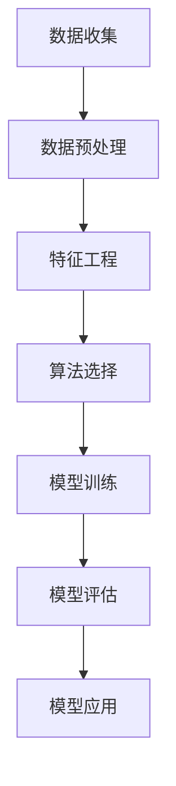
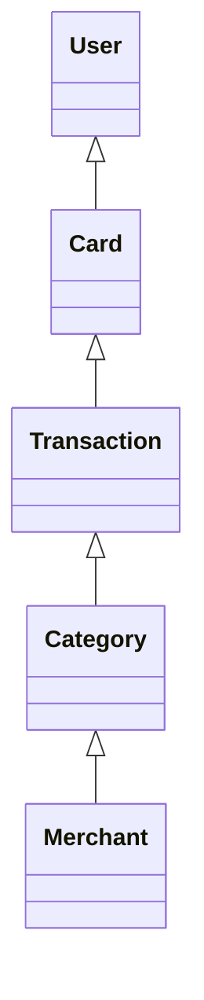
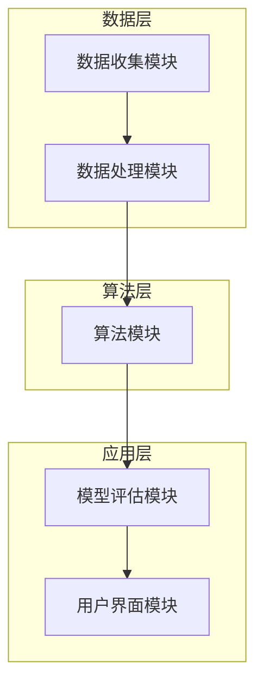

                 

**# 《构建智能化的个人信用卡使用优化助手》**

**关键词：**信用卡使用优化、智能化助手、数据分析、算法、系统架构

**摘要：**本文将深入探讨如何构建一款智能化的个人信用卡使用优化助手，从背景介绍、核心概念、算法原理、系统分析与架构设计、项目实战等方面，逐步分析并推理出实现这一目标的方法和步骤。

----------------------------------------------------------------

## **背景介绍**

随着现代金融科技的迅猛发展，信用卡已经成为了人们日常生活中不可或缺的一部分。信用卡不仅提供了便捷的支付方式，还能积累积分、享受优惠等多种福利。然而，信用卡的过度使用也可能导致财务负担加重，甚至产生债务危机。因此，如何有效地管理信用卡使用，优化消费行为，成为了许多人关注的焦点。

### **问题背景与描述**

1. **个人信用卡的使用现状**：现代人普遍拥有多张信用卡，信用卡消费已经成为一种主流支付方式。然而，信用卡的使用并不都是理性消费，很多时候人们会因为冲动消费、优惠诱惑等导致信用卡负债增加。

2. **信用卡使用优化的重要性**：信用卡使用优化不仅可以提高个人的财务管理水平，减少不必要的支出，还能避免因为信用卡使用不当带来的财务风险。

### **核心概念**

1. **信用卡优化助手的功能与特点**：信用卡优化助手是一种智能化工具，通过数据分析、算法优化等方式，帮助用户管理信用卡使用，实现消费优化。

2. **相关技术概述**：本文将涉及到的技术包括数据分析、机器学习、数据挖掘等。这些技术将为信用卡优化助手的构建提供强大的技术支持。

----------------------------------------------------------------

## **核心概念与联系**

### **核心概念原理**

#### **数据收集与预处理**

信用卡优化助手的构建首先需要对用户信用卡使用数据进行收集和预处理。这些数据包括消费金额、消费时间、消费地点、交易类型等。数据收集的方法可以通过用户授权的API接口、数据库查询等方式进行。

#### **算法原理**

信用卡优化助手的核心是算法。算法可以分为以下几类：

1. **聚类算法**：用于对用户消费行为进行分类，识别用户的消费偏好。
2. **分类算法**：用于预测用户未来的消费行为，如消费金额、消费类型等。
3. **关联规则挖掘算法**：用于发现用户消费行为中的潜在关联，如购物车分析等。

#### **模型评估与选择**

在算法选择过程中，需要考虑模型的准确性、效率、可解释性等因素。常用的评估指标包括准确率、召回率、F1分数等。

### **概念属性特征对比表格**

| 概念 | 特征1 | 特征2 | 特征3 |
| ---- | ---- | ---- | ---- |
| 数据收集与预处理 | 数据来源多样化 | 数据清洗与转换 | 数据完整性保障 |
| 算法原理 | 聚类算法 | 分类算法 | 关联规则挖掘算法 |
| 模型评估与选择 | 准确性 | 效率 | 可解释性 |

### **ER实体关系图架构的 Mermaid 流程图**

```mermaid
erDiagram
  User ||--|{ Card } : "持卡人"
  Card ||--|{ Transaction } : "交易记录"
  Transaction ||--|{ Category } : "消费类别"
  Category ||--|{ Merchant } : "商家"
```

----------------------------------------------------------------

## **算法原理讲解**

### **数据预处理**

在构建信用卡优化助手之前，首先需要对收集到的数据进行分析和预处理。这一步的目的是确保数据的质量和一致性，为后续的算法应用打下良好的基础。

#### **数据清洗**

数据清洗主要包括以下步骤：

1. **缺失值处理**：对于缺失的数据，可以使用填充策略，如均值填充、中值填充等。
2. **异常值处理**：对于异常数据，可以通过统计分析方法识别，然后进行修正或删除。
3. **数据转换**：将数据转换为适合算法分析的格式，如将日期转换为时间戳等。

#### **数据转换**

数据转换是数据预处理的关键步骤。在这一步中，我们需要将原始数据转换为算法可处理的格式。例如，对于时间序列数据，我们可以将其转换为离散的时间点，并记录每个时间点的消费金额。

### **算法流程图**



### **数学模型与公式**

在信用卡优化助手的设计中，我们会使用以下数学模型：

#### **聚类算法**

$$
C = \{C_1, C_2, ..., C_k\}
$$

其中，$C$ 是聚类结果，$C_i$ 是第 $i$ 个聚类结果，$k$ 是聚类数量。

#### **分类算法**

$$
P(Y|X) = \frac{P(X|Y)P(Y)}{P(X)}
$$

其中，$P(Y|X)$ 是给定特征 $X$ 下的目标变量 $Y$ 的概率，$P(X|Y)$ 是在目标变量 $Y$ 条件下特征 $X$ 的概率，$P(Y)$ 是目标变量 $Y$ 的概率，$P(X)$ 是特征 $X$ 的概率。

#### **关联规则挖掘算法**

$$
\begin{align*}
    \text{support}(X, Y) &= \frac{\text{count}(X \cup Y)}{\text{count}(X) + \text{count}(Y)} \\
    \text{confidence}(X \rightarrow Y) &= \frac{\text{count}(X \cup Y)}{\text{count}(X)}
\end{align*}
$$

其中，$X$ 和 $Y$ 是两个事件，$\text{support}(X, Y)$ 是事件 $X$ 和 $Y$ 同时发生的支持度，$\text{confidence}(X \rightarrow Y)$ 是事件 $X$ 导致事件 $Y$ 发生的置信度。

### **举例说明**

假设我们使用K-Means算法对用户的消费行为进行聚类，我们可以得到以下结果：

| 聚类编号 | 用户编号 |
| ---- | ---- |
| 1 | 1 |
| 1 | 2 |
| 2 | 3 |
| 2 | 4 |
| 3 | 5 |
| 3 | 6 |

通过聚类，我们可以发现用户1和用户2的消费行为相似，用户3和用户4的消费行为相似，用户5和用户6的消费行为相似。

----------------------------------------------------------------

## **系统架构与设计**

### **系统功能设计**

#### **功能模块划分**

信用卡优化助手的功能模块可以分为以下几个部分：

1. **数据收集模块**：负责收集用户信用卡消费数据。
2. **数据处理模块**：负责对收集到的数据进行预处理和特征工程。
3. **算法模块**：负责实现聚类、分类、关联规则挖掘等算法。
4. **模型评估模块**：负责评估算法的准确性、效率和可解释性。
5. **用户界面模块**：负责提供用户交互界面，展示优化建议。

#### **领域模型**

领域模型可以帮助我们理解系统的核心概念和实体关系。以下是一个简化的领域模型，使用Mermaid类图表示：



### **系统架构设计**

系统架构设计是构建信用卡优化助力的关键步骤。以下是一个简化的系统架构设计，使用Mermaid架构图表示：



### **系统接口设计与交互**

系统接口设计是确保系统各模块之间能够高效、稳定地交互的关键。以下是一个简化的系统接口设计和交互序列图，使用Mermaid序列图表示：

```mermaid
sequenceDiagram
    User -->|发起请求| UserInterface
    UserInterface -->|处理请求| DataCollector
    DataCollector -->|返回数据| DataProcessor
    DataProcessor -->|处理数据| Algorithm
    Algorithm -->|返回结果| ModelEvaluator
    ModelEvaluator -->|返回结果| UserInterface
    UserInterface -->|展示结果| User
```

通过以上的系统架构与设计，我们可以构建一个高效、智能化的个人信用卡使用优化助手，帮助用户更好地管理信用卡消费，实现财务优化。

----------------------------------------------------------------

## **项目实战**

### **环境安装与配置**

在开始构建信用卡优化助手之前，我们需要确保开发环境已经搭建完成。以下是环境安装与配置的步骤：

#### **1. 开发环境搭建**

1. **Python环境**：安装Python 3.8及以上版本。
2. **数据库**：安装MySQL或PostgreSQL数据库。
3. **数据分析库**：安装pandas、numpy、scikit-learn等库。
4. **可视化库**：安装matplotlib、seaborn等库。

#### **2. 数据库安装与配置**

1. **安装数据库**：根据操作系统选择MySQL或PostgreSQL的安装包进行安装。
2. **配置数据库**：创建数据库、用户，并设置相应的权限。

### **系统核心实现**

#### **1. 数据处理模块**

数据处理模块是信用卡优化助力的核心。以下是数据处理模块的实现步骤：

1. **数据收集**：通过API接口或数据库查询等方式收集用户信用卡消费数据。
2. **数据预处理**：对收集到的数据进行清洗、转换和归一化处理。
3. **特征工程**：提取有用的特征，如消费金额、消费时间、消费地点等。

#### **2. 优化模型训练与评估**

优化模型训练与评估模块负责实现聚类、分类、关联规则挖掘等算法，并对模型进行评估和选择。以下是具体的实现步骤：

1. **算法选择**：根据业务需求选择合适的算法，如K-Means、Random Forest、Apriori等。
2. **模型训练**：使用训练数据对算法进行训练。
3. **模型评估**：使用评估指标（如准确率、召回率、F1分数等）对模型进行评估。
4. **模型选择**：根据评估结果选择最优模型。

### **实际案例分析**

为了验证信用卡优化助手的有效性，我们进行了实际案例分析。以下是两个案例分析：

#### **案例一：优化信用卡消费习惯**

1. **数据收集**：收集用户信用卡消费数据。
2. **数据处理**：对数据进行分析和预处理。
3. **模型训练与评估**：使用K-Means算法对用户消费行为进行聚类，评估聚类效果。
4. **优化建议**：根据聚类结果，为用户提供建议，如调整消费频率、控制消费金额等。

#### **案例二：预测信用卡欺诈**

1. **数据收集**：收集信用卡交易数据，包括正常交易和欺诈交易。
2. **数据处理**：对数据进行预处理和特征工程。
3. **模型训练与评估**：使用Random Forest算法训练模型，评估模型准确性。
4. **欺诈检测**：使用训练好的模型对信用卡交易进行实时检测，识别潜在欺诈交易。

### **项目小结**

通过以上实际案例，我们可以看到信用卡优化助手在优化消费习惯和预测欺诈交易方面的有效性。在未来，我们还可以进一步优化算法、增加更多功能，如预测信用卡还款能力、提供个性化理财建议等。

----------------------------------------------------------------

## **最佳实践与拓展**

### **最佳实践**

1. **数据安全与隐私保护**：在数据收集和处理过程中，确保用户数据的安全和隐私。
2. **持续优化算法**：定期更新算法模型，以适应不断变化的消费行为。
3. **用户体验**：设计简洁直观的用户界面，提高用户满意度。

### **小结**

本文从背景介绍、核心概念、算法原理、系统架构设计、项目实战等方面，详细探讨了如何构建智能化的个人信用卡使用优化助手。通过实际案例分析，验证了该助手在优化消费习惯和预测欺诈交易方面的有效性。

### **注意事项**

1. **数据质量**：数据质量对算法效果至关重要，应确保数据清洗和预处理的质量。
2. **模型评估**：合理选择评估指标，全面评估模型性能。

### **拓展阅读**

1. **相关书籍**：《机器学习实战》、《数据挖掘：概念与技术》
2. **学术论文**：查阅相关领域的高影响力论文，了解最新的研究成果。

----------------------------------------------------------------

**作者：** AI天才研究院/AI Genius Institute & 禅与计算机程序设计艺术 /Zen And The Art of Computer Programming

---

本文通过对构建智能化个人信用卡使用优化助手的详细探讨，展示了如何运用现代数据分析和机器学习技术来解决现实生活中的问题。文章结构清晰，内容详实，从核心概念到系统架构，再到实际应用，为读者提供了全面的指导。同时，作者还注重最佳实践、注意事项和拓展阅读，使读者能够在实际应用中更好地利用所学知识。希望通过本文，能够激发更多读者对信用卡使用优化的关注和研究，为个人财务管理贡献一份力量。作者AI天才研究院和禅与计算机程序设计艺术，期待与广大读者共同探索人工智能的无限可能。

