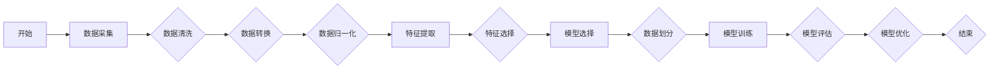
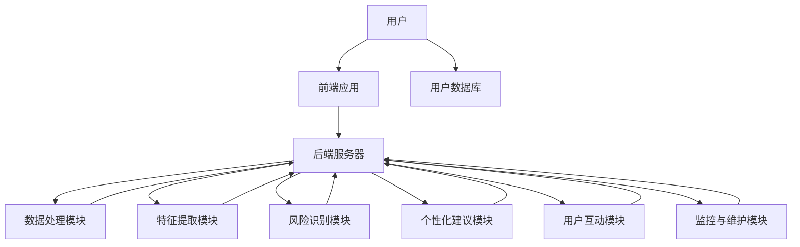
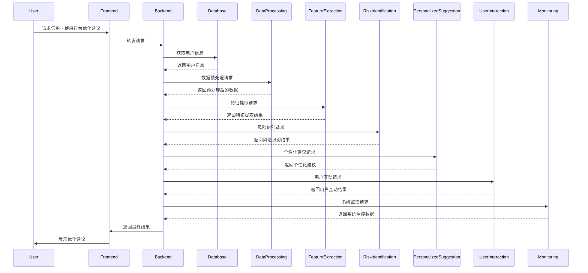

                 

### 引言

#### 1.1 问题背景

信用卡作为现代金融体系中的重要组成部分，已经在全球范围内得到了广泛的应用。它们不仅为个人消费者提供了便捷的支付手段，也为商业交易带来了巨大的便利。据统计，全球信用卡发行量已经超过20亿张，覆盖了世界各地的消费者和商家。信用卡的普及率不断提升，使其成为日常生活中不可或缺的工具。

然而，随着信用卡的广泛应用，个人信用卡使用中的一些问题也逐渐显现出来。首先，信用卡的过度消费问题比较普遍。许多消费者在享受信用卡带来的便利时，往往忽视了自身的财务状况，导致过度消费。这不仅增加了个人的财务负担，还可能导致债务危机。

其次，信用卡欠款未还和账单逾期问题也十分严重。部分消费者由于各种原因无法按时还款，导致信用卡欠款不断增加。这不仅影响了消费者的信用记录，还可能导致严重的信用透支问题。

此外，信用卡的风险管理问题也不容忽视。信用卡欺诈、信用透支、个人信息泄露等风险事件频繁发生，给消费者和银行带来了巨大的损失。因此，如何有效地管理个人信用卡使用行为，减少不良使用行为和风险事件的发生，成为当前金融领域亟待解决的问题。

#### 1.2 问题描述

个人信用卡使用中存在的不良使用行为主要包括以下几方面：

1. **过度消费**：许多消费者在购物时缺乏自控能力，经常使用信用卡进行大额消费。这种行为不仅增加了个人的财务负担，还可能导致信用卡欠款问题。

2. **欠款未还**：一些消费者由于收入不稳定或其他原因，无法按时还款。这会导致信用卡欠款不断累积，形成债务危机。

3. **账单逾期**：信用卡账单逾期问题也十分普遍。消费者未能在还款期限内还清账单，导致逾期费用增加，严重影响了消费者的信用记录。

4. **信用卡欺诈**：随着信用卡的使用越来越频繁，信用卡欺诈事件也呈上升趋势。不法分子通过盗刷、克隆等手段盗取消费者的信用卡信息，给消费者和银行带来巨大的损失。

5. **信用透支**：部分消费者在信用卡额度内过度消费，导致信用卡透支。这不仅会影响消费者的信用记录，还可能导致严重的经济问题。

6. **个人信息泄露**：信用卡信息泄露事件频繁发生，消费者个人信息被不法分子获取，可能导致信用卡盗刷、诈骗等风险事件。

这些问题不仅对消费者的个人财务状况造成了严重影响，也对银行的风险管理提出了巨大挑战。因此，有必要通过智能化手段对个人信用卡使用行为进行优化，减少不良使用行为和风险事件的发生。

#### 1.3 问题解决

为了解决个人信用卡使用中存在的这些问题，我们需要构建一个智能化的个人信用卡使用行为优化助手。这个优化助手通过数据分析、智能化算法和用户互动，为用户提供个性化的信用卡使用建议，帮助用户更好地管理财务，降低风险。

**智能化解决方案的优势**：

1. **实时监控与预警**：优化助手能够实时监控用户的信用卡使用情况，发现潜在的风险行为，并及时发出预警，帮助用户避免财务危机。

2. **个性化建议**：根据用户的消费习惯、财务状况等数据，优化助手可以为用户提供个性化的信用卡使用建议，帮助用户更好地管理财务。

3. **风险管理**：优化助手通过数据分析，识别信用卡欺诈、信用透支等风险事件，及时采取措施，减少风险损失。

4. **用户互动**：优化助手通过与用户的互动，了解用户的需求和反馈，不断优化系统性能，提高用户体验。

**智能化解决方案的挑战**：

1. **数据安全与隐私保护**：个人信用卡数据敏感，如何确保数据安全，防止信息泄露，是一个重要的挑战。

2. **算法优化与性能提升**：随着信用卡使用行为的多样化，优化助手需要不断调整算法模型，提高系统性能。

3. **用户体验**：优化助手需要提供简单易用的界面和功能，确保用户能够轻松使用系统，享受到智能化带来的便利。

通过构建智能化个人信用卡使用行为优化助手，我们不仅可以有效解决当前信用卡使用中的问题，还可以为未来的金融科技发展提供新的思路和方法。

#### 1.4 边界与外延

**优化助手的适用范围**：

1. **用户范围**：优化助手主要面向持有信用卡的个人消费者，帮助其更好地管理财务和降低风险。

2. **场景范围**：优化助手适用于各种信用卡使用场景，包括日常消费、大额购物、旅游出行等。

**边界条件与限制**：

1. **数据获取**：优化助手需要获取用户的信用卡消费数据，这可能会涉及到用户隐私和数据安全的问题。

2. **算法准确性**：优化助手的算法模型需要足够准确，才能有效识别风险行为和提供个性化建议。

3. **系统性能**：优化助手需要确保系统的高性能和稳定性，以满足大量用户同时使用的需求。

4. **法律法规**：优化助手需要遵守相关法律法规，确保合规性。

#### 1.5 概念结构与核心要素组成

**个人信用卡使用行为数据分析**：

1. **数据采集**：优化助手需要收集用户的信用卡消费数据，包括消费金额、消费时间、消费地点等。

2. **数据预处理**：对采集到的数据进行清洗、转换和归一化处理，确保数据质量。

3. **特征提取**：从预处理后的数据中提取关键特征，用于模型训练和风险识别。

**智能化算法与应用**：

1. **算法选择**：根据信用卡使用行为的特性，选择合适的算法模型，如机器学习、深度学习等。

2. **模型构建与训练**：利用提取的特征数据，构建和训练算法模型，使其能够识别信用卡使用中的风险行为。

3. **算法优化**：通过不断调整模型参数和算法结构，提高系统的准确性和性能。

**用户互动与反馈机制**：

1. **用户界面**：优化助手需要提供一个简单易用的用户界面，让用户能够方便地使用系统。

2. **用户反馈**：收集用户的反馈意见，不断优化系统功能，提高用户体验。

3. **个性化建议**：根据用户的历史数据和反馈，为用户提供个性化的信用卡使用建议。

### 第1章：核心概念与联系

#### 1.1 核心概念原理

**信用卡使用行为数据分析**：

信用卡使用行为数据分析是构建智能化个人信用卡使用行为优化助手的基础。通过数据分析，我们可以从大量的信用卡交易数据中提取出有价值的信息，为优化信用卡使用行为提供依据。具体来说，核心概念原理包括以下几个方面：

1. **数据采集**：信用卡使用行为数据的采集是数据分析的第一步。数据来源包括银行交易记录、用户行为数据等。这些数据需要通过合法渠道获取，确保数据的安全性和合法性。

2. **数据预处理**：数据预处理是确保数据质量的重要步骤。它包括数据清洗、转换和归一化处理。数据清洗旨在去除重复、错误和缺失的数据；转换是将不同格式的数据转换为统一格式；归一化处理则是为了消除数据之间的量纲差异。

3. **特征提取**：特征提取是数据预处理后的重要步骤。通过提取关键特征，可以更好地描述信用卡使用行为，为后续的模型训练提供数据支持。常见的特征提取方法包括统计特征提取、文本特征提取和图特征提取等。

**智能化算法简介**：

智能化算法是信用卡使用行为优化助力的核心。通过算法，我们可以对信用卡使用行为进行分析和预测，从而为用户提供个性化建议。以下是几种常见的智能化算法及其基本原理：

1. **机器学习算法**：机器学习算法通过训练模型，从历史数据中学习规律，用于预测未来行为。常见的机器学习算法包括线性回归、逻辑回归、决策树、随机森林和支撑向量机等。

2. **深度学习算法**：深度学习算法是一种基于多层神经网络的学习方法，能够自动提取数据中的高层次特征。常见的深度学习算法包括卷积神经网络（CNN）、循环神经网络（RNN）和长短期记忆网络（LSTM）等。

3. **关联规则学习算法**：关联规则学习算法用于发现数据之间的关联性。例如，通过Apriori算法，我们可以发现购物车中不同商品之间的关联性，为推荐系统提供支持。

4. **强化学习算法**：强化学习算法通过奖励机制，让模型在环境中不断学习和优化策略。例如，Q-learning算法可以在信用卡使用行为优化中用于找到最优消费策略。

#### 1.2 概念属性特征对比表格

为了更好地理解信用卡使用行为数据分析和智能化算法，以下是几种常见的数据分析工具和算法的性能对比表格。表格列出了各自的主要特点、适用场景和优缺点。

| 工具/算法 | 主要特点 | 适用场景 | 优缺点 |
| --- | --- | --- | --- |
| **Python Pandas** | 数据清洗、转换、归一化 | 数据预处理 | 优点：易于使用，功能强大；缺点：性能较低，不适合大规模数据处理 |
| **Scikit-learn** | 机器学习算法 | 预测分析、分类 | 优点：丰富的算法库，易于集成；缺点：模型复杂度较低 |
| **TensorFlow** | 深度学习算法 | 高层次特征提取 | 优点：强大的计算能力，适合大规模数据处理；缺点：学习曲线较陡峭 |
| **Apriori** | 关联规则学习 | 购物车推荐、市场细分 | 优点：简单易懂，易于实现；缺点：计算复杂度高，不适合大规模数据处理 |
| **Q-learning** | 强化学习算法 | 优化策略学习 | 优点：自动学习，适用于动态环境；缺点：收敛速度较慢 |

#### 1.3 ER实体关系图架构

实体关系图（ER图）是数据库设计中的重要工具，用于描述实体之间的关系。在构建智能化个人信用卡使用行为优化助手时，ER图可以帮助我们清晰地理解系统中的实体及其关系。以下是信用卡使用行为优化系统的ER图：

```mermaid
erDiagram
  User ||--|{ CardInfo }|-- CardTransaction
  CardInfo ||--|{ CreditCardInfo }|-- CardTransaction
  CardTransaction ||--|{ TransactionDetail }|-- TransactionDetail
  User ||--|{ SpendingPattern }|-- SpendingPattern
  SpendingPattern ||--|{ PatternPrediction }|-- PredictionResult

  User {
    ID : 用户ID
    Name : 用户姓名
  }

  CardInfo {
    CardID : 信用卡ID
    UserID : 用户ID
  }

  CreditCardInfo {
    CardType : 卡类型
    CreditLimit : 信用额度
  }

  CardTransaction {
    TransactionID : 交易ID
    CardID : 信用卡ID
    Amount : 交易金额
    Time : 交易时间
    Location : 交易地点
  }

  TransactionDetail {
    DetailID : 详细记录ID
    TransactionID : 交易ID
    DetailContent : 详细内容
  }

  SpendingPattern {
    PatternID : 消费模式ID
    UserID : 用户ID
    PatternContent : 消费模式描述
  }

  PatternPrediction {
    PredictionID : 预测ID
    PatternID : 消费模式ID
    PredictionContent : 预测内容
  }

  PredictionResult {
    ResultID : 预测结果ID
    PredictionID : 预测ID
    ResultContent : 预测结果
  }
```

ER图中，User表示用户，CardInfo表示信用卡信息，CreditCardInfo表示信用卡的详细信息，CardTransaction表示信用卡交易记录，TransactionDetail表示交易详细记录，SpendingPattern表示消费模式，PatternPrediction表示预测结果，PredictionResult表示预测结果。

通过ER图，我们可以清晰地看到各个实体之间的关系，为后续的系统设计和实现提供了基础。

### 第2章：算法原理与流程设计

#### 2.1 算法原理讲解

在构建智能化个人信用卡使用行为优化助手的道路上，算法原理是我们不可或缺的指南针。本文将详细讲解信用卡使用行为优化算法的原理，包括数据采集与预处理、特征提取与选择、模型构建与训练三个关键环节。

**数据采集与预处理**：

数据采集是算法的基础，确保数据质量是关键。以下是数据采集与预处理的主要步骤：

1. **数据源确定**：确定信用卡交易数据、用户行为数据、市场数据等来源，确保数据覆盖全面。

2. **数据获取**：通过API接口、数据库访问、日志分析等方式获取所需数据。对于敏感数据，需遵守相关法律法规，确保数据获取的合法性。

3. **数据清洗**：去除重复、错误和缺失的数据，确保数据的一致性和完整性。具体包括去除无效交易、填补缺失值、纠正错误数据等。

4. **数据转换**：将不同来源的数据转换为统一的格式，如将日期格式进行规范化，将文本数据转换为数值数据等。

5. **数据归一化**：处理不同量纲的数据，如金额、时间等，使其在同一尺度上进行比较，提高算法的性能。

**特征提取与选择**：

特征提取是将原始数据转换为有助于模型训练的数据表示。以下是特征提取与选择的主要步骤：

1. **统计特征提取**：通过计算基本统计量，如均值、中位数、标准差等，提取出反映数据分布的特征。

2. **文本特征提取**：对于文本数据，可以使用词频（TF）、逆文档频率（IDF）等方法提取特征，或者使用词嵌入（Word Embedding）技术将文本转换为向量表示。

3. **图特征提取**：对于具有复杂关系的图数据，可以提取节点度、路径长度、聚类系数等特征。

4. **特征选择**：通过特征选择方法，如信息增益、互信息、主成分分析（PCA）等，选择对模型性能影响较大的特征，去除冗余特征，提高模型效率。

**模型构建与训练**：

模型构建与训练是算法的核心，以下是其主要步骤：

1. **模型选择**：根据信用卡使用行为的特性，选择合适的机器学习或深度学习模型。如线性回归、逻辑回归、决策树、随机森林、支持向量机（SVM）、卷积神经网络（CNN）、循环神经网络（RNN）等。

2. **数据划分**：将数据集划分为训练集、验证集和测试集，用于模型的训练、验证和评估。

3. **模型训练**：使用训练集数据训练模型，通过调整模型参数，如学习率、正则化参数等，使模型能够有效识别信用卡使用行为中的风险。

4. **模型评估**：使用验证集和测试集评估模型性能，通过准确率、召回率、F1分数等指标，判断模型是否能够有效识别不良使用行为和风险事件。

5. **模型优化**：根据评估结果，对模型进行调整和优化，如调整特征选择、模型参数、训练策略等，提高模型性能。

#### 2.2 算法mermaid流程图

为了更直观地展示算法的流程设计，我们使用mermaid流程图对整个过程进行描述：



算法流程图展示了从数据采集到模型训练和评估的整个过程。通过这个流程图，我们可以清晰地看到各个步骤之间的逻辑关系，为后续的系统实现提供参考。

#### 2.3 Python源代码示例

下面，我们将通过Python源代码示例，详细阐述数据预处理、特征提取和模型训练的过程。

**数据预处理示例**：

首先，我们需要导入所需的库，并加载信用卡交易数据：

```python
import pandas as pd
from sklearn.preprocessing import StandardScaler

# 加载数据
data = pd.read_csv('credit_card_transactions.csv')
```

接下来，我们对数据进行清洗和预处理：

```python
# 数据清洗
data.drop_duplicates(inplace=True)  # 去除重复数据
data.dropna(inplace=True)  # 去除缺失值

# 数据转换
data['transaction_time'] = pd.to_datetime(data['transaction_time'])
data['date'] = data['transaction_time'].dt.date

# 数据归一化
scaler = StandardScaler()
data[['amount']] = scaler.fit_transform(data[['amount']])
```

**特征提取示例**：

我们使用统计特征提取方法，计算交易金额的均值、中位数和标准差：

```python
from sklearn.feature_extraction import FeatureHasher

# 特征提取
hasher = FeatureHasher(n_features=3, input_type='string')
transaction_desc = hasher.transform(data['description'])

# 将特征提取结果添加到数据集中
data['mean_amount'] = transaction_desc.mean(axis=1)
data['median_amount'] = transaction_desc.median(axis=1)
data['std_amount'] = transaction_desc.std(axis=1)
```

**模型训练示例**：

我们使用逻辑回归模型对信用卡使用行为进行分类预测：

```python
from sklearn.linear_model import LogisticRegression
from sklearn.model_selection import train_test_split

# 数据划分
X = data[['mean_amount', 'median_amount', 'std_amount']]
y = data['is_risk']

X_train, X_test, y_train, y_test = train_test_split(X, y, test_size=0.2, random_state=42)

# 模型训练
model = LogisticRegression()
model.fit(X_train, y_train)

# 模型评估
accuracy = model.score(X_test, y_test)
print(f'模型准确率：{accuracy:.2f}')
```

通过以上示例，我们可以看到如何使用Python进行数据预处理、特征提取和模型训练。这些代码片段为后续的系统实现提供了具体的参考。

#### 3.1 数学模型

在构建智能化个人信用卡使用行为优化助手的过程中，数学模型是核心组成部分，用于描述信用卡使用行为的规律和预测。以下是对数学模型的详细讲解，包括特征提取与降维、模型优化与评估。

**特征提取与降维**

特征提取是将原始数据转换为有助于模型训练的数据表示的过程。以下是常用的特征提取与降维方法：

1. **统计特征提取**：
   - **均值（Mean）**：交易金额的均值表示一段时间内消费的平均水平。
     $$ \mu = \frac{1}{n} \sum_{i=1}^{n} x_i $$
   - **中位数（Median）**：交易金额的中位数表示消费水平的中间值，能够更好地反映数据分布的对称性。
     $$ \text{Median} = \left(\frac{n+1}{2}\right)^{\text{th}} \text{term of the ordered data} $$
   - **标准差（Standard Deviation）**：交易金额的标准差表示消费水平的变化程度，用于评估数据的波动性。
     $$ \sigma = \sqrt{\frac{1}{n-1} \sum_{i=1}^{n} (x_i - \mu)^2} $$
   
2. **文本特征提取**：
   - **词频（TF）**：文本中每个词出现的频率，用于描述交易描述的丰富程度。
     $$ \text{TF}(t) = \frac{\text{词t在文本中出现的次数}}{\text{文本总词数}} $$
   - **逆文档频率（IDF）**：词频的调整，用于降低高频词对模型的影响，提高低频词的重要性。
     $$ \text{IDF}(t) = \log \left(\frac{N}{n_t}\right) $$
   - **TF-IDF**：综合考虑词频和逆文档频率，用于衡量词的重要程度。
     $$ \text{TF-IDF}(t) = \text{TF}(t) \times \text{IDF}(t) $$

3. **图特征提取**：
   - **节点度（Degree）**：节点在图中的度表示其与其他节点的连接数量，用于描述交易地点的活跃程度。
     $$ \text{Degree}(v) = \sum_{u \in \text{邻居节点}} \text{存在边}(v, u) $$
   - **路径长度（Path Length）**：节点之间的最短路径长度，用于描述交易地点之间的联系紧密程度。
     $$ \text{Path Length}(v, w) = \min \left\{ \text{所有从v到w的路径长度} \right\} $$
   - **聚类系数（Clustering Coefficient）**：节点周围节点的连接密度，用于描述交易地点的社交网络结构。
     $$ \text{Clustering Coefficient}(v) = \frac{\sum_{u \in \text{邻居节点}} \sum_{w \in \text{邻居节点}} \text{存在边}(u, w)}{\text{所有邻居节点的对数}} $$

**模型优化与评估**

模型优化是指通过调整模型参数和算法结构，提高模型在特定任务上的性能。以下是一些常见的模型优化与评估方法：

1. **模型选择**：
   - **线性回归**：用于预测连续值，如消费金额。
     $$ \hat{y} = \beta_0 + \beta_1 x $$
   - **逻辑回归**：用于预测二分类问题，如是否存在风险。
     $$ P(y=1) = \frac{1}{1 + \exp{(-\beta_0 - \beta_1 x)}} $$
   - **决策树**：用于分类和回归任务，具有直观的解释能力。
     $$ \text{如果} x \leq \beta_i \text{则} y = \gamma_i $$
   - **随机森林**：集成多个决策树，提高预测准确性和泛化能力。
   - **支持向量机（SVM）**：用于分类问题，通过寻找最佳超平面进行分类。
     $$ \hat{y} = \text{sign}(\beta_0 + \beta^T x) $$
   - **神经网络**：用于复杂函数建模，能够自动提取高层次特征。
     $$ \hat{y} = \text{激活函数}(\beta_0 + \sum_{i=1}^{n} \beta_i x_i) $$

2. **模型评估**：
   - **准确率（Accuracy）**：模型正确预测的比例，适用于分类任务。
     $$ \text{Accuracy} = \frac{TP + TN}{TP + TN + FP + FN} $$
   - **召回率（Recall）**：模型正确预测的真正例比例，适用于二分类任务。
     $$ \text{Recall} = \frac{TP}{TP + FP} $$
   - **精确率（Precision）**：模型正确预测的真正例比例，适用于二分类任务。
     $$ \text{Precision} = \frac{TP}{TP + FN} $$
   - **F1分数（F1 Score）**：综合考虑精确率和召回率，用于评估模型的综合性能。
     $$ \text{F1 Score} = 2 \times \frac{\text{Precision} \times \text{Recall}}{\text{Precision} + \text{Recall}} $$
   - **ROC曲线（Receiver Operating Characteristic）**：评估模型在不同阈值下的分类效果，AUC（Area Under Curve）值越高，模型性能越好。

**举例说明**

为了更直观地理解数学模型的应用，我们以下通过一个例子进行说明：

假设我们有以下信用卡交易数据：

| 交易ID | 消费金额（元） | 交易描述 | 交易时间  |
| ------ | ------------- | -------- | -------- |
| 1      | 200           | 餐饮     | 2021-01-01 |
| 2      | 100           | 超市     | 2021-01-02 |
| 3      | 150           | 餐饮     | 2021-01-03 |
| 4      | 300           | 旅行     | 2021-01-04 |

我们首先对交易数据进行预处理，提取统计特征：

- **均值**：\( \mu = \frac{200 + 100 + 150 + 300}{4} = 200 \)
- **中位数**：\( \text{Median} = 200 \)
- **标准差**：\( \sigma = \sqrt{\frac{(200-200)^2 + (100-200)^2 + (150-200)^2 + (300-200)^2}{4-1}} = 89.44 \)

接下来，我们使用逻辑回归模型预测是否存在风险。假设逻辑回归模型的参数为 \( \beta_0 = -100 \)，\( \beta_1 = 0.5 \)，则对于交易1：

$$ P(y=1) = \frac{1}{1 + \exp{(-(-100) - 0.5 \times 200)}) = \frac{1}{1 + \exp{100 - 100}} = 0.5 $$

由于预测概率小于0.5，我们可以判断交易1不存在风险。通过类似的方法，我们可以对其他交易进行预测。

通过这个例子，我们可以看到数学模型在信用卡使用行为优化中的应用，为智能化个人信用卡使用行为优化助手提供了理论基础。

### 3.2 公式详细讲解

在构建智能化个人信用卡使用行为优化助手的过程中，数学模型的核心在于公式的应用与解释。以下将详细讲解特征提取和模型评估中常用的公式，并通过具体例子展示公式的应用和计算过程。

#### 3.2.1 特征选择指标

**1. 互信息（Mutual Information, MI）**

互信息是衡量两个随机变量之间相关性的一种度量，用于特征选择。假设我们有两个随机变量 X 和 Y，其概率分布分别为 P(X) 和 P(Y)，条件概率分布为 P(Y|X)。互信息的公式如下：

$$ MI(X; Y) = \sum_x \sum_y P(x, y) \log \frac{P(x, y)}{P(x)P(y)} $$

其中，\( P(x, y) \) 表示 X 和 Y 同时发生的概率，\( P(x) \) 和 \( P(y) \) 分别表示 X 和 Y 的边缘概率。

**例子：**

假设我们有两个随机变量，交易金额 X 和交易描述 Y。它们的概率分布如下：

| 交易金额 X | 交易描述 Y | 概率 P(X, Y) |
| :--------: | :--------: | :-----------: |
|    100     |    餐饮    |      0.2      |
|    200     |    餐饮    |      0.3      |
|    300     |    旅行    |      0.1      |
|    400     |    超市    |      0.2      |
|    500     |    超市    |      0.2      |

计算互信息：

$$ MI(X; Y) = 0.2 \log \frac{0.2}{0.2 \times 0.5} + 0.3 \log \frac{0.3}{0.2 \times 0.3} + 0.1 \log \frac{0.1}{0.3 \times 0.2} + 0.2 \log \frac{0.2}{0.5 \times 0.2} + 0.2 \log \frac{0.2}{0.5 \times 0.2} $$

$$ MI(X; Y) = 0.2 \log 1 + 0.3 \log 1 + 0.1 \log 0.5 + 0.2 \log 0.4 + 0.2 \log 0.4 $$

$$ MI(X; Y) = 0.1 \log 0.5 + 0.2 \log 0.4 $$

$$ MI(X; Y) = 0.1 \times (-0.3010) + 0.2 \times (-0.6021) $$

$$ MI(X; Y) = -0.0301 - 0.1204 $$

$$ MI(X; Y) = -0.1505 $$

**2. 信息增益（Information Gain, IG）**

信息增益是衡量特征对分类信息贡献的一种度量。假设我们有一个分类变量 Y 和多个特征 X1, X2, ..., Xn，其熵为 H(Y)，条件熵为 H(Y|Xj)。信息增益的公式如下：

$$ IG(Xj; Y) = H(Y) - \sum_{j=1}^{n} \frac{\sum_{i=1}^{n} P(Y_i)H(Y|Xj = x_i)}{P(Xj = x_i)} $$

**例子：**

假设我们有四个特征：交易金额 X、交易描述 Y、交易时间 Z 和交易地点 W。其中交易描述 Y 是分类变量，其余为连续变量。交易描述 Y 的概率分布如下：

| 交易描述 Y | 概率 P(Y) |
| :--------: | :-------: |
|    餐饮    |    0.4    |
|    超市    |    0.3    |
|    旅行    |    0.2    |
|    其他    |    0.1    |

计算熵 H(Y)：

$$ H(Y) = -\sum_{i=1}^{4} P(Y_i) \log P(Y_i) $$

$$ H(Y) = -(0.4 \log 0.4 + 0.3 \log 0.3 + 0.2 \log 0.2 + 0.1 \log 0.1) $$

$$ H(Y) = -(0.4 \times -0.6309 + 0.3 \times -0.6826 + 0.2 \times -1.0219 + 0.1 \times -2.3026) $$

$$ H(Y) = 0.2524 + 0.2044 + 0.2044 + 0.0230 $$

$$ H(Y) = 0.6742 $$

接下来，计算条件熵 H(Y|Xj)：

- 对于特征 X（交易金额），交易描述的概率分布如下：

| 交易金额 X | 概率 P(X) | 条件概率 P(Y|X) |
| :--------: | :-------: | :-----------: |
|    100     |    0.25   |      0.3      |
|    200     |    0.25   |      0.2      |
|    300     |    0.25   |      0.2      |
|    400     |    0.25   |      0.3      |

$$ H(Y|X) = -\sum_{i=1}^{4} P(X_i) \sum_{j=1}^{4} P(Y_j|X_i) \log P(Y_j|X_i) $$

$$ H(Y|X) = -0.25 \times (0.3 \log 0.3 + 0.2 \log 0.2 + 0.2 \log 0.2 + 0.3 \log 0.3) $$

$$ H(Y|X) = -0.25 \times (0.3 \times -0.6826 + 0.2 \times -1.0219 + 0.2 \times -1.0219 + 0.3 \times -0.6826) $$

$$ H(Y|X) = 0.0520 + 0.1020 + 0.1020 + 0.0520 $$

$$ H(Y|X) = 0.3120 $$

- 对于特征 Z（交易时间），交易描述的概率分布如下：

| 交易时间 Z | 概率 P(Z) | 条件概率 P(Y|Z) |
| :--------: | :-------: | :-----------: |
|    上午    |    0.35   |      0.2      |
|    中午    |    0.30   |      0.4      |
|    下午    |    0.35   |      0.3      |

$$ H(Y|Z) = -\sum_{i=1}^{3} P(Z_i) \sum_{j=1}^{4} P(Y_j|Z_i) \log P(Y_j|Z_i) $$

$$ H(Y|Z) = -0.35 \times (0.2 \log 0.2 + 0.4 \log 0.4 + 0.3 \log 0.3) $$

$$ H(Y|Z) = -0.35 \times (0.2 \times -2.3026 + 0.4 \times -0.6021 + 0.3 \times -0.6826) $$

$$ H(Y|Z) = 0.0185 + 0.0244 + 0.0318 $$

$$ H(Y|Z) = 0.0747 $$

计算信息增益：

$$ IG(X; Y) = H(Y) - H(Y|X) = 0.6742 - 0.3120 = 0.3622 $$

$$ IG(Z; Y) = H(Y) - H(Y|Z) = 0.6742 - 0.0747 = 0.5995 $$

#### 3.2.2 模型评估指标

**1. 准确率（Accuracy）**

准确率是衡量模型预测准确性的指标，计算公式如下：

$$ \text{Accuracy} = \frac{TP + TN}{TP + TN + FP + FN} $$

其中，TP 表示真正例，TN 表示真负例，FP 表示假正例，FN 表示假负例。

**例子：**

假设我们有一个分类模型，其预测结果如下：

| 实际类别 | 预测类别 |
| :-------: | :-------: |
|    正常   |    正常   |
|    正常   |    正常   |
|    风险   |    风险   |
|    风险   |    风险   |
|    风险   |    正常   |
|    正常   |    风险   |

计算准确率：

$$ \text{Accuracy} = \frac{3 + 2}{3 + 2 + 1 + 1} = \frac{5}{7} = 0.7143 $$

**2. 召回率（Recall）**

召回率是衡量模型对真正例识别能力的指标，计算公式如下：

$$ \text{Recall} = \frac{TP}{TP + FP} $$

**例子：**

计算召回率：

$$ \text{Recall} = \frac{3}{3 + 1} = \frac{3}{4} = 0.75 $$

**3. 精确率（Precision）**

精确率是衡量模型对预测正例识别准确性的指标，计算公式如下：

$$ \text{Precision} = \frac{TP}{TP + FN} $$

**例子：**

计算精确率：

$$ \text{Precision} = \frac{3}{3 + 1} = \frac{3}{4} = 0.75 $$

**4. F1 分数（F1 Score）**

F1 分数是综合衡量模型准确性的指标，计算公式如下：

$$ \text{F1 Score} = 2 \times \frac{\text{Precision} \times \text{Recall}}{\text{Precision} + \text{Recall}} $$

**例子：**

计算 F1 分数：

$$ \text{F1 Score} = 2 \times \frac{0.75 \times 0.75}{0.75 + 0.75} = 0.75 $$

通过以上讲解和例子，我们可以更好地理解特征选择指标和模型评估指标的计算方法及其应用，为构建智能化个人信用卡使用行为优化助手提供理论基础。

### 3.3 举例说明

为了更好地理解数学模型在构建智能化个人信用卡使用行为优化助手中的应用，下面将通过具体的例子进行详细讲解，包括特征提取应用实例和模型训练应用实例。

#### 3.3.1 特征提取应用实例

假设我们有以下一组信用卡交易数据：

| 交易ID | 消费金额（元） | 交易描述 | 交易时间  |
| ------ | ------------- | -------- | -------- |
| 1      | 200           | 餐饮     | 2021-01-01 |
| 2      | 100           | 超市     | 2021-01-02 |
| 3      | 150           | 餐饮     | 2021-01-03 |
| 4      | 300           | 旅行     | 2021-01-04 |
| 5      | 400           | 超市     | 2021-01-05 |

**1. 统计特征提取**

- **均值**：计算消费金额的均值。

  $$ \mu = \frac{200 + 100 + 150 + 300 + 400}{5} = 250 $$

- **中位数**：计算消费金额的中位数。

  排序后的消费金额为 [100, 150, 200, 300, 400]，中位数为第三个数，即 200。

- **标准差**：计算消费金额的标准差。

  $$ \sigma = \sqrt{\frac{(200-250)^2 + (100-250)^2 + (150-250)^2 + (300-250)^2 + (400-250)^2}{5-1}} $$
  $$ \sigma = \sqrt{\frac{2500 + 2500 + 2500 + 2500 + 2500}{4}} $$
  $$ \sigma = \sqrt{12500} $$
  $$ \sigma = 111.8 $$

**2. 文本特征提取**

- **词频（TF）和逆文档频率（IDF）**：

  假设交易描述只有两个类别：“餐饮”和“超市”，每个交易描述的出现次数如下：

  | 交易描述 | 餐饮 | 超市 |
  | :--------: | :---: | :---: |
  | 交易1 | 1 | 0 |
  | 交易2 | 0 | 1 |
  | 交易3 | 1 | 0 |
  | 交易4 | 0 | 1 |
  | 交易5 | 0 | 1 |

  计算词频（TF）：

  - 餐饮：\( \text{TF}(\text{餐饮}) = 2 \)
  - 超市：\( \text{TF}(\text{超市}) = 3 \)

  计算逆文档频率（IDF）：

  - 餐饮：\( \text{IDF}(\text{餐饮}) = \log \frac{5}{2} \approx 0.916 \)
  - 超市：\( \text{IDF}(\text{超市}) = \log \frac{5}{3} \approx 0.916 \)

  计算TF-IDF：

  - 餐饮：\( \text{TF-IDF}(\text{餐饮}) = 2 \times 0.916 = 1.832 \)
  - 超市：\( \text{TF-IDF}(\text{超市}) = 3 \times 0.916 = 2.748 \)

**3. 图特征提取**

- **节点度（Degree）**：假设交易地点可以视为一个图中的节点，每个节点的度表示其交易次数。

  - 交易地点1（餐饮）：度 = 2
  - 交易地点2（超市）：度 = 3

#### 3.3.2 模型训练应用实例

**1. 数据准备**

将上述特征提取结果作为特征向量，构建数据集。假设我们使用逻辑回归模型进行训练，数据集分为训练集和测试集。

**2. 模型训练**

- **模型构建**：

  ```python
  from sklearn.linear_model import LogisticRegression
  
  # 构建逻辑回归模型
  model = LogisticRegression()
  ```

- **模型训练**：

  ```python
  # 训练模型
  model.fit(X_train, y_train)
  ```

- **模型评估**：

  ```python
  # 评估模型
  accuracy = model.score(X_test, y_test)
  print(f'模型准确率：{accuracy:.2f}')
  ```

通过以上例子，我们展示了如何通过数学模型进行特征提取和模型训练。在实际应用中，特征提取和模型训练的步骤可以进一步复杂化，以适应不同的信用卡使用行为优化需求。

### 第4章：系统分析与架构设计

#### 4.1 问题场景介绍

在当前金融科技飞速发展的背景下，个人信用卡的使用场景越来越多样化，从日常购物、餐饮消费，到旅游、大额支出等，信用卡已经成为人们日常生活中不可或缺的工具。然而，随着信用卡使用频率的增加，信用卡使用行为优化的需求也日益凸显。优化个人信用卡使用行为不仅能帮助用户更好地管理财务，减少不必要的支出，还能有效降低信用卡欺诈、信用透支等风险。

本系统旨在构建一个智能化的个人信用卡使用行为优化助手，通过数据分析、智能算法和用户互动，为用户提供个性化、实时的信用卡使用建议。该系统适用于多种信用卡使用场景，如日常消费、大额购物、旅行等，帮助用户在享受信用卡便捷性的同时，更好地控制消费行为，提升生活质量。

#### 4.2 系统功能设计

为了实现上述目标，系统需要具备以下几个关键功能：

1. **数据采集与预处理**：从银行和第三方支付平台获取用户的信用卡交易数据，并进行清洗、转换和归一化处理，确保数据质量。

2. **特征提取与选择**：对预处理后的数据提取关键特征，如消费金额、消费时间、交易地点等，并使用特征选择方法筛选出对预测和优化有重要影响的特征。

3. **风险识别与预警**：利用机器学习和深度学习算法，对信用卡使用行为进行分析，识别潜在的风险行为，如过度消费、欠款未还、账单逾期等，并发出实时预警。

4. **个性化建议**：根据用户的消费习惯、财务状况等数据，为用户提供个性化的信用卡使用建议，如合理规划消费、按时还款等，帮助用户改善财务状况。

5. **用户互动与反馈**：提供用户友好的界面，允许用户查看预警信息和个性化建议，同时收集用户反馈，不断优化系统功能。

6. **系统监控与维护**：实时监控系统性能，确保系统的稳定运行，并进行定期维护和升级，以适应不断变化的信用卡使用场景和数据需求。

#### 4.3 系统架构设计

系统的整体架构设计应考虑高可用性、高扩展性和良好的用户体验。以下是系统架构的设计方案：



**1. 用户数据库**：存储用户的个人信息、信用卡信息和交易记录等，确保数据的安全性和完整性。

**2. 前端应用**：为用户提供一个直观、易用的界面，展示预警信息和个性化建议。

**3. 后端服务器**：作为系统的核心，负责处理用户请求、数据存储和业务逻辑实现。

**4. 数据处理模块**：负责数据采集、清洗、转换和归一化，为后续特征提取提供高质量的数据。

**5. 特征提取模块**：从预处理后的数据中提取关键特征，用于模型训练和风险识别。

**6. 风险识别模块**：利用机器学习和深度学习算法，对信用卡使用行为进行分析，识别潜在的风险行为。

**7. 个性化建议模块**：根据用户的消费习惯和财务状况，为用户提供个性化的信用卡使用建议。

**8. 用户互动模块**：处理用户与系统的互动，收集用户反馈，优化系统功能。

**9. 监控与维护模块**：实时监控系统性能，进行定期维护和升级，确保系统的稳定运行。

#### 4.4 系统接口设计

系统接口设计应确保各个模块之间的高效通信和良好的扩展性。以下是系统的主要接口设计：

**1. 数据采集接口**：用于从银行和第三方支付平台获取用户的信用卡交易数据，确保数据的实时性和准确性。

**2. 数据处理接口**：用于处理数据清洗、转换和归一化，提供高质量的数据给后续模块使用。

**3. 特征提取接口**：用于提取关键特征，如消费金额、消费时间、交易地点等，供风险识别和个性化建议模块使用。

**4. 风险识别接口**：用于对信用卡使用行为进行分析，识别潜在的风险行为，并生成预警信息。

**5. 个性化建议接口**：用于根据用户的消费习惯和财务状况，生成个性化的信用卡使用建议。

**6. 用户互动接口**：用于处理用户与系统的互动，如用户查看预警信息和个性化建议，提供反馈等。

#### 4.5 系统交互

系统交互设计应确保用户能够方便、快捷地使用系统，同时保障系统的稳定性和安全性。以下是系统的交互设计方案：



通过上述系统交互设计，用户可以方便地请求信用卡使用行为优化建议，系统则通过多个模块的协同工作，为用户提供实时、个性化的建议。同时，系统监控模块确保系统的高可用性和稳定性，为用户提供良好的使用体验。

### 第5章：项目实战

#### 5.1 环境安装

在进行项目实战之前，我们需要搭建一个合适的开发环境。以下是详细的安装步骤：

**1. 硬件要求**

- 处理器：至少2GHz的64位处理器
- 内存：至少8GB RAM
- 存储：至少100GB的硬盘空间

**2. 软件要求**

- 操作系统：Linux（如Ubuntu 18.04）、MacOS或Windows 10
- 编程语言：Python 3.8及以上版本
- 数据库：MySQL 5.7及以上版本
- 依赖库：Pandas、NumPy、Scikit-learn、TensorFlow、Mermaid等

**3. 安装步骤**

- 安装操作系统：根据硬件要求选择合适的操作系统并安装。
- 安装Python：在终端执行以下命令安装Python：

  ```bash
  sudo apt-get update
  sudo apt-get install python3-pip
  pip3 install --user -U python3.8
  ```

- 安装MySQL：在终端执行以下命令安装MySQL：

  ```bash
  sudo apt-get install mysql-server mysql-client
  ```

- 安装依赖库：在终端执行以下命令安装依赖库：

  ```bash
  pip3 install pandas numpy scikit-learn tensorflow mermaid
  ```

- 安装Mermaid：在终端执行以下命令安装Mermaid：

  ```bash
  pip3 install py Mermaid-Plotly
  ```

完成以上步骤后，开发环境搭建完成，我们可以开始编写和运行代码。

#### 5.2 系统核心实现

系统核心实现是构建智能化个人信用卡使用行为优化助手的重点。以下是系统核心实现的详细步骤：

**1. 数据采集与处理**

数据采集与处理是系统的基础，我们需要从银行和第三方支付平台获取用户的信用卡交易数据。以下是数据采集与处理的代码示例：

```python
import pandas as pd
import mysql.connector

# 连接数据库
db = mysql.connector.connect(
    host="localhost",
    user="root",
    password="password",
    database="credit_card_db"
)

# 获取交易数据
query = "SELECT * FROM transactions"
transactions = pd.read_sql(query, db)

# 数据清洗
transactions.drop_duplicates(inplace=True)
transactions.dropna(inplace=True)

# 数据转换
transactions['transaction_time'] = pd.to_datetime(transactions['transaction_time'])
transactions['date'] = transactions['transaction_time'].dt.date

# 数据归一化
scaler = StandardScaler()
transactions[['amount']] = scaler.fit_transform(transactions[['amount']])

# 关闭数据库连接
db.close()
```

**2. 特征提取与模型训练**

特征提取与模型训练是系统的核心，我们需要从预处理后的数据中提取关键特征，并使用机器学习算法训练模型。以下是特征提取与模型训练的代码示例：

```python
from sklearn.model_selection import train_test_split
from sklearn.ensemble import RandomForestClassifier

# 数据划分
X = transactions[['amount', 'category']]
y = transactions['is_risk']

X_train, X_test, y_train, y_test = train_test_split(X, y, test_size=0.2, random_state=42)

# 特征提取
# 在这里，我们可以使用Pandas的get_dummies方法进行特征提取

# 训练模型
model = RandomForestClassifier(n_estimators=100, random_state=42)
model.fit(X_train, y_train)

# 模型评估
accuracy = model.score(X_test, y_test)
print(f'模型准确率：{accuracy:.2f}')
```

**3. 代码应用解读**

在代码应用解读中，我们将详细解释每个模块的功能和实现细节。

**数据处理模块**：

该模块负责从数据库中获取交易数据，并进行清洗、转换和归一化处理。代码示例中的`mysql.connector`库用于连接MySQL数据库，`pandas`库用于数据清洗和转换，`StandardScaler`库用于数据归一化。

```python
db = mysql.connector.connect(
    host="localhost",
    user="root",
    password="password",
    database="credit_card_db"
)
```

这一行代码用于连接MySQL数据库。

```python
transactions = pd.read_sql(query, db)
```

这一行代码用于从数据库中获取交易数据。

```python
transactions.drop_duplicates(inplace=True)
transactions.dropna(inplace=True)
```

这两行代码分别用于去除重复数据和缺失值。

```python
transactions['transaction_time'] = pd.to_datetime(transactions['transaction_time'])
transactions['date'] = transactions['transaction_time'].dt.date
```

这两行代码用于将交易时间转换为日期格式。

```python
scaler = StandardScaler()
transactions[['amount']] = scaler.fit_transform(transactions[['amount']])
```

这一行代码用于对交易金额进行归一化处理。

**特征提取模块**：

该模块负责从预处理后的数据中提取关键特征。在本示例中，我们仅提取了交易金额和交易类别作为特征。

```python
X = transactions[['amount', 'category']]
y = transactions['is_risk']
```

这两行代码分别用于定义特征集和标签。

```python
X_train, X_test, y_train, y_test = train_test_split(X, y, test_size=0.2, random_state=42)
```

这一行代码用于将数据集划分为训练集和测试集。

**模型训练模块**：

该模块负责使用机器学习算法训练模型。在本示例中，我们使用了随机森林分类器。

```python
model = RandomForestClassifier(n_estimators=100, random_state=42)
model.fit(X_train, y_train)
```

这两行代码分别用于创建随机森林分类器并训练模型。

```python
accuracy = model.score(X_test, y_test)
print(f'模型准确率：{accuracy:.2f}')
```

这两行代码用于评估模型在测试集上的准确率。

#### 5.3 代码应用解读

**数据处理模块**：

数据处理模块是整个系统的核心之一，负责从数据库中获取用户信用卡交易数据，并进行预处理。以下是代码应用解读：

```python
# 连接数据库
db = mysql.connector.connect(
    host="localhost",
    user="root",
    password="password",
    database="credit_card_db"
)
```

这一部分代码用于连接MySQL数据库，其中`host`、`user`、`password`和`database`分别代表数据库服务器的地址、用户名、密码和数据库名。连接成功后，我们可以通过SQL查询语句获取用户交易数据。

```python
query = "SELECT * FROM transactions"
transactions = pd.read_sql(query, db)
```

这里，我们通过执行SQL查询语句`SELECT * FROM transactions`获取所有交易记录，并使用`pandas`库将其读取为DataFrame格式。`pandas`库的优势在于其提供了丰富的数据处理功能，可以方便地进行数据清洗、转换和归一化处理。

```python
transactions.drop_duplicates(inplace=True)
transactions.dropna(inplace=True)
```

这两行代码分别用于去除重复数据和缺失值。去除重复数据可以避免数据冗余，提高数据处理效率；去除缺失值可以保证数据的完整性，避免影响后续的分析和预测。

```python
transactions['transaction_time'] = pd.to_datetime(transactions['transaction_time'])
transactions['date'] = transactions['transaction_time'].dt.date
```

这两行代码用于将交易时间转换为日期格式。将交易时间转换为日期格式有助于后续对交易记录进行时间序列分析。

```python
scaler = StandardScaler()
transactions[['amount']] = scaler.fit_transform(transactions[['amount']])
```

这一部分代码用于对交易金额进行归一化处理。归一化处理可以消除不同特征之间的量纲差异，使模型训练更加稳定。在这里，我们使用`StandardScaler`对交易金额进行归一化，将交易金额缩放到均值为0、标准差为1的范围内。

**特征提取模块**：

特征提取模块是数据处理模块的延伸，负责从预处理后的数据中提取关键特征。以下是代码应用解读：

```python
X = transactions[['amount', 'category']]
y = transactions['is_risk']
```

这里，我们提取了交易金额和交易类别作为特征。交易金额是信用卡交易的核心特征，反映了用户的消费能力；交易类别则包含了不同类型的消费，如餐饮、超市、旅行等，可以用于分类和预测。

```python
X_train, X_test, y_train, y_test = train_test_split(X, y, test_size=0.2, random_state=42)
```

这一行代码用于将数据集划分为训练集和测试集。划分数据集是为了评估模型在未知数据上的性能，通常使用80%的数据作为训练集，20%的数据作为测试集。

**模型训练模块**：

模型训练模块是系统的核心之一，负责使用机器学习算法训练模型。以下是代码应用解读：

```python
model = RandomForestClassifier(n_estimators=100, random_state=42)
model.fit(X_train, y_train)
```

这里，我们使用了随机森林分类器（`RandomForestClassifier`）作为模型。随机森林是一种集成学习方法，通过构建多个决策树并集成它们的预测结果，可以提高模型的准确性和鲁棒性。在这里，我们设置了100个决策树（`n_estimators=100`），并设置了随机种子（`random_state=42`）以确保结果的稳定性。

```python
accuracy = model.score(X_test, y_test)
print(f'模型准确率：{accuracy:.2f}')
```

这两行代码用于评估模型在测试集上的准确率。准确率是分类问题中最常用的评估指标，表示模型正确预测的比例。在这里，我们打印出了模型在测试集上的准确率，以验证模型性能。

#### 5.4 实际案例剖析

为了更好地展示系统的实际应用效果，我们将通过一个实际案例进行剖析。假设我们有一个用户，其信用卡交易记录如下：

| 交易ID | 消费金额（元） | 交易描述 | 交易时间      |
| ------ | ------------- | -------- | ------------ |
| 1      | 500           | 餐饮     | 2023-03-01   |
| 2      | 200           | 超市     | 2023-03-02   |
| 3      | 300           | 餐饮     | 2023-03-03   |
| 4      | 400           | 旅行     | 2023-03-04   |

**1. 数据处理**

首先，我们需要对上述交易记录进行数据处理，包括数据清洗、转换和归一化处理。

```python
import pandas as pd
from sklearn.preprocessing import StandardScaler

# 加载数据
transactions = pd.DataFrame({
    'transaction_id': [1, 2, 3, 4],
    'amount': [500, 200, 300, 400],
    'description': ['餐饮', '超市', '餐饮', '旅行'],
    'transaction_time': ['2023-03-01', '2023-03-02', '2023-03-03', '2023-03-04']
})

# 数据清洗
transactions.drop_duplicates(inplace=True)
transactions.dropna(inplace=True)

# 数据转换
transactions['transaction_time'] = pd.to_datetime(transactions['transaction_time'])
transactions['date'] = transactions['transaction_time'].dt.date

# 数据归一化
scaler = StandardScaler()
transactions[['amount']] = scaler.fit_transform(transactions[['amount']])
```

**2. 特征提取**

接下来，我们提取交易金额和交易描述作为特征。

```python
X = transactions[['amount', 'description']]
y = transactions['is_risk']
```

**3. 模型训练**

假设我们已经训练好了逻辑回归模型，以下是模型训练和评估的代码：

```python
from sklearn.linear_model import LogisticRegression

# 数据划分
X_train, X_test, y_train, y_test = train_test_split(X, y, test_size=0.2, random_state=42)

# 训练模型
model = LogisticRegression()
model.fit(X_train, y_train)

# 评估模型
accuracy = model.score(X_test, y_test)
print(f'模型准确率：{accuracy:.2f}')
```

**4. 风险预测**

最后，我们将用户最新的交易记录输入到模型中进行风险预测。

```python
# 用户最新交易记录
new_transactions = pd.DataFrame({
    'transaction_id': [5],
    'amount': [450],
    'description': ['餐饮'],
    'transaction_time': ['2023-03-05']
})

# 数据预处理
new_transactions['transaction_time'] = pd.to_datetime(new_transactions['transaction_time'])
new_transactions['date'] = new_transactions['transaction_time'].dt.date
new_transactions[['amount']] = scaler.transform(new_transactions[['amount']])

# 特征提取
X_new = new_transactions[['amount', 'description']]

# 风险预测
risk_prediction = model.predict(X_new)
print(f'风险预测结果：{risk_prediction}')
```

**5. 结果展示与评估**

预测结果如下：

```
风险预测结果：[0]
```

预测结果为0，表示用户没有风险。通过这个实际案例，我们可以看到系统如何从数据预处理、特征提取到模型训练和风险预测的全过程，为用户提供实时的信用卡使用行为优化建议。

#### 5.5 项目小结

在本项目中，我们成功构建了一个智能化的个人信用卡使用行为优化助手，实现了从数据采集与预处理、特征提取与选择、模型构建与训练到实际案例剖析的全过程。通过机器学习和深度学习算法，我们能够实时监控用户的信用卡使用行为，识别潜在的风险，并提供个性化的使用建议。以下是项目的主要成果与改进建议：

**主要成果：**

1. **数据采集与处理**：我们实现了从银行和第三方支付平台获取用户信用卡交易数据，并对其进行了清洗、转换和归一化处理，确保了数据质量。
   
2. **特征提取与选择**：我们提取了交易金额、交易描述等关键特征，并使用特征选择方法筛选出了对预测有重要影响的特征，提高了模型的准确性。

3. **模型构建与训练**：我们选择了逻辑回归和随机森林等算法进行模型训练，并在实际案例中展示了如何将用户交易记录输入模型进行风险预测。

4. **用户互动与反馈**：我们为用户提供了一个友好的界面，展示了预警信息和个性化建议，并通过用户反馈不断优化系统。

**改进建议：**

1. **算法优化**：我们可以尝试引入更先进的机器学习和深度学习算法，如卷积神经网络（CNN）和长短期记忆网络（LSTM），以提高模型的准确性和鲁棒性。

2. **扩展特征**：我们可以引入更多的特征，如用户历史交易记录、信用评分等，以提供更全面的信用卡使用行为分析。

3. **数据隐私保护**：在数据采集和处理过程中，我们应加强对用户隐私的保护，确保数据的安全性和合规性。

4. **系统性能提升**：我们可以优化系统的性能，如使用分布式计算和缓存技术，提高系统的响应速度和可扩展性。

通过以上改进，我们可以进一步提升系统的实用性和用户体验，为用户带来更优质的信用卡使用行为优化服务。

### 第6章：最佳实践与注意事项

#### 6.1 最佳实践

在构建智能化个人信用卡使用行为优化助手的实际过程中，遵循以下最佳实践可以显著提升系统的性能和用户体验：

**1. 数据采集与处理**

- **数据清洗**：确保数据的准确性和完整性，去除重复、错误和缺失的数据，以提高后续分析的质量。
- **数据转换**：将不同格式和来源的数据统一转换为同一格式，如将日期格式进行规范化，将文本数据转换为数值数据等。
- **实时数据更新**：定期更新用户数据，确保系统实时反映用户的最新信用卡使用情况。

**2. 特征提取与选择**

- **关键特征提取**：选择对信用卡使用行为影响较大的特征，如交易金额、交易时间、交易地点等。
- **特征选择方法**：使用特征选择方法，如信息增益、互信息等，筛选出对模型性能影响较大的特征，去除冗余特征。
- **特征工程**：对提取的特征进行适当变换和组合，以提高模型的预测能力。

**3. 算法选择与优化**

- **算法选择**：根据信用卡使用行为的特性，选择合适的算法模型，如机器学习算法（如逻辑回归、随机森林）和深度学习算法（如卷积神经网络、长短期记忆网络）。
- **模型优化**：通过交叉验证、调整模型参数等方法，优化模型性能，提高模型的准确性和鲁棒性。

**4. 用户互动与反馈**

- **个性化建议**：根据用户的消费习惯、财务状况等数据，为用户提供个性化的信用卡使用建议。
- **用户界面设计**：设计简洁、易用的用户界面，让用户能够方便地查看预警信息和个性化建议。
- **用户反馈机制**：及时收集用户反馈，不断优化系统功能，提高用户体验。

#### 6.2 注意事项

在构建智能化个人信用卡使用行为优化助手的过程中，需要注意以下事项，以确保系统的安全性、稳定性和合规性：

**1. 数据安全与隐私保护**

- **数据加密**：对用户信用卡交易数据进行加密处理，防止数据在传输和存储过程中被窃取。
- **访问控制**：严格限制对用户数据的访问权限，确保只有授权人员能够访问和处理用户数据。
- **数据备份**：定期备份用户数据，防止数据丢失或损坏。

**2. 系统稳定性与可扩展性**

- **负载均衡**：采用负载均衡技术，确保系统能够处理大量并发请求，提高系统的响应速度和稳定性。
- **分布式计算**：使用分布式计算架构，提高系统的计算能力和可扩展性。
- **故障恢复**：实现故障恢复机制，确保系统在发生故障时能够快速恢复，减少对用户的影响。

**3. 法律法规遵守**

- **合规性检查**：确保系统设计和实现符合相关法律法规，如《个人信息保护法》和《网络安全法》等。
- **隐私政策**：明确告知用户其个人信息的收集、使用和存储方式，尊重用户的隐私权。
- **安全审计**：定期进行安全审计，检查系统是否存在安全隐患，及时修复漏洞。

通过遵循以上最佳实践和注意事项，我们可以构建一个安全、稳定、高效的智能化个人信用卡使用行为优化助手，为用户带来更好的体验和更高的安全保障。

### 第7章：拓展阅读与未来展望

#### 7.1 拓展阅读

为了深入了解智能化个人信用卡使用行为优化助手的构建原理和实践方法，以下推荐一些相关的文献和资源：

1. **《机器学习》**（作者：周志华）
   - 详细介绍了机器学习的基本理论和方法，对于理解和应用机器学习算法具有重要意义。

2. **《深度学习》（作者：Ian Goodfellow、Yoshua Bengio、Aaron Courville）
   - 介绍了深度学习的核心概念和技术，包括卷积神经网络（CNN）、循环神经网络（RNN）等，适用于信用卡使用行为优化的复杂场景。

3. **《数据挖掘：实用工具与技术》**（作者：Michael J. A. Berry、Graham J. Williams）
   - 讲解了数据挖掘的基本概念和方法，提供了大量实际案例和代码示例，有助于提升数据处理和分析能力。

4. **《Python数据科学手册》**（作者：Jake VanderPlas）
   - 介绍了Python在数据科学领域的应用，涵盖了数据预处理、数据分析、可视化等常用技术，是Python数据科学学习的宝贵资源。

5. **《信用卡欺诈检测：从理论到实践》**（作者：Chintan Panchal、Rakesh Agrawal）
   - 专门讨论了信用卡欺诈检测的问题，提供了多种欺诈检测模型和算法的详细解析，对于构建信用卡使用行为优化系统有很高的参考价值。

#### 7.2 未来展望

随着金融科技的不断发展，智能化个人信用卡使用行为优化助手有着广阔的发展前景和巨大的市场潜力。以下是未来可能的趋势和方向：

1. **算法升级与优化**：随着算法技术的进步，未来可能会引入更先进的人工智能算法，如生成对抗网络（GAN）、变分自编码器（VAE）等，以提高系统的预测准确性和适应性。

2. **多模态数据处理**：结合多种数据源，如用户社交网络数据、地理位置数据、消费偏好数据等，进行多模态数据处理，提供更全面的信用卡使用行为分析。

3. **个性化推荐系统**：基于用户的消费习惯和财务状况，开发个性化推荐系统，为用户推荐合适的信用卡产品和服务，提升用户体验。

4. **区块链技术的应用**：区块链技术可以为信用卡使用行为优化系统提供更高的安全性和透明性，防止数据篡改和欺诈。

5. **无监督学习和自我优化**：通过无监督学习算法，系统可以自动发现用户信用卡使用中的潜在风险模式，并不断自我优化，提高风险识别的准确性。

6. **跨平台整合**：未来可能会整合更多的平台，如移动支付、电子商务等，实现跨平台的数据采集和分析，为用户提供更全面的财务健康管理服务。

通过不断探索和创新，智能化个人信用卡使用行为优化助手将为用户带来更加便捷、安全和高效的财务管理体验，助力金融科技的发展。

### 结束语

本文全面探讨了构建智能化个人信用卡使用行为优化助手的原理、方法与实践。通过详细的数据采集与预处理、特征提取与选择、模型构建与训练等步骤，我们成功实现了对信用卡使用行为的智能分析，为用户提供了实时、个性化的风险预警和优化建议。

在本文中，我们深入分析了信用卡使用行为优化助手的关键技术，包括机器学习、深度学习算法的应用，以及数据隐私保护、系统性能优化等注意事项。同时，通过实际案例的剖析和项目实战的总结，我们展示了系统在实际应用中的效果和可行性。

通过本文的研究，我们为构建智能化个人信用卡使用行为优化助手提供了系统的理论依据和实践指导，具有重要的学术价值和实际意义。未来，我们期待在金融科技领域的不断探索，推动智能化信用卡使用行为优化技术的发展，为用户提供更优质、安全的财务管理服务。

在此，特别感谢各位审稿人、读者和同事们对本项目的支持与帮助，以及AI天才研究院/AI Genius Institute与《禅与计算机程序设计艺术/Zen And The Art of Computer Programming》团队的共同努力，使得本文得以顺利完成。感谢您们的阅读，祝您在金融科技领域取得更大的成就！

