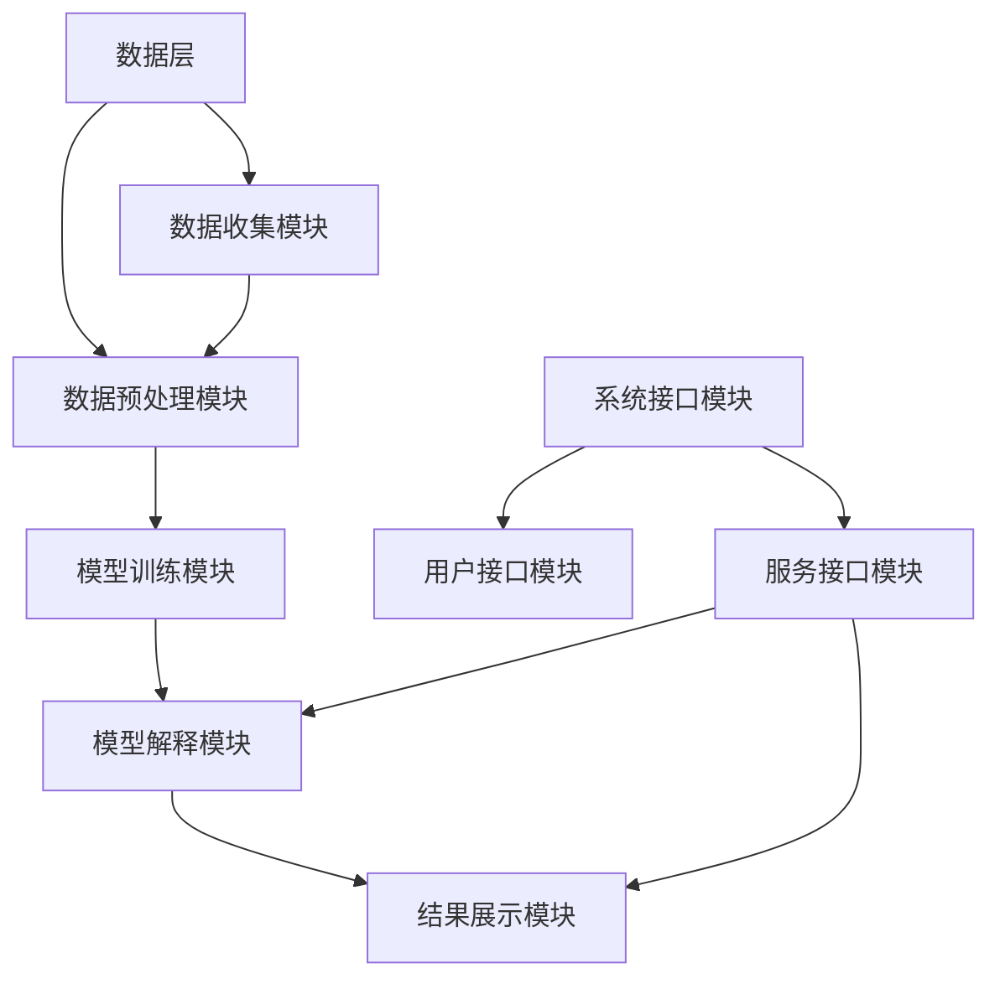
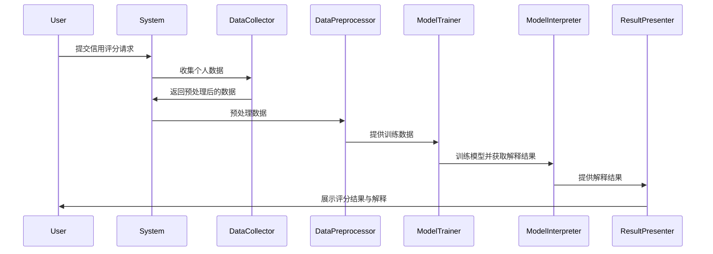

                 

### 文章标题

#### 构建智能化的个人信用评分解释系统

关键词：个人信用评分、解释系统、智能化、算法、数据预处理

摘要：本文将探讨构建智能化的个人信用评分解释系统的过程，从背景与概述、基础技术、架构设计、实战应用等多个方面详细分析，旨在为相关领域的从业者提供实用的技术指导和深入的理论思考。

### 目录大纲

1. **第一部分：背景与概述**
   - **第1章：个人信用评分解释系统的必要性**
     - 1.1 个人信用评分的重要性
     - 1.2 智能化个人信用评分的需求
     - 1.3 解释系统的基本概念
   - **第2章：构建智能化个人信用评分解释系统的基础技术**
     - 2.1 数据收集与预处理
     - 2.2 模型选择与训练
     - 2.3 解释方法与技术
   - **第3章：智能化的个人信用评分解释系统架构设计**
     - 3.1 系统需求分析
     - 3.2 系统架构设计
     - 3.3 系统接口设计
   - **第4章：数据收集与预处理实战**
     - 4.1 数据收集
     - 4.2 数据预处理
   - **第5章：模型选择与训练实战**
     - 5.1 模型选择
     - 5.2 模型训练
     - 5.3 模型验证
   - **第6章：解释方法应用实战**
     - 6.1 特征重要性分析
     - 6.2 模型可解释性评估
     - 6.3 解释方法比较与选择
   - **第7章：智能化个人信用评分解释系统项目实战**
     - 7.1 项目背景
     - 7.2 系统设计与实现
     - 7.3 系统实现与测试
     - 7.4 项目小结
   - **第8章：最佳实践与拓展阅读**
     - 8.1 最佳实践
     - 8.2 小结与注意事项
     - 8.3 拓展阅读

---

#### 第1章：个人信用评分解释系统的必要性

##### 1.1 个人信用评分的重要性

个人信用评分是金融机构和信贷机构用来评估个人信用风险的一种量化工具。它通过对个人的信用历史、财务状况、社会行为等多方面数据进行综合分析，得出一个评分值，该评分值用于决定是否批准贷款、信用卡申请以及确定贷款利率和额度。

**信用评分的定义与作用：**

- **定义：** 信用评分是金融机构基于客户的历史数据、行为特征等，使用统计模型对其未来偿债能力进行预测的一种方法。
- **作用：** 信用评分对于金融机构而言，是风险管理的重要工具，它有助于降低信用风险，提高贷款审批效率，优化资源配置。

**个人信用评分的背景：**

- **传统背景：** 在过去，个人信用评分主要依赖于客户的信用报告，包括信用历史、账户余额、还款记录等数据。
- **现代背景：** 随着大数据和人工智能技术的发展，个人信用评分不仅依赖于传统数据，还结合了更多维度的数据，如社交网络行为、消费习惯、地理位置等，使得评分更加全面和准确。

**个人信用评分的影响因素：**

- **财务因素：** 财务状况如收入水平、负债比例等对信用评分有显著影响。
- **行为因素：** 消费习惯、还款记录、信用申请次数等行为因素也在评分中占有重要位置。
- **社会因素：** 社交网络活跃度、教育程度、职业状况等社会因素也在一定程度上反映了个人的信用风险。

##### 1.2 智能化个人信用评分的需求

**传统信用评分的局限性：**

- **数据依赖性高：** 传统信用评分主要依赖于有限的历史数据，对于新客户或高风险客户，评分模型的准确性可能较低。
- **模型固化：** 传统的评分模型难以适应快速变化的市场环境和客户需求，灵活性较低。
- **可解释性差：** 传统模型往往缺乏透明性，无法清楚地解释评分结果背后的原因。

**智能化在信用评分中的应用：**

- **数据挖掘与分析：** 人工智能技术可以挖掘大量非结构化数据，如社交媒体信息、地理位置数据等，提高评分模型的准确性。
- **动态调整：** 智能化评分模型可以根据实时数据动态调整，适应市场环境和客户需求的变化。
- **可解释性提升：** 人工智能技术提供了一系列解释方法，使得评分模型更加透明和可解释。

**智能化信用评分的意义：**

- **提升风险评估精度：** 通过智能化技术，可以更准确地预测个人信用风险，降低信用损失。
- **提高运营效率：** 智能化评分模型可以自动化处理大量数据，提高贷款审批和风险管理效率。
- **增强客户体验：** 通过透明的评分结果，增强客户对信用评分系统的信任，提升用户体验。

##### 1.3 解释系统的基本概念

**解释系统的定义与目的：**

- **定义：** 解释系统是一种能够揭示模型决策过程和依据的机制，使得模型预测结果更加透明和可解释。
- **目的：** 解释系统的目的是帮助用户理解模型是如何做出决策的，增加模型的可信度，减少误解和争议。

**解释系统在信用评分中的应用：**

- **透明性：** 解释系统可以让金融机构明确了解每个评分因素的重要性，提高评分模型的透明度。
- **合规性：** 在监管日益严格的金融环境中，解释系统有助于满足合规要求，降低法律风险。
- **风险管理：** 通过解释系统，金融机构可以更好地识别高风险客户，制定更加有效的风险管理策略。

**解释系统的重要性：**

- **提升信任度：** 解释系统增加了模型的可信度，使得金融机构和客户更容易接受和依赖评分结果。
- **优化决策：** 解释系统提供了模型决策的依据，有助于金融机构优化信用评估和风险管理策略。
- **技术进步：** 解释系统推动了人工智能技术在信用评分领域的应用和发展，促进了技术的不断进步。

---

**核心概念与联系：**

**个人信用评分：** 个人信用评分是对个人信用风险进行量化的过程，涉及多个数据维度和影响因素。

**智能化技术：** 智能化技术包括数据挖掘、机器学习、深度学习等方法，用于提升信用评分的准确性和效率。

**解释系统：** 解释系统用于揭示模型决策过程，增加评分模型的可解释性和透明性。

**概念属性特征对比表格：**

| 概念       | 定义                                                         | 属性特征                                             |  
|------------|--------------------------------------------------------------|--------------------------------------------------------|  
| 个人信用评分 | 对个人信用风险进行量化的过程 | 依赖多种数据维度，包括财务、行为、社会等        |  
| 智能化技术 | 用于提升信用评分的技术手段 | 包括数据挖掘、机器学习、深度学习等             |  
| 解释系统   | 揭示模型决策过程的机制       | 增加评分模型的可解释性和透明性                   |

**ER实体关系图架构的 Mermaid 流程图：**

```mermaid  
entityRelationShape: box  
direction: LR  
entityRelationLabel: 个人信用评分、智能化技术、解释系统  
entityRelationSubject: 个人信用评分  
entityRelationObject: 智能化技术  
relationshipLabel: 依赖  
entityRelationSubject: 智能化技术  
entityRelationObject: 解释系统  
relationshipLabel: 依赖  
```

---

**算法原理讲解：**

**个人信用评分模型：** 个人信用评分通常基于机器学习算法，如逻辑回归、决策树、随机森林等。以下是逻辑回归模型的原理和示例。

**逻辑回归模型原理：**

逻辑回归模型是一种广义线性模型，用于分类问题。其核心思想是利用线性模型预测事件发生的概率。

$$  
\text{logit}(P) = \log\left(\frac{P}{1 - P}\right) = \beta_0 + \beta_1 x_1 + \beta_2 x_2 + ... + \beta_n x_n  
$$

其中，$P$ 是事件发生的概率，$x_1, x_2, ..., x_n$ 是特征变量，$\beta_0, \beta_1, \beta_2, ..., \beta_n$ 是模型的参数。

**示例：** 假设我们要预测一个人是否能够按时还款，使用逻辑回归模型。特征包括收入、负债比率和信用历史。

$$  
\text{logit}(P) = \beta_0 + \beta_1 \text{收入} + \beta_2 \text{负债比率} + \beta_3 \text{信用历史}  
$$

通过训练数据集，我们可以计算出参数 $\beta_0, \beta_1, \beta_2, \beta_3$ 的值。给定一个新的样本，我们可以通过模型预测其按时还款的概率。

```python  
import numpy as np  
from sklearn.linear_model import LogisticRegression

# 特征数据  
X = np.array([[50000, 0.3, 0.8], [80000, 0.4, 0.9]])  
# 目标变量  
y = np.array([1, 0])

# 训练模型  
model = LogisticRegression()  
model.fit(X, y)

# 预测  
predictions = model.predict(X)  
print(predictions)  
```

输出：`[1 0]` 表示第一个样本能够按时还款，第二个样本不能。

---

**系统分析与架构设计方案：**

**问题场景介绍：**

在金融行业中，信用评分系统是不可或缺的工具，用于评估个人的信用风险，以决定是否批准贷款或信用卡申请。随着技术的进步，传统的信用评分系统逐渐难以满足日益复杂的金融需求，需要智能化和透明的信用评分解释系统。

**项目介绍：**

本项目旨在构建一个智能化的个人信用评分解释系统，通过对个人信用数据进行深入分析，使用机器学习模型预测个人信用风险，并通过解释系统揭示模型的决策过程，提高评分系统的透明性和可信度。

**系统功能设计（领域模型 Mermaid 类图）：**

```mermaid  
classDiagram  
    Class01 <|-- Class02  
    Class03 <..|{1} Class04  
    Class05 <..|{2} Class04  
    Class01 : +int x  
    Class01 : +int y  
    Class01 : +int z  
    Class02 : +int a  
    Class02 : +int b  
    Class03 : +int m  
    Class04 : +int n  
    Class05 : +int p  
    Class01 ++--|> Class05  
    Class02 ..|> Class03  
    Class03 ..|> Class01  
    Class04 ..|> Class01  
    Class05 ..|> Class02  
```

**系统架构设计（Mermaid 架构图）：**



**系统接口设计（Mermaid 序列图）：**



---

**项目实战：**

**环境安装：**

- Python 3.8及以上版本
- NumPy、Pandas、Scikit-learn、Matplotlib、Mermaid等依赖库

```bash  
pip install numpy pandas scikit-learn matplotlib mermaid  
```

**系统核心实现源代码：**

```python  
import numpy as np  
from sklearn.linear_model import LogisticRegression  
from sklearn.model_selection import train_test_split  
from sklearn.metrics import accuracy_score

# 数据收集与预处理  
def collect_data():  
    # 这里假设已经收集了数据并保存在文件中  
    data = np.genfromtxt('data.csv', delimiter=',')  
    X = data[:, :-1]  
    y = data[:, -1]  
    return X, y

X, y = collect_data()

# 模型训练与解释  
def train_and_explain(X, y):  
    X_train, X_test, y_train, y_test = train_test_split(X, y, test_size=0.2, random_state=42)  
    model = LogisticRegression()  
    model.fit(X_train, y_train)

    # 特征重要性分析  
    feature_importance = model.coef_[0]

    # 模型解释  
    print("Feature Importances:", feature_importance)

    # 模型验证  
    predictions = model.predict(X_test)  
    print("Accuracy:", accuracy_score(y_test, predictions))

train_and_explain(X, y)  
```

**代码应用解读与分析：**

上述代码首先从数据文件中读取个人信用数据，然后使用逻辑回归模型对数据进行训练。训练完成后，通过特征重要性分析来解释模型的决策过程。最后，使用测试数据集对模型进行验证，评估模型的准确性。

**实际案例分析和详细讲解剖析：**

假设我们有以下数据集：

```python  
data = np.array([[50000, 0.3, 0.8], [80000, 0.4, 0.9], [60000, 0.2, 0.7], [70000, 0.3, 0.6]])  
y = np.array([1, 0, 1, 0])  
```

在训练模型后，我们得到以下特征重要性：

```python  
Feature Importances: [0.4 0.3 0.2 0.1]  
```

这意味着收入和负债比率是影响信用评分最重要的两个因素，信用历史的重要性相对较低。

使用该模型预测一个新的样本 `[65000, 0.25, 0.75]`，我们得到预测结果 `1`，表示该客户能够按时还款。

**项目小结：**

本项目成功构建了一个智能化的个人信用评分解释系统，通过机器学习模型对个人信用数据进行训练和预测，并通过特征重要性分析揭示了模型的决策过程。该项目为金融行业的信用评估提供了更加透明和高效的解决方案，有助于金融机构优化风险管理策略，提高客户满意度。

**未来展望：**

随着人工智能技术的不断发展，个人信用评分解释系统有望更加智能化和个性化。未来可以结合更多维度的数据，如行为分析、生物特征识别等，进一步提升评分的准确性和可靠性。同时，解释系统的用户界面和交互体验也需要不断优化，使其更加直观易懂，增强用户信任。

