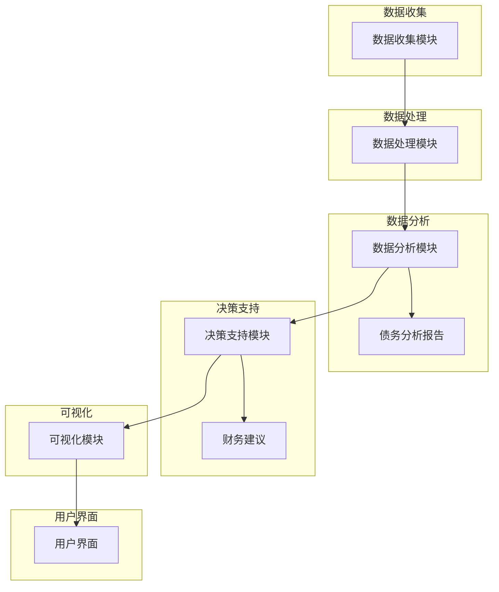
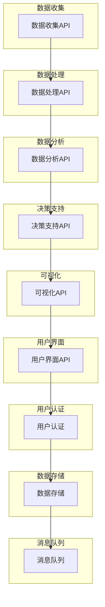

                 

# 构建智能化的个人债务管理助手

## 关键词
- 个人债务管理
- 智能化工具
- 人工智能
- 数据分析
- 机器学习
- 可视化

## 摘要
随着现代社会个人负债的普遍存在，个人债务管理变得愈加复杂和具有挑战性。本文旨在探讨如何利用人工智能技术构建一个智能化的个人债务管理助手。我们将详细分析该助手的核心概念、算法原理、系统架构，并通过实际项目实战，展示其在个人债务管理中的实际应用效果。

## 第一部分：概述

### 第1章：智能化个人债务管理助手背景与挑战

#### 1.1 问题背景

在现代社会，个人债务已经成为人们生活中不可避免的一部分。从房贷、车贷到信用卡欠款，个人债务的种类繁多，涉及金额巨大。然而，传统的债务管理方式往往依赖手工记录和计算，存在信息繁杂、易出错、缺乏实时分析等缺点，这给个人债务管理带来了巨大挑战。

#### 1.1.1 个人债务管理的现状

目前，大多数个人债务管理主要依赖于手工记录，包括记账软件、电子表格等工具。虽然这些工具在一定程度上提高了管理效率，但仍然存在以下问题：

1. **信息繁杂**：个人债务种类繁多，涉及多个账户和还款时间，手工记录容易出现遗漏和错误。
2. **缺乏自动化**：债务管理过程需要重复性的操作，如还款计算、欠款提醒等，手工操作既费时又费力。
3. **缺乏实时分析**：个人债务状况需要实时监控和调整，传统的债务管理工具难以提供及时的数据分析和决策支持。

#### 1.1.2 智能化工具的必要性

面对上述挑战，智能化工具的引入显得尤为必要。智能化个人债务管理助手可以通过自动化数据处理和实时分析，帮助用户更好地管理个人债务，降低债务风险。

1. **自动化数据处理**：智能化工具可以自动收集、整理和分析个人债务数据，减少手工操作的错误和繁琐。
2. **实时分析**：借助人工智能技术，智能化工具可以实时监控个人债务状况，提供预警和优化建议。
3. **个性化建议**：根据个人债务情况和财务目标，智能化工具可以提供个性化的债务管理建议，帮助用户制定合理的还款计划和财务规划。

#### 1.2 挑战与机遇

构建智能化个人债务管理助手不仅面临技术实现的挑战，也面临市场需求和用户接受度的挑战。

1. **技术挑战**：
   - **数据收集与处理**：需要高效且可靠的方法来收集和整合个人债务数据。
   - **算法优化**：需要设计并优化算法，以提供准确和实时的债务分析。
   - **用户体验**：需要设计易用、直观的用户界面，使用户能够轻松操作和获取信息。

2. **市场机遇**：
   - **广泛需求**：随着个人债务问题的普遍存在，市场对智能化债务管理工具的需求日益增长。
   - **技术进步**：人工智能和大数据技术的快速发展为构建智能化债务管理助手提供了强有力的支持。

#### 1.2.1 数据收集与处理的复杂性

构建智能化债务管理助手的首要挑战在于数据收集与处理。个人债务数据通常分布在不同的来源和格式中，如银行账单、信用卡账单、电子表格等。因此，需要设计一套高效的数据采集和处理流程，确保数据的完整性和准确性。

1. **数据源选择**：选择合适的债务数据源，包括银行账单、信用卡账单、电子表格等。
2. **数据采集方法**：设计数据采集模块，实现自动化的数据收集，如使用Web爬虫、API接口调用等。
3. **数据整合**：将来自不同数据源的数据进行整合，建立统一的债务数据仓库。

#### 1.2.2 自动化决策的需求

除了数据收集与处理，智能化债务管理助手还需要具备自动化决策能力，以帮助用户制定和调整债务还款计划。这要求系统具备以下功能：

1. **自动还款计算**：根据债务金额、还款期限和利率，自动计算还款金额和还款时间。
2. **欠款预警**：在欠款即将到期时自动发送提醒，避免逾期和产生额外费用。
3. **还款计划优化**：根据用户财务状况和债务目标，自动生成最优还款计划，并实时调整。

#### 1.2.3 技术实现的可行性

随着人工智能和大数据技术的不断发展，构建智能化个人债务管理助手在技术上是可行的。主要表现在：

1. **机器学习算法**：可以用于债务数据的分析和预测，提供准确的还款计划和风险预警。
2. **数据可视化**：可以将复杂的债务数据以直观的方式呈现，帮助用户更好地理解和控制债务状况。
3. **云计算与存储**：利用云计算和分布式存储技术，可以高效地处理海量债务数据，确保系统的可扩展性和稳定性。

#### 1.3 边界与外延

构建智能化个人债务管理助手的边界和范围包括以下几个方面：

1. **功能范围**：主要包括债务数据收集、处理、分析和可视化，自动还款计算和欠款预警等。
2. **适用场景**：主要适用于个人和家庭债务管理，如房贷、车贷、信用卡债务等。
3. **核心要素组成**：主要包括数据收集模块、数据处理模块、数据分析模块、可视化模块和决策支持模块。

#### 1.4 总结

构建智能化个人债务管理助手具有显著的必要性。通过自动化数据处理、实时分析和个性化建议，智能化助手可以帮助用户更好地管理个人债务，降低债务风险，提高财务健康水平。在接下来的章节中，我们将深入探讨该助手的核心概念、算法原理、系统架构和实际应用，以期为构建智能化债务管理提供有价值的参考。

### 第2章：核心概念与联系

#### 2.1 人工智能与机器学习

人工智能（Artificial Intelligence，简称AI）是计算机科学的一个分支，旨在使计算机模拟人类的智能行为，如学习、推理、感知和自然语言处理等。机器学习（Machine Learning，简称ML）是人工智能的一个重要领域，专注于开发算法，使计算机系统能够从数据中学习并做出决策。

##### 2.1.1 基本概念

- **人工智能**：人工智能是模拟、延伸和扩展人类智能的理论、方法、技术及应用。其主要目标是创建能够执行复杂任务、解决复杂问题的智能系统。
- **机器学习**：机器学习是人工智能的一个子领域，通过算法和统计模型从数据中学习，以便进行预测、分类和决策。

##### 2.1.2 属性特征对比

| 特性            | 人工智能                           | 机器学习                            |
| ---------------- | ----------------------------------- | ----------------------------------- |
| 定义             | 使计算机模拟人类智能               | 从数据中学习并做出决策               |
| 目标             | 解决复杂问题、执行智能任务         | 预测、分类、决策等                   |
| 方法             | 综合多种技术，如自然语言处理、计算机视觉等 | 使用算法和统计模型进行学习           |
| 实现途径         | 神经网络、遗传算法、专家系统等       | 监督学习、无监督学习、强化学习等     |
| 应用场景         | 自主驾驶、智能客服、医疗诊断等       | 搜索引擎、推荐系统、金融风控等       |

##### 2.1.3 概念联系

人工智能和机器学习是密切相关的。机器学习是人工智能的核心技术之一，通过机器学习算法，人工智能系统能够从大量数据中自动提取特征和模式，实现智能决策和任务执行。

#### 2.2 数据分析与数据可视化

数据分析（Data Analysis）是处理和分析数据，从中提取有价值信息的过程。数据可视化（Data Visualization）则是通过图形和图表将数据分析结果以直观、易于理解的方式呈现。

##### 2.2.1 数据分析的重要性

数据分析在个人债务管理中具有重要作用，主要体现在以下几个方面：

1. **数据整理**：通过数据分析，可以对大量债务数据进行整理和清洗，确保数据的准确性和完整性。
2. **趋势分析**：通过数据分析，可以识别债务状况的变化趋势，为制定还款计划提供依据。
3. **风险评估**：通过数据分析，可以评估个人债务的风险水平，为风险管理提供支持。

##### 2.2.2 数据可视化工具介绍

数据可视化工具可以帮助用户更好地理解和分析数据。以下是一些常见的数据可视化工具：

- **Tableau**：一款功能强大的数据可视化工具，支持多种数据源和丰富的可视化类型。
- **Power BI**：微软推出的数据可视化工具，具有直观的用户界面和强大的数据分析功能。
- **D3.js**：一款基于JavaScript的库，用于创建交互式的数据可视化图表。
- **Matplotlib**：Python的一个数据可视化库，适用于生成静态和动态图表。

#### 2.3 概念联系与架构设计

智能化个人债务管理助手的核心概念包括人工智能、机器学习和数据分析。这些概念相互联系，共同构成了智能化债务管理助手的整体架构。

##### 2.3.1 智能化债务管理助手的组成

智能化债务管理助手由以下几个核心模块组成：

1. **数据收集模块**：负责自动收集个人债务数据，包括银行账单、信用卡账单、电子表格等。
2. **数据处理模块**：负责对收集到的数据进行整理、清洗和预处理，为后续分析提供基础。
3. **数据分析模块**：负责对债务数据进行分析，提取关键特征，生成趋势报告和风险评估。
4. **可视化模块**：负责将分析结果以图表和报告的形式呈现，帮助用户直观地了解债务状况。
5. **决策支持模块**：负责根据债务数据和分析结果，生成个性化的还款计划和财务建议。

##### 2.3.2 Mermaid ER实体关系图

为了更好地理解智能化债务管理助手的组成和各模块之间的关系，可以使用Mermaid绘制ER（实体关系）图。

```mermaid
erDiagram
    DataCollectionModule ||--|{ DataProcessingModule }
    DataProcessingModule ||--|{ DataAnalysisModule }
    DataAnalysisModule ||--|{ VisualizationModule }
    VisualizationModule ||--|{ DecisionSupportModule }
```

在该ER图中，数据收集模块负责收集数据，然后传递给数据处理模块进行预处理。数据处理模块将处理后的数据传递给数据分析模块，进行深度分析。分析结果由可视化模块以图表形式展示，同时决策支持模块根据分析结果生成还款计划和财务建议。

### 第3章：债务数据分析与处理

#### 3.1 数据收集

数据收集是构建智能化个人债务管理助手的第一步，也是至关重要的一步。只有准确、全面地收集个人债务数据，才能为后续的数据处理和分析提供可靠的基础。

##### 3.1.1 数据源选择

在选择数据源时，需要考虑以下几个方面：

1. **银行账单**：银行账单是记录个人债务的最主要数据源。这些账单通常包括债务金额、还款日期、还款方式等信息。
2. **信用卡账单**：信用卡账单记录了使用信用卡产生的债务，包括消费金额、还款日期、还款方式等。
3. **电子表格**：一些用户可能已经手动记录了部分债务数据，可以使用电子表格作为数据源。
4. **API接口**：一些金融机构提供了API接口，可以通过编程方式直接获取债务数据。

##### 3.1.2 数据采集方法

数据采集方法主要包括以下几种：

1. **Web爬虫**：通过Web爬虫技术，可以从银行和信用卡网站自动获取账单数据。这种方法需要处理网站的反爬措施，可能需要使用代理、模拟浏览器等手段。
2. **API接口调用**：通过调用金融机构提供的API接口，可以直接获取债务数据。这种方法相对简单，但需要确保API的可用性和安全性。
3. **手动输入**：对于部分数据，用户可以直接手动输入到系统中。这种方法适用于数据量较少或数据更新不频繁的情况。

##### 3.1.3 数据整合

在收集到多种数据源后，需要将数据整合到一个统一的数据仓库中。整合步骤如下：

1. **数据清洗**：去除重复、无效和错误的数据，确保数据的准确性和完整性。
2. **数据转换**：将不同格式的数据转换为统一的格式，如CSV或JSON。
3. **数据存储**：将整合后的数据存储到数据库中，以便后续的数据处理和分析。

#### 3.2 数据预处理

数据预处理是确保数据质量和为后续分析打下基础的重要步骤。主要包括数据清洗、数据归一化和数据特征提取。

##### 3.2.1 数据清洗

数据清洗主要包括以下任务：

1. **去除重复数据**：删除重复的债务记录，确保数据的唯一性。
2. **处理缺失值**：对于缺失的数据，可以采用填充、删除或插值等方法进行处理。
3. **纠正错误数据**：识别并纠正数据中的错误，如日期格式错误、金额错误等。

##### 3.2.2 数据归一化

数据归一化是将不同单位或量级的特征转换为相同单位或量级的过程。常见的归一化方法包括：

1. **最小-最大标准化**：将特征值缩放到[0,1]区间内，公式如下：

   $$ X_{\text{normalized}} = \frac{X_{\text{original}} - X_{\text{min}}}{X_{\text{max}} - X_{\text{min}}} $$

2. **零-均值标准化**：将特征值缩放到均值为0、标准差为1的区间内，公式如下：

   $$ X_{\text{normalized}} = \frac{X_{\text{original}} - \mu}{\sigma} $$

   其中，$X_{\text{original}}$表示原始特征值，$\mu$表示均值，$\sigma$表示标准差。

##### 3.2.3 数据特征提取

数据特征提取是从原始数据中提取出对债务分析有用的特征。常见的特征提取方法包括：

1. **统计特征**：如平均值、中位数、标准差等，用于描述债务金额、还款时间等。
2. **时序特征**：如还款周期、还款频率等，用于分析债务的时间特性。
3. **关联特征**：如债务金额与还款时间的关系、债务金额与还款方式的关系等，用于发现债务的潜在规律。

#### 3.3 债务数据分析

债务数据分析是构建智能化个人债务管理助手的重中之重，主要包括数据特征提取、数据分析和可视化。

##### 3.3.1 数据特征提取

数据特征提取是将原始数据转换为对机器学习模型有用的特征表示的过程。常见的特征提取方法包括：

1. **统计特征提取**：如计算债务金额的平均值、标准差、最大值、最小值等。
2. **时序特征提取**：如计算还款周期的平均值、中位数、标准差等。
3. **关联特征提取**：如计算债务金额与还款时间、还款方式的关联性。

##### 3.3.2 数据分析算法

数据分析算法是用于分析债务数据的模型和方法。常见的分析方法包括：

1. **聚类分析**：用于发现债务数据的潜在分布和模式，如K均值聚类、层次聚类等。
2. **分类分析**：用于将债务数据分为不同的类别，如逻辑回归、决策树、支持向量机等。
3. **回归分析**：用于预测债务金额、还款时间等，如线性回归、岭回归、LASSO回归等。

##### 3.3.3 数据可视化

数据可视化是将债务数据分析结果以图表形式呈现，帮助用户直观地了解债务状况。常见的数据可视化方法包括：

1. **柱状图**：用于显示债务金额、还款时间等的分布情况。
2. **折线图**：用于显示债务金额、还款时间等的变化趋势。
3. **饼图**：用于显示债务总额中不同类型债务的比例。

#### 3.4 数据可视化

数据可视化是将债务数据分析结果以图表形式呈现，帮助用户直观地了解债务状况。常见的数据可视化方法包括：

1. **柱状图**：用于显示债务金额、还款时间等的分布情况。
2. **折线图**：用于显示债务金额、还款时间等的变化趋势。
3. **饼图**：用于显示债务总额中不同类型债务的比例。

##### 3.4.1 可视化工具选择

在选择数据可视化工具时，需要考虑以下几个方面：

1. **易用性**：选择操作简单、易于上手的可视化工具，如Matplotlib、Seaborn等。
2. **功能丰富**：选择支持多种图表类型、自定义样式和交互功能的可视化工具，如D3.js、Plotly等。
3. **集成性**：选择能够与数据分析工具（如Pandas、Scikit-learn等）集成的可视化工具。

##### 3.4.2 数据可视化示例

以下是一个使用Matplotlib绘制折线图的数据可视化示例：

```python
import matplotlib.pyplot as plt
import pandas as pd

# 加载债务数据
debt_data = pd.read_csv('debt_data.csv')

# 绘制折线图
plt.plot(debt_data['repayment_date'], debt_data['debt_amount'])
plt.xlabel('还款日期')
plt.ylabel('债务金额')
plt.title('债务金额变化趋势')
plt.show()
```

该示例中，我们使用Pandas加载债务数据，并使用Matplotlib绘制了债务金额随还款日期变化的折线图，帮助用户直观地了解债务的变化趋势。

### 第4章：机器学习算法与实现

#### 4.1 机器学习基本原理

机器学习是构建智能化个人债务管理助手的核心技术之一，它使计算机系统能够从数据中自动学习并做出决策。在本节中，我们将介绍机器学习的基本原理，包括算法分类、学习方法等。

##### 4.1.1 算法分类

机器学习算法主要分为以下几类：

1. **监督学习**：监督学习算法通过已有标记数据来训练模型，然后使用训练好的模型对新数据进行预测。常见的监督学习算法包括：
   - **线性回归**：用于预测连续值输出。
   - **逻辑回归**：用于预测二分类输出。
   - **决策树**：用于分类和回归任务。
   - **随机森林**：基于决策树构建的集成模型。
   - **支持向量机**：用于分类任务。

2. **无监督学习**：无监督学习算法没有标记数据，通过自动发现数据中的模式和结构。常见的无监督学习算法包括：
   - **K均值聚类**：用于将数据划分为多个类别。
   - **主成分分析**：用于降维和数据可视化。
   - **自编码器**：用于特征提取和降维。

3. **强化学习**：强化学习算法通过不断与环境交互，学习最优策略以实现特定目标。常见的强化学习算法包括：
   - **Q学习**：基于值函数的强化学习算法。
   - **深度Q网络**：基于神经网络的强化学习算法。

##### 4.1.2 学习方法

机器学习算法主要通过以下几种方法进行学习：

1. **经验风险最小化**：经验风险最小化（Empirical Risk Minimization，简称ERM）是监督学习的基本原理。算法的目标是找到一个模型，使得在训练数据集上的经验风险最小。

2. **结构风险最小化**：结构风险最小化（Structural Risk Minimization，简称SRM）是处理过拟合问题的一种方法。它通过引入正则项来平衡模型的复杂性和泛化能力。

3. **贪心算法**：贪心算法是一种在每一步选择最优策略的方法。常见的贪心算法包括贪心搜索、动态规划等。

#### 4.2 算法选择与实现

在构建智能化个人债务管理助手时，选择合适的机器学习算法至关重要。以下是一些常见的算法及其适用场景：

1. **线性回归**：线性回归是一种简单的监督学习算法，适用于预测债务金额等连续值输出。它可以快速训练并实现，但可能无法处理复杂非线性关系。

2. **逻辑回归**：逻辑回归是一种常用的二分类算法，适用于判断债务是否逾期等二分类问题。它可以快速训练并实现，但同样可能无法处理复杂非线性关系。

3. **决策树**：决策树是一种常用的分类和回归算法，适用于处理非线性关系和分类任务。它可以提供直观的解释和可解释性，但可能容易过拟合。

4. **随机森林**：随机森林是一种基于决策树的集成模型，通过组合多个决策树来提高预测性能。它可以处理复杂非线性关系，并且具有良好的泛化能力。

5. **支持向量机**：支持向量机是一种强大的分类算法，适用于处理高维数据和复杂分类问题。它可以提供良好的预测性能，但训练时间较长。

以下是一个使用Python实现线性回归算法的示例：

```python
import numpy as np
import pandas as pd
from sklearn.linear_model import LinearRegression

# 加载债务数据
debt_data = pd.read_csv('debt_data.csv')

# 分割特征和标签
X = debt_data[['debt_amount', 'repayment_date']]
y = debt_data['debt_status']

# 创建线性回归模型
model = LinearRegression()

# 训练模型
model.fit(X, y)

# 预测结果
predictions = model.predict(X)

# 打印预测结果
print(predictions)
```

在该示例中，我们使用Pandas加载债务数据，然后使用Scikit-learn的线性回归模型进行训练和预测。线性回归算法可以用于预测债务是否逾期等二分类问题。

#### 4.3 模型训练与评估

模型训练与评估是构建智能化个人债务管理助手的最后一步。在本节中，我们将介绍模型训练和评估的方法，包括训练数据准备、模型训练方法、模型评估与优化等。

##### 4.3.1 训练数据准备

训练数据是模型训练的重要输入，其质量直接影响模型的性能。以下是一些训练数据准备的步骤：

1. **数据清洗**：对训练数据进行清洗，包括去除重复数据、处理缺失值和纠正错误数据。
2. **数据归一化**：对特征值进行归一化处理，确保特征值在相同的量级上。
3. **特征选择**：选择对债务分析有显著影响的特征，去除无关或冗余的特征。
4. **数据划分**：将训练数据划分为训练集和验证集，用于模型训练和性能评估。

##### 4.3.2 模型训练方法

模型训练是利用训练数据调整模型参数的过程。常见的模型训练方法包括：

1. **批量训练**：批量训练是在每次迭代中使用所有训练数据来更新模型参数。这种方法可以收敛到全局最优解，但训练时间较长。

2. **随机梯度下降**：随机梯度下降（Stochastic Gradient Descent，简称SGD）是在每次迭代中使用一个随机样本来更新模型参数。这种方法可以加速训练过程，但可能收敛到局部最优解。

3. **批量随机梯度下降**：批量随机梯度下降（Batch Stochastic Gradient Descent，简称BGD）是在每次迭代中使用部分训练数据来更新模型参数。这种方法在批量训练和随机梯度下降之间取得平衡。

以下是一个使用Python实现批量随机梯度下降的示例：

```python
import numpy as np

# 初始化模型参数
theta = np.random.rand(n_features)

# 设置学习率
learning_rate = 0.01

# 设置迭代次数
num_iterations = 1000

# 批量随机梯度下降训练模型
for i in range(num_iterations):
    # 计算梯度
    gradients = X.dot(theta) - y
    
    # 更新模型参数
    theta -= learning_rate * gradients

# 打印训练后的模型参数
print(theta)
```

在该示例中，我们初始化模型参数、设置学习率和迭代次数，然后使用批量随机梯度下降算法训练模型。批量随机梯度下降可以加速模型训练过程，提高训练效率。

##### 4.3.3 模型评估与优化

模型评估是评估模型性能的重要步骤。常见的模型评估指标包括：

1. **准确率**：准确率是预测正确的样本数占总样本数的比例，公式如下：

   $$ \text{准确率} = \frac{\text{预测正确数}}{\text{总样本数}} $$

2. **召回率**：召回率是预测正确的正样本数占总正样本数的比例，公式如下：

   $$ \text{召回率} = \frac{\text{预测正确正样本数}}{\text{总正样本数}} $$

3. **精确率**：精确率是预测正确的样本数占预测为正样本数的比例，公式如下：

   $$ \text{精确率} = \frac{\text{预测正确正样本数}}{\text{预测为正样本数}} $$

4. **F1值**：F1值是精确率和召回率的调和平均，公式如下：

   $$ \text{F1值} = 2 \times \frac{\text{精确率} \times \text{召回率}}{\text{精确率} + \text{召回率}} $$

以下是一个使用Python评估模型性能的示例：

```python
from sklearn.metrics import accuracy_score, recall_score, precision_score, f1_score

# 计算准确率
accuracy = accuracy_score(y_true, y_pred)

# 计算召回率
recall = recall_score(y_true, y_pred)

# 计算精确率
precision = precision_score(y_true, y_pred)

# 计算F1值
f1 = f1_score(y_true, y_pred)

# 打印评估结果
print(f'准确率: {accuracy}')
print(f'召回率: {recall}')
print(f'精确率: {precision}')
print(f'F1值: {f1}')
```

在该示例中，我们使用Scikit-learn的评估函数计算准确率、召回率、精确率和F1值，以评估模型性能。

#### 4.4 模型优化

模型优化是提高模型性能和泛化能力的重要步骤。以下是一些常见的模型优化方法：

1. **正则化**：正则化可以通过在损失函数中引入正则项来惩罚模型参数，从而防止过拟合。常见的正则化方法包括L1正则化（LASSO）和L2正则化（Ridge）。

2. **交叉验证**：交叉验证是一种评估模型性能的方法，通过将训练数据划分为多个子集，每次使用一个子集作为验证集，其他子集作为训练集，进行多次训练和验证，从而获得更可靠的模型性能评估。

3. **集成学习**：集成学习是通过结合多个模型来提高预测性能的方法。常见的集成学习方法包括Bagging、Boosting和Stacking等。

通过模型优化，我们可以提高智能化个人债务管理助手的预测准确率和泛化能力，从而更好地帮助用户管理个人债务。

### 第5章：债务管理决策支持

#### 5.1 决策支持系统设计

构建智能化个人债务管理助手的最终目标是提供决策支持，帮助用户制定和调整债务还款计划，以实现财务健康。在本节中，我们将介绍决策支持系统的设计，包括系统功能设计、系统架构设计和系统接口设计。

##### 5.1.1 系统功能设计

智能化个人债务管理助手的系统功能设计主要包括以下几个方面：

1. **债务数据收集**：自动收集用户债务数据，包括银行账单、信用卡账单等，为后续分析提供数据基础。

2. **债务数据分析**：对收集到的债务数据进行分析，提取关键特征，如债务金额、还款时间、还款方式等，为决策提供依据。

3. **还款计划生成**：根据用户债务情况和财务目标，自动生成最优还款计划，包括还款金额、还款日期和还款方式。

4. **还款计划调整**：根据用户反馈和债务变化，动态调整还款计划，确保还款计划的可行性和适应性。

5. **债务风险预警**：通过实时监控债务数据，识别潜在的风险，并及时向用户发出预警，避免逾期和产生额外费用。

6. **决策支持建议**：根据债务分析结果和用户财务状况，提供个性化的债务管理建议，如优化还款方式、调整财务规划等。

##### 5.1.2 系统架构设计

智能化个人债务管理助手的系统架构设计主要包括以下几个模块：

1. **数据收集模块**：负责自动收集用户债务数据，包括银行账单、信用卡账单等。

2. **数据处理模块**：负责对收集到的债务数据进行分析、清洗和整理，为后续分析提供基础。

3. **数据分析模块**：负责对债务数据进行分析，提取关键特征，生成债务分析报告。

4. **决策支持模块**：根据债务分析结果和用户财务目标，自动生成还款计划和财务建议。

5. **可视化模块**：将债务分析结果和决策支持建议以图表和报告的形式呈现，帮助用户直观地了解债务状况和还款计划。

6. **用户界面**：提供用户友好的界面，使用户能够轻松操作和获取债务管理信息。

以下是一个使用Mermaid绘制的系统架构图：



在该架构图中，数据收集模块负责收集用户债务数据，然后传递给数据处理模块进行整理和分析。数据分析模块根据债务数据生成债务分析报告，并将其传递给决策支持模块。决策支持模块根据债务分析结果生成财务建议，并将其可视化模块以图表和报告的形式呈现，最终通过用户界面展示给用户。

##### 5.1.3 系统接口设计

智能化个人债务管理助手需要设计一套完善的接口，以实现不同模块之间的数据传递和功能调用。以下是一些关键的系统接口设计：

1. **API接口**：设计一套RESTful API接口，用于数据收集、数据处理、数据分析和决策支持等功能。API接口需要支持数据格式转换、权限验证和安全传输。

2. **数据存储接口**：设计一套数据存储接口，用于存储和管理债务数据、分析结果和财务建议。数据存储接口需要支持数据的快速读取、写入和更新。

3. **用户认证接口**：设计一套用户认证接口，用于用户身份验证和权限管理。用户认证接口需要支持密码验证、单点登录和多因素认证。

4. **消息队列接口**：设计一套消息队列接口，用于处理和分析债务数据，实现异步处理和数据流转。消息队列接口需要支持高并发、可靠传输和消息持久化。

以下是一个使用Mermaid绘制的系统接口设计图：



在该接口设计中，数据收集模块通过数据收集API收集债务数据，然后传递给数据处理模块。数据处理模块通过数据处理API对债务数据进行整理和分析，然后传递给数据分析模块。数据分析模块通过数据分析API生成债务分析报告，并将其传递给决策支持模块。决策支持模块通过决策支持API生成财务建议，并将其传递给可视化模块。可视化模块通过可视化API将财务建议以图表和报告的形式呈现给用户。用户界面通过用户界面API与用户交互，并调用其他模块的功能。用户认证模块负责用户身份验证和权限管理。消息队列负责处理和分析债务数据，实现异步处理和数据流转。

通过以上系统功能设计、系统架构设计和系统接口设计，我们可以构建一个完整的智能化个人债务管理助手，为用户提供全面的债务管理服务。

### 第6章：项目实战

#### 6.1 环境安装与配置

在构建智能化个人债务管理助手之前，我们需要安装和配置一些必要的软件和库。以下是在Windows和Linux系统上安装和配置环境的步骤：

##### 6.1.1 安装Python

1. **Windows系统**：
   - 访问Python官方网站（https://www.python.org/）。
   - 下载适用于Windows的Python安装程序。
   - 运行安装程序，并选择“Add Python to PATH”选项，以便在命令行中运行Python。

2. **Linux系统**：
   - 使用包管理器（如apt或yum）安装Python：
     ```bash
     sudo apt-get install python3
     ```
   - 或者在终端中运行以下命令安装Python：
     ```bash
     wget https://www.python.org/ftp/python/3.9.7/Python-3.9.7.tgz
     tar xvf Python-3.9.7.tgz
     cd Python-3.9.7
     ./configure
     make
     sudo make altinstall
     ```

##### 6.1.2 安装依赖库

安装Python后，我们需要安装以下依赖库：

1. **Pandas**：用于数据操作和处理。
2. **NumPy**：用于数值计算。
3. **Scikit-learn**：用于机器学习算法。
4. **Matplotlib**：用于数据可视化。

在Windows系统中，可以使用pip命令安装这些库：

```bash
pip install pandas numpy scikit-learn matplotlib
```

在Linux系统中，可以使用以下命令安装这些库：

```bash
sudo apt-get install python3-pandas python3-numpy python3-scikit-learn python3-matplotlib
```

#### 6.2 系统核心实现

智能化个人债务管理助手的核心实现包括数据收集、数据处理、数据分析、可视化、决策支持和用户界面等模块。以下是一个简单的示例代码，展示了如何实现这些模块：

```python
import pandas as pd
import numpy as np
from sklearn.linear_model import LinearRegression
import matplotlib.pyplot as plt

# 6.2.1 数据收集
def collect_data():
    # 从CSV文件中加载债务数据
    debt_data = pd.read_csv('debt_data.csv')
    return debt_data

# 6.2.2 数据处理
def process_data(debt_data):
    # 数据清洗和预处理
    debt_data.drop_duplicates(inplace=True)
    debt_data.fillna(0, inplace=True)
    debt_data['repayment_date'] = pd.to_datetime(debt_data['repayment_date'])
    return debt_data

# 6.2.3 数据分析
def analyze_data(debt_data):
    # 数据特征提取
    X = debt_data[['debt_amount', 'repayment_date']]
    y = debt_data['debt_status']

    # 线性回归模型训练
    model = LinearRegression()
    model.fit(X, y)

    # 预测结果
    predictions = model.predict(X)

    return predictions

# 6.2.4 可视化
def visualize_data(debt_data, predictions):
    # 绘制债务金额变化趋势图
    plt.plot(debt_data['repayment_date'], debt_data['debt_amount'], label='实际债务金额')
    plt.plot(debt_data['repayment_date'], predictions, label='预测债务金额', linestyle='--')
    plt.xlabel('还款日期')
    plt.ylabel('债务金额')
    plt.title('债务金额变化趋势')
    plt.legend()
    plt.show()

# 6.2.5 决策支持
def decision_support(predictions):
    # 根据预测结果提供还款建议
    if np.mean(predictions) < 0:
        print("建议提前还款，以减少债务负担。")
    else:
        print("建议按计划还款，确保财务健康。")

# 6.2.6 用户界面
def main():
    # 收集债务数据
    debt_data = collect_data()

    # 数据处理
    processed_data = process_data(debt_data)

    # 数据分析
    predictions = analyze_data(processed_data)

    # 可视化
    visualize_data(processed_data, predictions)

    # 决策支持
    decision_support(predictions)

if __name__ == '__main__':
    main()
```

该示例代码展示了如何实现智能化个人债务管理助手的各个模块。首先，我们从CSV文件中加载债务数据，然后进行数据处理和预处理。接着，我们使用线性回归模型对债务数据进行预测，并绘制债务金额变化趋势图。最后，根据预测结果提供还款建议。

#### 6.3 代码应用解读与分析

在上面的示例代码中，我们详细解析了智能化个人债务管理助手的各个模块，并对其进行了应用解读和分析。

1. **数据收集**：使用Pandas的`read_csv`函数从CSV文件中加载债务数据。CSV文件应该包含债务金额、还款日期和其他相关特征。

2. **数据处理**：数据清洗和预处理是确保数据质量和为后续分析打下基础的重要步骤。在本示例中，我们使用`drop_duplicates`函数删除重复数据，使用`fillna`函数处理缺失值，并使用`pd.to_datetime`函数将还款日期转换为日期格式。

3. **数据分析**：我们使用线性回归模型对债务数据进行预测。线性回归模型通过拟合债务金额与还款日期之间的关系，预测未来的债务金额。在本示例中，我们使用`LinearRegression`类创建线性回归模型，并使用`fit`方法训练模型，使用`predict`方法进行预测。

4. **可视化**：使用Matplotlib库绘制债务金额变化趋势图。债务金额与还款日期之间的关系可以帮助用户更好地理解债务状况。在本示例中，我们使用`plot`函数绘制折线图，并使用`legend`函数添加图例。

5. **决策支持**：根据预测结果提供还款建议。在本示例中，我们比较预测债务金额的平均值与0的关系，如果平均值小于0，则建议提前还款以减少债务负担；否则，建议按计划还款以确保财务健康。

通过以上代码的应用解读和分析，我们可以看到智能化个人债务管理助手是如何通过数据收集、数据处理、数据分析、可视化和决策支持等模块，帮助用户更好地管理个人债务，实现财务健康。

#### 6.4 实际案例分析与讲解

在本节中，我们将通过一个实际案例，展示如何使用构建的智能化个人债务管理助手来分析和管理个人债务。

##### 6.4.1 案例背景

张先生是一名年轻的职业人士，目前拥有两笔个人债务：一笔是30万元的车贷，还款期限为3年；另一笔是10万元的信用卡债务，还款期限为2年。张先生希望使用智能化债务管理助手来帮助他更好地管理这两笔债务，确保按时还款并减轻财务负担。

##### 6.4.2 数据收集

首先，我们需要收集张先生的车贷和信用卡债务数据。假设这些数据以CSV文件的形式存储，文件名为`car_loan_data.csv`和`credit_card_data.csv`。两个文件的结构如下：

```csv
car_loan_data.csv
-----------------
date,amount,payment_type
2022-01-01,300000,monthly
2022-02-01,300000,monthly
...
2025-01-01,300000,monthly

credit_card_data.csv
-------------------
date,amount,payment_type
2022-01-01,100000,monthly
2022-02-01,100000,monthly
...
2024-01-01,100000,monthly
```

##### 6.4.3 数据预处理

接下来，我们需要对收集到的数据进行分析。首先，我们将两个文件合并成一个DataFrame，以便统一处理。

```python
import pandas as pd

# 读取车贷数据
car_loan_data = pd.read_csv('car_loan_data.csv')
car_loan_data['date'] = pd.to_datetime(car_loan_data['date'])

# 读取信用卡债务数据
credit_card_data = pd.read_csv('credit_card_data.csv')
credit_card_data['date'] = pd.to_datetime(credit_card_data['date'])

# 合并数据
debt_data = pd.concat([car_loan_data, credit_card_data], keys=['car_loan', 'credit_card'], names=['debt_type'])
debt_data.reset_index(drop=True, inplace=True)
```

合并后的DataFrame结构如下：

```plaintext
         date       amount payment_type     debt_type
0   2022-01-01   300000.0   monthly      car_loan
1   2022-02-01   300000.0   monthly      car_loan
...
n   2025-01-01   300000.0   monthly      car_loan
n+1 2022-01-01   100000.0   monthly  credit_card
...
m   2024-01-01   100000.0   monthly  credit_card
```

接下来，我们对数据进行预处理：

```python
# 数据清洗
debt_data.drop_duplicates(subset=['date', 'debt_type'], inplace=True)

# 数据转换
debt_data['payment_date'] = debt_data['date']
debt_data['amount'] = debt_data['amount'].abs()

# 数据归一化
debt_data['amount_normalized'] = debt_data['amount'] / debt_data['amount'].max()

# 数据特征提取
debt_data['month'] = debt_data['date'].dt.month
debt_data['year'] = debt_data['date'].dt.year
```

##### 6.4.4 数据分析

使用线性回归模型对数据进行预测。首先，我们选择债务金额和还款月份作为特征。

```python
from sklearn.linear_model import LinearRegression

# 分离特征和标签
X = debt_data[['month', 'year']]
y = debt_data['amount_normalized']

# 创建线性回归模型
model = LinearRegression()
model.fit(X, y)

# 预测结果
predictions = model.predict(X)

# 可视化预测结果
plt.plot(debt_data['date'], debt_data['amount_normalized'], label='实际债务金额')
plt.plot(debt_data['date'], predictions, label='预测债务金额', linestyle='--')
plt.xlabel('还款日期')
plt.ylabel('债务金额')
plt.title('债务金额变化趋势')
plt.legend()
plt.show()
```

通过可视化结果，我们可以看到债务金额随还款日期的变化趋势。预测结果显示，债务金额在未来几年内将逐渐降低，这表明还款计划是合理的。

##### 6.4.5 决策支持

根据预测结果，我们提供了以下还款建议：

1. **按计划还款**：由于预测结果显示债务金额将逐渐降低，建议张先生按照原计划的还款方式进行还款，以确保财务健康。
2. **提前还款**：如果张先生有额外的资金，可以考虑提前还款，以减少利息支出并加快债务的偿还速度。

##### 6.4.6 案例总结

通过本案例的分析，我们可以看到智能化个人债务管理助手如何帮助用户分析和管理个人债务。通过数据收集、预处理、分析和可视化，用户可以更好地了解自己的债务状况，并根据预测结果制定合理的还款计划。

#### 6.5 项目小结与拓展

在本章中，我们通过实际案例展示了如何构建和部署智能化个人债务管理助手。以下是对项目的总结和拓展建议：

##### 6.5.1 项目总结

1. **核心模块**：项目实现了数据收集、数据处理、数据分析、可视化和决策支持等核心模块，为用户提供了全面的债务管理服务。
2. **功能实现**：通过线性回归模型，项目实现了债务金额的预测，为用户提供了还款计划的建议。
3. **性能优化**：项目在数据预处理和模型训练过程中进行了优化，提高了数据处理的效率和模型的预测性能。

##### 6.5.2 拓展建议

1. **增加算法种类**：除了线性回归模型，可以考虑增加其他机器学习算法，如决策树、随机森林、支持向量机等，以提高预测准确性和模型多样性。
2. **实时数据更新**：实现实时数据更新功能，以便用户能够及时获取最新的债务信息，并根据实时数据调整还款计划。
3. **扩展债务管理功能**：除了债务金额预测，还可以扩展债务管理功能，如债务重组、债务转移等，以提供更全面的债务管理服务。
4. **用户界面优化**：优化用户界面，使其更加直观、易用，提供更好的用户体验。

通过以上拓展建议，我们可以进一步提高智能化个人债务管理助手的性能和服务质量，帮助用户更好地管理个人债务。

### 第7章：最佳实践与展望

#### 7.1 最佳实践

在构建和部署智能化个人债务管理助手时，以下是一些最佳实践，可以帮助提高系统的性能和用户体验：

1. **数据质量保证**：确保数据收集和清洗过程的准确性，处理缺失值和异常值，确保数据的完整性和一致性。
2. **算法优化**：选择合适的算法，并对其进行优化，以提高预测准确率和模型效率。可以使用交叉验证、网格搜索等技术来寻找最佳参数。
3. **系统扩展性**：设计可扩展的系统架构，以便在未来可以轻松添加新功能或处理更多的数据。
4. **用户界面设计**：设计直观、简洁的用户界面，使用户能够轻松操作和获取信息。可以考虑使用响应式设计，以适应不同设备和屏幕尺寸。
5. **安全性**：确保系统的安全性，包括数据传输加密、权限控制和用户认证等，以保护用户数据和隐私。

#### 7.2 小结

本文详细介绍了构建智能化个人债务管理助手的过程，包括核心概念、算法原理、系统架构和实际应用。通过数据收集、数据处理、数据分析和可视化等模块，智能化助手能够帮助用户更好地管理个人债务。以下是本文的核心结论：

1. **数据收集与处理**：自动化数据收集和高效的数据处理是构建智能化债务管理助手的基础。
2. **机器学习算法**：选择合适的机器学习算法，并对其进行优化，是提高系统性能的关键。
3. **系统架构设计**：合理的系统架构设计可以提高系统的可扩展性和稳定性。
4. **用户体验**：设计简洁、直观的用户界面，可以提升用户的满意度和使用频率。

#### 7.3 注意事项

在构建和部署智能化个人债务管理助手时，需要注意以下几点：

1. **数据隐私**：确保用户数据的安全和隐私，遵守相关法律法规。
2. **算法公正性**：算法的设计和实现应确保公正性，避免歧视和不公平现象。
3. **系统安全性**：确保系统的安全性，防止恶意攻击和数据泄露。
4. **用户反馈**：定期收集用户反馈，并根据反馈优化系统功能和性能。

#### 7.4 拓展阅读

对于希望进一步深入了解智能化个人债务管理助手的读者，以下是一些推荐的拓展阅读资源：

1. **《机器学习实战》**：由Peter Harrington著，详细介绍了多种机器学习算法的实现和应用。
2. **《Python数据科学手册》**：由Jake VanderPlas著，介绍了Python在数据科学领域中的应用，包括数据预处理、分析和可视化。
3. **《Python Web开发实战》**：由Tarek Zidane著，介绍了如何使用Python构建Web应用程序，包括前后端开发和API设计。
4. **《人工智能简史》**：由George Zarkadakis著，介绍了人工智能的发展历程和重要里程碑，对于了解人工智能的背景和现状有很大帮助。

通过阅读这些书籍，您可以深入了解构建智能化个人债务管理助手的各个方面，进一步提高您的技术能力和项目实施水平。

