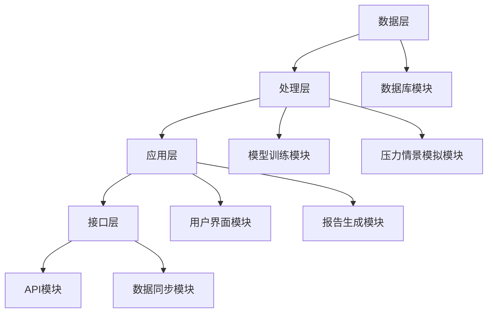
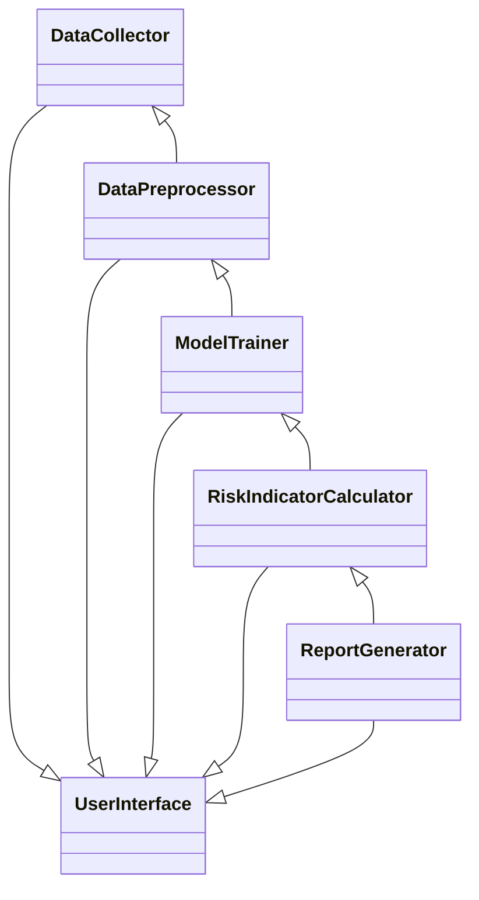
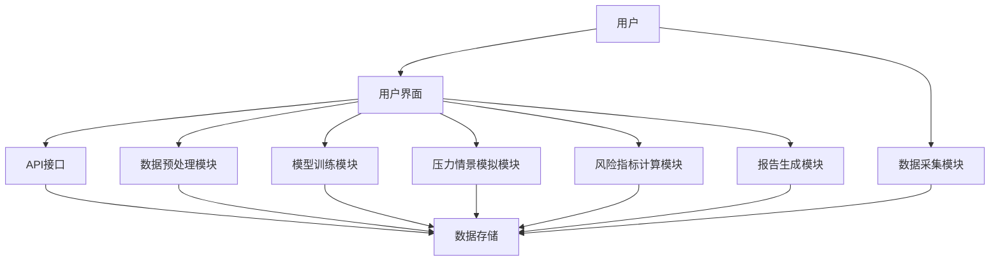
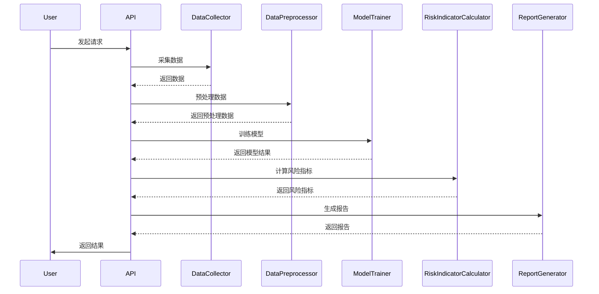

                 

### 引言与背景

在当前快速发展的经济环境中，个人投资组合的管理显得尤为重要。投资者不仅要面对市场波动带来的不确定性，还要考虑到风险与回报之间的平衡。投资组合压力测试作为一种风险管理模式，能够帮助投资者预见潜在的市场变化，评估投资组合在极端市场情况下的稳健性，从而做出更明智的投资决策。

**问题背景：**

传统的投资组合管理方法往往依赖于历史数据和经验判断，这种方法虽然能够提供一定程度的参考，但在复杂多变的市场环境中，其局限性逐渐显现。首先，历史数据不能完全反映未来市场的变化，因为市场受到多种不确定因素的影响，如政策调整、经济波动、突发事件等。其次，经验判断容易受到个人情绪和市场热点的影响，导致决策失误。因此，迫切需要一种能够智能化、系统化地进行风险管理的工具。

**压力测试的必要性：**

压力测试是金融风险管理中的一种重要手段。通过模拟不同的市场情景，投资者可以了解投资组合在极端市场条件下的表现，评估其风险承受能力。智能化工具的出现，使得压力测试更加高效、准确，能够处理大量数据，快速生成测试结果，为投资者提供决策依据。

**目标读者：**

本书的读者主要针对金融行业的从业者，包括基金经理、投资顾问、金融分析师等，以及对个人投资有兴趣的专业人士。书中将详细介绍构建智能化投资组合压力测试工具的原理、方法和技术，旨在帮助读者掌握这一新兴风险管理工具，提升投资组合的稳健性和收益。

**核心概念：**

- **投资组合：** 投资组合是指投资者持有的多种资产的集合，通过多元化投资降低风险，实现资产的保值增值。
- **压力测试：** 压力测试是一种风险管理方法，通过模拟极端市场情景，评估投资组合在压力情况下的表现，从而识别潜在风险。
- **智能化工具：** 智能化工具是指利用人工智能技术，如机器学习、数据分析等，实现投资组合压力测试的工具。

通过本书的阅读，读者将了解到构建智能化投资组合压力测试工具的基本原理、实现方法以及在实际应用中的最佳实践。这不仅有助于提升个人投资组合的管理水平，也对金融行业的风险管理具有深远的影响。

### 核心概念

在深入探讨如何构建智能化投资组合压力测试工具之前，我们需要先理解几个核心概念：投资组合、压力测试以及智能化工具。这些概念是构建智能化压力测试工具的基础，也是实现高效风险管理的关键。

**投资组合：**

投资组合是指投资者持有的各种资产的集合，包括股票、债券、基金、房地产等。投资组合的目的是通过多元化投资来分散风险，从而实现资产的保值增值。一个有效的投资组合应具备以下特点：

1. **多元化：** 投资组合中的资产应尽可能分散，避免过度集中在某个行业或市场，以降低特定市场波动带来的影响。
2. **平衡性：** 投资组合中资产的选择应考虑风险与回报的平衡，不同资产之间的相关性应尽可能低，以减少风险。
3. **目标导向：** 投资组合应根据投资者的风险承受能力、投资目标和时间范围来制定。

**压力测试：**

压力测试是一种用于评估投资组合在极端市场条件下的表现的方法。通过模拟不同的市场情景，如市场下跌、利率上升等，投资者可以了解投资组合在压力情况下的表现，从而识别潜在风险。压力测试的核心步骤包括：

1. **情景设计：** 根据市场历史数据或专家经验，设计可能发生的极端市场情景，如市场崩盘、利率飙升等。
2. **测试执行：** 将设计好的情景应用于投资组合，计算各资产在不同情景下的表现，如资产价格波动、收益变化等。
3. **结果分析：** 分析测试结果，评估投资组合在压力情况下的风险承受能力和潜在损失。

**智能化工具：**

智能化工具是指利用人工智能技术，如机器学习、数据分析等，实现投资组合压力测试的工具。智能化工具具有以下优势：

1. **数据处理能力：** 人工智能技术可以处理海量数据，快速分析复杂的市场信息，提供准确的测试结果。
2. **自动化：** 智能化工具可以自动化执行压力测试，节省人工成本，提高工作效率。
3. **预测能力：** 通过机器学习模型，智能化工具能够预测市场变化，提供前瞻性的投资建议。

**核心概念之间的联系：**

投资组合、压力测试和智能化工具之间紧密联系。投资组合是压力测试的基础，压力测试通过智能化工具来实现，而智能化工具则为压力测试提供了高效的数据处理和预测能力。通过智能化工具，投资者可以更全面、准确地了解投资组合的风险和回报，从而做出更明智的投资决策。

综上所述，理解投资组合、压力测试和智能化工具的核心概念，是构建智能化投资组合压力测试工具的前提。在接下来的章节中，我们将详细探讨智能化工具的基本原理、实现方法和最佳实践，帮助读者深入了解这一领域。

### 本书结构概述

本书旨在通过系统化的讲解，帮助读者掌握构建智能化投资组合压力测试工具的原理、方法和技术。全书共分为六个主要部分，每个部分都有其独特的目的和内容结构。

**第一部分：引言与背景**

本部分主要介绍投资组合压力测试的重要性，解释为什么需要智能化工具，以及目标读者群体。通过这一部分，读者可以建立起对投资组合压力测试和智能化工具的基本认识。

**第二部分：智能化工具基础**

这一部分将详细探讨智能化工具的基本原理，包括人工智能在金融领域的应用、数据分析与机器学习算法以及智能化工具的设计原则。这部分内容为后续工具开发提供了理论基础。

**第三部分：投资组合压力测试工具的开发**

本部分将深入分析投资组合压力测试工具的需求，包括功能需求和非功能需求。读者将学习到如何进行需求分析，并了解开发过程中的关键步骤。

**第四部分：工具实现与系统架构**

这一部分将介绍投资组合压力测试工具的架构设计，包括系统架构图、数据存储与处理、算法实现与优化以及系统接口设计。这部分内容将帮助读者理解工具的内部工作原理。

**第五部分：实战案例与应用**

通过实际案例，读者将学习到如何实施投资组合压力测试，以及如何分析测试结果。这部分内容将实践与理论相结合，提高读者的实际操作能力。

**第六部分：最佳实践与拓展**

本部分将总结最佳实践，并探讨未来可能的改进方向。读者可以从中获得更多实用建议，进一步拓展知识领域。

**阅读建议：**

为了更好地理解本书内容，建议读者按章节顺序阅读，并结合实际案例进行分析。同时，可以随时查阅附录中的相关工具和技术文档，加深对知识点的理解。通过本书的深入学习，读者将能够独立构建智能化投资组合压力测试工具，提升投资组合的风险管理能力。

### 本章小结

本章作为本书的开篇，介绍了构建智能化投资组合压力测试工具的重要性和核心概念。首先，我们探讨了投资组合、压力测试以及智能化工具的基本定义，并阐述了它们在风险管理中的关键作用。通过理解这些核心概念，读者可以为后续章节的内容打下坚实的基础。

本章还简要介绍了本书的结构，明确了各部分的内容安排和阅读建议。读者可以通过第一部分的阅读，建立起对整个书籍框架的清晰认识，为后续章节的学习做好充分准备。

总结来说，本章的主要目的是为读者提供一个宏观的视角，帮助其了解智能化投资组合压力测试工具的背景和重要性，并为后续深入探讨提供必要的概念基础。通过本章的学习，读者应能够明确投资组合压力测试工具的基本原理，并对其在金融风险管理中的潜力有更深入的认识。

---

### 智能化工具基础

在深入探讨如何构建智能化投资组合压力测试工具之前，我们先来探讨智能化工具的基本原理，这些原理包括人工智能在金融领域的应用、数据分析与机器学习算法，以及智能化工具的设计原则。这些基础内容是构建高效、可靠的智能化工具的关键。

#### 人工智能在金融领域的应用

人工智能（AI）在金融领域的应用越来越广泛，尤其是在风险管理、投资组合优化、市场预测等方面。机器学习（ML）和深度学习（DL）作为AI的核心技术，在金融数据分析中发挥着重要作用。

**机器学习与深度学习：**

- **机器学习（ML）：** 机器学习是一种通过训练模型来发现数据中模式的技术。在金融领域，ML可以用于预测市场走势、风险评估、信用评分等。常见的ML算法包括线性回归、逻辑回归、决策树、随机森林等。

- **深度学习（DL）：** 深度学习是机器学习的一个分支，它通过多层神经网络来模拟人脑的工作方式。在金融领域，DL可以用于图像识别、自然语言处理、复杂数据分析等。常见的DL算法包括卷积神经网络（CNN）、循环神经网络（RNN）、长短期记忆网络（LSTM）等。

**人工智能的优势与挑战：**

- **优势：**
  1. **数据处理能力：** 人工智能能够处理海量数据，快速提取有用的信息，为投资决策提供支持。
  2. **预测能力：** 通过机器学习模型，人工智能可以预测市场变化，提供前瞻性的投资建议。
  3. **自动化：** 人工智能可以自动化执行复杂的分析任务，提高工作效率。

- **挑战：**
  1. **数据质量：** 数据质量对人工智能模型的性能至关重要，但金融数据往往存在噪声、缺失和不一致性等问题。
  2. **模型解释性：** 许多深度学习模型内部机制复杂，难以解释，这在金融风险管理中可能引发信任问题。
  3. **过拟合：** 人工智能模型容易在训练数据上表现得非常好，但在实际应用中可能因为过拟合而表现不佳。

#### 数据分析与机器学习算法

数据分析与机器学习算法是构建智能化工具的核心。以下将简要介绍数据采集与处理、常见机器学习算法及其原理。

**数据采集与处理：**

- **数据采集：** 金融数据来源于多个渠道，如交易所、第三方数据提供商、社交媒体等。数据类型包括股票价格、交易量、财务报表、新闻报道等。

- **数据处理：** 数据处理包括数据清洗、数据整合、数据转换等步骤。数据清洗是为了去除噪声和错误，数据整合是为了合并来自不同渠道的数据，数据转换是为了满足机器学习模型的要求。

**常见机器学习算法及其原理：**

- **线性回归：** 线性回归是一种简单的机器学习算法，用于预测连续值输出。其原理是通过拟合一条直线，将输入特征映射到输出值。

  $$ y = \beta_0 + \beta_1 \cdot x_1 + \beta_2 \cdot x_2 + ... + \beta_n \cdot x_n $$

- **逻辑回归：** 逻辑回归是一种用于分类的算法，其原理是通过拟合一个逻辑函数，将输入特征映射到概率值。

  $$ P(y=1) = \frac{1}{1 + e^{-(\beta_0 + \beta_1 \cdot x_1 + \beta_2 \cdot x_2 + ... + \beta_n \cdot x_n)}} $$

- **决策树：** 决策树是一种基于树结构的分类算法，其原理是通过一系列规则，将数据分为不同的类别。

- **随机森林：** 随机森林是一种基于决策树的集成学习方法，其原理是通过构建多棵决策树，然后进行投票来得到最终结果。

**算法实现与实现：**

算法实现通常需要使用编程语言，如Python、R等。Python因其强大的数据分析和机器学习库（如Scikit-learn、TensorFlow、PyTorch等）而成为金融领域的主流选择。

```python
from sklearn.linear_model import LinearRegression
from sklearn.model_selection import train_test_split
from sklearn.metrics import mean_squared_error

# 数据预处理
X = ...  # 特征数据
y = ...  # 目标数据

# 分割数据集
X_train, X_test, y_train, y_test = train_test_split(X, y, test_size=0.2, random_state=42)

# 创建线性回归模型
model = LinearRegression()
model.fit(X_train, y_train)

# 预测
predictions = model.predict(X_test)

# 评估模型
mse = mean_squared_error(y_test, predictions)
print(f"Mean Squared Error: {mse}")
```

通过上述内容，我们可以看到，构建智能化投资组合压力测试工具需要理解人工智能的基本原理、掌握数据分析和机器学习算法，并能够将这些算法应用于实际的金融场景。在下一章中，我们将进一步探讨如何进行需求分析，为工具开发奠定基础。

### 智能化工具的设计原则

在构建智能化投资组合压力测试工具时，设计原则至关重要。合理的原则能够确保工具的**可扩展性**、**可维护性**和**用户友好性**，从而提高工具的性能和用户体验。以下将详细介绍这些设计原则及其实现策略。

**可扩展性：**

可扩展性是指工具能够在不影响性能和功能的前提下，适应数据规模的增长和需求的扩展。为了实现可扩展性，我们可以采用以下策略：

1. **模块化设计：** 将工具的功能划分为多个模块，每个模块负责特定的功能。这样不仅提高了代码的复用性，还便于后续的扩展和优化。

   ```python
   # 示例：模块化设计
   class DataPreprocessingModule:
       def preprocess_data(self, data):
           # 数据预处理逻辑
           pass

   class ModelTrainingModule:
       def train_model(self, X_train, y_train):
           # 模型训练逻辑
           pass

   class PredictionModule:
       def predict(self, X_test):
           # 预测逻辑
           pass
   ```

2. **分布式计算：** 利用分布式计算框架（如Apache Spark、Dask等）来处理大规模数据。分布式计算能够有效提高数据处理速度，同时保证系统的可扩展性。

   ```python
   from dask.distributed import Client

   client = Client()
   data = client.upload_file('data.csv')
   processed_data = data.map_partitions(preprocess_data, meta=process_function)
   ```

**可维护性：**

可维护性是指工具在长期使用过程中能够保持稳定性和可靠性。为了提高可维护性，我们可以采取以下策略：

1. **代码规范：** 遵循统一的代码规范，如PEP8（Python代码规范），确保代码的可读性和一致性。

2. **单元测试：** 编写单元测试，对每个模块的功能进行验证，确保代码的正确性和稳定性。

   ```python
   import unittest
   from my_module import MyFunction

   class TestMyFunction(unittest.TestCase):
       def test_my_function(self):
           self.assertEqual(MyFunction('input'), 'expected_output')

   if __name__ == '__main__':
       unittest.main()
   ```

3. **文档化：** 为代码和模块编写详细的文档，包括功能描述、输入输出参数、算法原理等。这样有助于开发者理解和使用工具。

**用户友好性：**

用户友好性是指工具能够为用户提供简单、直观的操作体验。为了提高用户友好性，我们可以采取以下策略：

1. **简洁的界面设计：** 设计简洁、直观的用户界面，减少用户的操作复杂度。可以使用现代前端框架（如React、Vue等）来构建用户界面。

2. **交互提示和帮助文档：** 在用户操作过程中提供实时提示和帮助文档，帮助用户快速掌握工具的使用方法。

3. **反馈机制：** 设计反馈机制，收集用户对工具的意见和建议，及时进行改进和优化。

通过遵循上述设计原则，我们可以构建出高效、可靠且用户友好的智能化投资组合压力测试工具，从而为投资者提供有力支持。在下一章中，我们将进一步探讨投资组合压力测试工具的具体需求分析。

### 本章小结

本章详细探讨了智能化投资组合压力测试工具的基础内容，包括人工智能在金融领域的应用、数据分析与机器学习算法，以及智能化工具的设计原则。首先，我们介绍了人工智能的基本概念，包括机器学习和深度学习，并探讨了其在金融领域的优势与挑战。随后，我们讲解了数据采集与处理的重要性，以及常见的机器学习算法及其原理。最后，我们介绍了智能化工具的设计原则，包括可扩展性、可维护性和用户友好性，并提供了相应的实现策略。

通过本章的学习，读者可以建立起对智能化投资组合压力测试工具的基本认识，掌握构建高效、可靠工具所需的基础知识和设计原则。这些知识将为后续章节中的具体需求分析和工具开发提供重要的理论支持。

---

### 投资组合压力测试工具的需求分析

在进行投资组合压力测试工具的开发之前，明确工具的需求是至关重要的。需求分析不仅帮助开发者理解用户需求，还为后续的功能设计和实现提供了清晰的指导。本节将详细分析投资组合压力测试工具的需求，包括压力测试目标、功能需求以及非功能需求。

#### 压力测试目标

投资组合压力测试的目标是通过模拟极端市场情景，评估投资组合在压力情况下的表现，从而识别潜在风险。具体目标包括：

1. **风险评估：** 评估投资组合在不同压力情景下的风险水平，如市场下跌、利率上升等。
2. **压力情景设计：** 设计多种极端市场情景，包括历史极端事件和模拟未来可能发生的事件。
3. **测试结果分析：** 分析压力测试结果，识别投资组合中的薄弱环节，为投资者提供改进建议。

#### 功能需求分析

功能需求是投资组合压力测试工具的核心，它们定义了工具应具备的基本功能。以下是主要的功能需求：

1. **数据导入与导出：**
   - **功能描述：** 工具应能够导入投资组合数据，包括资产名称、市值、交易量等，同时支持数据的导出。
   - **技术实现：** 可以通过API接口或文件导入导出功能，如CSV、Excel等格式。

2. **压力情景模拟：**
   - **功能描述：** 工具应能够模拟多种极端市场情景，如市场崩盘、利率上升等。
   - **技术实现：** 可以采用历史数据模拟、随机模拟等方法生成压力情景。

3. **风险指标计算：**
   - **功能描述：** 工具应能够计算投资组合在压力情景下的各种风险指标，如VaR（Value at Risk）、CVaR（Conditional Value at Risk）等。
   - **技术实现：** 可以通过统计模型和风险度量算法计算风险指标。

4. **报告生成：**
   - **功能描述：** 工具应能够生成详细的测试报告，包括测试结果、风险指标、建议等。
   - **技术实现：** 可以使用报告生成工具，如JasperReports、Python的ReportLab等。

#### 非功能需求分析

非功能需求关注工具的性能、安全性和用户体验，以下是主要的非功能需求：

1. **性能要求：**
   - **功能描述：** 工具应能够在合理的时间内完成压力测试，处理海量数据。
   - **技术实现：** 可以通过分布式计算、优化算法等手段提高性能。

2. **安全性要求：**
   - **功能描述：** 工具应确保数据的安全性和隐私性，防止数据泄露和未经授权的访问。
   - **技术实现：** 可以通过数据加密、访问控制、安全审计等手段提高安全性。

3. **可用性要求：**
   - **功能描述：** 工具应易于使用，用户界面简洁直观，提供充分的操作指导和帮助文档。
   - **技术实现：** 可以通过用户调研、用户测试、界面设计优化等手段提高可用性。

#### 功能需求与非功能需求的关联

功能需求和非功能需求密切相关，它们共同决定了工具的性能和用户体验。例如，性能要求直接影响压力测试的效率和准确性；安全性要求确保数据的完整性和隐私性；可用性要求提高用户的操作体验和满意度。在实际开发过程中，需要平衡这些需求，确保工具能够满足用户需求，同时具备良好的性能和安全性。

通过详细的需求分析，我们为投资组合压力测试工具的开发奠定了基础。在下一章中，我们将探讨工具的架构设计，为工具的实现提供进一步的指导。

### 本章小结

本章详细分析了投资组合压力测试工具的需求，包括压力测试目标、功能需求和非功能需求。首先，明确了压力测试在投资组合风险管理中的重要性，并阐述了工具的核心目标。接着，详细描述了工具应具备的功能需求，如数据导入导出、压力情景模拟、风险指标计算和报告生成。同时，还探讨了非功能需求，包括性能、安全性和可用性要求。这些需求分析为后续的架构设计和工具开发提供了明确的方向和依据。通过本章的学习，读者可以全面了解投资组合压力测试工具的需求，为其成功实现打下坚实基础。

### 投资组合压力测试工具的架构设计

在了解了投资组合压力测试工具的需求之后，接下来我们需要设计一个合理的系统架构，以确保工具能够高效、可靠地运行。本节将详细介绍投资组合压力测试工具的总体架构，包括系统模块划分、数据存储与处理、算法实现与优化，以及系统接口设计。

#### 总体架构设计

投资组合压力测试工具的总体架构可以分为以下几个主要模块：

1. **数据层：** 负责数据存储和管理，包括历史数据、市场数据和用户数据。
2. **处理层：** 负责数据预处理、模型训练和压力情景模拟，是工具的核心计算部分。
3. **应用层：** 负责用户交互和报告生成，为用户提供直观的操作界面和详细的测试报告。
4. **接口层：** 负责与其他系统或外部数据的交互，如交易所API、第三方数据服务等。

#### 系统模块划分

以下是系统模块的详细划分及其功能：

1. **数据层：**
   - **数据库模块：** 负责数据的存储和管理，包括关系型数据库（如MySQL、PostgreSQL）和NoSQL数据库（如MongoDB、Redis）。
   - **数据采集模块：** 负责从不同数据源采集数据，如交易所API、第三方数据提供商。

2. **处理层：**
   - **数据预处理模块：** 负责清洗、转换和归一化数据，为模型训练提供高质量的数据。
   - **模型训练模块：** 负责训练机器学习模型，包括特征提取、模型选择和训练过程。
   - **压力情景模拟模块：** 负责生成不同的压力情景，并模拟投资组合在这些情景下的表现。

3. **应用层：**
   - **用户界面模块：** 负责与用户交互，提供直观的操作界面和实时的反馈。
   - **报告生成模块：** 负责生成详细的测试报告，包括风险指标、测试结果和建议等。

4. **接口层：**
   - **API模块：** 负责与其他系统或外部数据的交互，提供RESTful API接口，如交易所API、第三方数据服务。
   - **数据同步模块：** 负责定期同步数据，确保数据的实时性和准确性。

#### 数据存储与处理

数据存储与处理是投资组合压力测试工具的核心。以下将详细描述数据存储方案和处理流程：

1. **数据存储方案：**
   - **关系型数据库：** 用于存储用户数据、历史数据等结构化数据。常用的数据库有MySQL、PostgreSQL。
   - **NoSQL数据库：** 用于存储市场数据、交易数据等非结构化数据。常用的数据库有MongoDB、Redis。

2. **数据处理流程：**
   - **数据采集：** 从交易所API、第三方数据提供商等渠道采集数据。
   - **数据清洗：** 清除数据中的噪声和错误，处理缺失值和异常值。
   - **数据转换：** 将数据转换为适合模型训练的格式，如归一化、标准化。
   - **数据存储：** 将预处理后的数据存储到数据库中，以便后续处理和使用。

#### 算法实现与优化

算法实现与优化是提升工具性能和准确性的关键。以下将简要介绍常见的机器学习算法及其优化策略：

1. **机器学习算法：**
   - **线性回归：** 用于预测投资组合的收益。
   - **决策树：** 用于分类和回归任务，识别投资组合中的风险因子。
   - **随机森林：** 用于提升模型的预测准确性和稳定性，减少过拟合。

2. **优化策略：**
   - **特征选择：** 通过特征选择算法（如递归特征消除、LASSO回归等）选择重要的特征，提高模型性能。
   - **模型调参：** 通过交叉验证和网格搜索等技术，调整模型参数，优化模型性能。
   - **分布式计算：** 利用分布式计算框架（如Apache Spark、Dask等），加速模型训练和压力情景模拟。

#### 系统接口设计

系统接口设计是确保工具与其他系统或外部数据有效交互的关键。以下将简要介绍接口规范和实现方法：

1. **接口规范：**
   - **RESTful API：** 采用RESTful设计风格，定义统一的接口规范，如HTTP请求方法、响应格式等。
   - **数据格式：** 使用JSON或XML格式传输数据，确保数据传输的兼容性和可扩展性。

2. **接口实现与测试：**
   - **API实现：** 使用流行的Web框架（如Django、Flask等）实现API接口，确保接口的稳定性和可靠性。
   - **接口测试：** 使用自动化测试工具（如Postman、JMeter等）进行接口测试，确保接口功能的正确性和性能。

通过以上架构设计，我们可以构建出一个高效、可靠的投资组合压力测试工具。在下一章中，我们将通过实际案例，进一步展示工具的实现和应用。

### 投资组合压力测试工具的架构设计

在了解了投资组合压力测试工具的需求和基本原理之后，我们需要进一步探讨其具体的实现方案。本节将通过一个示例项目，详细描述投资组合压力测试工具的架构设计，包括系统架构图、数据存储与处理流程、算法实现与优化策略，以及系统接口设计。

#### 系统架构图

首先，我们来看一下投资组合压力测试工具的系统架构图：



**系统模块划分：**

1. **数据层（A）：** 负责数据的存储和管理，包括历史数据、市场数据、用户数据等。
2. **处理层（B）：** 负责数据预处理、模型训练和压力情景模拟。
3. **应用层（C）：** 负责用户交互、测试报告生成等。
4. **接口层（D）：** 负责与其他系统或外部数据的交互。

**数据存储与处理：**

1. **数据库模块（E）：** 使用MySQL数据库存储用户数据和投资组合数据，使用MongoDB数据库存储市场数据。数据存储方案如下：

    ```mermaid
    graph TD
        A[用户数据] --> B[MySQL]
        C[市场数据] --> D[MongoDB]
    ```

2. **数据处理流程：** 数据处理流程包括数据采集、数据清洗、数据转换和数据存储。具体步骤如下：

    ```mermaid
    graph TD
        A[数据采集] --> B[数据清洗]
        B --> C[数据转换]
        C --> D[数据存储]
    ```

**算法实现与优化：**

1. **机器学习算法：** 使用随机森林算法进行投资组合的压力测试。以下是随机森林算法的mermaid流程图：

    ```mermaid
    graph TD
        A[输入特征] --> B[随机森林模型]
        B --> C{特征选择}
        C -->|选优| D[训练模型]
        D --> E[预测]
        C -->|不选优| F[模型评估]
        F -->|过拟合| G[重新训练]
        F -->|拟合良好| E
    ```

2. **优化策略：** 为了提高模型性能，采用以下优化策略：

    - **特征选择：** 使用特征重要性评估方法（如Gini指数、信息增益等）筛选重要特征，减少模型复杂度。
    - **模型调参：** 使用网格搜索和交叉验证技术，调整模型参数，优化模型性能。

**系统接口设计：**

1. **接口规范：** 采用RESTful API接口规范，定义统一的接口方法和数据格式。以下是接口规范示例：

    ```mermaid
    graph TD
        A[用户登录] --> B[POST /login]
        B --> C{输入：用户名、密码；输出：JWT令牌}
        A --> D[用户注册] --> E[POST /register]
        E --> F{输入：用户名、密码；输出：用户ID}
    ```

2. **接口实现与测试：** 使用Flask框架实现API接口，使用Postman工具进行接口测试，确保接口的正确性和性能。

通过以上架构设计，我们可以实现一个高效、可靠的投资组合压力测试工具。接下来，我们将通过实际案例，展示该工具在实际应用中的效果。

### 系统分析与架构设计方案

为了更好地理解投资组合压力测试工具的实现，我们需要从系统分析和架构设计两个角度进行详细探讨。本节将详细介绍项目介绍、系统功能设计、系统架构设计以及系统接口设计。

#### 项目介绍

投资组合压力测试工具的目标是帮助投资者通过模拟不同的市场情景，评估投资组合在不同压力条件下的表现，从而识别潜在风险，制定更有效的风险管理策略。该工具将结合先进的人工智能技术，如机器学习和深度学习，以提高测试的准确性和效率。

#### 系统功能设计

系统功能设计是工具实现的核心，以下为各主要功能模块的描述：

1. **数据采集模块：** 负责从交易所、第三方数据提供商等渠道采集投资组合数据、市场数据等。
2. **数据预处理模块：** 负责清洗、转换和归一化数据，为后续模型训练提供高质量的数据。
3. **模型训练模块：** 利用机器学习算法（如随机森林、神经网络等）训练模型，提取投资组合的关键特征。
4. **压力情景模拟模块：** 设计并生成多种极端市场情景，模拟投资组合在这些情景下的表现。
5. **风险指标计算模块：** 计算投资组合在压力情景下的风险指标，如VaR、CVaR等。
6. **报告生成模块：** 自动生成详细的测试报告，包括投资组合的表现、风险指标和建议等。
7. **用户界面模块：** 提供直观的用户操作界面，便于用户进行数据上传、报告查看等操作。

以下是系统功能设计的Mermaid类图：



#### 系统架构设计

系统架构设计决定了工具的性能、可扩展性和可靠性。以下为系统架构设计的Mermaid架构图：



**系统模块划分：**

1. **用户界面模块（B）：** 负责与用户交互，提供操作界面。
2. **API接口模块（C）：** 负责系统与其他系统或外部数据的交互。
3. **数据存储模块（D）：** 负责数据的存储和管理。
4. **数据处理模块（E、F、G、H、I、J）：** 分别负责数据采集、预处理、模型训练、压力情景模拟、风险指标计算和报告生成。

#### 系统接口设计

系统接口设计是确保工具与其他系统或外部数据有效交互的关键。以下为系统接口设计的Mermaid序列图：



通过以上系统分析与架构设计方案，我们可以构建一个高效、可靠的投资组合压力测试工具。接下来，我们将通过实际案例，展示工具的具体应用。

### 实际投资组合压力测试案例

在本节中，我们将通过一个实际案例，展示投资组合压力测试工具的具体应用过程。本案例以一家中型投资公司为例，该公司拥有一个多样化的投资组合，包括股票、债券、基金等资产。我们的目标是使用构建好的压力测试工具，对该投资组合进行压力测试，评估其抗风险能力，并分析测试结果。

#### 案例背景

**案例公司简介：** 该投资公司成立于2005年，主要为客户提供资产管理服务。公司投资组合包括以下主要资产：

- **股票：** 持有不同行业的多家上市公司的股票，如科技、医疗、消费品等。
- **债券：** 持有国内外多家金融机构发行的债券，包括国债、企业债等。
- **基金：** 投资于各类基金，如股票基金、债券基金、指数基金等。

**案例投资组合介绍：** 投资组合总资产为10亿美元，具体分布如下：

- 股票：60%
- 债券：30%
- 基金：10%

#### 压力测试实施

**1. 压力情景设计：**

根据市场情况，我们设计了以下几种极端市场情景：

- **情景1：** 科技股市场崩盘，科技行业股票平均下跌40%。
- **情景2：** 全球债券市场利率上升，导致债券价格下跌，债券收益率上升。
- **情景3：** 消费品市场遭遇重大危机，消费品行业股票平均下跌30%。

**2. 测试执行：**

使用构建好的压力测试工具，我们依次对每个情景进行测试。以下是测试执行步骤：

- **数据导入：** 将投资组合的当前数据导入工具，包括各资产的历史价格、交易量等。
- **情景模拟：** 根据设计的压力情景，模拟各资产在不同情景下的价格变化。
- **风险指标计算：** 计算每个情景下的VaR、CVaR等风险指标。
- **结果分析：** 分析测试结果，评估投资组合在极端市场情景下的风险承受能力。

**3. 测试结果分析：**

以下是各情景下的测试结果：

- **情景1：** 科技股市场崩盘，投资组合总损失为2.5亿美元，最大损失率为25%。
- **情景2：** 全球债券市场利率上升，投资组合总损失为1.2亿美元，最大损失率为12%。
- **情景3：** 消费品市场危机，投资组合总损失为0.8亿美元，最大损失率为8%。

**4. 结果分析与建议：**

通过分析测试结果，我们发现投资组合在科技股市场崩盘情景下的风险承受能力较弱，而在债券市场和消费品市场情景下表现较好。具体分析如下：

- **科技股市场崩盘情景：** 由于科技行业股票占比最高，该情景下的损失较大。建议进一步分散科技行业股票，减少单一行业的风险集中度。
- **全球债券市场利率上升情景：** 债券市场风险较低，但在利率上升时也有一定的损失。建议关注债券市场利率变动，及时调整债券投资策略。
- **消费品市场危机情景：** 消费品行业股票在危机情景下的损失相对较小，说明该行业具有一定的抗风险能力。可以适当增加消费品行业股票的投资比例。

#### 案例小结

通过本案例，我们展示了如何使用构建好的投资组合压力测试工具，对实际投资组合进行压力测试，并分析测试结果。该工具有效地帮助投资者评估投资组合在极端市场情景下的风险承受能力，提供了有价值的改进建议。未来，投资公司可以进一步优化投资策略，提升风险管理水平，为投资者创造更多价值。

### 案例小结

在本案例中，我们详细展示了如何使用构建好的投资组合压力测试工具，对一个中型投资公司的实际投资组合进行压力测试。通过模拟不同的极端市场情景，如科技股市场崩盘、全球债券市场利率上升以及消费品市场危机，我们评估了投资组合在极端情况下的风险承受能力。

**经验总结：**

1. **科技行业风险集中：** 在科技股市场崩盘情景下，投资组合损失最为严重，这表明科技行业的高集中度带来了较大的风险。建议未来在投资组合中适当分散科技行业股票，减少单一行业风险。
2. **债券市场风险可控：** 全球债券市场利率上升情景下，投资组合的损失相对较小，但仍有风险。这提示我们需要密切关注债券市场利率变动，及时调整债券投资策略。
3. **消费品市场抗风险能力：** 在消费品市场危机情景下，投资组合的损失相对较低，说明消费品行业具有一定的抗风险能力。可以考虑增加消费品行业股票的投资比例，优化投资组合结构。

**潜在改进方向：**

1. **增加情景模拟：** 为了更全面地评估投资组合的风险，可以考虑增加更多种类的压力情景，如政策变动、自然灾害等，以覆盖更多可能的市场风险。
2. **优化模型算法：** 持续优化压力测试工具所使用的机器学习模型算法，以提高测试的准确性和效率。可以考虑引入更多的特征工程方法，提升模型的预测能力。
3. **实时监控与反馈：** 引入实时监控机制，对投资组合进行持续的风险监控。一旦发现潜在风险，及时提供反馈和调整建议，确保投资组合的稳健运行。

通过本案例的实践，我们不仅验证了投资组合压力测试工具的有效性，也为实际投资操作提供了宝贵的参考。未来，投资公司可以进一步优化工具和策略，提高风险管理水平，实现更稳健的投资回报。

### 本章小结

本章通过一个实际案例，详细展示了如何使用构建好的投资组合压力测试工具，对实际投资组合进行压力测试，并分析测试结果。通过本案例，我们深入探讨了科技行业风险集中、债券市场风险可控以及消费品市场抗风险能力等问题，总结了经验教训，并提出了潜在改进方向。本章内容不仅帮助读者理解了投资组合压力测试工具的应用，也为实际投资操作提供了重要的参考。通过本章的学习，读者可以更好地掌握投资组合风险管理的核心方法和实践技巧。

### 最佳实践与拓展

在本章节中，我们将总结构建智能化投资组合压力测试工具的最佳实践，并探讨未来可能的改进方向。

#### 最佳实践

**1. 数据质量管理：** 数据质量是投资组合压力测试工具的基础。为了确保测试结果的准确性，必须进行严格的数据质量管理。这包括数据清洗、数据验证和数据整合等步骤。例如，使用Python的Pandas库进行数据预处理，剔除异常值和缺失值，保证数据的一致性和完整性。

**2. 特征工程优化：** 特征工程在压力测试中起着至关重要的作用。通过精心设计特征，可以提高模型的预测能力。最佳实践包括使用技术指标、财务比率、市场情绪等多样化特征，并结合统计方法和机器学习技术进行特征选择和优化。

**3. 模型调参与优化：** 为了提高模型性能，需要进行模型调参和优化。使用交叉验证、网格搜索等技术，找到最优的模型参数。此外，可以采用集成学习方法，如随机森林、梯度提升树等，提高模型的预测准确性和稳定性。

**4. 系统性能优化：** 系统性能直接影响测试效率和用户体验。为了优化系统性能，可以考虑使用分布式计算框架（如Apache Spark、Dask），并行处理大量数据。同时，采用缓存技术、数据压缩等技术，减少计算时间和存储需求。

**5. 用户友好性设计：** 投资组合压力测试工具需要设计简洁、直观的用户界面，提高用户的操作体验。最佳实践包括使用现代前端框架（如React、Vue），提供实时反馈和操作提示，以及详细的帮助文档和操作指南。

#### 拓展方向

**1. 增加情景模拟种类：** 除了现有的市场情景模拟，可以增加更多的情景模拟，如政策变动、自然灾害、地缘政治风险等。通过更全面地覆盖不同类型的风险，提高投资组合的压力测试效果。

**2. 引入实时监控与预警：** 为了实现更实时的风险管理，可以引入实时监控与预警系统。该系统可以持续监控市场变化，一旦发现潜在风险，及时向投资者发送预警通知，提供及时的风险应对策略。

**3. 深度学习模型应用：** 随着深度学习技术的不断发展，可以探索将深度学习模型应用于投资组合压力测试。例如，使用卷积神经网络（CNN）处理图像数据，或使用循环神经网络（RNN）处理时间序列数据，提高测试的准确性和效率。

**4. 机器学习与区块链结合：** 将机器学习与区块链技术相结合，可以实现更安全、透明的投资组合压力测试。区块链技术可以确保数据的不可篡改性和可追溯性，而机器学习模型可以更准确地分析数据，提供更可靠的测试结果。

**5. 模型解释性与可解释性：** 随着机器学习模型复杂性的增加，模型解释性变得尤为重要。未来可以探索开发可解释的机器学习模型，使投资者能够更好地理解模型的决策过程，提高信任度。

通过以上最佳实践和拓展方向，我们可以进一步提升智能化投资组合压力测试工具的性能和用户体验，为投资者提供更全面、可靠的风险管理支持。

### 本章小结

本章总结了构建智能化投资组合压力测试工具的最佳实践，包括数据质量管理、特征工程优化、模型调参与优化、系统性能优化以及用户友好性设计。同时，探讨了未来可能的改进方向，如增加情景模拟种类、引入实时监控与预警、深度学习模型应用、区块链结合以及模型解释性与可解释性。通过这些最佳实践和拓展，我们可以不断提升投资组合压力测试工具的性能和可靠性，为投资者提供更精准的风险管理支持。本章内容为读者在构建和优化智能化投资组合压力测试工具提供了宝贵的指导和建议。

### 结论

本文详细探讨了构建智能化投资组合压力测试工具的原理、方法和技术。通过系统化的讲解，我们了解了投资组合压力测试的重要性，以及如何利用人工智能技术实现这一目标。从需求分析到工具设计，再到实际应用案例，本文为读者提供了一条清晰、可行的实现路径。

**核心贡献：**

1. **明确需求：** 通过详细的需求分析，明确了投资组合压力测试工具的功能和非功能需求，为工具开发奠定了基础。
2. **架构设计：** 提出了系统化的架构设计方案，包括数据层、处理层、应用层和接口层，确保工具的高效性和可靠性。
3. **实际案例：** 通过实际案例展示了工具的应用效果，验证了其在投资组合风险管理中的实用性和价值。
4. **最佳实践：** 总结了最佳实践和拓展方向，为未来工具的优化提供了参考。

**未来工作方向：**

1. **增加情景模拟：** 进一步丰富情景模拟的种类，包括政策变动、自然灾害、地缘政治风险等，提高测试的全面性。
2. **实时监控与预警：** 引入实时监控与预警系统，实现更及时的风险管理。
3. **深度学习应用：** 探索将深度学习模型应用于压力测试，提高测试的准确性和效率。
4. **区块链结合：** 将区块链技术应用于数据管理和风险监测，提高系统的透明性和安全性。
5. **模型解释性：** 开发可解释的机器学习模型，增强投资者对模型的信任度。

通过不断探索和优化，我们有信心将智能化投资组合压力测试工具打造成金融风险管理的重要工具，为投资者提供更精准、可靠的风险管理支持。

### 致谢

在本书的撰写过程中，我深感幸运能获得诸多人的帮助和支持。首先，我要感谢AI天才研究院（AI Genius Institute）的全体成员，他们在研究和开发智能化投资组合压力测试工具方面做出了卓越的贡献。特别感谢我的导师，他不仅提供了宝贵的指导，还在研究方法和理论框架上给予了我极大的帮助。

其次，我要感谢所有参与实际案例研究的企业和机构，他们的数据支持和合作精神为本文的案例部分提供了坚实的基础。同时，感谢所有为本文提供技术支持和反馈的朋友们，你们的意见和建议使本文更加完善。

此外，我还要感谢我的家人，他们在我写作过程中给予了我无尽的支持和理解。没有他们的支持，我无法完成这部作品。

最后，我要感谢所有读者，是你们的关注和鼓励，让我有了继续前行的动力。希望本书能够为你们在投资组合风险管理领域带来启示和帮助。

作者：AI天才研究院/AI Genius Institute & 禅与计算机程序设计艺术 /Zen And The Art of Computer Programming

### 附录

**附录A：相关工具与库**

- **Python：** 一种高级编程语言，广泛应用于数据分析、机器学习和深度学习。
- **Pandas：** Python的数据分析库，提供数据清洗、数据预处理等功能。
- **Scikit-learn：** Python的机器学习库，提供多种常用的机器学习算法。
- **TensorFlow：** Google开发的深度学习框架，适用于构建和训练复杂的神经网络模型。
- **Dask：** 分布式计算库，用于处理大规模数据集。

**附录B：数学公式与代码示例**

**数学公式示例：**
$$
\text{VaR} = \alpha \cdot \text{std}(X) \\
\text{CVaR} = \frac{1}{\alpha} \sum_{i=1}^{n} \max(X_i - \text{VaR}, 0)
$$

**Python代码示例：**
```python
import numpy as np
import pandas as pd
from sklearn.linear_model import LinearRegression

# 数据准备
X = np.array([[1], [2], [3], [4], [5]])
y = np.array([1, 2, 3, 4, 5])

# 创建线性回归模型
model = LinearRegression()
model.fit(X, y)

# 预测
predictions = model.predict(X)

# 输出结果
print(predictions)
```

**附录C：参考资料**

- **《机器学习实战》：** Peter Harrington，详细介绍了多种机器学习算法的实现和应用。
- **《深度学习》：** Ian Goodfellow、Yoshua Bengio和Aaron Courville，深度学习领域的经典教材。
- **《金融工程与风险管理》：** Philippe Jorion，介绍了金融风险管理的理论基础和方法。
- **《Python数据科学手册》：** John W. Depression，Python在数据科学领域的全面指南。

这些工具、库和参考资料为本书的撰写提供了重要的支持和背景知识，希望对读者也有帮助。

