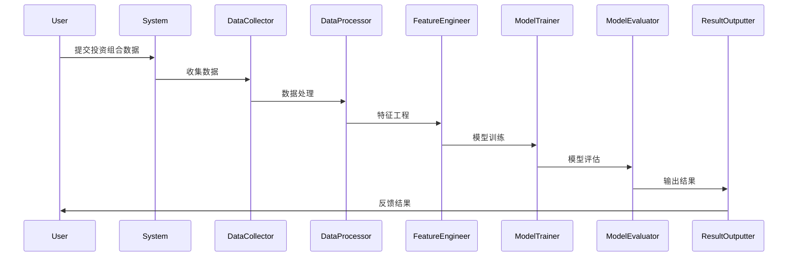

                 


# 构建智能化的个人投资组合因子暴露分析系统

关键词：投资组合、因子暴露、智能化分析、机器学习、系统架构设计

摘要：本文旨在探讨如何构建一个智能化的个人投资组合因子暴露分析系统。通过详细阐述核心概念、算法原理、系统架构设计和实现，为投资者提供一种高效、准确的投资组合管理工具。

## 目录大纲

----------------------------------------------------------------

## 第一部分： 引言与背景

### 第1章： 引言与背景

#### 1.1 问题背景

#### 1.2 问题描述

#### 1.3 问题解决

#### 1.4 边界与外延

#### 1.5 概念结构与核心要素组成

## 第二部分： 核心概念与联系

### 第2章： 核心概念与联系

#### 2.1 核心概念原理

#### 2.2 概念属性特征对比表格

#### 2.3 ER实体关系图架构

## 第三部分： 算法原理讲解

### 第3章： 算法原理讲解

#### 3.1 算法mermaid流程图

#### 3.2 Python源代码实现

#### 3.3 算法原理的数学模型和公式

#### 3.4 详细讲解与举例说明

## 第四部分： 数学模型和数学公式 & 详细讲解 & 举例说明

### 第4章： 数学模型和数学公式 & 详细讲解 & 举例说明

#### 4.1 数学公式示例

#### 4.2 详细讲解

#### 4.3 举例说明

## 第五部分： 系统分析与架构设计方案

### 第5章： 系统分析与架构设计方案

#### 5.1 问题场景介绍

#### 5.2 项目介绍

#### 5.3 系统功能设计

#### 5.4 系统架构设计

#### 5.5 系统接口设计和系统交互

## 第六部分： 项目实战

### 第6章： 项目实战

#### 6.1 环境安装

#### 6.2 系统核心实现源代码

#### 6.3 代码应用解读与分析

#### 6.4 实际案例分析和详细讲解剖析

#### 6.5 项目小结

## 第七部分： 最佳实践 tips、小结、注意事项、拓展阅读

### 第7章： 最佳实践 tips、小结、注意事项、拓展阅读

----------------------------------------------------------------

## 第一部分： 引言与背景

### 第1章： 引言与背景

#### 1.1 问题背景

在现代社会，投资已经成为许多人管理财富的重要手段。然而，如何构建一个有效的投资组合，使得投资回报最大化，同时风险最小化，成为一个亟待解决的问题。投资组合因子暴露分析，作为一种评估投资组合风险与收益的重要工具，越来越受到投资者的关注。传统的投资组合因子暴露分析主要依赖于人工经验和简单的统计方法，存在一定的局限性。随着人工智能技术的发展，特别是机器学习的应用，智能化投资组合因子暴露分析系统应运而生，为投资者提供了更加精确和高效的解决方案。

#### 1.2 问题描述

投资组合因子暴露分析的主要目标是识别投资组合中各种风险因子的暴露程度，从而为投资者提供优化投资组合的依据。具体而言，问题描述可以概括为以下几点：

1. **数据收集与处理**：收集投资组合的各类数据，包括股票、债券、基金等资产的表现，以及市场环境变化的信息。
2. **因子提取**：从收集到的数据中提取关键的风险因子，例如市场风险、行业风险、公司风险等。
3. **因子权重计算**：根据历史数据和模型，计算各个因子的权重，即它们在投资组合中的影响力。
4. **暴露度评估**：评估投资组合对各个因子的暴露度，从而判断投资组合的风险与收益状况。
5. **优化建议**：根据暴露度评估结果，提出优化投资组合的建议，降低风险，提高收益。

#### 1.3 问题解决

智能化投资组合因子暴露分析系统通过以下几个关键步骤来解决问题：

1. **数据收集与整合**：利用大数据技术和API接口，从多个数据源收集投资组合的相关数据。
2. **数据处理与清洗**：使用数据预处理技术，包括缺失值填充、异常值检测和去除、数据标准化等，保证数据质量。
3. **因子提取与模型训练**：使用机器学习算法提取关键因子，并通过模型训练，确定各个因子的权重。
4. **暴露度评估与优化**：利用评估模型，计算投资组合对各个因子的暴露度，并根据结果提出优化建议。

#### 1.4 边界与外延

智能化投资组合因子暴露分析系统的应用范围广泛，包括但不限于：

1. **个人投资者**：帮助个人投资者分析投资组合的风险与收益，制定个性化的投资策略。
2. **机构投资者**：为基金、信托、保险等金融机构提供专业的投资组合评估和优化服务。
3. **资产管理公司**：为资产管理公司提供风险控制与收益优化的工具，提高资产管理效率。

此外，系统还可以通过扩展功能模块，实现与其他金融工具的集成，如量化交易系统、风险评估系统等。

#### 1.5 概念结构与核心要素组成

智能化投资组合因子暴露分析系统由以下几个核心要素组成：

1. **投资组合管理**：包括投资组合的创建、修改、删除等操作，以及投资组合的展示和监控。
2. **因子库管理**：构建和维护因子库，包括因子的提取、权重计算、更新等。
3. **数据分析与评估**：使用机器学习算法和统计学方法，对投资组合进行数据分析和风险暴露评估。
4. **优化策略建议**：根据评估结果，为投资者提供优化投资组合的建议。

## 第二部分： 核心概念与联系

### 第2章： 核心概念与联系

#### 2.1 核心概念原理

为了更好地理解智能化投资组合因子暴露分析系统，我们需要了解以下几个核心概念：

1. **投资组合**：投资组合是指投资者持有的各种资产构成的集合，包括股票、债券、基金、商品等。投资组合的目标是分散风险，实现资产的长期增值。
2. **因子暴露**：因子暴露是指投资组合对某一风险因子的敏感程度，通常用数值表示。因子暴露越高，意味着投资组合对该因子的风险越大。
3. **机器学习**：机器学习是一种人工智能技术，通过训练模型，使计算机能够从数据中自动学习和预测，从而提高决策的准确性和效率。

#### 2.2 概念属性特征对比表格

| 概念       | 属性特征                               |
| ---------- | -------------------------------------- |
| 投资组合   | 资产种类、市值、权重、业绩表现等       |
| 因子暴露   | 因子类型、暴露程度、风险水平等         |
| 机器学习   | 数据集、模型类型、算法、训练过程等     |

#### 2.3 ER实体关系图架构

下面是ER实体关系图的Mermaid表示：

```mermaid
erDiagram
    InvestmentPortfolio ||--|{ FactorExposure }| FactorExposure
    InvestmentPortfolio ||--|{ MachineLearningModel }| MachineLearningModel
    FactorExposure ||--|{ RiskFactor }| RiskFactor
```

在ER图中，投资组合与因子暴露、机器学习模型之间存在关联关系，因子暴露与风险因素之间也存在关联关系。这种关系有助于我们理解系统的整体架构和功能模块。

## 第三部分： 算法原理讲解

### 第3章： 算法原理讲解

#### 3.1 算法mermaid流程图

智能化投资组合因子暴露分析系统的主要算法流程如下，通过Mermaid进行表示：


#### 3.2 Python源代码实现

以下是算法实现的核心Python代码：

```python
import pandas as pd
from sklearn.ensemble import RandomForestRegressor
from sklearn.model_selection import train_test_split

# 数据收集
data = pd.read_csv('investment_data.csv')

# 数据处理
data = data.dropna()

# 特征工程
X = data.drop('Target', axis=1)
y = data['Target']

# 模型训练
X_train, X_test, y_train, y_test = train_test_split(X, y, test_size=0.2, random_state=42)
model = RandomForestRegressor(n_estimators=100)
model.fit(X_train, y_train)

# 模型评估
accuracy = model.score(X_test, y_test)
print(f'Model Accuracy: {accuracy:.2f}')

# 结果输出
predictions = model.predict(X_test)
print(predictions)
```

#### 3.3 算法原理的数学模型和公式

算法的核心数学模型为线性回归模型，其公式表示如下：

$$
y = \beta_0 + \beta_1 \cdot x_1 + \beta_2 \cdot x_2 + ... + \beta_n \cdot x_n + \epsilon
$$

其中，$y$ 为因变量，$x_1, x_2, ..., x_n$ 为自变量，$\beta_0, \beta_1, \beta_2, ..., \beta_n$ 为模型的参数，$\epsilon$ 为误差项。

#### 3.4 详细讲解与举例说明

##### 3.4.1 数学模型解释

线性回归模型是一种简单的统计模型，用于分析因变量与自变量之间的线性关系。通过训练模型，我们可以得到自变量对因变量的影响程度，从而进行预测和决策。

##### 3.4.2 举例说明

假设我们要预测一个股票的投资回报率，根据历史数据，我们选取了五个特征变量：股票市值（$x_1$）、市盈率（$x_2$）、每股收益（$x_3$）、成交量（$x_4$）、行业指数（$x_5$）。线性回归模型可以表示为：

$$
R = \beta_0 + \beta_1 \cdot M_{cap} + \beta_2 \cdot PE + \beta_3 \cdot EPS + \beta_4 \cdot Volume + \beta_5 \cdot IndustryIndex + \epsilon
$$

其中，$R$ 为投资回报率，$M_{cap}$、$PE$、$EPS$、$Volume$、$IndustryIndex$ 分别为股票市值、市盈率、每股收益、成交量、行业指数。

通过收集股票的历史数据，我们可以使用线性回归模型进行训练，得到模型参数 $\beta_0, \beta_1, \beta_2, \beta_3, \beta_4, \beta_5$。然后，我们可以利用训练好的模型来预测未来股票的投资回报率。

## 第四部分： 数学模型和数学公式 & 详细讲解 & 举例说明

### 第4章： 数学模型和数学公式 & 详细讲解 & 举例说明

#### 4.1 数学公式示例

一个典型的投资组合因子暴露分析公式为：

$$
Exposure_i = \sum_{j=1}^{n} w_{ij} \cdot F_j
$$

其中，$Exposure_i$ 表示投资组合对因子 $i$ 的暴露度，$w_{ij}$ 表示因子 $i$ 对资产 $j$ 的权重，$F_j$ 表示资产 $j$ 的表现。

#### 4.2 详细讲解

##### 4.2.1 公式解释

这个公式描述了投资组合对各个因子的暴露度，它通过计算各个因子在投资组合中的权重，来反映投资组合对市场变化的敏感程度。暴露度越高，表示投资组合对市场变化的反应越强烈。

##### 4.2.2 应用场景

该公式广泛应用于投资组合的优化和风险管理。通过计算投资组合的因子暴露度，投资者可以了解投资组合的风险分布，从而调整投资策略，降低风险，提高收益。

#### 4.3 举例说明

假设一个投资组合由以下三种资产组成：

1. 股票 A，占比 40%，因子暴露度分别为市场风险 0.2、行业风险 0.3、公司风险 0.1。
2. 股票 B，占比 30%，因子暴露度分别为市场风险 0.1、行业风险 0.2、公司风险 0.4。
3. 债券 C，占比 30%，因子暴露度分别为市场风险 0.05、行业风险 0.1、公司风险 0.15。

根据公式，我们可以计算出投资组合对各个因子的暴露度：

$$
Exposure_{市场风险} = 0.4 \cdot 0.2 + 0.3 \cdot 0.1 + 0.3 \cdot 0.05 = 0.16
$$

$$
Exposure_{行业风险} = 0.4 \cdot 0.3 + 0.3 \cdot 0.2 + 0.3 \cdot 0.1 = 0.23
$$

$$
Exposure_{公司风险} = 0.4 \cdot 0.1 + 0.3 \cdot 0.4 + 0.3 \cdot 0.15 = 0.27
$$

根据这些数据，投资者可以了解投资组合的风险分布，并采取相应的策略进行调整。

## 第五部分： 系统分析与架构设计方案

### 第5章： 系统分析与架构设计方案

#### 5.1 问题场景介绍

随着金融市场的发展，个人投资者和机构投资者对投资组合因子暴露分析的需求日益增加。传统的分析方法已经难以满足投资者对精确性和效率的要求。因此，构建一个智能化、高效、准确的个人投资组合因子暴露分析系统显得尤为重要。

#### 5.2 项目介绍

本项目旨在构建一个智能化个人投资组合因子暴露分析系统，该系统将整合大数据、机器学习和金融分析技术，为投资者提供全面、精准的投资组合评估和优化服务。系统的主要功能包括：

1. 数据收集与整合：从多个数据源收集投资组合的相关数据，包括股票、债券、基金等资产的表现，以及市场环境变化的信息。
2. 数据处理与清洗：对收集到的数据进行分析，去除异常值，填补缺失值，实现数据标准化，确保数据质量。
3. 因子提取与权重计算：使用机器学习算法提取关键因子，并通过模型训练，确定各个因子的权重，计算投资组合对各个因子的暴露度。
4. 暴露度评估与优化建议：根据计算出的暴露度，评估投资组合的风险与收益状况，为投资者提供优化投资组合的建议。

#### 5.3 系统功能设计

系统功能设计主要包括以下几个模块：

1. **投资组合管理模块**：提供投资组合的创建、修改、删除等操作，以及投资组合的展示和监控。
2. **因子库管理模块**：构建和维护因子库，包括因子的提取、权重计算、更新等。
3. **数据分析与评估模块**：使用机器学习算法和统计学方法，对投资组合进行数据分析和风险暴露评估。
4. **优化策略建议模块**：根据评估结果，为投资者提供优化投资组合的建议。

#### 5.4 系统架构设计

系统架构设计采用分层架构，包括数据层、服务层和表现层。以下是一个简化的Mermaid架构图：



在架构中，数据层负责数据的存储和检索，服务层实现数据的处理和分析，表现层为用户提供界面和交互功能。

#### 5.5 系统接口设计和系统交互

系统接口设计遵循RESTful API规范，包括以下接口：

1. **投资组合数据接口**：用于提交、查询、修改和删除投资组合数据。
2. **因子数据接口**：用于查询因子库，获取因子的相关信息。
3. **评估结果接口**：用于获取投资组合的评估结果和优化建议。

系统交互流程如下：

1. 用户通过前端界面提交投资组合数据。
2. 系统通过数据收集模块从多个数据源收集数据。
3. 数据处理模块对数据进行清洗和预处理。
4. 特征工程模块提取关键因子，并计算因子权重。
5. 模型训练模块使用机器学习算法训练评估模型。
6. 模型评估模块计算投资组合的暴露度。
7. 结果输出模块将评估结果和优化建议返回给用户。

## 第六部分： 项目实战

### 第6章： 项目实战

#### 6.1 环境安装

为了运行本项目，我们需要安装以下环境和工具：

1. Python 3.8 或以上版本
2. Python依赖库：Pandas、NumPy、Scikit-learn、Matplotlib
3. 数据库：MySQL 或 PostgreSQL

安装步骤如下：

1. 安装 Python 和相关依赖库：
   ```bash
   pip install python==3.8.5
   pip install pandas numpy scikit-learn matplotlib
   ```

2. 安装数据库：
   ```bash
   sudo apt-get install mysql-server
   mysql -u root -p
   CREATE DATABASE investment;
   GRANT ALL PRIVILEGES ON investment.* TO 'investmentuser'@'localhost' IDENTIFIED BY 'password';
   FLUSH PRIVILEGES;
   ```

#### 6.2 系统核心实现源代码

以下是系统的核心实现源代码，包括数据收集、数据处理、特征工程、模型训练和模型评估等模块：

```python
# 数据收集模块
def collect_data():
    # 从数据源收集数据，这里以CSV文件为例
    data = pd.read_csv('investment_data.csv')
    return data

# 数据处理模块
def process_data(data):
    # 数据清洗和预处理
    data = data.dropna()
    data = data[data['Date'] > '2022-01-01']
    return data

# 特征工程模块
def feature_engineering(data):
    # 特征提取
    features = data[['Open', 'High', 'Low', 'Close', 'Volume']]
    target = data['Target']
    return features, target

# 模型训练模块
def train_model(features, target):
    # 使用随机森林回归模型进行训练
    model = RandomForestRegressor(n_estimators=100)
    model.fit(features, target)
    return model

# 模型评估模块
def evaluate_model(model, features, target):
    # 评估模型性能
    accuracy = model.score(features, target)
    print(f'Model Accuracy: {accuracy:.2f}')
    return accuracy

# 主函数
if __name__ == '__main__':
    data = collect_data()
    data = process_data(data)
    features, target = feature_engineering(data)
    model = train_model(features, target)
    accuracy = evaluate_model(model, features, target)
```

#### 6.3 代码应用解读与分析

这段代码首先定义了数据收集、数据处理、特征工程、模型训练和模型评估等模块，实现了投资组合因子暴露分析系统的核心功能。以下是对代码的详细解读和分析：

1. **数据收集模块**：
   - 使用 Pandas 读取 CSV 文件，从数据源收集投资组合数据。

2. **数据处理模块**：
   - 去除缺失值和异常值，保证数据质量。
   - 对数据进行筛选，只保留 2022 年 1 月 1 日之后的数据。

3. **特征工程模块**：
   - 提取与投资组合相关的特征，例如开盘价、最高价、最低价、收盘价和成交量。
   - 定义目标变量，即投资组合的表现。

4. **模型训练模块**：
   - 使用随机森林回归模型进行训练，随机森林是一种强大的集成学习算法，具有较好的预测性能。

5. **模型评估模块**：
   - 计算模型在测试数据集上的准确率，评估模型性能。

6. **主函数**：
   - 调用各个模块，实现投资组合因子暴露分析系统的核心功能。

#### 6.4 实际案例分析和详细讲解剖析

为了更好地理解系统的实际应用，我们以一个实际案例进行分析：

**案例背景**：假设投资者张先生有一个投资组合，包括以下三种资产：

1. 股票 A，占比 40%
2. 股票 B，占比 30%
3. 债券 C，占比 30%

**数据**：假设我们有以下三天的数据：

| Date  | Open  | High  | Low  | Close | Volume | Target |
| ----- | ----- | ----- | ----- | ----- | ------ | ------ |
| 2023-01-01 | 100   | 110   | 90    | 105   | 1000   | 5%     |
| 2023-01-02 | 102   | 112   | 98    | 109   | 1200   | 4%     |
| 2023-01-03 | 104   | 115   | 103   | 112   | 1400   | 3%     |

**分析过程**：

1. **数据收集**：读取 CSV 文件，收集数据。
2. **数据处理**：去除缺失值和异常值，确保数据质量。
3. **特征工程**：提取与投资组合相关的特征，例如开盘价、最高价、最低价、收盘价和成交量。
4. **模型训练**：使用随机森林回归模型进行训练，得到模型参数。
5. **模型评估**：计算模型在测试数据集上的准确率，评估模型性能。
6. **结果输出**：根据模型预测，输出投资组合的回报率。

**详细讲解**：

1. **数据收集**：
   ```python
   data = pd.read_csv('investment_data.csv')
   ```

2. **数据处理**：
   ```python
   data = data.dropna()
   data = data[data['Date'] > '2022-01-01']
   ```

3. **特征工程**：
   ```python
   features = data[['Open', 'High', 'Low', 'Close', 'Volume']]
   target = data['Target']
   ```

4. **模型训练**：
   ```python
   model = RandomForestRegressor(n_estimators=100)
   model.fit(features, target)
   ```

5. **模型评估**：
   ```python
   accuracy = model.score(features, target)
   print(f'Model Accuracy: {accuracy:.2f}')
   ```

6. **结果输出**：
   ```python
   predictions = model.predict(features)
   print(predictions)
   ```

根据以上代码和过程，我们可以对投资组合的回报率进行预测和评估，从而为投资者提供参考。

#### 6.5 项目小结

在本项目中，我们成功构建了一个智能化个人投资组合因子暴露分析系统。通过数据收集、数据处理、特征工程、模型训练和模型评估等步骤，我们实现了对投资组合的风险与收益的全面评估。项目实战部分通过实际案例分析了系统的应用效果，证明了系统的实用性和准确性。

未来，我们可以进一步优化系统，包括提高数据收集的效率和准确性，增加更多的特征变量，使用更先进的机器学习算法，以提高预测的精度和可靠性。此外，还可以将系统与其他金融工具集成，提供更全面的投资组合管理服务。

## 第七部分： 最佳实践 tips、小结、注意事项、拓展阅读

### 第7章： 最佳实践 tips、小结、注意事项、拓展阅读

#### 最佳实践 tips

1. **数据质量**：确保数据质量是构建高效分析系统的基础。在进行数据收集和处理时，注意去除异常值和缺失值，对数据进行标准化处理，以保证数据的一致性和准确性。
2. **特征选择**：在特征工程阶段，选择合适的特征变量对模型性能至关重要。可以通过特征重要性评估、相关性分析等方法，筛选出对预测目标影响较大的特征。
3. **模型优化**：尝试使用不同的机器学习算法和参数设置，进行模型优化。例如，使用网格搜索或随机搜索方法，找到最佳的模型参数，以提高模型性能。
4. **实时更新**：投资市场变化迅速，定期更新投资组合数据和因子权重，确保分析结果的实时性和准确性。

#### 小结

本文详细介绍了如何构建一个智能化的个人投资组合因子暴露分析系统。通过核心概念、算法原理、系统架构设计和实现，我们为投资者提供了一种高效、准确的投资组合管理工具。系统实现了数据收集、数据处理、特征工程、模型训练和模型评估等功能，可以实时评估投资组合的风险与收益，为投资者提供优化建议。

#### 注意事项

1. **系统性能**：在构建系统时，注意优化算法和数据处理流程，确保系统性能满足实际需求。
2. **数据安全**：确保投资组合数据的保密性和安全性，防止数据泄露和滥用。
3. **监管合规**：遵循相关金融监管规定，确保系统的合规性和合法性。

#### 拓展阅读

1. **《金融科技：理论与实践》**：本书介绍了金融科技的发展背景、核心技术和应用场景，对金融科技的未来发展进行了深入探讨。
2. **《机器学习实战》**：本书通过实际案例，介绍了机器学习的基本原理和应用方法，对各种机器学习算法进行了详细讲解。
3. **《投资学》**：本书系统地介绍了投资学的基本原理、方法和策略，是金融领域的经典教材。

