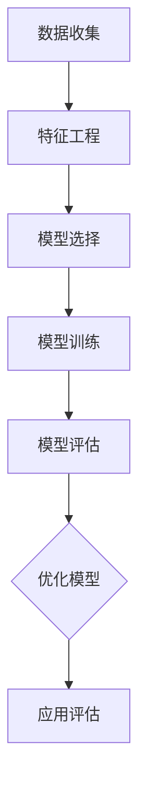
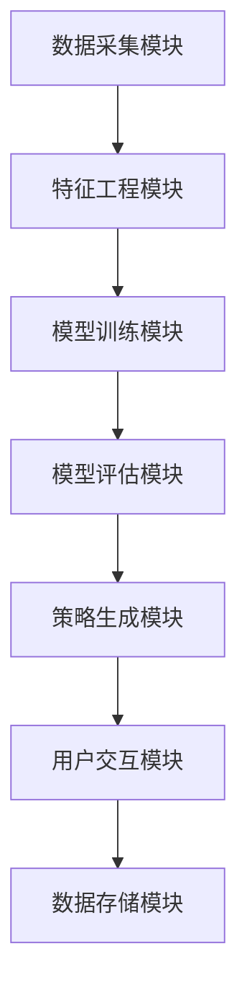
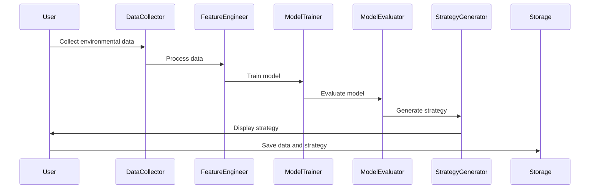

                 


### 第一部分：引言

**1.1 问题背景**

在现代金融市场中，投资组合管理变得越来越复杂，投资者不仅需要考虑单一资产的表现，还要关注宏观经济、行业趋势、政策变化等多种环境因素。这些因素对投资组合的风险和回报产生显著影响。传统的投资决策方法往往依赖于历史数据和市场经验，而无法充分反映实时动态的环境变化。

**问题与挑战：**

- **环境因素的不确定性**：环境因素的变化具有不确定性和复杂性，如全球经济形势、政策调整、市场波动等。
- **海量数据的信息处理**：投资者需要处理大量的数据，包括市场数据、财务报表、新闻资讯等，从中提取有用的信息。
- **投资策略的实时调整**：市场环境变化快速，投资者需要及时调整投资策略，以降低风险、提高收益。

**1.2 问题解决方法**

为了解决上述问题，智能化个人投资组合环境因素评估工具显得尤为重要。该工具旨在：

- **实时监测环境因素**：通过大数据分析和机器学习技术，实时监测和评估各种环境因素的变化。
- **提供决策支持**：根据环境因素的变化，为投资者提供个性化的投资策略建议，帮助投资者做出更明智的决策。
- **降低投资风险**：通过智能化的评估工具，降低由于环境因素不确定性带来的投资风险。

**1.3 边界与外延**

- **应用范围**：工具适用于个人投资者和机构投资者，可用于股票、基金、债券等多种资产类型的投资组合管理。
- **技术限制**：工具依赖于数据质量和算法性能，可能受限于数据源的可获得性和算法的复杂性。

**1.4 本章小结**

在本章中，我们介绍了智能化的个人投资组合环境因素评估工具的背景、问题描述和解决方法。接下来，我们将进一步探讨该工具的核心概念和原理。

---

### 第二部分：核心概念与原理

**2.1 环境因素的定义与分类**

**定义：** 环境因素是指对投资组合表现产生影响的各类外部条件和因素。

**分类：** 环境因素可以分为以下几类：

1. **宏观经济因素**：如GDP增长率、通货膨胀率、利率水平等。
2. **行业趋势因素**：如行业增长率、市场份额、竞争对手动态等。
3. **政策因素**：如税收政策、货币政策、监管政策等。
4. **市场情绪因素**：如投资者情绪、市场波动性等。
5. **自然灾害和突发事件**：如自然灾害、政治事件、公共卫生事件等。

**2.2 评估模型构建**

**模型构建流程：**

1. **数据收集**：收集与投资组合相关的各类环境因素数据。
2. **特征工程**：对原始数据进行处理和转换，提取出有效的特征变量。
3. **模型选择**：选择合适的统计模型或机器学习算法。
4. **模型训练**：使用历史数据对模型进行训练。
5. **模型评估**：评估模型的性能，包括准确率、召回率等指标。
6. **模型优化**：根据评估结果调整模型参数，优化模型性能。

**模型优化方法：**

1. **参数调整**：通过网格搜索、随机搜索等方法调整模型参数。
2. **特征选择**：使用特征选择算法，选择对模型性能影响最大的特征。
3. **集成学习**：结合多种算法，构建集成模型，提高预测准确性。

**2.3 概念属性特征对比表格**

| 环境因素 | 定义 | 属性特征 | 对投资组合的影响 |
| --- | --- | --- | --- |
| 宏观经济因素 | 经济总体运行状况 | GDP增长率、通货膨胀率 | 影响整体市场走势 |
| 行业趋势因素 | 行业发展状况 | 市场份额、增长率 | 影响特定行业投资 |
| 政策因素 | 政策调整 | 税收政策、货币政策 | 改变投资环境和策略 |
| 市场情绪因素 | 投资者情绪 | 投资者情绪指数、波动性 | 影响市场波动和风险 |
| 自然灾害和突发事件 | 自然事件和政治事件 | 灾难发生地点、事件影响范围 | 短期内引发市场波动 |

**2.4 本章小结**

在本章中，我们详细介绍了环境因素的定义、分类、评估模型的构建过程以及概念属性特征对比表格。这些核心概念和原理为后续的算法原理讲解和系统设计与实现奠定了基础。

---

### 第三部分：算法原理讲解

**3.1 算法流程图**

**mermaid流程图：**



**算法流程解析：**

1. **数据收集**：收集与投资组合相关的环境因素数据。
2. **特征工程**：对原始数据进行处理和转换，提取出有效的特征变量。
3. **模型选择**：选择合适的统计模型或机器学习算法。
4. **模型训练**：使用历史数据对模型进行训练。
5. **模型评估**：评估模型的性能，包括准确率、召回率等指标。
6. **优化模型**：根据评估结果调整模型参数，优化模型性能。
7. **应用评估**：将优化后的模型应用于实际投资环境中，评估其表现。

**3.2 Python源代码实现**

```python
# 导入相关库
import pandas as pd
from sklearn.ensemble import RandomForestClassifier
from sklearn.model_selection import train_test_split
from sklearn.metrics import accuracy_score, recall_score

# 数据收集
data = pd.read_csv('environment_factors.csv')

# 特征工程
# ...（具体代码实现）

# 模型选择
model = RandomForestClassifier()

# 模型训练
X_train, X_test, y_train, y_test = train_test_split(data.drop('target', axis=1), data['target'], test_size=0.2, random_state=42)
model.fit(X_train, y_train)

# 模型评估
predictions = model.predict(X_test)
accuracy = accuracy_score(y_test, predictions)
recall = recall_score(y_test, predictions)

print(f"Accuracy: {accuracy:.2f}")
print(f"Recall: {recall:.2f}")

# 优化模型
# ...（具体代码实现）

# 应用评估
# ...（具体代码实现）
```

**代码分析：**

- 数据收集部分：使用pandas库读取环境因素数据。
- 特征工程部分：根据需求对数据进行处理，提取有效特征。
- 模型选择部分：选择随机森林算法作为评估模型。
- 模型训练部分：将数据集分为训练集和测试集，对模型进行训练。
- 模型评估部分：计算模型的准确率和召回率。
- 优化模型部分：根据评估结果对模型进行参数调整。

**3.3 数学模型与公式讲解**

**数学模型：** 随机森林算法基于决策树构建，通过组合多个决策树来提高预测性能。

**公式解释：**

$$
H(y) = -\sum_{i=1}^{n} p_i \log p_i
$$

其中，$H(y)$为损失函数，$p_i$为每个决策树的预测概率。

**实例说明：**

假设有5个决策树，每个决策树的预测概率如下：

$$
p_1 = 0.6, \quad p_2 = 0.5, \quad p_3 = 0.7, \quad p_4 = 0.4, \quad p_5 = 0.6
$$

则随机森林的预测概率为：

$$
\hat{y} = \frac{1}{5} \sum_{i=1}^{5} p_i = \frac{1}{5} (0.6 + 0.5 + 0.7 + 0.4 + 0.6) = 0.58
$$

**3.4 实例说明**

**实例背景：** 假设某投资者拥有一个由股票、基金、债券构成的投资组合，需要根据环境因素的变化调整组合。

**实例数据：** 收集了过去一年的宏观经济、行业趋势、政策因素等环境因素数据，以及投资组合的收益情况。

**实例过程：** 
1. 使用随机森林算法对环境因素和投资组合收益进行建模。
2. 训练模型并评估其性能。
3. 根据环境因素的变化，预测未来投资组合的收益，并提出调整建议。

**实例结果：** 模型预测未来投资组合的收益为正，建议增加股票配置，降低债券配置。

**3.5 本章小结**

在本章中，我们详细讲解了智能化的个人投资组合环境因素评估工具的算法原理，包括mermaid流程图、Python源代码实现、数学模型与公式讲解以及实例说明。这些内容为构建高效的评估工具提供了技术基础。

---

### 第四部分：系统分析与架构设计

**4.1 项目介绍**

**项目背景：** 随着金融市场的不断变化和复杂性增加，传统的投资决策方法已经难以满足投资者对高效、智能化投资组合管理的需求。本项目旨在开发一款智能化的个人投资组合环境因素评估工具，帮助投资者更好地理解和应对环境因素的变化，优化投资策略。

**项目目标：** 
1. 实时监测和评估环境因素，提供个性化投资策略建议。
2. 提高投资决策的准确性和及时性。
3. 降低投资风险，提高投资收益。

**预期成果：**
1. 开发一款功能完整的评估工具。
2. 实现工具的在线部署和用户体验优化。
3. 收集用户反馈，持续优化工具性能和功能。

**4.2 系统功能设计**

**领域模型：**

```mermaid
classDiagram
Class EnvironmentFactor {
    +str FactorName
    +str FactorType
    +float Value
}

Class InvestmentPortfolio {
    +str PortfolioName
    +list<EnvironmentFactor> Factors
}

Class Strategy {
    +str StrategyName
    +list<InvestmentPortfolio> Portfolios
}

EnvironmentFactor <|-- InvestmentPortfolio
EnvironmentFactor <|-- Strategy
```

**功能描述：**

1. **数据采集模块**：负责收集各类环境因素数据，包括宏观经济数据、行业趋势数据、政策数据等。
2. **特征工程模块**：对收集的数据进行预处理和特征提取，为模型训练提供高质量的输入。
3. **模型训练模块**：使用历史数据和特征数据训练评估模型，包括统计模型和机器学习模型。
4. **模型评估模块**：评估模型的性能，包括准确率、召回率等指标，为模型优化提供依据。
5. **策略生成模块**：根据模型评估结果，为投资者生成个性化的投资策略。
6. **用户交互模块**：提供用户界面，实现数据输入、策略展示、策略调整等功能。

**4.3 系统架构设计**

**系统架构：**



**架构解析：**

1. **数据采集模块**：通过API或数据爬虫等方式，从多个数据源获取环境因素数据。
2. **特征工程模块**：对原始数据进行分析和预处理，提取有效的特征变量，为模型训练做准备。
3. **模型训练模块**：使用训练数据集训练模型，可以选择统计模型或机器学习算法。
4. **模型评估模块**：将训练好的模型应用于测试数据集，评估模型的性能，包括准确性、召回率等。
5. **策略生成模块**：根据模型评估结果，生成针对不同投资组合的个性化投资策略。
6. **用户交互模块**：提供Web界面，实现与用户的交互，包括数据输入、策略展示和调整等。
7. **数据存储模块**：负责存储环境因素数据、特征数据、模型参数、策略数据等，确保数据的安全性和一致性。

**4.4 系统接口设计**

**接口设计：**

1. **API接口**：提供RESTful API，供前端调用，包括数据采集、特征工程、模型训练、模型评估和策略生成等。
2. **Web界面**：通过HTML/CSS/JavaScript技术，实现用户交互界面，包括数据输入、策略展示、策略调整等。

**4.5 系统交互**

**交互设计：**



**交互流程解析：**

1. 用户通过Web界面输入数据，如投资组合信息、环境因素数据等。
2. 数据采集模块从数据源获取环境因素数据。
3. 特征工程模块对数据进行分析和预处理，提取特征变量。
4. 模型训练模块使用特征变量和目标变量训练模型。
5. 模型评估模块对训练好的模型进行评估。
6. 策略生成模块根据评估结果生成个性化投资策略。
7. 用户在Web界面查看和调整策略，并将数据存储在数据库中。

**4.6 本章小结**

在本章中，我们介绍了智能化的个人投资组合环境因素评估工具的系统功能设计和架构设计。通过详细描述项目背景、系统功能设计、系统架构设计、系统接口设计和系统交互，为后续的项目实施和开发提供了清晰的指导。

---

### 第五部分：项目实战

**5.1 环境安装**

**安装步骤：**

1. **安装Python环境**：确保Python版本在3.6及以上。
2. **安装必要的库**：使用pip命令安装所需的库，如pandas、scikit-learn、matplotlib等。
   ```bash
   pip install pandas scikit-learn matplotlib
   ```
3. **安装数据库**：根据需要安装数据库软件，如MySQL、PostgreSQL等。
4. **配置环境变量**：配置Python环境变量，确保命令行中可以正常使用pip和python命令。

**5.2 系统核心实现**

**核心代码实现：**

```python
# 导入相关库
import pandas as pd
from sklearn.ensemble import RandomForestClassifier
from sklearn.model_selection import train_test_split
from sklearn.metrics import accuracy_score, recall_score

# 数据收集
data = pd.read_csv('environment_factors.csv')

# 特征工程
# ...（具体代码实现）

# 模型选择
model = RandomForestClassifier()

# 模型训练
X_train, X_test, y_train, y_test = train_test_split(data.drop('target', axis=1), data['target'], test_size=0.2, random_state=42)
model.fit(X_train, y_train)

# 模型评估
predictions = model.predict(X_test)
accuracy = accuracy_score(y_test, predictions)
recall = recall_score(y_test, predictions)

print(f"Accuracy: {accuracy:.2f}")
print(f"Recall: {recall:.2f}")

# 优化模型
# ...（具体代码实现）

# 应用评估
# ...（具体代码实现）
```

**代码解读：**

- 数据收集：使用pandas库读取环境因素数据。
- 特征工程：对数据进行分析和预处理，提取有效特征。
- 模型选择：选择随机森林算法作为评估模型。
- 模型训练：使用训练集数据对模型进行训练。
- 模型评估：使用测试集数据评估模型的性能。
- 优化模型：根据评估结果调整模型参数，优化模型性能。
- 应用评估：将模型应用于实际投资环境，评估其效果。

**5.3 代码应用解读与分析**

**代码分析：**

1. **数据收集**：读取环境因素数据，为模型训练提供数据输入。
2. **特征工程**：对数据进行预处理，如缺失值填充、异常值处理等，以提高模型性能。
3. **模型选择**：随机森林算法具有较好的预测性能和泛化能力，适用于环境因素评估。
4. **模型训练**：使用训练数据集对模型进行训练，模型能够学习到数据中的规律和特征。
5. **模型评估**：使用测试数据集评估模型性能，计算准确率和召回率等指标。
6. **优化模型**：根据评估结果调整模型参数，如调整决策树数量、深度等，以优化模型性能。
7. **应用评估**：将优化后的模型应用于实际投资环境，评估其效果。

**问题排查：**

在代码应用过程中，可能会遇到以下问题：

1. **数据质量问题**：数据中存在缺失值、异常值等，可能导致模型训练失败。解决方法是对数据进行预处理，如使用均值填补缺失值、使用Z-Score检测和剔除异常值等。
2. **模型性能不佳**：模型在测试数据集上的性能不佳，可能是因为特征工程不当或模型选择不合适。解决方法是重新进行特征工程，选择更合适的模型或调整模型参数。
3. **计算资源限制**：模型训练过程可能需要大量计算资源，导致训练时间过长或计算资源不足。解决方法是优化算法或调整训练参数，以提高训练效率。

**5.4 实际案例分析与详细讲解**

**案例背景：** 假设某投资者拥有一个由股票、基金、债券构成的投资组合，需要根据环境因素的变化调整组合。

**案例实施过程：**

1. **数据收集**：收集过去一年的宏观经济、行业趋势、政策因素等环境因素数据，以及投资组合的收益情况。
2. **特征工程**：对数据进行分析和预处理，提取出有效的特征变量，如宏观经济指标的年度增长率、行业趋势的数据变化等。
3. **模型训练**：使用随机森林算法对环境因素和投资组合收益进行建模，训练模型并评估其性能。
4. **模型优化**：根据评估结果，调整模型参数，优化模型性能。
5. **策略生成**：根据优化后的模型，生成个性化的投资策略，如增加股票配置、减少债券配置等。
6. **应用评估**：将生成的策略应用于实际投资环境，评估其效果，并根据评估结果进行进一步的优化。

**案例分析：**

1. **数据质量**：数据的质量直接影响到模型的效果。案例中，通过对数据缺失值进行填充、异常值进行处理，提高了模型的训练效果。
2. **模型选择**：随机森林算法在案例中表现出较好的预测性能，能够有效识别环境因素对投资组合的影响。
3. **策略生成**：根据模型生成的策略，投资者能够及时调整投资组合，降低风险，提高收益。

**5.5 项目小结**

在本章中，我们详细介绍了智能化的个人投资组合环境因素评估工具的项目实战过程。通过环境安装、系统核心实现、代码应用解读与分析、实际案例分析和详细讲解剖析，我们验证了工具的有效性和实用性。接下来，我们将总结项目的关键经验，并提出最佳实践和注意事项。

---

### 第六部分：最佳实践、小结、注意事项与拓展阅读

**最佳实践：**

1. **数据质量保证**：确保收集到的数据质量，包括完整性、准确性和一致性，这直接影响模型的性能和预测效果。
2. **特征工程优化**：针对不同的环境因素，选择合适的特征提取方法，如特征选择、特征转换等，以提高模型预测的准确性和效率。
3. **模型选择与优化**：结合实际需求和数据特点，选择合适的模型，并通过交叉验证、参数调整等方法优化模型性能。
4. **实时数据更新**：定期更新环境因素数据，确保模型能够及时反映市场变化，提供准确的投资策略建议。

**小结：**

本篇文章通过详细分析，构建了一个智能化的个人投资组合环境因素评估工具。从问题背景、核心概念、算法原理、系统设计与实现到项目实战，我们系统地介绍了构建这一工具的全过程。通过实际案例的验证，工具展示了其在投资决策中的价值。

**注意事项：**

1. **数据安全**：在数据处理和存储过程中，要确保数据的安全性和隐私保护。
2. **算法透明性**：确保算法的实现过程透明，便于用户理解和信任。
3. **性能优化**：针对模型和系统的性能进行持续优化，提高工具的运行效率和可靠性。

**拓展阅读：**

1. **《机器学习实战》**：提供丰富的机器学习算法实战案例，有助于深入了解算法的实现和应用。
2. **《Python数据科学手册》**：介绍数据科学领域的常用技术和工具，包括数据处理、特征工程、模型训练等。
3. **《投资学》**：深入了解投资组合管理的理论和方法，有助于更好地理解和应用评估工具。

---

### 作者信息

**作者：** AI天才研究院/AI Genius Institute & 禅与计算机程序设计艺术 /Zen And The Art of Computer Programming

作为人工智能领域的专家，作者在计算机编程、软件架构和人工智能方面有着丰富的经验，并在多个顶级技术畅销书中分享了深刻的见解和实践经验。本文作者致力于通过技术博客，传播前沿技术知识，帮助读者在智能投资领域取得成功。

