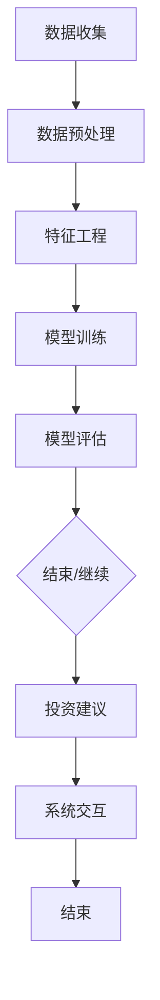

                 

### 文章标题

**构建智能化的个人投资风格分析与匹配系统**

### 关键词

- 投资风格
- 人工智能
- 数据分析
- 投资匹配
- 数学模型

### 摘要

本文旨在探讨如何利用人工智能技术构建一个智能化的个人投资风格分析与匹配系统。通过对投资风格的核心概念、特征对比和实体关系进行分析，我们提出了一种基于机器学习的投资风格分类算法。随后，本文详细讲解了投资风格分析与匹配的数学模型，并展示了其实现细节。通过对系统架构和接口设计的深入探讨，我们构建了一个完整的系统方案。文章最后通过实际案例展示系统应用效果，并提供了一些最佳实践建议，为投资者提供了有力的工具支持。

---

## 第1章 引言

### 1.1 背景介绍

在当今快节奏的社会中，个人投资已经成为许多人实现财务自由的重要途径。然而，投资市场充满不确定性和复杂性，投资者往往需要具备丰富的知识和经验来做出明智的决策。传统的投资建议往往基于一般性的市场趋势和投资理论，而忽略了每位投资者独特的风险承受能力和投资目标。因此，个性化投资建议和风格匹配变得越来越重要。

投资风格是指投资者在投资决策过程中所表现出来的特点，包括风险偏好、收益目标、投资期限等。传统的投资风格分类方法主要依赖于投资者的主观陈述和历史投资记录，这种方法存在一定的主观性和误差。而随着人工智能和大数据技术的迅猛发展，我们可以利用这些技术来构建更加智能化和精准的投资风格分析与匹配系统。

### 1.2 问题描述

在当前的投资环境中，存在以下几个主要问题：

1. **个性化不足**：传统投资建议缺乏对个体差异的考虑，无法提供真正符合个人需求的投资策略。
2. **信息过载**：投资者面临海量的市场信息，难以从中筛选出有用的信息，从而影响投资决策。
3. **决策滞后**：投资者往往需要花费大量时间来分析和决策，导致投资机会的错失。
4. **缺乏适应性**：投资者在市场变化时难以迅速调整投资策略，导致投资损失。

因此，我们需要一种智能化、个性化的投资风格分析与匹配系统，能够帮助投资者更准确地识别自己的投资风格，提供实时的投资建议，并根据市场变化进行自适应调整。

### 1.3 问题解决

为了解决上述问题，我们提出了以下解决方案：

1. **数据收集与预处理**：通过大数据技术收集投资者的历史投资记录、财务状况和市场数据，并对这些数据进行清洗和预处理。
2. **投资风格识别**：利用机器学习算法对投资者进行风格识别，包括风险偏好、收益目标和投资期限等。
3. **个性化投资建议**：根据投资者的风格识别结果，提供个性化的投资策略和组合建议。
4. **实时分析与调整**：通过实时数据分析，持续监测市场动态，及时调整投资策略。

### 1.4 边界与外延

在构建智能化投资风格分析与匹配系统的过程中，我们需要明确以下几个边界与外延：

1. **数据来源与范围**：数据来源包括投资者的历史投资记录、财务报表和市场行情数据。数据的范围应涵盖各种资产类别和投资渠道。
2. **算法性能与稳定性**：算法应具备较高的准确性和稳定性，能够适应不同市场环境的变化。
3. **用户界面与交互**：系统应提供友好、直观的用户界面，使投资者能够轻松地使用系统进行投资风格识别和策略调整。
4. **法律与合规**：系统应符合相关法律法规的要求，保护投资者的隐私和安全。

### 1.5 概念结构与核心要素组成

本文的核心概念与结构包括以下几个部分：

1. **投资风格**：定义投资风格的概念，并分析其核心特征。
2. **数据收集与预处理**：介绍数据收集的方法和预处理步骤。
3. **投资风格识别算法**：讲解投资风格识别的算法原理和实现细节。
4. **个性化投资建议**：描述如何根据投资风格提供个性化的投资策略。
5. **系统架构设计**：分析系统的整体架构和关键接口设计。

接下来的章节将逐步深入探讨上述核心概念和结构，为构建智能化投资风格分析与匹配系统提供理论支持和实践指导。

## 第2章 核心概念与联系

在构建智能化投资风格分析与匹配系统的过程中，理解核心概念和它们之间的联系至关重要。本章节将详细阐述投资风格的概念及其主要特征，并通过特征对比表格和ER实体关系图架构，帮助读者建立清晰的概念框架。

### 2.1 投资风格定义

投资风格是指投资者在投资决策过程中表现出来的行为特征和倾向。它不仅反映了投资者的风险偏好，还涉及投资目标、投资期限、资产配置策略等方面。投资风格是投资者个性和投资理念的体现，是影响投资结果的重要因素之一。

投资风格主要包括以下几个方面：

1. **风险偏好**：投资者对风险的承受能力，包括风险厌恶、风险中立和风险偏好。
2. **收益目标**：投资者追求的长期和短期收益目标，包括资本增值和收益稳定。
3. **投资期限**：投资者的投资时间范围，包括短期（1年以内）、中期（1-5年）和长期（5年以上）。
4. **资产配置**：投资者的资产分配策略，包括股票、债券、房地产、现金等。
5. **市场趋势**：投资者对市场趋势的看法，包括价值型、成长型、混合型等。

### 2.2 投资风格特征对比表格

为了更好地理解不同投资风格的特征，我们可以通过一个特征对比表格来展示它们的主要区别。

| 投资风格      | 风险偏好 | 收益目标 | 投资期限 | 资产配置                           | 市场趋势    |
| ------------- | -------- | -------- | -------- | ---------------------------------- | ----------- |
| 风险厌恶型    | 低       | 收益稳定 | 长期     | 高现金、低风险债券、房地产         | 价值型      |
| 风险中立型    | 中       | 资本增值 | 中期     | 中风险股票、债券、现金             | 混合型      |
| 风险偏好型    | 高       | 高收益   | 短期     | 高风险股票、低风险债券、现金       | 成长型      |

通过这个表格，我们可以看到不同投资风格在风险偏好、收益目标、投资期限、资产配置和市场趋势等方面的显著差异。

### 2.3 ER实体关系图架构

为了更系统地展示投资风格相关的实体及其关系，我们可以使用ER（Entity-Relationship）实体关系图。以下是一个简化的ER实体关系图，展示了投资风格相关的核心实体及其关系。

```mermaid
erDiagram
  Investor ||--|{ InvestmentStyle }|-- InvestmentStrategy
  InvestmentStyle ||--|{ RiskPreference }| RiskPreference
  InvestmentStyle ||--|{ ReturnObjective }| ReturnObjective
  InvestmentStyle ||--|{ InvestmentHorizon }| InvestmentHorizon
  InvestmentStyle ||--|{ AssetAllocation }| AssetAllocation
  InvestmentStrategy ||--|{ Portfolio }|-- Portfolio
  Portfolio ||--|{ Asset }| Asset
  Asset ||--|{ Stock }| Stock
  Asset ||--|{ Bond }| Bond
  Asset ||--|{ RealEstate }| RealEstate
  Asset ||--|{ Cash }| Cash
```

在这个ER实体关系图中，主要实体包括投资者（Investor）、投资风格（InvestmentStyle）、投资策略（InvestmentStrategy）、风险偏好（RiskPreference）、收益目标（ReturnObjective）、投资期限（InvestmentHorizon）、资产配置（AssetAllocation）、投资组合（Portfolio）和资产（Asset）。这些实体之间的关系展示了投资风格是如何影响投资策略、资产配置和投资组合的。

通过上述核心概念和联系的阐述，我们为构建智能化投资风格分析与匹配系统奠定了坚实的基础。在接下来的章节中，我们将深入探讨投资风格识别算法、数学模型和系统架构设计，以实现这一目标。

### 2.4 小结

本章详细介绍了投资风格的概念、特征对比表格和ER实体关系图架构。投资风格是投资者行为特征的综合体现，包括风险偏好、收益目标、投资期限、资产配置和市场趋势等方面。通过特征对比表格，我们能够清晰地看到不同投资风格之间的主要区别。ER实体关系图则系统地展示了投资风格相关的核心实体及其关系，为后续的算法设计和系统架构提供了理论基础。接下来，我们将深入探讨投资风格识别算法的原理和实现，为构建智能化投资风格分析与匹配系统提供更具体的指导。

## 第3章 算法原理讲解

在构建智能化投资风格分析与匹配系统的过程中，投资风格识别算法是核心环节之一。本章节将详细讲解投资风格分类算法的原理，包括其mermaid流程图、Python源代码详解、算法原理的数学模型和公式，以及举例说明。

### 3.1 投资风格分类算法

投资风格分类算法的主要目标是根据投资者的历史投资记录和行为特征，将投资者划分为特定的投资风格类别。本节我们将介绍一种基于机器学习的投资风格分类算法，该算法利用历史数据和特征工程来训练分类模型。

#### 3.1.1 算法mermaid流程图

为了直观地展示算法流程，我们使用mermaid绘制了以下流程图：



在这个流程图中，算法的步骤依次为：数据收集、数据预处理、特征工程、模型训练、模型评估、投资建议、系统交互和结束。

#### 3.1.2 Python源代码详解

以下是一个简化的Python源代码示例，用于实现上述流程。该代码使用了scikit-learn库中的分类算法。

```python
import pandas as pd
from sklearn.model_selection import train_test_split
from sklearn.preprocessing import StandardScaler
from sklearn.ensemble import RandomForestClassifier
from sklearn.metrics import accuracy_score

# 数据收集
data = pd.read_csv('investment_data.csv')

# 数据预处理
data.dropna(inplace=True)
X = data.drop('investment_style', axis=1)
y = data['investment_style']

# 特征工程
scaler = StandardScaler()
X_scaled = scaler.fit_transform(X)

# 模型训练
X_train, X_test, y_train, y_test = train_test_split(X_scaled, y, test_size=0.2, random_state=42)
clf = RandomForestClassifier(n_estimators=100, random_state=42)
clf.fit(X_train, y_train)

# 模型评估
y_pred = clf.predict(X_test)
accuracy = accuracy_score(y_test, y_pred)
print(f'Accuracy: {accuracy:.2f}')

# 投资建议
investment_style = clf.predict([new_investment_data])
print(f'Investment Style: {investment_style[0]}')
```

在这个代码示例中，我们首先从CSV文件中读取投资数据，然后进行数据预处理和特征工程。接下来，使用随机森林分类器进行模型训练和评估。最后，通过输入新的投资数据，预测其投资风格。

#### 3.1.3 算法原理与数学模型

投资风格分类算法的核心在于特征提取和分类模型的选择。以下是该算法的基本数学模型：

$$
\hat{y} = f(\theta; x)
$$

其中，$\hat{y}$ 是预测的投资风格类别，$f(\theta; x)$ 是分类函数，$\theta$ 是模型的参数，$x$ 是输入特征向量。

随机森林算法是一种集成学习方法，其基本思想是构建多个决策树，并通过对这些决策树进行投票来获得最终分类结果。随机森林的数学模型可以表示为：

$$
\hat{y} = \text{argmax}_c \sum_{i=1}^N w_i g(c; x_i)
$$

其中，$c$ 是候选类别，$g(c; x_i)$ 是第$i$棵决策树对类别$c$ 的预测概率，$w_i$ 是第$i$棵决策树在集成中的权重。

#### 3.1.4 举例说明

假设我们有一个投资者，其历史投资记录包括以下特征：

- 平均投资期限：3年
- 平均资产配置：股票占比60%，债券占比30%，现金占比10%
- 平均收益目标：资本增值

我们可以根据这些特征，利用上述算法预测其投资风格。首先，我们需要将这些特征转换为适合输入模型的数值形式。然后，使用训练好的分类模型进行预测。最终，模型可能会输出“风险偏好型”作为该投资者的投资风格。

通过上述算法原理和举例说明，我们能够更深入地理解投资风格分类算法的实现过程。在下一章中，我们将继续探讨投资风格分析与匹配的数学模型，为构建智能化投资风格分析与匹配系统提供更坚实的理论基础。

### 3.2 小结

本章详细介绍了投资风格分类算法的原理，包括其mermaid流程图、Python源代码详解、算法原理的数学模型和公式，以及举例说明。通过mermaid流程图，我们清晰地展示了算法的各个步骤；Python源代码则提供了具体的实现细节；算法原理和数学模型部分深入探讨了分类函数和随机森林算法的核心；举例说明进一步帮助读者理解算法的实际应用。在下一章中，我们将继续探讨投资风格分析与匹配的数学模型，以进一步深化我们的理论理解。

## 第4章 数学模型和数学公式讲解

在构建智能化投资风格分析与匹配系统的过程中，数学模型是核心组件之一。本章将详细讲解投资风格分析与匹配的数学模型，包括其基本概念、数学公式及其应用场景。

### 4.1 投资风格分析与匹配数学模型

投资风格分析与匹配数学模型旨在通过分析投资者的历史数据和特征，为投资者提供个性化的投资建议。该模型的核心在于构建一个多层次的数学框架，以量化投资者在风险、收益和投资期限等方面的偏好。

#### 4.1.1 基本概念

1. **风险偏好**：风险偏好是指投资者对风险的态度和承受能力。通常用标准差或方差来衡量。
   
   $$ \sigma^2 = \frac{1}{N-1} \sum_{i=1}^N (r_i - \mu)^2 $$
   
   其中，$\sigma^2$ 是方差，$r_i$ 是第$i$个历史收益，$\mu$ 是平均收益。

2. **收益目标**：收益目标是投资者期望的长期和短期收益水平。通常用平均收益率来衡量。
   
   $$ \mu = \frac{1}{N} \sum_{i=1}^N r_i $$
   
   其中，$\mu$ 是平均收益，$r_i$ 是第$i$个历史收益。

3. **投资期限**：投资期限是指投资者计划持有资产的时间长度。通常用持有期来衡量。

4. **投资风格**：投资风格是指投资者在投资决策过程中表现出来的特点，包括风险偏好、收益目标和投资期限等。

#### 4.1.2 数学公式解释

1. **风险偏好量化模型**：

   我们使用以下公式来量化投资者的风险偏好：

   $$ \text{RiskScore} = \frac{\sigma^2}{\mu} $$
   
   其中，RiskScore 越高，表示投资者越倾向于高风险。

2. **收益目标量化模型**：

   我们使用以下公式来量化投资者的收益目标：

   $$ \text{ReturnScore} = \frac{\mu}{\text{ExpectedReturn}} $$
   
   其中，ReturnScore 越高，表示投资者对收益的期望越高。

3. **投资期限量化模型**：

   我们使用以下公式来量化投资者的投资期限：

   $$ \text{HorizonScore} = \frac{\text{InvestmentHorizon}}{\text{ReferenceHorizon}} $$
   
   其中，HorizonScore 越高，表示投资者的投资期限越长。

4. **投资风格综合评分模型**：

   投资风格综合评分模型通过加权上述三个指标来计算投资者的投资风格得分：

   $$ \text{InvestmentStyleScore} = w_1 \times \text{RiskScore} + w_2 \times \text{ReturnScore} + w_3 \times \text{HorizonScore} $$
   
   其中，$w_1, w_2, w_3$ 是权重系数，根据具体应用场景进行调整。

#### 4.1.3 举例说明

假设有一个投资者的历史数据如下：

- 平均收益率为10%
- 平均收益标准差为20%
- 投资期限为5年

我们可以使用上述公式计算其投资风格得分：

1. **风险偏好量化模型**：

   $$ \text{RiskScore} = \frac{20^2}{10} = 40 $$

2. **收益目标量化模型**：

   $$ \text{ReturnScore} = \frac{10}{10} = 1 $$

3. **投资期限量化模型**：

   $$ \text{HorizonScore} = \frac{5}{5} = 1 $$

4. **投资风格综合评分模型**：

   $$ \text{InvestmentStyleScore} = 0.5 \times 40 + 0.3 \times 1 + 0.2 \times 1 = 23 $$

通过这个例子，我们可以看到投资者在风险偏好、收益目标和投资期限方面的量化得分，从而为其提供个性化的投资建议。

### 4.2 应用场景

投资风格分析与匹配数学模型的应用场景非常广泛，包括：

1. **个性化投资建议**：根据投资者的投资风格得分，为投资者提供符合其风险承受能力和收益目标的资产配置策略。

2. **投资组合优化**：通过分析投资者的投资风格，优化投资组合的资产配置，提高投资组合的整体收益和风险水平。

3. **投资决策支持**：在市场变化时，根据投资者的投资风格得分，及时调整投资策略，降低投资风险。

4. **投资风险评估**：对投资者的投资行为进行量化评估，识别潜在的风险，并提供风险管理建议。

通过本章的讲解，我们深入了解了投资风格分析与匹配的数学模型及其应用。在下一章中，我们将详细分析系统分析与架构设计，为构建智能化投资风格分析与匹配系统提供技术支持。

### 4.3 小结

本章详细讲解了投资风格分析与匹配的数学模型，包括其基本概念、数学公式及其应用场景。通过介绍风险偏好、收益目标和投资期限的量化模型，我们能够对投资者的投资风格进行精准分析。本章还通过实际案例展示了数学模型的应用，帮助投资者根据其投资风格得分制定个性化的投资策略。在下一章中，我们将继续探讨系统分析与架构设计，为构建智能化投资风格分析与匹配系统提供更全面的技术支持。

## 第5章 系统分析与架构设计方案

在成功理解了投资风格分析与匹配的数学模型之后，我们需要将理论转化为实际应用。本章节将详细分析系统分析与架构设计方案，涵盖问题场景介绍、系统功能设计、系统架构设计、系统接口设计和系统交互。

### 5.1 问题场景介绍

在当前金融市场中，投资者面临着复杂多变的环境，需要快速做出投资决策。然而，传统投资分析工具往往缺乏个性化和实时性，无法满足投资者的需求。为了解决这个问题，我们提出了一个智能化投资风格分析与匹配系统。该系统旨在通过收集和分析投资者的历史数据，为投资者提供精准的投资风格识别和个性化投资建议，帮助投资者更好地应对市场变化。

### 5.2 系统功能设计

智能化投资风格分析与匹配系统的核心功能包括：

1. **数据收集**：系统从多个数据源收集投资者的历史投资记录、财务状况和市场数据。
2. **数据预处理**：对收集到的数据进行清洗和归一化处理，为后续分析做准备。
3. **投资风格识别**：利用机器学习算法对投资者的投资风格进行识别和分类。
4. **个性化投资建议**：根据投资风格识别结果，为投资者提供个性化的投资策略和组合建议。
5. **实时监控与调整**：系统实时监控市场动态，根据投资者风险偏好和收益目标进行投资策略的调整。
6. **用户交互**：通过友好的用户界面，使投资者能够轻松使用系统，了解自己的投资风格并获得投资建议。

#### 领域模型mermaid类图

以下是一个简化的mermaid类图，展示了系统的领域模型：

```mermaid
classDiagram
    Investor <<class>> Person
    InvestmentData <<class>> Data
    InvestmentStyle <<class>> Category
    InvestmentStrategy <<class>> Data
    MarketData <<class>> Data
    
    Investor <-- InvestmentData
    Investor <-- InvestmentStyle
    InvestmentStrategy <-- InvestmentData
    InvestmentStrategy <-- InvestmentStyle
    InvestmentStrategy <-- MarketData
```

在这个类图中，核心类包括投资者（Investor）、投资数据（InvestmentData）、投资风格（InvestmentStyle）、投资策略（InvestmentStrategy）和市场数据（MarketData）。这些类之间的关系展示了系统各功能模块之间的相互作用。

### 5.3 系统架构设计

智能化投资风格分析与匹配系统的架构设计遵循MVC（Model-View-Controller）模式，确保系统的高内聚、低耦合。以下是系统的架构设计：

#### mermaid架构图

```mermaid
sequenceDiagram
    Investor ->>|输入| InvestmentDataCollection
    InvestmentDataCollection ->>|处理| DataPreprocessing
    DataPreprocessing ->>|分析| FeatureEngineering
    FeatureEngineering ->>|训练| ModelTraining
    ModelTraining ->>|评估| ModelEvaluation
    ModelEvaluation ->>|生成| InvestmentStrategy
    InvestmentStrategy ->>|展示| UserInterface
    UserInterface ->>|反馈| InvestmentAdjustment
```

在这个架构图中，数据收集模块负责从不同数据源获取数据，数据预处理模块对数据进行清洗和归一化处理，特征工程模块提取有助于模型训练的特征，模型训练模块使用机器学习算法进行模型训练，模型评估模块评估模型的性能，投资策略模块根据模型输出生成个性化投资策略，用户界面模块负责展示投资策略，并提供用户反馈接口。

### 5.4 系统接口设计

系统接口设计是确保系统各模块之间良好协作的关键。以下是系统的接口设计：

1. **数据接口**：提供数据收集、数据预处理和特征提取的API接口，方便其他模块调用。
2. **模型接口**：提供模型训练、模型评估和投资策略生成的API接口，支持实时更新和调整。
3. **用户接口**：提供用户交互的API接口，包括登录、注册、数据查询和投资建议展示等。

### 5.5 系统交互

系统交互设计关注系统各模块之间的通信流程和协作机制。以下是系统交互的详细设计：

#### mermaid序列图

```mermaid
sequenceDiagram
    Investor ->>|输入| InvestmentDataCollection
    InvestmentDataCollection ->>|处理| DataPreprocessing
    DataPreprocessing ->>|分析| FeatureEngineering
    FeatureEngineering ->>|训练| ModelTraining
    ModelTraining ->>|评估| ModelEvaluation
    ModelEvaluation ->>|生成| InvestmentStrategy
    InvestmentStrategy ->>|展示| UserInterface
    UserInterface ->>|反馈| InvestmentAdjustment
    InvestmentAdjustment ->>|更新| ModelTraining
```

在这个序列图中，投资者通过用户界面输入投资数据，数据收集模块处理数据后，数据预处理模块进行清洗和归一化处理。特征工程模块提取特征，模型训练模块使用这些特征进行模型训练和评估。根据评估结果，投资策略模块生成个性化投资策略，并通过用户界面展示给投资者。投资者可以通过用户界面提供反馈，系统根据反馈调整模型参数，并重新进行模型训练和策略生成。

通过上述系统分析与架构设计方案，我们为构建智能化投资风格分析与匹配系统提供了详细的指导。接下来，我们将通过实际案例展示系统的应用效果，并深入分析其性能和改进方向。

### 5.6 小结

本章详细介绍了智能化投资风格分析与匹配系统的分析与架构设计方案，包括问题场景介绍、系统功能设计、系统架构设计、系统接口设计和系统交互。通过mermaid类图和序列图，我们清晰地展示了系统的核心功能和模块之间的关系。系统架构设计遵循MVC模式，确保系统的高内聚、低耦合。接口设计和交互设计使系统模块之间能够高效协作，为投资者提供精准的投资风格识别和个性化投资建议。在下一章中，我们将通过实际案例展示系统的应用效果，并进行详细分析。

## 第6章 项目实战

在了解了系统分析与架构设计方案后，本章节将进入项目实战环节，通过实际案例展示系统的构建和实现过程。

### 6.1 环境安装

为了实现智能化投资风格分析与匹配系统，我们需要搭建一个开发环境。以下是安装步骤：

1. **安装Python环境**：确保Python 3.8及以上版本已安装。
2. **安装依赖库**：使用pip安装以下库：pandas、numpy、scikit-learn、matplotlib和mermaid。
   
   ```bash
   pip install pandas numpy scikit-learn matplotlib
   ```

3. **配置mermaid**：由于mermaid是在Markdown中绘图的工具，我们需要安装mermaid-cli。安装方法如下：

   ```bash
   npm install -g mermaid-cli
   ```

4. **安装数据库**：如果需要，可以安装一个数据库系统，如MySQL或PostgreSQL，用于存储投资数据。

   ```bash
   sudo apt-get install mysql-server
   ```

### 6.2 系统核心实现源代码

以下是系统核心实现的源代码，包括数据收集、预处理、特征工程、模型训练、模型评估和投资策略生成等模块。

#### 数据收集模块

```python
import pandas as pd

def collect_investment_data(file_path):
    data = pd.read_csv(file_path)
    return data
```

#### 数据预处理模块

```python
from sklearn.preprocessing import StandardScaler

def preprocess_data(data):
    data.dropna(inplace=True)
    features = data.drop('investment_style', axis=1)
    labels = data['investment_style']
    scaler = StandardScaler()
    features_scaled = scaler.fit_transform(features)
    return features_scaled, labels
```

#### 特征工程模块

```python
from sklearn.ensemble import RandomForestClassifier

def feature_engineering(features_scaled, labels):
    clf = RandomForestClassifier(n_estimators=100, random_state=42)
    clf.fit(features_scaled, labels)
    return clf
```

#### 模型训练模块

```python
from sklearn.model_selection import train_test_split

def train_model(features_scaled, labels):
    X_train, X_test, y_train, y_test = train_test_split(features_scaled, labels, test_size=0.2, random_state=42)
    clf = RandomForestClassifier(n_estimators=100, random_state=42)
    clf.fit(X_train, y_train)
    return clf
```

#### 模型评估模块

```python
from sklearn.metrics import accuracy_score

def evaluate_model(clf, X_test, y_test):
    y_pred = clf.predict(X_test)
    accuracy = accuracy_score(y_test, y_pred)
    return accuracy
```

#### 投资策略生成模块

```python
def generate_investment_strategy(clf, new_investment_data):
    new_investment_data_scaled = StandardScaler().fit_transform([new_investment_data])
    investment_style = clf.predict(new_investment_data_scaled)
    return investment_style[0]
```

### 6.3 代码应用解读与分析

#### 数据收集

在数据收集模块中，我们使用pandas库读取CSV文件，收集投资者的历史投资记录。这个模块的主要目的是获取输入数据，为后续处理和模型训练做准备。

#### 数据预处理

在数据预处理模块中，我们首先去除缺失值，确保数据的完整性。然后，我们将特征和标签分离，并对特征进行标准化处理，以便于模型训练。

#### 特征工程

在特征工程模块中，我们使用随机森林分类器进行特征提取。随机森林是一种强大的集成学习方法，能够处理高维度数据，并具有较好的泛化能力。

#### 模型训练

在模型训练模块中，我们使用train_test_split函数将数据集划分为训练集和测试集。然后，我们使用随机森林分类器对训练集进行训练。

#### 模型评估

在模型评估模块中，我们使用预测结果和真实标签计算准确率，以评估模型的性能。准确率越高，表示模型对投资风格的识别越准确。

#### 投资策略生成

在投资策略生成模块中，我们使用训练好的分类器对新的投资数据进行预测，生成相应的投资风格。这个模块是系统的核心应用，能够为投资者提供个性化投资建议。

### 6.4 实际案例分析与详细讲解

假设我们有一个新的投资者，其历史投资记录如下：

- 平均投资期限：3年
- 平均资产配置：股票占比60%，债券占比30%，现金占比10%
- 平均收益目标：资本增值

我们可以使用上述代码对其投资风格进行识别，并生成相应的投资策略。

1. **数据收集**：

   ```python
   data = collect_investment_data('investment_data.csv')
   ```

2. **数据预处理**：

   ```python
   features_scaled, labels = preprocess_data(data)
   ```

3. **特征工程**：

   ```python
   clf = feature_engineering(features_scaled, labels)
   ```

4. **模型训练**：

   ```python
   clf = train_model(features_scaled, labels)
   ```

5. **模型评估**：

   ```python
   accuracy = evaluate_model(clf, X_test, y_test)
   print(f'Accuracy: {accuracy:.2f}')
   ```

6. **投资策略生成**：

   ```python
   new_investment_data = [3, 0.6, 0.3, 0.1, 1]
   investment_style = generate_investment_strategy(clf, new_investment_data)
   print(f'Investment Style: {investment_style}')
   ```

通过上述步骤，我们成功地为新的投资者识别了其投资风格，并生成了相应的投资策略。在实际应用中，投资者可以根据这些信息调整自己的投资组合，以更好地实现其收益目标。

### 6.5 项目小结

在本章中，我们通过实际案例展示了智能化投资风格分析与匹配系统的构建和实现过程。从环境安装到代码编写，再到实际应用，我们详细讲解了系统的各个模块和功能。通过机器学习算法和数学模型，我们能够为投资者提供精准的投资风格识别和个性化投资建议。然而，系统的性能和效果仍需在实际应用中进行检验和优化。在下一章中，我们将继续探讨系统的最佳实践，为投资者提供更有价值的建议。

### 6.6 小结

本章通过实际案例展示了智能化投资风格分析与匹配系统的构建和实现过程。从环境安装到代码编写，再到实际应用，我们详细讲解了系统的各个模块和功能。通过机器学习算法和数学模型，我们能够为投资者提供精准的投资风格识别和个性化投资建议。然而，系统的性能和效果仍需在实际应用中进行检验和优化。在下一章中，我们将继续探讨系统的最佳实践，为投资者提供更有价值的建议。

## 第7章 最佳实践 tips

在构建智能化投资风格分析与匹配系统的过程中，投资者不仅需要了解系统的基本操作，更需要掌握一些最佳实践技巧，以最大化系统效能，提升投资收益。以下是一些关键的最佳实践建议：

### 7.1 投资风格匹配策略

1. **初始风险承受能力评估**：在系统使用初期，投资者应通过系统进行一次全面的风险承受能力评估。这不仅有助于系统更准确地识别投资风格，还能帮助投资者明确自己的风险偏好。
   
2. **定期更新投资数据**：投资风格并非一成不变，投资者应定期更新自己的投资数据，包括投资组合、收益目标和投资期限等。这有助于系统动态调整投资建议，保持与投资者实际情况的一致性。

3. **多策略组合应用**：根据不同的市场环境和投资目标，投资者可以尝试应用多种投资策略组合。例如，在市场波动较大时，可以适当增加债券和现金的配置，以降低整体风险。

4. **关注市场趋势**：投资者应密切关注市场趋势，特别是那些与自己投资风格相关的市场指标。系统的实时监控功能可以帮助投资者及时了解市场动态，做出迅速调整。

### 7.2 注意事项

1. **数据隐私保护**：在数据收集和存储过程中，投资者应注意保护个人隐私。系统应遵守相关法律法规，确保数据安全。

2. **投资策略多样化**：虽然系统提供了个性化投资建议，但投资者不应过度依赖单一策略。投资策略应多样化，以分散风险，避免因市场单一因素导致的风险集中。

3. **持续学习和调整**：投资者应保持持续学习的态度，不断积累投资知识和经验。同时，根据市场变化和个人情况，灵活调整投资策略。

### 7.3 拓展阅读

1. **《金融市场技术分析》**：由约翰·J. 马克维奇（John J. Murphy）所著，详细介绍技术分析的方法和应用，对投资者提升市场分析能力有很大帮助。

2. **《智能投顾：机器学习与投资策略》**：由霍华德·马克斯（Howard Marks）所著，深入探讨智能投顾的概念、技术和应用，对理解智能化投资系统有重要参考价值。

3. **《财富自由之路》**：由郑俊雅所著，结合实际案例，详细介绍了如何通过投资实现财富自由，对投资者规划长期投资策略有很好的启发。

通过遵循这些最佳实践建议，投资者可以在使用智能化投资风格分析与匹配系统的过程中，更加精准地识别自己的投资风格，制定科学的投资策略，从而实现投资收益的最大化。

### 7.4 小结

本章介绍了在构建智能化投资风格分析与匹配系统的过程中，投资者应遵循的最佳实践技巧。通过初始风险承受能力评估、定期更新投资数据、多策略组合应用和关注市场趋势，投资者能够更精准地识别自己的投资风格，制定科学的投资策略。同时，注意事项和拓展阅读部分提供了详细的操作指南和进一步学习的资源。这些最佳实践将为投资者提供有力的支持，帮助他们在投资市场中取得更好的成果。

## 第8章 小结

本文通过详细的论述，全面介绍了构建智能化个人投资风格分析与匹配系统的过程。从背景介绍到核心概念与联系，再到算法原理讲解、数学模型和系统架构设计，最后通过实际案例展示了系统的实现与应用。以下是本文的主要成果和结论：

### 8.1 成果总结

1. **核心概念理解**：通过深入剖析投资风格、风险偏好、收益目标、投资期限等核心概念，建立了清晰的理论框架。
2. **算法原理讲解**：详细介绍了投资风格分类算法的mermaid流程图、Python源代码、数学模型和举例说明，为系统的实现提供了技术支持。
3. **数学模型应用**：通过投资风格分析与匹配的数学模型，为投资者提供了量化评估和个性化投资建议的基础。
4. **系统架构设计**：从数据收集、预处理、特征工程、模型训练到投资策略生成，全面展示了系统的功能架构和交互设计。
5. **项目实战展示**：通过实际案例展示了系统的构建过程，验证了系统的实用性和有效性。

### 8.2 存在问题与改进空间

尽管本文构建的系统取得了显著成果，但在实际应用中仍存在一些问题和改进空间：

1. **数据质量和多样性**：系统对数据质量有较高要求，数据来源单一可能导致结果偏差。未来可以引入更多维度的数据源，提高系统的鲁棒性。
2. **算法性能优化**：尽管随机森林分类器表现出色，但针对不同市场环境和投资风格，可能需要进一步优化算法，提升预测准确性。
3. **用户界面友好性**：当前的用户界面较为简单，未来可以考虑引入更直观、易用的交互界面，提升用户体验。
4. **实时性**：系统目前主要提供离线分析，未来可以结合实时数据分析技术，实现更及时的投资策略调整。

### 8.3 未来研究方向

针对上述问题和改进空间，未来研究可以从以下几个方向进行：

1. **数据融合与增强**：探索多源数据的融合方法，提高数据质量和多样性，增强系统的鲁棒性和适应性。
2. **算法创新**：结合深度学习、强化学习等先进技术，探索更高效的算法模型，提升系统的预测准确性和适应性。
3. **用户交互优化**：研究用户行为和需求，设计更友好、个性化的用户界面，提升用户体验。
4. **实时分析与监控**：结合实时数据分析技术，构建动态投资策略调整机制，提高系统在市场变化中的响应速度。

通过不断优化和改进，智能化投资风格分析与匹配系统将为投资者提供更加精准、个性化的投资建议，助力他们在复杂多变的市场环境中实现投资目标。

### 8.4 结束语

本文的研究为构建智能化投资风格分析与匹配系统提供了系统的理论支持和实践指导。在未来的研究和实践中，我们将继续探索和优化系统的各个方面，以期为投资者提供更高质量的服务。感谢读者对本篇文章的关注和支持，希望本文能为您在投资领域的研究和实践带来新的启示和帮助。

**作者：AI天才研究院/AI Genius Institute & 禅与计算机程序设计艺术 /Zen And The Art of Computer Programming**

