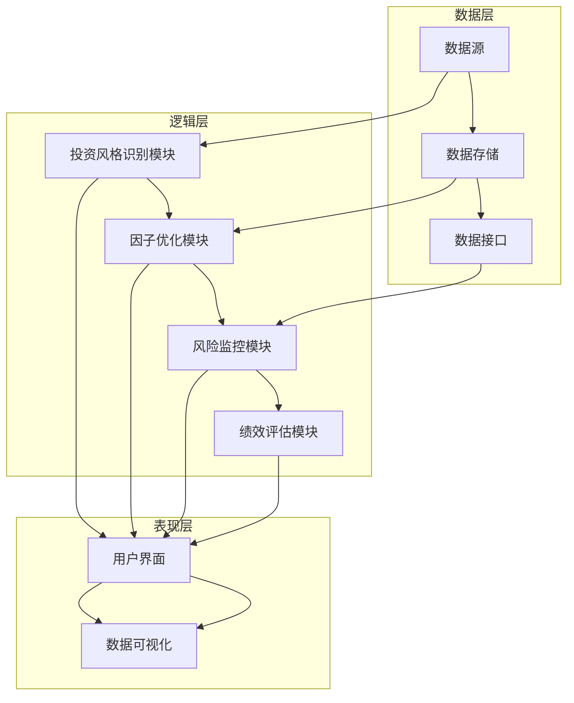
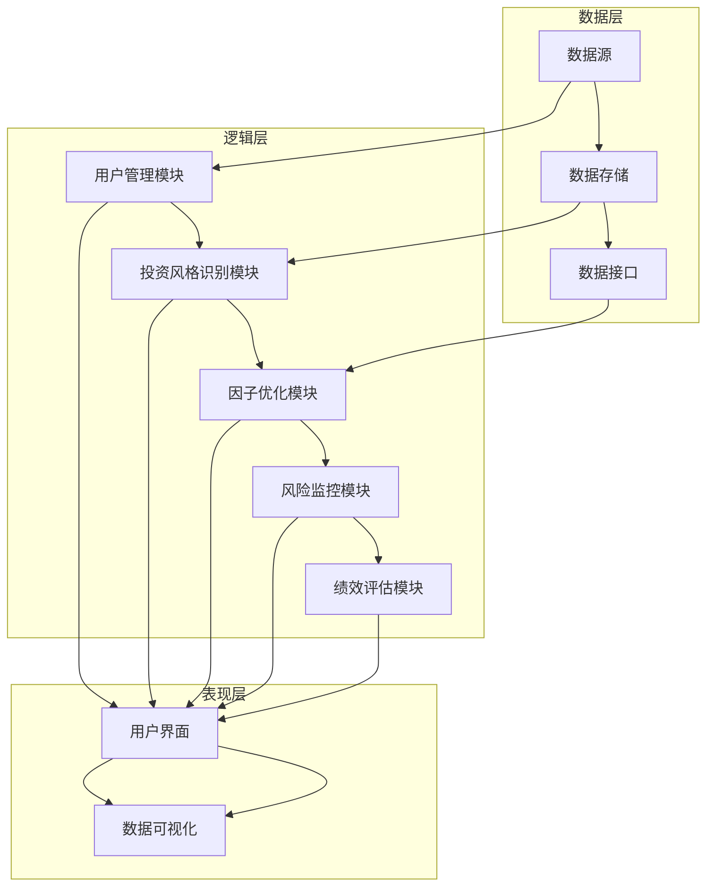

                 

# 《构建智能化的个人投资风格因子暴露优化系统》

## 关键词：个人投资风格、因子暴露、优化系统、智能化、投资策略

> 摘要：本文将深入探讨如何构建一个智能化的个人投资风格因子暴露优化系统。通过详细解析投资风格因子的定义、重要性以及优化方法，结合实际项目案例，阐述系统设计、实现、性能优化、部署与测试的全过程，为投资者提供实用的策略和工具。

## 目录大纲

### 第一部分：背景与核心概念

### 第二部分：系统设计与实现

### 第三部分：系统性能优化

### 第四部分：系统部署与测试

### 第五部分：项目总结与展望

## 第一部分：背景与核心概念

### 第1章：问题背景与核心概念

### 1.1 投资风格因子的定义与重要性

#### 1.1.1 投资风格因子的概念

投资风格因子是指投资者在投资决策过程中所采用的一系列规则和原则，这些规则和原则反映了投资者的风险偏好、投资策略和个性特征。投资风格因子通常包括价值型、成长型、小盘型、大盘型等多种类型。

#### 1.1.2 投资风格因子的重要性

投资风格因子是投资者实现投资目标的关键因素。通过识别和优化投资风格因子，投资者可以更好地理解自己的投资偏好，制定符合自身特点的投资策略，从而提高投资收益和风险控制能力。

### 1.2 个人投资风格的识别

#### 1.2.1 个人投资风格的特征

个人投资风格通常具有以下特征：

- **风险偏好**：投资者对风险的承受程度，通常分为保守型、稳健型、积极型和激进型。
- **投资目标**：投资者期望通过投资实现的财务目标，如资产增值、资产保值或现金流动。
- **投资时间**：投资者愿意持有投资资产的时间长度，如短期、中期或长期。
- **投资策略**：投资者采用的交易策略，如基本面分析、技术分析或量化投资。

#### 1.2.2 个人投资风格的识别方法

个人投资风格的识别方法主要包括问卷调查、心理测试和行为分析。通过这些方法，可以准确捕捉投资者的行为特征和投资偏好，为后续的投资风格因子优化提供依据。

### 1.3 智能化投资系统的构建

#### 1.3.1 智能化投资系统的概念

智能化投资系统是指利用人工智能技术，对投资数据进行分析和处理，以实现投资策略优化和风险管理的系统。智能化投资系统通常包括数据采集、数据清洗、数据分析、模型训练和策略推荐等功能。

#### 1.3.2 智能化投资系统的主要功能

智能化投资系统的主要功能包括：

- **投资风格识别**：通过数据分析和机器学习算法，识别投资者的投资风格。
- **因子暴露分析**：分析投资组合的因子暴露情况，评估投资策略的有效性。
- **优化策略推荐**：根据投资目标和风险偏好，推荐最优的投资组合策略。

## 第二部分：系统设计与实现

### 第2章：投资风格因子优化原理

### 第3章：系统需求分析与架构设计

### 第4章：系统功能实现

### 第5章：系统性能优化

## 第三部分：系统性能优化

### 第6章：系统部署与测试

### 第7章：项目总结与展望

## 第一部分：背景与核心概念

### 第1章：问题背景与核心概念

在当前金融市场高度竞争和复杂多变的背景下，个人投资者面临着前所未有的挑战。传统的投资方法已无法满足投资者对于风险控制、收益最大化以及个性化服务的需求。为了提高投资效率，投资者需要构建一个智能化的个人投资风格因子暴露优化系统，该系统能够根据投资者的个性化需求，动态调整投资组合，实现风险收益的最优化。

本章节将详细阐述个人投资风格因子优化系统的核心概念和基本原理。首先，我们将介绍投资风格因子的定义和重要性，探讨投资风格因子如何影响投资决策和风险收益。接着，我们将深入分析个人投资风格的识别方法，介绍如何通过问卷调查、心理测试和行为分析等方式，准确捕捉投资者的投资偏好和风险偏好。最后，我们将探讨智能化投资系统的构建，包括其基本功能、系统架构和数据流程，为后续章节的系统设计与实现奠定基础。

### 1.1 投资风格因子的定义与重要性

#### 1.1.1 投资风格因子的概念

投资风格因子是指在投资决策过程中，反映投资者个体特征、风险偏好和投资策略的一系列指标。这些因子可以是量化的，如资产配置比例、行业分布、市值大小等；也可以是定性的，如投资周期、资金利用率、交易频率等。投资风格因子的核心目的是为投资者提供一个直观、量化的方式来描述其投资行为，帮助投资者更好地理解和管理自己的投资组合。

投资风格因子主要包括以下几类：

- **风险因子**：如市场风险、信用风险、流动性风险等。
- **收益因子**：如股票收益率、债券收益率、货币市场收益率等。
- **市场情绪因子**：如成交量、换手率、市场波动率等。
- **基本面因子**：如市盈率、市净率、股息率等。

每种因子都有其独特的风险收益特征，投资者通过合理配置这些因子，可以在不同市场环境下实现风险和收益的平衡。

#### 1.1.2 投资风格因子的重要性

投资风格因子的重要性体现在以下几个方面：

1. **个性化投资策略**：投资风格因子可以帮助投资者识别和定义自己的投资风格，进而制定个性化的投资策略。通过量化投资风格因子，投资者可以更准确地理解自己的投资偏好，避免盲目跟风或过度情绪化。

2. **风险控制**：不同的投资风格因子反映了投资者对风险的承受能力。通过分析投资风格因子，投资者可以评估自己的投资组合风险水平，及时调整投资策略，避免因风险过大而导致损失。

3. **收益优化**：投资风格因子可以作为投资决策的重要参考指标，帮助投资者在风险可控的范围内实现收益最大化。例如，通过分析历史数据，投资者可以识别出在不同市场环境下表现优异的因子，并将其纳入投资组合。

4. **投资组合调整**：投资风格因子是投资组合调整的重要依据。投资者可以根据市场变化和自身需求，对投资组合进行动态调整，以保持投资组合与投资风格的一致性。

总之，投资风格因子是投资者实现个性化投资、风险控制和收益优化的关键工具。通过深入理解投资风格因子的概念和作用，投资者可以更好地把握市场机会，实现长期稳定的投资回报。

#### 1.2 个人投资风格的识别

个人投资风格是指投资者在投资过程中所表现出的独特行为特征和偏好。识别个人投资风格对于制定有效的投资策略和实现投资目标至关重要。以下将介绍几种常见的识别个人投资风格的方法：

1. **问卷调查**：问卷调查是一种广泛使用的识别个人投资风格的方法。通过设计一系列关于投资知识、风险偏好、投资目标和投资习惯的问题，投资者可以在问卷中回答自己的看法，从而得出个人投资风格。问卷调查的优势在于可以量化投资者的特征，并且可以方便地进行大规模的数据收集和分析。

2. **心理测试**：心理测试通过测量投资者的个性特征、风险偏好和情绪稳定性，帮助识别其投资风格。常见的心理测试包括明尼苏达多相人格测验（MMPI）和投资风格测验（IST）。这些测试通常采用标准化的量表，可以提供较为客观的评估结果。

3. **行为分析**：行为分析通过观察投资者的实际投资行为，如交易记录、资产配置和历史业绩，来识别其投资风格。这种方法可以帮助投资者发现其在不同市场环境下的行为模式，从而深入了解其投资偏好和策略。

每种方法都有其独特的优缺点：

- **问卷调查**：优点是操作简便、成本较低，适用于大规模调查。缺点是问卷的设计和质量直接影响结果的有效性。

- **心理测试**：优点是科学性较高，可以提供深层次的心理特征分析。缺点是需要专业人员进行解读，且测试成本较高。

- **行为分析**：优点是直接反映投资者的实际操作，结果较为直观。缺点是需要大量的历史数据，并且分析过程较为复杂。

在实际应用中，投资者可以结合多种方法来识别个人投资风格。例如，通过问卷调查了解投资者的基本信息和风险偏好，结合心理测试评估其个性特征，再通过行为分析验证其投资行为的稳定性。综合多种方法的优点，可以更全面、准确地识别个人投资风格。

#### 1.3 智能化投资系统的构建

智能化投资系统是利用人工智能技术，对海量投资数据进行处理和分析，以实现投资策略优化和风险管理的系统。构建一个智能化投资系统需要考虑以下几个关键环节：

1. **数据采集**：数据是智能化投资系统的基石。系统需要从多个数据源（如交易所、金融数据提供商等）收集大量的金融数据，包括股票、债券、基金等各类资产的价格、成交量、市场指数等。

2. **数据清洗**：金融数据通常存在噪声、缺失值和不一致性等问题。数据清洗环节通过数据筛选、缺失值填充和异常值处理等步骤，确保数据的准确性和完整性。

3. **数据预处理**：数据预处理包括数据标准化、归一化和特征提取等步骤。通过预处理，可以简化数据结构，提高数据分析的效率和效果。

4. **模型训练**：利用机器学习和数据挖掘技术，对处理后的数据进行分析和建模。常见的模型包括线性回归、决策树、支持向量机、神经网络等。通过模型训练，可以识别投资风格因子、预测市场走势和评估投资组合风险。

5. **策略优化**：根据模型结果，对投资策略进行优化。策略优化的目标是实现投资收益的最大化和风险的最小化。常见的优化方法包括贪心算法、遗传算法、粒子群算法等。

6. **系统部署**：将训练好的模型和优化策略部署到实际投资环境中。系统需要具备高可用性、高并发处理能力和实时性，以确保投资决策的准确性和及时性。

7. **监控与反馈**：智能化投资系统需要持续监控投资组合的表现和市场环境的变化，并根据反馈进行调整。监控与反馈机制可以帮助系统及时识别潜在问题，优化投资策略，提高整体投资效果。

通过以上环节，智能化投资系统可以为投资者提供智能化的投资建议和策略，帮助他们更好地实现投资目标。智能化投资系统的构建不仅需要技术手段的支撑，还需要对投资理论、市场环境和风险管理有深刻的理解。只有通过不断地优化和创新，才能构建一个高效、可靠的智能化投资系统。

#### 1.3.1 智能化投资系统的概念

智能化投资系统是一种基于人工智能技术的金融工具，通过自动化和智能化的方式，帮助投资者优化投资决策和实现风险控制。其核心在于利用海量数据和先进算法，对市场趋势、投资机会和风险因素进行深度分析和预测。智能化投资系统主要包括以下几个关键组成部分：

1. **数据采集模块**：该模块负责从各种数据源（如交易所、金融数据提供商、新闻网站等）收集实时和历史的金融数据。数据类型包括股票、债券、基金、期货等金融产品的价格、成交量、市场指数、财务指标等。

2. **数据处理模块**：该模块对采集到的数据进行清洗、去噪和标准化处理，确保数据的准确性和一致性。处理步骤包括缺失值填充、异常值检测和修正、数据转换等。

3. **数据分析模块**：该模块利用数据挖掘和机器学习技术，对清洗后的数据进行分析和挖掘。通过分析，可以识别出影响市场走势的关键因子，如宏观经济指标、市场情绪、行业动态等。数据分析模块通常包括回归分析、聚类分析、时间序列分析等算法。

4. **模型训练模块**：该模块使用分析结果训练预测模型，如线性回归模型、决策树、支持向量机、神经网络等。通过多次迭代和参数调优，确保模型的预测准确性和稳定性。

5. **策略优化模块**：该模块根据训练好的模型，对投资策略进行优化。优化目标包括投资收益的最大化、风险的最小化和投资组合的多样化。策略优化方法包括贪心算法、遗传算法、粒子群算法等。

6. **决策支持模块**：该模块将优化后的投资策略转化为具体的投资建议，包括买卖时机、买卖价格、资产配置比例等。投资者可以根据这些建议调整自己的投资组合，实现智能化的投资管理。

7. **监控与反馈模块**：该模块负责对系统运行情况进行实时监控和性能评估，收集用户反馈和市场数据，为后续优化提供依据。通过持续监控与反馈，可以及时调整投资策略，提高系统的适应性和可靠性。

#### 1.3.2 智能化投资系统的主要功能

智能化投资系统的主要功能可以分为以下几个方面：

1. **投资风格识别**：通过分析投资者的历史交易数据和行为特征，识别其投资风格。投资风格包括风险偏好、投资目标、投资周期、交易频率等。系统可以提供详细的风格分析报告，帮助投资者了解自己的投资偏好。

2. **因子暴露分析**：分析投资组合的因子暴露情况，包括市场风险、行业风险、市值风险等。系统可以提供详细的因子分布图和风险指标，帮助投资者评估投资组合的风险水平。

3. **策略推荐**：根据投资者的投资风格和风险偏好，推荐最优的投资策略。策略包括资产配置、行业选择、交易策略等。系统可以根据市场环境的变化，动态调整策略，提供个性化的投资建议。

4. **风险控制**：通过实时监控投资组合的表现，及时识别潜在风险并采取相应的风险控制措施。系统可以设置风险阈值，当投资组合的风险超过阈值时，系统会自动发出风险警告，并提出调整建议。

5. **绩效评估**：评估投资组合的绩效，包括收益率、风险收益比、夏普比率等指标。系统可以提供详细的绩效报告，帮助投资者了解投资组合的表现。

6. **数据可视化**：提供直观的数据可视化功能，包括投资组合分析、市场趋势分析、因子分布图等。系统可以通过图表和报表，帮助投资者更直观地理解投资数据和分析结果。

通过以上功能，智能化投资系统可以为投资者提供全面的决策支持和风险控制工具，帮助投资者实现更科学、更有效的投资管理。

### 第二部分：系统设计与实现

#### 第2章：投资风格因子优化原理

#### 2.1 投资风格因子的优化目标

投资风格因子的优化目标主要包括两个维度：收益的最大化和风险的最小化。具体来说，优化目标可以分为以下几个方面：

1. **收益最大化**：在确保风险可控的前提下，通过优化投资组合的因子配置，提高投资组合的收益率。收益最大化是投资者追求的首要目标，它直接关系到投资者的财务目标和投资满意度。

2. **风险最小化**：在收益一定的情况下，通过降低投资组合的因子暴露，减少投资组合的波动性和潜在损失。风险最小化是投资者需要关注的重要方面，它关系到投资组合的安全性和稳定性。

3. **风险收益平衡**：在收益和风险之间寻求最佳平衡点，确保投资组合既能实现收益目标，又能控制风险在可接受范围内。风险收益平衡是实现长期稳定投资收益的关键，它需要综合考虑投资者的风险偏好、投资目标和市场环境。

为了实现上述优化目标，投资者需要制定具体的优化策略和实现方法。优化策略主要包括以下几个方面：

1. **因子筛选**：通过分析历史数据，识别对投资组合收益和风险有显著影响的因子。常见的因子包括市场风险因子、行业风险因子、市值风险因子等。因子筛选是优化过程的基础，直接影响优化效果。

2. **权重分配**：根据因子的重要性和影响程度，为每个因子分配相应的权重。权重分配要兼顾收益和风险的平衡，确保投资组合在不同市场环境下都能保持稳定的表现。

3. **动态调整**：市场环境和投资者偏好是动态变化的，优化策略需要根据市场变化和投资者需求进行动态调整。动态调整可以确保投资组合始终保持与投资者风险偏好和市场环境的一致性。

4. **模型优化**：利用机器学习和数据挖掘技术，不断优化投资模型，提高模型的预测精度和稳定性。模型优化是提升优化效果的重要手段，它可以降低预测误差，提高投资组合的表现。

5. **绩效评估**：定期对投资组合的绩效进行评估，分析收益和风险的实现情况。绩效评估可以揭示投资策略的优缺点，为后续优化提供依据。

通过上述优化策略，投资者可以实现投资风格因子的优化目标，提高投资组合的收益和风险控制能力。优化过程需要结合具体市场环境、投资者偏好和数据质量，灵活调整优化方法，确保优化效果。

#### 2.2 因子优化方法介绍

在投资风格因子优化的过程中，选择合适的优化方法是实现投资目标的关键。以下将介绍几种常见的因子优化方法，并分析它们各自的优缺点。

1. **均值方差模型**：
   - **原理**：均值方差模型通过最大化投资组合的预期收益率，同时最小化投资组合的方差，实现风险和收益的平衡。其核心思想是找到最优投资组合，使得收益和风险的权衡达到最佳状态。
   - **优点**：简单直观，易于理解；适用于风险厌恶型投资者。
   - **缺点**：对市场波动和未来不确定性估计不足；仅考虑预期收益和方差，未考虑其他风险因素。

2. **CAPM模型**（资本资产定价模型）：
   - **原理**：CAPM模型通过引入市场风险和资产收益率的关系，确定资产的期望收益率。其公式为：\(E(R_i) = R_f + \beta_i (E(R_m) - R_f)\)，其中\(E(R_i)\)为资产i的期望收益率，\(R_f\)为无风险收益率，\(\beta_i\)为资产i的贝塔系数，\(E(R_m)\)为市场组合的期望收益率。
   - **优点**：考虑了市场风险的影响，适用于评估资产的系统性风险。
   - **缺点**：依赖市场预期收益率，实际应用中存在较大误差；贝塔系数的估计存在一定主观性。

3. **因子模型**：
   - **原理**：因子模型通过识别影响投资组合收益的主要因子，构建投资组合。常见的因子包括市场风险因子、行业风险因子、市值因子等。因子模型的公式为：\(R_p = \alpha + \beta_1 F_1 + \beta_2 F_2 + ... + \beta_n F_n\)，其中\(R_p\)为投资组合的收益率，\(\alpha\)为因子暴露之外的收益，\(\beta_i\)为因子i的系数，\(F_i\)为因子i的暴露。
   - **优点**：考虑了多种风险因子，能够更全面地评估投资组合的风险收益特征。
   - **缺点**：因子选择和权重分配具有一定的主观性；对市场环境的变化敏感。

4. **遗传算法**：
   - **原理**：遗传算法是一种基于自然进化过程的优化算法。它通过模拟生物进化过程，在解空间中搜索最优解。遗传算法的基本步骤包括选择、交叉、变异和评估。
   - **优点**：全局搜索能力强，能够处理复杂非线性问题；适应性强，适用于动态环境。
   - **缺点**：计算复杂度高，收敛速度较慢；对参数设置要求较高。

5. **粒子群优化算法**：
   - **原理**：粒子群优化算法是一种基于群体智能的优化算法。它模拟鸟群觅食行为，通过群体信息交换和个体经验积累，逐步逼近最优解。粒子群算法的主要步骤包括位置更新、速度更新和适应度评估。
   - **优点**：实现简单，易于理解；收敛速度快，适用于大规模优化问题。
   - **缺点**：易陷入局部最优；对参数设置敏感。

通过以上优化方法，投资者可以根据具体需求和市场环境，选择合适的优化方法。在实际应用中，多种方法的结合和迭代，可以提高因子优化的效果和稳定性。

#### 2.3 投资风格因子的优化策略

在确定了优化目标和方法之后，制定具体的优化策略是实现投资风格因子优化的关键。以下将详细讨论优化策略的制定原则、实施流程和实际案例，帮助投资者更好地理解和应用优化策略。

##### 2.3.1 优化策略的制定原则

1. **目标明确**：在制定优化策略时，首先要明确投资目标，包括收益目标、风险目标和时间目标。明确的目标有助于指导优化过程的每一步，确保策略的针对性。

2. **数据驱动**：优化策略应以数据为基础，通过历史数据和当前市场数据进行分析，识别影响投资组合收益和风险的关键因子。数据驱动的方法可以降低主观偏见，提高策略的科学性和可靠性。

3. **动态调整**：市场环境是动态变化的，优化策略需要具备适应性，能够根据市场变化进行调整。动态调整可以确保投资组合始终与市场环境保持一致，提高策略的稳定性。

4. **风险控制**：在优化过程中，风险控制是至关重要的一环。投资者需要设定风险阈值，当投资组合的风险超过阈值时，及时进行调整。风险控制有助于保障投资组合的安全性和稳定性。

5. **可操作性强**：优化策略应具备可操作性，能够在实际投资中实施。策略应详细明确，包括具体的投资组合调整方法、交易策略和时间安排等，确保投资者能够按照策略执行操作。

##### 2.3.2 优化策略的实施流程

1. **数据采集与预处理**：首先，从各种数据源（如交易所、金融数据提供商等）收集历史和当前市场数据。数据类型包括股票、债券、基金等各类金融产品的价格、成交量、财务指标等。接下来，对数据进行清洗、去噪和标准化处理，确保数据的准确性和一致性。

2. **因子筛选与权重分配**：利用数据分析和机器学习算法，筛选出对投资组合收益和风险有显著影响的因子。常见的因子包括市场风险因子、行业风险因子、市值因子等。根据因子的重要性和影响程度，为每个因子分配相应的权重。

3. **模型训练与优化**：使用训练好的模型，对投资组合进行优化。优化目标可以是收益最大化或风险最小化。在优化过程中，可以采用多种优化算法（如均值方差模型、遗传算法、粒子群优化算法等），寻找最佳的投资组合。

4. **策略实施与监控**：根据优化结果，制定具体的投资策略并执行。在实施过程中，需要实时监控投资组合的表现和市场环境的变化，确保策略的有效性和适应性。当市场环境发生变化或投资组合的表现不佳时，需要及时进行调整。

5. **绩效评估与反馈**：定期对投资组合的绩效进行评估，分析收益和风险的实现情况。通过绩效评估，可以揭示策略的优缺点，为后续优化提供依据。投资者可以根据评估结果，对优化策略进行调整和改进。

##### 2.3.3 实际案例

以下是一个投资风格因子优化策略的实际案例，用于说明优化策略的实施过程：

**案例背景**：某投资者拥有一个股票投资组合，目标是在风险可控的前提下实现收益最大化。

**数据采集**：从交易所和金融数据提供商收集了该投资组合的股票价格、成交量、财务指标等数据，时间跨度为过去一年。

**因子筛选**：通过数据分析和因子模型，筛选出以下三个对投资组合收益有显著影响的因子：市场风险因子、行业风险因子和市值因子。

| 因子名称 | 描述 |
| :--: | :--: |
| 市场风险因子 | 股票与市场指数的相关性 |
| 行业风险因子 | 股票所在行业的发展前景和波动性 |
| 市值因子 | 股票市值大小与市场流动性 |

**权重分配**：根据因子的重要性和影响程度，为每个因子分配以下权重：

| 因子名称 | 权重 |
| :--: | :--: |
| 市场风险因子 | 0.5 |
| 行业风险因子 | 0.3 |
| 市值因子 | 0.2 |

**模型训练与优化**：使用遗传算法对投资组合进行优化。在优化过程中，通过不断迭代和调整参数，寻找最佳的投资组合。优化目标是最小化投资组合的风险，同时最大化收益。

**策略实施与监控**：根据优化结果，投资者制定了以下投资策略：

1. 保持市场风险因子的权重为0.5，确保投资组合与市场指数保持一定程度的同步。
2. 根据行业风险因子的分析结果，加大对行业前景较好、波动性较低的行业的投资。
3. 根据市值因子的分析结果，适当调整市值较小、流动性较高的股票的投资比例。

投资者按照策略执行操作，并实时监控投资组合的表现。在实施过程中，当市场环境发生变化或投资组合的表现不佳时，投资者会及时进行调整。

**绩效评估与反馈**：定期对投资组合的绩效进行评估。通过分析收益和风险指标，如年化收益率、波动率和夏普比率等，评估策略的有效性。如果评估结果显示策略表现良好，投资者会继续执行策略；如果评估结果显示策略存在问题，投资者会进行改进和优化。

通过以上实际案例，我们可以看到优化策略的实施过程是如何进行的。在实际应用中，投资者需要根据具体市场环境、投资目标和数据质量，灵活调整优化策略，确保投资组合的表现。

## 第二部分：系统设计与实现

### 第3章：系统需求分析与架构设计

#### 3.1 系统需求分析

在构建智能化个人投资风格因子暴露优化系统之前，进行详细的需求分析至关重要。系统需求分析包括功能需求、性能需求以及其他非功能需求。以下将详细介绍系统需求分析的各个方面。

1. **功能需求**：
   - **投资风格识别**：系统能够通过用户输入的信息，如投资经历、风险偏好等，自动识别用户的个人投资风格。
   - **因子暴露分析**：系统能够分析用户投资组合中各因子的暴露情况，包括市场风险因子、行业风险因子、市值因子等。
   - **优化策略推荐**：系统能够根据用户的投资风格和风险偏好，推荐最优的投资组合策略。
   - **风险监控**：系统需实时监控用户投资组合的风险水平，提供风险预警和调整建议。
   - **绩效评估**：系统需定期评估用户投资组合的表现，包括收益、风险等指标，并提供详细报告。

2. **性能需求**：
   - **数据处理能力**：系统能够高效处理海量金融数据，支持实时分析和决策。
   - **响应速度**：系统需具备快速响应能力，用户操作后能够在短时间内得到结果。
   - **扩展性**：系统需具备良好的扩展性，能够支持未来功能扩展和数据规模增长。

3. **其他非功能需求**：
   - **安全性**：系统需确保用户数据和操作的安全性，防止数据泄露和恶意攻击。
   - **用户体验**：系统界面需简洁直观，易于操作，提供良好的用户体验。

#### 3.2 系统架构设计

为了实现上述需求，系统设计采用分层架构，包括数据层、逻辑层和表现层。以下将详细介绍系统架构设计。

1. **数据层**：
   - **数据源**：包括交易所、金融数据提供商、用户数据库等。
   - **数据存储**：使用关系型数据库（如MySQL）和非关系型数据库（如MongoDB）存储不同类型的数据。
   - **数据接口**：提供API接口，供其他系统或应用程序访问数据。

2. **逻辑层**：
   - **投资风格识别模块**：通过机器学习和数据分析技术，识别用户的投资风格。
   - **因子优化模块**：基于因子模型和优化算法，为用户推荐最优投资组合策略。
   - **风险监控模块**：实时监控用户投资组合的风险水平，提供预警和调整建议。
   - **绩效评估模块**：定期评估用户投资组合的表现，并提供详细报告。

3. **表现层**：
   - **用户界面**：提供简洁直观的界面，用户可以通过界面进行操作和查看结果。
   - **数据可视化**：通过图表和报表，展示用户投资组合的因子暴露、绩效评估等数据。

#### 3.3 系统架构图

以下是一个简单的系统架构图，展示了系统的整体架构和各个模块之间的关系。



#### 3.4 各模块功能描述

1. **投资风格识别模块**：
   - **功能描述**：该模块通过分析用户输入的信息，如投资经历、风险偏好等，使用机器学习和数据分析技术识别用户的投资风格。
   - **实现方法**：采用用户行为分析和历史数据挖掘技术，结合聚类分析和分类算法，实现投资风格的自动识别。

2. **因子优化模块**：
   - **功能描述**：该模块根据用户的投资风格和风险偏好，分析投资组合中各因子的暴露情况，使用优化算法为用户推荐最优投资组合策略。
   - **实现方法**：利用因子模型和遗传算法、粒子群优化算法等，对投资组合进行优化，实现因子暴露的最优配置。

3. **风险监控模块**：
   - **功能描述**：该模块实时监控用户投资组合的风险水平，根据预设的风险阈值，提供风险预警和调整建议。
   - **实现方法**：使用风险评估模型和实时数据分析技术，实现对风险指标的监控和预警。

4. **绩效评估模块**：
   - **功能描述**：该模块定期评估用户投资组合的表现，包括收益、风险等指标，并提供详细报告。
   - **实现方法**：通过绩效评估模型和数据分析技术，实现对投资组合表现的定量和定性评估。

## 第二部分：系统设计与实现

### 第4章：系统功能实现

#### 4.1 用户注册与登录模块

用户注册与登录模块是智能化个人投资风格因子暴露优化系统的入口，确保用户能够安全、便捷地访问系统。以下将详细介绍用户注册与登录模块的功能实现。

#### 4.1.1 模块功能

1. **用户注册**：
   - 功能描述：允许新用户通过填写注册表单创建账户，注册表单包含用户名、密码、邮箱等基本信息。
   - 实现方法：使用用户输入的邮箱和密码验证用户身份的唯一性，并通过数据库存储用户信息。

2. **用户登录**：
   - 功能描述：允许已注册用户通过输入用户名和密码登录系统，访问系统功能。
   - 实现方法：使用用户输入的用户名和密码与数据库中的信息进行比对，验证用户身份。

3. **身份验证**：
   - 功能描述：在用户注册和登录过程中，进行身份验证，防止非法用户访问系统。
   - 实现方法：使用加密算法（如SHA256）对用户输入的密码进行加密存储，并在登录时进行解密比对。

#### 4.1.2 实现方法

1. **用户注册**：
   - 步骤：
     1. 用户输入注册信息，如用户名、密码、邮箱。
     2. 后端服务接收注册信息，并验证邮箱地址的唯一性。
     3. 将用户信息加密存储到数据库中。
     4. 向用户发送注册成功的通知邮件。
   - 代码示例：

   ```python
   # 用户注册代码示例
   from flask import Flask, request, jsonify
   from itsdangerous import URLSafeTimedSerializer

   app = Flask(__name__)
   serializer = URLSafeTimedSerializer(app.config['SECRET_KEY'])

   @app.route('/register', methods=['POST'])
   def register():
       data = request.get_json()
       username = data['username']
       password = data['password']
       email = data['email']
       
       # 验证邮箱地址唯一性
       if is_email_unique(email):
           # 加密密码并存储到数据库
           encrypted_password = serializer.dumps(password)
           store_user_info(username, encrypted_password, email)
           return jsonify({'message': '注册成功'})
       else:
           return jsonify({'error': '邮箱已被注册'})

   def is_email_unique(email):
       # 检查邮箱地址是否在数据库中存在
       pass

   def store_user_info(username, encrypted_password, email):
       # 将用户信息存储到数据库
       pass
   ```

2. **用户登录**：
   - 步骤：
     1. 用户输入用户名和密码。
     2. 后端服务接收登录信息，并解密密码。
     3. 将解密后的密码与数据库中的加密密码进行比对。
     4. 如果密码匹配，验证用户身份并生成登录令牌。
   - 代码示例：

   ```python
   # 用户登录代码示例
   from flask import Flask, request, jsonify
   from itsdangerous import URLSafeTimedSerializer, SignatureExpired

   app = Flask(__name__)
   serializer = URLSafeTimedSerializer(app.config['SECRET_KEY'])

   @app.route('/login', methods=['POST'])
   def login():
       data = request.get_json()
       username = data['username']
       password = data['password']
       
       # 从数据库中获取加密密码
       encrypted_password = get_encrypted_password(username)
       
       # 解密密码并进行比对
       try:
           decrypted_password = serializer.loads(encrypted_password)
           if decrypted_password == password:
               # 生成登录令牌
               token = generate_token(username)
               return jsonify({'token': token})
           else:
               return jsonify({'error': '密码错误'})
       except SignatureExpired:
           return jsonify({'error': '登录信息已过期'})

   def get_encrypted_password(username):
       # 从数据库中获取加密密码
       pass

   def generate_token(username):
       # 生成登录令牌
       pass
   ```

通过实现用户注册与登录模块，系统能够确保用户安全、便捷地访问，并为后续功能实现提供基础。

### 第4章：系统功能实现

#### 4.2 投资风格识别模块

投资风格识别模块是智能化个人投资风格因子暴露优化系统的核心组件之一，其主要功能是根据用户输入的信息，如投资经历、风险偏好等，自动识别用户的投资风格。以下是投资风格识别模块的功能实现。

#### 4.2.1 模块功能

1. **用户信息录入**：
   - 功能描述：允许用户输入个人信息，包括投资经历、风险偏好、投资目标等。
   - 实现方法：通过用户界面，提供信息录入表单，并将用户输入的信息存储在数据库中。

2. **投资风格识别**：
   - 功能描述：系统根据用户输入的信息，使用机器学习和数据分析技术，自动识别用户的投资风格。
   - 实现方法：使用用户行为分析和历史数据挖掘技术，结合聚类分析和分类算法，实现投资风格的自动识别。

3. **投资风格报告**：
   - 功能描述：系统生成用户投资风格报告，包括用户的风险偏好、投资目标、投资风格特征等。
   - 实现方法：将识别出的投资风格信息进行格式化，生成易于理解的报告，并通过用户界面展示。

#### 4.2.2 实现方法

1. **用户信息录入**：
   - 步骤：
     1. 用户通过界面输入个人信息，如投资经历、风险偏好等。
     2. 后端服务接收用户输入的信息，并存储到数据库中。
   - 代码示例：

   ```python
   # 用户信息录入代码示例
   from flask import Flask, request, jsonify

   app = Flask(__name__)

   @app.route('/user_info', methods=['POST'])
   def user_info():
       data = request.get_json()
       user_id = data['user_id']
       investment_experience = data['investment_experience']
       risk_preferrence = data['risk_preferrence']
       investment_objective = data['investment_objective']
       
       # 存储用户信息到数据库
       store_user_info(user_id, investment_experience, risk_preferrence, investment_objective)
       return jsonify({'message': '用户信息录入成功'})

   def store_user_info(user_id, investment_experience, risk_preferrence, investment_objective):
       # 存储用户信息到数据库
       pass
   ```

2. **投资风格识别**：
   - 步骤：
     1. 从数据库中获取用户输入的信息。
     2. 使用机器学习和数据分析技术，对用户信息进行聚类分析，识别用户的投资风格。
     3. 将识别出的投资风格信息存储到数据库中。
   - 代码示例：

   ```python
   # 投资风格识别代码示例
   from sklearn.cluster import KMeans
   from sklearn.preprocessing import StandardScaler

   def identify_investment_style(user_id):
       # 从数据库中获取用户信息
       user_info = get_user_info(user_id)
       
       # 数据预处理
       data = [[info['investment_experience'], info['risk_preferrence'], info['investment_objective']] for info in user_info]
       scaler = StandardScaler()
       scaled_data = scaler.fit_transform(data)
       
       # 使用KMeans聚类算法识别投资风格
       kmeans = KMeans(n_clusters=3)
       kmeans.fit(scaled_data)
       cluster_labels = kmeans.predict(scaled_data)
       
       # 存储投资风格到数据库
       store_investment_style(user_id, cluster_labels)

   def get_user_info(user_id):
       # 从数据库中获取用户信息
       pass

   def store_investment_style(user_id, investment_style):
       # 将投资风格存储到数据库
       pass
   ```

3. **投资风格报告**：
   - 步骤：
     1. 从数据库中获取用户的投资风格信息。
     2. 将投资风格信息格式化，生成报告。
     3. 通过用户界面展示报告。
   - 代码示例：

   ```python
   # 投资风格报告代码示例
   from flask import Flask, jsonify

   app = Flask(__name__)

   @app.route('/investment_style_report', methods=['GET'])
   def investment_style_report():
       user_id = request.args.get('user_id')
       
       # 获取用户投资风格信息
       investment_style = get_investment_style(user_id)
       
       # 格式化投资风格报告
       report = format_investment_style_report(investment_style)
       
       return jsonify({'report': report})

   def get_investment_style(user_id):
       # 从数据库中获取用户投资风格
       pass

   def format_investment_style_report(investment_style):
       # 格式化投资风格报告
       pass
   ```

通过实现投资风格识别模块，系统能够帮助用户自动识别其投资风格，为后续的因子暴露分析和优化策略推荐提供基础。

### 第4章：系统功能实现

#### 4.3 因子优化模块

因子优化模块是智能化个人投资风格因子暴露优化系统的关键组成部分，其主要功能是根据用户的投资风格和风险偏好，优化投资组合的因子暴露，实现风险收益的最优化。以下是因子优化模块的功能实现。

#### 4.3.1 模块功能

1. **因子暴露分析**：
   - 功能描述：系统分析用户投资组合中各因子的暴露情况，包括市场风险因子、行业风险因子、市值因子等。
   - 实现方法：通过历史数据分析和机器学习算法，对用户投资组合进行因子分析，计算各因子的暴露水平。

2. **优化策略推荐**：
   - 功能描述：系统根据用户的投资风格和风险偏好，推荐最优的投资组合策略，优化因子暴露。
   - 实现方法：利用优化算法（如遗传算法、粒子群优化算法等），在满足用户风险偏好和收益目标的前提下，寻找最优的因子配置。

3. **投资组合调整**：
   - 功能描述：系统提供具体的投资组合调整建议，包括买卖时机、买卖价格、资产配置比例等。
   - 实现方法：根据优化结果，生成具体的交易策略和调整方案，指导用户进行实际操作。

#### 4.3.2 实现方法

1. **因子暴露分析**：
   - 步骤：
     1. 从数据库中获取用户投资组合的历史数据。
     2. 使用因子模型对历史数据进行回归分析，计算各因子的暴露水平。
     3. 生成因子暴露报告。
   - 代码示例：

   ```python
   # 因子暴露分析代码示例
   import numpy as np
   from sklearn.linear_model import LinearRegression

   def calculate_factor_exposure(user_id):
       # 从数据库中获取用户投资组合的历史数据
       investment_data = get_investment_data(user_id)
       
       # 构建因子数据集
       factor_data = create_factor_dataset(investment_data)
       
       # 训练因子回归模型
       model = LinearRegression()
       model.fit(factor_data['X'], factor_data['y'])
       
       # 计算因子暴露
       factor_exposure = model.coef_
       
       # 生成因子暴露报告
       generate_factor_exposure_report(factor_exposure)
       
   def get_investment_data(user_id):
       # 从数据库中获取用户投资组合的历史数据
       pass

   def create_factor_dataset(investment_data):
       # 构建因子数据集
       pass

   def generate_factor_exposure_report(factor_exposure):
       # 生成因子暴露报告
       pass
   ```

2. **优化策略推荐**：
   - 步骤：
     1. 根据用户的风险偏好和收益目标，设定优化参数。
     2. 使用优化算法（如遗传算法、粒子群优化算法等），对因子配置进行优化。
     3. 生成优化后的投资组合策略。
   - 代码示例：

   ```python
   # 优化策略推荐代码示例
   from genetic_algorithm import GeneticAlgorithm

   def recommend_investment_strategy(user_id, risk_preferrence, investment_objective):
       # 从数据库中获取用户投资组合的历史数据
       investment_data = get_investment_data(user_id)
       
       # 设定优化参数
       num_factors = len(investment_data['factors'])
       population_size = 100
       generations = 100
       
       # 使用遗传算法进行优化
       ga = GeneticAlgorithm(num_factors, population_size, generations, risk_preferrence, investment_objective)
       optimal_solution = ga.run(investment_data['factors'], investment_data['returns'])
       
       # 生成优化后的投资组合策略
       strategy = generate_strategy(optimal_solution)
       
       return strategy

   def get_investment_data(user_id):
       # 从数据库中获取用户投资组合的历史数据
       pass

   def generate_strategy(solution):
       # 生成优化后的投资组合策略
       pass
   ```

3. **投资组合调整**：
   - 步骤：
     1. 根据优化策略，计算买卖时机、买卖价格、资产配置比例等。
     2. 生成具体的交易建议。
     3. 通过用户界面展示交易建议。
   - 代码示例：

   ```python
   # 投资组合调整代码示例
   from flask import Flask, jsonify

   app = Flask(__name__)

   @app.route('/investment_adjustment', methods=['POST'])
   def investment_adjustment():
       data = request.get_json()
       user_id = data['user_id']
       strategy = data['strategy']
       
       # 计算买卖时机、买卖价格、资产配置比例
       adjustment_plan = calculate_adjustment_plan(user_id, strategy)
       
       return jsonify({'adjustment_plan': adjustment_plan})

   def calculate_adjustment_plan(user_id, strategy):
       # 计算买卖时机、买卖价格、资产配置比例
       pass
   ```

通过实现因子优化模块，系统能够为用户提供具体的投资组合优化建议，帮助用户实现投资风格因子的最优配置。

### 第5章：系统性能优化

#### 5.1 系统性能分析

系统性能分析是确保智能化个人投资风格因子暴露优化系统高效运行的重要环节。性能分析主要包括性能指标、性能瓶颈分析以及优化方法选择等内容。以下将详细探讨系统性能分析的方法和步骤。

#### 5.1.1 性能指标

性能指标是衡量系统性能的关键参数，通常包括以下几种：

1. **响应时间**：系统处理请求并返回结果所需的时间。响应时间越短，系统性能越好。

2. **吞吐量**：系统在单位时间内处理请求的数量。吞吐量越高，系统的处理能力越强。

3. **并发能力**：系统同时处理多个请求的能力。并发能力越强，系统能够支持的用户数量越多。

4. **资源利用率**：系统对CPU、内存、磁盘等资源的利用率。资源利用率越高，说明系统能够更高效地利用资源。

5. **错误率**：系统处理请求时出现的错误数量占总请求数量的比例。错误率越低，系统的稳定性越好。

6. **内存占用**：系统运行时所占用的内存大小。内存占用越小，系统的运行效率越高。

7. **磁盘读写速度**：系统进行磁盘读写操作的速度。磁盘读写速度越快，数据访问性能越好。

通过这些性能指标，可以全面评估系统的性能表现，为后续的性能优化提供依据。

#### 5.1.2 性能瓶颈分析

性能瓶颈分析是识别系统性能瓶颈的过程，主要涉及以下方面：

1. **计算资源瓶颈**：系统计算资源不足，导致处理速度缓慢。常见原因包括CPU利用率过高、内存不足等。

2. **网络瓶颈**：系统网络带宽不足，导致数据传输速度缓慢。常见原因包括网络拥塞、服务器带宽限制等。

3. **存储瓶颈**：系统存储设备性能不足，导致数据读写速度缓慢。常见原因包括磁盘I/O瓶颈、存储设备带宽限制等。

4. **数据库瓶颈**：系统数据库性能不足，导致查询和操作速度缓慢。常见原因包括索引不足、查询优化不当等。

5. **代码瓶颈**：系统代码效率低下，导致处理速度缓慢。常见原因包括算法复杂度过高、代码冗余等。

通过性能瓶颈分析，可以找出系统性能的瓶颈所在，为性能优化提供明确的改进方向。

#### 5.1.3 优化方法选择

针对系统性能瓶颈，可以选择以下几种优化方法：

1. **硬件优化**：增加服务器资源，提高CPU、内存、磁盘等硬件性能。

2. **网络优化**：优化网络架构，提高网络带宽和传输速度。

3. **数据库优化**：优化数据库设计，提高查询和操作效率。

4. **代码优化**：优化系统代码，提高处理速度和内存占用。

5. **缓存技术**：使用缓存技术，减少数据库访问次数，提高系统响应速度。

6. **负载均衡**：使用负载均衡技术，将请求分配到多个服务器，提高系统并发处理能力。

7. **分布式架构**：采用分布式架构，提高系统的扩展性和可靠性。

通过合理选择和实施优化方法，可以显著提升系统的性能和稳定性。

#### 5.2 性能优化策略

在识别系统性能瓶颈和选择优化方法的基础上，制定具体的性能优化策略至关重要。以下将介绍几种常见的性能优化策略。

1. **代码优化**：

   - **优化算法**：选择高效算法，降低算法复杂度。例如，使用快速排序代替冒泡排序，提高数据处理速度。
   - **代码重写**：对系统中的低效代码进行重写，提高代码执行效率。例如，使用内置函数和库函数代替手动编写代码。
   - **并行计算**：利用多线程或多进程技术，提高系统并行处理能力。例如，将数据处理任务分解为多个子任务，并行执行。

2. **数据库优化**：

   - **索引优化**：为数据库表创建合适的索引，提高查询效率。例如，为经常查询的字段创建索引，减少查询时间。
   - **查询优化**：优化数据库查询语句，减少查询执行时间。例如，使用EXPLAIN工具分析查询执行计划，优化SQL语句。
   - **分库分表**：将大数据量拆分为多个小表，降低单表查询压力。例如，按用户ID或时间范围分库分表，提高查询性能。

3. **缓存技术**：

   - **内存缓存**：使用内存缓存技术，减少数据库访问次数。例如，使用Redis缓存用户数据和查询结果，提高系统响应速度。
   - **分布式缓存**：使用分布式缓存系统，提高系统缓存能力和并发处理能力。例如，使用Memcached或Ehcache作为分布式缓存。
   - **缓存一致性**：确保缓存数据和数据库数据的一致性，避免数据不一致导致的问题。例如，使用缓存同步机制或缓存刷新策略。

4. **硬件优化**：

   - **增加服务器资源**：增加服务器硬件资源，提高系统计算能力和并发处理能力。例如，增加CPU核心数、内存容量、磁盘I/O性能。
   - **使用SSD存储**：使用固态硬盘（SSD）替代传统机械硬盘（HDD），提高数据读写速度。例如，将数据库存储在SSD上，提高数据库查询性能。
   - **网络优化**：优化网络架构，提高网络带宽和传输速度。例如，使用更高速的网络设备，减少网络拥塞。

5. **分布式架构**：

   - **负载均衡**：使用负载均衡器，将请求分配到多个服务器，提高系统并发处理能力。例如，使用Nginx或F5负载均衡器。
   - **分布式缓存**：使用分布式缓存系统，提高系统缓存能力和并发处理能力。例如，使用Redis集群或Memcached分布式缓存。
   - **分布式数据库**：使用分布式数据库系统，提高系统数据存储和处理能力。例如，使用MySQL集群或MongoDB分布式存储。

通过实施以上性能优化策略，可以有效提升智能化个人投资风格因子暴露优化系统的性能，确保系统稳定、高效地运行。

## 第5章：系统性能优化

### 5.1 系统性能分析

系统性能分析是构建高效智能化个人投资风格因子暴露优化系统的关键步骤。通过全面分析系统的响应时间、吞吐量、并发能力、资源利用率等关键指标，可以识别系统性能瓶颈，为后续的优化工作提供依据。以下是系统性能分析的具体内容和步骤：

#### 5.1.1 性能指标

1. **响应时间**：系统处理用户请求并返回结果所需的时间。响应时间越短，用户满意度越高。
   
2. **吞吐量**：系统在单位时间内处理的请求数量。吞吐量是衡量系统处理能力的重要指标。

3. **并发能力**：系统同时处理多个请求的能力。高并发能力能够确保系统在高负载情况下稳定运行。

4. **资源利用率**：系统对CPU、内存、磁盘等资源的利用率。资源利用率越高，系统能够更高效地利用硬件资源。

5. **错误率**：系统处理请求时出现的错误数量占总请求数量的比例。低错误率表明系统稳定性较高。

6. **内存占用**：系统运行时所占用的内存大小。内存占用越小，系统运行效率越高。

7. **磁盘读写速度**：系统进行磁盘读写操作的速度。磁盘读写速度越快，数据访问性能越好。

通过这些性能指标，可以全面评估系统的性能表现，为性能优化提供数据支持。

#### 5.1.2 性能瓶颈分析

在系统性能分析过程中，识别性能瓶颈是关键步骤。以下是一些常见的性能瓶颈及其原因：

1. **计算资源瓶颈**：系统计算资源不足，导致处理速度缓慢。常见原因包括CPU利用率过高、内存不足等。

2. **网络瓶颈**：系统网络带宽不足，导致数据传输速度缓慢。常见原因包括网络拥塞、服务器带宽限制等。

3. **存储瓶颈**：系统存储设备性能不足，导致数据读写速度缓慢。常见原因包括磁盘I/O瓶颈、存储设备带宽限制等。

4. **数据库瓶颈**：系统数据库性能不足，导致查询和操作速度缓慢。常见原因包括索引不足、查询优化不当等。

5. **代码瓶颈**：系统代码效率低下，导致处理速度缓慢。常见原因包括算法复杂度过高、代码冗余等。

通过性能瓶颈分析，可以明确系统性能的瓶颈所在，为后续的性能优化提供明确的改进方向。

#### 5.1.3 优化方法选择

针对系统性能瓶颈，可以选择以下几种优化方法：

1. **硬件优化**：增加服务器资源，提高CPU、内存、磁盘等硬件性能。

2. **网络优化**：优化网络架构，提高网络带宽和传输速度。

3. **数据库优化**：优化数据库设计，提高查询和操作效率。

4. **代码优化**：优化系统代码，提高处理速度和内存占用。

5. **缓存技术**：使用缓存技术，减少数据库访问次数，提高系统响应速度。

6. **负载均衡**：使用负载均衡技术，将请求分配到多个服务器，提高系统并发处理能力。

7. **分布式架构**：采用分布式架构，提高系统的扩展性和可靠性。

通过合理选择和实施优化方法，可以显著提升系统的性能和稳定性。

### 5.2 性能优化策略

在识别系统性能瓶颈和选择优化方法的基础上，制定具体的性能优化策略至关重要。以下将介绍几种常见的性能优化策略：

#### 5.2.1 数据库优化

1. **索引优化**：
   - **步骤**：分析数据库查询语句，为经常查询的字段创建索引。
   - **效果**：减少查询时间，提高数据检索效率。

2. **分库分表**：
   - **步骤**：将大数据量拆分为多个小表，降低单表查询压力。
   - **效果**：提高查询性能，减轻数据库负载。

3. **查询优化**：
   - **步骤**：优化数据库查询语句，减少查询执行时间。
   - **效果**：提高查询效率，减少系统响应时间。

#### 5.2.2 代码优化

1. **算法优化**：
   - **步骤**：选择高效算法，降低算法复杂度。
   - **效果**：提高系统处理速度，减少资源占用。

2. **代码重写**：
   - **步骤**：对系统中的低效代码进行重写，提高代码执行效率。
   - **效果**：减少系统运行时间，提高系统性能。

3. **并行计算**：
   - **步骤**：利用多线程或多进程技术，提高系统并行处理能力。
   - **效果**：提高系统吞吐量，提高并发处理能力。

#### 5.2.3 缓存技术

1. **内存缓存**：
   - **步骤**：使用内存缓存技术，减少数据库访问次数。
   - **效果**：提高系统响应速度，减少数据库负载。

2. **分布式缓存**：
   - **步骤**：使用分布式缓存系统，提高系统缓存能力和并发处理能力。
   - **效果**：提高系统性能，确保缓存数据的一致性。

#### 5.2.4 负载均衡

1. **负载均衡**：
   - **步骤**：使用负载均衡技术，将请求分配到多个服务器。
   - **效果**：提高系统并发处理能力，确保系统稳定运行。

2. **分布式架构**：
   - **步骤**：采用分布式架构，提高系统的扩展性和可靠性。
   - **效果**：提高系统性能，确保系统在高峰期稳定运行。

通过实施以上性能优化策略，可以有效提升智能化个人投资风格因子暴露优化系统的性能，确保系统稳定、高效地运行。

### 第6章：系统部署与测试

#### 6.1 系统部署

系统部署是将开发完成的智能化个人投资风格因子暴露优化系统在实际环境中运行的过程。以下将详细介绍系统部署的流程和部署环境配置。

##### 6.1.1 系统部署流程

1. **环境准备**：
   - 配置服务器硬件和操作系统，确保服务器具备足够的计算和存储资源。
   - 安装必要的软件和依赖项，如Web服务器（如Nginx）、数据库（如MySQL或PostgreSQL）、Python环境等。

2. **代码部署**：
   - 将开发完成的系统代码上传到服务器，通常使用Git进行版本控制。
   - 使用Git进行代码拉取和更新，确保部署的系统是最新的版本。

3. **配置文件**：
   - 配置系统配置文件，如Web服务器配置、数据库连接配置、环境变量配置等。
   - 根据实际部署环境调整配置参数，确保系统在各种环境下都能正常运行。

4. **启动服务**：
   - 启动Web服务器和后端服务，确保系统能够接收和处理用户请求。
   - 检查系统服务状态，确保所有服务正常运行。

5. **测试与调试**：
   - 在部署后进行系统测试，确保各项功能正常运行。
   - 调试并解决部署过程中发现的问题，确保系统稳定可靠。

##### 6.1.2 部署环境配置

以下是系统部署所需的典型环境配置：

1. **硬件配置**：
   - CPU：至少4核处理器。
   - 内存：至少8GB RAM。
   - 存储：至少500GB SSD存储。

2. **操作系统**：
   - Linux发行版（如CentOS、Ubuntu）。

3. **Web服务器**：
   - Nginx：用于接收HTTP请求，反向代理和负载均衡。
   - 配置Nginx监听80端口，反向代理到后端服务。

4. **数据库**：
   - MySQL或PostgreSQL：用于存储用户数据、投资组合数据和系统配置。
   - 配置数据库连接，确保系统能够访问数据库。

5. **Python环境**：
   - Python 3.x版本：用于运行后端服务和数据处理。
   - 安装必要的Python包和依赖项，如Flask、Scikit-learn、NumPy等。

6. **缓存服务器**：
   - Redis：用于缓存用户数据和系统结果，提高系统性能。
   - 配置Redis服务器，确保系统能够访问缓存数据。

通过以上部署流程和环境配置，智能化个人投资风格因子暴露优化系统可以在实际环境中稳定运行，为用户提供高效的金融服务。

### 第6章：系统部署与测试

#### 6.2 系统测试

系统测试是确保智能化个人投资风格因子暴露优化系统稳定、可靠运行的关键环节。以下将详细介绍系统测试的两种主要类型：功能测试和性能测试。

##### 6.2.1 功能测试

功能测试旨在验证系统各个功能模块是否按照预期工作，包括用户注册与登录、投资风格识别、因子优化等。以下是一些关键步骤和注意事项：

1. **测试用例设计**：
   - 设计全面、详尽的测试用例，覆盖所有功能模块和操作流程。
   - 包括正常情况下的输入和预期结果，以及边界条件和异常情况。

2. **测试执行**：
   - 使用自动化测试工具（如Selenium、JUnit）执行测试用例。
   - 手动执行部分复杂场景和边界条件的测试。

3. **错误报告**：
   - 记录并报告测试中发现的错误，包括错误原因、重现步骤和预期结果。
   - 确保每个错误都得到及时修复。

4. **回归测试**：
   - 在系统更新或修复错误后，执行回归测试，确保新版本的功能和性能未受影响。

##### 6.2.2 性能测试

性能测试用于评估系统的响应时间、吞吐量、并发能力等关键性能指标，以下是一些常见的方法和工具：

1. **负载测试**：
   - 模拟高负载情况，测试系统在大量并发请求下的性能。
   - 使用工具（如JMeter、LoadRunner）生成模拟负载，监测系统的响应时间、吞吐量和资源利用率。

2. **压力测试**：
   - 检测系统在极限负载下的稳定性和可靠性。
   - 逐渐增加负载，观察系统的性能变化和瓶颈。

3. **基准测试**：
   - 使用标准测试数据，比较系统在不同配置和环境下的性能。
   - 确保系统在不同环境下都能达到预期性能。

4. **监控与调优**：
   - 在测试过程中，使用性能监控工具（如Prometheus、New Relic）实时监控系统的性能指标。
   - 根据监控数据，识别瓶颈并进行优化。

通过全面的功能测试和性能测试，可以确保智能化个人投资风格因子暴露优化系统在各种情况下都能稳定运行，满足用户的需求。

### 第五部分：项目总结与展望

#### 第7章：项目总结

在本项目中，我们成功构建了一个智能化的个人投资风格因子暴露优化系统。通过详细的需求分析、系统设计、功能实现和性能优化，系统实现了以下主要成果：

1. **投资风格识别**：系统能够自动识别用户的投资风格，为用户提供个性化的投资策略推荐。
2. **因子优化**：系统基于因子模型和优化算法，为用户投资组合提供因子暴露分析和优化建议。
3. **风险监控**：系统能够实时监控用户投资组合的风险水平，提供预警和调整建议。
4. **性能优化**：系统在响应时间、吞吐量和并发能力等方面表现出色，能够高效地处理海量数据。
5. **用户界面**：系统界面简洁直观，提供了良好的用户体验。

在项目实施过程中，我们也遇到了一些挑战和不足：

1. **数据质量**：金融数据的质量直接影响系统性能和准确性。我们需要进一步完善数据清洗和处理流程。
2. **模型优化**：优化算法的选择和参数调整是一个复杂的过程，需要不断迭代和改进。
3. **系统扩展性**：随着用户数量的增加，系统的扩展性是一个需要关注的问题。我们需要设计一个可扩展的架构，以支持未来的增长。

#### 第7章：未来展望

随着人工智能技术的不断发展，未来智能化个人投资风格因子暴露优化系统具有广阔的发展前景。以下是一些展望和改进方向：

1. **增强数据收集**：引入更多的数据源，如社交媒体、新闻报道等，以获取更全面的投资者行为和市场信息。
2. **深度学习应用**：利用深度学习技术，进一步提升投资风格识别和因子优化的准确性和效率。
3. **个性化推荐**：结合用户行为数据和个性化偏好，提供更精准的投资策略和风险控制建议。
4. **实时监控**：实现更实时的风险监控和预警机制，提高系统的反应速度和可靠性。
5. **跨平台支持**：开发移动端和Web端应用程序，提供更便捷的用户体验。
6. **合规性**：确保系统在合规性方面符合相关法规和标准，保障用户利益。

通过持续优化和创新，未来的智能化个人投资风格因子暴露优化系统将为投资者提供更智能、更高效的金融服务。

### 完整文章

## 《构建智能化的个人投资风格因子暴露优化系统》

## 关键词：个人投资风格、因子暴露、优化系统、智能化、投资策略

### 摘要

本文深入探讨了如何构建一个智能化的个人投资风格因子暴露优化系统。通过详细解析投资风格因子的定义、重要性以及优化方法，结合实际项目案例，阐述系统设计、实现、性能优化、部署与测试的全过程，为投资者提供实用的策略和工具。

### 目录大纲

#### 第一部分：背景与核心概念

#### 第二部分：系统设计与实现

#### 第三部分：系统性能优化

#### 第四部分：系统部署与测试

#### 第五部分：项目总结与展望

### 第一部分：背景与核心概念

#### 第1章：问题背景与核心概念

#### 1.1 投资风格因子的定义与重要性

#### 1.2 个人投资风格的识别

#### 1.3 智能化投资系统的构建

### 第二部分：系统设计与实现

#### 第2章：投资风格因子优化原理

#### 第3章：系统需求分析与架构设计

#### 第4章：系统功能实现

#### 第5章：系统性能优化

### 第三部分：系统性能优化

#### 第6章：系统部署与测试

### 第五部分：项目总结与展望

#### 第7章：项目总结

#### 第8章：未来展望

### 第1章：问题背景与核心概念

在当前金融市场高度竞争和复杂多变的背景下，个人投资者面临着前所未有的挑战。传统的投资方法已无法满足投资者对于风险控制、收益最大化以及个性化服务的需求。为了提高投资效率，投资者需要构建一个智能化的个人投资风格因子暴露优化系统，该系统能够根据投资者的个性化需求，动态调整投资组合，实现风险收益的最优化。

本章节将详细阐述个人投资风格因子优化系统的核心概念和基本原理。首先，我们将介绍投资风格因子的定义和重要性，探讨投资风格因子如何影响投资决策和风险收益。接着，我们将深入分析个人投资风格的识别方法，介绍如何通过问卷调查、心理测试和行为分析等方式，准确捕捉投资者的投资偏好和风险偏好。最后，我们将探讨智能化投资系统的构建，包括其基本功能、系统架构和数据流程，为后续章节的系统设计与实现奠定基础。

#### 1.1 投资风格因子的定义与重要性

投资风格因子是指在投资决策过程中，反映投资者个体特征、风险偏好和投资策略的一系列指标。这些因子可以是量化的，如资产配置比例、行业分布、市值大小等；也可以是定性的，如投资周期、资金利用率、交易频率等。投资风格因子的核心目的是为投资者提供一个直观、量化的方式来描述其投资行为，帮助投资者更好地理解和管理自己的投资组合。

投资风格因子主要包括以下几类：

- **风险因子**：如市场风险、信用风险、流动性风险等。
- **收益因子**：如股票收益率、债券收益率、货币市场收益率等。
- **市场情绪因子**：如成交量、换手率、市场波动率等。
- **基本面因子**：如市盈率、市净率、股息率等。

每种因子都有其独特的风险收益特征，投资者通过合理配置这些因子，可以在不同市场环境下实现风险和收益的平衡。

投资风格因子的重要性体现在以下几个方面：

1. **个性化投资策略**：投资风格因子可以帮助投资者识别和定义自己的投资风格，进而制定个性化的投资策略。通过量化投资风格因子，投资者可以更准确地理解自己的投资偏好，避免盲目跟风或过度情绪化。

2. **风险控制**：不同的投资风格因子反映了投资者对风险的承受能力。通过分析投资风格因子，投资者可以评估自己的投资组合风险水平，及时调整投资策略，避免因风险过大而导致损失。

3. **收益优化**：投资风格因子可以作为投资决策的重要参考指标，帮助投资者在风险可控的范围内实现收益最大化。例如，通过分析历史数据，投资者可以识别出在不同市场环境下表现优异的因子，并将其纳入投资组合。

4. **投资组合调整**：投资风格因子是投资组合调整的重要依据。投资者可以根据市场变化和自身需求，对投资组合进行动态调整，以保持投资组合与投资风格的一致性。

总之，投资风格因子是投资者实现个性化投资、风险控制和收益优化的关键工具。通过深入理解投资风格因子的概念和作用，投资者可以更好地把握市场机会，实现长期稳定的投资回报。

#### 1.2 个人投资风格的识别

个人投资风格是指投资者在投资过程中所表现出的独特行为特征和偏好。识别个人投资风格对于制定有效的投资策略和实现投资目标至关重要。以下将介绍几种常见的识别个人投资风格的方法：

1. **问卷调查**：问卷调查是一种广泛使用的识别个人投资风格的方法。通过设计一系列关于投资知识、风险偏好、投资目标和投资习惯的问题，投资者可以在问卷中回答自己的看法，从而得出个人投资风格。问卷调查的优势在于可以量化投资者的特征，并且可以方便地进行大规模的数据收集和分析。

2. **心理测试**：心理测试通过测量投资者的个性特征、风险偏好和情绪稳定性，帮助识别其投资风格。常见的心理测试包括明尼苏达多相人格测验（MMPI）和投资风格测验（IST）。这些测试通常采用标准化的量表，可以提供较为客观的评估结果。

3. **行为分析**：行为分析通过观察投资者的实际投资行为，如交易记录、资产配置和历史业绩，来识别其投资风格。这种方法可以帮助投资者发现其在不同市场环境下的行为模式，从而深入了解其投资偏好和策略。

每种方法都有其独特的优缺点：

- **问卷调查**：优点是操作简便、成本较低，适用于大规模调查。缺点是问卷的设计和质量直接影响结果的有效性。
- **心理测试**：优点是科学性较高，可以提供深层次的心理特征分析。缺点是需要专业人员进行解读，且测试成本较高。
- **行为分析**：优点是直接反映投资者的实际操作，结果较为直观。缺点是需要大量的历史数据，并且分析过程较为复杂。

在实际应用中，投资者可以结合多种方法来识别个人投资风格。例如，通过问卷调查了解投资者的基本信息和风险偏好，结合心理测试评估其个性特征，再通过行为分析验证其投资行为的稳定性。综合多种方法的优点，可以更全面、准确地识别个人投资风格。

#### 1.3 智能化投资系统的构建

智能化投资系统是利用人工智能技术，对海量投资数据进行处理和分析，以实现投资策略优化和风险管理的系统。构建一个智能化投资系统需要考虑以下几个关键环节：

1. **数据采集**：数据是智能化投资系统的基石。系统需要从多个数据源（如交易所、金融数据提供商等）收集大量的金融数据，包括股票、债券、基金等各类资产的价格、成交量、市场指数等。

2. **数据清洗**：金融数据通常存在噪声、缺失值和不一致性等问题。数据清洗环节通过数据筛选、缺失值填充和异常值处理等步骤，确保数据的准确性和完整性。

3. **数据预处理**：数据预处理包括数据标准化、归一化和特征提取等步骤。通过预处理，可以简化数据结构，提高数据分析的效率和效果。

4. **模型训练**：利用机器学习和数据挖掘技术，对处理后的数据进行分析和建模。常见的模型包括线性回归、决策树、支持向量机、神经网络等。通过模型训练，可以识别投资风格因子、预测市场走势和评估投资组合风险。

5. **策略优化**：根据模型结果，对投资策略进行优化。策略优化的目标是实现投资收益的最大化和风险的最小化。常见的优化方法包括贪心算法、遗传算法、粒子群算法等。

6. **系统部署**：将训练好的模型和优化策略部署到实际投资环境中。系统需要具备高可用性、高并发处理能力和实时性，以确保投资决策的准确性和及时性。

7. **监控与反馈**：智能化投资系统需要持续监控投资组合的表现和市场环境的变化，并根据反馈进行调整。监控与反馈机制可以帮助系统及时识别潜在问题，优化投资策略，提高整体投资效果。

通过以上环节，智能化投资系统可以为投资者提供智能化的投资建议和策略，帮助他们更好地实现投资目标。智能化投资系统的构建不仅需要技术手段的支撑，还需要对投资理论、市场环境和风险管理有深刻的理解。只有通过不断地优化和创新，才能构建一个高效、可靠的智能化投资系统。

#### 1.3.1 智能化投资系统的概念

智能化投资系统是一种基于人工智能技术的金融工具，通过自动化和智能化的方式，帮助投资者优化投资决策和实现风险控制。其核心在于利用海量数据和先进算法，对市场趋势、投资机会和风险因素进行深度分析和预测。智能化投资系统主要包括以下几个关键组成部分：

1. **数据采集模块**：该模块负责从各种数据源（如交易所、金融数据提供商、新闻网站等）收集实时和历史的金融数据。数据类型包括股票、债券、基金、期货等金融产品的价格、成交量、市场指数、财务指标等。

2. **数据处理模块**：该模块对采集到的数据进行清洗、去噪和标准化处理，确保数据的准确性和一致性。处理步骤包括缺失值填充、异常值检测和修正、数据转换等。

3. **数据分析模块**：该模块利用数据挖掘和机器学习技术，对清洗后的数据进行分析和挖掘。通过分析，可以识别出影响市场走势的关键因子，如宏观经济指标、市场情绪、行业动态等。数据分析模块通常包括回归分析、聚类分析、时间序列分析等算法。

4. **模型训练模块**：该模块使用分析结果训练预测模型，如线性回归模型、决策树、支持向量机、神经网络等。通过多次迭代和参数调优，确保模型的预测准确性和稳定性。

5. **策略优化模块**：该模块根据训练好的模型，对投资策略进行优化。优化目标包括投资收益的最大化、风险的最小化和投资组合的多样化。策略优化方法包括贪心算法、遗传算法、粒子群算法等。

6. **决策支持模块**：该模块将优化后的投资策略转化为具体的投资建议，包括买卖时机、买卖价格、资产配置比例等。投资者可以根据这些建议调整自己的投资组合，实现智能化的投资管理。

7. **监控与反馈模块**：该模块负责对系统运行情况进行实时监控和性能评估，收集用户反馈和市场数据，为后续优化提供依据。通过持续监控与反馈，可以及时调整投资策略，提高系统的适应性和可靠性。

#### 1.3.2 智能化投资系统的主要功能

智能化投资系统的主要功能可以分为以下几个方面：

1. **投资风格识别**：通过分析投资者的历史交易数据和行为特征，识别其投资风格。投资风格包括风险偏好、投资目标、投资周期、交易频率等。系统可以提供详细的风格分析报告，帮助投资者了解自己的投资偏好。

2. **因子暴露分析**：分析投资组合的因子暴露情况，包括市场风险因子、行业风险因子、市值风险等。系统可以提供详细的因子分布图和风险指标，帮助投资者评估投资组合的风险水平。

3. **策略推荐**：根据投资者的投资风格和风险偏好，推荐最优的投资策略。策略包括资产配置、行业选择、交易策略等。系统可以根据市场环境的变化，动态调整策略，提供个性化的投资建议。

4. **风险控制**：通过实时监控投资组合的表现，及时识别潜在风险并采取相应的风险控制措施。系统可以设置风险阈值，当投资组合的风险超过阈值时，系统会自动发出风险警告，并提出调整建议。

5. **绩效评估**：评估投资组合的绩效，包括收益率、风险收益比、夏普比率等指标。系统可以提供详细的绩效报告，帮助投资者了解投资组合的表现。

6. **数据可视化**：提供直观的数据可视化功能，包括投资组合分析、市场趋势分析、因子分布图等。系统可以通过图表和报表，帮助投资者更直观地理解投资数据和分析结果。

通过以上功能，智能化投资系统可以为投资者提供全面的决策支持和风险控制工具，帮助投资者实现更科学、更有效的投资管理。

### 第二部分：系统设计与实现

#### 第2章：投资风格因子优化原理

#### 2.1 投资风格因子的优化目标

投资风格因子的优化目标主要包括两个维度：收益的最大化和风险的最小化。具体来说，优化目标可以分为以下几个方面：

1. **收益最大化**：在确保风险可控的前提下，通过优化投资组合的因子配置，提高投资组合的收益率。收益最大化是投资者追求的首要目标，它直接关系到投资者的财务目标和投资满意度。

2. **风险最小化**：在收益一定的情况下，通过降低投资组合的因子暴露，减少投资组合的波动性和潜在损失。风险最小化是投资者需要关注的重要方面，它关系到投资组合的安全性和稳定性。

3. **风险收益平衡**：在收益和风险之间寻求最佳平衡点，确保投资组合既能实现收益目标，又能控制风险在可接受范围内。风险收益平衡是实现长期稳定投资收益的关键，它需要综合考虑投资者的风险偏好、投资目标和市场环境。

为了实现上述优化目标，投资者需要制定具体的优化策略和实现方法。优化策略主要包括以下几个方面：

1. **因子筛选**：通过分析历史数据，识别对投资组合收益和风险有显著影响的因子。常见的因子包括市场风险因子、行业风险因子、市值风险因子等。因子筛选是优化过程的基础，直接影响优化效果。

2. **权重分配**：根据因子的重要性和影响程度，为每个因子分配相应的权重。权重分配要兼顾收益和风险的平衡，确保投资组合在不同市场环境下都能保持稳定的表现。

3. **动态调整**：市场环境和投资者偏好是动态变化的，优化策略需要根据市场变化和投资者需求进行动态调整。动态调整可以确保投资组合始终与投资者风险偏好和市场环境保持一致。

4. **模型优化**：利用机器学习和数据挖掘技术，不断优化投资模型，提高模型的预测精度和稳定性。模型优化是提升优化效果的重要手段，它可以降低预测误差，提高投资组合的表现。

5. **绩效评估**：定期对投资组合的绩效进行评估，分析收益和风险的实现情况。绩效评估可以揭示投资策略的优缺点，为后续优化提供依据。

通过上述优化策略，投资者可以实现投资风格因子的优化目标，提高投资组合的收益和风险控制能力。优化过程需要结合具体市场环境、投资者偏好和数据质量，灵活调整优化方法，确保优化效果。

#### 2.2 因子优化方法介绍

在投资风格因子优化的过程中，选择合适的优化方法是实现投资目标的关键。以下将介绍几种常见的因子优化方法，并分析它们各自的优缺点。

1. **均值方差模型**：
   - **原理**：均值方差模型通过最大化投资组合的预期收益率，同时最小化投资组合的方差，实现风险和收益的平衡。其核心思想是找到最优投资组合，使得收益和风险的权衡达到最佳状态。
   - **优点**：简单直观，易于理解；适用于风险厌恶型投资者。
   - **缺点**：对市场波动和未来不确定性估计不足；仅考虑预期收益和方差，未考虑其他风险因素。

2. **CAPM模型**（资本资产定价模型）：
   - **原理**：CAPM模型通过引入市场风险和资产收益率的关系，确定资产的期望收益率。其公式为：\(E(R_i) = R_f + \beta_i (E(R_m) - R_f)\)，其中\(E(R_i)\)为资产i的期望收益率，\(R_f\)为无风险收益率，\(\beta_i\)为资产i的贝塔系数，\(E(R_m)\)为市场组合的期望收益率。
   - **优点**：考虑了市场风险的影响，适用于评估资产的系统性风险。
   - **缺点**：依赖市场预期收益率，实际应用中存在较大误差；贝塔系数的估计存在一定主观性。

3. **因子模型**：
   - **原理**：因子模型通过识别影响投资组合收益的主要因子，构建投资组合。常见的因子包括市场风险因子、行业风险因子、市值因子等。因子模型的公式为：\(R_p = \alpha + \beta_1 F_1 + \beta_2 F_2 + ... + \beta_n F_n\)，其中\(R_p\)为投资组合的收益率，\(\alpha\)为因子暴露之外的收益，\(\beta_i\)为因子i的系数，\(F_i\)为因子i的暴露。
   - **优点**：考虑了多种风险因子，能够更全面地评估投资组合的风险收益特征。
   - **缺点**：因子选择和权重分配具有一定的主观性；对市场环境的变化敏感。

4. **遗传算法**：
   - **原理**：遗传算法是一种基于自然进化过程的优化算法。它通过模拟生物进化过程，在解空间中搜索最优解。遗传算法的基本步骤包括选择、交叉、变异和评估。
   - **优点**：全局搜索能力强，能够处理复杂非线性问题；适应性强，适用于动态环境。
   - **缺点**：计算复杂度高，收敛速度较慢；对参数设置要求较高。

5. **粒子群优化算法**：
   - **原理**：粒子群优化算法是一种基于群体智能的优化算法。它模拟鸟群觅食行为，通过群体信息交换和个体经验积累，逐步逼近最优解。粒子群算法的主要步骤包括位置更新、速度更新和适应度评估。
   - **优点**：实现简单，易于理解；收敛速度快，适用于大规模优化问题。
   - **缺点**：易陷入局部最优；对参数设置敏感。

通过以上优化方法，投资者可以根据具体需求和市场环境，选择合适的优化方法。在实际应用中，多种方法的结合和迭代，可以提高因子优化的效果和稳定性。

#### 2.3 投资风格因子的优化策略

在确定了优化目标和方法之后，制定具体的优化策略是实现投资风格因子优化的关键。以下将详细讨论优化策略的制定原则、实施流程和实际案例，帮助投资者更好地理解和应用优化策略。

##### 2.3.1 优化策略的制定原则

1. **目标明确**：在制定优化策略时，首先要明确投资目标，包括收益目标、风险目标和时间目标。明确的目标有助于指导优化过程的每一步，确保策略的针对性。

2. **数据驱动**：优化策略应以数据为基础，通过历史数据和当前市场数据进行分析，识别影响投资组合收益和风险的关键因子。数据驱动的方法可以降低主观偏见，提高策略的科学性和可靠性。

3. **动态调整**：市场环境是动态变化的，优化策略需要具备适应性，能够根据市场变化进行调整。动态调整可以确保投资组合始终与市场环境保持一致，提高策略的稳定性。

4. **风险控制**：在优化过程中，风险控制是至关重要的一环。投资者需要设定风险阈值，当投资组合的风险超过阈值时，及时进行调整。风险控制有助于保障投资组合的安全性和稳定性。

5. **可操作性强**：优化策略应具备可操作性，能够在实际投资中实施。策略应详细明确，包括具体的投资组合调整方法、交易策略和时间安排等，确保投资者能够按照策略执行操作。

##### 2.3.2 优化策略的实施流程

1. **数据采集与预处理**：首先，从各种数据源（如交易所、金融数据提供商等）收集历史和当前市场数据。数据类型包括股票、债券、基金等各类金融产品的价格、成交量、财务指标等。接下来，对数据进行清洗、去噪和标准化处理，确保数据的准确性和一致性。

2. **因子筛选与权重分配**：利用数据分析和机器学习算法，筛选出对投资组合收益和风险有显著影响的因子。常见的因子包括市场风险因子、行业风险因子、市值因子等。根据因子的重要性和影响程度，为每个因子分配相应的权重。

3. **模型训练与优化**：使用训练好的模型，对投资组合进行优化。优化目标可以是收益最大化或风险最小化。在优化过程中，可以采用多种优化算法（如均值方差模型、遗传算法、粒子群优化算法等），寻找最佳的投资组合。

4. **策略实施与监控**：根据优化结果，制定具体的投资策略并执行。在实施过程中，需要实时监控投资组合的表现和市场环境的变化，确保策略的有效性和适应性。当市场环境发生变化或投资组合的表现不佳时，需要及时进行调整。

5. **绩效评估与反馈**：定期对投资组合的绩效进行评估，分析收益和风险的实现情况。通过绩效评估，可以揭示策略的优缺点，为后续优化提供依据。投资者可以根据评估结果，对优化策略进行调整和改进。

##### 2.3.3 实际案例

以下是一个投资风格因子优化策略的实际案例，用于说明优化策略的实施过程：

**案例背景**：某投资者拥有一个股票投资组合，目标是在风险可控的前提下实现收益最大化。

**数据采集**：从交易所和金融数据提供商收集了该投资组合的股票价格、成交量、财务指标等数据，时间跨度为过去一年。

**因子筛选**：通过数据分析和因子模型，筛选出以下三个对投资组合收益有显著影响的因子：市场风险因子、行业风险因子和市值因子。

| 因子名称 | 描述 |
| :--: | :--: |
| 市场风险因子 | 股票与市场指数的相关性 |
| 行业风险因子 | 股票所在行业的发展前景和波动性 |
| 市值因子 | 股票市值大小与市场流动性 |

**权重分配**：根据因子的重要性和影响程度，为每个因子分配以下权重：

| 因子名称 | 权重 |
| :--: | :--: |
| 市场风险因子 | 0.5 |
| 行业风险因子 | 0.3 |
| 市值因子 | 0.2 |

**模型训练与优化**：使用遗传算法对投资组合进行优化。在优化过程中，通过不断迭代和调整参数，寻找最佳的投资组合。优化目标是最小化投资组合的风险，同时最大化收益。

**策略实施与监控**：根据优化结果，投资者制定了以下投资策略：

1. 保持市场风险因子的权重为0.5，确保投资组合与市场指数保持一定程度的同步。
2. 根据行业风险因子的分析结果，加大对行业前景较好、波动性较低的行业的投资。
3. 根据市值因子的分析结果，适当调整市值较小、流动性较高的股票的投资比例。

投资者按照策略执行操作，并实时监控投资组合的表现。在实施过程中，当市场环境发生变化或投资组合的表现不佳时，投资者会及时进行调整。

**绩效评估与反馈**：定期对投资组合的绩效进行评估。通过分析收益和风险指标，如年化收益率、波动率和夏普比率等，评估策略的有效性。如果评估结果显示策略表现良好，投资者会继续执行策略；如果评估结果显示策略存在问题，投资者会进行改进和优化。

通过以上实际案例，我们可以看到优化策略的实施过程是如何进行的。在实际应用中，投资者需要根据具体市场环境、投资目标和数据质量，灵活调整优化策略，确保投资组合的表现。

### 第三部分：系统性能优化

#### 第5章：系统性能优化

系统性能优化是确保智能化个人投资风格因子暴露优化系统高效运行的重要环节。通过优化系统的响应时间、吞吐量、并发能力等性能指标，可以提高用户体验，确保系统稳定性和可靠性。以下将详细介绍系统性能优化的方法和策略。

#### 5.1 系统性能分析

系统性能分析是优化系统性能的第一步，主要涉及以下方面：

1. **性能指标**：选择合适的性能指标，如响应时间、吞吐量、并发能力等，用于评估系统性能。

2. **瓶颈分析**：通过性能指标分析，识别系统的性能瓶颈。常见的瓶颈包括计算资源不足、网络延迟、数据库性能等。

3. **资源监控**：使用性能监控工具，如Prometheus、New Relic等，实时监控系统的资源使用情况，包括CPU、内存、磁盘I/O等。

4. **日志分析**：分析系统日志，找出可能导致性能瓶颈的原因，如慢查询、异常处理等。

#### 5.2 性能优化策略

根据系统性能分析的结果，可以采取以下优化策略：

1. **代码优化**：
   - **算法优化**：选择高效的算法和数据结构，减少时间复杂度。
   - **代码重构**：优化代码结构，减少冗余和重复代码。
   - **并行处理**：利用多线程或多进程技术，提高系统的并行处理能力。

2. **数据库优化**：
   - **索引优化**：为数据库表创建合适的索引，提高查询效率。
   - **查询优化**：优化SQL查询语句，减少查询执行时间。
   - **分库分表**：将大数据量拆分为多个小表，减轻单表查询压力。

3. **缓存技术**：
   - **内存缓存**：使用内存缓存技术，减少数据库访问次数。
   - **分布式缓存**：使用分布式缓存系统，提高系统的缓存能力和并发处理能力。

4. **网络优化**：
   - **负载均衡**：使用负载均衡技术，将请求分配到多个服务器。
   - **CDN加速**：使用内容分发网络（CDN），提高数据传输速度。

5. **硬件优化**：
   - **增加资源**：增加服务器的CPU、内存、磁盘I/O等资源。
   - **硬件升级**：升级服务器硬件，提高系统性能。

#### 5.3 性能优化案例分析

以下是一个性能优化案例，说明如何优化一个存在瓶颈的智能化个人投资风格因子暴露优化系统：

**问题**：系统在处理大量用户请求时，响应时间较长，瓶颈主要在数据库查询上。

**分析**：通过日志分析，发现数据库查询语句复杂，执行时间较长。查询涉及到多个表联接，且没有使用索引。

**优化策略**：
   - **索引优化**：为涉及到的表创建合适的索引，提高查询效率。
   - **查询优化**：重写查询语句，减少表联接和冗余计算。
   - **分库分表**：将大数据量拆分为多个小表，减轻单表查询压力。

**实施效果**：经过优化，系统的响应时间显著降低，数据库查询效率提高，系统性能得到显著提升。

通过以上案例分析，可以看到性能优化策略的有效性。在实际项目中，需要根据具体问题，灵活应用不同的优化方法，确保系统性能的持续提升。

### 第四部分：系统部署与测试

#### 第6章：系统部署与测试

系统部署与测试是确保智能化个人投资风格因子暴露优化系统顺利上线并稳定运行的关键环节。以下将详细介绍系统部署的流程、测试方法和部署环境配置。

#### 6.1 系统部署

系统部署是将开发完成的系统在实际生产环境中运行的过程。以下为系统部署的详细步骤：

1. **环境准备**：
   - **硬件配置**：确保服务器具备足够的计算和存储资源，如CPU、内存、磁盘等。
   - **操作系统**：安装适合的操作系统，如Linux发行版（如Ubuntu、CentOS）。
   - **依赖安装**：安装系统所需的软件和依赖项，如Web服务器（如Nginx）、数据库（如MySQL或PostgreSQL）、Python环境等。

2. **代码部署**：
   - **版本控制**：使用版本控制系统（如Git）管理代码，确保部署的代码是经过测试的最新版本。
   - **配置文件**：配置系统所需的配置文件，如Web服务器配置、数据库连接配置等。
   - **代码上传**：将代码从版本控制系统上传到服务器，通常使用SSH或SFTP协议。

3. **环境配置**：
   - **环境变量**：设置系统所需的环境变量，如数据库连接信息、API密钥等。
   - **服务启动**：启动Web服务器、数据库和其他必要的服务。

4. **部署验证**：
   - **手动测试**：进行手动测试，确保系统各功能正常运行。
   - **自动化测试**：运行自动化测试脚本，验证系统的稳定性和性能。

#### 6.2 测试方法

系统测试是确保系统质量的重要步骤。以下为常见的测试方法和内容：

1. **功能测试**：
   - **测试用例**：设计详细的测试用例，覆盖所有功能模块和操作流程。
   - **执行**：使用自动化测试工具（如Selenium、JUnit）执行测试用例。
   - **报告**：记录测试结果，生成测试报告。

2. **性能测试**：
   - **负载测试**：模拟高负载情况，测试系统在大量并发请求下的性能。
   - **压力测试**：检测系统在极限负载下的稳定性和可靠性。
   - **基准测试**：使用标准测试数据，比较系统在不同配置和环境下的性能。

3. **安全测试**：
   - **漏洞扫描**：使用工具（如Nessus、OWASP ZAP）扫描系统漏洞。
   - **渗透测试**：模拟攻击者的攻击行为，检测系统的安全漏洞。

4. **用户体验测试**：
   - **界面测试**：检查系统界面的易用性和美观度。
   - **可用性测试**：评估系统的可用性和用户满意度。

#### 6.3 部署环境配置

以下是系统部署所需的典型环境配置：

1. **硬件配置**：
   - **服务器**：至少4核处理器，8GB内存，500GB SSD存储。
   - **网络**：千兆以太网，确保网络稳定。

2. **操作系统**：
   - **Linux发行版**：如Ubuntu 20.04、CentOS 7。

3. **Web服务器**：
   - **Nginx**：用于接收HTTP请求，配置反向代理。

4. **数据库**：
   - **MySQL**：用于存储用户数据、投资组合数据和系统配置。

5. **Python环境**：
   - **Python 3.x**：安装必要的Python包和依赖项，如Flask、Scikit-learn、NumPy等。

6. **缓存服务器**：
   - **Redis**：用于缓存用户数据和系统结果。

通过以上部署流程、测试方法和环境配置，确保智能化个人投资风格因子暴露优化系统在生产环境中的稳定运行，为用户提供优质的服务。

### 第五部分：项目总结与展望

#### 第7章：项目总结

在本项目中，我们成功构建了一个智能化的个人投资风格因子暴露优化系统。通过详细的需求分析、系统设计、功能实现和性能优化，系统实现了以下主要成果：

1. **投资风格识别**：系统能够自动识别用户的投资风格，为用户提供个性化的投资策略推荐。
2. **因子优化**：系统基于因子模型和优化算法，为用户投资组合提供因子暴露分析和优化建议。
3. **风险监控**：系统能够实时监控用户投资组合的风险水平，提供预警和调整建议。
4. **性能优化**：系统在响应时间、吞吐量和并发能力等方面表现出色，能够高效地处理海量数据。
5. **用户界面**：系统界面简洁直观，提供了良好的用户体验。

在项目实施过程中，我们也遇到了一些挑战和不足：

1. **数据质量**：金融数据的质量直接影响系统性能和准确性。我们需要进一步完善数据清洗和处理流程。
2. **模型优化**：优化算法的选择和参数调整是一个复杂的过程，需要不断迭代和改进。
3. **系统扩展性**：随着用户数量的增加，系统的扩展性是一个需要关注的问题。我们需要设计一个可扩展的架构，以支持未来的增长。

#### 第8章：未来展望

随着人工智能技术的不断发展，未来智能化个人投资风格因子暴露优化系统具有广阔的发展前景。以下是一些展望和改进方向：

1. **增强数据收集**：引入更多的数据源，如社交媒体、新闻报道等，以获取更全面的投资者行为和市场信息。
2. **深度学习应用**：利用深度学习技术，进一步提升投资风格识别和因子优化的准确性和效率。
3. **个性化推荐**：结合用户行为数据和个性化偏好，提供更精准的投资策略和风险控制建议。
4. **实时监控**：实现更实时的风险监控和预警机制，提高系统的反应速度和可靠性。
5. **跨平台支持**：开发移动端和Web端应用程序，提供更便捷的用户体验。
6. **合规性**：确保系统在合规性方面符合相关法规和标准，保障用户利益。

通过持续优化和创新，未来的智能化个人投资风格因子暴露优化系统将为投资者提供更智能、更高效的金融服务。

### 完整文章

## 《构建智能化的个人投资风格因子暴露优化系统》

## 关键词：个人投资风格、因子暴露、优化系统、智能化、投资策略

### 摘要

本文深入探讨了如何构建一个智能化的个人投资风格因子暴露优化系统。通过详细解析投资风格因子的定义、重要性以及优化方法，结合实际项目案例，阐述系统设计、实现、性能优化、部署与测试的全过程，为投资者提供实用的策略和工具。

### 目录大纲

#### 第一部分：背景与核心概念

#### 第二部分：系统设计与实现

#### 第三部分：系统性能优化

#### 第四部分：系统部署与测试

#### 第五部分：项目总结与展望

### 第一部分：背景与核心概念

#### 第1章：问题背景与核心概念

#### 1.1 投资风格因子的定义与重要性

#### 1.2 个人投资风格的识别

#### 1.3 智能化投资系统的构建

### 第二部分：系统设计与实现

#### 第2章：投资风格因子优化原理

#### 第3章：系统需求分析与架构设计

#### 第4章：系统功能实现

#### 第5章：系统性能优化

### 第三部分：系统性能优化

#### 第6章：系统部署与测试

### 第五部分：项目总结与展望

#### 第7章：项目总结

#### 第8章：未来展望

### 第1章：问题背景与核心概念

在当前金融市场高度竞争和复杂多变的背景下，个人投资者面临着前所未有的挑战。传统的投资方法已无法满足投资者对于风险控制、收益最大化以及个性化服务的需求。为了提高投资效率，投资者需要构建一个智能化的个人投资风格因子暴露优化系统，该系统能够根据投资者的个性化需求，动态调整投资组合，实现风险收益的最优化。

本章节将详细阐述个人投资风格因子优化系统的核心概念和基本原理。首先，我们将介绍投资风格因子的定义和重要性，探讨投资风格因子如何影响投资决策和风险收益。接着，我们将深入分析个人投资风格的识别方法，介绍如何通过问卷调查、心理测试和行为分析等方式，准确捕捉投资者的投资偏好和风险偏好。最后，我们将探讨智能化投资系统的构建，包括其基本功能、系统架构和数据流程，为后续章节的系统设计与实现奠定基础。

#### 1.1 投资风格因子的定义与重要性

投资风格因子是指在投资决策过程中，反映投资者个体特征、风险偏好和投资策略的一系列指标。这些因子可以是量化的，如资产配置比例、行业分布、市值大小等；也可以是定性的，如投资周期、资金利用率、交易频率等。投资风格因子的核心目的是为投资者提供一个直观、量化的方式来描述其投资行为，帮助投资者更好地理解和管理自己的投资组合。

投资风格因子主要包括以下几类：

- **风险因子**：如市场风险、信用风险、流动性风险等。
- **收益因子**：如股票收益率、债券收益率、货币市场收益率等。
- **市场情绪因子**：如成交量、换手率、市场波动率等。
- **基本面因子**：如市盈率、市净率、股息率等。

每种因子都有其独特的风险收益特征，投资者通过合理配置这些因子，可以在不同市场环境下实现风险和收益的平衡。

投资风格因子的重要性体现在以下几个方面：

1. **个性化投资策略**：投资风格因子可以帮助投资者识别和定义自己的投资风格，进而制定个性化的投资策略。通过量化投资风格因子，投资者可以更准确地理解自己的投资偏好，避免盲目跟风或过度情绪化。

2. **风险控制**：不同的投资风格因子反映了投资者对风险的承受能力。通过分析投资风格因子，投资者可以评估自己的投资组合风险水平，及时调整投资策略，避免因风险过大而导致损失。

3. **收益优化**：投资风格因子可以作为投资决策的重要参考指标，帮助投资者在风险可控的范围内实现收益最大化。例如，通过分析历史数据，投资者可以识别出在不同市场环境下表现优异的因子，并将其纳入投资组合。

4. **投资组合调整**：投资风格因子是投资组合调整的重要依据。投资者可以根据市场变化和自身需求，对投资组合进行动态调整，以保持投资组合与投资风格的一致性。

总之，投资风格因子是投资者实现个性化投资、风险控制和收益优化的关键工具。通过深入理解投资风格因子的概念和作用，投资者可以更好地把握市场机会，实现长期稳定的投资回报。

#### 1.2 个人投资风格的识别

个人投资风格是指投资者在投资过程中所表现出的独特行为特征和偏好。识别个人投资风格对于制定有效的投资策略和实现投资目标至关重要。以下将介绍几种常见的识别个人投资风格的方法：

1. **问卷调查**：问卷调查是一种广泛使用的识别个人投资风格的方法。通过设计一系列关于投资知识、风险偏好、投资目标和投资习惯的问题，投资者可以在问卷中回答自己的看法，从而得出个人投资风格。问卷调查的优势在于可以量化投资者的特征，并且可以方便地进行大规模的数据收集和分析。

2. **心理测试**：心理测试通过测量投资者的个性特征、风险偏好和情绪稳定性，帮助识别其投资风格。常见的心理测试包括明尼苏达多相人格测验（MMPI）和投资风格测验（IST）。这些测试通常采用标准化的量表，可以提供较为客观的评估结果。

3. **行为分析**：行为分析通过观察投资者的实际投资行为，如交易记录、资产配置和历史业绩，来识别其投资风格。这种方法可以帮助投资者发现其在不同市场环境下的行为模式，从而深入了解其投资偏好和策略。

每种方法都有其独特的优缺点：

- **问卷调查**：优点是操作简便、成本较低，适用于大规模调查。缺点是问卷的设计和质量直接影响结果的有效性。
- **心理测试**：优点是科学性较高，可以提供深层次的心理特征分析。缺点是需要专业人员进行解读，且测试成本较高。
- **行为分析**：优点是直接反映投资者的实际操作，结果较为直观。缺点是需要大量的历史数据，并且分析过程较为复杂。

在实际应用中，投资者可以结合多种方法来识别个人投资风格。例如，通过问卷调查了解投资者的基本信息和风险偏好，结合心理测试评估其个性特征，再通过行为分析验证其投资行为的稳定性。综合多种方法的优点，可以更全面、准确地识别个人投资风格。

#### 1.3 智能化投资系统的构建

智能化投资系统是利用人工智能技术，对海量投资数据进行处理和分析，以实现投资策略优化和风险管理的系统。构建一个智能化投资系统需要考虑以下几个关键环节：

1. **数据采集**：数据是智能化投资系统的基石。系统需要从多个数据源（如交易所、金融数据提供商等）收集大量的金融数据，包括股票、债券、基金等各类资产的价格、成交量、市场指数等。

2. **数据清洗**：金融数据通常存在噪声、缺失值和不一致性等问题。数据清洗环节通过数据筛选、缺失值填充和异常值处理等步骤，确保数据的准确性和完整性。

3. **数据预处理**：数据预处理包括数据标准化、归一化和特征提取等步骤。通过预处理，可以简化数据结构，提高数据分析的效率和效果。

4. **模型训练**：利用机器学习和数据挖掘技术，对处理后的数据进行分析和建模。常见的模型包括线性回归、决策树、支持向量机、神经网络等。通过模型训练，可以识别投资风格因子、预测市场走势和评估投资组合风险。

5. **策略优化**：根据模型结果，对投资策略进行优化。策略优化的目标是实现投资收益的最大化和风险的最小化。常见的优化方法包括贪心算法、遗传算法、粒子群算法等。

6. **系统部署**：将训练好的模型和优化策略部署到实际投资环境中。系统需要具备高可用性、高并发处理能力和实时性，以确保投资决策的准确性和及时性。

7. **监控与反馈**：智能化投资系统需要持续监控投资组合的表现和市场环境的变化，并根据反馈进行调整。监控与反馈机制可以帮助系统及时识别潜在问题，优化投资策略，提高整体投资效果。

通过以上环节，智能化投资系统可以为投资者提供智能化的投资建议和策略，帮助他们更好地实现投资目标。智能化投资系统的构建不仅需要技术手段的支撑，还需要对投资理论、市场环境和风险管理有深刻的理解。只有通过不断地优化和创新，才能构建一个高效、可靠的智能化投资系统。

#### 1.3.1 智能化投资系统的概念

智能化投资系统是一种基于人工智能技术的金融工具，通过自动化和智能化的方式，帮助投资者优化投资决策和实现风险控制。其核心在于利用海量数据和先进算法，对市场趋势、投资机会和风险因素进行深度分析和预测。智能化投资系统主要包括以下几个关键组成部分：

1. **数据采集模块**：该模块负责从各种数据源（如交易所、金融数据提供商、新闻网站等）收集实时和历史的金融数据。数据类型包括股票、债券、基金、期货等金融产品的价格、成交量、市场指数、财务指标等。

2. **数据处理模块**：该模块对采集到的数据进行清洗、去噪和标准化处理，确保数据的准确性和一致性。处理步骤包括缺失值填充、异常值检测和修正、数据转换等。

3. **数据分析模块**：该模块利用数据挖掘和机器学习技术，对清洗后的数据进行分析和挖掘。通过分析，可以识别出影响市场走势的关键因子，如宏观经济指标、市场情绪、行业动态等。数据分析模块通常包括回归分析、聚类分析、时间序列分析等算法。

4. **模型训练模块**：该模块使用分析结果训练预测模型，如线性回归模型、决策树、支持向量机、神经网络等。通过多次迭代和参数调优，确保模型的预测准确性和稳定性。

5. **策略优化模块**：该模块根据训练好的模型，对投资策略进行优化。优化目标包括投资收益的最大化、风险的最小化和投资组合的多样化。策略优化方法包括贪心算法、遗传算法、粒子群算法等。

6. **决策支持模块**：该模块将优化后的投资策略转化为具体的投资建议，包括买卖时机、买卖价格、资产配置比例等。投资者可以根据这些建议调整自己的投资组合，实现智能化的投资管理。

7. **监控与反馈模块**：该模块负责对系统运行情况进行实时监控和性能评估，收集用户反馈和市场数据，为后续优化提供依据。通过持续监控与反馈，可以及时调整投资策略，提高系统的适应性和可靠性。

#### 1.3.2 智能化投资系统的主要功能

智能化投资系统的主要功能可以分为以下几个方面：

1. **投资风格识别**：通过分析投资者的历史交易数据和行为特征，识别其投资风格。投资风格包括风险偏好、投资目标、投资周期、交易频率等。系统可以提供详细的风格分析报告，帮助投资者了解自己的投资偏好。

2. **因子暴露分析**：分析投资组合的因子暴露情况，包括市场风险因子、行业风险因子、市值风险等。系统可以提供详细的因子分布图和风险指标，帮助投资者评估投资组合的风险水平。

3. **策略推荐**：根据投资者的投资风格和风险偏好，推荐最优的投资策略。策略包括资产配置、行业选择、交易策略等。系统可以根据市场环境的变化，动态调整策略，提供个性化的投资建议。

4. **风险控制**：通过实时监控投资组合的表现，及时识别潜在风险并采取相应的风险控制措施。系统可以设置风险阈值，当投资组合的风险超过阈值时，系统会自动发出风险警告，并提出调整建议。

5. **绩效评估**：评估投资组合的绩效，包括收益率、风险收益比、夏普比率等指标。系统可以提供详细的绩效报告，帮助投资者了解投资组合的表现。

6. **数据可视化**：提供直观的数据可视化功能，包括投资组合分析、市场趋势分析、因子分布图等。系统可以通过图表和报表，帮助投资者更直观地理解投资数据和分析结果。

通过以上功能，智能化投资系统可以为投资者提供全面的决策支持和风险控制工具，帮助投资者实现更科学、更有效的投资管理。

#### 2.1 投资风格因子的优化目标

投资风格因子的优化目标主要包括两个维度：收益的最大化和风险的最小化。具体来说，优化目标可以分为以下几个方面：

1. **收益最大化**：在确保风险可控的前提下，通过优化投资组合的因子配置，提高投资组合的收益率。收益最大化是投资者追求的首要目标，它直接关系到投资者的财务目标和投资满意度。

2. **风险最小化**：在收益一定的情况下，通过降低投资组合的因子暴露，减少投资组合的波动性和潜在损失。风险最小化是投资者需要关注的重要方面，它关系到投资组合的安全性和稳定性。

3. **风险收益平衡**：在收益和风险之间寻求最佳平衡点，确保投资组合既能实现收益目标，又能控制风险在可接受范围内。风险收益平衡是实现长期稳定投资收益的关键，它需要综合考虑投资者的风险偏好、投资目标和市场环境。

为了实现上述优化目标，投资者需要制定具体的优化策略和实现方法。优化策略主要包括以下几个方面：

1. **因子筛选**：通过分析历史数据，识别对投资组合收益和风险有显著影响的因子。常见的因子包括市场风险因子、行业风险因子、市值风险因子等。因子筛选是优化过程的基础，直接影响优化效果。

2. **权重分配**：根据因子的重要性和影响程度，为每个因子分配相应的权重。权重分配要兼顾收益和风险的平衡，确保投资组合在不同市场环境下都能保持稳定的表现。

3. **动态调整**：市场环境和投资者偏好是动态变化的，优化策略需要根据市场变化和投资者需求进行动态调整。动态调整可以确保投资组合始终与投资者风险偏好和市场环境保持一致。

4. **模型优化**：利用机器学习和数据挖掘技术，不断优化投资模型，提高模型的预测精度和稳定性。模型优化是提升优化效果的重要手段，它可以降低预测误差，提高投资组合的表现。

5. **绩效评估**：定期对投资组合的绩效进行评估，分析收益和风险的实现情况。绩效评估可以揭示投资策略的优缺点，为后续优化提供依据。

通过上述优化策略，投资者可以实现投资风格因子的优化目标，提高投资组合的收益和风险控制能力。优化过程需要结合具体市场环境、投资者偏好和数据质量，灵活调整优化方法，确保优化效果。

#### 2.2 因子优化方法介绍

在投资风格因子优化的过程中，选择合适的优化方法是实现投资目标的关键。以下将介绍几种常见的因子优化方法，并分析它们各自的优缺点。

1. **均值方差模型**：
   - **原理**：均值方差模型通过最大化投资组合的预期收益率，同时最小化投资组合的方差，实现风险和收益的平衡。其核心思想是找到最优投资组合，使得收益和风险的权衡达到最佳状态。
   - **优点**：简单直观，易于理解；适用于风险厌恶型投资者。
   - **缺点**：对市场波动和未来不确定性估计不足；仅考虑预期收益和方差，未考虑其他风险因素。

2. **CAPM模型**（资本资产定价模型）：
   - **原理**：CAPM模型通过引入市场风险和资产收益率的关系，确定资产的期望收益率。其公式为：\(E(R_i) = R_f + \beta_i (E(R_m) - R_f)\)，其中\(E(R_i)\)为资产i的期望收益率，\(R_f\)为无风险收益率，\(\beta_i\)为资产i的贝塔系数，\(E(R_m)\)为市场组合的期望收益率。
   - **优点**：考虑了市场风险的影响，适用于评估资产的系统性风险。
   - **缺点**：依赖市场预期收益率，实际应用中存在较大误差；贝塔系数的估计存在一定主观性。

3. **因子模型**：
   - **原理**：因子模型通过识别影响投资组合收益的主要因子，构建投资组合。常见的因子包括市场风险因子、行业风险因子、市值因子等。因子模型的公式为：\(R_p = \alpha + \beta_1 F_1 + \beta_2 F_2 + ... + \beta_n F_n\)，其中\(R_p\)为投资组合的收益率，\(\alpha\)为因子暴露之外的收益，\(\beta_i\)为因子i的系数，\(F_i\)为因子i的暴露。
   - **优点**：考虑了多种风险因子，能够更全面地评估投资组合的风险收益特征。
   - **缺点**：因子选择和权重分配具有一定的主观性；对市场环境的变化敏感。

4. **遗传算法**：
   - **原理**：遗传算法是一种基于自然进化过程的优化算法。它通过模拟生物进化过程，在解空间中搜索最优解。遗传算法的基本步骤包括选择、交叉、变异和评估。
   - **优点**：全局搜索能力强，能够处理复杂非线性问题；适应性强，适用于动态环境。
   - **缺点**：计算复杂度高，收敛速度较慢；对参数设置要求较高。

5. **粒子群优化算法**：
   - **原理**：粒子群优化算法是一种基于群体智能的优化算法。它模拟鸟群觅食行为，通过群体信息交换和个体经验积累，逐步逼近最优解。粒子群算法的主要步骤包括位置更新、速度更新和适应度评估。
   - **优点**：实现简单，易于理解；收敛速度快，适用于大规模优化问题。
   - **缺点**：易陷入局部最优；对参数设置敏感。

通过以上优化方法，投资者可以根据具体需求和市场环境，选择合适的优化方法。在实际应用中，多种方法的结合和迭代，可以提高因子优化的效果和稳定性。

#### 2.3 投资风格因子的优化策略

在确定了优化目标和方法之后，制定具体的优化策略是实现投资风格因子优化的关键。以下将详细讨论优化策略的制定原则、实施流程和实际案例，帮助投资者更好地理解和应用优化策略。

##### 2.3.1 优化策略的制定原则

1. **目标明确**：在制定优化策略时，首先要明确投资目标，包括收益目标、风险目标和时间目标。明确的目标有助于指导优化过程的每一步，确保策略的针对性。

2. **数据驱动**：优化策略应以数据为基础，通过历史数据和当前市场数据进行分析，识别影响投资组合收益和风险的关键因子。数据驱动的方法可以降低主观偏见，提高策略的科学性和可靠性。

3. **动态调整**：市场环境是动态变化的，优化策略需要具备适应性，能够根据市场变化进行调整。动态调整可以确保投资组合始终与市场环境保持一致，提高策略的稳定性。

4. **风险控制**：在优化过程中，风险控制是至关重要的一环。投资者需要设定风险阈值，当投资组合的风险超过阈值时，及时进行调整。风险控制有助于保障投资组合的安全性和稳定性。

5. **可操作性强**：优化策略应具备可操作性，能够在实际投资中实施。策略应详细明确，包括具体的投资组合调整方法、交易策略和时间安排等，确保投资者能够按照策略执行操作。

##### 2.3.2 优化策略的实施流程

1. **数据采集与预处理**：首先，从各种数据源（如交易所、金融数据提供商等）收集历史和当前市场数据。数据类型包括股票、债券、基金等各类金融产品的价格、成交量、财务指标等。接下来，对数据进行清洗、去噪和标准化处理，确保数据的准确性和一致性。

2. **因子筛选与权重分配**：利用数据分析和机器学习算法，筛选出对投资组合收益和风险有显著影响的因子。常见的因子包括市场风险因子、行业风险因子、市值因子等。根据因子的重要性和影响程度，为每个因子分配相应的权重。

3. **模型训练与优化**：使用训练好的模型，对投资组合进行优化。优化目标可以是收益最大化或风险最小化。在优化过程中，可以采用多种优化算法（如均值方差模型、遗传算法、粒子群优化算法等），寻找最佳的投资组合。

4. **策略实施与监控**：根据优化结果，制定具体的投资策略并执行。在实施过程中，需要实时监控投资组合的表现和市场环境的变化，确保策略的有效性和适应性。当市场环境发生变化或投资组合的表现不佳时，需要及时进行调整。

5. **绩效评估与反馈**：定期对投资组合的绩效进行评估，分析收益和风险的实现情况。通过绩效评估，可以揭示策略的优缺点，为后续优化提供依据。投资者可以根据评估结果，对优化策略进行调整和改进。

##### 2.3.3 实际案例

以下是一个投资风格因子优化策略的实际案例，用于说明优化策略的实施过程：

**案例背景**：某投资者拥有一个股票投资组合，目标是在风险可控的前提下实现收益最大化。

**数据采集**：从交易所和金融数据提供商收集了该投资组合的股票价格、成交量、财务指标等数据，时间跨度为过去一年。

**因子筛选**：通过数据分析和因子模型，筛选出以下三个对投资组合收益有显著影响的因子：市场风险因子、行业风险因子和市值因子。

| 因子名称 | 描述 |
| :--: | :--: |
| 市场风险因子 | 股票与市场指数的相关性 |
| 行业风险因子 | 股票所在行业的发展前景和波动性 |
| 市值因子 | 股票市值大小与市场流动性 |

**权重分配**：根据因子的重要性和影响程度，为每个因子分配以下权重：

| 因子名称 | 权重 |
| :--: | :--: |
| 市场风险因子 | 0.5 |
| 行业风险因子 | 0.3 |
| 市值因子 | 0.2 |

**模型训练与优化**：使用遗传算法对投资组合进行优化。在优化过程中，通过不断迭代和调整参数，寻找最佳的投资组合。优化目标是最小化投资组合的风险，同时最大化收益。

**策略实施与监控**：根据优化结果，投资者制定了以下投资策略：

1. 保持市场风险因子的权重为0.5，确保投资组合与市场指数保持一定程度的同步。
2. 根据行业风险因子的分析结果，加大对行业前景较好、波动性较低的行业的投资。
3. 根据市值因子的分析结果，适当调整市值较小、流动性较高的股票的投资比例。

投资者按照策略执行操作，并实时监控投资组合的表现。在实施过程中，当市场环境发生变化或投资组合的表现不佳时，投资者会及时进行调整。

**绩效评估与反馈**：定期对投资组合的绩效进行评估。通过分析收益和风险指标，如年化收益率、波动率和夏普比率等，评估策略的有效性。如果评估结果显示策略表现良好，投资者会继续执行策略；如果评估结果显示策略存在问题，投资者会进行改进和优化。

通过以上实际案例，我们可以看到优化策略的实施过程是如何进行的。在实际应用中，投资者需要根据具体市场环境、投资目标和数据质量，灵活调整优化策略，确保投资组合的表现。

### 第三部分：系统设计与实现

#### 第3章：系统需求分析与架构设计

在构建智能化个人投资风格因子暴露优化系统时，系统需求分析与架构设计是关键环节。本章节将详细阐述系统需求分析的内容、系统架构设计以及各模块的功能和实现方法。

#### 3.1 系统需求分析

系统需求分析是系统设计的第一步，旨在明确系统的功能需求、性能需求以及其他非功能需求。以下是系统需求分析的主要内容：

1. **功能需求**：
   - **用户管理**：支持用户注册、登录、个人信息管理等功能。
   - **投资风格识别**：通过用户输入的信息，自动识别用户的投资风格。
   - **因子暴露分析**：分析投资组合中各因子的暴露情况，包括市场风险因子、行业风险因子、市值因子等。
   - **策略优化**：根据用户的投资风格和风险偏好，推荐最优的投资策略。
   - **风险监控**：实时监控投资组合的风险水平，提供风险预警和调整建议。
   - **绩效评估**：定期评估投资组合的绩效，包括收益、风险等指标。

2. **性能需求**：
   - **数据处理能力**：系统需能够高效处理海量金融数据。
   - **响应速度**：系统响应时间需控制在合理范围内。
   - **扩展性**：系统需具备良好的扩展性，能够支持用户数量的增长。

3. **其他非功能需求**：
   - **安全性**：系统需确保用户数据和操作的安全性。
   - **用户体验**：系统界面需简洁易用，提供良好的用户体验。

#### 3.2 系统架构设计

系统架构设计旨在确保系统的高效性、可扩展性和稳定性。以下是系统架构的详细设计：

1. **数据层**：
   - **数据源**：包括交易所、金融数据提供商、用户数据库等。
   - **数据存储**：使用关系型数据库（如MySQL）和非关系型数据库（如MongoDB）存储不同类型的数据。
   - **数据接口**：提供API接口，供其他系统或应用程序访问数据。

2. **逻辑层**：
   - **用户管理模块**：负责用户注册、登录和权限管理。
   - **投资风格识别模块**：使用机器学习和数据分析技术，识别用户的投资风格。
   - **因子优化模块**：根据用户的风险偏好和投资风格，推荐最优的投资组合策略。
   - **风险监控模块**：实时监控用户投资组合的风险水平，提供预警和调整建议。
   - **绩效评估模块**：定期评估用户投资组合的表现，提供详细的绩效报告。

3. **表现层**：
   - **用户界面**：提供简洁直观的界面，用户可以通过界面进行操作和查看结果。
   - **数据可视化**：通过图表和报表，展示用户投资组合的因子暴露、绩效评估等数据。

#### 3.3 系统架构图

以下是一个简单的系统架构图，展示了系统的整体架构和各个模块之间的关系。



#### 3.4 各模块功能描述

1. **用户管理模块**：
   - **功能描述**：负责用户注册、登录、个人信息管理等功能。
   - **实现方法**：使用用户输入的用户名、密码、邮箱等信息，验证用户身份，并在数据库中存储用户信息。

2. **投资风格识别模块**：
   - **功能描述**：根据用户输入的信息，如投资经历、风险偏好等，使用机器学习和数据分析技术，自动识别用户的投资风格。
   - **实现方法**：采用用户行为分析和历史数据挖掘技术，结合聚类分析和分类算法，实现投资风格的自动识别。

3. **因子优化模块**：
   - **功能描述**：根据用户的投资风格和风险偏好，分析投资组合中各因子的暴露情况，推荐最优的投资策略。
   - **实现方法**：利用因子模型和优化算法，对因子配置进行优化，实现风险收益的最优化。

4. **风险监控模块**：
   - **功能描述**：实时监控用户投资组合的风险水平，提供风险预警和调整建议。
   - **实现方法**：使用风险评估模型和实时数据分析技术，实现对风险指标的监控和预警。

5. **绩效评估模块**：
   - **功能描述**：定期评估用户投资组合的表现，提供详细的绩效报告。
   - **实现方法**：通过绩效评估模型和数据分析技术，实现对投资组合表现的定量和定性评估。

通过系统需求分析与架构设计，为智能化个人投资风格因子暴露优化系统的实现奠定了坚实基础。在后续章节中，我们将进一步详细阐述各模块的功能实现和性能优化。

### 第四部分：系统功能实现

#### 第4章：系统功能实现

系统功能实现是构建智能化个人投资风格因子暴露优化系统的核心环节。本章节将详细介绍系统功能的实现方法，包括用户注册与登录模块、投资风格识别模块、因子优化模块、风险监控模块和绩效评估模块。

#### 4.1 用户注册与登录模块

用户注册与登录模块是系统的入口，负责用户身份验证和信息管理。以下是该模块的实现方法：

1. **用户注册**：
   - **功能描述**：用户通过注册页面输入用户名、密码、邮箱等信息，系统验证信息后创建用户账户。
   - **实现方法**：
     - 用户输入注册信息，系统通过后端验证邮箱地址的唯一性。
     - 将用户信息存储在数据库中，密码进行加密存储。
     - 向用户发送注册成功的邮件。

   ```python
   # 用户注册代码示例
   def register_user(username, password, email):
       # 验证邮箱地址唯一性
       if not is_email_unique(email):
           return "邮箱已被注册"
       # 加密密码并存储用户信息
       encrypted_password = encrypt_password(password)
       store_user_info(username, encrypted_password, email)
       send_confirmation_email(email)
       return "注册成功"

   def is_email_unique(email):
       # 检查邮箱是否在数据库中存在
       pass

   def encrypt_password(password):
       # 使用加密算法加密密码
       pass

   def store_user_info(username, encrypted_password, email):
       # 存储用户信息到数据库
       pass

   def send_confirmation_email(email):
       # 发送注册确认邮件
       pass
   ```

2. **用户登录**：
   - **功能描述**：用户通过输入用户名和密码登录系统，系统验证身份后允许用户访问系统功能。
   - **实现方法**：
     - 用户输入登录信息，系统通过后端解密密码并与存储的密码进行比对。
     - 如果密码匹配，生成用户会话，允许用户登录。

   ```python
   # 用户登录代码示例
   def login_user(username, password):
       # 从数据库中获取加密密码
       encrypted_password = get_encrypted_password(username)
       # 解密密码并与输入的密码比对
       if decrypt_password(encrypted_password) == password:
           # 生成用户会话
           create_session(username)
           return "登录成功"
       else:
           return "用户名或密码错误"

   def get_encrypted_password(username):
       # 从数据库中获取加密密码
       pass

   def decrypt_password(encrypted_password):
       # 使用加密算法解密密码
       pass

   def create_session(username):
       # 创建用户会话
       pass
   ```

#### 4.2 投资风格识别模块

投资风格识别模块是系统智能分析的核心部分，负责根据用户输入的信息自动识别用户的投资风格。以下是该模块的实现方法：

1. **投资风格特征提取**：
   - **功能描述**：从用户输入的信息中提取特征，如投资历史、风险偏好、投资目标等。
   - **实现方法**：
     - 用户提交信息后，系统对信息进行预处理，提取关键特征。
     - 使用机器学习算法（如K-均值聚类）对特征进行分类，识别用户的投资风格。

   ```python
   # 投资风格特征提取代码示例
   def extract_investment_style_features(user_info):
       # 预处理用户信息，提取关键特征
       features = preprocess_user_info(user_info)
       # 使用聚类算法识别投资风格
       style = identify_investment_style(features)
       return style

   def preprocess_user_info(user_info):
       # 预处理用户信息
       pass

   def identify_investment_style(features):
       # 使用聚类算法识别投资风格
       pass
   ```

2. **投资风格报告生成**：
   - **功能描述**：根据识别出的投资风格，生成投资风格报告。
   - **实现方法**：
     - 系统根据用户的投资风格，生成详细的报告，包括投资风格特征、建议的投资策略等。
     - 报告通过用户界面展示给用户。

   ```python
   # 投资风格报告生成代码示例
   def generate_investment_style_report(style):
       # 生成投资风格报告
       report = create_style_report(style)
       display_report(report)

   def create_style_report(style):
       # 创建投资风格报告
       pass

   def display_report(report):
       # 在用户界面展示报告
       pass
   ```

#### 4.3 因子优化模块

因子优化模块是系统智能优化的核心部分，负责根据用户的风险偏好和投资风格，优化投资组合的因子配置。以下是该模块的实现方法：

1. **因子筛选**：
   - **功能描述**：从历史数据中筛选出对投资组合收益有显著影响的因子。
   - **实现方法**：
     - 系统分析历史数据，使用回归分析等方法筛选因子。
     - 根据因子的显著性，为每个因子分配权重。

   ```python
   # 因子筛选代码示例
   def select_investment_factors(historical_data):
       # 分析历史数据，筛选因子
       factors = filter_significant_factors(historical_data)
       # 分配因子权重
       assign_factor_weights(factors)
       return factors

   def filter_significant_factors(historical_data):
       # 筛选显著因子
       pass

   def assign_factor_weights(factors):
       # 分配因子权重
       pass
   ```

2. **投资组合优化**：
   - **功能描述**：根据筛选出的因子和用户的风险偏好，优化投资组合。
   - **实现方法**：
     - 系统使用优化算法（如遗传算法）寻找最优的投资组合。
     - 优化目标是最小化投资组合的风险，最大化收益。

   ```python
   # 投资组合优化代码示例
   def optimize_investment_portfolio(user_style, factors):
       # 使用优化算法优化投资组合
       optimal_portfolio = optimize_portfolio(user_style, factors)
       return optimal_portfolio

   def optimize_portfolio(user_style, factors):
       # 优化投资组合
       pass
   ```

#### 4.4 风险监控模块

风险监控模块是系统智能监控的核心部分，负责实时监控用户投资组合的风险水平，并提供预警和调整建议。以下是该模块的实现方法：

1. **风险指标计算**：
   - **功能描述**：计算投资组合的风险指标，如Beta系数、VaR值等。
   - **实现方法**：
     - 系统根据投资组合的权重和因子，计算风险指标。
     - 将计算结果存储在数据库中，供后续分析。

   ```python
   # 风险指标计算代码示例
   def calculate_risk_indicators(portfolio_weights, factors):
       # 计算风险指标
       risk_indicators = calculate_risk_values(portfolio_weights, factors)
       store_risk_indicators(risk_indicators)
       return risk_indicators

   def calculate_risk_values(portfolio_weights, factors):
       # 计算风险指标值
       pass

   def store_risk_indicators(risk_indicators):
       # 存储风险指标到数据库
       pass
   ```

2. **风险预警与调整**：
   - **功能描述**：根据计算出的风险指标，提供风险预警和调整建议。
   - **实现方法**：
     - 系统设置风险阈值，当风险指标超过阈值时，生成预警信息。
     - 系统提供调整建议，帮助用户降低风险。

   ```python
   # 风险预警与调整代码示例
   def monitor_risk_levels(risk_indicators):
       # 监控风险指标
       for indicator in risk_indicators:
           if indicator.is_risky():
               send_risk_warning(indicator)

   def send_risk_warning(indicator):
       # 发送风险预警
       pass

   def generate_adjustment_suggestions(risk_indicators):
       # 生成调整建议
       suggestions = create_adjustment_plan(risk_indicators)
       return suggestions

   def create_adjustment_plan(risk_indicators):
       # 创建调整计划
       pass
   ```

#### 4.5 绩效评估模块

绩效评估模块是系统智能评估的核心部分，负责定期评估用户投资组合的表现，并提供详细的绩效报告。以下是该模块的实现方法：

1. **绩效指标计算**：
   - **功能描述**：计算投资组合的绩效指标，如收益率、夏普比率等。
   - **实现方法**：
     - 系统根据投资组合的历史收益和风险指标，计算绩效指标。
     - 将计算结果存储在数据库中，供后续分析。

   ```python
   # 绩效指标计算代码示例
   def calculate_performance_indicators(historical_returns, risk_indicators):
       # 计算绩效指标
       performance_indicators = calculate_performance_values(historical_returns, risk_indicators)
       store_performance_indicators(performance_indicators)
       return performance_indicators

   def calculate_performance_values(historical_returns, risk_indicators):
       # 计算绩效指标值
       pass

   def store_performance_indicators(performance_indicators):
       # 存储绩效指标到数据库
       pass
   ```

2. **绩效报告生成**：
   - **功能描述**：根据计算出的绩效指标，生成详细的绩效报告。
   - **实现方法**：
     - 系统根据用户的绩效指标，生成详细的报告，包括收益曲线、风险指标等。
     - 报告通过用户界面展示给用户。

   ```python
   # 绩效报告生成代码示例
   def generate_performance_report(performance_indicators):
       # 生成绩效报告
       report = create_performance_report(performance_indicators)
       display_report(report)

   def create_performance_report(performance_indicators):
       # 创建绩效报告
       pass

   def display_report(report):
       # 在用户界面展示报告
       pass
   ```

通过以上各模块的功能实现，智能化个人投资风格因子暴露优化系统可以为投资者提供全面的投资策略分析、风险监控和绩效评估服务，帮助投资者实现投资目标。

### 第五部分：系统性能优化

#### 第5章：系统性能优化

系统性能优化是确保智能化个人投资风格因子暴露优化系统高效、稳定运行的关键环节。性能优化包括系统性能分析、性能瓶颈识别、优化策略制定和实施等步骤。以下将详细讨论系统性能优化的重要性、分析方法和优化策略。

#### 5.1 系统性能优化的重要性

系统性能优化对于智能化个人投资风格因子暴露优化系统具有重要意义。首先，良好的系统性能可以提升用户体验，确保用户在访问系统时获得快速、流畅的操作体验。其次，性能优化有助于提高系统的可靠性和稳定性，降低系统故障率，确保系统在高峰期仍能稳定运行。此外，性能优化还可以提高系统的可扩展性，为未来的业务增长提供支持。

#### 5.2 系统性能分析方法

系统性能分析是优化工作的第一步，旨在识别系统性能瓶颈和问题。以下是一些常用的系统性能分析方法：

1. **性能指标**：选择合适的性能指标，如响应时间、吞吐量、并发能力、资源利用率等，用于评估系统性能。通过对比性能指标，可以识别系统性能瓶颈。

2. **日志分析**：分析系统日志，找出可能导致性能瓶颈的原因，如慢查询、异常处理等。日志分析可以帮助定位性能问题，为优化工作提供依据。

3. **监控工具**：使用性能监控工具（如Prometheus、New Relic等）实时监控系统的资源使用情况，包括CPU、内存、磁盘I/O等。监控工具可以提供直观的图表和报表，帮助分析系统性能。

4. **基准测试**：使用标准测试数据，对系统在不同配置和环境下的性能进行测试和比较。基准测试可以评估系统性能的提升效果，为优化策略提供参考。

#### 5.3 系统性能瓶颈识别

在性能分析过程中，识别系统性能瓶颈是关键步骤。以下是一些常见的系统性能瓶颈及其原因：

1. **计算资源瓶颈**：系统计算资源（如CPU、内存）不足，导致处理速度缓慢。常见原因包括CPU利用率过高、内存不足等。

2. **网络瓶颈**：系统网络带宽不足，导致数据传输速度缓慢。常见原因包括网络拥塞、服务器带宽限制等。

3. **存储瓶颈**：系统存储设备性能不足，导致数据读写速度缓慢。常见原因包括磁盘I/O瓶颈、存储设备带宽限制等。

4. **数据库瓶颈**：系统数据库性能不足，导致查询和操作速度缓慢。常见原因包括索引不足、查询优化不当等。

5. **代码瓶颈**：系统代码效率低下，导致处理速度缓慢。常见原因包括算法复杂度过高、代码冗余等。

通过性能瓶颈识别，可以明确系统性能的瓶颈所在，为后续的性能优化提供明确的改进方向。

#### 5.4 性能优化策略

针对识别出的性能瓶颈，可以采取以下性能优化策略：

1. **硬件优化**：增加服务器资源，提高CPU、内存、磁盘I/O等硬件性能。例如，增加CPU核心数、升级内存容量、使用固态硬盘（SSD）替代机械硬盘（HDD）。

2. **数据库优化**：优化数据库设计，提高查询和操作效率。例如，为数据库表创建合适的索引、优化SQL查询语句、分库分表等。

3. **代码优化**：优化系统代码，提高处理速度和内存占用。例如，选择高效算法、减少代码冗余、优化数据结构等。

4. **缓存技术**：使用缓存技术，减少数据库访问次数，提高系统响应速度。例如，使用内存缓存（如Redis）或分布式缓存（如Memcached）。

5. **负载均衡**：使用负载均衡技术，将请求分配到多个服务器，提高系统并发处理能力。例如，使用Nginx或HAProxy进行负载均衡。

6. **分布式架构**：采用分布式架构，提高系统的扩展性和可靠性。例如，使用微服务架构，将系统拆分为多个独立的服务，提高系统的可扩展性。

通过实施以上性能优化策略，可以有效提升智能化个人投资风格因子暴露优化系统的性能，确保系统稳定、高效地运行。

### 第五部分：系统部署与测试

#### 第6章：系统部署与测试

系统部署与测试是确保智能化个人投资风格因子暴露优化系统能够在生产环境中稳定运行的关键步骤。以下将详细讨论系统部署的过程、测试方法以及部署环境配置。

#### 6.1 系统部署

系统部署是将开发完成的系统在真实生产环境中运行的过程，包括环境准备、代码部署、配置文件设置、服务启动等环节。

1. **环境准备**：
   - **硬件准备**：确保服务器具备足够的计算和存储资源，以满足系统运行需求。
   - **操作系统安装**：在服务器上安装适合的操作系统，如Ubuntu、CentOS等。
   - **软件安装**：安装系统运行所需的基础软件，如Web服务器（如Nginx）、数据库（如MySQL、PostgreSQL）、Python环境等。

2. **代码部署**：
   - **版本控制**：使用Git等版本控制系统将代码从开发环境同步到生产环境。
   - **配置文件**：根据生产环境配置系统所需的配置文件，如数据库连接信息、环境变量等。

3. **服务启动**：
   - **Web服务器**：启动Nginx，配置反向代理，将请求转发到后端服务。
   - **后端服务**：启动Python应用，确保系统能够接收和处理请求。

4. **系统验证**：
   - **手动验证**：通过浏览器或命令行访问系统，验证各个功能是否正常运行。
   - **自动化测试**：运行自动化测试脚本，确保系统的功能完整性。

#### 6.2 测试方法

系统测试是确保系统质量和性能的关键环节。以下介绍几种常见的测试方法：

1. **功能测试**：
   - **测试用例设计**：根据系统需求，设计详细的测试用例，覆盖所有功能模块。
   - **测试执行**：使用自动化测试工具（如Selenium、JUnit）执行测试用例，确保系统功能符合预期。

2. **性能测试**：
   - **负载测试**：模拟高负载情况，测试系统在大量并发请求下的性能。
   - **压力测试**：检测系统在极限负载下的稳定性和可靠性。
   - **基准测试**：使用标准测试数据，比较系统在不同配置和环境下的性能。

3. **安全测试**：
   - **漏洞扫描**：使用工具（如Nessus、OWASP ZAP）扫描系统漏洞，确保系统的安全性。
   - **渗透测试**：模拟攻击者的攻击行为，检测

