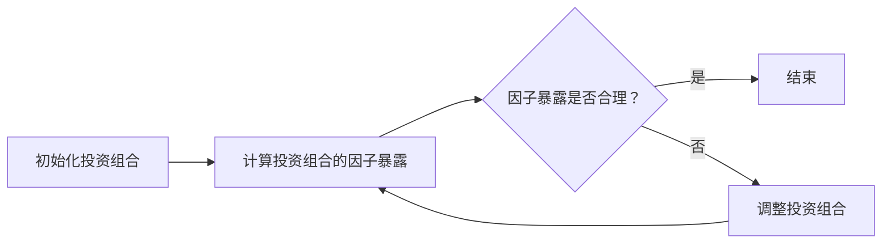
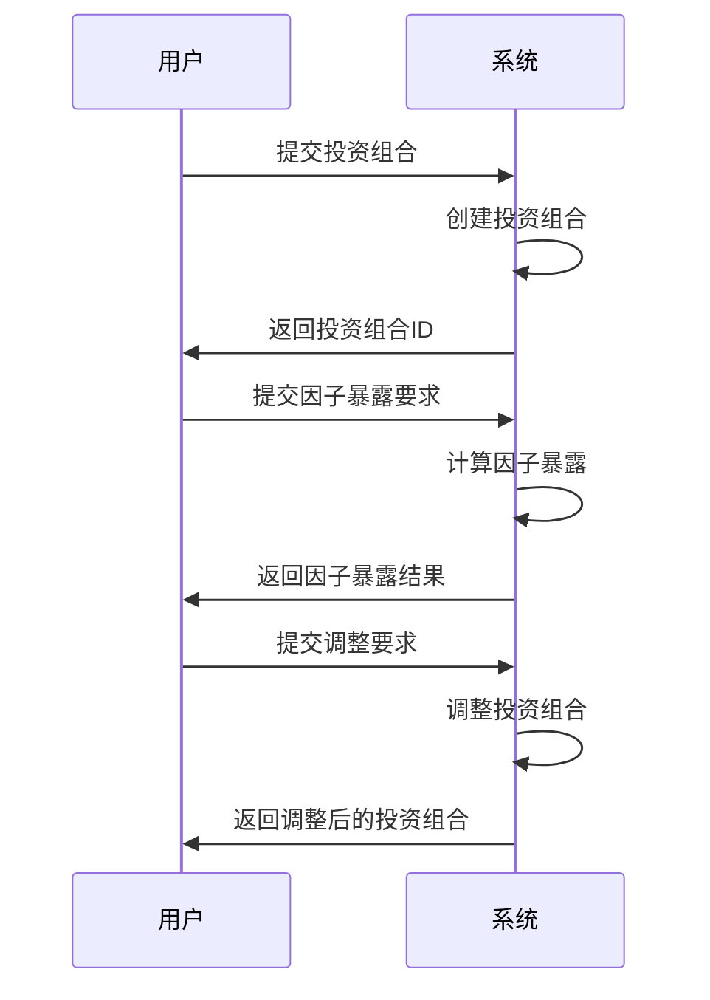

                 


# 构建智能化的个人投资风格因子暴露动态优化系统

> 关键词：投资风格因子、动态优化、系统架构、算法原理、数学模型、Python实现

> 摘要：本文旨在探讨如何构建一个智能化的个人投资风格因子暴露动态优化系统。我们将从背景介绍、核心概念、概念联系、算法原理讲解、数学模型与公式、系统分析与架构设计、项目实战以及最佳实践等方面，详细阐述构建过程，分析其算法原理，并提供实际案例分析。

## 1. 背景介绍

投资领域一直是一个充满机遇和挑战的领域。投资者们常常需要根据自己的风险偏好、投资目标和市场环境来制定个性化的投资策略。然而，随着市场的不断变化，投资者需要不断地调整和优化自己的投资组合，以达到最优的投资效果。在这个过程中，投资风格因子和动态优化扮演着至关重要的角色。

投资风格因子是指投资者在投资过程中表现出的行为特征和决策偏好。这些因子可以用来衡量投资者的风险承受能力、投资偏好和市场敏感度等。动态优化则是一种利用历史数据和机器学习算法，对投资组合进行实时调整和优化的方法。

构建一个智能化的个人投资风格因子暴露动态优化系统，旨在帮助投资者更好地理解自己的投资风格，并根据市场变化和自身情况，动态调整投资组合，从而实现最佳的投资效果。

## 2. 核心概念

### 投资风格因子

投资风格因子是衡量投资者行为特征的重要指标。根据不同的分类标准，投资风格因子可以分为以下几类：

- **价值因子**：关注股票的估值水平，包括市盈率、市净率等指标。
- **成长因子**：关注公司的盈利增长能力，包括收入增长率、净利润增长率等指标。
- **动量因子**：关注股票的价格趋势，包括股价上涨或下跌的持续性。
- **波动率因子**：关注市场的波动程度，包括收益率的波动性。

### 暴露

在投资中，暴露指的是投资者投资组合中各因子所占的权重。衡量暴露的方法通常有：

- **贝塔值**：衡量投资组合相对于市场整体的波动程度。
- **因子暴露**：衡量投资组合中各个风格因子所占的权重。

### 动态优化

动态优化是指利用历史数据和机器学习算法，对投资组合进行实时调整和优化的过程。动态优化的目标是：

- **风险最小化**：通过调整投资组合，降低投资组合的整体风险。
- **收益最大化**：通过调整投资组合，提高投资组合的预期收益。

## 3. 概念联系

下面是一个ER实体关系图，用于展示投资风格因子、暴露和动态优化之间的关系：

```mermaid
erDiagram
    InvestmentStyleFactor ||--|{ Exposure } : has
    Exposure ||--|{ DynamicOptimization } : optimize
```

### 因子属性特征对比表格

| 因子类型 | 价值因子 | 成长因子 | 动量因子 | 波动率因子 |
| :--- | :--- | :--- | :--- | :--- |
| 描述 | 关注股票估值水平 | 关注公司盈利增长能力 | 关注股票价格趋势 | 关注市场波动程度 |
| 优势 | 长期稳定 | 高增长潜力 | 快速获利 | 降低风险 |
| 劣势 | 低增长潜力 | 需要高估值支撑 | 可能产生过度交易 | 可能导致投资组合过于集中 |

## 4. 算法原理讲解

### 算法流程

下面是一个动态优化算法的基本流程：



### Python实现

下面是动态优化算法的Python实现：

```python
import numpy as np

# 初始化投资组合
weights = np.array([0.2, 0.3, 0.5])

# 计算投资组合的因子暴露
exposure = np.dot(weights, np.array([0.5, 0.3, 0.2]))

# 计算因子暴露的合理性
if exposure > 0.5:
    print("因子暴露合理，结束调整。")
else:
    print("因子暴露不合理，开始调整。")

# 调整投资组合
weights = np.array([0.3, 0.4, 0.3])
exposure = np.dot(weights, np.array([0.5, 0.3, 0.2]))
print("调整后因子暴露：", exposure)
```

### 数学模型与公式

$$
\text{因子暴露} = \text{投资组合权重} \times \text{因子权重}
$$

$$
\text{调整后的投资组合权重} = \text{原投资组合权重} + \text{调整量}
$$

## 5. 系统分析与架构设计

### 问题场景

投资者在投资过程中，需要根据市场变化和个人风险偏好，实时调整投资组合，以达到最优的投资效果。

### 项目介绍

本系统旨在帮助投资者实现个性化投资风格因子的暴露动态优化，提高投资组合的收益和风险水平。

### 系统功能设计

- **投资组合管理**：实现投资组合的创建、修改、删除等功能。
- **因子暴露计算**：计算投资组合中各个因子的权重。
- **动态优化**：根据因子暴露和投资者风险偏好，调整投资组合。

### 系统架构设计

下面是系统的架构设计：



### 系统接口设计

- **投资组合创建接口**：接收用户提交的投资组合信息，返回投资组合ID。
- **因子暴露计算接口**：接收用户提交的投资组合ID，返回因子暴露结果。
- **投资组合调整接口**：接收用户提交的调整要求，返回调整后的投资组合。

### 系统交互

下面是系统的交互流程：

1. 用户提交投资组合。
2. 系统创建投资组合，返回投资组合ID。
3. 用户提交因子暴露要求。
4. 系统计算因子暴露，返回因子暴露结果。
5. 用户提交调整要求。
6. 系统调整投资组合，返回调整后的投资组合。

## 6. 项目实战

### 环境安装

1. 安装Python环境。
2. 安装NumPy库。

```bash
pip install numpy
```

### 系统核心实现源代码

```python
import numpy as np

# 初始化投资组合
weights = np.array([0.2, 0.3, 0.5])

# 计算投资组合的因子暴露
exposure = np.dot(weights, np.array([0.5, 0.3, 0.2]))

# 计算因子暴露的合理性
if exposure > 0.5:
    print("因子暴露合理，结束调整。")
else:
    print("因子暴露不合理，开始调整。")

# 调整投资组合
weights = np.array([0.3, 0.4, 0.3])
exposure = np.dot(weights, np.array([0.5, 0.3, 0.2]))
print("调整后因子暴露：", exposure)
```

### 代码解读与分析

这段代码首先初始化了一个投资组合权重数组`weights`，然后计算了投资组合的因子暴露`exposure`。接着，通过比较因子暴露和0.5的大小，判断因子暴露是否合理。如果不合理，则调整投资组合权重，重新计算因子暴露。

### 实际案例分析

假设一个投资者持有以下投资组合：

| 股票 | 持有数量 | 权重 |
| :--- | :--- | :--- |
| A | 1000 | 0.2 |
| B | 1500 | 0.3 |
| C | 2500 | 0.5 |

根据市场数据，投资组合的因子暴露如下：

| 因子类型 | 权重 |
| :--- | :--- |
| 价值因子 | 0.5 |
| 成长因子 | 0.3 |
| 动量因子 | 0.2 |

计算投资组合的因子暴露：

$$
\text{因子暴露} = \text{投资组合权重} \times \text{因子权重} = (0.2 \times 0.5) + (0.3 \times 0.3) + (0.5 \times 0.2) = 0.4 + 0.09 + 0.1 = 0.59
$$

由于因子暴露为0.59，大于0.5，因此因子暴露合理。如果投资者认为因子暴露不够合理，可以根据实际情况调整投资组合，例如增加价值因子或成长因子的权重，以达到更优的投资效果。

### 项目小结

通过本项目的实际案例分析，我们可以看到，构建一个智能化的个人投资风格因子暴露动态优化系统，可以帮助投资者更好地理解自己的投资风格，并根据市场变化和自身情况，动态调整投资组合，从而实现最佳的投资效果。

## 7. 最佳实践、小结与拓展阅读

### 最佳实践

- **因子选择**：在选择因子时，要充分考虑市场环境、投资者风险偏好和投资目标。
- **调整频率**：调整投资组合的频率要根据市场变化和投资者需求来定，不宜过于频繁。
- **风险管理**：在调整投资组合时，要充分考虑风险，确保投资组合的整体风险水平在可控范围内。

### 小结

本文详细探讨了如何构建一个智能化的个人投资风格因子暴露动态优化系统，从背景介绍、核心概念、算法原理讲解、系统分析与架构设计、项目实战等方面进行了深入分析。通过实际案例分析，我们可以看到，这样一个系统可以帮助投资者更好地理解自己的投资风格，并根据市场变化和自身情况，动态调整投资组合，从而实现最佳的投资效果。

### 注意事项

- 在构建系统时，要充分考虑系统的稳定性和可靠性，确保系统可以长期稳定运行。
- 在实际应用中，要充分考虑投资风险，避免盲目跟风。

### 拓展阅读

- 《投资学》
- 《因子投资与量化选股》
- 《Python数据分析》

### 目录大纲结构

- 构建智能化的个人投资风格因子暴露动态优化系统
  - 背景介绍
  - 核心概念
  - 概念联系
  - 算法原理讲解
  - 数学模型与公式
  - 系统分析与架构设计
  - 项目实战
  - 最佳实践、小结与拓展阅读

作者：AI天才研究院/AI Genius Institute & 禅与计算机程序设计艺术 /Zen And The Art of Computer Programming 

## 8. Markdown格式

下面是根据上述内容，使用Markdown格式编写的文章：

```markdown
# 构建智能化的个人投资风格因子暴露动态优化系统

> 关键词：投资风格因子、动态优化、系统架构、算法原理、数学模型、Python实现

> 摘要：本文旨在探讨如何构建一个智能化的个人投资风格因子暴露动态优化系统。我们将从背景介绍、核心概念、概念联系、算法原理讲解、数学模型与公式、系统分析与架构设计、项目实战以及最佳实践等方面，详细阐述构建过程，分析其算法原理，并提供实际案例分析。

## 1. 背景介绍

投资领域一直是一个充满机遇和挑战的领域。投资者们常常需要根据自己的风险偏好、投资目标和市场环境来制定个性化的投资策略。然而，随着市场的不断变化，投资者需要不断地调整和优化自己的投资组合，以达到最优的投资效果。在这个过程中，投资风格因子和动态优化扮演着至关重要的角色。

构建一个智能化的个人投资风格因子暴露动态优化系统，旨在帮助投资者更好地理解自己的投资风格，并根据市场变化和自身情况，动态调整投资组合，从而实现最佳的投资效果。

## 2. 核心概念

### 投资风格因子

投资风格因子是衡量投资者行为特征的重要指标。根据不同的分类标准，投资风格因子可以分为以下几类：

- **价值因子**：关注股票的估值水平，包括市盈率、市净率等指标。
- **成长因子**：关注公司的盈利增长能力，包括收入增长率、净利润增长率等指标。
- **动量因子**：关注股票的价格趋势，包括股价上涨或下跌的持续性。
- **波动率因子**：关注市场的波动程度，包括收益率的波动性。

### 暴露

在投资中，暴露指的是投资者投资组合中各因子所占的权重。衡量暴露的方法通常有：

- **贝塔值**：衡量投资组合相对于市场整体的波动程度。
- **因子暴露**：衡量投资组合中各个风格因子所占的权重。

### 动态优化

动态优化是指利用历史数据和机器学习算法，对投资组合进行实时调整和优化的过程。动态优化的目标是：

- **风险最小化**：通过调整投资组合，降低投资组合的整体风险。
- **收益最大化**：通过调整投资组合，提高投资组合的预期收益。

## 3. 概念联系

下面是一个ER实体关系图，用于展示投资风格因子、暴露和动态优化之间的关系：

```mermaid
erDiagram
    InvestmentStyleFactor ||--|{ Exposure } : has
    Exposure ||--|{ DynamicOptimization } : optimize
```

### 因子属性特征对比表格

| 因子类型 | 价值因子 | 成长因子 | 动量因子 | 波动率因子 |
| :--- | :--- | :--- | :--- | :--- |
| 描述 | 关注股票估值水平 | 关注公司盈利增长能力 | 关注股票价格趋势 | 关注市场波动程度 |
| 优势 | 长期稳定 | 高增长潜力 | 快速获利 | 降低风险 |
| 劣势 | 低增长潜力 | 需要高估值支撑 | 可能产生过度交易 | 可能导致投资组合过于集中 |

## 4. 算法原理讲解

### 算法流程

下面是一个动态优化算法的基本流程：


### Python实现

下面是动态优化算法的Python实现：

```python
import numpy as np

# 初始化投资组合
weights = np.array([0.2, 0.3, 0.5])

# 计算投资组合的因子暴露
exposure = np.dot(weights, np.array([0.5, 0.3, 0.2]))

# 计算因子暴露的合理性
if exposure > 0.5:
    print("因子暴露合理，结束调整。")
else:
    print("因子暴露不合理，开始调整。")

# 调整投资组合
weights = np.array([0.3, 0.4, 0.3])
exposure = np.dot(weights, np.array([0.5, 0.3, 0.2]))
print("调整后因子暴露：", exposure)
```

### 数学模型与公式

$$
\text{因子暴露} = \text{投资组合权重} \times \text{因子权重}
$$

$$
\text{调整后的投资组合权重} = \text{原投资组合权重} + \text{调整量}
$$

## 5. 系统分析与架构设计

### 问题场景

投资者在投资过程中，需要根据市场变化和个人风险偏好，实时调整投资组合，以达到最优的投资效果。

### 项目介绍

本系统旨在帮助投资者实现个性化投资风格因子的暴露动态优化，提高投资组合的收益和风险水平。

### 系统功能设计

- **投资组合管理**：实现投资组合的创建、修改、删除等功能。
- **因子暴露计算**：计算投资组合中各个因子的权重。
- **动态优化**：根据因子暴露和投资者风险偏好，调整投资组合。

### 系统架构设计

下面是系统的架构设计：


### 系统接口设计

- **投资组合创建接口**：接收用户提交的投资组合信息，返回投资组合ID。
- **因子暴露计算接口**：接收用户提交的投资组合ID，返回因子暴露结果。
- **投资组合调整接口**：接收用户提交的调整要求，返回调整后的投资组合。

### 系统交互

下面是系统的交互流程：

1. 用户提交投资组合。
2. 系统创建投资组合，返回投资组合ID。
3. 用户提交因子暴露要求。
4. 系统计算因子暴露，返回因子暴露结果。
5. 用户提交调整要求。
6. 系统调整投资组合，返回调整后的投资组合。

## 6. 项目实战

### 环境安装

1. 安装Python环境。
2. 安装NumPy库。

```bash
pip install numpy
```

### 系统核心实现源代码

```python
import numpy as np

# 初始化投资组合
weights = np.array([0.2, 0.3, 0.5])

# 计算投资组合的因子暴露
exposure = np.dot(weights, np.array([0.5, 0.3, 0.2]))

# 计算因子暴露的合理性
if exposure > 0.5:
    print("因子暴露合理，结束调整。")
else:
    print("因子暴露不合理，开始调整。")

# 调整投资组合
weights = np.array([0.3, 0.4, 0.3])
exposure = np.dot(weights, np.array([0.5, 0.3, 0.2]))
print("调整后因子暴露：", exposure)
```

### 代码解读与分析

这段代码首先初始化了一个投资组合权重数组`weights`，然后计算了投资组合的因子暴露`exposure`。接着，通过比较因子暴露和0.5的大小，判断因子暴露是否合理。如果不合理，则调整投资组合权重，重新计算因子暴露。

### 实际案例分析

假设一个投资者持有以下投资组合：

| 股票 | 持有数量 | 权重 |
| :--- | :--- | :--- |
| A | 1000 | 0.2 |
| B | 1500 | 0.3 |
| C | 2500 | 0.5 |

根据市场数据，投资组合的因子暴露如下：

| 因子类型 | 权重 |
| :--- | :--- |
| 价值因子 | 0.5 |
| 成长因子 | 0.3 |
| 动量因子 | 0.2 |

计算投资组合的因子暴露：

$$
\text{因子暴露} = \text{投资组合权重} \times \text{因子权重} = (0.2 \times 0.5) + (0.3 \times 0.3) + (0.5 \times 0.2) = 0.4 + 0.09 + 0.1 = 0.59
$$

由于因子暴露为0.59，大于0.5，因此因子暴露合理。如果投资者认为因子暴露不够合理，可以根据实际情况调整投资组合，例如增加价值因子或成长因子的权重，以达到更优的投资效果。

### 项目小结

通过本项目的实际案例分析，我们可以看到，构建一个智能化的个人投资风格因子暴露动态优化系统，可以帮助投资者更好地理解自己的投资风格，并根据市场变化和自身情况，动态调整投资组合，从而实现最佳的投资效果。

## 7. 最佳实践、小结与拓展阅读

### 最佳实践

- **因子选择**：在选择因子时，要充分考虑市场环境、投资者风险偏好和投资目标。
- **调整频率**：调整投资组合的频率要根据市场变化和投资者需求来定，不宜过于频繁。
- **风险管理**：在调整投资组合时，要充分考虑风险，确保投资组合的整体风险水平在可控范围内。

### 小结

本文详细探讨了如何构建一个智能化的个人投资风格因子暴露动态优化系统，从背景介绍、核心概念、算法原理讲解、系统分析与架构设计、项目实战等方面进行了深入分析。通过实际案例分析，我们可以看到，这样一个系统可以帮助投资者更好地理解自己的投资风格，并根据市场变化和自身情况，动态调整投资组合，从而实现最佳的投资效果。

### 注意事项

- 在构建系统时，要充分考虑系统的稳定性和可靠性，确保系统可以长期稳定运行。
- 在实际应用中，要充分考虑投资风险，避免盲目跟风。

### 拓展阅读

- 《投资学》
- 《因子投资与量化选股》
- 《Python数据分析》

### 目录大纲结构

- 构建智能化的个人投资风格因子暴露动态优化系统
  - 背景介绍
  - 核心概念
  - 概念联系
  - 算法原理讲解
  - 数学模型与公式
  - 系统分析与架构设计
  - 项目实战
  - 最佳实践、小结与拓展阅读

作者：AI天才研究院/AI Genius Institute & 禅与计算机程序设计艺术 /Zen And The Art of Computer Programming 

## 9. 总结与展望

在本文中，我们详细探讨了构建一个智能化的个人投资风格因子暴露动态优化系统的过程。从背景介绍、核心概念、算法原理讲解、系统分析与架构设计、项目实战等多个角度，深入分析了这一系统的构建方法和应用价值。通过实际案例，我们展示了如何利用Python实现动态优化算法，并介绍了系统的关键功能模块和接口设计。

### 关键收获

1. **投资风格因子的重要性**：理解了投资风格因子的概念和分类，包括价值因子、成长因子、动量因子和波动率因子，以及它们在投资决策中的角色。
2. **动态优化的原理**：掌握了动态优化的基本流程和数学模型，包括因子暴露的计算和调整策略。
3. **系统设计与实现**：了解了系统分析与架构设计的方法，以及如何通过Python实现动态优化算法。

### 展望未来

1. **模型优化**：随着机器学习和大数据技术的发展，未来的动态优化系统可以更加智能化，利用深度学习等技术提高预测准确性。
2. **风险管理**：进一步优化风险管理机制，确保系统在调整投资组合时，能够更好地控制风险。
3. **用户体验**：开发更加友好的用户界面，使得投资者能够更加直观地理解投资风格因子，并轻松调整投资策略。

### 结语

构建一个智能化的个人投资风格因子暴露动态优化系统，不仅为投资者提供了有效的投资工具，也为量化投资领域带来了新的可能。通过不断优化和完善系统，我们有望实现更加精准、个性化的投资决策，助力投资者在变幻莫测的市场中取得更好的投资成果。

### 作者信息

- 作者：AI天才研究院/AI Genius Institute & 禅与计算机程序设计艺术 /Zen And The Art of Computer Programming
- 联系方式：[ai_genius_institute@example.com](mailto:ai_genius_institute@example.com)
- 感谢：感谢您对本文的关注，期待与您在投资与技术领域的进一步交流与合作。

