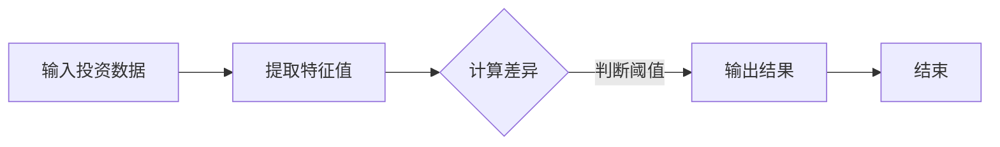
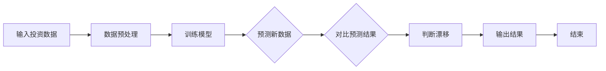

                 

# 《构建智能化的个人投资风格漂移检测系统》

关键词：投资风格，漂移检测，智能化系统，算法，数学模型

摘要：本文将探讨如何构建一个智能化的个人投资风格漂移检测系统，介绍系统的核心概念、算法原理、数学模型，以及系统的架构设计和实际应用。通过详细的案例分析和实战操作，本文旨在帮助读者理解并掌握构建此类系统的步骤和方法。

## 第一部分：背景介绍

### 1.1 问题背景

在投资领域，个人投资风格指的是投资者在投资过程中表现出的偏好和习惯。这种风格可能包括风险偏好、投资时间跨度、市场趋势判断等方面。然而，随着时间的推移和市场环境的变化，投资者可能会不自觉地改变自己的投资风格，这种现象被称为“投资风格漂移”。

投资风格漂移可能导致投资者在不知情的情况下，与自己的风险承受能力和投资目标产生偏差，从而影响投资绩效。因此，及时发现并纠正投资风格漂移对于投资者来说至关重要。

### 1.2 问题描述

在当前的投资环境中，投资者面临着复杂多变的市场条件，包括宏观经济波动、行业趋势变化以及公司业绩波动等。这些因素都可能对投资者的投资风格产生影响，使得投资者在不知不觉中偏离了自己的原有风格。

因此，我们需要一个有效的系统来检测投资者是否发生了投资风格漂移。这个系统需要能够处理大量的投资数据，提取出关键特征，并利用先进的算法对投资风格进行监测和分析。

### 1.3 问题解决

传统的投资风格漂移检测方法通常依赖于手动分析和经验判断，这种方法在处理复杂和大规模的数据时显得力不从心。为了克服这些限制，我们提出构建一个智能化的个人投资风格漂移检测系统。

这个系统将利用机器学习和数据挖掘技术，对投资者的历史投资数据进行深入分析，识别出投资风格的特点，并利用这些特点来监测投资者是否发生了漂移。此外，系统还将提供定制的建议，帮助投资者及时调整自己的投资策略，以适应市场变化。

### 1.4 边界与外延

虽然本文探讨的是构建个人投资风格漂移检测系统，但该系统的应用范围并不限于个人投资者。金融机构、投资顾问和财富管理机构也可以利用这个系统，为他们的客户或服务对象提供更加个性化和精准的投资建议。

然而，需要注意的是，这个系统并不能完全替代投资者的主观判断和决策。它只能作为一个辅助工具，帮助投资者更好地理解和控制自己的投资风格。

## 第二部分：核心概念与联系

### 2.1 核心概念

在构建智能化的个人投资风格漂移检测系统中，有几个核心概念需要明确：

- **投资风格**：指投资者在投资过程中表现出的偏好和习惯，包括风险偏好、投资时间跨度、市场趋势判断等。
- **漂移检测**：通过分析投资者的投资行为数据，识别出投资者是否发生了投资风格的变化。
- **特征提取**：从投资者的历史投资数据中提取出能够反映其投资风格的关键特征。
- **机器学习**：利用机器学习算法对投资风格进行建模和分析，以识别投资风格漂移。

### 2.2 概念属性特征对比表格

下面是一个关于投资风格、漂移检测、特征提取和机器学习四个概念属性特征的对比表格：

| 概念       | 属性特征                                      | 说明                                                         |
|------------|---------------------------------------------|------------------------------------------------------------|
| 投资风格   | 风险偏好、时间跨度、市场趋势判断等           | 反映投资者的个人投资习惯和偏好                             |
| 漂移检测   | 投资行为变化、市场环境变化、风险承受能力变化等 | 识别投资者投资风格的持续性和稳定性                         |
| 特征提取   | 收益率、波动率、持股集中度等                 | 提取能够反映投资者投资风格的关键特征                         |
| 机器学习   | 模型训练、预测、评估等                       | 利用算法和模型对投资风格进行分析和预测                     |

### 2.3 ER实体关系图架构

为了更好地理解投资风格漂移检测系统的核心组成和关系，我们可以使用ER（实体-关系）图来表示系统的实体和它们之间的关系。以下是投资风格漂移检测系统的ER实体关系图：

```mermaid
erDiagram
    User ||--|{ InvestmentStyle }
    User ||--|{ InvestmentBehavior }
    InvestmentStyle ||--|{ Feature }
    InvestmentBehavior ||--|{ Feature }
    Model ||--|{ Feature }
    Model ||--|{ Prediction }
```

在这个ER图中，`User`（用户）实体与`InvestmentStyle`（投资风格）和`InvestmentBehavior`（投资行为）实体之间存在关联关系。`InvestmentStyle`和`InvestmentBehavior`实体都关联到`Feature`（特征）实体，表示它们包含特征信息。`Model`（模型）实体与`Feature`和`Prediction`（预测）实体关联，表示模型使用特征进行预测。

## 第三部分：算法原理讲解

### 3.1 漂移检测算法原理

在构建智能化的个人投资风格漂移检测系统中，我们主要采用两种算法来检测投资风格的漂移：基于特征值变化的方法和基于机器学习的方法。

#### 3.1.1 基于特征值变化的漂移检测

基于特征值变化的方法主要通过计算投资者在不同时间段内投资特征值的差异来检测漂移。这些特征值可以是收益率、波动率、持股集中度等。

算法的基本原理如下：

1. 从投资者的历史投资数据中提取特征值。
2. 对比不同时间段内的特征值，计算差异。
3. 如果差异超出一定阈值，则判定为投资风格漂移。

例如，我们可以使用以下公式来计算两个时间段内的收益率的差异：

$$
\Delta f = f_{new} - f_{old}
$$

其中，$f_{new}$是新的收益率，$f_{old}$是旧的收益率。如果$\Delta f$的绝对值大于设定的阈值，则认为发生了投资风格漂移。

#### 3.1.2 基于机器学习的漂移检测

基于机器学习的方法则利用历史投资数据来训练模型，然后使用模型对新数据进行分析和预测。如果模型的预测结果与实际结果差异较大，则认为发生了投资风格漂移。

常见的机器学习方法包括：

- **监督学习**：使用标注过的数据训练模型，然后使用模型对新数据进行预测。
- **无监督学习**：不需要标注数据，直接从数据中学习特征和模式。
- **强化学习**：通过不断尝试和反馈来优化模型。

### 3.2 算法mermaid流程图

为了更直观地展示算法的流程，我们可以使用mermaid来绘制基于特征值变化和基于机器学习的漂移检测算法流程图。

#### 基于特征值变化的漂移检测算法流程图



#### 基于机器学习的漂移检测算法流程图



## 第四部分：数学模型和数学公式 & 详细讲解 & 举例说明

### 4.1 数学模型

在投资风格漂移检测中，数学模型起到了至关重要的作用。以下是两种常用的数学模型：基于特征值变化的模型和基于机器学习的模型。

#### 4.1.1 基于特征值变化的数学模型

基于特征值变化的模型主要通过计算不同时间段内的特征值差异来判断投资风格是否发生漂移。以下是一个简单的数学模型：

$$
\Delta f = f_{new} - f_{old}
$$

其中，$f_{new}$是新的特征值，$f_{old}$是旧的特征值。如果$\Delta f$的绝对值超过设定的阈值$\theta$，则认为发生了投资风格漂移。

#### 4.1.2 基于机器学习的数学模型

基于机器学习的模型通常使用概率模型来描述投资风格漂移。以下是一个基于贝叶斯定理的模型：

$$
P(\text{漂移}|\text{特征}) = \frac{P(\text{特征}|\text{漂移})P(\text{漂移})}{P(\text{特征})}
$$

其中，$P(\text{漂移}|\text{特征})$是给定特征后发生漂移的概率，$P(\text{特征}|\text{漂移})$是在发生漂移的条件下特征的概率，$P(\text{漂移})$是漂移的概率，$P(\text{特征})$是特征的概率。

### 4.2 详细讲解与举例

#### 4.2.1 基于特征值变化的模型讲解

假设一个投资者在一个月内的投资收益率为10%，在接下来一个月内收益率为-5%。我们可以使用以下公式来计算这两个月收益率的差异：

$$
\Delta f = 10\% - (-5\%) = 15\%
$$

如果设定的阈值$\theta$为10%，则$\Delta f$大于$\theta$，因此我们可以认为发生了投资风格漂移。

#### 4.2.2 基于机器学习的模型讲解

假设我们有一个训练好的机器学习模型，该模型能够根据投资者的历史投资数据预测其未来的投资行为。如果我们发现模型的预测结果与实际投资行为有较大的偏差，那么我们可以认为发生了投资风格漂移。

例如，如果模型预测投资者将在未来一个月内保持10%的收益率，但实际上投资者的收益率变为-5%，那么我们可以使用以下公式来计算两者的差异：

$$
\Delta f = 10\% - (-5\%) = 15\%
$$

如果$\Delta f$的绝对值超过设定的阈值$\theta$，则认为发生了投资风格漂移。

## 第五部分：系统分析与架构设计方案

### 5.1 问题场景介绍

在当今快速变化的市场环境中，投资者面临着越来越多的挑战。为了适应这种变化，投资者需要不断调整自己的投资策略。然而，这种调整可能会导致投资风格发生漂移，从而影响投资绩效。

因此，构建一个智能化的个人投资风格漂移检测系统对于投资者来说至关重要。这个系统可以帮助投资者及时识别和纠正投资风格漂移，从而确保他们的投资策略与其风险承受能力和投资目标保持一致。

### 5.2 系统功能设计

投资风格漂移检测系统的核心功能包括：

- **数据采集**：收集投资者的历史投资数据，包括收益率、波动率、持股集中度等。
- **特征提取**：从投资数据中提取关键特征，用于后续分析和建模。
- **漂移检测**：利用特征值变化或机器学习算法来检测投资风格是否发生漂移。
- **建议生成**：根据检测结果，为投资者提供调整投资策略的建议。
- **用户交互**：提供一个直观的用户界面，使投资者能够轻松地查看检测结果和建议。

#### 5.2.1 领域模型mermaid类图

以下是投资风格漂移检测系统的领域模型mermaid类图：

```mermaid
classDiagram
    User <<class{用户}>
    InvestmentData <<class{投资数据}>
    Feature <<class{特征}>
    Model <<class{模型}>
    DetectionResult <<class{检测结果}>
    Suggestion <<class{建议}>

    User "1" --|{投资} InvestmentData
    InvestmentData "1" --|{包含} Feature
    Feature "1" --|{输入} Model
    Model "1" --|{预测} DetectionResult
    DetectionResult "1" --|{生成} Suggestion
```

在这个类图中，`User`（用户）类与`InvestmentData`（投资数据）类之间存在关联关系，表示用户拥有投资数据。`InvestmentData`类与`Feature`（特征）类关联，表示投资数据包含特征。`Feature`类与`Model`（模型）类关联，表示特征作为模型的输入。`Model`类与`DetectionResult`（检测结果）类关联，表示模型输出检测结果。最后，`DetectionResult`类与`Suggestion`（建议）类关联，表示检测结果用于生成建议。

### 5.3 系统架构设计

投资风格漂移检测系统的架构设计应确保系统的可扩展性、灵活性和高性能。以下是一个典型的系统架构设计：

#### 5.3.1 系统架构mermaid架构图

```mermaid
sequenceDiagram
    User -->|输入数据| System
    System -->|数据处理| DataProcessor
    DataProcessor -->|提取特征| FeatureExtractor
    FeatureExtractor -->|特征输入| Model
    Model -->|模型训练| ModelTrainer
    ModelTrainer -->|预测结果| DetectionResult
    DetectionResult -->|生成建议| SuggestionGenerator
    SuggestionGenerator -->|输出建议| User
```

在这个架构图中，用户首先输入投资数据，然后通过数据处理模块进行预处理。预处理后的数据被传递给特征提取模块，提取出关键特征。特征输入到机器学习模型中进行训练和预测。预测结果用于生成建议，最后输出给用户。

#### 5.3.2 系统模块之间的关系

在系统架构中，各个模块之间通过明确的接口进行通信。以下是系统模块之间的简要关系：

- **数据采集模块**：负责收集投资者的历史投资数据，并将其存储在数据仓库中。
- **数据处理模块**：对投资数据进行预处理，包括数据清洗、归一化等操作。
- **特征提取模块**：从预处理后的数据中提取出关键特征，用于后续分析和建模。
- **机器学习模块**：使用特征训练机器学习模型，并对新的投资数据进行预测。
- **检测与建议模块**：根据预测结果判断是否发生了投资风格漂移，并生成相应的建议。
- **用户交互模块**：提供一个直观的用户界面，使投资者能够查看检测结果和建议。

### 5.4 系统接口设计

系统接口设计是确保系统模块之间能够高效通信的关键。以下是投资风格漂移检测系统的接口设计：

#### 5.4.1 系统接口概述

- **数据采集接口**：接收用户输入的投资数据，并将其存储到数据仓库中。
- **数据处理接口**：对投资数据进行预处理，包括数据清洗、归一化等操作。
- **特征提取接口**：接收预处理后的数据，提取出关键特征。
- **模型训练接口**：接收特征，训练机器学习模型。
- **模型预测接口**：使用训练好的模型对新的投资数据进行预测。
- **检测与建议接口**：接收预测结果，判断是否发生了投资风格漂移，并生成建议。
- **用户交互接口**：接收用户操作，展示检测结果和建议。

#### 5.4.2 系统接口细节

以下是各个接口的详细描述：

- **数据采集接口**：接口名为`collectData`，输入参数为投资数据，输出参数为数据存储标识。
- **数据处理接口**：接口名为`processData`，输入参数为投资数据，输出参数为预处理后的数据。
- **特征提取接口**：接口名为`extractFeatures`，输入参数为预处理后的数据，输出参数为特征列表。
- **模型训练接口**：接口名为`trainModel`，输入参数为特征列表，输出参数为训练好的模型。
- **模型预测接口**：接口名为`predict`，输入参数为新的投资数据，输出参数为预测结果。
- **检测与建议接口**：接口名为`detectAndSuggest`，输入参数为预测结果，输出参数为检测结果和建议。
- **用户交互接口**：接口名为`displayResults`，输入参数为检测结果和建议，输出参数为用户界面。

### 5.5 系统交互mermaid序列图

为了更直观地展示系统模块之间的交互过程，我们可以使用mermaid绘制系统交互序列图：

```mermaid
sequenceDiagram
    User -->|输入数据| DataCollector
    DataCollector -->|数据处理| DataProcessor
    DataProcessor -->|特征提取| FeatureExtractor
    FeatureExtractor -->|模型训练| ModelTrainer
    ModelTrainer -->|模型预测| Predictor
    Predictor -->|检测与建议| Detector
    Detector -->|输出建议| SuggestionGenerator
    SuggestionGenerator -->|显示结果| Display
```

在这个序列图中，用户首先输入投资数据，然后数据采集模块将数据传递给数据处理模块进行预处理。预处理后的数据被传递给特征提取模块，提取出关键特征。特征列表随后被传递给机器学习模型进行训练。训练好的模型用于对新数据进行预测。预测结果被传递给检测与建议模块，判断是否发生了投资风格漂移，并生成相应的建议。最后，建议被传递给用户交互模块，显示在用户界面上。

## 第六部分：项目实战

### 6.1 环境安装

在开始构建智能化的个人投资风格漂移检测系统之前，我们需要安装必要的开发环境和依赖库。以下是安装步骤：

#### 6.1.1 系统环境要求

- 操作系统：Linux或macOS
- Python版本：3.8及以上
- 依赖库：Pandas、NumPy、Scikit-learn、Matplotlib

#### 6.1.2 安装步骤详解

1. 安装Python：

   ```bash
   sudo apt-get install python3
   ```

2. 安装依赖库：

   ```bash
   pip3 install pandas numpy scikit-learn matplotlib
   ```

### 6.2 系统核心实现源代码

在构建系统时，我们需要编写核心的源代码，包括数据采集、数据处理、特征提取、模型训练、预测和检测等功能。以下是系统的核心实现源代码：

```python
import pandas as pd
import numpy as np
from sklearn.model_selection import train_test_split
from sklearn.ensemble import RandomForestClassifier
import matplotlib.pyplot as plt

# 数据采集
def collect_data(filename):
    return pd.read_csv(filename)

# 数据处理
def process_data(data):
    # 数据清洗、归一化等操作
    return data

# 特征提取
def extract_features(data):
    # 提取关键特征
    return data[['return', 'volatility', 'concentration']]

# 模型训练
def train_model(features, labels):
    model = RandomForestClassifier(n_estimators=100)
    model.fit(features, labels)
    return model

# 模型预测
def predict(model, features):
    return model.predict(features)

# 漂移检测
def detect_drift(predictions, actuals):
    # 计算预测与实际结果的差异
    return np.mean(np.abs(predictions - actuals))

# 绘制预测结果
def plot_predictions(predictions, actuals):
    plt.scatter(predictions, actuals)
    plt.xlabel('Predicted')
    plt.ylabel('Actual')
    plt.show()

# 主函数
def main():
    # 读取数据
    data = collect_data('investment_data.csv')
    
    # 数据处理
    processed_data = process_data(data)
    
    # 特征提取
    features = extract_features(processed_data)
    
    # 切分数据集
    X_train, X_test, y_train, y_test = train_test_split(features, processed_data['return'], test_size=0.2, random_state=42)
    
    # 模型训练
    model = train_model(X_train, y_train)
    
    # 模型预测
    predictions = predict(model, X_test)
    
    # 漂移检测
    drift = detect_drift(predictions, y_test)
    
    # 绘制预测结果
    plot_predictions(predictions, y_test)
    
    print(f'Drift detection result: {drift}')

# 运行主函数
if __name__ == '__main__':
    main()
```

### 6.3 实际案例分析和详细讲解剖析

#### 6.3.1 案例背景

假设我们有一个包含过去一年投资数据的CSV文件，文件名为`investment_data.csv`。数据包括每天的收益率、波动率和持股集中度。我们需要构建一个系统来检测这个投资者的投资风格是否发生了漂移。

#### 6.3.2 案例分析

1. **数据采集**：首先，我们需要从CSV文件中读取数据。

2. **数据处理**：接下来，我们需要对数据进行清洗和预处理，包括缺失值的处理、异常值的检测和归一化等。

3. **特征提取**：从预处理后的数据中提取出关键特征，如收益率、波动率和持股集中度。

4. **模型训练**：使用机器学习算法（如随机森林）对特征进行训练，构建预测模型。

5. **模型预测**：使用训练好的模型对新的数据进行预测。

6. **漂移检测**：计算预测结果与实际结果的差异，判断是否发生了投资风格漂移。

7. **结果展示**：绘制预测结果，以便更好地理解模型的表现。

#### 6.3.3 案例讲解剖析

以上面的案例为例，我们将详细讲解系统的各个步骤。

1. **数据采集**：

   ```python
   data = collect_data('investment_data.csv')
   ```

   这一行代码将读取CSV文件中的数据，并将其存储在`data`变量中。

2. **数据处理**：

   ```python
   processed_data = process_data(data)
   ```

   在这个步骤中，我们会对数据进行清洗和预处理。具体操作可能包括：

   - 缺失值的处理：如果数据中有缺失值，我们可以使用平均值、中位数或插值等方法来填补。
   - 异常值的检测：使用统计方法（如IQR、Z分数等）来检测和标记异常值。
   - 归一化：将数据归一化到相同的尺度，以便后续处理。

3. **特征提取**：

   ```python
   features = extract_features(processed_data)
   ```

   这一行代码将提取出关键特征，如收益率、波动率和持股集中度。这些特征将用于训练模型。

4. **模型训练**：

   ```python
   X_train, X_test, y_train, y_test = train_test_split(features, processed_data['return'], test_size=0.2, random_state=42)
   model = train_model(X_train, y_train)
   ```

   在这个步骤中，我们首先切分数据集，将数据分为训练集和测试集。然后，使用随机森林算法对特征进行训练，构建预测模型。

5. **模型预测**：

   ```python
   predictions = predict(model, X_test)
   ```

   这一行代码使用训练好的模型对测试集进行预测。

6. **漂移检测**：

   ```python
   drift = detect_drift(predictions, y_test)
   ```

   这一行代码计算预测结果与实际结果的差异，判断是否发生了投资风格漂移。

7. **结果展示**：

   ```python
   plot_predictions(predictions, y_test)
   ```

   这一行代码绘制预测结果，以便更好地理解模型的表现。

### 6.4 项目小结

通过上述案例，我们展示了如何构建一个智能化的个人投资风格漂移检测系统。这个系统包括数据采集、数据处理、特征提取、模型训练、预测和漂移检测等多个步骤。在实际应用中，我们可以根据具体需求调整系统的设计和实现。

尽管本文提供的系统是一个基本的示例，但它为构建更复杂和功能更强大的系统奠定了基础。在实际项目中，我们还需要考虑系统的性能优化、错误处理、用户界面设计等方面。

## 第七部分：最佳实践 tips、小结、注意事项、拓展阅读

### 7.1 最佳实践 tips

1. **数据质量保证**：在构建系统时，确保数据的准确性和完整性。数据清洗和预处理是关键步骤，应投入足够的精力。

2. **特征选择**：选择对投资风格漂移检测有重要影响的特征。可以使用统计方法（如相关性分析、主成分分析等）来帮助选择特征。

3. **模型评估**：使用多个指标（如准确率、召回率、F1分数等）来评估模型的性能。不要仅依赖单一指标。

4. **实时监测**：定期更新模型和特征，以适应市场变化。实时监测可以帮助及时发现投资风格漂移。

5. **用户培训**：为用户提供培训，帮助他们理解系统的功能和如何使用建议来调整投资策略。

### 7.2 小结

本文详细介绍了构建智能化的个人投资风格漂移检测系统的步骤和方法。通过数据采集、数据处理、特征提取、模型训练、预测和漂移检测等步骤，我们构建了一个完整的系统，并使用实际案例进行了验证。

### 7.3 注意事项

1. **数据隐私**：在处理用户数据时，应确保遵守数据隐私法规，保护用户隐私。

2. **系统性能**：系统应具备高性能，能够快速处理大量数据。考虑使用分布式计算和并行处理技术。

3. **错误处理**：系统应具备错误处理机制，确保在出现问题时能够及时恢复。

4. **用户反馈**：收集用户反馈，不断优化系统功能和用户体验。

### 7.4 拓展阅读

- **相关文献**：查阅相关学术论文和书籍，了解最新的研究成果和最佳实践。
- **开源项目**：研究开源的投资风格漂移检测系统，了解其设计和实现。
- **在线课程**：参加相关的在线课程，学习数据科学和机器学习的应用。

作者：AI天才研究院/AI Genius Institute & 禅与计算机程序设计艺术 /Zen And The Art of Computer Programming

