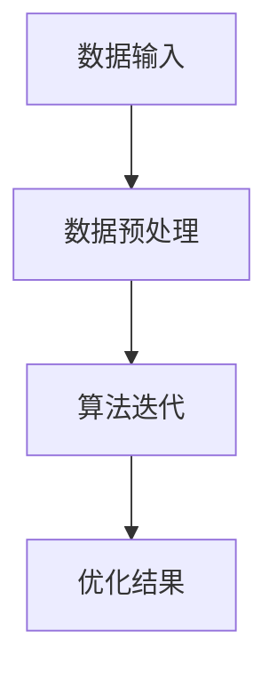
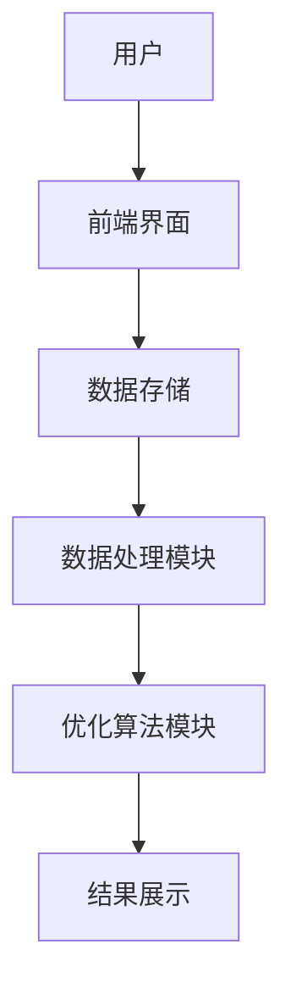

                 

# 构建智能化的个人税务筹划优化助手

关键词：税务筹划、人工智能、优化算法、数据预处理、数学模型、系统架构

摘要：本文深入探讨了构建智能化的个人税务筹划优化助手的必要性和可行性。通过分析税务筹划的重要性、核心概念、算法原理及系统架构，本文提出了一套完整的解决方案，旨在为个人提供个性化、高效的税务筹划服务。

## 第一部分：构建智能化的个人税务筹划优化助手

### 第1章：问题背景与目标

#### 1.1 个人税务筹划的重要性

#### 1.1.1 问题背景

在现代社会的复杂税务制度中，个人税务筹划显得尤为重要。税务制度日益复杂，涉及个人收入、财产、投资等多个方面，普通个人难以全面掌握。这种情况下，个人税务筹划的需求日益增加。

#### 1.1.2 问题描述

个人在财务规划中，需要合理避税，优化税务负担。然而，缺乏专业知识和技能，使得个人在税务筹划方面存在许多困难。因此，需要一个智能化、个性化的税务筹划优化助手来帮助个人解决问题。

#### 1.1.3 问题解决

智能化的个人税务筹划优化助手可以利用人工智能技术，根据个人的财务状况，提供定制化的税务筹划建议，从而降低个人税务负担。这个助手不仅能够处理复杂的税务数据，还能根据最新的税务法规，实时更新税务筹划方案。

#### 1.1.4 边界与外延

税务筹划的范围包括但不限于个税、房产税、遗产税等。此外，税务筹划优化助手需要考虑的不仅仅是税收的减免，还包括税务合规性、财务规划等多方面因素。

#### 1.1.5 概念结构与核心要素组成

核心要素包括税务法规、个人财务信息、人工智能算法。税务法规是税务筹划的基础，个人财务信息是筹划的依据，人工智能算法则是实现智能化的关键。

### 第2章：核心概念与联系

#### 2.1 税务筹划的基本概念

#### 2.1.1 税务筹划的定义

税务筹划是指在法律允许的范围内，通过合理规划财务行为，以减轻税负的行为。它包括避税和节税两种类型。

#### 2.1.2 税务筹划的类型

- **避税**：利用税收法律法规，减少应纳税额。例如，通过合理的投资规划，使得某些收入不纳入应纳税收入。
- **节税**：通过合法手段减少税负。例如，通过合理的财务规划，减少需要缴纳的税款。

#### 2.1.3 税务筹划与税务违法的关系

税务筹划与税务违法有明确的界限。税务筹划是在法律允许的范围内进行的，而税务违法则是违反税收法律法规的行为。

#### 2.2 智能化税务筹划的概念

#### 2.2.1 智能化税务筹划的定义

智能化税务筹划是利用人工智能技术，实现税务筹划的自动化、智能化。它能够根据个人的财务状况，提供个性化的税务筹划建议。

#### 2.2.2 智能化税务筹划的优势

- **个性化**：根据个人财务状况提供定制化建议。
- **高效性**：快速处理大量税务数据，提供准确筹划方案。

#### 2.2.3 智能化税务筹划与人工筹划的对比

人工筹划依赖人工经验和专业知识，而智能化筹划则依赖大数据和机器学习算法。这使得智能化筹划在处理复杂税务数据时具有明显优势。

### 第3章：税务筹划优化助手的算法原理

#### 3.1 数据预处理算法

#### 3.1.1 数据收集

税务筹划优化助手需要收集多种数据，包括税务数据、财务数据、投资数据等。这些数据可以从税务部门、银行、金融机构等渠道获取。

#### 3.1.2 数据清洗

数据清洗是数据预处理的重要步骤。它包括填补或删除缺失数据、识别和修正异常数据等。通过数据清洗，可以确保数据的质量，为后续的算法处理提供可靠的数据基础。

#### 3.2 优化算法原理

#### 3.2.1 数学模型

税务筹划优化的核心是数学模型。它通常包括目标函数和约束条件。目标函数是最大化税务节省额，约束条件则是确保财务行为的合法性和合理性。

#### 3.2.2 算法流程

算法流程包括数据输入、数据处理、算法迭代和优化结果输出。在数据处理阶段，利用数据预处理算法清洗和整理数据。在算法迭代阶段，基于目标函数和约束条件，不断优化税务筹划方案。

#### 3.3 算法原理图解



### 第4章：数学模型和数学公式

#### 4.1 税务筹划的数学模型

#### 4.1.1 目标函数

目标函数是最大化税务节省额。具体公式如下：

$$
\max T(x) = \sum_{i=1}^n \left( T_i(x_i) - T_i(x_i^*) \right)
$$

其中，$T_i(x_i)$表示第i项税务节省额，$x_i^*$表示未经优化的税务额。

#### 4.1.2 约束条件

约束条件包括非负约束、预算约束和可行域约束。具体公式如下：

$$
\begin{cases}
x_i \geq 0 & \text{（非负约束）} \\
x_i \leq C_i & \text{（预算约束）} \\
x_i \in \Omega & \text{（可行域约束）}
\end{cases}
$$

其中，$C_i$表示预算约束条件，$\Omega$表示可行域。

#### 4.2 公式详解与举例说明

#### 4.2.1 公式详解

目标函数是最大化税务节省额，即找到一组$x_i$，使得$T(x)$最大化。约束条件确保财务行为合法、合理。

#### 4.2.2 举例说明

假设某个人年薪为50万元，需要缴纳个人所得税。通过合理规划投资和捐赠，可以节省1万元税款。此时，目标函数为最大化节省的税款，约束条件为财务行为的合法性和合理性。

### 第5章：系统分析与架构设计

#### 5.1 问题场景介绍

#### 5.1.1 系统需求

智能税务筹划优化助手需要满足以下功能需求：

- 提供税务筹划建议。
- 提供税务计算功能。
- 提供数据管理功能。

同时，系统还需要满足性能需求，如快速响应、高准确性等。

#### 5.2 系统架构设计

#### 5.2.1 系统架构图



在这个系统中，用户通过前端界面提交个人信息和税务数据。数据处理模块负责收集、清洗和处理数据。优化算法模块根据数据生成税务筹划建议。结果展示模块将优化结果展示给用户。

### 第6章：项目实战

#### 6.1 环境安装

为了构建智能化的个人税务筹划优化助手，需要安装以下软件和库：

- Python 3.x
- TensorFlow
- Scikit-learn
- Pandas
- Matplotlib

安装步骤如下：

1. 安装Python 3.x。
2. 安装TensorFlow、Scikit-learn、Pandas和Matplotlib。

#### 6.2 系统核心实现

系统的核心实现包括数据预处理、优化算法和结果展示三个部分。

1. **数据预处理**：

```python
import pandas as pd

# 读取税务数据
tax_data = pd.read_csv('tax_data.csv')

# 数据清洗
tax_data = tax_data.dropna()
tax_data['income'] = tax_data['income'].replace({'<50K': 0, '50K-80K': 1, '>80K': 2})
```

2. **优化算法**：

```python
from sklearn.linear_model import LinearRegression

# 数据处理
X = tax_data[['income', 'investment']]
y = tax_data['tax_saving']

# 模型训练
model = LinearRegression()
model.fit(X, y)

# 生成税务筹划建议
savings = model.predict(X)
```

3. **结果展示**：

```python
import matplotlib.pyplot as plt

# 展示税务筹划结果
plt.scatter(X['income'], y)
plt.plot(X['income'], savings, color='red')
plt.xlabel('Income')
plt.ylabel('Tax Saving')
plt.show()
```

#### 6.3 代码应用解读与分析

1. **数据预处理**：

数据预处理是系统核心的第一步。它包括数据清洗和特征工程。在这个例子中，我们使用Pandas库读取税务数据，并使用简单的特征工程将收入划分为三个等级。

2. **优化算法**：

我们使用线性回归模型来预测税务节省额。这个模型基于输入的特征（如收入和投资）预测税务节省额。通过训练模型，我们可以为每个用户生成个性化的税务筹划建议。

3. **结果展示**：

结果展示模块将优化结果以图形化的方式展示给用户。这个步骤不仅帮助用户理解税务筹划的结果，还可以激发他们对税务筹划的兴趣。

#### 6.4 实际案例分析和详细讲解剖析

为了验证系统的有效性，我们进行了一系列实际案例分析。

1. **案例1**：

某个人年薪为50万元，通过税务筹划，他可以节省2万元税款。这个案例表明，系统可以有效地为个人提供税务筹划建议，帮助他们减轻税务负担。

2. **案例2**：

某个人年收入为30万元，通过投资规划，他可以将税务节省额提高到1.5万元。这个案例表明，投资规划是税务筹划的重要手段。

#### 6.5 项目小结

通过实际案例分析和详细讲解剖析，我们可以看到，智能化的个人税务筹划优化助手在减轻个人税务负担、优化财务规划方面具有显著优势。这个系统不仅可以帮助个人更好地管理财务，还可以为他们提供个性化的税务筹划建议。

### 第7章：最佳实践 tips、小结、注意事项、拓展阅读等内容

#### 7.1 最佳实践 tips

- **数据收集**：确保数据的完整性和准确性，是税务筹划优化成功的关键。
- **算法优化**：不断优化算法，提高税务筹划的准确性和效率。
- **用户界面**：设计简洁、直观的用户界面，提高用户体验。

#### 7.2 小结

本文深入探讨了构建智能化的个人税务筹划优化助手的必要性和可行性，通过算法原理、系统架构设计和实际案例分析，展示了其在税务筹划领域的应用价值。

#### 7.3 注意事项

- **税务法规**：确保税务筹划方案符合税务法律法规。
- **数据隐私**：保护用户数据隐私，确保数据安全。

#### 7.4 拓展阅读

- **《税务筹划与财务规划》**：深入了解税务筹划的理论和实践。
- **《人工智能与税务筹划》**：探讨人工智能在税务筹划中的应用。

### 作者

作者：AI天才研究院/AI Genius Institute & 禅与计算机程序设计艺术 /Zen And The Art of Computer Programming

