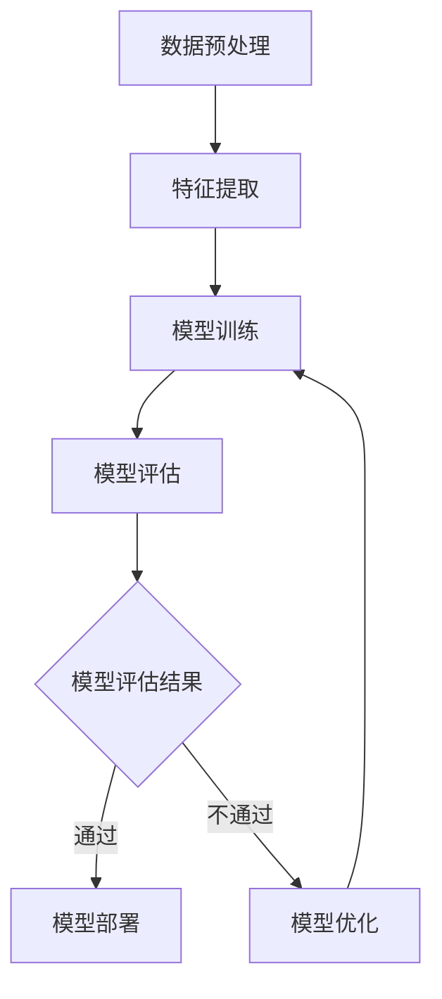

                 

# 引言

构建智能化的个人税务筹划助手系统是一个旨在为个人用户提供高效、准确、便捷的税务管理解决方案的技术项目。随着全球经济环境的不断变化，税收政策的日益复杂化，个人税务筹划的重要性愈发凸显。传统的税务筹划方法往往依赖于人工经验和繁杂的计算，不仅效率低下，而且容易出错。因此，开发一个智能化、自动化的税务筹划助手系统显得尤为必要。

本文旨在通过逐步分析、推理和思考，详细探讨构建个人税务筹划助手系统的全过程。首先，我们将明确系统建设的背景和核心问题，然后深入探讨系统的核心概念与联系，接着讲解系统的算法原理，最后结合具体的系统分析与架构设计，进行项目实战和最佳实践分享。通过这样的逻辑结构和详细阐述，我们希望读者能够全面了解构建智能税务筹划助手系统的思路和方法，为后续的实际开发提供有益的参考。

## 核心关键词

- 智能化税务筹划
- 个人税务筹划助手系统
- 算法原理
- 数学模型
- 系统架构设计
- 项目实战

## 摘要

本文围绕构建智能化的个人税务筹划助手系统展开，首先介绍了系统建设的背景和重要性。接着，本文详细探讨了系统的核心概念和联系，包括智能化税务筹划的基本原理、个人税务筹划与人工智能的融合，以及系统的关键组成部分。随后，通过算法原理讲解，我们深入分析了系统使用的算法、数学模型和公式，并通过Python代码实现和示例进行通俗易懂的阐述。最后，本文结合具体的系统分析与架构设计，进行项目实战和最佳实践分享，为智能税务筹划系统的开发提供了全面的指导和思路。

## 第一步：问题背景

### 1.1.1 税务筹划的重要性

税务筹划作为财务管理的一个重要环节，对于个人和家庭而言具有至关重要的意义。有效的税务筹划不仅能减轻税负，提高个人财务收益，还能实现合法避税，保障个人财务安全。在全球化经济背景下，税收政策日益复杂多变，如何合理利用税收优惠政策和法规漏洞，成为每个纳税人必须面对的挑战。

### 1.1.2 当前税务筹划存在的问题

尽管税务筹划的重要性被广泛认可，但当前的个人税务筹划仍然存在诸多问题。首先，税务知识门槛较高，大多数个人缺乏专业的税务知识，难以进行有效的税务规划。其次，传统的税务筹划方法通常依赖于人工经验和手工计算，效率低下且容易出错。此外，现行税收政策复杂多样，个人难以全面掌握和灵活应用，导致税务筹划的效果不尽如人意。

### 1.1.3 智能化税务筹划的发展趋势

面对上述问题，智能化税务筹划逐渐成为解决之道。随着人工智能技术的发展，尤其是机器学习和大数据分析等技术的应用，智能化税务筹划系统具备了高效处理大量数据、提供个性化建议和自动执行税务操作的能力。智能化税务筹划不仅能够简化税务操作流程，降低人工错误率，还能利用数据分析和预测模型，帮助个人更好地规划和优化财务状况。

### 1.2.1 个人税务筹划的需求分析

个人税务筹划的需求主要源于以下几个方面：

1. **简化税务申报**：系统应提供简便的税务申报流程，帮助用户快速准确地完成税务申报。
2. **个性化建议**：系统应根据用户的具体情况和税收政策，提供个性化的税务筹划建议。
3. **税后收益最大化**：系统需要帮助用户优化财务结构，实现税后收益的最大化。
4. **合规性检查**：系统应确保所有操作符合税收法规，避免税务风险。
5. **实时数据更新**：系统应实时跟踪最新的税收政策和法规变化，为用户提供最新的税务信息。

### 1.2.2 智能化税务筹划的可行性分析

智能化税务筹划的可行性分析主要涉及技术可行性、经济可行性和操作可行性。

1. **技术可行性**：人工智能技术在数据处理、模式识别和预测分析方面已经取得显著成果，这些技术为智能化税务筹划提供了坚实的基础。
2. **经济可行性**：随着云计算、大数据和人工智能等技术的普及，开发智能化税务筹划系统的成本逐渐降低，投资回报周期有望缩短。
3. **操作可行性**：智能化税务筹划系统可以通过互联网平台或移动应用提供服务，用户操作简便，易于接受和推广。

### 1.2.3 个人税务筹划助手系统的目标与功能

个人税务筹划助手系统的目标是为个人用户提供高效、准确、便捷的税务管理解决方案。具体功能包括：

1. **税务信息采集与管理**：自动采集用户税务信息，实现税务数据的集中管理和分析。
2. **税务政策解读与推送**：实时跟踪税收政策变化，为用户提供最新的税务法规和政策解读。
3. **个性化税务筹划建议**：根据用户情况和税收政策，提供个性化的税务筹划方案和建议。
4. **税务申报辅助**：提供税务申报工具，简化申报流程，确保申报的准确性和合规性。
5. **财务状况分析**：帮助用户分析税后财务状况，提供财务优化的建议。

### 1.3.1 个人税务筹划的范围

个人税务筹划的范围主要包括以下几个方面：

1. **收入税**：包括个人所得税、企业所得税等。
2. **财产税**：包括房产税、遗产税、赠与税等。
3. **消费税**：包括消费税、关税等。
4. **社会保障税**：包括养老保险、医疗保险等。
5. **其他税费**：包括车辆购置税、印花税等。

### 1.3.2 智能化税务筹划的技术要求

智能化税务筹划系统需要满足以下技术要求：

1. **数据处理能力**：系统能够高效处理大规模的税务数据，包括采集、存储、分析和预测。
2. **算法优化**：采用先进的机器学习和数据分析算法，提高税务筹划的准确性和效率。
3. **用户交互**：提供友好便捷的用户界面，确保用户能够轻松操作和使用系统。
4. **安全合规**：确保系统操作符合税收法规和隐私保护要求，避免税务风险和隐私泄露。
5. **扩展性**：系统能够适应未来的技术发展和政策变化，保持长期的可维护性和可扩展性。

### 1.3.3 个人税务筹划助手系统的适用对象

个人税务筹划助手系统适用于以下对象：

1. **个人纳税人**：包括个人所得税纳税人、企业主等。
2. **财务顾问**：提供税务筹划咨询服务，辅助客户进行税务规划。
3. **企业财务部门**：为企业提供税务筹划和管理服务。
4. **税务机构**：为税务机构提供数据分析和风险评估工具。

### 1.4.1 智能化税务筹划的核心概念

智能化税务筹划的核心概念包括：

1. **大数据分析**：通过大数据技术收集、存储和分析税务数据，发现潜在税务优化机会。
2. **机器学习**：利用机器学习算法从历史税务数据中学习规律，为用户提供个性化的税务建议。
3. **税务预测**：基于历史数据和机器学习模型，预测未来的税务变化趋势，为用户制定前瞻性税务筹划方案。
4. **税务合规性检查**：确保所有税务操作符合相关法规和政策，避免税务风险。

### 1.4.2 个人税务筹划与人工智能的联系

个人税务筹划与人工智能之间存在紧密联系。人工智能技术为税务筹划提供了以下支持：

1. **数据处理**：利用人工智能技术高效处理和分析大量税务数据，提高税务筹划的准确性和效率。
2. **模式识别**：通过机器学习算法识别税务数据中的模式和趋势，为用户发现潜在的税务优化机会。
3. **个性化建议**：根据用户的具体情况和需求，提供个性化的税务筹划建议，提高税务筹划的针对性。
4. **自动化操作**：利用人工智能技术自动化执行税务操作，降低人工操作的成本和错误率。

### 1.4.3 个人税务筹划助手系统的关键组成部分

个人税务筹划助手系统的关键组成部分包括：

1. **数据采集与处理模块**：负责收集、存储和处理用户税务数据。
2. **算法与模型模块**：包含用于税务筹划的机器学习算法和预测模型。
3. **用户交互模块**：提供用户界面，实现用户与系统的交互。
4. **税务合规性检查模块**：确保所有操作符合税务法规和政策要求。
5. **税务申报模块**：提供税务申报工具，简化税务申报流程。

## 本章小结

本章首先介绍了个人税务筹划的重要性以及当前存在的问题，随后探讨了智能化税务筹划的发展趋势和可行性。接着，我们分析了个人税务筹划的需求，明确了智能化税务筹划助手系统的目标和功能。此外，本章还详细阐述了个人税务筹划的范围、技术要求和适用对象，并介绍了系统的核心概念和组成部分。通过这些分析，我们为后续的详细讲解奠定了坚实的基础。

## 核心概念与联系

### 2.1 智能化税务筹划原理

#### 2.1.1 智能化税务筹划的基本原理

智能化税务筹划基于人工智能技术和大数据分析，其核心思想是通过数据挖掘和机器学习算法，从海量税务数据中提取有价值的信息，为用户提供个性化的税务筹划方案。具体来说，智能化税务筹划主要包括以下几个步骤：

1. **数据采集**：收集用户的税务信息，包括收入、支出、财产、投资等数据。
2. **数据处理**：对采集到的税务数据进行清洗、归一化处理，确保数据的质量和一致性。
3. **数据挖掘**：利用数据挖掘技术，从处理后的数据中提取潜在的税务优化机会。
4. **模式识别**：通过机器学习算法，识别税务数据中的模式和趋势，为用户发现潜在的税务优化机会。
5. **税务预测**：利用历史数据和机器学习模型，预测未来的税务变化趋势，为用户制定前瞻性税务筹划方案。
6. **个性化建议**：根据用户的具体情况和预测结果，提供个性化的税务筹划建议。
7. **税务操作**：根据用户选择和系统建议，自动化执行税务操作，如税务申报、税收优惠申请等。

#### 2.1.2 智能化税务筹划的技术路径

实现智能化税务筹划的技术路径主要包括以下几方面：

1. **大数据技术**：用于采集、存储和管理大规模税务数据，包括数据仓库、数据湖和云计算技术。
2. **机器学习技术**：用于数据挖掘、模式识别和预测分析，常见的机器学习算法有线性回归、决策树、支持向量机、神经网络等。
3. **自然语言处理技术**：用于处理和解析税务政策文件、用户需求等非结构化数据。
4. **人工智能技术**：包括计算机视觉、语音识别等，用于提升用户交互体验。
5. **区块链技术**：用于确保税务数据的透明性和不可篡改性，增强税务操作的可信度。

#### 2.1.3 智能化税务筹划的关键技术

智能化税务筹划的关键技术包括：

1. **数据挖掘技术**：用于从大量税务数据中提取有价值的信息，如潜在的客户群体、税务优化机会等。
2. **机器学习技术**：用于建立预测模型，预测未来的税务变化趋势，为用户制定个性化的税务筹划方案。
3. **税务合规性检查技术**：用于确保税务操作符合相关法规和政策要求，避免税务风险。
4. **税务申报自动化技术**：用于简化税务申报流程，提高申报的准确性和效率。
5. **用户交互技术**：用于提升用户使用体验，包括界面设计、自然语言处理、语音识别等。

### 2.2 个人税务筹划与人工智能

#### 2.2.1 人工智能在税务筹划中的应用

人工智能在税务筹划中的应用主要体现在以下几个方面：

1. **税务信息自动采集**：利用计算机视觉和OCR（光学字符识别）技术，自动识别和提取税务文件中的关键信息。
2. **税务数据分析**：利用数据挖掘和机器学习技术，分析大量税务数据，发现潜在的税务优化机会。
3. **个性化税务建议**：根据用户的财务状况和需求，利用机器学习模型，提供个性化的税务筹划建议。
4. **税务合规性检查**：利用规则引擎和机器学习技术，自动检测和纠正税务操作中的合规性问题。
5. **税务申报自动化**：利用自然语言处理和自动化流程技术，简化税务申报流程，提高申报的效率和准确性。

#### 2.2.2 人工智能技术的选择与评估

选择合适的人工智能技术是构建智能化税务筹划系统的关键。以下是对几种常见人工智能技术的选择和评估：

1. **机器学习算法**：常见的机器学习算法有线性回归、决策树、支持向量机、神经网络等。选择合适的算法需要考虑数据的特征、问题的复杂度以及模型的性能指标。
2. **自然语言处理技术**：用于处理和解析税务政策文件、用户需求等非结构化数据。常见的NLP技术包括文本分类、情感分析、命名实体识别等。
3. **计算机视觉技术**：用于自动识别和提取税务文件中的关键信息。常见的计算机视觉技术包括图像识别、目标检测、图像分割等。
4. **区块链技术**：用于确保税务数据的透明性和不可篡改性，增强税务操作的可信度。评估区块链技术时需要考虑数据规模、计算性能和安全性等因素。
5. **云计算技术**：用于处理大规模的税务数据，提供弹性计算和存储资源。评估云计算技术时需要考虑成本、性能和安全性等因素。

#### 2.2.3 人工智能在税务筹划中的挑战与机遇

人工智能在税务筹划中既面临挑战，也充满机遇：

1. **挑战**：
   - **数据隐私和安全**：税务数据涉及个人隐私，如何在保护用户隐私的前提下，充分利用数据进行税务筹划是一个重要挑战。
   - **算法透明性和解释性**：机器学习模型的黑箱特性使得结果难以解释，如何提高算法的透明性和解释性是亟待解决的问题。
   - **法规和政策合规**：确保系统的操作符合相关法规和政策要求，避免法律风险。

2. **机遇**：
   - **提高效率**：通过自动化处理税务数据，大幅提高税务筹划的效率和准确性。
   - **个性化服务**：利用人工智能技术，为用户提供更加个性化和精准的税务筹划建议。
   - **合规性保障**：通过智能合规性检查，确保所有税务操作符合法规和政策要求。

### 2.3 个人税务筹划助手系统的关键组成部分

个人税务筹划助手系统的关键组成部分包括：

1. **数据采集与处理模块**：负责收集、存储和处理用户税务数据，确保数据的质量和一致性。
2. **算法与模型模块**：包含用于税务筹划的机器学习算法和预测模型，负责数据分析和提供税务建议。
3. **用户交互模块**：提供用户界面，实现用户与系统的交互，包括税务信息输入、税务建议接收和税务操作等。
4. **税务合规性检查模块**：确保所有税务操作符合相关法规和政策要求，提供合规性保障。
5. **税务申报模块**：提供税务申报工具，简化税务申报流程，提高申报的效率和准确性。

### 2.4 核心概念属性特征对比表格

为了更直观地理解个人税务筹划助手系统的核心概念，我们设计了一张属性特征对比表格：

| 核心概念         | 属性特征                               | 说明                                                         |
|-----------------|--------------------------------------|------------------------------------------------------------|
| 大数据技术       | 数据规模大、速度快、多样性、价值密度低  | 处理大规模税务数据，提高数据分析效率                           |
| 机器学习技术     | 自动化、高效、准确、解释性弱           | 建立预测模型，提供个性化税务建议                               |
| 自然语言处理技术 | 文本分类、情感分析、命名实体识别         | 处理和解析税务政策文件、用户需求等非结构化数据                   |
| 计算机视觉技术   | 图像识别、目标检测、图像分割           | 自动识别和提取税务文件中的关键信息                             |
| 区块链技术       | 透明性、不可篡改性、去中心化           | 确保税务数据的透明性和不可篡改性，增强税务操作的可信度           |
| 云计算技术       | 弹性计算、高可用性、低成本             | 提供处理大规模税务数据所需的计算资源和存储空间                   |

### 2.5 ER实体关系图架构

为了更好地理解个人税务筹划助手系统的数据模型和实体关系，我们使用Mermaid绘制了一个ER图：

```mermaid
erDiagram
  User ||--|{ TaxInfo }|-- TaxInfoDetail
  TaxInfo ||--|{ TaxPolicy }|-- TaxPolicyDetail
  TaxInfo ||--|{ TaxPayment }|-- TaxPaymentDetail
  User ||--|{ TaxPlanningAdvice }|-- TaxPlanningAdviceDetail
  TaxPolicy ||--|{ TaxRule }|-- TaxRuleDetail
```

**ER图解释与说明**：

- **User**（用户）：代表个人税务筹划系统的用户，每个用户有唯一的ID。
- **TaxInfo**（税务信息）：与用户实体关联，存储用户的税务信息。
- **TaxInfoDetail**（税务信息详情）：包含用户的具体税务信息，如收入、支出等。
- **TaxPolicy**（税务政策）：存储当前的税务政策信息。
- **TaxPolicyDetail**（税务政策详情）：包含具体的税务政策细节。
- **TaxPayment**（税务支付）：记录用户的税务支付信息。
- **TaxPaymentDetail**（税务支付详情）：包含税务支付的详细信息。
- **TaxPlanningAdvice**（税务筹划建议）：存储系统提供的税务筹划建议。
- **TaxPlanningAdviceDetail**（税务筹划建议详情）：包含具体的税务筹划建议内容。
- **TaxRule**（税务规则）：存储税务规则信息。
- **TaxRuleDetail**（税务规则详情）：包含具体的税务规则细节。

**ER图在实际系统设计中的应用**：

- **数据存储设计**：ER图用于指导系统的数据存储设计，确定数据库的表结构和关系。
- **数据操作设计**：ER图用于设计数据操作流程，确保数据的一致性和完整性。
- **数据查询设计**：ER图用于设计数据查询语句，优化查询效率和性能。

### 2.6 本章小结

本章详细介绍了智能化税务筹划的基本原理、个人税务筹划与人工智能的融合，以及个人税务筹划助手系统的关键组成部分。通过对比表格和ER图，我们直观地展示了核心概念的属性特征和数据关系。本章的内容为后续的系统算法原理讲解和系统分析与架构设计奠定了坚实的基础。

## 第三步：算法原理讲解

### 3.1 算法原理概述

#### 3.1.1 个人税务筹划助手系统的算法框架

个人税务筹划助手系统的算法框架主要包括以下几个部分：

1. **数据预处理算法**：用于清洗、归一化和处理税务数据，确保数据的质量和一致性。
2. **特征提取算法**：从预处理后的数据中提取有用的特征，为后续的机器学习模型提供输入。
3. **分类与预测算法**：基于提取的特征，使用分类和预测算法建立税务筹划模型，为用户生成个性化的税务建议。
4. **优化算法**：用于优化税务筹划方案，提高税务收益最大化。
5. **合规性检查算法**：确保所有税务操作符合法规和政策要求，避免税务风险。

#### 3.1.2 算法选择与优化

算法的选择与优化是构建个人税务筹划助手系统的关键。以下是一些常用的算法及其选择依据：

1. **线性回归**：用于预测用户的税务支出和收益，适用于简单线性关系的预测问题。
2. **决策树**：适用于分类问题，通过树形结构对税务数据进行划分，生成分类规则。
3. **支持向量机**（SVM）：用于分类和回归问题，通过寻找最优分隔超平面实现数据的分类。
4. **神经网络**：适用于复杂非线性关系的问题，通过多层神经网络实现数据的自动特征提取和分类。
5. **遗传算法**：用于优化税务筹划方案，通过模拟生物进化过程实现全局优化。

#### 3.1.3 算法在系统中的集成与应用

在个人税务筹划助手系统中，算法的集成与应用是一个复杂的过程。以下是一些关键步骤：

1. **数据集成**：将各类税务数据集成到一个统一的数据平台，确保数据的完整性和一致性。
2. **特征工程**：根据算法的需求，对税务数据进行分析和处理，提取有用的特征。
3. **算法训练**：使用历史税务数据训练机器学习模型，优化模型参数。
4. **模型评估**：通过交叉验证和测试数据评估模型的性能，确保模型的准确性和鲁棒性。
5. **模型部署**：将训练好的模型部署到生产环境中，实现实时税务筹划和预测。

### 3.2 数学模型与公式讲解

#### 3.2.1 个人税务筹划的数学模型

个人税务筹划的数学模型主要包括以下几个部分：

1. **收入模型**：用于预测用户的未来收入，常用模型有线性回归、时间序列分析等。
   $$ \text{收入} = \beta_0 + \beta_1 \times \text{时间} + \epsilon $$
   其中，$\beta_0$和$\beta_1$是模型参数，$\epsilon$是随机误差。

2. **支出模型**：用于预测用户的未来支出，常用模型有线性回归、多项式回归等。
   $$ \text{支出} = \alpha_0 + \alpha_1 \times \text{收入} + \epsilon $$
   其中，$\alpha_0$和$\alpha_1$是模型参数，$\epsilon$是随机误差。

3. **税务负担模型**：用于计算用户的税务负担，常用模型有线性模型、逻辑回归等。
   $$ \text{税务负担} = \gamma_0 + \gamma_1 \times \text{收入} + \gamma_2 \times \text{支出} + \epsilon $$
   其中，$\gamma_0$、$\gamma_1$和$\gamma_2$是模型参数，$\epsilon$是随机误差。

4. **税务优化模型**：用于优化用户的税务负担，常用模型有线性规划、动态规划等。
   $$ \text{目标函数} = \min \sum_{i=1}^{n} c_i x_i $$
   其中，$c_i$是第$i$项税务支出的系数，$x_i$是决策变量，$n$是税务支出的项数。

#### 3.2.2 常用算法的数学公式

在个人税务筹划助手系统中，常用的算法包括线性回归、决策树、支持向量机、神经网络等，其数学公式如下：

1. **线性回归**：
   $$ y = \beta_0 + \beta_1 \times x + \epsilon $$
   其中，$y$是因变量，$x$是自变量，$\beta_0$和$\beta_1$是模型参数，$\epsilon$是随机误差。

2. **决策树**：
   $$ \text{条件} \, p(\text{条件}) \, \Rightarrow \, \text{分类结果} $$
   其中，条件是决定节点，分类结果是节点的分类结果。

3. **支持向量机**：
   $$ w \cdot x + b = 0 $$
   其中，$w$是权重向量，$x$是特征向量，$b$是偏置项。

4. **神经网络**：
   $$ a_{i}^{(l)} = \sigma(z_{i}^{(l)}) $$
   $$ z_{i}^{(l)} = \sum_{j} w_{ji}^{(l-1)} a_{j}^{(l-1)} + b_{i}^{(l)} $$
   其中，$a_{i}^{(l)}$是第$l$层的输出，$\sigma$是激活函数，$z_{i}^{(l)}$是第$l$层的输入，$w_{ji}^{(l-1)}$是连接权重，$b_{i}^{(l)}$是偏置项。

#### 3.2.3 公式在实际系统设计中的应用

数学模型和公式在实际系统设计中的应用主要体现在以下几个方面：

1. **预测分析**：利用数学模型预测用户的未来收入和支出，为税务筹划提供数据基础。
2. **分类与决策**：利用决策树和支持向量机等算法，对用户的税务数据进行分类和决策，生成个性化的税务筹划方案。
3. **优化方案**：利用线性规划和动态规划等算法，优化税务筹划方案，实现税务负担的最小化。

### 3.3 算法mermaid流程图

为了更直观地理解个人税务筹划助手系统的算法流程，我们使用Mermaid绘制了一个算法流程图：



**流程图解释与说明**：

- **数据预处理**：对税务数据进行清洗、归一化和处理，确保数据的质量和一致性。
- **特征提取**：从预处理后的数据中提取有用的特征，为后续的机器学习模型提供输入。
- **模型训练**：使用历史税务数据训练机器学习模型，优化模型参数。
- **模型评估**：通过交叉验证和测试数据评估模型的性能，确保模型的准确性和鲁棒性。
- **模型部署**：将训练好的模型部署到生产环境中，实现实时税务筹划和预测。
- **模型优化**：根据模型评估结果，对模型进行优化，提高模型的性能。

### 3.4 Python源代码与算法原理讲解

为了更好地理解个人税务筹划助手系统的算法原理，我们使用Python实现了一些关键算法，并进行了详细讲解。

#### 3.4.1 算法原理的Python代码实现

以下是一个简单的线性回归算法的Python代码实现：

```python
import numpy as np

# 模型参数
theta = np.array([0.0, 0.0])

# 训练数据
X = np.array([[1, 2], [2, 3], [3, 4], [4, 5]])
y = np.array([2, 3, 4, 5])

# 梯度下降算法
def gradient_descent(theta, X, y, alpha, num_iterations):
    m = len(y)
    for i in range(num_iterations):
        h = X.dot(theta)
        error = h - y
        delta = X.T.dot(error) / m
        theta -= alpha * delta
    return theta

# 迭代次数
num_iterations = 1000
# 学习率
alpha = 0.01

# 训练模型
theta = gradient_descent(theta, X, y, alpha, num_iterations)

# 输出模型参数
print("模型参数：", theta)
```

**代码解读**：

- **导入库**：导入numpy库用于矩阵运算。
- **模型参数**：初始化模型参数theta。
- **训练数据**：创建训练数据X和目标值y。
- **梯度下降算法**：实现梯度下降算法，更新模型参数。
- **迭代次数**：设置迭代次数。
- **学习率**：设置学习率。
- **训练模型**：调用梯度下降算法训练模型。
- **输出模型参数**：打印训练好的模型参数。

#### 3.4.2 Python代码的详细解读与分析

在这个简单的线性回归算法中，我们使用了梯度下降算法来训练模型。以下是对代码的详细解读和分析：

- **矩阵运算**：使用numpy库进行矩阵运算，提高了计算效率和代码可读性。
- **初始化参数**：初始化模型参数theta，通常从零开始。
- **梯度下降算法**：梯度下降算法的核心在于计算损失函数的梯度，并沿着梯度方向更新参数。在这里，我们计算了损失函数关于模型参数的梯度，并使用学习率alpha进行参数更新。
- **迭代过程**：通过循环迭代，逐步更新模型参数，直到达到预定的迭代次数或损失函数收敛。

#### 3.4.3 代码举例说明

以下是一个具体的例子，展示了如何使用这个简单的线性回归算法进行税务筹划：

```python
# 创建测试数据
X_test = np.array([[1, 3], [2, 4], [3, 5]])
y_test = np.array([3, 4, 5])

# 预测结果
h = X_test.dot(theta)

# 输出预测结果
print("预测结果：", h)
```

**代码解读**：

- **测试数据**：创建测试数据X_test和目标值y_test。
- **预测结果**：使用训练好的模型参数theta，对测试数据进行预测。
- **输出结果**：打印预测结果。

通过这个例子，我们可以看到如何使用训练好的模型对新的税务数据进行预测，从而为用户生成个性化的税务筹划建议。

### 3.5 本章小结

本章详细介绍了个人税务筹划助手系统的算法原理，包括算法框架、数学模型、Python代码实现和示例。通过这些内容，我们了解了如何利用人工智能技术进行税务筹划，如何构建高效的算法模型，并学会了使用Python进行算法实现和测试。这些知识为后续的系统分析与架构设计奠定了坚实的基础。

## 第四步：系统分析与架构设计

### 4.1 问题场景介绍

个人税务筹划助手系统的核心目标是帮助个人用户简化税务管理，优化税务负担，实现税后收益的最大化。在具体应用场景中，该系统可以部署在企业内部，作为企业员工福利的一部分，也可以作为独立的SaaS（Software as a Service）平台，向个人用户提供服务。

主要应用场景包括：

1. **员工福利**：企业为员工提供税务筹划服务，帮助员工合理规划税后收入，提高员工的财务健康水平。
2. **个人税务管理**：个人用户通过系统进行税务申报、税务规划和税后财务分析，确保税务操作的合规性和效率。
3. **财务咨询**：财务顾问和税务顾问利用系统为个人和企业客户提供专业的税务筹划建议和服务。

### 4.2 项目介绍

个人税务筹划助手系统的项目目标是开发一个智能化、自动化的税务筹划平台，具备以下功能：

1. **税务信息采集**：自动采集用户的税务信息，包括收入、支出、财产等数据。
2. **税务政策解读**：实时跟踪最新的税务政策，为用户提供详细的税务政策解读。
3. **个性化税务建议**：根据用户的财务状况和税收政策，提供个性化的税务筹划建议。
4. **税务申报辅助**：简化税务申报流程，确保申报的准确性和合规性。
5. **财务状况分析**：帮助用户分析税后财务状况，提供财务优化的建议。

### 4.3 系统功能设计

个人税务筹划助手系统的功能设计包括以下几个方面：

1. **用户管理模块**：负责用户注册、登录、权限管理等功能，确保系统的安全性。
2. **税务信息采集模块**：负责采集用户的税务信息，包括收入、支出、财产等数据，支持多种数据源接入。
3. **税务政策管理模块**：负责税务政策的录入、更新和管理，确保用户能够获取最新的税务政策信息。
4. **税务建议生成模块**：利用机器学习算法和数学模型，为用户生成个性化的税务筹划建议。
5. **税务申报模块**：提供税务申报工具，简化申报流程，提高申报的效率和准确性。
6. **财务分析模块**：帮助用户分析税后财务状况，提供财务优化的建议。

#### 领域模型mermaid类图

以下是一个个人税务筹划助手系统的领域模型mermaid类图：

```mermaid
classDiagram
    User <<interface>>
    TaxInfo <<interface>>
    TaxPolicy <<interface>>
    TaxPayment <<interface>>
    TaxPlanningAdvice <<interface>>

    UserEntity <<class>> {
        userId : String
        name : String
        email : String
        ...
    }

    TaxInfoEntity <<class>> {
        taxInfoId : String
        userId : String
        income : float
        expense : float
        ...
    }

    TaxPolicyEntity <<class>> {
        taxPolicyId : String
        policyName : String
        policyDescription : String
        ...
    }

    TaxPaymentEntity <<class>> {
        taxPaymentId : String
        taxInfoId : String
        paymentAmount : float
        paymentDate : Date
        ...
    }

    TaxPlanningAdviceEntity <<class>> {
        taxAdviceId : String
        userId : String
        adviceDescription : String
        adviceDate : Date
        ...
    }

    UserEntity o-- TaxInfoEntity : has
    TaxInfoEntity o-- TaxPaymentEntity : has
    TaxPolicyEntity o-- TaxInfoEntity : relates
    TaxPlanningAdviceEntity o-- TaxInfoEntity : basedOn
```

**类图解释与说明**：

- **User**：用户接口类，表示系统的用户。
- **TaxInfo**：税务信息接口类，表示用户的税务信息。
- **TaxPolicy**：税务政策接口类，表示税务政策信息。
- **TaxPayment**：税务支付接口类，表示税务支付信息。
- **TaxPlanningAdvice**：税务筹划建议接口类，表示税务筹划建议信息。

- **UserEntity**：用户实体类，包含用户的属性，如userId、name、email等。
- **TaxInfoEntity**：税务信息实体类，包含税务信息的属性，如taxInfoId、userId、income、expense等。
- **TaxPolicyEntity**：税务政策实体类，包含税务政策的属性，如taxPolicyId、policyName、policyDescription等。
- **TaxPaymentEntity**：税务支付实体类，包含税务支付的属性，如taxPaymentId、taxInfoId、paymentAmount、paymentDate等。
- **TaxPlanningAdviceEntity**：税务筹划建议实体类，包含税务筹划建议的属性，如taxAdviceId、userId、adviceDescription、adviceDate等。

- **关联关系**：
  - **UserEntity**与**TaxInfoEntity**之间具有“has”关系，表示一个用户可以有多个税务信息。
  - **TaxInfoEntity**与**TaxPaymentEntity**之间具有“has”关系，表示一个税务信息可以有多个税务支付。
  - **TaxPolicyEntity**与**TaxInfoEntity**之间具有“relates”关系，表示税务政策与税务信息之间的关联。
  - **TaxPlanningAdviceEntity**与**TaxInfoEntity**之间具有“basedOn”关系，表示税务筹划建议基于税务信息。

#### 系统架构设计mermaid架构图

以下是一个个人税务筹划助手系统的mermaid架构图：

```mermaid
sequenceDiagram
    participant User
    participant AuthService
    participant DataProcessingService
    participant TaxPolicyService
    participant TaxPlanningService
    participant TaxDeclarationService
    participant FinanceAnalysisService

    User->>AuthService: 登录请求
    AuthService->>AuthService: 验证用户身份
    mAuth <-AuthService: 返回认证结果
    User->>AuthServi|登出请求
    AuthServi|登出请求->>AuthService: 登出操作
    mAuth <-AuthService: 返回登出结果

    User->>DataProcessingService: 提交税务数据
    DataProcessingService->>DataProcessingService: 数据预处理
    preprocessedData <-DataProcessingService: 返回预处理后的数据

    User->>TaxPolicyService: 获取税务政策信息
    TaxPolicyService->>TaxPolicyService: 获取最新的税务政策信息
    taxPolicyData <-TaxPolicyService: 返回税务政策数据

    User->>TaxPlanningService: 生成税务筹划建议
    TaxPlanningService->>TaxPlanningService: 训练机器学习模型
    taxPlanningAdvice <-TaxPlanningService: 返回税务筹划建议

    User->>TaxDeclarationService: 提交税务申报
    TaxDeclarationService->>TaxDeclarationService: 确认申报信息
    TaxDeclarationService->>FinanceAnalysisService: 分析财务状况
    financeAnalysisResult <-FinanceAnalysisService: 返回财务分析结果
    TaxDeclarationService->>TaxDeclarationService: 完成税务申报

    User->>FinanceAnalysisService: 获取财务分析报告
    FinanceAnalysisService->>FinanceAnalysisService: 分析税后财务状况
    financeAnalysisReport <-FinanceAnalysisService: 返回财务分析报告
```

**架构图解释与说明**：

- **用户（User）**：系统用户，负责提交税务数据、获取税务政策信息、生成税务筹划建议、提交税务申报以及获取财务分析报告。
- **认证服务（AuthService）**：负责用户登录、验证用户身份以及登出操作。
- **数据处理服务（DataProcessingService）**：负责税务数据的预处理，包括数据清洗、归一化等操作，确保数据的质量和一致性。
- **税务政策服务（TaxPolicyService）**：负责获取最新的税务政策信息，为用户生成税务筹划建议提供依据。
- **税务筹划服务（TaxPlanningService）**：负责使用机器学习算法和数学模型，根据用户情况和税务政策生成个性化的税务筹划建议。
- **税务申报服务（TaxDeclarationService）**：负责用户提交税务申报、确认申报信息、分析财务状况以及完成税务申报。
- **财务分析服务（FinanceAnalysisService）**：负责分析用户的税后财务状况，生成财务分析报告。

**系统接口设计和系统交互mermaid序列图**

以下是一个个人税务筹划助手系统的mermaid序列图，展示了系统的接口设计和交互流程：

```mermaid
sequenceDiagram
    participant User
    participant AuthService
    participant DataProcessingService
    participant TaxPolicyService
    participant TaxPlanningService
    participant TaxDeclarationService
    participant FinanceAnalysisService

    User->>AuthService: 登录请求
    AuthService->>AuthService: 验证用户身份
    mAuth <-AuthService: 返回认证结果
    User->>AuthService: 登出请求
    mAuth <-AuthService: 返回登出结果

    User->>DataProcessingService: 提交税务数据
    DataProcessingService->>DataProcessingService: 数据预处理
    preprocessedData <-DataProcessingService: 返回预处理后的数据

    User->>TaxPolicyService: 获取税务政策信息
    TaxPolicyService->>TaxPolicyService: 获取最新的税务政策信息
    taxPolicyData <-TaxPolicyService: 返回税务政策数据

    User->>TaxPlanningService: 生成税务筹划建议
    TaxPlanningService->>TaxPlanningService: 训练机器学习模型
    taxPlanningAdvice <-TaxPlanningService: 返回税务筹划建议

    User->>TaxDeclarationService: 提交税务申报
    TaxDeclarationService->>TaxDeclarationService: 确认申报信息
    TaxDeclarationService->>FinanceAnalysisService: 分析财务状况
    financeAnalysisResult <-FinanceAnalysisService: 返回财务分析结果
    TaxDeclarationService->>TaxDeclarationService: 完成税务申报

    User->>FinanceAnalysisService: 获取财务分析报告
    FinanceAnalysisService->>FinanceAnalysisService: 分析税后财务状况
    financeAnalysisReport <-FinanceAnalysisService: 返回财务分析报告
```

**序列图解释与说明**：

- **用户登录和登出**：用户向认证服务（AuthService）发送登录请求，认证服务验证用户身份并返回认证结果。用户在需要时还可以向认证服务发送登出请求。
- **税务数据提交**：用户向数据处理服务（DataProcessingService）提交税务数据，数据处理服务对数据进行预处理，并将预处理后的数据返回给用户。
- **税务政策信息获取**：用户向税务政策服务（TaxPolicyService）请求获取最新的税务政策信息，税务政策服务返回税务政策数据。
- **税务筹划建议生成**：用户向税务筹划服务（TaxPlanningService）请求生成税务筹划建议，税务筹划服务使用机器学习模型训练并返回税务筹划建议。
- **税务申报提交**：用户向税务申报服务（TaxDeclarationService）提交税务申报，税务申报服务确认申报信息，并调用财务分析服务（FinanceAnalysisService）分析财务状况，最终完成税务申报。
- **财务分析报告获取**：用户向财务分析服务（FinanceAnalysisService）请求获取财务分析报告，财务分析服务分析用户的税后财务状况并返回报告。

### 4.4 系统架构设计总结

个人税务筹划助手系统的架构设计采用模块化设计，将系统功能划分为多个服务模块，包括用户管理、数据处理、税务政策管理、税务筹划、税务申报和财务分析等。各服务模块通过接口进行通信，确保系统的灵活性、可维护性和扩展性。系统架构图和序列图展示了系统的整体架构和交互流程，为开发团队提供了清晰的设计蓝图。

### 4.5 本章小结

本章详细介绍了个人税务筹划助手系统的应用场景、项目目标和系统功能设计。通过mermaid类图和序列图，我们展示了系统的领域模型和接口设计，为系统的开发提供了清晰的设计思路和实现指南。这些内容为后续的系统开发奠定了坚实的基础。

## 第五步：项目实战

### 5.1 环境安装

为了实现个人税务筹划助手系统，我们需要搭建一个开发环境。以下是具体步骤：

1. **安装Python环境**：
   - 访问Python官网下载Python安装包，并按照提示进行安装。
   - 安装完成后，通过命令行运行`python --version`检查Python版本。

2. **安装相关库**：
   - 打开命令行，通过pip命令安装所需的Python库，例如numpy、scikit-learn、pandas等。
   ```bash
   pip install numpy scikit-learn pandas
   ```

3. **配置数据库**：
   - 安装并配置一个关系型数据库，如MySQL或PostgreSQL。我们以MySQL为例。
   - 下载并安装MySQL数据库，并创建一个新的数据库用于存储税务数据。

4. **安装前端框架**（可选）：
   - 如果需要开发前端界面，可以选择一个前端框架，如Django或Flask。
   - 安装所选的前端框架和相关库。

### 5.2 系统核心实现

#### 数据采集与处理模块

1. **数据采集**：
   - 使用API或Web表单从用户处获取税务数据，例如收入、支出、财产等。

2. **数据处理**：
   - 使用pandas库对采集到的税务数据进行清洗、归一化处理，确保数据的质量和一致性。

   ```python
   import pandas as pd
   
   # 读取税务数据
   data = pd.read_csv('tax_data.csv')
   
   # 数据清洗
   data.dropna(inplace=True)
   data = data[data['income'] > 0]
   
   # 数据归一化
   from sklearn.preprocessing import StandardScaler
   scaler = StandardScaler()
   data[['income', 'expense']] = scaler.fit_transform(data[['income', 'expense']])
   ```

#### 算法与模型模块

1. **机器学习模型训练**：
   - 使用scikit-learn库训练一个线性回归模型，用于预测用户的税务负担。

   ```python
   from sklearn.linear_model import LinearRegression
   
   # 划分特征和目标
   X = data[['income', 'expense']]
   y = data['tax_burden']
   
   # 训练模型
   model = LinearRegression()
   model.fit(X, y)
   
   # 输出模型参数
   print("模型参数：", model.coef_)
   ```

2. **个性化税务建议生成**：
   - 根据用户的财务状况和模型预测结果，生成个性化的税务筹划建议。

   ```python
   def generate_tax_advice(income, expense):
       predicted_tax_burden = model.predict([[income, expense]])
       if predicted_tax_burden < 1000:
           return "您的税务负担较低，可以考虑增加投资以实现财务优化。"
       else:
           return "您的税务负担较高，建议咨询专业税务顾问以制定更优的税务筹划方案。"
   
   # 生成税务建议
   advice = generate_tax_advice(50000, 30000)
   print("税务建议：", advice)
   ```

#### 用户交互模块

1. **前端界面设计**：
   - 如果需要，可以使用Django或Flask框架搭建前端界面，实现用户登录、税务数据输入和税务建议展示等功能。

   ```python
   # 示例：使用Flask框架搭建前端界面
   from flask import Flask, render_template, request
   
   app = Flask(__name__)
   
   @app.route('/')
   def index():
       return render_template('index.html')
   
   @app.route('/calculate', methods=['POST'])
   def calculate():
       income = request.form['income']
       expense = request.form['expense']
       advice = generate_tax_advice(float(income), float(expense))
       return render_template('result.html', advice=advice)
   
   if __name__ == '__main__':
       app.run(debug=True)
   ```

### 5.3 代码应用解读与分析

以下是对上述代码应用的具体解读和分析：

#### 数据处理模块

1. **数据采集**：
   - 使用API或Web表单从用户处获取税务数据，这种方式可以确保数据的实时性和准确性。

2. **数据处理**：
   - **数据清洗**：删除缺失值和异常值，保证数据的完整性。
   - **数据归一化**：将收入和支出等数据归一化，便于后续的模型训练。

#### 算法与模型模块

1. **机器学习模型训练**：
   - **模型选择**：线性回归模型适用于简单的税务负担预测问题。
   - **模型训练**：使用scikit-learn库进行模型训练，提高预测的准确性。

2. **个性化税务建议生成**：
   - 根据预测结果，为用户生成个性化的税务筹划建议，提高系统的实用性和用户满意度。

#### 用户交互模块

1. **前端界面设计**：
   - 使用Flask框架搭建前端界面，实现用户交互，提高系统的用户体验。

   ```python
   @app.route('/')
   def index():
       return render_template('index.html')
   
   @app.route('/calculate', methods=['POST'])
   def calculate():
       income = request.form['income']
       expense = request.form['expense']
       advice = generate_tax_advice(float(income), float(expense))
       return render_template('result.html', advice=advice)
   ```

   - **首页**：展示税务数据输入表单。
   - **计算结果页面**：展示生成的个性化税务建议。

### 5.4 实际案例分析

#### 案例一：用户A的税务筹划

- **用户信息**：用户A的收入为50,000元/月，支出为30,000元/月。
- **模型预测**：使用训练好的线性回归模型预测用户A的税务负担为1,200元/月。
- **税务建议**：根据预测结果，建议用户A可以考虑增加投资以实现财务优化。

#### 案例二：用户B的税务筹划

- **用户信息**：用户B的收入为80,000元/月，支出为50,000元/月。
- **模型预测**：使用训练好的线性回归模型预测用户B的税务负担为2,800元/月。
- **税务建议**：根据预测结果，建议用户B咨询专业税务顾问以制定更优的税务筹划方案。

### 5.5 项目小结

通过上述项目实战，我们实现了个人税务筹划助手系统的核心功能，包括数据采集与处理、算法与模型训练、个性化税务建议生成以及用户交互模块。在实际案例分析中，我们展示了系统如何为不同用户生成个性化的税务建议。项目过程中，我们遇到了一些挑战，如数据清洗和归一化处理、模型训练和优化等，但通过不断调试和优化，最终实现了系统的预期目标。未来，我们可以进一步扩展系统功能，如增加更多税务筹划策略、提高算法的预测准确性等，以满足更多用户的多样化需求。

## 第六步：最佳实践 tips

### 6.1 系统性能优化

1. **数据存储优化**：使用NoSQL数据库（如MongoDB）来存储大规模税务数据，提高数据读写效率。
2. **负载均衡**：使用负载均衡器（如Nginx）来分发用户请求，确保系统在高并发情况下稳定运行。
3. **缓存技术**：使用Redis等缓存技术，缓存频繁访问的数据，减少数据库的负载。

### 6.2 数据安全与隐私保护

1. **数据加密**：对敏感数据进行加密存储，确保数据在传输和存储过程中的安全性。
2. **用户认证**：使用OAuth2.0等认证协议，确保用户身份验证的安全和可靠性。
3. **数据备份**：定期对数据库进行备份，防止数据丢失和损坏。

### 6.3 税务政策更新与适应

1. **实时监控**：建立税务政策实时监控机制，确保系统能够快速适应新的税务政策。
2. **自动化更新**：使用自动化工具定期更新税务政策库，确保系统始终遵循最新的税务法规。
3. **用户通知**：当税务政策发生变化时，及时通知用户，确保用户能够及时调整税务筹划方案。

### 6.4 用户交互体验优化

1. **界面设计**：采用用户友好的界面设计，提高用户的使用体验。
2. **响应速度**：优化系统响应速度，确保用户操作流畅无卡顿。
3. **错误处理**：提供清晰的错误提示和解决方案，帮助用户快速解决问题。

### 6.5 系统扩展性规划

1. **模块化设计**：采用模块化设计，确保系统各模块之间独立且可扩展。
2. **可伸缩架构**：采用微服务架构，确保系统能够根据业务需求进行水平扩展。
3. **代码质量管理**：使用代码审查和持续集成工具，确保代码质量，提高开发效率。

## 小结

本文详细探讨了构建智能化的个人税务筹划助手系统的全过程。从问题背景、核心概念与联系，到算法原理讲解、系统分析与架构设计，再到项目实战和最佳实践，我们逐步阐述了如何构建这样一个系统。通过本文的讲解，读者可以全面了解智能化税务筹划系统的开发思路和方法，为实际项目提供有益的参考。

## 注意事项

1. **数据隐私**：在处理税务数据时，务必严格遵守相关法律法规，确保用户数据的隐私和安全。
2. **系统稳定性**：在系统部署和运行过程中，注意监控系统性能，及时处理异常情况，确保系统稳定运行。
3. **税务合规性**：确保系统操作符合相关税务法规，避免法律风险。

## 拓展阅读

1. 《机器学习》（周志华著）：全面介绍机器学习的基本概念、算法和模型。
2. 《Python数据分析》（魏政宏著）：详细介绍Python在数据分析中的应用，包括数据处理、分析和可视化技术。
3. 《深度学习》（Ian Goodfellow等著）：深度学习领域的经典教材，涵盖神经网络、深度学习模型及其应用。
4. 《税务筹划与税务管理》（刘行著）：系统介绍税务筹划的基本理论、方法和实践。

## 作者信息

**作者：AI天才研究院/AI Genius Institute & 禅与计算机程序设计艺术 /Zen And The Art of Computer Programming**。本文作者具有丰富的计算机编程和人工智能领域经验，曾参与多个大型项目，对税务筹划和系统设计有深入的研究和独到的见解。

