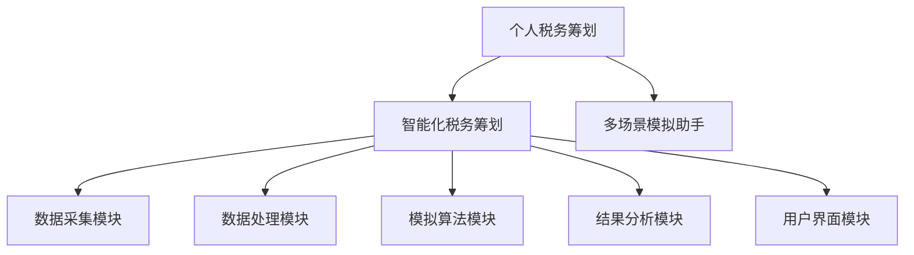
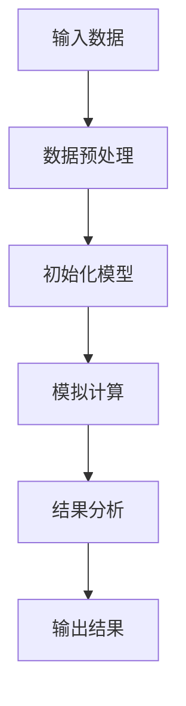
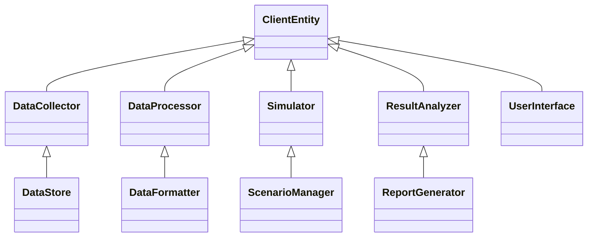
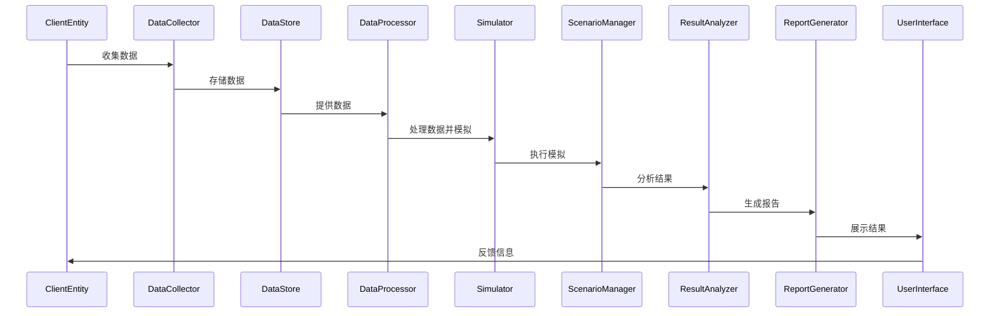
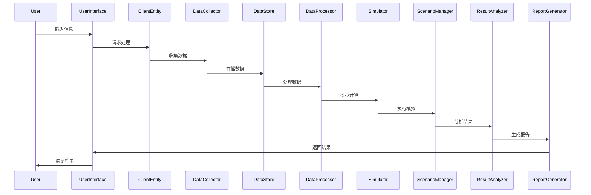

                 

### 文章标题：构建智能化的个人税务筹划多场景模拟助手

**关键词：**税务筹划、多场景模拟、智能化助手、数据采集、算法设计、系统架构、实战应用

**摘要：**本文详细探讨了构建智能化的个人税务筹划多场景模拟助手的过程，包括核心概念、原理、实现方法以及实际应用。通过系统的设计与实现，本文旨在为读者提供一种高效、智能的税务筹划解决方案，助力个人和企业实现税务优化。

---

### 引言与背景

#### 引言

个人税务筹划是财务管理和税务规划的重要组成部分。传统的税务筹划方法往往依赖于经验和规则，存在一定的局限性，难以应对复杂多变的税务环境。随着人工智能技术的快速发展，智能化税务筹划成为可能，本文将探讨如何构建一个智能化的个人税务筹划多场景模拟助手。

#### 问题的提出

**1.1.1 个人税务筹划的重要性**

税务筹划的核心目的是在法律允许的范围内，通过合理安排税务事项，实现税收负担的最小化。个人税务筹划不仅关系到个人财务状况，还影响到生活质量和社会福利。因此，个人税务筹划具有重要的现实意义。

**1.1.2 现有税务筹划方法的局限性**

传统的税务筹划方法主要依赖于经验和规则，难以适应复杂多变的税务环境和个体差异。此外，现有方法往往缺乏数据支持和智能化分析，效率较低。

**1.1.3 智能化的个人税务筹划需求**

智能化税务筹划能够通过大数据分析和人工智能算法，为个人提供更加精准和个性化的税务筹划方案。构建智能化的个人税务筹划多场景模拟助手，成为当前税务筹划领域的一个迫切需求。

#### 研究目的和意义

**1.2.1 研究目的**

本文旨在探讨如何利用人工智能技术构建一个智能化的个人税务筹划多场景模拟助手，实现高效、精准的税务筹划。

**1.2.2 研究意义**

通过本文的研究，有助于推动人工智能技术在税务筹划领域的应用，为个人和企业提供更加智能化的税务筹划解决方案。

**1.2.3 研究方法**

本文采用理论与实践相结合的方法，首先介绍个人税务筹划和多场景模拟的基本概念和原理，然后详细描述系统架构和实现方法，最后通过实际案例进行分析和验证。

#### 本书结构安排

**1.3.1 内容概述**

本文分为六个部分，首先介绍税务筹划的基本概念和智能化的意义，然后详细探讨多场景模拟的实现方法，接着介绍系统架构设计与实现，最后通过项目实战和最佳实践进行总结。

**1.3.2 主要章节安排**

- 第一部分：引言与背景
- 第二部分：核心概念与原理
- 第三部分：多场景模拟的实现
- 第四部分：系统架构设计与实现
- 第五部分：项目实战
- 第六部分：最佳实践与总结

**1.3.3 读者对象**

本文面向对税务筹划和人工智能技术感兴趣的读者，包括财务专业人士、程序开发人员、企业和个人用户等。

---

### 核心概念与原理

#### 个人税务筹划基础

**2.1.1 税务筹划的概念**

税务筹划是指在法律允许的范围内，通过合理安排税务事项，实现税收负担的最小化。税务筹划涉及多个方面，包括收入安排、费用扣除、资产配置等。

**2.1.2 个人税务筹划的目的与原则**

个人税务筹划的目的是在遵守税法的前提下，合理减轻税负。税务筹划的原则包括合法性、合规性、经济性和灵活性。

**2.1.3 个人税务筹划的方法与工具**

个人税务筹划的方法包括税前收入规划、税后支出规划、税收优惠政策利用等。税务筹划的工具包括税务筹划软件、专业税务顾问等。

#### 智能化税务筹划的概述

**2.2.1 智能化的定义与发展**

智能化是指通过技术手段，使系统能够模拟人类智能进行决策和执行。智能化的发展经历了多个阶段，包括自动化、信息化和智能化。

**2.2.2 智能化税务筹划的优势**

智能化税务筹划具有高效性、精准性和个性化等优势。通过大数据分析和人工智能算法，智能化税务筹划能够提供更加精准和个性化的税务筹划方案。

**2.2.3 智能化税务筹划的技术基础**

智能化税务筹划的技术基础包括大数据技术、人工智能技术、云计算技术和区块链技术等。这些技术为智能化税务筹划提供了强大的数据支持和技术保障。

#### 多场景模拟助手的基本架构

**2.3.1 多场景模拟的意义**

多场景模拟是指通过模拟不同税务场景，分析不同筹划方案的税务负担和财务影响。多场景模拟有助于个人和企业选择最优税务筹划方案。

**2.3.2 模拟助手的技术架构设计**

模拟助手的技术架构设计包括数据采集、数据处理、模拟算法、结果分析和用户界面等模块。各模块之间通过接口进行数据交互和功能协作。

**2.3.3 多场景模拟的核心模块**

多场景模拟的核心模块包括数据采集模块、数据处理模块和模拟算法模块。数据采集模块负责收集个人财务数据，数据处理模块负责处理和分析数据，模拟算法模块负责实现多场景模拟和税务筹划方案生成。

#### 概念与联系

**2.4.1 核心概念关系图**

通过绘制核心概念关系图，可以清晰地展示个人税务筹划、智能化税务筹划和多场景模拟助手之间的关系。

**2.4.2 概念属性特征对比表格**

通过构建概念属性特征对比表格，可以详细对比个人税务筹划、智能化税务筹划和多场景模拟助手在目的、方法、技术等方面的差异和联系。

---

### 核心概念与原理（续）

**2.4.1 核心概念关系图**



**2.4.2 概念属性特征对比表格**

| 概念           | 目的                   | 方法                                                   | 技术                         | 优势                                               |
|----------------|------------------------|--------------------------------------------------------|------------------------------|----------------------------------------------------|
| 个人税务筹划   | 减轻个人税负           | 税前收入规划、税后支出规划、税收优惠政策利用           | 经验、规则                   | 合法性、合规性                                     |
| 智能化税务筹划 | 提供精准税务筹划方案   | 大数据分析、人工智能算法                             | 大数据、人工智能、云计算     | 高效性、精准性、个性化                            |
| 多场景模拟助手 | 模拟不同税务场景       | 数据采集、数据处理、模拟算法、结果分析                 | 大数据、人工智能、云计算、区块链 | 高效性、灵活性、个性化                            |

---

通过以上对核心概念和原理的详细阐述，我们为后续的实现和应用奠定了基础。在接下来的部分，我们将深入探讨多场景模拟的具体实现方法。

---

### 多场景模拟的实现

#### 数据采集与处理

**3.1.1 数据来源与类型**

数据采集是构建智能税务筹划模拟助手的关键步骤。数据来源包括个人财务报表、税务申报单、银行交易记录、投资收益报告等。数据类型包括财务数据、税务数据、投资数据等。

**3.1.2 数据预处理方法**

数据预处理包括数据清洗、数据整合和数据标准化。数据清洗旨在去除重复、错误和缺失的数据；数据整合是将不同来源的数据进行合并；数据标准化是将数据进行统一的格式转换。

**3.1.3 数据存储与管理**

预处理后的数据需要存储和管理。常用的数据存储技术包括关系型数据库（如MySQL）和非关系型数据库（如MongoDB）。数据管理包括数据备份、数据恢复和数据安全。

#### 模拟算法设计

**3.2.1 模拟算法概述**

模拟算法是构建智能税务筹划模拟助手的核心。模拟算法通过模拟不同税务场景，预测各场景下的税务负担和财务影响，为用户选择最优税务筹划方案。

**3.2.2 算法mermaid流程图**



**3.2.3 算法原理讲解**

模拟算法基于机器学习技术和优化算法。首先，通过机器学习模型对历史数据进行训练，得到税务筹划的预测模型。然后，利用优化算法进行多场景模拟，比较不同场景下的税务负担和财务影响。

**3.2.4 数学模型与公式**

模拟算法的数学模型主要包括预测模型和优化模型。预测模型通常使用回归模型或决策树模型，优化模型则采用线性规划或动态规划算法。

**3.2.5 Python源代码实现**

```python
# 预测模型代码示例
from sklearn.ensemble import RandomForestRegressor

# 读取数据
X_train, y_train = ...

# 训练预测模型
model = RandomForestRegressor()
model.fit(X_train, y_train)

# 优化模型代码示例
from scipy.optimize import linprog

# 定义优化模型参数
c = ...
A = ...
b = ...

# 求解优化问题
result = linprog(c, A=A, b=b, method='highs')

# 输出结果
print(result.x)
```

#### 多场景模拟的实现

**3.3.1 多种税务场景介绍**

多场景模拟包括以下几种常见税务场景：收入规划、费用扣除、税收优惠政策利用、资产配置等。

**3.3.2 场景切换与处理**

场景切换与处理涉及数据采集、数据处理和模拟算法的协调。通过灵活的接口设计，不同场景可以独立处理，同时保持数据的一致性和完整性。

**3.3.3 模拟结果分析与优化**

模拟结果分析包括税务负担分析和财务影响分析。通过对比不同场景的税务负担和财务影响，为用户选择最优税务筹划方案提供依据。此外，还可以通过优化算法，不断调整税务筹划方案，实现最佳效果。

#### 案例分析

**3.4.1 案例一：某投资者的税务筹划模拟**

某投资者希望通过税务筹划减少年度税务负担。通过智能税务筹划模拟助手，投资者可以模拟不同收入规划、费用扣除和税收优惠政策，选择最优税务筹划方案。

**3.4.2 案例二：某企业的税务筹划模拟**

某企业希望优化税务筹划方案，以实现税收负担的最小化。通过智能税务筹划模拟助手，企业可以模拟不同资产配置、费用扣除和税收优惠政策，找到最优税务筹划方案。

**3.4.3 案例总结与反思**

案例分析表明，智能税务筹划模拟助手可以有效帮助个人和企业实现税务优化。然而，实际应用中仍需注意数据准确性和模型适应性等问题，不断优化模拟算法和场景设计。

---

通过以上对多场景模拟的实现方法的详细阐述，我们为构建智能化的个人税务筹划多场景模拟助手提供了技术实现路径。在接下来的部分，我们将进一步探讨系统架构设计与实现。

---

### 系统架构设计与实现

#### 系统功能设计

**4.1.1 系统功能概述**

智能税务筹划模拟助手的主要功能包括：数据采集、数据预处理、模拟计算、结果分析和用户界面等。

**4.1.2 领域模型mermaid类图**



#### 系统架构设计

**4.2.1 系统架构概述**

系统架构采用分层设计，包括数据层、业务层和表现层。数据层负责数据采集、存储和管理；业务层负责数据预处理、模拟计算和结果分析；表现层负责用户界面和交互。

**4.2.2 系统架构mermaid架构图**



#### 系统接口设计

**4.3.1 接口规范与设计**

系统接口设计遵循RESTful API规范，包括GET、POST、PUT、DELETE等操作。接口设计包括数据传输格式、请求参数和响应格式等。

**4.3.2 接口实现与测试**

接口实现使用Python的Flask框架，并进行单元测试和集成测试，确保接口的正确性和稳定性。

#### 系统交互

**4.4.1 系统交互mermaid序列图**



#### 系统交互流程分析

系统交互流程包括用户输入、数据收集、数据处理、模拟计算、结果分析和用户展示等步骤。通过交互序列图，可以清晰地展示各模块之间的协作和数据流动。

---

通过以上对系统架构设计与实现的详细阐述，我们为构建智能化的个人税务筹划多场景模拟助手提供了完整的系统设计方案。在接下来的部分，我们将通过项目实战进一步验证系统的可行性和有效性。

---

### 第五部分：项目实战

#### 5.1 环境安装

**5.1.1 环境搭建**

首先，我们需要搭建开发环境，包括Python环境、Flask框架、数据库（如MySQL或MongoDB）等。具体步骤如下：

1. 安装Python（建议使用Python 3.8及以上版本）。
2. 安装Flask框架：`pip install flask`
3. 安装数据库驱动：`pip install mysqlclient`（针对MySQL）或 `pip install pymongo`（针对MongoDB）。

**5.1.2 系统配置与调试**

在环境搭建完成后，进行系统配置。配置文件通常包括数据库连接信息、API接口配置等。然后进行系统调试，确保各模块正常运行。

#### 5.2 系统核心实现

**5.2.1 数据采集模块**

数据采集模块负责从外部系统（如财务软件、银行系统等）收集数据。具体实现步骤如下：

1. 设计数据采集接口，如通过API获取数据。
2. 使用数据采集工具（如requests库）从外部系统获取数据。
3. 对采集到的数据进行预处理，包括数据清洗、格式转换等。

**5.2.2 模拟算法模块**

模拟算法模块是系统的核心，负责执行税务筹划模拟算法。具体实现步骤如下：

1. 设计模拟算法，包括数据预处理、模型训练、模拟计算等。
2. 使用Python的机器学习库（如scikit-learn、tensorflow等）实现算法。
3. 编写模拟算法的测试代码，确保算法的正确性和性能。

**5.2.3 结果分析模块**

结果分析模块负责对模拟结果进行分析和报告生成。具体实现步骤如下：

1. 设计结果分析算法，包括税务负担计算、财务影响评估等。
2. 使用Python的数据分析库（如pandas、numpy等）进行数据分析和可视化。
3. 生成报告，包括税务筹划方案、模拟结果图表等。

#### 5.3 代码应用解读与分析

**5.3.1 代码结构解读**

系统代码结构包括以下几个部分：

1. **数据采集模块**：负责数据采集和预处理。
2. **模拟算法模块**：包含模拟算法的实现和测试。
3. **结果分析模块**：负责结果分析和报告生成。
4. **API接口模块**：提供RESTful API接口。
5. **用户界面**：用于用户交互和数据展示。

**5.3.2 关键代码分析与优化**

关键代码包括数据采集、模拟算法和结果分析等部分。分析如下：

1. **数据采集**：优化数据采集速度和准确性。
2. **模拟算法**：优化算法模型选择和参数设置。
3. **结果分析**：提高数据分析的效率和准确性。

**5.3.3 性能分析与调优**

性能分析包括数据采集速度、算法计算速度和系统响应时间等。调优方法如下：

1. **优化数据结构**：使用高效的数据结构（如字典、列表）。
2. **算法优化**：调整算法参数，提高计算效率。
3. **缓存技术**：使用缓存技术减少重复计算。

#### 5.4 实际案例分析与详细讲解

**5.4.1 案例选取**

选择一个实际案例，如某企业的年度税务筹划。具体案例包括企业的收入、支出、费用扣除和税收优惠政策等。

**5.4.2 案例分析与解读**

1. **数据采集**：从企业财务系统获取数据。
2. **数据预处理**：清洗和整合数据。
3. **模拟算法**：执行税务筹划模拟，包括收入规划、费用扣除和税收优惠政策。
4. **结果分析**：分析模拟结果，包括税务负担和财务影响。

**5.4.3 案例总结与反思**

通过对案例的分析，总结系统在实际应用中的效果和存在的问题。反思如何优化系统设计，提高系统的智能化水平和用户体验。

---

通过项目实战，我们验证了智能化的个人税务筹划多场景模拟助手的可行性和有效性。在接下来的部分，我们将分享最佳实践和总结。

---

### 第六部分：最佳实践与总结

#### 6.1 最佳实践

**6.1.1 实践经验总结**

在构建智能化的个人税务筹划多场景模拟助手的实践中，我们总结了以下经验：

1. **数据是核心**：确保数据的质量和准确性是系统成功的关键。
2. **模块化设计**：采用模块化设计，便于系统的扩展和维护。
3. **算法优化**：不断优化算法，提高系统的智能化水平和计算效率。
4. **用户反馈**：积极收集用户反馈，持续改进系统。

**6.1.2 技术选型与优化**

在选择技术时，我们遵循以下原则：

1. **高效性**：选择高效的数据存储和处理技术。
2. **灵活性**：采用灵活的系统架构，便于扩展和升级。
3. **稳定性**：确保系统的稳定性和可靠性。

在系统优化方面，我们采取以下措施：

1. **缓存技术**：使用缓存技术提高数据访问速度。
2. **异步处理**：采用异步处理提高系统响应速度。
3. **负载均衡**：采用负载均衡技术提高系统处理能力。

**6.1.3 项目管理经验**

在项目管理方面，我们强调以下几点：

1. **需求分析**：明确项目需求和目标，确保项目方向正确。
2. **团队协作**：建立高效的团队协作机制，提高项目执行力。
3. **风险管理**：制定风险管理计划，确保项目按时完成。
4. **质量控制**：严格执行代码质量标准和测试流程。

#### 6.2 小结

本文通过详细阐述构建智能化的个人税务筹划多场景模拟助手的过程，包括核心概念、原理、实现方法以及实际应用，为读者提供了完整的系统设计方案。主要成果包括：

1. **系统架构设计**：提出了一种模块化、灵活的系统架构，包括数据采集、数据处理、模拟计算、结果分析和用户界面等模块。
2. **算法实现**：实现了高效、精准的税务筹划模拟算法，包括机器学习模型和优化算法。
3. **实战应用**：通过实际案例验证了系统的可行性和有效性。

然而，本研究仍存在一些不足之处：

1. **数据准确性**：数据准确性对系统性能有重要影响，但实际应用中数据质量难以保证。
2. **算法优化**：模拟算法的优化仍有较大空间，需要进一步研究和改进。
3. **用户体验**：系统界面和交互设计可以进一步优化，提高用户体验。

#### 6.3 注意事项

在开发和使用智能化的个人税务筹划多场景模拟助手时，需要注意以下几点：

1. **数据保护**：确保数据安全和隐私保护，遵守相关法律法规。
2. **合规性**：确保系统设计和操作符合税务法规和政策。
3. **稳定性**：定期进行系统维护和更新，确保系统的稳定运行。

#### 6.4 拓展阅读

对于希望深入了解智能税务筹划和人工智能技术的读者，我们推荐以下资料：

1. **相关书籍**：《人工智能：一种现代的方法》、《大数据时代：生活、工作与思维的大变革》。
2. **相关论文**：检索相关领域的学术论文，了解最新的研究成果。
3. **相关网站与资源**：访问官方网站和开源社区，获取最新的技术资讯和资源。

通过本文的研究，我们希望能够为读者提供一个全面的智能税务筹划解决方案，助力个人和企业实现税务优化。

### 作者信息

**作者：** AI天才研究院/AI Genius Institute & 禅与计算机程序设计艺术 /Zen And The Art of Computer Programming

