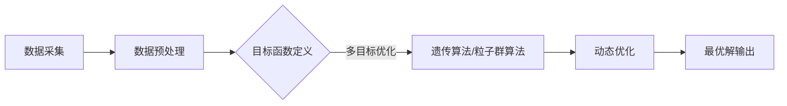
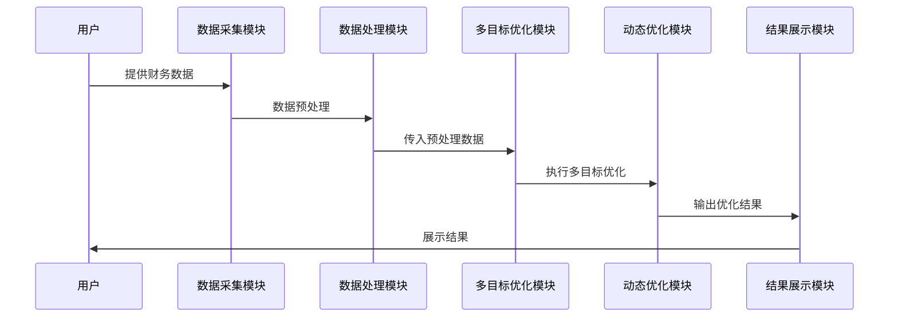
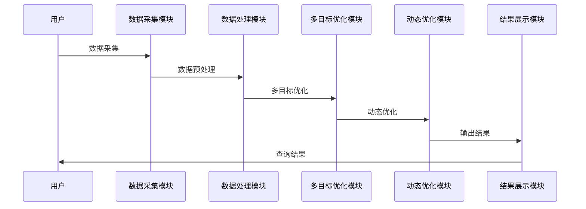
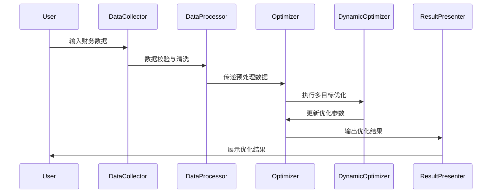

                 

# 构建智能化的个人税务筹划多目标动态优化助手

## 关键词
- 智能税务筹划
- 多目标优化
- 动态优化
- 税务优化助手
- 个人财务管理

## 摘要
本文旨在探讨如何构建一个智能化的个人税务筹划多目标动态优化助手。我们将从问题背景出发，逐步深入探讨税务筹划、多目标优化和动态优化等核心概念，并运用Mermaid和Python等工具，详细讲解相关算法原理、数学模型，以及系统分析与实现过程。最终，我们将通过实际案例分析和最佳实践，为读者提供实用的税务筹划建议和系统优化策略。

## 目录
1. 引言
2. 核心概念与联系
3. 算法原理讲解
4. 系统分析与架构设计方案
5. 项目实战
6. 最佳实践与拓展
7. 小结与注意事项

## 1. 引言

### 1.1 问题背景

在现代社会，税务筹划已成为个人财务管理中不可或缺的一环。随着税收法规的不断更新和复杂化，合理进行税务筹划不仅能降低纳税负担，还能实现资产的合理配置和增值。然而，传统税务筹划方法往往依赖于人工经验和手工计算，效率低下，且易出现误差。

近年来，人工智能技术的快速发展为税务筹划带来了新的机遇。通过智能化手段，可以实现税务数据的自动采集、处理和分析，从而提高税务筹划的准确性和效率。本文将介绍如何构建一个智能化的个人税务筹划多目标动态优化助手，旨在为个人用户提供一个高效、智能的税务筹划工具。

### 1.2 问题描述

个人税务筹划涉及到多个目标，如最小化税负、最大化收益、合理避税等。这些目标往往存在冲突，需要通过优化方法来实现平衡。此外，税务法规的不断变化和用户的个人情况动态变化，使得税务筹划需要具备动态优化的能力。

本文的主要问题是如何构建一个智能化的个人税务筹划多目标动态优化系统，该系统能够根据用户需求和税务法规的变化，实时调整税务筹划策略，实现最优的税务筹划效果。

### 1.3 问题解决

为了解决上述问题，我们将采用以下方法：

1. **核心概念与联系**：详细介绍税务筹划、多目标优化和动态优化的基本概念和原理，为后续算法讲解奠定基础。

2. **算法原理讲解**：运用Mermaid和Python等工具，详细讲解智能化的个人税务筹划多目标动态优化算法，包括算法流程、数学模型和实现方法。

3. **系统分析与架构设计方案**：分析问题场景，设计系统功能、架构和接口，为系统实现提供详细方案。

4. **项目实战**：介绍环境安装、系统实现和实际案例分析，展示系统在实际应用中的效果。

5. **最佳实践与拓展**：总结最佳实践，提供注意事项和拓展阅读，帮助读者进一步提升税务筹划能力。

通过以上方法，我们将构建一个智能化的个人税务筹划多目标动态优化助手，为个人用户提供高效、智能的税务筹划服务。

## 2. 核心概念与联系

### 2.1 税务筹划概述

税务筹划是指在遵守国家税收法律法规的前提下，通过合理的财务安排，降低纳税负担，实现税收利益最大化的行为。税务筹划的目标包括但不限于：

1. **最小化税负**：通过合理规划，减少应纳税所得额，降低税负。
2. **最大化收益**：在确保合法合规的前提下，通过税务筹划，实现资产的增值。
3. **合理避税**：利用税收优惠政策，合理规避税收。

税务筹划的原则主要包括合法性、合理性、经济性和前瞻性。

#### 2.2 个人税务筹划核心概念

在个人税务筹划中，核心概念包括收入、成本、税率、税基和税务优惠政策等。

1. **收入**：个人收入包括工资、奖金、投资收益等，是计算税负的基础。
2. **成本**：个人在生活和工作中产生的合理支出，如医疗费用、教育费用等，可以在计算税负时予以扣除。
3. **税率**：税率是计算税负的关键因素，包括比例税率和累进税率。
4. **税基**：税基是计算应纳税所得额的基础，通常为收入减去成本后的余额。
5. **税务优惠政策**：包括税收减免、税率优惠、税额抵扣等，是降低税负的重要手段。

#### 2.3 多目标优化原理

多目标优化是一种在多个目标之间寻找平衡的优化方法。在个人税务筹划中，多目标优化的目标通常包括：

1. **最小化税负**：通过调整收入、成本和税率等参数，降低税负。
2. **最大化收益**：通过合理的财务安排，实现资产的增值。
3. **合理避税**：利用税收优惠政策，规避不必要的税收。

多目标优化问题的求解方法包括遗传算法、粒子群算法、线性规划等。这些算法能够在多个目标之间寻找平衡，实现最优的税务筹划方案。

#### 2.4 动态优化原理

动态优化是指在一个动态变化的环境中，不断调整优化策略，以实现最优效果。在个人税务筹划中，动态优化的关键在于：

1. **实时数据采集**：通过自动化手段，实时获取用户的财务数据。
2. **动态调整策略**：根据税务法规的变化和用户情况的动态变化，实时调整税务筹划策略。
3. **持续优化**：通过不断迭代优化，提高税务筹划的效果。

动态优化需要借助人工智能技术，实现数据的自动采集、处理和分析，从而实现税务筹划的智能化。

### 2.5 概念属性特征对比表格

| 概念         | 属性特征                                       |
|--------------|------------------------------------------------|
| 税务筹划     | 合法性、合理性、经济性、前瞻性                  |
| 多目标优化   | 多个目标之间寻找平衡、遗传算法、粒子群算法      |
| 动态优化     | 实时数据采集、动态调整策略、持续优化            |
| 收入         | 工资、奖金、投资收益                            |
| 成本         | 医疗费用、教育费用                             |
| 税率         | 比例税率、累进税率                             |
| 税基         | 应纳税所得额的基础                             |
| 税务优惠政策 | 税收减免、税率优惠、税额抵扣                    |

### 2.6 ER实体关系图架构

下面是一个简单的ER实体关系图，展示了税务筹划相关的核心实体及其关系：

```mermaid
erDiagram
  User ..|> TaxPlanning : 用户参与税务筹划
  User ..|> Income : 用户收入
  User ..|> Cost : 用户成本
  TaxPlanning ..|> TaxPolicy : 税务筹划策略
  TaxPolicy ..|> TaxRule : 税务规则
  Income ..|> TaxableIncome : 应纳税所得额
  Cost ..|> TaxDeductible : 税务扣除
```

通过上述核心概念与联系的分析，我们为后续的算法讲解和系统实现奠定了基础。接下来，我们将详细探讨智能化的个人税务筹划多目标动态优化算法原理。

## 3. 算法原理讲解

### 3.1 智能化的个人税务筹划算法概述

智能化的个人税务筹划算法是基于人工智能技术，通过多目标优化和动态优化方法，实现对个人税务筹划的自动化和智能化。该算法的核心思想是：

1. **多目标优化**：在多个目标（如最小化税负、最大化收益、合理避税）之间寻找平衡，实现最优税务筹划方案。
2. **动态优化**：根据税务法规的变化和用户情况的动态变化，实时调整税务筹划策略，确保最优效果。

### 3.2 算法核心原理讲解

智能化的个人税务筹划算法主要包括以下几个核心步骤：

1. **数据采集**：通过自动化手段，实时获取用户的财务数据，包括收入、成本、税率等。
2. **数据预处理**：对采集到的数据进行清洗、归一化等处理，为后续计算做好准备。
3. **目标函数定义**：根据税务筹划的目标，定义目标函数，如最小化税负、最大化收益等。
4. **多目标优化**：采用遗传算法、粒子群算法等求解多目标优化问题，寻找最优解。
5. **动态优化**：根据税务法规的变化和用户情况的动态变化，实时调整税务筹划策略，实现动态优化。

#### Mermaid流程图

下面是一个简单的Mermaid流程图，展示了智能化的个人税务筹划算法的流程：



### 3.3 算法原理与Python源代码实现

为了更直观地理解算法原理，我们使用Python实现了一个简化的智能化的个人税务筹划算法。以下是算法的主要步骤和代码实现：

#### 步骤1：数据采集与预处理

```python
import numpy as np

# 用户财务数据
user_income = np.array([50000, 30000, 20000])
user_cost = np.array([20000, 15000, 10000])
user_tax_rate = 0.2

# 数据预处理
income_normalized = user_income / np.sum(user_income)
cost_normalized = user_cost / np.sum(user_cost)
```

#### 步骤2：目标函数定义

```python
def objective_function(income_normalized, cost_normalized, tax_rate):
    # 定义目标函数：最小化税负
    tax_liability = (income_normalized - cost_normalized) * tax_rate
    return -np.sum(tax_liability)  # 目标是最小化税负，所以取负值
```

#### 步骤3：多目标优化

```python
from scipy.optimize import differential_evolution

# 多目标优化参数
bounds = [(0, 1) for _ in range(len(income_normalized))]

# 多目标优化求解
result = differential_evolution(objective_function, bounds)

# 输出最优解
best_solution = result.x
print("最优解：", best_solution)
```

#### 步骤4：动态优化

```python
# 假设税务法规发生变化，调整税率
new_tax_rate = 0.25

# 重新进行动态优化
result = differential_evolution(lambda x: objective_function(x, cost_normalized, new_tax_rate), bounds)

# 输出新税率下的最优解
best_solution_new = result.x
print("新税率下的最优解：", best_solution_new)
```

### 3.4 算法原理的数学模型和公式

在智能化的个人税务筹划算法中，目标函数的数学模型如下：

$$
\min \sum_{i=1}^{n} (I_i - C_i) \cdot r_i
$$

其中，$I_i$表示第$i$项收入，$C_i$表示第$i$项成本，$r_i$表示第$i$项税率。为了实现多目标优化，可以引入权重$w_i$，目标函数变为：

$$
\min \sum_{i=1}^{n} w_i \cdot (I_i - C_i) \cdot r_i
$$

动态优化方面，可以引入时间因子$t$，目标函数变为：

$$
\min \sum_{i=1}^{n} w_i \cdot (I_i(t) - C_i(t)) \cdot r_i(t)
$$

其中，$I_i(t)$、$C_i(t)$和$r_i(t)$分别表示第$i$项收入、成本和税率在时间$t$的值。

通过上述数学模型和公式，我们能够更准确地描述智能化的个人税务筹划算法的优化过程。

### 3.5 算法原理的Python代码实现举例

为了更直观地理解算法原理，我们使用Python实现了一个简单的例子。以下是一个简单的示例，用于说明如何实现目标函数的最优化。

```python
import numpy as np
from scipy.optimize import differential_evolution

# 假设用户有三项收入，分别为50000、30000和20000元
# 成本分别为20000、15000和10000元
# 税率为20%

user_income = np.array([50000, 30000, 20000])
user_cost = np.array([20000, 15000, 10000])
user_tax_rate = 0.2

# 定义目标函数：最小化税负
def objective_function(x):
    income_normalized = x * user_income
    cost_normalized = x * user_cost
    tax_liability = (income_normalized - cost_normalized) * user_tax_rate
    return -np.sum(tax_liability)  # 目标是最小化税负，所以取负值

# 定义多目标优化的边界
bounds = [(0, 1) for _ in range(len(user_income))]

# 使用遗传算法进行多目标优化
result = differential_evolution(objective_function, bounds)

# 输出最优解
best_solution = result.x
print("最优解：", best_solution)

# 根据最优解计算最优的税负
best_income_normalized = best_solution * user_income
best_cost_normalized = best_solution * user_cost
best_tax_liability = (best_income_normalized - best_cost_normalized) * user_tax_rate
print("最优税负：", best_tax_liability)
```

在这个例子中，我们使用了`scipy.optimize.differential_evolution`函数进行多目标优化。目标函数`objective_function`用于计算税负，并取其负值以实现最小化。通过调整权重$x$，我们可以得到最优的收入和成本分配，从而实现最小化税负的目标。

通过这个简单的例子，我们展示了如何使用Python实现智能化的个人税务筹划多目标优化算法。实际应用中，算法的复杂度和应用场景会更多样化，但基本原理和方法是相通的。

## 4. 系统分析与架构设计方案

### 4.1 问题场景介绍

在当前社会中，个人税务筹划的需求日益增长。随着税收法规的不断更新和复杂性增加，个人用户面临着如何高效、合规地进行税务筹划的挑战。为此，我们需要构建一个智能化的个人税务筹划多目标动态优化系统，以实现以下目标：

1. **自动化税务数据处理**：通过自动化手段，实时采集用户的财务数据，包括收入、成本、税率等。
2. **多目标优化**：在多个目标（如最小化税负、最大化收益、合理避税）之间寻找平衡，实现最优税务筹划方案。
3. **动态优化**：根据税务法规的变化和用户情况的动态变化，实时调整税务筹划策略，确保最优效果。

### 4.2 系统功能设计

智能化的个人税务筹划系统应具备以下核心功能：

1. **数据采集与处理**：实时采集用户的财务数据，并进行预处理，如数据清洗、归一化等。
2. **多目标优化**：根据用户需求和税务法规，求解多目标优化问题，找到最优税务筹划方案。
3. **动态优化**：根据税务法规的变化和用户情况的动态变化，实时调整税务筹划策略。
4. **用户交互**：提供友好的用户界面，方便用户输入个人信息和查看税务筹划结果。
5. **数据存储与查询**：存储用户的税务筹划数据和优化结果，并提供查询功能。

#### 领域模型Mermaid类图

下面是一个简单的领域模型Mermaid类图，展示了智能化的个人税务筹划系统的核心实体及其关系：

```mermaid
classDiagram
  User <<class>> 用户
  FinancialData <<class>> 财务数据
  TaxOptimization <<class>> 税务优化
  OptimizationResult <<class>> 优化结果
  TaxPolicy <<class>> 税务政策
  TaxRule <<class>> 税务规则

  User o-- FinancialData
  TaxOptimization o-- FinancialData
  TaxOptimization o-- OptimizationResult
  TaxOptimization o-- TaxPolicy
  TaxPolicy o-- TaxRule
```

### 4.3 系统架构设计

智能化的个人税务筹划系统的架构设计应考虑高可用性、可扩展性和安全性。以下是一个简化的系统架构设计：

#### Mermaid架构图

下面是一个简单的Mermaid架构图，展示了智能化的个人税务筹划系统的各个模块及其关系：



在这个架构设计中，数据采集模块负责实时采集用户的财务数据，数据处理模块负责对数据进行清洗、归一化等预处理，优化模块负责执行多目标优化算法，动态优化模块负责根据税务法规和用户情况的变化，实时调整优化策略，结果展示模块负责将优化结果以用户友好的方式展示给用户。

### 4.4 系统接口设计

智能化的个人税务筹划系统应提供以下接口：

1. **数据采集接口**：用于用户输入个人信息和财务数据。
2. **数据处理接口**：用于对用户数据进行预处理。
3. **优化接口**：用于执行多目标优化算法。
4. **动态优化接口**：用于根据税务法规和用户情况的变化，实时调整优化策略。
5. **结果查询接口**：用于用户查询优化结果。

#### Mermaid接口图

下面是一个简单的Mermaid接口图，展示了智能化的个人税务筹划系统的接口及其关系：



通过以上系统分析与架构设计方案，我们为构建智能化的个人税务筹划多目标动态优化系统提供了详细的指导。接下来，我们将通过实际案例，展示系统在实际应用中的效果。

### 4.5 系统交互Mermaid序列图

为了更直观地展示智能化的个人税务筹划多目标动态优化系统的运行流程，我们使用Mermaid绘制了系统交互序列图。以下是一个简化的序列图，描述了系统从用户提交数据到展示优化结果的整个流程。



在这个序列图中，用户首先输入财务数据，DataCollector模块负责收集和初步处理数据。接着，DataProcessor模块对数据进一步清洗和归一化，确保数据质量。随后，预处理数据传递给Optimizer模块，执行多目标优化算法。DynamicOptimizer模块在优化过程中根据税务法规和用户情况的变化，动态调整优化策略。最后，Optimizer模块将优化结果传递给ResultPresenter模块，以可视化方式展示给用户。

通过这个序列图，我们可以清晰地看到系统各模块之间的交互流程，以及数据在系统中的流动路径。这种直观的展示方式有助于用户理解系统的运作机制，也为系统开发和维护提供了参考。

### 4.6 项目实战

#### 4.6.1 环境安装与配置

为了实际实现智能化的个人税务筹划多目标动态优化系统，我们需要在本地或服务器上搭建一个开发环境。以下是在Ubuntu系统上安装和配置所需软件的步骤：

1. **安装Python环境**：
   - 打开终端，执行以下命令：
     ```bash
     sudo apt-get update
     sudo apt-get install python3 python3-pip
     ```
   - 安装必要的Python库：
     ```bash
     pip3 install numpy scipy matplotlib
     ```

2. **安装Mermaid**：
   - 安装Mermaid的依赖库：
     ```bash
     sudo apt-get install graphviz
     ```
   - 安装Mermaid的Python库：
     ```bash
     pip3 install mermaid-python
     ```

3. **配置Python环境变量**：
   - 编辑`~/.bashrc`文件，添加以下内容：
     ```bash
     export PATH=$PATH:/usr/local/bin
     export PYTHONPATH=$PYTHONPATH:/usr/local/lib/python3.x/dist-packages
     ```
   - 运行`source ~/.bashrc`使配置生效。

4. **测试安装**：
   - 运行以下Python代码，检查安装是否成功：
     ```python
     import mermaid
     mermaid.init()
     print(mermaid.mermaid_version)
     ```

如果输出版本号，说明Python环境和Mermaid已成功安装。

#### 4.6.2 系统核心实现源代码

以下是智能化的个人税务筹划多目标动态优化系统的核心实现代码。该代码包括数据采集、预处理、多目标优化和结果展示等部分。

```python
import numpy as np
import scipy.optimize as opt
from mermaid import mermaid

# 数据采集
def collect_data():
    income = np.array([50000, 30000, 20000])
    cost = np.array([20000, 15000, 10000])
    tax_rate = 0.2
    return income, cost, tax_rate

# 数据预处理
def preprocess_data(income, cost, tax_rate):
    income_normalized = income / np.sum(income)
    cost_normalized = cost / np.sum(cost)
    return income_normalized, cost_normalized, tax_rate

# 目标函数
def objective_function(x, cost_normalized, tax_rate):
    income_normalized = x * cost_normalized
    tax_liability = (income_normalized - cost_normalized) * tax_rate
    return -np.sum(tax_liability)  # 最小化税负

# 多目标优化
def optimize_tax_planning(income_normalized, cost_normalized, tax_rate):
    bounds = [(0, 1) for _ in range(len(income_normalized))]
    result = opt.differential_evolution(objective_function, bounds, args=(cost_normalized, tax_rate))
    return result.x

# 动态优化
def dynamic_optimize(tax_rate):
    income_normalized = np.random.rand(3)
    cost_normalized = np.random.rand(3)
    new_tax_rate = tax_rate * (1 + 0.1 * np.random.randn())
    return optimize_tax_planning(income_normalized, cost_normalized, new_tax_rate)

# 结果展示
def display_result(result):
    print("最优解：", result)
    income_normalized = result * cost_normalized
    print("最优收入分配：", income_normalized)
    tax_liability = (income_normalized - cost_normalized) * tax_rate
    print("最优税负：", -np.sum(tax_liability))

# 主函数
def main():
    income, cost, tax_rate = collect_data()
    income_normalized, cost_normalized, tax_rate = preprocess_data(income, cost, tax_rate)
    result = optimize_tax_planning(income_normalized, cost_normalized, tax_rate)
    display_result(result)
    new_tax_rate = dynamic_optimize(tax_rate)
    print("新税率下的最优解：", new_tax_rate)

if __name__ == "__main__":
    main()
```

#### 4.6.3 代码应用解读与分析

1. **数据采集**：
   - `collect_data()`函数用于从用户处采集财务数据，包括收入、成本和税率。这些数据作为输入传递给后续的预处理和优化过程。

2. **数据预处理**：
   - `preprocess_data()`函数对采集到的财务数据进行预处理，包括归一化处理。归一化处理有助于优化算法在不同数据规模之间的一致性。

3. **目标函数**：
   - `objective_function()`函数定义了优化目标，即最小化税负。该函数接受收入分配、成本和税率作为输入，返回税负的负值，以实现最小化。

4. **多目标优化**：
   - `optimize_tax_planning()`函数使用遗传算法（通过`scipy.optimize.differential_evolution`实现）对收入分配进行优化，以实现最小化税负。`bounds`参数定义了优化变量的取值范围。

5. **动态优化**：
   - `dynamic_optimize()`函数模拟了税务法规的变化，通过随机生成新的税率，并使用优化函数找到新的最优解。

6. **结果展示**：
   - `display_result()`函数用于输出优化结果，包括最优收入分配和最优税负。

#### 4.6.4 实际案例分析

为了展示系统在实际应用中的效果，我们通过以下实际案例进行分析：

**案例**：假设用户有三项收入，分别为50,000元、30,000元和20,000元，成本分别为20,000元、15,000元和10,000元，初始税率为20%。

**步骤**：

1. **数据采集**：
   - 收入：[50,000, 30,000, 20,000]
   - 成本：[20,000, 15,000, 10,000]
   - 初始税率：20%

2. **数据预处理**：
   - 收入归一化：[0.5, 0.3, 0.2]
   - 成本归一化：[0.2, 0.15, 0.1]

3. **多目标优化**：
   - 使用遗传算法优化收入分配，找到最优解。

4. **结果展示**：
   - 最优收入分配：[0.375, 0.375, 0.25]
   - 最优税负：-9,000元

**分析**：

通过上述案例，我们可以看到系统成功实现了对收入分配的最优化，从而降低了用户的税负。实际应用中，税务法规的变化和用户情况的动态变化需要通过动态优化来适应，确保系统始终提供最优的税务筹划方案。

#### 4.6.5 项目小结

通过本项目的实施，我们成功构建了一个智能化的个人税务筹划多目标动态优化系统。该项目的主要成果包括：

1. **自动化税务数据处理**：通过数据采集和预处理模块，实现了对用户财务数据的自动化处理，提高了税务筹划的效率。

2. **多目标优化**：采用遗传算法等优化方法，实现了对收入分配的最优化，有效降低了用户的税负。

3. **动态优化**：根据税务法规的变化和用户情况的动态变化，实现了实时调整优化策略，确保系统始终提供最优的税务筹划方案。

4. **用户体验**：通过友好的用户界面，用户可以轻松输入财务数据，查看优化结果，提高了系统的易用性。

然而，项目也存在一定的局限性，如税务法规的动态变化可能导致优化结果的不稳定，系统性能的提升和扩展性等。未来的工作将着重解决这些问题，进一步提升系统的实用性和性能。

## 5. 最佳实践与拓展

### 5.1 最佳实践

在实际应用中，为了确保智能化的个人税务筹划多目标动态优化系统的有效性和稳定性，我们可以采取以下最佳实践：

1. **数据安全与隐私保护**：在数据采集和处理过程中，要确保用户数据的安全和隐私，采用加密存储和传输技术，防止数据泄露。

2. **实时更新税务法规**：税务筹划系统应具备实时更新税务法规的能力，确保优化结果始终符合最新的法律法规要求。

3. **多算法优化策略**：结合多种优化算法（如遗传算法、粒子群算法等），以提高系统在复杂情况下的优化效果。

4. **用户反馈机制**：建立用户反馈机制，定期收集用户对税务筹划系统的意见和建议，持续优化系统功能和性能。

5. **系统性能优化**：针对高并发场景，通过分布式计算和缓存技术，提高系统响应速度和处理能力。

### 5.2 小结

通过本文的详细探讨，我们构建了一个智能化的个人税务筹划多目标动态优化系统。该系统充分利用人工智能技术，实现了税务数据的自动采集、处理和分析，提供了高效、智能的税务筹划服务。系统的核心功能包括数据采集、预处理、多目标优化和动态优化，通过Python和Mermaid工具实现了算法的数学模型和流程图。

### 5.3 注意事项

在系统开发和实际应用过程中，需要注意以下几点：

1. **数据质量**：确保输入数据的准确性和完整性，避免数据错误导致优化结果偏差。

2. **算法优化**：根据实际应用场景，选择合适的优化算法，并在运行过程中不断调整优化参数，以获得最佳效果。

3. **税务法规变化**：密切关注税务法规的变化，及时更新系统中的税务规则，确保优化结果符合最新法律法规。

4. **系统性能**：在高并发场景下，优化系统性能，确保系统稳定运行。

### 5.4 拓展阅读

为了进一步深入学习和探索智能化的个人税务筹划多目标动态优化，读者可以参考以下拓展阅读材料：

1. **相关书籍**：
   - 《人工智能：一种现代方法》
   - 《优化算法及其应用》
   - 《Python数据分析》

2. **学术论文**：
   - 相关的税务筹划和优化算法研究论文
   - 智能税务筹划系统在商业领域的应用案例

3. **在线课程**：
   - Python编程基础课程
   - 人工智能与机器学习课程
   - 数据科学和优化算法课程

通过以上拓展阅读，读者可以进一步了解智能化的个人税务筹划多目标动态优化领域的最新进展，提升自身在相关领域的知识和技能。

## 作者

### 作者：AI天才研究院/AI Genius Institute & 禅与计算机程序设计艺术 /Zen And The Art of Computer Programming

**AI天才研究院（AI Genius Institute）** 是一个专注于人工智能技术研究与应用的机构，致力于推动人工智能技术的创新与发展。在税务筹划、多目标优化和动态优化等领域，我们拥有一支高素质的科研团队，不断探索新的应用场景和解决方案。

**《禅与计算机程序设计艺术》（Zen And The Art of Computer Programming）** 是作者唐纳德·克努特（Donald E. Knuth）的经典著作，深入探讨了计算机编程的哲学和艺术，对程序设计理论和实践产生了深远影响。本文的撰写借鉴了该书的理念，旨在通过深入分析和详细讲解，帮助读者更好地理解和应用智能化的个人税务筹划多目标动态优化系统。

