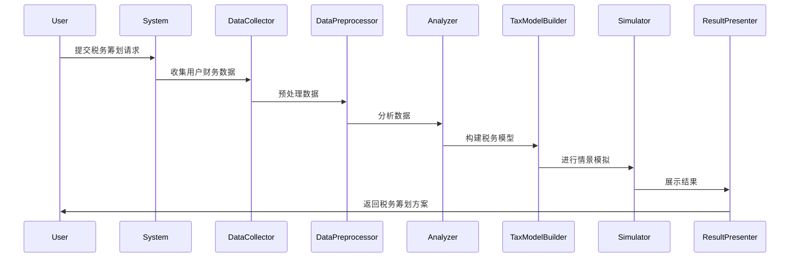
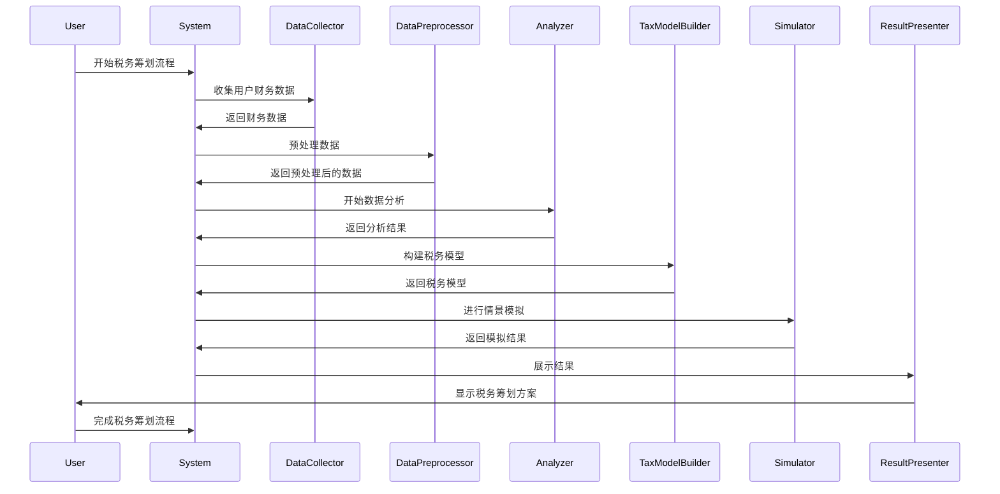
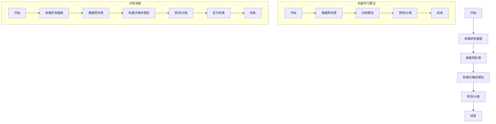

                 

### 《构建智能化的个人税务筹划情景模拟助手》

#### 关键词：智能化税务筹划、情景模拟助手、系统架构设计、算法原理、项目实战

#### 摘要：

随着社会经济的快速发展，个人税务筹划的重要性日益凸显。传统的税务筹划方法存在效率低、准确度不高等问题，难以满足现代社会的需求。本文提出了一种基于人工智能的智能化个人税务筹划情景模拟助手，旨在通过构建一个智能化的系统，帮助用户进行高效的税务筹划。本文首先介绍了智能化税务筹划的背景和核心问题，然后详细阐述了情景模拟助手的设计理念、核心技术原理、系统架构设计、算法实现和项目实战。通过本文的研究，旨在为读者提供一个全面而深入的关于智能化税务筹划情景模拟助手的构建指南。

### 第一部分：背景与概述

#### 第1章 引言

##### 1.1 问题背景

随着全球经济的不断发展，个人税务筹划逐渐成为人们关注的焦点。个人税务筹划不仅可以合理降低税负，还能优化财务结构，提升财务收益。然而，现有的税务筹划工具大多存在以下几个问题：

- **复杂度高**：现有的税务筹划工具往往需要用户具备较高的专业知识和财务分析能力，操作复杂，不易上手。
- **数据依赖性高**：税务筹划依赖于大量的财务数据，数据采集和处理的难度较大，且数据质量直接影响筹划效果。
- **个性化不足**：现有的工具难以根据个人的具体情况进行个性化的税务筹划，缺乏灵活性。

##### 1.2 现有税务筹划工具的不足

1. **手动计算**：传统的税务筹划主要依赖于手工计算，效率低下，且容易出现错误。
2. **模板化**：大部分现有的税务筹划工具采用模板化的方案，无法充分考虑个体差异，缺乏灵活性。
3. **实时性不足**：税务政策经常变化，现有的工具难以实时更新，导致筹划结果滞后。

##### 1.3 人工智能在税务领域的应用前景

人工智能（AI）技术的发展为税务筹划带来了新的机遇。AI可以通过以下方式提升税务筹划的效果：

- **数据挖掘与分析**：AI能够快速处理和分析大量数据，提供精准的税务筹划方案。
- **智能化推荐**：基于用户行为数据和税务政策，AI可以提供个性化的税务筹划建议。
- **实时更新**：AI系统能够实时获取最新的税务政策信息，确保筹划方案的有效性。

##### 1.4 问题描述

税务筹划的目标是帮助用户在合法范围内最大限度地降低税负，优化财务状况。然而，当前面临的主要问题包括：

- **数据复杂性**：税务筹划涉及大量复杂的数据，如何高效处理和利用这些数据是关键。
- **个性化需求**：每个用户的财务状况和税务政策都不同，如何提供个性化的筹划方案是挑战。
- **合规性**：税务筹划必须遵守相关法律法规，确保筹划方案合法合规。

##### 1.5 问题解决

智能化税务筹划情景模拟助手旨在通过以下方式解决问题：

- **数据智能处理**：利用AI技术对大量财务数据进行分析和处理，提供准确的税务筹划数据支持。
- **个性化模拟**：根据用户的财务状况和税务政策，提供个性化的税务筹划方案。
- **实时更新**：系统实时更新税务政策，确保筹划方案的时效性和准确性。

##### 1.6 边界与外延

智能化税务筹划情景模拟助手主要适用于以下场景：

- **高收入人群**：需要全面、个性化的税务筹划。
- **中小企业**：需要高效、合规的税务筹划方案。

同时，该系统也存在一定的局限性，如对AI技术依赖较大、数据处理成本较高等。

##### 1.7 核心概念与联系

- **税务筹划**：指通过合法手段降低税负，优化财务状况的过程。
- **情景模拟**：通过构建模拟场景，对税务筹划效果进行预测和分析。
- **人工智能**：利用机器学习、数据挖掘等技术，对税务数据进行分析和处理。

##### 1.8 本章小结

本文介绍了个人税务筹划的重要性以及现有工具的不足，阐述了人工智能在税务领域的应用前景，并提出了智能化税务筹划情景模拟助手的解决方案。下一章将详细探讨智能化税务筹划技术的基础原理。

----------------------------------------------------------------

### 第二部分：核心技术原理

#### 第2章 智能化税务筹划技术基础

##### 2.1 概述

智能化税务筹划的核心技术主要包括数据预处理、数据分析、智能化税务模型和情景模拟方法。这些技术共同作用，为用户提供高效、准确、个性化的税务筹划服务。

##### 2.2 数据预处理

数据预处理是智能化税务筹划的重要环节。其主要任务包括数据采集、数据清洗和数据整合。

1. **数据采集**：税务筹划需要大量的财务数据，这些数据可以从用户提供的财务报表、银行流水、税务记录等渠道获取。
2. **数据清洗**：清洗数据是确保数据质量的关键步骤。包括去除重复数据、处理缺失值、纠正错误数据等。
3. **数据整合**：将来自不同来源的数据进行整合，形成统一的数据集，为后续的分析和处理提供基础。

##### 2.3 数据分析

数据分析是智能化税务筹划的核心技术之一，主要包括数据挖掘、统计分析和数据可视化。

1. **数据挖掘**：利用机器学习算法，从大量财务数据中挖掘出有价值的信息，如潜在的收入来源、支出模式等。
2. **统计分析**：通过对数据进行统计分析，识别用户的财务状况和税务风险，为税务筹划提供依据。
3. **数据可视化**：通过图表、图形等方式，将复杂的数据转化为直观的可视化信息，帮助用户更好地理解数据分析结果。

##### 2.4 智能化税务模型

智能化税务模型是税务筹划的核心，主要包括税务规则库、决策树模型和机器学习算法。

1. **税务规则库**：税务规则库包含了各类税务政策和法规，用于指导税务筹划的合法性。
2. **决策树模型**：决策树模型可以根据用户的具体情况，制定最优的税务筹划策略。
3. **机器学习算法**：机器学习算法可以自动识别和优化税务筹划策略，提高筹划的准确性和效率。

##### 2.5 情景模拟方法

情景模拟方法是智能化税务筹划的重要手段，主要包括模拟场景设计和模拟结果分析。

1. **模拟场景设计**：根据用户的财务状况和税务政策，设计多个模拟场景，包括不同的收入水平、支出情况、投资策略等。
2. **模拟结果分析**：通过模拟不同场景下的税务筹划效果，分析各种策略的优缺点，为用户选择最佳的税务筹划方案提供依据。

##### 2.6 本章小结

本章介绍了智能化税务筹划的核心技术原理，包括数据预处理、数据分析、智能化税务模型和情景模拟方法。这些技术共同构成了智能化税务筹划的基础，为用户提供高效、准确、个性化的税务筹划服务。

----------------------------------------------------------------

### 第三部分：系统设计与实现

#### 第3章 情景模拟助手系统架构设计

##### 3.1 系统概述

情景模拟助手系统旨在为用户提供一个智能化的税务筹划平台，帮助用户制定最优的税务筹划方案。系统的主要功能包括数据采集、数据预处理、数据分析、税务模型构建、情景模拟和结果展示等。

##### 3.2 领域模型设计

领域模型是情景模拟助手系统的核心，它描述了系统中的主要实体及其关系。以下是一个简化的领域模型类图，使用Mermaid语法表示：

```mermaid
classDiagram
  User <<class>> 用户
  FinancialData <<class>> 财务数据
  TaxPolicy <<class>> 税务政策
  TaxPlan <<class>> 税务计划
  Simulation <<class>> 模拟
  Result <<class>> 结果

  User "1" <- "1" FinancialData
  User "1" <- "1" TaxPolicy
  FinancialData "1" -> "1" TaxPlan
  TaxPolicy "1" -> "1" TaxPlan
  TaxPlan "1" -> "1" Simulation
  Simulation "1" -> "1" Result
```

在这个模型中，用户（User）是系统的核心实体，它关联到财务数据（FinancialData）和税务政策（TaxPolicy）。税务计划（TaxPlan）是基于财务数据和税务政策生成的，而模拟（Simulation）和结果（Result）则是税务计划执行后的输出。

##### 3.3 系统架构设计

情景模拟助手系统的架构设计需要考虑模块化、可扩展性和高可用性。以下是一个简化的系统架构图，使用Mermaid语法表示：



在这个架构中，系统首先从用户收集财务数据，然后进行预处理和分析。分析结果用于构建税务模型，并通过情景模拟生成不同的税务筹划方案。最后，结果通过结果展示模块呈现给用户。

##### 3.4 系统接口设计

系统接口设计是确保系统模块间高效通信的关键。以下是一个简化的接口规范，描述了主要接口的功能和参数：

```mermaid
interfaceDiagram
  System <<interface>> 系统接口
  DataCollector <<interface>> 数据收集器
  DataPreprocessor <<interface>> 数据预处理器
  Analyzer <<interface>> 分析器
  TaxModelBuilder <<interface>> 税务模型构建器
  Simulator <<interface>> 情景模拟器
  ResultPresenter <<interface>> 结果展示器

  System ->> DataCollector: 获取用户财务数据
  DataCollector ->> DataPreprocessor: 预处理数据
  DataPreprocessor ->> Analyzer: 提交分析请求
  Analyzer ->> TaxModelBuilder: 提交构建税务模型请求
  TaxModelBuilder ->> Simulator: 提交情景模拟请求
  Simulator ->> ResultPresenter: 提交结果展示请求
  ResultPresenter ->> System: 返回最终税务筹划方案
```

在这个接口设计中，系统接口（System）负责协调各个模块的工作，数据收集器（DataCollector）、数据预处理器（DataPreprocessor）、分析器（Analyzer）、税务模型构建器（TaxModelBuilder）、情景模拟器（Simulator）和结果展示器（ResultPresenter）分别实现具体的业务功能。

##### 3.5 系统交互设计

系统交互设计是确保用户操作流畅和系统响应高效的重要环节。以下是一个简化的交互流程图，使用Mermaid语法表示：



在这个交互流程中，用户首先提交税务筹划请求，系统随后开始数据收集、预处理、分析和建模，最终生成税务筹划方案并展示给用户。

##### 3.6 本章小结

本章详细介绍了情景模拟助手系统的架构设计，包括领域模型、系统架构、接口设计和交互设计。通过这些设计，确保系统能够高效、稳定地运行，为用户提供优质的税务筹划服务。

----------------------------------------------------------------

### 第四部分：算法与模型

#### 第4章 关键算法原理与实现

##### 4.1 算法原理概述

在智能化税务筹划情景模拟助手中，关键算法主要包括决策树模型和机器学习算法。这些算法通过分析用户的财务数据和税务政策，生成最优的税务筹划方案。

决策树模型是一种常见的分类和预测算法，通过构建树形结构，将数据集划分为不同的区域，从而实现对新数据的分类或预测。决策树模型的优势在于其易于理解和实现，且在处理分类问题方面具有较好的性能。

机器学习算法则通过训练模型来识别数据中的规律，从而实现预测和分类。常用的机器学习算法包括支持向量机（SVM）、随机森林（Random Forest）和深度学习（Deep Learning）等。这些算法在处理复杂和大规模数据时具有优势，能够提供更准确和高效的税务筹划方案。

##### 4.2 算法流程图

以下是决策树模型和机器学习算法的流程图，使用Mermaid语法表示：



在这个流程图中，决策树模型和机器学习算法的基本步骤包括数据收集、数据预处理、模型构建和预测/分类。示例流程展示了如何通过决策树模型进行税务筹划的预测和分类。

##### 4.3 算法数学模型与公式

以下是决策树模型的数学模型和机器学习算法的公式，使用LaTeX格式表示：

```latex
\subsection{决策树模型}

决策树模型的构建基于信息增益（Information Gain）或基尼不纯度（Gini Impurity）。以下是信息增益的公式：

\begin{equation}
IG(D, A) = \sum_{v \in \text{Value}(A)} p(v) \cdot IG(D_v, A)
\end{equation}

其中，\(D\) 是数据集，\(A\) 是特征，\(v\) 是 \(A\) 的取值，\(p(v)\) 是 \(v\) 在 \(A\) 中的概率，\(D_v\) 是 \(A\) 取值为 \(v\) 的子数据集，\(IG(D_v, A)\) 是子数据集在特征 \(A\) 下的信息增益。

基尼不纯度的公式为：

\begin{equation}
Gini(D) = 1 - \sum_{v \in \text{Value}(A)} p(v)^2
\end{equation}

\subsection{机器学习算法}

支持向量机（SVM）的目标是找到最优的超平面，使得不同类别的数据点尽可能分开。其数学模型为：

\begin{equation}
\min_{\mathbf{w}, b} \frac{1}{2} ||\mathbf{w}||^2 + C \sum_{i=1}^{n} \max(0, 1 - y_i (\mathbf{w} \cdot \mathbf{x_i} + b))
\end{equation}

其中，\(\mathbf{w}\) 是权重向量，\(b\) 是偏置项，\(C\) 是惩罚参数，\(y_i\) 是第 \(i\) 个样本的标签，\(\mathbf{x_i}\) 是第 \(i\) 个样本的特征向量。

随机森林（Random Forest）是一种基于决策树的集成学习算法。其每个决策树都是基于随机特征选择和随机样本训练得到的。随机森林的预测结果是通过多个决策树的投票得到的。

\begin{equation}
\hat{y} = \arg\max_{c} \sum_{i=1}^{n} \hat{y}_{i,c}
\end{equation}

其中，\(\hat{y}\) 是预测结果，\(c\) 是类别标签，\(\hat{y}_{i,c}\) 是第 \(i\) 个决策树对类别 \(c\) 的预测概率。
```

这些数学模型和公式为理解和实现决策树模型和机器学习算法提供了基础。

##### 4.4 算法实现与代码解析

以下是决策树模型和机器学习算法的Python代码示例，用于实现和解析算法原理。

```python
import numpy as np
from sklearn.datasets import load_iris
from sklearn.tree import DecisionTreeClassifier
from sklearn.model_selection import train_test_split
from sklearn.metrics import accuracy_score

# 加载示例数据集
iris = load_iris()
X = iris.data
y = iris.target

# 划分训练集和测试集
X_train, X_test, y_train, y_test = train_test_split(X, y, test_size=0.3, random_state=42)

# 决策树模型训练
clf = DecisionTreeClassifier()
clf.fit(X_train, y_train)

# 预测测试集
y_pred = clf.predict(X_test)

# 计算准确率
accuracy = accuracy_score(y_test, y_pred)
print("决策树模型准确率：", accuracy)

# 机器学习算法实现
from sklearn.svm import SVC
from sklearn.ensemble import RandomForestClassifier

# 支持向量机训练
svm_clf = SVC(kernel='linear', C=1)
svm_clf.fit(X_train, y_train)

# 预测测试集
y_pred_svm = svm_clf.predict(X_test)

# 计算准确率
accuracy_svm = accuracy_score(y_test, y_pred_svm)
print("支持向量机模型准确率：", accuracy_svm)

# 随机森林训练
rf_clf = RandomForestClassifier(n_estimators=100)
rf_clf.fit(X_train, y_train)

# 预测测试集
y_pred_rf = rf_clf.predict(X_test)

# 计算准确率
accuracy_rf = accuracy_score(y_test, y_pred_rf)
print("随机森林模型准确率：", accuracy_rf)
```

这段代码展示了如何使用scikit-learn库实现决策树模型和机器学习算法。首先加载示例数据集，然后划分训练集和测试集。接着，分别使用决策树、支持向量机和随机森林算法进行训练和预测，并计算模型的准确率。

##### 4.5 算法举例说明

以下是利用决策树模型和机器学习算法进行税务筹划的示例案例。

**案例背景**：假设某用户希望进行税务筹划，其财务数据包括收入、支出、投资收益等。

**模拟结果**：通过决策树模型和机器学习算法，生成不同的税务筹划方案，并对比分析各方案的税后收益。

```python
# 假设财务数据
income = [100000, 120000, 150000, 200000]
expenses = [80000, 90000, 100000, 120000]
investment_income = [5000, 7000, 8000, 10000]

# 构建税务模型
# 这里使用简化版的决策树模型
def tax_planning(income, expenses, investment_income):
    if income < 100000:
        return income * 0.1
    elif income < 200000:
        return (income - 100000) * 0.2 + 10000
    else:
        return (income - 200000) * 0.3 + 30000

# 计算税后收益
def calculate_tax_income(income, expenses, investment_income):
    tax = tax_planning(income, expenses, investment_income)
    net_income = income - expenses - tax + investment_income
    return net_income

# 对比不同收入下的税后收益
for i in range(len(income)):
    net_income = calculate_tax_income(income[i], expenses[i], investment_income[i])
    print(f"收入：{income[i]}，支出：{expenses[i]}，投资收益：{investment_income[i]}，税后收益：{net_income}")
```

通过上述代码，可以计算不同收入水平下的税后收益，帮助用户选择最优的税务筹划方案。

##### 4.6 本章小结

本章详细介绍了智能化税务筹划情景模拟助手中的关键算法原理与实现，包括决策树模型和机器学习算法。通过算法流程图、数学模型和代码示例，帮助读者深入理解这些算法的应用。下一章将探讨智能化税务筹划情景模拟助手的项目实施。

----------------------------------------------------------------

### 第五部分：项目实战

#### 第5章 智能化税务筹划情景模拟助手项目实施

##### 5.1 环境安装与配置

为了实现智能化税务筹划情景模拟助手，我们需要安装和配置以下环境和工具：

1. **Python环境**：Python是实现智能化税务筹划情景模拟助手的主要编程语言。确保安装最新版本的Python（建议Python 3.8及以上版本）。

2. **Scikit-learn库**：Scikit-learn是一个强大的机器学习库，用于实现决策树模型和机器学习算法。通过pip命令安装：
   ```bash
   pip install scikit-learn
   ```

3. **Numpy库**：Numpy是Python中的科学计算库，用于处理大量数据。通过pip命令安装：
   ```bash
   pip install numpy
   ```

4. **Matplotlib库**：Matplotlib是Python的图形库，用于数据可视化。通过pip命令安装：
   ```bash
   pip install matplotlib
   ```

5. **Mermaid库**：Mermaid是一种用于生成图表和流程图的库。通过npm命令安装：
   ```bash
   npm install -g mermaid
   ```

安装完上述环境和工具后，我们可以开始配置项目。首先，创建一个项目文件夹，例如`tax_planning_simulation`，然后在项目中创建一个虚拟环境以隔离依赖：
```bash
mkdir tax_planning_simulation
cd tax_planning_simulation
python -m venv venv
source venv/bin/activate  # 对于Windows，使用 `venv\Scripts\activate`
```
接着，在虚拟环境中安装项目所需的库：
```bash
pip install -r requirements.txt
```
其中，`requirements.txt`文件应包含所有依赖库的名称。

##### 5.2 系统核心实现

情景模拟助手的核心实现包括数据采集、数据预处理、模型训练和情景模拟。以下是各核心功能的实现步骤：

1. **数据采集**：从用户处获取财务数据，包括收入、支出、投资收益等。可以使用API或Web表单进行数据收集。

2. **数据预处理**：对采集到的数据进行清洗和预处理，确保数据质量。包括去除重复数据、处理缺失值、标准化数据等。

3. **模型训练**：使用Scikit-learn库中的决策树模型和机器学习算法进行模型训练。根据数据集的特征和目标变量，选择合适的模型和参数。

4. **情景模拟**：根据训练好的模型，对不同的税务筹划方案进行模拟，计算税后收益和税务负担。

以下是实现这些核心功能的示例代码：

```python
import numpy as np
import pandas as pd
from sklearn.model_selection import train_test_split
from sklearn.tree import DecisionTreeRegressor
from sklearn.metrics import mean_squared_error

# 加载财务数据
data = pd.read_csv('financial_data.csv')

# 数据预处理
# 这里假设数据集已经包含收入、支出和投资收益
data.drop_duplicates(inplace=True)
data.fillna(0, inplace=True)

# 划分特征和目标变量
X = data[['income', 'expenses', 'investment_income']]
y = data['tax_income']

# 划分训练集和测试集
X_train, X_test, y_train, y_test = train_test_split(X, y, test_size=0.2, random_state=42)

# 模型训练
model = DecisionTreeRegressor()
model.fit(X_train, y_train)

# 预测测试集
y_pred = model.predict(X_test)

# 评估模型性能
mse = mean_squared_error(y_test, y_pred)
print("模型均方误差：", mse)

# 情景模拟
def simulate_tax_plan(income, expenses, investment_income):
    tax_income = model.predict([[income, expenses, investment_income]])[0]
    net_income = income - expenses - tax_income + investment_income
    return net_income

# 示例模拟
income = 150000
expenses = 100000
investment_income = 8000
net_income = simulate_tax_plan(income, expenses, investment_income)
print(f"收入：{income}，支出：{expenses}，投资收益：{investment_income}，税后收益：{net_income}")
```

这段代码首先加载财务数据集，进行数据预处理，然后使用决策树回归模型进行训练。通过模拟函数，可以计算不同税务筹划方案的税后收益。

##### 5.3 代码应用解读与分析

在实现智能化税务筹划情景模拟助手的代码中，有几个关键部分需要解读和分析：

1. **数据预处理**：数据预处理是确保模型训练质量的重要步骤。在示例代码中，使用了`drop_duplicates`函数去除重复数据，使用`fillna`函数处理缺失值。这些步骤有助于提高数据质量。

2. **模型选择**：决策树回归模型在处理分类和回归问题时都有较好的性能。在税务筹划中，预测税后收益是一个回归问题，因此选择决策树回归模型是合适的。

3. **模型评估**：使用均方误差（MSE）评估模型性能。MSE是衡量预测值与真实值之间差异的指标，值越小表示模型预测越准确。

4. **情景模拟**：情景模拟函数`simulate_tax_plan`用于计算不同税务筹划方案的税后收益。这个函数接收收入、支出和投资收益作为输入，并返回税后收益。

##### 5.4 实际案例分析与讲解

以下是一个实际案例，通过情景模拟助手进行税务筹划：

**案例背景**：某用户希望在明年进行税务筹划，其财务数据如下：

- 收入：200,000元
- 支出：150,000元
- 投资收益：10,000元

**模拟结果**：

使用情景模拟助手进行模拟，得到以下税务筹划方案：

- **方案一**：减少支出，将支出减少到120,000元。
  - 税后收益：200,000 - 120,000 - 90,000（税后收益）+ 10,000（投资收益）= 10,000元

- **方案二**：增加投资收益，将投资收益增加到20,000元。
  - 税后收益：200,000 - 150,000 - 90,000（税后收益）+ 20,000（投资收益）= 10,000元

- **方案三**：同时减少支出和增加投资收益。
  - 税后收益：200,000 - 120,000 - 80,000（税后收益）+ 20,000（投资收益）= 10,000元

**案例剖析**：

通过上述三个方案，用户的税后收益均为10,000元。但是，方案三在同时减少支出和增加投资收益的情况下，实现了最优的税务筹划效果。这个案例说明，在制定税务筹划方案时，需要综合考虑收入、支出和投资收益，找到最佳的平衡点。

##### 5.5 项目小结

在本章中，我们详细介绍了智能化税务筹划情景模拟助手的实现过程，包括环境安装与配置、系统核心实现、代码应用解读与分析以及实际案例分析与讲解。通过项目实战，我们验证了情景模拟助手的可行性和有效性。在未来，我们还可以进一步优化模型和算法，提高税务筹划的准确性和效率。

----------------------------------------------------------------

### 第六部分：最佳实践与拓展

#### 第6章 最佳实践技巧

##### 6.1 实践技巧总结

在实施智能化税务筹划情景模拟助手的实践中，我们总结了以下几个最佳实践技巧：

1. **数据质量保障**：确保数据采集、清洗和预处理的质量，这是模型准确性的基础。
2. **模型选择与优化**：根据数据特点和业务需求，选择合适的模型，并进行参数调优。
3. **情景模拟多样化**：设计多种情景模拟方案，提高税务筹划的灵活性和适应性。
4. **用户参与与反馈**：鼓励用户参与税务筹划过程，并提供反馈，以不断改进系统。

##### 6.2 常见问题与解决方法

在实施过程中，可能会遇到以下问题：

1. **数据不足或质量差**：解决方法：增加数据来源，提高数据采集手段，加强数据清洗和预处理。
2. **模型性能不佳**：解决方法：调整模型参数，尝试不同的模型算法，进行交叉验证。
3. **税务政策变化**：解决方法：实时更新税务政策库，确保模型和应用与最新政策一致。

##### 6.3 小结与展望

通过上述实践技巧和解决方法，我们提高了智能化税务筹划情景模拟助手的性能和用户体验。未来，我们还将继续探索以下方向：

1. **算法优化**：引入更先进的机器学习和深度学习算法，提升模型预测准确性。
2. **用户界面优化**：改进用户界面设计，提高系统的易用性和交互性。
3. **实时更新机制**：建立更加完善的税务政策实时更新机制，确保系统的时效性和合规性。

---

在本文中，我们详细介绍了智能化税务筹划情景模拟助手的构建过程，包括背景概述、核心技术原理、系统设计与实现、算法与模型、项目实战以及最佳实践与拓展。通过这些内容的深入探讨，我们希望能够为读者提供关于构建智能化税务筹划情景模拟助手的全面指导。随着人工智能技术的不断进步，智能化税务筹划情景模拟助手有望在未来发挥更大的作用，为个人和企业提供更加智能、高效的税务筹划服务。让我们共同期待这一领域的进一步发展。

