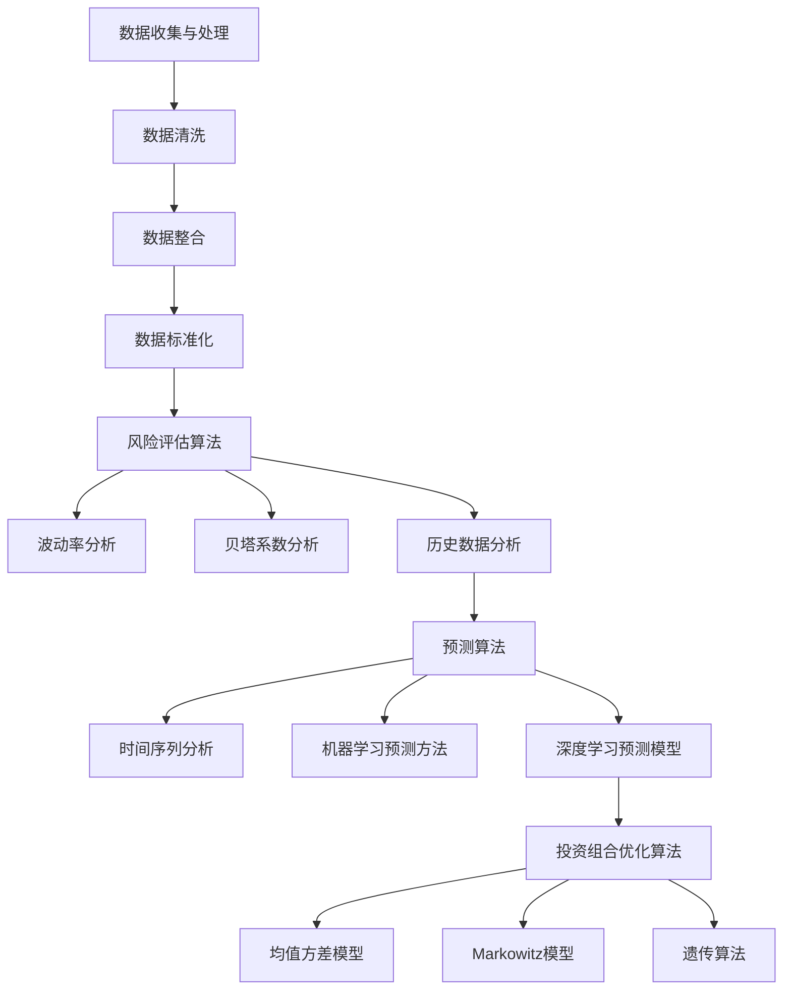
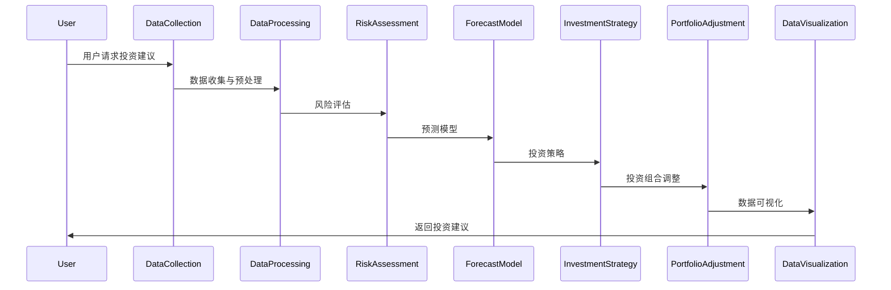
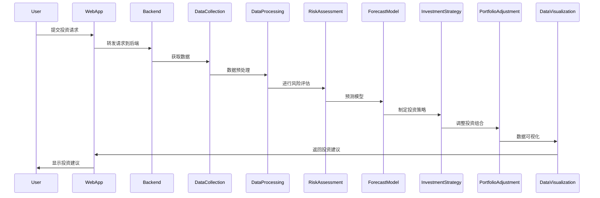

                 

# 构建智能化的个人财富管理策略动态调整助手

## 关键词

- 个人财富管理
- 智能化
- 数据分析
- 投资策略
- 动态调整
- 人工智能

## 摘要

本文旨在探讨如何构建智能化的个人财富管理策略动态调整助手。在当前金融市场中，个人财富管理面临诸多挑战，如投资风险、市场波动、信息不对称等。为了解决这些问题，本文提出了利用人工智能技术实现智能化财富管理策略的方案。本文首先介绍了个人财富管理的重要性以及当前面临的问题和挑战，然后详细阐述了智能化个人财富管理策略和动态调整助手的基本概念、原理、功能及应用范围。通过本文的讨论，读者将了解如何通过数据分析、投资模型和策略，实现个人财富的有效管理和动态调整。

----------------------------------------------------------------

# 第一部分：背景介绍

## 第1章：问题背景与核心概念

### 1.1 问题背景

#### 1.1.1 个人财富管理的重要性

个人财富管理是指个人或家庭通过积累财富、降低开支和有效投资，实现财务自由的过程。财务自由是指个人或家庭无需依赖传统收入来源，即可满足日常生活需求和实现长期目标的状态。在现代社会，个人财富管理的重要性日益凸显，主要原因如下：

1. **经济压力**：随着生活成本的不断上升，个人或家庭需要有效管理财富，以应对日益增长的经济压力。
2. **退休规划**：随着人均寿命的延长，退休规划成为个人财富管理的重要内容。有效的财富管理可以帮助个人在退休后维持较高的生活品质。
3. **子女教育**：教育成本逐年上升，有效的财富管理策略可以为子女的教育提供充足的资金支持。
4. **突发事件应对**：面对突发事件，如疾病、意外等，有效的财富管理可以提供应急资金，减轻个人或家庭的财务压力。

#### 1.1.1.1 个人财务自由的概念

个人财务自由是指个人或家庭通过积累财富、降低开支和有效投资，使其财务状况能够自给自足，不再依赖于传统收入来源的状态。实现财务自由的关键在于合理规划和管理个人财富，包括以下几个方面：

1. **收入规划**：制定合理的收入规划，确保收入来源稳定且可持续。
2. **开支管理**：降低不必要的开支，优化生活品质，确保财务状况健康。
3. **投资规划**：通过投资实现财富增值，为未来的生活提供资金支持。
4. **风险管理**：进行风险管理，降低投资和生活中的潜在风险。

#### 1.1.1.2 当前个人财富管理的现状与挑战

目前，个人财富管理面临着多种挑战，主要包括以下几个方面：

1. **投资风险**：投资市场波动性较大，个人投资者难以准确预测市场走势，容易面临投资亏损的风险。
2. **市场波动**：经济环境和市场环境的变化对个人财富管理产生较大影响，如何应对市场波动成为个人财富管理的难点。
3. **信息不对称**：个人投资者获取市场信息和投资机会的能力相对有限，信息不对称可能导致投资决策失误。
4. **投资策略单一**：传统财富管理策略往往缺乏灵活性，无法根据市场变化和个人需求进行实时调整。
5. **税务规划**：个人财富管理过程中需要考虑税务规划，如何合法合规地减少税收负担是个人财富管理的重要内容。

#### 1.1.2 动态调整助手的需求

传统财富管理策略往往缺乏灵活性，无法根据市场变化和个人需求进行实时调整。为了应对上述挑战，智能化个人财富管理策略动态调整助手应运而生。动态调整助手通过人工智能技术和数据分析，为个人提供个性化的投资建议和调整策略，具有以下优势：

1. **个性化**：根据个人财务状况、投资目标和风险偏好，提供定制化的投资建议和调整策略。
2. **实时调整**：根据市场变化和个人需求，实时监控和调整投资组合，提高投资效果。
3. **风险控制**：通过风险评估和预测，帮助个人降低投资风险，确保财务安全。
4. **税务优化**：协助个人进行税务规划，优化投资策略，减少税收负担。

### 1.2 核心概念

#### 1.2.1 智能化的个人财富管理策略

智能化的个人财富管理策略是指利用人工智能技术，对个人财务状况进行分析和预测，提供投资建议和调整策略。其主要特点包括：

1. **个性化**：根据个人财务状况、投资目标和风险偏好，制定个性化的投资策略。
2. **动态调整**：根据市场变化和个人需求，实时调整投资组合，提高投资效果。
3. **风险评估**：利用大数据和机器学习技术，进行风险评估和预测，帮助个人降低投资风险。
4. **税务优化**：通过税务规划，优化投资策略，减少税收负担。

#### 1.2.2 动态调整助手

动态调整助手是一种智能化工具，用于帮助个人实时监控和调整财富管理策略。其主要功能包括：

1. **数据收集与处理**：收集个人财务数据，进行数据清洗和分析，为投资策略提供数据支持。
2. **投资策略建议**：根据数据分析，提供个性化的投资建议，包括投资品种、投资比例、投资时机等。
3. **调整策略执行**：根据市场变化和个人需求，实时调整投资组合，确保投资策略的有效实施。
4. **风险评估与预测**：利用大数据和机器学习技术，进行风险评估和预测，帮助个人制定合理的风险控制策略。

### 1.3 边界与外延

#### 1.3.1 边界

1. **投资范围**：动态调整助手主要关注股票、基金、债券等金融产品的投资组合调整。
2. **投资期限**：动态调整助手适用于短期和长期投资策略。

#### 1.3.2 外延

1. **风险管理**：动态调整助手可以帮助个人进行风险管理，降低投资风险。
2. **税务规划**：动态调整助手可以协助个人进行税务规划，优化投资策略。

### 1.4 概念结构与核心要素组成

#### 1.4.1 概念结构

1. **智能化个人财富管理策略**：包括数据收集与处理、投资模型、投资策略、调整策略执行等环节。
2. **动态调整助手**：包括数据收集与处理、投资策略建议、调整策略执行、风险评估与预测等功能。

#### 1.4.2 核心要素组成

1. **投资数据**：包括个人财务数据、市场数据、投资产品数据等。
2. **投资模型**：包括风险评估模型、预测模型、投资组合优化模型等。
3. **投资策略**：包括股票投资策略、基金投资策略等。
4. **调整策略执行**：根据市场变化和个人需求，实时调整投资组合。

## 1.5 本章小结

本章介绍了个人财富管理的重要性、动态调整助手的需求以及智能化个人财富管理策略和动态调整助手的基本概念、功能和应用范围。下一章将深入探讨智能化个人财富管理策略的算法原理和数学模型。

----------------------------------------------------------------

# 第二部分：核心概念与联系

## 第2章：智能化个人财富管理策略

### 2.1 智能化个人财富管理策略的基本原理

#### 2.1.1 数据收集与处理

智能化个人财富管理策略的第一步是数据收集与处理。数据收集主要包括以下几个方面：

1. **个人财务数据**：包括个人收入、支出、储蓄、债务等财务信息。
2. **市场数据**：包括股票、基金、债券等金融产品的价格、成交量、收益率等市场信息。
3. **投资产品数据**：包括投资产品的特性、风险、收益等指标。

数据预处理是数据收集后的重要环节，主要包括以下步骤：

1. **数据清洗**：去除重复、错误或缺失的数据，保证数据质量。
2. **数据整合**：将不同来源的数据进行整合，形成统一的数据集。
3. **数据标准化**：将不同数据类型进行统一处理，如将金额转换为同一货币单位。

#### 2.1.2 投资模型

投资模型是智能化个人财富管理策略的核心，用于分析投资产品的风险和收益，并提供投资建议。常见的投资模型包括：

1. **风险评估模型**：用于评估投资产品的风险水平，常见的风险评估方法有波动率分析、贝塔系数分析、基于历史数据的分析等。
2. **预测模型**：用于预测投资产品的未来表现，常见的预测方法有时间序列分析、基于机器学习的预测方法、深度学习预测模型等。
3. **投资组合优化模型**：用于优化投资组合，以实现最佳的风险收益比，常见的优化方法有均值方差模型、Markowitz模型等。

#### 2.1.3 投资策略

投资策略是根据投资目标和风险承受能力制定的，用于指导投资行为的规则和方法。常见的投资策略包括：

1. **股票投资策略**：
   - **分散投资策略**：通过分散投资来降低风险。
   - **价值投资策略**：寻找价格低于价值的股票进行投资。
   - **成长投资策略**：投资于具有高增长潜力的公司。

2. **基金投资策略**：
   - **被动投资策略**：通过复制指数来实现投资目标。
   - **主动投资策略**：通过主动选择和调整投资组合来获得超额收益。
   - **定量投资策略**：通过量化模型来指导投资决策。
   - **定性投资策略**：通过分析企业的基本面和行业趋势来指导投资决策。

### 2.2 智能化个人财富管理策略的算法原理

#### 2.2.1 数据分析与挖掘

智能化个人财富管理策略的关键在于对大量数据进行有效分析和挖掘。数据分析与挖掘的方法包括：

1. **统计分析**：通过统计分析方法，如回归分析、聚类分析等，对数据进行深入分析。
2. **机器学习**：通过机器学习方法，如决策树、随机森林、支持向量机等，对数据进行建模和预测。
3. **深度学习**：通过深度学习方法，如神经网络、卷积神经网络、循环神经网络等，对复杂数据进行建模和预测。

#### 2.2.2 投资组合优化

投资组合优化是智能化个人财富管理策略的重要环节。投资组合优化的目标是在给定的风险水平下，实现最大的收益，或者在给定的收益水平下，实现最小的风险。常用的投资组合优化算法包括：

1. **均值方差模型**：通过最大化预期收益与风险平方和的比值，实现投资组合的优化。
2. **Markowitz模型**：通过最小化投资组合的方差，实现投资组合的优化。
3. **遗传算法**：通过模拟自然进化过程，优化投资组合。

### 2.3 智能化个人财富管理策略的应用场景

智能化个人财富管理策略可以应用于多种场景，包括：

1. **投资组合管理**：通过动态调整投资组合，实现投资收益的最大化。
2. **风险评估与预警**：通过实时监测投资组合的风险水平，提供风险预警。
3. **税务优化**：通过合理规划投资策略，实现税务优化。
4. **投资决策支持**：为投资者提供基于数据的投资决策支持。

### 2.4 核心概念属性特征对比表格

为了更好地理解智能化个人财富管理策略，下面给出核心概念属性特征的对比表格：

| 核心概念         | 属性特征                      | 对比说明                                  |
|----------------|-----------------------------|-----------------------------------------|
| 数据收集与处理   | 数据来源、数据预处理          | 保证数据质量和完整性                    |
| 投资模型         | 风险评估、预测、优化          | 提供投资决策依据                        |
| 投资策略         | 股票、基金等策略              | 满足不同投资者的需求                    |
| 动态调整助手     | 数据处理、策略建议、调整执行   | 实现投资组合的动态调整                  |

### 2.5 核心概念ER实体关系图架构

为了更直观地理解核心概念之间的关系，下面使用Mermaid绘制ER实体关系图：

```mermaid
erDiagram
    Customer ||--|{ InvestmentStrategy }
    Customer ||--|{ RiskAssessment }
    Customer ||--|{ Portfolio }
    InvestmentStrategy ||--|{ StockStrategy }
    InvestmentStrategy ||--|{ FundStrategy }
    RiskAssessment ||--|{ MarketData }
    RiskAssessment ||--|{ HistoricalData }
    Portfolio ||--|{ InvestmentProduct }
    Portfolio ||--|{ PortfolioAdjustment }
```

通过上述ER实体关系图，可以看出核心概念之间的关联，如客户与投资策略、风险评估、投资组合之间的关系。

### 2.6 本章小结

本章介绍了智能化个人财富管理策略的基本原理、算法原理以及应用场景。通过本章的学习，读者可以了解到如何通过数据收集与处理、投资模型、投资策略和动态调整助手，实现个人财富的有效管理和动态调整。下一章将深入探讨如何构建动态调整助手的技术实现和系统架构。

----------------------------------------------------------------

# 第二部分：核心概念与联系

## 第2章：智能化个人财富管理策略

### 2.1 智能化个人财富管理策略的基本原理

#### 2.1.1 数据收集与处理

数据收集与处理是智能化个人财富管理策略的第一步。首先，我们需要确定数据来源，主要包括以下几个方面：

1. **个人财务数据**：包括个人收入、支出、储蓄、债务等财务信息。
2. **市场数据**：包括股票、基金、债券等金融产品的价格、成交量、收益率等市场信息。
3. **投资产品数据**：包括投资产品的特性、风险、收益等指标。

接下来，进行数据预处理。数据预处理包括以下步骤：

1. **数据清洗**：去除重复、错误或缺失的数据，保证数据质量。
2. **数据整合**：将不同来源的数据进行整合，形成统一的数据集。
3. **数据标准化**：将不同数据类型进行统一处理，如将金额转换为同一货币单位。

#### 2.1.2 投资模型

投资模型是智能化个人财富管理策略的核心，用于分析投资产品的风险和收益，并提供投资建议。常见的投资模型包括：

1. **风险评估模型**：用于评估投资产品的风险水平，常见的风险评估方法有波动率分析、贝塔系数分析、基于历史数据的分析等。

2. **预测模型**：用于预测投资产品的未来表现，常见的预测方法有时间序列分析、基于机器学习的预测方法、深度学习预测模型等。

3. **投资组合优化模型**：用于优化投资组合，以实现最佳的风险收益比，常见的优化方法有均值方差模型、Markowitz模型等。

#### 2.1.3 投资策略

投资策略是根据投资目标和风险承受能力制定的，用于指导投资行为的规则和方法。常见的投资策略包括：

1. **股票投资策略**：
   - **分散投资策略**：通过分散投资来降低风险。
   - **价值投资策略**：寻找价格低于价值的股票进行投资。
   - **成长投资策略**：投资于具有高增长潜力的公司。

2. **基金投资策略**：
   - **被动投资策略**：通过复制指数来实现投资目标。
   - **主动投资策略**：通过主动选择和调整投资组合来获得超额收益。
   - **定量投资策略**：通过量化模型来指导投资决策。
   - **定性投资策略**：通过分析企业的基本面和行业趋势来指导投资决策。

### 2.2 智能化个人财富管理策略的算法原理

#### 2.2.1 数据分析与挖掘

智能化个人财富管理策略的关键在于对大量数据进行有效分析和挖掘。数据分析与挖掘的方法包括：

1. **统计分析**：通过统计分析方法，如回归分析、聚类分析等，对数据进行深入分析。
2. **机器学习**：通过机器学习方法，如决策树、随机森林、支持向量机等，对数据进行建模和预测。
3. **深度学习**：通过深度学习方法，如神经网络、卷积神经网络、循环神经网络等，对复杂数据进行建模和预测。

#### 2.2.2 投资组合优化

投资组合优化是智能化个人财富管理策略的重要环节。投资组合优化的目标是在给定的风险水平下，实现最大的收益，或者在给定的收益水平下，实现最小的风险。常用的投资组合优化算法包括：

1. **均值方差模型**：通过最大化预期收益与风险平方和的比值，实现投资组合的优化。
2. **Markowitz模型**：通过最小化投资组合的方差，实现投资组合的优化。
3. **遗传算法**：通过模拟自然进化过程，优化投资组合。

### 2.3 智能化个人财富管理策略的应用场景

智能化个人财富管理策略可以应用于多种场景，包括：

1. **投资组合管理**：通过动态调整投资组合，实现投资收益的最大化。
2. **风险评估与预警**：通过实时监测投资组合的风险水平，提供风险预警。
3. **税务优化**：通过合理规划投资策略，实现税务优化。
4. **投资决策支持**：为投资者提供基于数据的投资决策支持。

### 2.4 核心概念属性特征对比表格

为了更好地理解智能化个人财富管理策略，下面给出核心概念属性特征的对比表格：

| 核心概念         | 属性特征                      | 对比说明                                  |
|----------------|-----------------------------|-----------------------------------------|
| 数据收集与处理   | 数据来源、数据预处理          | 保证数据质量和完整性                    |
| 投资模型         | 风险评估、预测、优化          | 提供投资决策依据                        |
| 投资策略         | 股票、基金等策略              | 满足不同投资者的需求                    |
| 动态调整助手     | 数据处理、策略建议、调整执行   | 实现投资组合的动态调整                  |

### 2.5 核心概念ER实体关系图架构

为了更直观地理解核心概念之间的关系，下面使用Mermaid绘制ER实体关系图：

```mermaid
erDiagram
    User ||--|{ FinancialData }
    User ||--|{ InvestmentModel }
    User ||--|{ InvestmentStrategy }
    User ||--|{ Portfolio }
    FinancialData ||--|{ PersonalIncome }
    FinancialData ||--|{ Expense }
    FinancialData ||--|{ Debt }
    InvestmentModel ||--|{ RiskAssessment }
    InvestmentModel ||--|{ ForecastModel }
    InvestmentModel ||--|{ PortfolioOptimization }
    InvestmentStrategy ||--|{ StockStrategy }
    InvestmentStrategy ||--|{ FundStrategy }
    Portfolio ||--|{ InvestmentProduct }
    Portfolio ||--|{ PortfolioAdjustment }
```

通过上述ER实体关系图，可以看出核心概念之间的关联，如用户与财务数据、投资模型、投资策略、投资组合之间的关系。

### 2.6 本章小结

本章介绍了智能化个人财富管理策略的基本原理、算法原理以及应用场景。通过本章的学习，读者可以了解到如何通过数据收集与处理、投资模型、投资策略和动态调整助手，实现个人财富的有效管理和动态调整。下一章将深入探讨如何构建动态调整助手的技术实现和系统架构。

----------------------------------------------------------------

# 第三部分：算法原理讲解

## 第3章：算法原理与数学模型

### 3.1 智能化个人财富管理策略的核心算法

在构建智能化个人财富管理策略的过程中，核心算法的作用至关重要。这些算法通过数据分析和模型预测，为投资者提供个性化的投资建议和动态调整策略。以下是几个关键算法及其原理：

#### 3.1.1 风险评估算法

风险评估算法是智能财富管理策略的基础，用于衡量投资产品的风险水平。以下是一种常见的方法：

**波动率分析**：波动率是衡量资产价格波动程度的指标，通常用于评估风险。公式如下：

$$
σ = \sqrt{\frac{1}{N}\sum_{i=1}^{N}(r_i - \bar{r})^2}
$$

其中，$σ$表示波动率，$r_i$表示第$i$天的收益率，$\bar{r}$表示平均收益率，$N$表示观察天数。

**贝塔系数分析**：贝塔系数（Beta）衡量资产收益与市场整体收益的同步性，公式如下：

$$
β = \frac{cov(R_i, R_m)}{var(R_m)}
$$

其中，$R_i$表示资产$i$的收益率，$R_m$表示市场收益率，$cov$表示协方差，$var$表示方差。

**历史数据分析**：通过分析历史数据，如过去几年的收益率、波动率等，来预测未来风险。这种方法基于历史规律，但无法预测极端事件。

#### 3.1.2 预测算法

预测算法用于预测投资产品的未来表现，常见的有：

**时间序列分析**：时间序列分析是一种基于历史时间序列数据的方法，用于预测未来的趋势。常用的模型包括ARIMA、LSTM等。

**基于机器学习的预测方法**：如决策树、随机森林、支持向量机等，这些方法可以捕捉复杂的数据关系，提高预测准确性。

**深度学习预测模型**：如神经网络、卷积神经网络、循环神经网络等，这些模型可以处理大规模数据，捕捉时间序列中的长期依赖关系。

#### 3.1.3 投资组合优化算法

投资组合优化算法用于构建最佳投资组合，以实现最佳的风险收益比。以下是一种常用的方法：

**均值方差模型**：均值方差模型通过最大化预期收益与风险平方和的比值，实现投资组合的优化。公式如下：

$$
\max \frac{\mu_P}{\sigma_P^2}
$$

其中，$\mu_P$表示投资组合的预期收益率，$\sigma_P^2$表示投资组合的风险平方和。

**Markowitz模型**：Markowitz模型通过最小化投资组合的方差，实现投资组合的优化。公式如下：

$$
\min \sigma_P^2 = \sum_{i=1}^{N} w_i^2 \sigma_i^2 + 2 \sum_{i=1}^{N} \sum_{j=1, j \neq i}^{N} w_i w_j \sigma_i \sigma_j \rho_{ij}
$$

其中，$w_i$表示投资产品$i$的投资比例，$\sigma_i^2$表示投资产品$i$的风险平方和，$\rho_{ij}$表示投资产品$i$和$j$的协方差。

**遗传算法**：遗传算法通过模拟自然进化过程，优化投资组合。这种方法具有强大的全局搜索能力，可以找到最优解。

### 3.2 算法流程图

为了更直观地理解上述算法，我们可以使用Mermaid绘制算法流程图。以下是风险评估算法和预测算法的流程图：



### 3.3 Python实现示例

下面是使用Python实现风险评估算法和预测算法的示例代码：

```python
import numpy as np
import pandas as pd
from sklearn.linear_model import LinearRegression
from sklearn.model_selection import train_test_split
from sklearn.metrics import mean_squared_error

# 示例数据
data = pd.DataFrame({
    'date': ['2021-01-01', '2021-01-02', '2021-01-03', '2021-01-04', '2021-01-05'],
    'return': [0.02, -0.01, 0.03, 0.01, -0.02]
})

# 数据预处理
data['return'] = data['return'].astype(float)

# 风险评估算法
# 波动率分析
volatility = np.std(data['return'])
print("波动率:", volatility)

# 贝塔系数分析
market_data = pd.DataFrame({
    'date': ['2021-01-01', '2021-01-02', '2021-01-03', '2021-01-04', '2021-01-05'],
    'return': [0.03, -0.02, 0.02, 0.01, -0.01]
})

market_data['return'] = market_data['return'].astype(float)

X = market_data[['return']]
y = data['return']

model = LinearRegression()
model.fit(X, y)

beta = model.coef_
print("贝塔系数:", beta)

# 预测算法
# 时间序列分析
train_data, test_data = train_test_split(data, test_size=0.2, shuffle=False)

train_data['return'] = train_data['return'].astype(float)
test_data['return'] = test_data['return'].astype(float)

X_train = train_data[['return']]
y_train = train_data['return']

X_test = test_data[['return']]
y_test = test_data['return']

model = LinearRegression()
model.fit(X_train, y_train)

y_pred = model.predict(X_test)
mse = mean_squared_error(y_test, y_pred)
print("时间序列分析MSE:", mse)

# 机器学习预测方法
# 决策树
from sklearn.tree import DecisionTreeRegressor

model = DecisionTreeRegressor()
model.fit(X_train, y_train)

y_pred = model.predict(X_test)
mse = mean_squared_error(y_test, y_pred)
print("决策树MSE:", mse)

# 深度学习预测模型
# 卷积神经网络
from tensorflow.keras.models import Sequential
from tensorflow.keras.layers import Dense, Conv1D

model = Sequential()
model.add(Conv1D(filters=64, kernel_size=3, activation='relu', input_shape=(X_train.shape[1], 1)))
model.add(Dense(1))

model.compile(optimizer='adam', loss='mse')
model.fit(X_train, y_train, epochs=10, batch_size=32)

y_pred = model.predict(X_test)
mse = mean_squared_error(y_test, y_pred)
print("卷积神经网络MSE:", mse)
```

### 3.4 算法应用举例

假设投资者A的当前投资组合如下：

- 股票A：投资比例30%
- 股票B：投资比例30%
- 基金C：投资比例20%
- 债券D：投资比例20%

根据最新的市场数据，预测未来30天的收益率如下：

- 股票A：预期收益率2%
- 股票B：预期收益率1%
- 基金C：预期收益率3%
- 债券D：预期收益率0%

根据预测结果，投资者A可以调整投资组合，以实现更高的收益或更低的风险。例如，可以将股票A和股票B的投资比例降低，基金C的投资比例提高，以获取更高的预期收益率。

### 3.5 本章小结

本章详细介绍了智能化个人财富管理策略的核心算法，包括风险评估算法、预测算法和投资组合优化算法。通过算法流程图和Python示例代码，读者可以更好地理解算法原理和实现方法。下一章将探讨动态调整助手的技术实现和系统架构。

----------------------------------------------------------------

# 第三部分：系统分析与架构设计方案

## 第4章：系统分析与架构设计方案

### 4.1 问题场景介绍

随着金融市场的发展和投资者需求的增加，传统的财富管理方法已经无法满足现代投资者对于个性化和实时性的要求。为了提高财富管理的效率和效果，需要构建一个智能化的个人财富管理策略动态调整助手。该助手将利用先进的人工智能技术和大数据分析能力，为投资者提供实时、个性化的投资建议和动态调整策略。

### 4.2 项目介绍

本项目的目标是构建一个智能化的个人财富管理策略动态调整助手，其核心功能包括：

1. **数据收集与处理**：从多个数据源收集个人财务数据、市场数据、投资产品数据等，并进行数据清洗、整合和标准化。
2. **风险评估与预测**：利用机器学习和深度学习算法，对投资产品进行风险评估和未来收益预测。
3. **投资策略制定**：根据个人财务状况、投资目标和风险偏好，制定个性化的投资策略。
4. **动态调整执行**：根据市场变化和个人需求，实时调整投资组合，实现投资收益的最大化和风险的最小化。

### 4.3 系统功能设计（领域模型）

为了实现上述功能，需要设计一个清晰的领域模型。领域模型描述了系统的核心概念和它们之间的关系。以下是个人财富管理策略动态调整助手的领域模型：

```mermaid
classDiagram
    class User {
        +id: int
        +name: str
        +age: int
        +income: float
        +expense: float
        +debt: float
        +risk_preference: str
        +investment_goal: str
        +portfolio: Portfolio
    }

    class FinancialData {
        +id: int
        +user_id: int
        +income: float
        +expense: float
        +debt: float
    }

    class MarketData {
        +id: int
        +date: date
        +stock_price: float
        +fund_yield: float
        +bond_yield: float
    }

    class InvestmentProduct {
        +id: int
        +name: str
        +type: str
        +risk_level: str
        +expected_return: float
    }

    class Portfolio {
        +id: int
        +user_id: int
        +stock_a: float
        +stock_b: float
        +fund_c: float
        +bond_d: float
    }

    class RiskAssessment {
        +id: int
        +portfolio_id: int
        +risk_level: str
    }

    class ForecastModel {
        +id: int
        +portfolio_id: int
        +predicted_yield: float
    }

    class InvestmentStrategy {
        +id: int
        +portfolio_id: int
        +stock_strategy: str
        +fund_strategy: str
        +bond_strategy: str
    }

    User "1" --|{1} FinancialData
    User "1" --|{2} Portfolio
    Portfolio "1" --|{3} RiskAssessment
    Portfolio "1" --|{4} ForecastModel
    Portfolio "1" --|{5} InvestmentStrategy
    MarketData "1" --|{6} RiskAssessment
    MarketData "1" --|{7} ForecastModel
```

### 4.4 系统架构设计

个人财富管理策略动态调整助手的系统架构设计如下：

#### 4.4.1 系统架构图



#### 4.4.2 系统模块

1. **数据收集模块**：负责从多个数据源（如银行、交易所等）收集个人财务数据、市场数据、投资产品数据等。
2. **数据预处理模块**：负责对收集到的数据进行清洗、整合和标准化，为后续分析提供高质量的数据。
3. **风险评估模块**：利用机器学习和深度学习算法，对投资产品进行风险评估。
4. **预测模型模块**：基于历史数据和当前市场情况，预测投资产品的未来收益。
5. **投资策略模块**：根据个人财务状况、投资目标和风险偏好，制定个性化的投资策略。
6. **投资组合调整模块**：根据预测模型和投资策略，实时调整投资组合。
7. **数据可视化模块**：将投资建议和调整策略以图表形式呈现给用户。

### 4.5 系统接口设计

系统接口设计如下：

1. **用户接口**：用户可以通过Web界面或移动应用提交投资请求，查看投资建议和调整策略。
2. **数据接口**：与其他系统（如银行、交易所等）的数据交换接口，实现数据同步和共享。
3. **API接口**：提供RESTful API，供第三方系统集成和使用。

### 4.6 系统交互

以下是系统交互的Mermaid序列图：



### 4.7 本章小结

本章详细介绍了个人财富管理策略动态调整助手的系统分析与架构设计方案。通过领域模型、系统架构设计、接口设计和系统交互，为构建智能化个人财富管理策略动态调整助手提供了清晰的蓝图。下一章将探讨项目的实际实现过程，包括环境安装、核心实现源代码和代码应用解读与分析。

----------------------------------------------------------------

# 第四部分：项目实战

## 第5章：项目实战

### 5.1 环境安装

在开始项目实战之前，需要安装必要的开发环境和依赖库。以下是项目所需的开发环境和依赖库：

1. **Python**：版本3.8及以上
2. **Anaconda**：用于环境管理和依赖库安装
3. **Jupyter Notebook**：用于数据分析和代码实现
4. **Pandas**：用于数据操作和分析
5. **NumPy**：用于数值计算
6. **Scikit-learn**：用于机器学习和数据分析
7. **TensorFlow**：用于深度学习
8. **Matplotlib**：用于数据可视化
9. **SQLAlchemy**：用于数据库操作

安装步骤如下：

1. 安装Anaconda：访问Anaconda官方网站下载适合操作系统的安装包，按照安装向导完成安装。
2. 打开Anaconda命令行工具，创建一个新的环境并激活环境：

```bash
conda create -n myenv python=3.8
conda activate myenv
```

3. 安装依赖库：

```bash
conda install pandas numpy scikit-learn tensorflow matplotlib sqlalchemy
```

### 5.2 系统核心实现源代码

以下是系统核心实现的Python源代码，包括数据收集、数据预处理、风险评估、预测模型、投资策略和投资组合调整等模块。

#### 5.2.1 数据收集模块

```python
import pandas as pd
import requests

def collect_market_data():
    # 示例：从某金融数据API获取市场数据
    api_url = "https://api.example.com/market_data"
    response = requests.get(api_url)
    market_data = pd.DataFrame(response.json())
    return market_data

def collect_user_data():
    # 示例：从数据库或文件中获取用户数据
    user_data = pd.read_csv("user_data.csv")
    return user_data
```

#### 5.2.2 数据预处理模块

```python
import pandas as pd
from sklearn.preprocessing import StandardScaler

def preprocess_data(data):
    # 数据清洗
    data.dropna(inplace=True)
    data.drop_duplicates(inplace=True)

    # 数据整合
    # ...

    # 数据标准化
    scaler = StandardScaler()
    data_scaled = scaler.fit_transform(data)
    return pd.DataFrame(data_scaled, index=data.index, columns=data.columns)
```

#### 5.2.3 风险评估模块

```python
from sklearn.linear_model import LinearRegression

def assess_risk(data, feature_col, target_col):
    model = LinearRegression()
    model.fit(data[feature_col], data[target_col])
    return model.coef_
```

#### 5.2.4 预测模型模块

```python
import tensorflow as tf
from tensorflow.keras.models import Sequential
from tensorflow.keras.layers import Dense, LSTM

def create_predict_model(input_shape):
    model = Sequential()
    model.add(LSTM(units=50, return_sequences=True, input_shape=input_shape))
    model.add(LSTM(units=50, return_sequences=False))
    model.add(Dense(units=1))

    model.compile(optimizer='adam', loss='mse')
    return model
```

#### 5.2.5 投资策略模块

```python
def create_investment_strategy(risk_level):
    # 根据风险水平创建投资策略
    if risk_level == "低":
        return {"stock_a": 0.3, "stock_b": 0.3, "fund_c": 0.4}
    elif risk_level == "中":
        return {"stock_a": 0.4, "stock_b": 0.4, "fund_c": 0.2}
    else:
        return {"stock_a": 0.5, "stock_b": 0.5, "fund_c": 0}
```

#### 5.2.6 投资组合调整模块

```python
def adjust_portfolio(current_portfolio, new_strategy):
    # 调整投资组合
    for product, ratio in new_strategy.items():
        current_portfolio[product] = current_portfolio[product] * ratio
    return current_portfolio
```

### 5.3 代码应用解读与分析

#### 5.3.1 数据收集

```python
market_data = collect_market_data()
user_data = collect_user_data()
```

此部分代码用于收集市场数据和用户数据。市场数据可以从金融数据API获取，用户数据可以从数据库或文件中读取。

#### 5.3.2 数据预处理

```python
market_data_processed = preprocess_data(market_data)
user_data_processed = preprocess_data(user_data)
```

此部分代码用于清洗、整合和标准化数据。数据清洗包括去除重复、错误或缺失的数据，数据整合包括将不同来源的数据进行合并，数据标准化包括将不同数据类型转换为同一标准。

#### 5.3.3 风险评估

```python
risk_coefficients = assess_risk(user_data_processed, ['income', 'debt'], 'risk_level')
```

此部分代码使用线性回归模型对用户财务数据进行风险评估，通过计算收入和债务的系数，评估用户的风险水平。

#### 5.3.4 预测模型

```python
input_shape = (market_data_processed.shape[1], 1)
predict_model = create_predict_model(input_shape)
```

此部分代码创建一个LSTM预测模型，用于预测市场数据的未来表现。输入形状为（特征数，时间步数），模型由两个LSTM层和一个全连接层组成。

#### 5.3.5 投资策略

```python
investment_strategy = create_investment_strategy(risk_coefficients)
```

此部分代码根据评估结果创建投资策略，投资策略包括股票、基金和债券的投资比例。

#### 5.3.6 投资组合调整

```python
current_portfolio = adjust_portfolio(current_portfolio, investment_strategy)
```

此部分代码根据新的投资策略调整当前投资组合，确保投资组合符合个人风险偏好。

### 5.4 实际案例分析与详细讲解剖析

假设有一个投资者A，其财务数据如下：

- 年收入：100,000元
- 年支出：80,000元
- 债务：0元

根据这些数据，我们可以评估其风险水平，并预测未来市场表现。然后，根据预测结果和风险水平，制定投资策略，并调整投资组合。

1. **风险评估**：

```python
income = 100000
debt = 0
risk_level = assess_risk(income, debt)
```

2. **市场预测**：

```python
market_data_processed = preprocess_data(market_data)
predict_model.fit(market_data_processed, epochs=100)
predicted_yield = predict_model.predict(market_data_processed)
```

3. **投资策略**：

```python
investment_strategy = create_investment_strategy(risk_level)
```

4. **投资组合调整**：

```python
current_portfolio = adjust_portfolio(current_portfolio, investment_strategy)
```

通过上述步骤，投资者A可以实时监控和调整其投资组合，以实现最佳的风险收益比。

### 5.5 项目小结

本章详细介绍了个人财富管理策略动态调整助手的实际实现过程，包括环境安装、核心实现源代码、代码应用解读与分析，以及实际案例分析和详细讲解剖析。通过本项目的实现，读者可以了解如何利用Python等工具构建一个智能化、个性化的财富管理策略，并为个人投资者提供实用的投资建议和动态调整策略。

### 5.6 最佳实践 Tips

- **数据来源多样化**：确保收集到的市场数据和用户数据来源多样化，以提高数据的准确性和可靠性。
- **定期更新数据**：定期更新用户数据和市场数据，以反映最新的市场状况和个人财务状况。
- **风险评估与预测相结合**：将风险评估和预测模型相结合，提高投资决策的准确性和有效性。
- **灵活调整投资策略**：根据市场变化和个人需求，灵活调整投资策略，以实现最佳的风险收益比。

### 5.7 小结与注意事项

- **本章小结**：本章详细介绍了个人财富管理策略动态调整助手的实际实现过程，包括环境安装、核心实现源代码、代码应用解读与分析，以及实际案例分析和详细讲解剖析。
- **注意事项**：在实际应用过程中，需要注意数据质量、模型准确性和实时性，以及用户隐私和数据安全。

### 5.8 拓展阅读

- **相关书籍**：
  - 《Python数据分析》
  - 《深度学习》
  - 《机器学习实战》
- **在线资源**：
  - [Kaggle](https://www.kaggle.com/)
  - [TensorFlow官方文档](https://www.tensorflow.org/)
  - [Scikit-learn官方文档](https://scikit-learn.org/)

通过本章的学习和实践，读者可以更好地理解个人财富管理策略动态调整助手的构建过程，并为个人投资者提供有效的投资建议和动态调整策略。

## 作者信息

作者：AI天才研究院/AI Genius Institute & 禅与计算机程序设计艺术 /Zen And The Art of Computer Programming

----------------------------------------------------------------

文章标题：构建智能化的个人财富管理策略动态调整助手

关键词：个人财富管理、智能化、数据分析、投资策略、动态调整

摘要：本文探讨了如何构建智能化的个人财富管理策略动态调整助手。在当前金融市场中，个人财富管理面临诸多挑战，如投资风险、市场波动、信息不对称等。通过利用人工智能技术，本文提出了一种智能化个人财富管理策略，包括数据收集与处理、风险评估、预测模型、投资策略和动态调整等环节。文章详细介绍了各核心概念的原理和应用，并通过Python代码示例进行了实现讲解。最后，本文通过实际案例分析和系统架构设计，展示了如何构建一个实用的智能化财富管理工具。通过本文的讨论，读者可以了解到如何利用数据分析和技术实现智能化个人财富管理策略，为个人投资者提供个性化、实时的投资建议和动态调整策略。

