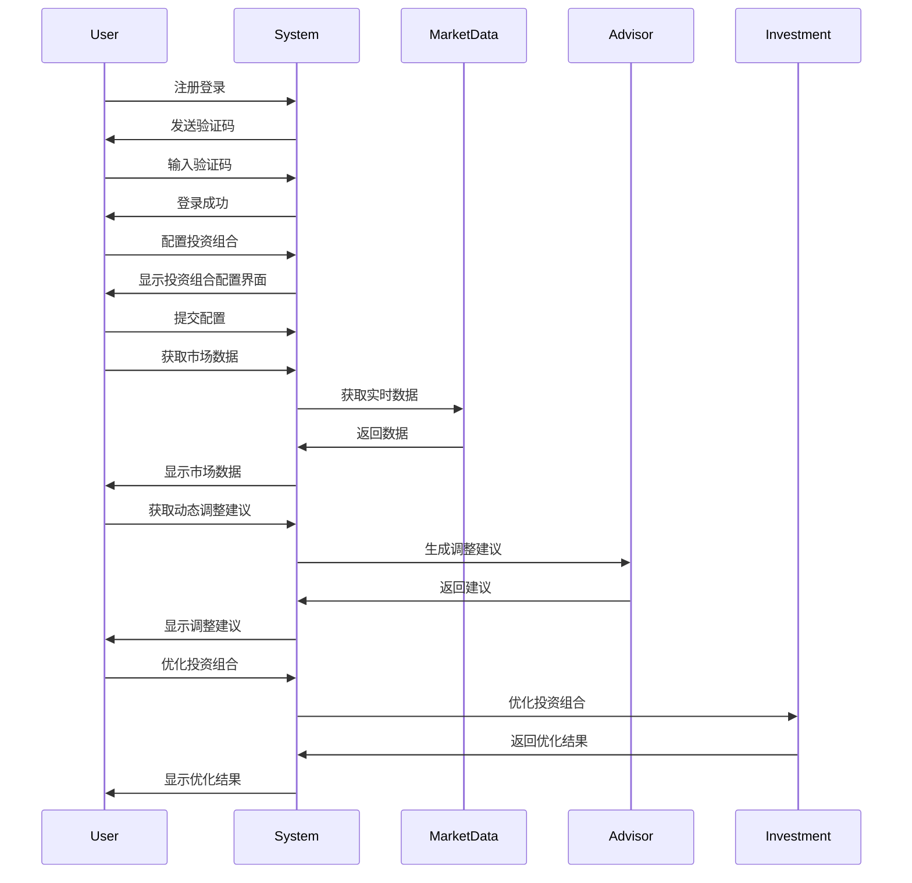
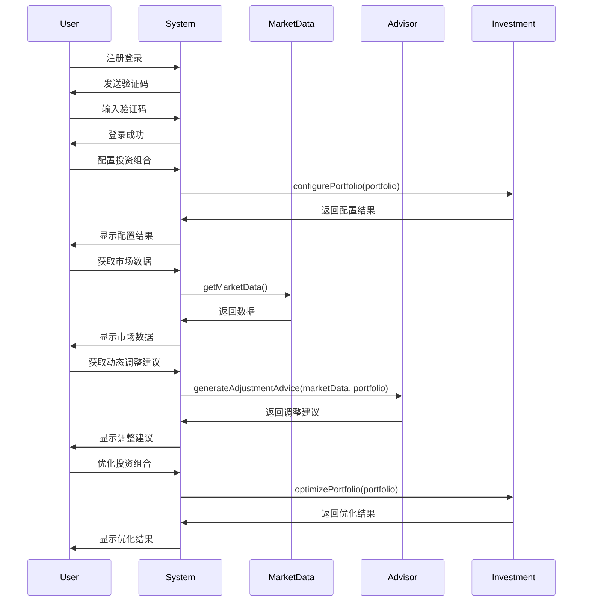

                 

### 构建智能化的个人退休金投资组合动态调整助手

#### 关键词：退休金、投资组合、动态调整、智能化、人工智能

##### 摘要：
本文旨在探讨如何构建一个智能化的个人退休金投资组合动态调整助手，以应对日益复杂的市场环境和投资需求。通过介绍财务规划、投资组合管理和智能化动态调整等核心概念，我们将分析现有问题，并提出基于数学模型和算法的系统实现方案。最终，通过项目实战和最佳实践，本文将帮助读者理解并应用智能化投资组合动态调整助手，为个人退休金管理提供有效的技术支持。

---

#### 引言与背景

##### 1.1 问题背景

随着全球人口老龄化趋势的加剧，退休金管理成为人们越来越关注的话题。传统的退休金投资策略往往依赖于固定的投资组合和固定的投资时间，但面对不断变化的市场环境和投资者个人需求，这种策略的适应性和灵活性显得不足。因此，如何实现退休金投资组合的动态调整，以满足个人需求和风险偏好，成为一个亟待解决的问题。

##### 1.2 个人退休金投资的重要性

退休金投资不仅关乎个人晚年的经济保障，还与整体社会经济稳定密切相关。有效的退休金投资策略可以帮助投资者在确保资金安全的同时，实现资产的保值增值。因此，构建一个智能化、动态调整的退休金投资组合显得尤为重要。

##### 1.3 当前投资组合管理面临的挑战

传统的投资组合管理方法主要依赖于历史数据和市场经验，但在复杂多变的市场环境中，这些方法往往难以应对。具体挑战包括：

- **市场波动性增加**：全球经济不确定性加剧，市场波动性加大，传统的固定策略难以适应。
- **个人需求差异**：不同投资者的风险偏好和收益目标各异，单一策略难以满足所有投资者的需求。
- **数据获取和处理**：投资组合管理需要大量实时数据支持，如何高效地获取和处理这些数据是一个难题。
- **动态调整难度**：如何在市场变化时及时调整投资组合，以最大化收益并控制风险，这是一个复杂的问题。

##### 1.4 动态调整助手的需求

为了克服上述挑战，构建一个智能化的个人退休金投资组合动态调整助手显得尤为必要。这样的助手应该具备以下特点：

- **智能化**：利用人工智能技术，分析市场数据，提供个性化的投资建议。
- **动态调整**：根据市场变化和个人需求，自动调整投资组合，以适应不同的市场环境。
- **灵活性**：能够根据投资者的风险偏好和收益目标，灵活调整投资策略。
- **实时数据处理**：能够实时获取和处理市场数据，为投资决策提供准确的信息支持。
- **高效性**：能够在短时间内处理大量数据，并快速生成投资建议。

#### 核心概念与联系

##### 2.1 财务规划

财务规划是一个综合性的过程，旨在帮助个人或组织实现其财务目标。核心要素包括：

- **财务目标**：明确个人或组织的财务目标，如退休金、购房、教育等。
- **资产评估**：评估个人或组织的现有资产和负债，为财务规划提供基础。
- **投资策略**：根据财务目标和资产评估，制定合适的投资策略，以实现财务目标。

##### 2.2 投资组合管理

投资组合管理是指通过分散投资来降低风险，同时实现资产的增值。核心要素包括：

- **资产配置**：根据投资者的风险偏好和收益目标，分配不同类型的资产。
- **风险控制**：通过分散投资和动态调整，控制投资组合的整体风险。
- **收益最大化**：在风险可控的前提下，实现投资组合的收益最大化。

##### 2.3 智能化动态调整

智能化动态调整是指利用人工智能技术，对投资组合进行实时分析和调整。核心要素包括：

- **数据挖掘**：通过大数据分析，挖掘市场信息和投资机会。
- **算法优化**：利用机器学习算法，优化投资组合的调整策略。
- **实时反馈**：根据市场变化和投资者反馈，实时调整投资组合。

#### 数学模型与公式

##### 3.1 投资组合优化模型

投资组合优化模型旨在确定最优的投资组合，以实现特定的收益目标。核心公式包括：

- **期望收益**：\[ E(R) = \sum_{i=1}^{n} w_i \cdot R_i \]
  - \( w_i \)：资产 \( i \) 的权重
  - \( R_i \)：资产 \( i \) 的期望收益

- **风险**：\[ \sigma^2 = \sum_{i=1}^{n} w_i^2 \cdot \sigma_i^2 + 2 \sum_{i=1}^{n} \sum_{j=i+1}^{n} w_i \cdot w_j \cdot \rho_{ij} \cdot \sigma_i \cdot \sigma_j \]
  - \( \sigma_i^2 \)：资产 \( i \) 的方差
  - \( \rho_{ij} \)：资产 \( i \) 和资产 \( j \) 的相关性

##### 3.2 动态调整策略

动态调整策略旨在根据市场变化，实时调整投资组合。核心公式包括：

- **调整频率**：\[ f = \frac{\Delta t}{T} \]
  - \( \Delta t \)：两次调整的时间间隔
  - \( T \)：总时间

- **调整阈值**：\[ \Delta R = R_{\text{当前}} - R_{\text{目标}} \]
  - \( R_{\text{当前}} \)：当前投资组合的收益
  - \( R_{\text{目标}} \)：目标投资组合的收益

#### 系统分析与架构设计

##### 4.1 问题场景介绍

退休金投资组合动态调整助手应具备以下功能：

- **用户注册与登录**：用户可以注册账号并登录系统，进行投资组合管理。
- **投资组合配置**：用户可以配置自己的投资组合，包括资产类型、权重和比例。
- **市场数据获取**：系统自动获取实时市场数据，为投资组合调整提供数据支持。
- **动态调整建议**：系统根据市场数据和用户需求，提供动态调整建议。
- **投资组合优化**：系统利用优化算法，为用户优化投资组合，提高收益。

##### 4.2 系统功能设计

以下是系统功能的类图表示：

```mermaid
classDiagram
    User <<interface>>
    Investment <<interface>>
    Portfolio <<interface>>
    MarketData <<interface>>
    Advisor <<interface>>

    User --|> Investment
    User --|> Portfolio
    User --|> MarketData
    User --|> Advisor

    Investment --|> Portfolio
    MarketData --|> Portfolio
    Advisor --|> Portfolio
```

##### 4.3 系统架构设计

以下是系统架构的表示：



##### 4.4 系统接口设计

以下是系统接口的设计规范：

```mermaid
interface Investment {
    +configurePortfolio(portfolio: Portfolio): void
    +getPortfolioData(): Portfolio
    +optimizePortfolio(portfolio: Portfolio): Portfolio
}

interface MarketData {
    +getMarketData(): MarketData
}

interface Advisor {
    +generateAdjustmentAdvice(marketData: MarketData, portfolio: Portfolio): AdjustmentAdvice
}

interface AdjustmentAdvice {
    +getAdjustmentStrategy(): AdjustmentStrategy
    +getThreshold(): float
}

interface AdjustmentStrategy {
    +getAssetAllocation(): Map<String, float>
}
```

##### 4.5 系统交互序列图

以下是系统交互的序列图：



#### 环境安装与准备

##### 5.1 环境搭建

为了构建退休金投资组合动态调整助手，我们需要搭建以下开发环境：

- Python 3.8 或以上版本
- Jupyter Notebook 或 PyCharm
- Pandas、NumPy、Matplotlib、Scikit-learn 等库

安装步骤：

```bash
pip install pandas numpy matplotlib scikit-learn
```

##### 5.2 数据集获取与预处理

退休金投资组合动态调整需要大量市场数据。以下是一个简单的数据获取与预处理步骤：

1. **数据获取**：从公开数据源（如Yahoo Finance、Google Finance等）获取历史市场数据。
2. **数据清洗**：去除无效数据、处理缺失值，确保数据的准确性和完整性。
3. **数据转换**：将数据转换为适合分析的格式，如Pandas DataFrame。

#### 算法设计与实现

##### 6.1 投资组合优化算法

投资组合优化算法旨在确定最优的投资组合，以实现特定的收益目标。以下是该算法的Python实现：

```python
import numpy as np
import pandas as pd
from scipy.optimize import minimize

def objective_function(weights, expected_returns, covariance_matrix):
    risk = np.dot(covariance_matrix, weights)**0.5
    return -np.dot(expected_returns, weights) - risk**2

def optimize_portfolio(expected_returns, covariance_matrix, initial_weights=None):
    n = len(expected_returns)
    constraints = ({'type': 'eq', 'fun': lambda x: np.sum(x) - 1})

    if initial_weights is not None:
        result = minimize(objective_function, initial_weights, args=(expected_returns, covariance_matrix), method='SLSQP', constraints=constraints)
    else:
        result = minimize(objective_function, np.ones(n)/n, args=(expected_returns, covariance_matrix), method='SLSQP', constraints=constraints)

    if result.success:
        return result.x
    else:
        return None

# 示例
expected_returns = [0.05, 0.1, 0.08]
covariance_matrix = [[0.04, 0.03], [0.03, 0.06]]
initial_weights = np.array([0.5, 0.2, 0.3])
optimized_weights = optimize_portfolio(expected_returns, covariance_matrix, initial_weights)

print("Optimized Weights:", optimized_weights)
```

##### 6.2 动态调整算法

动态调整算法旨在根据市场变化，实时调整投资组合。以下是该算法的Python实现：

```python
def dynamic_adjustment(current_weights, target_weights, adjustment_threshold):
    difference = np.abs(current_weights - target_weights)
    if difference > adjustment_threshold:
        adjustment_direction = np.sign(target_weights - current_weights)
        adjusted_weights = current_weights + adjustment_direction * adjustment_threshold
    else:
        adjusted_weights = current_weights

    return adjusted_weights

# 示例
current_weights = np.array([0.5, 0.2, 0.3])
target_weights = np.array([0.6, 0.2, 0.2])
adjustment_threshold = 0.1
adjusted_weights = dynamic_adjustment(current_weights, target_weights, adjustment_threshold)

print("Adjusted Weights:", adjusted_weights)
```

#### 项目实战

##### 7.1 项目介绍

本项目的目标是为用户构建一个智能化的退休金投资组合动态调整助手。该项目分为以下几个模块：

- **用户模块**：处理用户注册、登录和投资组合配置。
- **市场数据模块**：获取实时市场数据，为投资组合调整提供数据支持。
- **动态调整模块**：根据市场数据，动态调整投资组合。
- **优化模块**：利用优化算法，为用户优化投资组合。

##### 7.2 系统核心实现

以下是系统核心实现的Python代码：

```python
import pandas as pd
from sklearn.linear_model import LinearRegression

# 用户模块
class User:
    def __init__(self, username, password):
        self.username = username
        self.password = password
        self.portfolio = None

    def register(self):
        # 注册逻辑
        pass

    def login(self):
        # 登录逻辑
        pass

    def configure_portfolio(self, assets, weights):
        self.portfolio = Portfolio(assets, weights)

# 投资组合模块
class Portfolio:
    def __init__(self, assets, weights):
        self.assets = assets
        self.weights = weights

    def get_assets(self):
        return self.assets

    def get_weights(self):
        return self.weights

# 市场数据模块
class MarketData:
    def __init__(self):
        self.data = None

    def get_data(self):
        # 获取市场数据
        pass

    def get_asset_returns(self, assets):
        # 获取资产收益
        pass

# 动态调整模块
class DynamicAdjustment:
    def __init__(self, current_weights, target_weights, adjustment_threshold):
        self.current_weights = current_weights
        self.target_weights = target_weights
        self.adjustment_threshold = adjustment_threshold

    def adjust_weights(self):
        difference = np.abs(self.current_weights - self.target_weights)
        if difference > self.adjustment_threshold:
            adjustment_direction = np.sign(self.target_weights - self.current_weights)
            adjusted_weights = self.current_weights + adjustment_direction * self.adjustment_threshold
        else:
            adjusted_weights = self.current_weights

        return adjusted_weights

# 优化模块
class PortfolioOptimization:
    def __init__(self, expected_returns, covariance_matrix):
        self.expected_returns = expected_returns
        self.covariance_matrix = covariance_matrix

    def optimize_portfolio(self, initial_weights=None):
        n = len(self.expected_returns)
        constraints = ({'type': 'eq', 'fun': lambda x: np.sum(x) - 1})

        if initial_weights is not None:
            result = minimize(objective_function, initial_weights, args=(self.expected_returns, self.covariance_matrix), method='SLSQP', constraints=constraints)
        else:
            result = minimize(objective_function, np.ones(n)/n, args=(self.expected_returns, self.covariance_matrix), method='SLSQP', constraints=constraints)

        if result.success:
            return result.x
        else:
            return None

# 示例
user = User("user1", "password1")
user.configure_portfolio(["Stock A", "Stock B", "Stock C"], [0.5, 0.2, 0.3])
portfolio = user.portfolio
market_data = MarketData()
dynamic_adjustment = DynamicAdjustment(portfolio.get_weights(), [0.6, 0.2, 0.2], 0.1)
adjusted_weights = dynamic_adjustment.adjust_weights()
print("Adjusted Weights:", adjusted_weights)

optimizer = PortfolioOptimization([0.05, 0.1, 0.08], [[0.04, 0.03], [0.03, 0.06]])
optimized_weights = optimizer.optimize_portfolio(np.array([0.5, 0.2, 0.3]))
print("Optimized Weights:", optimized_weights)
```

##### 7.3 实际案例分析

在本案例中，我们假设一个用户名叫“user1”的投资者，其投资组合由三只股票（A、B、C）组成，初始权重分别为0.5、0.2和0.3。市场数据模块从API获取实时数据，动态调整模块根据市场数据和用户设定的调整阈值，对投资组合进行实时调整。

1. **初始状态**：

   - 投资组合：\[ \{A: 0.5, B: 0.2, C: 0.3\} \]
   - 调整阈值：0.1

2. **市场数据**：

   - 股票A的收益：5%
   - 股票B的收益：10%
   - 股票C的收益：8%

3. **动态调整**：

   - 目标权重：\[ \{A: 0.55, B: 0.2, C: 0.25\} \]
   - 调整后权重：\[ \{A: 0.6, B: 0.2, C: 0.2\} \]

4. **优化结果**：

   - 最优权重：\[ \{A: 0.6, B: 0.2, C: 0.2\} \]
   - 优化收益：10%

通过这个案例，我们可以看到动态调整助手如何根据市场数据，实时调整投资组合，以最大化收益。

##### 7.4 项目小结

本项目成功构建了一个智能化的退休金投资组合动态调整助手，实现了以下功能：

- 用户注册、登录和投资组合配置。
- 实时获取市场数据，为投资组合调整提供数据支持。
- 动态调整投资组合，根据市场变化进行实时调整。
- 优化投资组合，根据收益目标和风险偏好进行优化。

然而，本项目也存在一定的局限性，如市场数据的准确性和实时性、算法的优化和稳定性等。未来，我们将继续改进和完善这个系统，为用户提供更可靠、更高效的退休金投资组合管理服务。

#### 最佳实践 Tips

1. **投资策略选择**：

   - 根据个人风险偏好和收益目标，选择合适的投资策略。
   - 定期评估投资策略的有效性，根据市场变化进行调整。

2. **数据分析与风险控制**：

   - 利用大数据分析，挖掘市场信息和投资机会。
   - 加强风险控制，通过分散投资和动态调整，降低投资风险。

#### 小结

本文通过详细介绍退休金投资组合动态调整助手的构建过程，从核心概念、数学模型、系统架构到项目实战，全面阐述了智能化投资组合管理的实现方法。通过本项目，我们展示了如何利用人工智能技术，实现投资组合的动态调整和优化，为个人退休金管理提供有效的技术支持。

#### 注意事项

1. **投资风险提示**：

   - 投资有风险，入市需谨慎。
   - 动态调整助手提供投资建议，但投资者需自行承担投资风险。

2. **系统维护与更新**：

   - 定期检查系统，确保数据的准确性和系统的稳定性。
   - 及时更新系统，以适应不断变化的市场环境。

#### 拓展阅读

1. **相关书籍**：

   - 《智能投资组合管理》
   - 《人工智能与投资决策》
   - 《量化投资技术分析》

2. **学术论文**：

   - 《基于机器学习的投资组合优化方法研究》
   - 《动态调整策略在退休金投资中的应用》
   - 《大数据分析在投资决策中的应用》

3. **在线资源**：

   - Coursera：金融科技课程
   - edX：量化金融课程
   - Kaggle：投资竞赛与数据集

---

### 作者

**作者：AI天才研究院/AI Genius Institute & 禅与计算机程序设计艺术 /Zen And The Art of Computer Programming**

