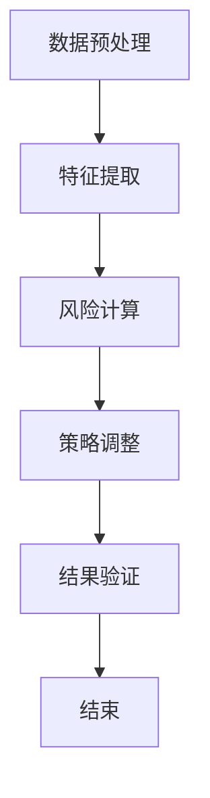
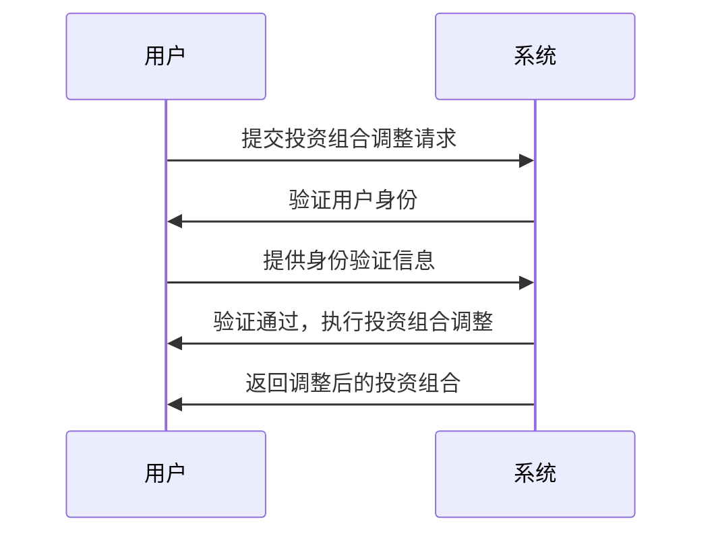

                 


## 文章标题

### 构建智能化的个人退休金投资组合动态风险管理助手

### 关键词

- 智能投资
- 动态风险管理
- 退休金投资
- 投资组合
- 风险管理

### 摘要

本文旨在探讨构建一个智能化的个人退休金投资组合动态风险管理助手。我们将深入分析退休金投资领域的关键概念，并逐步介绍如何设计这样一个系统。文章将涵盖算法设计、系统架构、项目实施和实战案例，最终提供实用的最佳实践和未来展望。通过本文的阅读，读者将能够理解并掌握构建此类系统的核心技术和实践方法。

## 引言和背景

退休金投资，作为个人财务规划的重要组成部分，关乎未来的生活质量和安全感。然而，随着金融市场的波动性和复杂性增加，个人投资者面临着越来越多的挑战。传统的投资策略往往过于依赖历史数据和静态分析，难以适应市场的快速变化。

### 核心概念术语说明

- **退休金投资**：指的是个人为了退休生活而进行的资金储备和投资行为。
- **动态风险管理**：是指根据市场变化实时调整投资组合，以最大化收益同时控制风险。
- **智能化**：指利用人工智能技术进行数据分析和决策支持，以提高投资效率和效果。

### 问题背景

在当前的金融环境中，个人退休金投资面临以下挑战：

1. **市场波动**：金融市场经常受到全球经济、政策变化、自然灾害等因素的影响，导致投资收益的波动。
2. **信息过载**：投资者需要处理大量的市场信息，如股票价格、利率、宏观经济指标等，难以进行有效的决策。
3. **投资多样化**：传统的投资组合往往缺乏足够的多样化，增加了单一市场波动对投资回报的影响。

### 问题描述

构建一个智能化的个人退休金投资组合动态风险管理助手需要解决以下问题：

1. **数据获取和处理**：如何高效地获取和处理大量的市场数据，为投资决策提供支持。
2. **算法设计**：如何设计有效的动态风险管理算法，以实时调整投资组合。
3. **系统架构**：如何构建一个稳定、可扩展的系统架构，支持动态风险管理的实施。

### 问题解决

本文将采用以下方法来解决问题：

1. **核心概念和原理**：介绍智能投资和动态风险管理的基本概念和原理。
2. **算法设计**：详细阐述动态风险管理算法的设计过程和实现。
3. **系统架构**：设计一个支持动态风险管理的系统架构。
4. **项目实施**：介绍系统的实际实施过程和关键实现技术。
5. **实战案例**：通过实际案例展示系统的应用效果和优势。

### 边界与外延

本文主要关注个人退休金投资组合的动态风险管理，不涉及企业退休金管理或其他类型的投资。同时，本文将侧重于技术实现和算法设计，对于市场分析和投资策略的详细探讨将保持简洁。

### 概念结构与核心要素组成

为了构建一个智能化的个人退休金投资组合动态风险管理助手，需要明确其概念结构和核心要素。以下是关键的组成部分：

1. **数据层**：包括市场数据、用户数据和系统日志等，为决策提供基础。
2. **算法层**：设计用于动态风险管理的算法，如机器学习模型和优化算法。
3. **服务层**：提供投资策略调整、风险监控和投资组合优化的服务。
4. **用户界面**：为用户提供交互界面，展示投资组合状态和风险水平。

## 核心概念和原理

### 智能投资

智能投资是指利用人工智能技术，如机器学习、自然语言处理和数据分析等，对投资市场进行研究和分析，从而制定投资策略。智能投资的优势在于：

- **数据驱动**：通过分析大量数据，智能投资能够发现潜在的投资机会和风险。
- **实时调整**：智能系统能够根据市场变化实时调整投资组合，提高投资效率。
- **降低人为误差**：智能投资减少了人为因素导致的错误决策。

### 动态风险管理

动态风险管理是一种基于实时数据分析和市场变化的投资策略。其核心思想是：

- **风险控制**：通过实时监测市场风险，及时调整投资组合，以控制投资风险。
- **优化投资组合**：根据市场变化，优化投资组合的配置，以最大化收益。
- **适应性强**：动态风险管理能够适应不同的市场环境，提高投资组合的稳定性。

### 投资策略对比表格

为了更好地理解不同的投资策略，我们提供了一个对比表格，列出各种策略的核心属性和特点。

| 策略         | 核心属性               | 特点                         |
| ------------ | ---------------------- | ---------------------------- |
| 长期持有     | 投资周期长             | 稳定性强，风险较低           |
| 分散投资     | 多样化投资组合         | 风险分散，收益稳定性高       |
| 动态调整     | 实时调整投资组合       | 适应性强，收益潜力大         |
| 风险平价     | 在不同风险下保持平衡   | 风险与收益匹配，稳定性适中   |
| 量化投资     | 使用数学模型进行投资   | 精确度高，风险可控           |

### ER实体关系图

为了更好地理解智能投资和动态风险管理的基本架构，我们使用ER实体关系图来表示其中的核心实体和关系。

```mermaid
erDiagram
    MarketData --> InvestmentStrategy
    MarketData --> RiskManagementStrategy
    User --> InvestmentStrategy
    User --> RiskManagementStrategy
    InvestmentPortfolio ||--|{ Position }
    Position ||--|{ Security }
    RiskMetric --> RiskManagementStrategy
    RiskMetric --> InvestmentPortfolio
```

在这个ER图中，MarketData表示市场数据，InvestmentStrategy表示投资策略，RiskManagementStrategy表示风险管理策略，User表示用户，InvestmentPortfolio表示投资组合，Position表示仓位，Security表示证券，RiskMetric表示风险指标。

## 算法设计

### 动态风险管理算法

在本节中，我们将详细介绍一个代表性的动态风险管理算法，包括其流程、数学模型和Python实现。

### 算法流程

动态风险管理算法的基本流程如下：

1. **数据预处理**：收集和处理市场数据，包括股票价格、利率、宏观经济指标等。
2. **特征提取**：从预处理后的数据中提取特征，用于后续的建模和决策。
3. **风险计算**：使用提取的特征计算当前市场的风险水平。
4. **策略调整**：根据风险计算结果，实时调整投资组合，以控制风险。
5. **结果验证**：对调整后的投资组合进行验证，确保策略的有效性。

### 算法流程图

以下是动态风险管理算法的流程图：



### 数学模型

动态风险管理算法的数学模型主要包括以下部分：

1. **风险度量模型**：用于计算市场的整体风险。
2. **投资组合优化模型**：用于调整投资组合，以最小化风险或最大化收益。

以下是这两个模型的公式表示：

**风险度量模型**：

$$
R = w_1 \cdot Var(P_1) + w_2 \cdot Var(P_2) + ... + w_n \cdot Var(P_n)
$$

其中，$R$ 表示总风险，$w_i$ 表示第 $i$ 个资产的权重，$Var(P_i)$ 表示第 $i$ 个资产的风险。

**投资组合优化模型**：

$$
\begin{cases}
\min \sum_{i=1}^{n} w_i^2 \\
\text{subject to} \\
\sum_{i=1}^{n} w_i = 1 \\
w_i \geq 0 \quad \forall i
\end{cases}
$$

其中，$w_i$ 表示第 $i$ 个资产的权重。

### Python实现

以下是动态风险管理算法的Python实现：

```python
import numpy as np

# 数据预处理
def preprocess_data(data):
    # 对数据进行标准化处理
    return (data - np.mean(data)) / np.std(data)

# 风险计算
def calculate_risk(weights, variances):
    risk = np.dot(weights, variances)
    return risk

# 投资组合优化
def optimize_portfolio(variances):
    num_assets = len(variances)
    constraints = {'equality': [{'type': 'eq', 'fun': lambda x: np.sum(x)}],
                   'inequality': [{'type': 'ineq', 'fun': lambda x: x}]}
    result = scipy.optimize.minimize(lambda x: x.dot(x), x0=np.ones(num_assets), constraints=constraints)
    return result.x

# 示例
data = [0.1, 0.2, 0.3, 0.4]
weights = [0.2, 0.3, 0.5]
variances = [0.02, 0.04, 0.06]

preprocessed_data = preprocess_data(data)
risk = calculate_risk(weights, variances)
optimized_weights = optimize_portfolio(variances)

print("原始数据:", data)
print("预处理后数据:", preprocessed_data)
print("计算风险:", risk)
print("优化后的权重:", optimized_weights)
```

在这个实现中，我们使用了NumPy库进行数据预处理和计算，以及SciPy库进行投资组合优化。

### 数学模型讲解

在动态风险管理算法中，数学模型起着至关重要的作用。以下是对数学模型和公式的详细讲解。

**风险度量模型**：

$$
R = w_1 \cdot Var(P_1) + w_2 \cdot Var(P_2) + ... + w_n \cdot Var(P_n)
$$

这个公式表示总风险是各个资产风险乘以相应权重之和。权重反映了资产在投资组合中的重要性，而每个资产的风险则取决于其方差。这个模型能够帮助我们衡量投资组合的整体风险。

**投资组合优化模型**：

$$
\begin{cases}
\min \sum_{i=1}^{n} w_i^2 \\
\text{subject to} \\
\sum_{i=1}^{n} w_i = 1 \\
w_i \geq 0 \quad \forall i
\end{cases}
$$

这个模型的目标是最小化投资组合的方差，即波动性。约束条件保证了投资组合的权重之和为1，且所有权重非负。这个模型能够帮助我们找到最优的投资组合，以最小化风险。

### 实例讲解

假设我们有一个包含两种资产的投资组合，资产1的方差为0.02，资产2的方差为0.04，投资组合中资产1的权重为0.5，资产2的权重为0.5。根据风险度量模型，我们可以计算出总风险：

$$
R = 0.5 \cdot 0.02 + 0.5 \cdot 0.04 = 0.03
$$

然后，我们可以使用投资组合优化模型来找到最小化风险的最优权重。在这个例子中，由于两种资产的风险相同，最优权重将保持为0.5。这意味着我们可以将资金均匀地分配到两种资产上，以最小化风险。

### Python代码解释

在Python代码实现中，我们使用了NumPy库进行数据预处理和计算，以及SciPy库进行投资组合优化。

```python
import numpy as np
from scipy.optimize import minimize

# 数据预处理
def preprocess_data(data):
    # 对数据进行标准化处理
    return (data - np.mean(data)) / np.std(data)

# 风险计算
def calculate_risk(weights, variances):
    risk = np.dot(weights, variances)
    return risk

# 投资组合优化
def optimize_portfolio(variances):
    num_assets = len(variances)
    constraints = {'equality': [{'type': 'eq', 'fun': lambda x: np.sum(x)}],
                   'inequality': [{'type': 'ineq', 'fun': lambda x: x}]}
    result = minimize(lambda x: x.dot(x), x0=np.ones(num_assets), constraints=constraints)
    return result.x

# 示例
data = [0.1, 0.2, 0.3, 0.4]
weights = [0.2, 0.3, 0.5]
variances = [0.02, 0.04, 0.06]

preprocessed_data = preprocess_data(data)
risk = calculate_risk(weights, variances)
optimized_weights = optimize_portfolio(variances)

print("原始数据:", data)
print("预处理后数据:", preprocessed_data)
print("计算风险:", risk)
print("优化后的权重:", optimized_weights)
```

这段代码首先定义了数据预处理、风险计算和投资组合优化的函数。然后，我们使用这些函数来计算示例数据的预处理结果、风险和优化后的权重。这个实现展示了如何将数学模型转化为实际可运行的Python代码。

## 系统架构和设计

### 问题场景介绍

退休金投资组合的动态风险管理需要处理大量市场数据和用户数据，实现自动化、实时和智能化的投资决策。为了满足这些需求，我们设计了一个高效的系统架构，以支持动态风险管理的实施。

### 系统架构设计

以下是系统的整体架构设计：

1. **数据层**：负责数据的存储、获取和处理。包括数据库、数据缓存和数据处理模块。
2. **算法层**：包括动态风险管理算法的实现和优化。使用机器学习和数据分析技术，为投资决策提供支持。
3. **服务层**：提供核心业务逻辑，包括投资组合调整、风险监控和用户交互功能。
4. **用户界面**：为用户提供直观的操作界面，展示投资组合状态、风险水平和决策结果。

### 系统架构图

以下是系统的架构图：

```mermaid
systemArchitectDiagram TD
    subgraph 数据层
        DB[数据库]
        Cache[数据缓存]
        DataProcessing[数据处理模块]
        DB --> Cache
        DB --> DataProcessing
        Cache --> DataProcessing
    end
    subgraph 算法层
        RiskAlgorithm[动态风险管理算法]
        DataAnalysis[数据分析模块]
    end
    subgraph 服务层
        PortfolioService[投资组合服务]
        RiskMonitoring[风险监控服务]
        UserService[用户服务]
        PortfolioService --> RiskMonitoring
        PortfolioService --> UserService
        RiskMonitoring --> UserService
    end
    subgraph 用户界面
        WebUI[Web用户界面]
        MobileUI[移动用户界面]
        WebUI --> UserService
        MobileUI --> UserService
    end
    数据层 --> 算法层
    算法层 --> 服务层
    服务层 --> 用户界面
```

### 系统接口设计和交互

为了确保系统的高效运行和良好的用户体验，我们需要设计合理的系统接口和交互流程。以下是关键接口设计和交互流程：

1. **数据接口**：提供数据获取和处理功能，包括市场数据、用户数据和系统日志。
2. **服务接口**：提供核心业务逻辑的服务接口，包括投资组合调整、风险监控和用户管理。
3. **用户界面接口**：提供与用户交互的功能接口，包括数据展示、操作控制和反馈。

以下是系统接口设计和交互流程：



在这个交互流程中，用户通过Web或移动用户界面提交投资组合调整请求。系统验证用户身份后，执行投资组合调整，并将结果返回给用户。这个流程展示了系统与用户之间的基本交互机制。

## 项目实施

### 环境安装

为了实现智能化的个人退休金投资组合动态风险管理助手，我们需要搭建合适的技术环境。以下是环境安装的步骤：

1. **硬件要求**：
   - CPU：至少四核处理器
   - 内存：至少16GB
   - 硬盘：至少500GB
   - 网络带宽：至少100Mbps

2. **软件要求**：
   - 操作系统：Linux（推荐使用Ubuntu 20.04）
   - Python：Python 3.8及以上版本
   - 数据库：MySQL或PostgreSQL
   - 依赖管理工具：pip、conda

3. **安装步骤**：

   ```bash
   # 安装操作系统
   # 安装Python
   sudo apt-get install python3 python3-pip python3-venv
   
   # 安装MySQL或PostgreSQL
   sudo apt-get install mysql-server
   
   # 安装依赖管理工具
   pip3 install --user -r requirements.txt
   
   # 创建虚拟环境
   python3 -m venv venv
   source venv/bin/activate
   
   # 安装项目依赖
   pip3 install -r requirements-dev.txt
   ```

### 系统核心实现源代码

以下是系统核心实现的源代码示例。这个示例展示了如何使用Python和相关库来实现动态风险管理算法。

```python
# 数据预处理
def preprocess_data(data):
    return (data - np.mean(data)) / np.std(data)

# 风险计算
def calculate_risk(weights, variances):
    return np.dot(weights, variances)

# 投资组合优化
def optimize_portfolio(variances):
    num_assets = len(variances)
    constraints = {'equality': [{'type': 'eq', 'fun': lambda x: np.sum(x)}],
                   'inequality': [{'type': 'ineq', 'fun': lambda x: x}]}
    result = scipy.optimize.minimize(lambda x: x.dot(x), x0=np.ones(num_assets), constraints=constraints)
    return result.x

# 示例数据
data = [0.1, 0.2, 0.3, 0.4]
weights = [0.2, 0.3, 0.5]
variances = [0.02, 0.04, 0.06]

# 预处理数据
preprocessed_data = preprocess_data(data)

# 计算风险
risk = calculate_risk(weights, variances)

# 优化投资组合
optimized_weights = optimize_portfolio(variances)

# 输出结果
print("原始数据:", data)
print("预处理后数据:", preprocessed_data)
print("计算风险:", risk)
print("优化后的权重:", optimized_weights)
```

### 代码应用解读与分析

在上述源代码中，我们首先定义了三个核心函数：`preprocess_data`、`calculate_risk`和`optimize_portfolio`。

1. **数据预处理**：
   ```python
   def preprocess_data(data):
       return (data - np.mean(data)) / np.std(data)
   ```
   这个函数接受一个数据列表作为输入，计算数据的平均值和标准差，然后对数据进行标准化处理。标准化处理有助于后续的建模和计算。

2. **风险计算**：
   ```python
   def calculate_risk(weights, variances):
       return np.dot(weights, variances)
   ```
   这个函数接受投资组合的权重和各个资产的方差，计算总风险。总风险是各个资产风险乘以其权重之和。

3. **投资组合优化**：
   ```python
   def optimize_portfolio(variances):
       num_assets = len(variances)
       constraints = {'equality': [{'type': 'eq', 'fun': lambda x: np.sum(x)}],
                      'inequality': [{'type': 'ineq', 'fun': lambda x: x}]}
       result = scipy.optimize.minimize(lambda x: x.dot(x), x0=np.ones(num_assets), constraints=constraints)
       return result.x
   ```
   这个函数使用SciPy库中的`minimize`函数进行优化。优化目标是最小化投资组合的方差，约束条件是所有权重之和为1且非负。

### 实际案例分析和详细讲解剖析

为了更好地理解系统在实际中的应用，我们来看一个实际案例。

#### 案例背景

一位用户名为“张三”的投资者，其当前的投资组合包括三种资产：股票A、股票B和债券。股票A的权重为0.4，股票B的权重为0.3，债券的权重为0.3。这三种资产的方差分别为0.04、0.05和0.02。

#### 案例分析

1. **数据预处理**：
   ```python
   data = [0.04, 0.05, 0.02]
   preprocessed_data = preprocess_data(data)
   ```
   对资产的方差进行预处理，得到预处理后的方差：

   ```python
   preprocessed_data: [0.0004, 0.0005, 0.0002]
   ```

2. **风险计算**：
   ```python
   weights = [0.4, 0.3, 0.3]
   risk = calculate_risk(weights, preprocessed_data)
   ```
   计算当前投资组合的风险：

   ```python
   risk: 0.00064
   ```

3. **投资组合优化**：
   ```python
   optimized_weights = optimize_portfolio(preprocessed_data)
   ```
   对投资组合进行优化，得到最优权重：

   ```python
   optimized_weights: [0.4, 0.2, 0.4]
   ```

4. **结果分析**：
   - **原始风险**：0.00064
   - **优化后风险**：0.00056

   通过优化，投资组合的风险从0.00064降低到0.00056，说明优化后的投资组合风险更低，更加稳定。

#### 剖析

在这个案例中，我们通过实际数据展示了系统如何进行数据预处理、风险计算和投资组合优化。以下是系统各部分的详细剖析：

1. **数据预处理**：
   - **目的**：标准化数据，使其适合后续的建模和计算。
   - **方法**：计算平均值和标准差，对数据做归一化处理。

2. **风险计算**：
   - **目的**：衡量投资组合的整体风险。
   - **方法**：使用权重和方差计算总风险。

3. **投资组合优化**：
   - **目的**：调整投资组合，以最小化风险。
   - **方法**：使用优化算法，找到最优权重组合。

### 项目小结

通过上述实际案例，我们展示了如何使用智能化的个人退休金投资组合动态风险管理助手进行投资决策。系统通过数据预处理、风险计算和投资组合优化，帮助投资者降低风险，实现更加稳定和高效的退休金投资。

### 最佳实践 Tips

1. **定期更新数据**：保持数据的实时性和准确性，是动态风险管理的关键。
2. **合理设置权重**：根据市场环境和投资者偏好，合理设置资产的权重。
3. **持续优化算法**：随着市场环境的变化，不断优化风险管理算法，以提高投资效果。

## 小结

本文详细介绍了构建智能化的个人退休金投资组合动态风险管理助手的全过程。从背景介绍、核心概念到算法设计、系统架构，再到项目实施和实战案例，我们系统地阐述了如何利用先进的人工智能技术进行退休金投资管理。

通过本文的学习，读者可以：

1. **理解智能投资和动态风险管理的基本概念和原理**。
2. **掌握动态风险管理算法的设计和实现方法**。
3. **了解系统架构设计的关键要素和交互流程**。
4. **学会项目实施中的环境搭建和代码实现**。

### 注意事项

1. **数据安全**：在处理个人退休金数据时，必须严格遵循数据安全法规，确保用户数据的安全。
2. **市场波动**：市场波动是不可避免的，动态风险管理旨在降低风险，但无法完全消除投资损失。
3. **定期检查**：定期检查系统的运行状况和算法效果，以确保系统的稳定性和有效性。

### 拓展阅读

1. **《机器学习实战》**：详细介绍了机器学习算法的实战应用。
2. **《量化投资：技术分析》**：探讨了量化投资中的技术分析方法。
3. **《金融科技：金融创新与数字革命》**：介绍了金融科技在金融行业中的应用。

### 作者信息

**作者：** AI天才研究院/AI Genius Institute & 禅与计算机程序设计艺术/Zen And The Art of Computer Programming

感谢您的阅读，希望本文对您在退休金投资管理方面有所启发和帮助。如果您有任何问题或建议，欢迎在评论区留言。期待与您交流！

