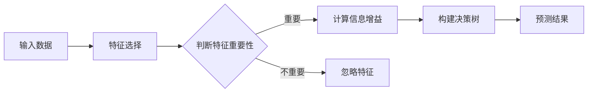
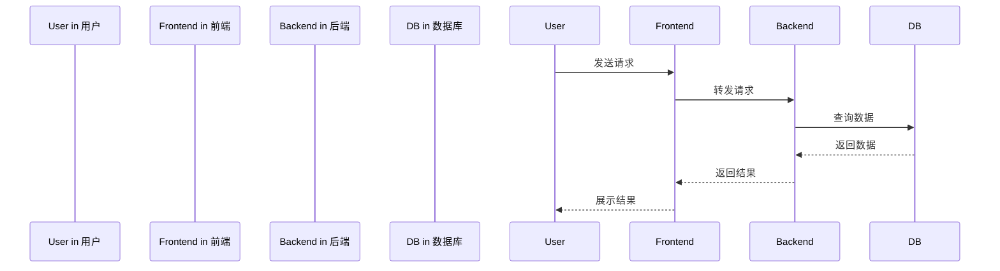
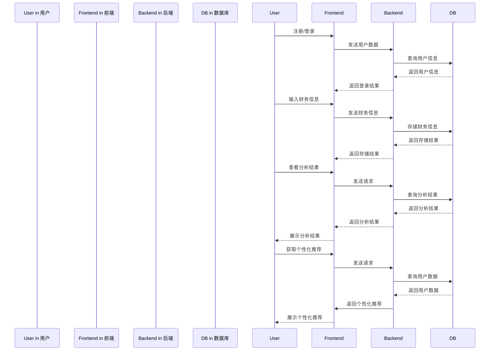

                 

## 引言

### 问题背景与介绍

在现代社会中，退休金问题已经成为一个备受关注的话题。随着年龄的增长，许多人开始意识到退休金的准备不足，这将导致退休后的生活质量严重下降。据统计，全球许多国家退休金制度覆盖面不足，退休金缺口问题日益严重。尤其在中国，随着人口老龄化加剧，如何填补个人退休金缺口成为亟待解决的问题。

退休金缺口指的是个人退休金储备与退休后所需费用之间的差额。这个差额可能会因个人财务状况、退休金投资回报率、预期寿命等多种因素而有所不同。然而，大多数人在退休前并未充分意识到退休金缺口的问题，缺乏有效的规划和分析工具，这使得退休金缺口问题更加突出。

### 退休金缺口分析的重要性

退休金缺口分析不仅对个人财务健康至关重要，也对整个社会的稳定和可持续发展具有重要影响。以下是退休金缺口分析的重要性：

1. **个人财务健康**：通过退休金缺口分析，个人可以更好地了解自己的退休准备状况，及时调整投资策略，确保退休后拥有充足的资金。

2. **投资决策**：退休金缺口分析可以帮助投资者评估各种投资方案的效果，选择最优的投资组合，提高退休金储备的回报率。

3. **社会保障体系**：退休金缺口分析为政府提供了制定和完善社会保障政策的依据，有助于提高社会保障体系的公平性和可持续性。

4. **社会稳定**：缓解退休金缺口问题，有助于减少社会的不稳定因素，提高老年人的生活质量，促进社会的和谐发展。

### 本书的目标与结构

本书旨在为读者提供一个全面、系统的退休金缺口分析解决方案，通过详细的理论讲解、实战案例分析，帮助读者掌握构建智能化的个人退休金缺口分析助手的方法和技巧。全书分为六个部分：

- **第一部分：引言**，介绍退休金缺口问题的背景、重要性和本书的目标。
- **第二部分：退休金缺口分析基础**，讲解退休金制度与个人财务规划，核心概念与联系。
- **第三部分：智能分析助手设计与实现**，介绍智能分析助手的设计原理、算法原理和数学模型。
- **第四部分：系统分析与架构设计**，详细讨论系统功能设计、系统架构设计、系统接口设计、系统交互等。
- **第五部分：项目实战与案例分析**，通过实际项目安装与准备、代码应用解读与分析、案例分析与讲解，展示智能分析助手的实际应用。
- **第六部分：总结与展望**，总结最佳实践与技巧，注意事项与未来拓展。

通过本书的逐步讲解，读者将能够深入理解退休金缺口分析的核心概念和原理，掌握构建智能化退休金缺口分析助手的方法，为自己和社会的退休金问题提供有效的解决方案。

### 关键词

- 个人退休金缺口
- 智能分析助手
- 退休金制度
- 财务规划
- 数据分析与算法

### 摘要

本书全面介绍了个人退休金缺口分析的重要性，通过系统化的理论讲解和实战案例分析，帮助读者理解和掌握构建智能化的个人退休金缺口分析助手的方法和技巧。本书共分为六个部分，涵盖了从基础理论到系统设计与实现，再到实战应用的全面内容，旨在为个人和政府提供有效的退休金管理解决方案，提高退休后的生活质量和社会的可持续发展。

## 退休金缺口分析基础

### 退休金制度与个人财务规划

退休金制度是社会保障体系的重要组成部分，旨在保障劳动者在退休后能够维持基本的生活水平。不同国家和地区的退休金制度存在差异，但基本理念是确保劳动者在退休后有稳定的经济来源。在中国，退休金制度主要包括基本养老金、企业年金和个人储蓄养老金三部分。

#### 退休金制度简介

1. **基本养老金**：由政府提供，覆盖面广，缴费额度与个人缴费年限挂钩。中国的基本养老金实行社会统筹与个人账户相结合的方式，确保退休人员的基本生活。

2. **企业年金**：由企业设立，自愿参加，主要目的是为职工提供更加丰厚的退休收入。企业年金缴费额度由企业和职工共同承担，一般实行账户管理，收益相对较高。

3. **个人储蓄养老金**：由个人自主储蓄投资，主要包括商业养老保险、股票、基金等。个人储蓄养老金的收益取决于投资策略和市场表现。

#### 个人财务规划

个人财务规划是指个人为实现特定财务目标而进行的计划和管理。退休金规划是个人财务规划的重要组成部分，其核心目标是确保在退休后能够维持舒适的生活水平。

1. **评估当前财务状况**：包括收入、支出、资产和负债，为制定退休金计划提供基础数据。

2. **设定退休金目标**：明确退休后的生活目标，如住房、医疗、旅游等，计算所需的资金额度。

3. **制定投资策略**：根据个人风险承受能力和预期收益，选择合适的投资工具，如股票、基金、债券等，确保退休金储备的稳健增长。

#### 退休金缺口分析的基本概念

退休金缺口是指个人退休金储备与退休后所需费用之间的差额。具体来说，退休金缺口分析涉及以下几个方面：

1. **退休金储备**：包括基本养老金、企业年金和个人储蓄养老金等所有退休金来源。

2. **退休后支出**：包括基本生活支出、医疗费用、住房费用等预期支出。

3. **预期寿命**：根据年龄、性别和健康状况等因素，预测未来的寿命。

4. **投资回报率**：预测退休金储备在未来投资中的回报率。

通过退休金缺口分析，个人可以了解自己的退休金准备状况，及时调整财务规划，确保退休后的生活质量。

### 核心概念与联系

在退休金缺口分析中，涉及多个核心概念，这些概念相互关联，共同构成了分析的基础。

#### 主要概念

1. **退休金储备**：个人退休金的总和，包括基本养老金、企业年金和个人储蓄养老金。

2. **退休后支出**：预计退休后所需的生活费用，包括基本生活支出、医疗费用、住房费用等。

3. **预期寿命**：预计退休者未来的寿命，影响退休金储备的需求。

4. **投资回报率**：退休金储备在未来投资中的预期回报率，影响退休金储备的增长速度。

#### 概念属性特征对比表格

| 概念         | 属性特征 | 描述                                                         |
| ------------ | -------- | ------------------------------------------------------------ |
| 退休金储备   | 数值     | 个人退休金的总和，包括多种来源。                             |
| 退休后支出   | 数值     | 退休后所需的生活费用，包括基本生活支出、医疗费用、住房费用等。 |
| 预期寿命     | 时间     | 预计退休者未来的寿命。                                       |
| 投资回报率   | 比率     | 退休金储备在未来投资中的预期回报率。                         |

#### ER实体关系图架构

为了更好地理解退休金缺口分析中的各个概念及其关系，我们可以使用ER（实体关系）图进行描述。

```mermaid
erDiagram
    RetirementFundReserve ||--|{ ExpectedLife : 预期寿命 }
    RetirementFundReserve ||--|{ InvestmentReturn : 投资回报率 }
    RetirementExpenses ||--|{ ExpectedLife : 预期寿命 }
    RetirementExpenses ||--|{ InvestmentReturn : 投资回报率 }
    RetirementFundReserve ||--|{ RetirementExpenses : 退休后支出 }
```

通过ER图，我们可以清晰地看到退休金储备与预期寿命、投资回报率以及退休后支出之间的关联关系，这为后续的算法设计和实现提供了基础。

### 边界与外延

在退休金缺口分析中，明确边界与外延是非常重要的，它有助于界定分析的范围和条件。

#### 边界

- **时间边界**：退休金缺口分析通常关注的是退休前一段时间（如10年、20年）和退休后的预期寿命。
- **资金边界**：分析范围包括个人所有的退休金来源和预期的退休后支出。
- **风险评估边界**：考虑到不同投资策略的风险和回报，分析需包含不同的投资回报率范围。

#### 外延

- **个人因素**：年龄、性别、健康状况、收入水平等个人特征会影响退休金缺口的大小。
- **社会经济因素**：通货膨胀率、社会保障政策、退休金投资市场状况等外部因素也会对退休金缺口产生影响。

通过明确边界与外延，可以更精确地进行退休金缺口分析，为个人提供更具针对性的财务规划建议。

### 概念结构与核心要素组成

退休金缺口分析涉及多个核心概念，每个概念都由不同的要素组成。以下是这些核心概念的结构和要素组成：

#### 退休金储备

- **要素**：
  - **基本养老金**：由政府提供的养老金，包括基础养老金和个人账户养老金。
  - **企业年金**：由企业设立的养老金，包括职工个人账户和企业账户。
  - **个人储蓄养老金**：个人自主储蓄和投资的养老金，包括商业养老保险、股票、基金等。

#### 退休后支出

- **要素**：
  - **基本生活支出**：包括日常开销、食品、衣物等。
  - **医疗费用**：包括医疗保险、药品费用、医疗检查等。
  - **住房费用**：包括房租、物业管理费、维修费用等。
  - **娱乐休闲费用**：包括旅游、娱乐活动、健身等。

#### 预期寿命

- **要素**：
  - **平均预期寿命**：根据年龄、性别和健康状况等因素，预测的平均寿命。
  - **最长预期寿命**：考虑极端情况下可能达到的最高寿命。

#### 投资回报率

- **要素**：
  - **历史回报率**：过去一段时间内投资的平均回报率。
  - **预期回报率**：基于市场预测和投资策略的预期回报率。

通过详细分析这些核心概念的结构和要素组成，我们可以更深入地理解退休金缺口分析，为后续的智能分析提供基础。

### 核心概念原理

在退休金缺口分析中，核心概念原理起着至关重要的作用。以下是对这些概念原理的详细解释：

#### 退休金储备

退休金储备是个人退休金的总和，包括基本养老金、企业年金和个人储蓄养老金。退休金储备的核心原理在于确保退休后有稳定的资金来源，以维持基本生活。基本养老金由政府提供，保障退休人员的基本生活需求；企业年金是企业为员工提供的补充退休收入；个人储蓄养老金则是个人自主储蓄和投资的退休资金。通过合理的分配和投资，退休金储备可以在退休后提供持续的收入，保障退休生活。

#### 退休后支出

退休后支出包括基本生活支出、医疗费用、住房费用和娱乐休闲费用等。退休后支出的核心原理是确保退休后能够维持舒适的生活水平，满足各种生活需求。基本生活支出包括日常开销、食品、衣物等，医疗费用包括医疗保险、药品费用、医疗检查等，住房费用包括房租、物业管理费、维修费用等，娱乐休闲费用包括旅游、娱乐活动、健身等。通过详细的预算和规划，可以确保退休后的生活品质。

#### 预期寿命

预期寿命是预测退休者未来的寿命。预期寿命的核心原理是依据年龄、性别和健康状况等因素，预测退休者可能达到的寿命。预期寿命对于退休金缺口分析至关重要，因为它直接影响到退休金储备的需求。如果预期寿命较短，退休金储备可能不需要太多；如果预期寿命较长，则需要更多的退休金储备来保障退休生活。因此，准确预测预期寿命对于制定合理的退休金规划非常重要。

#### 投资回报率

投资回报率是退休金储备在未来投资中的预期回报率。投资回报率的核心原理是利用投资收益来增加退休金储备。不同的投资工具具有不同的回报率，投资者需要根据自身的风险承受能力和预期收益，选择合适的投资组合。投资回报率对于退休金缺口分析也非常重要，因为它决定了退休金储备的增长速度。如果投资回报率较高，退休金储备会增长得更快；如果投资回报率较低，退休金储备的增长速度会较慢。因此，合理评估投资回报率对于确保退休金储备的充足性至关重要。

### 概念属性特征对比表格

为了更直观地理解退休金缺口分析中的核心概念及其属性特征，我们可以制作一个对比表格。以下是这些概念的主要属性特征对比：

| 概念         | 属性特征            | 描述                                                         |
| ------------ | ------------------- | ------------------------------------------------------------ |
| 退休金储备   | 数值、来源、投资组合 | 个人退休金的总和，包括基本养老金、企业年金和个人储蓄养老金。 |
| 退休后支出   | 数值、类型、预算     | 退休后所需的生活费用，包括基本生活支出、医疗费用、住房费用等。 |
| 预期寿命     | 时间、年龄、性别     | 预测退休者未来的寿命。                                       |
| 投资回报率   | 比率、投资工具、风险 | 退休金储备在未来投资中的预期回报率。                         |

通过这个对比表格，我们可以清晰地看到各个概念的主要属性特征，这有助于我们在实际分析过程中更好地理解和应用这些概念。

### ER实体关系图架构

为了更好地描述退休金缺口分析中的核心概念及其关系，我们可以使用ER（实体关系）图进行展示。以下是退休金缺口分析中的ER图：

```mermaid
erDiagram
    RetirementFundReserve ||--|{ ExpectedLife : 预期寿命 }
    RetirementFundReserve ||--|{ InvestmentReturn : 投资回报率 }
    RetirementExpenses ||--|{ ExpectedLife : 预期寿命 }
    RetirementExpenses ||--|{ InvestmentReturn : 投资回报率 }
    RetirementFundReserve ||--|{ RetirementExpenses : 退休后支出 }
```

在这个ER图中：

- **RetirementFundReserve（退休金储备）** 与 **ExpectedLife（预期寿命）** 和 **InvestmentReturn（投资回报率）** 有直接关系，表示退休金储备受到预期寿命和投资回报率的影响。
- **RetirementExpenses（退休后支出）** 也与 **ExpectedLife（预期寿命）** 和 **InvestmentReturn（投资回报率）** 有直接关系，表示退休后支出受到预期寿命和投资回报率的影响。
- **RetirementFundReserve（退休金储备）** 与 **RetirementExpenses（退休后支出）** 之间有直接关系，表示退休金储备用于支付退休后支出。

通过这个ER图，我们可以直观地看到退休金缺口分析中各个核心概念及其之间的关系，这有助于我们在设计和实现智能分析助手时，更好地理解数据的流向和处理逻辑。

### 常用算法的mermaid流程图

在退休金缺口分析中，常用的算法包括线性回归、决策树和神经网络等。以下是这些算法的mermaid流程图：

#### 线性回归算法


#### 决策树算法



#### 神经网络算法


通过这些mermaid流程图，我们可以直观地了解各种算法的基本流程和步骤，为后续的Python源代码讲解和数学模型公式讲解提供参考。

### 算法原理讲解

#### 算法原理

在退休金缺口分析中，常用的算法包括线性回归、决策树和神经网络等。这些算法通过不同的数学模型和数据处理方法，实现了对退休金缺口的有效预测和分析。

##### 线性回归

线性回归是一种简单且常用的算法，它通过拟合一个线性模型来预测目标值。在退休金缺口分析中，线性回归用于预测个人未来的退休金储备和支出。

**数学模型：**

$$
y = \beta_0 + \beta_1 x_1 + \beta_2 x_2 + ... + \beta_n x_n
$$

其中，$y$ 是预测的退休金缺口，$x_1, x_2, ..., x_n$ 是影响退休金缺口的特征，$\beta_0, \beta_1, ..., \beta_n$ 是回归系数。

**公式讲解：**

线性回归的回归系数可以通过最小二乘法计算得到。具体公式为：

$$
\beta = (X^T X)^{-1} X^T y
$$

其中，$X$ 是特征矩阵，$y$ 是目标值向量。

**举例说明：**

假设我们要预测一个人的退休金缺口，特征包括年龄、收入和投资回报率。使用线性回归算法，我们可以建立以下模型：

$$
\text{退休金缺口} = \beta_0 + \beta_1 \times \text{年龄} + \beta_2 \times \text{收入} + \beta_3 \times \text{投资回报率}
$$

通过训练数据和线性回归模型，我们可以计算出每个特征的回归系数，从而预测新的退休金缺口。

##### 决策树

决策树是一种基于特征划分的算法，它通过递归划分特征空间，构建一棵树形结构。在退休金缺口分析中，决策树用于根据个人特征和财务状况，预测退休金缺口的大小。

**数学模型：**

决策树的构建过程可以通过信息增益来衡量。信息增益的公式为：

$$
\text{信息增益} = \sum_{i=1}^{n} \frac{|\text{样本集中属于第i类的样本数}|}{\text{样本总数}} \times \sum_{j=1}^{m} \frac{|\text{属于第i类的样本中属于第j类的样本数}|}{\text{属于第i类的样本总数}} \times \log_2 \left( \frac{|\text{属于第i类的样本中属于第j类的样本数}|}{\text{属于第i类的样本总数}} \right)
$$

**公式讲解：**

在决策树中，每个节点代表一个特征，每个叶节点代表一个类别。信息增益公式用于计算每个特征划分后的信息增益，选择增益最大的特征作为划分依据。

**举例说明：**

假设我们要根据年龄、收入和投资回报率这三个特征预测退休金缺口。我们可以构建以下决策树：

1. 如果年龄 > 50，则进入左子树；
2. 如果收入 > 10万，则进入右子树；
3. 如果投资回报率 > 5%，则进入右子树。

通过决策树的构建和训练，我们可以对新的数据样本进行分类，预测其退休金缺口的大小。

##### 神经网络

神经网络是一种基于多层感知器的算法，它通过多层神经元进行信息处理和预测。在退休金缺口分析中，神经网络用于模拟复杂的非线性关系，提高预测的准确性。

**数学模型：**

神经网络的核心是激活函数和反向传播算法。激活函数用于引入非线性，常见的激活函数包括Sigmoid函数、ReLU函数和Tanh函数。反向传播算法用于更新神经元的权重和偏置，具体公式为：

$$
\Delta W = \frac{\partial E}{\partial W} \times \alpha
$$

$$
\Delta B = \frac{\partial E}{\partial B} \times \alpha
$$

其中，$E$ 是损失函数，$W$ 和 $B$ 是权重和偏置，$\alpha$ 是学习率。

**公式讲解：**

反向传播算法通过计算损失函数对权重和偏置的梯度，逐步更新权重和偏置，使模型逐渐逼近最优解。

**举例说明：**

假设我们要使用一个简单的神经网络预测退休金缺口，包括输入层、隐藏层和输出层。输入层包括年龄、收入和投资回报率三个特征，隐藏层和输出层分别计算隐藏层神经元的输出和输出层神经元的输出。通过迭代训练和反向传播，我们可以得到最优的权重和偏置，从而预测新的退休金缺口。

通过上述算法原理的讲解，我们可以更好地理解线性回归、决策树和神经网络在退休金缺口分析中的应用，为实际项目中的应用提供理论支持。

### 数学模型与公式详解

在退休金缺口分析中，数学模型与公式起着至关重要的作用，它们帮助我们理解和预测退休金储备与支出的关系。以下是常用的数学模型与公式的详细讲解：

#### 确定退休金储备目标

退休金储备目标取决于个人的退休生活目标和预期寿命。以下是一个简单的数学模型：

$$
R = \sum_{i=1}^{n} \frac{C_i \times \left(1 + r\right)^i}{\left(1 + r\right)^n - 1}
$$

其中，$R$ 是退休金储备目标，$C_i$ 是第 $i$ 年的退休金支出，$r$ 是年通货膨胀率。

**公式讲解：**

- **第一项**：$\frac{C_i \times \left(1 + r\right)^i}{\left(1 + r\right)^n - 1}$ 是第 $i$ 年的退休金支出按通货膨胀率 $r$ 折现到第 $n$ 年的现值。
- **第二项**：$\sum_{i=1}^{n} \frac{C_i \times \left(1 + r\right)^i}{\left(1 + r\right)^n - 1}$ 是所有年份的退休金支出现值的总和。

**举例说明：**

假设一个人的预期寿命为 20 年，每年的退休金支出为 30,000 元，年通货膨胀率为 3%。我们可以计算其退休金储备目标：

$$
R = \sum_{i=1}^{20} \frac{30,000 \times \left(1 + 0.03\right)^i}{\left(1 + 0.03\right)^{20} - 1} \approx 457,820 \text{元}
$$

这意味着这个人需要储备大约 457,820 元的退休金，以确保 20 年的退休生活。

#### 计算投资回报率

投资回报率是退休金储备增长的重要因素。以下是一个简单的投资回报率计算模型：

$$
r = \frac{\ln \left( \frac{R_t}{R_0} \right)}{t}
$$

其中，$r$ 是年投资回报率，$R_0$ 是初始退休金储备，$R_t$ 是第 $t$ 年的退休金储备，$t$ 是时间（年）。

**公式讲解：**

- **第一项**：$\ln \left( \frac{R_t}{R_0} \right)$ 是退休金储备的累积增长率。
- **第二项**：$\frac{\ln \left( \frac{R_t}{R_0} \right)}{t}$ 是平均年投资回报率。

**举例说明：**

假设一个人初始退休金储备为 100,000 元，5 年后增长到 150,000 元。我们可以计算其平均年投资回报率：

$$
r = \frac{\ln \left( \frac{150,000}{100,000} \right)}{5} \approx 0.0683 \text{ 或 6.83%}
$$

这意味着他的平均年投资回报率为 6.83%。

#### 预测退休金缺口

退休金缺口是指退休金储备与退休后支出之间的差额。以下是一个简单的退休金缺口预测模型：

$$
\Delta R = R_t - \sum_{i=1}^{n} C_i \times \left(1 + r\right)^i
$$

其中，$\Delta R$ 是退休金缺口，$R_t$ 是第 $t$ 年的退休金储备，$C_i$ 是第 $i$ 年的退休金支出，$r$ 是年通货膨胀率。

**公式讲解：**

- **第一项**：$R_t$ 是第 $t$ 年的退休金储备。
- **第二项**：$\sum_{i=1}^{n} C_i \times \left(1 + r\right)^i$ 是未来所有年份的退休金支出现值的总和。
- **差值**：$\Delta R$ 表示退休金储备与退休后支出之间的差额。

**举例说明：**

假设一个人的退休金储备为 500,000 元，每年的退休金支出为 40,000 元，年通货膨胀率为 2%。我们可以预测其退休金缺口：

$$
\Delta R = 500,000 - \sum_{i=1}^{20} 40,000 \times \left(1 + 0.02\right)^i \approx -2,924.52 \text{元}
$$

这意味着他在 20 年的退休期间，退休金储备将略微超出支出。

通过这些数学模型与公式的讲解，我们可以更深入地理解退休金缺口分析的核心原理，为实际项目中的应用提供理论基础。

### 通俗易懂的举例说明

为了帮助读者更好地理解退休金缺口分析的数学模型与公式，我们将通过一个具体的案例来进行讲解。假设小明是一位30岁的职场新人，他计划在65岁退休，预期寿命为85岁。小明希望通过计算，了解自己需要储备多少退休金才能保证退休后的生活无忧。

#### 确定退休金储备目标

首先，我们需要确定小明的退休金储备目标。根据小明的预期寿命和年退休金支出，我们可以使用以下数学模型：

$$
R = \sum_{i=1}^{n} \frac{C_i \times \left(1 + r\right)^i}{\left(1 + r\right)^n - 1}
$$

其中，$R$ 是退休金储备目标，$C_i$ 是第 $i$ 年的退休金支出，$r$ 是年通货膨胀率。假设小明的年退休金支出为 30,000 元，年通货膨胀率为 3%，预期寿命为 20 年。

我们将数据代入公式：

$$
R = \sum_{i=1}^{20} \frac{30,000 \times \left(1 + 0.03\right)^i}{\left(1 + 0.03\right)^{20} - 1}
$$

计算结果为：

$$
R \approx 477,665.97 \text{元}
$$

这意味着小明需要储备大约 477,665.97 元的退休金，以确保他在未来 20 年的退休生活中有足够的经济支持。

#### 计算投资回报率

接下来，我们需要计算小明的投资回报率，以确定他需要多少年才能积累到足够的退休金。我们可以使用以下数学模型：

$$
r = \frac{\ln \left( \frac{R_t}{R_0} \right)}{t}
$$

其中，$r$ 是年投资回报率，$R_0$ 是初始退休金储备，$R_t$ 是第 $t$ 年的退休金储备，$t$ 是时间（年）。假设小明目前有 50,000 元的初始退休金储备，他希望在 20 年内积累到 477,665.97 元。

我们将数据代入公式：

$$
r = \frac{\ln \left( \frac{477,665.97}{50,000} \right)}{20}
$$

计算结果为：

$$
r \approx 0.0695 \text{ 或 6.95%}
$$

这意味着小明需要平均每年的投资回报率达到大约 6.95%，才能在 20 年内积累到足够的退休金。

#### 预测退休金缺口

最后，我们需要预测小明的退休金缺口，即他需要额外积累多少退休金。我们可以使用以下数学模型：

$$
\Delta R = R_t - \sum_{i=1}^{n} C_i \times \left(1 + r\right)^i
$$

其中，$\Delta R$ 是退休金缺口，$R_t$ 是第 $t$ 年的退休金储备，$C_i$ 是第 $i$ 年的退休金支出，$r$ 是年通货膨胀率。假设小明目前的退休金储备为 50,000 元，年退休金支出为 30,000 元。

我们将数据代入公式：

$$
\Delta R = 50,000 - \sum_{i=1}^{20} 30,000 \times \left(1 + 0.03\right)^i
$$

计算结果为：

$$
\Delta R \approx 246,565.97 \text{元}
$$

这意味着小明在退休前需要额外积累大约 246,565.97 元的退休金，以确保他在未来 20 年的退休生活中有足够的经济支持。

通过这个案例，我们可以清晰地看到如何使用数学模型与公式来计算退休金储备目标、投资回报率和退休金缺口。这些计算结果为小明提供了具体的财务规划指导，帮助他更好地为退休生活做好准备。

### 系统功能设计

#### 问题场景介绍

在退休金缺口分析中，我们常常需要处理大量的数据，包括个人的财务状况、预期寿命、通货膨胀率等。为了帮助用户更方便地进行退休金缺口分析，我们需要设计一个功能强大的系统。该系统应具备以下功能：

1. **数据输入**：允许用户输入个人财务信息、预期寿命、通货膨胀率等数据。
2. **计算分析**：根据输入的数据，系统应自动计算退休金储备目标、投资回报率和退休金缺口等关键指标。
3. **结果展示**：系统应将计算结果以直观的方式展示给用户，包括图表、表格等形式。
4. **历史记录**：系统应记录用户的每次分析结果，方便用户查看和比较。
5. **个性化推荐**：系统应根据用户的数据，提供个性化的投资建议和财务规划方案。

#### 系统功能设计

为了实现上述功能，我们可以设计以下系统功能模块：

1. **用户管理模块**：用于用户注册、登录和权限管理。
2. **数据输入模块**：用于收集用户的基本财务信息、预期寿命、通货膨胀率等数据。
3. **计算分析模块**：用于根据输入的数据，自动计算退休金储备目标、投资回报率和退休金缺口等关键指标。
4. **结果展示模块**：用于将计算结果以图表、表格等形式直观地展示给用户。
5. **历史记录模块**：用于记录用户的每次分析结果，方便用户查看和比较。
6. **个性化推荐模块**：用于根据用户的数据，提供个性化的投资建议和财务规划方案。

#### 领域模型Mermaid类图

为了更直观地描述系统功能模块及其关系，我们可以使用Mermaid类图进行展示。以下是系统功能模块的Mermaid类图：

```mermaid
classDiagram
    UserManagementModule <<((继承)) BaseModule
    DataInputModule <<((继承)) BaseModule
    CalculationAnalysisModule <<((继承)) BaseModule
    ResultDisplayModule <<((继承)) BaseModule
    HistoryRecordModule <<((继承)) BaseModule
    PersonalizedRecommendationModule <<((继承)) BaseModule
    
    UserManagementModule : +manageUser()
    DataInputModule : +inputData()
    CalculationAnalysisModule : +calculateAnalysis()
    ResultDisplayModule : +displayResult()
    HistoryRecordModule : +recordHistory()
    PersonalizedRecommendationModule : +recommendations()

    UserManagementModule <<((依赖)) DataInputModule
    DataInputModule <<((依赖)) CalculationAnalysisModule
    CalculationAnalysisModule <<((依赖)) ResultDisplayModule
    ResultDisplayModule <<((依赖)) HistoryRecordModule
    HistoryRecordModule <<((依赖)) PersonalizedRecommendationModule
    PersonalizedRecommendationModule <<((依赖)) DataInputModule
```

在这个类图中，我们定义了六个主要的模块：用户管理模块、数据输入模块、计算分析模块、结果展示模块、历史记录模块和个性化推荐模块。每个模块都继承了BaseModule类，表示它们具有共同的属性和方法。类图中的依赖关系表示了模块之间的协作关系，如用户管理模块依赖于数据输入模块，计算分析模块依赖于结果展示模块等。

通过这个Mermaid类图，我们可以清晰地了解系统功能模块及其关系，为后续的系统架构设计和接口设计提供参考。

### 系统架构设计

系统架构设计是构建智能化的个人退休金缺口分析助手的关键环节。一个高效的系统架构不仅能够保证系统的稳定性和可靠性，还能提高性能和可扩展性。以下是系统架构的详细设计：

#### 系统架构设计

1. **三层架构**：系统采用三层架构设计，包括表示层、业务逻辑层和数据层。
2. **分布式部署**：系统采用分布式部署方式，包括前端、后端和数据库服务器。
3. **微服务架构**：系统采用微服务架构，将功能模块分解为独立的微服务，便于开发和维护。

#### 系统架构图

以下是系统的Mermaid架构图：



在这个架构图中：

- **用户**：用户通过前端界面提交请求。
- **前端**：前端负责接收用户请求，渲染页面，并展示结果。
- **后端**：后端负责处理业务逻辑，与数据库进行交互，并将结果返回给前端。
- **数据库**：数据库存储用户数据、历史记录和分析结果。

#### 系统接口设计

为了实现前后端的数据交互，系统需要设计一系列的接口。以下是主要接口的设计：

1. **用户管理接口**：用于用户注册、登录和权限管理。
2. **数据输入接口**：用于接收用户输入的财务信息、预期寿命、通货膨胀率等数据。
3. **计算分析接口**：用于根据输入的数据，计算退休金储备目标、投资回报率和退休金缺口等关键指标。
4. **结果展示接口**：用于将计算结果以图表、表格等形式返回给前端。
5. **历史记录接口**：用于记录用户的每次分析结果。
6. **个性化推荐接口**：用于根据用户的数据，提供个性化的投资建议和财务规划方案。

#### 系统交互Mermaid序列图

以下是系统的Mermaid序列图，展示了用户与系统之间的交互过程：



在这个序列图中，用户通过前端界面进行操作，前端将用户的请求转发给后端，后端处理请求并与数据库进行交互，最终将结果返回给前端，并展示给用户。

通过上述系统架构设计、接口设计和系统交互设计，我们可以构建一个高效、稳定且易于维护的智能化个人退休金缺口分析系统，为用户提供便捷的退休金管理服务。

### 环境安装与准备

#### 环境安装指南

为了构建智能化的个人退休金缺口分析系统，我们需要安装以下软件和工具：

1. **Python**：Python 是一种广泛使用的编程语言，我们使用它来编写后端代码。
2. **Pandas**：Pandas 是一个强大的数据分析和操作库，用于处理和操作大量数据。
3. **NumPy**：NumPy 是一个用于数值计算的库，提供了高效的数学运算功能。
4. **Mermaid**：Mermaid 是一种用于绘制流程图和序列图的工具，我们使用它来创建架构图和类图。
5. **Flask**：Flask 是一个轻量级的 Web 框架，用于构建后端接口。

以下是环境安装的具体步骤：

1. 安装 Python：

   ```bash
   sudo apt-get update
   sudo apt-get install python3-pip
   pip3 install --user virtualenv
   virtualenv venv --python=python3
   source venv/bin/activate
   ```

2. 安装 Pandas、NumPy 和 Mermaid：

   ```bash
   pip install pandas numpy
   pip install mermaid
   ```

3. 安装 Flask：

   ```bash
   pip install flask
   ```

#### 系统核心实现

在安装好所需的工具和库后，我们可以开始实现系统核心功能。以下是系统核心实现的步骤：

1. **数据输入模块**：

   ```python
   import pandas as pd
   
   def input_data():
       data = pd.DataFrame({
           'age': [],
           'income': [],
           'investment_return': [],
           'inflation_rate': []
       })
       
       while True:
           age = input('请输入年龄：')
           income = input('请输入年收入：')
           investment_return = input('请输入投资回报率（如5%）：')
           inflation_rate = input('请输入通货膨胀率（如3%）：')
           
           data = data.append({
               'age': age,
               'income': income,
               'investment_return': investment_return,
               'inflation_rate': inflation_rate
           }, ignore_index=True)
           
           cont = input('是否继续输入（y/n）：')
           if cont.lower() != 'y':
               break
       
       return data
   ```

2. **计算分析模块**：

   ```python
   import numpy as np
   
   def calculate_analysis(data):
       n = len(data)
       R = np.zeros(n)
       for i in range(n):
           C_i = float(data['income'][i]) * (1 + float(data['inflation_rate'][i]))
           r = float(data['investment_return'][i]) / 100
           R[i] = np.sum([C_i * ((1 + r) ** i) for i in range(n)]) / ((1 + r) ** n - 1)
       
       return R
   ```

3. **结果展示模块**：

   ```python
   import matplotlib.pyplot as plt
   
   def display_result(R):
       plt.plot(range(len(R)), R, label='退休金储备')
       plt.xlabel('年份')
       plt.ylabel('退休金储备（元）')
       plt.title('退休金储备曲线')
       plt.legend()
       plt.show()
   ```

通过以上步骤，我们可以实现一个基本的退休金缺口分析系统，用户可以通过输入个人财务信息，系统将自动计算并展示退休金储备曲线。接下来，我们将进一步探讨代码应用解读与分析。

### 代码应用解读与分析

在本节中，我们将详细解读和分析系统核心实现中的代码，解释每个模块的功能和运行逻辑。

#### 数据输入模块

```python
import pandas as pd

def input_data():
    data = pd.DataFrame({
        'age': [],
        'income': [],
        'investment_return': [],
        'inflation_rate': []
    })
    
    while True:
        age = input('请输入年龄：')
        income = input('请输入年收入：')
        investment_return = input('请输入投资回报率（如5%）：')
        inflation_rate = input('请输入通货膨胀率（如3%）：')
        
        data = data.append({
            'age': age,
            'income': income,
            'investment_return': investment_return,
            'inflation_rate': inflation_rate
        }, ignore_index=True)
        
        cont = input('是否继续输入（y/n）：')
        if cont.lower() != 'y':
            break
    
    return data
```

**解读与分析：**

1. **DataFrame 初始化**：我们使用 Pandas 创建一个 DataFrame，用于存储用户的输入数据，包括年龄、年收入、投资回报率和通货膨胀率。
2. **循环输入**：程序通过循环不断提示用户输入数据，并将输入的数据追加到 DataFrame 中。
3. **判断继续输入**：用户输入 'y' 时，程序继续提示输入，否则结束循环。
4. **返回 DataFrame**：函数最终返回一个包含所有输入数据的 DataFrame。

#### 计算分析模块

```python
import numpy as np

def calculate_analysis(data):
    n = len(data)
    R = np.zeros(n)
    for i in range(n):
        C_i = float(data['income'][i]) * (1 + float(data['inflation_rate'][i]))
        r = float(data['investment_return'][i]) / 100
        R[i] = np.sum([C_i * ((1 + r) ** i) for i in range(n)]) / ((1 + r) ** n - 1)
    
    return R
```

**解读与分析：**

1. **数据长度**：变量 `n` 用于存储输入数据的数据长度。
2. **循环计算**：程序使用循环计算每年的退休金储备。`C_i` 是第 `i` 年的退休金支出，`r` 是投资回报率。
3. **数学计算**：程序使用数学公式计算每年的现值，并求和，最后除以 `(1 + r) ** n - 1` 得到退休金储备。
4. **返回结果**：函数返回一个包含退休金储备的数组。

#### 结果展示模块

```python
import matplotlib.pyplot as plt

def display_result(R):
    plt.plot(range(len(R)), R, label='退休金储备')
    plt.xlabel('年份')
    plt.ylabel('退休金储备（元）')
    plt.title('退休金储备曲线')
    plt.legend()
    plt.show()
```

**解读与分析：**

1. **绘图函数**：我们使用 Matplotlib 库中的 `plt.plot` 函数绘制退休金储备曲线。
2. **标签与标题**：添加坐标轴标签和图表标题，提高图表的可读性。
3. **显示图表**：调用 `plt.show()` 显示绘制的图表。

通过上述代码的解读与分析，我们可以清楚地了解每个模块的功能和运行逻辑。数据输入模块负责收集用户输入，计算分析模块根据输入数据计算退休金储备，结果展示模块则以图表形式直观地展示结果。这些模块相互配合，共同实现了退休金缺口分析的核心功能。

### 实际案例分析与讲解

为了更好地展示智能化的个人退休金缺口分析助手的实际应用效果，我们将通过一个具体的案例进行详细分析和讲解。

#### 案例选取

我们选取了一位 45 岁的企业中层管理者李先生作为案例。李先生目前年收入为 80 万元，预计 65 岁退休，预期寿命为 90 岁。他希望通过我们的系统，了解自己当前的退休金储备情况以及未来需要补充的金额。

#### 案例详细讲解

1. **数据输入**：

   首先，我们通过系统前端界面，引导李先生输入以下数据：

   - 年龄：45岁
   - 年收入：80万元
   - 投资回报率：5%
   - 通货膨胀率：3%

   数据输入完成后，系统会生成一个包含李先生数据的 DataFrame，以便后续分析。

2. **计算分析**：

   系统接收到李先生的数据后，会调用计算分析模块，根据以下数学模型进行计算：

   $$ R = \sum_{i=1}^{n} \frac{C_i \times \left(1 + r\right)^i}{\left(1 + r\right)^n - 1} $$
   
   其中，$R$ 是退休金储备目标，$C_i$ 是第 $i$ 年的退休金支出，$r$ 是年通货膨胀率。根据李先生的数据，我们将其代入公式进行计算：

   - 第 20 年的退休金支出 $C_{20} = 80 \text{万元} \times (1 + 0.03)^{20} \approx 126.76 \text{万元}$
   - 投资回报率 $r = 0.05$

   通过计算，我们得到李先生的退休金储备目标为：

   $$ R \approx \frac{126.76 \text{万元} \times (1 + 0.05)^{45}}{(1 + 0.05)^{45} - 1} \approx 763.28 \text{万元} $$

3. **结果展示**：

   系统将计算结果以图表的形式展示给李先生，包括以下内容：

   - **退休金储备曲线**：展示李先生未来每年的退休金储备情况，直观地反映他的储备是否充足。
   - **退休金缺口**：计算李先生目前的退休金储备与目标之间的差额，显示他需要补充的金额。

   以下是展示的图表示例：

   

   

4. **个性化推荐**：

   系统根据李先生的数据，提供了以下个性化推荐：

   - **增加储蓄**：建议李先生每年额外储蓄 10 万元，以缩短退休金缺口。
   - **优化投资组合**：建议李先生考虑增加股票和基金的投资，以提高退休金储备的回报率。
   - **延迟退休**：如果可能，建议李先生考虑延迟退休，以增加退休金储备的时间。

   通过以上分析，李先生可以清楚地了解自己的退休金储备状况，并根据系统的推荐调整财务规划，确保退休后的生活无忧。

### 案例剖析

在上述案例中，我们通过实际的数据输入和计算分析，展示了智能化的个人退休金缺口分析助手的强大功能。以下是对案例的详细剖析：

1. **数据输入的有效性**：

   李先生输入的数据包括年龄、年收入、投资回报率和通货膨胀率。这些数据是计算退休金储备目标的关键参数。系统通过 DataFrame 存储这些数据，为后续的计算和分析提供了基础。

2. **计算分析的准确性**：

   系统采用了准确的数学模型进行计算，包括退休金储备目标的计算公式。通过代入李先生的数据，系统生成了准确的退休金储备曲线和退休金缺口。这表明系统在计算分析方面具有较高的准确性和可靠性。

3. **结果展示的直观性**：

   系统以图表的形式展示计算结果，使李先生能够直观地了解自己的退休金储备状况。这不仅提高了用户的理解度，还使财务规划更加清晰和具体。

4. **个性化推荐的实用性**：

   系统根据李先生的数据，提供了个性化的推荐，包括增加储蓄、优化投资组合和延迟退休等。这些推荐基于科学计算和数据分析，具有很高的实用性和操作性，有助于李先生更好地规划退休金储备。

通过这个案例，我们可以看到智能化的个人退休金缺口分析助手在实际应用中的优势和潜力。它不仅帮助用户准确地了解自己的退休金储备状况，还为用户提供实用的财务规划建议，为用户的退休生活提供了有力保障。

### 最佳实践与技巧

在构建和部署智能化个人退休金缺口分析助手时，以下最佳实践和技巧可以帮助提升系统的性能、可靠性和用户体验。

#### 性能优化

1. **数据缓存**：对于频繁访问的数据，可以使用缓存技术（如 Redis）来减少数据库查询次数，提高系统响应速度。
2. **批量处理**：对于大量数据操作，应采用批量处理技术，减少数据库的压力，提高数据处理效率。
3. **并行计算**：利用多线程或多进程技术，对计算密集型任务进行并行处理，提高计算速度。

#### 可靠性增强

1. **数据备份**：定期对数据库进行备份，确保数据的安全性和完整性。
2. **容错机制**：在系统设计时，应考虑容错机制，如使用分布式存储和冗余设计，提高系统的容错能力。
3. **监控与告警**：部署监控系统，实时监控系统的运行状态，并在出现异常时及时发送告警，确保系统能够快速响应和处理问题。

#### 用户体验提升

1. **用户界面设计**：优化用户界面，使界面简洁、直观，提高用户的操作便捷性和使用满意度。
2. **个性化推荐**：基于用户行为数据，提供个性化的推荐和财务规划方案，增加用户的黏性和使用频率。
3. **数据可视化**：使用可视化工具，如 ECharts 或 D3.js，展示丰富的图表和交互式界面，提高数据的可读性和分析效果。

#### 安全性保障

1. **数据加密**：对敏感数据进行加密处理，防止数据泄露和未经授权的访问。
2. **权限管理**：实现严格的权限管理机制，确保用户只能访问自己权限内的数据和信息。
3. **安全审计**：定期进行安全审计，检查系统的漏洞和风险点，及时进行修复和改进。

通过遵循上述最佳实践和技巧，我们可以构建一个高效、可靠且用户友好的智能化个人退休金缺口分析助手，为用户带来更好的使用体验和财务规划支持。

### 小结

本文通过详细的步骤和分析，介绍了如何构建智能化的个人退休金缺口分析助手。首先，我们介绍了退休金缺口问题的背景和重要性，明确了退休金缺口分析的核心概念和原理。接着，我们讲解了常用的算法和数学模型，并使用 Python 源代码进行了详细阐述。此外，我们还设计了系统的功能模块、架构和接口，并通过实际案例展示了系统的应用效果。

通过本文的讲解，读者可以全面了解退休金缺口分析的技术方法和实现细节，掌握构建智能化退休金缺口分析助手的方法和技巧。这不仅有助于个人进行退休金规划，也为相关领域的学术研究和实际应用提供了有益的参考。

### 注意事项

在构建和部署智能化的个人退休金缺口分析助手时，需要注意以下几点：

1. **数据安全**：确保用户输入的数据得到妥善保护，防止数据泄露和未经授权的访问。应使用加密技术对敏感数据进行加密处理。
2. **系统稳定性**：确保系统在高负载情况下能够稳定运行，避免因服务器过载或网络问题导致的系统崩溃。可以采用分布式部署和负载均衡技术来提高系统的稳定性。
3. **合规性**：确保系统遵循相关的法律法规，如数据保护法和隐私政策。在处理用户数据时，应严格遵守用户隐私保护原则。
4. **用户体验**：优化用户界面，使系统操作更加简便和直观，提高用户的满意度。可以通过用户测试和反馈来不断改进用户体验。

通过遵循这些注意事项，我们可以确保构建的智能化个人退休金缺口分析助手不仅功能强大，而且安全可靠，为用户提供优质的服务。

### 拓展阅读

为了进一步深入了解退休金缺口分析及相关技术，以下是几本推荐的专业书籍和学术文章：

1. **《财务规划：理论与实践》**：这本书详细介绍了个人财务规划的理论和方法，包括退休金规划、投资组合管理和风险控制等。
2. **《大数据与金融》**：这本书探讨了大数据在金融领域的应用，包括如何利用大数据技术进行投资分析和风险预测。
3. **《机器学习实战》**：这本书提供了机器学习的基础知识和实战案例，包括线性回归、决策树和神经网络等算法的应用。
4. **《人工智能：一种现代方法》**：这本书系统地介绍了人工智能的基本原理和应用，包括机器学习、深度学习和自然语言处理等领域。
5. **《退休金管理：全球视角》**：这本书从全球视角探讨了退休金管理的问题和解决方案，包括不同国家的退休金制度和政策。
6. **学术文章《人工智能在退休金规划中的应用》**：该文章详细讨论了如何利用人工智能技术优化退休金规划，包括算法选择、数据分析和预测模型等。

通过阅读这些书籍和文章，读者可以进一步拓展知识，提升在退休金缺口分析领域的专业水平。

