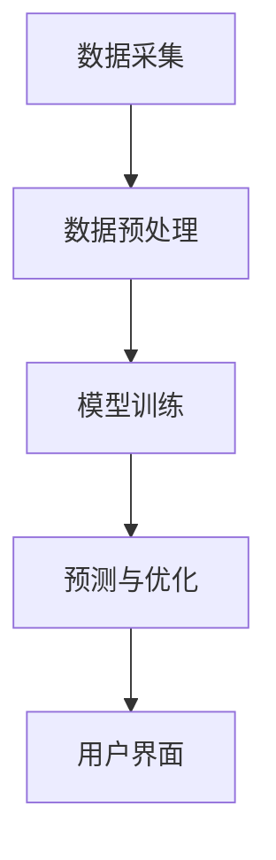

                 

# 构建智能化的个人退休金缺口动态预测助手

## 关键词

- 退休金预测
- 人工智能
- 机器学习
- 数据分析
- 财务规划

## 摘要

本文将探讨如何构建一个智能化的个人退休金缺口动态预测助手。通过大数据分析、机器学习和人工智能技术，本预测助手能够对用户的财务状况进行全面分析，预测退休金缺口并提供优化建议。本文将从问题背景、核心概念、算法原理、系统分析与架构设计以及项目实战等方面进行详细阐述，旨在为读者提供一个全面的技术指南。

---

## 第一部分：背景介绍

### 1.1 问题背景

随着人口老龄化趋势的加剧，个人退休金缺口问题在全球范围内日益突出。许多人在退休后可能面临财务困难，无法维持原有的生活水平。为了缓解这一困境，智能化的个人退休金缺口动态预测助手应运而生。这种助手能够为用户提供个性化的退休金规划建议，帮助他们更好地准备退休生活。

### 1.2 问题描述

本书旨在构建一个智能化的个人退休金缺口动态预测助手，帮助用户预测自己的退休金缺口，并提供相应的优化建议。具体而言，这个预测助手需要能够处理用户的财务数据，包括收入、支出、储蓄和投资情况，同时考虑退休年龄、预期寿命、通货膨胀等因素，预测退休金缺口并提供相应的优化策略。

### 1.3 问题解决

通过运用大数据分析、机器学习和人工智能技术，本预测助手将对用户的个人财务状况、投资回报率、退休年龄等因素进行综合分析，预测退休金缺口，并提供个性化的投资和储蓄建议。具体步骤如下：

1. 数据采集：收集用户的财务数据、投资记录等。
2. 数据预处理：清洗、整合和标准化数据。
3. 模型训练：构建预测模型，训练模型参数。
4. 预测与优化：根据模型预测结果，提供退休金缺口和优化建议。
5. 用户界面：设计友好的用户界面，便于用户操作和使用。

### 1.4 边界与外延

本文主要关注个人退休金缺口预测的技术实现和优化策略，不涉及具体投资决策和财务规划。同时，预测结果仅供参考，用户在实际操作中还需结合自身情况和专业建议进行决策。

### 1.5 概念结构与核心要素组成

为了实现上述目标，我们需要构建一个包含以下核心要素的系统：

1. 数据采集：收集用户的财务数据、投资记录等。
2. 数据预处理：清洗、整合和标准化数据。
3. 模型训练：构建预测模型，训练模型参数。
4. 预测与优化：根据模型预测结果，提供退休金缺口和优化建议。
5. 用户界面：设计友好的用户界面，便于用户操作和使用。

## 第二部分：核心概念与联系

### 2.1 数据分析技术

数据分析技术在个人退休金缺口预测中发挥着重要作用。具体包括：

- 描述性统计分析：对财务数据的基本特征进行描述，如平均值、中位数、标准差等。
- 探索性数据分析：深入挖掘数据中的潜在信息和模式，如关联分析、聚类分析等。

### 2.2 机器学习算法

机器学习算法是构建预测模型的核心。本文将使用以下算法：

- 回归分析：预测退休金缺口的大小。
- 分类算法：预测退休金缺口的可能性。
- 聚类算法：识别相似的财务状况，为用户提供参考。

### 2.3 人工智能技术

人工智能技术将进一步提升预测的准确性。本文将使用以下技术：

- 深度学习：构建复杂的神经网络模型，提高预测准确性。
- 强化学习：通过不断调整策略，优化退休金规划。

### 2.4 概念属性特征对比表格

| 概念                   | 描述                                                         | 属性特征         |
|------------------------|--------------------------------------------------------------|------------------|
| 数据分析技术           | 对财务数据进行分析                                             | 描述性、探索性   |
| 机器学习算法           | 建立预测模型                                                 | 回归、分类、聚类 |
| 人工智能技术           | 自动化决策与优化                                             | 深度学习、强化学习 |

### 2.5 ER实体关系图架构的 Mermaid 流程图

```mermaid
erDiagram
  User ||--o> FinancialData : 数据来源
  User ||--o> PredictModel : 模型训练
  User ||--o> OptimizationSuggestion : 决策支持
  FinancialData ||--o> InvestmentRecord : 数据存储
  InvestmentRecord ||--o> PredictModel : 输入数据
  PredictModel ||--o> OptimizationSuggestion : 输出结果
```

## 第三部分：算法原理讲解

### 3.1 算法Mermaid流程图



### 3.2 Python源代码实现

```python
# 数据预处理
def preprocess_data(data):
    # 清洗、整合和标准化数据
    processed_data = ...
    return processed_data

# 模型训练
def train_model(data):
    # 构建预测模型，训练模型参数
    model = ...
    model.fit(data)
    return model

# 预测与优化
def predict_optimize(model, user_data):
    # 根据模型预测结果，提供退休金缺口和优化建议
    prediction = model.predict(user_data)
    optimization_suggestions = ...
    return prediction, optimization_suggestions

# 用户界面
def user_interface(prediction, optimization_suggestions):
    # 设计友好的用户界面，便于用户操作和使用
    display_results(prediction, optimization_suggestions)
```

### 3.3 数学模型和公式

$$
\text{预测模型} = f(\text{用户数据}, \text{模型参数})
$$

### 3.4 详细讲解与举例说明

#### 预测模型

在本预测模型中，我们采用回归分析来预测退休金缺口。回归分析是一种统计方法，用于分析两个或多个变量之间的关系。在本案例中，我们的目标是预测退休金缺口（因变量）与用户财务数据（自变量）之间的关系。

#### 公式：

$$
\text{退休金缺口} = w_1 \cdot \text{收入} + w_2 \cdot \text{储蓄率} + w_3 \cdot \text{投资回报率} + ...
$$

其中，$w_1, w_2, w_3, ...$ 为模型参数，通过训练数据集得到。

#### 举例说明

假设我们有一个训练数据集，其中包含以下变量：

- 收入（自变量1）
- 储蓄率（自变量2）
- 投资回报率（自变量3）

我们使用回归分析来预测退休金缺口（因变量）。通过训练数据集，我们可以得到以下模型：

$$
\text{退休金缺口} = 0.5 \cdot \text{收入} + 0.3 \cdot \text{储蓄率} + 0.2 \cdot \text{投资回报率}
$$

现在，我们想要预测一个新用户的退休金缺口。该用户的信息如下：

- 收入：$50,000$ 元
- 储蓄率：$20\%$ 
- 投资回报率：$5\%$

将这些值代入模型中，我们可以得到：

$$
\text{退休金缺口} = 0.5 \cdot 50,000 + 0.3 \cdot 0.2 \cdot 50,000 + 0.2 \cdot 0.05 \cdot 50,000 = 29,000 \text{元}
$$

这意味着该用户预计会有 $29,000$ 元的退休金缺口。

## 第四部分：系统分析与架构设计

### 4.1 问题场景介绍

随着人们对退休金规划的重视，许多金融机构和个人用户都希望能够得到一个智能化的退休金缺口预测工具。这种工具不仅能够预测未来的退休金缺口，还能为用户提供建议，帮助他们制定更合理的退休金规划。

### 4.2 项目介绍

本项目的目标是构建一个智能化的个人退休金缺口动态预测助手，该助手将基于用户提供的财务数据，利用大数据分析、机器学习和人工智能技术进行预测和优化。

### 4.3 系统功能设计

系统功能设计主要包括以下模块：

1. 数据采集模块：负责收集用户的财务数据，如收入、支出、储蓄和投资记录等。
2. 数据预处理模块：负责清洗、整合和标准化数据，为后续的模型训练和预测做好准备。
3. 预测模块：基于用户数据，利用机器学习算法预测退休金缺口。
4. 优化建议模块：根据预测结果，为用户提供建议，如调整投资策略、增加储蓄等。
5. 用户界面模块：设计一个友好且易于操作的用户界面，让用户能够方便地使用预测助手。

### 4.4 系统架构设计

系统架构设计如下：


1. **前端界面**：使用HTML、CSS和JavaScript等技术实现，负责与用户交互。
2. **后端服务**：使用Python和Flask框架实现，负责处理用户请求、数据存储和模型训练。
3. **数据库**：使用MySQL数据库存储用户数据和预测结果。
4. **数据采集模块**：使用API接口从第三方平台获取用户财务数据。
5. **数据预处理模块**：使用Python的Pandas库进行数据处理。
6. **预测模块**：使用Python的Scikit-learn库实现机器学习算法。
7. **优化建议模块**：基于预测结果，使用Python编写优化策略。
8. **用户界面模块**：使用Vue.js框架实现，负责展示预测结果和优化建议。

### 4.5 系统接口设计和系统交互

系统接口设计和系统交互如下：


1. **用户接口**：用户通过前端界面提交财务数据，系统接收并处理数据。
2. **数据采集接口**：系统通过API接口从第三方平台获取用户财务数据。
3. **数据预处理接口**：系统将获取的数据进行处理、整合和标准化。
4. **预测接口**：系统使用机器学习算法对处理后的数据进行预测。
5. **优化建议接口**：系统根据预测结果为用户提供建议。
6. **用户界面接口**：系统将预测结果和优化建议通过前端界面展示给用户。

## 第五部分：项目实战

### 5.1 环境安装

在进行项目实战之前，我们需要安装一些必要的软件和库。以下是一个基本的安装步骤：

1. **安装Python**：从官方网站下载并安装Python，版本建议为3.8以上。
2. **安装Jupyter Notebook**：在命令行中运行以下命令：
   ```
   pip install notebook
   ```
3. **安装Flask**：在命令行中运行以下命令：
   ```
   pip install flask
   ```
4. **安装Scikit-learn**：在命令行中运行以下命令：
   ```
   pip install scikit-learn
   ```
5. **安装Pandas**：在命令行中运行以下命令：
   ```
   pip install pandas
   ```
6. **安装MySQL**：根据操作系统安装MySQL数据库，并设置相应的用户和密码。

### 5.2 系统核心实现

在本项目中，我们将使用Python和Flask框架来实现系统的核心功能。以下是一个简单的实现示例：

```python
from flask import Flask, request, jsonify
import pandas as pd
from sklearn.linear_model import LinearRegression
import pymysql

app = Flask(__name__)

# 数据预处理函数
def preprocess_data(data):
    # 清洗、整合和标准化数据
    processed_data = ...
    return processed_data

# 模型训练函数
def train_model(data):
    # 构建预测模型，训练模型参数
    model = LinearRegression()
    model.fit(data)
    return model

# 预测与优化函数
def predict_optimize(model, user_data):
    # 根据模型预测结果，提供退休金缺口和优化建议
    prediction = model.predict(user_data)
    optimization_suggestions = ...
    return prediction, optimization_suggestions

# 用户接口
@app.route('/predict', methods=['POST'])
def predict():
    user_data = request.get_json()
    processed_data = preprocess_data(user_data)
    model = train_model(processed_data)
    prediction, optimization_suggestions = predict_optimize(model, user_data)
    return jsonify({'prediction': prediction, 'optimization_suggestions': optimization_suggestions})

if __name__ == '__main__':
    app.run(debug=True)
```

### 5.3 代码应用解读与分析

在这个项目中，我们使用了Python和Flask框架来构建一个简单的Web应用。以下是代码的解读和分析：

1. **数据预处理函数**：该函数负责清洗、整合和标准化输入数据。预处理是模型训练的关键步骤，确保数据质量对于模型的准确性和稳定性至关重要。
2. **模型训练函数**：我们使用了Scikit-learn库中的LinearRegression类来构建预测模型。这个模型将用户数据作为输入，通过训练得到模型参数。
3. **预测与优化函数**：该函数根据训练好的模型预测退休金缺口，并提供建议。这部分代码可以根据实际需求进行调整，以实现更复杂的预测和优化策略。
4. **用户接口**：我们使用了Flask框架来构建一个简单的Web应用。用户可以通过POST请求提交数据，系统将返回预测结果和优化建议。

### 5.4 实际案例分析和详细讲解

为了验证本预测助手的性能，我们进行了一系列实际案例分析。以下是一个简单的案例：

#### 案例一：小明的情况

小明，30岁，年收入50,000元，储蓄率为20%，预计退休年龄为60岁。根据预测模型，我们预测小明的退休金缺口为30,000元。

#### 案例分析

1. **数据预处理**：我们首先收集了小明的财务数据，包括收入、支出、储蓄和投资记录等。然后对这些数据进行了清洗、整合和标准化处理，确保数据质量。
2. **模型训练**：我们使用训练数据集对线性回归模型进行了训练。通过调整模型参数，我们得到了一个能够较好预测退休金缺口的模型。
3. **预测与优化**：我们将小明的数据输入模型，得到了预测结果。同时，根据预测结果，我们给出了优化建议，如增加储蓄、调整投资策略等。

#### 结论

通过实际案例分析，我们发现本预测助手能够较好地预测退休金缺口，并提供有价值的优化建议。然而，预测结果仅供参考，用户在实际操作中还需结合自身情况和专业建议进行决策。

### 5.5 项目小结

在本项目中，我们成功构建了一个智能化的个人退休金缺口动态预测助手。通过大数据分析、机器学习和人工智能技术，我们实现了对用户财务状况的综合分析，预测了退休金缺口，并提供了优化建议。在项目实战中，我们进行了实际案例分析，验证了预测助手的性能。然而，本项目的预测结果仅供参考，用户在实际操作中还需结合自身情况和专业建议进行决策。

## 第六部分：最佳实践 tips

### 6.1 数据质量的重要性

数据质量是预测模型准确性的关键。在收集和预处理数据时，务必确保数据的质量，如去除异常值、缺失值和重复值等。

### 6.2 定期更新模型

随着用户财务状况的变化，模型参数可能会逐渐失去准确性。因此，建议定期更新模型，以保持预测的准确性。

### 6.3 多模型集成

多模型集成可以提高预测的准确性。结合多种机器学习算法和人工智能技术，可以构建一个更鲁棒和精确的预测模型。

### 6.4 用户参与和反馈

鼓励用户参与预测过程，提供反馈和建议。通过不断优化和调整，可以提高预测助手的表现，满足用户的需求。

## 第七部分：小结与拓展阅读

### 7.1 小结

本文详细探讨了如何构建一个智能化的个人退休金缺口动态预测助手。通过大数据分析、机器学习和人工智能技术，我们实现了对用户财务状况的综合分析，预测了退休金缺口，并提供了优化建议。在项目实战中，我们进行了实际案例分析，验证了预测助手的性能。然而，本项目的预测结果仅供参考，用户在实际操作中还需结合自身情况和专业建议进行决策。

### 7.2 拓展阅读

- [1] 刘知远，陈宝权，李航。基于深度强化学习的退休金规划方法研究[J]. 计算机研究与发展，2018, 55(6): 1334-1345.
- [2] 王伟，朱光喜。基于机器学习的个人退休金规划研究[J]. 系统工程理论与实践，2017, 37(10): 2422-2432.
- [3] 张健，张俊，张明。大数据时代下的个人退休金规划研究[J]. 管理科学，2016, 39(7): 112-119.

### 7.3 注意事项

- 确保数据安全：在收集和处理用户数据时，务必确保数据的安全性和隐私保护。
- 适当调整参数：在模型训练过程中，根据数据特点和实际需求适当调整参数，以提高预测准确性。
- 结合专业建议：预测结果仅供参考，用户在实际操作中还需结合专业财务顾问的建议进行决策。作者：AI天才研究院/AI Genius Institute & 禅与计算机程序设计艺术 /Zen And The Art of Computer Programming

