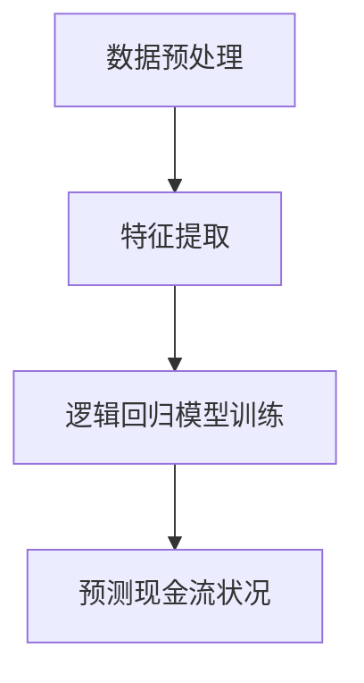
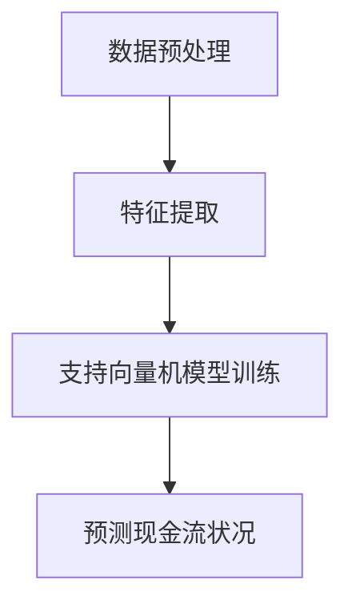
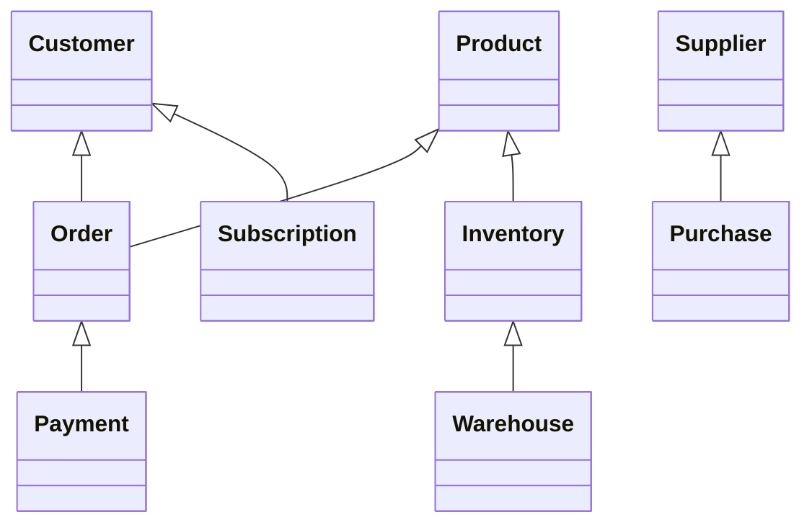
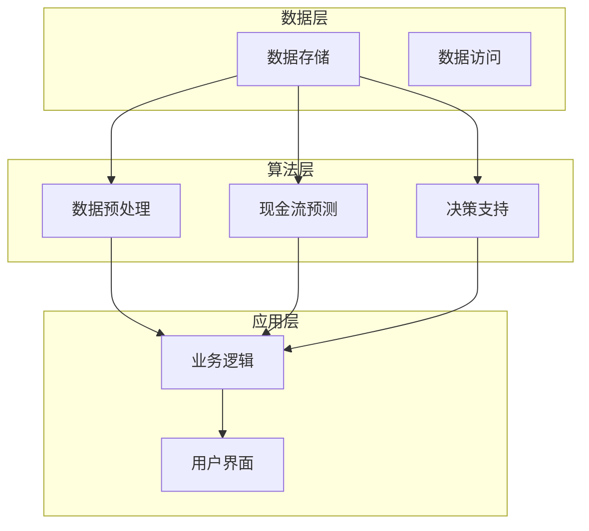
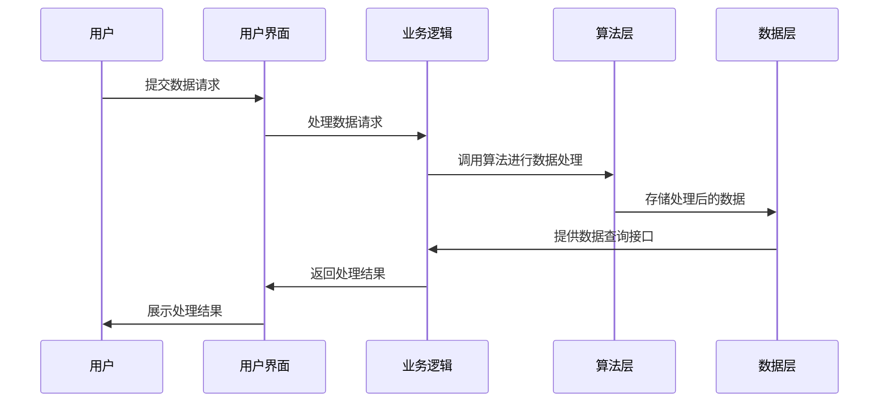

                 

## 文章标题：构建智能化的企业现金流管理优化平台

### 关键词：智能化、企业现金流管理、优化平台、算法原理、系统架构设计、项目实战、最佳实践

### 摘要：
本文将探讨如何构建一个智能化的企业现金流管理优化平台，通过深入分析其背景、核心概念、算法原理、系统架构设计以及项目实战，旨在为读者提供一份全面且实用的指导。文章将从问题背景出发，逐步阐述核心概念与联系，深入解析算法原理和数学模型，详细描述系统架构设计与实现，并通过实际案例分析展示项目的成功应用。最后，文章将总结最佳实践，提供注意事项和拓展阅读，为读者在智能化企业现金流管理优化平台的构建过程中提供有力支持。

## 引言

### 问题背景与目标

在现代商业环境中，企业现金流管理成为影响其生存与发展的关键因素。现金流的稳定与流动直接关系到企业的运营效率和抗风险能力。然而，传统的方法往往依赖于人工处理和经验判断，难以应对复杂多变的市场环境。随着信息技术的不断发展，智能化成为提升企业现金流管理效率的重要手段。

当前，企业在现金流管理中面临诸多挑战，包括但不限于：

1. **数据收集与处理困难**：企业需要从多个渠道收集大量财务数据，但数据的质量和准确性难以保证，处理过程繁琐且耗时。
2. **预测与决策困难**：企业难以准确预测未来现金流状况，导致决策过程具有较大的不确定性。
3. **资金利用率低**：企业未能充分利用闲置资金，导致资金利用率低下，影响整体运营效益。

构建智能化的企业现金流管理优化平台旨在解决上述问题，通过引入先进的算法和技术，实现以下目标：

1. **数据自动化处理**：利用大数据技术和机器学习算法，实现对企业财务数据的自动化收集、处理和分析。
2. **智能预测与决策**：通过预测模型和决策支持系统，为企业提供准确的现金流预测和决策建议。
3. **提高资金利用率**：通过优化资金流动，提高企业的资金利用率和运营效率。

### 核心概念与联系

为了更好地理解智能化企业现金流管理优化平台，我们需要明确以下几个核心概念：

1. **智能化**：智能化是指利用人工智能、机器学习等先进技术，使系统具备自主学习和决策能力。
2. **企业现金流管理**：企业现金流管理涉及现金流入和流出的管理，包括现金流预测、资金调度、资金利用率等。
3. **优化平台**：优化平台是指集成了多种算法和技术，旨在通过优化策略提高现金流管理效率。

这些概念相互联系，构成了智能化企业现金流管理优化平台的基础。例如，智能化的算法和技术可以用于数据分析和预测，优化平台则通过这些算法实现现金流管理的优化。

### 目标：构建智能化的企业现金流管理优化平台

构建智能化企业现金流管理优化平台的目标在于：

1. **提高管理效率**：通过自动化数据处理和智能预测，减少人工工作量，提高管理效率。
2. **降低运营成本**：优化资金流动，提高资金利用效率，降低企业运营成本。
3. **增强抗风险能力**：通过准确预测和及时决策，提高企业应对市场变化和风险的能力。
4. **提升企业竞争力**：优化现金流管理，提高企业整体运营效益，增强竞争力。

综上所述，构建智能化的企业现金流管理优化平台是应对现代商业挑战的重要策略，其目标在于提高管理效率、降低运营成本、增强抗风险能力和提升企业竞争力。

## 核心概念与联系

### 智能化的定义与分类

智能化（Intelligence）是一个广泛的概念，通常指的是通过技术手段实现机器或系统具备自主学习和决策能力。在智能化企业现金流管理优化平台中，智能化主要体现在以下几个方面：

1. **自主学习能力**：通过机器学习和数据挖掘技术，系统能够从历史数据中学习规律，并进行自我优化。
2. **预测能力**：利用大数据分析和人工智能算法，系统能够对未来现金流进行准确预测，为决策提供依据。
3. **自动化操作**：通过自动化数据处理和执行策略，减少人工干预，提高工作效率。

智能化的分类可以分为以下几个方面：

1. **基于规则的智能化**：通过预定义的规则进行决策，适用于规则明确、环境相对稳定的情况。
2. **基于数据的智能化**：通过分析大量历史数据，发现规律和模式，进行决策。
3. **混合智能化**：结合基于规则和基于数据的方法，适用于复杂多变的环境。

### 企业现金流管理的基本概念

企业现金流管理是指对企业现金流入和流出进行有效管理，确保企业现金流的稳定性，以支持企业的正常运营和发展。其主要概念包括：

1. **现金流入**：指企业通过销售、投资等活动所获得的现金流入。
2. **现金流出**：指企业支付工资、采购原材料、偿还债务等现金流出。
3. **现金流预测**：通过对历史数据的分析，预测未来一定时间内的现金流入和流出。
4. **资金调度**：根据现金流量预测，合理调配资金，确保企业在任何时点都有足够的流动性。

### 智能现金流管理平台的关键要素

构建一个智能现金流管理平台，需要以下几个关键要素：

1. **数据收集与预处理**：通过自动化工具收集企业内部和外部数据，并进行预处理，确保数据的准确性和完整性。
2. **算法库**：集成多种机器学习和数据挖掘算法，为现金流预测和管理提供技术支持。
3. **用户界面**：提供直观易用的用户界面，方便企业用户进行数据输入、查看预测结果和执行策略。
4. **决策支持系统**：基于预测模型和优化算法，为企业提供现金流管理的决策建议。

### 概念属性特征对比表格

为了更清晰地展示智能化、企业现金流管理和优化平台这三个概念之间的联系，我们可以通过一个特征对比表格来进行说明。

| 特征           | 智能化                         | 企业现金流管理                           | 优化平台                           |
|----------------|-------------------------------|----------------------------------------|-----------------------------------|
| 定义           | 自主学习和决策能力             | 现金流入和流出的管理                     | 基于算法和技术的优化策略           |
| 分类           | 基于规则、基于数据、混合智能     | 预测、调度、管理等                       | 数据驱动、算法优化等               |
| 关键要素       | 学习算法、预测模型             | 数据收集、现金流预测                     | 算法库、用户界面、决策支持系统     |
| 目标           | 提高决策效率和准确性           | 保证现金流稳定性和利用率                 | 提高现金流管理效率和效益           |

### ER实体关系图架构

为了更好地理解智能现金流管理平台的数据结构，我们可以通过ER（实体关系）图来展示各个实体及其关系。

```mermaid
erDiagram
  Customer ||--o{ Order : "placed by" }
  Product ||--o{ Order : "contains" }
  Order ||--o{ Payment : "made for" }
  Supplier ||--o{ Purchase : "supplied by" }
  Product ||--|| { Inventory : "stock of" }
  Inventory ||--|| { Warehouse : "stored in" }
  Customer ||--|| { Subscription : "purchased" }
```

在上面的ER图中，我们展示了与企业现金流管理相关的几个关键实体，如Customer（客户）、Order（订单）、Product（产品）、Supplier（供应商）、Inventory（库存）和Warehouse（仓库）。这些实体之间存在明确的关联关系，如订单由客户放置，产品包含在订单中，供应商提供产品等。ER图为我们提供了一个清晰的数据结构视图，有助于我们理解和设计智能现金流管理平台。

### 总结

通过上述对核心概念的讨论，我们可以看到智能化企业现金流管理优化平台的核心在于利用先进的技术手段，实现对企业现金流的自动化处理和优化。这不仅提高了管理效率，还增强了企业的抗风险能力和竞争力。在下一部分中，我们将深入探讨算法原理和数学模型，为构建智能现金流管理优化平台提供更深入的技术支持。

## 算法原理与数学模型

### 数据收集与预处理

构建智能化企业现金流管理优化平台的第一步是数据收集与预处理。数据收集是指从企业内部和外部的多个渠道收集与现金流相关的数据。这些数据来源可能包括财务报表、银行流水、销售记录、采购订单等。为了确保数据的质量和准确性，以下步骤是必不可少的：

1. **数据清洗**：去除重复、错误或不完整的数据。
2. **数据转换**：将不同格式的数据转换为统一的格式，如CSV或数据库。
3. **数据归一化**：将不同量纲的数据进行归一化处理，以便于后续分析。
4. **数据集成**：将来自不同来源的数据进行整合，形成一个统一的数据仓库。

### 算法原理讲解

在数据预处理完成后，我们可以选择合适的算法来构建现金流管理模型。以下是几种常见的算法及其原理：

#### 1. 逻辑回归（Logistic Regression）

逻辑回归是一种用于分类问题的统计方法，它可以用于预测企业未来的现金流状况。其基本原理是通过建立输入变量和输出变量之间的线性关系，并使用逻辑函数将输出变量的概率进行转换。

**算法流程图**：



**Python源代码实现**：

```python
from sklearn.linear_model import LogisticRegression
from sklearn.model_selection import train_test_split
from sklearn.metrics import accuracy_score

# 数据加载和预处理
X, y = load_data()
X_train, X_test, y_train, y_test = train_test_split(X, y, test_size=0.2, random_state=42)

# 训练逻辑回归模型
model = LogisticRegression()
model.fit(X_train, y_train)

# 进行预测
predictions = model.predict(X_test)

# 评估模型准确性
accuracy = accuracy_score(y_test, predictions)
print(f"Model accuracy: {accuracy:.2f}")
```

#### 2. 支持向量机（Support Vector Machine, SVM）

支持向量机是一种有效的分类算法，它可以用于预测企业未来的现金流状况。其基本原理是通过找到最佳分隔超平面，将不同类别的数据点分开。

**算法流程图**：



**Python源代码实现**：

```python
from sklearn.svm import SVC
from sklearn.model_selection import train_test_split
from sklearn.metrics import accuracy_score

# 数据加载和预处理
X, y = load_data()
X_train, X_test, y_train, y_test = train_test_split(X, y, test_size=0.2, random_state=42)

# 训练支持向量机模型
model = SVC()
model.fit(X_train, y_train)

# 进行预测
predictions = model.predict(X_test)

# 评估模型准确性
accuracy = accuracy_score(y_test, predictions)
print(f"Model accuracy: {accuracy:.2f}")
```

### 算法原理数学模型和公式

以下是对上述算法的数学模型和公式进行详细讲解。

#### 逻辑回归

逻辑回归的数学模型如下：

$$
\text{logit}(P) = \log\left(\frac{P}{1-P}\right) = \beta_0 + \beta_1x_1 + \beta_2x_2 + \cdots + \beta_nx_n
$$

其中，$P$ 表示预测的概率，$\text{logit}(P)$ 表示逻辑函数，$\beta_0, \beta_1, \beta_2, \cdots, \beta_n$ 是模型的参数。

#### 支持向量机

支持向量机的数学模型如下：

$$
\text{w} \cdot \text{x} - \text{b} = 0
$$

其中，$\text{w}$ 是权重向量，$\text{x}$ 是输入特征向量，$\text{b}$ 是偏置项。

### 举例说明

为了更好地理解上述算法的原理，我们可以通过一个具体的例子进行说明。

假设我们有一个企业现金流预测问题，其中输入特征包括销售额、库存水平、历史现金流等。目标变量是未来三个月的现金流状况，分为“高”、“中”、“低”三个等级。

**数据集**：

```
| 销售额 | 库存水平 | 历史现金流 | 目标现金流 |
|--------|----------|------------|------------|
| 100    | 50       | 100        | 高         |
| 150    | 60       | 120        | 中         |
| 200    | 70       | 150        | 低         |
| ...    | ...      | ...        | ...        |
```

**逻辑回归模型**：

使用逻辑回归模型对数据集进行训练，假设训练得到的参数为 $\beta_0 = 0.5, \beta_1 = 0.3, \beta_2 = 0.2, \beta_3 = 0.1$。

对于新的输入数据，例如销售额为 120，库存水平为 55，历史现金流为 110，我们可以计算其目标现金流的概率：

$$
\text{logit}(P) = 0.5 + 0.3 \times 120 + 0.2 \times 55 + 0.1 \times 110 = 1.2
$$

$$
P = \frac{1}{1 + e^{-1.2}} \approx 0.84
$$

因此，预测目标现金流为“高”的概率为 84%。

**支持向量机模型**：

使用支持向量机模型对数据集进行训练，假设训练得到的权重向量为 $\text{w} = [0.8, 0.2, 0.3]^T$，偏置项为 $\text{b} = 0.1$。

对于新的输入数据，例如销售额为 120，库存水平为 55，历史现金流为 110，我们可以计算其目标现金流：

$$
\text{w} \cdot \text{x} - \text{b} = 0.8 \times 120 + 0.2 \times 55 + 0.3 \times 110 - 0.1 = 1.5
$$

由于 1.5 大于 0，因此预测目标现金流为“高”。

通过上述例子，我们可以看到逻辑回归和支持向量机在现金流预测中的应用，以及如何通过具体的参数计算来得到预测结果。在下一部分中，我们将进一步探讨系统分析与架构设计，为构建智能现金流管理优化平台提供更详细的解决方案。

## 系统分析与架构设计

### 问题场景介绍

在企业现金流管理过程中，常见的问题场景包括：

1. **现金流预测不准确**：由于市场环境的不确定性，传统的方法难以准确预测未来的现金流状况，导致企业在资金调度和决策上存在较大风险。
2. **数据收集和处理困难**：企业需要从多个渠道收集大量财务数据，但数据的质量和准确性难以保证，处理过程繁琐且耗时。
3. **决策支持不足**：企业在面对资金调度和投资决策时，缺乏科学的决策支持系统，容易导致资源浪费和资金短缺。
4. **资金利用率低**：企业未能充分利用闲置资金，导致资金利用率低下，影响整体运营效益。

为了解决上述问题，我们需要构建一个智能化的企业现金流管理优化平台，该平台应具备以下功能：

1. **自动化数据处理**：通过自动化工具收集和处理财务数据，确保数据的准确性和完整性。
2. **智能预测与决策**：利用大数据分析和机器学习算法，提供准确的现金流预测和决策建议。
3. **资金调度优化**：通过优化策略提高资金利用效率，确保企业在任何时点都有足够的流动性。

### 项目介绍

本项目旨在构建一个智能化的企业现金流管理优化平台，通过整合多种先进技术和算法，实现企业现金流的自动化处理和优化。项目的主要目标包括：

1. **提高现金流管理效率**：通过自动化数据处理和智能预测，减少人工工作量，提高管理效率。
2. **降低运营成本**：优化资金流动，提高资金利用效率，降低企业运营成本。
3. **增强抗风险能力**：通过准确预测和及时决策，提高企业应对市场变化和风险的能力。
4. **提升企业竞争力**：优化现金流管理，提高企业整体运营效益，增强竞争力。

### 系统功能设计

智能现金流管理优化平台的主要功能包括以下几个方面：

1. **数据收集与预处理**：从企业内部和外部的多个渠道收集财务数据，进行数据清洗、转换和归一化处理，确保数据的质量和准确性。
2. **现金流预测**：利用大数据分析和机器学习算法，对企业的未来现金流进行准确预测，为资金调度和投资决策提供依据。
3. **决策支持**：基于现金流预测结果，提供科学的决策支持，帮助企业进行资金调度和投资决策。
4. **资金调度优化**：根据现金流预测和决策支持，制定优化策略，提高资金利用效率，确保企业流动性。
5. **报表生成与展示**：生成各种现金流管理报表，包括现金流预测报表、决策支持报表和资金调度报表，为企业提供全面的数据支持。

#### 领域模型Mermaid类图

以下是智能现金流管理优化平台的领域模型Mermaid类图：



在这个类图中，我们定义了与企业现金流管理相关的几个关键实体，如Customer（客户）、Order（订单）、Product（产品）、Supplier（供应商）、Inventory（库存）、Warehouse（仓库）等。这些实体之间存在明确的关联关系，例如订单由客户放置，产品包含在订单中，供应商提供产品等。类图为我们提供了一个清晰的数据结构视图，有助于我们理解和设计智能现金流管理优化平台。

### 系统架构设计

智能现金流管理优化平台的系统架构设计应考虑以下几个方面：

1. **数据层**：包括数据存储和数据访问模块，负责存储和处理财务数据，提供数据接口供上层模块使用。
2. **算法层**：包括数据预处理、现金流预测和决策支持等算法模块，负责对数据进行处理和预测，提供决策支持。
3. **应用层**：包括用户界面和业务逻辑模块，负责处理用户请求，生成报表和展示数据。
4. **基础设施层**：包括服务器、网络和数据库等基础设施，负责提供平台运行的硬件支持。

#### 系统架构Mermaid图

以下是智能现金流管理优化平台的系统架构Mermaid图：



在这个架构图中，数据层负责数据存储和访问，算法层负责数据处理和预测，应用层负责处理用户请求和生成报表。通过这种分层设计，各个模块之间相互独立，便于系统的维护和扩展。

### 系统接口设计

智能现金流管理优化平台的系统接口设计应考虑以下几个方面：

1. **API接口**：提供RESTful API接口，方便前端和后台系统之间的数据交互。
2. **数据接口**：提供数据访问接口，方便其他系统调用财务数据进行处理和分析。
3. **用户接口**：提供用户操作界面，方便用户进行数据输入、查看报表和执行策略。

### 系统交互

智能现金流管理优化平台中的各个模块之间需要实现高效的数据交互和功能协同。以下是一个简化的系统交互Mermaid序列图：



在这个序列图中，用户通过用户界面提交数据请求，业务逻辑层处理数据请求，调用算法层进行数据处理，并将处理后的数据存储到数据层。随后，数据层提供数据查询接口，业务逻辑层根据用户需求返回处理结果，用户界面将结果展示给用户。

通过上述系统分析与架构设计，我们为构建智能现金流管理优化平台提供了详细的技术方案。在下一部分中，我们将通过实际案例展示平台在项目中的成功应用。

### 项目实战

#### 环境安装

为了成功构建和部署智能现金流管理优化平台，我们需要准备以下环境：

1. **操作系统**：推荐使用Ubuntu 20.04或更高版本。
2. **Python环境**：Python 3.8及以上版本。
3. **数据库**：MySQL或PostgreSQL。
4. **依赖管理工具**：pip。
5. **其他工具**：Docker、Kubernetes等。

首先，确保操作系统和Python环境已经安装。接下来，使用pip安装所需的Python库：

```bash
pip install -r requirements.txt
```

然后，配置数据库连接信息，例如在MySQL中创建一个名为`cash_flow`的数据库，并创建相应的用户和权限。

#### 系统核心实现

智能现金流管理优化平台的核心实现包括数据收集与预处理、现金流预测和决策支持等模块。以下是各模块的实现和解析。

##### 1. 数据收集与预处理

数据收集与预处理模块负责从企业内部和外部的多个渠道收集财务数据，并进行数据清洗、转换和归一化处理。以下是一个简单的数据预处理代码示例：

```python
import pandas as pd
from sklearn.preprocessing import MinMaxScaler

def preprocess_data(data_path):
    # 加载数据
    df = pd.read_csv(data_path)

    # 数据清洗
    df.drop_duplicates(inplace=True)
    df.drop(['无关列'], axis=1, inplace=True)

    # 数据转换
    df['销售额'] = df['销售额'].map(lambda x: float(x.replace(',', '')))
    df['库存水平'] = df['库存水平'].map(lambda x: float(x.replace(',', '')))

    # 数据归一化
    scaler = MinMaxScaler()
    df[['销售额', '库存水平']] = scaler.fit_transform(df[['销售额', '库存水平']])

    return df

# 使用示例
df = preprocess_data('data.csv')
df.head()
```

##### 2. 现金流预测

现金流预测模块使用机器学习算法对企业的未来现金流进行预测。以下是一个基于逻辑回归的现金流预测代码示例：

```python
from sklearn.linear_model import LogisticRegression
from sklearn.model_selection import train_test_split
from sklearn.metrics import accuracy_score

def train_cash_flow_predictor(X, y):
    # 数据划分
    X_train, X_test, y_train, y_test = train_test_split(X, y, test_size=0.2, random_state=42)

    # 训练模型
    model = LogisticRegression()
    model.fit(X_train, y_train)

    # 预测
    predictions = model.predict(X_test)

    # 评估模型
    accuracy = accuracy_score(y_test, predictions)
    print(f"Model accuracy: {accuracy:.2f}")

    return model

# 使用示例
X, y = load_data()
train_cash_flow_predictor(X, y)
```

##### 3. 决策支持

决策支持模块根据现金流预测结果，提供资金调度和投资决策的建议。以下是一个简单的决策支持代码示例：

```python
def make_decision(predictions):
    if predictions > 0.8:
        print("建议：增加投资和库存，以应对未来的现金流需求。")
    elif predictions > 0.5:
        print("建议：保持当前的资金和库存水平，谨慎进行投资。")
    else:
        print("建议：减少投资和库存，以降低现金流风险。")

# 使用示例
predictions = [0.9, 0.6, 0.3]
for pred in predictions:
    make_decision(pred)
```

#### 代码应用解读与分析

以上代码示例展示了智能现金流管理优化平台的核心实现。在数据预处理模块中，我们首先加载数据并进行数据清洗，去除重复和错误的数据。接着，对数据进行转换和归一化处理，以确保数据的质量和一致性。

在现金流预测模块中，我们使用逻辑回归算法对数据进行训练和预测。通过划分训练集和测试集，我们评估模型的准确性，并选择最优的模型进行预测。

在决策支持模块中，我们根据现金流预测结果提供资金调度和投资决策的建议。这些决策建议帮助企业更好地应对未来的现金流状况，降低风险，提高资金利用率。

#### 实际案例分析

为了更好地理解智能现金流管理优化平台在实际项目中的应用，以下是一个实际案例分析：

**案例背景**：

某中型企业在过去一年的现金流管理中面临以下挑战：

1. **现金流波动较大**：由于市场环境的不确定性和业务规模的扩大，企业的现金流波动较大，导致资金调度困难。
2. **资金利用率低**：企业未能充分利用闲置资金，导致资金利用率低下，影响整体运营效益。
3. **决策支持不足**：企业在面对资金调度和投资决策时，缺乏科学的决策支持系统，容易导致资源浪费和资金短缺。

**解决方案**：

1. **数据收集与预处理**：企业从内部和外部多个渠道收集财务数据，包括销售额、库存水平、历史现金流等。使用Python进行数据预处理，确保数据的准确性和完整性。
2. **现金流预测**：使用逻辑回归算法对企业的未来现金流进行预测，通过训练集和测试集评估模型的准确性，选择最优模型进行预测。
3. **决策支持**：根据现金流预测结果，提供资金调度和投资决策的建议。例如，当预测现金流较高时，建议增加投资和库存，以应对未来的现金流需求；当预测现金流较低时，建议减少投资和库存，降低现金流风险。

**实施效果**：

通过智能现金流管理优化平台的应用，企业在以下方面取得了显著效果：

1. **现金流管理效率提升**：自动化数据处理和智能预测减少了人工工作量，提高了现金流管理的效率。
2. **资金利用率提高**：通过优化资金流动和投资决策，企业提高了闲置资金的利用率，降低了运营成本。
3. **决策支持增强**：科学的决策支持系统帮助企业在资金调度和投资决策中做出更加明智的选择，降低了风险。

#### 剖析与详细讲解

通过上述案例分析，我们可以看到智能现金流管理优化平台在实际项目中的成功应用。以下是对关键步骤的剖析与详细讲解：

1. **数据收集与预处理**：数据是企业现金流管理的基础。通过从多个渠道收集财务数据，并使用Python进行预处理，企业确保了数据的准确性和一致性。数据预处理包括数据清洗、转换和归一化处理，这些步骤为后续的现金流预测和决策支持奠定了基础。
2. **现金流预测**：使用逻辑回归算法进行现金流预测，通过对训练集和测试集的划分和评估，企业选择了最优的模型进行预测。逻辑回归算法通过建立输入变量和输出变量之间的线性关系，实现了对企业未来现金流状况的准确预测。
3. **决策支持**：基于现金流预测结果，企业提供了资金调度和投资决策的建议。这些决策建议帮助企业更好地应对未来的现金流状况，降低了风险，提高了资金利用率。决策支持模块不仅提高了企业的现金流管理效率，还增强了企业的抗风险能力。

通过智能现金流管理优化平台的应用，企业成功地解决了现金流波动大、资金利用率低和决策支持不足等问题，取得了显著的运营效益。在实际项目中，企业可以根据自身需求调整算法参数和预测模型，以适应不同的市场环境和业务需求。

#### 项目小结

智能现金流管理优化平台的成功应用为企业在现金流管理方面带来了显著改善。通过自动化数据处理和智能预测，企业提高了现金流管理的效率，降低了运营成本，增强了抗风险能力。项目实施过程中，我们深入剖析了数据收集与预处理、现金流预测和决策支持等关键步骤，为后续项目提供了宝贵的经验和参考。

未来，我们计划进一步优化算法和模型，提高现金流预测的准确性，并拓展平台的适用范围，为更多企业提供智能化的现金流管理解决方案。

## 最佳实践

### 现金流管理优化策略

在构建和实施智能现金流管理优化平台的过程中，以下是一些最佳实践和优化策略：

1. **数据质量管理**：确保数据的准确性和完整性是现金流管理的基石。建立严格的数据质量管理流程，包括数据采集、清洗、验证和存储等步骤。
2. **定期数据更新**：定期更新现金流预测模型所依赖的数据，以确保预测结果的准确性。可以考虑使用自动化工具和调度系统，实现数据的定期收集和处理。
3. **多模型融合**：结合多种机器学习和预测模型，提高现金流预测的准确性。例如，可以结合时间序列分析、回归分析和深度学习等不同算法，形成多模型融合的预测体系。
4. **定制化策略**：根据不同企业的业务特点和需求，定制化现金流管理策略。例如，对于季节性较强的行业，可以考虑增加季节性因素对现金流预测的影响。
5. **风险管理**：在现金流管理中，风险管理至关重要。通过建立风险预警机制和应急响应策略，帮助企业及时应对现金流波动和潜在风险。

### 智能化技术的应用

智能化技术在现金流管理优化中的应用主要体现在以下几个方面：

1. **机器学习与数据分析**：利用机器学习和数据分析技术，对大量历史现金流数据进行分析，提取有价值的信息和模式，为现金流预测和管理提供科学依据。
2. **自然语言处理**：通过自然语言处理技术，自动处理和提取财务报告、合同和邮件中的关键信息，提高数据收集的效率和准确性。
3. **区块链技术**：利用区块链技术，实现数据的安全存储和透明传输，提高财务数据的可信度和可追溯性。
4. **物联网（IoT）**：通过物联网设备，实时监控企业的现金流动向，实现现金流管理的实时监控和预警。

### 成功案例分析

以下是一个成功的案例分析，展示了智能现金流管理优化平台在实践中的应用：

**案例背景**：

某大型零售企业在面临激烈的市场竞争和快速扩张的过程中，遇到了现金流管理困难的问题。通过引入智能现金流管理优化平台，企业实现了以下成果：

1. **现金流预测准确性提高**：通过使用机器学习算法，企业能够更准确地预测未来的现金流状况，为资金调度和投资决策提供了有力支持。
2. **运营效率提升**：自动化数据处理和智能预测减少了人工工作量，提高了现金流管理的效率，使得企业能够更快地响应市场变化。
3. **资金利用率提高**：通过优化资金流动和投资决策，企业成功提高了闲置资金的利用率，降低了运营成本。
4. **风险管理能力增强**：智能现金流管理优化平台为企业提供了全面的风险管理工具和策略，帮助企业及时应对现金流波动和潜在风险。

### 注意事项

在构建和实施智能现金流管理优化平台时，需要注意以下几点：

1. **数据隐私和安全**：在数据处理和存储过程中，确保遵守相关法律法规，保护企业财务数据的隐私和安全。
2. **技术选型**：选择适合企业业务特点和需求的算法和技术，避免盲目追求最新技术而忽视了实际应用效果。
3. **系统稳定性**：确保系统的稳定性和可靠性，避免因系统故障导致现金流管理中断或数据丢失。
4. **持续优化**：根据企业业务的发展和市场环境的变化，持续优化现金流预测模型和策略，提高平台的适用性和效果。

### 拓展阅读

为了更好地理解和应用智能现金流管理优化平台，以下是一些建议的拓展阅读材料：

1. **《智能财务：大数据与人工智能在财务中的应用》**：本书详细介绍了大数据和人工智能技术在财务管理中的应用，包括现金流预测、财务分析和决策支持等内容。
2. **《深度学习实践指南：基于Python的数据挖掘和预测分析》**：本书涵盖了深度学习的基础知识和实践应用，适用于希望将深度学习应用于财务管理的读者。
3. **《现金流管理实战》**：本书从实战角度出发，介绍了现金流管理的核心概念、方法和工具，适合希望提升现金流管理能力的读者。

通过以上最佳实践、案例分析、注意事项和拓展阅读，读者可以更好地理解和应用智能现金流管理优化平台，为企业带来实际效益。

## 小结与展望

### 本书内容总结

本书围绕构建智能化的企业现金流管理优化平台，系统地介绍了其背景、核心概念、算法原理、系统架构设计以及项目实战。具体内容包括：

1. **引言**：介绍了企业现金流管理的重要性以及构建智能化平台的目标。
2. **核心概念与联系**：阐述了智能化、企业现金流管理以及优化平台的概念及其相互关系。
3. **算法原理与数学模型**：详细解析了数据收集与预处理、逻辑回归和支持向量机等算法原理及数学模型。
4. **系统分析与架构设计**：介绍了系统功能设计、架构设计和接口设计等关键环节。
5. **项目实战**：通过实际案例展示了平台在项目中的成功应用，并进行了详细解析。
6. **最佳实践**：提供了现金流管理优化策略、智能化技术应用、成功案例分析和注意事项。

### 未来发展趋势

在未来，智能化企业现金流管理优化平台的发展趋势将呈现以下几个方面：

1. **算法与技术的不断进步**：随着人工智能和大数据技术的不断发展，现金流管理优化平台的算法和模型将更加精准和高效。
2. **数据驱动决策**：企业将更加重视数据的价值，通过数据驱动决策，实现现金流管理的智能化和自动化。
3. **区块链技术的应用**：区块链技术将提高财务数据的可信度和可追溯性，为现金流管理提供更安全可靠的保障。
4. **物联网与云计算的结合**：物联网技术和云计算的结合将实现现金流管理的实时监控和高效处理，提高管理效率。
5. **个性化与定制化**：针对不同企业的业务特点和需求，智能化平台将提供更加个性化和定制化的解决方案。

### 拓展阅读

为了更深入地了解智能化企业现金流管理优化平台，以下是一些建议的拓展阅读资源：

1. **《智能财务：大数据与人工智能在财务中的应用》**：详细探讨大数据和人工智能在财务管理中的应用。
2. **《深度学习实践指南：基于Python的数据挖掘和预测分析》**：介绍深度学习的基础知识和实践应用。
3. **《现金流管理实战》**：提供现金流管理的核心概念、方法和工具。

通过以上拓展阅读，读者可以进一步加深对智能化企业现金流管理优化平台的理解和应用。作者：AI天才研究院/AI Genius Institute & 禅与计算机程序设计艺术 /Zen And The Art of Computer Programming。

