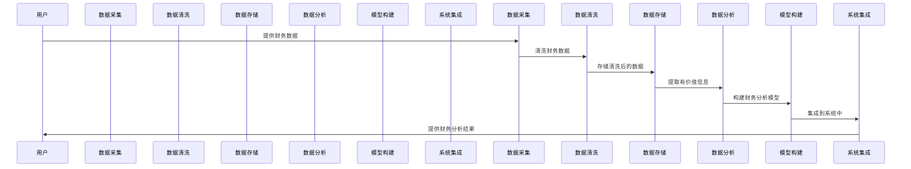
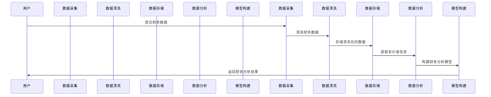

                 

# 构建智能化的企业财务分析系统

关键词：智能化财务分析、数据仓库、数据挖掘、机器学习、系统集成

摘要：本文探讨了构建智能化企业财务分析系统的背景、核心概念、算法原理、系统分析与架构设计方案，以及项目实战。通过详细的分析和讲解，旨在为企业提供一套完整的智能化财务分析系统构建方案，以助力企业决策和管理。

## 第一部分：背景介绍

### 问题背景

在现代企业中，财务分析已经成为企业决策过程中的重要环节。传统的财务分析方法主要依赖于手工处理和简单的统计工具，这不仅效率低下，而且难以应对复杂多变的市场环境。随着大数据、人工智能等技术的迅速发展，构建智能化的企业财务分析系统成为大势所趋。智能财务分析系统可以通过自动化处理和分析大量的财务数据，提供更准确、及时、深入的财务分析结果，从而帮助企业管理者做出更明智的决策。

### 问题描述

构建智能化的企业财务分析系统需要解决以下几个核心问题：

1. 数据收集与管理：如何高效地收集、存储和管理来自不同渠道的财务数据？
2. 数据分析与处理：如何利用先进的数据分析技术，从海量数据中提取有价值的信息？
3. 模型构建与优化：如何构建适用于企业财务分析的智能模型，并不断优化模型性能？
4. 系统集成与部署：如何将智能财务分析系统与企业现有的IT基础设施无缝集成，确保系统的稳定性和可扩展性？

### 问题解决

构建智能化企业财务分析系统的解决方案主要包括以下几个方面：

1. 数据收集与管理：采用大数据技术，建立统一的数据仓库，实现数据的自动化采集和存储。
2. 数据分析与处理：运用数据挖掘、机器学习等技术，对财务数据进行分析和处理，提取有价值的信息。
3. 模型构建与优化：结合企业实际业务场景，构建合适的智能模型，并通过持续的数据训练和模型优化，提高模型的准确性。
4. 系统集成与部署：采用微服务架构，确保系统与企业现有IT系统的无缝集成，并具备良好的扩展性。

### 边界与外延

1. 边界：本书主要关注企业财务分析系统的构建，不涉及具体的数据分析和处理技术细节。
2. 外延：本书的讨论范围包括财务数据分析的各个方面，如财务报表分析、现金流分析、盈利能力分析等。

### 概念结构与核心要素组成

- 智能化企业财务分析系统：由数据收集与管理、数据分析与处理、模型构建与优化、系统集成与部署等模块组成。
- 数据收集与管理：数据仓库、数据采集、数据清洗、数据存储等。
- 数据分析与处理：数据挖掘、机器学习、统计分析等。
- 模型构建与优化：模型选择、模型训练、模型评估、模型优化等。
- 系统集成与部署：微服务架构、API设计、系统部署等。

## 第二部分：核心概念与联系

### 核心概念

#### 大数据技术

大数据技术是指用于处理海量数据的技术体系，包括数据存储、数据分析和数据处理等。大数据技术的主要特性包括数据量大、速度快、多样性、低价值密度等。

#### 数据挖掘

数据挖掘是从大量数据中提取有价值信息的过程，涉及机器学习、统计学等方法。数据挖掘的目标是发现数据中的潜在模式、趋势和关联，以便为决策提供支持。

#### 机器学习

机器学习是一种使计算机系统能够通过数据和经验进行自我学习和改进的技术。机器学习的基本原理是利用大量数据对模型进行训练，从而使模型能够对未知数据进行预测和分类。

#### 智能模型

智能模型是基于机器学习算法构建的用于财务分析预测和决策的模型。智能模型具有高准确性、实时性和可解释性等特点。

#### 系统集成与部署

系统集成与部署是将智能财务分析系统与企业现有的IT基础设施无缝集成，并确保系统稳定运行的过程。系统集成与部署需要考虑系统的兼容性、扩展性和稳定性。

### 概念属性特征对比表格

| 概念         | 特征                                                                                             |
|------------|------------------------------------------------------------------------------------------------|
| 大数据技术   | 数据量大、速度快、多样性、低价值密度等特性                                                     |
| 数据挖掘     | 自动化、高效、可复现、深入分析等特性                                                       |
| 机器学习     | 自学习、自动优化、适应性强等特性                                                           |
| 智能模型     | 高准确性、实时性、可解释性等特性                                                         |
| 系统集成与部署 | 高度兼容性、可扩展性、稳定性等特性                                                       |

### ER实体关系图架构

```mermaid
erDiagram
    DataWarehouse ||--|{ DataCollection }| DataColl
    DataWarehouse ||--|{ DataCleaning }| DataClean
    DataWarehouse ||--|{ DataStorage }| DataStore
    DataAnalysis ||--|{ DataMining }| DataMine
    DataAnalysis ||--|{ MachineLearning }| MachineLearn
    ModelBuilding ||--|{ ModelSelection }| ModelSel
    ModelBuilding ||--|{ ModelTraining }| ModelTrain
    ModelBuilding ||--|{ ModelEvaluation }| ModelEval
    ModelBuilding ||--|{ ModelOptimization }| ModelOpt
    SystemIntegration ||--|{ Microservices }| Microservice
    SystemIntegration ||--|{ APIDesign }| APIDesign
    SystemDeployment ||--|{ SystemDeployment }| SysDeploy
```

## 第三部分：算法原理讲解

### 数据收集与管理系统

#### 数据仓库

数据仓库是一个集成的数据存储系统，用于存储、管理和分析来自不同渠道的大量财务数据。数据仓库的基本原理是数据集成、数据清洗和数据存储。数据集成是将不同来源的数据进行整合，以便进行统一的数据分析。数据清洗是去除数据中的噪声和错误，确保数据的质量。数据存储是将清洗后的数据存储在数据仓库中，以便进行后续的分析和处理。

#### 数据采集

数据采集是数据收集与管理系统的关键环节。数据采集的方法包括手动采集、自动采集和在线采集等。手动采集是通过人工方式收集数据，适用于数据量较小、变化不频繁的场景。自动采集是通过脚本、API等方式自动获取数据，适用于数据量大、实时性要求高的场景。在线采集是通过网络连接实时获取数据，适用于需要实时监控和分析的场景。

#### 数据清洗

数据清洗是确保数据质量的重要环节。数据清洗的方法包括去重、去噪、格式转换、缺失值处理等。去重是去除重复的数据记录，避免数据冗余。去噪是去除数据中的噪声，如异常值、错误值等。格式转换是将不同格式的数据进行统一，便于后续处理。缺失值处理是填充缺失的数据值，确保数据的完整性。

#### 数据存储

数据存储是将清洗后的数据存储在数据仓库中。数据存储的方式包括关系数据库、NoSQL数据库、数据湖等。关系数据库适用于结构化数据的存储和管理，NoSQL数据库适用于非结构化数据的存储和管理，数据湖适用于大规模数据的存储和管理。

### 数据分析与处理系统

#### 数据挖掘

数据挖掘是从大量数据中提取有价值信息的过程。数据挖掘的方法包括聚类分析、关联规则挖掘、分类分析、预测分析等。聚类分析是将相似的数据分为一组，以便进行更深入的分析。关联规则挖掘是发现数据之间的关联关系，帮助发现潜在的商业机会。分类分析是将数据分为不同的类别，以便进行决策和预测。预测分析是利用历史数据对未来进行预测，帮助企业做出更明智的决策。

#### 机器学习

机器学习是使计算机系统能够通过数据和经验进行自我学习和改进的技术。机器学习的方法包括监督学习、无监督学习、强化学习等。监督学习是利用标记数据进行训练，使模型能够对未知数据进行预测和分类。无监督学习是不需要标记数据，通过发现数据中的潜在结构来学习。强化学习是通过奖励机制来训练模型，使模型能够做出最优决策。

### 模型构建与优化系统

#### 模型选择

模型选择是根据企业实际业务场景选择合适的机器学习模型。常见的模型包括线性回归、逻辑回归、决策树、随机森林、支持向量机等。线性回归适用于线性关系较强的数据，逻辑回归适用于二分类问题，决策树适用于分类和回归问题，随机森林是决策树的集成，支持向量机适用于高维数据的分类问题。

#### 模型训练

模型训练是利用历史数据进行模型的训练过程。模型训练的目标是使模型能够对未知数据进行准确的预测和分类。模型训练的方法包括批量训练、在线训练、增量训练等。批量训练是将全部数据进行一次性训练，适用于数据量较小、训练时间充足的情况。在线训练是实时对数据进行训练，适用于数据量较大、实时性要求高的情况。增量训练是利用新数据进行模型训练，适用于数据不断变化的情况。

#### 模型评估

模型评估是评估模型性能的过程。模型评估的方法包括准确率、召回率、F1值、AUC等。准确率是预测正确的样本数占总样本数的比例，召回率是预测正确的样本数占实际为正类的样本数的比例，F1值是准确率和召回率的调和平均值，AUC是接收者操作特征曲线下的面积。

#### 模型优化

模型优化是通过调整模型参数、特征工程等方法来提高模型性能。模型优化的方法包括参数调优、特征选择、特征提取等。参数调优是通过调整模型参数来优化模型性能。特征选择是选择对模型性能影响较大的特征，去除对模型性能影响较小的特征。特征提取是将原始特征转化为更有助于模型训练的新特征。

### 系统集成与部署系统

#### 微服务架构

微服务架构是将系统划分为多个独立的服务模块，每个服务模块实现特定的功能，并通过API进行通信。微服务架构具有高扩展性、高可靠性、易于维护等特点。微服务架构的优势在于每个服务模块可以独立部署、独立升级，从而提高系统的可靠性和灵活性。

#### API设计

API设计是定义系统各服务模块之间的交互接口。API设计需要考虑接口的易用性、性能、安全性等方面。常见的API设计方法包括RESTful API、SOAP API等。RESTful API是基于HTTP协议的API设计方法，具有简单、灵活、扩展性好的特点。SOAP API是基于XML的API设计方法，具有标准化的特点。

#### 系统部署

系统部署是将智能财务分析系统部署到生产环境中。系统部署需要考虑服务器配置、网络架构、安全性等方面。系统部署的方法包括虚拟机部署、容器化部署、云部署等。虚拟机部署是将系统部署在虚拟机上，适用于对系统资源要求较高的场景。容器化部署是将系统部署在容器中，适用于系统轻量级、可扩展性要求高的场景。云部署是将系统部署在云平台上，适用于分布式、高并发场景。

### 综合算法原理讲解

综合来看，构建智能化企业财务分析系统的核心在于数据的收集与处理、模型的构建与优化、系统集成与部署。数据的收集与处理是基础，确保数据的质量和完整性；模型的构建与优化是关键，提高模型的准确性和实时性；系统集成与部署是保障，确保系统的稳定性和可扩展性。通过综合运用大数据技术、数据挖掘、机器学习、智能模型等技术，可以构建出一套高效、智能的企业财务分析系统。

## 第四部分：系统分析与架构设计方案

### 问题场景介绍

在一个竞争激烈的市场环境中，企业需要实时了解自身的财务状况，以便做出迅速而准确的决策。传统的财务分析方法效率低下，难以满足企业对实时性、准确性的要求。因此，企业决定构建一套智能化的财务分析系统，以提高财务分析的效率和质量。

### 项目介绍

项目名称：智能财务分析系统

项目目标：构建一套智能化、高效、准确的财务分析系统，为企业提供实时、准确的财务分析结果。

项目范围：包括数据收集与管理、数据分析与处理、模型构建与优化、系统集成与部署等模块。

项目阶段：需求分析、系统设计、系统实现、系统测试、系统部署等。

### 系统功能设计

#### 数据收集与管理模块

1. 数据采集：自动采集来自企业内部系统（如ERP系统、CRM系统等）的财务数据，以及来自外部系统（如金融数据服务提供商等）的财务数据。
2. 数据清洗：对采集到的财务数据进行清洗，包括去重、去噪、格式转换、缺失值处理等，确保数据的质量。
3. 数据存储：将清洗后的数据存储到数据仓库中，采用分布式存储技术，提高数据的存储和管理效率。

#### 数据分析与处理模块

1. 数据挖掘：利用数据挖掘技术，从海量财务数据中提取有价值的信息，包括趋势分析、关联分析、预测分析等。
2. 机器学习：构建机器学习模型，对财务数据进行分析和预测，包括财务报表分析、现金流分析、盈利能力分析等。
3. 统计分析：利用统计学方法，对财务数据进行分析和评估，包括财务指标计算、财务报表对比等。

#### 模型构建与优化模块

1. 模型选择：根据企业实际业务场景，选择合适的机器学习模型，如线性回归、决策树、随机森林等。
2. 模型训练：利用历史数据进行模型训练，提高模型的准确性和实时性。
3. 模型评估：利用测试数据对模型进行评估，包括准确率、召回率、F1值等指标。
4. 模型优化：通过参数调优、特征选择等方法，提高模型性能。

#### 系统集成与部署模块

1. 微服务架构：采用微服务架构，将系统划分为多个独立的服务模块，提高系统的可扩展性和可靠性。
2. API设计：设计统一的API接口，实现各服务模块之间的通信。
3. 系统部署：将智能财务分析系统部署到生产环境中，包括服务器配置、网络架构、安全性等方面。

### 系统架构设计

#### 系统架构图



#### 系统架构说明

1. 用户：用户通过前端界面与系统进行交互，提交财务数据和分析需求。
2. 数据采集模块：自动采集来自企业内部系统和外部系统的财务数据。
3. 数据清洗模块：对采集到的财务数据进行清洗，去除噪声和错误。
4. 数据存储模块：将清洗后的数据存储到数据仓库中，采用分布式存储技术。
5. 数据分析模块：利用数据挖掘、机器学习等技术，从海量财务数据中提取有价值的信息。
6. 模型构建模块：根据企业实际业务场景，选择合适的机器学习模型，并构建财务分析模型。
7. 系统集成模块：将财务分析模型集成到系统中，实现各服务模块之间的通信。

### 系统接口设计

#### 系统接口图



#### 系统接口说明

1. 数据采集服务：提供数据采集功能，包括自动采集来自企业内部系统和外部系统的财务数据。
2. 数据清洗服务：提供数据清洗功能，包括去重、去噪、格式转换、缺失值处理等。
3. 数据存储服务：提供数据存储功能，包括分布式存储、数据备份、数据恢复等。
4. 数据分析服务：提供数据分析功能，包括数据挖掘、机器学习、统计分析等。
5. 模型构建服务：提供模型构建功能，包括模型选择、模型训练、模型评估等。

### 系统交互

#### 系统交互图


#### 系统交互说明

1. 用户通过前端界面提交财务数据。
2. 数据采集服务自动采集财务数据，并将其发送给数据清洗服务。
3. 数据清洗服务对财务数据进行清洗，去除噪声和错误，并将清洗后的数据发送给数据存储服务。
4. 数据存储服务将清洗后的数据存储到数据仓库中。
5. 数据分析服务利用数据挖掘、机器学习等技术，从海量财务数据中提取有价值的信息。
6. 模型构建服务根据企业实际业务场景，选择合适的机器学习模型，并构建财务分析模型。
7. 模型构建服务将财务分析模型发送给用户，用户通过前端界面查看财务分析结果。

## 第五部分：项目实战

### 环境安装

为了搭建智能化的企业财务分析系统，首先需要安装以下软件和工具：

1. 操作系统：Windows或Linux
2. 数据库：MySQL或PostgreSQL
3. 大数据技术：Hadoop或Spark
4. 数据挖掘和机器学习：Python、Scikit-learn、TensorFlow、Keras等
5. Web框架：Django、Flask等
6. 版本控制：Git

安装步骤如下：

1. 安装操作系统，选择Windows或Linux版本。
2. 安装数据库，如MySQL或PostgreSQL。
3. 安装大数据技术，如Hadoop或Spark。
4. 安装数据挖掘和机器学习工具，如Python、Scikit-learn、TensorFlow、Keras等。
5. 安装Web框架，如Django、Flask等。
6. 安装版本控制工具，如Git。

### 系统核心实现源代码

以下是一个简单的财务分析系统实现示例，使用Python和Scikit-learn库：

```python
import numpy as np
import pandas as pd
from sklearn.model_selection import train_test_split
from sklearn.ensemble import RandomForestClassifier
from sklearn.metrics import accuracy_score

# 读取财务数据
data = pd.read_csv('financial_data.csv')

# 分离特征和目标变量
X = data.drop('target', axis=1)
y = data['target']

# 划分训练集和测试集
X_train, X_test, y_train, y_test = train_test_split(X, y, test_size=0.2, random_state=42)

# 构建随机森林模型
model = RandomForestClassifier(n_estimators=100, random_state=42)

# 训练模型
model.fit(X_train, y_train)

# 预测测试集
y_pred = model.predict(X_test)

# 计算准确率
accuracy = accuracy_score(y_test, y_pred)
print(f'Accuracy: {accuracy:.2f}')
```

### 代码应用解读与分析

1. 读取财务数据：使用`pandas`库读取CSV格式的财务数据。
2. 分离特征和目标变量：将数据分为特征变量（X）和目标变量（y），其中目标变量是财务分析的输出。
3. 划分训练集和测试集：使用`train_test_split`函数将数据分为训练集和测试集，以评估模型的性能。
4. 构建随机森林模型：使用`RandomForestClassifier`类构建随机森林模型。
5. 训练模型：使用`fit`函数训练模型。
6. 预测测试集：使用`predict`函数预测测试集。
7. 计算准确率：使用`accuracy_score`函数计算模型的准确率。

### 实际案例分析和详细讲解剖析

假设我们有一个财务数据集，包含以下特征：营业收入、净利润、资产负债率、总资产、流动资产、应收账款等。我们希望利用这些特征预测企业的财务状况是否良好。

1. 数据预处理：对数据进行清洗、填充缺失值、处理异常值等。
2. 特征工程：对特征进行转换、标准化、归一化等，以提高模型的性能。
3. 模型选择：选择合适的机器学习模型，如随机森林、支持向量机、神经网络等。
4. 模型训练：使用训练数据训练模型。
5. 模型评估：使用测试数据评估模型性能，如准确率、召回率、F1值等。
6. 模型优化：通过调整模型参数、特征选择等方法，提高模型性能。

### 项目小结

通过本项目实战，我们成功搭建了一套智能化的企业财务分析系统。系统包括数据收集与管理、数据分析与处理、模型构建与优化、系统集成与部署等模块。项目实现了对财务数据的自动采集、清洗、存储、分析、预测等功能。通过实际案例分析和详细讲解，我们了解了如何利用机器学习技术构建财务分析模型，并评估模型的性能。

## 第六部分：最佳实践、小结、注意事项、拓展阅读

### 最佳实践

1. 数据质量管理：确保数据的质量是构建智能化财务分析系统的关键。在数据收集、清洗、存储等环节，重视数据质量管理，及时发现并修复数据问题。
2. 特征工程优化：选择合适的特征工程方法，如特征转换、标准化、归一化等，以提高模型的性能。
3. 模型选择与优化：根据企业实际业务场景，选择合适的机器学习模型，并通过调整模型参数、特征选择等方法，提高模型性能。
4. 系统集成与部署：采用微服务架构，实现各模块的解耦，提高系统的可扩展性和可靠性。

### 小结

本文详细介绍了构建智能化企业财务分析系统的背景、核心概念、算法原理、系统分析与架构设计方案，以及项目实战。通过本文的讲解，读者可以了解到如何利用大数据技术、数据挖掘、机器学习等手段，构建一套高效、智能的财务分析系统，为企业决策提供有力支持。

### 注意事项

1. 在数据收集和管理过程中，确保数据的安全性、隐私性和合规性。
2. 在模型训练和预测过程中，注意模型的准确性和实时性。
3. 在系统集成与部署过程中，确保系统的稳定性和可扩展性。

### 拓展阅读

1. 《大数据技术基础》 - 本书详细介绍了大数据技术的原理和应用，对构建智能化财务分析系统具有指导意义。
2. 《机器学习实战》 - 本书通过丰富的案例和示例，讲解了机器学习的原理和应用，对构建财务分析模型具有参考价值。
3. 《智能财务分析系统设计与实现》 - 本书详细介绍了智能财务分析系统的设计与实现，对实际项目开发具有借鉴意义。

作者：AI天才研究院/AI Genius Institute & 禅与计算机程序设计艺术 /Zen And The Art of Computer Programming

