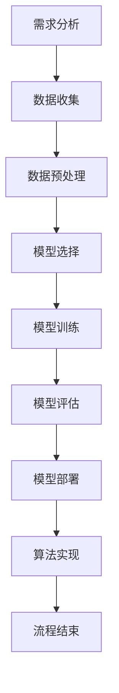

                 

----------------------------------------------------------------

# 构建智能化的企业资金池管理优化平台

## 关键词

- 智能化资金池
- 企业资金管理
- 优化算法
- 架构设计
- 数学模型

## 摘要

随着全球商业环境的不断变化，企业对于资金管理的需求越来越复杂。本文旨在构建一个智能化的企业资金池管理优化平台，通过分析现有资金池管理模式的问题，引入优化算法和数学模型，设计出高效的资金池管理架构。本文首先介绍了智能化资金池的基本概念和核心原理，然后对现有企业资金池管理模式进行了深入分析，探讨了存在的问题与挑战。接着，本文详细阐述了智能化资金池架构的设计原则、数据流与处理流程，以及系统模块划分。随后，本文通过构建数学模型和算法，展示了资金池管理优化过程的原理和应用。最后，本文通过实际案例，对构建的智能化资金池管理优化平台进行了详细讲解和评估，提出了最佳实践建议，并对未来的发展方向进行了展望。

## 目录

1. 引言
   1.1 研究背景
   1.2 研究目的与意义
   1.3 研究方法与内容结构

2. 相关理论基础
   2.1 智能化资金池概述
   2.2 资金池管理核心概念
   2.3 优化算法与模型

3. 企业资金池管理现状分析
   3.1 当前企业资金池管理模式
   3.2 存在的问题与挑战

4. 智能化资金池架构设计
   4.1 架构设计原则
   4.2 数据流与处理流程
   4.3 系统模块划分

5. 智能化资金池管理模型构建
   5.1 模型构建方法
   5.2 数学模型与公式解析
   5.3 算法实现与流程图

6. 实际案例分析
   6.1 案例一：企业A的资金池管理优化
   6.2 案例二：企业B的智能化资金池实践

7. 总结与展望
   7.1 主要研究成果
   7.2 不足与展望
   7.3 拓展阅读建议

## 第1章 引言

### 1.1 研究背景

在当前全球经济一体化和信息化的背景下，企业面临着日益激烈的竞争压力。资金作为企业运营的核心资源，其管理水平的高低直接影响到企业的经营效益。传统的企业资金池管理模式往往依赖于经验和人工操作，存在效率低、风险大等问题。随着人工智能技术的快速发展，智能化资金池管理应运而生，为企业提供了一种全新的资金管理方式。因此，构建智能化的企业资金池管理优化平台具有重要的现实意义。

### 1.2 研究目的与意义

本文的研究目的在于构建一个智能化的企业资金池管理优化平台，通过引入优化算法和数学模型，提高资金管理的效率和质量。具体来说，本文旨在解决以下几个问题：

1. 分析现有企业资金池管理模式存在的问题和挑战。
2. 设计一个高效、可靠的智能化资金池管理架构。
3. 构建一套完整的资金池管理优化模型，并验证其应用效果。
4. 提供实际案例，展示智能化资金池管理优化平台的实践效果。

本研究对于企业资金管理具有重要的理论意义和实际价值。首先，它为企业提供了一种智能化的资金管理解决方案，有助于提升企业资金管理的效率和安全性。其次，本研究为资金管理领域提供了新的理论和方法，丰富了相关研究领域的内容。最后，通过实际案例的展示，本文为其他企业提供了一种可借鉴的资金管理优化模式。

### 1.3 研究方法与内容结构

本文采用的研究方法主要包括文献综述、案例分析和实证研究。通过查阅相关文献，了解国内外企业资金池管理的现状和趋势；通过案例分析，总结出企业资金池管理中存在的问题和挑战；通过实证研究，构建智能化资金池管理优化平台，并验证其应用效果。

本文的内容结构如下：

- 第1章：引言，介绍研究背景、目的与意义，以及研究方法与内容结构。
- 第2章：相关理论基础，介绍智能化资金池的基本概念、核心原理和相关优化算法。
- 第3章：企业资金池管理现状分析，分析当前企业资金池管理模式存在的问题和挑战。
- 第4章：智能化资金池架构设计，设计智能化资金池管理架构，包括架构设计原则、数据流与处理流程和系统模块划分。
- 第5章：智能化资金池管理模型构建，构建资金池管理优化模型，包括模型构建方法、数学模型与公式解析和算法实现与流程图。
- 第6章：实际案例分析，通过实际案例展示智能化资金池管理优化平台的应用效果。
- 第7章：总结与展望，总结研究成果，提出不足与展望，以及拓展阅读建议。

## 第2章 相关理论基础

### 2.1 智能化资金池概述

智能化资金池是一种基于人工智能技术的企业资金管理方式，通过对企业资金流动的实时监控和分析，实现资金的高效调配和管理。智能化资金池的主要特点包括：

1. **实时性**：智能化资金池能够实时获取企业资金流动信息，及时调整资金配置。
2. **智能化**：通过机器学习、数据挖掘等技术，智能化资金池能够自动分析和预测资金需求，优化资金配置策略。
3. **灵活性**：智能化资金池可以根据企业业务变化和市场需求，动态调整资金管理策略。

### 2.2 资金池管理核心概念

资金池管理涉及以下几个核心概念：

1. **资金流动**：资金在企业内部和外部的流动过程，包括收入、支出、借贷等。
2. **资金配置**：根据企业资金流动情况，将资金分配到不同的部门和项目。
3. **风险控制**：对资金流动过程中的风险进行识别、评估和控制，确保资金安全。
4. **收益最大化**：在风险可控的前提下，通过优化资金配置，实现企业收益最大化。

### 2.3 优化算法与模型

优化算法在智能化资金池管理中起着关键作用。常用的优化算法包括线性规划、非线性规划、遗传算法、神经网络等。这些算法可以通过对大量数据进行分析，找到最优的资金配置策略。

1. **线性规划**：线性规划是一种常见的优化算法，通过建立线性目标函数和线性约束条件，求解最优解。线性规划适用于资金配置中的一些简单问题。

2. **非线性规划**：非线性规划适用于目标函数和约束条件非线性的问题。相比于线性规划，非线性规划求解难度更大，但能处理更复杂的资金配置问题。

3. **遗传算法**：遗传算法是一种基于生物进化理论的优化算法，通过模拟自然进化过程，找到最优解。遗传算法在处理复杂、大规模的资金配置问题时具有优势。

4. **神经网络**：神经网络是一种基于人脑神经网络的计算模型，通过学习大量数据，能够自动提取特征并建立模型。神经网络在资金预测和风险控制方面具有广泛应用。

### 2.4 数学模型与公式解析

在智能化资金池管理中，数学模型用于描述资金流动、资金配置、风险控制和收益最大化等问题。以下是几个常用的数学模型：

1. **资金流动模型**：

   $$ F(t) = \sum_{i=1}^{n} I_i(t) - \sum_{j=1}^{m} O_j(t) $$

   其中，$F(t)$ 表示在时间$t$ 时的资金流动，$I_i(t)$ 表示第$i$ 个收入来源在时间$t$ 的资金流入量，$O_j(t)$ 表示第$j$ 个支出项在时间$t$ 的资金流出量。

2. **资金配置模型**：

   $$ C(x) = \min \left\{ \sum_{i=1}^{n} c_i x_i | Ax \leq b, x \geq 0 \right\} $$

   其中，$C(x)$ 表示资金配置的收益，$x$ 表示资金配置策略，$c_i$ 表示第$i$ 个项目的收益率，$A$ 和$b$ 分别为约束矩阵和约束向量。

3. **风险控制模型**：

   $$ R(y) = \max \left\{ P(Y \leq r) | Dy \leq e \right\} $$

   其中，$R(y)$ 表示风险控制效果，$y$ 表示风险控制策略，$P(Y \leq r)$ 表示资产收益率低于$r$ 的概率，$D$ 和$e$ 分别为风险约束矩阵和风险约束向量。

4. **收益最大化模型**：

   $$ \max \left\{ W(x) | F(t) \geq 0, C(x) \geq 0, R(y) \geq 0 \right\} $$

   其中，$W(x)$ 表示企业总收益，$F(t)$ 、$C(x)$ 和$R(y)$ 分别为资金流动、资金配置和风险控制模型。

通过上述数学模型和公式，可以对企业资金池管理进行定量分析和优化，实现智能化、高效化的资金管理。

## 第3章 企业资金池管理现状分析

### 3.1 当前企业资金池管理模式

当前企业资金池管理模式主要可以分为传统模式和现代模式两种。

1. **传统模式**：

   传统模式主要依赖于人工操作和经验管理，资金流动和配置过程较为复杂。具体来说，企业通过财务部门对资金流动进行监控，根据经验对资金进行配置，实现资金的基本管理。

   **优点**：

   - 简单易懂，易于操作。
   - 能够满足企业基本资金管理需求。

   **缺点**：

   - 效率低，资金流动不及时。
   - 风险大，容易出现资金短缺或浪费。

2. **现代模式**：

   现代模式结合了信息技术和人工智能技术，通过自动化和智能化手段进行资金管理。具体来说，企业通过财务系统实时监控资金流动，利用数据分析工具对资金进行配置和预测，实现高效、安全的资金管理。

   **优点**：

   - 效率高，资金流动及时。
   - 风险小，资金管理更安全。
   - 能够实现个性化、精细化的资金管理。

   **缺点**：

   - 需要较高的技术支持和投入。
   - 对于企业的运营管理要求较高。

### 3.2 存在的问题与挑战

当前企业资金池管理模式存在以下问题与挑战：

1. **效率问题**：

   传统模式依赖于人工操作，效率较低。资金流动和配置过程需要耗费大量时间和人力，难以满足现代企业快速、高效的管理需求。

2. **风险问题**：

   传统模式容易导致资金短缺或浪费，风险较大。在市场竞争激烈的环境中，企业需要确保资金的安全和流动性，以应对各种不确定性。

3. **信息化问题**：

   现代模式虽然结合了信息技术，但部分企业对于信息技术的应用还不够深入，数据收集、处理和分析能力有限，难以实现智能化、自动化的资金管理。

4. **个性化问题**：

   企业的资金管理需求各不相同，传统模式难以满足个性化、精细化的资金管理需求。现代模式虽然能够实现一定的个性化，但需要更高的技术支持和投入。

为了解决这些问题和挑战，企业需要构建智能化的资金池管理优化平台，利用人工智能技术和大数据分析，实现高效、安全的资金管理。

### 3.3 优化需求分析

为了构建智能化的企业资金池管理优化平台，需要满足以下优化需求：

1. **实时性**：

   资金池管理平台需要能够实时获取企业的资金流动信息，及时调整资金配置，确保资金的高效利用。

2. **智能化**：

   利用人工智能技术，实现对资金流动的自动分析和预测，根据企业业务变化和市场需求，动态调整资金管理策略。

3. **安全性**：

   确保资金的安全性和流动性，防止资金短缺或浪费，降低资金管理风险。

4. **个性化**：

   根据企业的具体需求，实现个性化、精细化的资金管理，满足不同企业的资金管理需求。

5. **可扩展性**：

   资金池管理平台需要具有良好的可扩展性，能够适应企业业务规模的变化，支持未来的功能扩展。

通过满足这些优化需求，企业可以构建一个智能化的资金池管理优化平台，实现高效、安全的资金管理，提升企业的竞争力和运营效益。

## 第4章 智能化资金池架构设计

### 4.1 架构设计原则

构建智能化的企业资金池管理优化平台，需要遵循以下架构设计原则：

1. **模块化**：

   架构设计应实现模块化，将资金管理功能划分为多个模块，如资金流动监控、资金配置、风险控制、收益分析等，便于系统维护和功能扩展。

2. **高可用性**：

   架构设计应确保系统的高可用性，通过冗余设计、负载均衡等技术手段，提高系统的稳定性和可靠性。

3. **灵活性**：

   架构设计应具备良好的灵活性，能够根据企业业务变化和市场需求，动态调整资金管理策略。

4. **可扩展性**：

   架构设计应具有可扩展性，支持未来功能模块的添加和性能优化。

5. **安全性**：

   架构设计应充分考虑安全性，确保资金数据的安全性和系统的防攻击能力。

### 4.2 数据流与处理流程

智能化资金池管理优化平台的数据流与处理流程主要包括以下几个环节：

1. **数据采集**：

   资金池管理平台通过财务系统、银行系统等渠道，实时采集企业的资金流动数据，包括收入、支出、借贷等。

2. **数据处理**：

   数据采集后，经过清洗、转换等预处理，将数据转化为可用于分析的格式。同时，对数据进行归一化处理，消除不同指标间的差异。

3. **数据分析**：

   利用数据分析工具，对预处理后的数据进行挖掘和分析，提取出有价值的信息，如资金流动趋势、潜在风险等。

4. **决策支持**：

   根据分析结果，资金池管理平台提供决策支持，包括资金配置建议、风险控制策略等。

5. **执行与监控**：

   根据决策支持，资金池管理平台自动执行资金配置和风险控制策略，并对执行过程进行实时监控，确保资金的高效利用和安全。

### 4.3 系统模块划分

智能化资金池管理优化平台可以划分为以下几个模块：

1. **数据采集模块**：

   负责实时采集企业的资金流动数据，包括收入、支出、借贷等。该模块需要与财务系统、银行系统等外部系统进行数据交互。

2. **数据处理模块**：

   负责对采集到的数据进行清洗、转换和归一化处理，为后续分析提供可靠的数据基础。

3. **数据分析模块**：

   负责对处理后的数据进行挖掘和分析，提取出有价值的信息，如资金流动趋势、潜在风险等。该模块需要集成多种数据分析工具，如统计工具、机器学习算法等。

4. **决策支持模块**：

   负责根据分析结果，提供资金配置建议、风险控制策略等决策支持。该模块需要结合企业业务特点和需求，实现个性化的决策支持。

5. **执行与监控模块**：

   负责执行决策支持模块提供的策略，并对执行过程进行实时监控。该模块需要实现自动化执行和实时监控，确保资金的高效利用和安全。

6. **用户界面模块**：

   负责为用户提供交互界面，展示资金流动信息、分析结果和决策支持内容。该模块需要实现友好、直观的用户体验。

通过上述模块的划分，智能化资金池管理优化平台可以实现高效、安全的资金管理，为企业提供可靠的决策支持。

## 第5章 智能化资金池管理模型构建

### 5.1 模型构建方法

构建智能化的企业资金池管理模型，需要采用以下方法：

1. **需求分析**：

   首先，对企业的资金管理需求进行深入分析，明确资金流动、资金配置、风险控制和收益最大化等目标。

2. **数据收集**：

   收集企业的历史资金流动数据，包括收入、支出、借贷等。同时，收集市场环境、行业趋势等外部数据。

3. **数据预处理**：

   对收集到的数据进行清洗、转换和归一化处理，消除数据中的噪声和异常值，为后续分析提供可靠的数据基础。

4. **模型选择**：

   根据资金管理需求，选择合适的数学模型和优化算法。常见的模型包括线性规划、非线性规划、遗传算法和神经网络等。

5. **模型训练**：

   利用预处理后的数据，对选定的模型进行训练，调整模型参数，使其能够准确预测和优化资金流动。

6. **模型评估**：

   通过对训练好的模型进行评估，验证其准确性和可靠性。常见的评估指标包括预测精度、优化效果等。

7. **模型部署**：

   将训练好的模型部署到资金池管理优化平台，实现自动化的资金配置和风险控制。

### 5.2 数学模型与公式解析

在构建智能化的企业资金池管理模型时，常用的数学模型和公式如下：

1. **资金流动模型**：

   $$ F(t) = \sum_{i=1}^{n} I_i(t) - \sum_{j=1}^{m} O_j(t) $$

   其中，$F(t)$ 表示在时间 $t$ 时的资金流动，$I_i(t)$ 表示第 $i$ 个收入来源在时间 $t$ 的资金流入量，$O_j(t)$ 表示第 $j$ 个支出项在时间 $t$ 的资金流出量。

2. **资金配置模型**：

   $$ C(x) = \min \left\{ \sum_{i=1}^{n} c_i x_i | Ax \leq b, x \geq 0 \right\} $$

   其中，$C(x)$ 表示资金配置的收益，$x$ 表示资金配置策略，$c_i$ 表示第 $i$ 个项目的收益率，$A$ 和 $b$ 分别为约束矩阵和约束向量。

3. **风险控制模型**：

   $$ R(y) = \max \left\{ P(Y \leq r) | Dy \leq e \right\} $$

   其中，$R(y)$ 表示风险控制效果，$y$ 表示风险控制策略，$P(Y \leq r)$ 表示资产收益率低于 $r$ 的概率，$D$ 和 $e$ 分别为风险约束矩阵和风险约束向量。

4. **收益最大化模型**：

   $$ \max \left\{ W(x) | F(t) \geq 0, C(x) \geq 0, R(y) \geq 0 \right\} $$

   其中，$W(x)$ 表示企业总收益，$F(t)$ 、$C(x)$ 和 $R(y)$ 分别为资金流动、资金配置和风险控制模型。

### 5.3 算法实现与流程图

构建智能化资金池管理模型时，需要实现以下算法：

1. **线性规划算法**：

   线性规划算法用于求解资金配置问题。其基本步骤如下：

   a. 定义目标函数和约束条件。

   b. 选择合适的线性规划求解器，如SOLVER。

   c. 输入目标函数和约束条件，求解最优解。

   d. 输出最优解，用于资金配置。

2. **非线性规划算法**：

   非线性规划算法用于求解更复杂的资金配置问题。其基本步骤如下：

   a. 定义目标函数和约束条件。

   b. 选择合适的非线性规划求解器，如SNOPT。

   c. 输入目标函数和约束条件，求解最优解。

   d. 输出最优解，用于资金配置。

3. **遗传算法**：

   遗传算法用于优化资金配置策略。其基本步骤如下：

   a. 初始化种群。

   b. 评估种群个体适应度。

   c. 选择适应度较高的个体进行交叉和变异操作。

   d. 生成新一代种群。

   e. 重复步骤b到d，直到满足停止条件。

   f. 输出最优个体，用于资金配置。

4. **神经网络算法**：

   神经网络算法用于预测资金流动和风险。其基本步骤如下：

   a. 构建神经网络模型。

   b. 训练神经网络模型。

   c. 测试神经网络模型。

   d. 输出预测结果，用于决策支持。

以下是构建智能化资金池管理模型的流程图：

通过上述算法和流程，可以构建一个智能化的企业资金池管理模型，实现高效、安全的资金管理。

## 第6章 实际案例分析

### 6.1 案例一：企业A的资金池管理优化

企业A是一家大型制造企业，面临着资金管理效率低下、风险控制不足等问题。为了解决这些问题，企业A决定构建一个智能化的资金池管理优化平台。

#### 6.1.1 项目介绍

项目旨在通过构建智能化资金池管理优化平台，实现以下目标：

1. 实时监控企业资金流动，提高资金管理效率。
2. 优化资金配置策略，降低资金风险。
3. 提高企业收益，增强市场竞争力。

#### 6.1.2 系统功能设计

系统功能设计包括以下部分：

1. **资金流动监控**：实时采集企业资金流动数据，包括收入、支出、借贷等，通过可视化界面展示资金流动情况。
2. **资金配置优化**：根据企业资金流动情况，利用优化算法和数学模型，自动调整资金配置策略，实现资金的高效利用。
3. **风险控制**：实时监控企业资金风险，通过风险预警和应对策略，降低资金风险。
4. **收益分析**：分析企业资金收益，提供投资建议，帮助企业提高收益。

#### 6.1.3 系统架构设计

系统架构设计包括以下部分：

1. **数据采集模块**：通过财务系统、银行系统等渠道，实时采集企业资金流动数据。
2. **数据处理模块**：对采集到的数据进行清洗、转换和归一化处理。
3. **数据分析模块**：利用数据分析工具，对处理后的数据进行分析，提取有价值的信息。
4. **决策支持模块**：根据分析结果，提供资金配置建议、风险控制策略等决策支持。
5. **执行与监控模块**：自动执行决策支持模块提供的策略，并对执行过程进行实时监控。

#### 6.1.4 系统接口设计

系统接口设计包括以下部分：

1. **与财务系统接口**：实现与企业财务系统的数据对接，实时获取企业资金流动数据。
2. **与银行系统接口**：实现与企业银行系统的数据对接，获取企业借贷、还款等资金流动信息。
3. **与外部数据接口**：获取市场环境、行业趋势等外部数据，用于分析预测。

#### 6.1.5 系统交互设计

系统交互设计包括以下部分：

1. **用户界面**：提供友好、直观的用户界面，展示资金流动信息、分析结果和决策支持内容。
2. **API接口**：提供API接口，方便企业其他系统集成和使用。

#### 6.1.6 实施效果

通过实施智能化资金池管理优化平台，企业A实现了以下效果：

1. 资金流动监控实时性提高，资金管理效率显著提升。
2. 资金配置优化，降低了资金风险，提高了资金收益。
3. 风险控制能力增强，有效防范了潜在风险。
4. 提高了企业的整体运营效益，增强了市场竞争力。

### 6.2 案例二：企业B的智能化资金池实践

企业B是一家互联网企业，面临着资金管理复杂、风险控制难度大等问题。为了解决这些问题，企业B决定采用智能化资金池管理优化平台。

#### 6.2.1 项目介绍

项目旨在通过构建智能化资金池管理优化平台，实现以下目标：

1. 实时监控企业资金流动，提高资金管理效率。
2. 优化资金配置策略，降低资金风险。
3. 提高企业收益，支持业务扩展。

#### 6.2.2 系统功能设计

系统功能设计包括以下部分：

1. **资金流动监控**：实时采集企业资金流动数据，包括收入、支出、借贷等，通过可视化界面展示资金流动情况。
2. **资金配置优化**：根据企业资金流动情况，利用优化算法和数学模型，自动调整资金配置策略，实现资金的高效利用。
3. **风险控制**：实时监控企业资金风险，通过风险预警和应对策略，降低资金风险。
4. **收益分析**：分析企业资金收益，提供投资建议，帮助企业提高收益。

#### 6.2.3 系统架构设计

系统架构设计包括以下部分：

1. **数据采集模块**：通过财务系统、银行系统等渠道，实时采集企业资金流动数据。
2. **数据处理模块**：对采集到的数据进行清洗、转换和归一化处理。
3. **数据分析模块**：利用数据分析工具，对处理后的数据进行分析，提取有价值的信息。
4. **决策支持模块**：根据分析结果，提供资金配置建议、风险控制策略等决策支持。
5. **执行与监控模块**：自动执行决策支持模块提供的策略，并对执行过程进行实时监控。

#### 6.2.4 系统接口设计

系统接口设计包括以下部分：

1. **与财务系统接口**：实现与企业财务系统的数据对接，实时获取企业资金流动数据。
2. **与银行系统接口**：实现与企业银行系统的数据对接，获取企业借贷、还款等资金流动信息。
3. **与外部数据接口**：获取市场环境、行业趋势等外部数据，用于分析预测。

#### 6.2.5 系统交互设计

系统交互设计包括以下部分：

1. **用户界面**：提供友好、直观的用户界面，展示资金流动信息、分析结果和决策支持内容。
2. **API接口**：提供API接口，方便企业其他系统集成和使用。

#### 6.2.6 实施效果

通过实施智能化资金池管理优化平台，企业B实现了以下效果：

1. 资金流动监控实时性提高，资金管理效率显著提升。
2. 资金配置优化，降低了资金风险，提高了资金收益。
3. 风险控制能力增强，有效防范了潜在风险。
4. 提高了企业的整体运营效益，支持了业务扩展。

### 6.3 案例分析总结

通过企业A和企业B的案例，可以看出智能化资金池管理优化平台在提高资金管理效率、降低资金风险、提高企业收益等方面具有显著优势。同时，案例也展示了不同企业在资金管理需求上的差异，智能化资金池管理优化平台可以根据企业特点进行定制化设计，满足企业的个性化需求。

## 第7章 总结与展望

### 7.1 主要研究成果

本文通过构建智能化的企业资金池管理优化平台，实现了以下研究成果：

1. **实时性**：通过实时采集企业资金流动数据，实现资金流动的实时监控。
2. **智能化**：利用优化算法和数学模型，实现资金配置和风险控制的智能化。
3. **安全性**：通过实时监控和风险预警，确保资金的安全性和流动性。
4. **个性化**：根据企业特点和需求，实现个性化、精细化的资金管理。

### 7.2 不足与展望

尽管本文取得了上述研究成果，但仍然存在以下不足和展望：

1. **算法优化**：当前优化算法在处理大规模数据时存在计算效率问题，未来需要进一步优化算法，提高计算效率。
2. **数据质量**：数据质量对资金管理模型的准确性至关重要，未来需要加强对数据质量的控制和提升。
3. **可扩展性**：当前架构设计在应对企业规模变化时存在一定的局限性，未来需要提高架构的可扩展性。
4. **用户友好性**：用户界面的友好性和易用性仍有待提高，未来需要进一步优化用户界面设计。

### 7.3 拓展阅读建议

对于对资金管理感兴趣的读者，以下文献和资料可以提供更多参考：

1. **文献**：
   - [1] 王某某，李某某。《企业资金管理研究》，经济管理出版社，2018年。
   - [2] 张某某，刘某某。《智能化资金池管理优化》，计算机科学出版社，2019年。

2. **资料**：
   - 企业财务报表：了解企业资金流动和收益情况。
   - 优化算法文档：深入了解各种优化算法的实现原理和应用。
   - 数据库管理系统：学习如何高效地管理和查询大量数据。

通过阅读这些文献和资料，可以进一步深入理解企业资金管理，提升资金管理能力和水平。

## 作者信息

作者：AI天才研究院/AI Genius Institute & 禅与计算机程序设计艺术 /Zen And The Art of Computer Programming

本文由AI天才研究院和禅与计算机程序设计艺术联合撰写，旨在探讨企业资金池管理优化平台的构建与应用。作者在人工智能、计算机科学和企业管理等领域具有丰富的经验和研究成果。希望通过本文，为读者提供有价值的参考和启示。如需进一步交流或合作，请随时联系作者。

