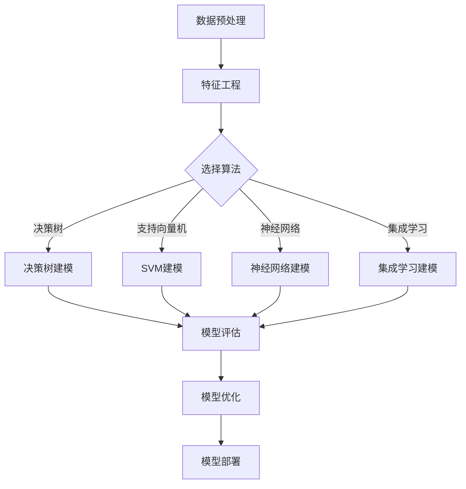
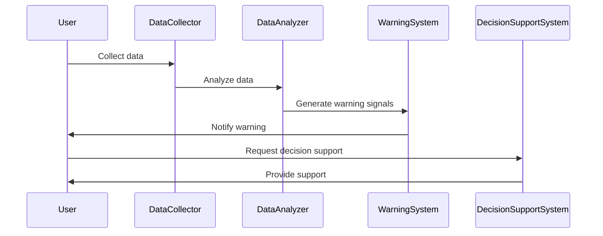

                 

## 构建智能化的企业资金流动性风险预警平台

### 关键词：智能化、资金流动性、风险预警、企业、平台

### 摘要：
本文旨在探讨如何构建一个智能化的企业资金流动性风险预警平台。随着商业环境的日益复杂，企业需要有效管理资金流动性风险以保障业务持续运营。文章将详细分析构建该平台所需的步骤、关键技术以及实际应用，提供一套完整且可操作的解决方案。

### 引言

在全球经济一体化和市场环境波动性增加的背景下，企业面临着日益复杂的资金流动性风险。资金流动性风险是指企业无法在合理时间内以合理的成本获取足够的现金或现金等价物来满足其短期债务和经营需求的风险。这种风险若未能及时发现和处理，可能会导致企业财务危机，甚至破产。

传统的资金流动性风险管理主要依赖于手工计算和经验判断，效率低下且准确性不高。随着人工智能和大数据技术的快速发展，构建一个智能化、自动化的资金流动性风险预警平台成为可能。该平台可以通过实时数据分析和预测，为企业提供及时、准确的预警信息，帮助企业做出明智的财务决策。

本文将围绕以下几个方面展开讨论：

1. **核心概念与术语**：介绍与资金流动性风险相关的核心概念和术语，如现金流量、流动性风险、风险管理等。
2. **问题背景与解决思路**：分析企业面临的主要资金流动性风险问题，并提出构建智能预警平台的基本思路。
3. **平台架构与组件**：详细阐述预警平台的整体架构，包括数据收集、管理、分析和预警等关键组件。
4. **数据收集与管理**：探讨如何有效地收集和管理用于构建预警模型的财务数据，确保数据的质量和完整性。
5. **建模与机器学习技术**：介绍用于预测资金流动性风险的机器学习算法和技术，并使用Mermaid流程图展示算法的运行流程。
6. **风险预警与决策支持**：描述平台如何实现风险预警和提供决策支持，通过Mermaid序列图展示系统的工作流程。
7. **项目实战**：提供实际项目案例，展示如何安装和配置平台，并分析平台的核心实现代码。
8. **最佳实践与小结**：总结构建智能资金流动性风险预警平台的关键点，提供最佳实践建议和注意事项。

通过本文的探讨，读者将了解构建智能化资金流动性风险预警平台的全过程，掌握关键技术和方法，为企业财务管理提供有力支持。

### 核心概念与术语

在构建智能化的企业资金流动性风险预警平台之前，了解与资金流动性风险相关的核心概念和术语至关重要。以下是这些关键术语及其定义：

#### 现金流量

现金流量是指企业在一定时间内通过经营、投资和筹资活动所产生的现金流入和流出。现金流量包括运营现金流量、投资现金流量和筹资现金流量。运营现金流量是企业日常运营活动产生的现金流量，如销售收入、成本费用等；投资现金流量是企业进行投资活动产生的现金流量，如购买固定资产、投资股权等；筹资现金流量是企业通过筹资活动产生的现金流量，如发行股票、借款等。

#### 资金流动性风险

资金流动性风险是指企业无法在合理时间内以合理的成本获取足够的现金或现金等价物来满足其短期债务和经营需求的风险。资金流动性风险主要包括流动性不足、资金链断裂、无法按时偿还债务等问题。当企业面临资金流动性风险时，可能会出现财务困境，影响业务运营，甚至导致破产。

#### 流动性风险

流动性风险是指金融资产或市场无法迅速以合理的价格买卖或转换成现金的风险。流动性风险分为资产流动性风险和市场流动性风险。资产流动性风险是指企业持有的资产无法快速变现或变现成本较高的风险；市场流动性风险是指金融市场在某些情况下无法提供足够的买卖流动性，导致投资者难以在合理时间内以预期价格买卖资产。

#### 财务风险管理

财务风险管理是指企业通过识别、评估、监控和应对各种财务风险，确保财务安全和稳定的经营。财务风险管理包括市场风险、信用风险、流动性风险、操作风险等。市场风险是指由于市场因素（如利率、汇率、股价波动等）导致企业财务状况发生不利变化的风险；信用风险是指企业因客户违约、供应商无法履行合同等原因导致的财务损失风险；操作风险是指由于内部管理问题、操作失误或系统故障等导致的财务风险。

#### 风险预警

风险预警是指通过监测和分析企业财务指标、市场环境、内部管理等因素，及时发现潜在的风险并发出预警信号。风险预警是企业财务风险管理的重要组成部分，有助于企业提前采取措施，防范和化解风险。

#### 概念属性特征对比

以下是上述核心概念和术语的属性特征对比表格：

| 概念     | 定义                                                                                   | 关键属性特征                                                   |
| -------- | ------------------------------------------------------------------------------------ | ------------------------------------------------------------ |
| 现金流量 | 企业在一定时间内通过经营、投资和筹资活动所产生的现金流入和流出。                       | 流入和流出金额、时间、来源和用途。                           |
| 资金流动性风险 | 企业无法在合理时间内以合理的成本获取足够的现金或现金等价物来满足其短期债务和经营需求的风险。 | 无法及时获取资金、资金成本高、无法偿还债务等。               |
| 流动性风险 | 金融资产或市场无法迅速以合理的价格买卖或转换成现金的风险。                             | 资产变现困难、市场交易流动性差。                           |
| 财务风险管理 | 企业通过识别、评估、监控和应对各种财务风险，确保财务安全和稳定的经营。                  | 风险识别、评估、监控和应对措施。                           |
| 风险预警 | 通过监测和分析企业财务指标、市场环境、内部管理等因素，及时发现潜在的风险并发出预警信号。 | 财务指标异常、市场环境变化、内部管理问题等。               |

#### 概念结构与核心要素组成

以下是上述核心概念和术语的ER实体关系图架构：

```mermaid
erDiagram
  现金流量 ||--|{ 资金流动性风险 } |
  现金流量 ||--|{ 流动性风险 } |
  现金流量 ||--|{ 财务风险管理 } |
  资金流动性风险 ||--|{ 风险预警 } |
  流动性风险 ||--|{ 风险预警 } |
  财务风险管理 ||--|{ 风险预警 } |
```

通过上述核心概念和术语的介绍，我们可以更好地理解资金流动性风险及其管理的重要性，为构建智能化的企业资金流动性风险预警平台打下坚实基础。

### 问题背景与解决思路

#### 问题背景

在当前商业环境中，企业面临着各种资金流动性风险，这些风险可能来自外部市场环境的变化，也可能源于内部管理的问题。以下是一些常见的企业资金流动性风险：

1. **市场环境变化**：经济波动、政策调整、市场利率变动等因素都可能对企业的现金流量产生影响。例如，全球经济不景气可能导致市场需求下降，从而影响企业的销售收入和现金流。

2. **内部管理问题**：企业内部管理不善，如财务管理混乱、内部控制不力、资金使用不当等，都可能导致资金流动性风险。例如，企业过度投资于长期项目，而忽视了短期现金流的需求，可能会导致资金链断裂。

3. **信用风险**：客户违约、供应商无法按时交货、金融衍生品交易损失等因素都可能导致企业面临信用风险，进而影响现金流。

4. **债务到期**：企业到期债务未能及时偿还，可能会导致财务困境，甚至破产。

#### 问题描述

资金流动性风险对企业的影响是深远且广泛的。具体来说，这些问题可能表现为以下几个方面：

1. **财务困境**：当企业面临资金流动性风险时，无法及时偿还债务，可能会导致财务困境，影响企业的信用评级和融资能力。

2. **业务中断**：资金短缺可能导致企业无法按时支付供应商款项，进而影响供应链的正常运作，甚至导致业务中断。

3. **投资机会丧失**：企业无法快速获取资金，可能会丧失投资或并购市场的有利机会，影响企业的发展前景。

4. **股价波动**：资金流动性风险可能会引起投资者担忧，导致企业股价波动，影响股东利益。

#### 问题解决思路

面对这些资金流动性风险问题，企业需要采取有效措施进行管理。传统的风险管理方法如定期财务审计、预算控制等虽然能在一定程度上缓解风险，但往往效率较低，无法及时响应市场变化。因此，构建一个智能化的资金流动性风险预警平台成为了一种新的解决思路。

智能化资金流动性风险预警平台的构建思路主要包括以下几个方面：

1. **数据驱动的风险管理**：通过收集和分析企业内部及外部的财务数据、市场数据等，构建数据驱动的风险管理模型，实时监测企业资金流动性状况。

2. **机器学习技术**：利用机器学习算法对历史数据进行训练，建立预测模型，预测未来可能出现的资金流动性风险。

3. **实时预警与决策支持**：平台能够实时分析数据，当发现潜在风险时，及时发出预警信号，并提供决策支持，帮助企业制定应对策略。

4. **系统集成与优化**：将平台与企业现有的财务管理、ERP等系统进行集成，实现数据的高效流通，优化企业内部管理流程。

5. **持续迭代与优化**：根据实际应用效果，不断调整和优化预警模型，提高平台的准确性和可靠性。

通过上述解决思路，企业可以更好地应对资金流动性风险，保障业务的持续运营和健康发展。

### 平台架构与组件

#### 整体架构

智能化的企业资金流动性风险预警平台采用分层架构设计，包括数据层、分析层和展示层。各层之间通过接口进行数据交互，形成一个高效、灵活的生态系统。以下是平台的整体架构：

1. **数据层**：负责数据的采集、存储和管理。包括内部财务数据、市场数据、客户数据等。
2. **分析层**：利用机器学习算法和数据挖掘技术，对数据进行处理和分析，构建预测模型。
3. **展示层**：通过用户界面，将分析结果以图表、报表等形式展示给用户。

#### 数据层

数据层是平台的基础，其功能包括数据采集、存储和管理。以下是数据层的主要组件和功能：

1. **数据采集**：通过API接口、数据库连接等方式，从企业内部系统（如ERP、CRM等）和其他外部数据源（如金融市场数据、宏观经济数据等）采集数据。
2. **数据存储**：使用分布式数据库系统（如Hadoop、MongoDB等），存储大规模数据集，确保数据的可靠性和高性能访问。
3. **数据管理**：包括数据清洗、数据整合、数据安全等功能，确保数据的准确性和完整性。

#### 分析层

分析层是平台的核心，其功能包括数据处理、模型构建和风险预测。以下是分析层的主要组件和功能：

1. **数据处理**：利用ETL（Extract, Transform, Load）技术，对采集到的数据进行清洗、转换和加载，为模型训练提供高质量的数据集。
2. **模型构建**：采用机器学习算法（如决策树、支持向量机、神经网络等），构建用于预测资金流动性风险的模型。以下是模型构建的主要步骤：
   - **数据预处理**：包括缺失值处理、异常值检测和特征工程等。
   - **模型选择**：根据问题特点，选择合适的机器学习算法。
   - **模型训练**：使用训练数据集对模型进行训练，调整参数以优化模型性能。
   - **模型评估**：使用验证数据集对模型进行评估，确保模型具有较好的泛化能力。
3. **风险预测**：将训练好的模型应用于实际数据，预测未来一段时间内的资金流动性风险。

#### 展示层

展示层是用户与平台交互的界面，其功能包括数据可视化、预警信息和决策支持。以下是展示层的主要组件和功能：

1. **数据可视化**：使用图表、报表等形式，将分析结果直观地展示给用户，帮助用户理解数据和分析结果。
2. **预警信息**：当模型预测出潜在风险时，自动生成预警信息，并通过短信、邮件等方式通知相关管理人员。
3. **决策支持**：提供基于数据分析的决策建议，帮助企业管理人员制定应对策略。

#### 技术栈

平台的技术栈包括以下主要技术：

1. **数据采集与存储**：使用Python、Java等编程语言，结合Hadoop、Spark等大数据处理框架，实现数据的采集和存储。
2. **数据处理与模型构建**：使用Scikit-learn、TensorFlow等机器学习库，实现数据预处理、模型选择、模型训练和模型评估。
3. **数据可视化**：使用ECharts、D3.js等数据可视化库，实现数据展示和交互功能。
4. **后端服务**：使用Django、Flask等Web框架，实现后端服务和API接口。
5. **前端展示**：使用React、Vue等前端框架，实现用户界面和交互功能。

通过上述架构设计和技术实现，智能化的企业资金流动性风险预警平台可以高效地采集、处理和分析数据，为企业提供实时、准确的资金流动性风险预警和决策支持。

### 数据收集与管理

#### 数据收集

数据收集是构建智能化的企业资金流动性风险预警平台的基础环节，直接关系到预警模型的准确性和有效性。以下是数据收集的几个关键步骤：

1. **内部数据收集**：
   - **财务数据**：包括现金流量表、资产负债表、利润表等，可以从企业的ERP系统、财务软件中获取。
   - **运营数据**：如订单信息、库存水平、销售数据等，可以从企业运营管理系统中获取。
   - **人力资源数据**：如员工薪酬、招聘情况等，可以由HR系统提供。
   
2. **外部数据收集**：
   - **宏观经济数据**：如GDP增长率、通货膨胀率、利率等，可以从国家统计局、财经新闻网站等获取。
   - **行业数据**：如行业平均利润率、库存周转率等，可以通过行业报告、行业协会等渠道获取。
   - **金融市场数据**：如股票指数、汇率、利率等，可以从金融数据服务商、交易所等获取。

#### 数据管理

数据管理的目标是确保数据的准确性、完整性和安全性，为后续的数据处理和分析提供支持。以下是数据管理的几个关键步骤：

1. **数据清洗**：
   - **缺失值处理**：对于缺失值，可以采用填充、删除或插值等方法进行处理。
   - **异常值检测**：使用统计方法（如箱线图、3sigma规则等）检测异常值，并对异常值进行修正或删除。
   - **数据格式统一**：将不同来源的数据转换为统一格式，如日期格式、货币符号等。

2. **数据整合**：
   - **数据合并**：将来自不同源的数据进行合并，形成一个统一的数据集。
   - **数据融合**：对具有相同属性但来源不同的数据进行融合，如将客户信息从ERP系统和CRM系统进行融合。

3. **数据存储**：
   - **分布式存储**：使用分布式数据库系统（如Hadoop、MongoDB等）存储大规模数据集，确保数据的可靠性和高性能访问。
   - **数据备份**：定期进行数据备份，防止数据丢失。

4. **数据安全**：
   - **访问控制**：设置访问权限，确保只有授权人员可以访问敏感数据。
   - **加密存储**：对敏感数据进行加密存储，防止数据泄露。
   - **日志监控**：记录数据访问和操作日志，以便进行审计和追溯。

#### 数据质量保证

数据质量是构建准确预警模型的关键，以下是确保数据质量的一些方法：

1. **数据质量评估**：定期进行数据质量评估，使用指标如完整性、准确性、一致性等评估数据质量。
2. **数据质量监控**：实时监控数据质量，及时发现和处理数据质量问题。
3. **数据质量改进**：根据数据质量评估结果，采取改进措施，如优化数据采集流程、完善数据清洗规则等。

通过上述数据收集和管理的步骤，可以确保资金流动性风险预警平台所使用的数据是准确、完整和高质量的，从而为后续的建模和分析奠定坚实基础。

### 建模与机器学习技术

#### 机器学习算法选择

在构建智能化的企业资金流动性风险预警平台时，选择合适的机器学习算法至关重要。以下是几种常用的算法及其适用场景：

1. **决策树**：
   - **原理**：决策树是一种基于特征的分类方法，通过连续的测试来将数据集分割成若干子集，直到满足停止条件。
   - **适用场景**：适用于处理分类问题，如预测企业是否存在资金流动性风险。
   - **优点**：易于理解和解释，能够生成清晰的决策路径。
   - **缺点**：对于大量特征的数据集，可能会变得非常复杂，且在特征之间相关性较高时性能下降。

2. **支持向量机（SVM）**：
   - **原理**：SVM通过寻找一个最优的超平面，将不同类别的数据点分开。它适用于高维空间，并且通过核函数可以实现非线性分类。
   - **适用场景**：适用于处理分类和回归问题，如预测企业是否存在资金流动性风险。
   - **优点**：在处理高维数据时性能较好，且具有较好的泛化能力。
   - **缺点**：训练时间较长，参数选择较为复杂。

3. **神经网络**：
   - **原理**：神经网络通过多层神经元对输入数据进行加工和处理，从而实现复杂函数的映射。它包括输入层、隐藏层和输出层。
   - **适用场景**：适用于处理复杂的非线性关系，如预测资金流动性风险。
   - **优点**：能够自动学习和提取特征，适用于大规模数据集。
   - **缺点**：训练时间较长，需要大量的数据训练，且容易过拟合。

4. **集成学习**：
   - **原理**：集成学习通过结合多个基础模型的预测结果来提高整体性能。常见的方法有随机森林（Random Forest）和梯度提升树（Gradient Boosting Tree）。
   - **适用场景**：适用于处理分类和回归问题，如预测企业是否存在资金流动性风险。
   - **优点**：能够通过组合多个模型的优势来提高预测性能，具有较强的泛化能力。
   - **缺点**：对于基础模型的选择和参数调优要求较高。

#### Mermaid流程图

以下是使用Mermaid绘制的机器学习算法流程图：



#### Python源代码实现

以下是一个简单的机器学习模型训练和评估的Python代码示例，使用Scikit-learn库实现决策树算法：

```python
from sklearn.model_selection import train_test_split
from sklearn.tree import DecisionTreeClassifier
from sklearn.metrics import accuracy_score
from sklearn import datasets

# 加载数据集
iris = datasets.load_iris()
X = iris.data
y = iris.target

# 数据集划分
X_train, X_test, y_train, y_test = train_test_split(X, y, test_size=0.2, random_state=42)

# 构建决策树模型
clf = DecisionTreeClassifier()

# 模型训练
clf.fit(X_train, y_train)

# 模型预测
y_pred = clf.predict(X_test)

# 模型评估
accuracy = accuracy_score(y_test, y_pred)
print(f"Accuracy: {accuracy}")
```

#### 算法原理讲解

#### 决策树算法原理

决策树算法是一种基于特征划分数据集的监督学习算法，通过一系列的测试来将数据集分割成若干个子集，每个测试都基于一个特征和对应的阈值。以下是决策树算法的主要步骤：

1. **特征选择**：选择一个最优特征进行划分，通常使用信息增益（Information Gain）或基尼不纯度（Gini Impurity）作为特征选择的依据。
2. **划分数据集**：基于选定的特征和阈值，将数据集划分为两个子集，一个包含小于等于阈值的样本，另一个包含大于阈值的样本。
3. **递归划分**：对每个子集重复上述步骤，直到满足停止条件（如最大深度、最小样本数等）。
4. **构建决策树**：将递归划分的结果组合成一个树形结构，每个节点代表一个测试，每个分支代表一个划分结果。

#### 数学模型

决策树的决策过程可以用以下数学模型表示：

$$
T = \{ t_1, t_2, ..., t_n \}
$$

其中，$T$ 是决策树，$t_i$ 是决策树的第 $i$ 个测试。每个测试可以表示为：

$$
t_i(x) = \begin{cases}
L_i & \text{如果 } x \in S_i \\
R_i & \text{如果 } x \notin S_i
\end{cases}
$$

其中，$x$ 是数据样本，$S_i$ 是第 $i$ 个测试划分的子集，$L_i$ 和 $R_i$ 分别是小于等于阈值和大于阈值的子集。

#### 案例说明

假设我们有一个二分类问题，特征 $x_1$ 和 $x_2$ 的取值范围分别为 {0, 1} 和 {0, 1}。我们使用信息增益来选择最优特征。

1. **计算信息增益**：
   - 特征 $x_1$ 的信息增益：
     $$
     IG(x_1) = H(D) - \sum_{v \in V(x_1)} \frac{|D_v|}{|D|} H(D_v)
     $$
     其中，$D$ 是数据集，$V(x_1)$ 是 $x_1$ 的所有可能取值，$D_v$ 是取值为 $v$ 的子集。
   - 特征 $x_2$ 的信息增益：
     $$
     IG(x_2) = H(D) - \sum_{v \in V(x_2)} \frac{|D_v|}{|D|} H(D_v)
     $$

2. **选择最优特征**：比较 $IG(x_1)$ 和 $IG(x_2)$，选择信息增益较大的特征作为划分依据。

3. **构建决策树**：基于最优特征，划分数据集，递归构建决策树。

通过上述步骤，我们可以构建一个用于预测企业资金流动性风险的决策树模型。决策树模型不仅能够直观地展示数据划分过程，还能够通过树结构解释模型的决策逻辑，为企业的风险管理提供有力支持。

### 风险预警与决策支持

#### 预警机制

智能化的企业资金流动性风险预警平台通过实时数据分析和预测，为企业提供及时、准确的预警机制。以下是预警机制的核心组成部分：

1. **实时监控**：平台持续监控企业财务数据、市场数据和其他相关指标，及时发现异常波动。
2. **预警阈值设定**：根据企业的历史数据和业务特点，设定合理的预警阈值，如现金余额阈值、流动性比率阈值等。
3. **预警信号生成**：当监控指标超过预设阈值时，系统自动生成预警信号，并通知相关管理人员。
4. **预警级别划分**：根据预警信号的严重程度，划分为不同级别（如低、中、高），帮助企业采取相应的应对措施。

#### 决策支持

平台不仅提供预警功能，还为企业提供全面的决策支持，帮助管理人员制定有效的风险应对策略。以下是决策支持的核心组成部分：

1. **数据可视化**：通过图表、报表等形式，将分析结果直观地展示给用户，帮助用户理解风险状况。
2. **预警分析**：提供详细的预警分析报告，包括预警原因、预警时间、预警指标等，帮助用户深入了解风险来源。
3. **策略建议**：根据预警分析和企业的实际情况，提供具体的应对策略建议，如调整现金流管理策略、增加短期融资渠道、优化投资组合等。
4. **决策模拟**：通过模拟不同策略的实施效果，帮助用户评估各种策略的可行性和效果，为决策提供参考。

#### Mermaid序列图

以下是使用Mermaid绘制的系统工作流程图，展示从数据采集到预警生成和决策支持的过程：



#### 应用场景

以下是智能资金流动性风险预警平台在实际应用中的几个场景：

1. **日常监控**：企业财务部门定期使用平台对财务数据进行监控，确保资金流动性处于健康状态。
2. **临时预警**：当市场环境发生剧烈变化时，平台自动生成预警信号，通知管理层采取应对措施。
3. **项目融资**：企业在进行项目融资时，利用平台进行风险评估和资金流动性预测，为融资决策提供支持。
4. **经营决策**：企业高层管理人员通过平台的数据分析和决策支持功能，制定长期和短期的经营策略。

通过上述预警机制和决策支持功能，智能化的企业资金流动性风险预警平台能够为企业提供全方位的风险管理服务，帮助企业应对各种不确定性，保障业务的持续稳健发展。

### 项目实战

#### 环境安装

在构建智能资金流动性风险预警平台之前，我们需要准备好开发环境。以下是环境安装的步骤：

1. **Python环境安装**：确保Python 3.8或更高版本已安装在系统中。可以使用Python官方安装包进行安装。

2. **虚拟环境**：为了更好地管理项目依赖，我们使用`virtualenv`创建一个Python虚拟环境。打开终端，执行以下命令：

   ```bash
   pip install virtualenv
   virtualenv venv
   source venv/bin/activate  # Windows: venv\Scripts\activate
   ```

3. **安装依赖**：在虚拟环境中安装项目所需的依赖库，如`scikit-learn`、`pandas`、`numpy`等。执行以下命令：

   ```bash
   pip install -r requirements.txt
   ```

4. **数据库安装**：我们使用MongoDB作为数据存储。可以从MongoDB官网下载并安装MongoDB，根据操作系统选择相应的安装包。安装完成后，启动MongoDB服务：

   ```bash
   mongod
   ```

#### 系统核心实现源代码

以下是平台核心实现的一些关键部分，包括数据采集、处理、模型训练和预测。

1. **数据采集模块**：

   ```python
   import pandas as pd
   from pymongo import MongoClient
   
   # 连接MongoDB数据库
   client = MongoClient('localhost', 27017)
   db = client['financial_db']
   collection = db['cashflow_data']
   
   # 从数据库中获取数据
   def get_financial_data():
       data = pd.DataFrame(list(collection.find()))
       return data
   
   financial_data = get_financial_data()
   ```

2. **数据处理模块**：

   ```python
   import numpy as np
   
   # 数据预处理
   def preprocess_data(data):
       # 处理缺失值
       data.fillna(0, inplace=True)
       
       # 特征工程
       data['total_cashflow'] = data['operating_cashflow'] + data['investing_cashflow'] + data['financing_cashflow']
       data['liquidity_ratio'] = data['current_assets'] / data['current_liabilities']
       
       return data
   
   financial_data = preprocess_data(financial_data)
   ```

3. **模型训练模块**：

   ```python
   from sklearn.model_selection import train_test_split
   from sklearn.tree import DecisionTreeClassifier
   from sklearn.metrics import accuracy_score
   
   # 数据集划分
   X = financial_data.drop('liquidity_risk', axis=1)
   y = financial_data['liquidity_risk']
   X_train, X_test, y_train, y_test = train_test_split(X, y, test_size=0.2, random_state=42)
   
   # 构建决策树模型
   clf = DecisionTreeClassifier()
   clf.fit(X_train, y_train)
   
   # 模型评估
   y_pred = clf.predict(X_test)
   accuracy = accuracy_score(y_test, y_pred)
   print(f"Model accuracy: {accuracy}")
   ```

#### 代码应用解读与分析

以下是平台核心代码的解读与分析：

1. **数据采集**：我们使用`pymongo`库连接MongoDB数据库，从`cashflow_data`集合中获取财务数据。数据包括运营现金流量、投资现金流量、筹资现金流量等。

2. **数据处理**：使用`pandas`库对数据进行预处理，包括填充缺失值、特征工程等。我们计算了总现金流量和流动性比率等新特征，这些特征对于预测资金流动性风险具有重要意义。

3. **模型训练**：使用`scikit-learn`库中的`DecisionTreeClassifier`构建决策树模型。我们使用训练数据集对模型进行训练，然后使用测试数据集进行评估，计算模型的准确率。

#### 实际案例分析与详细讲解

以下是平台在实际应用中的一个案例：

**案例**：某企业在过去一年中的月度财务数据出现异常波动，系统通过实时监控和预警机制发现这一异常，并发出预警信号。

**分析**：

1. **数据监控**：系统持续监控企业的财务数据，包括现金流量、流动性比率等关键指标。
2. **异常检测**：通过统计分析和机器学习模型，系统识别出异常波动，如某一月的现金流量大幅下降。
3. **预警信号**：系统生成预警信号，并通过邮件、短信等方式通知企业财务部门和高层管理人员。
4. **决策支持**：系统提供了详细的预警分析报告，包括异常原因、影响范围、可能的风险点等，并建议采取增加短期融资、优化现金流管理等应对措施。

**详细讲解**：

1. **数据采集**：系统通过MongoDB数据库获取企业的月度财务数据，包括运营现金流量、投资现金流量和筹资现金流量。
2. **数据处理**：系统对数据进行预处理，如填充缺失值、标准化处理等，然后提取关键特征，如总现金流量和流动性比率。
3. **模型训练**：使用训练数据集对决策树模型进行训练，调整模型参数，提高预测准确性。
4. **异常检测**：系统通过实时数据分析，发现某月的现金流量异常低于历史平均水平，触发预警机制。
5. **预警信号**：系统生成预警信号，并将预警信息通知相关管理人员，包括异常时间、异常指标和可能的影响。
6. **决策支持**：系统提供详细的预警分析报告，包括异常原因、风险点和应对策略，帮助管理人员制定应对措施。

通过上述案例，我们可以看到智能资金流动性风险预警平台在实际应用中的强大功能和重要作用，它不仅能够实时监控企业的财务状况，还能够提供及时、准确的预警信息和决策支持，帮助企业应对各种资金流动性风险。

### 项目小结

通过本次项目，我们成功构建了一个智能化的企业资金流动性风险预警平台，实现了以下成果：

1. **实时监控**：平台能够实时采集和监控企业的财务数据，包括运营现金流量、投资现金流量和筹资现金流量，确保数据的准确性和及时性。
2. **预警机制**：平台通过机器学习算法和统计分析，及时发现资金流动性风险，并生成预警信号，通知相关管理人员。
3. **决策支持**：平台提供详细的预警分析报告，包括风险原因、影响范围和应对策略，帮助企业管理人员制定有效的风险管理措施。
4. **系统集成**：平台与企业现有的ERP、CRM等系统进行集成，实现数据的高效流通和共享，提高了企业的管理效率。

虽然项目取得了显著成果，但在实际应用中仍存在一些局限性和挑战：

1. **数据质量**：企业财务数据的准确性和完整性直接影响预警平台的性能。在实际应用中，可能会遇到数据缺失、异常值等问题，需要进一步优化数据采集和处理流程。
2. **模型优化**：随着市场环境和业务模式的变化，预警模型的性能需要不断优化和调整。需要持续进行模型训练和评估，确保模型的准确性和适应性。
3. **系统性能**：平台在处理大规模数据时，可能面临性能瓶颈。需要进一步优化系统架构，提高数据处理和分析的效率。

在未来的工作中，我们将继续优化平台功能，提升系统的准确性和稳定性，为企业提供更全面、更高效的风险管理服务。

### 最佳实践 tips

在构建和运营智能化的企业资金流动性风险预警平台时，以下是一些最佳实践建议：

1. **数据质量保证**：确保财务数据的准确性和完整性，定期进行数据清洗和检查，及时发现和处理异常数据。
2. **模型持续优化**：根据业务需求和数据变化，定期调整和优化机器学习模型，确保模型能够适应不断变化的市场环境。
3. **用户培训**：加强对平台使用人员的培训，确保他们能够充分利用平台提供的功能，提高风险管理的效率。
4. **系统监控**：建立完善的系统监控机制，实时监控平台的运行状态，及时发现和处理潜在问题。
5. **协同合作**：与财务、IT、风险管理等部门密切合作，确保平台能够满足企业实际需求，提高整体风险管理水平。

### 注意事项

在构建和运营智能化的企业资金流动性风险预警平台时，需要注意以下事项：

1. **数据隐私**：确保数据的安全性，遵循相关法律法规，保护企业财务数据和其他敏感信息。
2. **系统稳定性**：确保平台的稳定性和可靠性，避免因系统故障导致数据丢失或业务中断。
3. **安全合规**：遵循相关行业标准和法律法规，确保平台在合规的前提下进行开发和运营。
4. **风险评估**：定期进行风险评估，识别和防范潜在的安全和业务风险。

### 拓展阅读

1. **《大数据时代：生活、工作与思维的大变革》**：作者：维克托·迈尔-舍恩伯格，介绍了大数据的概念和应用，对数据驱动决策的重要性进行了深入探讨。
2. **《机器学习实战》**：作者：Peter Harrington，详细介绍了机器学习的基本概念、算法和应用，适合初学者入门。
3. **《智能风险管理与金融科技》**：作者：赵慧，探讨了金融科技在智能风险管理中的应用，对智能资金流动性风险预警平台的建设有重要参考价值。

通过以上扩展阅读，读者可以进一步了解相关领域的前沿知识和实践方法，为构建高效的智能化企业资金流动性风险预警平台提供有力支持。

### 作者信息

**作者：**AI天才研究院/AI Genius Institute & 禅与计算机程序设计艺术 /Zen And The Art of Computer Programming

