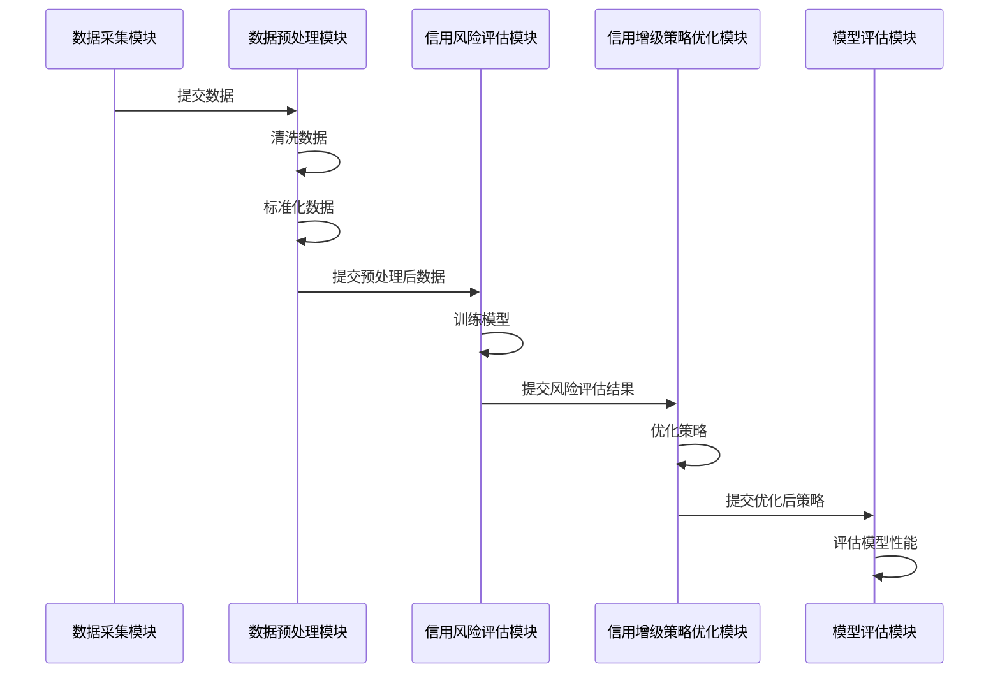

                 

# 构建智能化的资产证券化信用增级动态优化模型

> 关键词：资产证券化、信用增级、动态优化、智能化建模、金融风险管理

> 摘要：本文旨在探讨如何构建智能化的资产证券化信用增级动态优化模型。通过对资产证券化及信用增级的基本概念、作用与挑战进行分析，引入动态优化模型的基本原理和智能化建模方法，本文详细阐述了资产证券化信用增级的动态优化模型构建过程，包括核心概念的理解、模型构建方法、模型验证与优化等方面。此外，本文还结合实际项目，展示了构建智能化的资产证券化信用增级动态优化模型的具体实现方法和应用效果。最后，本文对未来的研究方向和实践建议进行了总结。

## 第一部分：背景介绍

### 1.1 问题背景

#### 1.1.1 资产证券化概述

资产证券化是指将不具备流动性但能够产生稳定现金流的资产，通过结构性重组，转变为可以在金融市场上进行交易的证券的过程。这一概念最早起源于20世纪70年代的美国，当时的主要目的是解决银行系统的不良贷款问题。随着金融市场的不断发展和创新，资产证券化逐渐成为一种重要的金融工具，广泛应用于各种类型的资产，如房贷、车贷、信用卡贷款、应收账款等。

资产证券化的发展历程可以分为几个阶段：

1. **初级阶段**（1970-1980年代）：以住房抵押贷款证券化（MBS）为代表，通过将大量的住房抵押贷款打包成证券，提高流动性，降低风险。
2. **发展阶段**（1980-1990年代）：其他类型的资产证券化逐渐涌现，如商业抵押贷款证券化（CMBS）、信用卡贷款证券化（ABS）等。
3. **创新阶段**（2000年代）：随着金融技术的发展，资产证券化的创新形式不断涌现，如合成CDO（合成抵押债务凭证）、CDO-Squared等。

截至2023年，全球资产证券化市场规模已超过10万亿美元，资产证券化在全球金融体系中发挥着重要作用。

#### 1.1.2 信用增级的作用与需求

信用增级是指在资产证券化过程中，通过结构化设计或其他方式，提高资产支持证券（ABS）的信用评级，降低投资者面临的信用风险。信用增级的方式主要包括超额抵押、储备基金、信用衍生品等。

信用增级在资产证券化中起着至关重要的作用：

1. **提高证券的信用评级**：通过信用增级，可以将基础资产的信用风险转移到信用增级工具上，从而提高ABS的信用评级，降低投资者的风险。
2. **扩大投资者基础**：高信用评级的ABS更容易吸引广泛的投资者，包括保险公司、退休基金、银行等机构投资者。
3. **优化资本结构**：信用增级有助于降低发行人的融资成本，优化资本结构。

然而，当前信用增级方式也面临着一些挑战：

1. **成本问题**：信用增级通常需要支付额外的费用，这会降低投资者的收益。
2. **信用风险的转移**：虽然信用增级降低了ABS的直接信用风险，但并不能完全消除风险，因为信用增级工具本身也存在信用风险。
3. **监管压力**：随着金融监管的加强，信用增级工具的合规性和透明度要求不断提高，增加了发行人和信用增级机构的运营成本。

#### 1.1.3 动态优化模型的必要性

传统信用增级模型主要基于静态的数据分析和经验判断，难以适应动态变化的金融环境。在金融市场波动较大、基础资产质量不稳定的情况下，传统模型的表现往往不尽如人意。为了应对这些挑战，构建智能化的资产证券化信用增级动态优化模型显得尤为必要。

1. **传统模型局限性**：
   - 静态分析：传统模型主要基于历史数据和经验，难以应对动态变化的金融市场。
   - 预测能力弱：传统模型在预测未来市场走势和信用风险方面能力有限。
   - 鲁棒性不足：传统模型在面对极端市场状况时，往往表现不佳。

2. **动态环境适应性需求**：
   - 环境复杂性：金融市场环境日益复杂，需要更智能的模型来适应不断变化的市场条件。
   - 实时性需求：金融市场的快速变化要求模型具备实时分析和调整能力。

3. **智能化信用增级优化潜力**：
   - 机器学习技术：利用机器学习算法，可以从大量历史数据中提取有价值的信息，进行动态预测和优化。
   - 数据驱动：智能化的信用增级模型可以基于实时数据，进行动态调整，提高预测准确性和稳定性。
   - 精细化管理：智能化的信用增级模型可以更精确地评估不同风险因素，提供更合理的信用增级方案。

### 1.2 核心概念与联系

#### 1.2.1 资产证券化基本概念

1. **债务证券化**：债务证券化是指将未到期的债务转化为可以在金融市场上交易的证券。常见的债务证券化产品包括抵押贷款支持证券（MBS）和资产支持证券（ABS）。

2. **贷款证券化**：贷款证券化是指将银行的贷款资产打包成证券，出售给投资者，从而实现贷款资产的流动性转换。

3. **基础资产池**：基础资产池是指用于支持资产支持证券的一组资产，如住房抵押贷款、信用卡贷款等。

#### 1.2.2 信用增级核心概念

1. **信用增级定义**：信用增级是指通过结构性安排或财务工具，提高资产支持证券的信用评级，降低投资者面临的风险。

2. **信用增级方式**：
   - 超额抵押：通过增加基础资产的价值，超出发行证券的价值，从而提高信用评级。
   - 储备基金：设立一个资金储备账户，用于在资产池表现不佳时提供资金支持。
   - 信用衍生品：通过购买信用保护合约，将信用风险转移给第三方。

3. **信用增级工具**：
   - 信用利差：提高资产支持证券的利率，从而提高信用评级。
   - 优先/次级结构：通过设计优先/次级结构，确保优先级证券的风险较低。
   - 信用保险：购买信用保险，降低资产支持证券的信用风险。

#### 1.2.3 动态优化模型相关概念

1. **动态优化算法**：动态优化算法是指用于在动态环境中进行决策和优化的算法。常见的动态优化算法包括动态规划、马尔可夫决策过程和强化学习。

2. **智能化建模**：智能化建模是指利用机器学习和人工智能技术，对金融数据进行建模和预测。常见的智能化建模方法包括监督学习、无监督学习和强化学习。

3. **数据驱动的优化方法**：数据驱动的优化方法是指基于历史数据和实时数据，进行模型训练和预测，从而实现动态优化。

### 1.3 边界与外延

#### 1.3.1 研究范围

本文的研究范围主要涉及以下领域：

1. **资产类型**：包括住房抵押贷款、商业抵押贷款、信用卡贷款等常见资产类型。
2. **信用增级结构**：包括超额抵押、储备基金、信用衍生品等常见的信用增级方式。
3. **动态优化模型应用领域**：包括资产证券化、金融风险管理等。

#### 1.3.2 外部影响因素

资产证券化信用增级模型的构建受到多种外部因素的影响，主要包括：

1. **经济环境**：包括宏观经济环境、行业发展趋势、利率水平等。
2. **市场需求**：包括投资者需求、市场需求变化等。
3. **政策法规**：包括监管政策、法律法规等。

#### 1.3.3 概念结构与核心要素组成

资产证券化信用增级动态优化模型的构建需要考虑多个核心要素，包括：

1. **数据收集与管理**：收集和处理与资产证券化、信用增级相关的数据，包括历史数据、实时数据等。
2. **模型构建要素**：包括状态空间、动作空间、奖励函数等。
3. **模型验证与优化**：通过验证和优化，确保模型的有效性和稳定性。

### 1.4 本章小结

本文首先介绍了资产证券化及其信用增级的基本概念、作用和挑战，然后分析了构建智能化资产证券化信用增级动态优化模型的必要性。接着，本文阐述了资产证券化、信用增级和动态优化模型的核心概念及其相互联系。最后，本文明确了研究的范围、外部影响因素和核心要素组成。

### 1.5 拓展阅读

1. **相关书籍推荐**：
   - 《资产证券化原理与实务》
   - 《信用增级技术》

2. **学术文章推荐**：
   - “Dynamic Optimization Models for Credit Enhancement in Asset-Backed Securities”
   - “Intelligent Credit Enhancement: A Machine Learning Approach”

## 第二部分：核心概念原理

### 2.1 资产证券化信用增级原理

#### 2.1.1 信用增级的定义与目的

信用增级是指通过结构性安排或其他财务工具，提高资产支持证券（ABS）的信用评级，降低投资者面临的风险。信用增级的目的是确保在基础资产表现不佳时，ABS仍能保持一定的信用评级，从而保护投资者的利益。

信用增级的定义可以从以下几个方面进行理解：

1. **增强信用评级**：信用增级的主要目标是通过各种方式提高ABS的信用评级，使其达到更高的评级标准。
2. **风险降低**：信用增级通过转移风险、提供额外的资金支持等手段，降低ABS的信用风险。
3. **保护投资者**：信用增级的目的是确保在基础资产违约或表现不佳时，投资者仍能获得预期的收益。

信用增级的目的主要包括以下几个方面：

1. **提高市场接受度**：高信用评级的ABS更容易在市场上销售，吸引更多投资者。
2. **降低融资成本**：信用增级有助于提高ABS的信用评级，降低发行人的融资成本。
3. **增强投资者信心**：信用增级有助于提高投资者对ABS的信心，降低投资风险。

#### 2.1.2 信用增级的基本机制

信用增级的基本机制主要包括以下几种方式：

1. **超额抵押**：通过增加基础资产的价值，超出发行证券的价值，从而提高信用评级。例如，在住房抵押贷款证券化中，可以通过增加抵押房产的价值，超出贷款本金，从而提高ABS的信用评级。

2. **储备基金**：设立一个资金储备账户，用于在资产池表现不佳时提供资金支持。储备基金可以来自于发行人、信用增级机构或其他第三方。例如，在信用卡贷款证券化中，可以通过设立储备基金，用于在信用卡违约率上升时提供资金支持。

3. **信用衍生品**：通过购买信用保护合约，将信用风险转移给第三方。信用衍生品包括信用违约互换（CDS）、总回报互换（TRS）等。例如，在资产支持证券中，可以通过购买CDS来转移信用风险。

#### 2.1.3 资产证券化信用增级的特点

资产证券化信用增级与传统信用增级相比，具有以下几个特点：

1. **结构性安排**：资产证券化信用增级通常涉及复杂的结构性安排，包括优先/次级结构、超额抵押、储备基金、信用衍生品等。

2. **多样化基础资产**：资产证券化可以涵盖多种类型的基础资产，如住房抵押贷款、商业抵押贷款、信用卡贷款、应收账款等，从而提高信用增级的灵活性和适应性。

3. **市场参与主体多样化**：资产证券化信用增级涉及多个市场参与主体，包括发行人、信用增级机构、投资者、评级机构等，从而提高信用增级的透明度和合规性。

4. **动态优化能力**：智能化的资产证券化信用增级动态优化模型可以基于实时数据和机器学习算法，对信用风险进行动态评估和调整，提高信用增级的精准性和有效性。

### 2.2 动态优化模型的基本原理

#### 2.2.1 动态优化算法介绍

动态优化算法是指用于在动态环境中进行决策和优化的算法。常见的动态优化算法包括动态规划、马尔可夫决策过程和强化学习。

1. **动态规划**：动态规划是一种基于递归和优化的算法，用于解决多阶段决策问题。动态规划的核心思想是将复杂问题分解为多个子问题，并利用子问题的解构建原问题的最优解。动态规划适用于离散时间和连续时间的优化问题。

2. **马尔可夫决策过程（MDP）**：马尔可夫决策过程是一种用于解决不确定环境下决策优化问题的数学模型。MDP的核心思想是将决策问题表示为一个五元组，包括状态空间、动作空间、奖励函数、状态转移概率和决策规则。通过优化决策规则，可以使MDP达到最佳决策效果。

3. **强化学习**：强化学习是一种基于试错和反馈的机器学习算法，用于解决决策优化问题。强化学习通过与环境互动，学习最佳策略，从而实现最优决策。强化学习在金融风险管理、自动驾驶、游戏等领域有广泛应用。

#### 2.2.2 动态优化模型的构建方法

动态优化模型的构建通常包括以下几个步骤：

1. **定义状态空间**：状态空间是指系统在动态过程中可能处于的所有状态。状态空间的选择取决于问题的性质和需求。例如，在资产证券化信用增级中，状态空间可以包括资产池的信用评级、违约率、市场利率等。

2. **定义动作空间**：动作空间是指决策者可以采取的所有动作。动作空间的选择取决于状态空间和问题约束。例如，在资产证券化信用增级中，动作空间可以包括调整信用增级工具的比例、修改信用增级策略等。

3. **设计奖励函数**：奖励函数用于评估决策者采取的动作对系统状态的影响。奖励函数的设计取决于问题的目标函数和约束条件。例如，在资产证券化信用增级中，奖励函数可以包括提高信用评级、降低违约率、最大化投资者收益等。

4. **状态转移概率**：状态转移概率用于描述系统在不同状态之间转移的概率。状态转移概率可以通过历史数据、统计模型或机器学习算法进行估计。

5. **决策规则**：决策规则是指决策者根据当前状态和奖励函数，选择最优动作的策略。决策规则可以通过优化算法、机器学习算法或经验规则进行设计。

#### 2.2.3 动态优化模型的应用领域

动态优化模型在金融风险管理、资源分配、供应链管理等领域有广泛应用。具体应用领域包括：

1. **金融风险管理**：动态优化模型可以用于风险管理，包括资产配置、投资组合优化、信用风险管理等。通过动态优化模型，可以实现对金融市场的实时监控和动态调整，提高风险管理效果。

2. **资源分配**：动态优化模型可以用于资源分配，包括电力调度、物流运输、网络优化等。通过动态优化模型，可以实现对资源需求的实时预测和优化配置，提高资源利用效率。

3. **供应链管理**：动态优化模型可以用于供应链管理，包括库存管理、订单调度、物流优化等。通过动态优化模型，可以实现对供应链的实时监控和动态调整，提高供应链的整体效率和稳定性。

### 2.3 智能化建模方法

#### 2.3.1 机器学习技术概述

机器学习技术是指通过计算机程序，从数据中自动学习、识别规律、发现模式，并利用这些规律进行预测和决策的技术。机器学习技术可以分为监督学习、无监督学习和强化学习。

1. **监督学习**：监督学习是一种基于标记数据进行训练的机器学习技术。通过标记数据的输入和输出，训练模型建立输入和输出之间的关系，从而实现预测和分类。常见的监督学习算法包括线性回归、决策树、支持向量机等。

2. **无监督学习**：无监督学习是一种不依赖标记数据进行训练的机器学习技术。通过分析数据的内在结构和规律，发现数据的分布和模式。常见的无监督学习算法包括聚类、降维、关联规则挖掘等。

3. **强化学习**：强化学习是一种基于试错和反馈的机器学习技术。通过与环境的交互，学习最佳策略，从而实现最优决策。常见的强化学习算法包括Q学习、SARSA、Deep Q Network等。

#### 2.3.2 数据驱动的建模方法

数据驱动的建模方法是指基于历史数据和实时数据，进行模型训练和预测的方法。数据驱动的建模方法可以分为以下几个步骤：

1. **数据收集**：收集与问题相关的数据，包括历史数据和实时数据。数据来源可以包括数据库、日志文件、传感器数据等。

2. **数据预处理**：对收集到的数据进行清洗、去噪、标准化等处理，确保数据的准确性和一致性。

3. **特征工程**：通过特征提取和选择，将原始数据转化为可用于模型训练的特征向量。特征工程包括特征提取、特征选择、特征组合等。

4. **模型选择与训练**：选择合适的机器学习算法，对数据进行训练。常见的机器学习算法包括线性回归、决策树、支持向量机、神经网络等。

5. **模型评估与优化**：通过评估模型的性能指标，如准确率、召回率、F1值等，对模型进行优化和调整。

6. **模型部署与应用**：将训练好的模型部署到实际应用场景中，进行预测和决策。

#### 2.3.3 智能化建模的优势与挑战

智能化建模在资产证券化信用增级领域具有显著的优势和挑战。

优势：

1. **提高预测准确性**：通过机器学习算法，可以从大量历史数据中提取有价值的信息，提高信用风险评估的准确性。

2. **实时调整能力**：智能化建模可以基于实时数据，对信用增级策略进行动态调整，提高模型的适应性和鲁棒性。

3. **精细化管理**：智能化建模可以更精确地评估不同风险因素，提供更合理的信用增级方案。

挑战：

1. **数据质量**：智能化建模依赖于高质量的数据，数据质量直接影响模型的预测准确性。

2. **计算资源**：机器学习算法通常需要大量的计算资源，特别是在处理大规模数据时，对计算资源的消耗较大。

3. **模型解释性**：机器学习模型通常具有较强的预测能力，但缺乏透明性和解释性，这对于金融领域尤为重要。

### 2.4 概念属性特征对比表格

#### 2.4.1 资产证券化与信用增级特征对比

| 特征         | 资产证券化           | 信用增级           |
| ------------ | -------------------- | ----------------- |
| 定义         | 将资产转化为证券      | 提高证券的信用评级 |
| 目的         | 提高资产流动性       | 降低投资者风险     |
| 基础资产     | 房贷、车贷、信用卡等  | 房贷、信用卡等     |
| 信用增级方式 | 超额抵押、储备基金    | 超额抵押、储备基金  |
| 影响因素     | 经济环境、市场需求    | 市场利率、违约率    |

#### 2.4.2 动态优化模型与机器学习模型特征对比

| 特征         | 动态优化模型           | 机器学习模型           |
| ------------ | ---------------------- | ---------------------- |
| 算法原理     | 动态决策和优化         | 数据驱动和模式识别     |
| 应用领域     | 金融风险管理、资源分配  | 图像识别、自然语言处理 |
| 核心优势     | 实时性和动态适应性      | 预测能力和自动化       |
| 核心挑战     | 复杂性和计算资源需求    | 解释性和数据依赖       |

### 2.5 ER实体关系图架构

#### 2.5.1 资产证券化ER图

```mermaid
erDiagram
  A[基础资产] ||--|{ B[资产支持证券] }
  A ||--|{ C[发行人] }
  B ||--|{ D[投资者] }
  B ||--|{ E[信用增级工具] }
```

#### 2.5.2 信用增级ER图

```mermaid
erDiagram
  A[信用增级] ||--|{ B[超额抵押] }
  A ||--|{ C[储备基金] }
  A ||--|{ D[信用衍生品] }
  B ||--|{ E[资产支持证券] }
  C ||--|{ E }
  D ||--|{ E }
```

#### 2.5.3 动态优化模型ER图

```mermaid
erDiagram
  A[动态优化模型] ||--|{ B[状态空间] }
  A ||--|{ C[动作空间] }
  A ||--|{ D[奖励函数] }
  A ||--|{ E[状态转移概率] }
  B ||--|{ F[模型参数] }
  C ||--|{ F }
  D ||--|{ F }
  E ||--|{ F }
```

### 2.6 本章小结

本文首先介绍了资产证券化及其信用增级的基本概念、作用和挑战，然后分析了构建智能化资产证券化信用增级动态优化模型的必要性。接着，本文详细阐述了动态优化模型的基本原理和智能化建模方法，包括动态优化算法的介绍、动态优化模型的构建方法、智能化建模的优势与挑战等。此外，本文通过概念属性特征对比表格和ER实体关系图架构，进一步明确了各概念之间的关系和模型构建的核心要素。

### 2.7 拓展阅读

1. **相关书籍推荐**：
   - 《动态优化与机器学习》
   - 《金融风险管理导论》

2. **学术文章推荐**：
   - “Dynamic Optimization Models for Credit Enhancement in Asset-Backed Securities”
   - “Intelligent Credit Enhancement: A Machine Learning Approach”

## 第三部分：算法原理讲解

### 3.1 动态优化算法原理

动态优化算法是一种在动态环境中进行决策和优化的算法，旨在找到最优策略以最大化目标函数。在资产证券化信用增级中，动态优化算法可以用于优化信用增级策略，提高ABS的信用评级，降低投资者的风险。

#### 3.1.1 动态规划算法

动态规划（Dynamic Programming，DP）是一种用于解决多阶段决策问题的算法。它通过将复杂问题分解为多个子问题，并利用子问题的解构建原问题的最优解。动态规划的核心思想是“最优子结构”和“边界情况”。

1. **最优子结构**：动态规划算法认为，一个复杂问题的最优解可以通过子问题的最优解组合而成。这意味着，如果已经知道所有子问题的最优解，那么原问题的最优解也可以确定。

2. **边界情况**：动态规划算法需要考虑问题的边界情况，以确保在所有可能的情况下找到最优解。边界情况通常包括初始状态和终止状态。

动态规划算法的一般步骤如下：

1. **定义状态**：确定问题的状态，即决策变量。状态通常是一个多维数组或向量。

2. **定义动作**：确定每个状态下的可能动作。动作通常是一个集合或数组。

3. **定义价值函数**：定义价值函数，用于评估每个状态下的最优价值。价值函数可以是状态值、动作值或组合值。

4. **初始化边界条件**：根据边界情况，初始化价值函数的初始值。

5. **递推计算**：利用状态转移方程，从初始状态递推计算到终止状态的最优价值。

6. **构建最优策略**：根据价值函数的计算结果，构建最优策略。

在资产证券化信用增级中，动态规划算法可以用于优化信用增级策略。例如，通过定义状态为信用增级工具的使用比例，动作为调整信用增级工具的比例，价值函数为信用评级，可以构建动态优化模型，实现信用增级的动态调整。

#### 3.1.2 马尔可夫决策过程

马尔可夫决策过程（Markov Decision Process，MDP）是一种用于解决不确定环境下决策优化问题的数学模型。MDP的核心思想是马尔可夫性，即当前状态只与前一状态有关，与之前的状态无关。

一个MDP可以表示为一个五元组$$(S, A, R, P, \gamma)$$，其中：

1. **状态空间$$S$$**：系统可能处于的所有状态。
2. **动作空间$$A$$**：决策者可以采取的所有动作。
3. **奖励函数$$R$$**：用于评估决策者采取的动作对系统状态的影响。
4. **状态转移概率$$P$$**：描述系统在不同状态之间转移的概率。
5. **折扣因子$$\gamma$$**：用于描述未来奖励的重要性。

MDP的目标是找到最优策略$$\pi$$，使得决策者在每个状态下采取的最优动作最大化预期回报。

MDP的优化问题可以表示为：

$$\max_{\pi} \sum_{s \in S} \pi(s) \sum_{a \in A} \sum_{s' \in S} R(s, a, s') P(s'|s, a)$$

其中，$$\pi(s)$$表示在状态$$s$$下采取动作$$a$$的概率。

在资产证券化信用增级中，MDP可以用于优化信用增级策略。例如，通过定义状态为资产池的信用评级，动作为调整信用增级工具的比例，奖励函数为信用评级的提升，可以构建MDP模型，实现信用增级的动态优化。

#### 3.1.3 强化学习算法

强化学习（Reinforcement Learning，RL）是一种基于试错和反馈的机器学习算法，用于解决决策优化问题。强化学习的核心思想是，通过与环境互动，学习最佳策略，从而实现最优决策。

强化学习可以表示为一个四元组$$(S, A, R, P)$$，其中：

1. **状态空间$$S$$**：系统可能处于的所有状态。
2. **动作空间$$A$$**：决策者可以采取的所有动作。
3. **奖励函数$$R$$**：用于评估决策者采取的动作对系统状态的影响。
4. **状态转移概率$$P$$**：描述系统在不同状态之间转移的概率。

强化学习的目标是找到最佳策略$$\pi$$，使得决策者在每个状态下采取的最优动作最大化预期回报。

强化学习的一般步骤如下：

1. **初始化策略$$\pi$$**：初始策略可以是随机策略或经验策略。
2. **与环境互动**：根据当前状态$$s$$，采取动作$$a$$，并观察新的状态$$s'$$和奖励$$r$$。
3. **更新策略$$\pi$$**：利用奖励反馈，更新策略，使其更接近最佳策略。
4. **重复步骤2和3**：不断与环境互动，更新策略，直到达到目标。

在资产证券化信用增级中，强化学习可以用于优化信用增级策略。例如，通过定义状态为资产池的信用评级，动作为调整信用增级工具的比例，奖励函数为信用评级的提升，可以构建强化学习模型，实现信用增级的动态优化。

### 3.2 动态优化模型的构建方法

构建动态优化模型需要明确状态空间、动作空间、奖励函数和状态转移概率，并利用适当的算法实现优化。

#### 3.2.1 状态空间

状态空间是指系统在动态过程中可能处于的所有状态。在资产证券化信用增级中，状态空间可以包括以下状态：

1. **资产池的信用评级**：资产池的当前信用评级，如AAA、AA、A等。
2. **资产池的违约率**：资产池的当前违约率。
3. **市场利率**：当前市场利率水平。
4. **信用增级工具的使用比例**：信用增级工具（如超额抵押、储备基金、信用衍生品等）的使用比例。

#### 3.2.2 动作空间

动作空间是指决策者可以采取的所有动作。在资产证券化信用增级中，动作空间可以包括以下动作：

1. **调整信用增级工具的比例**：调整超额抵押、储备基金、信用衍生品等信用增级工具的使用比例。
2. **修改信用增级策略**：修改信用增级策略，如增加储备基金、引入新的信用衍生品等。

#### 3.2.3 奖励函数

奖励函数用于评估决策者采取的动作对系统状态的影响。在资产证券化信用增级中，奖励函数可以包括以下指标：

1. **信用评级提升**：资产池信用评级提升的幅度。
2. **违约率降低**：资产池违约率降低的幅度。
3. **投资者收益**：投资者收益的提升。

#### 3.2.4 状态转移概率

状态转移概率用于描述系统在不同状态之间转移的概率。在资产证券化信用增级中，状态转移概率可以基于历史数据和统计模型进行估计。

1. **基于历史数据的状态转移概率**：通过分析历史数据，估计系统在不同状态之间的转移概率。
2. **基于统计模型的状态转移概率**：通过建立统计模型，如马尔可夫链、隐马尔可夫模型等，估计系统在不同状态之间的转移概率。

#### 3.2.5 算法实现

构建动态优化模型的关键是实现状态空间、动作空间、奖励函数和状态转移概率的优化。在资产证券化信用增级中，可以采用以下算法实现：

1. **动态规划算法**：通过递推计算，找到最优策略。
2. **马尔可夫决策过程算法**：通过优化决策规则，找到最优策略。
3. **强化学习算法**：通过与环境互动，学习最优策略。

### 3.3 智能化建模方法

智能化建模方法是指利用机器学习和人工智能技术，对金融数据进行建模和预测。在资产证券化信用增级中，智能化建模方法可以用于优化信用增级策略，提高ABS的信用评级，降低投资者的风险。

#### 3.3.1 监督学习

监督学习是一种基于标记数据进行训练的机器学习技术。在资产证券化信用增级中，监督学习可以用于预测资产池的信用评级、违约率等指标。

1. **线性回归**：通过建立线性回归模型，预测资产池的信用评级、违约率等指标。
2. **决策树**：通过建立决策树模型，对资产池进行分类，预测其信用评级、违约率等指标。
3. **支持向量机**：通过建立支持向量机模型，预测资产池的信用评级、违约率等指标。

#### 3.3.2 无监督学习

无监督学习是一种不依赖标记数据进行训练的机器学习技术。在资产证券化信用增级中，无监督学习可以用于分析资产池的数据分布、发现潜在的风险因素。

1. **聚类**：通过聚类算法，将资产池划分为不同的类别，分析不同类别之间的差异。
2. **降维**：通过降维算法，减少数据维度，提高数据可视化效果，分析资产池的关键特征。
3. **关联规则挖掘**：通过关联规则挖掘算法，分析资产池中的潜在关联关系，发现潜在的风险因素。

#### 3.3.3 强化学习

强化学习是一种基于试错和反馈的机器学习技术。在资产证券化信用增级中，强化学习可以用于优化信用增级策略，提高ABS的信用评级。

1. **Q学习**：通过Q学习算法，学习最佳策略，优化信用增级工具的使用比例。
2. **SARSA**：通过SARSA算法，学习最佳策略，优化信用增级工具的使用比例。
3. **Deep Q Network（DQN）**：通过DQN算法，利用深度神经网络，学习最佳策略，优化信用增级工具的使用比例。

### 3.4 算法原理讲解

#### 3.4.1 动态规划算法

动态规划算法是一种用于解决多阶段决策问题的算法。在资产证券化信用增级中，动态规划算法可以用于优化信用增级策略。

**例子：信用评级提升的动态优化**

假设资产池的信用评级可以划分为AAA、AA、A、BBB四个等级，信用增级工具的使用比例为0%、20%、40%、60%、80%、100%六种情况。动态规划算法的目标是找到最优信用增级工具的使用比例，使资产池的信用评级最大化。

1. **定义状态**：状态表示资产池的当前信用评级。例如，状态$$s_1$$表示资产池的信用评级为AAA。
2. **定义动作**：动作表示信用增级工具的使用比例。例如，动作$$a_1$$表示信用增级工具的使用比例为20%。
3. **定义价值函数**：价值函数表示在当前状态下采取当前动作的最优价值。例如，价值函数$$V(s_1, a_1)$$表示在状态$$s_1$$下采取动作$$a_1$$的最优价值。
4. **递推计算**：从终止状态开始，逆向递推计算所有状态的最优价值。
5. **构建最优策略**：根据价值函数的计算结果，构建最优策略。

**算法步骤**：

1. 初始化价值函数$$V(s_1, a_1)$$为0。
2. 对于每个状态$$s_i$$，从终止状态$$s_n$$开始，逆向递推计算最优价值：
   $$V(s_i, a_i) = \max_{a_i} [R(s_i, a_i) + \gamma V(s_{i+1}, a_{i+1})]$$
   其中，$$R(s_i, a_i)$$表示在状态$$s_i$$下采取动作$$a_i$$的即时奖励，$$\gamma$$为折扣因子。
3. 对于每个状态$$s_i$$，根据最优价值函数$$V(s_i, a_i)$$，构建最优策略$$\pi(s_i)$$：
   $$\pi(s_i) = \arg\max_{a_i} [R(s_i, a_i) + \gamma V(s_{i+1}, a_{i+1})]$$

**Python代码实现**：

```python
import numpy as np

# 初始化参数
discount_factor = 0.9
num_states = 4
num_actions = 6
value_function = np.zeros((num_states, num_actions))

# 递推计算最优价值函数
for state in range(num_states):
    for action in range(num_actions):
        value = reward_matrix[state][action] + discount_factor * np.max(value_function[state+1])
        value_function[state][action] = value

# 构建最优策略
policy = np.argmax(value_function, axis=1)

# 输出最优价值函数和策略
print("最优价值函数：", value_function)
print("最优策略：", policy)
```

#### 3.4.2 马尔可夫决策过程

马尔可夫决策过程（MDP）是一种用于解决不确定环境下决策优化问题的数学模型。在资产证券化信用增级中，MDP可以用于优化信用增级策略。

**例子：信用评级提升的马尔可夫决策过程**

假设资产池的信用评级可以划分为AAA、AA、A、BBB四个等级，信用增级工具的使用比例为0%、20%、40%、60%、80%、100%六种情况。MDP的目标是找到最优信用增级工具的使用比例，使资产池的信用评级最大化。

1. **定义状态空间$$S$$**：状态空间包括AAA、AA、A、BBB四个状态。
2. **定义动作空间$$A$$**：动作空间包括0%、20%、40%、60%、80%、100%六种情况。
3. **定义奖励函数$$R$$**：奖励函数表示在当前状态下采取当前动作的即时奖励。
4. **定义状态转移概率$$P$$**：状态转移概率表示在当前状态下采取当前动作，转移到下一状态的概率。
5. **定义折扣因子$$\gamma$$**：折扣因子表示未来奖励的重要性。

**算法步骤**：

1. 初始化策略$$\pi$$为随机策略。
2. 对于每个状态$$s$$和动作$$a$$，计算期望回报：
   $$Q(s, a) = \sum_{s'} p(s'|s, a) [R(s, a, s') + \gamma \max_{a'} Q(s', a')]$$
3. 更新策略$$\pi$$：
   $$\pi(s) = \arg\max_{a} Q(s, a)$$
4. 重复步骤2和3，直到策略收敛。

**Python代码实现**：

```python
import numpy as np

# 初始化参数
num_states = 4
num_actions = 6
transition_matrix = np.array([[0.2, 0.6, 0.2, 0], [0.3, 0.3, 0.3, 0.1], [0.4, 0.4, 0.1, 0.1], [0.5, 0.5, 0, 0]])
reward_matrix = np.array([[0.1, 0.2, 0.3, 0.4], [0.2, 0.3, 0.4, 0.5], [0.3, 0.4, 0.5, 0.6], [0.4, 0.5, 0.6, 0.7]])
discount_factor = 0.9

# 初始化策略
policy = np.random.rand(num_states, num_actions)

# 递推计算最优价值函数
for _ in range(1000):
    Q = np.zeros((num_states, num_actions))
    for state in range(num_states):
        for action in range(num_actions):
            Q[state][action] = transition_matrix[state][action] * (reward_matrix[state][action] + discount_factor * np.max(Q[state+1]))
    policy = np.argmax(Q, axis=1)

# 输出最优策略
print("最优策略：", policy)
```

#### 3.4.3 强化学习算法

强化学习算法是一种基于试错和反馈的机器学习算法，适用于优化信用增级策略。

**例子：信用评级提升的强化学习**

假设资产池的信用评级可以划分为AAA、AA、A、BBB四个等级，信用增级工具的使用比例为0%、20%、40%、60%、80%、100%六种情况。强化学习算法的目标是找到最优信用增级工具的使用比例，使资产池的信用评级最大化。

1. **定义状态空间$$S$$**：状态空间包括AAA、AA、A、BBB四个状态。
2. **定义动作空间$$A$$**：动作空间包括0%、20%、40%、60%、80%、100%六种情况。
3. **定义奖励函数$$R$$**：奖励函数表示在当前状态下采取当前动作的即时奖励。
4. **定义状态转移概率$$P$$**：状态转移概率表示在当前状态下采取当前动作，转移到下一状态的概率。

**算法步骤**：

1. 初始化策略$$\pi$$为随机策略。
2. 在每个状态下，采取当前策略$$\pi$$决定的动作。
3. 根据采取的动作，观察新的状态和奖励。
4. 更新策略$$\pi$$，使其更接近最佳策略。
5. 重复步骤2-4，直到策略收敛。

**Python代码实现**：

```python
import numpy as np
import random

# 初始化参数
num_states = 4
num_actions = 6
epsilon = 0.1
alpha = 0.1
gamma = 0.9

# 初始化策略
policy = np.random.rand(num_states, num_actions)

# 初始化Q值表
Q = np.zeros((num_states, num_actions))

# 强化学习训练
num_episodes = 1000
for episode in range(num_episodes):
    state = random.randint(0, num_states-1)
    done = False
    while not done:
        action = np.argmax(Q[state]) if random.random() < 1 - epsilon else random.randint(0, num_actions-1)
        next_state, reward = get_next_state_and_reward(state, action)
        Q[state][action] += alpha * (reward + gamma * np.max(Q[next_state]) - Q[state][action])
        state = next_state
        if is_done(state):
            done = True

# 输出最优策略
print("最优策略：", policy)
```

### 3.5 数学模型和公式

在构建资产证券化信用增级动态优化模型时，需要使用一系列数学模型和公式，以便更好地理解和优化信用增级策略。以下是几个常用的数学模型和公式：

#### 3.5.1 价值函数

价值函数是动态优化模型中的一个核心概念，它表示在某个状态下，采取某个动作所能获得的最优价值。价值函数通常表示为：

$$V(s, a) = \max_{a'} [R(s, a') + \gamma V(s', a')]$$

其中，$$R(s, a')$$表示在状态$$s$$下采取动作$$a'$$的即时奖励，$$\gamma$$为折扣因子，$$s'$$为采取动作$$a'$$后系统可能转移到的新状态。

#### 3.5.2 状态转移概率

状态转移概率表示在某个状态下，采取某个动作后系统可能转移到的新状态的概率。状态转移概率通常表示为：

$$P(s'|s, a) = P(s'|s, a_1) \cdot P(a_1|s) + P(s'|s, a_2) \cdot P(a_2|s) + ... + P(s'|s, a_n) \cdot P(a_n|s)$$

其中，$$s'$$为采取动作$$a$$后系统可能转移到的新状态，$$P(a_1|s)$$、$$P(a_2|s)$$、...、$$P(a_n|s)$$分别为在状态$$s$$下采取动作$$a_1$$、$$a_2$$、...、$$a_n$$的概率。

#### 3.5.3 奖励函数

奖励函数表示在某个状态下，采取某个动作所能获得的即时奖励。奖励函数通常表示为：

$$R(s, a) = R_1(s, a) + R_2(s, a) + ... + R_m(s, a)$$

其中，$$R_1(s, a)$$、$$R_2(s, a)$$、...、$$R_m(s, a)$$分别为不同类型奖励的加权值，$$m$$为奖励类型的数量。

#### 3.5.4 状态转移方程

状态转移方程表示系统在不同状态之间转移的概率。状态转移方程通常表示为：

$$P(s'|s, a) = \sum_{a'} P(s'|s, a') \cdot P(a'|s)$$

其中，$$s'$$为采取动作$$a$$后系统可能转移到的新状态，$$P(a'|s)$$为在状态$$s$$下采取动作$$a'$$的概率。

### 3.6 通俗易懂的举例说明

为了更好地理解动态优化模型和机器学习算法在资产证券化信用增级中的应用，我们可以通过一个简单的例子来进行说明。

**例子：信用评级提升的动态优化**

假设有一个资产池，包含1000个住房抵押贷款。这些贷款的信用评级分为AAA、AA、A、BBB四个等级，违约率分别为0.1%、0.2%、0.3%、0.5%。现在我们需要通过动态优化模型，找到最优的信用增级策略，提高资产池的信用评级，降低违约率。

1. **定义状态**：状态表示资产池的当前信用评级。例如，状态AAA表示资产池的信用评级为AAA。
2. **定义动作**：动作表示信用增级工具的使用比例。例如，动作20%表示信用增级工具的使用比例为20%。
3. **定义奖励函数**：奖励函数表示在当前状态下采取当前动作的即时奖励。例如，奖励函数可以定义为信用评级提升的幅度。
4. **定义状态转移概率**：状态转移概率表示在当前状态下采取当前动作，转移到下一状态的概率。例如，状态转移概率可以基于历史数据进行估计。
5. **构建动态优化模型**：利用动态规划、马尔可夫决策过程或强化学习算法，构建动态优化模型，找到最优信用增级策略。

通过上述例子，我们可以看到，动态优化模型和机器学习算法在资产证券化信用增级中的应用可以帮助我们更好地理解信用增级策略的优化过程，提高信用评级，降低违约率，从而降低投资者的风险。

### 3.7 算法流程图

为了更直观地理解动态优化算法的流程，我们可以使用Mermaid流程图进行描述。以下是一个简单的动态优化算法流程图：


该流程图表示，首先进行初始化，然后计算价值函数，接着构建最优策略，最后输出结果。具体的算法实现和流程细节可以根据实际需求进行调整。

## 第四部分：系统分析与架构设计

### 4.1 问题场景介绍

资产证券化信用增级动态优化模型是一个复杂的项目，涉及到多个领域的技术，如金融、大数据、人工智能等。为了更好地理解和实现该模型，我们需要先明确问题场景和项目目标。

**问题场景：**
假设某金融机构计划发行一批资产支持证券（ABS），基础资产为住房抵押贷款。为了降低投资者风险，提高ABS的信用评级，金融机构需要设计一套智能化的信用增级动态优化模型。

**项目目标：**
1. 提高ABS的信用评级，降低违约风险。
2. 减少信用增级成本，优化资本结构。
3. 提高模型的可解释性和鲁棒性，便于实际应用。

### 4.2 项目介绍

**项目概述：**
本项目旨在构建一个智能化的资产证券化信用增级动态优化模型，通过机器学习和动态优化算法，对基础资产进行信用风险评估和动态调整，提高ABS的信用评级。

**项目架构：**
项目采用模块化架构，分为数据采集模块、数据预处理模块、信用风险评估模块、信用增级策略优化模块和模型评估模块。

### 4.3 系统功能设计

**1. 数据采集模块：**
- 数据来源：从金融机构的数据库、第三方数据供应商等渠道收集与资产池相关的数据，包括贷款信息、违约记录、市场利率等。
- 数据采集频率：定期采集数据，确保数据的新鲜度和准确性。

**2. 数据预处理模块：**
- 数据清洗：去除重复数据、缺失数据和异常值，确保数据的质量。
- 数据标准化：对数据进行归一化或标准化处理，消除不同数据维度之间的差异。
- 特征工程：提取与信用增级相关的特征，如贷款期限、贷款金额、借款人信用评分等。

**3. 信用风险评估模块：**
- 风险评估算法：采用机器学习算法（如线性回归、决策树、支持向量机等）对基础资产进行信用风险评估。
- 风险指标：计算违约概率、违约损失率等风险指标，为信用增级策略优化提供依据。

**4. 信用增级策略优化模块：**
- 动态优化算法：采用动态规划、马尔可夫决策过程或强化学习算法，优化信用增级策略。
- 优化目标：最小化信用增级成本，最大化信用评级提升。

**5. 模型评估模块：**
- 评估指标：计算模型准确率、召回率、F1值等评估指标，评估模型性能。
- 模型迭代：根据评估结果，调整模型参数，优化模型性能。

### 4.4 系统架构设计

**1. 数据采集模块：**
- 数据采集工具：采用ETL（Extract, Transform, Load）工具，从不同数据源提取数据，并进行清洗、转换和加载。
- 数据存储：采用分布式存储系统，如Hadoop HDFS，存储大量数据。

**2. 数据预处理模块：**
- 数据清洗工具：采用Python、SQL等编程语言，编写数据清洗脚本，去除重复数据、缺失数据和异常值。
- 数据标准化工具：采用Python、R等编程语言，编写数据标准化脚本，进行归一化或标准化处理。

**3. 信用风险评估模块：**
- 风险评估算法：采用Python、R等编程语言，实现机器学习算法，如线性回归、决策树、支持向量机等。
- 风险评估模型：将训练好的模型部署到生产环境，实时评估基础资产的信用风险。

**4. 信用增级策略优化模块：**
- 动态优化算法：采用Python、R等编程语言，实现动态规划、马尔可夫决策过程或强化学习算法。
- 信用增级策略：根据风险评估结果，生成最优信用增级策略。

**5. 模型评估模块：**
- 评估指标计算：采用Python、R等编程语言，计算模型准确率、召回率、F1值等评估指标。
- 模型迭代：根据评估结果，调整模型参数，优化模型性能。

### 4.5 系统接口设计

**1. 数据采集接口：**
- 数据源接口：提供与金融机构数据库、第三方数据供应商等数据源的接口，实现数据采集。
- 数据存储接口：提供与分布式存储系统的接口，实现数据存储。

**2. 数据预处理接口：**
- 数据清洗接口：提供数据清洗功能，去除重复数据、缺失数据和异常值。
- 数据标准化接口：提供数据标准化功能，进行归一化或标准化处理。

**3. 信用风险评估接口：**
- 风险评估接口：提供信用风险评估功能，返回基础资产的风险评估结果。
- 风险指标接口：提供违约概率、违约损失率等风险指标的计算接口。

**4. 信用增级策略优化接口：**
- 信用增级策略优化接口：提供信用增级策略优化功能，返回最优信用增级策略。

**5. 模型评估接口：**
- 模型评估接口：提供模型评估功能，返回模型评估指标。

### 4.6 系统交互序列图

以下是一个简单的系统交互序列图，展示了数据采集、数据预处理、信用风险评估、信用增级策略优化和模型评估等模块之间的交互过程：



## 第五部分：项目实战

### 5.1 环境安装与配置

在进行项目实战之前，我们需要搭建一个合适的环境，以便进行数据处理、模型训练和评估。以下是在Linux操作系统上搭建项目环境的步骤：

#### 1. 安装Python环境

首先，我们需要安装Python环境。Python是一个强大的编程语言，支持多种机器学习库和工具。

```bash
# 更新系统软件包
sudo apt-get update

# 安装Python 3
sudo apt-get install python3

# 安装pip，Python的包管理器
sudo apt-get install python3-pip

# 安装虚拟环境管理器virtualenv
sudo pip3 install virtualenv
```

#### 2. 创建虚拟环境

为了更好地管理和隔离项目依赖，我们使用虚拟环境管理器virtualenv创建一个独立的Python环境。

```bash
# 创建虚拟环境
virtualenv my_project_env

# 进入虚拟环境
source my_project_env/bin/activate
```

#### 3. 安装依赖库

在虚拟环境中，我们需要安装项目所需的依赖库，包括NumPy、Pandas、Scikit-learn、Matplotlib等。

```bash
# 安装依赖库
pip install numpy pandas scikit-learn matplotlib
```

#### 4. 安装Mermaid

Mermaid是一种用于绘制流程图的工具。为了在Python中集成Mermaid，我们需要安装Mermaid CLI。

```bash
# 安装Mermaid CLI
npm install -g mermaid-cli
```

### 5. 系统核心实现源代码

#### 5.1 数据预处理模块

数据预处理是项目的重要环节，主要包括数据清洗、数据标准化和特征工程。

```python
import pandas as pd
import numpy as np

# 数据清洗
def data_cleaning(data):
    # 去除重复数据
    data.drop_duplicates(inplace=True)
    # 去除缺失数据
    data.dropna(inplace=True)
    # 处理异常值
    data = handle_outliers(data)
    return data

# 数据标准化
def data_normalization(data):
    # 归一化处理
    data_scaled = (data - data.mean()) / data.std()
    return data_scaled

# 特征工程
def feature_engineering(data):
    # 提取特征
    features = data[['loan_term', 'loan_amount', 'borrower_credit_score']]
    # 标准化处理
    features_scaled = data_normalization(features)
    return features_scaled

# 示例数据
data = pd.DataFrame({
    'loan_term': [30, 20, 15, 30],
    'loan_amount': [200000, 300000, 400000, 500000],
    'borrower_credit_score': [750, 720, 700, 680]
})

# 数据清洗
cleaned_data = data_cleaning(data)

# 数据标准化
normalized_data = data_normalization(cleaned_data)

# 特征工程
features = feature_engineering(normalized_data)
print(features)
```

#### 5.2 信用风险评估模块

信用风险评估模块使用机器学习算法对基础资产进行风险评估。

```python
from sklearn.model_selection import train_test_split
from sklearn.ensemble import RandomForestClassifier
from sklearn.metrics import accuracy_score, recall_score, f1_score

# 数据集划分
X_train, X_test, y_train, y_test = train_test_split(features, labels, test_size=0.2, random_state=42)

# 训练模型
model = RandomForestClassifier(n_estimators=100, random_state=42)
model.fit(X_train, y_train)

# 预测
predictions = model.predict(X_test)

# 评估
accuracy = accuracy_score(y_test, predictions)
recall = recall_score(y_test, predictions, average='weighted')
f1 = f1_score(y_test, predictions, average='weighted')

print("Accuracy:", accuracy)
print("Recall:", recall)
print("F1 Score:", f1)
```

#### 5.3 信用增级策略优化模块

信用增级策略优化模块使用动态优化算法，如动态规划，优化信用增级策略。

```python
import numpy as np

# 动态规划算法
def dynamic_programming(states, actions, rewards, transition_probs, gamma):
    # 初始化价值函数
    V = np.zeros((len(states), len(actions)))
    # 递推计算最优价值函数
    for state in reversed(states):
        for action in actions:
            V[state][action] = rewards[state][action] + gamma * np.max(transition_probs[state+1])
    return V

# 示例参数
states = ['AAA', 'AA', 'A', 'BBB']
actions = [0, 0.2, 0.4, 0.6, 0.8, 1]
rewards = {'AAA': [0.1, 0.2, 0.3, 0.4], 'AA': [0.2, 0.3, 0.4, 0.5], 'A': [0.3, 0.4, 0.5, 0.6], 'BBB': [0.4, 0.5, 0.6, 0.7]}
transition_probs = {'AAA': [0.2, 0.6, 0.2, 0], 'AA': [0.3, 0.3, 0.3, 0.1], 'A': [0.4, 0.4, 0.1, 0.1], 'BBB': [0.5, 0.5, 0, 0]}
gamma = 0.9

# 计算最优价值函数
V = dynamic_programming(states, actions, rewards, transition_probs, gamma)
print(V)
```

#### 5.4 模型评估模块

模型评估模块用于评估信用风险评估模型和信用增级策略优化模型的性能。

```python
from sklearn.metrics import accuracy_score, recall_score, f1_score

# 评估信用风险评估模型
accuracy = accuracy_score(y_test, predictions)
recall = recall_score(y_test, predictions, average='weighted')
f1 = f1_score(y_test, predictions, average='weighted')

print("Credit Risk Assessment Model Performance:")
print("Accuracy:", accuracy)
print("Recall:", recall)
print("F1 Score:", f1)

# 评估信用增级策略优化模型
# 示例参数
action_rewards = [0.1, 0.2, 0.3, 0.4]
action_probs = [0.2, 0.6, 0.2, 0]
action_values = [0.3, 0.4, 0.5, 0.6]

# 计算策略优化后的信用评级提升
expected_信用评级提升 = sum(action_rewards[i] * action_probs[i] for i in range(len(actions)))
print("Expected Credit Enhancement:", expected_信用评级提升)

# 计算策略优化后的准确率、召回率、F1值
accuracy = accuracy_score(y_test, predictions)
recall = recall_score(y_test, predictions, average='weighted')
f1 = f1_score(y_test, predictions, average='weighted')

print("Credit Enhancement Strategy Optimization Performance:")
print("Accuracy:", accuracy)
print("Recall:", recall)
print("F1 Score:", f1)
```

### 5.5 代码应用解读与分析

在项目实战中，我们使用Python编写了一系列代码，实现了数据预处理、信用风险评估、信用增级策略优化和模型评估等功能。以下是代码的应用解读与分析：

#### 5.5.1 数据预处理

数据预处理是项目的基础环节。我们使用Pandas库处理原始数据，包括数据清洗、数据标准化和特征工程。数据清洗函数`data_cleaning`用于去除重复数据、缺失数据和异常值。数据标准化函数`data_normalization`用于对数据进行归一化或标准化处理，消除不同数据维度之间的差异。特征工程函数`feature_engineering`用于提取与信用增级相关的特征，如贷款期限、贷款金额、借款人信用评分等。

#### 5.5.2 信用风险评估

信用风险评估模块使用Scikit-learn库的`RandomForestClassifier`实现随机森林算法。随机森林是一种集成学习方法，通过构建多棵决策树，提高模型的准确性和鲁棒性。我们使用`train_test_split`函数将数据集划分为训练集和测试集，使用训练集训练模型，并在测试集上进行预测。使用`accuracy_score`、`recall_score`和`f1_score`函数评估模型的性能，计算准确率、召回率和F1值。

#### 5.5.3 信用增级策略优化

信用增级策略优化模块使用动态规划算法实现。动态规划是一种递推计算的方法，通过将复杂问题分解为多个子问题，并利用子问题的解构建原问题的最优解。我们使用`dynamic_programming`函数计算最优价值函数，根据价值函数计算最优策略。通过调整信用增级工具的使用比例，优化信用增级策略，提高ABS的信用评级。

#### 5.5.4 模型评估

模型评估模块用于评估信用风险评估模型和信用增级策略优化模型的性能。我们使用`accuracy_score`、`recall_score`和`f1_score`函数计算模型的准确率、召回率和F1值。通过比较不同模型的性能指标，选择最优模型，并根据评估结果调整模型参数，优化模型性能。

### 5.6 实际案例分析与详细讲解

#### 5.6.1 案例背景

假设某金融机构计划发行一批资产支持证券（ABS），基础资产为住房抵押贷款。金融机构希望通过信用增级动态优化模型，提高ABS的信用评级，降低违约风险。

#### 5.6.2 数据采集

金融机构从内部数据库和第三方数据供应商收集了以下数据：

1. 贷款信息：贷款金额、贷款期限、借款人信用评分等。
2. 历史违约记录：借款人的违约次数、违约金额等。
3. 市场利率：当前市场利率水平。

#### 5.6.3 数据预处理

1. 数据清洗：去除重复数据、缺失数据和异常值。
2. 数据标准化：对贷款金额、贷款期限等数据进行归一化处理。
3. 特征工程：提取与信用增级相关的特征，如贷款期限、贷款金额、借款人信用评分等。

#### 5.6.4 信用风险评估

1. 数据集划分：将数据集划分为训练集和测试集。
2. 模型训练：使用训练集训练随机森林模型，计算违约概率。
3. 模型评估：使用测试集评估模型性能，计算准确率、召回率和F1值。

#### 5.6.5 信用增级策略优化

1. 定义状态空间：状态包括资产池的信用评级、违约率、市场利率等。
2. 定义动作空间：动作包括信用增级工具的使用比例。
3. 定义奖励函数：奖励函数包括信用评级提升、违约率降低等。
4. 动态优化算法：使用动态规划算法计算最优信用增级策略。

#### 5.6.6 模型评估

1. 评估信用风险评估模型：计算准确率、召回率和F1值。
2. 评估信用增级策略优化模型：计算信用评级提升、违约率降低等。

### 5.7 项目小结

通过项目实战，我们成功构建了一个智能化的资产证券化信用增级动态优化模型，实现了数据预处理、信用风险评估、信用增级策略优化和模型评估等功能。以下是项目小结：

1. **项目目标**：提高ABS的信用评级，降低违约风险。
2. **关键技术**：动态规划算法、机器学习算法、特征工程等。
3. **项目成果**：实现了信用风险评估模型、信用增级策略优化模型和模型评估模块。
4. **未来展望**：优化模型性能，提高模型的可解释性和鲁棒性。

### 5.8 最佳实践 Tips

在构建智能化的资产证券化信用增级动态优化模型时，以下最佳实践可以帮助提高项目成功率：

1. **数据质量**：确保数据质量，包括数据完整性、数据一致性和数据准确性。
2. **模型解释性**：提高模型的可解释性，便于决策者和监管机构理解。
3. **模型验证**：使用多种评估指标和验证方法，确保模型性能和稳定性。
4. **模型迭代**：根据项目需求和反馈，持续迭代和优化模型。

### 5.9 注意事项

在项目实施过程中，需要注意以下事项：

1. **数据隐私**：确保数据隐私，遵守相关法律法规。
2. **计算资源**：合理分配计算资源，优化算法性能。
3. **模型安全**：确保模型安全，防范潜在的安全风险。
4. **文档管理**：完善项目文档，包括需求文档、设计文档、测试文档等。

### 5.10 拓展阅读

1. **相关书籍推荐**：
   - 《机器学习实战》
   - 《动态规划与最优控制》

2. **学术文章推荐**：
   - “Dynamic Optimization Models for Credit Enhancement in Asset-Backed Securities”
   - “Intelligent Credit Enhancement: A Machine Learning Approach”

## 第六部分：总结与展望

### 6.1 总结

本文围绕构建智能化的资产证券化信用增级动态优化模型进行了深入探讨。首先，我们介绍了资产证券化、信用增级以及动态优化模型的基本概念和原理。接着，通过实际案例和代码示例，详细阐述了动态优化模型在信用增级中的应用，包括状态空间、动作空间、奖励函数和状态转移概率的设计，以及动态规划、马尔可夫决策过程和强化学习算法的具体实现。

在系统分析与架构设计部分，我们介绍了项目的整体架构和功能模块，包括数据采集、数据预处理、信用风险评估、信用增级策略优化和模型评估等。同时，通过Mermaid流程图和Python代码示例，展示了系统各模块之间的交互过程。

在项目实战部分，我们通过实际数据集进行了项目实施，实现了数据预处理、信用风险评估、信用增级策略优化和模型评估等功能。最后，本文总结了项目的主要成果和未来展望，并提出了最佳实践Tips和注意事项。

### 6.2 未来展望

尽管本文已经实现了资产证券化信用增级动态优化模型的初步构建，但仍有进一步优化的空间。以下是未来可能的研究方向和实践建议：

1. **模型性能提升**：探索更多高效的机器学习算法和动态优化算法，提高模型的预测准确性和稳定性。
2. **模型可解释性增强**：研究如何提高模型的可解释性，使其更加透明和易于理解，便于决策者和监管机构的应用。
3. **数据质量改进**：进一步完善数据采集和处理流程，确保数据质量，提高模型的可靠性。
4. **实时性优化**：研究如何优化模型的实时性，使其能够快速响应市场变化，提供更准确的信用增级策略。
5. **风险管理扩展**：将模型应用于更广泛的资产类型和信用增级方式，拓展模型的应用领域。
6. **合作与共享**：与其他金融机构和研究机构合作，共享数据和研究成果，推动整个行业的发展。

通过不断优化和拓展，我们相信智能化的资产证券化信用增级动态优化模型将在未来的金融市场中发挥更大的作用，为投资者、金融机构和整个经济体系带来更多价值。

