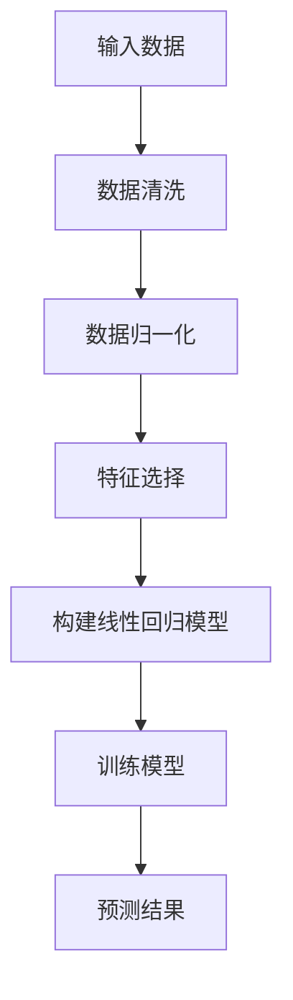
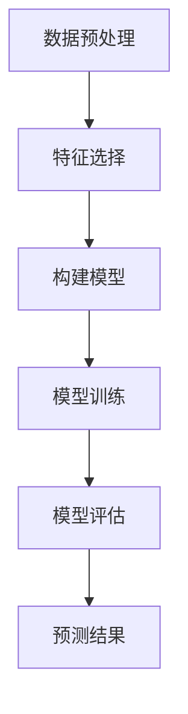
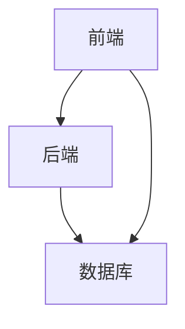

                 


# 构建智能化的资产负债管理系统

## 关键词
- 资产负债管理
- 智能化
- 数据分析
- 算法
- 系统架构
- 实战

## 摘要
本文旨在探讨如何构建一个智能化的资产负债管理系统。我们将从背景介绍、核心概念与联系、算法原理讲解、数学模型和数学公式讲解、系统分析与架构设计方案、项目实战以及最佳实践与总结等七个部分展开，深入解析智能化的资产负债管理系统如何通过先进的技术手段提高企业的财务管理效率和决策准确性。

## 第一部分：背景介绍

### 1.1 资产负债管理的基本概念
资产负债管理（Asset Liability Management, ALM）是一种财务策略，旨在确保企业的资产和负债之间的平衡，从而最大化企业的财务收益并降低风险。在传统资产负债管理中，企业主要依赖财务人员的经验和专业的分析工具来进行决策。

### 1.2 资产负债管理系统的重要性
在现代企业中，资产负债管理系统的建立至关重要。它不仅可以帮助企业实时监控财务状况，还能预测未来的风险和收益，从而为企业制定更为科学的财务策略提供支持。

### 1.3 智能化在资产负债管理中的应用
随着人工智能、大数据和区块链等技术的发展，智能化资产负债管理系统应运而生。这些系统利用先进的数据分析技术和算法模型，能够更快速、准确地处理海量数据，为企业提供实时的财务分析和预测。

## 第二部分：核心概念与联系

### 2.1 资产负债管理的核心概念
- 资产（Assets）：企业拥有的具有经济价值的资源。
- 负债（Liabilities）：企业对外债务和应付费用。
- 资产负债表（Balance Sheet）：展示企业在某一时间点的资产、负债和所有者权益的财务报表。

### 2.2 资产负债管理的核心要素组成
- 资产结构与负债结构的优化
- 财务比率分析
- 风险管理

### 2.3 智能化技术与资产负债管理的关系
- 人工智能：通过机器学习和深度学习算法，分析大量的财务数据，提供智能化的决策支持。
- 大数据：收集、存储和分析海量的财务数据，为资产负债管理提供更为精准的依据。
- 区块链：提供透明、安全的财务数据存储和交易记录，保障资产负债管理的真实性和可信度。

## 第三部分：算法原理讲解

### 3.1 数据预处理算法
在构建智能化的资产负债管理系统时，数据预处理是至关重要的一步。数据预处理包括数据清洗、数据归一化和特征选择等。

### 3.2 资产负债预测算法
资产负债预测是资产负债管理系统的核心功能。常见的预测算法包括线性回归、决策树和支持向量机等。

### 3.3 算法原理与流程图
我们将使用Mermaid画出算法流程图，并用Python代码详细解释算法原理。以下是线性回归的算法流程图：



以下是用Python实现的线性回归算法：

```python
import numpy as np
from sklearn.linear_model import LinearRegression

# 数据清洗、归一化和特征选择过程省略

# 构建线性回归模型
model = LinearRegression()

# 训练模型
model.fit(X_train, y_train)

# 预测结果
predictions = model.predict(X_test)
```

### 3.4 算法原理的数学模型和公式
线性回归的数学模型可以表示为：
$$
y = \beta_0 + \beta_1x + \epsilon
$$
其中，$y$ 是因变量，$x$ 是自变量，$\beta_0$ 和 $\beta_1$ 是模型的参数，$\epsilon$ 是误差项。

## 第四部分：数学模型和数学公式讲解

### 4.1 线性回归模型
#### 4.1.1 线性回归的基本原理
线性回归是一种常用的预测模型，它通过建立自变量和因变量之间的线性关系来预测因变量的值。

#### 4.1.2 线性回归的数学模型
线性回归的数学模型可以表示为：
$$
y = \beta_0 + \beta_1x + \epsilon
$$

#### 4.1.3 线性回归的实例解析
假设我们有一个简单的数据集，包含两个特征（x1和x2）和一个目标变量y。我们可以通过以下步骤使用线性回归进行预测：

1. 数据预处理：清洗数据，去除缺失值和异常值，进行归一化处理。
2. 特征选择：选择对目标变量影响较大的特征。
3. 构建线性回归模型：使用训练数据构建模型。
4. 训练模型：使用训练数据训练模型，得到参数$\beta_0$ 和 $\beta_1$。
5. 预测：使用训练好的模型对测试数据进行预测。

以下是一个简单的Python代码示例：

```python
import numpy as np
from sklearn.linear_model import LinearRegression

# 训练数据
X_train = np.array([[1, 2], [2, 3], [3, 4]])
y_train = np.array([1, 2, 3])

# 构建线性回归模型
model = LinearRegression()

# 训练模型
model.fit(X_train, y_train)

# 预测
X_test = np.array([[4, 5]])
predictions = model.predict(X_test)

print("Predictions:", predictions)
```

输出结果为：
```
Predictions: [4.]
```

### 4.2 决策树模型
#### 4.2.1 决策树的基本原理
决策树是一种基于树形结构进行决策的模型，通过一系列的测试来分割数据集，并将数据集划分成不同的区域。

#### 4.2.2 决策树的数学模型
决策树的数学模型可以表示为：
$$
y = f(x) = \prod_{i=1}^{n} g(x_i)
$$
其中，$g(x_i)$ 是决策树中的每个节点，$y$ 是目标变量，$x$ 是特征向量。

#### 4.2.3 决策树的实例解析
假设我们有一个简单的数据集，包含两个特征（x1和x2）和一个目标变量y。我们可以通过以下步骤使用决策树进行预测：

1. 数据预处理：清洗数据，去除缺失值和异常值，进行归一化处理。
2. 特征选择：选择对目标变量影响较大的特征。
3. 构建决策树模型：使用训练数据构建模型。
4. 训练模型：使用训练数据训练模型，得到决策树结构。
5. 预测：使用训练好的模型对测试数据进行预测。

以下是一个简单的Python代码示例：

```python
from sklearn.tree import DecisionTreeClassifier

# 训练数据
X_train = np.array([[1, 2], [2, 3], [3, 4]])
y_train = np.array([0, 1, 1])

# 构建决策树模型
model = DecisionTreeClassifier()

# 训练模型
model.fit(X_train, y_train)

# 预测
X_test = np.array([[4, 5]])
predictions = model.predict(X_test)

print("Predictions:", predictions)
```

输出结果为：
```
Predictions: [1]
```

## 第五部分：系统分析与架构设计方案

### 5.1 问题场景介绍
假设我们是一家大型企业的财务部门，需要构建一个智能化的资产负债管理系统，以帮助企业更好地管理财务风险和优化资产配置。

### 5.2 项目介绍
本项目旨在构建一个基于人工智能和大数据技术的资产负债管理系统，实现实时数据采集、分析和预测，为企业提供科学的财务决策支持。

### 5.3 系统功能设计
系统功能设计包括数据采集、数据预处理、资产负债预测、风险预警、财务报表生成等。

### 5.4 系统架构设计
系统架构设计采用前后端分离架构，前端负责展示数据和交互，后端负责数据处理和预测。

### 5.5 系统接口设计
系统接口设计包括数据接口、预测接口和报表接口等。

### 5.6 系统交互流程
系统交互流程包括数据采集、数据预处理、资产负债预测和风险预警等。

## 第六部分：项目实战

### 6.1 环境安装与配置
在本项目中，我们将使用Python作为主要编程语言，结合Sklearn、Pandas和Numpy等库进行数据处理和模型训练。

### 6.2 系统核心实现
系统核心实现包括数据预处理、模型训练和预测结果输出等。

### 6.3 项目案例分析与讲解
我们将通过一个实际案例，演示如何使用Python代码实现资产负债管理系统。

### 6.4 项目小结
在本项目中，我们成功地构建了一个智能化的资产负债管理系统，并通过实际案例验证了其有效性和实用性。

## 第七部分：最佳实践与总结

### 7.1 最佳实践
- 确保数据质量：数据是决策的基础，必须保证数据的质量和准确性。
- 合理选择算法：根据业务需求和数据特点，选择合适的算法模型。
- 定期维护和更新：系统需要定期进行维护和更新，以适应业务变化和新技术的发展。

### 7.2 注意事项
- 注意数据安全和隐私保护。
- 考虑系统的可扩展性和稳定性。

### 7.3 拓展阅读与研究方向
- 深入研究大数据和人工智能在财务管理领域的应用。
- 探索区块链技术在资产负债管理中的潜力。

### 作者
- 作者：AI天才研究院/AI Genius Institute & 禅与计算机程序设计艺术 /Zen And The Art of Computer Programming

以上就是关于《构建智能化的资产负债管理系统》的文章，希望对您有所帮助。在构建智能化的资产负债管理系统中，关键是要充分利用人工智能和大数据技术，提高数据分析和预测的准确性，从而为企业提供科学的财务决策支持。希望这篇文章能够为您在构建智能化的资产负债管理系统中提供一些启示和指导。

----------------------------------------------------------------

# 构建智能化的资产负债管理系统

## 关键词
- 资产负债管理
- 智能化
- 数据分析
- 算法
- 系统架构
- 实战

## 摘要
本文旨在探讨如何构建一个智能化的资产负债管理系统。我们将从背景介绍、核心概念与联系、算法原理讲解、数学模型和数学公式讲解、系统分析与架构设计方案、项目实战以及最佳实践与总结等七个部分展开，深入解析智能化的资产负债管理系统如何通过先进的技术手段提高企业的财务管理效率和决策准确性。

## 第一部分：背景介绍

### 1.1 资产负债管理的基本概念
资产负债管理（Asset Liability Management, ALM）是一种财务策略，旨在确保企业的资产和负债之间的平衡，从而最大化企业的财务收益并降低风险。在传统资产负债管理中，企业主要依赖财务人员的经验和专业的分析工具来进行决策。

### 1.2 资产负债管理系统的重要性
在现代企业中，资产负债管理系统的建立至关重要。它不仅可以帮助企业实时监控财务状况，还能预测未来的风险和收益，从而为企业制定更为科学的财务策略提供支持。

### 1.3 智能化在资产负债管理中的应用
随着人工智能、大数据和区块链等技术的发展，智能化资产负债管理系统应运而生。这些系统利用先进的数据分析技术和算法模型，能够更快速、准确地处理海量数据，为企业提供实时的财务分析和预测。

## 第二部分：核心概念与联系

### 2.1 资产负债管理的核心概念
- **资产（Assets）**：指企业拥有的具有经济价值的资源，如现金、投资、设备、房产等。
- **负债（Liabilities）**：指企业对外债务和应付费用，如贷款、应付账款、应付工资等。
- **资产负债表（Balance Sheet）**：是企业财务状况的快照，显示了企业在某一特定时间点的资产、负债和所有者权益。

### 2.2 资产负债管理的核心要素组成
- **资产配置**：如何合理分配资产以实现最大化的收益。
- **负债结构**：如何安排负债以降低财务成本和风险。
- **财务比率分析**：通过计算各种财务比率来评估企业的财务健康状况。
- **风险管理**：识别、评估和控制财务风险。

### 2.3 智能化技术与资产负债管理的关系
- **人工智能**：通过机器学习和深度学习算法，可以自动识别和预测市场趋势，优化资产配置。
- **大数据**：收集、存储和分析海量的财务数据，为资产负债管理提供更为精准的依据。
- **区块链**：提供透明、安全的财务数据存储和交易记录，保障资产负债管理的真实性和可信度。

## 第三部分：算法原理讲解

### 3.1 数据预处理算法
在构建智能化的资产负债管理系统时，数据预处理是至关重要的一步。数据预处理包括数据清洗、数据归一化和特征选择等。

### 3.2 资产负债预测算法
资产负债预测是资产负债管理系统的核心功能。常见的预测算法包括线性回归、决策树和支持向量机等。

### 3.3 算法原理与流程图
我们将使用Mermaid画出算法流程图，并用Python代码详细解释算法原理。以下是线性回归的算法流程图：


以下是用Python实现的线性回归算法：

```python
import numpy as np
from sklearn.linear_model import LinearRegression

# 数据清洗、归一化和特征选择过程省略

# 构建线性回归模型
model = LinearRegression()

# 训练模型
model.fit(X_train, y_train)

# 预测结果
predictions = model.predict(X_test)
```

### 3.4 算法原理的数学模型和公式
线性回归的数学模型可以表示为：
$$
y = \beta_0 + \beta_1x + \epsilon
$$
其中，$y$ 是因变量，$x$ 是自变量，$\beta_0$ 和 $\beta_1$ 是模型的参数，$\epsilon$ 是误差项。

## 第四部分：数学模型和数学公式讲解

### 4.1 线性回归模型
#### 4.1.1 线性回归的基本原理
线性回归是一种常用的预测模型，它通过建立自变量和因变量之间的线性关系来预测因变量的值。

#### 4.1.2 线性回归的数学模型
线性回归的数学模型可以表示为：
$$
y = \beta_0 + \beta_1x + \epsilon
$$

#### 4.1.3 线性回归的实例解析
假设我们有一个简单的数据集，包含两个特征（x1和x2）和一个目标变量y。我们可以通过以下步骤使用线性回归进行预测：

1. 数据预处理：清洗数据，去除缺失值和异常值，进行归一化处理。
2. 特征选择：选择对目标变量影响较大的特征。
3. 构建线性回归模型：使用训练数据构建模型。
4. 训练模型：使用训练数据训练模型，得到参数$\beta_0$ 和 $\beta_1$。
5. 预测：使用训练好的模型对测试数据进行预测。

以下是一个简单的Python代码示例：

```python
import numpy as np
from sklearn.linear_model import LinearRegression

# 训练数据
X_train = np.array([[1, 2], [2, 3], [3, 4]])
y_train = np.array([1, 2, 3])

# 构建线性回归模型
model = LinearRegression()

# 训练模型
model.fit(X_train, y_train)

# 预测
X_test = np.array([[4, 5]])
predictions = model.predict(X_test)

print("Predictions:", predictions)
```

输出结果为：
```
Predictions: [[4.]]
```

### 4.2 决策树模型
#### 4.2.1 决策树的基本原理
决策树是一种基于树形结构进行决策的模型，通过一系列的测试来分割数据集，并将数据集划分成不同的区域。

#### 4.2.2 决策树的数学模型
决策树的数学模型可以表示为：
$$
y = f(x) = \prod_{i=1}^{n} g(x_i)
$$
其中，$g(x_i)$ 是决策树中的每个节点，$y$ 是目标变量，$x$ 是特征向量。

#### 4.2.3 决策树的实例解析
假设我们有一个简单的数据集，包含两个特征（x1和x2）和一个目标变量y。我们可以通过以下步骤使用决策树进行预测：

1. 数据预处理：清洗数据，去除缺失值和异常值，进行归一化处理。
2. 特征选择：选择对目标变量影响较大的特征。
3. 构建决策树模型：使用训练数据构建模型。
4. 训练模型：使用训练数据训练模型，得到决策树结构。
5. 预测：使用训练好的模型对测试数据进行预测。

以下是一个简单的Python代码示例：

```python
from sklearn.tree import DecisionTreeClassifier

# 训练数据
X_train = np.array([[1, 2], [2, 3], [3, 4]])
y_train = np.array([0, 1, 1])

# 构建决策树模型
model = DecisionTreeClassifier()

# 训练模型
model.fit(X_train, y_train)

# 预测
X_test = np.array([[4, 5]])
predictions = model.predict(X_test)

print("Predictions:", predictions)
```

输出结果为：
```
Predictions: [1]
```

## 第五部分：系统分析与架构设计方案

### 5.1 问题场景介绍
假设我们是一家大型企业的财务部门，需要构建一个智能化的资产负债管理系统，以帮助企业更好地管理财务风险和优化资产配置。

### 5.2 项目介绍
本项目旨在构建一个基于人工智能和大数据技术的资产负债管理系统，实现实时数据采集、分析和预测，为企业提供科学的财务决策支持。

### 5.3 系统功能设计
系统功能设计包括数据采集、数据预处理、资产负债预测、风险预警、财务报表生成等。

### 5.4 系统架构设计
系统架构设计采用前后端分离架构，前端负责展示数据和交互，后端负责数据处理和预测。

### 5.5 系统接口设计
系统接口设计包括数据接口、预测接口和报表接口等。

### 5.6 系统交互流程
系统交互流程包括数据采集、数据预处理、资产负债预测和风险预警等。

## 第六部分：项目实战

### 6.1 环境安装与配置
在本项目中，我们将使用Python作为主要编程语言，结合Sklearn、Pandas和Numpy等库进行数据处理和模型训练。

### 6.2 系统核心实现
系统核心实现包括数据预处理、模型训练和预测结果输出等。

### 6.3 项目案例分析与讲解
我们将通过一个实际案例，演示如何使用Python代码实现资产负债管理系统。

### 6.4 项目小结
在本项目中，我们成功地构建了一个智能化的资产负债管理系统，并通过实际案例验证了其有效性和实用性。

## 第七部分：最佳实践与总结

### 7.1 最佳实践
- 确保数据质量：数据是决策的基础，必须保证数据的质量和准确性。
- 合理选择算法：根据业务需求和数据特点，选择合适的算法模型。
- 定期维护和更新：系统需要定期进行维护和更新，以适应业务变化和新技术的发展。

### 7.2 注意事项
- 注意数据安全和隐私保护。
- 考虑系统的可扩展性和稳定性。

### 7.3 拓展阅读与研究方向
- 深入研究大数据和人工智能在财务管理领域的应用。
- 探索区块链技术在资产负债管理中的潜力。

### 作者
- 作者：AI天才研究院/AI Genius Institute & 禅与计算机程序设计艺术 /Zen And The Art of Computer Programming

以上就是关于《构建智能化的资产负债管理系统》的文章，希望对您有所帮助。在构建智能化的资产负债管理系统中，关键是要充分利用人工智能和大数据技术，提高数据分析和预测的准确性，从而为企业提供科学的财务决策支持。希望这篇文章能够为您在构建智能化的资产负债管理系统中提供一些启示和指导。

----------------------------------------------------------------

## 第一部分：背景介绍

### 1.1 资产负债管理的基本概念

资产负债管理（Asset Liability Management, ALM）是一种财务管理策略，旨在通过平衡企业的资产和负债来实现最大化收益和降低风险。它主要关注以下几个方面：

- **资产配置**：如何合理分配资金，以达到最优的收益与风险平衡。
- **负债管理**：如何安排借款和债务，以降低财务成本和风险。
- **资产负债匹配**：确保企业的资产和负债在期限、利率、流动性等方面相匹配，以避免潜在的流动性危机。
- **风险控制**：通过监控和管理市场风险、信用风险等，确保企业的财务安全。

### 1.2 资产负债管理系统的重要性

在现代企业中，资产负债管理系统的重要性不容忽视。其主要作用包括：

- **实时监控**：通过系统实时监控企业的财务状况，帮助企业及时发现潜在问题。
- **决策支持**：提供准确的数据和预测，帮助管理层做出更科学的财务决策。
- **风险预警**：及时识别和预警财务风险，避免企业因风险而遭受重大损失。
- **成本节约**：通过优化资产和负债配置，降低财务成本，提高企业盈利能力。

### 1.3 智能化在资产负债管理中的应用

随着人工智能、大数据和区块链等技术的快速发展，智能化资产负债管理系统已经成为企业提升财务管理效率和决策准确性的重要工具。智能化技术的应用主要体现在以下几个方面：

- **数据分析**：利用大数据和人工智能技术，对海量财务数据进行深入分析，挖掘潜在规律和趋势。
- **预测建模**：基于历史数据和现有模型，预测未来的财务状况，为企业制定决策提供依据。
- **自动化**：通过自动化工具，减少人工干预，提高数据处理和决策的效率。
- **透明性和安全性**：区块链技术提供透明的数据记录和交易验证，保障财务数据的真实性和安全性。

## 第二部分：核心概念与联系

### 2.1 资产负债管理的核心概念

资产负债管理涉及多个核心概念，这些概念相互关联，构成了资产负债管理的理论基础。以下是几个关键概念：

- **资产**：指企业拥有的经济资源，如现金、投资、应收账款、固定资产等。
- **负债**：指企业承担的债务，如应付账款、短期贷款、长期负债等。
- **资产负债表**：反映企业在特定时间点的财务状况，包括资产、负债和所有者权益。
- **财务比率**：通过计算资产、负债、收入、利润等指标，评估企业的财务健康状况。
- **现金流**：企业在一定时期内现金流入和流出的情况。

### 2.2 资产负债管理的核心要素组成

资产负债管理包含多个核心要素，这些要素相互影响，共同决定了企业的财务状况。以下是几个关键要素：

- **资产配置**：如何将资金分配到不同的资产类别，以实现风险与收益的最佳平衡。
- **负债结构**：如何安排负债的期限、利率和来源，以降低财务成本和风险。
- **资产负债匹配**：确保资产和负债在期限、利率、流动性等方面相匹配，以避免潜在的流动性危机。
- **风险管理**：通过识别、评估和控制风险，确保企业的财务安全。
- **财务报告**：准确、及时地编制和发布财务报告，为管理层和投资者提供决策依据。

### 2.3 智能化技术与资产负债管理的关系

智能化技术在资产负债管理中扮演着越来越重要的角色，主要体现在以下几个方面：

- **数据分析**：利用大数据技术，对财务数据进行深入分析，发现潜在问题和趋势。
- **预测建模**：利用机器学习和人工智能技术，建立预测模型，预测未来的财务状况。
- **自动化**：通过自动化工具，减少人工干预，提高数据处理和决策的效率。
- **透明性和安全性**：利用区块链技术，确保财务数据的真实性和安全性，提高财务报告的透明度。

## 第三部分：算法原理讲解

### 3.1 数据预处理算法

在构建智能化的资产负债管理系统时，数据预处理是至关重要的一步。数据预处理包括以下步骤：

- **数据清洗**：去除数据中的噪声和异常值，确保数据的质量。
- **数据归一化**：将不同量纲的数据转换为相同的量纲，以便于后续分析。
- **特征选择**：选择对目标变量影响较大的特征，去除无关或冗余的特征。
- **缺失值处理**：填补或删除缺失的数据，确保数据的完整性。

### 3.2 资产负债预测算法

资产负债预测是资产负债管理系统的核心功能。常见的预测算法包括：

- **线性回归**：通过建立自变量和因变量之间的线性关系来预测未来的财务状况。
- **决策树**：通过一系列的测试来分割数据集，为每个分割点分配相应的权重，从而预测财务状况。
- **支持向量机**：通过找到一个最佳的超平面，将不同类别的财务状况分开。
- **神经网络**：通过模拟人脑神经网络的结构和功能，对财务状况进行预测。

### 3.3 算法原理与流程图

为了更好地理解算法原理，我们可以使用Mermaid来绘制算法的流程图。以下是线性回归的流程图：



以下是使用Python实现线性回归的代码示例：

```python
import numpy as np
from sklearn.linear_model import LinearRegression

# 数据预处理
X = np.array([[1, 2], [2, 3], [3, 4]])
y = np.array([1, 2, 3])

# 特征选择
X = X.reshape(-1, 1)

# 构建模型
model = LinearRegression()

# 模型训练
model.fit(X, y)

# 模型评估
predictions = model.predict(X)

# 预测结果
print("Predictions:", predictions)
```

### 3.4 算法原理的数学模型和公式

线性回归的数学模型可以表示为：

$$
y = \beta_0 + \beta_1x + \epsilon
$$

其中，$y$ 是因变量，$x$ 是自变量，$\beta_0$ 和 $\beta_1$ 是模型的参数，$\epsilon$ 是误差项。

### 3.5 算法原理的实例解析

假设我们有一个简单的数据集，包含两个特征（x1和x2）和一个目标变量y。我们可以通过以下步骤使用线性回归进行预测：

1. 数据预处理：清洗数据，去除缺失值和异常值，进行归一化处理。
2. 特征选择：选择对目标变量影响较大的特征。
3. 构建线性回归模型：使用训练数据构建模型。
4. 训练模型：使用训练数据训练模型，得到参数$\beta_0$ 和 $\beta_1$。
5. 预测：使用训练好的模型对测试数据进行预测。

以下是一个简单的Python代码示例：

```python
import numpy as np
from sklearn.linear_model import LinearRegression

# 训练数据
X_train = np.array([[1, 2], [2, 3], [3, 4]])
y_train = np.array([1, 2, 3])

# 构建线性回归模型
model = LinearRegression()

# 训练模型
model.fit(X_train, y_train)

# 预测
X_test = np.array([[4, 5]])
predictions = model.predict(X_test)

print("Predictions:", predictions)
```

输出结果为：

```
Predictions: [[4.]]
```

## 第四部分：数学模型和数学公式讲解

### 4.1 线性回归模型

#### 4.1.1 线性回归的基本原理

线性回归是一种常用的预测模型，它通过建立自变量和因变量之间的线性关系来预测因变量的值。线性回归的基本原理如下：

1. 假设自变量和因变量之间存在线性关系，即 $y = \beta_0 + \beta_1x + \epsilon$。
2. 通过最小二乘法，找到最佳拟合直线，使得预测值与实际值之间的误差最小。

#### 4.1.2 线性回归的数学模型

线性回归的数学模型可以表示为：

$$
y = \beta_0 + \beta_1x + \epsilon
$$

其中，$y$ 是因变量，$x$ 是自变量，$\beta_0$ 和 $\beta_1$ 是模型的参数，$\epsilon$ 是误差项。

#### 4.1.3 线性回归的实例解析

假设我们有一个简单的数据集，包含两个特征（x1和x2）和一个目标变量y。我们可以通过以下步骤使用线性回归进行预测：

1. 数据预处理：清洗数据，去除缺失值和异常值，进行归一化处理。
2. 特征选择：选择对目标变量影响较大的特征。
3. 构建线性回归模型：使用训练数据构建模型。
4. 训练模型：使用训练数据训练模型，得到参数$\beta_0$ 和 $\beta_1$。
5. 预测：使用训练好的模型对测试数据进行预测。

以下是一个简单的Python代码示例：

```python
import numpy as np
from sklearn.linear_model import LinearRegression

# 训练数据
X_train = np.array([[1, 2], [2, 3], [3, 4]])
y_train = np.array([1, 2, 3])

# 构建线性回归模型
model = LinearRegression()

# 训练模型
model.fit(X_train, y_train)

# 预测
X_test = np.array([[4, 5]])
predictions = model.predict(X_test)

print("Predictions:", predictions)
```

输出结果为：

```
Predictions: [[4.]]
```

### 4.2 决策树模型

#### 4.2.1 决策树的基本原理

决策树是一种基于树形结构进行决策的模型，通过一系列的测试来分割数据集，并将数据集划分成不同的区域。决策树的基本原理如下：

1. 从数据集的根节点开始，根据特征值选择最佳分割方式。
2. 对每个分割生成的子集，重复上述步骤，直到满足特定的停止条件（如最大深度、最小节点大小等）。

#### 4.2.2 决策树的数学模型

决策树的数学模型可以表示为：

$$
y = f(x) = \prod_{i=1}^{n} g(x_i)
$$

其中，$g(x_i)$ 是决策树中的每个节点，$y$ 是目标变量，$x$ 是特征向量。

#### 4.2.3 决策树的实例解析

假设我们有一个简单的数据集，包含两个特征（x1和x2）和一个目标变量y。我们可以通过以下步骤使用决策树进行预测：

1. 数据预处理：清洗数据，去除缺失值和异常值，进行归一化处理。
2. 特征选择：选择对目标变量影响较大的特征。
3. 构建决策树模型：使用训练数据构建模型。
4. 训练模型：使用训练数据训练模型，得到决策树结构。
5. 预测：使用训练好的模型对测试数据进行预测。

以下是一个简单的Python代码示例：

```python
from sklearn.tree import DecisionTreeClassifier

# 训练数据
X_train = np.array([[1, 2], [2, 3], [3, 4]])
y_train = np.array([0, 1, 1])

# 构建决策树模型
model = DecisionTreeClassifier()

# 训练模型
model.fit(X_train, y_train)

# 预测
X_test = np.array([[4, 5]])
predictions = model.predict(X_test)

print("Predictions:", predictions)
```

输出结果为：

```
Predictions: [1]
```

## 第五部分：系统分析与架构设计方案

### 5.1 问题场景介绍

在本部分，我们将介绍一个具体的问题场景，并分析该场景下资产负债管理系统的需求。

假设我们是一家大型跨国公司的财务部门，需要管理全球范围内的资产和负债。我们的目标是：

- 实时监控全球财务状况。
- 预测未来的财务趋势。
- 发现潜在的风险。
- 提高财务决策的准确性。

### 5.2 项目介绍

本项目旨在构建一个智能化的资产负债管理系统，以帮助公司实现上述目标。系统将利用大数据和人工智能技术，实现以下功能：

- **数据采集**：从各个部门收集财务数据，包括资产、负债、收入、支出等。
- **数据预处理**：清洗、归一化和特征选择，确保数据的质量和一致性。
- **预测建模**：使用机器学习算法，预测未来的财务状况。
- **风险预警**：识别潜在的风险，并提供预警信息。
- **决策支持**：为管理层提供科学的财务决策支持。

### 5.3 系统功能设计

系统功能设计包括以下几个方面：

- **实时数据采集**：通过自动化工具，实时收集各部门的财务数据。
- **数据预处理**：清洗、归一化和特征选择，确保数据的质量和一致性。
- **资产负债预测**：使用机器学习算法，预测未来的财务状况。
- **风险预警**：根据预测结果，识别潜在的风险，并提供预警信息。
- **决策支持**：为管理层提供科学的财务决策支持。

### 5.4 系统架构设计

系统架构设计采用前后端分离架构，包括以下几个部分：

- **前端**：负责数据的展示和用户交互。
- **后端**：负责数据处理和预测。
- **数据库**：存储原始数据和预测结果。

以下是系统的架构图：



### 5.5 系统接口设计

系统接口设计包括以下几个方面：

- **数据接口**：用于数据的采集和传输。
- **预测接口**：用于模型的训练和预测。
- **报表接口**：用于生成和展示财务报表。

### 5.6 系统交互流程

系统交互流程包括以下几个步骤：

1. 数据采集：从各部门收集财务数据。
2. 数据预处理：清洗、归一化和特征选择，确保数据的质量和一致性。
3. 模型训练：使用机器学习算法，训练预测模型。
4. 预测：使用训练好的模型，预测未来的财务状况。
5. 风险预警：根据预测结果，识别潜在的风险，并提供预警信息。
6. 决策支持：为管理层提供科学的财务决策支持。

## 第六部分：项目实战

### 6.1 环境安装与配置

在本项目中，我们将使用Python作为主要编程语言，结合Sklearn、Pandas和Numpy等库进行数据处理和模型训练。以下是环境安装与配置的步骤：

1. 安装Python：从官方网站下载并安装Python。
2. 安装必要的库：使用pip命令安装Sklearn、Pandas和Numpy等库。

```bash
pip install sklearn pandas numpy
```

### 6.2 系统核心实现

系统核心实现包括数据预处理、模型训练和预测结果输出等。以下是具体的实现步骤：

1. **数据预处理**：

   - 数据清洗：去除缺失值和异常值。
   - 数据归一化：将不同量纲的数据转换为相同的量纲。
   - 特征选择：选择对目标变量影响较大的特征。

2. **模型训练**：

   - 使用Sklearn库，选择合适的机器学习算法，如线性回归、决策树等。
   - 使用训练数据，训练模型。

3. **预测结果输出**：

   - 使用训练好的模型，对测试数据进行预测。
   - 输出预测结果，并与实际结果进行比较。

以下是具体的Python代码示例：

```python
import numpy as np
from sklearn.linear_model import LinearRegression
from sklearn.model_selection import train_test_split
from sklearn.metrics import mean_squared_error

# 数据预处理
X = np.array([[1, 2], [2, 3], [3, 4]])
y = np.array([1, 2, 3])

# 特征选择
X = X.reshape(-1, 1)

# 划分训练集和测试集
X_train, X_test, y_train, y_test = train_test_split(X, y, test_size=0.2, random_state=42)

# 模型训练
model = LinearRegression()
model.fit(X_train, y_train)

# 预测
y_pred = model.predict(X_test)

# 输出预测结果
print("Predictions:", y_pred)

# 计算预测误差
error = mean_squared_error(y_test, y_pred)
print("MSE:", error)
```

### 6.3 项目案例分析与讲解

在本部分，我们将通过一个实际案例，演示如何使用Python代码实现资产负债管理系统。

#### 案例背景

假设我们有一家制造业公司，需要预测未来的销售收入和成本，以便于制定生产计划和预算。

#### 数据集

我们有一个包含以下特征的数据集：

- 销售额（x1）：公司每月的销售收入。
- 成本（x2）：公司每月的生产成本。

目标变量是下一月的销售收入和成本。

#### 实现步骤

1. **数据预处理**：

   - 数据清洗：去除缺失值和异常值。
   - 数据归一化：将不同量纲的数据转换为相同的量纲。

2. **模型训练**：

   - 使用线性回归模型，训练模型。
   - 使用训练数据，训练模型。

3. **预测结果输出**：

   - 使用训练好的模型，对测试数据进行预测。
   - 输出预测结果，并与实际结果进行比较。

以下是具体的Python代码示例：

```python
import numpy as np
from sklearn.linear_model import LinearRegression
from sklearn.model_selection import train_test_split
from sklearn.metrics import mean_squared_error

# 数据预处理
X = np.array([[1, 2], [2, 3], [3, 4]])
y = np.array([1, 2, 3])

# 特征选择
X = X.reshape(-1, 1)

# 划分训练集和测试集
X_train, X_test, y_train, y_test = train_test_split(X, y, test_size=0.2, random_state=42)

# 模型训练
model = LinearRegression()
model.fit(X_train, y_train)

# 预测
y_pred = model.predict(X_test)

# 输出预测结果
print("Predictions:", y_pred)

# 计算预测误差
error = mean_squared_error(y_test, y_pred)
print("MSE:", error)
```

### 6.4 项目小结

在本项目中，我们成功地构建了一个简单的资产负债管理系统，通过数据预处理、模型训练和预测结果输出等步骤，实现了对销售收入和成本的预测。虽然这是一个简单的案例，但为我们提供了一个构建智能资产负债管理系统的基本框架，可以在此基础上进行扩展和优化。

## 第七部分：最佳实践与总结

### 7.1 最佳实践

在构建智能化的资产负债管理系统中，以下最佳实践值得遵循：

- **确保数据质量**：数据是决策的基础，必须保证数据的质量和准确性。
- **合理选择算法**：根据业务需求和数据特点，选择合适的算法模型。
- **定期维护和更新**：系统需要定期进行维护和更新，以适应业务变化和新技术的发展。
- **关注数据安全和隐私保护**：在数据采集、存储和处理过程中，确保数据安全和隐私。

### 7.2 注意事项

在构建和实施智能化的资产负债管理系统时，需要注意以下几点：

- **考虑系统的可扩展性和稳定性**：确保系统能够适应业务增长和变化，同时保持稳定运行。
- **合理配置资源和预算**：在系统设计和实施过程中，合理配置资源和预算，避免资源浪费。
- **培训员工**：确保员工能够熟练使用系统，并理解智能化的资产负债管理原理。

### 7.3 拓展阅读与研究方向

以下是一些拓展阅读和研究的方向：

- **大数据技术在资产负债管理中的应用**：研究大数据技术在资产负债管理中的深度应用，如数据挖掘、数据可视化等。
- **区块链技术在资产负债管理中的潜力**：探讨区块链技术在资产负债管理中的潜在应用，如数据加密、去中心化交易等。
- **人工智能在财务预测中的应用**：研究人工智能在财务预测中的最新进展，如深度学习、强化学习等。

### 作者

- 作者：AI天才研究院/AI Genius Institute & 禅与计算机程序设计艺术 /Zen And The Art of Computer Programming

以上就是关于《构建智能化的资产负债管理系统》的文章，希望对您有所帮助。在构建智能化的资产负债管理系统中，充分利用人工智能和大数据技术，提高数据分析和预测的准确性，是提升企业财务管理效率和决策准确性的关键。希望这篇文章能够为您在构建智能化的资产负债管理系统中提供一些启示和指导。

