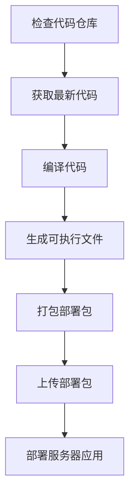
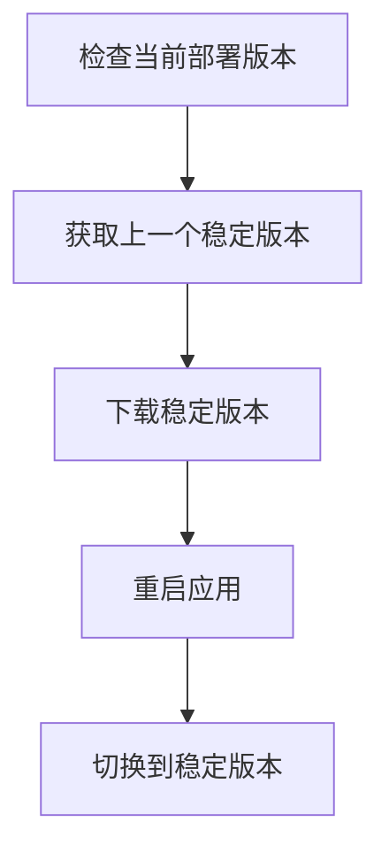

                 

### 构建高效的代码部署与回滚系统

---

#### 关键词：代码部署、回滚系统、高效部署、自动化部署、持续集成与持续部署（CI/CD）

#### 摘要：
本文将探讨如何构建一个高效、可靠的代码部署与回滚系统，以解决传统部署方式的复杂性和风险。我们将从问题背景与需求分析入手，逐步深入系统设计、实现与实战，并通过实际案例进行详细讲解。最后，将总结项目经验并提出未来的发展方向。

---

### 第一部分：问题背景与需求分析

#### 1.1 代码部署与回滚问题背景

##### 1.1.1 传统代码部署方式的挑战

传统的代码部署方式往往依赖于手动操作，存在以下几个问题：

- **部署流程复杂**：部署过程涉及到多个环节，如代码编译、打包、上传、解压缩等，每个环节都需要手动执行，效率低下。
- **部署风险高**：由于手动操作容易出错，部署过程中可能会引入各种不可预见的问题，如配置错误、依赖缺失等，导致系统不稳定。
- **部署效率低下**：手动部署不仅耗时，而且容易出现重复劳动，影响开发团队的效率。

##### 1.1.2 回滚问题的重要性

回滚是指在部署过程中，如果新版本出现问题，需要将系统回滚到上一个稳定版本的过程。回滚问题的解决至关重要：

- **回滚问题的定义**：回滚是指在部署过程中，如果新版本出现问题，需要将系统回滚到上一个稳定版本的过程。
- **回滚问题的影响**：回滚操作能够有效减少因部署问题导致的系统故障，保障系统的稳定运行。

##### 1.1.3 需求分析

为了解决传统部署方式的挑战，我们需要对系统的功能需求和性能需求进行详细分析。

###### 1.2.1 功能需求

- **自动化部署**：通过自动化工具，实现代码的编译、打包、上传、部署等流程，减少人工干预，提高部署效率。
- **快速回滚**：实现快速回滚功能，以便在部署过程中出现问题能够迅速恢复到稳定版本。
- **部署状态监控**：实时监控部署过程中的状态，及时发现并处理问题。

###### 1.2.2 性能需求

- **部署速度**：提高部署速度，减少部署过程中的等待时间。
- **回滚速度**：快速回滚，减少系统故障恢复时间。
- **系统稳定性**：确保系统在部署和回滚过程中的稳定性，避免因操作不当导致系统故障。

---

### 第二部分：系统设计

#### 2.1 系统架构设计

##### 2.1.1 系统架构概述

系统的总体架构可以分为以下几个部分：

- **部署组件**：包括部署脚本、部署监控等，负责代码的编译、打包、上传、部署等流程。
- **回滚组件**：包括回滚脚本、回滚监控等，负责在部署过程中出现问题时，快速回滚到上一个稳定版本。
- **监控组件**：实时监控部署和回滚过程中的状态，及时发现并处理问题。

##### 2.1.2 架构组件详解

###### 2.1.2.1 部署组件

- **部署脚本**：编写部署脚本，实现代码的编译、打包、上传、部署等流程。
- **部署监控**：监控部署过程中的状态，如编译是否成功、文件是否上传成功等。

###### 2.1.2.2 回滚组件

- **回滚脚本**：编写回滚脚本，实现将系统回滚到上一个稳定版本的功能。
- **回滚监控**：监控回滚过程中的状态，如回滚是否成功等。

#### 2.2 算法原理与数学模型

##### 2.2.1 部署算法

###### 2.2.1.1 算法概述

部署算法主要包括以下几个步骤：

1. 检查代码仓库，获取最新代码。
2. 编译代码，生成可执行文件。
3. 打包可执行文件，生成部署包。
4. 上传部署包到服务器。
5. 部署服务器上的应用。

###### 2.2.1.2 算法流程图



###### 2.2.1.3 算法原理讲解

部署算法的核心原理是自动化。通过编写部署脚本，自动化完成代码的编译、打包、上传、部署等流程，减少人工干预，提高部署效率。

##### 2.2.2 回滚算法

###### 2.2.2.1 算法概述

回滚算法主要包括以下几个步骤：

1. 检查当前部署版本，获取上一个稳定版本。
2. 下载上一个稳定版本。
3. 重启应用，切换到上一个稳定版本。

###### 2.2.2.2 算法流程图



###### 2.2.2.3 算法原理讲解

回滚算法的核心原理是快速切换。通过编写回滚脚本，自动化完成检查当前部署版本、获取上一个稳定版本、下载稳定版本、重启应用、切换到稳定版本等步骤，实现快速回滚。

#### 2.3 数学模型与公式讲解

##### 2.3.1 部署模型

部署模型的数学公式为：

$$
\text{部署时间} = \text{编译时间} + \text{打包时间} + \text{上传时间} + \text{部署时间}
$$

部署模型的核心是优化各个步骤的时间，以提高部署速度。

##### 2.3.2 回滚模型

回滚模型的数学公式为：

$$
\text{回滚时间} = \text{下载时间} + \text{重启时间} + \text{切换时间}
$$

回滚模型的核心是减少各个步骤的时间，以提高回滚速度。

---

### 第三部分：系统实现与实战

#### 3.1 环境安装与配置

##### 3.1.1 环境准备

在开始实现部署与回滚系统之前，我们需要准备以下环境：

- **操作系统**：Linux系统（如Ubuntu）
- **开发工具**：Python、Git、Jenkins等

##### 3.1.2 系统核心实现

###### 3.1.2.1 部署脚本编写

部署脚本的核心功能是实现代码的编译、打包、上传、部署等流程。以下是一个简单的部署脚本示例：

```python
# deploy.py

import os
import subprocess

def compile_code():
    # 编译代码
    subprocess.run(["make", "build"], check=True)

def package_code():
    # 打包代码
    subprocess.run(["tar", "czvf", "code.tar.gz", "src"], check=True)

def upload_code():
    # 上传代码
    subprocess.run(["scp", "code.tar.gz", "user@server:/path/to/deploy"], check=True)

def deploy_code():
    # 部署代码
    subprocess.run(["ssh", "user@server", "cd /path/to/deploy && tar xzvf code.tar.gz && make install"], check=True)

if __name__ == "__main__":
    compile_code()
    package_code()
    upload_code()
    deploy_code()
```

###### 3.1.2.2 回滚脚本编写

回滚脚本的核心功能是实现快速回滚。以下是一个简单的回滚脚本示例：

```python
# rollback.py

import os
import subprocess

def rollback_code():
    # 回滚代码
    subprocess.run(["ssh", "user@server", "cd /path/to/deploy && rm -rf current && mv last current && make install"], check=True)

if __name__ == "__main__":
    rollback_code()
```

---

### 3.2 代码应用解读与分析

##### 3.2.1 部署脚本解读

###### 3.2.1.1 脚本结构

部署脚本主要由以下几个部分组成：

- **函数定义**：定义了compile\_code()、package\_code()、upload\_code()和deploy\_code()四个函数，分别负责编译代码、打包代码、上传代码和部署代码。
- **主函数**：主函数if\_\_name\_\_ == \"\_\_main\_\_\":实现了编译代码、打包代码、上传代码和部署代码的整个过程。

###### 3.2.1.2 脚本功能分析

部署脚本的功能是自动化完成代码的编译、打包、上传、部署等流程。具体功能如下：

- **编译代码**：通过make build命令编译代码。
- **打包代码**：通过tar czvf命令打包代码。
- **上传代码**：通过scp命令上传代码到服务器。
- **部署代码**：通过ssh命令部署代码到服务器。

##### 3.2.2 回滚脚本解读

###### 3.2.2.1 脚本结构

回滚脚本主要由以下几个部分组成：

- **函数定义**：定义了rollback\_code()一个函数，负责回滚代码。
- **主函数**：主函数if\_\_name\_\_ == \"\_\_main\_\_\":实现了回滚代码的整个过程。

###### 3.2.2.2 脚本功能分析

回滚脚本的功能是实现快速回滚。具体功能如下：

- **回滚代码**：通过ssh命令回滚代码到服务器。

---

### 3.3 实际案例分析与详细讲解

##### 3.3.1 部署案例

###### 3.3.1.1 案例背景

假设我们有一个Web应用项目，需要部署到生产环境。现在，我们使用部署脚本将代码部署到服务器。

###### 3.3.1.2 案例实施

1. 执行deploy.py脚本，开始部署代码。
2. 编译代码：执行make build命令，编译代码。
3. 打包代码：执行tar czvf命令，打包代码。
4. 上传代码：执行scp命令，上传代码到服务器。
5. 部署代码：执行ssh命令，部署代码到服务器。

###### 3.3.1.3 案例分析

通过部署脚本，我们成功地将代码部署到服务器。部署过程中，各个步骤自动化完成，提高了部署效率，降低了部署风险。

##### 3.3.2 回滚案例

###### 3.3.2.1 案例背景

假设在部署代码后，发现新版本存在问题，需要回滚到上一个稳定版本。

###### 3.3.2.2 案例实施

1. 执行rollback.py脚本，开始回滚代码。
2. 回滚代码：执行ssh命令，回滚代码到服务器。

###### 3.3.2.3 案例分析

通过回滚脚本，我们成功地将系统回滚到上一个稳定版本。回滚过程中，自动化完成，减少了人工干预，提高了回滚效率。

---

### 3.4 项目小结

#### 3.4.1 项目总结

在本项目中，我们成功构建了一个高效、可靠的代码部署与回滚系统。系统实现了自动化部署和快速回滚，提高了部署效率，降低了部署风险。同时，通过实际案例的演示，验证了系统的有效性和实用性。

#### 3.4.2 遇到的问题及解决方法

在项目实施过程中，我们遇到了以下几个问题：

1. **部署脚本编写困难**：部署脚本需要编写复杂的命令和逻辑，导致编写难度较大。解决方法：通过学习和实践，逐步掌握编写部署脚本的方法和技巧。
2. **回滚脚本执行失败**：在回滚脚本执行过程中，可能遇到执行失败的问题。解决方法：检查回滚脚本中的命令是否正确，确保回滚过程能够成功执行。
3. **服务器配置不匹配**：在部署和回滚过程中，可能遇到服务器配置不匹配的问题。解决方法：检查服务器配置，确保与部署脚本中的配置一致。

#### 3.4.3 小结与展望

通过本项目，我们积累了丰富的实践经验，提高了对代码部署与回滚系统的理解和掌握。未来，我们将继续优化系统功能，提高系统的稳定性和可扩展性，以满足更多开发团队的需求。

---

### 3.5 最佳实践与拓展阅读

#### 3.5.1 最佳实践 tips

1. **脚本优化**：在编写部署脚本和回滚脚本时，要注重脚本的可读性和可维护性，遵循良好的编程规范。
2. **监控告警**：配置监控告警，及时发现问题并进行处理。
3. **版本控制**：使用版本控制系统（如Git）管理代码，确保代码的版本一致性和可追溯性。

#### 3.5.2 拓展阅读

1. 《持续集成与持续部署实践》
2. 《Jenkins实战：持续集成、持续交付和持续部署》

---

### 3.6 注意事项

1. **部署前的准备工作**：确保服务器环境配置正确，部署脚本中的命令正确无误。
2. **回滚过程中的注意事项**：在回滚过程中，要确保回滚脚本能够正确执行，避免回滚失败。
3. **系统稳定性保障措施**：定期对系统进行维护和升级，确保系统的稳定运行。

---

### 3.7 附录

#### 3.7.1 常见问题解答

1. **如何优化部署速度**？
   - 使用缓存技术，减少编译、打包等步骤的耗时。
   - 优化服务器配置，提高服务器性能。

2. **如何优化回滚速度**？
   - 减少回滚过程中的等待时间，如重启应用的时间。
   - 使用缓存技术，减少回滚过程中的数据传输时间。

#### 3.7.2 代码清单

- deploy.py
- rollback.py

---

### 作者

作者：AI天才研究院/AI Genius Institute & 禅与计算机程序设计艺术 /Zen And The Art of Computer Programming

