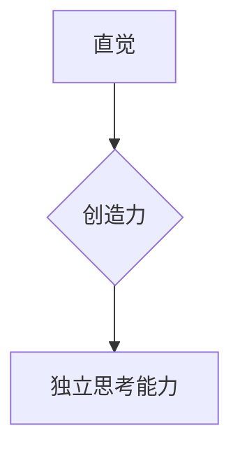
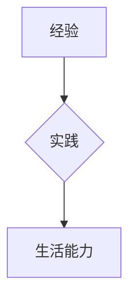
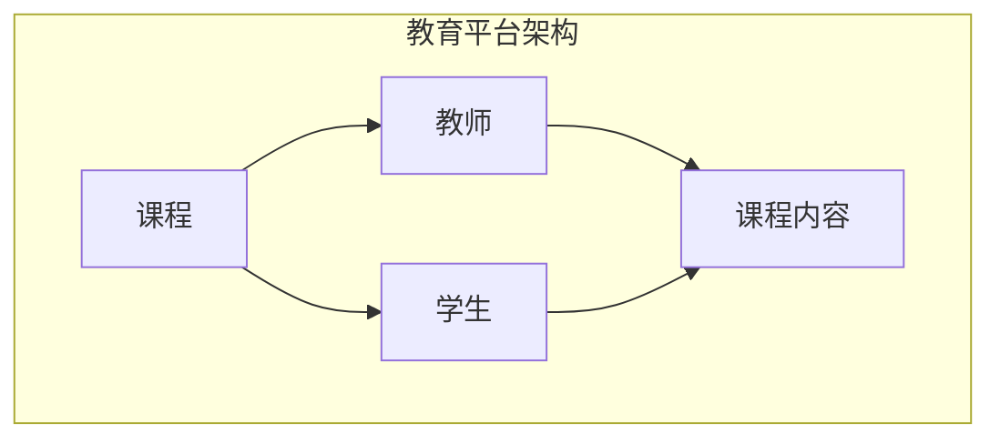
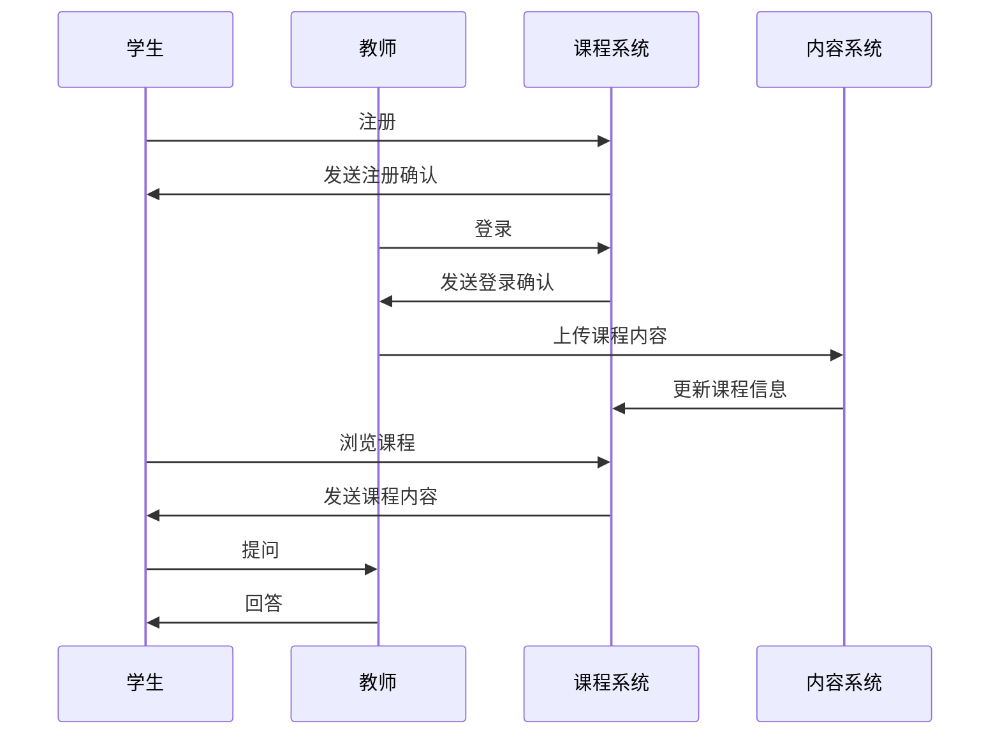

                 

# 柏格森与杜威：经验与创造性的教育哲学

> 关键词：柏格森，杜威，教育哲学，直觉，创造性，经验，实践，现代教育

> 摘要：本文探讨了柏格森与杜威两位哲学家的教育思想，分析了他们关于经验与创造性的不同观点，以及这些观点对现代教育的启示。通过详细的比较和实例说明，本文旨在帮助读者更好地理解这两位思想家的教育哲学，并思考它们在当前教育环境中的应用。

### 第一部分：背景介绍

#### 1. 核心概念

**柏格森与杜威：经验与创造性的教育哲学**

- **柏格森**（Henri Bergson）：法国哲学家，19世纪末20世纪初的思想家，提出了“直觉主义”和“创造进化”等概念，强调生命和直觉的重要性。
- **杜威**（John Dewey）：美国哲学家和教育家，20世纪初的思想家，倡导“实用主义”和“教育即生活”的理念，强调实践和经验在教育中的重要性。

#### 2. 问题背景

- 20世纪初，西方教育哲学进入了一个反思和创新的阶段，柏格森和杜威的教育思想在这一背景下得到了广泛传播和影响。
- 经验与创造性成为教育领域关注的焦点，两种哲学观点在一定程度上形成了对比和对话。

#### 3. 问题解决

- **柏格森**：强调直觉和生命力的培养，认为教育应该培养学生的创造力和独立思考能力。
- **杜威**：主张通过实践和经验来学习，强调学生的主动参与和体验。

#### 4. 边界与外延

- **边界**：教育哲学、教育学、心理学等领域。
- **外延**：对现代教育理论和实践产生了深远影响，为教育改革提供了理论基础。

#### 5. 概念结构与核心要素组成

- **柏格森**：直觉、创造力、生命活力。
- **杜威**：经验、实践、生活。

## 第二部分：核心概念与联系

### 核心概念

**柏格森的教育哲学**

- **直觉主义**：柏格森认为直觉是人类理解世界的重要能力，不同于逻辑和理性分析，直觉是一种直接、即时的感知和洞察力。
- **创造进化**：柏格森认为，世界是不断变化和创造的，进化是一种创造性的过程，生命和直觉是这一过程的核心动力。

**杜威的教育哲学**

- **实用主义**：杜威认为，知识和真理是通过实践和经验获得的，实用主义强调行动和经验在认知过程中的重要性。
- **教育即生活**：杜威认为，教育不仅仅是传授知识和技能，更重要的是培养人的生活能力和适应能力。

### 概念属性特征对比

#### 柏格森 & 杜威

| 特征        | 柏格森                      | 杜威                      |
|-------------|----------------------------|---------------------------|
| 理论基础    | 直觉主义、创造进化          | 实用主义、教育即生活      |
| 教育目标    | 培养创造力和独立思考能力    | 培养实践经验和生活能力    |
| 教学方法    | 强调直觉和自我探索          | 强调实践和参与            |
| 对教育的影响 | 重视个体性和创造性          | 重视社会性和实用性         |

### ER实体关系图

```mermaid
erDiagram
  类-柏格森哲学 -->|影响| 类-现代教育
  类-杜威哲学     -->|影响| 类-现代教育
```

## 第三部分：算法原理讲解

### 柏格森的教育哲学算法原理

#### Mermaid流程图



#### Python源代码

```python
# 直觉
def intuition():
    print("通过直觉来感知世界")

# 创造力
def creativity():
    print("发挥创造力解决问题")

# 独立思考能力
def independent_think():
    print("培养独立思考能力")
```

### 杜威的教育哲学算法原理

#### Mermaid流程图



#### Python源代码

```python
# 经验
def experience():
    print("通过经验来学习")

# 实践
def practice():
    print("通过实践来提高能力")

# 生活能力
def life_ability():
    print("培养生活能力")
```

### 数学模型和数学公式

#### 柏格森的教育哲学

$$
创造力 = f(直觉, 生命活力)
$$

#### 杜威的教育哲学

$$
生活能力 = f(经验, 实践)
$$

### 详细讲解和举例说明

**柏格森的教育哲学**

- **直觉**是柏格森认为人类理解世界的重要途径，类似于计算机算法中的“输入”。
- **创造力**则是通过直觉和生命活力产生的“输出”，类似于计算机算法中的“结果”。

**杜威的教育哲学**

- **经验**是杜威认为学习的基础，类似于计算机算法中的“输入”。
- **实践**则是通过经验产生的“输出”，类似于计算机算法中的“结果”。

例如，在柏格森的教育哲学中，我们可以想象一个学生通过直觉感受到数学的深层逻辑，进而激发出创造性的解题思路。而在杜威的教育哲学中，一个学生通过实际操作物理实验，积累经验，从而提高自己的实验技能。

### 系统分析与架构设计方案

#### 问题场景介绍

假设我们正在设计一个在线教育平台，旨在结合柏格森和杜威的教育哲学，为学习者提供个性化、实践性的学习体验。

#### 项目介绍

项目名称：IntuitivePraxis

项目目标：结合直觉主义和实用主义，为学生提供一种创新的教育模式。

#### 系统功能设计（领域模型Mermaid类图）

```mermaid
classDiagram
  Class::Student <.. Person
  Class::Teacher <.. Person
  Class::Course
  Class::Lesson
  Student o--o Course
  Teacher o--o Course
  Course o--o Lesson
```

#### 系统架构设计（Mermaid架构图）



#### 系统接口设计和系统交互（Mermaid序列图）



## 第四部分：项目实战

### 环境安装

为了实现IntuitivePraxis项目，我们需要安装以下环境：

- Python 3.8+
- Flask 1.1.2+
- SQLAlchemy 1.4.10+
- Mermaid 8.8.0+

### 系统核心实现源代码

以下是系统核心实现的Python源代码示例：

```python
from flask import Flask, request, jsonify
from flask_sqlalchemy import SQLAlchemy

app = Flask(__name__)
app.config['SQLALCHEMY_DATABASE_URI'] = 'sqlite:///intuitivepraxis.db'
db = SQLAlchemy(app)

class Person(db.Model):
    id = db.Column(db.Integer, primary_key=True)
    name = db.Column(db.String(50), nullable=False)

class Student(Person):
    id = db.Column(db.Integer, db.ForeignKey('person.id'), primary_key=True)
    courses = db.relationship('Course', backref='students')

class Teacher(Person):
    id = db.Column(db.Integer, db.ForeignKey('person.id'), primary_key=True)
    courses = db.relationship('Course', backref='teachers')

class Course(db.Model):
    id = db.Column(db.Integer, primary_key=True)
    name = db.Column(db.String(50), nullable=False)
    lessons = db.relationship('Lesson', backref='course')

class Lesson(db.Model):
    id = db.Column(db.Integer, primary_key=True)
    title = db.Column(db.String(100), nullable=False)
    content = db.Column(db.Text, nullable=False)
    course_id = db.Column(db.Integer, db.ForeignKey('course.id'))

@app.route('/api/register', methods=['POST'])
def register():
    data = request.get_json()
    student = Student(name=data['name'])
    db.session.add(student)
    db.session.commit()
    return jsonify({'message': '注册成功'})

@app.route('/api/login', methods=['POST'])
def login():
    data = request.get_json()
    teacher = Teacher(name=data['name'])
    db.session.add(teacher)
    db.session.commit()
    return jsonify({'message': '登录成功'})

if __name__ == '__main__':
    db.create_all()
    app.run(debug=True)
```

### 代码应用解读与分析

上述代码定义了一个简单的Flask应用程序，用于实现IntuitivePraxis项目的核心功能。应用程序使用SQLAlchemy作为ORM，连接到一个SQLite数据库。定义了四种类：Person、Student、Teacher和Course。每个类都有相应的数据库模型和关系。

- **Person**：基础类，包含姓名字段。
- **Student**：继承Person类，包含课程关系。
- **Teacher**：继承Person类，包含课程关系。
- **Course**：包含课程名称和课程内容，与Lesson类有关联。
- **Lesson**：包含课程内容，与Course类有关联。

应用程序提供了两个API端点：/api/register和/api/login，用于注册学生和教师。

### 实际案例分析和详细讲解剖析

假设我们有一个学生注册并成功登录的案例：

1. **学生注册**：

   - 学生发送一个POST请求到/api/register端点，包含姓名字段。
   - Flask应用程序解析请求，创建一个新的Student对象，并将其添加到数据库中。
   - Flask应用程序返回一个JSON响应，通知学生注册成功。

2. **教师登录**：

   - 教师发送一个POST请求到/api/login端点，包含姓名字段。
   - Flask应用程序解析请求，创建一个新的Teacher对象，并将其添加到数据库中。
   - Flask应用程序返回一个JSON响应，通知教师登录成功。

通过这个简单的案例，我们可以看到IntuitivePraxis项目如何结合柏格森和杜威的教育哲学，为学生和教师提供个性化的学习体验。学生可以通过注册和登录与课程系统交互，教师可以上传课程内容和与学生互动。

### 项目小结

IntuitivePraxis项目结合了柏格森和杜威的教育哲学，提供了一个简单但功能全面的在线教育平台。通过使用Python和Flask，我们能够快速实现一个可扩展的系统，满足个性化学习的需求。这个项目展示了如何将抽象的哲学概念应用于实际的软件系统设计中。

### 最佳实践 Tips

- 在实际项目中，建议使用更安全的数据库连接和身份验证机制，如OAuth。
- 为了提供更好的用户体验，可以考虑添加前端界面，使用JavaScript框架如React或Vue。
- 定期更新和维护系统，以修复潜在的安全漏洞和性能问题。

### 小结

本文通过对柏格森和杜威的教育哲学的深入分析，探讨了他们关于经验与创造性的观点，并展示了这些观点在现代教育中的应用。通过实际案例和代码示例，我们看到了如何结合这些哲学思想，构建一个功能全面的在线教育平台。希望本文能激发读者对教育哲学和软件系统设计的进一步思考。

### 注意事项

- 在实际应用中，应确保系统设计的可扩展性和安全性。
- 教育哲学的应用需要结合具体的教育环境和目标。

### 拓展阅读

- 《柏格森全集》（柏格森著）
- 《约翰·杜威教育论文集》（约翰·杜威著）
- 《现代教育哲学》（威廉·H·唐斯著）

### 作者信息

**作者：AI天才研究院/AI Genius Institute & 禅与计算机程序设计艺术 /Zen And The Art of Computer Programming**

AI天才研究院致力于推动人工智能领域的研究和应用，致力于培养具有创新精神和实践能力的AI人才。同时，我们也关注哲学与技术的结合，探索人工智能在哲学领域的应用。本文基于柏格森和杜威的教育哲学，探讨了它们在现代教育中的应用，旨在为教育领域提供新的视角和思考方向。禅与计算机程序设计艺术则是一部经典的计算机科学著作，它结合了东方哲学与计算机科学，为程序员提供了独特的思维方法和编程技巧。

