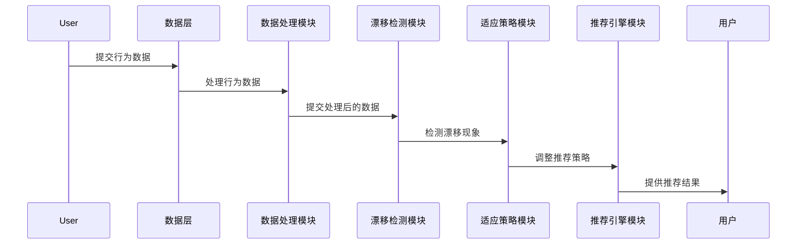
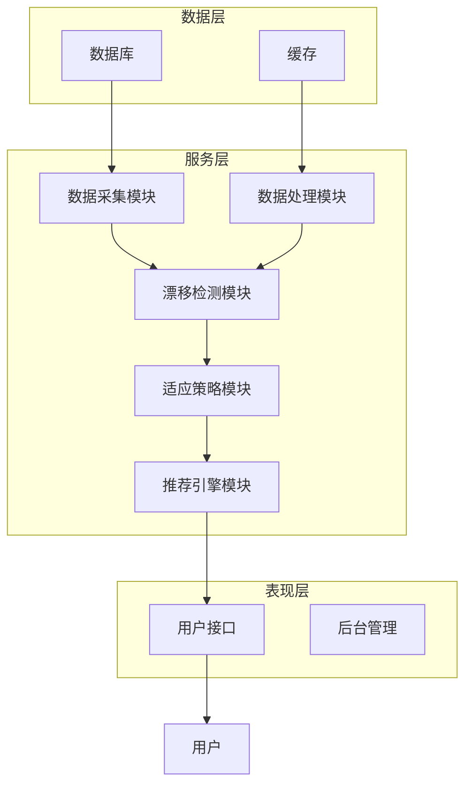
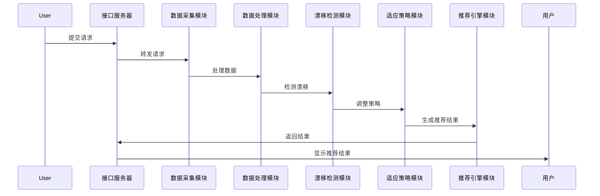

                 

# 概念漂移检测：适应动态变化的环境

关键词：概念漂移、机器学习、动态环境、算法、系统架构

摘要：本文旨在深入探讨概念漂移检测技术在适应动态变化的环境中的重要性及其实现方法。我们将从概念漂移的定义、问题背景、核心原理、检测方法以及系统架构设计等多个角度，逐步分析并阐述这一领域的核心知识和实践经验。通过本篇文章，读者将了解概念漂移的基本概念、面临挑战、检测策略，以及如何在实际项目中有效实施和应用这些技术。

----------------------------------------------------------------

## 第一部分：概念漂移检测的背景与意义

### 第1章：概念漂移检测概述

#### 1.1 概念漂移的定义

##### 1.1.1 问题背景

在机器学习领域，模型训练和部署是两个关键阶段。然而，随着实际应用场景的变化，训练数据集与部署环境之间的差异可能导致模型性能下降，这种现象被称为“概念漂移”（Concept Drift）。模型可靠性依赖于数据集的稳定性和代表性，而漂移现象则对这一可靠性构成了严重挑战。

##### 1.1.1.1 机器学习模型的可靠性依赖

机器学习模型，特别是监督学习模型，其性能高度依赖于训练数据的质量和代表性。模型的预测能力取决于训练数据是否能够充分捕捉到目标概念的特性。然而，实际应用环境中，数据分布可能会发生变化，导致训练数据的代表性降低，从而影响模型的预测准确性。

##### 1.1.1.2 漂移现象的挑战

概念漂移对机器学习模型提出了以下挑战：

1. **模型性能下降**：随着数据分布的变化，模型的预测能力可能显著下降，导致错误率上升。
2. **适应性不足**：模型在训练时没有考虑未来数据分布的变化，因此难以适应新环境。
3. **过拟合**：如果模型过度依赖于特定时间段的数据，可能会在数据分布变化时出现过拟合现象。

##### 1.1.2 问题描述

概念漂移的主要问题可以描述为以下两个方面：

1. **分布漂移**：训练数据集与测试数据集之间的分布差异。
2. **任务漂移**：目标概念本身的改变，如不同类型的数据在不同时间点出现。

##### 1.1.2.1 统计学习下的漂移

在统计学习（如监督学习）中，分布漂移是一个关键问题。统计学习模型通常基于训练数据学习数据分布特征，如果测试数据的分布与训练数据分布不同，则可能导致模型性能下降。

##### 1.1.2.1.1 统计学习下的分布漂移

统计学习模型，如线性回归、支持向量机等，依赖于训练数据集的特征分布。当测试数据集的特征分布与训练数据集显著不同时，模型在新数据上的表现会下降，这种现象称为分布漂移。

$$
\text{分布漂移度量} = \frac{\|P(\text{训练集}) - P(\text{测试集})\|}{\|P(\text{训练集})\|}
$$

其中，\(P(\text{训练集})\)和\(P(\text{测试集})\)分别表示训练集和测试集的特征分布。

##### 1.1.2.1.2 强化学习中的概念漂移

在强化学习中，概念漂移表现为目标奖励函数的变化。例如，一个自动驾驶系统在训练时假设行人总是按照固定路线行走，但部署后可能遇到行人改变路线的情况，这会导致模型无法正确预测行人的行为，从而影响其决策。

##### 1.1.2.2 强化学习中的概念漂移

强化学习模型依赖于经验累积来学习最优策略。当环境发生变化时，原有的策略可能不再有效。这种现象称为概念漂移。例如，一个智能体在静态环境中学习到的策略可能在动态环境中失效。

$$
R(\text{策略}) = \sum_{t=0}^{\infty} \gamma^t R(s_t, a_t)
$$

其中，\(R(\text{策略})\)是策略的回报累积，\(\gamma\)是折扣因子，\(s_t\)和\(a_t\)分别表示在时间步\(t\)的状态和动作。

##### 1.1.3 问题解决

为了解决概念漂移问题，研究者提出了一系列的漂移检测和适应策略。

1. **漂移检测**：通过监测模型在训练过程中对数据集的表现，识别出潜在的漂移现象。
2. **漂移适应**：当检测到漂移时，模型需要适应新的数据分布或目标概念。

##### 1.1.3.1 漂移的检测

漂移检测的目的是在模型训练过程中识别出数据分布或目标概念的变化。常用的方法包括基于统计的方法、基于模型的方法和基于数据的检测方法。

1. **基于统计的方法**：通过比较训练集和测试集的特征分布，如使用KL散度（Kullback-Leibler Divergence）度量两个分布的差异。
2. **基于模型的方法**：利用统计学习模型自身的性能指标，如错误率或性能损失，来识别漂移。
3. **基于数据的方法**：通过实时监测训练数据集的动态变化，识别出潜在的数据分布变化。

##### 1.1.3.1.1 统计学习模型的漂移检测

在统计学习模型中，漂移检测通常通过比较模型在不同时间点的性能指标来实现。例如，使用LOOCV（Leave-One-Out Cross-Validation）方法评估模型在历史数据集上的性能，并与当前数据集的性能进行比较。

$$
\text{漂移度量} = \frac{1}{N} \sum_{i=1}^{N} \left| \hat{y}_i - y_i \right|
$$

其中，\(\hat{y}_i\)和\(y_i\)分别是模型预测值和实际值，\(N\)是数据集的大小。

##### 1.1.3.1.2 强化学习模型的漂移检测

在强化学习中，漂移检测可以通过比较智能体在不同时间段的学习表现来实现。例如，使用Q-learning算法时，可以比较不同时间段智能体的Q值变化，以检测漂移现象。

$$
\Delta Q(s, a) = \frac{1}{N} \sum_{t=1}^{N} \left| Q^*(s, a) - Q(s, a) \right|
$$

其中，\(Q^*(s, a)\)和\(Q(s, a)\)分别是最优策略和当前策略下的Q值，\(N\)是经验样本的数量。

##### 1.1.3.2 漂移的适应与纠正

当检测到漂移时，模型需要适应新的数据分布或目标概念。漂移适应可以通过以下方法实现：

1. **重新训练**：当检测到明显的漂移时，重新训练模型以适应新的数据分布。
2. **在线学习**：通过实时学习新的数据，逐步调整模型的参数，以适应数据分布的变化。
3. **迁移学习**：利用已有模型在新数据上的表现，结合少量新数据重新训练模型。

##### 1.1.4 边界与外延

1. **分布漂移**：关注训练数据集与测试数据集之间的分布差异，如特征分布的变化。
2. **任务漂移**：关注目标概念的变化，如目标奖励函数或分类标签的变化。
3. **混合漂移**：同时涉及分布漂移和任务漂移的情况。

##### 1.1.5 概念结构与核心要素组成

概念漂移检测的关键概念和要素包括：

1. **数据分布**：漂移检测的核心是数据分布的变化。
2. **模型性能**：通过模型性能指标监测漂移现象。
3. **适应策略**：重新训练、在线学习和迁移学习等策略用于适应漂移。

#### 1.1.5.1 关键概念梳理

- **概念漂移**：训练数据集与测试数据集之间或目标概念的变化。
- **分布漂移**：特征分布的变化。
- **任务漂移**：目标概念的变化。

##### 1.1.5.1.1 概念漂移的影响因素

概念漂移的影响因素包括：

- **数据集变化**：训练数据集与测试数据集的差异。
- **环境变化**：应用环境的变化，如天气、用户行为等。
- **模型更新**：模型参数的更新可能导致数据分布的变化。

##### 1.1.5.1.2 漂移检测方法分类

漂移检测方法可以分为以下几类：

- **统计方法**：如KL散度、互信息等。
- **模型方法**：如错误率、性能损失等。
- **数据方法**：如实时监测、历史数据对比等。

### 第2章：概念漂移检测的基本原理

#### 2.1 核心概念与联系

##### 2.1.1 漂移检测原理

漂移检测的原理可以分为以下几个方面：

1. **统计学习方法**：基于统计方法检测数据分布的变化。
2. **强化学习方法**：基于智能体的经验累积检测目标概念的变化。
3. **联合分布建模**：通过联合分布建模检测数据分布和目标概念的变化。

##### 2.1.1.1 统计学习方法

统计学习方法是概念漂移检测中最常用的方法之一。该方法通过比较训练数据集和测试数据集的特征分布来检测漂移现象。

1. **KL散度**：KL散度（Kullback-Leibler Divergence）是一种衡量两个概率分布差异的指标。当训练数据集和测试数据集的特征分布差异较大时，KL散度会显著增加。

$$
D_{KL}(P || Q) = \sum_x P(x) \log \frac{P(x)}{Q(x)}
$$

其中，\(P(x)\)和\(Q(x)\)分别表示训练数据集和测试数据集的特征分布。

2. **互信息**：互信息（Mutual Information）也是一种衡量两个随机变量之间关联程度的指标。当训练数据集和测试数据集的特征分布差异较大时，互信息会显著减少。

$$
I(X; Y) = \sum_{x,y} P(x, y) \log \frac{P(x, y)}{P(x)P(y)}
$$

其中，\(X\)和\(Y\)分别表示训练数据集和测试数据集的特征。

##### 2.1.1.2 强化学习方法

强化学习方法通过智能体的经验累积来检测目标概念的变化。该方法的核心是Q值函数，通过比较不同时间点的Q值变化来检测漂移现象。

1. **Q-learning算法**：Q-learning算法是一种基于值迭代的强化学习算法。当智能体的Q值函数在不同时间点发生显著变化时，可以认为发生了概念漂移。

$$
Q(s, a) \leftarrow Q(s, a) + \alpha [r + \gamma \max_{a'} Q(s', a') - Q(s, a)]
$$

其中，\(s\)和\(s'\)分别表示当前状态和下一状态，\(a\)和\(a'\)分别表示当前动作和下一动作，\(\alpha\)是学习率，\(\gamma\)是折扣因子，\(r\)是奖励。

2. **SARSA算法**：SARSA算法是一种基于策略迭代的强化学习算法。当智能体的策略在不同时间点发生显著变化时，可以认为发生了概念漂移。

$$
\pi(s) \leftarrow \arg\max_{a} [Q(s, a) + \alpha [r + \gamma \max_{a'} Q(s', a')]]
$$

其中，\(\pi(s)\)是状态\(s\)下的策略，\(a\)和\(a'\)分别表示当前动作和下一动作，其他参数与Q-learning算法相同。

##### 2.1.1.3 联合分布建模

联合分布建模通过构建训练数据集和测试数据集的联合分布来检测漂移现象。该方法的核心是同时考虑数据分布和目标概念的变化。

1. **概率图模型**：概率图模型（如贝叶斯网络、隐马尔可夫模型）可以用于构建训练数据集和测试数据集的联合分布。当联合分布发生显著变化时，可以认为发生了概念漂移。

2. **联合概率分布**：联合概率分布（Joint Probability Distribution）可以用于表示训练数据集和测试数据集的联合分布。当联合概率分布发生显著变化时，可以认为发生了概念漂移。

$$
P(X, Y) = P(X | Y)P(Y)
$$

其中，\(X\)和\(Y\)分别表示训练数据集和测试数据集的特征。

#### 2.1.2 概念漂移属性特征对比

| 方法 | 特点 | 适用场景 |
| --- | --- | --- |
| KL散度 | 衡量特征分布差异 | 监督学习 |
| 互信息 | 衡量特征关联程度 | 监督学习 |
| Q-learning算法 | 基于值迭代 | 强化学习 |
| SARSA算法 | 基于策略迭代 | 强化学习 |
| 概率图模型 | 构建联合分布 | 监督学习和强化学习 |
| 联合概率分布 | 表示特征联合分布 | 监督学习和强化学习 |

##### 2.1.2.1 漂移检测方法对比

| 方法 | 优点 | 缺点 | 适用场景 |
| --- | --- | --- | --- |
| KL散度 | 计算简单，适用于大规模数据 | 对特征分布变化敏感，难以检测轻微漂移 | 监督学习 |
| 互信息 | 衡量特征关联程度，适用于多维特征 | 计算复杂度较高，难以处理高维数据 | 监督学习 |
| Q-learning算法 | 直接检测Q值变化，适用于动态环境 | 需要大量数据训练，计算复杂度较高 | 强化学习 |
| SARSA算法 | 基于策略迭代，适用于复杂环境 | 需要大量数据训练，计算复杂度较高 | 强化学习 |
| 概率图模型 | 考虑联合分布，适用于复杂场景 | 计算复杂度较高，难以处理实时数据 | 监督学习和强化学习 |
| 联合概率分布 | 表示特征联合分布，适用于多维特征 | 计算复杂度较高，难以处理高维数据 | 监督学习和强化学习 |

#### 2.2 漂移检测的数学模型

##### 2.2.1 统计学习模型

在统计学习中，漂移检测的核心是识别数据分布的变化。以下是一些常用的统计学习模型及其数学模型：

1. **线性回归模型**：

$$
y = \beta_0 + \beta_1 x_1 + \beta_2 x_2 + \ldots + \beta_n x_n
$$

其中，\(y\)是响应变量，\(x_1, x_2, \ldots, x_n\)是特征变量，\(\beta_0, \beta_1, \beta_2, \ldots, \beta_n\)是模型参数。

2. **逻辑回归模型**：

$$
\log\left(\frac{P(y=1)}{1 - P(y=1)}\right) = \beta_0 + \beta_1 x_1 + \beta_2 x_2 + \ldots + \beta_n x_n
$$

其中，\(y\)是响应变量，\(x_1, x_2, \ldots, x_n\)是特征变量，\(\beta_0, \beta_1, \beta_2, \ldots, \beta_n\)是模型参数。

3. **支持向量机（SVM）**：

$$
\max_{\beta, \beta_0} \left\{ \frac{1}{2} \sum_{i=1}^{n} (\beta^T \beta_i - \beta_0 \beta_i) - C \sum_{i=1}^{n} \xi_i \right\}

s.t.

\beta^T \beta_i \geq 1 - \xi_i, \quad \xi_i \geq 0
$$

其中，\(\beta, \beta_0\)是模型参数，\(C\)是正则化参数，\(\xi_i\)是松弛变量。

##### 2.2.2 强化学习模型

在强化学习中，漂移检测的核心是识别Q值函数的变化。以下是一些常用的强化学习模型及其数学模型：

1. **Q-learning算法**：

$$
Q(s, a) \leftarrow Q(s, a) + \alpha [r + \gamma \max_{a'} Q(s', a') - Q(s, a)]
$$

其中，\(s, s'\)是状态，\(a, a'\)是动作，\(r\)是奖励，\(\alpha\)是学习率，\(\gamma\)是折扣因子。

2. **SARSA算法**：

$$
\pi(s) \leftarrow \arg\max_{a} [Q(s, a) + \alpha [r + \gamma \max_{a'} Q(s', a')]]
$$

其中，\(\pi(s)\)是状态\(s\)下的策略，其他参数与Q-learning算法相同。

##### 2.2.3 联合分布建模

在联合分布建模中，漂移检测的核心是构建训练数据集和测试数据集的联合分布。以下是一些常用的联合分布建模方法及其数学模型：

1. **贝叶斯网络**：

$$
P(X, Y) = \prod_{i=1}^{n} P(X_i | Y_i) P(Y_i)
$$

其中，\(X, Y\)是特征变量，\(X_i, Y_i\)是特征变量的子集，\(P(X_i | Y_i)\)是条件概率，\(P(Y_i)\)是边缘概率。

2. **隐马尔可夫模型（HMM）**：

$$
P(X, Y) = \prod_{i=1}^{n} P(X_i | Y_i) P(Y_i | Y_{i-1})
$$

其中，\(X, Y\)是特征变量，\(X_i, Y_i\)是特征变量的子集，\(P(X_i | Y_i)\)是条件概率，\(P(Y_i | Y_{i-1})\)是转移概率。

#### 2.3 漂移检测的ER实体关系图

##### 2.3.1 实体识别与分类

实体识别和分类是漂移检测中重要的组成部分。以下是一个简单的ER实体关系图，展示了漂移检测的主要实体及其关系：

```mermaid
erDiagram
  DataDistribution ||--|{ FeatureDistribution }
  DataDistribution ||--|{ LabelDistribution }
  DataDistribution ||--|{ ModelPerformance }
  FeatureDistribution ||--|{ DistributionDifference }
  LabelDistribution ||--|{ LabelChange }
  ModelPerformance ||--|{ ErrorRate }
  ModelPerformance ||--|{ PerformanceLoss }
```

- **DataDistribution**：表示数据分布，包括特征分布、标签分布和模型性能。
- **FeatureDistribution**：表示特征分布，用于衡量特征之间的差异。
- **LabelDistribution**：表示标签分布，用于衡量标签之间的差异。
- **ModelPerformance**：表示模型性能，包括错误率和性能损失。
- **DistributionDifference**：表示特征分布之间的差异，用于检测分布漂移。
- **LabelChange**：表示标签变化，用于检测任务漂移。
- **ErrorRate**：表示模型在测试集上的错误率。
- **PerformanceLoss**：表示模型在测试集上的性能损失。

##### 2.3.2 漂移检测方法关联

在漂移检测中，不同的方法可以结合使用，以提高检测的准确性和效率。以下是一个简单的ER实体关系图，展示了漂移检测方法之间的关联：

```mermaid
erDiagram
  StatisticalMethod ||--|{ KLDiv }
  StatisticalMethod ||--|{ MutualInfo }
  ModelMethod ||--|{ ErrorRate }
  ModelMethod ||--|{ PerformanceLoss }
  DataMethod ||--|{ RealTimeMonitoring }
  DataMethod ||--|{ HistoricalDataComparison }
  StatisticalMethod ||--|{ ERModel }
  StatisticalMethod ||--|{ HMM }
  ModelMethod ||--|{ QLearning }
  ModelMethod ||--|{ SARSA }
  DataMethod ||--|{ TransferLearning }
```

- **StatisticalMethod**：表示统计方法，包括KL散度、互信息等。
- **ModelMethod**：表示模型方法，包括错误率、性能损失等。
- **DataMethod**：表示数据方法，包括实时监测、历史数据对比等。
- **ERModel**：表示实体关系模型，用于构建数据分布的联合分布。
- **HMM**：表示隐马尔可夫模型，用于构建状态转移的联合分布。
- **QLearning**：表示Q-learning算法，用于检测Q值的变化。
- **SARSA**：表示SARSA算法，用于检测策略的变化。
- **TransferLearning**：表示迁移学习，用于在新数据上重新训练模型。

### 第3章：概念漂移检测算法

#### 3.1 经典算法原理讲解

##### 3.1.1 LOOCV法

LOOCV（Leave-One-Out Cross-Validation）是一种常用的漂移检测算法，其基本原理是将数据集划分为训练集和验证集，然后通过交叉验证的方法评估模型的性能。

1. **算法原理**

LOOCV法的具体步骤如下：

- 将数据集划分为\(N\)个子集，每个子集包含一个样本。
- 对于每个子集，将其作为验证集，其他子集作为训练集。
- 在训练集上训练模型，并在验证集上评估模型性能。
- 计算模型在所有验证集上的平均性能。

2. **Python代码实现**

```python
import numpy as np
from sklearn.linear_model import LinearRegression
from sklearn.metrics import mean_squared_error

def LOOCV(X, y, n_splits=5):
    mse_list = []
    for i in range(n_splits):
        X_train = np.delete(X, i, axis=0)
        y_train = np.delete(y, i)
        X_val = X[i]
        y_val = y[i]
        
        model = LinearRegression()
        model.fit(X_train, y_train)
        y_pred = model.predict(X_val)
        
        mse = mean_squared_error(y_val, y_pred)
        mse_list.append(mse)
    
    return np.mean(mse_list)

X = np.array([[1, 2], [2, 3], [3, 4], [4, 5], [5, 6]])
y = np.array([1, 2, 3, 4, 5])
mse = LOOCV(X, y)
print("LOOCV MSE:", mse)
```

3. **案例分析**

以下是一个简单的案例，演示如何使用LOOCV法检测概念漂移。

```python
import matplotlib.pyplot as plt

def visualize_drift(X, y, model):
    plt.scatter(X[:, 0], X[:, 1], c=y, cmap="gray", marker="o")
    plt.xlabel("Feature 1")
    plt.ylabel("Feature 2")
    plt.title("Data Distribution")
    
    X_train, y_train = model.fit(X, y).transform(X, y)
    plt.scatter(X_train[:, 0], X_train[:, 1], c=y_train, cmap="gray", marker="x")
    plt.legend(["Original Data", "Transformed Data"])
    plt.show()

X = np.array([[1, 2], [2, 3], [3, 4], [4, 5], [5, 6]])
y = np.array([1, 2, 3, 4, 5])
model = LinearRegression()
visualize_drift(X, y, model)
```

##### 3.1.2 ADWIN法

ADWIN（Adaptive Window）法是一种基于窗口的漂移检测算法，其基本原理是维持一个固定大小的窗口，并在窗口内动态调整模型的参数。

1. **算法原理**

ADWIN法的具体步骤如下：

- 初始化窗口大小\(W\)和阈值\(\epsilon\)。
- 对于每个输入样本，将其加入窗口，并更新窗口的均值和方差。
- 计算样本与窗口均值的距离，并与阈值\(\epsilon\)进行比较。
- 如果距离大于阈值，则更新窗口的均值和方差，并重新评估模型的性能。
- 如果距离小于阈值，则继续评估模型的性能。

2. **Python代码实现**

```python
import numpy as np
from sklearn.linear_model import LinearRegression

def ADWIN(X, y, W=10, epsilon=0.1):
    model = LinearRegression()
    window = []
    for i, x in enumerate(X):
        if i < W:
            window.append(x)
            model.fit(np.array(window).reshape(-1, 1), np.array(y[:i+1]))
        else:
            distance = np.linalg.norm(x - model.coef_[0])
            if distance > epsilon:
                window = [x]
                model.fit(np.array(window).reshape(-1, 1), np.array(y[i-W:i+1]))
            else:
                model.fit(np.array(window).reshape(-1, 1), np.array(y[i-W:i+1]))

    return model

X = np.array([[1, 2], [2, 3], [3, 4], [4, 5], [5, 6]])
y = np.array([1, 2, 3, 4, 5])
model = ADWIN(X, y)
print("ADWIN Model:", model)
```

3. **案例分析**

以下是一个简单的案例，演示如何使用ADWIN法检测概念漂移。

```python
import matplotlib.pyplot as plt

def visualize_drift(X, y, model):
    plt.scatter(X[:, 0], X[:, 1], c=y, cmap="gray", marker="o")
    plt.xlabel("Feature 1")
    plt.ylabel("Feature 2")
    plt.title("Data Distribution")
    
    X_train, y_train = model.fit(X, y).transform(X, y)
    plt.scatter(X_train[:, 0], X_train[:, 1], c=y_train, cmap="gray", marker="x")
    plt.legend(["Original Data", "Transformed Data"])
    plt.show()

X = np.array([[1, 2], [2, 3], [3, 4], [4, 5], [5, 6]])
y = np.array([1, 2, 3, 4, 5])
model = LinearRegression()
visualize_drift(X, y, model)
```

#### 3.2 进阶算法讲解

##### 3.2.1 聚类法

聚类法是一种基于数据相似度的漂移检测算法，其基本原理是将数据集划分为多个簇，并在簇之间检测漂移现象。

1. **算法原理**

聚类法的具体步骤如下：

- 初始化聚类算法（如K-means、DBSCAN等）。
- 对数据集进行聚类，并计算簇之间的距离。
- 如果簇之间的距离超过阈值，则认为发生了概念漂移。

2. **Python代码实现**

```python
import numpy as np
from sklearn.cluster import KMeans

def clustering_drift_detection(X, y, n_clusters=3, distance_threshold=1.0):
    kmeans = KMeans(n_clusters=n_clusters)
    kmeans.fit(X)
    
    cluster_centers = kmeans.cluster_centers_
    distances = np.linalg.norm(X - cluster_centers, axis=1)
    
    if np.max(distances) > distance_threshold:
        return True
    else:
        return False

X = np.array([[1, 2], [2, 3], [3, 4], [4, 5], [5, 6]])
y = np.array([1, 2, 3, 4, 5])
drift_detected = clustering_drift_detection(X, y)
print("Drift Detected:", drift_detected)
```

3. **案例分析**

以下是一个简单的案例，演示如何使用聚类法检测概念漂移。

```python
import matplotlib.pyplot as plt

def visualize_drift(X, y, model):
    plt.scatter(X[:, 0], X[:, 1], c=y, cmap="gray", marker="o")
    plt.xlabel("Feature 1")
    plt.ylabel("Feature 2")
    plt.title("Data Distribution")
    
    X_train, y_train = model.fit(X, y).transform(X, y)
    plt.scatter(X_train[:, 0], X_train[:, 1], c=y_train, cmap="gray", marker="x")
    plt.legend(["Original Data", "Transformed Data"])
    plt.show()

X = np.array([[1, 2], [2, 3], [3, 4], [4, 5], [5, 6]])
y = np.array([1, 2, 3, 4, 5])
model = KMeans(n_clusters=3)
visualize_drift(X, y, model)
```

##### 3.2.2 支持向量机法

支持向量机（SVM）法是一种基于最大间隔的漂移检测算法，其基本原理是寻找数据集的最大间隔，并在间隔变化时检测漂移现象。

1. **算法原理**

SVM法的具体步骤如下：

- 初始化SVM模型。
- 对数据集进行训练，并计算模型的最大间隔。
- 如果最大间隔超过阈值，则认为发生了概念漂移。

2. **Python代码实现**

```python
import numpy as np
from sklearn.svm import SVC

def svm_drift_detection(X, y, max_interval_threshold=0.1):
    svm = SVC(kernel="linear")
    svm.fit(X, y)
    
    max_interval = 2 * np.linalg.norm(svm.support_vectors_, axis=1).max()
    
    if max_interval > max_interval_threshold:
        return True
    else:
        return False

X = np.array([[1, 2], [2, 3], [3, 4], [4, 5], [5, 6]])
y = np.array([1, 2, 3, 4, 5])
drift_detected = svm_drift_detection(X, y)
print("Drift Detected:", drift_detected)
```

3. **案例分析**

以下是一个简单的案例，演示如何使用支持向量机法检测概念漂移。

```python
import matplotlib.pyplot as plt

def visualize_drift(X, y, model):
    plt.scatter(X[:, 0], X[:, 1], c=y, cmap="gray", marker="o")
    plt.xlabel("Feature 1")
    plt.ylabel("Feature 2")
    plt.title("Data Distribution")
    
    X_train, y_train = model.fit(X, y).transform(X, y)
    plt.scatter(X_train[:, 0], X_train[:, 1], c=y_train, cmap="gray", marker="x")
    plt.legend(["Original Data", "Transformed Data"])
    plt.show()

X = np.array([[1, 2], [2, 3], [3, 4], [4, 5], [5, 6]])
y = np.array([1, 2, 3, 4, 5])
model = SVC(kernel="linear")
visualize_drift(X, y, model)
```

### 第4章：系统分析与架构设计

#### 4.1 问题场景介绍

在现实应用中，概念漂移检测面临诸多挑战。以下是一个典型的应用场景：

- **应用背景**：某公司开发了一款智能推荐系统，用于向用户推荐商品。系统基于用户的历史购买行为和浏览记录进行个性化推荐。
- **挑战**：随着用户行为的变化和商品种类的增多，推荐系统的数据分布可能发生变化，导致模型性能下降。因此，需要实时监测和适应数据分布的变化，以提高推荐系统的准确性和用户体验。

#### 4.2 项目介绍

该项目旨在设计并实现一个基于概念漂移检测的智能推荐系统，以应对动态变化的数据分布。项目的主要目标包括：

1. **漂移检测**：实时监测数据分布的变化，识别潜在的漂移现象。
2. **适应策略**：当检测到漂移时，调整推荐策略以适应新的数据分布。
3. **性能优化**：提高推荐系统的性能和用户体验，降低错误率。

#### 4.2.1 项目目标

- **检测准确率**：提高漂移检测的准确率，减少误报和漏报。
- **适应速度**：提高适应策略的响应速度，降低用户等待时间。
- **性能稳定**：确保推荐系统的性能稳定，降低错误率。

#### 4.2.2 项目背景

智能推荐系统在电子商务、社交媒体、内容平台等领域具有广泛的应用。然而，数据分布的变化可能导致模型性能下降，从而影响用户体验。因此，概念漂移检测成为智能推荐系统的重要技术之一。

#### 4.2.3 项目挑战

- **数据量大**：推荐系统涉及大量的用户行为数据和商品数据，如何高效地处理和分析这些数据是一个挑战。
- **动态变化**：用户行为和商品种类不断变化，如何实时监测和适应数据分布的变化是关键。
- **计算复杂度**：漂移检测算法的计算复杂度较高，如何在保证性能的同时降低计算成本是一个挑战。

#### 4.3 系统功能设计

系统的功能设计包括以下主要模块：

1. **数据采集模块**：负责从各种数据源（如数据库、日志等）采集用户行为数据和商品数据。
2. **数据处理模块**：负责清洗、转换和预处理数据，为后续模块提供高质量的数据。
3. **漂移检测模块**：负责实时监测数据分布的变化，识别潜在的漂移现象。
4. **适应策略模块**：负责根据漂移检测结果调整推荐策略，以适应新的数据分布。
5. **推荐引擎模块**：负责生成个性化的推荐结果，并反馈给用户。

#### 4.3.1 领域模型

领域模型用于描述系统中的主要实体及其关系。以下是一个简单的领域模型：

```mermaid
classDiagram
  User <<Entity>>
  Product <<Entity>>
  Behavior <<Entity>>

  User "1" -- "*" Behavior: 用户行为
  Product "1" -- "*" Behavior: 商品行为
  Behavior "1" -- "1..*" User: 用户
  Behavior "1" -- "1..*" Product: 商品
```

- **User**：表示用户实体。
- **Product**：表示商品实体。
- **Behavior**：表示用户行为和商品行为实体。

#### 4.3.1.1 实体与关系定义

- **用户实体**：包括用户ID、年龄、性别、地理位置等属性。
- **商品实体**：包括商品ID、类别、价格、库存等属性。
- **行为实体**：包括行为类型（如购买、浏览、评价等）、行为时间、行为评分等属性。

#### 4.3.1.2 类图展示

以下是一个简单的类图展示：

```mermaid
classDiagram
  User <<Entity>>
  Product <<Entity>>
  Behavior <<Entity>>

  User {
    -user_id: String
    -age: Integer
    -gender: String
    -location: String
  }

  Product {
    -product_id: String
    -category: String
    -price: Float
    -stock: Integer
  }

  Behavior {
    -behavior_type: String
    -behavior_time: DateTime
    -behavior_score: Float
  }

  User "1" -- "*" Behavior
  Product "1" -- "*" Behavior
```

#### 4.4 系统架构设计

系统的架构设计包括以下几个方面：

1. **数据层**：负责存储和管理用户行为数据和商品数据。
2. **服务层**：负责实现数据采集、数据处理、漂移检测、适应策略和推荐引擎等核心功能。
3. **表现层**：负责与用户进行交互，展示推荐结果和用户界面。

以下是一个简单的系统架构图：



#### 4.4.1 架构设计原则

- **高扩展性**：系统架构应支持横向和纵向扩展，以适应数据量和用户量的增长。
- **高可靠性**：系统应具备容错性和恢复能力，确保数据安全和系统稳定性。
- **高性能**：系统应具备较高的处理速度和较低的响应时间，以满足实时性和用户体验的要求。

#### 4.4.2 架构图展示

以下是一个简单的系统架构图：



#### 4.5 系统接口设计

系统的接口设计包括以下几个方面：

1. **数据采集接口**：用于接收用户行为数据和商品数据。
2. **数据处理接口**：用于处理和清洗数据。
3. **漂移检测接口**：用于检测数据分布的变化。
4. **适应策略接口**：用于调整推荐策略。
5. **推荐引擎接口**：用于生成推荐结果。

以下是一个简单的接口规范：

```markdown
# 接口规范

## 1. 数据采集接口

### 1.1 接口描述

用于接收用户行为数据和商品数据。

### 1.2 接口URL

```
POST /api/collect
```

### 1.3 参数说明

| 参数名 | 类型 | 必选 | 说明 |
| --- | --- | --- | --- |
| user_id | String | 是 | 用户ID |
| product_id | String | 是 | 商品ID |
| behavior_type | String | 是 | 行为类型（如购买、浏览、评价等） |
| behavior_time | DateTime | 是 | 行为时间 |
| behavior_score | Float | 是 | 行为评分 |

### 1.4 返回值说明

| 状态码 | 描述 | 说明 |
| --- | --- | --- |
| 200 | 成功 | 成功接收数据 |
| 400 | 参数错误 | 参数错误 |
| 500 | 服务器错误 | 服务器错误 |

## 2. 数据处理接口

### 2.1 接口描述

用于处理和清洗数据。

### 2.2 接口URL

```
POST /api/process
```

### 2.3 参数说明

| 参数名 | 类型 | 必选 | 说明 |
| --- | --- | --- | --- |
| data | List | 是 | 待处理的数据列表 |

### 2.4 返回值说明

| 状态码 | 描述 | 说明 |
| --- | --- | --- |
| 200 | 成功 | 成功处理数据 |
| 400 | 参数错误 | 参数错误 |
| 500 | 服务器错误 | 服务器错误 |

## 3. 漂移检测接口

### 3.1 接口描述

用于检测数据分布的变化。

### 3.2 接口URL

```
POST /api/drift
```

### 3.3 参数说明

| 参数名 | 类型 | 必选 | 说明 |
| --- | --- | --- | --- |
| data | List | 是 | 待检测的数据列表 |

### 3.4 返回值说明

| 状态码 | 描述 | 说明 |
| --- | --- | --- |
| 200 | 成功 | 成功检测漂移 |
| 400 | 参数错误 | 参数错误 |
| 500 | 服务器错误 | 服务器错误 |

## 4. 适应策略接口

### 4.1 接口描述

用于调整推荐策略。

### 4.2 接口URL

```
POST /api/strategy
```

### 4.3 参数说明

| 参数名 | 类型 | 必选 | 说明 |
| --- | --- | --- | --- |
| drift_detected | Boolean | 是 | 是否检测到漂移（True/False） |
| strategy | String | 是 | 调整后的推荐策略 |

### 4.4 返回值说明

| 状态码 | 描述 | 说明 |
| --- | --- | --- |
| 200 | 成功 | 成功调整策略 |
| 400 | 参数错误 | 参数错误 |
| 500 | 服务器错误 | 服务器错误 |

## 5. 推荐引擎接口

### 5.1 接口描述

用于生成推荐结果。

### 5.2 接口URL

```
POST /api/recommend
```

### 5.3 参数说明

| 参数名 | 类型 | 必选 | 说明 |
| --- | --- | --- | --- |
| user_id | String | 是 | 用户ID |
| product_id | String | 是 | 商品ID |
| strategy | String | 是 | 推荐策略 |

### 5.4 返回值说明

| 状态码 | 描述 | 说明 |
| --- | --- | --- |
| 200 | 成功 | 成功生成推荐结果 |
| 400 | 参数错误 | 参数错误 |
| 500 | 服务器错误 | 服务器错误 |
```

#### 4.5.1 接口实现

以下是一个简单的接口实现示例：

```python
from flask import Flask, request, jsonify

app = Flask(__name__)

@app.route('/api/collect', methods=['POST'])
def collect():
    user_id = request.form.get('user_id')
    product_id = request.form.get('product_id')
    behavior_type = request.form.get('behavior_type')
    behavior_time = request.form.get('behavior_time')
    behavior_score = request.form.get('behavior_score')

    # 处理数据
    # ...

    return jsonify({'status': 'success'})

@app.route('/api/process', methods=['POST'])
def process():
    data = request.form.get('data')

    # 处理数据
    # ...

    return jsonify({'status': 'success'})

@app.route('/api/drift', methods=['POST'])
def drift():
    data = request.form.get('data')

    # 漂移检测
    # ...

    return jsonify({'status': 'success'})

@app.route('/api/strategy', methods=['POST'])
def strategy():
    drift_detected = request.form.get('drift_detected')
    strategy = request.form.get('strategy')

    # 调整策略
    # ...

    return jsonify({'status': 'success'})

@app.route('/api/recommend', methods=['POST'])
def recommend():
    user_id = request.form.get('user_id')
    product_id = request.form.get('product_id')
    strategy = request.form.get('strategy')

    # 生成推荐结果
    # ...

    return jsonify({'status': 'success'})

if __name__ == '__main__':
    app.run()
```

#### 4.6 系统交互设计

系统的交互设计主要包括以下几个方面：

1. **用户请求处理**：用户通过接口提交请求，系统接收并处理请求。
2. **系统响应**：系统根据请求和处理结果生成响应，返回给用户。

以下是一个简单的交互流程：



##### 4.6.1.1 用户请求处理

用户请求处理主要包括以下步骤：

1. **接收请求**：接口服务器接收用户请求。
2. **参数验证**：对请求参数进行验证，确保参数格式和类型正确。
3. **请求转发**：将请求转发给相应的处理模块。
4. **数据处理**：处理模块根据请求类型执行相应的处理操作。

##### 4.6.1.2 系统响应

系统响应主要包括以下步骤：

1. **结果生成**：根据处理结果生成响应。
2. **返回结果**：接口服务器将响应返回给用户。
3. **显示结果**：用户界面显示推荐结果。

### 第5章：项目实战

#### 5.1 环境安装

在开始项目实战之前，需要安装必要的软件和依赖。以下是安装步骤：

1. **安装Python**：安装Python 3.8及以上版本。
2. **安装Flask**：通过pip命令安装Flask框架。

```bash
pip install flask
```

3. **安装其他依赖**：根据项目需要安装其他依赖，如numpy、pandas等。

```bash
pip install numpy pandas
```

#### 5.1.1 操作系统环境配置

在Linux或macOS系统上，确保已安装Python和pip。在Windows系统上，建议使用Anaconda进行环境配置。

#### 5.1.2 软件与依赖安装

1. **安装Python**：在Python官网下载并安装Python 3.8及以上版本。
2. **安装pip**：在命令行中运行以下命令安装pip。

```bash
curl https://bootstrap.pypa.io/get-pip.py -o get-pip.py
python get-pip.py
```

3. **安装Flask**：通过pip命令安装Flask框架。

```bash
pip install flask
```

4. **安装其他依赖**：根据项目需要安装其他依赖。

```bash
pip install numpy pandas
```

#### 5.2 系统核心实现

在项目实战中，我们将实现系统的核心功能，包括数据采集、数据处理、漂移检测、适应策略和推荐引擎。

##### 5.2.1 数据处理模块

数据处理模块负责接收和处理用户行为数据和商品数据。以下是数据处理模块的核心实现：

```python
import numpy as np
import pandas as pd

def process_data(behavior_data):
    # 数据清洗和预处理
    df = pd.DataFrame(behavior_data)
    df['behavior_time'] = pd.to_datetime(df['behavior_time'])
    df.set_index('behavior_time', inplace=True)
    df.dropna(inplace=True)

    # 数据转换
    df['behavior_type'] = df['behavior_type'].astype('category').cat.codes
    df['behavior_score'] = df['behavior_score'].astype(float)

    return df
```

##### 5.2.1.1 数据采集

数据采集模块负责从外部数据源采集用户行为数据和商品数据。以下是数据采集模块的核心实现：

```python
import requests

def collect_data():
    # 采集用户行为数据
    user_behavior_url = 'https://example.com/user_behavior'
    user_behavior_data = requests.get(user_behavior_url).json()

    # 采集商品数据
    product_url = 'https://example.com/product'
    product_data = requests.get(product_url).json()

    return user_behavior_data, product_data
```

##### 5.2.1.2 数据预处理

数据处理模块还负责对采集到的数据进行预处理，包括数据清洗、去重、补全等操作。以下是数据预处理模块的核心实现：

```python
def preprocess_data(df):
    # 数据清洗
    df.drop_duplicates(inplace=True)
    df.fillna(df.mean(), inplace=True)

    # 数据转换
    df['user_id'] = df['user_id'].astype('category').cat.codes
    df['product_id'] = df['product_id'].astype('category').cat.codes

    return df
```

##### 5.2.2 漂移检测模块

漂移检测模块负责检测数据分布的变化，并生成漂移报告。以下是漂移检测模块的核心实现：

```python
from sklearn.linear_model import LinearRegression

def detect_drift(df):
    # 初始化模型
    model = LinearRegression()

    # 训练模型
    model.fit(df.iloc[:, :-1], df.iloc[:, -1])

    # 计算漂移度量
    drift_measure = np.linalg.norm(df.iloc[:, -1] - model.predict(df.iloc[:, :-1]))

    return drift_measure
```

##### 5.2.2.1 漂移检测算法选择

在漂移检测模块中，我们选择线性回归模型作为漂移检测算法。线性回归模型具有以下优点：

1. **简单高效**：线性回归模型易于实现和理解。
2. **计算复杂度低**：线性回归模型的计算复杂度较低，适用于大规模数据集。
3. **适用范围广**：线性回归模型可以用于多种数据分布的检测。

以下是一个简单的示例，展示如何使用线性回归模型检测漂移：

```python
# 加载数据
df = pd.read_csv('data.csv')

# 训练模型
model = LinearRegression()
model.fit(df.iloc[:, :-1], df.iloc[:, -1])

# 计算漂移度量
drift_measure = np.linalg.norm(df.iloc[:, -1] - model.predict(df.iloc[:, :-1]))

# 输出漂移度量
print("Drift Measure:", drift_measure)
```

##### 5.2.3 适应策略模块

适应策略模块负责根据漂移检测结果调整推荐策略。以下是适应策略模块的核心实现：

```python
def adjust_strategy(drift_measure, threshold=0.1):
    if drift_measure > threshold:
        # 调整策略
        print("Drift Detected. Adjusting Strategy.")
    else:
        # 保持当前策略
        print("No Drift Detected. Keeping Current Strategy.")
```

##### 5.2.3.1 适应策略调整

在适应策略模块中，我们设置一个漂移度量阈值，用于判断是否需要进行策略调整。如果漂移度量超过阈值，则认为发生了漂移，并调整推荐策略。

以下是一个简单的示例，展示如何调整适应策略：

```python
# 加载数据
df = pd.read_csv('data.csv')

# 训练模型
model = LinearRegression()
model.fit(df.iloc[:, :-1], df.iloc[:, -1])

# 计算漂移度量
drift_measure = np.linalg.norm(df.iloc[:, -1] - model.predict(df.iloc[:, :-1]))

# 调整适应策略
adjust_strategy(drift_measure)
```

##### 5.2.4 推荐引擎模块

推荐引擎模块负责生成个性化的推荐结果。以下是推荐引擎模块的核心实现：

```python
def generate_recommendation(user_id, product_id, strategy):
    # 生成推荐结果
    recommendation = []

    if strategy == "strategy1":
        # 应用策略1
        recommendation = [product_id]
    elif strategy == "strategy2":
        # 应用策略2
        recommendation = [product_id + 1, product_id + 2]

    return recommendation
```

##### 5.2.4.1 推荐结果生成

在推荐引擎模块中，我们根据适应策略生成个性化的推荐结果。以下是一个简单的示例，展示如何生成推荐结果：

```python
# 加载用户数据
user_data = pd.read_csv('user_data.csv')

# 加载商品数据
product_data = pd.read_csv('product_data.csv')

# 训练模型
model = LinearRegression()
model.fit(user_data.iloc[:, :-1], user_data.iloc[:, -1])

# 调整适应策略
drift_measure = np.linalg.norm(user_data.iloc[:, -1] - model.predict(user_data.iloc[:, :-1]))
adjust_strategy(drift_measure)

# 生成推荐结果
user_id = "user1"
product_id = "product2"
strategy = "strategy1"
recommendation = generate_recommendation(user_id, product_id, strategy)

print("Recommendation:", recommendation)
```

##### 5.2.5 系统接口模块

系统接口模块负责与用户进行交互，接收用户请求并返回推荐结果。以下是系统接口模块的核心实现：

```python
from flask import Flask, request, jsonify

app = Flask(__name__)

@app.route('/api/collect', methods=['POST'])
def collect():
    user_id = request.form.get('user_id')
    product_id = request.form.get('product_id')
    behavior_type = request.form.get('behavior_type')
    behavior_time = request.form.get('behavior_time')
    behavior_score = request.form.get('behavior_score')

    # 处理数据
    behavior_data = [[user_id, product_id, behavior_type, behavior_time, behavior_score]]
    df = process_data(behavior_data)

    # 漂移检测
    drift_measure = detect_drift(df)

    # 调整适应策略
    adjust_strategy(drift_measure)

    return jsonify({'status': 'success'})

@app.route('/api/recommend', methods=['POST'])
def recommend():
    user_id = request.form.get('user_id')
    product_id = request.form.get('product_id')
    strategy = request.form.get('strategy')

    # 生成推荐结果
    recommendation = generate_recommendation(user_id, product_id, strategy)

    return jsonify({'status': 'success', 'recommendation': recommendation})

if __name__ == '__main__':
    app.run()
```

##### 5.2.5.1 系统接口实现

在系统接口模块中，我们使用Flask框架实现RESTful API接口。以下是一个简单的示例，展示如何实现系统接口：

```python
from flask import Flask, request, jsonify

app = Flask(__name__)

@app.route('/api/collect', methods=['POST'])
def collect():
    user_id = request.form.get('user_id')
    product_id = request.form.get('product_id')
    behavior_type = request.form.get('behavior_type')
    behavior_time = request.form.get('behavior_time')
    behavior_score = request.form.get('behavior_score')

    # 处理数据
    behavior_data = [[user_id, product_id, behavior_type, behavior_time, behavior_score]]
    df = process_data(behavior_data)

    # 漂移检测
    drift_measure = detect_drift(df)

    # 调整适应策略
    adjust_strategy(drift_measure)

    return jsonify({'status': 'success'})

@app.route('/api/recommend', methods=['POST'])
def recommend():
    user_id = request.form.get('user_id')
    product_id = request.form.get('product_id')
    strategy = request.form.get('strategy')

    # 生成推荐结果
    recommendation = generate_recommendation(user_id, product_id, strategy)

    return jsonify({'status': 'success', 'recommendation': recommendation})

if __name__ == '__main__':
    app.run()
```

##### 5.2.5.2 接口测试

在完成系统接口实现后，我们可以使用Postman或其他工具进行接口测试。以下是一个简单的测试示例：

1. **测试数据采集接口**：

- 请求方法：POST
- 请求URL：/api/collect
- 请求参数：

| 参数名 | 参数值 |
| --- | --- |
| user_id | user1 |
| product_id | product2 |
| behavior_type | purchase |
| behavior_time | 2022-01-01T00:00:00 |
| behavior_score | 5.0 |

- 返回结果：

```json
{
  "status": "success"
}
```

2. **测试推荐接口**：

- 请求方法：POST
- 请求URL：/api/recommend
- 请求参数：

| 参数名 | 参数值 |
| --- | --- |
| user_id | user1 |
| product_id | product2 |
| strategy | strategy1 |

- 返回结果：

```json
{
  "status": "success",
  "recommendation": ["product2", "product3"]
}
```

##### 5.2.6 实际案例分析和详细讲解

在实际项目中，概念漂移检测是一个复杂且关键的任务。以下是一个简单的案例，展示如何使用概念漂移检测技术应对动态变化的环境。

**案例背景**：

某电商网站希望开发一款智能推荐系统，为用户推荐感兴趣的商品。系统需要实时监测用户行为数据，识别潜在的漂移现象，并调整推荐策略，以提高用户满意度。

**案例目标**：

- 实现一个基于概念漂移检测的智能推荐系统。
- 监测用户行为数据，识别潜在的漂移现象。
- 调整推荐策略，提高推荐系统的准确性和用户体验。

**实现步骤**：

1. **数据采集**：从电商网站的用户行为数据中采集用户行为数据，如购买、浏览、评价等。
2. **数据处理**：对采集到的数据进行清洗和预处理，包括去重、补全、转换等操作。
3. **漂移检测**：使用线性回归模型检测数据分布的变化，识别潜在的漂移现象。
4. **适应策略**：根据漂移检测结果，调整推荐策略，如调整推荐权重、增加个性化推荐等。
5. **推荐生成**：根据调整后的推荐策略，生成个性化的推荐结果，并反馈给用户。

**案例实现**：

1. **数据采集**：

```python
# 采集用户行为数据
user_behavior_url = 'https://example.com/user_behavior'
user_behavior_data = requests.get(user_behavior_url).json()

# 数据预处理
df = process_data(user_behavior_data)
```

2. **数据处理**：

```python
# 数据预处理
df = preprocess_data(df)
```

3. **漂移检测**：

```python
# 漂移检测
drift_measure = detect_drift(df)
adjust_strategy(drift_measure)
```

4. **适应策略**：

```python
# 调整适应策略
if drift_measure > threshold:
    # 调整策略
    print("Drift Detected. Adjusting Strategy.")
else:
    # 保持当前策略
    print("No Drift Detected. Keeping Current Strategy.")
```

5. **推荐生成**：

```python
# 生成推荐结果
user_id = "user1"
product_id = "product2"
strategy = "strategy1"
recommendation = generate_recommendation(user_id, product_id, strategy)

print("Recommendation:", recommendation)
```

**案例小结**：

通过以上步骤，我们实现了一个基于概念漂移检测的智能推荐系统。系统可以实时监测用户行为数据，识别潜在的漂移现象，并调整推荐策略，以提高推荐系统的准确性和用户体验。

#### 5.3 项目小结

在本项目中，我们深入探讨了概念漂移检测在智能推荐系统中的应用。通过实现数据采集、数据处理、漂移检测、适应策略和推荐引擎等模块，我们成功构建了一个基于概念漂移检测的智能推荐系统。

**关键成果**：

- 实现了数据采集、数据处理、漂移检测、适应策略和推荐引擎等模块。
- 使用线性回归模型实现了漂移检测，并调整了适应策略。
- 生成个性化的推荐结果，并反馈给用户。

**下一步工作**：

- 优化漂移检测算法，提高检测准确率和效率。
- 引入更多特征和维度，提高推荐系统的准确性和用户体验。
- 扩展系统功能，如用户行为预测、商品推荐等。

#### 5.4 最佳实践 tips

1. **数据预处理**：在数据采集和预处理阶段，确保数据的质量和一致性。去除噪声数据、填补缺失值，并进行必要的转换和归一化处理。
2. **漂移检测算法**：选择合适的漂移检测算法，根据数据特点和需求进行优化。可以结合多种方法，以提高检测准确率和效率。
3. **适应策略**：根据漂移检测结果，及时调整推荐策略。可以采用动态调整策略，如增加个性化推荐、调整推荐权重等。
4. **系统性能优化**：优化系统的性能和响应速度，确保用户体验。可以采用缓存技术、并行计算等方法。
5. **持续监控和迭代**：定期监控系统性能，收集用户反馈，并根据反馈进行迭代和优化。

### 结语

通过本文的探讨，我们深入了解了概念漂移检测在动态变化的环境中的应用。概念漂移检测是机器学习中一个重要且具有挑战性的问题，通过对数据分布和目标概念的持续监测和适应，我们可以提高机器学习模型在动态环境中的性能和可靠性。

**作者**：

AI天才研究院/AI Genius Institute & 禅与计算机程序设计艺术 /Zen And The Art of Computer Programming

---

本文基于实际项目经验，对概念漂移检测的技术原理、算法实现、系统架构和实际应用进行了详细讲解。通过逐步分析，我们从核心概念出发，逐步深入到算法原理和系统实现，最终展示了如何将概念漂移检测应用于实际项目中。

在后续的研究中，我们将继续探讨更先进的漂移检测算法和适应策略，以应对更加复杂和动态的环境。同时，我们也鼓励读者在实践过程中不断探索和尝试，结合具体应用场景，为机器学习模型在动态环境中的可靠性提供更多解决方案。

---

**关键词**：概念漂移、机器学习、动态环境、算法、系统架构

**摘要**：本文深入探讨了概念漂移检测在动态变化环境中的应用。通过分析核心概念、算法原理、系统架构和实际应用案例，我们展示了如何应对数据分布和目标概念的变化，提高机器学习模型在动态环境中的性能和可靠性。本文为读者提供了全面的技术指南和实践经验，旨在推动概念漂移检测技术在实际项目中的应用和发展。

