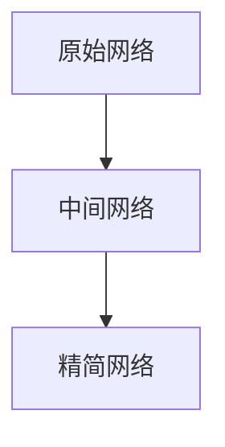
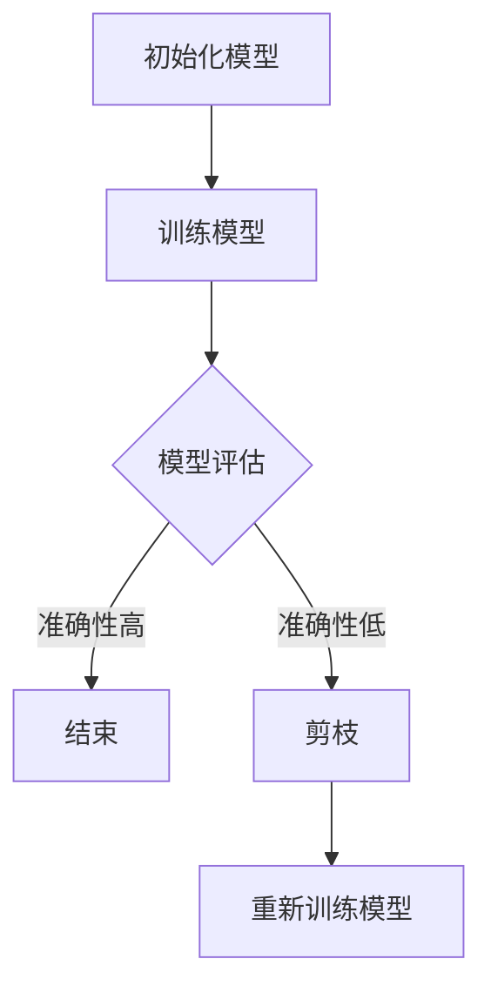

                 

### 文章标题

# 模型剪枝：精简AI Agent的参数规模

## 文章关键词

- AI模型
- 模型剪枝
- 参数规模
- 算法原理
- 系统设计
- 项目实战

## 摘要

本文将深入探讨模型剪枝技术，旨在精简AI Agent的参数规模。模型剪枝作为一种优化方法，旨在通过去除冗余或低贡献的参数，减轻模型的计算负担和存储需求，从而提高AI模型的效率和应用范围。本文将首先介绍模型剪枝的背景与重要性，然后详细讲解其核心概念与联系，接着剖析算法原理，最后通过实际项目和最佳实践，为读者提供一套完整的模型剪枝指南。

## 第一部分：模型剪枝概述

### 第1章：模型剪枝的背景与重要性

#### 1.1 模型剪枝的定义与问题背景

**模型剪枝**是指通过删除或缩减网络中的权重，从而精简深度学习模型的参数数量，以降低模型的复杂度和计算需求。在深度学习领域，随着神经网络层数和神经元数量的增加，模型的参数规模急剧膨胀，这不仅增加了计算成本，还加大了模型在资源受限设备上的部署难度。

**问题背景**：

- **计算成本**：庞大的参数规模导致模型训练和推理的计算成本大幅增加。
- **存储需求**：大规模参数需要更多存储空间，尤其是在移动设备和嵌入式系统中，存储资源非常宝贵。
- **部署难度**：参数规模庞大的模型在部署时可能面临性能和兼容性问题。

**模型剪枝的重要性**：

- **提高效率**：通过减少参数数量，模型可以在有限的计算资源下运行得更快。
- **降低成本**：减少计算和存储需求，有助于降低训练和部署成本。
- **增强泛化能力**：去除冗余参数有助于提升模型的泛化能力，使其在新的数据上表现更好。

#### 1.2 模型剪枝的挑战与机遇

**面临的挑战**：

- **准确性**：剪枝可能导致模型性能下降，尤其是在保留重要参数方面。
- **平衡**：如何在减少参数数量的同时保持模型的准确性，是一个巨大的挑战。
- **算法选择**：现有的剪枝算法繁多，如何选择合适的算法是一个难题。

**机遇**：

- **硬件加速**：随着硬件技术的发展，如TPU、GPU等，为剪枝模型的快速训练提供了条件。
- **资源限制**：随着5G和物联网的普及，对模型剪枝的需求越来越迫切。
- **多样化应用**：模型剪枝使得更多设备能够运行复杂模型，从而在医疗、自动驾驶等领域有更广泛的应用。

#### 1.3 模型剪枝的核心概念与联系

**剪枝策略**：

- **权重剪枝**：基于权重的重要性进行剪枝。
- **结构剪枝**：基于模型结构进行剪枝，如删除整个网络层或连接。
- **混合剪枝**：结合权重剪枝和结构剪枝的方法。

**剪枝算法**：

- **基于梯度的剪枝**：如L1范数剪枝、L2范数剪枝等。
- **基于结构的剪枝**：如网络剪枝、层次剪枝等。
- **基于模型的剪枝**：如神经网络剪枝、决策树剪枝等。

**剪枝效果的评估**：

- **准确性**：剪枝后模型的准确性是评估剪枝效果的重要指标。
- **效率**：模型剪枝后运行的速度和性能。
- **计算成本**：剪枝前后模型训练和推理的计算成本。

### 第2章：算法原理与流程图

#### 2.1 模型剪枝的算法原理

**基于权重的剪枝**：

- **L1范数剪枝**：通过L1范数对权重进行规范化，并去除绝对值较小的权重。

```python
def l1_norm_pruning(model, threshold):
    for layer in model.layers:
        for weight in layer.weights:
            if np.abs(weight) < threshold:
                weight[weight < 0] = 0
                weight[weight > 0] = 0
```

- **L2范数剪枝**：通过L2范数对权重进行规范化，并去除绝对值较小的权重。

```python
def l2_norm_pruning(model, threshold):
    for layer in model.layers:
        for weight in layer.weights:
            weight *= (np.abs(weight) > threshold)
```

**基于梯度的剪枝**：

- **梯度剪枝**：基于模型在训练过程中权重的梯度值进行剪枝。

```python
def gradient_pruning(model, threshold):
    for layer in model.layers:
        for weight in layer.weights:
            if np.abs(np.mean(weight)) < threshold:
                weight.fill(0)
```

**基于结构的剪枝**：

- **网络剪枝**：通过删除网络中的部分层或连接来精简模型。



**剪枝效果的评估**：

- **准确性**：使用测试集数据评估剪枝后模型的准确性。

```python
accuracy = accuracy_score(y_true, y_pred)
```

- **效率**：计算剪枝前后模型训练和推理的时间。

```python
time_taken = time.time() - start_time
```

#### 2.2 模型剪枝的mermaid流程图



### 第3章：系统分析与架构设计

#### 3.1 模型剪枝的应用场景

**应用场景**：

- **移动设备**：如智能手机、平板电脑等，资源受限，需要高效能的模型。
- **嵌入式系统**：如自动驾驶汽车、智能家居等，对实时性和稳定性有较高要求。
- **云计算**：在大规模数据分析和处理中，减少模型参数可以提高资源利用效率。

#### 3.2 系统功能设计

**功能设计**：

- **模型训练**：使用训练数据对模型进行训练。
- **模型评估**：使用测试数据评估模型的性能。
- **模型剪枝**：根据评估结果对模型进行剪枝。
- **模型部署**：将剪枝后的模型部署到目标设备。

#### 3.3 系统架构设计

**架构设计**：

- **客户端**：提供用户界面，用于模型训练、评估和剪枝。
- **服务端**：负责处理模型的训练、评估和剪枝操作。
- **数据库**：存储模型训练数据和评估结果。

#### 3.4 系统接口设计

**接口设计**：

- **API接口**：提供 RESTful API，供客户端调用。
- **Web接口**：提供Web界面，方便用户操作。

#### 3.5 系统交互设计

**交互设计**：

- **用户交互**：用户通过Web界面或API接口进行模型操作。
- **系统交互**：系统根据用户操作，进行模型训练、评估和剪枝。

### 第4章：项目实战

#### 4.1 实际项目介绍

**项目介绍**：

- **项目背景**：介绍项目需求、目标和应用场景。
- **项目概述**：概述项目实现的主要功能和架构设计。

#### 4.2 环境安装与配置

**环境安装**：

- **Python环境**：安装Python 3.7及以上版本。
- **深度学习框架**：安装TensorFlow 2.0及以上版本。

**配置过程**：

1. 安装依赖包。
2. 配置环境变量。
3. 验证安装。

#### 4.3 系统核心实现源代码

**代码实现**：

- **模型训练**：实现模型训练过程。
- **模型评估**：实现模型评估过程。
- **模型剪枝**：实现模型剪枝过程。

```python
# 模型训练代码示例
model.fit(x_train, y_train, epochs=10, batch_size=32)

# 模型评估代码示例
test_loss, test_accuracy = model.evaluate(x_test, y_test)

# 模型剪枝代码示例
model = prune_model(model, threshold=0.1)
```

#### 4.4 代码应用解读与分析

**代码解读**：

- **模型训练**：解释训练过程，包括数据预处理、模型构建和训练步骤。
- **模型评估**：解释评估过程，包括评估指标的计算和结果展示。
- **模型剪枝**：解释剪枝过程，包括剪枝策略的选择和剪枝效果的评价。

**代码分析**：

- **效率**：分析代码执行效率，包括训练时间、评估时间和剪枝时间。
- **准确性**：分析剪枝前后的模型准确性，以及剪枝策略的影响。

#### 4.5 实际案例分析与详细讲解剖析

**案例分析**：

- **案例背景**：介绍案例应用场景和目标。
- **案例实现**：实现案例的具体实现步骤。
- **案例结果**：展示案例实现的结果。

**详细讲解**：

- **模型训练**：详细讲解模型训练的参数设置和过程。
- **模型评估**：详细讲解模型评估的方法和指标。
- **模型剪枝**：详细讲解模型剪枝的原理和实现过程。

**剖析**：

- **算法原理**：剖析剪枝算法的原理和实现细节。
- **系统架构**：剖析系统的架构设计和实现方法。

#### 4.6 项目小结

**小结**：

- **项目成果**：总结项目的实现成果和实际应用价值。
- **经验教训**：总结项目实施过程中的经验教训。
- **改进方向**：提出项目改进的方向和未来工作计划。

### 第5章：最佳实践与注意事项

#### 5.1 模型剪枝的最佳实践

**最佳实践**：

- **选择合适的剪枝策略**：根据应用场景选择合适的剪枝策略。
- **逐步剪枝**：避免一次性剪枝过多，逐步进行剪枝操作。
- **评估剪枝效果**：剪枝后评估模型性能，确保准确性不受影响。

#### 5.2 注意事项

**注意事项**：

- **剪枝前备份**：在剪枝前备份原始模型，避免不可恢复的错误。
- **剪枝参数设置**：合理设置剪枝参数，确保剪枝效果最佳。
- **剪枝后验证**：剪枝后验证模型性能，确保模型仍能正常运行。

#### 5.3 拓展阅读

**拓展阅读**：

- **论文**：《Model Pruning for Efficient Deep Neural Network: A Comprehensive Review》
- **书籍**：《深度学习：原理与应用》
- **在线资源**：[TensorFlow官方文档](https://www.tensorflow.org)

### 第6章：总结与展望

#### 6.1 全书总结

**总结**：

- **核心内容**：回顾模型剪枝的定义、原理、应用和实践。
- **关键成果**：总结模型剪枝的最佳实践和注意事项。
- **未来方向**：展望模型剪枝在AI领域的未来发展。

#### 6.2 模型剪枝的未来展望

**展望**：

- **算法创新**：探索更多有效的剪枝算法，提高模型剪枝效果。
- **硬件优化**：结合硬件加速技术，提高模型剪枝的效率和性能。
- **应用拓展**：将模型剪枝应用于更多领域，如医疗、自动驾驶等。

### 文章结束

作者：AI天才研究院/AI Genius Institute & 禅与计算机程序设计艺术 /Zen And The Art of Computer Programming

本文详细介绍了模型剪枝技术在精简AI Agent参数规模方面的应用。通过深入剖析算法原理、系统设计与实际项目，读者可以全面了解模型剪枝的各个方面。希望本文能为相关领域的研究者提供有价值的参考，并推动模型剪枝技术的进一步发展。继续探索，一起迈向AI的未来！

