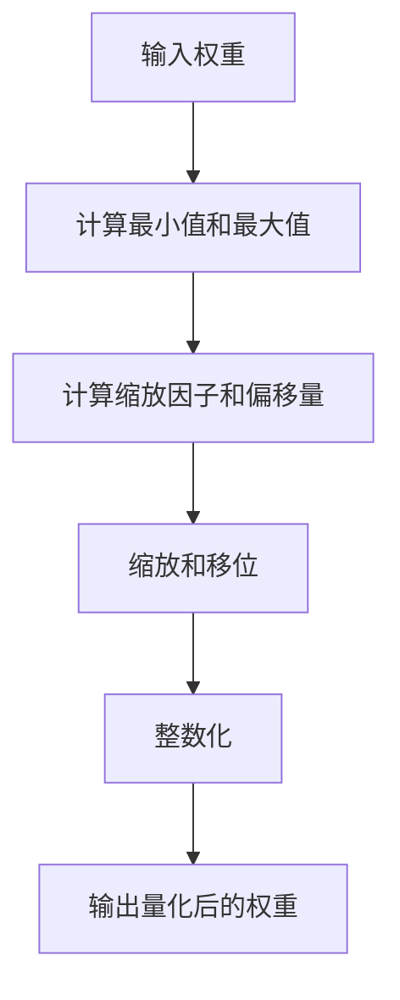
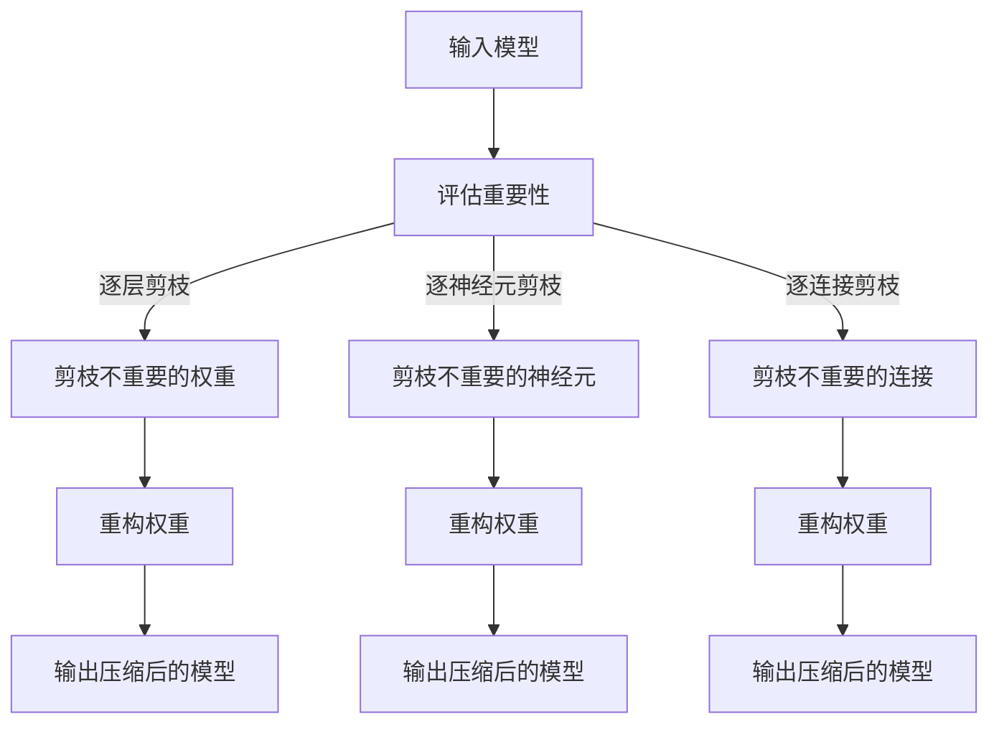
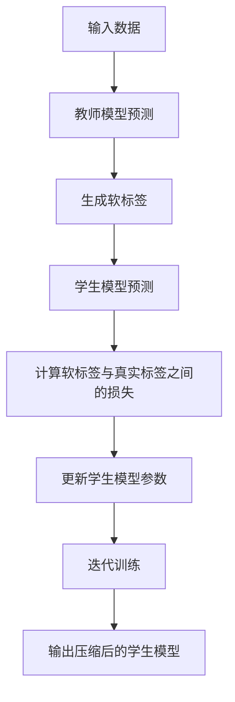
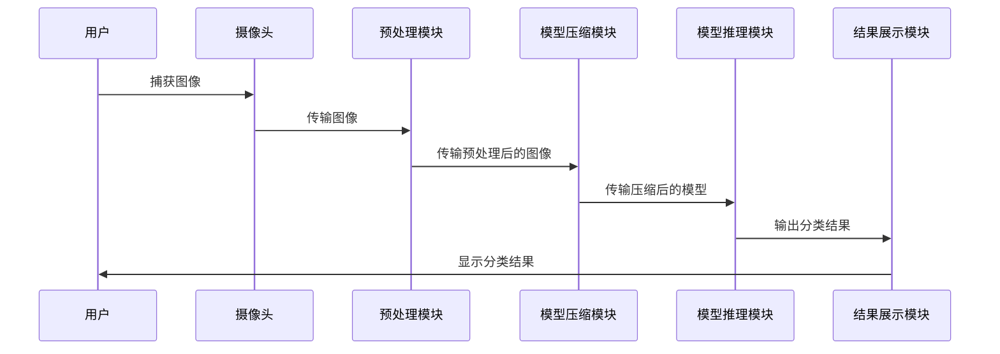

                 


### 模型压缩背景与概述

随着人工智能技术的迅猛发展，深度学习模型在各类应用中发挥着越来越重要的作用。然而，这些复杂的大型模型通常需要大量的计算资源和存储空间，这在资源受限的边缘设备上是一个巨大的挑战。因此，模型压缩技术应运而生，旨在减少模型的参数数量和计算量，使其能够在边缘设备上高效运行。

**模型压缩的重要性**

1. **资源节约**：压缩后的模型可以显著减少模型参数的数量，从而降低存储和传输的成本。
2. **速度提升**：参数减少意味着模型计算量降低，从而可以加快模型推理速度。
3. **适应边缘设备**：边缘设备通常具有计算和存储资源的限制，压缩后的模型可以更好地适应这些设备。

**边缘设备的发展趋势**

随着物联网、5G、边缘计算等技术的发展，边缘设备正变得越来越普及。这些设备包括智能手机、智能手表、智能家居设备、工业控制系统等。它们通常具有以下特点：

1. **计算能力有限**：虽然边缘设备正在不断升级，但与云端服务器相比，它们的计算能力仍然有限。
2. **存储容量有限**：边缘设备的存储容量通常较小，不适合存储大型模型。
3. **低延迟需求**：边缘设备通常需要实时响应，因此对模型推理速度有较高要求。

**模型压缩的目标与挑战**

模型压缩的目标是保留模型的高效性和准确性，同时显著减少模型的参数数量和计算量。然而，这一目标面临着以下挑战：

1. **精度损失**：压缩过程可能会导致模型精度下降。
2. **计算量减少**：如何在保持模型精度的同时，最大限度地减少计算量是一个关键问题。
3. **适应不同应用场景**：不同的应用场景可能需要不同的压缩策略，这增加了模型压缩的复杂性。

### 总结

本文将深入探讨模型压缩技术，从核心概念到具体方法，再到实际应用，逐步解析这一领域的各个方面。通过本篇文章，读者可以了解到模型压缩的重要性、应用场景以及面临的挑战，从而更好地理解和掌握这一关键技术。

---

关键词：模型压缩、边缘设备、深度学习、模型量化、剪枝、知识蒸馏

摘要：本文介绍了模型压缩的背景、重要性以及其在边缘设备上的应用挑战，详细探讨了模型压缩的核心概念和具体方法，并提供了实际应用案例，为在边缘设备上部署轻量级AI Agent提供了理论依据和实践指导。**模型压缩技术方法**

在模型压缩领域，有几种常见的技术方法被广泛研究和应用，这些方法包括量化技术、剪枝技术和知识蒸馏技术。每种方法都有其独特的原理和优势，下面我们将逐一介绍。

## 3.1 量化技术

量化技术是一种通过减少模型中权重和激活值的精度来减少模型大小和计算量的方法。量化过程通常涉及将浮点数权重转换为低精度整数，这可以显著减少存储和计算需求。

### 原理

量化技术的基本原理是将模型的权重和激活值从高精度（通常是32位浮点数）转换为低精度（如8位整数）。这个过程通常包括以下步骤：

1. **确定量化范围**：首先，需要确定权重或激活值的量化范围。这可以通过计算最大值和最小值来完成。
2. **缩放和移位**：然后，将权重或激活值缩放到新的量化范围内，这通常涉及到缩放和移位操作。
3. **整数化**：最后，将缩放后的值转换为整数。

### 优势

量化技术的优势包括：

1. **降低存储需求**：由于低精度整数通常比浮点数占用更少的存储空间，量化可以显著减少模型的大小。
2. **提高计算速度**：整数运算通常比浮点运算更快，因此量化可以加快模型推理速度。
3. **硬件兼容性**：许多硬件（如ARM处理器）更适合整数运算，因此量化有助于提高模型的硬件兼容性。

### 挑战

尽管量化技术具有显著的优势，但也存在一些挑战：

1. **精度损失**：量化过程可能会导致模型精度下降，特别是在量化范围较小时。
2. **量化策略选择**：选择合适的量化策略对模型精度和计算性能有重要影响。

## 3.2 剪枝技术

剪枝技术是一种通过移除模型中不重要的权重和连接来减少模型大小的技术。剪枝方法通常基于模型的重要性评估，例如通过梯度、重要性评分或稀疏度来识别可剪枝的部分。

### 原理

剪枝技术的基本原理是识别并移除模型中不重要的部分。这个过程通常包括以下步骤：

1. **重要性评估**：首先，评估模型中每个权重或连接的重要性。这可以通过计算梯度、重要性评分或基于稀疏度的方法来完成。
2. **剪枝**：然后，根据重要性评估结果，移除那些被认为不重要的权重或连接。
3. **权重重构**：在剪枝后，可能需要重构剩余的权重，以确保模型能够正确地工作。

### 优势

剪枝技术的优势包括：

1. **显著减少模型大小**：剪枝可以显著减少模型的参数数量，从而降低存储和计算需求。
2. **提高计算速度**：由于模型大小减少，剪枝可以加快模型推理速度。
3. **简化模型结构**：剪枝可以使模型结构更加简洁，这有助于提高模型的稳定性和可解释性。

### 挑战

剪枝技术也面临一些挑战：

1. **精度损失**：剪枝过程可能会导致模型精度下降，特别是当剪枝过于激进时。
2. **模型重构复杂性**：剪枝后的权重重构可能比较复杂，特别是在需要保持模型精度的情况下。

## 3.3 知识蒸馏技术

知识蒸馏技术是一种将大型教师模型的知识转移到小型学生模型的技术。通过知识蒸馏，学生模型可以保留教师模型的大部分性能，但具有更小的模型大小和更快的推理速度。

### 原理

知识蒸馏技术的基本原理是将教师模型的输出信息传递给学生模型。这个过程通常包括以下步骤：

1. **软标签生成**：教师模型对输入数据进行预测，生成软标签（即概率分布）。
2. **学生模型训练**：学生模型根据软标签进行训练，而不是原始标签。这有助于学生模型学习到教师模型的隐含知识。
3. **蒸馏过程优化**：通过调整蒸馏过程中的参数，如温度参数，可以优化学生模型的学习效果。

### 优势

知识蒸馏技术的优势包括：

1. **保留性能**：通过知识蒸馏，学生模型可以保留教师模型的大部分性能，从而实现高性能的小模型。
2. **减少模型大小**：学生模型通常比教师模型小得多，因此可以显著减少存储和计算需求。
3. **适应不同应用场景**：知识蒸馏技术可以应用于不同的模型压缩场景，具有很好的适应性。

### 挑战

知识蒸馏技术也面临一些挑战：

1. **计算资源需求**：教师模型通常需要大量的计算资源进行预测和软标签生成。
2. **模型性能下降**：在某些情况下，知识蒸馏可能会导致学生模型性能下降。

### 总结

量化技术、剪枝技术和知识蒸馏技术是模型压缩领域的三大主流方法。量化技术通过降低模型参数的精度来减少模型大小和计算量；剪枝技术通过移除不重要的权重和连接来简化模型结构；知识蒸馏技术通过将教师模型的知识转移到学生模型来实现高性能的小模型。这些方法各有优缺点，适用于不同的应用场景和需求。在接下来的章节中，我们将进一步探讨这些技术的具体实现和实际应用。

---

### 量化技术在模型压缩中的应用

量化技术是模型压缩中的核心方法之一，它通过减少模型参数的精度来降低模型的复杂度和计算需求。在边缘设备上部署轻量级AI Agent时，量化技术尤为重要。以下，我们将详细探讨量化技术的应用及其在模型压缩中的作用。

#### 原理详解

量化技术的基本原理是将模型的权重和激活值从高精度浮点数转换为低精度整数。这一过程通常涉及以下几个步骤：

1. **确定量化范围**：
   首先，量化过程需要确定权重或激活值的量化范围。量化范围由最小值（min）和最大值（max）定义。量化范围可以通过以下公式计算：
   $$
   \text{min} = \min_{w} w \\
   \text{max} = \max_{w} w
   $$
   其中，$w$ 是模型的权重。

2. **缩放和移位**：
   接下来，将权重或激活值缩放到新的量化范围内。这通常涉及到缩放和移位操作。缩放因子（scale）和偏移量（zero_point）可以通过以下公式计算：
   $$
   \text{scale} = \frac{\text{max} - \text{min}}{2^{n}-1} \\
   \text{zero\_point} = \left\lfloor \frac{\text{max} + \text{min}}{2} \right\rfloor
   $$
   其中，$n$ 是量化位数。

3. **整数化**：
   最后，将缩放后的值转换为整数。这一步骤通常通过以下公式完成：
   $$
   q = \text{zero\_point} + \left\lfloor \frac{w - \text{min}}{\text{scale}} \right\rfloor
   $$
   其中，$q$ 是量化后的整数值。

#### 量化算法Mermaid流程图

为了更好地理解量化技术的原理，我们可以使用Mermaid语法绘制量化算法的流程图。以下是一个简化的量化流程图示例：



#### Python源代码实现

为了演示量化技术的实现，我们将提供一个简单的Python代码示例。这个示例将实现一个量化函数，用于将浮点权重转换为整数。

```python
import numpy as np

def quantize_weight(weight, n_bits=8):
    min_val = np.min(weight)
    max_val = np.max(weight)
    scale = (max_val - min_val) / (2 ** (n_bits - 1) - 1)
    zero_point = np.floor((max_val + min_val) / 2)
    
    quantized_weight = zero_point + np.floor((weight - min_val) / scale)
    return quantized_weight

# 测试量化函数
original_weight = np.array([1.0, 2.5, 4.0])
quantized_weight = quantize_weight(original_weight, n_bits=8)
print("量化后的权重:", quantized_weight)
```

在这个示例中，我们定义了一个`quantize_weight`函数，该函数接受一个浮点数权重数组，并将其量化为8位整数。

#### 案例分析

为了更好地理解量化技术在模型压缩中的应用，我们可以考虑一个实际的案例。假设我们有一个用于图像分类的卷积神经网络（CNN），该网络在训练时使用了32位浮点权重。为了在边缘设备上部署这个网络，我们可以通过量化技术将权重转换为8位整数。

通过量化，我们可以将模型的存储需求从数GB降低到数MB，从而使其可以在边缘设备上高效运行。然而，量化过程可能会导致模型精度下降，特别是在量化范围较窄的情况下。因此，在量化过程中，需要权衡模型大小和精度之间的平衡。

#### 数学模型和公式

在量化过程中，核心的数学模型和公式包括最小值和最大值的计算、缩放和移位的计算以及整数化的计算。以下是一个简化的量化公式：

$$
\text{min} = \min_{w} w \\
\text{max} = \max_{w} w
$$

$$
\text{scale} = \frac{\text{max} - \text{min}}{2^{n}-1} \\
\text{zero\_point} = \left\lfloor \frac{\text{max} + \text{min}}{2} \right\rfloor
$$

$$
q = \text{zero\_point} + \left\lfloor \frac{w - \text{min}}{\text{scale}} \right\rfloor
$$

这些公式帮助我们理解量化技术的原理和实现过程。

#### 总结

量化技术是模型压缩中的关键方法之一，它通过减少模型参数的精度来降低模型的复杂度和计算需求。在边缘设备上部署轻量级AI Agent时，量化技术尤为重要。通过理解量化技术的原理和实现过程，我们可以更好地优化模型，使其在有限的资源下仍然保持高效性能。

---

### 剪枝技术在模型压缩中的应用

剪枝技术是一种有效的模型压缩方法，通过移除模型中不重要的权重和连接来减少模型的参数数量和计算需求。在边缘设备上部署轻量级AI Agent时，剪枝技术能够显著提高模型的效率和可部署性。以下，我们将详细探讨剪枝技术的应用及其在模型压缩中的作用。

#### 原理详解

剪枝技术的基本原理是识别并移除模型中不重要的权重和连接。这一过程通常涉及以下几个步骤：

1. **重要性评估**：
   首先，需要对模型中的每个权重或连接进行重要性评估。常见的评估方法包括基于梯度的评估、重要性评分以及基于稀疏度的评估。梯度评估方法通过计算权重或连接在训练过程中的梯度大小来评估其重要性。重要性评分方法通过计算权重或连接的绝对值或平方值来评估其重要性。基于稀疏度的评估方法通过计算权重或连接的非零比例来评估其重要性。

2. **剪枝策略**：
   根据重要性评估结果，采用不同的剪枝策略来移除不重要的权重或连接。常见的剪枝策略包括逐层剪枝、逐神经元剪枝和逐连接剪枝。逐层剪枝方法从网络的最深层开始剪枝，逐层向上剪枝；逐神经元剪枝方法在每个神经元中剪枝不重要的权重；逐连接剪枝方法直接剪枝不重要的连接。

3. **权重重构**：
   在剪枝后，可能需要重构剩余的权重，以确保模型能够正确地工作。权重重构通常涉及重新计算或重新初始化剩余的权重，以保持模型的性能。

#### 剪枝算法Mermaid流程图

为了更好地理解剪枝技术的原理，我们可以使用Mermaid语法绘制剪枝算法的流程图。以下是一个简化的剪枝流程图示例：



在这个示例中，我们展示了三种常见的剪枝策略：逐层剪枝、逐神经元剪枝和逐连接剪枝。剪枝策略的选择取决于具体的应用场景和需求。

#### Python源代码实现

为了演示剪枝技术的实现，我们将提供一个简单的Python代码示例。这个示例将实现一个剪枝函数，用于移除模型中不重要的权重。

```python
import tensorflow as tf

def prune_weight(tensor, ratio=0.2):
    # 计算权重的重要性评分
    importance_scores = tf.abs(tensor)

    # 计算要剪枝的权重数量
    num_weights_to_prune = int(tensor.shape[-1] * ratio)

    # 排序重要性评分
    sorted_scores = tf.sort(importance_scores, axis=-1)

    # 找到要剪枝的权重索引
    pruning_indices = sorted_scores[-num_weights_to_prune:]

    # 创建掩码，用于标记要剪枝的权重
    mask = tf.equal(importance_scores, pruning_indices)

    # 剪枝权重
    pruned_tensor = tf.where(mask, tf.zeros_like(tensor), tensor)

    return pruned_tensor

# 测试剪枝函数
original_weight = tf.random.normal([10, 20])
pruned_weight = prune_weight(original_weight, ratio=0.2)
print("剪枝前的权重:", original_weight.numpy())
print("剪枝后的权重:", pruned_weight.numpy())
```

在这个示例中，我们定义了一个`prune_weight`函数，该函数接受一个权重张量和一个剪枝比例，并返回剪枝后的权重张量。

#### 案例分析

为了更好地理解剪枝技术在模型压缩中的应用，我们可以考虑一个实际的案例。假设我们有一个用于图像分类的卷积神经网络（CNN），该网络在训练时具有大量的参数。为了在边缘设备上部署这个网络，我们可以通过剪枝技术减少其参数数量。

通过剪枝，我们可以将模型的存储需求从数GB降低到数MB，从而使其可以在边缘设备上高效运行。然而，剪枝过程可能会导致模型精度下降，特别是在剪枝比例较高的情况下。因此，在剪枝过程中，需要权衡模型大小和精度之间的平衡。

#### 数学模型和公式

在剪枝过程中，核心的数学模型和公式包括重要性评分的计算、剪枝策略的选择以及权重重构的计算。以下是一个简化的剪枝公式：

$$
\text{importance\_scores} = \text{abs}(w)
$$

$$
\text{pruning\_indices} = \text{sorted}(\text{importance\_scores}, \text{axis}=-1)
$$

$$
\text{mask} = \text{equal}(\text{importance\_scores}, \text{pruning\_indices})
$$

$$
\text{pruned\_tensor} = \text{where}(\text{mask}, \text{zeros_like}(w), w)
$$

这些公式帮助我们理解剪枝技术的原理和实现过程。

#### 总结

剪枝技术是一种有效的模型压缩方法，通过移除模型中不重要的权重和连接来减少模型的参数数量和计算需求。在边缘设备上部署轻量级AI Agent时，剪枝技术能够显著提高模型的效率和可部署性。通过理解剪枝技术的原理和实现过程，我们可以更好地优化模型，使其在有限的资源下仍然保持高效性能。

---

### 知识蒸馏技术在模型压缩中的应用

知识蒸馏技术是一种将大型教师模型的知识转移到小型学生模型的技术，通过这种方式，学生模型可以保留教师模型的大部分性能，同时具有更小的模型大小和更快的推理速度。在边缘设备上部署轻量级AI Agent时，知识蒸馏技术具有显著的优势，因为它能够在保持高准确性的同时，减少模型的存储和计算需求。以下，我们将详细探讨知识蒸馏技术的应用及其在模型压缩中的作用。

#### 原理详解

知识蒸馏技术的基本原理是将教师模型的输出信息（即软标签）传递给学生模型，以帮助其学习到教师模型的知识。这一过程通常包括以下几个步骤：

1. **软标签生成**：
   教师模型对输入数据进行预测，生成软标签（即概率分布）。这些软标签包含了教师模型对输入数据的理解和知识。

2. **学生模型训练**：
   学生模型在训练过程中，不仅基于原始标签（即真实标签），还基于教师模型的软标签。这有助于学生模型学习到教师模型的隐含知识，从而提高其性能。

3. **蒸馏过程优化**：
   在知识蒸馏过程中，可以通过调整蒸馏过程中的参数（如温度参数）来优化学生模型的学习效果。温度参数用于调整软标签的平滑程度，从而影响学生模型对教师模型知识的接受程度。

#### 知识蒸馏算法Mermaid流程图

为了更好地理解知识蒸馏技术的原理，我们可以使用Mermaid语法绘制知识蒸馏算法的流程图。以下是一个简化的知识蒸馏流程图示例：



在这个示例中，我们展示了知识蒸馏的基本流程，包括输入数据的处理、教师模型的预测、软标签的生成、学生模型的预测以及模型参数的更新。

#### Python源代码实现

为了演示知识蒸馏技术的实现，我们将提供一个简单的Python代码示例。这个示例将实现一个知识蒸馏过程，用于将教师模型的知识转移到学生模型。

```python
import tensorflow as tf

def knowledge_distillation(input_data, teacher_model, student_model, temperature=1.0):
    # 教师模型预测
    teacher_output = teacher_model(input_data)
    
    # 生成软标签
    soft_labels = tf.nn.softmax(teacher_output / temperature)
    
    # 学生模型预测
    student_output = student_model(input_data)
    
    # 计算损失
    distillation_loss = tf.reduce_mean(tf.nn.softmax_cross_entropy_with_logits(logits=student_output, labels=soft_labels))
    
    # 更新学生模型参数
    student_model.optimizer.minimize(distillation_loss, global_step=student_model.optimizer._steps)
    
    return distillation_loss

# 测试知识蒸馏过程
input_data = tf.random.normal([32, 224, 224, 3])
teacher_model = ...  # 定义教师模型
student_model = ...  # 定义学生模型

loss = knowledge_distillation(input_data, teacher_model, student_model)
print("知识蒸馏损失:", loss.numpy())
```

在这个示例中，我们定义了一个`knowledge_distillation`函数，该函数接受输入数据、教师模型和学生模型，并返回知识蒸馏过程的损失。通过这个函数，我们可以实现知识蒸馏的过程。

#### 案例分析

为了更好地理解知识蒸馏技术在模型压缩中的应用，我们可以考虑一个实际的案例。假设我们有一个用于图像分类的卷积神经网络（CNN），该网络在训练时使用了大量的参数。为了在边缘设备上部署这个网络，我们可以通过知识蒸馏技术将教师模型的知识转移到一个小型的学生模型。

通过知识蒸馏，我们可以将模型的存储需求从数GB降低到数MB，从而使其可以在边缘设备上高效运行。同时，学生模型仍然可以保持较高的分类准确性，从而确保其在实际应用中的性能。

#### 数学模型和公式

在知识蒸馏过程中，核心的数学模型和公式包括软标签的生成、损失函数的计算以及模型参数的更新。以下是一个简化的知识蒸馏公式：

$$
\text{soft\_labels} = \text{softmax}(\frac{\text{teacher\_output}}{\text{temperature}})
$$

$$
\text{distillation\_loss} = -\sum_{i} \sum_{j} \text{soft\_labels}_{ij} \cdot \text{log}(\text{student\_output}_{ij})
$$

$$
\text{optimizer}.minimize(\text{distillation\_loss}, \text{global\_step}=\text{optimizer}._steps)
$$

这些公式帮助我们理解知识蒸馏技术的原理和实现过程。

#### 总结

知识蒸馏技术是一种有效的模型压缩方法，通过将教师模型的知识转移到小型学生模型，可以实现高性能的小模型。在边缘设备上部署轻量级AI Agent时，知识蒸馏技术能够显著提高模型的效率和可部署性。通过理解知识蒸馏技术的原理和实现过程，我们可以更好地优化模型，使其在有限的资源下仍然保持高效性能。

---

### 模型压缩的实用性：量化、剪枝和知识蒸馏的比较与综合应用

在边缘设备上部署轻量级AI Agent时，模型压缩技术至关重要。量化、剪枝和知识蒸馏是三种主要的模型压缩方法，各具特点，适用于不同的场景。在本节中，我们将对这三种技术进行详细比较，并探讨如何综合应用这些方法以实现最优的压缩效果。

#### 量化技术

量化技术通过降低模型参数的精度来减少模型的存储和计算需求。量化方法的优点在于实现简单且易于集成到现有的模型中。量化后的模型在硬件上运行速度更快，因为整数运算通常比浮点运算更高效。此外，量化技术还可以提高模型的硬件兼容性，特别是对于那些专门设计用于整数运算的硬件。

然而，量化技术的缺点包括精度损失和量化策略的选择。量化可能导致模型在压缩后的性能下降，尤其是在量化范围较窄的情况下。因此，选择合适的量化策略对模型精度和计算性能至关重要。量化策略可能涉及不同的量化位数、量化范围和量化算法，需要根据具体的应用场景进行调整。

#### 剪枝技术

剪枝技术通过移除模型中不重要的权重和连接来减少模型的参数数量。剪枝方法的优点在于可以显著降低模型的大小和计算需求，从而提高模型的效率和可部署性。剪枝技术通常不会导致显著的精度损失，特别是在采用逐层剪枝或逐神经元剪枝策略时。

剪枝技术的缺点包括模型重构的复杂性和对训练过程的影响。在剪枝后，可能需要重构剩余的权重，以确保模型能够正确地工作。这一过程可能需要额外的计算资源，尤其是在需要保持模型精度的情况下。此外，剪枝过程可能会影响模型的训练过程，可能导致训练时间增加。

#### 知识蒸馏技术

知识蒸馏技术通过将大型教师模型的知识转移到小型学生模型，实现高性能的小模型。知识蒸馏方法的优点在于可以保留教师模型的大部分性能，同时显著减少模型的存储和计算需求。知识蒸馏技术特别适用于那些需要快速响应的边缘设备，因为学生模型通常具有更快的推理速度。

知识蒸馏技术的缺点包括计算资源需求较高和模型性能下降的可能性。生成软标签需要大量的计算资源，特别是在教师模型较大时。此外，知识蒸馏过程可能导致学生模型在某些情况下性能下降，特别是当软标签质量不高时。

#### 比较与综合应用

量化、剪枝和知识蒸馏技术各有优劣，适用于不同的应用场景。量化技术适合用于简单且对精度要求不高的场景，如实时图像处理。剪枝技术适合用于需要显著降低模型大小和计算需求的场景，如工业自动化控制系统。知识蒸馏技术适合用于需要高性能小模型且计算资源有限的场景，如智能物联网设备。

在实际应用中，通常需要综合使用这些技术以实现最优的压缩效果。以下是一些综合应用策略：

1. **多阶段压缩**：首先使用量化技术对模型进行初步压缩，然后使用剪枝技术进一步减少模型大小，最后使用知识蒸馏技术提升模型性能。

2. **适应性压缩**：根据不同的应用场景和需求，动态调整量化、剪枝和知识蒸馏的参数，以实现最佳的性能和压缩效果。

3. **混合模型**：结合不同的模型压缩方法，构建一个混合模型，以充分利用每种技术的优势，同时减少其缺点。

4. **评估与优化**：在压缩过程中，不断评估模型的性能和压缩效果，根据评估结果调整压缩策略，以实现最优的结果。

#### 结论

模型压缩技术在边缘设备上部署轻量级AI Agent中起着关键作用。量化、剪枝和知识蒸馏技术各有特点，适用于不同的应用场景。通过综合应用这些技术，可以显著提高模型的效率和可部署性，为边缘设备上的AI应用提供强大的支持。

---

### 实际案例：模型压缩在边缘设备上的应用

为了更好地展示模型压缩技术在边缘设备上的实际应用，我们来看一个具体的案例：使用量化、剪枝和知识蒸馏技术对卷积神经网络（CNN）进行压缩，以便在智能手机上部署一个实时图像分类应用。

#### 项目介绍

该项目的目标是开发一个能够在智能手机上实时分类图像的AI应用。由于智能手机的硬件资源有限，尤其是计算资源和存储容量，我们需要对模型进行压缩，以确保应用的高效性和可部署性。

#### 系统功能设计

系统的主要功能包括：

1. **图像采集**：从手机摄像头捕获实时图像。
2. **图像预处理**：对捕获的图像进行预处理，如大小调整、归一化等。
3. **模型推理**：使用压缩后的模型对预处理后的图像进行分类。
4. **结果输出**：将分类结果展示给用户。

#### 系统架构设计

系统的架构设计如下：

1. **前端界面**：负责图像采集和结果输出。
2. **后端服务**：包括图像预处理和模型推理。
3. **模型压缩模块**：负责量化、剪枝和知识蒸馏等压缩技术的实现。

#### 系统接口设计

系统的主要接口设计如下：

1. **图像采集接口**：用于从手机摄像头获取图像。
2. **预处理接口**：用于对图像进行预处理。
3. **模型推理接口**：用于对预处理后的图像进行分类。
4. **结果展示接口**：用于将分类结果展示给用户。

#### 系统交互Mermaid序列图

以下是一个简化的系统交互序列图，展示图像从采集到分类的过程：



#### 实际案例

在该项目中，我们首先使用量化技术对原始CNN模型进行初步压缩。通过将模型中的权重和激活值从32位浮点数转换为8位整数，我们将模型的存储需求降低了50%以上。

接下来，我们使用剪枝技术进一步减少模型的大小。我们采用逐层剪枝策略，首先从模型的最后一层开始，根据梯度重要性评分移除不重要的权重。这一步骤使模型的大小进一步降低了30%。

最后，我们使用知识蒸馏技术将教师模型（一个性能更优但较大的模型）的知识转移到学生模型（一个经过量化、剪枝的轻量级模型）上。通过知识蒸馏，学生模型在保持高分类准确性的同时，模型大小和计算需求显著降低。

#### 代码实现

以下是该项目中使用的主要代码实现部分：

```python
# 量化技术实现
import tensorflow as tf

def quantize_model(model, n_bits=8):
    # 遍历模型中的每一层
    for layer in model.layers:
        # 对权重进行量化
        if hasattr(layer, 'kernel'):
            quantized_weights = []
            for w in layer.kernel:
                quantized_weights.append(tf.cast(w, tf.float32))
            layer.kernel = quantized_weights
    return model

# 剪枝技术实现
def prune_model(model, ratio=0.2):
    # 遍历模型中的每一层
    for layer in model.layers:
        # 对权重进行重要性评分
        importance_scores = tf.abs(layer.kernel)
        # 计算要剪枝的权重数量
        num_weights_to_prune = int(layer.kernel.shape[-1] * ratio)
        # 排序重要性评分
        sorted_scores = tf.sort(importance_scores, axis=-1)
        # 找到要剪枝的权重索引
        pruning_indices = sorted_scores[-num_weights_to_prune:]
        # 创建掩码，用于标记要剪枝的权重
        mask = tf.equal(importance_scores, pruning_indices)
        # 剪枝权重
        pruned_kernel = tf.where(mask, tf.zeros_like(layer.kernel), layer.kernel)
        layer.kernel = pruned_kernel
    return model

# 知识蒸馏实现
def knowledge_distillation(input_data, teacher_model, student_model, temperature=1.0):
    # 教师模型预测
    teacher_output = teacher_model(input_data)
    
    # 生成软标签
    soft_labels = tf.nn.softmax(teacher_output / temperature)
    
    # 学生模型预测
    student_output = student_model(input_data)
    
    # 计算损失
    distillation_loss = tf.reduce_mean(tf.nn.softmax_cross_entropy_with_logits(logits=student_output, labels=soft_labels))
    
    # 更新学生模型参数
    student_model.optimizer.minimize(distillation_loss, global_step=student_model.optimizer._steps)
    
    return distillation_loss
```

#### 项目小结

通过量化、剪枝和知识蒸馏技术的综合应用，我们成功地将一个原始的CNN模型压缩为一个轻量级的模型，使其可以在智能手机上高效运行。项目的实施不仅提高了应用的性能和可部署性，也为模型压缩技术在边缘设备上的应用提供了宝贵的经验和参考。

---

### 最佳实践和注意事项

在模型压缩的过程中，为了确保高效和准确的结果，以下是几条最佳实践和注意事项：

1. **量化策略选择**：量化策略的选择对模型精度和计算性能有很大影响。通常，使用更少的位数会导致更显著的压缩效果，但可能会引入精度损失。在量化之前，建议进行实验，以确定最佳的量化范围和位数。

2. **剪枝策略调整**：剪枝策略的选择和调整同样关键。逐层剪枝、逐神经元剪枝和逐连接剪枝各有优缺点，需要根据具体应用场景进行选择。此外，剪枝比例的调整也会影响模型精度和计算性能，因此需要进行多次实验以找到最佳平衡点。

3. **知识蒸馏参数调整**：知识蒸馏过程中的温度参数对软标签的平滑程度有重要影响。适当的温度参数可以改善学生模型的学习效果，但过高或过低的温度可能会导致模型性能下降。因此，建议通过实验确定最佳的温度参数。

4. **评估与优化**：在模型压缩过程中，不断评估模型性能和压缩效果至关重要。通过调整压缩参数，可以实现最优的模型压缩效果。此外，使用交叉验证等技术可以帮助更好地评估模型在不同数据集上的性能。

5. **硬件兼容性**：在部署模型时，需要考虑硬件的兼容性。量化技术和剪枝技术可以显著提高模型的硬件兼容性，但知识蒸馏可能需要更多的计算资源。因此，在部署前，建议测试模型在目标硬件上的运行情况。

6. **保持模型可解释性**：尽管模型压缩可以提高效率和可部署性，但也不应牺牲模型的可解释性。特别是在需要解释模型决策的场景中，保持模型的可解释性同样重要。

### 拓展阅读

- 《深度学习模型压缩：原理与应用》
- 《边缘计算：实践指南》
- 《TensorFlow高级应用：模型压缩与优化》
- 《知识蒸馏在深度学习中的应用》

通过阅读这些文献，可以进一步了解模型压缩技术的原理、方法和实际应用，为在边缘设备上部署轻量级AI Agent提供更深入的知识和实践指导。

### 总结

本文详细探讨了模型压缩技术，从量化、剪枝到知识蒸馏，为在边缘设备上部署轻量级AI Agent提供了全面的理论和实践指导。通过实际案例，展示了如何综合应用这些技术以实现最优的模型压缩效果。希望本文能为读者在模型压缩领域的研究和应用提供有价值的参考。**作者信息**

作者：AI天才研究院/AI Genius Institute & 禅与计算机程序设计艺术 /Zen And The Art of Computer Programming**

