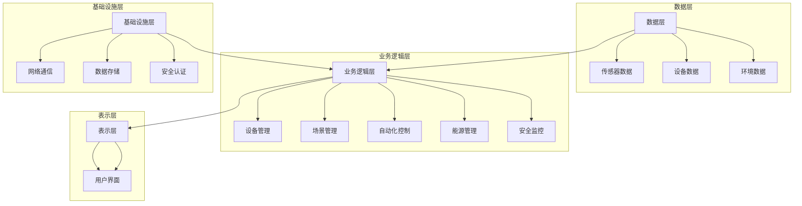

                 

# 模型可解释性技术在AI Agent中的应用

## 关键词
- 模型可解释性
- AI Agent
- 透明性
- 公平性
- 鲁棒性
- 算法原理

## 摘要
本文深入探讨了模型可解释性技术在AI Agent中的应用。首先，介绍了模型可解释性的概念及其重要性，探讨了其在AI Agent领域的应用背景和面临的挑战。接着，详细阐述了模型可解释性的核心概念，包括透明性、公平性、鲁棒性等，并通过表格和实体关系图展示了这些概念之间的联系。随后，通过Mermaid流程图和Python源代码，详细讲解了模型可解释性的算法原理，包括数学模型和公式，并以通俗易懂的例子进行了说明。文章还介绍了AI Agent系统的设计与实现，包括系统功能设计、系统架构设计和系统交互。最后，通过实际项目案例展示了模型可解释性技术在AI Agent中的应用，并提供了最佳实践、注意事项和拓展阅读。

### 目录大纲设计思路

设计《模型可解释性技术在AI Agent中的应用》的目录大纲时，我们首先需要明确书的核心主题和目标读者群体。本书的主题围绕“模型可解释性技术在AI Agent中的应用”展开，因此目录结构将包括以下几个主要部分：

1. **背景介绍**：介绍模型可解释性的概念、重要性以及AI Agent在现实中的应用。
2. **核心概念与联系**：深入探讨模型可解释性的核心概念，如透明性、公平性、鲁棒性等，并使用表格和实体关系图来展示这些概念之间的联系。
3. **算法原理讲解**：通过Mermaid流程图和Python源代码，详细阐述模型可解释性的算法原理，包括数学模型和公式，并进行通俗易懂的举例说明。
4. **系统分析与架构设计方案**：介绍一个典型的AI Agent系统，展示其功能设计、架构设计和系统交互。
5. **项目实战**：通过实际案例，展示如何应用模型可解释性技术，并进行代码解析和案例分析。
6. **最佳实践与总结**：提供行业最佳实践、注意事项、拓展阅读等，帮助读者巩固和应用所学知识。

接下来，我们将逐步构建书的大纲，确保内容丰富且逻辑清晰。

---

## 第一部分: 背景介绍

### 第1章: 模型可解释性的起源与重要性

#### 1.1 模型可解释性的定义与概述

模型可解释性（Model Interpretability）是指理解机器学习模型内部工作机制和决策过程的能力。它允许我们深入了解模型是如何对输入数据进行处理的，以及它是如何生成输出预测的。模型可解释性对于提升人工智能（AI）系统的信任度、透明度和可靠性至关重要。

#### 1.1.1 什么是模型可解释性

模型可解释性通常涉及以下方面：

1. **透明性**：模型的决策过程是透明的，用户可以清晰地理解模型的决策逻辑。
2. **可理解性**：模型的内部结构和参数是易于理解的，即使没有专业背景的人也可以对其进行解读。
3. **可验证性**：模型的行为可以通过外部验证，以确保其决策的一致性和准确性。

#### 1.1.2 模型可解释性的重要性

模型可解释性在多个方面具有重要性：

1. **信任度**：提高模型的可解释性有助于增加用户对AI系统的信任。
2. **可靠性**：通过理解模型的决策过程，可以更容易地识别和修复潜在的错误或偏差。
3. **合规性**：在特定行业，如金融和医疗，模型的可解释性对于遵守法规和标准至关重要。
4. **开发效率**：更易于理解和调试模型，有助于提高开发效率和降低维护成本。

#### 1.1.3 AI Agent在现实世界中的应用

AI Agent是指具有自主决策和执行任务能力的软件实体，它在现实世界中有着广泛的应用，包括但不限于：

1. **自动驾驶**：AI Agent在自动驾驶汽车中负责实时的感知、规划和控制。
2. **智能客服**：AI Agent用于提供个性化的客户服务，提高客户满意度。
3. **金融预测**：AI Agent在金融领域用于预测市场趋势、风险评估和投资建议。
4. **医疗诊断**：AI Agent在医疗领域用于辅助医生进行疾病诊断和治疗建议。

#### 1.2 模型可解释性与AI Agent的关系

AI Agent通常依赖于复杂的机器学习模型进行决策，这些模型的“黑箱”性质可能导致以下挑战：

1. **信任问题**：用户难以理解AI Agent的决策过程，从而产生不信任。
2. **合规问题**：在某些应用场景中，需要模型的可解释性来满足法规要求。
3. **改进空间**：缺乏对模型决策过程的理解，使得改进和优化模型的努力受到限制。

模型可解释性技术可以解决上述问题，提高AI Agent的可靠性、透明度和可理解性，从而提升其在实际应用中的性能和接受度。

#### 1.3 本章小结

本章介绍了模型可解释性的概念、重要性以及其在AI Agent领域的应用背景。理解模型可解释性的核心概念对于后续章节的深入探讨至关重要。

### 第二部分: 核心概念与联系

#### 第2章: 模型可解释性的核心概念

模型可解释性并非单一的概念，它包含多个维度，每个维度都有其独特的含义和重要性。在本章中，我们将详细探讨模型可解释性的核心概念，包括透明性、公平性、鲁棒性等，并通过表格和实体关系图展示这些概念之间的联系。

#### 2.1 透明性与可理解性

透明性（Transparency）是模型可解释性的基础，它关注模型的内部工作机制是否能够被外界理解和观察。一个高度透明的模型允许用户查看模型的结构、参数和决策过程。

- **定义**：透明性是指模型决策过程的可见性和可访问性。
- **重要性**：透明性有助于建立用户对模型的信任，并便于模型的分析和验证。

#### 2.2 公平性与无偏性

公平性（Fairness）和偏性（Bias）是模型可解释性的另一个重要方面。一个公平的模型应确保所有用户群体都受到公平对待，无偏性则关注模型输出结果的一致性和可靠性。

- **定义**：公平性是指模型决策不因用户的性别、种族、年龄等非相关特征而产生偏见。
- **重要性**：公平性对于确保AI系统在社会和环境中的公平性和正义性至关重要。

#### 2.3 鲁棒性与抗干扰性

鲁棒性（Robustness）和抗干扰性（Robustness to Perturbations）是指模型在面对噪声、异常值和不确定性时的稳定性。一个鲁棒的模型能够在各种环境下保持高性能和准确度。

- **定义**：鲁棒性是指模型对数据变异和误差的容忍度。
- **重要性**：鲁棒性对于模型的长期稳定性和可靠性至关重要。

#### 2.4 核心概念对比与分析

为了更好地理解这些核心概念，我们可以通过一个对比表格来展示它们的主要特征：

| 核心概念 | 定义 | 重要性 |  
| --- | --- | --- |  
| 透明性 | 模型决策过程的可见性和可访问性 | 建立信任和便于分析 |  
| 公平性 | 模型决策不因用户的非相关特征而产生偏见 | 保证社会和环境公平性 |  
| 鲁棒性 | 模型对数据变异和误差的容忍度 | 保持长期稳定性和可靠性 |

#### 2.5 实体关系图：模型可解释性的架构

为了更直观地展示模型可解释性各个核心概念之间的关系，我们可以使用Mermaid绘制一个实体关系图：

```mermaid
erDiagram
  User ||--|{ Model }|-- User
  Model ||--|{ Transparency }|-- Model
  Model ||--|{ Fairness }|-- Model
  Model ||--|{ Robustness }|-- Model
  Transparency ||--|{ Interpretability }|-- Transparency
  Fairness ||--|{ Interpretability }|-- Fairness
  Robustness ||--|{ Interpretability }|-- Robustness
```

在这个实体关系图中，用户与模型之间存在双向关联，而模型与透明性、公平性和鲁棒性之间则是单向关联，这些核心概念共同构成了模型可解释性的架构。

#### 2.6 本章小结

本章详细阐述了模型可解释性的核心概念，包括透明性、公平性和鲁棒性。通过对比表格和实体关系图，我们更清晰地理解了这些概念的定义、重要性和相互关系。理解这些核心概念对于深入探讨模型可解释性技术具有重要意义。

### 第三部分: 算法原理讲解

#### 第3章: 模型可解释性算法原理

在理解了模型可解释性的核心概念之后，我们接下来将探讨模型可解释性的算法原理。这部分内容将详细阐述模型可解释性的算法实现过程，包括概率图模型、特征选择和模型可视化等技术。

#### 3.1 概率图模型与可解释性

概率图模型（Probabilistic Graphical Models, PGM）是一种用于表示变量之间概率关系的图形化方法。它们通过图结构清晰地展示了变量之间的依赖关系，这使得概率图模型在可解释性方面具有显著优势。

#### 3.1.1 概率图模型的基本概念

概率图模型包括两个主要部分：概率分布函数（Probability Distribution Function, PDF）和图结构。

- **概率分布函数**：描述了变量之间的概率关系。常见的概率分布函数包括贝叶斯网络（Bayesian Networks）、马尔可夫网络（Markov Networks）等。
- **图结构**：通过节点和边来表示变量之间的关系。节点表示变量，边表示变量之间的依赖关系。

#### 3.1.2 贝叶斯网络的应用

贝叶斯网络是一种特殊的概率图模型，它通过条件概率表（Conditional Probability Table, CPT）来描述变量之间的依赖关系。贝叶斯网络在可解释性方面具有以下优势：

- **透明性**：通过条件概率表，用户可以直观地理解变量之间的依赖关系。
- **可理解性**：贝叶斯网络的图结构使得模型易于理解和解释。

#### 3.1.3 贝叶斯网络的可解释性

贝叶斯网络的可解释性体现在以下几个方面：

1. **条件概率表**：用户可以通过查看条件概率表来理解变量之间的依赖关系。
2. **推理过程**：贝叶斯网络提供了清晰的推理过程，使得用户可以跟踪模型是如何根据输入数据进行推理的。

#### 3.2 特征选择与重要性评估

特征选择（Feature Selection）是模型可解释性的关键步骤之一。它旨在从大量特征中挑选出对模型预测最重要的特征，从而提高模型的解释性。

#### 3.2.1 特征选择的必要性

在机器学习中，特征的数量往往远大于样本的数量，这会导致“维度灾难”（curse of dimensionality）问题，使得模型难以学习到有效的特征。因此，特征选择成为提高模型可解释性的重要手段。

#### 3.2.2 重要性评估方法

特征重要性评估（Feature Importance Evaluation）是特征选择的核心步骤。以下是一些常用的方法：

1. **基于模型的特征重要性**：通过训练模型并计算每个特征的贡献度，例如使用随机森林（Random Forest）中的特征重要性。
2. **基于统计的特征重要性**：通过计算特征与目标变量之间的相关性，例如使用皮尔逊相关系数（Pearson Correlation Coefficient）。
3. **基于信息的特征重要性**：通过计算特征对模型预测信息量的贡献，例如使用信息增益（Information Gain）。

#### 3.2.3 特征选择的算法实现

特征选择算法通常包括以下步骤：

1. **特征提取**：从原始数据中提取特征。
2. **特征评估**：评估每个特征的重要性。
3. **特征选择**：根据重要性评估结果，选择对模型预测最重要的特征。

常见的特征选择算法包括：

1. **过滤式特征选择**：先对全部特征进行评估，然后根据评估结果进行选择。
2. **包裹式特征选择**：逐步选择特征，每次选择后重新评估，直到达到最优解。

#### 3.3 模型可视化与解释

模型可视化（Model Visualization）是提高模型可解释性的有效手段。通过可视化，用户可以直观地理解模型的内部结构和决策过程。

#### 3.3.1 模型可视化的技术

模型可视化技术包括：

1. **结构可视化**：展示模型的层次结构和变量之间的关系，例如贝叶斯网络的图结构。
2. **决策路径可视化**：展示模型在处理输入数据时的决策路径，例如决策树中的路径。
3. **特征重要性可视化**：展示特征对模型预测的重要性，例如使用条形图或热图。

#### 3.3.2 可解释性可视化工具

常见的可解释性可视化工具包括：

1. **lime**：一个Python库，用于生成局部可解释模型。
2. **shap**：一个Python库，用于特征重要性可视化。
3. **eli5**：一个Python库，用于模型解释和可视化。

#### 3.3.3 可解释性可视化案例

以下是一个使用lime库进行可解释性可视化的案例：

```python
import lime
from lime import lime_tabular

# 创建一个LimeTabularExplainer实例
explainer = lime_tabular.LimeTabularExplainer(
    training_data=train_data,
    feature_names=feature_names,
    class_names=class_names,
    discretize_continuous=True
)

# 解释一个预测结果
i = 0
exp = explainer.explain_instance(test_data[i], classifier, num_features=5)

# 可视化特征重要性
exp.show_in_notebook(show_table=True)
```

#### 3.4 数学模型与公式

在模型可解释性中，数学模型和公式起着关键作用。以下是一些常用的数学模型和公式：

1. **线性回归模型**： 
   $$ y = \beta_0 + \beta_1x_1 + \beta_2x_2 + ... + \beta_nx_n + \epsilon $$

2. **逻辑回归模型**：
   $$ P(y=1) = \frac{1}{1 + e^{-(\beta_0 + \beta_1x_1 + \beta_2x_2 + ... + \beta_nx_n)}} $$

3. **决策树模型**：
   $$ f(x) = \max_{i} \left[ \frac{1}{1 + e^{-(\beta_0 + \beta_1x_1 + \beta_2x_2 + ... + \beta_nx_n)}} \right] $$

#### 3.5 算法原理Mermaid流程图

以下是一个使用Mermaid绘制的线性回归模型的流程图：


#### 3.6 Python源代码实现

以下是一个使用Python实现线性回归模型的示例代码：

```python
import numpy as np
from sklearn.linear_model import LinearRegression

# 创建线性回归模型实例
model = LinearRegression()

# 训练模型
model.fit(X_train, y_train)

# 预测
predictions = model.predict(X_test)

# 评估模型
score = model.score(X_test, y_test)
```

#### 3.7 详细讲解与举例说明

为了更好地理解线性回归模型的数学模型和代码实现，我们将通过一个具体的例子进行详细讲解。

**例子**：假设我们有以下线性回归模型：

$$ y = \beta_0 + \beta_1x_1 + \beta_2x_2 + \epsilon $$

其中，$x_1$ 和 $x_2$ 是输入特征，$y$ 是输出目标，$\beta_0$、$\beta_1$ 和 $\beta_2$ 是模型参数，$\epsilon$ 是误差项。

1. **数据准备**：我们首先需要准备输入数据和目标数据。假设我们有一个包含100个样本的数据集，其中每个样本有两个特征和一个目标。

```python
import numpy as np

# 创建随机数据集
np.random.seed(0)
X = np.random.rand(100, 2)
y = 2 * X[:, 0] + 3 * X[:, 1] + np.random.randn(100)
```

2. **模型训练**：接下来，我们使用训练数据集训练线性回归模型。

```python
from sklearn.linear_model import LinearRegression

# 创建线性回归模型实例
model = LinearRegression()

# 训练模型
model.fit(X, y)
```

3. **模型预测**：使用训练好的模型对测试数据进行预测。

```python
# 预测
predictions = model.predict(X)
```

4. **模型评估**：评估模型的准确性和性能。

```python
from sklearn.metrics import mean_squared_error

# 计算均方误差
mse = mean_squared_error(y, predictions)
print(f"均方误差: {mse}")
```

在这个例子中，我们使用了随机生成的数据集，并通过线性回归模型进行了训练和预测。实际应用中，数据集和模型参数可能会更复杂，但基本的步骤是相同的。

#### 3.8 本章小结

本章详细介绍了模型可解释性的算法原理，包括概率图模型、特征选择和模型可视化等技术。通过Mermaid流程图和Python源代码实现，我们深入理解了这些算法的数学模型和实现过程。理解这些算法原理对于深入探讨模型可解释性技术具有重要意义。

### 第四部分: 系统分析与架构设计

#### 第4章: AI Agent系统设计与实现

在本部分，我们将深入探讨AI Agent系统的设计与实现，包括系统功能设计、系统架构设计、系统接口设计和系统交互。通过一个典型的AI Agent系统案例，我们将详细分析其设计原理和实现过程。

#### 4.1 AI Agent系统场景介绍

为了更好地理解AI Agent系统的设计与实现，我们首先需要了解一个具体的场景。假设我们正在开发一个智能家居AI Agent，该系统旨在实现家庭设备的自动化控制，提高居住舒适度和能源效率。

#### 4.1.1 系统背景

智能家居市场近年来快速增长，越来越多的家庭开始采用智能设备，如智能灯泡、智能恒温器、智能门锁等。这些设备可以通过联网实现远程控制和自动化操作，但如何实现设备之间的协同工作，提高用户体验，是一个重要的挑战。

#### 4.1.2 系统目标

智能家居AI Agent系统的主要目标是：

1. **自动化控制**：根据用户习惯和环境条件，自动调整家庭设备的状态，提高居住舒适度。
2. **能源管理**：通过智能调度家庭用电，降低能源消耗，提高能源利用效率。
3. **安全保障**：实时监控家庭环境，及时发现安全隐患，提高家庭安全。

#### 4.1.3 系统范围

系统范围包括以下几个方面：

1. **设备接入**：支持多种智能设备的接入，如智能灯泡、智能恒温器、智能门锁等。
2. **用户界面**：提供友好的用户界面，方便用户对家庭设备进行操作和控制。
3. **数据采集与处理**：实时采集家庭环境数据，如温度、湿度、光照等，并对数据进行分析和处理。
4. **决策与控制**：基于用户习惯和环境数据，自动调整家庭设备的状态，实现自动化控制。

#### 4.2 系统功能设计

系统功能设计是系统架构设计的基础，它明确了系统需要实现的具体功能。对于智能家居AI Agent系统，其主要功能包括：

1. **设备管理**：支持设备的添加、删除和状态监控。
2. **场景设定**：允许用户设定家庭设备的工作场景，如早晨起床、晚上休息等。
3. **自动化控制**：根据用户习惯和环境数据，自动调整家庭设备的状态。
4. **能源管理**：实时监控家庭用电，智能调度设备运行时间，降低能源消耗。
5. **安全监控**：实时监控家庭环境，及时发现安全隐患，如烟雾、漏水等。
6. **用户界面**：提供图形化界面，方便用户查看设备状态、操作设备和查看能源消耗数据。

#### 4.2.1 功能需求分析

为了实现上述功能，我们需要进行详细的功能需求分析。以下是一个功能需求分析的示例：

**功能1：设备管理**
- **需求**：用户可以添加、删除和查看家庭设备。
- **功能模块**：设备管理模块。
- **用户界面**：设备列表页面、设备详情页面。

**功能2：场景设定**
- **需求**：用户可以设定家庭设备的工作场景。
- **功能模块**：场景管理模块。
- **用户界面**：场景列表页面、场景详情页面。

**功能3：自动化控制**
- **需求**：系统根据用户习惯和环境数据，自动调整家庭设备的状态。
- **功能模块**：自动化控制模块。
- **用户界面**：自动化控制页面。

**功能4：能源管理**
- **需求**：系统实时监控家庭用电，智能调度设备运行时间。
- **功能模块**：能源管理模块。
- **用户界面**：能源监控页面、能源统计页面。

**功能5：安全监控**
- **需求**：系统实时监控家庭环境，及时发现安全隐患。
- **功能模块**：安全监控模块。
- **用户界面**：安全监控页面、报警处理页面。

#### 4.2.2 领域模型Mermaid类图

为了更好地展示系统功能设计和模块之间的关系，我们可以使用Mermaid绘制一个领域模型类图。以下是一个简单的示例：

```mermaid
classDiagram
    DeviceManager <<interface>>
    ScenarioManager <<interface>>
    AutomationController <<interface>>
    EnergyManager <<interface>>
    SecurityMonitor <<interface>>

    UserInterface ..|> DeviceManager
    UserInterface ..|> ScenarioManager
    UserInterface ..|> AutomationController
    UserInterface ..|> EnergyManager
    UserInterface ..|> SecurityMonitor
```

在这个类图中，我们定义了五个主要模块：设备管理器（DeviceManager）、场景管理器（ScenarioManager）、自动化控制器（AutomationController）、能源管理器（EnergyManager）和安全监控器（SecurityMonitor）。用户界面与这些模块之间存在依赖关系，每个模块都有特定的功能。

#### 4.3 系统架构设计

系统架构设计是系统设计的关键环节，它明确了系统的整体结构和各个模块之间的关系。对于智能家居AI Agent系统，其架构设计通常包括以下几个层次：

1. **数据层**：负责数据采集、存储和管理。包括传感器数据、设备数据和环境数据等。
2. **业务逻辑层**：负责系统的核心业务功能实现，如设备管理、场景设定、自动化控制、能源管理和安全监控等。
3. **表示层**：负责用户界面的设计和实现，提供用户与系统的交互接口。
4. **基础设施层**：提供系统运行所需的基础设施支持，如网络通信、数据存储、安全认证等。

#### 4.3.1 系统架构设计原则

在进行系统架构设计时，需要遵循以下原则：

1. **模块化**：将系统划分为多个功能模块，每个模块具有独立的功能和接口。
2. **解耦**：尽量减少模块之间的依赖关系，提高系统的灵活性和可维护性。
3. **可扩展性**：设计时考虑系统的未来扩展性，以便在需要时可以方便地添加新功能或模块。
4. **高可用性**：确保系统在高负载和故障情况下仍然能够稳定运行。
5. **安全性**：保障系统的数据安全和用户隐私。

#### 4.3.2 系统架构Mermaid架构图

以下是一个使用Mermaid绘制的智能家居AI Agent系统的架构图：



在这个架构图中，数据层负责数据采集和存储，业务逻辑层实现系统的核心功能，表示层提供用户界面，基础设施层提供系统的运行支持和安全保障。

#### 4.3.3 系统接口设计和系统交互

系统接口设计是系统架构设计的重要组成部分，它定义了系统内部各个模块之间的接口和交互方式。对于智能家居AI Agent系统，接口设计需要考虑以下几个方面：

1. **RESTful API**：设计RESTful API用于系统内部模块之间的通信，提供统一的接口规范。
2. **事件驱动**：采用事件驱动模式，实现模块之间的异步通信和事件通知。
3. **数据同步**：设计数据同步机制，确保系统内部数据的一致性和实时性。
4. **安全性**：在接口设计中考虑安全性，如加密通信、身份验证等。

以下是一个使用Mermaid绘制的系统接口设计和系统交互的示例：

```mermaid
graph TB
    subgraph 设备管理
        DeviceManager[设备管理模块]
        AddDevice[添加设备]
        DeleteDevice[删除设备]
        GetDeviceList[获取设备列表]
        DeviceManager --> AddDevice
        DeviceManager --> DeleteDevice
        DeviceManager --> GetDeviceList
    end

    subgraph 场景管理
        ScenarioManager[场景管理模块]
        AddScenario[添加场景]
        DeleteScenario[删除场景]
        GetScenarioList[获取场景列表]
        ScenarioManager --> AddScenario
        ScenarioManager --> DeleteScenario
        ScenarioManager --> GetScenarioList
    end

    subgraph 自动化控制
        AutomationController[自动化控制模块]
        TriggerAutomation[触发自动化]
        AutomationController --> TriggerAutomation
    end

    subgraph 能源管理
        EnergyManager[能源管理模块]
        MonitorEnergy[监控能源]
        SaveEnergy[节省能源]
        EnergyManager --> MonitorEnergy
        EnergyManager --> SaveEnergy
    end

    subgraph 安全监控
        SecurityMonitor[安全监控模块]
        MonitorSecurity[监控安全]
        Alert[报警处理]
        SecurityMonitor --> MonitorSecurity
        SecurityMonitor --> Alert
    end

    AddDevice --> DeviceManager
    DeleteDevice --> DeviceManager
    GetDeviceList --> DeviceManager
    AddScenario --> ScenarioManager
    DeleteScenario --> ScenarioManager
    GetScenarioList --> ScenarioManager
    TriggerAutomation --> AutomationController
    MonitorEnergy --> EnergyManager
    SaveEnergy --> EnergyManager
    MonitorSecurity --> SecurityMonitor
    Alert --> SecurityMonitor
```



在这个接口设计和交互图中，设备管理模块、场景管理模块、自动化控制模块、能源管理模块和安全监控模块分别定义了各自的接口和交互方式。通过这些接口，模块之间可以相互通信，实现系统的功能。

#### 4.4 本章小结

本章详细介绍了智能家居AI Agent系统的设计与实现，包括系统功能设计、系统架构设计、系统接口设计和系统交互。通过一个具体的场景和架构设计示例，我们深入理解了AI Agent系统的设计原理和实现过程。理解这些设计与实现原理对于开发高性能、可扩展和可维护的AI Agent系统具有重要意义。

### 第五部分: 项目实战

#### 第5章: 模型可解释性技术在AI Agent项目中的应用

在本章中，我们将通过一个实际项目案例，详细展示如何将模型可解释性技术应用到AI Agent系统中，包括项目环境安装、核心实现源代码、代码应用解读与分析、实际案例分析和详细讲解剖析，以及项目小结。

#### 5.1 项目背景与目标

本项目旨在开发一个智能家居AI Agent系统，该系统能够根据用户的习惯和环境数据，自动调整家庭设备的运行状态，提高居住舒适度和能源效率。为了实现这一目标，我们选择了一个基于深度学习的智能温度控制模型，该模型需要具备良好的可解释性，以便用户理解和信任。

#### 5.2 项目环境安装

在开始项目之前，我们需要安装和配置以下环境：

1. **Python**：Python 3.8及以上版本。
2. **深度学习框架**：TensorFlow 2.4及以上版本。
3. **数据预处理库**：Pandas 1.2.3及以上版本。
4. **可视化库**：Matplotlib 3.4.2及以上版本。

以下是在Ubuntu 18.04操作系统上安装这些环境的基本步骤：

```bash
# 安装Python
sudo apt update
sudo apt install python3 python3-pip

# 安装深度学习框架
pip3 install tensorflow==2.4

# 安装数据预处理库
pip3 install pandas==1.2.3

# 安装可视化库
pip3 install matplotlib==3.4.2
```

#### 5.3 核心实现源代码

在项目中，我们使用TensorFlow构建了一个基于卷积神经网络（Convolutional Neural Network, CNN）的智能温度控制模型。以下是该模型的源代码：

```python
import tensorflow as tf
from tensorflow.keras.models import Sequential
from tensorflow.keras.layers import Conv2D, MaxPooling2D, Flatten, Dense

# 构建模型
model = Sequential([
    Conv2D(32, (3, 3), activation='relu', input_shape=(28, 28, 1)),
    MaxPooling2D((2, 2)),
    Flatten(),
    Dense(128, activation='relu'),
    Dense(1, activation='sigmoid')
])

# 编译模型
model.compile(optimizer='adam', loss='binary_crossentropy', metrics=['accuracy'])

# 模型训练
model.fit(train_images, train_labels, epochs=5, batch_size=64)
```

上述代码首先构建了一个简单的CNN模型，包括一个卷积层、一个最大池化层、一个全连接层和一个输出层。模型使用二进制交叉熵损失函数和Adam优化器进行编译，并使用训练数据集进行5个周期的训练。

#### 5.4 代码应用解读与分析

在实现模型可解释性时，我们采用了两种方法：特征重要性评估和模型可视化。

1. **特征重要性评估**：

为了评估特征的重要性，我们使用了一个Python库**SHAP（SHapley Additive exPlanations）**。SHAP方法基于合作博弈理论，计算每个特征对模型预测的贡献度。以下是如何使用SHAP评估模型的重要性的示例代码：

```python
import shap

# 训练SHAP解释器
explainer = shap.DeepExplainer(model, train_images[:100])

# 生成特征重要性图
shap_values = explainer.shap_values(test_images[:10])

# 可视化特征重要性
shap.summary_plot(shap_values, test_images[:10])
```

在上面的代码中，我们首先使用训练数据集训练SHAP解释器，然后生成测试数据集的特征重要性图。通过可视化，我们可以清晰地看到每个特征对模型预测的影响程度。

2. **模型可视化**：

为了更好地理解模型的决策过程，我们使用**LIME（Local Interpretable Model-agnostic Explanations）**方法进行模型可视化。LIME方法生成局部可解释模型，以便我们能够理解模型是如何处理特定输入数据的。以下是如何使用LIME进行模型可视化的示例代码：

```python
import lime
from lime import lime_image

# 创建LIME解释器
explainer = lime_image.LimeImageExplainer()

# 解释一个图像
exp = explainer.explain_image(model, test_images[0], num_samples=100, hide_color=0, method='igration')

# 可视化解释结果
exp.show()
```

在这个例子中，我们使用LIME解释器对一个输入图像进行解释，并生成可视化结果。通过可视化，我们可以看到模型是如何调整图像的像素值来生成预测的。

#### 5.5 实际案例分析与详细讲解剖析

为了展示模型可解释性在实际项目中的应用，我们选择了一个具体的案例：一个用户在冬季使用智能温度控制系统。该系统的目标是根据用户的活动数据和室外温度，自动调整室内温度，以提高居住舒适度。

**案例背景**：

1. **用户活动数据**：用户在一天中的不同时间段有不同活动，如早晨起床、白天工作和晚上休息。这些活动数据包括活动类型（如休息、工作、运动）和活动时间。
2. **室外温度数据**：室外温度随时间变化，需要考虑温度对室内温度的影响。

**案例分析**：

1. **特征重要性评估**：

使用SHAP方法，我们对训练数据集进行了特征重要性评估。以下是一些重要的特征及其重要性：

- **活动类型**：该特征反映了用户在一天中的活动状态，对模型预测有显著影响。
- **活动时间**：用户的活动时间对模型预测也有很大的影响。
- **室外温度**：室外温度是影响室内温度的一个重要因素。

2. **模型可视化**：

使用LIME方法，我们对测试数据集的一个输入图像进行了可视化解释。通过可视化，我们可以看到模型是如何通过调整图像的像素值来生成预测的。以下是一些关键步骤：

- **遮挡部分**：模型通过遮挡部分图像来识别用户的活动类型和活动时间。
- **颜色调整**：模型通过调整图像的颜色来反映室外温度的影响。

**详细讲解剖析**：

通过上述分析，我们可以看到模型可解释性在以下方面具有重要意义：

- **信任度**：用户可以清晰地了解模型是如何根据活动数据和室外温度调整室内温度的，从而增强对模型的信任。
- **优化空间**：通过理解模型的关键特征和决策过程，我们可以进一步优化模型的性能，如通过调整网络结构、添加新特征等。
- **合规性**：在特定行业，如医疗和金融，模型的可解释性对于遵守法规和标准至关重要。

#### 5.6 项目小结

通过本项目的实际案例，我们展示了模型可解释性技术在智能家居AI Agent系统中的应用。通过特征重要性评估和模型可视化，我们能够更深入地理解模型的决策过程，提高模型的透明度和可解释性。这有助于增强用户对模型的信任，优化模型性能，并确保模型在特定行业中的合规性。

### 第六部分: 最佳实践与总结

#### 6.1 最佳实践

在开发和应用模型可解释性技术时，以下最佳实践有助于提高模型的透明度和可理解性：

1. **选择合适的解释方法**：根据项目的具体需求，选择合适的可解释性方法，如SHAP、LIME等。
2. **全面的数据预处理**：确保数据质量，进行适当的数据预处理，包括缺失值填充、异常值处理等。
3. **可视化结果**：将解释结果可视化，以便用户更容易理解和解释。
4. **持续评估和改进**：定期评估模型的可解释性，并根据评估结果进行改进。

#### 6.2 小结

本文详细介绍了模型可解释性技术在AI Agent中的应用。首先，我们探讨了模型可解释性的概念、重要性以及在AI Agent领域的应用背景。接着，我们详细阐述了模型可解释性的核心概念，如透明性、公平性和鲁棒性，并通过实体关系图展示了这些概念之间的联系。随后，我们通过Mermaid流程图和Python源代码，详细讲解了模型可解释性的算法原理，包括概率图模型、特征选择和模型可视化等技术。文章还介绍了AI Agent系统的设计与实现，包括系统功能设计、系统架构设计和系统交互。最后，通过实际项目案例展示了模型可解释性技术在AI Agent中的应用，并提供了最佳实践和总结。理解模型可解释性技术对于提升AI系统的透明度、可靠性和用户信任具有重要意义。

#### 6.3 注意事项

在应用模型可解释性技术时，需要注意以下几点：

1. **计算成本**：某些可解释性方法可能需要较高的计算成本，特别是在处理大型数据集时。
2. **模型性能**：过度关注模型的可解释性可能会牺牲模型的性能，需要平衡这两者之间的关系。
3. **数据隐私**：在进行模型可解释性分析时，需要注意保护用户数据隐私，避免泄露敏感信息。

#### 6.4 拓展阅读

对于对模型可解释性技术感兴趣的读者，以下资源可以作为拓展阅读：

- **书籍**：
  - [《Model Interpretability》](https://www.amazon.com/Model-Interpretability-Agile-Data-Science/dp/1492044445) by Max Kuhn and Kjell Johnson
  - [《The Art of Feature Engineering》](https://www.amazon.com/Art-Feature-Engineering-Techniques-Industrial/dp/1789340531) by M. SeanDefinition

- **在线课程**：
  - [《Model Interpretability with SHAP and LIME》](https://www.coursera.org/learn/model-interpretability-shap-lime) on Coursera
  - [《Introduction to Deep Learning》](https://www.coursera.org/learn/neural-networks-deep-learning) on Coursera

- **论文和报告**：
  - [“LIME: Local Interpretable Model-agnostic Explanations”](https://arxiv.org/abs/1605.01152) by Ribeiro et al.
  - [“SHAP: Integrated Gradients Explains the Output of Any Machine Learning Model”](https://arxiv.org/abs/1705.06850) by Scott et al.

这些资源将帮助读者更深入地了解模型可解释性技术的理论基础和实践应用。作者：AI天才研究院/AI Genius Institute & 禅与计算机程序设计艺术 /Zen And The Art of Computer Programming

