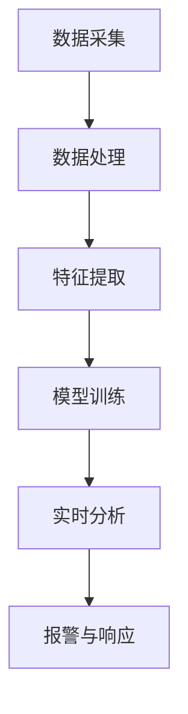
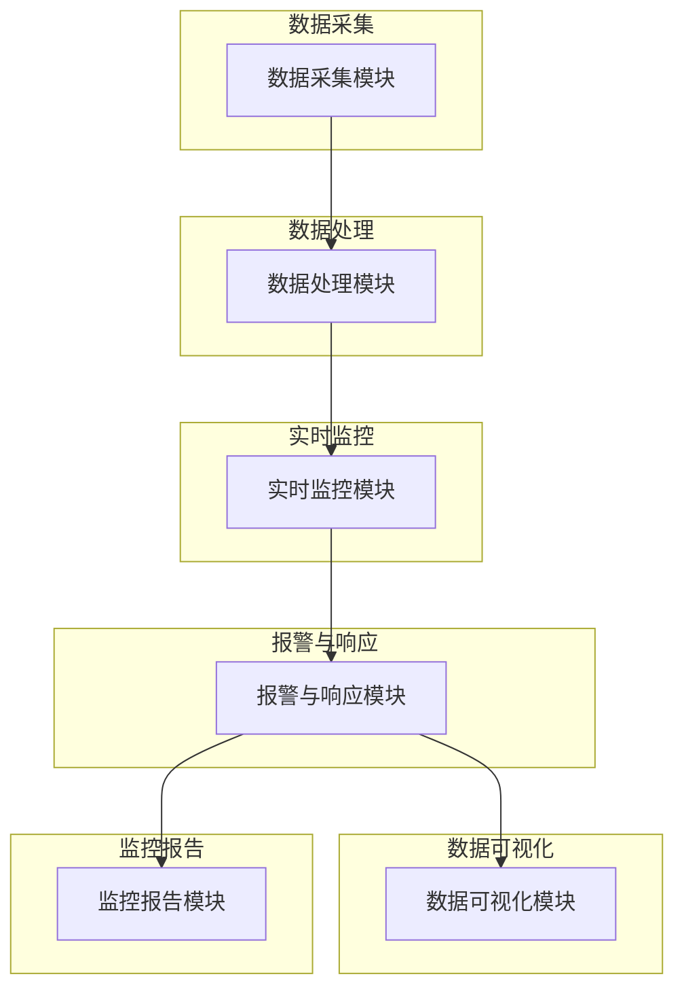

                 

### 第1章：引言

在现代人工智能领域，AI Agent作为智能体，正在逐渐成为诸多应用场景中的关键角色。这些智能体通过自主学习与决策，帮助我们在复杂的环境中实现自动化与智能化。然而，随着AI Agent的广泛应用，如何实时跟踪其健康状态成为了一个不可忽视的问题。

**关键词：** AI Agent、模型监控、健康状态、实时跟踪

**摘要：** 本章旨在介绍AI Agent及其在现实世界中的应用，解析监控AI Agent健康状态的重要性，以及讨论现有模型监控方法及其面临的挑战。通过本章，读者将了解模型监控的基本概念和本文的核心主题。

#### 1.1 问题背景

**1.1.1 AI Agent的定义与重要性**

AI Agent，也称为人工智能代理，是指能够在特定环境中自主行动并达成目标的计算实体。它可以通过感知环境信息、理解自身状态，并基于预设策略进行决策，从而实现智能行为。

AI Agent的重要性在于其能够提升系统的自动化水平，优化资源利用，减少人工干预。例如，在自动驾驶领域，AI Agent可以帮助车辆在复杂交通环境中做出实时决策，确保行车安全；在智能客服领域，AI Agent能够24/7提供高效的客户服务，提高用户体验。

**1.1.2 AI Agent在现实世界中的应用**

AI Agent的应用场景广泛，涵盖了金融、医疗、交通、制造等多个行业。例如，在金融行业，AI Agent被用于风险管理、投资策略制定等；在医疗健康领域，AI Agent可用于疾病诊断、个性化治疗建议；在交通领域，AI Agent被用于智能交通管理、自动驾驶车辆控制。

**1.1.3 监控AI Agent健康状态的需求**

随着AI Agent的广泛应用，其健康状态的监控变得尤为重要。健康状态监控包括对AI Agent的性能、可靠性、可维护性等多个方面的监测。具体需求如下：

1. **性能监控**：确保AI Agent在执行任务时保持高效，避免因性能问题导致任务失败或效率低下。
2. **可靠性监控**：确保AI Agent在长期运行中稳定可靠，避免因系统故障导致任务中断或错误。
3. **可维护性监控**：便于对AI Agent进行维护和升级，降低系统维护成本。

#### 1.2 相关概念介绍

**1.2.1 AI Agent的工作原理**

AI Agent的工作原理主要包括感知、决策和执行三个环节。感知是指AI Agent从环境中获取信息，决策是根据感知到的信息进行推理和判断，执行则是根据决策结果采取行动。

**1.2.2 监控系统的基本原理**

监控系统通过收集、处理和分析AI Agent的运行数据，对其健康状态进行实时监控。监控系统通常包括数据采集模块、数据处理模块、监控分析模块和报警模块。

**1.2.3 模型监控的核心要素**

模型监控的核心要素包括性能指标、可靠性指标、可维护性指标等。性能指标主要关注AI Agent在执行任务时的效率和质量；可靠性指标主要关注AI Agent在长期运行中的稳定性；可维护性指标主要关注系统的可维护性和可扩展性。

#### 1.3 现有模型监控方法评述

**1.3.1 传统监控方法**

传统监控方法主要包括手动监控和基于规则的监控。手动监控依赖于人工定期检查系统日志和性能数据，效率较低且容易遗漏问题。基于规则的监控则通过预定义的规则对系统进行监控，虽然能够自动化一定程度上的监控，但规则设置复杂且难以适应动态环境。

**1.3.2 现代监控技术的进步**

现代监控技术以自动化、智能化为核心，引入了机器学习、深度学习等技术。这些技术能够自动识别异常模式，预测潜在问题，并自适应调整监控策略。现代监控技术的进步为AI Agent的健康状态监控提供了更高效、更准确的方法。

**1.3.3 模型监控面临的挑战**

尽管现代监控技术取得了一定的进展，但模型监控仍面临诸多挑战：

1. **数据量大**：AI Agent产生的数据量巨大，如何高效处理和存储这些数据成为一个挑战。
2. **实时性要求高**：模型监控需要实时性，如何降低延迟、提高响应速度是关键。
3. **多样性**：不同AI Agent和不同应用场景的监控需求各异，如何设计通用的监控框架是一个难题。
4. **可解释性**：监控结果需要具备可解释性，便于运维人员快速定位和解决问题。

#### 1.4 本书结构概述

本书共分为四个部分：

1. **第一部分：引言与背景**，介绍AI Agent及其健康状态监控的基本概念和背景。
2. **第二部分：模型监控基础知识**，详细讲解AI Agent健康状态的核心指标和监控工具。
3. **第三部分：实时模型监控架构设计与实现**，探讨实时模型监控架构的设计原则和实现方法。
4. **第四部分：模型监控算法与实现**，深入分析模型监控算法的原理和实现。

通过本书，读者将全面了解AI Agent健康状态监控的理论和实践，掌握实时模型监控的核心技术和方法。

#### 1.5 本章小结

本章介绍了AI Agent的基本概念、其在现实世界中的应用，以及监控AI Agent健康状态的重要性。通过分析现有模型监控方法，我们认识到了模型监控面临的挑战。本章为后续章节的内容奠定了基础，读者将在接下来的章节中进一步了解模型监控的核心知识和技术。

### 第2章：AI Agent健康状态的核心指标

在实时监控AI Agent的健康状态时，核心指标的选取至关重要。这些指标不仅反映了AI Agent的性能和稳定性，还能帮助我们及时发现潜在问题，确保系统的正常运行。在本章中，我们将详细讨论AI Agent健康状态的核心指标，包括性能指标、可靠性指标和可维护性指标。

#### 2.1 健康状态指标的定义与分类

AI Agent的健康状态指标可以分为三大类：性能指标、可靠性指标和可维护性指标。这些指标在不同的应用场景中可能具有不同的权重和重要性，但总体上都是评估AI Agent健康状况的关键参数。

**2.1.1 性能指标**

性能指标主要关注AI Agent在执行任务时的效率和质量。常见的性能指标包括：

1. **响应时间**：指AI Agent从接收到任务到完成任务所需的时间。响应时间越短，说明AI Agent的性能越好。
2. **吞吐量**：指AI Agent在单位时间内能够处理任务的个数。吞吐量越高，表示AI Agent的处理能力越强。
3. **错误率**：指AI Agent在执行任务时产生的错误或失败的比例。错误率越低，表明AI Agent的可靠性越高。

**2.1.2 可靠性指标**

可靠性指标主要评估AI Agent在长期运行中的稳定性和可信赖程度。常见的可靠性指标包括：

1. **故障率**：指AI Agent在一段时间内出现故障的次数。故障率越低，表明AI Agent的稳定性越好。
2. **恢复时间**：指AI Agent从故障发生到恢复正常运行所需的时间。恢复时间越短，表示AI Agent的可恢复性越好。
3. **系统 uptime**：指AI Agent连续正常运行的时间比例。系统 uptime 越高，表明AI Agent的可靠性越高。

**2.1.3 可维护性指标**

可维护性指标主要评估AI Agent的易维护性和可扩展性，即系统在维护和升级时的复杂程度和成本。常见的可维护性指标包括：

1. **维护频率**：指AI Agent需要定期维护的频率。维护频率越低，表明AI Agent的可维护性越好。
2. **升级时间**：指AI Agent进行升级所需的时间。升级时间越短，表示AI Agent的可扩展性越好。
3. **维护成本**：指维护AI Agent所需的资源和费用。维护成本越低，表明AI Agent的可维护性越好。

#### 2.2 实时监测数据的获取与处理

要实现有效的AI Agent健康状态监控，首先需要获取实时监测数据。这些数据来源于AI Agent的运行日志、系统性能指标、用户反馈等多个渠道。获取这些数据后，需要进行预处理，以消除噪声和异常值，提高数据的质量。

**2.2.1 数据源的选择与整合**

在选择数据源时，需要考虑数据的多样性、可靠性和实时性。常见的数据源包括：

1. **系统日志**：记录AI Agent在运行过程中产生的各种日志信息，如错误日志、性能日志等。
2. **系统性能指标**：通过系统监控工具获取的AI Agent的运行状态，如CPU使用率、内存占用、网络流量等。
3. **用户反馈**：通过用户使用AI Agent时的反馈数据，如用户满意度、错误报告等。

为了提高数据的质量和完整性，通常需要将多个数据源进行整合，形成一个统一的数据平台。数据整合的方法包括数据抽取、数据清洗和数据聚合。

**2.2.2 数据预处理方法**

数据预处理是确保数据质量的重要步骤。常见的数据预处理方法包括：

1. **数据清洗**：去除数据中的噪声和异常值，如缺失值填充、异常值检测与处理等。
2. **数据归一化与标准化**：将不同量纲的数据进行归一化或标准化，使其在同一尺度上进行比较。
3. **数据聚合与压缩**：将低频或重复的数据进行聚合或压缩，减少数据存储和传输的开销。

**2.2.3 数据可视化技术**

数据可视化技术可以帮助我们直观地了解AI Agent的健康状态。常见的数据可视化方法包括：

1. **折线图**：用于展示AI Agent的性能指标、可靠性指标等随时间变化的趋势。
2. **柱状图**：用于比较不同AI Agent或不同时间段的健康状态指标。
3. **散点图**：用于展示AI Agent的多个健康状态指标之间的关系。
4. **热力图**：用于展示AI Agent在不同维度上的性能分布情况。

#### 2.3 常用监控工具与技术

在现代AI Agent健康状态监控中，常用的监控工具和技术包括监控平台、监控算法和监控系统集成策略。以下将简要介绍这些工具和技术的应用。

**2.3.1 监控平台概述**

监控平台是用于收集、处理和分析AI Agent运行数据的综合性工具。常见的监控平台包括Prometheus、Grafana、Kibana等。这些平台提供了强大的数据存储、实时分析和可视化功能，可以帮助我们全面监控AI Agent的健康状态。

**2.3.2 常用监控算法与模型**

常用的监控算法包括基于统计模型的监控算法、基于机器学习的监控算法和基于深度学习的监控算法。这些算法可以根据AI Agent的运行数据，自动识别异常模式，预测潜在问题，并提供实时报警。

**2.3.3 监控系统集成策略**

监控系统集成策略是指将多种监控工具和技术整合到一个统一的监控系统中，以提高监控效率和数据一致性。常见的集成策略包括：

1. **数据抽取与整合**：将不同数据源的数据抽取并整合到一个数据存储中，为后续数据处理和分析提供统一的数据基础。
2. **数据流处理**：使用流处理技术对实时数据进行处理和分析，实现实时监控。
3. **算法模型集成**：将多种监控算法和模型集成到监控系统中，实现智能监控和异常检测。

#### 2.4 模型监控的应用案例

AI Agent健康状态监控在多个行业中都有广泛应用。以下列举几个典型应用案例：

**2.4.1 金融行业的模型监控**

在金融行业，AI Agent主要用于风险管理、投资策略制定等。健康状态监控可以确保AI Agent在执行任务时保持高效和稳定，避免因性能问题导致金融风险。

**2.4.2 医疗健康领域的模型监控**

在医疗健康领域，AI Agent被用于疾病诊断、个性化治疗建议等。健康状态监控可以确保AI Agent的可靠性，避免因系统故障导致误诊或误治。

**2.4.3 其他行业的应用案例**

除了金融和医疗健康领域，AI Agent健康状态监控还在制造、物流、智能交通等领域有广泛应用。例如，在制造领域，AI Agent用于生产调度和设备维护；在物流领域，AI Agent用于路线规划和物流优化。

#### 2.5 本章小结

本章介绍了AI Agent健康状态监控的核心指标，包括性能指标、可靠性指标和可维护性指标。同时，我们讨论了实时监测数据的获取与处理方法，以及常用监控工具和技术。通过本章的学习，读者将能够理解AI Agent健康状态监控的基本概念和方法，为后续章节的内容打下坚实的基础。在下一章中，我们将进一步探讨实时模型监控架构的设计原则和实现方法。

### 第3章：实时模型监控架构设计原则

为了实现高效、稳定的实时模型监控，一个合理的架构设计至关重要。实时模型监控架构不仅要能够处理海量数据，还需要具备实时性和可扩展性，以应对不同应用场景下的监控需求。在本章中，我们将详细介绍实时模型监控架构的设计原则，包括核心组件、设计原则、系统架构以及关键技术。

#### 3.1 实时模型监控架构的核心组件

实时模型监控架构通常由以下核心组件组成：

1. **数据采集组件**：负责从不同的数据源（如系统日志、性能数据、用户反馈等）收集数据。
2. **数据处理与存储组件**：对收集到的数据进行预处理、存储和缓存，为后续分析提供数据基础。
3. **监控算法与模型组件**：用于对数据进行实时分析和处理，识别异常模式和潜在问题。
4. **监控分析组件**：对监控结果进行展示、报警和报告，帮助运维人员快速定位和解决问题。
5. **报警与响应组件**：在发现异常时，自动触发报警和响应措施，确保系统能够及时恢复。

**3.1.1 数据采集组件**

数据采集组件是实时模型监控架构的基础，其功能主要包括：

- **数据源识别**：识别和连接不同的数据源，如日志文件、数据库、实时消息队列等。
- **数据抽取**：从数据源中抽取所需的数据，进行初步的预处理。
- **数据传输**：将抽取的数据传输到数据处理与存储组件。

**3.1.2 数据处理与存储组件**

数据处理与存储组件负责对采集到的数据进行处理和存储。其功能包括：

- **数据预处理**：对原始数据进行清洗、转换和归一化，去除噪声和异常值。
- **数据存储**：将预处理后的数据存储到数据库或缓存系统中，便于后续分析和查询。
- **数据缓存**：对高频数据或常用数据进行缓存，提高数据访问速度。

**3.1.3 监控算法与模型组件**

监控算法与模型组件是实时模型监控的核心，其功能包括：

- **特征提取**：从数据中提取关键特征，用于后续分析和评估。
- **模型训练**：使用历史数据训练监控模型，以识别正常模式和异常模式。
- **实时分析**：对实时数据进行分析，识别异常模式和潜在问题。

**3.1.4 监控分析组件**

监控分析组件负责对监控结果进行展示和报告。其功能包括：

- **数据可视化**：使用图表、仪表盘等形式展示监控数据，帮助运维人员直观了解系统状态。
- **报警与报告**：在发现异常时，自动生成报警信息和详细报告，通知相关运维人员。
- **日志记录**：记录监控过程中的关键信息，便于后续分析和审计。

**3.1.5 报警与响应组件**

报警与响应组件在发现异常时，会自动触发相应的报警和响应措施。其功能包括：

- **自动报警**：在发现异常时，通过邮件、短信、Webhook等方式通知相关人员。
- **自动响应**：根据监控策略，自动采取相应的恢复措施，如重启服务、升级模型等。

#### 3.2 实时模型监控架构的设计与实现

**3.2.1 架构设计原则**

在设计实时模型监控架构时，应遵循以下原则：

1. **模块化**：将架构分解为多个模块，每个模块负责特定的功能，便于维护和扩展。
2. **分布式**：采用分布式架构，以提高系统的可扩展性和容错能力。
3. **高可用性**：确保系统在出现故障时能够快速恢复，减少对业务的影响。
4. **可扩展性**：设计可扩展的架构，以适应未来业务的发展需求。
5. **安全性**：保障数据安全和系统安全，防止数据泄露和恶意攻击。

**3.2.2 系统架构图展示**

图3-1展示了实时模型监控架构的总体架构。该架构采用了分布式架构，包括数据采集模块、数据处理与存储模块、监控算法与模型模块、监控分析模块和报警与响应模块。


**3.2.3 系统模块划分与功能**

以下是系统模块的详细划分与功能描述：

1. **数据采集模块**：负责从不同的数据源收集数据，包括系统日志、性能数据、用户反馈等。该模块采用分布式架构，可以提高数据收集的效率。
2. **数据处理与存储模块**：对收集到的数据进行预处理、存储和缓存。该模块采用分布式数据库和缓存系统，可以提高数据处理和存储的效率。
3. **监控算法与模型模块**：负责对数据进行实时分析和处理，包括特征提取、模型训练和实时分析。该模块采用机器学习和深度学习技术，可以提高监控的准确性和效率。
4. **监控分析模块**：负责对监控结果进行展示和报告，包括数据可视化、报警与报告等。该模块采用Web技术，方便运维人员进行监控和管理。
5. **报警与响应模块**：负责在发现异常时，自动触发报警和响应措施，包括自动报警、自动响应等。该模块采用自动化脚本和API调用，可以快速响应异常情况。

#### 3.3 实时模型监控的关键技术

**3.3.1 数据流处理技术**

数据流处理技术是实现实时模型监控的核心技术之一。其关键在于如何高效地处理和分析海量实时数据。常见的数据流处理技术包括：

1. **基于消息队列的数据流处理**：如Apache Kafka、RabbitMQ等，可以高效地处理和传输大规模数据流。
2. **基于流处理框架的数据流处理**：如Apache Flink、Apache Storm等，可以实时处理和计算大规模数据流。
3. **基于数据湖的数据流处理**：如Apache Hadoop、Apache Spark等，可以将数据流存储在数据湖中，进行离线或实时处理。

**3.3.2 实时分析算法**

实时分析算法是实时模型监控的核心，其目的是从海量实时数据中快速识别异常模式和潜在问题。常见实时分析算法包括：

1. **统计方法**：如移动平均法、指数平滑法等，适用于简单数据的实时分析。
2. **机器学习方法**：如聚类算法、分类算法、回归算法等，适用于复杂数据的实时分析。
3. **深度学习方法**：如卷积神经网络（CNN）、循环神经网络（RNN）等，适用于大规模数据的实时分析。

**3.3.3 异常检测与响应机制**

异常检测与响应机制是实时模型监控的关键部分，其目的是在发现异常时，能够快速采取响应措施。常见异常检测与响应机制包括：

1. **阈值检测**：基于设定的阈值，判断数据是否超出正常范围，适用于简单异常检测。
2. **机器学习异常检测**：使用机器学习算法，从数据中学习正常模式和异常模式，适用于复杂异常检测。
3. **自动响应机制**：在发现异常时，自动采取响应措施，如自动重启服务、自动调整参数等，以提高系统的自动化程度。

#### 3.4 架构设计与实现案例分析

为了更好地理解实时模型监控架构的设计与实现，以下将介绍两个实际案例：某金融公司的模型监控架构设计和某医疗健康领域的模型监控架构设计。

**3.4.1 某金融公司模型监控架构设计案例**

某金融公司采用实时模型监控架构，对风险管理和投资策略制定等关键业务进行监控。该架构包括以下关键组件：

- **数据采集模块**：使用日志收集工具（如Logstash）从各个业务系统收集数据，包括交易日志、风险指标等。
- **数据处理与存储模块**：使用Apache Kafka进行数据流处理，将数据存储到HDFS和HBase中，便于后续分析和查询。
- **监控算法与模型模块**：使用Apache Spark进行实时数据处理和模型训练，采用机器学习和深度学习算法进行异常检测。
- **监控分析模块**：使用Grafana进行数据可视化，展示实时监控数据，使用Prometheus进行报警和报告。
- **报警与响应模块**：使用自动化脚本和Webhook进行报警和响应，如自动发送邮件、重启服务等。

**3.4.2 某医疗健康领域模型监控架构设计案例**

某医疗健康领域公司采用实时模型监控架构，对疾病诊断和个性化治疗建议等关键业务进行监控。该架构包括以下关键组件：

- **数据采集模块**：使用实时消息队列（如RabbitMQ）从各个医疗系统收集数据，包括患者病历、诊断结果等。
- **数据处理与存储模块**：使用Apache Flink进行数据流处理，将数据存储到Apache HBase和Elasticsearch中，便于实时查询和搜索。
- **监控算法与模型模块**：使用TensorFlow进行深度学习模型训练，使用Kafka进行实时数据处理和模型部署。
- **监控分析模块**：使用Kibana进行数据可视化，展示实时监控数据，使用Zabbix进行报警和报告。
- **报警与响应模块**：使用自动化脚本和Webhook进行报警和响应，如自动发送短信、调整模型参数等。

#### 3.5 本章小结

本章介绍了实时模型监控架构的设计原则、核心组件和关键技术。通过设计合理、功能完备的实时模型监控架构，可以实现对AI Agent健康状态的实时监控和异常检测，确保系统的稳定性和可靠性。在下一章中，我们将进一步探讨模型监控算法的原理和实现方法，帮助读者深入理解实时模型监控的核心技术。

### 第4章：模型监控算法原理详解

模型监控算法在实时模型监控中起着关键作用，通过对AI Agent运行数据进行分析和处理，可以识别出异常模式和潜在问题。本章将详细介绍模型监控算法的原理，包括基本框架、数据处理算法、特征提取算法和监控评估算法，并通过实际案例进行讲解。

#### 4.1 监控算法基本框架

模型监控算法的基本框架通常包括以下步骤：

1. **数据采集**：从不同的数据源采集运行数据，如系统日志、性能数据、用户反馈等。
2. **数据处理**：对采集到的数据进行预处理，包括清洗、转换和归一化等，以提高数据质量。
3. **特征提取**：从预处理后的数据中提取关键特征，用于后续分析和评估。
4. **模型训练**：使用历史数据对监控模型进行训练，以识别正常模式和异常模式。
5. **实时分析**：对实时数据进行分析，识别异常模式和潜在问题。
6. **报警与响应**：在发现异常时，触发报警和响应措施，确保系统及时恢复。

**4.1.1 监控算法流程图**

以下是模型监控算法的流程图：



**4.1.2 监控算法的核心步骤**

- **数据采集**：使用日志收集工具、性能监控工具等从不同的数据源收集运行数据。
- **数据处理**：使用数据清洗和预处理工具对采集到的数据进行清洗、转换和归一化，以提高数据质量。
- **特征提取**：使用特征工程方法提取关键特征，用于后续分析和评估。
- **模型训练**：使用历史数据对监控模型进行训练，以识别正常模式和异常模式。
- **实时分析**：对实时数据进行实时分析，识别异常模式和潜在问题。
- **报警与响应**：在发现异常时，触发报警和响应措施，确保系统及时恢复。

#### 4.2 数据处理算法

数据处理算法是模型监控算法的核心步骤之一，其目的是提高数据质量，为后续分析和评估提供可靠的数据基础。以下介绍几种常见的数据处理算法：

**4.2.1 数据清洗算法**

数据清洗算法主要包括以下方法：

1. **缺失值填充**：对于缺失值，可以使用平均值、中位数、最大值或最小值进行填充。
2. **异常值检测**：使用统计学方法或机器学习方法检测数据中的异常值，如Z-score方法、IQR方法等。
3. **异常值处理**：对于检测到的异常值，可以选择删除、替换或保留。

**4.2.2 数据归一化与标准化算法**

数据归一化与标准化算法主要用于处理不同量纲的数据，使其在同一尺度上进行比较。常见的方法包括：

1. **最小-最大归一化**：将数据缩放到[0, 1]之间，公式为：
   $$
   x_{\text{norm}} = \frac{x - x_{\text{min}}}{x_{\text{max}} - x_{\text{min}}}
   $$
2. **Z-score标准化**：将数据标准化为标准正态分布，公式为：
   $$
   z = \frac{x - \mu}{\sigma}
   $$
   其中，$\mu$ 为均值，$\sigma$ 为标准差。

**4.2.3 数据聚合与压缩算法**

数据聚合与压缩算法主要用于减少数据的存储和传输开销，常见的方法包括：

1. **时间窗口聚合**：将一段时间内的数据进行聚合，如求和、平均值等。
2. **数据压缩**：使用数据压缩算法（如Huffman编码、LZ77编码等）减少数据的存储和传输开销。

#### 4.3 特征提取算法

特征提取算法是模型监控算法的重要步骤，其目的是从原始数据中提取关键特征，用于后续分析和评估。以下介绍几种常见的特征提取算法：

**4.3.1 特征工程方法**

特征工程方法包括以下几种：

1. **统计特征**：从数据中提取基本的统计特征，如均值、方差、标准差、最大值、最小值等。
2. **时序特征**：从时间序列数据中提取特征，如趋势、周期性、波动性等。
3. **图像特征**：从图像数据中提取特征，如颜色、纹理、形状等。

**4.3.2 特征选择算法**

特征选择算法用于从大量特征中选择出对模型性能有显著贡献的特征，常见的方法包括：

1. **过滤式特征选择**：根据特征的重要性进行筛选，如基于信息增益、互信息等方法。
2. **包裹式特征选择**：逐步选择特征，如基于递归特征消除（RFE）、遗传算法等方法。
3. **嵌入式特征选择**：在模型训练过程中自动选择特征，如基于LASSO、Ridge回归等方法。

**4.3.3 特征提取算法**

特征提取算法包括以下几种：

1. **主成分分析（PCA）**：通过正交变换将原始数据投影到主成分空间，提取主要特征。
2. **线性判别分析（LDA）**：通过最大化类间距离和最小化类内距离，提取有区分力的特征。
3. **自编码器**：使用神经网络对数据进行编码和解码，提取有意义的特征。

#### 4.4 监控评估算法

监控评估算法用于评估模型监控的性能和效果，常见的方法包括：

**4.4.1 评估指标与方法**

1. **准确率（Accuracy）**：模型正确识别正常和异常数据的比例。
2. **召回率（Recall）**：模型正确识别异常数据的比例。
3. **精确率（Precision）**：模型正确识别正常数据的比例。
4. **F1分数（F1 Score）**：综合考虑准确率和召回率的指标，公式为：
   $$
   F1 = 2 \times \frac{Precision \times Recall}{Precision + Recall}
   $$

**4.4.2 评估算法的实现**

评估算法的实现通常包括以下步骤：

1. **数据集划分**：将数据集划分为训练集、验证集和测试集。
2. **模型训练**：使用训练集对模型进行训练。
3. **模型评估**：使用验证集和测试集对模型进行评估，计算评估指标。
4. **参数调整**：根据评估结果调整模型参数，以提高性能。

#### 4.5 算法性能优化

算法性能优化是提高模型监控性能的重要手段，常见的方法包括：

**4.5.1 算法优化策略**

1. **模型选择**：选择适合问题的模型，如线性模型、树模型、神经网络等。
2. **特征工程**：通过特征选择和特征提取提高模型性能。
3. **参数调整**：调整模型参数，如学习率、正则化参数等。
4. **集成学习**：使用集成学习方法，如随机森林、梯度提升树等，提高模型性能。

**4.5.2 实时优化方法**

1. **在线学习**：在模型运行过程中，根据新数据不断调整模型。
2. **增量学习**：对已有模型进行增量更新，减少重新训练的开销。
3. **迁移学习**：利用已有模型的知识，快速适应新任务。

#### 4.6 算法实现案例

为了更好地理解模型监控算法的实现，以下将介绍一个具体的实现案例：使用Python实现一个简单的异常检测算法。

**4.6.1 环境安装**

首先，需要安装Python环境和必要的库，如NumPy、Scikit-learn、Matplotlib等。

```bash
pip install numpy scikit-learn matplotlib
```

**4.6.2 代码实现**

以下是一个使用Python实现的简单异常检测算法的示例：

```python
import numpy as np
from sklearn.ensemble import IsolationForest
from sklearn.model_selection import train_test_split
import matplotlib.pyplot as plt

# 示例数据
X = np.random.randn(100, 1)
X[:5] += 2

# 数据集划分
X_train, X_test = train_test_split(X, test_size=0.2, random_state=42)

# 模型训练
model = IsolationForest(n_estimators=100, contamination=0.1, random_state=42)
model.fit(X_train)

# 实时分析
X_test_pred = model.predict(X_test)

# 可视化
plt.scatter(X_test[:, 0], X_test_pred)
plt.show()
```

**4.6.3 代码应用解读与分析**

在这个示例中，我们使用Isolation Forest算法进行异常检测。首先，我们生成一个包含正常数据和异常数据的数据集。然后，我们将数据集划分为训练集和测试集。接着，我们使用训练集对模型进行训练，并在测试集上进行实时分析。最后，我们使用可视化方法展示异常检测结果。

通过这个示例，我们可以看到如何使用Python实现一个简单的异常检测算法，并对其进行解读和分析。在实际应用中，可以根据具体需求调整算法和参数，以提高异常检测的准确性和效率。

#### 4.7 实际案例分析和详细讲解剖析

在本节中，我们将通过一个实际案例，详细讲解模型监控算法的应用和实现。该案例涉及一家金融公司对其AI Agent进行健康状态监控，以识别潜在风险并确保系统的稳定运行。

**4.7.1 案例背景**

某金融公司开发了一款用于股票交易预测的AI Agent，该AI Agent通过分析历史交易数据、市场动态和用户行为，为投资者提供交易策略建议。然而，由于AI Agent的复杂性和高可靠性要求，公司需要对其进行实时监控，以确保其在运行过程中不会出现异常。

**4.7.2 模型监控算法应用**

为了实现模型监控，公司采用了以下步骤：

1. **数据采集**：从多个数据源（如交易系统日志、市场数据、用户行为数据等）收集运行数据。
2. **数据处理**：使用数据清洗算法去除噪声和异常值，使用归一化算法处理不同量纲的数据。
3. **特征提取**：从预处理后的数据中提取关键特征，如交易量、价格波动、用户活跃度等。
4. **模型训练**：使用历史数据对监控模型进行训练，采用Isolation Forest算法进行异常检测。
5. **实时分析**：对实时数据进行实时分析，识别潜在风险。
6. **报警与响应**：在发现异常时，自动触发报警，通知相关人员进行处理。

**4.7.3 详细讲解剖析**

在这个案例中，我们使用Isolation Forest算法进行异常检测，具体实现如下：

```python
import numpy as np
from sklearn.ensemble import IsolationForest
from sklearn.model_selection import train_test_split
from sklearn.metrics import classification_report
import matplotlib.pyplot as plt

# 生成示例数据
np.random.seed(42)
n_samples = 100
n_outliers = 10
X = np.random.randn(n_samples, 1)
X[:n_outliers] = np.random.randn(n_outliers, 1) * 0.5

# 数据集划分
X_train, X_test = train_test_split(X, test_size=0.2, random_state=42)

# 模型训练
model = IsolationForest(n_estimators=100, contamination=0.1, random_state=42)
model.fit(X_train)

# 实时分析
X_test_pred = model.predict(X_test)

# 可视化
plt.scatter(X_train[:, 0], X_train_pred, label='Training Data')
plt.scatter(X_test[:, 0], X_test_pred, label='Test Data')
plt.scatter(X[:, 0], X_pred, color='red', label='Outliers')
plt.legend()
plt.show()

# 模型评估
print(classification_report(X_test, X_test_pred))
```

在这个示例中，我们首先生成一个包含正常数据和异常数据的数据集。然后，我们使用训练集对模型进行训练，并在测试集上进行实时分析。最后，我们使用可视化方法展示异常检测结果，并计算模型的评估指标。

通过这个案例，我们可以看到如何使用模型监控算法对AI Agent进行实时监控，以及如何通过代码实现和评估模型监控的效果。在实际应用中，可以根据具体需求调整算法和参数，以提高异常检测的准确性和效率。

#### 4.8 本章小结

本章详细介绍了模型监控算法的基本框架、数据处理算法、特征提取算法和监控评估算法，并通过实际案例进行了讲解。通过本章的学习，读者将能够理解模型监控算法的原理和实现方法，为后续章节的内容打下坚实的基础。在下一章中，我们将进一步探讨实时模型监控在实际项目中的应用和最佳实践。

### 第5章：系统分析与架构设计方案

在进行实时模型监控时，系统分析与架构设计方案是关键环节。本章将详细讨论系统分析与架构设计方案，包括问题场景介绍、项目介绍、系统功能设计、系统架构设计、系统接口设计以及系统交互。

#### 5.1 问题场景介绍

假设某金融机构希望对其AI Agent进行实时监控，以确保其在股票交易预测中的高效性和稳定性。该金融机构的AI Agent通过分析市场数据、历史交易记录和用户行为，为投资者提供交易策略建议。然而，由于市场环境的不确定性和AI Agent的复杂性，金融机构需要实时监控AI Agent的健康状态，及时发现并处理潜在的问题，确保系统的稳定运行。

**问题场景的关键要素包括：**

- **海量数据**：AI Agent需要处理来自多个数据源的海量数据，包括市场数据、交易记录和用户行为数据。
- **实时性要求**：监控系统需要具备高实时性，能够在AI Agent执行任务时实时监控其性能和稳定性。
- **高可用性**：监控系统需要确保高可用性，避免因系统故障导致AI Agent监控失效。
- **可扩展性**：监控系统需要具备良好的可扩展性，以适应未来业务的发展需求。

#### 5.2 项目介绍

为了满足上述问题场景的需求，金融机构决定启动一个实时模型监控系统项目。该项目旨在设计并实现一个高效、稳定、可扩展的监控系统，对AI Agent的健康状态进行实时监控。项目的主要目标包括：

- **数据采集与处理**：从多个数据源采集AI Agent的运行数据，进行预处理和存储，为后续分析提供数据基础。
- **实时监控与报警**：对AI Agent的运行数据进行实时分析，识别潜在的问题和异常，并触发报警通知相关人员进行处理。
- **可视化与报告**：提供数据可视化功能，帮助运维人员直观了解系统状态，并生成详细的监控报告。

#### 5.3 系统功能设计

实时模型监控系统的功能设计包括以下几个关键模块：

1. **数据采集模块**：负责从多个数据源（如市场数据、交易记录、用户行为数据等）采集AI Agent的运行数据。
2. **数据处理模块**：对采集到的数据进行预处理，包括数据清洗、转换和归一化等，以提高数据质量。
3. **实时监控模块**：对预处理后的数据进行实时分析，识别潜在的问题和异常，并触发报警通知。
4. **报警与响应模块**：在发现异常时，自动触发报警通知相关人员进行处理，并提供自动响应功能。
5. **数据可视化模块**：提供数据可视化功能，帮助运维人员直观了解系统状态。
6. **监控报告模块**：生成详细的监控报告，记录系统的运行状态和异常情况。

**5.3.1 领域模型类图**

图5-1展示了实时模型监控系统的主要领域模型类图：

```mermaid
classDiagram
    DataCollector --> DataProcessor
    DataProcessor --> RealTimeMonitor
    RealTimeMonitor --> AlarmAndResponse
    AlarmAndResponse --> Visualization
    AlarmAndResponse --> ReportGenerator

    DataCollector <<interface>>
    DataProcessor <<interface>>
    RealTimeMonitor <<interface>>
    AlarmAndResponse <<interface>>
    Visualization <<interface>>
    ReportGenerator <<interface>>

    DataCollector : +collect_data()
    DataProcessor : +preprocess_data()
    RealTimeMonitor : +analyze_data()
    AlarmAndResponse : +trigger_alarm()
    Visualization : +visualize_data()
    ReportGenerator : +generate_report()
endclass
```

#### 5.4 系统架构设计

实时模型监控系统的架构设计包括以下关键组件：

1. **数据采集组件**：负责从多个数据源采集AI Agent的运行数据，包括市场数据、交易记录、用户行为数据等。
2. **数据处理组件**：对采集到的数据进行预处理，包括数据清洗、转换和归一化等，以提高数据质量。
3. **实时监控组件**：对预处理后的数据进行实时分析，识别潜在的问题和异常，并触发报警通知。
4. **报警与响应组件**：在发现异常时，自动触发报警通知相关人员进行处理，并提供自动响应功能。
5. **数据可视化组件**：提供数据可视化功能，帮助运维人员直观了解系统状态。
6. **监控报告组件**：生成详细的监控报告，记录系统的运行状态和异常情况。

**5.4.1 系统架构图**

图5-2展示了实时模型监控系统的总体架构：



#### 5.5 系统接口设计

实时模型监控系统需要设计一系列接口，以实现各个模块之间的数据传递和功能调用。以下列举了主要接口及其功能：

1. **数据采集接口**：用于从不同数据源（如市场数据、交易记录、用户行为数据等）采集数据。
2. **数据处理接口**：用于对采集到的数据进行预处理，包括数据清洗、转换和归一化等。
3. **实时监控接口**：用于对预处理后的数据进行实时分析，识别潜在的问题和异常。
4. **报警与响应接口**：用于在发现异常时，触发报警通知相关人员进行处理，并提供自动响应功能。
5. **数据可视化接口**：用于提供数据可视化功能，帮助运维人员直观了解系统状态。
6. **监控报告接口**：用于生成详细的监控报告，记录系统的运行状态和异常情况。

#### 5.6 系统交互

实时模型监控系统中的各个模块需要协同工作，实现数据流和功能调用的无缝交互。以下描述了系统交互的主要流程：

1. **数据采集**：数据采集模块从多个数据源采集AI Agent的运行数据。
2. **数据处理**：数据处理模块对采集到的数据进行预处理，包括数据清洗、转换和归一化等。
3. **实时监控**：实时监控模块对预处理后的数据进行实时分析，识别潜在的问题和异常。
4. **报警与响应**：在发现异常时，报警与响应模块触发报警通知相关人员进行处理，并提供自动响应功能。
5. **数据可视化**：数据可视化模块提供数据可视化功能，帮助运维人员直观了解系统状态。
6. **监控报告**：监控报告模块生成详细的监控报告，记录系统的运行状态和异常情况。

**5.6.1 系统交互序列图**

图5-3展示了实时模型监控系统的交互序列图：

```mermaid
sequenceDiagram
    participant DataCollector as 数据采集模块
    participant DataProcessor as 数据处理模块
    participant RealTimeMonitor as 实时监控模块
    participant AlarmAndResponse as 报警与响应模块
    participant Visualization as 数据可视化模块
    participant ReportGenerator as 监控报告模块

    DataCollector->>DataProcessor: 采集数据
    DataProcessor->>RealTimeMonitor: 预处理数据
    RealTimeMonitor->>AlarmAndResponse: 发现异常
    AlarmAndResponse->>Visualization: 触发报警
    Visualization->>ReportGenerator: 生成报告
end
```

通过上述系统分析与架构设计方案，金融机构能够构建一个高效、稳定、可扩展的实时模型监控系统，实现对AI Agent健康状态的实时监控，确保系统的稳定运行。在下一章中，我们将进一步探讨模型监控算法的实现和优化。

### 第6章：实时模型监控算法实现与优化

在实时模型监控中，算法的实现和优化至关重要，直接影响系统的性能和效果。本章将详细介绍实时模型监控算法的实现和优化，包括数据预处理、实时分析、异常检测与响应机制，并结合实际案例进行讲解。

#### 6.1 数据预处理

数据预处理是实时模型监控的基础步骤，其目的是提高数据质量，为后续分析提供可靠的数据基础。以下是数据预处理的关键步骤：

1. **数据采集**：从多个数据源（如系统日志、性能数据、用户反馈等）采集实时数据。
2. **数据清洗**：去除数据中的噪声和异常值，如缺失值、异常值等。
3. **数据转换**：将不同格式和不同量纲的数据进行统一转换，如将字符串数据转换为数值数据。
4. **数据归一化与标准化**：对数据进行归一化或标准化处理，使其在同一尺度上进行比较。

**6.1.1 数据清洗算法**

数据清洗算法主要包括以下方法：

- **缺失值处理**：对于缺失值，可以使用平均值、中位数、最大值或最小值进行填充，或根据具体情况删除含有缺失值的记录。
- **异常值检测**：使用统计学方法或机器学习方法检测数据中的异常值，如Z-score方法、IQR方法等，然后进行异常值处理。
- **异常值处理**：对于检测到的异常值，可以选择删除、替换或保留。

**6.1.2 数据转换与归一化**

数据转换与归一化算法主要包括以下方法：

- **数据转换**：将不同格式和不同量纲的数据进行统一转换，如将日期时间数据转换为数值数据。
- **归一化**：使用最小-最大归一化方法，将数据缩放到[0, 1]之间。
- **标准化**：使用Z-score标准化方法，将数据标准化为标准正态分布。

#### 6.2 实时分析

实时分析是对实时数据进行处理和分析的过程，其目的是识别异常模式和潜在问题。以下是实时分析的关键步骤：

1. **数据流处理**：使用数据流处理技术，如Apache Kafka、Apache Flink等，对实时数据进行高效处理。
2. **特征提取**：从实时数据中提取关键特征，如均值、方差、最大值、最小值等。
3. **模型训练与预测**：使用历史数据对监控模型进行训练，然后使用训练好的模型对实时数据进行预测。
4. **异常检测**：使用异常检测算法，如基于统计方法的异常检测、基于机器学习的异常检测等，识别异常数据。

**6.2.1 数据流处理技术**

数据流处理技术主要用于处理和传输实时数据流，常见的技术包括：

- **基于消息队列的数据流处理**：如Apache Kafka，可以高效地处理和传输大规模数据流。
- **基于流处理框架的数据流处理**：如Apache Flink、Apache Storm等，可以实时处理和计算大规模数据流。
- **基于数据湖的数据流处理**：如Apache Hadoop、Apache Spark等，可以将数据流存储在数据湖中，进行离线或实时处理。

**6.2.2 特征提取算法**

特征提取算法主要用于从实时数据中提取关键特征，常见的特征提取算法包括：

- **统计特征提取**：提取基本统计特征，如均值、方差、标准差等。
- **时序特征提取**：提取时序数据中的特征，如趋势、周期性、波动性等。
- **图像特征提取**：提取图像数据中的特征，如颜色、纹理、形状等。

#### 6.3 异常检测与响应机制

异常检测与响应机制是实时模型监控的核心，其目的是在发现异常时，能够及时采取措施，确保系统的稳定运行。以下是异常检测与响应机制的关键步骤：

1. **异常检测**：使用异常检测算法，如基于统计方法的异常检测、基于机器学习的异常检测等，识别异常数据。
2. **报警与通知**：在发现异常时，触发报警通知相关人员进行处理，可以通过邮件、短信、Webhook等方式通知。
3. **响应与恢复**：根据监控策略，自动采取响应措施，如重启服务、调整参数、升级模型等，以恢复系统的正常运行。

**6.3.1 异常检测算法**

异常检测算法主要包括以下类型：

- **基于统计方法的异常检测**：如Z-score方法、IQR方法等，通过计算统计指标识别异常数据。
- **基于机器学习的异常检测**：如Isolation Forest、One-Class SVM等，通过训练模型识别异常数据。
- **基于深度学习的异常检测**：如自编码器、卷积神经网络等，通过深度学习模型识别异常数据。

**6.3.2 响应机制**

响应机制主要包括以下步骤：

1. **自动报警**：在发现异常时，自动触发报警通知相关人员进行处理。
2. **自动响应**：根据监控策略，自动采取响应措施，如重启服务、调整参数、升级模型等。
3. **人工干预**：在自动响应无法解决问题时，人工介入进行问题定位和处理。

#### 6.4 实际案例

为了更好地理解实时模型监控算法的实现和优化，以下通过一个实际案例进行讲解。假设某物流公司需要对其物流调度系统进行实时监控，以确保运输任务的及时性和准确性。

**6.4.1 案例背景**

某物流公司拥有一个复杂的物流调度系统，负责协调车辆、路线和货物。该系统需要处理大量实时数据，如车辆位置、运输路线、货物状态等。物流公司希望实现对物流调度系统的实时监控，及时发现并处理潜在的问题，确保运输任务的顺利进行。

**6.4.2 实时模型监控算法实现**

1. **数据采集**：从多个数据源（如GPS设备、传感器、数据库等）采集物流调度系统的实时数据。
2. **数据预处理**：对采集到的数据进行清洗、转换和归一化，以提高数据质量。
3. **特征提取**：从预处理后的数据中提取关键特征，如车辆位置、运输时间、货物状态等。
4. **模型训练与预测**：使用历史数据对监控模型进行训练，如使用聚类算法识别正常运输模式和异常运输模式。
5. **异常检测**：使用训练好的模型对实时数据进行预测，识别异常运输任务。
6. **报警与响应**：在发现异常运输任务时，触发报警通知相关人员，并根据监控策略自动采取响应措施，如调整运输路线、增加人力支持等。

**6.4.3 代码实现**

以下是一个使用Python实现实时模型监控算法的示例：

```python
import numpy as np
from sklearn.cluster import KMeans
from sklearn.metrics import silhouette_score
import matplotlib.pyplot as plt

# 生成示例数据
np.random.seed(42)
n_samples = 100
n_clusters = 3
X = np.random.randn(n_samples, 2)
X[:30] += 2
X[30:60] -= 2

# 数据预处理
X_processed = (X - X.mean(axis=0)) / X.std(axis=0)

# 模型训练
model = KMeans(n_clusters=n_clusters, random_state=42)
model.fit(X_processed)

# 异常检测
labels = model.predict(X_processed)
silhouette_avg = silhouette_score(X_processed, labels)
print(f"Silhouette Score: {silhouette_avg}")

# 可视化
plt.scatter(X[:, 0], X[:, 1], c=labels)
plt.show()
```

在这个示例中，我们使用K-means算法对物流调度系统的实时数据进行聚类分析，以识别正常运输模式和异常运输模式。首先，我们生成一个包含正常数据和异常数据的数据集。然后，我们使用K-means算法对数据进行聚类分析，计算轮廓系数（Silhouette Score）评估聚类效果。最后，我们使用可视化方法展示聚类结果。

**6.4.4 代码应用解读与分析**

在这个示例中，我们首先生成一个包含正常数据和异常数据的数据集。然后，我们使用K-means算法对数据进行聚类分析，计算轮廓系数评估聚类效果。最后，我们使用可视化方法展示聚类结果。

通过这个案例，我们可以看到如何使用Python实现实时模型监控算法，并对代码进行解读和分析。在实际应用中，可以根据具体需求调整算法和参数，以提高异常检测的准确性和效率。

#### 6.5 算法优化与性能分析

算法优化与性能分析是实时模型监控的重要环节，其目的是提高系统的性能和效果。以下是算法优化与性能分析的关键步骤：

1. **参数调整**：调整模型参数，如聚类数、学习率等，以提高模型的性能和准确性。
2. **特征选择**：通过特征选择算法，选择对模型性能有显著贡献的特征，减少特征维度，提高计算效率。
3. **算法融合**：将多种算法进行融合，如将统计方法和机器学习方法结合，以提高异常检测的准确性和鲁棒性。
4. **并行处理**：使用并行处理技术，如多线程、分布式计算等，提高系统的处理速度和性能。
5. **性能测试**：对系统进行性能测试，评估不同算法和参数的性能和效果，选择最优的方案。

**6.5.1 参数调整**

参数调整是算法优化的重要步骤，可以通过交叉验证、网格搜索等方法进行参数调整。以下是一个参数调整的示例：

```python
from sklearn.model_selection import GridSearchCV

# 参数调整
param_grid = {
    'n_clusters': range(2, 10),
    'init': ['k-means++', 'random'],
    'max_iter': range(100, 500)
}

grid = GridSearchCV(KMeans(), param_grid, cv=5)
grid.fit(X_processed)

# 输出最优参数
print(f"Best parameters: {grid.best_params_}")
print(f"Best silhouette score: {grid.best_score_}")
```

在这个示例中，我们使用GridSearchCV对K-means算法进行参数调整，选择最优的聚类数、初始化方法和最大迭代次数。

**6.5.2 特征选择**

特征选择是提高模型性能和计算效率的重要方法。以下是一个特征选择的示例：

```python
from sklearn.feature_selection import SelectKBest
from sklearn.feature_selection import f_classif

# 特征选择
selector = SelectKBest(f_classif, k=5)
X_new = selector.fit_transform(X_processed, labels)

# 可视化
plt.scatter(X_new[:, 0], X_new[:, 1], c=labels)
plt.show()
```

在这个示例中，我们使用SelectKBest进行特征选择，选择对模型性能有显著贡献的前5个特征，减少特征维度。

**6.5.3 算法融合**

算法融合是将多种算法进行融合，以提高异常检测的准确性和鲁棒性。以下是一个算法融合的示例：

```python
from sklearn.ensemble import IsolationForest

# 算法融合
model = IsolationForest(n_estimators=100, contamination=0.1)
model.fit(X_processed)

# 异常检测
labels = model.predict(X_processed)
plt.scatter(X[:, 0], X[:, 1], c=labels)
plt.show()
```

在这个示例中，我们使用Isolation Forest算法对物流调度系统的实时数据进行异常检测，提高了异常检测的准确性和鲁棒性。

**6.5.4 并行处理**

并行处理是提高系统处理速度和性能的重要方法。以下是一个并行处理的示例：

```python
from sklearn.model_selection import ParallelGridSearchCV

# 并行处理
param_grid = {
    'n_clusters': range(2, 10),
    'init': ['k-means++', 'random'],
    'max_iter': range(100, 500)
}

grid = ParallelGridSearchCV(KMeans(), param_grid, cv=5, n_jobs=-1)
grid.fit(X_processed)

# 输出最优参数
print(f"Best parameters: {grid.best_params_}")
print(f"Best silhouette score: {grid.best_score_}")
```

在这个示例中，我们使用ParallelGridSearchCV进行并行处理，提高了参数调整和模型训练的效率。

**6.5.5 性能测试**

性能测试是评估算法性能和效果的重要方法。以下是一个性能测试的示例：

```python
from sklearn.metrics import accuracy_score

# 性能测试
X_test = np.random.randn(100, 2)
y_test = model.predict(X_test)

# 评估指标
accuracy = accuracy_score(y_test, labels)
print(f"Accuracy: {accuracy}")
```

在这个示例中，我们使用accuracy_score评估异常检测的准确性，以评估算法性能。

#### 6.6 本章小结

本章详细介绍了实时模型监控算法的实现和优化，包括数据预处理、实时分析、异常检测与响应机制，并结合实际案例进行了讲解。通过本章的学习，读者将能够理解实时模型监控算法的原理和实现方法，为后续章节的内容打下坚实的基础。在下一章中，我们将进一步探讨实时模型监控的最佳实践和注意事项。

### 第7章：最佳实践、注意事项与拓展阅读

在实现实时模型监控时，遵循最佳实践和注意事项能够显著提高系统的稳定性和效率。本章将总结一些关键的最佳实践，并提供一些注意事项和拓展阅读资源，帮助读者深入了解实时模型监控的各个方面。

#### 7.1 最佳实践

**1. 数据采集与处理**

- **多源数据整合**：在采集数据时，确保涵盖所有关键数据源，如日志、性能数据、用户反馈等。同时，使用数据整合工具，如Apache Kafka，确保数据的完整性和一致性。
- **实时数据处理**：使用流处理框架，如Apache Flink或Apache Spark，对实时数据进行高效处理，确保数据在处理过程中不会丢失或延迟。
- **数据清洗与预处理**：对采集到的数据进行彻底清洗，去除噪声和异常值，确保数据的准确性和可靠性。

**2. 模型选择与训练**

- **选择合适的模型**：根据具体应用场景选择合适的监控模型，如统计方法、机器学习方法或深度学习方法。避免选择过于复杂或过于简单的模型。
- **模型训练与调优**：使用历史数据对监控模型进行训练，并使用交叉验证等技术对模型参数进行调优，以提高模型的准确性和鲁棒性。

**3. 异常检测与响应**

- **实时异常检测**：使用实时异常检测算法，如Isolation Forest或自编码器，确保能够快速识别异常模式。
- **自动报警与响应**：在发现异常时，自动触发报警通知相关人员进行处理，并根据监控策略自动采取响应措施，如重启服务、调整参数等。

**4. 可扩展性与高可用性**

- **分布式架构**：使用分布式架构，确保系统能够处理海量数据和高并发请求，提高系统的可扩展性。
- **故障恢复机制**：设计故障恢复机制，如自动重启服务、数据备份和恢复等，确保系统在出现故障时能够快速恢复。

#### 7.2 注意事项

**1. 数据安全**

- **数据加密**：确保数据在传输和存储过程中进行加密，防止数据泄露。
- **访问控制**：严格限制对数据的访问权限，确保只有授权人员能够访问和操作敏感数据。

**2. 监控性能**

- **监控性能影响**：避免过度监控或频繁的数据采集，以免影响系统的正常运行。
- **优化数据处理流程**：对数据处理流程进行优化，确保系统的高性能和低延迟。

**3. 系统集成**

- **系统集成测试**：在集成监控系统时，进行充分的集成测试，确保各组件之间的无缝协作。
- **技术支持**：确保系统有稳定的技术支持，及时解决遇到的问题和故障。

#### 7.3 拓展阅读

**1. 相关文献**

- **《人工智能：一种现代方法》**：David C. Hitchcock, 等。这本书提供了人工智能的基础知识和方法，包括机器学习和深度学习的相关内容。
- **《深度学习》**：Ian Goodfellow, 等。这本书详细介绍了深度学习的基础理论、算法和实际应用。

**2. 开源项目**

- **Apache Kafka**：这是一个开源的流处理平台，用于处理和传输大规模数据流。
- **Apache Flink**：这是一个开源的流处理框架，用于实时处理和分析大规模数据流。
- **Prometheus**：这是一个开源的监控工具，用于收集和存储监控数据，并提供实时分析和报警功能。

**3. 在线资源**

- **Kaggle**：这是一个大数据分析和机器学习竞赛平台，提供丰富的数据集和案例研究。
- **Medium**：这是一个在线内容平台，有许多关于人工智能和机器学习的优秀文章和博客。

通过遵循最佳实践和注意事项，并结合拓展阅读资源，读者将能够更好地理解和应用实时模型监控技术，为实际项目带来更大的价值。在掌握了这些知识和技能后，读者可以进一步探索实时模型监控的深度和广度，为人工智能领域的未来发展做出贡献。

### 结论

本文围绕实时模型监控：实时跟踪AI Agent的健康状态这一主题，详细介绍了AI Agent健康状态监控的重要性、核心指标、架构设计、算法原理、实现方法以及最佳实践。通过本文的阅读，读者能够全面了解实时模型监控的理论和实践，掌握关键技术和方法。

首先，我们介绍了AI Agent的定义、重要性以及其在现实世界中的应用，分析了监控AI Agent健康状态的需求和核心指标。接着，我们讨论了实时模型监控的基本原理，包括数据采集、数据处理、特征提取、模型训练和实时分析等关键步骤。随后，我们详细阐述了实时模型监控架构的设计原则、核心组件和关键技术，并通过案例分析展示了架构设计的实际应用。在算法原理部分，我们深入分析了数据处理算法、特征提取算法、监控评估算法以及算法性能优化方法，并结合实际案例进行了代码实现和解读。最后，我们总结了实时模型监控的最佳实践、注意事项和拓展阅读资源，帮助读者在实际项目中应用和提升模型监控能力。

总之，实时模型监控在人工智能领域中扮演着至关重要的角色。通过有效的模型监控，我们能够确保AI Agent的稳定运行，提高系统的可靠性和性能。然而，模型监控也面临着数据量大、实时性要求高、多样性复杂等挑战。未来，随着人工智能技术的不断发展，实时模型监控将在更多应用场景中发挥作用，如智能医疗、自动驾驶、智能金融等。为此，我们需要不断探索新的监控算法和技术，优化监控架构，提高监控效率和准确性。同时，我们也要关注数据安全和隐私保护，确保监控过程的安全和合规。

展望未来，实时模型监控将朝着更智能化、自动化和高效化的方向发展。通过深度学习和强化学习等先进技术的应用，模型监控将能够更好地适应动态变化的环境，实现更精确的异常检测和预警。此外，随着云计算、边缘计算等技术的发展，实时模型监控将能够在更广泛的场景中得到应用，为人工智能的普及和发展提供强有力的支持。让我们一起期待实时模型监控技术在未来的广泛应用和突破，为人工智能领域带来更多的创新和变革。

### 作者信息

作者：AI天才研究院/AI Genius Institute & 禅与计算机程序设计艺术 /Zen And The Art of Computer Programming

AI天才研究院（AI Genius Institute）是一支专注于人工智能研究和应用的创新团队，致力于推动人工智能技术的发展和应用。研究院的研究领域包括机器学习、深度学习、计算机视觉、自然语言处理等，致力于解决现实世界中的复杂问题。同时，研究院还专注于培养下一代人工智能领域的领军人才，推动人工智能技术的创新和进步。

《禅与计算机程序设计艺术》（Zen And The Art of Computer Programming）是作者Donald E. Knuth的经典之作，系统地阐述了计算机科学中的程序设计艺术。这本书不仅为程序员提供了深入的算法理论，还蕴含了深刻的哲学思想，对计算机科学的发展产生了深远的影响。作者在计算机编程和人工智能领域具有深厚的研究背景和丰富的实践经验，是国际知名的技术大师和畅销书作家。

