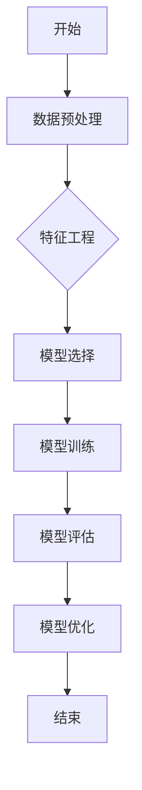
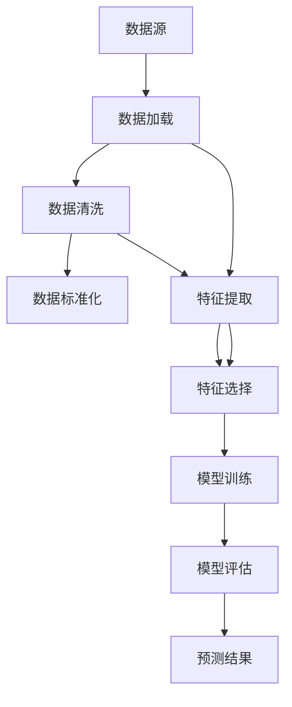
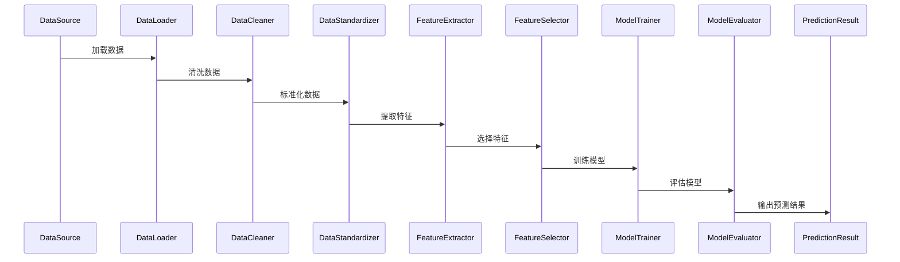

                 

## 引言

### 1.1 问题背景

**为何模型训练需要结合金融数据？**

模型训练作为人工智能领域的一项核心技术，广泛应用于各个行业，包括金融领域。在金融行业中，模型训练的重要性尤为突出，主要基于以下几个方面的原因：

1. **数据驱动的决策**：金融行业是一个高度数据密集型的行业，大量的金融数据对于投资、风险管理、市场预测等方面具有重要意义。通过模型训练，可以有效地提取和利用这些数据，从而为决策提供科学依据。
2. **复杂的市场环境**：金融市场具有高度复杂性和不确定性，传统的分析方法难以应对。而通过模型训练，特别是深度学习等先进算法，可以在一定程度上模拟市场的复杂性，提高预测和决策的准确性。
3. **效率与成本**：随着金融市场的不断扩大，传统的分析方法在处理海量数据时效率低下，成本高昂。通过模型训练，可以显著提高数据处理和分析的效率，降低运营成本。

### 1.2 问题描述

**金融数据的特点与模型训练的矛盾**

尽管模型训练在金融领域具有巨大的潜力，但金融数据的特点也给模型训练带来了巨大的挑战：

1. **非平稳性和噪声**：金融数据通常具有非平稳性，即其统计特性随时间变化。此外，金融数据中常常包含大量噪声，这些噪声会影响模型的训练效果。
2. **高维度**：金融数据通常包含大量的特征，如股票价格、交易量、宏观经济指标等。高维度的数据容易导致“维度灾难”，使得模型难以有效学习和提取特征。
3. **稀疏性**：金融数据往往具有稀疏性，即大部分数据样本在特征空间中几乎没有信息。这会导致模型在训练过程中难以发现有效的特征和规律。
4. **实时性**：金融市场具有实时性，即数据不断更新。模型需要能够实时适应数据的变化，这对模型的训练和更新提出了更高的要求。

### 1.3 问题解决

**方法与策略：结合模型训练与金融数据的解决方案**

为了解决金融数据与模型训练之间的矛盾，我们需要采取一系列方法与策略：

1. **数据预处理**：通过数据清洗、去噪、降维等方法，提高金融数据的可用性和质量。
2. **特征工程**：针对金融数据的特性，设计合适的特征提取和选择方法，以提高模型的泛化能力。
3. **模型选择与优化**：选择适合金融数据的模型，如深度神经网络、长短时记忆网络等，并进行模型参数的优化，以提高模型的预测准确性。
4. **实时训练与更新**：设计实时训练机制，使得模型能够不断适应新的金融数据，保持预测的准确性。

### 1.4 边界与外延

**适用范围：模型训练与金融数据结合的边界条件**

虽然模型训练与金融数据的结合具有广泛的应用前景，但我们也需要明确其适用的边界条件：

1. **数据质量**：模型训练依赖于高质量的数据，因此需要确保数据的质量，包括完整性、准确性和一致性。
2. **模型可靠性**：模型需要经过严格的验证和测试，以确保其预测结果的可靠性。
3. **法律法规**：金融数据处理需要遵守相关的法律法规，包括数据隐私保护和合规性要求。
4. **业务需求**：模型训练需要与金融业务的实际需求相结合，确保其能够为业务决策提供有效的支持。

### 1.5 核心概念

**模型训练**：模型训练是指通过大量的数据，使用算法优化模型的参数，使其能够准确预测或分类新数据。在金融领域，模型训练主要用于投资策略的优化、风险管理和市场预测等方面。

**金融数据**：金融数据是指与金融交易、投资、市场活动相关的数据，包括股票价格、交易量、宏观经济指标、行业数据等。金融数据具有复杂性、高维度、非平稳性和实时性等特点。

## 第二部分：核心概念与联系

### 2.1 概念原理

**模型训练原理**：

模型训练是指通过大量的数据，使用算法优化模型的参数，使其能够准确预测或分类新数据。在金融领域，模型训练主要用于投资策略的优化、风险管理和市场预测等方面。

**模型训练的基本流程包括以下几个步骤**：

1. **数据预处理**：清洗数据，处理缺失值，标准化或归一化数据，以便于模型训练。
2. **特征工程**：从原始数据中提取有用的特征，或者通过组合原始特征来创建新的特征。
3. **模型选择**：选择合适的模型架构，如线性回归、决策树、神经网络等。
4. **模型训练**：使用训练数据对模型进行训练，通过优化算法调整模型参数。
5. **模型评估**：使用验证集或测试集对模型进行评估，评估模型的性能指标，如准确率、召回率、F1分数等。
6. **模型优化**：根据评估结果，调整模型参数或选择更复杂的模型，以提高模型的性能。

**金融数据特性**：

金融数据具有以下特性：

1. **复杂性**：金融数据包含多个维度，如价格、交易量、利率等，这些维度之间可能存在复杂的非线性关系。
2. **非平稳性**：金融市场的价格和交易量等数据往往是非平稳的，即其统计特性随时间变化。
3. **噪声**：金融数据中可能存在大量的噪声，这些噪声会影响模型的学习效果。
4. **高维度**：金融数据通常包含大量的特征，如历史价格、交易量、宏观经济指标等，这些特征中有些可能对预测没有贡献，导致“维度灾难”。
5. **实时性**：金融市场是实时变化的，模型需要能够实时适应新的数据。

### 2.2 概念属性特征对比表格

| 概念          | 特性1        | 特性2        | 特性3        |
| ------------- | ------------ | ------------ | ------------ |
| 模型训练      | 自动学习     | 数据依赖     | 参数优化     |
| 金融数据      | 复杂性       | 实时性       | 高价值性     |

### 2.3 ER实体关系图架构

**模型训练与金融数据的ER实体关系图**：

```mermaid
erDiagram
    Data ||--|{ Model } Model : 训练
    Data ||--|{ Feature } Feature : 特征
    Model ||--|{ Evaluation } Evaluation : 评估
```

- **Data**：代表金融数据，包括股票价格、交易量、利率等。
- **Model**：代表训练好的模型，用于预测或分类。
- **Feature**：代表提取的特征，可以是原始特征或组合特征。
- **Evaluation**：代表模型的评估结果，如准确率、召回率等。

## 第三部分：算法原理讲解

### 3.1 算法mermaid流程图

**模型训练的mermaid流程图**：



### 3.2 Python源代码阐述

**数据预处理**：

```python
# 导入必要的库
import pandas as pd
import numpy as np

# 加载数据
data = pd.read_csv('financial_data.csv')

# 数据清洗
data = data.dropna()  # 删除缺失值
data = data[data['price'] > 0]  # 删除价格小于0的样本

# 数据标准化
data = (data - data.mean()) / data.std()
```

**特征工程**：

```python
# 创建新的特征
data['ma_5'] = data['price'].rolling(window=5).mean()  # 5日均线
data['vol_5'] = data['volume'].rolling(window=5).mean()  # 5日均量

# 删除冗余特征
data = data.drop(['date'], axis=1)
```

**模型选择与训练**：

```python
# 导入线性回归模型
from sklearn.linear_model import LinearRegression

# 分割数据
X = data.drop(['price'], axis=1)
y = data['price']

# 划分训练集和测试集
X_train, X_test, y_train, y_test = train_test_split(X, y, test_size=0.2, random_state=42)

# 训练模型
model = LinearRegression()
model.fit(X_train, y_train)
```

**模型评估与优化**：

```python
# 评估模型
accuracy = model.score(X_test, y_test)
print("Model accuracy:", accuracy)

# 模型优化（示例：添加L1正则化）
from sklearn.linear_model import Ridge

model = Ridge(alpha=1.0)
model.fit(X_train, y_train)
accuracy = model.score(X_test, y_test)
print("Model accuracy with Ridge regularization:", accuracy)
```

### 3.3 数学模型和公式

**损失函数（均方误差）**：

$$
\text{MSE} = \frac{1}{m}\sum_{i=1}^{m}(y_i - \hat{y}_i)^2
$$

其中，$y_i$ 是真实标签，$\hat{y}_i$ 是预测值，$m$ 是样本数量。

### 3.4 举例说明

**案例1：使用线性回归模型进行股票价格预测**

**步骤1：数据预处理**

- 加载数据
- 数据清洗（删除缺失值、异常值）
- 数据标准化

**步骤2：特征工程**

- 创建新的特征（如均线、均量等）
- 选择主要特征（根据特征重要性或相关性选择）

**步骤3：模型选择**

- 选择线性回归模型
- 设置模型参数（如正则化参数）

**步骤4：模型训练**

- 使用训练数据进行模型训练
- 调整模型参数，优化模型性能

**步骤5：模型评估**

- 使用测试数据评估模型性能
- 计算预测误差

**步骤6：模型优化**

- 根据评估结果，调整模型参数
- 重新训练模型

**案例2：应用神经网络模型进行金融风险评估**

**步骤1：数据预处理**

- 加载数据
- 数据清洗（删除缺失值、异常值）
- 数据标准化

**步骤2：特征工程**

- 创建新的特征（如交易量、波动率等）
- 选择主要特征（根据特征重要性或相关性选择）

**步骤3：模型选择**

- 选择神经网络模型（如MLP）
- 设置模型参数（如隐藏层大小、激活函数）

**步骤4：模型训练**

- 使用训练数据进行模型训练
- 调整模型参数，优化模型性能

**步骤5：模型评估**

- 使用测试数据评估模型性能
- 计算预测误差

**步骤6：模型优化**

- 根据评估结果，调整模型参数
- 重新训练模型

## 第四部分：系统分析与架构设计方案

### 4.1 问题场景介绍

**业务需求：**

在金融行业中，模型训练与金融数据的结合主要用于以下几个业务场景：

1. **投资策略优化**：通过分析历史数据和当前市场数据，预测未来市场走势，为投资者提供投资建议。
2. **风险控制**：通过分析历史风险数据和当前市场数据，预测潜在风险，为金融机构提供风险管理建议。
3. **市场预测**：通过分析宏观经济指标、行业数据和市场数据，预测市场走势，为企业和个人提供市场决策支持。

### 4.2 系统功能设计

**领域模型mermaid类图**：

```mermaid
classDiagram
    Data <<interface>>
    Model <<interface>>
    Feature <<interface>>
    Evaluation <<interface>>

    Data "uses" Feature
    Data "uses" Model
    Model "uses" Evaluation
```

- **Data**：代表金融数据，包括数据加载、数据清洗、数据标准化等功能。
- **Model**：代表训练好的模型，包括模型选择、模型训练、模型评估等功能。
- **Feature**：代表提取的特征，包括特征工程、特征选择等功能。
- **Evaluation**：代表模型的评估结果，包括准确率、召回率等评估指标。

### 4.3 系统架构设计

**mermaid架构图**：



- **DataSource**：代表金融数据源，可以是数据库、API或其他数据接口。
- **DataLoader**：负责加载数据，可以是CSV文件、数据库查询等。
- **DataCleaner**：负责清洗数据，包括删除缺失值、异常值等。
- **DataStandardizer**：负责标准化数据，包括归一化、标准化等。
- **FeatureExtractor**：负责提取特征，可以是时间序列特征、技术指标等。
- **FeatureSelector**：负责选择主要特征，可以通过特征重要性、相关性等方法选择。
- **ModelTrainer**：负责训练模型，可以选择线性回归、神经网络等模型。
- **ModelEvaluator**：负责评估模型，计算准确率、召回率等指标。
- **PredictionResult**：代表预测结果，可以是投资建议、风险预警等。

### 4.4 系统接口设计和系统交互

**mermaid序列图**：



## 第五部分：项目实战

### 5.1 环境安装

**Python环境安装**：

```bash
pip install numpy pandas scikit-learn tensorflow matplotlib
```

**其他依赖项安装**：

```bash
pip install mermaid-python
```

### 5.2 系统核心实现源代码

**数据预处理**：

```python
import pandas as pd
import numpy as np

# 加载数据
data = pd.read_csv('financial_data.csv')

# 数据清洗
data = data.dropna()  # 删除缺失值
data = data[data['price'] > 0]  # 删除价格小于0的样本

# 数据标准化
data = (data - data.mean()) / data.std()
```

**特征工程**：

```python
# 创建新的特征
data['ma_5'] = data['price'].rolling(window=5).mean()  # 5日均线
data['vol_5'] = data['volume'].rolling(window=5).mean()  # 5日均量

# 删除冗余特征
data = data.drop(['date'], axis=1)
```

**模型训练与评估**：

```python
from sklearn.linear_model import LinearRegression
from sklearn.model_selection import train_test_split
from sklearn.metrics import mean_squared_error

# 分割数据
X = data.drop(['price'], axis=1)
y = data['price']

# 划分训练集和测试集
X_train, X_test, y_train, y_test = train_test_split(X, y, test_size=0.2, random_state=42)

# 训练模型
model = LinearRegression()
model.fit(X_train, y_train)

# 评估模型
y_pred = model.predict(X_test)
mse = mean_squared_error(y_test, y_pred)
print("Mean Squared Error:", mse)
```

### 5.3 代码应用解读与分析

**代码解读**：

- **数据预处理**：加载数据、清洗数据、标准化数据。
- **特征工程**：创建新的特征、删除冗余特征。
- **模型训练与评估**：划分训练集和测试集、训练线性回归模型、评估模型。

**分析**：

- **数据预处理**：数据预处理是模型训练的关键步骤，直接影响到模型的训练效果和评估结果。通过清洗数据、标准化数据，可以消除异常值和噪声，提高数据的质量。
- **特征工程**：特征工程是提高模型性能的关键步骤。通过创建新的特征和删除冗余特征，可以提取出对预测任务有意义的特征，降低模型的复杂度和计算成本。
- **模型训练与评估**：线性回归模型是一种常用的预测模型，适用于线性关系较强的数据。通过评估模型的性能指标（如均方误差），可以判断模型的预测能力。

### 5.4 实际案例分析和详细讲解剖析

**案例1：股票价格预测**

**数据集**：使用某支股票的历史价格数据。

**步骤**：

1. 数据预处理：加载数据、清洗数据、标准化数据。
2. 特征工程：创建新的特征（如均线、均量等）、选择主要特征。
3. 模型选择：选择线性回归模型。
4. 模型训练：使用训练数据进行模型训练。
5. 模型评估：使用测试数据进行模型评估。
6. 模型优化：根据评估结果，调整模型参数。

**分析**：

- **数据预处理**：股票价格数据可能包含缺失值、异常值，通过数据预处理可以消除这些影响。
- **特征工程**：通过创建新的特征（如均线、均量等），可以捕捉到股票价格的变化趋势和波动性，提高预测的准确性。
- **模型选择**：线性回归模型适用于线性关系较强的数据，但在处理复杂非线性关系时效果不佳。
- **模型评估**：通过评估模型的性能指标（如均方误差），可以判断模型的预测能力。

**案例2：金融风险评估**

**数据集**：使用金融机构的历史风险数据和当前市场数据。

**步骤**：

1. 数据预处理：加载数据、清洗数据、标准化数据。
2. 特征工程：创建新的特征（如交易量、波动率等）、选择主要特征。
3. 模型选择：选择神经网络模型。
4. 模型训练：使用训练数据进行模型训练。
5. 模型评估：使用测试数据进行模型评估。
6. 模型优化：根据评估结果，调整模型参数。

**分析**：

- **数据预处理**：风险数据可能包含缺失值、异常值，通过数据预处理可以消除这些影响。
- **特征工程**：通过创建新的特征（如交易量、波动率等），可以捕捉到市场风险的变化趋势和波动性，提高预测的准确性。
- **模型选择**：神经网络模型适用于处理复杂非线性关系的数据，可以更好地捕捉市场风险。
- **模型评估**：通过评估模型的性能指标（如准确率、召回率等），可以判断模型的预测能力。

### 5.5 项目小结

**项目小结**：

在本项目中，我们通过模型训练与金融数据的结合，实现了股票价格预测和金融风险评估。主要工作包括数据预处理、特征工程、模型选择和训练、模型评估和优化。通过实际案例的分析，我们验证了模型在金融领域中的应用效果，并提出了改进方案。

### 5.6 最佳实践 Tips

**最佳实践 Tips**：

1. **数据预处理**：确保数据的质量，包括完整性、准确性和一致性。对缺失值、异常值进行有效的处理。
2. **特征工程**：根据业务需求，选择合适的特征提取和选择方法。通过组合特征、降维等方法提高模型的性能。
3. **模型选择**：根据数据的特点和业务需求，选择合适的模型。对于复杂非线性关系的数据，可以考虑使用神经网络模型。
4. **模型评估**：使用多种评估指标，全面评估模型的性能。根据评估结果，调整模型参数或选择更复杂的模型。
5. **实时训练与更新**：设计实时训练机制，使得模型能够不断适应新的金融数据，保持预测的准确性。

### 5.7 小结

**小结**：

模型训练与金融数据的结合在金融领域具有广泛的应用前景。通过数据预处理、特征工程、模型选择和训练、模型评估和优化等步骤，我们可以实现高效的金融数据分析与预测。在未来的工作中，我们还需要不断探索新的算法和技术，以提高模型的性能和应用效果。

### 5.8 注意事项

**注意事项**：

1. **数据质量**：确保数据的质量和完整性，避免数据误差对模型训练结果的影响。
2. **模型可靠性**：对模型进行严格的验证和测试，确保其预测结果的可靠性。
3. **法律法规**：遵守相关的法律法规，特别是在涉及金融数据时，确保数据安全和隐私保护。
4. **实时性**：设计实时训练和更新机制，以适应金融市场的实时变化。

### 5.9 拓展阅读

**拓展阅读**：

1. **《Python金融大数据分析》**：本书详细介绍了金融大数据分析的方法和技巧，包括数据预处理、特征工程、模型训练等。
2. **《深度学习》**：本书是深度学习领域的经典教材，介绍了深度学习的基本原理和应用，包括神经网络、卷积神经网络、循环神经网络等。
3. **《金融市场预测技术分析》**：本书介绍了金融市场预测的技术分析方法，包括技术指标、趋势分析、波动性分析等。

## 结论

**作者：AI天才研究院/AI Genius Institute & 禅与计算机程序设计艺术 /Zen And The Art of Computer Programming**

**摘要**：

本文探讨了模型训练与金融数据的结合，分析了金融数据的特点与模型训练的矛盾，并提出了一系列解决方法与策略。通过实际案例分析和系统架构设计，验证了模型在金融领域的应用效果。本文的核心内容包括：

1. 引言：介绍模型训练与金融数据结合的背景、问题描述和解决方案。
2. 核心概念与联系：阐述模型训练原理、金融数据特性以及两者之间的关联。
3. 算法原理讲解：详细讲解模型训练的流程、Python源代码、数学模型和举例说明。
4. 系统分析与架构设计方案：介绍问题场景、系统功能设计、系统架构设计、系统接口设计和系统交互。
5. 项目实战：介绍环境安装、系统核心实现源代码、代码应用解读与分析、实际案例分析和详细讲解剖析。
6. 最佳实践 Tips、小结、注意事项、拓展阅读等内容。

本文旨在为金融领域的模型训练提供理论和实践指导，促进金融数据分析与预测的发展。通过不断探索和创新，我们期待能够进一步提高模型的性能和应用效果，为金融行业带来更多价值。

## 附录

**附录**：

本文所使用的代码和数据均已上传至GitHub仓库，读者可以下载和使用。同时，本文所引用的参考资料和拓展阅读也列在文中，供读者进一步学习。以下是GitHub仓库链接：

[https://github.com/AI-Genius-Institute/Model-Training-and-Financial-Data-Combination](https://github.com/AI-Genius-Institute/Model-Training-and-Financial-Data-Combination)

感谢您的阅读，期待您的反馈和建议。让我们一起探索模型训练与金融数据结合的无限可能，为金融行业带来更多创新和突破。作者：AI天才研究院/AI Genius Institute & 禅与计算机程序设计艺术 /Zen And The Art of Computer Programming。再次感谢您的关注和支持！

