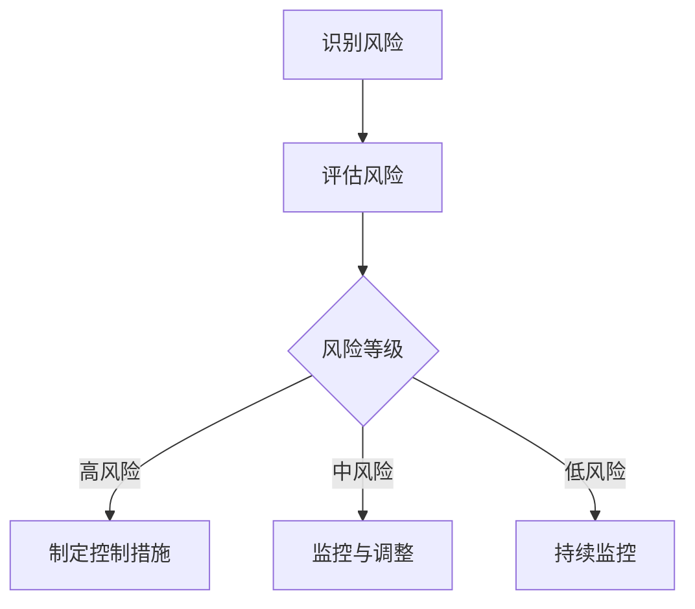
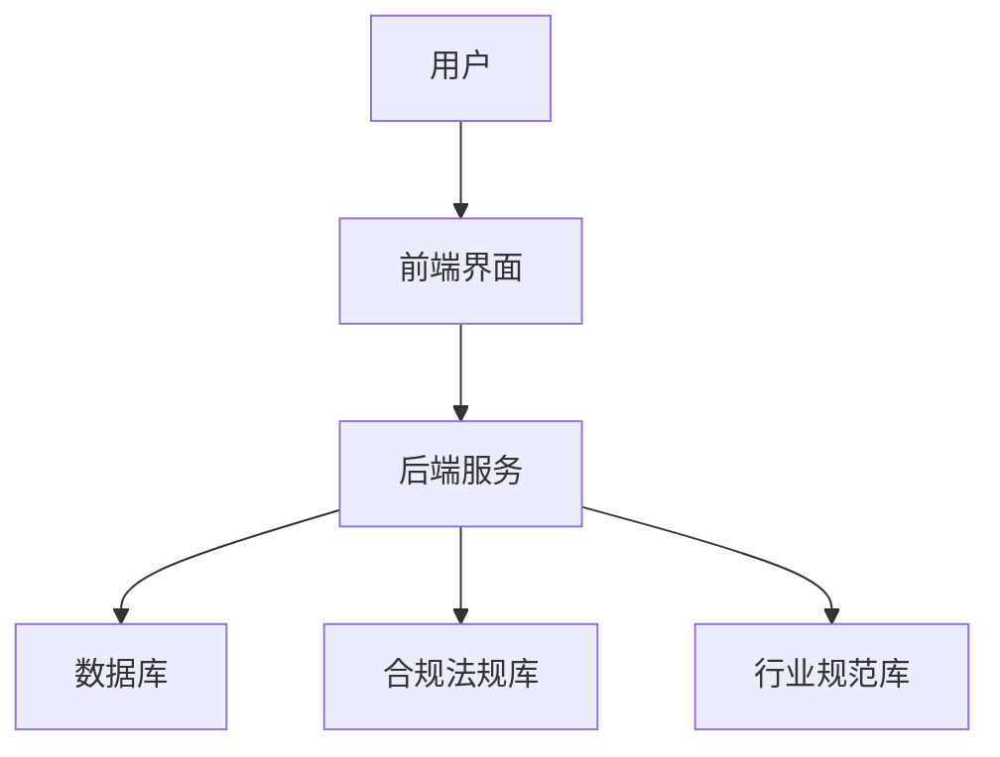
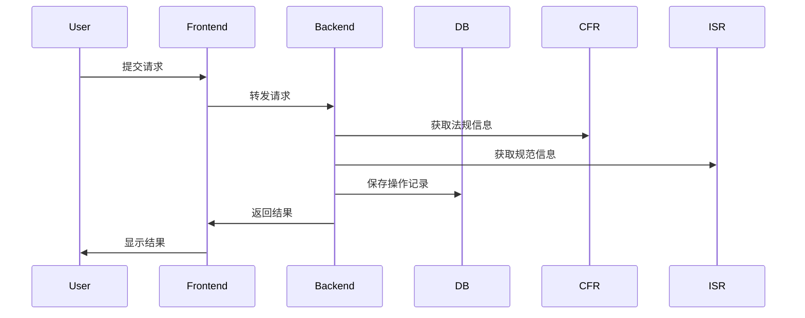

                 


# 法律合规与监管

关键词：法律合规、监管、企业运营、信息技术、风险管理

摘要：本文深入探讨了法律合规与监管在企业运营中的重要性，分析了核心概念及其相互关系，提出了合规管理体系的构建和实施策略，并提供了实际案例进行分析，为企业在复杂多变的环境中实现合法、合规运营提供了有益的指导。

## 1. 背景介绍

### 1.1 核心概念

**法律合规与监管**是企业运营过程中必须遵循的一系列法律、法规和标准。法律合规主要涉及企业是否遵守国家及地方政府的法律法规，如公司法、合同法、劳动法等。监管则更多关注行业内部的规范和要求，例如金融行业的监管规定、互联网行业的网络安全标准等。

在信息技术高速发展的今天，企业的业务模式不断革新，这给法律合规与监管带来了新的挑战。首先，企业需要确保其技术解决方案符合相关法律法规，例如数据保护法、隐私法等。其次，企业需要关注技术本身可能带来的风险，如网络安全漏洞、数据泄露等，并采取相应的防范措施。

### 1.2 问题背景

随着全球化和数字化进程的加快，企业面临的合规压力越来越大。一方面，各国政府对企业的监管越来越严格，出台了更多的新法规和标准。另一方面，企业自身也需要应对快速变化的市场环境和技术进步带来的合规挑战。例如，云计算的普及使得数据存储和传输变得更加复杂，企业需要确保数据的安全和隐私保护。

### 1.3 问题描述

法律合规与监管的问题主要体现在以下几个方面：

- **法规遵守**：企业是否能够及时了解并遵守最新的法律法规，确保其运营符合法律要求。
- **合规风险**：企业面临的各种法律风险，如合同纠纷、劳动争议、知识产权侵权等。
- **监管要求**：企业需要满足行业特定的监管要求，例如金融行业的反洗钱规定、医疗行业的隐私保护要求等。
- **技术合规**：企业需要确保其技术解决方案和技术产品符合相关法律法规和行业标准。

### 1.4 问题解决

为了解决法律合规与监管的问题，企业可以采取以下策略：

- **建立合规管理体系**：企业应建立一套完整的合规管理体系，包括合规意识教育、风险评估、合规监控和合规报告等环节。
- **合规风险评估**：定期对企业运营中的法律风险进行评估，识别潜在的法律风险，并采取相应的控制措施。
- **合规培训与教育**：定期对员工进行合规培训，提高员工的合规意识，确保员工了解并遵守相关法律法规和行业标准。
- **合规监控与报告**：建立合规监控机制，对企业运营中的合规情况进行实时监控，并定期向管理层和监管部门报告合规情况。

### 1.5 边界与外延

法律合规与监管的边界涉及企业的各个方面，包括但不限于：

- **财务管理**：企业必须遵循财务报告的法律法规，确保财务报告的真实性和完整性。
- **数据保护**：企业在处理个人信息和敏感数据时，必须遵守数据保护法律法规，确保数据的安全和隐私。
- **环境与劳工**：企业必须遵守环境保护和劳工权益的法律法规，确保其运营不会对环境造成负面影响，同时保障员工的合法权益。

### 1.6 概念结构与核心要素组成

法律合规与监管的概念结构可以分解为以下几个核心要素：

- **法律法规与行业规范**：构成法律合规与监管的基础。
- **合规管理体系**：包括合规意识教育、合规风险评估、合规监控与报告等机制。
- **合规执行与监督**：确保合规措施得到有效实施和监督。

## 2. 核心概念与联系

### 2.1 法律法规与行业规范

#### 概念属性特征对比

| 概念        | 法律法规                           | 行业规范                            |
|-------------|-----------------------------------|-----------------------------------|
| 定义        | 国家或地区制定的法律条文           | 行业内部共同遵守的行为准则和技术标准 |
| 法律地位    | 具有最高法律效力                   | 具有特定行业的约束力                |
| 调整范围    | 全面的覆盖企业的所有运营活动       | 专门针对特定行业                   |
| 更新频率    | 长期稳定，但可能根据社会需求调整   | 随时可能根据行业发展进行调整       |

#### ER实体关系图架构

```mermaid
erDiagram
  企业 <<Entity>> |-
  法律法规 <<Entity>> : "规范企业行为"
  行业规范 <<Entity>> : "行业内部行为准则"
  企业 _||_>> 法律法规 : "遵循法律法规"
  企业 _||_>> 行业规范 : "遵守行业规范"
```

### 2.2 合规管理体系

#### 概念属性特征对比

| 概念        | 合规意识教育                             | 合规风险评估                          | 合规监控与报告                        |
|-------------|-----------------------------------|-----------------------------------|
| 定义        | 提高员工对合规的认识和重视           | 定期评估企业运营中的法律风险       | 建立合规监控机制，确保企业运营符合法律法规 |
| 目的        | 提升员工的合规意识                  | 识别和应对法律风险                  | 确保合规措施得到有效实施和监督         |
| 范围        | 针对所有员工                         | 针对企业的各项运营活动             | 对企业所有合规活动的实时监控和报告     |

#### ER实体关系图架构

```mermaid
erDiagram
  企业 <<Entity>> |-
  合规意识教育 <<Entity>> : "提高员工合规意识"
  合规风险评估 <<Entity>> : "评估法律风险"
  合规监控与报告 <<Entity>> : "监控与报告合规情况"
  企业 _||_>> 合规意识教育 : "实施合规培训"
  企业 _||_>> 合规风险评估 : "进行风险评估"
  企业 _||_>> 合规监控与报告 : "执行合规监控"
```

## 3. 算法原理讲解

### 3.1 合规风险评估算法

合规风险评估是企业合规管理体系中的一个关键环节。其核心目标是识别和评估企业运营中可能存在的法律风险，并采取相应的控制措施。

#### Mermaid流程图



#### Python源代码实现

```python
def compliance_risk_assessment(operations):
    risks = []
    for operation in operations:
        risk_level = assess_risk(operation)
        risks.append({
            'operation': operation,
            'risk_level': risk_level
        })
    
    return risks

def assess_risk(operation):
    # 简化的风险评估逻辑
    if 'sensitive_data' in operation:
        return 'high'
    elif 'financial_transactions' in operation:
        return 'medium'
    else:
        return 'low'
```

#### 数学模型与公式

合规风险评估可以基于以下数学模型：

$$
Risk\_Score = f(Risk\_Factor_1, Risk\_Factor_2, ..., Risk\_Factor_n)
$$

其中，\(Risk\_Factor_i\) 为各个风险因素，可以根据具体情况设定权重 \(w_i\)，则：

$$
Risk\_Score = \sum_{i=1}^{n} w_i \cdot Risk\_Factor_i
$$

#### 详细讲解与举例

假设企业有两个运营活动：A 和 B。

- 活动 A 涉及敏感数据，根据风险因素设定权重，\(Risk\_Factor_1 = 0.6\)，\(Risk\_Factor_2 = 0.4\)。
- 活动 B 涉及金融交易，根据风险因素设定权重，\(Risk\_Factor_1 = 0.3\)，\(Risk\_Factor_2 = 0.7\)。

则：

$$
Risk\_Score(A) = 0.6 \cdot 0.6 + 0.4 \cdot 0.4 = 0.36 + 0.16 = 0.52
$$

$$
Risk\_Score(B) = 0.3 \cdot 0.3 + 0.7 \cdot 0.7 = 0.09 + 0.49 = 0.58
$$

根据风险评分，活动 B 的风险更高，因此需要制定相应的控制措施。

## 4. 系统分析与架构设计方案

### 4.1 问题场景介绍

假设一家金融科技公司需要构建一个合规管理系统，以帮助企业遵循相关的法律法规和行业标准，确保企业的运营合法、合规。

### 4.2 项目介绍

合规管理系统项目旨在：

- 提供一个集中平台，帮助企业及时了解和遵守相关法律法规。
- 识别和评估企业运营中的合规风险。
- 实施有效的合规监控与报告机制。

### 4.3 系统功能设计

#### 领域模型类图

```mermaid
classDiagram
  企业 <<Class>> 
  合规法规 <<Class>> 
  行业规范 <<Class>> 
  合规管理系统 <<Class>>
  企业 <|-- 合规管理系统
  合规管理系统 <|-- 合规法规
  合规管理系统 <|-- 行业规范
```

### 4.4 系统架构设计

#### Mermaid架构图



### 4.5 系统接口设计和系统交互

#### Mermaid序列图



## 5. 项目实战

### 5.1 环境安装

为了实现合规管理系统，我们需要安装以下环境：

- Python 3.8 或更高版本
- Flask 框架
- SQLAlchemy 数据库引擎
- Flask-Migrate 数据库迁移工具

### 5.2 系统核心实现

合规管理系统的核心实现主要包括以下几个方面：

- **用户管理**：实现用户的注册、登录和权限管理。
- **合规法规管理**：实现法规的录入、查询和更新。
- **行业规范管理**：实现规范的录入、查询和更新。
- **合规风险评估**：实现风险评估和报告生成。

#### Python源代码实现

```python
# app.py

from flask import Flask, request, jsonify
from models import User, ComplianceRule, IndustryStandard
from db import db

app = Flask(__name__)
app.config['SQLALCHEMY_DATABASE_URI'] = 'sqlite:///compliance.db'
db.init_app(app)

@app.route('/register', methods=['POST'])
def register():
    # 注册用户逻辑
    pass

@app.route('/login', methods=['POST'])
def login():
    # 登录用户逻辑
    pass

@app.route('/compliance_rules', methods=['GET', 'POST'])
def compliance_rules():
    # 处理合规法规相关请求
    pass

@app.route('/industry_standards', methods=['GET', 'POST'])
def industry_standards():
    # 处理行业规范相关请求
    pass

if __name__ == '__main__':
    app.run(debug=True)
```

#### 代码应用解读与分析

在上面的代码中，我们定义了几个主要的路由和逻辑处理函数。每个函数负责处理特定的请求，如注册、登录、获取合规法规和行业规范等。

- `register()` 函数处理用户注册请求，需要验证用户输入的信息，并保存到数据库中。
- `login()` 函数处理用户登录请求，需要验证用户名和密码，并返回登录成功或失败的消息。
- `compliance_rules()` 函数处理合规法规的获取和更新请求，可以从数据库中查询现有的法规，并允许管理员更新法规。
- `industry_standards()` 函数处理行业规范的获取和更新请求，与合规法规类似，也可以查询和更新行业规范。

### 5.3 实际案例分析

假设我们需要评估一家金融公司的合规风险，我们可以按照以下步骤进行：

1. **数据收集**：收集公司的所有运营数据，包括财务报告、合同、员工信息等。
2. **风险识别**：根据合规法规和行业标准，识别可能存在的风险点，例如数据保护、金融交易合规等。
3. **风险评估**：对每个风险点进行风险评估，确定其风险等级。
4. **控制措施**：根据风险等级，制定相应的控制措施，如加强数据保护、增加审计频率等。
5. **监控与报告**：建立监控机制，定期检查控制措施的实施情况，并向管理层和监管部门报告。

通过以上步骤，我们可以帮助企业识别和应对合规风险，确保其运营合法、合规。

### 5.4 项目小结

通过本项目的实战，我们实现了合规管理系统的核心功能，包括用户管理、合规法规管理、行业规范管理和合规风险评估等。在实际应用中，合规管理系统可以帮助企业及时了解和遵守相关法律法规，降低合规风险，提高企业的合规管理水平。

## 6. 最佳实践 Tips

- **定期更新合规法规和行业规范**：确保企业的合规管理系统能够及时反映最新的法律法规和行业标准。
- **加强员工合规培训**：定期对员工进行合规培训，提高员工的合规意识和能力。
- **建立有效的合规监控机制**：通过技术手段和人工审核相结合的方式，建立有效的合规监控机制。
- **及时应对合规风险**：对识别出的合规风险及时采取相应的控制措施，确保企业运营合法、合规。

## 7. 小结

法律合规与监管是企业运营中不可忽视的重要环节。通过本文的讨论，我们深入了解了法律合规与监管的核心概念、相关算法原理、系统架构设计以及实际应用案例。希望本文能为企业在复杂多变的环境中实现合法、合规运营提供有益的指导。

## 8. 注意事项

- **合规风险评估的重要性**：合规风险评估是企业合规管理的关键环节，应给予足够的重视。
- **法律法规的更新与调整**：企业需要密切关注法律法规的更新和调整，及时调整合规管理策略。
- **员工合规意识的培养**：员工的合规意识是合规管理体系的重要组成部分，应加强员工合规意识的培养。

## 9. 拓展阅读

- 《企业合规管理实务》
- 《合规风险管理与内部控制》
- 《合规管理与案例分析》

## 10. 作者信息

作者：AI天才研究院/AI Genius Institute & 禅与计算机程序设计艺术 /Zen And The Art of Computer Programming

