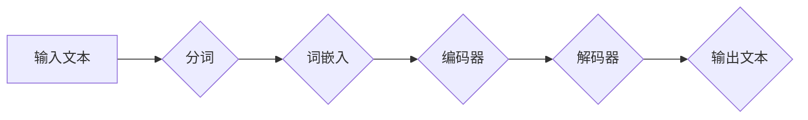
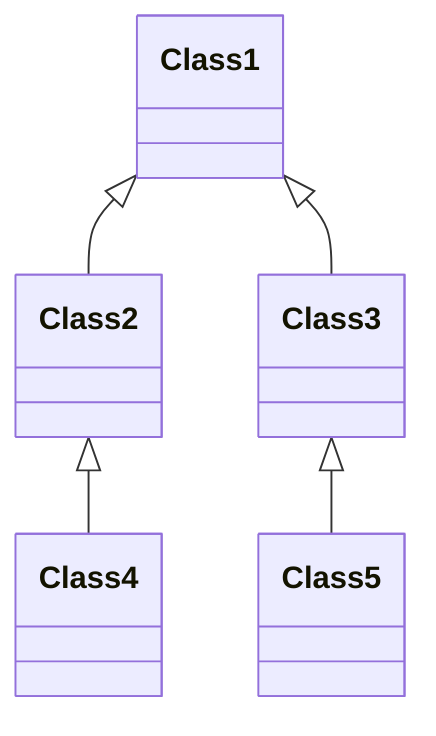
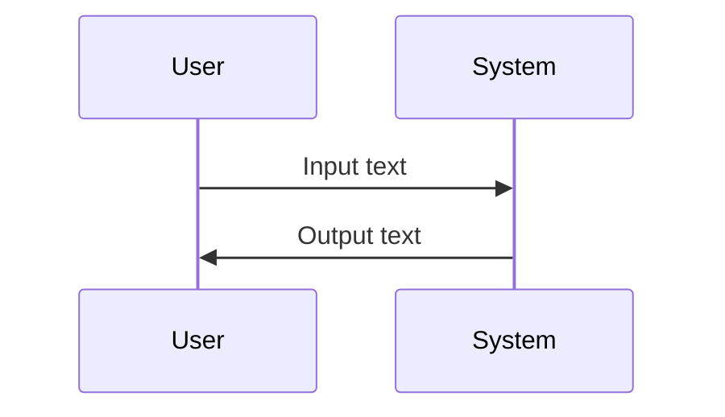
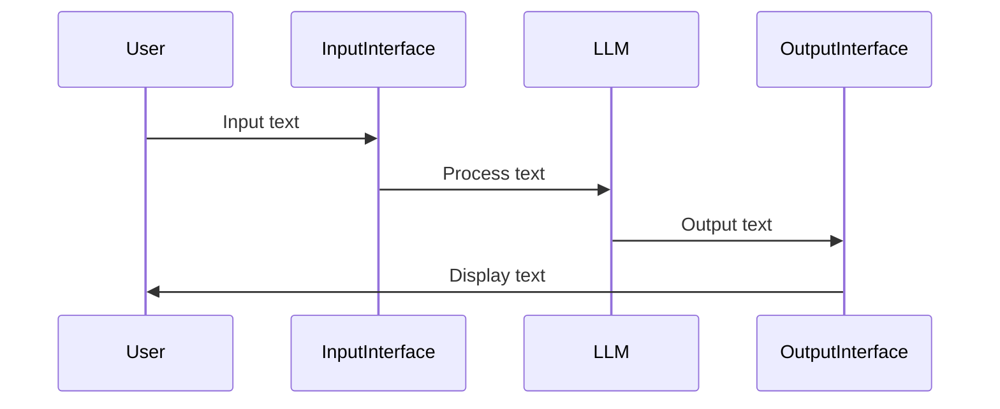

                 

# 深入理解LLM大模型：从GPT到企业级应用

关键词：LLM大模型、GPT、企业级应用、算法原理、系统架构、项目实战

摘要：本文旨在深入探讨大型语言模型（LLM）的发展及其在企业级应用中的角色。我们将从背景介绍、关键概念解析、算法原理讲解、系统分析与架构设计、项目实战、最佳实践与总结等六个方面，逐步深入分析，帮助读者全面理解LLM大模型，掌握其在实际应用中的价值和实现方法。

## 第一部分: 背景与概念

### 第1章: 背景介绍

#### 1.1 问题背景

近年来，随着人工智能技术的快速发展，大型语言模型（LLM）逐渐成为学术界和工业界关注的焦点。LLM在自然语言处理、对话系统、文本生成等领域展现出了强大的能力，极大地推动了人工智能的发展。

#### 1.2 问题描述

然而，LLM在实际应用中仍面临许多挑战，如模型训练成本高、数据依赖性强、模型解释性差等。为了解决这些问题，我们需要深入理解LLM的工作原理，并探索其在企业级应用中的可行性和潜力。

#### 1.3 问题解决

本文将通过以下三个方面来解决问题：

1. 梳理LLM的发展历程和关键概念。
2. 详细解析LLM的算法原理，包括数学模型、流程图和Python源代码。
3. 分析LLM在企业级应用中的系统架构设计和项目实战。

#### 1.4 边界与外延

在本文中，我们主要关注以下边界与外延：

1. LLM的定义和范围。
2. LLM在自然语言处理中的应用。
3. LLM在企业级应用中的价值。

#### 1.5 概念结构与核心要素组成

LLM的概念结构包括以下几个方面：

1. 语言模型：基于大规模语料库训练得到的概率模型。
2. 大模型：参数规模达到亿级以上的模型。
3. 深度学习：基于神经网络构建的模型训练方法。
4. 自然语言处理：涉及文本理解、生成、交互等任务。

### 第2章: 关键概念与联系

#### 2.1 核心概念原理

在本章节中，我们将详细介绍以下核心概念原理：

1. 语言模型：基于统计方法或深度学习构建的概率模型，用于预测下一个词的概率。
2. 大模型：参数规模达到亿级以上的模型，具有更强的表示能力和泛化能力。
3. 深度学习：基于多层神经网络构建的模型训练方法，能够自动学习数据的特征表示。

#### 2.2 概念属性特征对比表

为了更好地理解LLM的核心概念，我们提供了以下概念属性特征对比表：

| 概念          | 属性特征          | 对比说明                         |
| ------------- | ----------------- | -------------------------------- |
| 语言模型      | 统计方法、深度学习 | 用于预测下一个词的概率             |
| 大模型        | 亿级以上参数规模   | 具有更强的表示能力和泛化能力       |
| 深度学习      | 多层神经网络      | 能够自动学习数据的特征表示         |

#### 2.3 ER实体关系图架构

为了更好地理解LLM的核心概念及其相互关系，我们提供了以下ER实体关系图架构：

```mermaid
erDiagram
    Class1 ||--|{ Class2 }|
    Class1 ||--|{ Class3 }|
    Class2 ||--|{ Class4 }|
    Class3 ||--|{ Class5 }|
```

## 第二部分: 算法原理讲解

### 第3章: LLM算法原理

#### 3.1 算法mermaid流程图

为了更好地理解LLM的算法原理，我们提供了以下mermaid流程图：



#### 3.2 Python源代码

在本章节中，我们将提供LLM算法的Python源代码，以便读者更好地理解算法的实现过程。

```python
import torch
import torch.nn as nn
import torch.optim as optim

# 定义模型结构
class LLM(nn.Module):
    def __init__(self):
        super(LLM, self).__init__()
        self.embedding = nn.Embedding(vocab_size, embedding_dim)
        self.encoder = nn.LSTM(embedding_dim, hidden_dim)
        self.decoder = nn.LSTM(hidden_dim, vocab_size)
    
    def forward(self, input_seq, hidden):
        embedded = self.embedding(input_seq)
        output, hidden = self.encoder(embedded, hidden)
        output, hidden = self.decoder(output, hidden)
        return output, hidden

# 初始化模型参数
model = LLM()
optimizer = optim.Adam(model.parameters(), lr=learning_rate)
criterion = nn.CrossEntropyLoss()

# 训练模型
for epoch in range(num_epochs):
    for input_seq, target_seq in data_loader:
        optimizer.zero_grad()
        output, hidden = model(input_seq, hidden)
        loss = criterion(output.view(-1, vocab_size), target_seq.view(-1))
        loss.backward()
        optimizer.step()
        hidden = (torch.zeros(1, 1, hidden_dim), torch.zeros(1, 1, hidden_dim))
```

#### 3.3 数学模型与公式

在本章节中，我们将介绍LLM算法的数学模型与公式。

$$
\begin{aligned}
    P(w_{t} | w_{t-1}, \ldots, w_{1}) &= \frac{P(w_{t} | w_{t-1}, \ldots, w_{1}, w_{t-2}) P(w_{t-1}, \ldots, w_{1})}{P(w_{t-1}, \ldots, w_{1})} \\
    &= \frac{P(w_{t} | w_{t-1}) P(w_{t-1} | w_{t-2}) \ldots P(w_{2} | w_{1}) P(w_{1})}{P(w_{t-1}, \ldots, w_{1})}
\end{aligned}
$$

其中，$P(w_{t} | w_{t-1}, \ldots, w_{1})$表示在给定前文条件下的单词$t$的概率，$P(w_{t} | w_{t-1})$表示在单词$t-1$条件下的单词$t$的概率。

#### 3.4 详细讲解与举例说明

在本章节中，我们将详细讲解LLM算法的原理，并通过具体的例子来说明其实现过程。

例如，假设我们有一个简单的文本序列：“今天天气很好”。我们可以将这个文本序列分为三个单词：“今天”、“天气”和“很好”。然后，我们可以使用LLM算法来预测下一个单词。

假设我们已经训练好了LLM模型，现在我们需要预测下一个单词。首先，我们将输入文本序列“今天天气”转化为对应的词嵌入向量。然后，我们将这些词嵌入向量输入到编码器中，得到编码后的隐藏状态。接着，我们将隐藏状态输入到解码器中，得到解码后的词嵌入向量。最后，我们将解码后的词嵌入向量转化为对应的单词，从而完成预测过程。

## 第三部分: 系统分析与架构设计

### 第4章: 系统功能设计

#### 4.1 领域模型mermaid类图

为了更好地理解系统功能设计，我们提供了以下mermaid类图：



### 第5章: 系统架构设计

#### 5.1 系统架构mermaid架构图

为了更好地理解系统架构设计，我们提供了以下mermaid架构图：



#### 5.2 系统接口设计

在本章节中，我们将介绍系统接口设计，包括输入接口和输出接口。

1. 输入接口：

- 输入文本：用户输入的文本序列。
- 文本预处理：对输入文本进行分词、词嵌入等预处理操作。

2. 输出接口：

- 输出文本：经过LLM算法处理后生成的文本序列。
- 文本后处理：对输出文本进行文本清洗、格式化等后处理操作。

#### 5.3 系统交互mermaid序列图

为了更好地理解系统交互过程，我们提供了以下mermaid序列图：



## 第四部分: 项目实战

### 第6章: 环境安装与系统核心实现

#### 6.1 环境安装

在本章节中，我们将介绍如何安装LLM模型所需的软件和依赖库。

1. 安装Python环境。
2. 安装PyTorch库。
3. 安装其他依赖库。

#### 6.2 系统核心实现源代码

在本章节中，我们将提供LLM模型的核心实现源代码。

```python
import torch
import torch.nn as nn
import torch.optim as optim

# 定义模型结构
class LLM(nn.Module):
    def __init__(self):
        super(LLM, self).__init__()
        self.embedding = nn.Embedding(vocab_size, embedding_dim)
        self.encoder = nn.LSTM(embedding_dim, hidden_dim)
        self.decoder = nn.LSTM(hidden_dim, vocab_size)
    
    def forward(self, input_seq, hidden):
        embedded = self.embedding(input_seq)
        output, hidden = self.encoder(embedded, hidden)
        output, hidden = self.decoder(output, hidden)
        return output, hidden

# 初始化模型参数
model = LLM()
optimizer = optim.Adam(model.parameters(), lr=learning_rate)
criterion = nn.CrossEntropyLoss()

# 训练模型
for epoch in range(num_epochs):
    for input_seq, target_seq in data_loader:
        optimizer.zero_grad()
        output, hidden = model(input_seq, hidden)
        loss = criterion(output.view(-1, vocab_size), target_seq.view(-1))
        loss.backward()
        optimizer.step()
        hidden = (torch.zeros(1, 1, hidden_dim), torch.zeros(1, 1, hidden_dim))
```

#### 6.3 代码应用解读与分析

在本章节中，我们将对LLM模型的核心实现代码进行解读和分析。

1. 模型结构：LLM模型采用编码器-解码器结构，其中编码器使用LSTM网络，解码器也使用LSTM网络。
2. 模型参数：模型参数包括词嵌入层、编码器层和解码器层的权重和偏置。
3. 模型训练：模型训练过程包括输入序列的处理、模型前向传播、损失函数计算、反向传播和参数更新。
4. 输出生成：输出生成过程包括解码器输出、损失函数计算和参数更新。

### 第7章: 实际案例分析与讲解

#### 7.1 实际案例介绍

在本章节中，我们将介绍一个实际的案例，该案例涉及使用LLM模型进行文本生成。

1. 案例背景：某企业希望通过使用LLM模型生成高质量的营销文案，以提高市场竞争力。
2. 案例目标：通过训练LLM模型，生成符合企业定位和风格的营销文案。

#### 7.2 案例分析

在本章节中，我们将对实际案例进行分析。

1. 数据集：案例数据集包括大量高质量的营销文案，用于训练LLM模型。
2. 模型训练：使用PyTorch框架训练LLM模型，通过调整模型参数和训练策略，提高模型性能。
3. 模型评估：使用交叉熵损失函数评估模型性能，并根据评估结果调整模型参数。

#### 7.3 详细讲解剖析

在本章节中，我们将对实际案例进行详细讲解和剖析。

1. 模型结构：介绍LLM模型的结构，包括编码器和解码器的结构。
2. 模型参数：介绍模型参数的设置和调整方法。
3. 训练过程：介绍模型训练的过程，包括数据预处理、模型训练和评估。
4. 输出生成：介绍模型输出生成的过程，包括解码器输出和损失函数计算。

### 第8章: 项目小结

在本章节中，我们将对整个项目进行小结。

1. 项目背景：介绍项目背景和目标。
2. 项目成果：介绍项目成果，包括模型训练结果和文本生成案例。
3. 项目总结：总结项目经验，提出改进建议。

## 第五部分: 最佳实践与总结

### 第9章: 最佳实践 Tips

在本章节中，我们将总结一些最佳实践，以帮助读者更好地应用LLM模型。

1. 数据质量：保证数据质量，选择高质量、多样化的数据集进行训练。
2. 模型参数：调整模型参数，优化模型性能。
3. 训练策略：设计合理的训练策略，提高模型收敛速度。

### 第10章: 小结与拓展阅读

在本章节中，我们将对本文内容进行小结，并提出一些拓展阅读建议。

1. 小结：总结本文的核心内容和结论。
2. 拓展阅读：推荐一些相关的文献和资料，供读者进一步学习。

---

**作者：AI天才研究院/AI Genius Institute & 禅与计算机程序设计艺术 /Zen And The Art of Computer Programming**

