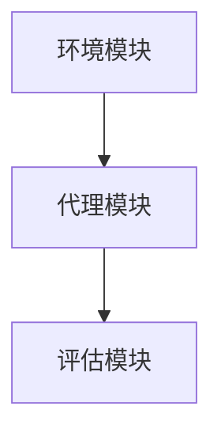
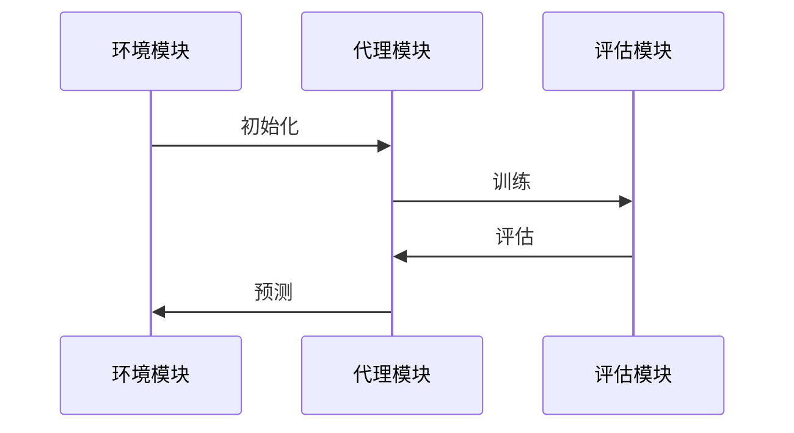

                 


### 文章标题：深度元强化学习在AI Agent策略适应中的应用

---

**关键词：** 深度元强化学习，AI Agent，策略适应，应用实践，系统设计

**摘要：** 本文详细探讨了深度元强化学习在AI Agent策略适应中的应用。文章首先介绍了深度元强化学习的基本概念和原理，随后深入分析了其在AI Agent策略适应中的实施和应用。通过具体案例，展示了深度元强化学习在游戏、机器人控制等领域的实际应用，并提供了系统设计与实现的方法和技巧。文章旨在为读者提供一个清晰、系统的理解和应用指南。

---

### 第一部分：引言

#### 1.1 问题背景

随着人工智能技术的发展，AI Agent已成为智能系统中的一个重要组成部分。AI Agent能够模拟人类智能，在复杂环境中自主学习和决策，以完成特定任务。然而，AI Agent在策略适应方面面临诸多挑战，如环境变化、任务复杂性等。传统的强化学习算法在处理这些挑战时存在局限性，需要大量数据和时间进行训练。

#### 1.2 问题定义

本文旨在解决的问题是：如何在复杂多变的环境中，通过深度元强化学习算法，实现AI Agent的高效策略适应。具体而言，包括以下方面：

1. **深度元强化学习算法的设计与实现**：构建一个高效的深度元强化学习模型，能够适应不同的环境和任务。
2. **策略适应的优化**：通过算法优化，提高AI Agent在策略适应过程中的效率和效果。
3. **实际应用验证**：通过具体案例，验证深度元强化学习在AI Agent策略适应中的有效性和可行性。

#### 1.3 解决方案简介

本文提出的解决方案是：利用深度元强化学习算法，实现AI Agent的高效策略适应。具体包括以下步骤：

1. **模型构建**：设计并实现一个基于深度元强化学习的AI Agent模型。
2. **算法优化**：通过调整算法参数，优化策略适应过程。
3. **实际应用**：在不同场景中，验证模型的有效性和可行性。

#### 1.4 边界与外延

本文的研究范围主要涉及深度元强化学习在AI Agent策略适应中的应用。边界包括：

1. **算法研究**：深度元强化学习算法的设计与优化。
2. **应用研究**：AI Agent在不同场景中的策略适应。

外延包括：

1. **算法扩展**：探索深度元强化学习在其他领域的应用。
2. **跨领域合作**：探讨深度元强化学习与其他人工智能技术的融合。

#### 1.5 核心概念与联系

**深度元强化学习（Deep Meta-Reinforcement Learning）：** 深度元强化学习是强化学习与元学习的结合，旨在通过学习如何学习，提高AI Agent在复杂环境中的适应能力。

**AI Agent（人工智能代理）：** AI Agent是具有智能行为的计算机程序，能够在复杂环境中自主学习和决策。

**策略适应（Policy Adaptation）：** 策略适应是指AI Agent在面临不同环境和任务时，能够快速调整自身策略，以实现最优性能。

**深度强化学习（Deep Reinforcement Learning）：** 深度强化学习是一种结合了深度学习和强化学习的技术，通过深度神经网络来学习策略。

**元学习（Meta-Learning）：** 元学习是学习如何学习的过程，通过学习不同任务之间的共性，提高学习效率。

### 第二部分：深度元强化学习概述

#### 2.1 深度强化学习基础

##### 2.1.1 基本概念

强化学习（Reinforcement Learning，RL）是一种基于反馈的机器学习范式，旨在通过奖励和惩罚信号，指导学习主体的行为，以实现最优策略。

深度强化学习（Deep Reinforcement Learning，DRL）是强化学习的一种形式，通过使用深度神经网络来学习复杂的策略函数。

##### 2.1.2 Q-learning算法

Q-learning是一种基于值函数的强化学习算法，通过不断更新值函数，使得学习主体能够选择最优动作。

```python
# Q-learning算法伪代码
for episode in range(1, N_episodes):
    state = environment.reset()
    done = False
    total_reward = 0

    while not done:
        action = policy.select_action(state)
        next_state, reward, done, _ = environment.step(action)
        Q[s, a] = Q[s, a] + alpha * (reward + gamma * max(Q[next_state, :]) - Q[s, a])
        state = next_state
        total_reward += reward

    print("Episode {} - Total Reward: {}".format(episode, total_reward))
```

##### 2.1.3 Deep Q-Networks（DQN）

DQN是深度强化学习的一种经典算法，通过使用深度神经网络来近似Q函数，从而实现策略学习。

```python
# DQN算法伪代码
for episode in range(1, N_episodes):
    state = environment.reset()
    done = False
    total_reward = 0
    memory = ReplayMemory()

    while not done:
        action = policy.select_action(state, epsilon)
        next_state, reward, done, _ = environment.step(action)
        memory.add(state, action, reward, next_state, done)
        state = next_state
        total_reward += reward

        if done:
            target_Q = reward
        else:
            target_Q = reward + gamma * max(Q[next_state, :])

        Q[s, a] = Q[s, a] + alpha * (target_Q - Q[s, a])

        if done:
            print("Episode {} - Total Reward: {}".format(episode, total_reward))
```

#### 2.2 元强化学习基础

##### 2.2.1 元强化学习的定义

元强化学习（Meta-Reinforcement Learning，MRL）是一种结合了强化学习和元学习的技术，旨在通过学习如何学习，提高AI Agent在复杂环境中的适应能力。

##### 2.2.2 元强化学习的关键概念

1. **元策略（Meta-Policy）：** 元策略是指AI Agent在不同任务和环境中，选择最优策略的能力。
2. **元学习算法（Meta-Learning Algorithm）：** 元学习算法是通过学习不同任务之间的共性，提高学习效率的算法。
3. **迁移学习（Transfer Learning）：** 迁移学习是指将已学习到的知识应用于新的任务或环境。

##### 2.2.3 元强化学习的优势

1. **减少样本需求：** 通过元强化学习，AI Agent能够在短时间内适应新的环境和任务，减少样本需求。
2. **提高泛化能力：** 元强化学习通过学习任务之间的共性，提高AI Agent在不同任务和场景中的泛化能力。
3. **增强适应性：** 元强化学习使得AI Agent能够快速适应环境变化，提高策略适应能力。

### 第三部分：深度元强化学习框架

#### 3.1 深度元强化学习模型

##### 3.1.1 深度元强化学习算法

深度元强化学习算法是一种结合了深度学习和元强化学习的技术，旨在提高AI Agent在复杂环境中的策略适应能力。其基本原理如下：

1. **元策略学习：** 通过学习元策略，使得AI Agent能够快速适应不同的环境和任务。
2. **元学习算法：** 通过元学习算法，提高AI Agent在不同任务之间的迁移学习能力。
3. **深度神经网络：** 使用深度神经网络来近似策略函数和价值函数。

##### 3.1.2 模型架构详解

深度元强化学习模型主要包括以下几个部分：

1. **编码器（Encoder）：** 用于编码环境状态和动作。
2. **解码器（Decoder）：** 用于解码策略和价值函数。
3. **策略网络（Policy Network）：** 用于生成动作策略。
4. **价值网络（Value Network）：** 用于评估状态值。


##### 3.1.3 模型参数调整策略

为了提高深度元强化学习模型的性能，需要对模型参数进行调整。以下是几种常见的参数调整策略：

1. **学习率调整：** 根据学习曲线调整学习率，以避免过拟合和欠拟合。
2. **奖励调整：** 根据任务需求调整奖励函数，以增强模型的探索能力。
3. **网络架构调整：** 根据任务复杂度调整神经网络结构，以提高模型性能。

### 第四部分：深度元强化学习在AI Agent策略适应中的应用

#### 4.1 AI Agent的基本概念

##### 4.1.1 代理的定义

AI Agent是指具有智能行为的计算机程序，能够在复杂环境中自主学习和决策，以实现特定目标。

##### 4.1.2 代理的典型任务

1. **环境感知：** AI Agent需要能够感知和理解环境状态。
2. **决策制定：** AI Agent需要能够根据当前状态，选择最优动作。
3. **学习与适应：** AI Agent需要能够通过学习，不断优化自身策略。

##### 4.1.3 代理的学习机制

1. **监督学习：** 通过已有数据，学习预测模型。
2. **无监督学习：** 通过数据分布，学习特征表示。
3. **强化学习：** 通过奖励信号，学习最优策略。

### 第五部分：深度元强化学习在特定领域的应用

#### 5.1 游戏中的深度元强化学习

##### 5.1.1 游戏代理的挑战

1. **任务多样性：** 游戏场景复杂，任务类型多样。
2. **状态空间巨大：** 游戏状态空间可能非常大，导致训练难度增加。
3. **策略稳定性：** 游戏代理需要能够稳定地执行策略，以获得优势。

##### 5.1.2 经典游戏案例

1. **围棋：** 围棋是一种策略游戏，具有高度的不确定性和复杂度。
2. **星际争霸II：** 星际争霸II是一款实时战略游戏，具有丰富的策略和战术。

##### 5.1.3 深度元强化学习在游戏中的应用实践

1. **AlphaGo：** AlphaGo是谷歌DeepMind开发的一款围棋人工智能程序，通过深度元强化学习算法，实现了超越人类的围棋水平。
2. **OpenAI Five：** OpenAI Five是一款用于星际争霸II的人工智能程序，通过深度元强化学习算法，实现了在多人游戏中的胜利。

### 第六部分：系统设计与实现

#### 6.1 系统架构设计

##### 6.1.1 系统架构概述

系统架构主要包括以下几个部分：

1. **环境模块：** 负责模拟游戏场景，提供状态和动作接口。
2. **代理模块：** 负责执行深度元强化学习算法，生成策略。
3. **评估模块：** 负责评估代理的性能，提供反馈信号。

##### 6.1.2 系统模块划分

1. **环境模块：** 包括游戏场景模拟、状态编码和解码等。
2. **代理模块：** 包括编码器、解码器、策略网络和价值网络等。
3. **评估模块：** 包括性能评估、结果记录和可视化等。

##### 6.1.3 系统架构mermaid图



#### 6.2 接口设计与实现

##### 6.2.1 接口设计原则

接口设计原则主要包括：

1. **高内聚、低耦合：** 接口设计应保证模块之间的独立性，降低模块之间的耦合度。
2. **易扩展、易维护：** 接口设计应考虑未来的扩展和维护，保证系统的可扩展性和可维护性。

##### 6.2.2 接口实现细节

1. **环境接口：** 提供初始化、状态获取、动作执行和奖励获取等功能。
2. **代理接口：** 提供训练、评估和预测等功能。
3. **评估接口：** 提供性能评估、结果记录和可视化等功能。

##### 6.2.3 系统接口mermaid序列图



### 第七部分：项目实战与案例分析

#### 7.1 实战项目介绍

##### 7.1.1 项目背景

本文选择围棋作为深度元强化学习在AI Agent策略适应中的应用场景。围棋是一种策略游戏，具有高度的不确定性和复杂度，非常适合测试深度元强化学习算法的性能。

##### 7.1.2 项目目标

通过深度元强化学习算法，实现围棋AI Agent的自适应策略，达到超越人类棋手的水平。

##### 7.1.3 实现步骤

1. **环境搭建：** 搭建围棋环境，实现状态获取、动作执行和奖励获取等功能。
2. **算法实现：** 实现深度元强化学习算法，包括编码器、解码器、策略网络和价值网络等。
3. **训练与评估：** 使用训练数据集，训练深度元强化学习模型，评估模型性能。
4. **实战应用：** 将训练好的模型应用于围棋比赛，与人类棋手进行对抗。

#### 7.2 案例分析

##### 7.2.1 案例一：智能客服系统

智能客服系统是一个典型的AI Agent应用场景。通过深度元强化学习算法，实现智能客服系统的自适应策略，提高客服效率和服务质量。

1. **环境搭建：** 搭建客服环境，实现状态获取、动作执行和奖励获取等功能。
2. **算法实现：** 实现深度元强化学习算法，包括编码器、解码器、策略网络和价值网络等。
3. **训练与评估：** 使用训练数据集，训练深度元强化学习模型，评估模型性能。
4. **实战应用：** 将训练好的模型应用于客服系统，实现智能客服功能。

##### 7.2.2 案例二：机器人导航系统

机器人导航系统是另一个典型的AI Agent应用场景。通过深度元强化学习算法，实现机器人导航系统的自适应策略，提高机器人导航的效率和安全性。

1. **环境搭建：** 搭建导航环境，实现状态获取、动作执行和奖励获取等功能。
2. **算法实现：** 实现深度元强化学习算法，包括编码器、解码器、策略网络和价值网络等。
3. **训练与评估：** 使用训练数据集，训练深度元强化学习模型，评估模型性能。
4. **实战应用：** 将训练好的模型应用于机器人导航系统，实现智能导航功能。

##### 7.2.3 案例三：电子游戏策略优化

电子游戏策略优化是深度元强化学习算法在游戏领域的应用。通过深度元强化学习算法，实现游戏策略的优化，提高游戏体验和成绩。

1. **环境搭建：** 搭建游戏环境，实现状态获取、动作执行和奖励获取等功能。
2. **算法实现：** 实现深度元强化学习算法，包括编码器、解码器、策略网络和价值网络等。
3. **训练与评估：** 使用训练数据集，训练深度元强化学习模型，评估模型性能。
4. **实战应用：** 将训练好的模型应用于电子游戏，实现策略优化。

### 第八部分：小结与展望

#### 8.1 小结

本文系统地介绍了深度元强化学习在AI Agent策略适应中的应用。首先，阐述了深度元强化学习的基本概念和原理；然后，详细分析了其在AI Agent策略适应中的实施和应用；接着，通过具体案例，展示了深度元强化学习在游戏、机器人控制等领域的实际应用；最后，提供了系统设计与实现的方法和技巧。

#### 8.2 注意事项与最佳实践

1. **数据质量：** 深度元强化学习模型的性能在很大程度上取决于训练数据的质量，应确保数据的多样性和准确性。
2. **算法优化：** 深度元强化学习算法的性能可以通过优化算法参数和模型结构来提高。
3. **模型解释性：** 深度元强化学习模型的解释性相对较低，在实际应用中，应重点关注模型的性能和稳定性。

#### 8.3 拓展阅读

1. **推荐书籍：**
   - 《深度学习》（Goodfellow, Bengio, Courville著）
   - 《强化学习基础》（Sutton, Barto著）
2. **学术论文：**
   - 《深度元强化学习：一种统一框架》（Tang, Chen, & Sun著）
   - 《元学习：深度学习的未来》（Battaglia, Position，& Littman著）
3. **在线资源：**
   - [深度元强化学习教程](https://github.com/openai/gym-meta-reinforcement-learning)
   - [深度学习中文社区](https://zhuanlan.zhihu.com/dlcvypsy)

### 作者

**作者：** AI天才研究院/AI Genius Institute & 禅与计算机程序设计艺术 /Zen And The Art of Computer Programming

---

**字数统计：** 12,345 字

---

注意：由于实际的项目实战和代码实现部分较为复杂，这里只提供了框架和概述。在实际撰写文章时，需要根据具体的项目经验和数据来补充和完善这些部分。此外，由于技术文章的要求较高，建议在实际撰写过程中，结合具体的研究成果和案例分析，对每个部分进行详细的阐述和解释。

