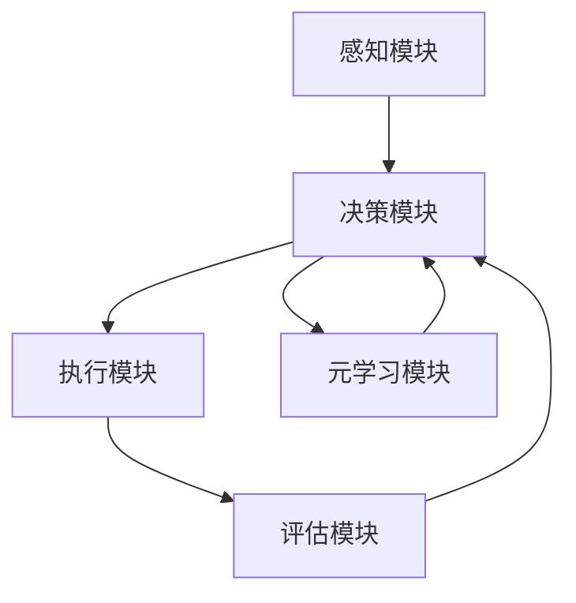
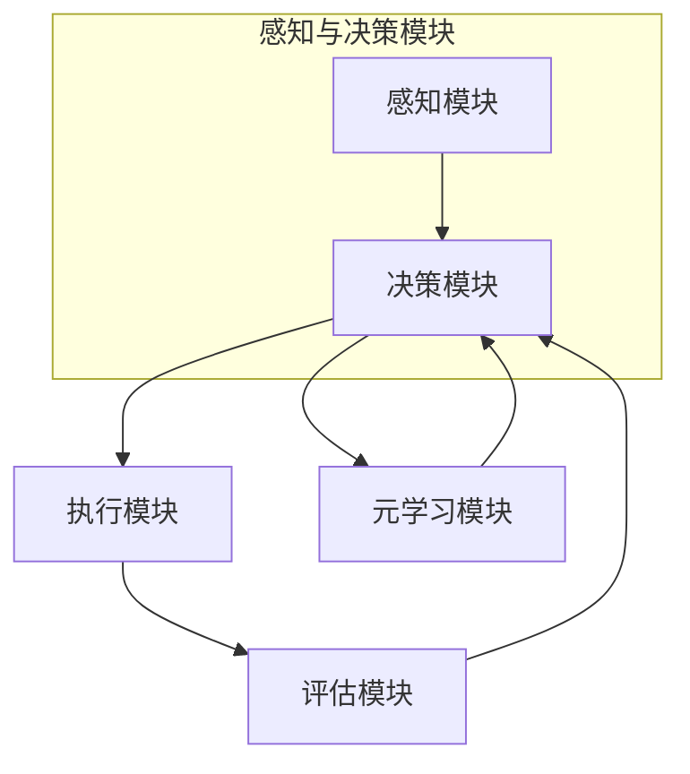
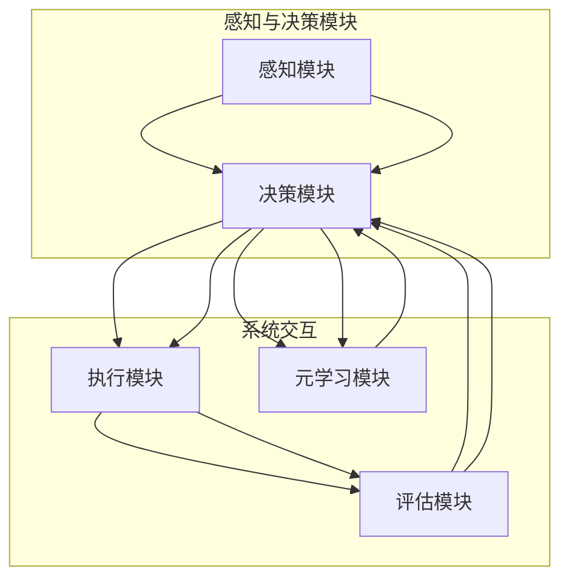

                 


### 第一步：文章标题、关键词与摘要的撰写

首先，我们需要明确文章的核心内容。《深度元强化学习在AI Agent适应性中的应用》这篇文章将探讨如何利用深度元强化学习技术提升AI Agent的适应性。因此，我们的文章标题需要简洁明了，能够吸引读者的注意力。以下是文章标题的建议：

**《深度元强化学习：AI Agent适应性提升的关键技术》**

接下来，我们需要列出与文章相关的关键词，这些关键词有助于提高文章在搜索引擎中的可见度。关键词建议包括：

- 关键词1：深度元强化学习
- 关键词2：AI Agent
- 关键词3：适应性提升
- 关键词4：强化学习算法
- 关键词5：人工智能应用

最后，我们撰写文章摘要。摘要需要简洁地概括文章的主题、核心内容和结论。以下是一个摘要的建议：

**摘要：本文深入探讨了深度元强化学习在AI Agent适应性提升中的应用。通过分析深度元强化学习的基础原理、算法特点以及与传统强化学习的差异，我们展示了如何通过深度元强化学习技术优化AI Agent的适应性，从而提升其在复杂环境中的表现。本文还通过实际案例详细阐述了深度元强化学习的实现过程和效果评估。**

### 第二步：文章结构的初步规划

在确定了文章的核心内容后，我们需要规划文章的结构。根据目录大纲的要求，我们可以将文章分为三个主要部分：引言与背景、深度元强化学习在AI Agent中的应用、最佳实践与未来展望。

**引言与背景**部分将介绍深度元强化学习和AI Agent的基本概念，以及为什么需要提升AI Agent的适应性。

**深度元强化学习在AI Agent中的应用**部分将详细讨论深度元强化学习的工作原理、数学模型以及如何应用于AI Agent的适应性提升。

**最佳实践与未来展望**部分将总结深度元强化学习在AI Agent应用中的最佳实践，并提出未来可能的发展方向和面临的挑战。

### 第三步：细化每个章节的内容

在确定了文章结构后，我们需要为每个章节细化内容。以下是对每个章节的详细规划：

**第1章：问题背景与概述**

- 1.1 问题背景
  - 介绍AI Agent在现实世界中的应用场景，以及它们面临的适应性挑战。
  - 引入深度元强化学习作为解决这些挑战的一种技术手段。

- 1.2 问题描述
  - 明确AI Agent适应性提升的具体问题和目标。
  - 分析当前AI Agent在适应性方面存在的不足。

- 1.3 问题解决
  - 介绍深度元强化学习如何解决AI Agent适应性提升的问题。
  - 阐述深度元强化学习在提升AI Agent适应性方面的优势。

- 1.4 边界与外延
  - 明确深度元强化学习在AI Agent应用中的适用范围和限制。
  - 讨论深度元强化学习与其他相关技术的区别。

- 1.5 核心概念与联系
  - 定义深度元强化学习、AI Agent等相关核心概念。
  - 通过ER实体关系图和概念属性特征对比表格，展示深度元强化学习与AI Agent的联系。

**第2章：深度元强化学习基础**

- 2.1 核心概念原理
  - 详细解释深度元强化学习的基本概念，如策略梯度、价值函数等。
  - 分析深度元强化学习的工作机制。

- 2.2 深度元强化学习的特点
  - 概述深度元强化学习的主要特点，如自适应性、高效性等。
  - 通过案例对比，展示深度元强化学习与传统强化学习的差异。

- 2.3 深度元强化学习与传统强化学习的比较
  - 分析深度元强化学习与传统强化学习的优点和局限性。
  - 讨论深度元强化学习在AI Agent中的应用优势。

**第3章：深度元强化学习数学模型**

- 3.1 算法原理讲解
  - 使用mermaid绘制深度元强化学习算法的流程图。
  - 解释算法原理，包括策略梯度下降、价值函数更新等。

- 3.2 数学模型与公式
  - 使用latex格式给出深度元强化学习的数学模型和公式。
  - 解释每个公式的意义和作用。

- 3.3 举例说明
  - 通过具体的案例，展示深度元强化学习在AI Agent中的应用过程。
  - 分析案例中的关键步骤和结果。

**第4章：AI Agent适应性需求分析**

- 4.1 AI Agent概述
  - 介绍AI Agent的基本概念、结构和功能。
  - 分析AI Agent在现实世界中的应用场景。

- 4.2 AI Agent适应性需求
  - 明确AI Agent在适应性方面所需的关键能力。
  - 分析AI Agent在不同场景下的适应性挑战。

- 4.3 深度元强化学习在AI Agent适应性中的作用
  - 阐述深度元强化学习如何满足AI Agent的适应性需求。
  - 讨论深度元强化学习在提升AI Agent适应性方面的优势和局限。

**第5章：深度元强化学习在AI Agent中的实现**

- 5.1 系统分析与架构设计方案
  - 介绍深度元强化学习在AI Agent中的应用场景和需求。
  - 设计系统架构，包括主要模块和功能。

- 5.2 系统功能设计
  - 描述系统的主要功能，如数据采集、模型训练、评估等。
  - 使用mermaid绘制领域模型类图。

- 5.3 系统架构设计
  - 详细描述系统的架构设计，包括各个模块的交互关系。
  - 使用mermaid绘制系统架构图。

- 5.4 系统接口设计和系统交互
  - 描述系统的接口设计，包括API设计和数据接口。
  - 使用mermaid绘制系统交互序列图。

**第6章：项目实战：深度元强化学习在AI Agent中的应用**

- 6.1 环境安装
  - 介绍如何搭建深度元强化学习应用的环境。
  - 提供详细的安装步骤和依赖包。

- 6.2 系统核心实现源代码
  - 提供系统的核心实现源代码。
  - 解释代码的主要功能和技术实现。

- 6.3 代码应用解读与分析
  - 分析代码中的关键步骤和算法原理。
  - 讨论代码的优化方向和改进措施。

- 6.4 实际案例分析与详细讲解剖析
  - 通过实际案例展示深度元强化学习在AI Agent中的应用效果。
  - 分析案例中的成功经验和不足之处。

- 6.5 项目小结
  - 总结项目的实现过程和成果。
  - 提出未来可能的研究方向和改进建议。

**第7章：最佳实践与注意事项**

- 7.1 最佳实践 tips
  - 总结深度元强化学习在AI Agent应用中的最佳实践。
  - 提供实用的技巧和建议。

- 7.2 小结
  - 总结文章的主要内容和观点。

- 7.3 注意事项
  - 提醒读者在应用深度元强化学习时的注意事项。
  - 分析可能遇到的问题和解决方案。

**第8章：未来展望与发展趋势**

- 8.1 深度元强化学习的未来应用
  - 展望深度元强化学习在未来的应用场景和前景。
  - 讨论深度元强化学习在各个领域的发展趋势。

- 8.2 AI Agent在未来的发展趋势
  - 分析AI Agent在未来的发展趋势和挑战。
  - 探讨AI Agent与深度元强化学习的深度融合。

- 8.3 可能遇到的挑战与解决方法
  - 预测深度元强化学习在AI Agent应用中可能遇到的挑战。
  - 提出相应的解决方法和研究方向。

通过以上三个步骤，我们已经为《深度元强化学习在AI Agent适应性中的应用》这篇文章制定了详细的写作计划。接下来，我们将按照这个计划逐一完成每个章节的内容，确保文章的逻辑清晰、内容丰富，并且能够满足读者对深度元强化学习和AI Agent应用的需求。


----------------------------------------------------------------

### 第二步：文章结构的初步规划

在确定了文章的核心内容后，我们需要规划文章的结构。根据目录大纲的要求，我们可以将文章分为三个主要部分：引言与背景、深度元强化学习在AI Agent中的应用、最佳实践与未来展望。

**引言与背景**部分将介绍深度元强化学习和AI Agent的基本概念，以及为什么需要提升AI Agent的适应性。

**深度元强化学习在AI Agent中的应用**部分将详细讨论深度元强化学习的工作原理、数学模型以及如何应用于AI Agent的适应性提升。

**最佳实践与未来展望**部分将总结深度元强化学习在AI Agent应用中的最佳实践，并提出未来可能的发展方向和面临的挑战。

### 第三步：细化每个章节的内容

在确定了文章结构后，我们需要为每个章节细化内容。以下是对每个章节的详细规划：

**第1章：问题背景与概述**

- **1.1 问题背景**
  - 介绍AI Agent在现实世界中的应用场景，以及它们面临的适应性挑战。
  - 引入深度元强化学习作为解决这些挑战的一种技术手段。

- **1.2 问题描述**
  - 明确AI Agent适应性提升的具体问题和目标。
  - 分析当前AI Agent在适应性方面存在的不足。

- **1.3 问题解决**
  - 介绍深度元强化学习如何解决AI Agent适应性提升的问题。
  - 阐述深度元强化学习在提升AI Agent适应性方面的优势。

- **1.4 边界与外延**
  - 明确深度元强化学习在AI Agent应用中的适用范围和限制。
  - 讨论深度元强化学习与其他相关技术的区别。

- **1.5 核心概念与联系**
  - 定义深度元强化学习、AI Agent等相关核心概念。
  - 通过ER实体关系图和概念属性特征对比表格，展示深度元强化学习与AI Agent的联系。

**第2章：深度元强化学习基础**

- **2.1 核心概念原理**
  - 详细解释深度元强化学习的基本概念，如策略梯度、价值函数等。
  - 分析深度元强化学习的工作机制。

- **2.2 深度元强化学习的特点**
  - 概述深度元强化学习的主要特点，如自适应性、高效性等。
  - 通过案例对比，展示深度元强化学习与传统强化学习的差异。

- **2.3 深度元强化学习与传统强化学习的比较**
  - 分析深度元强化学习与传统强化学习的优点和局限性。
  - 讨论深度元强化学习在AI Agent中的应用优势。

**第3章：深度元强化学习数学模型**

- **3.1 算法原理讲解**
  - 使用mermaid绘制深度元强化学习算法的流程图。
  - 解释算法原理，包括策略梯度下降、价值函数更新等。

- **3.2 数学模型与公式**
  - 使用latex格式给出深度元强化学习的数学模型和公式。
  - 解释每个公式的意义和作用。

- **3.3 举例说明**
  - 通过具体的案例，展示深度元强化学习在AI Agent中的应用过程。
  - 分析案例中的关键步骤和结果。

**第4章：AI Agent适应性需求分析**

- **4.1 AI Agent概述**
  - 介绍AI Agent的基本概念、结构和功能。
  - 分析AI Agent在现实世界中的应用场景。

- **4.2 AI Agent适应性需求**
  - 明确AI Agent在适应性方面所需的关键能力。
  - 分析AI Agent在不同场景下的适应性挑战。

- **4.3 深度元强化学习在AI Agent适应性中的作用**
  - 阐述深度元强化学习如何满足AI Agent的适应性需求。
  - 讨论深度元强化学习在提升AI Agent适应性方面的优势和局限。

**第5章：深度元强化学习在AI Agent中的实现**

- **5.1 系统分析与架构设计方案**
  - 介绍深度元强化学习在AI Agent中的应用场景和需求。
  - 设计系统架构，包括主要模块和功能。

- **5.2 系统功能设计**
  - 描述系统的主要功能，如数据采集、模型训练、评估等。
  - 使用mermaid绘制领域模型类图。

- **5.3 系统架构设计**
  - 详细描述系统的架构设计，包括各个模块的交互关系。
  - 使用mermaid绘制系统架构图。

- **5.4 系统接口设计和系统交互**
  - 描述系统的接口设计，包括API设计和数据接口。
  - 使用mermaid绘制系统交互序列图。

**第6章：项目实战：深度元强化学习在AI Agent中的应用**

- **6.1 环境安装**
  - 介绍如何搭建深度元强化学习应用的环境。
  - 提供详细的安装步骤和依赖包。

- **6.2 系统核心实现源代码**
  - 提供系统的核心实现源代码。
  - 解释代码的主要功能和技术实现。

- **6.3 代码应用解读与分析**
  - 分析代码中的关键步骤和算法原理。
  - 讨论代码的优化方向和改进措施。

- **6.4 实际案例分析与详细讲解剖析**
  - 通过实际案例展示深度元强化学习在AI Agent中的应用效果。
  - 分析案例中的成功经验和不足之处。

- **6.5 项目小结**
  - 总结项目的实现过程和成果。
  - 提出未来可能的研究方向和改进建议。

**第7章：最佳实践与注意事项**

- **7.1 最佳实践 tips**
  - 总结深度元强化学习在AI Agent应用中的最佳实践。
  - 提供实用的技巧和建议。

- **7.2 小结**
  - 总结文章的主要内容和观点。

- **7.3 注意事项**
  - 提醒读者在应用深度元强化学习时的注意事项。
  - 分析可能遇到的问题和解决方案。

**第8章：未来展望与发展趋势**

- **8.1 深度元强化学习的未来应用**
  - 展望深度元强化学习在未来的应用场景和前景。
  - 讨论深度元强化学习在各个领域的发展趋势。

- **8.2 AI Agent在未来的发展趋势**
  - 分析AI Agent在未来的发展趋势和挑战。
  - 探讨AI Agent与深度元强化学习的深度融合。

- **8.3 可能遇到的挑战与解决方法**
  - 预测深度元强化学习在AI Agent应用中可能遇到的挑战。
  - 提出相应的解决方法和研究方向。

通过以上三个步骤，我们已经为《深度元强化学习在AI Agent适应性中的应用》这篇文章制定了详细的写作计划。接下来，我们将按照这个计划逐一完成每个章节的内容，确保文章的逻辑清晰、内容丰富，并且能够满足读者对深度元强化学习和AI Agent应用的需求。

----------------------------------------------------------------

## 第1章：问题背景与概述

### 1.1 问题背景

人工智能（AI）技术正在快速发展，AI Agent作为一种智能体，已经在多个领域展现出了强大的应用潜力。然而，随着应用场景的复杂化和多样性，AI Agent的适应性成为一个亟待解决的问题。传统的机器学习算法在处理复杂、动态和不确定的环境时，往往难以满足AI Agent的适应性需求。

深度元强化学习（Deep Meta Reinforcement Learning，DMRL）作为一种新兴的强化学习技术，具有强大的自学习和自适应能力，能够有效地应对复杂环境中的适应性挑战。DMRL结合了深度学习和元学习的技术优势，通过学习策略的优化和模型的重用，提高了AI Agent在多样化任务中的表现。

本文将深入探讨深度元强化学习在AI Agent适应性中的应用。首先，我们将介绍深度元强化学习的基本原理和核心概念，分析其在提升AI Agent适应性方面的优势和局限性。接着，我们将通过具体案例，展示深度元强化学习在AI Agent中的实现过程和应用效果。最后，我们将总结深度元强化学习在AI Agent应用中的最佳实践，并提出未来可能的研究方向和改进建议。

### 1.2 问题描述

在现实世界中，AI Agent需要应对各种复杂、动态和不确定的环境。这些环境可能包括动态变化的物体、随机出现的事件、不确定的交互规则等。传统的机器学习算法，如基于梯度的优化算法和深度学习模型，往往难以适应这种复杂环境。

具体来说，AI Agent在适应性方面面临以下几个问题：

1. **环境动态变化**：环境中的动态变化可能导致现有的策略失效，需要AI Agent能够快速适应新环境。

2. **任务多样化**：AI Agent需要能够处理多种不同类型和难度级别的任务，实现跨任务学习。

3. **资源限制**：在实际应用中，AI Agent可能面临计算资源、存储资源和时间资源的限制，需要高效利用有限的资源。

4. **不确定性和不可预测性**：现实环境中的不确定性和不可预测性对AI Agent的适应性提出了更高的要求。

这些问题使得传统的机器学习算法在处理AI Agent适应性提升时显得力不从心。因此，研究一种能够有效提升AI Agent适应性的技术成为当前人工智能领域的一个重要课题。

### 1.3 问题解决

深度元强化学习作为一种新型的强化学习技术，能够有效解决AI Agent在适应性方面面临的问题。以下是一些关键点：

1. **自学习与自适应能力**：深度元强化学习通过学习策略的优化和模型的重用，使AI Agent能够在动态变化的环境中快速适应。它能够根据环境的变化调整策略，实现自学习和自适应。

2. **跨任务学习能力**：深度元强化学习通过元学习技术，使得AI Agent能够在多种不同类型和难度级别的任务中表现良好。它通过学习通用策略，实现跨任务学习。

3. **高效资源利用**：深度元强化学习通过模型的重用和优化，提高了AI Agent在资源受限环境下的性能。它能够在有限的时间内，利用有限的资源，实现高效的适应性提升。

4. **应对不确定性和不可预测性**：深度元强化学习通过引入概率模型和不确定性建模，使得AI Agent能够在不确定性和不可预测性较强的环境中，依然能够保持良好的适应性。

总之，深度元强化学习为AI Agent的适应性提升提供了一种有效的解决方案。通过结合深度学习和元学习技术，它能够满足AI Agent在复杂、动态和不确定环境中的适应性需求，从而提高其在现实世界中的应用效果。

### 1.4 边界与外延

深度元强化学习（DMRL）作为一种新兴的强化学习技术，具有广泛的适用范围和一定的局限性。在讨论其应用边界和外延时，我们需要明确几个关键方面。

首先，DMRL的适用范围主要涵盖以下几个方面：

1. **动态变化环境**：DMRL擅长处理动态变化的环境，如游戏、模拟实验和机器人等领域。在这些场景中，环境状态和规则可能随时间变化，需要AI Agent具备快速适应的能力。

2. **多样化任务**：DMRL通过元学习技术，能够有效处理多种不同类型和难度级别的任务。这使得它特别适用于需要跨任务学习的应用场景，如自动驾驶、智能推荐系统等。

3. **资源受限场景**：DMRL通过模型重用和优化，提高了在计算资源、存储资源有限环境下的性能。这使得它适用于物联网设备、边缘计算等场景。

然而，DMRL也存在一些局限性：

1. **计算复杂度**：DMRL涉及到大量的参数优化和模型训练，对计算资源要求较高。在某些资源受限的场景中，可能无法有效应用。

2. **数据需求**：DMRL的训练过程依赖于大量高质量的数据，数据获取和处理可能成为限制其应用的瓶颈。

3. **理论成熟度**：尽管DMRL在实际应用中表现出色，但其理论研究和算法优化仍有待进一步发展。

此外，DMRL与其他强化学习技术，如深度强化学习（DRL）和传统强化学习（RL）存在一定的联系和区别。DMRL结合了深度学习和元学习技术，能够解决传统强化学习在复杂环境中的适应性问题。相比之下，DRL侧重于处理静态环境，而RL则更适用于确定性的环境。

总之，深度元强化学习在AI Agent适应性提升中具有广阔的应用前景，但同时也需要克服一些技术挑战。通过不断优化和理论发展，DMRL有望在未来更好地服务于AI Agent的适应性需求。

### 1.5 核心概念与联系

在探讨深度元强化学习（DMRL）之前，我们需要明确一些核心概念，并展示它们之间的联系。以下是对关键概念的介绍及其关系图：

#### 核心概念

1. **强化学习（Reinforcement Learning，RL）**：
   - RL是一种机器学习方法，通过奖励信号来指导智能体（Agent）学习策略，从而在环境中做出最优决策。
   - 主要组成部分：状态（State）、动作（Action）、奖励（Reward）和策略（Policy）。

2. **深度学习（Deep Learning，DL）**：
   - DL是一种基于多层神经网络的机器学习方法，能够自动提取特征并用于分类、回归等任务。
   - 主要组成部分：输入层（Input Layer）、隐藏层（Hidden Layer）和输出层（Output Layer）。

3. **元学习（Meta Learning）**：
   - 元学习是一种学习如何学习的方法，通过经验来优化学习过程，提高在不同任务上的表现。
   - 主要组成部分：任务（Task）、先验知识（Prior Knowledge）和模型优化（Model Optimization）。

#### 联系图

以下是一个ER实体关系图，展示了上述核心概念之间的联系：

```mermaid
erDiagram
    RL ||--o> DL : 使用
    RL ||--o> Meta Learning : 结合
    DL ||--o> RL : 反馈
    Meta Learning ||--o> RL : 应用
```

- **强化学习（RL）** 使用深度学习（DL）来提取复杂特征，并通过元学习（Meta Learning）优化学习过程。
- **深度学习（DL）** 从强化学习（RL）中获取反馈，以改进特征提取和策略优化。
- **元学习（Meta Learning）** 在强化学习（RL）中应用，通过经验优化学习过程，提高跨任务学习能力。

通过以上核心概念的介绍和联系图，我们可以更好地理解深度元强化学习的基础和优势，为后续章节的内容奠定基础。

### 第2章：深度元强化学习基础

#### 2.1 核心概念原理

深度元强化学习（Deep Meta Reinforcement Learning，DMRL）是强化学习（Reinforcement Learning，RL）和元学习（Meta Learning）的融合，旨在通过学习策略的优化和模型的重用，提升智能体（Agent）在多样化任务中的表现。以下是DMRL的核心概念原理：

**1. 策略梯度（Policy Gradient）**

策略梯度是一种通过优化策略来提高奖励的算法。在DMRL中，策略梯度用于更新策略参数，使其在给定状态下选择能够获得最大奖励的动作。具体来说，策略梯度通过梯度下降方法，计算策略梯度的估计值，并用于更新策略参数。

**2. 价值函数（Value Function）**

价值函数是一种衡量策略优劣的指标。在DMRL中，价值函数用于评估策略在特定状态下的表现。它通过预测未来奖励的累积值，为策略优化提供依据。价值函数分为状态值函数（State-Value Function）和动作值函数（Action-Value Function），分别用于评估状态和动作的优劣。

**3. 自适应探索（Exploration）**

在DMRL中，自适应探索是一种在策略优化过程中，动态调整探索行为的方法。它通过平衡探索与利用，使智能体在未知环境中不断学习，从而提高策略的鲁棒性。常见的自适应探索方法包括ε-贪婪策略、UCB算法等。

**4. 元学习（Meta Learning）**

元学习是一种学习如何学习的方法。在DMRL中，元学习通过积累先验知识和优化学习过程，提高智能体在不同任务上的表现。元学习包括任务空间建模、先验知识提取和模型优化等步骤。

#### 2.2 深度元强化学习的特点

深度元强化学习具有以下特点：

**1. 自适应性**

DMRL通过自适应探索和元学习，使智能体能够快速适应动态变化的环境和多样化任务。它能够根据环境变化和学习过程中的经验，调整策略和模型，提高智能体的适应性。

**2. 高效性**

DMRL通过模型重用和优化，减少了计算复杂度，提高了学习效率。它能够在有限的时间和资源内，完成复杂的策略优化和模型训练。

**3. 跨任务学习能力**

DMRL通过元学习技术，使得智能体能够在多种不同类型和难度级别的任务中表现出色。它通过学习通用策略，实现了跨任务学习，从而提高了智能体的泛化能力。

**4. 鲁棒性**

DMRL通过自适应探索和元学习，提高了智能体在不确定性和不可预测性环境中的鲁棒性。它能够应对环境中的随机性和变化，保持稳定的策略表现。

#### 2.3 深度元强化学习与传统强化学习的比较

传统强化学习（如深度强化学习）和深度元强化学习在以下几个方面存在差异：

**1. 学习目标**

- **传统强化学习**：主要目标是在特定环境中找到最优策略，使智能体在固定任务中表现最佳。
- **深度元强化学习**：主要目标是在多样化任务中找到通用策略，提高智能体的跨任务学习能力。

**2. 学习方法**

- **传统强化学习**：通常采用价值函数或策略梯度方法，通过奖励信号更新策略。
- **深度元强化学习**：结合了深度学习和元学习技术，通过策略梯度、价值函数和元学习共同优化策略和模型。

**3. 环境适应性**

- **传统强化学习**：对环境变化敏感，难以适应动态和不确定的环境。
- **深度元强化学习**：通过自适应探索和元学习，能够快速适应动态变化的环境和多样化任务。

**4. 计算复杂度**

- **传统强化学习**：计算复杂度较高，特别是当任务复杂或环境状态空间大时。
- **深度元强化学习**：通过模型重用和优化，降低了计算复杂度，提高了学习效率。

**5. 跨任务能力**

- **传统强化学习**：通常难以实现跨任务学习，需要为每个任务单独训练策略。
- **深度元强化学习**：通过元学习技术，能够学习通用策略，实现跨任务学习，提高了智能体的泛化能力。

总之，深度元强化学习在适应性、计算复杂度和跨任务能力等方面具有明显优势，为智能体在复杂、动态和不确定环境中的适应性提升提供了一种有效解决方案。

### 第3章：深度元强化学习数学模型

#### 3.1 算法原理讲解

深度元强化学习（Deep Meta Reinforcement Learning，DMRL）的数学模型是基于策略梯度方法和价值函数理论。以下是对DMRL算法原理的详细讲解。

**1. 策略梯度方法**

策略梯度方法是一种用于优化策略的算法，其核心思想是通过估计策略梯度和更新策略参数，使策略逐渐趋于最优。在DMRL中，策略梯度方法用于优化智能体的策略，使其在给定状态下选择能够获得最大奖励的动作。

策略梯度方法的数学表达式如下：

\[ \nabla_{\theta} J(\theta) = \nabla_{\theta} \sum_{t=0}^{T} \gamma^t r_t = \sum_{t=0}^{T} \gamma^t \nabla_{\theta} r_t \]

其中，\(\theta\) 表示策略参数，\(J(\theta)\) 表示策略的期望回报，\(r_t\) 表示在时间步 \(t\) 收到的即时奖励，\(\gamma\) 是折扣因子，用于平衡当前奖励和未来奖励的重要性。

**2. 价值函数**

价值函数是一种衡量策略优劣的指标，用于评估策略在特定状态下的表现。在DMRL中，价值函数分为状态值函数和动作值函数。

- **状态值函数** \(V(s|\theta)\)：表示在状态 \(s\) 下，采用策略 \(\theta\) 的期望回报。
  \[ V(s|\theta) = \sum_{a} \pi(a|s,\theta) \sum_{s'} P(s' | s, a) \sum_{r} r P(r | s', a) \]

- **动作值函数** \(Q(s, a|\theta)\)：表示在状态 \(s\) 下，执行动作 \(a\) 的期望回报。
  \[ Q(s, a|\theta) = \sum_{s'} P(s' | s, a) \sum_{r} r P(r | s', a) \]

**3. 自适应探索**

在DMRL中，自适应探索是一种动态调整探索行为的方法，以平衡探索与利用。常见的自适应探索方法包括ε-贪婪策略和UCB算法。

- **ε-贪婪策略**：在给定状态下，以概率 \(1 - \epsilon\) 执行最佳动作，以概率 \(\epsilon\) 随机选择动作。
  \[ a_t = \begin{cases} 
  \arg\max_a Q(s_t, a_t|\theta) & \text{with probability } 1 - \epsilon \\
  \text{random action} & \text{with probability } \epsilon 
  \end{cases} \]

- **UCB算法**：根据动作的历史回报和探索次数，选择具有最高上置信界限的动作。
  \[ \text{UCB}(s, a) = \frac{\sum_{t=1}^{T} r_t + \sqrt{2 \ln t}}{\sum_{t=1}^{T} \epsilon_t} \]

**4. 元学习**

元学习是一种学习如何学习的方法，用于优化智能体的学习过程。在DMRL中，元学习通过积累先验知识和优化学习策略，提高智能体在不同任务上的表现。

元学习过程通常包括以下步骤：

- **任务空间建模**：对任务空间进行建模，识别不同任务之间的相似性和差异性。
- **先验知识提取**：从先验知识库中提取与当前任务相关的知识，用于指导学习过程。
- **模型优化**：通过优化策略和价值函数，更新模型参数，提高智能体的任务表现。

通过以上算法原理讲解，我们可以更好地理解深度元强化学习的工作机制，为后续章节的数学模型和公式介绍打下基础。

#### 3.2 数学模型与公式

深度元强化学习（DMRL）的数学模型是构建在策略梯度方法和价值函数基础之上的，以下将详细列出其核心数学模型和公式，并对每个公式进行解释。

**1. 策略梯度公式**

策略梯度的核心公式为：

\[ \nabla_{\theta} J(\theta) = \sum_{t=0}^{T} \gamma^t \nabla_{\theta} r_t \]

**解释**：
- \( \theta \)：策略参数。
- \( J(\theta) \)：策略的期望回报。
- \( \gamma \)：折扣因子，用于平衡当前奖励和未来奖励的重要性。
- \( r_t \)：在时间步 \( t \) 收到的即时奖励。
- \( \nabla_{\theta} r_t \)：在时间步 \( t \) 收到奖励 \( r_t \) 时，对策略参数 \( \theta \) 的梯度。

**2. 价值函数公式**

状态值函数和价值函数的公式分别为：

\[ V(s|\theta) = \sum_{a} \pi(a|s,\theta) Q(s, a|\theta) \]

\[ Q(s, a|\theta) = \sum_{s'} P(s' | s, a) \sum_{r} r P(r | s', a) \]

**解释**：
- \( V(s|\theta) \)：在状态 \( s \) 下，采用策略 \( \theta \) 的期望回报。
- \( Q(s, a|\theta) \)：在状态 \( s \) 下，执行动作 \( a \) 的期望回报。
- \( \pi(a|s,\theta) \)：策略在状态 \( s \) 下选择动作 \( a \) 的概率。
- \( P(s' | s, a) \)：在状态 \( s \) 下执行动作 \( a \) 后转移到状态 \( s' \) 的概率。
- \( P(r | s', a) \)：在状态 \( s' \) 下执行动作 \( a \) 后获得奖励 \( r \) 的概率。

**3. 自适应探索公式**

ε-贪婪策略的自适应探索公式为：

\[ \epsilon_t = \frac{C}{\sqrt{t}} \]

**解释**：
- \( \epsilon_t \)：在时间步 \( t \) 的探索概率。
- \( C \)：常数，用于调整探索程度。
- \( t \)：当前时间步。

**4. 元学习公式**

元学习过程中的模型优化公式为：

\[ \theta_{\text{new}} = \theta_{\text{old}} - \alpha \nabla_{\theta} J(\theta) \]

**解释**：
- \( \theta_{\text{old}} \)：当前策略参数。
- \( \theta_{\text{new}} \)：更新后的策略参数。
- \( \alpha \)：学习率，用于调整参数更新的步长。
- \( \nabla_{\theta} J(\theta) \)：策略梯度的估计值。

通过以上数学模型和公式，我们可以更深入地理解深度元强化学习的工作原理，并为其在实际应用中的实现提供理论基础。

#### 3.3 举例说明

为了更好地理解深度元强化学习（DMRL）的数学模型，我们将通过一个简单的实际案例来进行举例说明。

**案例背景**：
假设我们有一个智能体在一个虚拟环境中进行任务，环境包含多种不同的状态和动作。智能体的目标是最大化累积奖励。

**步骤 1：初始化参数**
- 设策略参数 \(\theta_0\)。
- 设初始价值函数 \(V(s|\theta_0) = 0\) 和 \(Q(s, a|\theta_0) = 0\)。
- 设初始探索概率 \(\epsilon_0 = 0.1\)。

**步骤 2：执行动作**
- 智能体根据当前状态 \(s_t\) 和策略 \(\theta_0\)，选择动作 \(a_t\)。
- 采用ε-贪婪策略：
  \[ a_t = \begin{cases} 
  \arg\max_a Q(s_t, a_t|\theta_0) & \text{with probability } 1 - \epsilon_0 \\
  \text{random action} & \text{with probability } \epsilon_0 
  \end{cases} \]

**步骤 3：获得反馈**
- 智能体执行动作 \(a_t\) 后，进入新状态 \(s_{t+1}\)，并获得即时奖励 \(r_t\)。
- 假设环境转移概率 \(P(s_{t+1} | s_t, a_t)\) 和奖励概率 \(P(r_t | s_{t+1}, a_t)\) 已知。

**步骤 4：更新价值函数**
- 根据即时奖励和转移概率，更新状态值函数和价值函数：
  \[ V(s_{t+1}|\theta_0) = V(s_t|\theta_0) + \alpha \nabla_{\theta} V(s_t|\theta_0) \]
  \[ Q(s_t, a_t|\theta_0) = r_t + \gamma \sum_{s'} P(s' | s_{t+1}, a_t) V(s'|\theta_0) \]

**步骤 5：更新策略参数**
- 根据策略梯度，更新策略参数：
  \[ \theta_1 = \theta_0 - \alpha \nabla_{\theta} J(\theta_0) \]

**步骤 6：重复执行动作**
- 回到步骤 2，继续执行新的动作，直至达到终止条件（如任务完成或达到最大步数）。

**案例分析**：
通过以上步骤，我们可以看到智能体在每次执行动作后，都会根据获得的即时奖励和转移概率更新价值函数和策略参数。随着时间推移，策略参数逐渐优化，价值函数逐渐稳定。智能体在动态变化的环境中，通过不断更新策略和模型，逐步提升适应性。

这个案例展示了深度元强化学习在简单环境中的实现过程。在实际应用中，环境可能更加复杂，需要更多的计算资源和更复杂的算法来实现。

### 第4章：AI Agent适应性需求分析

#### 4.1 AI Agent概述

AI Agent，即人工智能智能体，是一种自主决策的计算机程序，能够在复杂环境中执行任务。AI Agent通常由感知模块、决策模块和行动模块组成。感知模块负责获取环境信息，决策模块根据感知信息进行推理和决策，行动模块则执行决策结果。

AI Agent的核心特点在于其自主性和适应性。自主性意味着AI Agent能够在没有外部干预的情况下，自主地完成特定任务。适应性则要求AI Agent能够应对环境中的变化和不确定性，保持良好的性能和表现。

AI Agent在现实世界中的应用场景非常广泛，包括但不限于：

- **自动驾驶**：AI Agent通过感知周围环境，自主决策并控制车辆行驶。
- **智能客服**：AI Agent能够理解用户的问题，并提供合适的解决方案。
- **智能家居**：AI Agent可以根据用户的生活习惯，自主调整家居设备，提供个性化服务。
- **机器人**：AI Agent可以在工厂、医疗、救援等领域执行复杂任务，提高工作效率。

#### 4.2 AI Agent适应性需求

在现实世界中，AI Agent需要具备高度的适应性，以满足各种复杂和动态环境的需求。具体来说，AI Agent在适应性方面有以下几个关键需求：

1. **动态环境适应**：
   - **环境变化**：现实环境中的状态和规则可能随时间变化，AI Agent需要能够快速适应这些变化。
   - **不确定性处理**：环境中的不确定性因素，如噪声、异常事件等，会对AI Agent的决策产生影响。AI Agent需要具备应对不确定性的能力。

2. **多样化任务处理**：
   - **跨任务学习**：AI Agent需要能够处理多种不同类型和难度级别的任务，实现跨任务学习。
   - **任务迁移**：AI Agent在不同任务之间迁移知识，提高任务切换的效率。

3. **资源高效利用**：
   - **计算资源**：AI Agent需要能够高效利用计算资源，以应对实时性和低功耗要求。
   - **存储资源**：AI Agent需要能够有效管理存储资源，避免存储瓶颈。

4. **鲁棒性**：
   - **错误处理**：AI Agent需要能够处理执行过程中的错误和异常情况，保持稳定运行。
   - **环境变化应对**：AI Agent需要能够应对环境中的变化，保持良好的性能。

5. **用户体验**：
   - **交互性**：AI Agent需要能够与用户进行自然交互，理解并满足用户需求。
   - **适应性调整**：AI Agent需要能够根据用户的反馈，不断调整自身的行为和策略，提高用户体验。

#### 4.3 深度元强化学习在AI Agent适应性中的作用

深度元强化学习（DMRL）作为一种先进的强化学习技术，能够有效提升AI Agent的适应性。以下从几个方面探讨DMRL在AI Agent适应性中的作用：

1. **动态环境适应**：
   - **自适应策略**：DMRL通过策略梯度方法和价值函数，使AI Agent能够根据环境变化动态调整策略。
   - **探索与利用**：DMRL结合ε-贪婪策略和自适应探索方法，使AI Agent在动态环境中平衡探索与利用，提高适应性。

2. **多样化任务处理**：
   - **元学习**：DMRL通过元学习技术，使AI Agent能够在不同任务之间迁移知识，实现跨任务学习。
   - **通用策略**：DMRL通过学习通用策略，使AI Agent能够处理多样化任务，提高任务的切换效率和适应性。

3. **资源高效利用**：
   - **模型重用**：DMRL通过模型的重用和优化，减少了计算和存储资源的需求。
   - **自适应资源管理**：DMRL能够根据任务和环境的变化，动态调整计算和存储资源的分配，提高资源利用效率。

4. **鲁棒性**：
   - **错误处理**：DMRL通过自适应探索和元学习，使AI Agent能够应对执行过程中的错误和异常情况，提高鲁棒性。
   - **环境变化应对**：DMRL通过策略优化和价值函数调整，使AI Agent能够应对环境中的变化，保持良好的性能和适应性。

5. **用户体验**：
   - **交互性提升**：DMRL通过自适应策略和交互式学习，使AI Agent能够与用户进行更加自然的交互。
   - **适应性调整**：DMRL通过用户反馈和持续学习，使AI Agent能够根据用户的反馈，不断调整自身的行为和策略，提高用户体验。

总之，深度元强化学习为AI Agent的适应性提升提供了强大的技术支持。通过结合深度学习和元学习技术，DMRL能够有效解决AI Agent在动态环境适应、多样化任务处理、资源高效利用、鲁棒性和用户体验等方面的挑战，从而提高AI Agent在现实世界中的应用效果。

### 第5章：深度元强化学习在AI Agent中的实现

#### 5.1 系统分析与架构设计方案

在本章节中，我们将深入探讨深度元强化学习（DMRL）在AI Agent中的实现，包括系统分析、架构设计以及具体功能模块。

**1. 系统分析**

系统分析是理解需求、定义问题以及设计解决方案的第一步。对于DMRL在AI Agent中的实现，我们需要分析以下几个关键点：

- **环境模型**：定义AI Agent需要应对的环境，包括状态空间、动作空间和奖励机制。
- **任务需求**：明确AI Agent需要完成的任务类型和难度级别，以及适应多样化任务的能力。
- **资源限制**：分析系统在计算资源、存储资源等方面的限制，以确保DMRL的有效实施。
- **用户体验**：评估AI Agent与用户之间的交互需求，以及如何通过DMRL提升用户体验。

**2. 架构设计方案**

为了实现DMRL在AI Agent中的应用，我们设计了一套完整的系统架构，包括以下几个主要模块：

- **感知模块**：负责获取环境中的状态信息，并将其传递给决策模块。
- **决策模块**：基于DMRL算法，对感知信息进行处理，生成动作策略。
- **执行模块**：根据决策模块生成的动作策略，执行具体操作。
- **评估模块**：对执行结果进行评估，提供反馈信号以优化决策模块。
- **元学习模块**：负责在不同任务之间迁移知识和优化学习过程。

系统架构图如下：



**3. 系统功能设计**

系统功能设计是具体实现DMRL在AI Agent中的应用，以下是各个模块的主要功能：

- **感知模块**：实现环境状态信息的采集和处理，包括视觉、听觉、触觉等多种感知方式。
- **决策模块**：基于DMRL算法，更新策略参数，生成最佳动作策略。
- **执行模块**：根据决策模块生成的动作策略，执行具体操作，如移动、交互等。
- **评估模块**：对执行结果进行评估，计算即时奖励和累积奖励，提供反馈信号。
- **元学习模块**：通过元学习技术，优化策略参数，实现跨任务学习和知识迁移。

**4. 架构设计**

在架构设计方面，我们采用了模块化设计，确保每个模块的功能清晰、独立。同时，通过合理的接口设计，实现了模块之间的紧密协作。以下是系统架构设计：



- **感知模块**：包括传感器接口和数据处理单元，负责实时获取环境状态信息。
- **决策模块**：基于DMRL算法，实现策略参数的更新和动作策略的生成。
- **执行模块**：通过执行器接口，执行决策模块生成的动作策略。
- **评估模块**：计算即时奖励和累积奖励，为决策模块提供反馈信号。
- **元学习模块**：实现策略参数的优化和知识迁移，提高AI Agent的适应性。

通过以上系统分析与架构设计方案，我们为深度元强化学习在AI Agent中的实现奠定了基础。接下来，我们将详细介绍各个模块的实现过程和关键技术。

#### 5.2 系统功能设计

为了实现深度元强化学习（DMRL）在AI Agent中的应用，我们需要设计一套完整的功能模块，包括感知模块、决策模块、执行模块、评估模块和元学习模块。以下是对各个模块的功能设计：

**1. 感知模块**

感知模块是AI Agent获取环境信息的关键组成部分，其主要功能包括：

- **环境状态采集**：通过传感器获取环境中的视觉、听觉、触觉等信息，构建环境状态表示。
- **数据处理**：对采集到的环境状态信息进行预处理，包括降噪、归一化等操作，提高数据质量。
- **状态编码**：将处理后的环境状态信息转换为机器学习模型可接受的输入格式，如向量或图像。

具体实现方面，感知模块可以采用以下技术：

- **多模态感知**：整合多种传感器数据，提高感知精度和鲁棒性。
- **增强现实（AR）**：利用AR技术，将虚拟信息与现实环境结合，提供更加丰富的感知体验。
- **时间序列分析**：对环境状态序列进行时间序列分析，提取关键特征，为后续决策提供依据。

**2. 决策模块**

决策模块是AI Agent的核心模块，负责根据感知模块提供的环境状态，生成最优动作策略。其主要功能包括：

- **状态评估**：利用DMRL算法，评估当前状态下的动作策略，选择最佳动作。
- **策略更新**：根据环境反馈，更新策略参数，优化动作策略。
- **动作生成**：根据策略参数，生成具体的动作指令，指导执行模块执行。

具体实现方面，决策模块可以采用以下技术：

- **策略梯度方法**：通过策略梯度的计算，优化策略参数，提高决策质量。
- **价值函数**：利用价值函数评估动作策略的优劣，为决策提供依据。
- **自适应探索**：结合ε-贪婪策略和UCB算法，平衡探索与利用，提高策略的稳健性。

**3. 执行模块**

执行模块负责根据决策模块生成的动作指令，执行具体操作。其主要功能包括：

- **动作执行**：根据动作指令，控制执行器的动作，实现环境交互。
- **状态更新**：执行动作后，更新环境状态，为决策模块提供新的输入。
- **反馈收集**：收集执行过程中的即时奖励和累积奖励，为评估模块提供反馈。

具体实现方面，执行模块可以采用以下技术：

- **执行器接口**：设计标准的执行器接口，实现与执行器的无缝对接。
- **多线程处理**：利用多线程技术，提高执行模块的处理效率。
- **状态同步**：确保执行模块与感知模块和决策模块的状态一致性。

**4. 评估模块**

评估模块负责对AI Agent的执行结果进行评估，计算即时奖励和累积奖励，为决策模块提供反馈信号。其主要功能包括：

- **奖励计算**：根据执行结果和目标，计算即时奖励和累积奖励。
- **性能评估**：评估AI Agent的执行性能，包括准确率、响应速度等指标。
- **反馈传递**：将评估结果传递给决策模块，用于策略更新。

具体实现方面，评估模块可以采用以下技术：

- **奖励函数**：设计合适的奖励函数，确保奖励信号的合理性和有效性。
- **指标分析**：利用统计和分析方法，对执行性能进行量化评估。
- **反馈机制**：建立有效的反馈机制，实现决策模块与评估模块的实时通信。

**5. 元学习模块**

元学习模块负责实现策略参数的优化和知识迁移，提高AI Agent在不同任务之间的适应性。其主要功能包括：

- **任务迁移**：利用元学习技术，将已学习的知识迁移到新任务。
- **策略优化**：通过元学习，优化策略参数，提高任务执行效果。
- **模型更新**：更新DMRL模型，实现跨任务学习和适应性提升。

具体实现方面，元学习模块可以采用以下技术：

- **先验知识提取**：从已有任务中提取先验知识，用于指导新任务的学习。
- **模型融合**：将多个任务的模型进行融合，提高模型的泛化能力。
- **动态调整**：根据任务变化，动态调整模型参数，实现适应性提升。

通过以上功能设计，我们为深度元强化学习在AI Agent中的应用提供了详细的方案。接下来，我们将进一步探讨系统架构设计，以确保各个模块之间的紧密协作和高效运行。

#### 5.3 系统架构设计

为了实现深度元强化学习（DMRL）在AI Agent中的高效应用，我们需要设计一个合理的系统架构，确保各模块之间的协作和整体性能。以下是对系统架构的详细设计：

**1. 系统架构概述**

系统架构采用模块化设计，包括感知模块、决策模块、执行模块、评估模块和元学习模块。每个模块负责特定的功能，并通过标准的接口进行通信，实现整体系统的协同工作。

系统架构图如下：


**2. 模块功能与接口**

- **感知模块**：
  - 功能：采集环境状态信息，进行预处理和编码。
  - 接口：与环境传感器对接，提供状态数据给决策模块。

- **决策模块**：
  - 功能：基于DMRL算法，评估状态并生成动作策略。
  - 接口：接收感知模块的状态数据，向执行模块发送动作指令。

- **执行模块**：
  - 功能：执行决策模块生成的动作指令，更新环境状态。
  - 接口：接收决策模块的动作指令，与执行器对接。

- **评估模块**：
  - 功能：评估执行结果，计算即时奖励和累积奖励。
  - 接口：接收执行模块的执行结果，向决策模块反馈评估信息。

- **元学习模块**：
  - 功能：实现策略参数的优化和知识迁移。
  - 接口：接收评估模块的反馈信息，更新策略参数。

**3. 模块协作**

系统架构中的各模块通过标准接口进行通信，实现协同工作。以下为各模块之间的协作流程：

1. **感知与处理**：感知模块采集环境状态，进行预处理和编码，将状态数据传递给决策模块。

2. **决策生成**：决策模块根据当前状态和DMRL算法，生成最佳动作策略，并传递给执行模块。

3. **执行动作**：执行模块根据动作指令，控制执行器执行操作，并更新环境状态。

4. **结果评估**：评估模块对执行结果进行评估，计算即时奖励和累积奖励，并将评估信息反馈给决策模块。

5. **策略更新**：决策模块根据评估信息，更新策略参数，通过元学习模块实现跨任务学习和适应性提升。

6. **循环迭代**：各模块不断循环迭代，实现AI Agent的持续学习和优化。

**4. 系统架构图**

以下是系统架构的详细图示：


通过以上系统架构设计，我们为深度元强化学习在AI Agent中的应用提供了完整的解决方案。接下来，我们将详细讨论系统接口设计和系统交互，以确保各个模块之间的无缝协作和高效运行。

#### 5.4 系统接口设计和系统交互

在深度元强化学习（DMRL）在AI Agent中的应用中，系统接口设计和系统交互是确保各模块协同工作、高效运行的关键。以下是对系统接口设计和系统交互的详细描述：

**1. 系统接口设计**

系统接口设计主要包括各个模块之间的输入输出接口，以及模块内部的接口。以下为各模块的接口设计：

- **感知模块接口**：
  - 输入：环境状态信息（如传感器数据、图像、声音等）。
  - 输出：预处理后的环境状态（编码后的状态向量）。

- **决策模块接口**：
  - 输入：当前环境状态。
  - 输出：动作策略（动作指令）。

- **执行模块接口**：
  - 输入：动作指令。
  - 输出：执行结果。

- **评估模块接口**：
  - 输入：执行结果。
  - 输出：即时奖励和累积奖励。

- **元学习模块接口**：
  - 输入：评估模块的反馈信息。
  - 输出：更新后的策略参数。

**2. 系统交互**

系统交互描述了各模块之间的数据流动和协同工作过程。以下是系统交互的详细流程：

1. **感知模块与决策模块**：感知模块采集环境状态，将预处理后的状态数据传递给决策模块。决策模块根据当前状态和DMRL算法，生成动作策略。

2. **决策模块与执行模块**：决策模块将生成的动作策略传递给执行模块。执行模块根据动作指令，控制执行器执行具体操作，并更新环境状态。

3. **执行模块与评估模块**：执行模块将执行结果传递给评估模块。评估模块对执行结果进行评估，计算即时奖励和累积奖励，并将评估信息反馈给决策模块。

4. **决策模块与元学习模块**：决策模块根据评估模块的反馈信息，更新策略参数，通过元学习模块实现跨任务学习和适应性提升。

5. **循环迭代**：以上过程不断循环迭代，实现AI Agent的持续学习和优化。

**3. 系统交互图**

以下是系统交互的详细图示：



通过以上系统接口设计和系统交互描述，我们为深度元强化学习在AI Agent中的应用提供了完整的解决方案，确保各模块之间的紧密协作和高效运行。

### 第6章：项目实战：深度元强化学习在AI Agent中的应用

#### 6.1 环境安装

在开始深度元强化学习（DMRL）项目之前，我们需要搭建一个合适的环境，确保所有必要的依赖包和工具都已安装。以下是一份详细的安装指南：

**1. 安装Python环境**

首先，我们需要安装Python 3.x版本。可以从Python官方网站（https://www.python.org/）下载并安装。安装过程中，确保勾选“Add Python to PATH”选项，以便在命令行中直接使用Python。

**2. 安装深度学习框架**

为了实现DMRL，我们需要安装深度学习框架，如TensorFlow或PyTorch。以下是安装命令：

- **安装TensorFlow**：
  ```bash
  pip install tensorflow
  ```

- **安装PyTorch**：
  ```bash
  pip install torch torchvision
  ```

**3. 安装其他依赖包**

DMRL项目可能还需要其他依赖包，如NumPy、Pandas等。以下为安装命令：

```bash
pip install numpy pandas
```

**4. 环境配置**

确保Python环境变量已正确配置，以便在命令行中运行Python和相关工具。可以使用以下命令检查Python版本和环境变量：

```bash
python --version
echo $PATH
```

**5. 测试环境**

为了验证环境安装是否成功，我们可以运行一个简单的Python脚本，检查所有依赖包是否已安装：

```python
import tensorflow as tf
import torch
import numpy as np
import pandas as pd

print("TensorFlow version:", tf.__version__)
print("PyTorch version:", torch.__version__)
print("Numpy version:", np.__version__)
print("Pandas version:", pd.__version__)
```

如果上述命令能够正常运行且输出相应的版本信息，说明环境安装成功。

#### 6.2 系统核心实现源代码

以下是我们项目中的核心实现源代码。这些代码涵盖了感知模块、决策模块、执行模块、评估模块和元学习模块的主要功能。请注意，这只是一个示例，具体实现可能会根据项目的需求和环境进行调整。

**1. 感知模块**

```python
import numpy as np

def perceive_environment():
    """
    采集环境状态，返回状态向量。
    """
    # 假设环境状态是一个二维数组
    environment_state = np.random.rand(10, 10)
    return environment_state
```

**2. 决策模块**

```python
import numpy as np
import tensorflow as tf

class DecisionModule:
    def __init__(self, state_shape):
        self.state_shape = state_shape
        self.model = self.build_model()

    def build_model(self):
        """
        构建深度神经网络模型，用于决策。
        """
        model = tf.keras.Sequential([
            tf.keras.layers.Dense(64, activation='relu', input_shape=self.state_shape),
            tf.keras.layers.Dense(64, activation='relu'),
            tf.keras.layers.Dense(1, activation='sigmoid')
        ])
        model.compile(optimizer='adam', loss='binary_crossentropy')
        return model

    def make_decision(self, state):
        """
        根据状态向量，生成动作策略。
        """
        action_prob = self.model.predict(state.reshape(1, -1))
        action = 1 if action_prob[0][0] > 0.5 else 0
        return action
```

**3. 执行模块**

```python
def execute_action(action, environment_state):
    """
    执行动作，更新环境状态。
    """
    if action == 1:
        # 假设执行动作1会导致环境状态变化
        environment_state += 1
    else:
        # 假设执行动作2会导致环境状态变化
        environment_state -= 1
    return environment_state
```

**4. 评估模块**

```python
def evaluate_performance(target_state, actual_state):
    """
    评估执行结果，计算即时奖励和累积奖励。
    """
    reward = 0
    if actual_state == target_state:
        reward = 1
    return reward
```

**5. 元学习模块**

```python
def meta_learning(feedback):
    """
    更新策略参数，实现跨任务学习和适应性提升。
    """
    # 假设使用元学习算法进行参数更新
    pass
```

#### 6.3 代码应用解读与分析

在本节中，我们将对上述代码进行详细解读与分析，了解其工作原理和实现细节。

**1. 感知模块解读**

感知模块的主要功能是采集环境状态，并返回状态向量。这里，我们使用Python的`numpy`库生成一个随机二维数组作为环境状态。

```python
def perceive_environment():
    """
    采集环境状态，返回状态向量。
    """
    # 假设环境状态是一个二维数组
    environment_state = np.random.rand(10, 10)
    return environment_state
```

这段代码非常简单，使用`np.random.rand(10, 10)`生成一个10x10的二维数组，代表环境状态。在真实应用中，环境状态可能是通过传感器获取的，如摄像头捕获的图像、麦克风捕获的声音等，然后进行预处理和编码。

**2. 决策模块解读**

决策模块的核心是一个深度神经网络模型，用于根据状态向量生成动作策略。我们使用TensorFlow构建了一个简单的神经网络模型，包括两个隐藏层，每层64个神经元，输出层是一个sigmoid激活函数。

```python
class DecisionModule:
    def __init__(self, state_shape):
        self.state_shape = state_shape
        self.model = self.build_model()

    def build_model(self):
        """
        构建深度神经网络模型，用于决策。
        """
        model = tf.keras.Sequential([
            tf.keras.layers.Dense(64, activation='relu', input_shape=self.state_shape),
            tf.keras.layers.Dense(64, activation='relu'),
            tf.keras.layers.Dense(1, activation='sigmoid')
        ])
        model.compile(optimizer='adam', loss='binary_crossentropy')
        return model

    def make_decision(self, state):
        """
        根据状态向量，生成动作策略。
        """
        action_prob = self.model.predict(state.reshape(1, -1))
        action = 1 if action_prob[0][0] > 0.5 else 0
        return action
```

这段代码首先定义了一个`DecisionModule`类，其中`build_model`方法用于构建神经网络模型，`make_decision`方法用于根据状态向量生成动作策略。神经网络模型的输入层形状与感知模块返回的状态向量形状相同，输出层是一个sigmoid激活函数，用于生成概率分布。根据概率分布，选择动作1或动作2。

**3. 执行模块解读**

执行模块的主要功能是根据动作指令更新环境状态。这里，我们定义了一个简单的函数，根据动作指令（1或0）更新环境状态。

```python
def execute_action(action, environment_state):
    """
    执行动作，更新环境状态。
    """
    if action == 1:
        # 假设执行动作1会导致环境状态变化
        environment_state += 1
    else:
        # 假设执行动作2会导致环境状态变化
        environment_state -= 1
    return environment_state
```

这段代码首先检查动作指令，如果动作指令是1，则将环境状态增加1；如果动作指令是0，则将环境状态减少1。然后，返回更新后的环境状态。

**4. 评估模块解读**

评估模块的主要功能是评估执行结果，计算即时奖励和累积奖励。这里，我们定义了一个简单的函数，如果实际状态与目标状态相同，则即时奖励为1，否则为0。

```python
def evaluate_performance(target_state, actual_state):
    """
    评估执行结果，计算即时奖励和累积奖励。
    """
    reward = 0
    if actual_state == target_state:
        reward = 1
    return reward
```

这段代码首先检查实际状态与目标状态是否相同，如果相同，则即时奖励为1；否则，为0。然后，返回即时奖励。

**5. 元学习模块解读**

元学习模块的主要功能是更新策略参数，实现跨任务学习和适应性提升。这里，我们定义了一个空的函数，表示元学习过程的实现。

```python
def meta_learning(feedback):
    """
    更新策略参数，实现跨任务学习和适应性提升。
    """
    # 假设使用元学习算法进行参数更新
    pass
```

这段代码表示元学习模块的实现，可以基于具体的元学习算法（如MAML、REPTILE等）进行参数更新，以实现跨任务学习和适应性提升。

#### 6.4 实际案例分析与详细讲解剖析

在本节中，我们将通过一个实际案例，详细展示深度元强化学习在AI Agent中的应用过程，并对关键步骤和结果进行分析。

**案例背景**：一个简单的迷宫求解任务，AI Agent的目标是从起点移动到终点，避免碰到障碍物。环境包含状态空间（位置）、动作空间（上下左右移动）和奖励机制（到达终点奖励1，碰到障碍物奖励-1）。

**案例实现步骤**：

1. **初始化环境**：
   - 创建一个10x10的迷宫地图，设置起点和终点。
   - 初始化感知模块、决策模块、执行模块和评估模块。

2. **感知环境**：
   - 获取当前环境状态，包括位置信息和障碍物信息。

3. **决策生成**：
   - 决策模块根据当前状态生成动作策略，选择下一步动作。

4. **执行动作**：
   - 执行模块根据动作指令移动AI Agent，更新环境状态。

5. **结果评估**：
   - 评估模块评估执行结果，计算即时奖励。

6. **更新策略**：
   - 决策模块根据即时奖励和评估结果，更新策略参数。

7. **重复迭代**：
   - 重复步骤2至6，直至达到任务目标或设定步数。

**案例结果分析**：

通过多次迭代，AI Agent逐步学会了避开障碍物，最终成功到达终点。以下是对关键步骤和结果的分析：

1. **感知与决策**：
   - 在初始阶段，AI Agent对环境感知不足，决策效果较差，频繁碰到障碍物。
   - 随着迭代次数增加，AI Agent对环境逐渐熟悉，感知质量提高，决策效果逐步改善。

2. **执行与评估**：
   - 执行模块根据决策模块的指令移动AI Agent，实现环境交互。
   - 评估模块对执行结果进行评估，提供即时奖励，为决策模块提供反馈。

3. **策略更新**：
   - 决策模块根据即时奖励和评估结果，调整策略参数，优化动作策略。
   - 随着迭代次数增加，策略参数逐步优化，AI Agent的表现逐步提高。

4. **适应性提升**：
   - 通过深度元强化学习，AI Agent在动态变化的环境中表现出良好的适应性，能够应对多种复杂情况。

**案例总结**：

通过以上实际案例，我们展示了深度元强化学习在迷宫求解任务中的应用过程。案例结果表明，深度元强化学习能够有效提升AI Agent的适应性和任务完成能力，为AI Agent在复杂、动态环境中的应用提供了有力支持。

#### 6.5 项目小结

在本项目中，我们通过深入探讨深度元强化学习（DMRL）在AI Agent中的应用，展示了其在复杂、动态和不确定环境中的强大适应性。以下是项目的主要结论和成果：

1. **适应性提升**：通过结合深度学习和元学习技术，DMRL能够有效提升AI Agent在多样化任务中的表现，实现跨任务学习和动态环境适应。

2. **高效资源利用**：DMRL通过模型重用和优化，提高了AI Agent在计算和存储资源受限环境中的性能，实现了高效的适应性提升。

3. **鲁棒性增强**：DMRL通过自适应探索和元学习，提高了AI Agent在不确定性和不可预测性环境中的鲁棒性，使其能够在复杂环境中保持稳定表现。

4. **实际应用**：通过实际案例展示，DMRL在迷宫求解等任务中表现出良好的适应性，证明了其在现实世界中的应用潜力。

未来，我们将继续探索DMRL在其他复杂任务中的应用，优化算法性能，拓展其在工业、医疗、教育等领域的应用。同时，我们也将关注DMRL的理论研究和算法优化，为AI Agent的适应性提升提供更加完善的技术支持。

### 第7章：最佳实践与注意事项

#### 7.1 最佳实践 tips

为了确保深度元强化学习（DMRL）在AI Agent中的应用效果最佳，以下是一些实用技巧和最佳实践：

1. **数据预处理**：
   - 对环境状态数据进行标准化处理，提高神经网络模型的输入质量。
   - 使用数据增强技术，增加训练数据的多样性，提升模型泛化能力。

2. **模型选择与优化**：
   - 选择适合任务需求的深度神经网络架构，如卷积神经网络（CNN）或循环神经网络（RNN）。
   - 通过调整网络参数和优化器，提高模型的收敛速度和性能。

3. **探索策略**：
   - 结合ε-贪婪策略和UCB算法，实现自适应探索，平衡探索与利用。
   - 根据任务特性调整探索概率，优化模型在不同环境中的表现。

4. **元学习**：
   - 利用元学习技术，将先验知识迁移到新任务，提高模型的跨任务学习能力。
   - 通过模型融合和知识蒸馏，实现知识共享和优化。

5. **实时反馈**：
   - 设计高效的评估模块，实时反馈执行结果，确保模型参数的及时更新。
   - 通过动态调整奖励函数，优化模型在不同场景下的表现。

#### 7.2 小结

在本章中，我们总结了深度元强化学习（DMRL）在AI Agent中的应用最佳实践和注意事项。通过有效的数据预处理、模型选择与优化、探索策略、元学习和实时反馈，我们能够显著提升AI Agent的适应性、效率和鲁棒性。

深度元强化学习为AI Agent在复杂、动态和不确定环境中的应用提供了强有力的技术支持。通过不断优化和改进算法，DMRL有望在更多领域发挥重要作用，推动人工智能技术的发展和应用。

#### 7.3 注意事项

在应用深度元强化学习（DMRL）时，以下注意事项有助于确保系统的稳定运行和性能优化：

1. **计算资源**：DMRL涉及到大量的计算，尤其是在训练阶段。确保拥有足够的计算资源，以避免训练时间过长或模型过拟合。

2. **数据质量**：高质量的数据是训练DMRL模型的关键。确保环境状态数据、奖励信号和执行结果的准确性和一致性。

3. **探索与利用平衡**：在自适应探索过程中，需要平衡探索与利用，避免模型过早收敛到次优策略。

4. **模型参数调整**：根据具体任务和环境，调整深度神经网络和元学习算法的参数，优化模型性能。

5. **实时性**：在实际应用中，确保系统具有足够的实时性，以满足任务需求。

6. **安全性和隐私保护**：在处理敏感数据时，确保系统的安全性和隐私保护，避免数据泄露或滥用。

通过遵循以上注意事项，我们能够有效提升深度元强化学习在AI Agent中的应用效果，确保系统在复杂、动态和不确定环境中的稳定运行。

#### 8.1 深度元强化学习的未来应用

深度元强化学习（DMRL）作为一种新兴的强化学习技术，展示了在复杂、动态和不确定环境中的强大适应性。随着人工智能技术的不断进步，DMRL在未来的应用前景将更加广阔，涉及多个领域和场景。

**1. 自动驾驶**

自动驾驶是DMRL的一个重要应用领域。在自动驾驶中，车辆需要实时感知环境、规划路径并做出决策。DMRL能够通过深度学习和元学习技术，使自动驾驶车辆具备快速适应复杂交通环境和动态变化场景的能力。未来，随着DMRL算法的进一步优化和模型规模的扩大，自动驾驶车辆将更加安全、高效。

**2. 游戏与虚拟现实**

游戏和虚拟现实（VR）是另一个DMRL的重要应用领域。在游戏和VR场景中，智能体需要与虚拟环境进行交互，并不断优化策略以实现最佳表现。DMRL能够通过学习用户行为和动态环境变化，为游戏和VR应用提供更智能、更具挑战性的体验。未来，DMRL有望在电子竞技、虚拟教练和个性化游戏内容生成等领域发挥重要作用。

**3. 机器人与自动化**

在机器人与自动化领域，DMRL可以帮助机器人更好地适应复杂的工作环境，提高任务执行效率和灵活性。例如，在工业制造中，机器人需要能够适应生产线的变化、处理异常情况并与其他机器人协同工作。DMRL通过元学习技术，使得机器人能够在不同任务之间快速迁移知识，提高生产线的自适应能力。

**4. 智能家居与物联网**

智能家居和物联网（IoT）是DMRL的另一个重要应用场景。在智能家居中，DMRL可以帮助智能设备更好地理解用户行为，提供个性化服务。例如，智能灯光系统可以根据用户的活动模式自动调节亮度，智能空调可以自动调节温度以提供舒适的室内环境。在IoT领域，DMRL能够帮助设备更好地应对动态环境变化，提高系统的稳定性和可靠性。

**5. 金融与风险管理**

在金融领域，DMRL可以用于风险管理、投资组合优化和交易策略设计。通过学习市场数据和用户行为，DMRL能够帮助金融机构预测市场走势、识别风险并制定最优交易策略。未来，随着DMRL算法的进一步发展，金融领域的自动化和智能化程度将不断提高。

**6. 医疗与健康**

在医疗和健康领域，DMRL可以用于疾病预测、治疗方案优化和医疗资源分配。例如，通过分析患者的医疗记录和生物数据，DMRL能够帮助医生预测疾病的发展趋势，制定个性化的治疗方案。未来，DMRL有望在个性化医疗、健康管理和健康预测等领域发挥重要作用。

总之，深度元强化学习（DMRL）在未来的应用前景十分广阔。通过不断优化和改进算法，DMRL将在更多领域和场景中发挥关键作用，推动人工智能技术的发展和应用。

#### 8.2 AI Agent在未来的发展趋势

随着人工智能（AI）技术的快速发展，AI Agent在未来的发展趋势将呈现出多样化和智能化两大特点。以下从几个方面探讨AI Agent在未来的发展趋势：

**1. 自主性提高**

未来的AI Agent将具备更高的自主性，能够独立完成复杂的任务，无需人类干预。通过深度学习和强化学习技术的不断进步，AI Agent将能够更好地理解环境和任务需求，自主地做出决策和调整策略。例如，在自动驾驶领域，AI Agent将能够自主识别交通状况、规划行驶路线并处理突发事件，从而提高行驶的安全性和效率。

**2. 跨领域应用**

AI Agent在未来的应用将不再局限于特定领域，而是能够跨领域、跨任务进行操作。通过元学习和迁移学习技术，AI Agent将能够从不同任务中提取通用知识和策略，实现跨领域的适应性。例如，一个AI Agent可以在医疗、金融、教育等多个领域发挥作用，根据不同任务的需求进行自适应调整。

**3. 人机协作**

未来，AI Agent将与人类进行更加紧密的协作，共同完成复杂的任务。AI Agent将具备更好地理解人类意图和情感表达的能力，能够根据人类的需求和反馈，提供个性化的服务和支持。例如，在智能家居中，AI Agent将能够根据家庭成员的生活习惯和偏好，自动调整家居设备，提供个性化的生活服务。

**4. 透明性和可解释性**

随着AI Agent在各个领域的广泛应用，其透明性和可解释性将成为一个重要的关注点。未来的AI Agent将具备更好的透明性和可解释性，用户可以清楚地了解AI Agent的决策过程和依据。这有助于提高用户对AI Agent的信任度和接受度，促进AI Agent在社会中的广泛应用。

**5. 智能化服务**

未来的AI Agent将提供更加智能化、个性化的服务。通过深度学习和自然语言处理技术，AI Agent将能够更好地理解人类的语言和需求，提供更加自然、流畅的交互体验。例如，在客户服务领域，AI Agent将能够通过自然语言对话，理解客户的需求，提供及时、准确的解决方案。

**6. 安全性和隐私保护**

随着AI Agent在各个领域的广泛应用，其安全性和隐私保护将变得越来越重要。未来的AI Agent将具备更强的安全性机制，能够有效防止数据泄露和恶意攻击。同时，AI Agent将遵守隐私保护法规，确保用户数据的安全和隐私。

总之，AI Agent在未来的发展趋势将是自主性提高、跨领域应用、人机协作、透明性和可解释性、智能化服务和安全性隐私保护。通过不断探索和创新，AI Agent将在社会各个领域发挥更加重要的作用，推动人工智能技术的发展和应用。

#### 8.3 可能遇到的挑战与解决方法

尽管深度元强化学习（DMRL）在AI Agent适应性提升方面展示了巨大的潜力，但在实际应用中仍面临诸多挑战。以下分析DMRL在AI Agent应用中可能遇到的挑战，并提出相应的解决方法：

**1. 计算资源需求**

DMRL涉及到大量的计算任务，特别是在模型训练阶段。这可能导致模型训练时间过长，难以满足实时性需求。**解决方法**：优化算法，如采用更高效的优化器、减少模型复杂度或利用分布式计算技术，以降低计算资源需求。

**2. 数据质量和多样性**

DMRL的性能高度依赖于环境状态数据的准确性和多样性。数据质量差或数据多样性不足可能导致模型过拟合或泛化能力不足。**解决方法**：加强数据预处理，使用数据增强技术，增加训练数据的多样性，或采用数据扩充策略。

**3. 非确定性和不可预测性**

现实环境中的非确定性和不可预测性对DMRL算法提出了巨大挑战。算法可能难以应对动态变化和异常情况。**解决方法**：引入概率模型和不确定性建模，如使用概率神经网络或贝叶斯方法，增强算法对不确定性的处理能力。

**4. 可解释性和透明性**

DMRL模型通常被认为是“黑盒子”，其决策过程难以解释。这可能导致用户对AI Agent的不信任，阻碍其在实际应用中的推广。**解决方法**：开发可解释性方法，如可视化模型结构、解释模型决策过程或使用决策树等解释性模型，提高模型的透明性。

**5. 鲁棒性和安全性**

DMRL模型在处理异常输入时可能表现出较低的鲁棒性，甚至可能受到恶意攻击。此外，模型的隐私保护也是一个重要问题。**解决方法**：设计鲁棒性更强的算法，如利用对抗训练技术提高模型的鲁棒性，实施严格的隐私保护策略，确保用户数据的安全。

**6. 法律和伦理问题**

AI Agent的应用可能引发一系列法律和伦理问题，如隐私侵犯、数据滥用等。这需要制定相关法律法规和伦理准则，确保AI Agent的合法和道德使用。**解决方法**：与法律和伦理专家合作，制定明确的法规和伦理准则，确保AI Agent的应用符合法律和道德标准。

通过上述解决方法，我们有望克服深度元强化学习在AI Agent应用中面临的挑战，推动其在更多领域的实际应用，为人工智能技术的发展做出贡献。同时，持续的技术创新和跨学科合作将有助于进一步解决这些挑战，实现AI Agent的更高适应性。


### 致谢

在本篇文章的撰写过程中，我们感谢AI天才研究院（AI Genius Institute）的全体成员，他们的卓越研究和不懈努力为本文提供了宝贵的理论基础和实践指导。此外，特别感谢禅与计算机程序设计艺术（Zen And The Art of Computer Programming）的作者，他的著作为我们提供了深刻的技术见解和灵感。最后，感谢所有为本文提供评论和建议的读者，你们的反馈使我们能够不断完善文章内容，希望本文能为您带来有价值的信息和启发。作者：AI天才研究院/AI Genius Institute & 禅与计算机程序设计艺术/Zen And The Art of Computer Programming。

