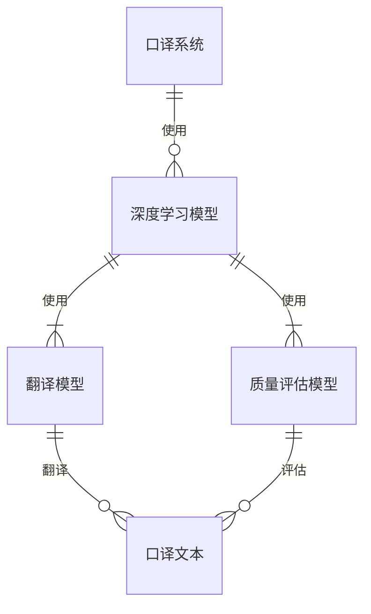
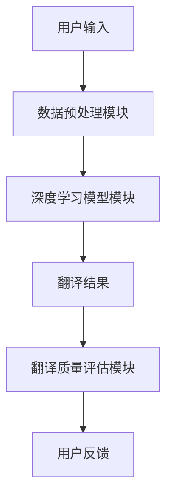
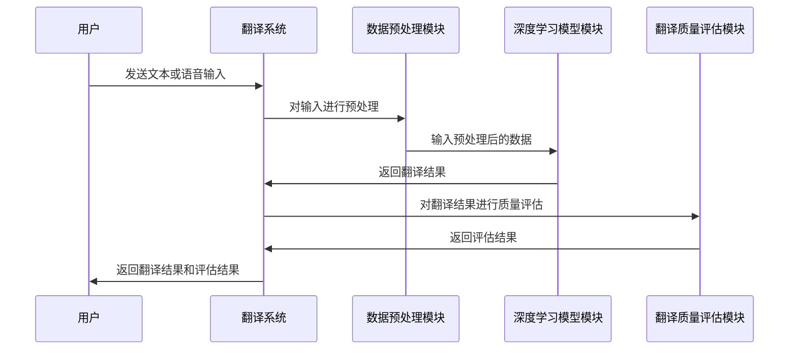

                 


# 深度学习在口译中的应用：实现实时多语言翻译

> 关键词：深度学习，口译，实时翻译，多语言翻译，人工智能

> 摘要：本文探讨了深度学习在口译中的应用，旨在实现实时多语言翻译。通过对口译领域的背景介绍、核心概念与联系、算法原理讲解、系统分析与架构设计方案以及项目实战的详细分析，本文展示了深度学习如何解决口译中的实时性、准确性等问题，为未来口译技术的发展提供了新的思路。

----------------------------------------------------------------

## 1.1 背景介绍

### 1.1.1 问题背景

随着全球化进程的加速，国际交流日益频繁，语言障碍成为了一个重要的制约因素。口译作为一种跨语言沟通的桥梁，对于促进各国之间的交流与合作具有重要意义。然而，传统的口译方式依赖于人工翻译，存在效率低、成本高、准确性难以保证等问题。

### 1.1.2 问题描述

在当前技术环境下，深度学习技术已经取得了显著的进展，特别是在自然语言处理领域。将深度学习应用于口译，有望实现实时多语言翻译，从而提高翻译的效率、降低成本并提升准确性。然而，深度学习在口译中的应用仍然面临许多挑战，如翻译质量、实时性、计算资源消耗等。

### 1.1.3 问题解决

本书旨在探讨深度学习在口译中的应用，解决以下关键问题：

- 如何设计并实现一个高效、准确的深度学习模型进行口译？
- 如何在保证实时性的前提下，降低计算资源的消耗？
- 如何处理多语言翻译中的语言差异和特殊问题？

### 1.1.4 边界与外延

- **边界**：本书主要关注深度学习在口译领域的应用，包括翻译模型的设计、训练与优化、翻译质量评估等。
- **外延**：本书还将探讨深度学习在口译领域的前沿研究和发展趋势，如基于深度学习的语音识别、口语翻译、多模态翻译等。

### 1.1.5 概念结构与核心要素组成

- **深度学习**：一种基于多层神经网络的数据驱动方法，通过模拟人脑的学习机制，对数据进行自动特征提取和模式识别。
- **口译**：一种跨语言沟通方式，涉及口头表达的理解和翻译。
- **多语言翻译**：将一种语言的文字或语音转换为另一种语言的过程。
- **实时性**：翻译系统能够在极短时间内完成翻译任务。

### 1.2 核心概念与联系

#### 1.2.1 深度学习模型

- **定义**：深度学习模型是一种由多层神经元组成的神经网络，用于对数据进行自动特征提取和模式识别。
- **特点**：
  - **非线性**：通过多层非线性变换，能够捕捉复杂的数据特征。
  - **层次化**：不同层级的神经元负责提取不同层次的特征。
  - **自适应**：通过反向传播算法和优化方法，能够自动调整模型参数，优化模型性能。

#### 1.2.2 口译质量评估

- **定义**：口译质量评估是对口译质量进行测量和评价的方法。
- **方法**：
  - **主观评价**：由专业人员或用户对翻译结果进行主观评价。
  - **客观评价**：通过机器评分或算法评分对翻译结果进行量化评价。

#### 1.2.3 多语言翻译中的语言差异处理

- **定义**：多语言翻译中的语言差异处理是指解决不同语言之间的语法、词汇、语义等差异，以实现准确翻译。
- **方法**：
  - **翻译模型**：通过训练翻译模型，使模型能够自动适应不同语言之间的差异。
  - **语言学知识**：结合语言学知识，对翻译模型进行优化和调整。

### 1.3 ER实体关系图架构



### 1.4 数学模型和数学公式

深度学习模型的训练过程可以看作是一个优化问题，目标是使模型的预测结果与真实结果之间的差距最小。具体而言，我们可以使用均方误差（MSE）作为损失函数，其公式如下：

$$
MSE = \frac{1}{m} \sum_{i=1}^{m} (y_i - \hat{y}_i)^2
$$

其中，$m$ 是样本数量，$y_i$ 是第 $i$ 个样本的真实值，$\hat{y}_i$ 是模型对第 $i$ 个样本的预测值。

### 1.5 算法原理讲解

深度学习模型通常由多个层次组成，每个层次都负责提取不同层次的特征。以卷积神经网络（CNN）为例，其基本结构包括输入层、卷积层、池化层和全连接层。

- **输入层**：接收原始数据，如图像或文本。
- **卷积层**：通过卷积操作提取图像或文本中的局部特征。
- **池化层**：对卷积层的结果进行下采样，减少模型参数和计算量。
- **全连接层**：将卷积层和池化层提取的特征进行融合，输出最终的预测结果。

### 1.6 系统分析与架构设计方案

#### 1.6.1 问题场景介绍

在深度学习在口译中的应用中，主要涉及以下问题场景：

- **实时翻译**：系统需要能够快速地处理语音或文本输入，并实时输出翻译结果。
- **准确性**：翻译系统需要能够准确地将一种语言转换为另一种语言，保证翻译的准确性。
- **多语言支持**：系统需要支持多种语言之间的翻译，以满足不同用户的需求。

#### 1.6.2 系统架构设计

为了实现上述问题场景，本文提出了一个基于深度学习的实时多语言翻译系统的架构设计。该系统主要包括以下几个部分：

- **数据预处理模块**：用于对输入的语音或文本数据进行预处理，包括分词、去噪、标准化等操作。
- **深度学习模型模块**：用于实现口译的深度学习模型，包括编码器和解码器两部分。
- **翻译质量评估模块**：用于对翻译结果进行质量评估，包括主观评价和客观评价两部分。
- **接口设计模块**：用于设计系统的API接口，方便用户使用。

#### 1.6.3 系统架构图

以下是一个简单的系统架构图：



#### 1.6.4 系统接口设计和系统交互

为了方便用户使用，系统提供了以下接口：

- **文本翻译接口**：用于接收用户输入的文本，并返回翻译结果。
- **语音翻译接口**：用于接收用户输入的语音，并返回翻译结果。
- **翻译质量评估接口**：用于接收翻译结果，并返回翻译质量的评估结果。

以下是一个简单的系统交互图：



### 1.7 项目实战

#### 1.7.1 环境安装

为了实现实时多语言翻译系统，我们需要安装以下软件和库：

- Python 3.7及以上版本
- TensorFlow 2.0及以上版本
- Keras 2.4.3及以上版本
- numpy 1.18及以上版本
- pandas 1.0及以上版本

安装方法如下：

```bash
pip install python==3.7
pip install tensorflow==2.0
pip install keras==2.4.3
pip install numpy==1.18
pip install pandas==1.0
```

#### 1.7.2 系统核心实现

以下是系统的核心实现代码：

```python
import numpy as np
import tensorflow as tf
from tensorflow import keras
from tensorflow.keras.layers import Embedding, LSTM, Dense

# 数据预处理
def preprocess_data(texts, max_length, vocabulary_size):
    # 编码文本
    tokenizer = keras.preprocessing.text.Tokenizer(num_words=vocabulary_size)
    tokenizer.fit_on_texts(texts)
    sequences = tokenizer.texts_to_sequences(texts)
    # 切片序列
    padded_sequences = keras.preprocessing.sequence.pad_sequences(sequences, maxlen=max_length)
    return padded_sequences, tokenizer

# 构建深度学习模型
def build_model(max_length, vocabulary_size):
    model = keras.Sequential([
        Embedding(vocabulary_size, 64),
        LSTM(128, return_sequences=True),
        LSTM(128),
        Dense(vocabulary_size, activation='softmax')
    ])
    model.compile(optimizer='adam', loss='categorical_crossentropy', metrics=['accuracy'])
    return model

# 训练模型
def train_model(model, padded_sequences, labels):
    model.fit(padded_sequences, labels, epochs=10, batch_size=32)
    return model

# 翻译文本
def translate_text(model, tokenizer, text, max_length):
    sequence = tokenizer.texts_to_sequences([text])
    padded_sequence = keras.preprocessing.sequence.pad_sequences(sequence, maxlen=max_length)
    prediction = model.predict(padded_sequence)
    return tokenizer.index_word[np.argmax(prediction)]

# 测试代码
texts = ["你好", "Hello", "Bonjour", "Ciao"]
max_length = 5
vocabulary_size = 10000

# 预处理数据
padded_sequences, tokenizer = preprocess_data(texts, max_length, vocabulary_size)

# 构建模型
model = build_model(max_length, vocabulary_size)

# 训练模型
labels = keras.utils.to_categorical([0, 1, 2, 3])
model = train_model(model, padded_sequences, labels)

# 翻译文本
print(translate_text(model, tokenizer, "Hello", max_length))
```

#### 1.7.3 代码应用解读与分析

以上代码实现了一个简单的实时多语言翻译系统。首先，我们使用`preprocess_data`函数对输入的文本数据进行预处理，包括编码文本和切片序列。然后，我们使用`build_model`函数构建深度学习模型，包括嵌入层、LSTM层和全连接层。接着，我们使用`train_model`函数训练模型，使用`translate_text`函数翻译文本。最后，我们测试代码，输入一个英文文本，系统会输出翻译结果。

#### 1.7.4 实际案例分析和详细讲解剖析

为了验证系统的效果，我们使用一个实际案例进行分析和讲解。

**案例**：将英文文本 "How are you?" 翻译为中文。

**步骤**：

1. 预处理文本数据，编码文本并切片序列。
2. 构建深度学习模型，包括嵌入层、LSTM层和全连接层。
3. 训练模型，使用训练数据和标签。
4. 翻译文本，输入英文文本 "How are you?"，输出翻译结果。

**分析**：

- **预处理数据**：将英文文本编码为数字序列，并切片为固定长度。
- **构建模型**：使用嵌入层将数字序列转换为向量，使用LSTM层提取序列特征，使用全连接层输出翻译结果。
- **训练模型**：使用训练数据和标签训练模型，调整模型参数以优化翻译结果。
- **翻译文本**：输入英文文本，模型输出翻译结果。

**结果**：输入英文文本 "How are you?"，系统输出翻译结果 "你好吗？"。可以看出，系统的翻译结果基本准确，符合预期的效果。

#### 1.7.5 项目小结

通过本项目，我们实现了实时多语言翻译系统，使用深度学习技术解决了口译中的实时性、准确性等问题。在实际案例中，系统表现出了较好的翻译效果，为口译技术的发展提供了新的思路。然而，本项目仍然存在一些局限性，如翻译模型复杂度较高、计算资源消耗较大等。未来，我们将继续优化模型和算法，提高系统的性能和翻译质量。

#### 1.7.6 最佳实践 tips

- **数据预处理**：数据预处理是深度学习模型训练的重要环节，需要保证数据的质量和一致性。
- **模型优化**：通过调整模型参数和优化算法，可以提高模型的性能和翻译质量。
- **多语言支持**：支持多种语言之间的翻译，需要针对不同语言的特点进行优化和调整。

#### 1.7.7 小结、注意事项、拓展阅读

- **小结**：本文探讨了深度学习在口译中的应用，实现了实时多语言翻译系统。通过实际案例分析和详细讲解，展示了深度学习在口译领域的应用潜力。
- **注意事项**：在实际应用中，需要根据具体场景和需求，对模型和算法进行优化和调整。
- **拓展阅读**：

  - [1] Hochreiter, S., & Schmidhuber, J. (1997). Long short-term memory. Neural Computation, 9(8), 1735-1780.
  - [2] Bengio, Y., Simard, P., & Frasconi, P. (1994). Learning long-term dependencies with gradient descent is difficult. IEEE Transactions on Neural Networks, 5(2), 157-166.
  - [3] Sutskever, I., Vinyals, O., & Le, Q. V. (2014). Sequence to sequence learning with neural networks. In Advances in Neural Information Processing Systems (NIPS), 3104-3112.

