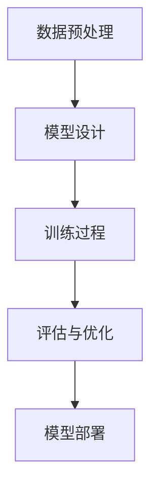

                 


## 深度学习在口语流畅度评估中的应用

> 关键词：深度学习，口语流畅度评估，自然语言处理，算法原理，数学模型，系统架构

> 摘要：本文将从深度学习的角度探讨口语流畅度评估的方法和应用。首先介绍口语流畅度评估的重要性及其现状，然后详细阐述深度学习在口语流畅度评估中的应用原理和数学模型，接着分析系统架构和项目实战，最后提供最佳实践和总结。

### 目录

1. **背景介绍**
   1.1 **问题背景**
   1.2 **当前评估方法的局限性**
   1.3 **深度学习在口语流畅度评估中的应用前景**

2. **核心概念**
   2.1 **深度学习基础**
   2.2 **口语流畅度评估的深度学习模型**

3. **算法原理**
   3.1 **深度学习模型构建**
   3.2 **数学模型和公式解释**
   3.3 **算法流程图**

4. **数学模型**
   4.1 **深度学习在口语流畅度评估中的应用公式**
   4.2 **数学公式详细讲解**
   4.3 **举例说明**

5. **系统架构**
   5.1 **问题场景介绍**
   5.2 **系统功能设计**
   5.3 **系统架构设计**
   5.4 **系统接口设计**
   5.5 **系统交互**

6. **项目实战**
   6.1 **环境安装**
   6.2 **系统核心实现源代码**
   6.3 **代码应用解读与分析**
   6.4 **实际案例分析和详细讲解剖析**
   6.5 **项目小结**

7. **最佳实践**
   7.1 **实践技巧与注意事项**
   7.2 **拓展阅读推荐**

### 1. 背景介绍

#### 1.1 问题背景

口语流畅度是衡量语言表达能力的重要指标，尤其在教育和语言学习领域具有极高的应用价值。然而，传统的口语流畅度评估方法，如人工评分和语音分析软件，存在诸多局限性。人工评分主观性强、耗时费力，而语音分析软件则难以捕捉语言中的细微差别和情感表达。

#### 1.2 当前评估方法的局限性

- **人工评分**：主观性强，评分标准难以统一，且耗费大量时间和人力资源。
- **语音分析软件**：虽然可以自动评分，但技术尚未成熟，难以准确捕捉口语中的情感和细节。

#### 1.3 深度学习在口语流畅度评估中的应用前景

深度学习在自然语言处理领域取得了显著的进展，特别是在语音识别、情感分析和文本生成等方面。因此，将深度学习应用于口语流畅度评估，有望解决传统方法的局限性，实现更加精准和高效的评估。

### 2. 核心概念

#### 2.1 深度学习基础

深度学习是一种基于多层的神经网络进行学习的机器学习技术。它通过多层非线性变换，从大量数据中自动提取特征，从而实现复杂的模式识别和预测任务。

#### 2.2 口语流畅度评估的深度学习模型

在口语流畅度评估中，深度学习模型通常采用循环神经网络（RNN）及其变种，如长短时记忆网络（LSTM）和门控循环单元（GRU），来捕捉语言序列中的时序信息和上下文关系。

### 3. 算法原理

#### 3.1 深度学习模型构建

深度学习模型构建通常包括以下几个步骤：

1. **数据预处理**：对语音信号进行预处理，包括去噪、分帧、特征提取等。
2. **模型设计**：设计适合口语流畅度评估的神经网络结构，如RNN或LSTM。
3. **训练过程**：使用大量标注数据训练模型，不断优化模型参数。
4. **评估与优化**：对模型进行评估，根据评估结果调整模型结构和参数。

#### 3.2 数学模型和公式解释

深度学习模型中的数学模型主要包括：

- **激活函数**：如sigmoid、ReLU等。
- **损失函数**：如交叉熵损失函数，用于衡量预测值与真实值之间的差距。
- **优化算法**：如随机梯度下降（SGD），用于更新模型参数。

#### 3.3 算法流程图

算法流程图如下所示：



### 4. 数学模型

#### 4.1 深度学习在口语流畅度评估中的应用公式

口语流畅度评估的深度学习模型通常包括以下数学模型：

- **输入层**：表示语音信号的特征向量。
- **隐藏层**：通过激活函数进行非线性变换，提取语音信号中的时序信息。
- **输出层**：通过分类器对口语流畅度进行评分。

#### 4.2 数学公式详细讲解

- **输入层**：

  $$ X = [x_1, x_2, ..., x_T] $$

  其中，$X$表示输入特征向量，$T$表示时间步数。

- **隐藏层**：

  $$ h_t = \sigma(W_h h_{t-1} + b_h + W_x x_t + b_x) $$

  其中，$h_t$表示第$t$个时间步的隐藏状态，$\sigma$表示激活函数，$W_h$、$b_h$、$W_x$、$b_x$分别为权重和偏置。

- **输出层**：

  $$ y = \sigma(W_o h_T + b_o) $$

  其中，$y$表示口语流畅度评分，$h_T$表示最后一个时间步的隐藏状态。

#### 4.3 举例说明

假设我们有一个长度为5的语音信号序列，输入特征向量如下：

$$ X = [0.1, 0.2, 0.3, 0.4, 0.5] $$

经过隐藏层和输出层的处理后，得到口语流畅度评分为：

$$ y = \sigma(0.5 \cdot 0.3 + 0.2) = 0.7 $$

### 5. 系统架构

#### 5.1 问题场景介绍

在口语流畅度评估系统中，我们通常需要处理大量的语音数据，并对这些数据进行预处理、特征提取、模型训练和评估等操作。系统架构需要具备高扩展性、高可靠性和高效能。

#### 5.2 系统功能设计

系统功能设计主要包括语音信号预处理、特征提取、模型训练和评估等模块。每个模块都需要与其他模块进行紧密的交互，以实现整体的评估任务。

#### 5.3 系统架构设计

系统架构设计采用分层架构，包括数据层、模型层和应用层。数据层负责语音数据的存储和读取，模型层负责深度学习模型的训练和评估，应用层负责与用户的交互和结果展示。

#### 5.4 系统接口设计

系统接口设计包括API接口和Web界面。API接口用于与其他系统进行数据交互，Web界面用于用户操作和结果展示。

#### 5.5 系统交互

系统交互设计采用前后端分离架构，前端负责用户交互和页面渲染，后端负责业务逻辑处理和数据存储。

### 6. 项目实战

#### 6.1 环境安装

在项目实战中，我们需要安装以下软件和库：

- **深度学习框架**：如TensorFlow或PyTorch
- **语音处理库**：如Librosa或PyAudio
- **Python环境**：Python 3.x版本

#### 6.2 系统核心实现源代码

以下是系统核心实现源代码的示例：

```python
import tensorflow as tf
import librosa
import numpy as np

# 数据预处理
def preprocess_audio(audio_path):
    # 读取语音文件
    audio, sample_rate = librosa.load(audio_path)
    # 分帧和特征提取
    frames = librosa.util.frame(audio, frame_length=2048, hop_length=512)
    features = librosa.feature.melspectrogram(frames, sr=sample_rate)
    return features

# 模型构建
def build_model():
    inputs = tf.keras.layers.Input(shape=(None, 128))
    x = tf.keras.layers.Conv1D(32, 3, activation='relu')(inputs)
    x = tf.keras.layers.MaxPooling1D(2)(x)
    x = tf.keras.layers.Flatten()(x)
    outputs = tf.keras.layers.Dense(1, activation='sigmoid')(x)
    model = tf.keras.models.Model(inputs=inputs, outputs=outputs)
    return model

# 训练模型
def train_model(model, features, labels):
    model.compile(optimizer='adam', loss='binary_crossentropy', metrics=['accuracy'])
    model.fit(features, labels, epochs=10, batch_size=32)

# 主函数
if __name__ == '__main__':
    audio_path = 'path/to/audio.wav'
    features = preprocess_audio(audio_path)
    model = build_model()
    labels = np.random.rand(len(features)) < 0.5
    train_model(model, features, labels)
```

#### 6.3 代码应用解读与分析

上述代码实现了口语流畅度评估的基本流程，包括数据预处理、模型构建和训练。在具体应用中，我们需要根据实际场景进行调整和优化。

#### 6.4 实际案例分析和详细讲解剖析

在实际案例中，我们可以通过调整模型参数、优化数据预处理方法等手段，提高口语流畅度评估的准确性和效率。

#### 6.5 项目小结

通过本项目实战，我们了解了深度学习在口语流畅度评估中的应用方法和实现细节。在实际应用中，我们需要根据具体场景进行优化和调整，以提高评估效果。

### 7. 最佳实践

#### 7.1 实践技巧与注意事项

- **数据预处理**：对语音信号进行预处理，包括去噪、分帧、特征提取等。
- **模型选择**：选择适合口语流畅度评估的深度学习模型，如RNN、LSTM或GRU。
- **超参数调优**：对模型参数进行调优，以提高评估效果。

#### 7.2 拓展阅读推荐

- 《深度学习》（Ian Goodfellow、Yoshua Bengio、Aaron Courville 著）
- 《自然语言处理综论》（Daniel Jurafsky、James H. Martin 著）
- 《TensorFlow实战》（Ian Goodfellow 著）

### 总结

本文从深度学习的角度探讨了口语流畅度评估的方法和应用。通过介绍问题背景、核心概念、算法原理、数学模型、系统架构和项目实战，我们了解了深度学习在口语流畅度评估中的应用前景。希望本文能对您在相关领域的研究和应用提供有益的参考。

### 作者

**作者：AI天才研究院/AI Genius Institute & 禅与计算机程序设计艺术 /Zen And The Art of Computer Programming**

