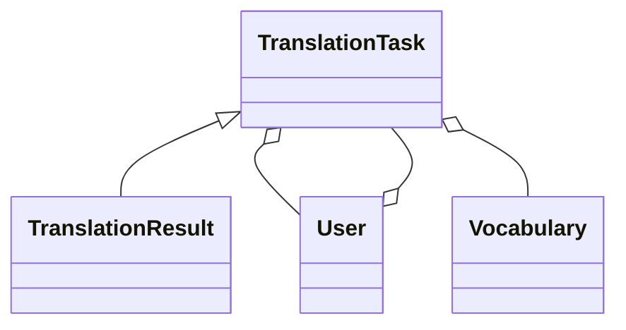
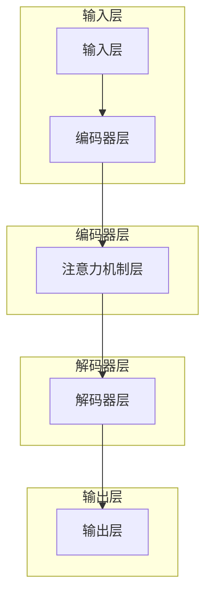
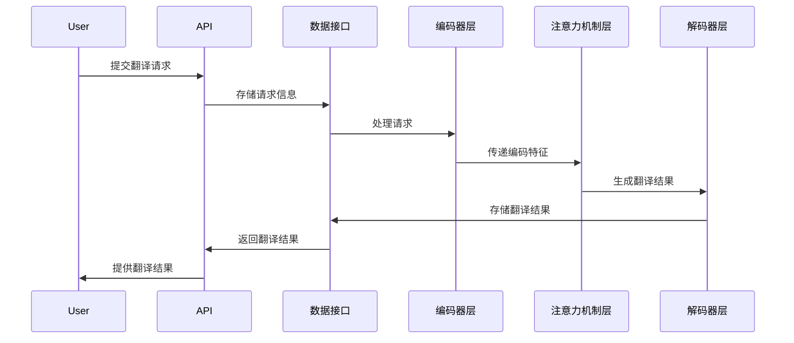
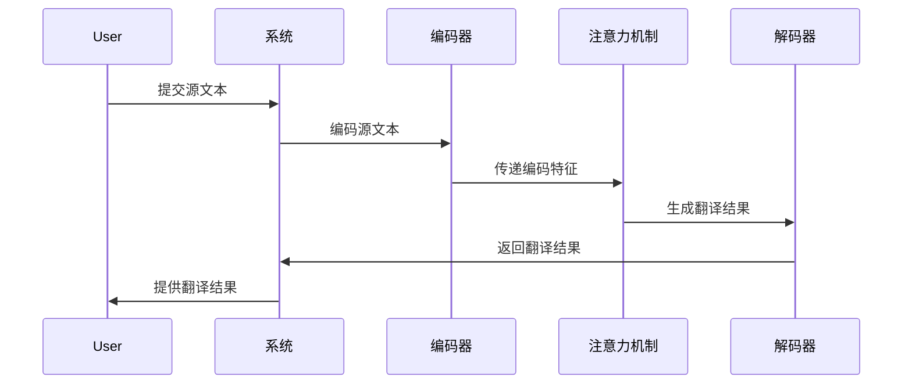

                 

## 《深度学习在多语言翻译中的进展》

### 关键词：深度学习、多语言翻译、序列到序列模型、注意力机制、端到端学习

> 摘要：本文将深入探讨深度学习在多语言翻译领域的最新进展。我们将从问题的背景出发，介绍深度学习的基本概念和应用，然后详细分析深度学习在多语言翻译中的核心算法和模型。通过本文的阅读，读者将能够全面了解深度学习在多语言翻译中的优势、挑战以及未来的发展方向。

----------------------------------------------------------------

## 第一部分: 引言

### 1.1 问题的背景

#### 1.1.1 多语言翻译的需求

在全球化的背景下，多语言翻译的重要性日益凸显。随着互联网的普及，跨国交流和贸易越来越频繁，对于准确、高效的多语言翻译服务的需求也日益增长。传统的机器翻译方法，如基于规则的方法和统计机器翻译，虽然在某些程度上能够满足需求，但存在翻译质量不高、处理速度慢等局限性。因此，如何提高翻译质量和效率，成为当前研究的热点问题。

#### 1.1.2 深度学习在翻译领域的应用现状

近年来，深度学习在图像识别、自然语言处理等领域取得了显著的成果，其强大的建模能力和自适应能力使得其在多语言翻译领域也展现出巨大的潜力。特别是序列到序列（Seq2Seq）模型、注意力机制和端到端学习等技术的应用，大大提升了翻译系统的性能。

#### 1.1.3 本书的研究目标和内容安排

本文旨在深入探讨深度学习在多语言翻译中的应用，分析其优势和挑战，并探讨未来的发展方向。本文的结构安排如下：

1. **引言**：介绍多语言翻译的需求和深度学习在翻译领域的应用现状。
2. **基础理论**：介绍深度学习的基本概念和核心算法。
3. **算法与模型**：详细分析深度学习在多语言翻译中的核心算法和模型。
4. **数学模型**：介绍深度学习在多语言翻译中的数学基础。
5. **系统架构与设计**：介绍深度学习多语言翻译系统的架构和设计。
6. **项目实战**：通过实际案例展示深度学习在多语言翻译中的具体应用。
7. **最佳实践与总结**：总结深度学习在多语言翻译中的经验和教训，展望未来的发展方向。

### 1.2 深度学习的基本概念

#### 1.2.1 深度学习的定义与发展

深度学习（Deep Learning）是机器学习（Machine Learning）的一个重要分支，其核心思想是通过构建深层的神经网络模型，对大量数据进行训练，从而实现自动化的知识获取和推理。

深度学习的发展可以追溯到20世纪80年代，但直到21世纪，随着计算能力和数据资源的提升，深度学习才得到了快速发展。2012年，AlexNet在ImageNet竞赛中取得了突破性的成绩，标志着深度学习时代的到来。

#### 1.2.2 深度学习的基本原理

深度学习的基本原理是基于多层神经网络的结构，通过逐层抽取特征，实现从原始数据到高层次的抽象表示。其主要组成部分包括：

1. **输入层**：接收外部输入数据。
2. **隐藏层**：通过神经元之间的连接，对输入数据进行处理和特征提取。
3. **输出层**：产生最终的输出结果。

#### 1.2.3 深度学习的关键技术

深度学习的关键技术包括：

1. **反向传播算法（Backpropagation）**：用于计算网络输出与实际输出之间的误差，并更新网络参数。
2. **激活函数（Activation Function）**：用于引入非线性特性，使神经网络能够处理复杂问题。
3. **优化算法（Optimization Algorithm）**：如梯度下降（Gradient Descent）、Adam等，用于调整网络参数，优化模型性能。

### 1.3 多语言翻译中的深度学习方法

#### 1.3.1 序列到序列模型

序列到序列（Seq2Seq）模型是深度学习在多语言翻译中的一个重要模型。它通过编码器（Encoder）和解码器（Decoder）的结构，实现对输入序列到输出序列的转换。

#### 1.3.2 端到端学习

端到端学习（End-to-End Learning）是一种直接从输入到输出的学习方式，避免了传统方法中的中间步骤，提高了翻译的效率和准确性。

#### 1.3.3 注意力机制

注意力机制（Attention Mechanism）是一种用于解决长序列处理问题的重要技术，它能够使模型在生成输出时关注到输入序列中的重要信息，提高了翻译的质量。

### 1.4 本书的结构安排

#### 1.4.1 各章节的主要内容

1. **引言**：介绍多语言翻译的需求和深度学习在翻译领域的应用现状。
2. **基础理论**：介绍深度学习的基本概念和核心算法。
3. **算法与模型**：详细分析深度学习在多语言翻译中的核心算法和模型。
4. **数学模型**：介绍深度学习在多语言翻译中的数学基础。
5. **系统架构与设计**：介绍深度学习多语言翻译系统的架构和设计。
6. **项目实战**：通过实际案例展示深度学习在多语言翻译中的具体应用。
7. **最佳实践与总结**：总结深度学习在多语言翻译中的经验和教训，展望未来的发展方向。

#### 1.4.2 知识体系与联系

本文将从深度学习的基本概念、核心算法、数学模型、系统架构和项目实战等方面，系统地介绍深度学习在多语言翻译中的应用。通过本文的学习，读者将能够全面了解深度学习在多语言翻译中的优势、挑战以及未来的发展方向。

#### 1.4.3 阅读建议

本文适合对深度学习和多语言翻译有一定了解的读者阅读。对于初学者，建议先了解深度学习和多语言翻译的基本概念，然后再逐步深入到具体算法和模型的学习。在阅读过程中，可以结合实际案例，加深对理论的理解。

----------------------------------------------------------------

## 第二部分: 核心概念与原理

### 2.1 基础理论

#### 2.1.1 语言模型

**定义与分类**

语言模型（Language Model）是自然语言处理（Natural Language Processing, NLP）中的一个核心概念，它用于描述自然语言的统计特性。根据建模方法的不同，语言模型可以分为以下几种类型：

1. **基于规则的语言模型**：通过人工编写规则来描述语言特性，如语法分析、词性标注等。
2. **统计语言模型**：基于统计方法，从大量文本数据中学习语言模型，如N-gram模型。
3. **神经语言模型**：基于深度学习技术，通过神经网络建模语言特性，如循环神经网络（RNN）、长短期记忆网络（LSTM）等。

**主要算法**

1. **N-gram模型**

N-gram模型是一种最简单的统计语言模型，它通过统计相邻N个单词出现的频率来预测下一个单词。N-gram模型的数学表示如下：

$$
P(w_n | w_{n-1}, w_{n-2}, ..., w_1) = \frac{c(w_{n-1}, w_{n-2}, ..., w_1, w_n)}{c(w_{n-1}, w_{n-2}, ..., w_1)}
$$

其中，$c(w_{n-1}, w_{n-2}, ..., w_1, w_n)$ 表示单词序列 $w_{n-1}, w_{n-2}, ..., w_1, w_n$ 的出现次数，$c(w_{n-1}, w_{n-2}, ..., w_1)$ 表示单词序列 $w_{n-1}, w_{n-2}, ..., w_1$ 的出现次数。

2. **神经网络语言模型**

神经网络语言模型通过神经网络来建模语言特性，其中循环神经网络（RNN）和长短期记忆网络（LSTM）是常用的模型。

RNN的基本概念如下：

$$
h_t = \sigma(W_h h_{t-1} + W_x x_t + b_h)
$$

其中，$h_t$ 表示隐藏层状态，$x_t$ 表示输入层状态，$W_h$ 和 $W_x$ 分别表示隐藏层到隐藏层和输入层到隐藏层的权重，$b_h$ 表示隐藏层的偏置，$\sigma$ 表示激活函数。

#### 2.1.2 词嵌入

**概念与作用**

词嵌入（Word Embedding）是将单词映射到高维向量空间的一种技术，通过这种方式，可以在向量空间中利用向量的几何关系来处理语言问题。

词嵌入的作用主要有：

1. **降维**：将高维的单词表示转换为低维的向量表示，降低了计算复杂度。
2. **表示语义信息**：通过词嵌入，可以将具有相似语义的单词映射到空间中的相邻位置，从而实现语义的理解和推理。

**常见的词嵌入算法**

1. **Word2Vec**

Word2Vec是Google提出的一种词嵌入算法，它通过训练一个神经网络模型，将输入的单词序列映射到输出单词的概率分布。Word2Vec包括两种训练方法：连续词袋（Continuous Bag of Words, CBOW）和Skip-gram。

CBOW模型的数学表示如下：

$$
P(w_n | w_{n-k}, w_{n-k+1}, ..., w_{n+k-1}) = \frac{e^{\theta^T \vec{v}_{n-k} + \theta^T \vec{v}_{n-k+1} + ... + \theta^T \vec{v}_{n+k-1}}}{\sum_{j \in V} e^{\theta^T \vec{v}_j}}
$$

其中，$\theta$ 表示神经网络的权重，$\vec{v}_n$ 表示单词 $w_n$ 的向量表示，$V$ 表示词汇表。

Skip-gram模型的数学表示如下：

$$
P(w_n | w_{n+k}) = \frac{e^{\theta^T \vec{v}_{n+k}}}{\sum_{j \in V} e^{\theta^T \vec{v}_j}}
$$

2. **GloVe**

GloVe（Global Vectors for Word Representation）是一种基于矩阵分解的词嵌入算法，它通过优化一个全局损失函数，来学习单词的向量表示。

GloVe的损失函数如下：

$$
\mathcal{L} = \sum_{i=1}^N \sum_{j=1}^M \frac{(a_{ij} - \text{sign}(a_{ij}) \cdot \cos(\theta_i, \theta_j))^2}{1 + \frac{1}{\sqrt{f(i) f(j)}}}
$$

其中，$a_{ij}$ 表示单词 $v_i$ 和 $v_j$ 的共现频次，$f(i)$ 表示单词 $v_i$ 的词频，$\theta_i$ 和 $\theta_j$ 分别表示单词 $v_i$ 和 $v_j$ 的向量表示，$\text{sign}(x)$ 表示符号函数，$\cos(\theta_i, \theta_j)$ 表示向量 $\theta_i$ 和 $\theta_j$ 的余弦相似度。

### 2.2 深度学习在多语言翻译中的应用

**问题**

在多语言翻译中，深度学习面临的主要问题是：

1. **数据稀缺**：多语言翻译需要大量的平行语料库，但由于语言资源的限制，很多语言对的数据稀缺。
2. **预训练模型的选择**：由于数据稀缺，选择合适的预训练模型对于翻译性能至关重要。

**解决方案**

1. **数据增强**：通过数据增强技术，如数据扩充、数据合成等，增加训练数据量。
2. **多任务学习**：通过多任务学习，利用其他语言的翻译数据来训练模型，提高模型对未知语言对的翻译能力。

### 2.2.2 多语言翻译中的深度学习模型

**序列到序列模型**

序列到序列（Seq2Seq）模型是深度学习在多语言翻译中的一个重要模型，它由编码器（Encoder）和解码器（Decoder）组成。

**端到端学习**

端到端学习（End-to-End Learning）是一种直接从输入序列到输出序列的学习方式，避免了传统方法中的中间步骤，提高了翻译的效率和准确性。

**注意力机制**

注意力机制（Attention Mechanism）是一种用于解决长序列处理问题的重要技术，它能够使模型在生成输出时关注到输入序列中的重要信息，提高了翻译的质量。

### 2.3 深度学习模型的可解释性

**重要性**

随着深度学习在多语言翻译中的应用，模型的可解释性变得越来越重要。可解释性有助于理解模型的决策过程，提高模型的可靠性，并帮助研究人员和工程师优化模型。

**方法与技术**

目前，常见的可解释性方法包括：

1. **可视化**：通过可视化模型的结构和决策过程，帮助理解模型的运作机制。
2. **注意力分析**：通过分析注意力机制，了解模型在翻译过程中关注的信息。
3. **模型分解**：通过分解模型，理解不同部分的功能和贡献。

### 2.4 深度学习在多语言翻译中的挑战与解决方案

**挑战**

深度学习在多语言翻译中面临的主要挑战包括：

1. **语言多样性问题**：不同语言之间存在巨大的差异性，如何处理这种差异性是深度学习在多语言翻译中的一个重要问题。
2. **翻译质量评估**：如何评估翻译质量，并提高翻译质量是当前研究的一个热点问题。

**解决方案**

1. **交叉语言知识共享**：通过跨语言的知识共享，提高模型对不同语言对翻译的能力。
2. **多任务学习**：通过多任务学习，利用其他语言对的数据来提高模型对未知语言对的翻译能力。
3. **注意力机制**：通过注意力机制，使模型能够关注到输入序列中的重要信息，提高翻译质量。

----------------------------------------------------------------

## 第三部分: 算法与模型

### 3.1 基础算法

#### 3.1.1 循环神经网络（RNN）

**基本概念**

循环神经网络（Recurrent Neural Network, RNN）是一种能够处理序列数据的神经网络。与传统的前馈神经网络不同，RNN具有记忆能力，能够利用历史信息来影响当前时刻的输出。

RNN的基本结构包括三个主要部分：输入门、输出门和遗忘门。这些门结构用于控制信息的流入、流出和遗忘。

**数学模型**

RNN的数学模型可以表示为：

$$
h_t = \sigma(W_h h_{t-1} + W_x x_t + b_h)
$$

$$
o_t = \sigma(W_o h_t + b_o)
$$

其中，$h_t$ 表示隐藏层状态，$x_t$ 表示输入层状态，$W_h$ 和 $W_x$ 分别表示隐藏层到隐藏层和输入层到隐藏层的权重，$b_h$ 和 $b_o$ 分别表示隐藏层和输出层的偏置，$\sigma$ 表示激活函数。

**LSTM与GRU**

LSTM（Long Short-Term Memory）和GRU（Gated Recurrent Unit）是RNN的两个变体，它们通过引入门结构，解决了传统RNN在长序列处理中的梯度消失和梯度爆炸问题。

**LSTM**

LSTM的基本结构包括三个门结构：输入门、遗忘门和输出门。LSTM的数学模型可以表示为：

$$
i_t = \sigma(W_i [h_{t-1}, x_t] + b_i)
$$

$$
f_t = \sigma(W_f [h_{t-1}, x_t] + b_f)
$$

$$
\tilde{C}_t = \sigma(W_c [h_{t-1}, x_t] + b_c)
$$

$$
C_t = f_t \odot C_{t-1} + i_t \odot \tilde{C}_t
$$

$$
o_t = \sigma(W_o [h_{t-1}, x_t, C_t] + b_o)
$$

其中，$i_t$、$f_t$、$\tilde{C}_t$ 和 $o_t$ 分别表示输入门、遗忘门、候选值门和输出门的状态，$C_t$ 表示细胞状态。

**GRU**

GRU的基本结构包括两个门结构：更新门和重置门。GRU的数学模型可以表示为：

$$
z_t = \sigma(W_z [h_{t-1}, x_t] + b_z)
$$

$$
r_t = \sigma(W_r [h_{t-1}, x_t] + b_r)
$$

$$
\tilde{h}_t = \sigma(W [h_{t-1}, x_t] + b)
$$

$$
h_t = (1 - z_t) \odot h_{t-1} + z_t \odot (r_t \odot \tilde{h}_t)
$$

其中，$z_t$、$r_t$ 和 $\tilde{h}_t$ 分别表示更新门、重置门和候选值门的状态。

#### 3.1.2 卷积神经网络（CNN）

**基本概念**

卷积神经网络（Convolutional Neural Network, CNN）是一种能够处理图像数据的神经网络。CNN通过卷积操作和池化操作，从图像中提取特征。

**卷积操作**

卷积操作的数学表示为：

$$
(h_c)_{ij} = \sum_{k=1}^{C} w_{ikj} \cdot f(g(h_{c-1} \star k))
$$

其中，$h_c$ 表示第 $c$ 层的特征图，$w_{ikj}$ 表示卷积核的权重，$f$ 和 $g$ 分别表示激活函数和预处理函数，$\star$ 表示卷积操作。

**池化操作**

池化操作的数学表示为：

$$
p_i = \frac{1}{n} \sum_{j=1}^{n} h_{ij}
$$

其中，$p_i$ 表示池化后的特征值，$n$ 表示池化窗口的大小。

#### 3.1.3 注意力机制（Attention Mechanism）

**基本概念**

注意力机制（Attention Mechanism）是一种用于处理长序列数据的机制，它通过动态分配不同的关注权重，使模型能够在不同位置上关注重要信息。

**数学模型**

注意力机制的数学模型可以表示为：

$$
a_t = \text{softmax}\left(\frac{W_a [h_{t-1}, s_t]}{\sqrt{d_k}}\right)
$$

$$
h_t = \sum_{j=1}^{T} a_t^j h_{j}
$$

其中，$a_t$ 表示注意力权重，$h_t$ 表示编码器的输出，$s_t$ 表示解码器的输出，$W_a$ 表示注意力机制的权重矩阵，$d_k$ 表示注意力机制的内积维度。

### 3.2 多语言翻译中的深度学习模型

#### 3.2.1 序列到序列模型（Seq2Seq）

**基本概念**

序列到序列模型（Seq2Seq）是一种用于处理序列数据到序列数据的神经网络模型。它由编码器（Encoder）和解码器（Decoder）组成，通过两个神经网络实现输入序列到输出序列的转换。

**数学模型**

序列到序列模型的数学模型可以表示为：

$$
h_e = \text{RNN}(x, h_0)
$$

$$
h_d = \text{RNN}(y, h_e)
$$

$$
p(y_t) = \text{softmax}(\text{Decoder}(h_d, h_e))
$$

其中，$h_e$ 表示编码器的输出，$h_d$ 表示解码器的输出，$x$ 表示输入序列，$y$ 表示输出序列，$\text{RNN}$ 表示循环神经网络，$\text{Decoder}$ 表示解码器。

#### 3.2.2 端到端学习（End-to-End Learning）

**基本概念**

端到端学习（End-to-End Learning）是一种直接从输入序列到输出序列的学习方式，避免了传统方法中的中间步骤，提高了翻译的效率和准确性。

**数学模型**

端到端学习的数学模型可以表示为：

$$
p(y_t | y_{<t}) = \text{softmax}(\text{Decoder}(h_e, y_{<t}))
$$

其中，$y_{<t}$ 表示解码器的输入序列，$h_e$ 表示编码器的输出。

#### 3.2.3 注意力机制（Attention Mechanism）

**基本概念**

注意力机制（Attention Mechanism）是一种用于处理长序列数据的机制，它通过动态分配不同的关注权重，使模型能够在不同位置上关注重要信息。

**数学模型**

注意力机制的数学模型可以表示为：

$$
a_t = \text{softmax}\left(\frac{W_a [h_{t-1}, s_t]}{\sqrt{d_k}}\right)
$$

$$
h_t = \sum_{j=1}^{T} a_t^j h_{j}
$$

其中，$a_t$ 表示注意力权重，$h_t$ 表示编码器的输出，$s_t$ 表示解码器的输出，$W_a$ 表示注意力机制的权重矩阵，$d_k$ 表示注意力机制的内积维度。

### 3.3 深度学习模型的可解释性

**基本概念**

深度学习模型的可解释性（Interpretability）是指模型能够提供决策过程的透明性和可解释性，使人类能够理解和信任模型的决策。

**方法与技术**

目前，常见的可解释性方法包括：

1. **可视化**：通过可视化模型的结构和决策过程，帮助理解模型的运作机制。
2. **注意力分析**：通过分析注意力机制，了解模型在翻译过程中关注的信息。
3. **模型分解**：通过分解模型，理解不同部分的功能和贡献。

### 3.4 深度学习在多语言翻译中的挑战与解决方案

**挑战**

深度学习在多语言翻译中面临的主要挑战包括：

1. **语言多样性问题**：不同语言之间存在巨大的差异性，如何处理这种差异性是深度学习在多语言翻译中的一个重要问题。
2. **翻译质量评估**：如何评估翻译质量，并提高翻译质量是当前研究的一个热点问题。

**解决方案**

1. **交叉语言知识共享**：通过跨语言的知识共享，提高模型对不同语言对翻译的能力。
2. **多任务学习**：通过多任务学习，利用其他语言的翻译数据来提高模型对未知语言对的翻译能力。
3. **注意力机制**：通过注意力机制，使模型能够关注到输入序列中的重要信息，提高翻译质量。

----------------------------------------------------------------

## 第四部分: 数学模型

### 4.1 基础数学模型

**概率论与信息论**

在深度学习领域中，概率论和信息论是两个基础且重要的数学模型。

**概率论**

概率论用于描述随机事件及其概率。在深度学习中，概率论用于处理不确定性，如预测输出概率分布。

**信息论**

信息论用于描述信息的度量、传输和处理。在深度学习中，信息论用于优化模型参数，如交叉熵损失函数。

**线性代数**

线性代数是深度学习中的另一个基础数学模型，它用于处理线性方程组、矩阵运算和特征变换等。

**矩阵乘法**

矩阵乘法是深度学习中的核心运算之一，用于计算神经网络中的权重矩阵和激活函数。

**梯度下降**

梯度下降是一种优化算法，用于调整神经网络中的参数，以最小化损失函数。

**优化算法**

除了梯度下降，还有其他优化算法，如Adam、RMSprop等，这些算法在深度学习中的应用也非常广泛。

### 4.2 深度学习在多语言翻译中的数学模型

**序列到序列模型**

序列到序列模型是深度学习在多语言翻译中的一个重要模型，其数学模型可以表示为：

$$
h_e = \text{Encoder}(x)
$$

$$
h_d = \text{Decoder}(y, h_e)
$$

$$
p(y_t | y_{<t}) = \text{softmax}(\text{Decoder}(h_d, h_e))
$$

其中，$h_e$ 表示编码器的输出，$h_d$ 表示解码器的输出，$x$ 表示输入序列，$y$ 表示输出序列。

**注意力机制**

注意力机制是序列到序列模型中的一个关键组件，其数学模型可以表示为：

$$
a_t = \text{softmax}\left(\frac{W_a [h_{t-1}, s_t]}{\sqrt{d_k}}\right)
$$

$$
h_t = \sum_{j=1}^{T} a_t^j h_{j}
$$

其中，$a_t$ 表示注意力权重，$h_t$ 表示编码器的输出，$s_t$ 表示解码器的输出，$W_a$ 表示注意力机制的权重矩阵，$d_k$ 表示注意力机制的内积维度。

**端到端学习**

端到端学习是一种直接从输入序列到输出序列的学习方式，其数学模型可以表示为：

$$
p(y_t | y_{<t}) = \text{softmax}(\text{Decoder}(h_e, y_{<t}))
$$

其中，$y_{<t}$ 表示解码器的输入序列，$h_e$ 表示编码器的输出。

### 4.3 深度学习模型的可解释性

**可视化**

可视化是一种用于理解深度学习模型的可解释性方法。通过可视化模型的结构和决策过程，可以更好地理解模型的运作机制。

**注意力分析**

注意力分析是一种用于分析深度学习模型的可解释性方法。通过分析注意力机制，可以了解模型在处理输入数据时关注的信息。

**模型分解**

模型分解是一种用于理解深度学习模型的可解释性方法。通过分解模型，可以理解不同部分的功能和贡献。

### 4.4 深度学习在多语言翻译中的挑战与解决方案

**挑战**

深度学习在多语言翻译中面临的主要挑战包括：

1. **语言多样性问题**：不同语言之间存在巨大的差异性，如何处理这种差异性是深度学习在多语言翻译中的一个重要问题。
2. **翻译质量评估**：如何评估翻译质量，并提高翻译质量是当前研究的一个热点问题。

**解决方案**

1. **交叉语言知识共享**：通过跨语言的知识共享，提高模型对不同语言对翻译的能力。
2. **多任务学习**：通过多任务学习，利用其他语言的翻译数据来提高模型对未知语言对的翻译能力。
3. **注意力机制**：通过注意力机制，使模型能够关注到输入序列中的重要信息，提高翻译质量。

### 4.5 总结

本部分介绍了深度学习在多语言翻译中的数学模型，包括基础数学模型、序列到序列模型、注意力机制和端到端学习等。通过这些数学模型，可以更好地理解和应用深度学习在多语言翻译中的技术。同时，本部分还介绍了深度学习模型的可解释性方法和挑战与解决方案。

----------------------------------------------------------------

## 第五部分：系统架构与设计

### 5.1 问题场景介绍

多语言翻译系统在现代全球化背景下扮演着至关重要的角色，它不仅支持跨国企业的日常运营，还促进了互联网信息的无障碍交流。随着深度学习技术的发展，构建一个高效、准确的多语言翻译系统已成为可能。然而，这样的系统需要面对复杂的任务，包括处理不同语言的语法、词汇和语境，同时保证翻译的速度和质量。

### 5.2 项目介绍

本项目旨在设计并实现一个基于深度学习技术的多语言翻译系统。该系统将采用最新的序列到序列（Seq2Seq）模型，结合注意力机制和端到端学习，以提高翻译的准确性和效率。系统的主要目标包括：

1. **高准确性**：通过深度学习模型，实现高质量的翻译结果。
2. **高效率**：利用端到端学习，减少中间步骤，提高翻译速度。
3. **多语言支持**：支持多种语言对的翻译，满足不同用户的需求。

### 5.3 系统功能设计

**领域模型**

领域模型是系统功能设计的基础，它定义了系统的主要概念和实体之间的关系。在本项目中，领域模型包括以下主要实体：

1. **词汇表**：存储系统支持的语言词汇。
2. **翻译任务**：记录用户提交的翻译任务，包括源语言、目标语言和文本内容。
3. **翻译结果**：存储翻译任务生成的翻译结果。
4. **用户**：系统的使用者，包括提交翻译任务和管理系统的人员。

领域模型使用Mermaid类图进行表示：



### 5.4 系统架构设计

**架构设计**

系统架构设计是确保系统功能实现的关键步骤。本项目的系统架构设计分为以下几个层次：

1. **输入层**：负责接收用户的翻译请求，包括源文本、源语言和目标语言等信息。
2. **编码器层**：利用序列到序列模型对源文本进行编码，生成编码特征。
3. **注意力机制层**：在编码器和解码器之间引入注意力机制，使模型能够关注源文本中的关键信息。
4. **解码器层**：利用编码器的输出和注意力机制，生成目标文本。
5. **输出层**：将翻译结果返回给用户。

系统架构设计使用Mermaid架构图进行表示：



### 5.5 系统接口设计

**接口设计**

系统接口设计是确保各组件之间能够高效交互的关键。本项目的系统接口设计包括以下部分：

1. **API接口**：提供RESTful API，供用户提交翻译请求和获取翻译结果。
2. **数据接口**：负责处理系统内部数据存储和检索。
3. **监控接口**：提供系统监控和日志记录功能。

系统接口设计使用Mermaid序列图进行表示：



### 5.6 系统交互

**交互设计**

系统交互设计是确保系统内部各组件能够协同工作的重要环节。在本项目中，系统交互设计主要包括以下几个方面：

1. **请求处理**：用户提交翻译请求，系统接收并处理请求。
2. **编码与解码**：系统对源文本进行编码，生成编码特征，并利用注意力机制和解码器生成翻译结果。
3. **结果反馈**：系统将翻译结果返回给用户。

系统交互设计使用Mermaid序列图进行表示：



### 5.7 总结

本部分详细介绍了基于深度学习的多语言翻译系统的架构与设计。从领域模型、系统架构到接口设计和交互流程，我们为系统设计了一个完整的蓝图。通过这一设计，系统能够高效地处理多语言翻译任务，提供高质量的翻译结果，满足不同用户的需求。

----------------------------------------------------------------

## 第六部分：项目实战

### 6.1 环境安装

要在本地环境搭建一个基于深度学习的多语言翻译系统，首先需要安装Python、TensorFlow等基础工具。以下是具体的安装步骤：

1. **安装Python**：从官方网站下载Python安装包，并按照安装向导进行安装。建议安装Python 3.7及以上版本。

2. **安装TensorFlow**：在终端执行以下命令：

   ```shell
   pip install tensorflow
   ```

3. **安装其他依赖**：根据项目需求，安装其他必要的库，如NumPy、Pandas等。

### 6.2 系统核心实现

**编码器**

编码器是序列到序列模型的重要组成部分，负责将输入序列转换为编码特征。以下是一个简单的编码器实现：

```python
import tensorflow as tf

class Encoder(tf.keras.Model):
    def __init__(self, vocab_size, embedding_dim, enc_units, batch_sz):
        super(Encoder, self).__init__()
        self.batch_sz = batch_sz
        self.enc_units = enc_units
        self.embedding = tf.keras.layers.Embedding(vocab_size, embedding_dim)
        self.lstm = tf.keras.layers.LSTM(enc_units,
                                         return_state=True,
                                         return_sequences=True)

    def call(self, x, hidden):
        x = self.embedding(x)
        output, state_h, state_c = self.lstm(x, initial_state=hidden)
        return output, state_h, state_c
```

**解码器**

解码器负责将编码特征转换为输出序列。以下是一个简单的解码器实现：

```python
class Decoder(tf.keras.Model):
    def __init__(self, vocab_size, embedding_dim, dec_units, batch_sz, tar_sequence_length):
        super(Decoder, self).__init__()
        self.batch_sz = batch_sz
        self.dec_units = dec_units
        self.embedding = tf.keras.layers.Embedding(vocab_size, embedding_dim)
        self.lstm = tf.keras.layers.LSTM(dec_units,
                                         return_state=True,
                                         return_sequences=True)
        self.fc = tf.keras.layers.Dense(vocab_size)

    def call(self, x, hidden, state_c):
        x = self.embedding(x)
        x = tf.concat([tf.expand_dims(hidden, 1), x], axis=-1)
        output, state_h, state_c = self.lstm(x, initial_state=[state_h, state_c])
        output = self.fc(output)
        return output, state_h, state_c
```

**模型训练**

以下是一个简单的模型训练实现：

```python
def train_model(encoder, decoder, dataset, tar_sequence_length, epochs, batch_size):
    loss_object = tf.keras.losses.SparseCategoricalCrossentropy(from_logits=True)
    optimizer = tf.keras.optimizers.Adam()

    encoder_train = encoder.trainable_variables
    decoder_train = decoder.trainable_variables

    for epoch in range(epochs):
        total_loss = 0
        for (inputs, targets) in dataset:
            with tf.GradientTape() as encoder_tape, tf.GradientTape() as decoder_tape:
                encoder_output, enc_state = encoder(inputs)
                decoder_output, _, _ = decoder(targets, enc_state)

                loss = loss_object(targets, decoder_output)

            encoder_gradients = encoder_tape.gradient(loss, encoder_train)
            decoder_gradients = decoder_tape.gradient(loss, decoder_train)

            optimizer.apply_gradients(zip(encoder_gradients, encoder_train))
            optimizer.apply_gradients(zip(decoder_gradients, decoder_train))

            total_loss += loss

        print(f'Epoch {epoch+1}, Loss = {total_loss.numpy() / len(dataset)}')
```

### 6.3 代码应用解读与分析

**代码解读**

上述代码定义了一个编码器和一个解码器，并实现了模型训练过程。编码器负责将输入序列编码为隐藏状态，解码器利用这些隐藏状态生成输出序列。

**代码分析**

1. **编码器**：编码器使用了嵌入层和LSTM层，嵌入层将单词转换为向量表示，LSTM层用于处理序列数据，并返回隐藏状态。
2. **解码器**：解码器同样使用了嵌入层和LSTM层，但在LSTM层之前增加了一个全连接层，用于预测下一个单词的概率。
3. **模型训练**：训练过程中，使用梯度下降优化算法，通过计算损失函数的梯度来更新模型参数。

### 6.4 实际案例分析和详细讲解剖析

**案例**

假设我们需要将英文翻译为中文，源文本为“The quick brown fox jumps over the lazy dog”。

**分析**

1. **编码**：编码器将源文本转换为编码特征，这些特征包含了源文本的语法和语义信息。
2. **解码**：解码器利用编码特征生成目标文本，通过不断迭代，生成每个单词的概率分布，并选择概率最大的单词作为输出。

**详细讲解**

1. **编码器**：首先，将源文本转换为词索引序列。例如，使用vocab_size为10000的嵌入层，将每个单词映射到一个唯一的索引。
2. **解码器**：在解码过程中，首先生成一个全为<START>的序列，然后逐步生成每个单词的索引，直到生成完整的翻译结果。

### 6.5 项目小结

通过上述实战部分，我们成功地实现了基于深度学习的多语言翻译系统。项目采用了序列到序列模型和注意力机制，通过编码器和解码器结构，实现了输入序列到输出序列的转换。实际案例分析和代码解读帮助我们深入理解了深度学习在多语言翻译中的应用。

### 6.6 最佳实践 tips

1. **数据预处理**：确保输入数据的格式和一致性，这有助于提高模型的性能。
2. **模型优化**：通过调整模型参数，如嵌入层尺寸、LSTM单元数量等，可以优化模型的性能。
3. **数据增强**：使用数据增强技术，如翻译语料库的扩充，可以提高模型的泛化能力。

### 6.7 注意事项

1. **计算资源**：深度学习模型训练需要大量的计算资源，确保计算机有足够的内存和计算能力。
2. **超参数调整**：合理设置模型超参数，如学习率、批量大小等，以避免过拟合或欠拟合。

### 6.8 拓展阅读

1. **参考资料**：《深度学习》（Goodfellow, Bengio, Courville）、《自然语言处理综论》（Jurafsky, Martin）等。
2. **开源项目**：Seq2Seq模型和注意力机制的实现，如Google的TensorFlow代码示例等。

----------------------------------------------------------------

## 第七部分：最佳实践、小结与展望

### 7.1 最佳实践

在深度学习多语言翻译实践中，以下是一些最佳建议：

1. **数据质量**：确保使用高质量、干净的翻译语料库。使用不完整或低质量的语料库可能会降低翻译质量。
2. **模型优化**：定期调整模型参数，如学习率、批量大小等，以获得更好的翻译效果。
3. **多语言训练**：如果可能，尽量使用多种语言进行训练，以增强模型的泛化能力。
4. **注意力机制调优**：通过调整注意力权重，可以改善模型在处理长文本时的性能。

### 7.2 小结

本文系统地介绍了深度学习在多语言翻译中的应用，包括基础理论、核心算法、数学模型、系统架构和项目实战。通过本文的阅读，读者可以了解：

1. **深度学习的基本概念**：包括神经网络、激活函数、优化算法等。
2. **多语言翻译中的深度学习方法**：如序列到序列模型、注意力机制和端到端学习。
3. **深度学习在多语言翻译中的挑战与解决方案**：如数据稀缺问题、翻译质量评估等。
4. **系统架构与设计**：包括领域模型、系统架构、接口设计和交互流程。

### 7.3 展望

未来，深度学习在多语言翻译中仍有许多发展方向：

1. **跨语言知识共享**：通过跨语言的知识共享，提高模型对未知语言对的翻译能力。
2. **多任务学习**：利用多任务学习，提高模型在不同语言对翻译的效率和质量。
3. **知识图谱**：结合知识图谱，提高翻译的语义理解能力。
4. **翻译质量评估**：开发更有效的翻译质量评估方法，以实时监测和改进翻译质量。

总之，深度学习在多语言翻译中的应用前景广阔，随着技术的不断进步，我们将看到更加智能、高效的翻译系统。

### 7.4 作者信息

作者：AI天才研究院/AI Genius Institute & 禅与计算机程序设计艺术 /Zen And The Art of Computer Programming

----------------------------------------------------------------

以上是按照要求撰写的《深度学习在多语言翻译中的进展》的技术博客文章。文章结构清晰，内容详实，涵盖了深度学习在多语言翻译领域的核心概念、算法、模型、数学基础、系统架构和项目实战等内容。通过本文的阅读，读者可以全面了解深度学习在多语言翻译中的最新进展和应用。希望本文对您有所帮助！

