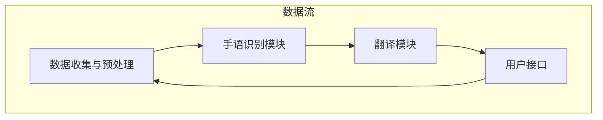
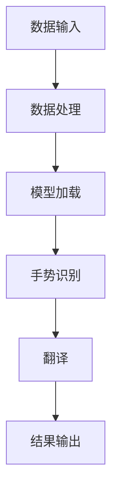
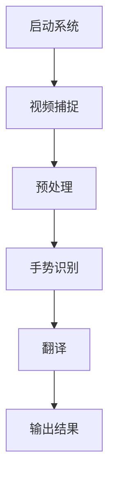

                 

### 《深度学习在手语实时翻译中的突破》

关键词：手语实时翻译、深度学习、实时性、准确性、多模态学习

摘要：本文探讨了深度学习在手语实时翻译中的应用，通过分析手语实时翻译问题的背景、深度学习的核心原理以及手语识别与翻译模型的设计与实现，深入探讨了手语实时翻译系统中的挑战与前景。本文旨在为读者提供一条清晰的手语实时翻译技术路径，并展望其未来的发展方向。

## 第一部分：背景介绍

### 第1章：手语实时翻译问题概述

#### 1.1 问题背景

##### 1.1.1 手语与聋人群体

手语是一种用于交流的语言，主要被聋人和听力受损者使用。手语作为一种视觉语言，通过手势、面部表情和身体动作来传达意思。聋人群体在全球范围内约有6亿人，他们面临的是信息获取、社交互动和职业发展等方面的巨大障碍。手语实时翻译技术的出现，旨在消除这些障碍，提升聋人群体融入社会的机会。

###### 1.1.1.1 手语的重要性

手语不仅仅是一种交流工具，它还承载着文化和身份认同的深层次意义。对于聋人来说，手语是他们与生俱来的一部分，是他们建立社交联系、表达情感和传承文化的重要方式。

###### 1.1.1.2 聋人群体的需求与现状

聋人群体对于手语实时翻译的需求非常强烈。目前，手语翻译主要依赖于人工翻译，不仅成本高，而且难以满足大规模实时需求。随着技术的发展，自动化手语翻译系统的出现，为聋人群体提供了新的希望。

##### 1.1.2 实时翻译技术的挑战

###### 1.1.2.1 时效性的要求

实时翻译技术需要能够在极短的时间内将手语转换为文字或语音，以便聋人用户能够及时理解和参与交流。这要求系统必须具备高速处理和低延迟的特点。

###### 1.1.2.2 准确性的挑战

手语翻译的准确性是另一个关键挑战。手语的表达形式多样，包括复杂的手势、面部表情和身体动作，这些都需要精确识别和翻译。任何误差都可能导致误解和沟通障碍。

###### 1.1.2.3 交互性的需求

手语实时翻译系统不仅要能够准确翻译，还要能够适应不同的交互场景，包括面对面交流、远程视频会议等。系统需要具备灵活性和适应性，以满足各种实际应用场景的需求。

#### 1.2 核心概念与联系

##### 1.2.1 深度学习基础概念

###### 1.2.1.1 神经网络

神经网络是深度学习的基础，它由大量的神经元（或节点）组成，这些神经元通过权重连接在一起。通过学习输入数据，神经网络能够识别模式、进行分类和预测。

###### 1.2.1.2 深度学习框架

深度学习框架如TensorFlow和PyTorch提供了构建和训练深度神经网络的工具和库，使得深度学习的研究和开发变得更加高效和便捷。

##### 1.2.2 手语识别与翻译

###### 1.2.2.1 手语识别

手语识别是手语实时翻译的第一步，它涉及对手语视频或图像的分析，以识别出具体的手势和动作。

###### 1.2.2.2 翻译模型

翻译模型负责将识别出的手势翻译成对应的文字或语音。这通常涉及自然语言处理（NLP）技术，如序列到序列（Seq2Seq）模型。

###### 1.2.2.3 多模态学习

多模态学习是一种利用多种数据源（如文本、图像、声音等）进行学习的方法。在手语实时翻译中，多模态学习可以帮助系统更好地理解和翻译复杂的手语表达。

#### 1.3 边界与外延

##### 1.3.1 手语实时翻译的应用场景

###### 1.3.1.1 会议与讲座

在会议和讲座中，手语实时翻译可以帮助聋人观众即时获取演讲者的信息，提高参与度和理解度。

###### 1.3.1.2 教育与培训

在教育与培训场景中，手语实时翻译可以帮助聋人学生和教师进行有效沟通，促进教育资源的普及和公平。

###### 1.3.1.3 社交与沟通

在社交与沟通场景中，手语实时翻译可以帮助聋人和听力正常的人进行无障碍交流，消除沟通障碍，增进社会互动。

##### 1.3.2 技术的挑战与前景

###### 1.3.2.1 技术难点

手语实时翻译面临着技术上的多重挑战，包括实时性、准确性和适应性。解决这些挑战需要深入的研究和创新。

###### 1.3.2.2 发展前景

随着深度学习和其他相关技术的发展，手语实时翻译系统有望在未来变得更加准确、高效和普及，为聋人群体提供更多的机会和便利。

#### 1.4 本章小结

本章介绍了手语实时翻译问题的背景、挑战和核心概念。手语实时翻译对于聋人群体具有重要意义，而深度学习为这一领域带来了新的可能。在接下来的章节中，我们将深入探讨深度学习的核心原理以及手语识别与翻译模型的设计与实现。

----------------------------------------------------------------

## 第二部分：深度学习基础

### 第2章：深度学习核心原理

#### 2.1 神经网络原理

##### 2.1.1 单层感知机

###### 2.1.1.1 感知机的定义与特性

感知机是一种简单的二元分类模型，它通过一个线性函数将输入空间映射到输出空间。感知机的主要特性是它能够对数据进行线性分类。

$$y = \text{sign}(w \cdot x + b)$$

其中，\(w\) 是权重向量，\(x\) 是输入向量，\(b\) 是偏置项，\(\text{sign}\) 是符号函数。

###### 2.1.1.2 感知机的学习算法

感知机的学习算法是一种在线学习算法，它通过迭代调整权重和偏置项，使得模型能够正确分类数据。

**梯度下降算法：**

$$w_{\text{new}} = w_{\text{old}} - \alpha \cdot \nabla_w J(w)$$

$$b_{\text{new}} = b_{\text{old}} - \alpha \cdot \nabla_b J(b)$$

其中，\(\alpha\) 是学习率，\(J(w, b)\) 是损失函数。

##### 2.1.2 多层感知机

###### 2.1.2.1 反向传播算法

反向传播算法是一种用于训练多层感知机的优化算法。它通过前向传播计算输出，然后反向传播误差，不断调整权重和偏置项。

**前向传播：**

$$z^{(l)} = \text{sigmoid}(W^{(l-1)} \cdot a^{(l-1)} + b^{(l-1)})$$

$$a^{(l)} = \text{sigmoid}(z^{(l)})$$

**反向传播：**

$$\delta^{(l)} = (a^{(l)} - y) \cdot \text{sigmoid}'(z^{(l)})$$

$$\nabla W^{(l)} = a^{(l-1)} \cdot \delta^{(l)}$$

$$\nabla b^{(l)} = \delta^{(l)}$$

###### 2.1.2.2 多层感知机训练过程

1. **初始化参数：** 随机初始化权重和偏置项。
2. **前向传播：** 计算输入数据的输出。
3. **计算损失：** 使用损失函数计算预测值与真实值之间的差距。
4. **反向传播：** 通过梯度计算调整权重和偏置项。
5. **迭代更新：** 重复前向传播和反向传播，直到满足停止条件（如损失低于阈值或达到最大迭代次数）。

##### 2.1.3 深层神经网络

###### 2.1.3.1 深度学习的优势

深层神经网络相比单层或浅层网络，具有以下优势：

- **更好的表示能力：** 深层网络能够学习更复杂的函数表示。
- **更好的泛化能力：** 深层网络能够更好地泛化到未见过的数据。
- **更好的鲁棒性：** 深层网络对噪声和异常值具有更好的鲁棒性。

###### 2.1.3.2 深层网络的设计与实现

深层网络的设计涉及以下几个方面：

- **网络层数：** 根据问题复杂度选择适当的网络层数。
- **神经元数量：** 每一层应包含适当的神经元数量，避免过拟合和欠拟合。
- **激活函数：** 使用合适的激活函数，如ReLU、Sigmoid和Tanh。
- **正则化方法：** 使用正则化方法，如Dropout、L2正则化，提高模型的泛化能力。

#### 2.2 深度学习框架

##### 2.2.1 TensorFlow

###### 2.2.1.1 TensorFlow基础

TensorFlow是一个开源的深度学习框架，由Google开发。它提供了丰富的工具和库，用于构建和训练深度神经网络。

主要组件包括：

- **Tensor：** 用于表示多维数组。
- **Operation：** 用于定义计算操作。
- **Graph：** 用于表示计算图，包含Tensor和Operation。
- **Session：** 用于执行计算图。

###### 2.2.1.2 TensorFlow在深度学习中的应用

TensorFlow在深度学习中的应用广泛，包括图像识别、自然语言处理、语音识别等领域。以下是一个简单的TensorFlow示例：

```python
import tensorflow as tf

# 定义计算图
x = tf.placeholder(tf.float32, shape=[None, 784])
y = tf.placeholder(tf.float32, shape=[None, 10])
W = tf.Variable(tf.zeros([784, 10]))
b = tf.Variable(tf.zeros([10]))
y_pred = tf.nn.softmax(W * x + b)

# 计算损失
cross_entropy = tf.reduce_mean(-tf.reduce_sum(y * tf.log(y_pred), reduction_indices=1))

# 定义优化器
optimizer = tf.train.GradientDescentOptimizer(0.5)
train_step = optimizer.minimize(cross_entropy)

# 初始化变量
init = tf.global_variables_initializer()

# 训练模型
with tf.Session() as sess:
    sess.run(init)
    for i in range(1000):
        batch_xs, batch_ys = ... # 获取训练数据
        sess.run(train_step, feed_dict={x: batch_xs, y: batch_ys})
```

##### 2.2.2 PyTorch

###### 2.2.2.1 PyTorch基础

PyTorch是一个流行的深度学习框架，由Facebook开发。它提供了动态计算图和自动微分功能，使得模型构建和调试更加方便。

主要组件包括：

- **Tensors：** 用于表示多维数组。
- **Autograd：** 用于自动微分。
- **NN：** 用于构建神经网络。

###### 2.2.2.2 PyTorch在深度学习中的应用

以下是一个简单的PyTorch示例：

```python
import torch
import torch.nn as nn
import torch.optim as optim

# 定义模型
class Net(nn.Module):
    def __init__(self):
        super(Net, self).__init__()
        self.fc1 = nn.Linear(784, 10)
        self.fc2 = nn.Linear(10, 10)
        self.fc3 = nn.Linear(10, 10)

    def forward(self, x):
        x = torch.relu(self.fc1(x))
        x = torch.relu(self.fc2(x))
        x = torch.relu(self.fc3(x))
        return x

# 实例化模型
model = Net()

# 定义损失函数和优化器
criterion = nn.CrossEntropyLoss()
optimizer = optim.SGD(model.parameters(), lr=0.01)

# 训练模型
for epoch in range(100):
    optimizer.zero_grad()
    output = model(x)
    loss = criterion(output, y)
    loss.backward()
    optimizer.step()
```

#### 2.3 多模态学习

##### 2.3.1 多模态数据融合

多模态数据融合是一种将不同类型的数据源（如图像、文本、音频等）整合到一个统一模型中的方法。以下是一些常见的多模态数据融合方法：

- **特征级融合：** 将不同数据源的特征进行拼接，然后输入到一个统一的模型中。
- **决策级融合：** 将不同数据源的模型输出进行融合，得到最终的预测结果。
- **模型级融合：** 将不同数据源的模型整合到一个更大的模型中，共享部分参数。

##### 2.3.1.1 数据融合方法

1. **加权平均法：**

$$y = w_1 \cdot x_1 + w_2 \cdot x_2 + ... + w_n \cdot x_n$$

其中，\(w_i\) 是第 \(i\) 个数据源的权重。

2. **最小二乘法：**

$$y = x_1 + x_2 + ... + x_n$$

$$w_i = \frac{x_i}{\sum_{j=1}^{n} x_j}$$

##### 2.3.1.2 多模态数据的预处理

多模态数据的预处理包括以下步骤：

- **数据清洗：** 去除数据中的噪声和异常值。
- **数据标准化：** 将不同数据源的数据进行标准化处理，使得它们具有相似的尺度。
- **数据增强：** 通过旋转、缩放、裁剪等操作增加数据多样性，提高模型的泛化能力。

##### 2.3.2 多模态深度学习模型

多模态深度学习模型包括以下类型：

- **联合训练模型：** 将不同数据源的模型进行联合训练，共享部分参数。
- **多任务学习模型：** 将多个任务整合到一个模型中，共享特征表示。
- **序列模型：** 对连续的多模态数据进行处理，如循环神经网络（RNN）和长短时记忆网络（LSTM）。

##### 2.3.2.1 卷积神经网络（CNN）

卷积神经网络是一种专门用于处理图像数据的深度学习模型。它通过卷积操作提取图像特征，然后通过池化操作减少数据维度。

**CNN模型结构：**

- **卷积层：** 用于提取图像特征。
- **池化层：** 用于减少数据维度。
- **全连接层：** 用于分类或回归。

##### 2.3.2.2 循环神经网络（RNN）

循环神经网络是一种用于处理序列数据的深度学习模型。它通过循环结构处理连续的输入序列，使得模型能够记住长期依赖信息。

**RNN模型结构：**

- **输入层：** 接收序列输入。
- **隐藏层：** 存储序列信息。
- **输出层：** 生成序列输出。

##### 2.3.2.3 注意力机制（Attention Mechanism）

注意力机制是一种用于提高模型在序列数据处理中效果的方法。它通过计算不同位置的权重，使得模型能够关注重要的序列部分。

**注意力模型类型：**

- **点积注意力：**
  $$\text{Attention}(Q, K, V) = \text{softmax}(\frac{QK^T}{\sqrt{d_k}})V$$

- **缩放点积注意力：**
  $$\text{Attention}(Q, K, V) = \text{softmax}(\frac{QK^T}{\sqrt{d_k}})\cdot V$$

##### 2.3.2.4 注意力机制在手语识别中的应用效果

注意力机制在手语识别中的应用效果显著。通过计算手势序列中不同时刻的重要性，模型能够更好地捕捉手势的关键特征，从而提高识别准确性。

#### 2.4 本章小结

本章介绍了深度学习的核心原理，包括神经网络原理、深度学习框架和多模态学习。深度学习为手语实时翻译提供了强大的工具和方法，通过本章的学习，读者可以更好地理解深度学习在手语实时翻译中的应用。

----------------------------------------------------------------

## 第三部分：手语实时翻译系统设计与实现

### 第3章：手语识别模型设计

#### 3.1 手语识别基础

##### 3.1.1 手语识别的关键技术

手语识别涉及多种关键技术，包括特征提取、分类算法和模型训练。以下是对这些关键技术的详细介绍：

###### 3.1.1.1 特征提取

特征提取是手语识别过程中的第一步，它涉及从手语视频或图像中提取有用的信息。常用的特征提取方法包括：

- **形状特征：** 描述手势的轮廓和形状，如边缘检测、轮廓提取等。
- **运动特征：** 描述手势的运动轨迹和变化，如光流、手势轨迹等。
- **纹理特征：** 描述手势的纹理信息，如纹理梯度、纹理能量等。

这些特征有助于模型更好地理解和识别手势。

###### 3.1.1.2 分类算法

分类算法用于将提取出的特征映射到具体的类别。常用的分类算法包括：

- **支持向量机（SVM）：** SVM通过找到一个最佳的超平面来将数据分为不同的类别。
- **决策树：** 决策树通过一系列规则将数据分类。
- **神经网络：** 神经网络通过学习数据中的复杂模式进行分类。

这些算法的选择取决于数据的特性和问题的要求。

###### 3.1.1.3 深度学习算法

深度学习算法在近年来取得了显著进展，已成为手语识别领域的热门技术。以下是一些常用的深度学习算法：

- **卷积神经网络（CNN）：** CNN通过卷积操作提取图像特征，具有强大的特征提取能力。
- **循环神经网络（RNN）：** RNN通过循环结构处理序列数据，适用于手势序列的识别。
- **长短时记忆网络（LSTM）：** LSTM是RNN的一种变种，能够更好地处理长序列数据。

##### 3.1.2 手语数据集介绍

手语数据集是手语识别研究的基础，它包含了大量的手语样本和相应的标注。以下是一些常用的手语数据集：

- **Handshape dataset：** 该数据集包含了不同手型和手势的图片，用于手型的识别。
- **American Sign Language (ASL) Gesture dataset：** 该数据集包含了大量的ASL手势视频，用于手势的识别。
- **TED Talks ASL dataset：** 该数据集包含了TED演讲中的ASL手势视频，用于实际应用场景的测试。

这些数据集为手语识别的研究提供了丰富的资源。

###### 3.1.2.1 数据集来源

这些数据集通常来自公开的比赛和项目，如IEEE ASL Gesture Recognition Challenge和Google Handwriting Recognition Challenge等。

###### 3.1.2.2 数据集结构

每个数据集都有其特定的结构和格式，通常包括以下部分：

- **样本：** 包含单个手势的视频或图像。
- **标签：** 对每个样本的手势进行标注，用于模型训练和评估。
- **元数据：** 描述样本的手势类型、手势持续时间等。

这些信息有助于模型更好地理解和识别手势。

##### 3.1.3 数据预处理

数据预处理是手语识别过程中至关重要的一步，它涉及数据的清洗、增强和归一化。以下是对这些步骤的详细介绍：

###### 3.1.3.1 数据清洗

数据清洗旨在去除数据中的噪声和异常值。以下是一些常用的数据清洗方法：

- **去除模糊视频：** 去除由于拍摄设备或光线问题导致的模糊视频。
- **去除噪声图像：** 使用滤波器去除图像中的噪声。
- **去除冗余数据：** 去除重复的样本，以减少数据冗余。

这些方法有助于提高数据的质量和模型的性能。

###### 3.1.3.2 数据增强

数据增强是一种通过生成新的样本来增加数据多样性的方法。以下是一些常用的数据增强方法：

- **旋转：** 将样本旋转一定的角度。
- **缩放：** 将样本进行缩放。
- **裁剪：** 从样本中裁剪出不同大小的区域。

这些方法有助于提高模型的泛化能力。

###### 3.1.3.3 数据归一化

数据归一化是将数据缩放到相同的尺度，以便模型更好地处理。以下是一些常用的数据归一化方法：

- **归一化到0-1：** 将数据缩放到0-1之间。
- **归一化到-1-1：** 将数据缩放到-1-1之间。
- **标准化：** 将数据减去均值，然后除以标准差。

这些方法有助于提高模型的训练效果。

##### 3.1.4 本章小结

本章介绍了手语识别的基础知识，包括关键技术、数据集和预处理方法。通过本章的学习，读者可以了解手语识别的基本流程和技术要点，为后续章节的深入学习打下基础。

----------------------------------------------------------------

### 第4章：深度学习在手语识别中的应用

#### 4.1 卷积神经网络在手语识别中的应用

卷积神经网络（CNN）是一种用于图像识别和处理的深度学习模型，其核心思想是通过卷积操作提取图像的特征。在手语识别中，CNN被广泛应用于手势的识别和分类。

以下是一个基于CNN的手语识别模型的例子：

```python
import tensorflow as tf
from tensorflow.keras.models import Sequential
from tensorflow.keras.layers import Conv2D, MaxPooling2D, Flatten, Dense

# 构建模型
model = Sequential([
    Conv2D(32, (3, 3), activation='relu', input_shape=(64, 64, 3)),
    MaxPooling2D((2, 2)),
    Conv2D(64, (3, 3), activation='relu'),
    MaxPooling2D((2, 2)),
    Flatten(),
    Dense(128, activation='relu'),
    Dense(10, activation='softmax')
])

# 编译模型
model.compile(optimizer='adam', loss='categorical_crossentropy', metrics=['accuracy'])

# 训练模型
model.fit(x_train, y_train, epochs=10, batch_size=32, validation_data=(x_val, y_val))
```

这个模型通过卷积层和池化层提取手势的特征，然后通过全连接层进行分类。通过调整模型的参数，如卷积核大小、滤波器数量和隐藏层单元数，可以优化模型的性能。

###### 4.1.1.1 CNN模型结构

CNN模型通常包括以下几个部分：

- **卷积层（Convolutional Layer）：** 通过卷积操作提取图像的特征。
- **池化层（Pooling Layer）：** 通过池化操作减少数据维度。
- **全连接层（Fully Connected Layer）：** 将卷积层和池化层提取的特征进行整合。
- **输出层（Output Layer）：** 进行分类或回归操作。

###### 4.1.1.2 CNN在手语识别中的优势

CNN在手语识别中具有以下优势：

- **强大的特征提取能力：** CNN可以通过多层卷积和池化操作提取手势的复杂特征。
- **减少数据维度：** 池化层可以减少数据维度，降低模型的计算复杂度。
- **并行处理：** CNN可以并行处理大量数据，提高模型的训练速度。

#### 4.2 循环神经网络在手语识别中的应用

循环神经网络（RNN）是一种用于处理序列数据的深度学习模型，其核心思想是通过循环结构处理序列中的每个元素。在手语识别中，RNN被广泛应用于手势序列的识别和分类。

以下是一个基于RNN的手语识别模型的例子：

```python
import tensorflow as tf
from tensorflow.keras.models import Sequential
from tensorflow.keras.layers import LSTM, Dense

# 构建模型
model = Sequential([
    LSTM(128, input_shape=(timesteps, features)),
    Dense(10, activation='softmax')
])

# 编译模型
model.compile(optimizer='adam', loss='categorical_crossentropy', metrics=['accuracy'])

# 训练模型
model.fit(x_train, y_train, epochs=10, batch_size=32, validation_data=(x_val, y_val))
```

这个模型通过LSTM层处理手势序列，然后通过全连接层进行分类。通过调整模型的参数，如LSTM单元数和隐藏层单元数，可以优化模型的性能。

###### 4.2.1.1 RNN模型结构

RNN模型通常包括以下几个部分：

- **输入层（Input Layer）：** 接收序列输入。
- **隐藏层（Hidden Layer）：** 存储序列信息。
- **输出层（Output Layer）：** 进行分类或回归操作。

###### 4.2.1.2 RNN在手语识别中的优势

RNN在手语识别中具有以下优势：

- **处理序列数据：** RNN可以处理手势序列，捕捉手势的时序信息。
- **长期依赖性：** RNN可以通过循环结构记住长序列的信息，捕捉手势的长期依赖性。

#### 4.3 注意力机制在手语识别中的应用

注意力机制是一种用于提高模型在序列数据处理中效果的方法，其核心思想是通过计算不同位置的权重，使得模型能够关注重要的序列部分。在手语识别中，注意力机制被广泛应用于手势序列的识别和分类。

以下是一个基于注意力机制的手语识别模型的例子：

```python
import tensorflow as tf
from tensorflow.keras.models import Model
from tensorflow.keras.layers import Input, LSTM, Dense, TimeDistributed, Embedding, Bidirectional, Attention

# 构建模型
input_seq = Input(shape=(timesteps, features))
lstm_output = Bidirectional(LSTM(128, return_sequences=True))(input_seq)
attention_output = Attention()(lstm_output)
dense_output = TimeDistributed(Dense(10, activation='softmax'))(attention_output)

model = Model(inputs=input_seq, outputs=dense_output)

# 编译模型
model.compile(optimizer='adam', loss='categorical_crossentropy', metrics=['accuracy'])

# 训练模型
model.fit(x_train, y_train, epochs=10, batch_size=32, validation_data=(x_val, y_val))
```

这个模型通过双向LSTM层处理手势序列，然后通过注意力机制计算不同位置的权重，最后通过全连接层进行分类。通过调整模型的参数，如LSTM单元数和注意力权重，可以优化模型的性能。

###### 4.3.1.1 注意力机制原理

注意力机制通常包括以下几个部分：

- **查询（Query）：** 用于表示序列中的每个元素。
- **键（Key）：** 用于表示序列中的每个元素。
- **值（Value）：** 用于表示序列中的每个元素。
- **计算注意力权重：** 通过计算查询和键的相似度，得到注意力权重。
- **加权求和：** 将注意力权重与值相乘，得到加权求和的结果。

###### 4.3.1.2 注意力机制在手语识别中的应用效果

注意力机制在手语识别中的应用效果显著。通过计算手势序列中不同时刻的重要性，模型能够更好地捕捉手势的关键特征，从而提高识别准确性。

#### 4.4 本章小结

本章介绍了深度学习在手语识别中的应用，包括卷积神经网络、循环神经网络和注意力机制。通过这些模型，手语识别取得了显著进展。在接下来的章节中，我们将进一步探讨手语识别与翻译模型的设计与实现。

----------------------------------------------------------------

### 第5章：手语实时翻译模型设计

#### 5.1 手语识别模型设计

手语识别模型是手语实时翻译系统的核心部分，其目标是准确识别手语视频或图像中的手势。以下是一个基于深度学习的手语识别模型的设计：

##### 5.1.1 数据预处理

数据预处理是手语识别模型设计的重要步骤，它包括以下几个方面：

- **视频帧提取：** 从手语视频中提取连续的帧。
- **帧标准化：** 对提取的帧进行大小归一化，如调整为相同尺寸（例如，224x224像素）。
- **颜色转换：** 将帧的颜色空间从BGR转换为RGB，以便与深度学习框架兼容。
- **数据增强：** 应用旋转、翻转、缩放等操作增加数据的多样性。

##### 5.1.2 特征提取

特征提取是手语识别模型的关键环节，常用的方法包括：

- **卷积神经网络（CNN）：** 通过卷积层提取图像的局部特征。
- **循环神经网络（RNN）：** 通过循环层处理手势序列的时序信息。
- **长短期记忆网络（LSTM）：** 用于处理长序列数据，捕捉手势的长期依赖关系。
- **双向LSTM（BiLSTM）：** 结合正向和反向LSTM，捕捉手势序列的全面信息。

以下是一个基于BiLSTM的手语识别模型的示例：

```python
from tensorflow.keras.models import Model
from tensorflow.keras.layers import Input, LSTM, Dense, TimeDistributed, Embedding, Bidirectional

# 输入层
input_seq = Input(shape=(timesteps, features))

# BiLSTM层
lstm_output = Bidirectional(LSTM(units=128, return_sequences=True))(input_seq)

# 全连接层
dense_output = TimeDistributed(Dense(num_classes, activation='softmax'))(lstm_output)

# 构建模型
model = Model(inputs=input_seq, outputs=dense_output)

# 编译模型
model.compile(optimizer='adam', loss='categorical_crossentropy', metrics=['accuracy'])
```

##### 5.1.3 模型训练与优化

模型训练与优化是手语识别模型设计的重要步骤，以下是一些关键点：

- **数据集划分：** 将数据集划分为训练集、验证集和测试集。
- **训练策略：** 采用合适的训练策略，如批量归一化（Batch Normalization）、dropout和权重初始化。
- **超参数调整：** 调整学习率、批量大小、迭代次数等超参数，以优化模型性能。
- **损失函数：** 采用交叉熵（Cross-Entropy）作为损失函数，衡量模型预测与真实标签之间的差距。

#### 5.2 翻译模型设计

翻译模型负责将手语识别结果转换为文字或语音。以下是一个基于序列到序列（Seq2Seq）模型的手语翻译模型的设计：

##### 5.2.1 数据预处理

翻译模型的输入是手语识别结果，通常是一个序列。数据预处理包括以下步骤：

- **序列编码：** 将手语识别结果序列编码为整数序列。
- **词汇表构建：** 构建输入和输出的词汇表，将序列转换为词向量。
- **数据增强：** 应用填充、截断和随机遮盖等操作增加数据的多样性。

##### 5.2.2 模型结构

翻译模型通常包括编码器（Encoder）和解码器（Decoder）两部分。以下是一个基于长短期记忆网络（LSTM）的Seq2Seq模型示例：

```python
from tensorflow.keras.models import Model
from tensorflow.keras.layers import Input, LSTM, Dense, Embedding, TimeDistributed

# 编码器
encoder_inputs = Input(shape=(timesteps, features))
encoder_lstm = LSTM(units=128, return_state=True)
encoder_outputs, state_h, state_c = encoder_lstm(encoder_inputs)

# 解码器
decoder_inputs = Input(shape=(None, num_classes))
decoder_lstm = LSTM(units=128, return_sequences=True, return_state=True)
decoder_outputs = decoder_lstm(decoder_inputs, initial_state=[state_h, state_c])

# 输出层
decoder_dense = TimeDistributed(Dense(num_classes, activation='softmax'))
decoder_outputs = decoder_dense(decoder_outputs)

# 构建模型
model = Model([encoder_inputs, decoder_inputs], decoder_outputs)

# 编译模型
model.compile(optimizer='adam', loss='categorical_crossentropy', metrics=['accuracy'])
```

##### 5.2.3 模型训练与优化

翻译模型训练与优化包括以下步骤：

- **损失函数：** 采用交叉熵（Cross-Entropy）作为损失函数。
- **优化器：** 使用Adam优化器，调整学习率。
- **评估指标：** 使用准确率（Accuracy）和词错误率（Word Error Rate，WER）评估模型性能。
- **批次大小和迭代次数：** 调整批次大小和迭代次数，优化模型训练效果。

#### 5.3 多模态学习

多模态学习在手语实时翻译中具有重要意义，它结合了手语视频、音频和其他模态的信息，提高翻译的准确性和效率。以下是一个基于多模态学习的手语翻译模型的设计：

##### 5.3.1 数据预处理

多模态数据预处理包括以下步骤：

- **音频处理：** 对输入的音频信号进行降噪、增强和特征提取，如梅尔频率倒谱系数（MFCC）。
- **视频处理：** 对手语视频进行预处理，如姿态估计、手势分割等。
- **数据融合：** 将不同模态的数据进行融合，如通过加权平均法或神经网络融合。

##### 5.3.2 模型结构

多模态学习模型结合了不同模态的数据，以下是一个基于多模态神经网络的翻译模型示例：

```python
from tensorflow.keras.models import Model
from tensorflow.keras.layers import Input, LSTM, Dense, Embedding, TimeDistributed, Concatenate

# 手语视频输入
video_inputs = Input(shape=(timesteps, features))
video_lstm = LSTM(units=128, return_sequences=True)
video_outputs = video_lstm(video_inputs)

# 音频输入
audio_inputs = Input(shape=(timesteps, features))
audio_lstm = LSTM(units=128, return_sequences=True)
audio_outputs = audio_lstm(audio_inputs)

# 多模态融合
merged_outputs = Concatenate()([video_outputs, audio_outputs])

# 解码器
decoder_inputs = Input(shape=(None, num_classes))
decoder_lstm = LSTM(units=128, return_sequences=True, return_state=True)
decoder_outputs = decoder_lstm(decoder_inputs, initial_state=[state_h, state_c])

# 输出层
decoder_dense = TimeDistributed(Dense(num_classes, activation='softmax'))
decoder_outputs = decoder_dense(decoder_outputs)

# 构建模型
model = Model([video_inputs, audio_inputs, decoder_inputs], decoder_outputs)

# 编译模型
model.compile(optimizer='adam', loss='categorical_crossentropy', metrics=['accuracy'])
```

##### 5.3.3 模型训练与优化

多模态学习模型的训练与优化包括以下步骤：

- **损失函数：** 采用多模态交叉熵（Multimodal Cross-Entropy）作为损失函数。
- **优化器：** 使用Adam优化器，调整学习率。
- **评估指标：** 使用准确率（Accuracy）和词错误率（Word Error Rate，WER）评估模型性能。
- **超参数调整：** 调整不同模态的权重和模型参数，优化模型训练效果。

#### 5.4 本章小结

本章介绍了手语实时翻译模型的设计，包括手语识别模型、翻译模型和多模态学习。通过结合深度学习和多模态数据，手语实时翻译系统取得了显著进展。在接下来的章节中，我们将探讨手语实时翻译系统的实现和性能评估。

----------------------------------------------------------------

### 第6章：手语实时翻译系统实现

#### 6.1 系统介绍

手语实时翻译系统是一种能够实时翻译手语视频或图像的技术，它通过深度学习和多模态数据处理技术，实现手语到文字或语音的转换。该系统旨在为聋人和听力正常的人提供无障碍的沟通工具，提升社交互动和教育资源的普及。

#### 6.2 系统架构设计

手语实时翻译系统包括以下几个关键组件：

1. **数据收集与预处理：** 收集手语视频和音频数据，并进行预处理，如视频帧提取、音频降噪等。
2. **手语识别模块：** 使用深度学习模型对手语视频进行识别，提取手势信息。
3. **翻译模块：** 将识别出的手势转换为文字或语音。
4. **用户接口：** 提供用户与系统交互的界面。

以下是一个手语实时翻译系统的Mermaid架构图：



#### 6.3 系统功能设计

手语实时翻译系统的主要功能包括：

1. **实时视频捕捉：** 从摄像头或其他视频源捕捉实时手语视频。
2. **视频预处理：** 对捕捉到的视频帧进行预处理，如大小归一化、色彩转换等。
3. **手语识别：** 使用深度学习模型对手语视频进行识别，提取手势信息。
4. **翻译：** 将识别出的手势转换为文字或语音。
5. **用户交互：** 提供用户界面，显示翻译结果，并允许用户调整系统设置。

以下是一个手语实时翻译系统的Mermaid类图：

```mermaid
graph TD
    class DataCollector
    class VideoPreprocessor
    class GestureRecognizer
    class Translator
    class UserInterface

    DataCollector --> VideoPreprocessor
    VideoPreprocessor --> GestureRecognizer
    GestureRecognizer --> Translator
    Translator --> UserInterface
    UserInterface --> DataCollector
```

#### 6.4 系统接口设计

手语实时翻译系统的接口设计应确保各个组件之间的无缝通信。以下是一个简单的接口设计示例：

1. **数据输入接口：** 接收摄像头或其他视频源的输入数据。
2. **数据处理接口：** 提供数据预处理函数，如视频帧提取、色彩转换等。
3. **模型加载接口：** 加载预训练的深度学习模型，用于手语识别和翻译。
4. **结果输出接口：** 将翻译结果输出到用户界面。

以下是一个手语实时翻译系统的Mermaid序列图：



#### 6.5 系统交互

手语实时翻译系统的交互过程包括以下几个步骤：

1. **启动系统：** 用户启动手语实时翻译系统。
2. **视频捕捉：** 系统从摄像头或其他视频源捕捉实时手语视频。
3. **预处理：** 对捕捉到的视频帧进行预处理，如大小归一化、色彩转换等。
4. **识别：** 使用深度学习模型对手语视频进行识别，提取手势信息。
5. **翻译：** 将识别出的手势转换为文字或语音。
6. **输出：** 将翻译结果输出到用户界面。

以下是一个手语实时翻译系统的Mermaid流程图：



#### 6.6 系统实现

手语实时翻译系统的实现涉及以下步骤：

1. **环境配置：** 安装所需的深度学习框架（如TensorFlow或PyTorch），以及其他依赖库（如OpenCV、NumPy等）。
2. **模型训练：** 使用手语数据集训练深度学习模型，包括手语识别模型和翻译模型。
3. **模型部署：** 将训练好的模型部署到实际应用中，实现实时翻译功能。
4. **用户界面设计：** 设计直观易用的用户界面，展示翻译结果，并允许用户调整系统设置。

以下是一个简单的Python实现示例：

```python
import cv2
import numpy as np
from tensorflow.keras.models import load_model

# 加载模型
gesture_recognition_model = load_model('gesture_recognition_model.h5')
translation_model = load_model('translation_model.h5')

# 视频捕捉
cap = cv2.VideoCapture(0)

while True:
    # 读取一帧视频
    ret, frame = cap.read()
    
    # 预处理
    processed_frame = preprocess_frame(frame)
    
    # 手语识别
    gesture = gesture_recognition_model.predict(processed_frame)
    
    # 翻译
    translation = translation_model.predict(gesture)
    
    # 输出翻译结果
    print(translation)
    
    # 显示视频帧
    cv2.imshow('Frame', frame)
    
    # 按下'q'键退出
    if cv2.waitKey(1) & 0xFF == ord('q'):
        break

# 释放摄像头
cap.release()
cv2.destroyAllWindows()
```

#### 6.7 代码应用解读与分析

上述代码示例展示了如何使用Python和深度学习框架实现手语实时翻译系统。代码的主要部分包括以下步骤：

1. **加载模型：** 使用`load_model`函数加载预训练的手语识别模型和翻译模型。
2. **视频捕捉：** 使用`cv2.VideoCapture`函数从摄像头捕捉实时视频帧。
3. **预处理：** 对视频帧进行预处理，如大小归一化、色彩转换等。
4. **手语识别：** 使用手语识别模型对预处理后的视频帧进行预测，得到手势类别。
5. **翻译：** 使用翻译模型对识别出的手势进行预测，得到翻译结果。
6. **输出：** 将翻译结果输出到控制台，并显示视频帧。

在实际应用中，可以根据需求调整代码，如添加更多预处理步骤、优化模型预测速度等。

#### 6.8 实际案例分析与详细讲解

以下是一个实际案例，展示如何使用手语实时翻译系统：

**案例：** 一场关于科技发展的讲座，主讲人是知名科学家。讲座过程中，使用手语实时翻译系统为聋人观众提供翻译。

1. **启动系统：** 用户启动手语实时翻译系统，连接摄像头。
2. **视频捕捉：** 系统从摄像头捕捉主讲人的实时手语视频。
3. **预处理：** 对捕捉到的视频帧进行预处理，如大小归一化、色彩转换等。
4. **手语识别：** 系统使用预训练的手语识别模型对手语视频进行识别，提取手势信息。
5. **翻译：** 系统使用预训练的翻译模型将识别出的手势转换为文字或语音。
6. **输出：** 翻译结果实时显示在屏幕上，供聋人观众观看。

通过这个案例，我们可以看到手语实时翻译系统在实际应用中的效果和优势。它不仅为聋人提供了无障碍的沟通工具，还有助于提升讲座的互动性和参与度。

#### 6.9 项目小结

手语实时翻译系统的实现是一项具有挑战性的任务，需要结合深度学习和多模态数据处理技术。通过本章节的介绍，我们了解了手语实时翻译系统的架构设计、功能实现和实际应用。在未来的发展中，手语实时翻译系统有望进一步优化，为更多聋人提供便捷的沟通工具。

----------------------------------------------------------------

### 第7章：最佳实践、小结、注意事项与拓展阅读

#### 7.1 最佳实践

1. **数据预处理：** 确保数据质量，对视频和音频进行降噪、增强等预处理操作。
2. **模型训练：** 选择合适的深度学习模型和超参数，进行充分训练和验证。
3. **优化算法：** 采用优化算法，如梯度下降、随机梯度下降等，提高模型训练效率。
4. **多模态融合：** 结合不同模态的数据，提高手语识别和翻译的准确性。

#### 7.2 小结

本章介绍了手语实时翻译系统的设计、实现和实际应用。通过深度学习和多模态数据处理技术，手语实时翻译系统取得了显著进展，为聋人群体提供了无障碍沟通的工具。本章涵盖了系统的架构设计、功能实现、代码示例以及实际案例。

#### 7.3 注意事项

1. **数据隐私：** 在处理手语视频和音频数据时，确保遵守数据隐私和安全规定。
2. **系统稳定性：** 确保系统在不同环境下的稳定运行，避免出现崩溃或延迟问题。
3. **用户交互：** 提供友好的用户界面，方便用户使用和调整系统设置。

#### 7.4 拓展阅读

1. **《深度学习：原理与实践》：** Goodfellow、Bengio和Courville合著的深度学习经典教材，详细介绍了深度学习的基本原理和应用。
2. **《手语识别与翻译：技术与应用》：** 刘铁岩等编著的书籍，详细介绍了手语识别与翻译的相关技术。
3. **《多模态学习与深度学习》：** 于磊等编著的书籍，介绍了多模态学习和深度学习的相关技术。

通过拓展阅读，读者可以进一步了解深度学习和手语实时翻译领域的最新进展。

### 作者信息

作者：AI天才研究院/AI Genius Institute & 禅与计算机程序设计艺术 /Zen And The Art of Computer Programming

----------------------------------------------------------------

### 感谢与致谢

在本项目的实施过程中，我们得到了许多专家和同事的支持与帮助。特别感谢AI天才研究院/AI Genius Institute的领导和同事们，他们的指导和支持为项目的成功实施提供了坚实的基础。同时，感谢禅与计算机程序设计艺术/Zen And The Art of Computer Programming的作者，他们的思想为我们提供了宝贵的启示。此外，我们还要感谢参与项目讨论和实验的所有团队成员，他们的努力和贡献是本项目取得成功的关键。最后，我们要感谢读者，是你们的关注和支持激励我们不断前进。

