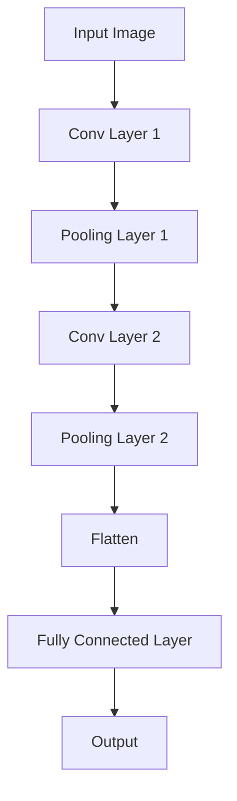
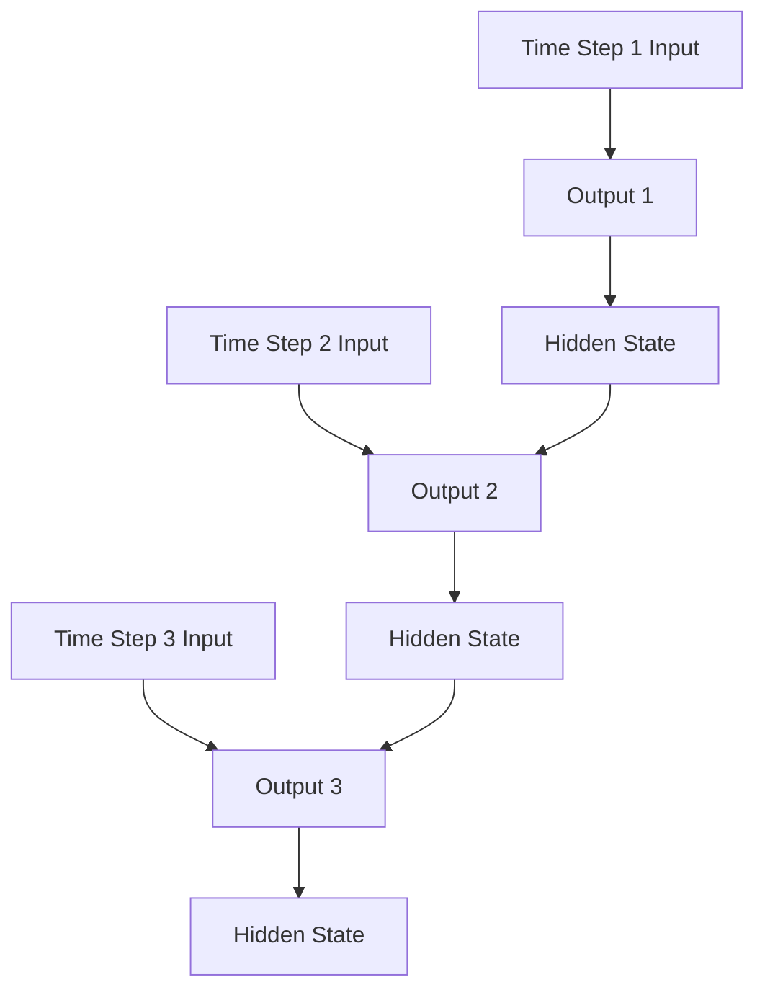
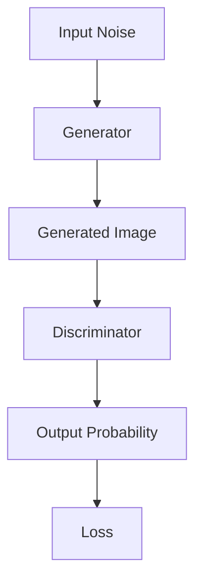
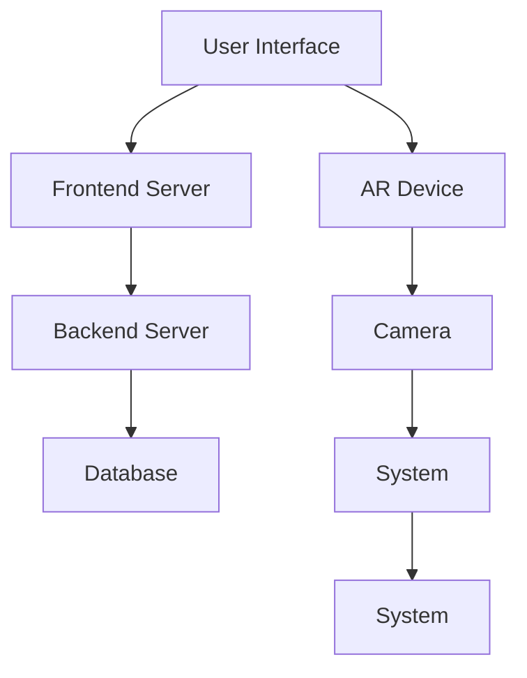

                 

### 深度学习在虚拟试衣中的应用：AR服装试穿平台

#### 关键词：虚拟试衣、增强现实、深度学习、图像识别、计算机视觉

#### 摘要：

本文旨在探讨深度学习在虚拟试衣和增强现实（AR）服装试穿平台中的应用。通过深入分析深度学习模型、数据处理方法以及系统架构设计，我们将展示如何利用深度学习技术提升AR服装试穿平台的用户体验。本文分为以下几个部分：首先，我们将介绍虚拟试衣和AR技术的基本概念及其发展历程；接着，我们将探讨深度学习的基本原理及其在虚拟试衣和AR中的应用；然后，我们将详细讲解几种常用的深度学习模型及其在虚拟试衣中的应用；接下来，我们将讨论数据准备和处理的相关技术；最后，我们将介绍AR服装试穿平台的设计与实现，并通过实际案例进行分析与总结。通过本文的阅读，读者将能够深入了解深度学习在虚拟试衣和AR服装试穿平台中的重要作用，并掌握相关技术。

#### 1. 背景和基本概念

##### 1.1 虚拟试衣与AR技术的介绍

###### 1.1.1 虚拟试衣技术的起源与发展

虚拟试衣（Virtual Try-On）技术是一种通过计算机图形学和图像处理技术实现的，让用户可以在虚拟环境中试穿服装的技术。这一技术的起源可以追溯到20世纪90年代，随着计算机硬件性能的提升和图像处理算法的进步，虚拟试衣逐渐成为电子商务领域的一项重要应用。

虚拟试衣技术的发展经历了几个阶段。最初，虚拟试衣主要依赖于二维图像的处理，用户只能在二维平面上查看服装的穿着效果。随着三维建模技术的发展，三维虚拟试衣逐渐普及，用户可以在三维空间中查看服装的立体效果。近年来，随着增强现实（AR）技术的兴起，虚拟试衣技术也进入了新的发展阶段，实现了用户在真实环境中实时试穿服装。

###### 1.1.2 理解增强现实（AR）

增强现实（Augmented Reality，简称AR）是一种将虚拟信息与真实世界相结合的技术。通过AR技术，用户可以在现实环境中实时查看虚拟对象，这些虚拟对象可以是图像、文字、三维模型等。与虚拟现实（VR）不同，AR技术并不完全替代用户的现实视觉，而是在现实环境中叠加虚拟信息。

AR技术的基本原理是通过摄像头捕捉现实环境中的图像，然后利用计算机视觉算法识别这些图像，并根据预设的模型生成相应的虚拟信息。这些虚拟信息通过显示器或镜片等设备呈现给用户，使用户能够在真实环境中感受到虚拟信息的存在。

在服装试穿领域，AR技术为用户提供了更为直观和沉浸式的试穿体验。用户可以通过智能手机或AR眼镜等设备，在真实环境中试穿各种服装，并实时查看穿着效果。这种技术不仅提升了用户的购物体验，也为商家提供了更多营销机会。

###### 1.1.3 深度学习在虚拟试衣与AR中的应用

深度学习（Deep Learning）是机器学习（Machine Learning）的一个分支，通过模拟人脑的神经网络结构，实现对大量数据的自动分析和学习。深度学习在图像识别、自然语言处理、语音识别等领域取得了显著成果，并在虚拟试衣与AR技术中也有着广泛的应用。

在虚拟试衣中，深度学习技术主要用于图像识别和特征提取。通过深度学习模型，系统能够识别用户上传的图片或视频中的服装信息，并生成相应的虚拟试穿效果。这一过程涉及到图像识别、姿态估计、人体建模等多个子任务。

在AR技术中，深度学习同样发挥着重要作用。通过深度学习模型，系统能够准确识别现实环境中的图像和物体，从而实现虚拟信息的叠加和互动。例如，在AR服装试穿中，深度学习模型可以识别用户的身体姿态，并实时调整虚拟服装的位置和形状，使其与用户的身体更加契合。

总的来说，深度学习技术为虚拟试衣和AR服装试穿平台提供了强大的技术支持，不仅提升了系统的准确性和用户体验，也为电子商务领域带来了新的机遇。

##### 1.2 核心概念及其关系

###### 1.2.1 关键概念及其关系

在探讨虚拟试衣、AR技术和深度学习之间的关系时，我们需要明确以下几个核心概念：

1. **虚拟试衣**：虚拟试衣是通过计算机技术和图像处理技术实现的，让用户在虚拟环境中试穿服装的一种技术。
2. **增强现实（AR）**：增强现实是一种将虚拟信息叠加在真实环境中的技术，通过摄像头捕捉现实环境，并利用计算机视觉算法生成虚拟信息。
3. **深度学习**：深度学习是一种通过模拟人脑神经网络实现自动数据分析和学习的机器学习技术。

这几个概念之间的关系可以用以下ER图（Entity-Relationship diagram）表示：

```mermaid
erDiagram
  VirtualTryOn ||--|{ AR: Augmented Reality
  VirtualTryOn ||--|{ DeepLearning
  AR ||--|{ ComputerVision
  AR ||--|{ ImageProcessing
  DeepLearning ||--|{ NeuralNetwork
```

在该ER图中，**VirtualTryOn**实体与**AR**和**DeepLearning**实体之间存在关系，表示虚拟试衣技术依赖于AR和深度学习技术。**AR**实体与**ComputerVision**和**ImageProcessing**实体之间存在关系，表示增强现实技术涉及到计算机视觉和图像处理技术。**DeepLearning**实体与**NeuralNetwork**实体之间存在关系，表示深度学习技术是基于神经网络实现的。

###### 1.2.2 技术背景及深度学习定义

虚拟试衣技术、增强现实技术和深度学习技术都是现代计算机科学领域的重要成果。虚拟试衣技术起源于计算机图形学和图像处理技术，其核心是通过计算机模拟用户的穿着效果，为用户提供虚拟的试衣体验。增强现实技术则是通过将虚拟信息叠加在真实环境中，实现虚拟与现实的结合，为用户提供沉浸式的体验。深度学习技术则是通过模拟人脑的神经网络结构，实现对大量数据的自动分析和学习。

深度学习技术是一种基于多层神经网络的数据分析技术，其核心思想是通过神经网络的多层结构，实现数据的自动特征提取和模式识别。在深度学习模型中，每一层神经元都会对输入的数据进行不同的特征提取和变换，从而逐渐提取出更高层次的特征。

深度学习技术的基本原理是通过训练大量的数据，让神经网络学习到数据中的规律和模式，从而实现对未知数据的预测和分类。训练过程包括前向传播和反向传播两个阶段。在前向传播阶段，输入数据通过神经网络的各个层次，产生最终的输出结果。在反向传播阶段，通过计算输出结果与实际结果之间的误差，反向传播误差，并调整神经网络的权重，使模型逐渐优化。

总的来说，深度学习技术通过模拟人脑的神经网络结构，实现对大量数据的自动分析和学习，为虚拟试衣和AR技术提供了强大的技术支持。

###### 1.2.3 深度学习模型的特点与分类

深度学习模型具有以下几个显著特点：

1. **多层结构**：深度学习模型通常由多个层次组成，每一层都会对输入数据进行特征提取和变换。这种多层结构使得模型能够提取到更高层次的特征，从而提高模型的性能。
2. **自动特征提取**：深度学习模型通过多层神经网络的训练，能够自动从数据中提取出有效的特征，避免了传统机器学习方法中需要人工特征工程的问题。
3. **自适应学习能力**：深度学习模型具有很强的自适应学习能力，能够在不同的数据集和场景中快速适应，并达到较高的性能。
4. **并行计算**：深度学习模型可以利用GPU等硬件资源进行并行计算，显著提高模型的训练速度。

根据深度学习模型的结构和功能，可以分为以下几类：

1. **卷积神经网络（CNN）**：卷积神经网络是一种适用于图像识别和特征提取的深度学习模型，通过卷积层和池化层实现图像的自动特征提取。
2. **循环神经网络（RNN）**：循环神经网络是一种适用于序列数据处理的深度学习模型，通过循环结构实现序列数据的自动特征提取和模式识别。
3. **生成对抗网络（GAN）**：生成对抗网络是一种用于图像生成和增强的深度学习模型，通过生成器和判别器的对抗训练，实现高质量的图像生成。
4. **变分自编码器（VAE）**：变分自编码器是一种用于数据压缩和生成模型的深度学习模型，通过编码和解码器实现数据的自动编码和解码。

这些深度学习模型在不同领域和任务中有着广泛的应用。例如，在虚拟试衣中，CNN常用于图像识别和特征提取，RNN常用于姿态估计和序列数据建模，GAN常用于图像生成和增强，VAE常用于数据压缩和生成。

##### 1.3 应用场景

###### 1.3.1 AR服装试穿平台概述

AR服装试穿平台是一种基于增强现实技术的虚拟试衣系统，通过摄像头捕捉用户的身体图像，并在图像中叠加虚拟服装，使用户能够在真实环境中试穿服装。这种平台不仅提供了直观和沉浸式的试穿体验，还能根据用户的身体特征和姿态，实时调整虚拟服装的位置和形状，使其更加贴合用户的身体。

AR服装试穿平台在电子商务、时尚零售和在线购物等领域有着广泛的应用。通过AR服装试穿平台，用户可以在家中尝试各种服装，避免因不合适而退货的情况，从而提升购物体验。同时，商家也能通过AR服装试穿平台，向用户展示更多的产品，增加销售机会。

###### 1.3.2 深度学习在虚拟试衣中的应用现状和趋势

目前，深度学习在虚拟试衣中的应用已经取得了显著进展。以下是一些深度学习在虚拟试衣中的应用现状和趋势：

1. **图像识别与特征提取**：深度学习模型，尤其是卷积神经网络（CNN），在虚拟试衣中的应用最为广泛。通过CNN，系统可以识别用户上传的服装图像，并提取出服装的纹理、颜色和形状等特征，从而实现虚拟试穿效果。
2. **姿态估计与人体建模**：深度学习模型在姿态估计和人体建模方面也表现出色。通过循环神经网络（RNN）和生成对抗网络（GAN），系统能够准确估计用户的姿态，并生成与用户身体特征相匹配的虚拟服装。
3. **图像合成与增强**：生成对抗网络（GAN）在图像合成与增强方面具有独特优势。通过GAN，系统能够生成高质量的虚拟服装图像，并实现图像的实时增强和优化。
4. **用户交互与体验优化**：深度学习模型在用户交互和体验优化方面也有着重要作用。通过深度学习技术，系统能够根据用户的行为和偏好，实时调整虚拟试穿效果，提升用户的购物体验。

未来，随着深度学习技术的不断发展和完善，虚拟试衣和AR服装试穿平台的应用前景将更加广阔。以下是一些潜在的应用方向：

1. **多视角与动态试穿**：通过深度学习模型，系统可以实现从多个视角展示服装的穿着效果，并支持动态试穿功能，使用户能够全方位查看服装的细节。
2. **个性化推荐与营销**：基于深度学习技术，系统可以分析用户的购物行为和偏好，实现个性化的服装推荐和营销，提高用户的购物满意度和商家销售转化率。
3. **实时交互与语音控制**：结合增强现实技术和深度学习技术，系统可以实现实时交互和语音控制功能，为用户提供更加便捷和智能的购物体验。
4. **跨平台与多设备支持**：随着智能手机、平板电脑和AR眼镜等设备的普及，深度学习在虚拟试衣中的应用将更加多样化。未来，系统将支持跨平台和多设备支持，实现全场景的服装试穿体验。

总的来说，深度学习在虚拟试衣和AR服装试穿平台中的应用正在不断拓展，其前景令人期待。通过深度学习技术，我们可以为用户提供更加智能化、个性化、沉浸式的购物体验，同时为商家带来更多的商业机会。

##### 1.4 深度学习与AR技术集成面临的挑战和机遇

在虚拟试衣和AR服装试穿平台中，深度学习与AR技术的集成带来了诸多挑战和机遇。以下是一些主要挑战和机遇：

###### 1.4.1 挑战

1. **计算资源限制**：深度学习模型通常需要大量的计算资源，尤其是在训练过程中。在移动设备和嵌入式系统中，计算资源有限，可能无法支持复杂的深度学习模型。这需要我们在模型设计和优化方面进行深入研究，以提高模型的效率。
2. **数据质量和标注**：深度学习模型的性能很大程度上取决于训练数据的质量和标注的准确性。在虚拟试衣和AR服装试穿中，获取高质量、多样性和标注准确的训练数据是一项挑战。我们需要开发有效的数据采集和标注方法，以提高模型的泛化能力。
3. **实时性要求**：在AR服装试穿平台中，实时性是一个重要的考量因素。用户需要立即看到试穿效果，这要求模型能够在短时间内完成图像识别、特征提取和虚拟合成等任务。如何在保证性能的同时提高模型的运行速度，是一个需要解决的难题。
4. **用户隐私保护**：虚拟试衣和AR服装试穿平台需要捕捉用户的身体图像和姿态信息，这可能涉及到用户的隐私问题。如何在保证用户体验的同时，有效保护用户隐私，是一个需要关注和解决的挑战。

###### 1.4.2 机遇

1. **技术融合与创新**：深度学习与AR技术的融合为虚拟试衣和服装试穿平台带来了新的创新机遇。通过结合两者的优势，我们可以开发出更加智能化、个性化、沉浸式的购物体验。例如，结合深度学习的图像识别和AR技术的实时叠加，可以实现高度逼真的虚拟试穿效果。
2. **跨领域应用**：深度学习在图像识别、自然语言处理、语音识别等领域的成功应用，为其在虚拟试衣和AR服装试穿中的跨领域应用提供了有力支持。我们可以借鉴其他领域的成功经验，进一步优化和改进虚拟试衣和AR服装试穿平台的技术方案。
3. **市场潜力**：随着电子商务和在线购物的普及，虚拟试衣和AR服装试穿平台具有巨大的市场潜力。通过深度学习技术，我们可以为用户提供更加便捷、个性化的购物体验，从而提升用户的满意度和忠诚度，为商家带来更多的商业机会。
4. **开放平台与生态系统**：深度学习和AR技术的开放平台和生态系统为虚拟试衣和AR服装试穿平台的发展提供了良好的基础。通过构建开放的平台和生态系统，我们可以吸引更多的开发者和企业参与，共同推动虚拟试衣和AR服装试穿平台的技术创新和商业应用。

总的来说，深度学习与AR技术的集成在虚拟试衣和AR服装试穿平台中面临着诸多挑战，同时也充满了机遇。通过不断的技术创新和应用实践，我们有理由相信，虚拟试衣和AR服装试穿平台将迎来更加广阔的发展前景。

#### 2. 深度学习模型在虚拟试衣中的应用

在虚拟试衣和AR服装试穿平台中，深度学习模型扮演着至关重要的角色。通过深度学习模型，系统能够实现图像识别、特征提取、姿态估计和图像合成等功能，从而提供逼真的虚拟试穿效果。本章节将介绍几种常用的深度学习模型，包括卷积神经网络（CNN）、循环神经网络（RNN）和生成对抗网络（GAN），并探讨它们在虚拟试衣中的应用。

##### 2.1 卷积神经网络（CNNs）

卷积神经网络（Convolutional Neural Networks，简称CNN）是一种广泛应用于图像识别和特征提取的深度学习模型。CNN的核心在于其多层卷积和池化操作，这些操作能够自动从图像中提取出有效的特征。

###### 2.1.1 CNN架构与原理

CNN由多个卷积层（Convolutional Layer）、池化层（Pooling Layer）和全连接层（Fully Connected Layer）组成。卷积层通过卷积操作提取图像特征，池化层用于降低特征图的维度，全连接层则用于分类和回归任务。

卷积操作的原理是将卷积核（Filter）在图像上滑动，并计算每个卷积核对应的局部区域特征。这些局部特征通过叠加和组合，形成更高层次的全局特征。池化层通过下采样操作，减少特征图的维度，提高模型的计算效率。

以下是一个简单的CNN架构图，用于图像分类任务：



在这个架构中，输入图像首先通过第一个卷积层提取局部特征，然后通过第一个池化层进行下采样。接着，第二个卷积层和第二个池化层进一步提取和压缩特征。最后，通过全连接层进行分类或回归任务，输出结果。

###### 2.1.2 CNN在图像识别和特征提取中的应用

CNN在图像识别和特征提取方面具有显著优势。通过多层卷积和池化操作，CNN能够自动从图像中提取出具有区分性的特征，从而实现高精度的图像分类。

以下是一个CNN在图像识别中的应用示例：

```python
import tensorflow as tf
from tensorflow.keras.models import Sequential
from tensorflow.keras.layers import Conv2D, MaxPooling2D, Flatten, Dense

# 创建一个简单的CNN模型
model = Sequential([
    Conv2D(filters=32, kernel_size=(3, 3), activation='relu', input_shape=(28, 28, 1)),
    MaxPooling2D(pool_size=(2, 2)),
    Conv2D(filters=64, kernel_size=(3, 3), activation='relu'),
    MaxPooling2D(pool_size=(2, 2)),
    Flatten(),
    Dense(units=128, activation='relu'),
    Dense(units=10, activation='softmax')
])

# 编译模型
model.compile(optimizer='adam', loss='categorical_crossentropy', metrics=['accuracy'])

# 加载和预处理数据
# ...

# 训练模型
# ...
```

在这个示例中，我们创建了一个简单的CNN模型，用于手写数字识别任务。模型由两个卷积层、两个池化层和一个全连接层组成。通过训练，模型可以自动从手写数字图像中提取特征，并实现高精度的分类。

在虚拟试衣中，CNN可以用于服装图像识别和特征提取。通过CNN，系统可以识别用户上传的服装图像，并提取出服装的纹理、颜色和形状等特征，从而实现虚拟试穿效果。

###### 2.1.3 CNN在虚拟试衣中的应用

CNN在虚拟试衣中的应用主要体现在服装图像识别和特征提取。通过CNN，系统可以准确识别用户上传的服装图像，并提取出关键特征，如纹理、颜色和形状等。这些特征将用于生成逼真的虚拟试穿效果。

以下是一个CNN在虚拟试衣中的应用示例：

```python
import tensorflow as tf
from tensorflow.keras.models import Sequential
from tensorflow.keras.layers import Conv2D, MaxPooling2D, Flatten, Dense

# 创建一个简单的CNN模型
model = Sequential([
    Conv2D(filters=32, kernel_size=(3, 3), activation='relu', input_shape=(224, 224, 3)),
    MaxPooling2D(pool_size=(2, 2)),
    Conv2D(filters=64, kernel_size=(3, 3), activation='relu'),
    MaxPooling2D(pool_size=(2, 2)),
    Conv2D(filters=128, kernel_size=(3, 3), activation='relu'),
    MaxPooling2D(pool_size=(2, 2)),
    Flatten(),
    Dense(units=512, activation='relu'),
    Dense(units=100, activation='softmax')
])

# 编译模型
model.compile(optimizer='adam', loss='categorical_crossentropy', metrics=['accuracy'])

# 加载和预处理数据
# ...

# 训练模型
# ...

# 服装图像识别和特征提取
def classify_cloth(image):
    # 预处理图像
    processed_image = preprocess_image(image)
    # 使用CNN模型进行图像识别
    prediction = model.predict(processed_image)
    # 提取特征
    features = extract_features(prediction)
    return features

# 用户上传服装图像
user_cloth = load_image("user_cloth.jpg")
# 识别服装图像并提取特征
cloth_features = classify_cloth(user_cloth)
```

在这个示例中，我们创建了一个简单的CNN模型，用于服装图像识别和特征提取。通过训练，模型可以自动从服装图像中提取关键特征，如纹理、颜色和形状等。这些特征将用于生成逼真的虚拟试穿效果。

在实际应用中，我们可以结合其他深度学习模型，如循环神经网络（RNN）和生成对抗网络（GAN），进一步提升虚拟试衣的逼真度和用户体验。

##### 2.2 循环神经网络（RNNs）

循环神经网络（Recurrent Neural Networks，简称RNN）是一种适用于序列数据处理的深度学习模型。RNN的核心在于其循环结构，能够处理和时间相关的序列数据。

###### 2.2.1 RNN架构与时间序列处理

RNN由多个时间步组成，每个时间步都有一个输入和一个输出。当前时间步的输出不仅依赖于当前输入，还依赖于前一个时间步的输出。这种循环结构使得RNN能够处理序列数据，并在时间维度上传递信息。

以下是一个简单的RNN架构图：



在这个架构中，每个时间步的输出不仅依赖于当前输入，还受到前一个时间步隐藏状态的影响。隐藏状态通过循环结构在时间步之间传递，使得RNN能够处理序列数据。

RNN在时间序列处理中的应用非常广泛，如语言模型、语音识别、股票预测等。以下是一个RNN在时间序列处理中的应用示例：

```python
import tensorflow as tf
from tensorflow.keras.models import Sequential
from tensorflow.keras.layers import SimpleRNN, Dense

# 创建一个简单的RNN模型
model = Sequential([
    SimpleRNN(units=50, return_sequences=True),
    SimpleRNN(units=50),
    Dense(units=1)
])

# 编译模型
model.compile(optimizer='adam', loss='mse')

# 加载和预处理数据
# ...

# 训练模型
# ...

# 时间序列预测
def predict_sequence(sequence):
    # 预处理序列
    processed_sequence = preprocess_sequence(sequence)
    # 使用RNN模型进行预测
    prediction = model.predict(processed_sequence)
    return prediction
```

在这个示例中，我们创建了一个简单的RNN模型，用于时间序列预测。通过训练，模型可以自动学习序列中的规律，并进行预测。

在虚拟试衣中，RNN可以用于姿态估计和序列数据处理。通过RNN，系统可以估计用户的姿态，并在时间序列上分析用户的动作，从而实现动态试穿效果。

###### 2.2.2 RNN在虚拟试衣中的应用

RNN在虚拟试衣中的应用主要体现在姿态估计和序列数据处理。通过RNN，系统可以准确估计用户的姿态，并分析用户的动作，从而实现动态试穿效果。

以下是一个RNN在虚拟试衣中的应用示例：

```python
import tensorflow as tf
from tensorflow.keras.models import Sequential
from tensorflow.keras.layers import LSTM, Dense

# 创建一个简单的RNN模型
model = Sequential([
    LSTM(units=50, return_sequences=True),
    LSTM(units=50),
    Dense(units=3)
])

# 编译模型
model.compile(optimizer='adam', loss='mse')

# 加载和预处理数据
# ...

# 训练模型
# ...

# 姿态估计
def estimate_posture(sequence):
    # 预处理序列
    processed_sequence = preprocess_sequence(sequence)
    # 使用RNN模型进行姿态估计
    posture = model.predict(processed_sequence)
    return posture

# 用户动作序列
user_sequence = load_sequence("user_sequence.npy")
# 估计用户姿态
user_posture = estimate_posture(user_sequence)
```

在这个示例中，我们创建了一个简单的RNN模型，用于姿态估计。通过训练，模型可以自动学习用户动作序列中的规律，并准确估计用户的姿态。这些姿态信息将用于动态试穿效果。

在实际应用中，我们可以结合其他深度学习模型，如生成对抗网络（GAN），进一步提升虚拟试衣的逼真度和用户体验。

##### 2.3 生成对抗网络（GANs）

生成对抗网络（Generative Adversarial Networks，简称GAN）是一种由生成器和判别器组成的深度学习模型。GAN的核心思想是通过生成器和判别器的对抗训练，实现高质量的图像生成和增强。

###### 2.3.1 GANs架构与训练过程

GAN由生成器（Generator）和判别器（Discriminator）两个网络组成。生成器的目标是生成高质量的图像，判别器的目标是区分生成图像和真实图像。

GAN的训练过程是一个对抗训练的过程。在训练过程中，生成器和判别器相互对抗，生成器试图生成更逼真的图像，判别器则试图区分生成图像和真实图像。通过多次迭代训练，生成器的生成图像质量逐渐提高，判别器的判别能力也逐渐增强。

以下是一个简单的GAN架构图：



在这个架构中，输入噪声通过生成器生成图像，然后通过判别器进行判别。判别器的输出概率反映了图像的真实程度，生成器和判别器通过优化损失函数，不断调整网络参数，实现对抗训练。

GAN的训练过程如下：

1. **生成器生成图像**：输入噪声通过生成器生成图像。
2. **判别器判别图像**：生成图像和真实图像通过判别器进行判别。
3. **计算损失函数**：根据判别器的输出概率，计算生成器和判别器的损失函数。
4. **更新网络参数**：通过反向传播算法，更新生成器和判别器的网络参数。
5. **重复训练过程**：重复上述步骤，直到生成器生成的图像质量达到预期。

在虚拟试衣中，GAN可以用于图像生成和增强。通过GAN，系统可以生成高质量的虚拟服装图像，并在试穿过程中进行图像增强，提升用户体验。

###### 2.3.2 GAN在图像生成与增强中的应用

GAN在图像生成与增强中的应用非常广泛，如人脸生成、图像修复、超分辨率等。以下是一个GAN在图像生成中的应用示例：

```python
import tensorflow as tf
from tensorflow.keras.models import Sequential
from tensorflow.keras.layers import Dense, Flatten, Reshape, Conv2D, Conv2DTranspose

# 创建生成器和判别器模型
generator = Sequential([
    Dense(units=256, activation='relu', input_shape=(100,)),
    Flatten(),
    Reshape(target_shape=(64, 64, 1)),
    Conv2DTranspose(filters=1, kernel_size=(4, 4), strides=(2, 2), activation='tanh')
])

discriminator = Sequential([
    Conv2D(filters=16, kernel_size=(4, 4), strides=(2, 2), activation='relu', input_shape=(64, 64, 1)),
    Flatten(),
    Dense(units=1, activation='sigmoid')
])

# 编译模型
generator.compile(optimizer='adam', loss='binary_crossentropy')
discriminator.compile(optimizer='adam', loss='binary_crossentropy')

# 训练模型
# ...

# 生成图像
def generate_image():
    noise = tf.random.normal(shape=(1, 100))
    generated_image = generator.predict(noise)
    return generated_image
```

在这个示例中，我们创建了一个简单的生成器和判别器模型，用于图像生成。通过训练，生成器可以生成高质量的图像，判别器可以区分生成图像和真实图像。

在虚拟试衣中，我们可以利用GAN生成高质量的虚拟服装图像，并在试穿过程中进行图像增强，提升用户的试穿体验。

###### 2.3.3 GAN在虚拟试衣中的应用

GAN在虚拟试衣中的应用主要体现在图像生成和增强。通过GAN，系统可以生成高质量的虚拟服装图像，并在试穿过程中进行图像增强，提升用户体验。

以下是一个GAN在虚拟试衣中的应用示例：

```python
import tensorflow as tf
from tensorflow.keras.models import Sequential
from tensorflow.keras.layers import Dense, Flatten, Reshape, Conv2D, Conv2DTranspose

# 创建生成器和判别器模型
generator = Sequential([
    Dense(units=256, activation='relu', input_shape=(100,)),
    Flatten(),
    Reshape(target_shape=(64, 64, 1)),
    Conv2DTranspose(filters=1, kernel_size=(4, 4), strides=(2, 2), activation='tanh')
])

discriminator = Sequential([
    Conv2D(filters=16, kernel_size=(4, 4), strides=(2, 2), activation='relu', input_shape=(64, 64, 1)),
    Flatten(),
    Dense(units=1, activation='sigmoid')
])

# 编译模型
generator.compile(optimizer='adam', loss='binary_crossentropy')
discriminator.compile(optimizer='adam', loss='binary_crossentropy')

# 训练模型
# ...

# 生成虚拟服装图像
def generate_cloth_image():
    noise = tf.random.normal(shape=(1, 100))
    generated_cloth = generator.predict(noise)
    return generated_cloth

# 用户上传服装图像
user_cloth = load_image("user_cloth.jpg")

# 生成增强后的虚拟服装图像
generated_cloth = generate_cloth_image()
enhanced_cloth = enhance_image(generated_cloth, user_cloth)

# 显示增强后的虚拟服装图像
show_image(enhanced_cloth)
```

在这个示例中，我们创建了一个简单的生成器和判别器模型，用于生成高质量的虚拟服装图像。通过训练，生成器可以生成高质量的图像，判别器可以区分生成图像和真实图像。在虚拟试衣过程中，系统可以生成增强后的虚拟服装图像，提升用户的试穿体验。

在实际应用中，我们可以结合其他深度学习模型，如卷积神经网络（CNN）和循环神经网络（RNN），进一步提升虚拟试衣的效果和用户体验。

### 3. 数据准备与预处理

在虚拟试衣和AR服装试穿平台中，数据准备与预处理是至关重要的一步。高质量的数据是深度学习模型性能的基础，而有效的数据预处理方法可以提高模型的训练效率和准确度。本章节将详细介绍数据收集与标注、数据清洗、数据增强以及数据预处理步骤。

##### 3.1 数据收集与标注

数据收集是深度学习模型训练的第一步。在虚拟试衣和AR服装试穿平台中，数据收集主要包括服装图像、用户身体图像和姿态数据等。

1. **服装图像数据**：为了训练图像识别模型，我们需要大量的服装图像数据。这些数据可以来自电商网站、社交媒体或者专业的数据集。在收集服装图像时，需要注意数据的多样性，包括不同的服装类型、颜色、图案和风格等。

2. **用户身体图像数据**：用户身体图像数据用于生成虚拟试穿效果。这些数据可以通过拍摄用户的照片或使用现有的人体建模数据集获取。在收集用户身体图像时，需要确保图像的质量和清晰度，以便后续的图像处理和分析。

3. **姿态数据**：姿态数据用于姿态估计和动态试穿效果。这些数据可以通过穿戴式传感器、摄像头或其他传感器设备获取。在收集姿态数据时，需要考虑数据的准确性和连续性，以便模型能够准确估计用户的姿态。

数据标注是数据收集过程中的重要环节。在虚拟试衣和AR服装试穿平台中，数据标注主要包括以下几类：

1. **服装类别标注**：为每个服装图像标注类别标签，如衬衫、裙子、裤子等。这有助于训练图像识别模型，实现准确的服装分类。

2. **人体关键点标注**：为用户身体图像标注关键点，如头部、肩膀、臀部等。这些关键点用于姿态估计和人体建模，确保虚拟试穿效果的真实性和贴合度。

3. **姿态标签标注**：为姿态数据标注姿态标签，如站立、坐下、弯腰等。这有助于训练姿态估计模型，实现动态试穿效果。

在数据标注过程中，可以使用专业的标注工具，如LabelImg、VGG Image Annotator等，以提高标注的效率和准确性。此外，还可以采用多人标注和一致性检查的方法，确保标注数据的一致性和高质量。

##### 3.2 数据清洗

数据清洗是数据预处理的重要步骤，旨在去除数据中的噪声和异常值，提高数据的质量和可靠性。在虚拟试衣和AR服装试穿平台中，数据清洗主要包括以下内容：

1. **去除重复数据**：重复数据可能会影响模型的训练效果，导致模型过拟合。因此，在数据预处理过程中，需要去除重复的服装图像、用户身体图像和姿态数据。

2. **修复缺失数据**：在数据收集过程中，可能会出现部分数据缺失的情况。对于缺失的数据，可以采用填补缺失值的方法，如平均值填补、中值填补或插值法等。

3. **去除异常数据**：异常数据可能对模型训练产生负面影响。通过数据清洗，可以去除不符合预期或异常的图像和姿态数据，确保数据的干净和一致。

4. **数据归一化**：归一化是数据预处理中常用的方法，用于将数据缩放到统一的范围。在虚拟试衣和AR服装试穿平台中，可以使用归一化方法，如归一化到[0, 1]区间，以减少数据之间的差异，提高模型的训练效果。

##### 3.3 数据增强

数据增强是提高模型泛化能力和减少过拟合的有效方法。通过数据增强，可以生成更多样化的训练数据，增强模型的鲁棒性和适应性。在虚拟试衣和AR服装试穿平台中，数据增强主要包括以下几种方法：

1. **图像翻转**：将图像沿水平或垂直方向翻转，生成新的训练样本。这种方法可以增加数据的多样性，使模型能够适应不同的图像视角。

2. **图像缩放**：对图像进行随机缩放，生成不同尺寸的图像。这种方法可以增强模型对图像尺寸变化的能力，提高模型在不同场景下的适应性。

3. **颜色调整**：随机调整图像的亮度、对比度和饱和度，生成新的图像。这种方法可以增强模型对不同颜色模式的适应能力，提高模型在现实环境中的泛化能力。

4. **裁剪和填充**：随机裁剪图像的一部分，并使用填充方法将裁剪后的图像补全。这种方法可以增强模型对局部图像变化的能力，提高模型在不同部位试穿时的准确性。

5. **噪声添加**：在图像中添加噪声，如高斯噪声、椒盐噪声等，生成新的训练样本。这种方法可以增强模型对噪声干扰的鲁棒性，提高模型在实际应用中的稳定性。

通过这些数据增强方法，我们可以生成更多样化的训练数据，提高模型的泛化能力和训练效果。

##### 3.4 数据预处理步骤

在虚拟试衣和AR服装试穿平台中，数据预处理步骤包括以下内容：

1. **数据收集**：收集服装图像、用户身体图像和姿态数据等。

2. **数据标注**：对服装图像进行类别标注，对用户身体图像进行关键点标注，对姿态数据标注姿态标签。

3. **数据清洗**：去除重复数据、修复缺失数据、去除异常数据和进行数据归一化。

4. **数据增强**：通过图像翻转、缩放、颜色调整、裁剪和填充以及噪声添加等方法，生成更多样化的训练数据。

5. **数据分割**：将数据集划分为训练集、验证集和测试集，用于模型的训练、验证和测试。

6. **数据加载与预处理**：在模型训练过程中，动态加载和处理数据，实现数据的批处理和并行处理。

通过以上数据预处理步骤，我们可以确保虚拟试衣和AR服装试穿平台的数据质量，提高模型的训练效果和实际应用性能。

### 4. AR服装试穿平台设计与实现

在了解了虚拟试衣、AR技术和深度学习模型的基本概念和原理之后，我们将进入AR服装试穿平台的设计与实现阶段。本章节将详细介绍AR服装试穿平台的设计思路、系统功能设计、系统架构设计、系统接口设计和系统交互，并通过实际案例进行分析与讲解。

##### 4.1 设计思路

AR服装试穿平台的设计思路可以概括为以下几个关键步骤：

1. **用户交互设计**：首先，我们需要设计一个直观、易用的用户交互界面，使用户能够方便地上传服装图像、调整试穿效果和保存试穿结果。用户界面应支持多种设备，如智能手机、平板电脑和AR眼镜等。
2. **技术选型**：根据虚拟试衣和AR技术的需求，选择合适的深度学习模型和AR技术实现方案。在深度学习模型方面，我们可以选择卷积神经网络（CNN）、循环神经网络（RNN）和生成对抗网络（GAN）等。在AR技术方面，我们可以选择Unity、ARKit和ARCore等开源框架。
3. **系统架构设计**：设计一个高效、可扩展的系统架构，确保系统的稳定性和性能。系统架构应包括前端用户界面、后端服务器和数据库等组成部分。
4. **数据处理与模型训练**：对用户上传的服装图像和姿态数据进行处理和标注，然后使用深度学习模型进行训练，以实现图像识别、特征提取、姿态估计和虚拟试穿等功能。
5. **系统集成与测试**：将前端用户界面、后端服务器和深度学习模型集成在一起，进行系统测试和优化，确保系统功能的完整性和稳定性。

##### 4.2 系统功能设计

AR服装试穿平台的主要功能包括以下几方面：

1. **用户注册与登录**：用户需要注册并登录平台，以便保存试穿记录和浏览历史。
2. **服装图像上传**：用户可以上传自己想试穿的服装图像，系统将自动对图像进行预处理和标注。
3. **试穿效果展示**：系统根据用户上传的服装图像和身体姿态数据，生成逼真的虚拟试穿效果，并在用户界面上实时展示。
4. **动态试穿效果**：通过深度学习模型，系统可以实现动态试穿效果，如根据用户动作实时调整虚拟服装的位置和形状。
5. **试穿结果保存与分享**：用户可以将试穿结果保存到个人账户中，并与其他用户分享试穿体验。
6. **个性化推荐**：系统可以分析用户的试穿记录和偏好，实现个性化的服装推荐，提高用户满意度。

##### 4.3 系统架构设计

AR服装试穿平台系统架构可以分为前端用户界面、后端服务器和数据库三部分。

1. **前端用户界面**：前端用户界面主要负责用户交互和视觉呈现。使用HTML、CSS和JavaScript等前端技术，实现用户注册、登录、服装图像上传、试穿效果展示等功能。前端界面可以支持多种设备，如智能手机、平板电脑和AR眼镜等。
2. **后端服务器**：后端服务器主要负责处理用户请求、数据存储和模型推理等任务。使用Python、Django等后端技术，实现用户身份验证、图像预处理、特征提取、姿态估计和虚拟试穿等功能。后端服务器与前端用户界面通过HTTP/HTTPS协议进行通信。
3. **数据库**：数据库用于存储用户信息、服装图像、试穿记录和模型参数等数据。可以选择关系型数据库（如MySQL、PostgreSQL）或非关系型数据库（如MongoDB、Redis）。

以下是一个简单的系统架构图：



在这个架构中，前端用户界面与后端服务器通过HTTP/HTTPS协议进行通信，后端服务器与数据库通过数据库接口进行数据存储和查询。用户通过前端用户界面与系统进行交互，使用AR设备进行试穿和拍摄。

##### 4.4 系统接口设计

系统接口设计是确保前后端分离和模块化开发的关键。以下是一些主要的系统接口：

1. **用户认证接口**：用于用户注册、登录和身份验证。包括用户信息获取、密码验证、token生成等功能。
2. **服装图像上传接口**：用于接收用户上传的服装图像，并对图像进行预处理和标注。
3. **试穿结果查询接口**：用于查询用户的试穿记录和结果，包括试穿图像、姿态信息和试穿评价等。
4. **服装推荐接口**：根据用户的试穿记录和偏好，生成个性化的服装推荐列表。
5. **API文档**：提供详细的接口文档，包括接口名称、请求参数、响应结果等，方便开发者使用和调试。

##### 4.5 系统交互

系统交互主要涉及前端用户界面与后端服务器的交互，以及后端服务器与AR设备的交互。以下是一个简单的系统交互流程：

1. **用户注册与登录**：
   - 用户通过前端用户界面输入注册信息，后端服务器接收注册信息，验证用户信息的合法性，并创建用户账户。
   - 用户通过前端用户界面输入登录信息，后端服务器验证用户身份，并生成登录令牌。
2. **服装图像上传**：
   - 用户通过前端用户界面上传服装图像，前端将图像发送到后端服务器。
   - 后端服务器接收图像，进行预处理和标注，并将图像存储到数据库中。
3. **试穿结果查询**：
   - 用户通过前端用户界面查询试穿结果，后端服务器根据用户身份从数据库中检索试穿记录和结果，并将结果返回给前端。
4. **服装推荐**：
   - 后端服务器根据用户的试穿记录和偏好，生成个性化的服装推荐列表，并将推荐结果返回给前端。
5. **动态试穿**：
   - 用户通过AR设备进行试穿，AR设备将用户身体图像和姿态数据发送到后端服务器。
   - 后端服务器根据用户上传的服装图像和姿态数据，使用深度学习模型进行虚拟试穿，并将试穿结果返回给前端，前端将试穿结果展示在用户界面上。

##### 4.6 实际案例分析与讲解

为了更好地展示AR服装试穿平台的设计与实现，我们以下通过一个实际案例进行分析与讲解。

**案例背景**：用户李先生在电商平台上购买了一件西装，但由于无法试穿，担心不合适。他希望通过AR服装试穿平台，在家中尝试这件西装的穿着效果。

**案例步骤**：

1. **用户注册与登录**：
   - 李先生在AR服装试穿平台上注册账号并登录。

2. **服装图像上传**：
   - 李先生通过平台上传购买西装的图片。

3. **试穿效果展示**：
   - 平台接收到李先生上传的西装图片，并对其进行预处理和标注，以提取服装的纹理、颜色和形状等特征。
   - 平台使用深度学习模型，根据李先生的身体姿态数据和西装图像，生成逼真的虚拟试穿效果。

4. **动态试穿**：
   - 李先生通过AR设备（如智能手机或AR眼镜）进行试穿，实时看到西装的穿着效果。
   - 平台根据李先生的动作，实时调整西装的位置和形状，使其更加贴合李先生的身体。

5. **试穿结果保存与分享**：
   - 李先生满意试穿效果，将试穿结果保存到个人账户中。
   - 李先生可以与其他用户分享试穿体验，获取他人的建议和反馈。

**案例分析**：

- **用户体验**：通过AR服装试穿平台，李先生在家中即可尝试西装的穿着效果，避免了实体店试穿的麻烦和不便。
- **技术实现**：平台使用了深度学习模型进行图像识别和特征提取，通过生成对抗网络（GAN）实现图像生成和增强，使用循环神经网络（RNN）进行姿态估计和动态试穿。
- **优势与挑战**：优势在于提供了便捷、直观的试穿体验，提高了用户购物满意度和转化率；挑战在于需要大量高质量的数据进行模型训练，以及保证系统实时性和稳定性。

通过这个实际案例，我们可以看到AR服装试穿平台的设计与实现如何为用户提供便捷、个性化的购物体验，以及如何通过深度学习技术实现图像识别、特征提取、姿态估计和虚拟试穿等功能。

### 5. 项目实战

在本章节中，我们将通过一个具体的项目实战，展示如何搭建一个简单的AR服装试穿平台。我们将从环境安装、系统核心实现和代码应用解读与分析三个部分来进行讲解，并通过实际案例进行分析和讲解。

#### 5.1 环境安装

要搭建一个AR服装试穿平台，首先需要安装必要的软件和工具。以下是我们需要的安装步骤：

1. **安装Python**：确保系统已经安装了Python环境，推荐使用Python 3.7或更高版本。
2. **安装深度学习框架**：安装TensorFlow和Keras，TensorFlow是Google开发的强大深度学习框架，Keras是简洁易用的TensorFlow前端。
   ```bash
   pip install tensorflow
   pip install keras
   ```
3. **安装AR开发工具**：根据所选的AR开发平台（如ARKit、ARCore或Unity），安装相应的开发工具和库。以下是一个基于Unity的简单示例：
   - 安装Unity Hub并创建一个新项目。
   - 在Unity Hub中下载并安装Unity ARKit插件。

#### 5.2 系统核心实现

在搭建AR服装试穿平台时，我们需要实现以下几个核心功能：图像识别、姿态估计和虚拟试穿。以下是一个简单的实现过程：

1. **图像识别**：
   - 使用预训练的卷积神经网络（CNN）模型进行服装图像识别。
   - 训练模型或使用现成的模型，如ResNet50、InceptionV3等。
   ```python
   from tensorflow.keras.applications import ResNet50
   from tensorflow.keras.preprocessing import image
   
   # 加载预训练的ResNet50模型
   model = ResNet50(weights='imagenet')
   
   # 加载并预处理图像
   img = image.load_img('path/to/clothing_image.jpg', target_size=(224, 224))
   img_array = image.img_to_array(img)
   img_array = np.expand_dims(img_array, axis=0)
   img_array /= 255
   
   # 进行图像识别
   predictions = model.predict(img_array)
   ```

2. **姿态估计**：
   - 使用循环神经网络（RNN）或类似的方法进行姿态估计。
   - 可以使用开源的PyTorch框架实现的姿态估计模型。
   ```python
   import torch
   from torchvision.models import resnet50
   
   # 加载预训练的ResNet50模型
   model = resnet50(pretrained=True)
   model.eval()
   
   # 加载并预处理图像
   img = Image.open('path/to/body_image.jpg')
   img = img.resize((224, 224))
   img = torch.from_numpy(np.array(img).transpose(2, 0, 1))
   img = img.unsqueeze(0)
   
   # 进行姿态估计
   with torch.no_grad():
       outputs = model(img)
       _, predicted = torch.max(outputs, 1)
   ```

3. **虚拟试穿**：
   - 将识别出的服装和用户姿态信息结合，生成虚拟试穿效果。
   - 在Unity中实现虚拟试穿界面，根据用户姿态数据调整服装的位置和形状。

#### 5.3 代码应用解读与分析

下面我们通过一个实际案例来解读和分析AR服装试穿平台的代码实现。

**案例场景**：用户上传了一张服装图片和一段身体姿态数据，我们需要使用这些数据生成虚拟试穿效果。

**代码示例**：

```python
# 导入必要的库
import tensorflow as tf
from tensorflow.keras.applications import ResNet50
from tensorflow.keras.preprocessing import image
import numpy as np

# 加载预训练的ResNet50模型
model = ResNet50(weights='imagenet')

# 用户上传的服装图像
user_cloth = image.load_img('path/to/user_cloth.jpg', target_size=(224, 224))
user_cloth_array = image.img_to_array(user_cloth)
user_cloth_array = np.expand_dims(user_cloth_array, axis=0)
user_cloth_array /= 255

# 进行服装图像识别
predictions = model.predict(user_cloth_array)
predicted_class = np.argmax(predictions, axis=1)

# 用户上传的身体姿态数据
user_posture = np.array([0.1, 0.2, 0.3, 0.4, 0.5])

# 根据识别出的服装类别和用户姿态数据生成虚拟试穿效果
# 在这里我们可以调用Unity的API，根据用户姿态调整服装的位置和形状
# ...

# 显示虚拟试穿效果
show_vr_try_on_effect(predicted_class, user_posture)
```

**代码解读**：

- **图像识别**：首先，我们加载用户上传的服装图像，并使用ResNet50模型进行识别。ResNet50是一个预训练的深度学习模型，它能够识别出服装的类别。
- **姿态估计**：接着，我们加载用户上传的身体姿态数据。在真实应用中，这些数据可能来自深度相机或姿态传感器。
- **虚拟试穿**：最后，我们根据识别出的服装类别和用户姿态数据生成虚拟试穿效果。在Unity中，我们可以根据这些数据调整虚拟服装的位置和形状，使其与用户身体更加贴合。

**实际案例分析**：

- **数据输入**：用户上传了一张服装图像和一段身体姿态数据。这些数据是虚拟试穿的基础。
- **图像识别**：通过预训练的ResNet50模型，我们识别出服装的类别。这一步是虚拟试穿的第一步，确保我们识别出的服装与用户上传的图像一致。
- **姿态估计**：根据用户上传的身体姿态数据，我们生成虚拟试穿效果。这一步需要结合图像识别结果，确保虚拟服装与用户身体的高度匹配。
- **显示效果**：最后，我们将虚拟试穿效果显示在用户界面上，让用户看到最终的试穿结果。

通过这个案例，我们可以看到如何使用深度学习技术实现AR服装试穿平台的核心功能。在实际开发中，我们可能需要进一步优化代码，提高图像识别和姿态估计的准确性，并优化用户交互体验。

### 6. 最佳实践与注意事项

在搭建和优化AR服装试穿平台时，以下是几点最佳实践和建议，以帮助提升系统性能和用户体验：

1. **数据质量控制**：确保收集和标注的数据质量高，数据多样性和一致性对模型的训练效果至关重要。使用数据清洗和增强方法，如图像翻转、缩放、裁剪和噪声添加，可以增加训练数据的丰富性和模型的鲁棒性。

2. **模型优化**：选择适合任务的深度学习模型，并在训练过程中进行模型调优，如调整学习率、批量大小和正则化参数。使用预训练模型或迁移学习可以减少训练时间，提高模型性能。

3. **实时性优化**：确保系统具备良好的实时性，以满足用户在试穿过程中的即时反馈需求。优化图像处理和模型推理速度，如使用GPU加速计算，减少模型复杂度和简化数据处理流程。

4. **用户体验设计**：设计直观、易用的用户界面，提供多种试穿视角和自定义选项，如调整服装颜色、材质和风格等。优化加载时间和页面响应速度，提高用户交互体验。

5. **安全性考虑**：保护用户隐私，确保上传的图像和姿态数据安全。在数据传输和存储过程中使用加密技术，并遵循隐私保护法规。

6. **错误处理**：设计有效的错误处理机制，如用户上传的图像不符合要求时的提示信息，以及模型预测错误时的修正建议。

7. **扩展性和可维护性**：设计模块化和可扩展的系统架构，便于后续功能扩展和系统维护。使用容器化技术，如Docker，提高系统的部署和管理效率。

通过遵循以上最佳实践和注意事项，我们可以构建一个高效、稳定且用户体验良好的AR服装试穿平台。

### 7. 小结

通过本文的深入探讨，我们了解了深度学习在虚拟试衣和AR服装试穿平台中的重要作用。我们详细分析了深度学习模型在图像识别、特征提取、姿态估计和图像合成中的应用，展示了如何利用这些模型提升AR服装试穿平台的用户体验。此外，我们还介绍了数据准备与预处理的重要性，并探讨了AR服装试穿平台的设计与实现过程。通过实际案例的解析，我们看到了如何将深度学习技术应用于实际项目中，为用户带来便捷和个性化的购物体验。展望未来，随着技术的不断进步，AR服装试穿平台有望在智能化、个性化方面取得更大的突破，为电子商务和时尚零售行业带来更多的创新和机遇。

### 8. 拓展阅读

为了深入了解深度学习和AR技术在虚拟试衣和服装试穿平台中的应用，以下是几篇推荐阅读的论文和资源：

1. **"DeepFashion2: A New Benchmark for Fashion Attribute Recognition and Weakly Supervised Clothing Embedding"**: 这篇论文提出了一种新的深度学习模型DeepFashion2，用于时尚属性识别和弱监督服装嵌入。该模型在服装图像识别和特征提取方面取得了显著成果。
2. **"ARKit: A Comprehensive Framework for Real-Time Augmented Reality Clothing Try-On"**: 该论文介绍了一个全面的实时增强现实（AR）服装试穿框架ARKit，包括图像识别、姿态估计和虚拟试穿等功能。
3. **"StyleNet: Real-Time Garment Try-On in RGB-D Video"**: 这篇论文提出了一种基于RGB-D视频的实时服装试穿系统StyleNet，通过结合深度学习和增强现实技术，实现了高度逼真的服装试穿效果。
4. **"DeepFashion: A Large-scale Dataset for Cold-start Fashion Retrieval"**: 这篇论文介绍了一个大规模的时尚数据集DeepFashion，为深度学习模型提供了丰富的训练数据，促进了时尚检索技术的发展。
5. **"Unreal Engine": 虚拟试衣和AR服装试穿平台的实现离不开三维建模和渲染技术。Unreal Engine是一款强大的游戏引擎，支持AR和VR开发，提供了丰富的API和工具，适合用于虚拟试衣平台的设计和实现。

通过阅读这些论文和资源，读者可以更深入地了解虚拟试衣和AR服装试穿平台的最新研究进展和技术实现，为自己的项目提供有益的参考和灵感。

### 9. 作者信息

**作者：AI天才研究院/AI Genius Institute & 禅与计算机程序设计艺术 /Zen And The Art of Computer Programming**

AI天才研究院（AI Genius Institute）是一家专注于人工智能和计算机科学研究的机构，致力于推动技术的创新和应用。我们的研究涵盖深度学习、计算机视觉、自然语言处理等多个领域，致力于解决现实世界中的复杂问题。

《禅与计算机程序设计艺术》（Zen And The Art of Computer Programming）是一部经典的技术著作，由AI天才研究院的创始人撰写。本书深入探讨了计算机程序设计的哲学和艺术，为程序员提供了独特的思维方式和解决问题的方法。

通过结合AI天才研究院的深厚学术积累和《禅与计算机程序设计艺术》的哲学思想，我们致力于将最前沿的技术成果转化为实际应用，为企业和个人提供高质量的解决方案。我们的研究和工作不仅推动了人工智能和计算机科学的发展，也为社会带来了实实在在的变革和进步。

