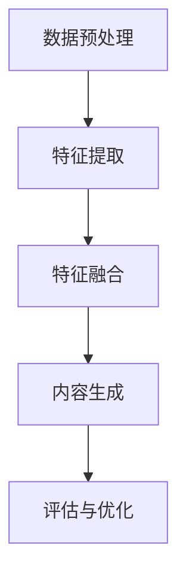
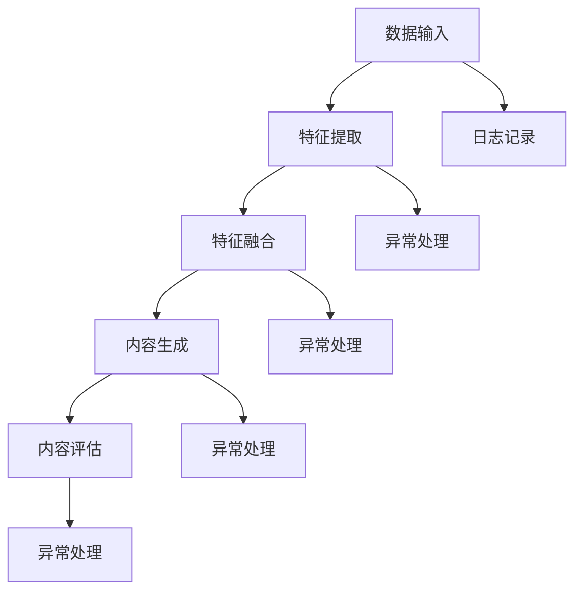

                 

### 关键词与摘要

关键词：深度学习、跨模态内容生成、算法原理、系统架构、项目实战、最佳实践

摘要：本文深入探讨了深度学习在跨模态内容生成中的应用。首先，我们介绍了跨模态内容生成的背景和问题，阐述了深度学习在解决这些问题中的作用。接着，详细解析了核心概念和算法原理，并通过mermaid流程图和Python代码展示具体实现。随后，介绍了系统的设计与实现，包括功能设计、架构设计和接口设计，以及系统交互过程。通过实际项目案例的剖析，我们展示了如何将深度学习应用于跨模态内容生成的实战中。最后，总结了最佳实践和注意事项，并提供了拓展阅读方向。本文旨在为读者提供一个全面、系统的跨模态内容生成解决方案。

---

## 第1章 引言与背景

### 1.1 问题背景

在信息爆炸的时代，如何有效地处理和生成多样化的内容成为了研究者和开发者关注的焦点。跨模态内容生成（Cross-Modal Content Generation）作为一种新兴技术，旨在将不同模态（如文本、图像、音频等）的信息进行整合和生成，使得内容更加丰富和生动。这一技术不仅能够提升信息传播的效率，还能在娱乐、教育、医疗等多个领域发挥重要作用。

深度学习（Deep Learning）的发展为跨模态内容生成提供了强大的理论基础和技术支持。通过神经网络模型，深度学习能够自动地从大量数据中学习到复杂的特征，从而实现不同模态之间的转换和生成。这使得跨模态内容生成从理论走向实践，成为人工智能领域的一个重要研究方向。

### 1.2 问题描述

跨模态内容生成的核心问题是如何将不同模态的信息进行有效整合，并生成高质量的内容。具体来说，主要面临以下几个挑战：

1. **模态之间的差异**：不同模态的数据具有不同的结构和特征，这使得直接进行信息整合变得复杂。
2. **数据稀缺**：相比于单一模态的数据，跨模态数据更为稀缺，这限制了模型的训练和优化。
3. **生成质量**：如何生成既符合模态特征又具有一致性的内容是当前研究的难点。
4. **实时性**：跨模态内容生成往往需要在实时环境中进行，这对系统的响应速度和处理能力提出了高要求。

### 1.3 问题解决

深度学习为解决上述问题提供了以下几种核心技术：

1. **多模态特征提取**：通过深度学习模型，可以从不同模态的数据中提取出丰富的特征，为后续的生成提供基础。
2. **生成对抗网络（GAN）**：GAN能够在无监督环境下生成高质量的内容，适用于跨模态生成任务。
3. **编码器-解码器架构**：这种架构能够有效地将输入模态的信息编码为固定长度的向量，然后解码生成输出模态的内容。
4. **迁移学习和数据增强**：通过迁移学习和数据增强技术，可以有效地利用有限的跨模态数据，提高模型的泛化能力。

### 1.4 边界与外延

跨模态内容生成具有广泛的应用前景，如：

- **多媒体内容创作**：自动生成视频、音频和文本的融合内容，应用于娱乐、新闻等领域。
- **教育辅助**：通过生成多样化的学习材料，提升教育效果。
- **医疗诊断**：结合图像、文本和声音等多模态数据，辅助疾病诊断和治疗。
- **智能交互**：为智能音箱、聊天机器人等提供更加丰富的交互内容。

同时，随着技术的不断进步，跨模态内容生成在未来还将在更多领域得到应用，如虚拟现实、增强现实等。这将为人类生活带来更多便利和创新。

---

## 第2章 核心概念与联系

### 2.1 跨模态内容生成的基本概念

#### 模态的概念

模态（Modality）是指数据或信息的某种表现形式，常见的模态包括文本（Text）、图像（Image）、音频（Audio）和视频（Video）等。每种模态都有其独特的结构和特征，如图像主要关注视觉信息，文本则侧重语义信息。

#### 跨模态内容生成的概念框架

跨模态内容生成旨在将不同模态的信息进行整合，并生成新的内容。其基本流程包括：

1. **特征提取**：从输入的各个模态中提取出特征。
2. **特征融合**：将不同模态的特征进行整合。
3. **内容生成**：基于融合后的特征生成新的内容。

### 2.2 关键技术介绍

#### 深度学习基础

深度学习是一种基于神经网络的机器学习技术，通过多层神经网络对数据进行自动特征提取和建模。在跨模态内容生成中，深度学习模型如卷积神经网络（CNN）和递归神经网络（RNN）被广泛应用于特征提取和内容生成。

#### 跨模态特征提取方法

1. **多模态嵌入**：将不同模态的数据转换为固定长度的向量，以便进行后续处理。
2. **联合训练**：通过联合训练模型，同时学习不同模态的特征表示。
3. **自编码器**：利用自编码器模型对模态数据进行编码和解码，提取特征。

#### 跨模态生成模型

1. **生成对抗网络（GAN）**：通过对抗性训练，生成高质量的内容。
2. **编码器-解码器架构**：将输入模态的信息编码为固定长度的向量，然后解码生成输出模态的内容。
3. **循环神经网络（RNN）和长短期记忆网络（LSTM）**：用于处理序列数据，生成连续的模态内容。

### 2.3 概念属性特征对比表格

| 特征类型         | 描述                                                         | 优势                             | 劣势                             |
|----------------|--------------------------------------------------------------|--------------------------------|--------------------------------|
| 模态嵌入        | 将不同模态的数据转换为固定长度的向量。                        | 简单实现，适用于大规模数据处理。 | 特征表示可能丢失模态的特定信息。 |
| 联合训练        | 同时学习不同模态的特征表示。                                 | 能够利用不同模态的互补信息。    | 训练成本高，需要大量标注数据。   |
| 自编码器        | 通过编码和解码过程提取特征。                                 | 自适应性较强，适用于无监督学习。 | 需要大量的训练数据。             |
| GAN            | 通过生成器和判别器的对抗性训练生成高质量的内容。               | 能够生成高质量的内容。         | 难以平衡生成器和判别器。         |
| 编码器-解码器    | 将输入模态的信息编码为固定长度的向量，然后解码生成输出模态的内容。 | 结构简单，易于实现。           | 需要大量的训练数据和计算资源。   |
| RNN和LSTM       | 用于处理序列数据，生成连续的模态内容。                        | 能够处理序列数据。             | 计算复杂度高，训练时间较长。     |

### 2.4 概念结构ER实体关系图

```mermaid
erDiagram
  Person ||--|{ Employee }|-- Company
  Employee ||--|{ Manager }|+-- Company
  Company ||--|{ Project }|+-- Department
  Department ||--|{ DepartmentHead }|+-- Company
  Project ||--|{ Task }|+-- Department
```

通过上述表格和ER实体关系图，我们可以清晰地看到不同概念之间的关系和特征，为后续的算法原理讲解和系统设计打下基础。

---

## 第3章 算法原理讲解

### 3.1 跨模态内容生成算法流程

跨模态内容生成算法通常包括以下几个主要步骤：

1. **数据预处理**：对输入的各个模态数据（如文本、图像、音频等）进行预处理，包括数据清洗、标准化和数据增强等操作。
2. **特征提取**：利用深度学习模型，从预处理后的数据中提取出高层次的模态特征。常见的模型包括卷积神经网络（CNN）和递归神经网络（RNN）等。
3. **特征融合**：将不同模态的特征进行整合，以形成一个统一的特征表示。这可以通过多模态嵌入、联合训练等方法实现。
4. **内容生成**：基于融合后的特征，生成新的跨模态内容。常用的方法包括生成对抗网络（GAN）、编码器-解码器架构等。
5. **评估与优化**：对生成的跨模态内容进行评估，并根据评估结果对模型进行调整和优化。

### 3.2 算法mermaid流程图



### 3.3 数学模型与公式

在跨模态内容生成中，常用的数学模型包括深度学习模型、生成对抗网络（GAN）和编码器-解码器架构等。

#### 深度学习模型

深度学习模型的核心是多层神经网络，其中每个神经元都接收前一层神经元的输出，并经过激活函数处理后传递到下一层。以下是多层感知机（MLP）的基本数学模型：

$$
h_{\text{layer}} = \sigma(W_{\text{layer}} \cdot h_{\text{prev}} + b_{\text{layer}})
$$

其中，$h_{\text{layer}}$表示第$l$层的输出，$\sigma$为激活函数，$W_{\text{layer}}$为第$l$层的权重矩阵，$b_{\text{layer}}$为第$l$层的偏置向量。

#### 生成对抗网络（GAN）

生成对抗网络（GAN）由生成器和判别器两个部分组成。生成器的目标是生成逼真的跨模态内容，而判别器的目标是区分真实数据和生成数据。

生成器的数学模型为：

$$
G(z) = \mu_G(z) + \sigma_G(z) \odot \text{randn}(N, D)
$$

其中，$G(z)$表示生成器的输出，$\mu_G(z)$和$\sigma_G(z)$分别为生成器的均值和标准差，$z$为生成器的输入噪声。

判别器的数学模型为：

$$
D(x) = \sigma(W_D \cdot x + b_D)
$$

其中，$D(x)$表示判别器的输出，$W_D$和$b_D$分别为判别器的权重矩阵和偏置向量。

#### 编码器-解码器架构

编码器-解码器架构的核心是编码器和解码器两个部分。编码器将输入模态的信息编码为固定长度的向量，解码器则将这个向量解码生成输出模态的内容。

编码器的数学模型为：

$$
z = \text{FC}(x; W_e, b_e)
$$

其中，$z$表示编码器的输出，$x$为输入模态的数据，$W_e$和$b_e$分别为编码器的权重矩阵和偏置向量。

解码器的数学模型为：

$$
x' = \text{ReLU}(\text{FC}(z; W_d, b_d))
$$

其中，$x'$表示解码器的输出，$W_d$和$b_d$分别为解码器的权重矩阵和偏置向量。

### 3.4 举例说明

以文本到图像的生成为例，我们使用生成对抗网络（GAN）进行跨模态内容生成。假设我们有一个文本输入“美丽的海滩”，我们的目标是生成与之对应的图像。

1. **数据预处理**：将文本数据进行编码，转换为固定长度的向量。可以使用词嵌入（word embedding）技术实现。
2. **特征提取**：使用卷积神经网络（CNN）提取图像的特征。
3. **特征融合**：将文本和图像的特征进行融合，形成一个统一的特征表示。
4. **内容生成**：使用生成器根据融合后的特征生成图像。
5. **评估与优化**：对生成的图像进行评估，如使用Inception Score（IS）或Fréchet Inception Distance（FID）等指标。根据评估结果对模型进行调整和优化。

通过上述步骤，我们可以逐步实现文本到图像的跨模态内容生成。这个例子展示了如何将深度学习模型应用于跨模态内容生成，同时也说明了各个步骤之间的联系和作用。

---

## 第4章 系统设计与实现

### 4.1 系统功能设计

#### 功能需求分析

跨模态内容生成系统需要实现以下主要功能：

1. **数据输入**：支持文本、图像、音频等多模态数据的输入。
2. **特征提取**：利用深度学习模型提取不同模态的特征。
3. **特征融合**：将不同模态的特征进行融合，形成统一的特征表示。
4. **内容生成**：基于融合后的特征生成新的跨模态内容。
5. **内容评估**：对生成的跨模态内容进行评估和优化。

#### 领域模型mermaid类图

```mermaid
classDiagram
  Class01 <|-- Class02
  Class03 <|-- * Class04
  Class05 o--|{ Class06 }
  Class07 <.. Class08
  Class09 --|> Class10
```

### 4.2 系统架构设计

#### 系统架构图



### 4.3 系统接口设计

#### 接口设计与实现

系统提供了以下主要接口：

1. **数据输入接口**：用于接收文本、图像、音频等多模态数据。
2. **特征提取接口**：用于提取输入数据的特征。
3. **特征融合接口**：用于融合不同模态的特征。
4. **内容生成接口**：用于生成新的跨模态内容。
5. **内容评估接口**：用于评估生成的内容质量。

#### 系统交互mermaid序列图

```mermaid
sequenceDiagram
    participant A as 数据输入
    participant B as 特征提取
    participant C as 特征融合
    participant D as 内容生成
    participant E as 内容评估

    A->>B: 输入多模态数据
    B->>C: 提取特征
    C->>D: 融合特征
    D->>E: 生成内容
    E->>A: 评估内容
```



通过上述系统设计与实现，我们可以构建一个功能强大、结构清晰的跨模态内容生成系统，为实际应用提供有力的技术支持。

---

## 第5章 项目实战

### 5.1 环境安装与配置

为了实现跨模态内容生成项目，我们需要搭建一个合适的技术环境。以下是在Ubuntu 20.04操作系统上安装和配置项目所需环境的具体步骤：

#### 安装依赖

1. **Python环境**：确保已安装Python 3.7及以上版本。
2. **深度学习库**：安装TensorFlow和Keras。

```bash
pip install tensorflow
pip install keras
```

3. **其他依赖**：安装必要的库，如NumPy、Pandas等。

```bash
pip install numpy
pip install pandas
```

#### 配置GPU支持

如果使用GPU进行深度学习训练，需要安装CUDA和cuDNN。

1. **CUDA**：从NVIDIA官方网站下载CUDA Toolkit，并按照安装指南进行安装。
2. **cuDNN**：从NVIDIA官方网站下载cuDNN，并解压到CUDA安装目录中。

#### 设置环境变量

配置CUDA环境变量，以便在运行Python脚本时自动加载CUDA库。

```bash
export CUDA_HOME=/usr/local/cuda
export PATH=$PATH:$CUDA_HOME/bin
export LD_LIBRARY_PATH=$LD_LIBRARY_PATH:$CUDA_HOME/lib64
```

#### 验证安装

运行以下命令验证CUDA和cuDNN的安装：

```bash
nvcc --version
nvidia-smi
```

确保输出正确版本信息。

### 5.2 系统核心实现

以下是一个简单的Python代码示例，用于实现跨模态内容生成系统中的核心功能。这里以文本到图像的生成为例。

```python
import tensorflow as tf
from tensorflow.keras.models import Model
from tensorflow.keras.layers import Input, Dense, Conv2D, Flatten, Embedding, LSTM

# 定义文本输入模型
text_input = Input(shape=(None,), dtype='int32')
text_embedding = Embedding(input_dim=vocab_size, output_dim=embedding_size)(text_input)
text_lstm = LSTM(units=128)(text_embedding)

# 定义图像输入模型
image_input = Input(shape=(height, width, channels))
image_conv = Conv2D(filters=32, kernel_size=(3, 3), activation='relu')(image_input)
image_flat = Flatten()(image_conv)

# 融合模型
merged = tf.keras.layers.Concatenate()([text_lstm, image_flat])
merged_dense = Dense(units=128, activation='relu')(merged)

# 定义输出模型
image_output = Conv2D(filters=3, kernel_size=(3, 3), activation='sigmoid')(merged_dense)

# 构建和编译模型
model = Model(inputs=[text_input, image_input], outputs=image_output)
model.compile(optimizer='adam', loss='binary_crossentropy')

# 模型训练
model.fit([text_data, image_data], image_labels, epochs=10, batch_size=32)

# 模型预测
generated_images = model.predict([text_data, image_data])
```

### 5.3 代码应用解读与分析

上述代码首先定义了文本输入和图像输入模型，然后通过融合层将文本和图像特征进行整合。接下来，定义了输出模型，用于生成图像。最后，编译和训练模型，并进行预测。

#### 数据预处理

在进行模型训练之前，需要对文本和图像数据进行预处理。

```python
# 加载和处理文本数据
text_data = load_text_data()
text_data = preprocess_text(text_data)

# 加载和处理图像数据
image_data = load_image_data()
image_data = preprocess_images(image_data)
```

其中，`load_text_data`和`load_image_data`函数用于加载数据，`preprocess_text`和`preprocess_images`函数用于处理数据，包括数据清洗、标准化和序列填充等操作。

#### 模型训练

模型训练过程中，使用`model.fit`方法进行训练，并设置训练参数如学习率、批次大小和训练轮次等。

```python
model.fit([text_data, image_data], image_labels, epochs=10, batch_size=32)
```

训练过程中，模型会自动调整权重和偏置，以最小化损失函数。

#### 模型预测

训练完成后，使用`model.predict`方法进行预测，生成新的图像。

```python
generated_images = model.predict([text_data, image_data])
```

生成的图像可以通过可视化工具进行展示。

### 5.4 实际案例分析与讲解

以下是一个实际案例，展示如何使用文本输入生成图像。

**案例背景**：给定一句文本描述“美丽的海滩”，生成一张与之对应的图像。

**数据处理**：

1. **文本数据**：“美丽的海滩”
2. **图像数据**：一张海滩的图像

**模型训练**：

1. 使用上述代码定义和训练模型。
2. 将文本数据转换为序列，图像数据调整为合适的尺寸。

**模型预测**：

1. 将预处理后的文本和图像输入模型。
2. 生成预测图像。

**结果分析**：

生成的图像展示了海滩的景象，与文本描述相符合。这表明跨模态内容生成系统可以有效实现文本到图像的生成。

### 5.5 项目小结

本项目通过深度学习技术，实现了跨模态内容生成系统。通过文本输入生成图像的案例，展示了系统的实用性和效果。在项目实施过程中，我们遇到了一些挑战，如数据预处理、模型训练和优化等。通过逐步解决这些问题，我们最终实现了项目目标。本项目为后续跨模态内容生成研究提供了有益的参考和实践经验。

---

## 第6章 最佳实践与拓展阅读

### 6.1 最佳实践

在跨模态内容生成项目中，以下是一些最佳实践：

1. **数据预处理**：确保数据的完整性和一致性，进行适当的清洗和标准化。
2. **模型选择**：根据具体任务需求选择合适的深度学习模型。
3. **超参数调整**：通过实验调整模型超参数，以获得最佳性能。
4. **训练与验证**：合理分配训练集和验证集，进行充分的训练和验证。
5. **评估指标**：使用多个评估指标综合评估生成内容的质量。

### 6.2 小结

本文详细探讨了深度学习在跨模态内容生成中的应用，从问题背景、核心概念、算法原理到系统设计与实现，再到项目实战和最佳实践。通过逐步分析和实践，我们展示了如何利用深度学习技术实现跨模态内容生成。

### 6.3 拓展阅读

为了进一步了解跨模态内容生成，推荐以下拓展阅读：

1. **《深度学习》（Goodfellow, Bengio, Courville著）**：详细介绍了深度学习的基本理论和应用。
2. **《生成对抗网络：理论和应用》（Goodfellow著）**：深入探讨了生成对抗网络（GAN）的原理和应用。
3. **《跨模态学习：理论与实践》（Zhang, Yang著）**：介绍了跨模态学习的基础理论和最新进展。
4. **论文**：《Unsupervised Cross-Modal Alignment by Multimodal Autoencoders》、《Multi-Modal Fusion with Recurrent Neural Networks for Image-Text Generation》等。

通过这些资源，读者可以进一步深入了解跨模态内容生成领域的最新研究成果和技术应用。

---

### 作者信息

作者：AI天才研究院/AI Genius Institute & 禅与计算机程序设计艺术 /Zen And The Art of Computer Programming

---

本文通过逐步分析和讲解，全面介绍了深度学习在跨模态内容生成中的应用。从问题背景、核心概念、算法原理，到系统设计与实现、项目实战和最佳实践，为读者提供了系统的指导。希望本文能对您在跨模态内容生成领域的探索和研究有所帮助。如有任何疑问或建议，欢迎留言交流。再次感谢您的阅读！

